CAPÍTULO 2 - Instalação do Sistema
===============================================

Neste capítulo, abordaremos as questões pertinentes ao processo de instalação do Sistema e-SUS APS.

>  **NOTA**: Para ter maior entendimento sobre qual sistema ou cenário de implantação é mais adequado para o seu município, veja o **Manual de Implantação** do Sistema e-SUS Atenção Básica, disponível em: http://aps.saude.gov.br/ape/esus/comoimplantar.

# 2.1 Sistema Operacional

O desenvolvimento do e-SUS APS é multiplataforma, ou seja, é possível de ser instalado em diferentes sistemas operacionais (SO), inclusive distribuições GNU/Linux, como o Ubuntu Linux (www.ubuntu.org), que é um *software* livre, portanto sem custos de licença ou aquisição.

Atualmente, são desenvolvidos instaladores para as seguintes plataformas:

- Linux (Debian, Ubuntu, Red Hat e CentOS);

- Microsoft Windows.

A instalação na plataforma Microsoft Windows vem com pacote Java embutido, caso seja necessária uma instalação personalizada deve ser realizada a instalação do pacote Java 7. Para plataformas Linux recomenda- se seguir as instruções do arquivo "LEIA- ME" incluso no arquivo (compactado) de instalação.

# 2.2 Banco de Dados

O Sistema e-SUS APS oferece suporte a alguns tipos de banco de dados. Por padrão, o Sistema com **CDS** vem com o banco de dados **H2** embutido em sua instalação; o Sistema com **PEC**, a partir da versão 2.0, vem com o banco de dados **PostgreSQL**.

**PostgreSQL** - a partir da versão 2.0, este banco vem configurado por padrão na instalação do sistema. Pode ser utilizado em UBS com servidor local ou para instalações centralizadas. **É recomendado para qualquer tipo de instalação**.

O banco de dados PostgreSQL é um *software* livre, portanto, sem custo de licença ou aquisição. Para mais informações acesse: http://www.postgresql.org/. É recomendado o uso da **versão 9.3 ou superior**.

**Banco H2** - nas versões anteriores à 2.0, era usado como banco de dados- padrão. Pode ser utilizado em UBS com servidor local ou para instalações centralizadas com **até 20 usuários** simultâneos, porém este banco não é mais recomendado. Portanto, a partir da versão 2.0, o banco de dados H2 não será mais suportado pelo Sistema e-SUS APS com PEC, sendo utilizado, exclusivamente, para *software* CDS.

>  **ATENÇÃO**: A partir da versão 2.0, o suporte ao Banco de Dados **H2** **será** **descontinuado** para instalações do Sistema e-SUS APS com **PEC**, estando disponível apenas para o Sistema com CDS (Offline).

**Banco de Dados Oracle** - optando por este banco de dados, podem ser utilizadas as versões Oracle XE 11g, Oracle Standard Edition 11g ou Oracle Enterprise Edition 11g.

- Oracle XE: é gratuito e possui as seguintes limitações no seu uso:

- 10 GB de armazenamento em disco (*tablespace*);

- alocação de até 1 GB de memória RAM;

- utilização de um processador físico;

- a principal vantagem do Oracle XE é pelo fato de não haver custo  de licença;

- Oracle Standard ou Enterprise: essa versão licenciada do *software* possui características variadas dependendo da modalidade adquirida. Para mais informações, acesse: http://www.oracle.com.

# 2.3 Requisitos Mínimos de Sistema

Nesta seção, apontamos alguns requisitos mínimos que devem ajudá- lo a estimar qual o *hardware* de computador que mais se adequa ao seu cenário.

## 2.3.1 Sistema com CDS *Offline*

O Sistema com CDS, na versão *stand- alone,* tem como requisitos mínimos para digitação (mínimo/recomendado):

- Sistema Operacional de 32 ou 64 bits;

- Memória RAM: 4GB - Barramento DDR3;

- Processador: Quad Core 2.0GHz ou superior;

- Disco:20GB.

## 2.3.2 Sistema com PEC

Para a instalação do Sistema com PEC, é necessário avaliar a quantidade de pessoas ou máquinas (prontuário ou centralizador), que o estarão acessando ao mesmo tempo, o que deve influenciar na necessidade de memória RAM e do uso de processamento desse servidor. Portanto, abaixo seguem alguns exemplos de configurações, sugerindo o mínimo/recomendado:

**Exemplo 1** - Servidor para **até 40** usuários:

- **Ambiente:** Servidor único para aplicação e banco de dados - Dedicado ao sistema;

- **Memória RAM**: 8GB - Barramento DDR4 - Mínimo 1600MHz;

- **Processador:** Quad Core 2.20 GHz - Pontuação mínima de 2500 pontos no PassMark/CPUBenchmark https://www.cpubenchmark.net/;

- **Disco:** 100 GB - Velocidade de escrita mínima 80 MB/seg - Velocidade de leitura mínima 350 MB/sec.

**Exemplo 2** - Servidor para **até 100** usuários:

- **Ambiente**: 2 servidores (aplicação e banco de dados);

- **Sistema Operacional:** Ubuntu Server 64 bits ou Windows Server 64 bits;

- **Memória RAM**: 8GB - Barramento DDR4 - Mínimo 1600MHz;

- **Processador:** Quad Core 2.20 GHz - Pontuação mínima de 5000 pontos no PassMark/CPUBenchmark (https://www.cpubenchmark.net/);

- **Disco:** 100 GB - Velocidade de escrita mínima 200 MB/seg - Velocidade de leitura mínima 350 MB/sec;

- **Parametrização PostgreSQL**: https://www.pgconfig.org;

- **Parametrização Java/Jboss**: - Xms2g - Xmx4g - XX:MaxPermSize=1g - XX:PermSize=512m - XX:ReservedCodeCacheSize=300m.

**Exemplo 3** - Servidor para **até 1.000** usuários:

- **Ambiente:** 2 servidores (aplicação e banco de dados);

- **Sistema Operacional:** Ubuntu Server 64 bits ou Windows Server 64 bits;

- **Memória RAM**: 16GB - Barramento DDR4 - Mínimo 2133MHz;

- **Processador:** Octa Core 2.20 GHz - Pontuação mínima de 10000 pontos no PassMark/CPUBenchmark (https://www.cpubenchmark.net/);

- **Disco:** 250 GB - Velocidade de escrita mínima 400 MB/seg - Velocidade de leitura mínima 700 MB/sec;

- **Parametrização PostgreSQL**: https://www.pgconfig.org;

- **Parametrização Java/Jboss**: - Xms4g - Xmx10g - XX:MaxPermSize=1g - XX:PermSize=512m - XX:ReservedCodeCacheSize=300m ;

**Exemplo 4** - Servidor para **até 150** usuários:

- **Ambiente:** 2 servidores (aplicação e banco de dados);

- **Sistema Operacional**: Ubuntu Server 64 bits ou Windows Server 64 bits;

- **Memória RAM**: 16GB - Barramento DDR4 - Mínimo 2133MHz;

- **Processador**: Octa Core 2.20 GHz - Pontuação mínima de 13000 pontos no PassMark/CPUBenchmark (https://www.cpubenchmark.net/);

- **Disco:** 500 GB - Velocidade de escrita mínima 700 MB/seg - Velocidade de leitura mínima 1000 MB/sec;

- **Parametrização PostgreSQL:** https://www.pgconfig.org;

- **Parametrização Java/Jboss**: - Xms4g - Xmx10g - XX:MaxPermSize=1g - XX:PermSize=512m - XX:ReservedCodeCacheSize=300m.

# 2.4 SISAB e o e- Gestor AB

Para realizar a instalação do PEC, do centralizador municipal/estadual ou do PEC multimunicipal, é necessário que o Gestor da Atenção Básica realize o cadastramento prévio do gestor do e-SUS APS do Município/Estado para o acesso restrito no SISAB por meio do sistema e- Gestor AB.

O gestor do e-SUS APS no município é o profissional responsável por acompanhar a implantação do Sistema e-SUS APS no seu município. Também fica sob responsabilidade dele o cadastro e controle do(s) gestor(es) técnico(s) responsável(is) pela instalação do Sistema e-SUS APS nas UBS e na própria SMS.

## 2.4.1 Cadastro do Gestor da Atenção Básica

O e- Gestor AB tem por objetivo centralizar os acessos dos usuários aos sistemas dos programas da Atenção Básica, desenvolvidos e gerenciados pelo Núcleo de Tecnologia da Informação - NTI do Departamento de Atenção Básica do Ministério da Saúde, permitindo organização e agilidade no acesso aos mesmos.

No e- Gestor, foi criado o perfil Gestor da Atenção Básica. Este novo papel tem a responsabilidade de gerenciar os Gestores dos programas da Atenção Básica (SISAB, PMAQ, PSE e outros) nos níveis Municipal e Estadual. Segue abaixo os passos para a realização do cadastro do Gestor da Atenção Básica:

- Passo 1. Acesse o endereço http://.egestorab.saude.gov.br e clique em acesso restrito.

- Passo 2. Informe o CNPJ e a senha do Fundo Municipal ou Estadual de Saúde e clique em acessar.

>  **ATENÇÃO**: a senha deverá ser digitada da mesma forma que foi registrada (considerando letras maiúsculas, minúsculas e caracteres especiais).

- Passo 3. Clique em "Cadastrar Novo".

- Passo 4. Informe o número do CPF e acione a opção "Buscar". Verifique se os dados estão atualizados e caso não estejam atualize- os e acione a opção "Salvar";

Por fim, o Gestor da Atenção Básica cadastrado terá seu acesso criado de forma automática e imediata, recebendo mensagem eletrônica com a senha e instruções de acesso.

## 2.4.2 Cadastro do Gestor do SISAB

O Gestor da Atenção Básica deve acessar o e- Gestor com o CPF e a senha recebida por e- mail e cadastrar o Gestor do programa SISAB. O gestor do SISAB terá acesso para visualizar relatórios na área restrita, gerar contra chave do e-SUS APS PEC e cadastrar o Gestor Técnico (Técnico Responsável pela instalação do e-SUS APS PEC).

Segue passo a passo para realizar o cadastro do Gestor do SISAB.

- Passo 1. No navegador digite http://www.egestorab.saude.gov.br e clique em acesso restrito;

- Passo 2. Informe o CPF e a senha do Gestor da Atenção Básica e clique em acessar;

- Passo 3. Na tela inicial, na lista Gestão de Sistemas, clique em Atenção Básica. Selecione o município e clique na opção Gerenciar Usuários, no perfil Gestor da AB Municipal/Estadual;

- Passo 4. Na página inicial do perfil de Gestor da Atenção Básica, clique em "Cadastrar Novo" na lista de Responsáveis;

- Passo 5. Informe o número do CPF e acione a opção "Buscar". Verifique se os dados estão atualizados e caso não estejam atualize- os;

- Passo 6. Selecione o programa SISAB e o perfil de acesso GESTOR DO PROGRAMA MUNICIPAL/ESTADUAL. Clique em "Salvar";

Por fim, o Gestor do SISAB cadastrado terá seu acesso criado de forma automática e imediata, recebendo mensagem eletrônica com a senha e instruções de acesso.

## 2.4.3 Cadastro do Gestor Técnico (Técnico Responsável pela instalação do e-SUS APS PEC)

O Gestor do SISAB deve acessar o e- Gestor com o CPF e a senha recebida por e- mail e cadastrar o Gestor Técnico (Técnico Responsável pela instalação do e-SUS APS PEC). O Gestor Técnico terá acesso **apenas para gerar a contra chave** do e-SUS APS PEC.

Segue passo a passo para realizar o cadastro do Gestor Técnico:

- Passo 1. Na tela inicial, na lista Gestão de Sistemas, clique em SISAB. Selecione o município e clique na opção Gerenciar Usuários, no perfil Gestor do Programa Municipal/Estadual;

- Passo 2. Clique em "Cadastrar Novo" na lista de Responsáveis;

- Passo 3. Informe o número do CPF e acione a opção "Buscar". Verifique se os dados estão atualizados e caso não estejam atualize- os;

- Passo 4. Selecione o programa SISAB e o perfil de acesso GESTOR TÉCNICO. Clique em "Salvar";

Por fim, o Gestor Técnico cadastrado terá seu acesso criado de forma automática e imediata, recebendo mensagem eletrônica com a senha e instruções de acesso.

## 2.4.4 Gerar Contra Chave

O **Gestor do SISAB** e o **Gestor Técnico** (Técnico Responsável pela instalação do e-SUS APS PEC) podem gerar contra chave para instalação do e-SUS APS PEC e ativação do módulo de agendamento online.

Segue passo a passo para geração da contra chave:

- Passo 1. Na tela inicial, após acessar o perfil desejado (Gestor do Programa Municipal ou Gestor Técnico), clique no botão Gerador de Contra Chave.

- Passo 2. Informe a chave apresentada na tela do PEC e clique em  para gerar a contra- chave de instalação.

- Passo 3. Será gerado o código da contra chave, o qual deverá ser informado na tela do PEC;

- Para habilitar ou desabilitar a sincronização dos dados da Agenda das Unidades de Saúde, realizados por meio da instalação local com PEC, no município com o Servidor de Agendamento Online do e-SUS APS, siga o passo 2 e clique em "AGENDAMENTO"..

# 2.5 Tipos de Instalação do Sistema

O sistema de *software* e-SUS APS PEC pode ser instalado de (03) três maneiras distintas, como veremos na Seção 2.6.4, conforme for a necessidade local, a saber:

- centralizador;

- multimunicipal; ou

- prontuário.

Nesta seção, será descrito cada tipo de instalação e como devem ser utilizados para melhor forma de troca de dados entre as instalações do município.

## 2.5.1 Instalação Tipo Centralizador

O tipo de instalação centralizador tem a função de reunir os dados de transmissão das instalações PEC e CDS do município, Estado ou região, fortalecendo uma organização hierárquica no fluxo da informação na esfera municipal/estadual e da produção de relatórios.

As principais funcionalidades do centralizador são:

- enviar dados: configuração de *link* para envio de dados para a base federal fica como padrão. Esta opção possibilita o envio também para um centralizador estadual ou outro;

- importar CDS/RAS;

- relatórios: com dados compatíveis ao usuário gestor, onde as informações ficam agregadas desde a equipe até o consolidado municipal.

## 2.5.2 Instalação Tipo Multimunicipal

A instalação multimunicipal atende a situações onde municípios ou o Estado tem capacidade de compartilhar uma instalação para outros municípios (com boa conectividade).

>  **ATENÇÃO**: na instalação multimunicipal, o PEC é configurado para ser utilizado na modalidade de prontuário, permitindo que o administrador municipal utilize o sistema conforme a sua necessidade e com total autonomia.

Esse tipo de instalação permite o compartilhamento de cadastros e prontuários clínicos de usuários entre os municípios, facilitando a identificação do paciente e sua localização, reduzindo a necessidade de novo cadastro no território de abrangência. Sua única função é cadastrar profissionais responsáveis pela utilização da aplicação, conhecidos como "Administrador da Instalação". Cada administrador da instalação (seja ele do município, Estado, distrito ou região) deve estar devidamente cadastrado no Sistema e- Gestor.

## 2.5.3 Instalação Tipo Prontuário

A instalação Prontuário Eletrônico do Cidadão (PEC) pode ser utilizada em servidor nas Unidades Básicas de Saúde (UBS) ou a partir de um servidor único no município funcionando como a instância única de prontuário no ambiente municipal. Possibilita a importação de dados de outros sistemas, como o CDS, e os transmite para outros pontos, entre eles, por padrão, ao SISAB.

As principais funcionalidades do Prontuário Eletrônico do Cidadão são:

- módulo administração (descrito no capítulo 3);

- módulo cidadão (descrito no capítulo 4);

- agenda (descrita no capítulo 5);

- módulo atendimento (descrito no capítulo 6);

- módulo CDS (descrito no capítulo 7);

- relatórios (descritos no capítulo 8).

O Sistema com PEC ainda apresenta a função de centralizador de informações, que permite importar ou digitar informações do Sistema com CDS, de forma que estejam integradas aos relatórios do sistema, bem como
possam ser transmitidas ao SISAB.

# 2.6 Instalação e Configuração Inicial do Sistema

## 2.6.1 Download do Sistema

Para fazer o *download* (baixar) do sistema para instalação, basta acessar o site do e-SUS Atenção Básica, dentro do Portal do DAB, por meio do endereço: http://aps.saude.gov.br/ape/esus/download

A partir da opção Baixar sistema, serão apresentadas várias opções de instaladores, conforme seu sistema operacional (Windows e Linux) ou ainda conforme sua necessidade (sistema de produção ou treinamento). Selecione a opção que mais se adapte à sua necessidade e siga os passos apresentados para fazer a instalação em seu sistema.

>  **NOTA**: o termo **sistema de produção** é usado para designar os sistemas que estão sendo usados pelas equipes de saúde para desenvolver as atividade do cotidiano, sem que este uso seja categorizado como para treinamento ou uso em homologação do sistema.

>  **ATENÇÃO**: para realizar atividades de treinamento e capacitação dos profissionais da equipe de saúde, utilize sempre a **versão de treinamento** do Sistema e-SUS APS. Esta versão tem as mesmas funcionalidades da versão de produção, **porém ela garante que os dados NÃO sejam enviados ao SISAB**.

## 2.6.2 Acessando o Sistema pela Primeira Vez

O sistema tem características particulares de um sistema *web*, portanto, ao instalá- lo, você estará instalando um servidor de aplicação *web*, no qual, ao finalizar a instalação, irá iniciar uma aplicação *web* em seu computador.

Para acessar o sistema, o usuário deverá abrir um navegador, preferencialmente o Google Chrome https://www.google.com.br/chrome/, e abrir o endereço: http://localhost:8080/esus/.

## 2.6.3 Ativando o Sistema e-SUS APS

Ao abrir o sistema por meio do navegador http://localhost:8080/esus/, será exibida uma tela similar à Figura 2.1, onde o sistema irá fazer a verificação e preparação do sistema para instalação.

Figura 2.1 - Tela de instalação do sistema no primeiro acesso

Fonte: SAPS/MS.

Após registrar o nome da instalação e escolher o tipo de instalação do sistema, conforme visto na Seção 2.5, é necessário registrar os dados do responsável pela instalação. Para tal, o responsável pela instalação, cadastrado conforme instruções da Seção 2.4.

Figura 2.2 - Tela de registro do responsável pela instalação.

Fonte: SAPS/MS.

Ao registrar o responsável o sistema irá finalizar a configuração inicial.

Figura 2.3 - Tela de revisão da configuração inicial.

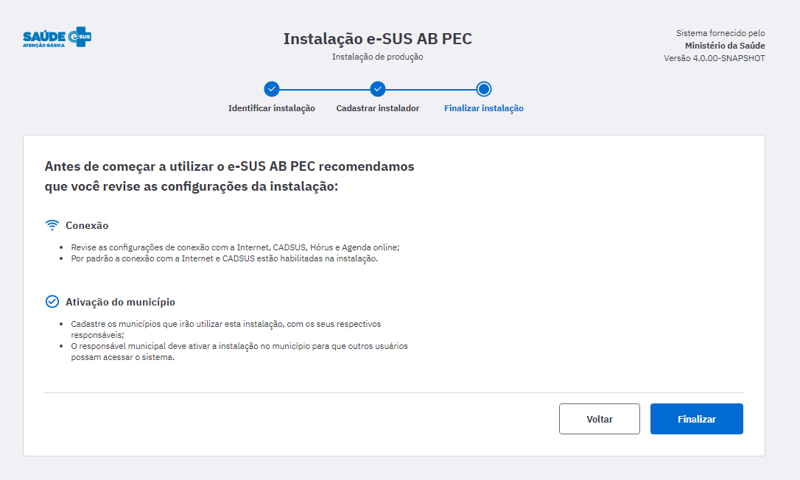

Fonte: SAPS/MS.

## 2.6.4 Wizard de Configuração do município.

Ao concluir a primeira etapa de configuração do sistema, o responsável deverá indicar quais os municípios e responsáveis que utilizaram a mesma instalação.

A partir da versão 4.0 do e-SUS APS PEC, a instalação poderá ser configurada para ser utilizada por mais de um município. Para adicionar outros municípios é necessário incluir um responsável municipal, que deverá ativar a instalação do seu município.

Os municípios ativos na instalação compartilham apenas os dados de cadastro e prontuário de cidadão que foram cadastrados na instalação ou que foram enviados para ela.

Figura 2.3 - Tela de indicação do município e responsável.

Após registrar o responsável do município, é necessário ativar o sistema com uma chave para usá- lo em produção.

Para tal, o responsável pela instalação, cadastrado conforme instruções da Seção 2.4.

- passo 1: Informar contra chave gerada pelo SISAB;

Figura 2.2 - Detalhe da tela de instalação de ativação do sistema.

- passo 2: configuração do horário- padrão da UBS. Esta etapa é opcional, podendo ser configurada posteriormente.

Figura 2.2 - Detalhe da tela de configuração do horário de funcionamento.

- passo 3: o administrador da instalação deve importar o XML/CNES do município, disponível no portal [[http://cnes.datasus.gov.br/]](http://cnes.datasus.gov.br/), para inserir os profissionais e unidades básicas na aplicação;

Fonte: SAPS/MS.

CAPÍTULO 3 - Administração e Configurações do Sistema
======================================================

A administração do sistema, **acessada na tela inicial,** subdivide- se em "Administração da Instalação" e "Administração Municipal", visto que agora o PEC possui apenas um administrador da instalação. E. Este agrega todos os tipos de instalação conhecidos anteriormente (municipal, centralizadora e multimunicipal). Assim, será sempre possível configurar o PEC para mais de um município.

O primeiro módulo agrupa as funções de CNES, Configurações da Instalação, Profissionais, Relatórios e Transmissão de dados. O segundo disponibiliza as funções de Auditoria, CBO, CNES, Gestão municipal, Importar cidadão, Perfis, Profissionais, Transmissão de dados e Unidades de saúde.

Figura 3.1.1 - Tela do módulo "Administração da Instalação" acessado com o perfil de administrador da instalação

Fonte: SAPS/MS.

Figura 3.1.2 - Tela do módulo "Administração municipal" acessado com o perfil de administrador municipal

Fonte: SAPS/MS.

>  **NOTA**: caso o usuário acesse esse módulo com perfil diferente de administrador da instalação ou de Administrador municipal terá um conjunto de funcionalidades restritas ao seu perfil.

Após a instalação do sistema, é necessário fazer sua configuração para, então, começar a utilizá- lo. Seguem abaixo as etapas a serem seguidas para o uso do PEC. É importante seguir a ordem dessas orientações, uma vez que algumas etapas dependem de outras anteriores. Os passos a seguir, conforme o Quadro 3.1, constituem um fluxo lógico para manusear o Sistema com PEC.

>  **DICA**: o sistema vem pré- configurado com opções padronizadas, a partir de características gerais do processo de trabalho na atenção básica, portanto, é importante verificar as configurações pré- definidas e sempre que necessário adequá- las à realidade local.

Quadro 3.1 - Passo a passo de configuração inicial do Sistema com PEC

|**Passos**|**Descrição**|**Perfil- Padrão**|**Função**|
|- |- |- |- |
|Passo 1|configurar sistema (envio de dados e horário de funcionamento da UBS)| administrador da instalação| |
|Passo 2|definir o(s) administrador(es) do(s) município(s)|administrador da instalação ||
|Passo 3|definir o tempo de consulta de cada categoria profissional por CBO, quando necessário|Administrador municipal|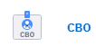|
|Passo 5|criar/redefinir perfis e personalizar recursos de cada perfil, quando necessário|Administrador municipal ou Coordenador ||
|Passo 6|verificar configuração dos profissionais importados do CNES (identificação, lotação, perfil)|Administrador municipal ou Coordenador| |
|Passo 7|verificar a agenda dos profissionais de saúde|Coordenador||

Fonte: SAPS/MS.

>  **ATENÇÃO**: profissionais que tem mais de uma lotação (vínculo) na unidade de saúde deverão ter sua agenda criada manualmente.

Na sequência, serão apresentadas as funcionalidades do módulo "Configurações da instalação" com vistas a contemplar os passos de configuração do sistema. E, ao final, serão apresentadas as funcionalidades para a transmissão, importação e exportação de dados do sistema.

# 3.1 Configurações da instalação

## 3.1.1 Conexão

Na aba "Conexão", o administrador pode verificar se a instalação está conectada à internet e apta a utilizar as funcionalidades que dependem desta conexão. Além disso, pode também desabilitar ou habilitar essa conexão clicando no botão .

Para realizar um teste de conexão, clique no botão "Testar conexão com a internet". Caso haja conexão com a internet, o sistema exibirá a mensagem "Conexão bem sucedida", conforme vemos na Figura 3.3.

Observação: quando o sistema estiver sem conexão, as funcionalidades que dependem de internet serão desabilitadas automaticamente.

Figura 3.3 - Botão "Testar conexão com a internet"

Fonte: SAPS/MS.

### 3.1.1.1 CADSUS

Conforme descrito na seção 4.1.2, o sistema poderá utilizar o barramento do CADSUS para consultar os cadastros do cidadão ou verificar por atualizações no cadastro, caso tenha uma conexão com a internet.

Na opção "CADSUS", o administrador da instalação poderá habilitar ou desabilitar o serviço CADSUS, quando houver instabilidade temporária de conexão ou quando houver algum tipo de instabilidade no próprio serviço do CADSUS.

Para desabilitar a conexão com o serviço do CADSUS, conforme a Figura 3.9, siga os passos abaixo:

1\. No combo box "Desabilitar durante", selecione uma das opções:

- 30 minutos, 1 hora, 2 horas, 4 horas, 8 horas, 1 semana ou 1  mês.

2\. Clique no botão "Desabilitar" para concluir.

Para habilitar a conexão com o CADSUS, após indisponibilidade temporária, clique no botão "Habilitar", conforme a Figura 3.5.

Figura 3.1.4

Fonte: SAPS/MS

Figura 3.1.5

Fonte: SAPS/MS

### 3.1.1.2 Hórus

Por meio dessa funcionalidade, a partir da versão 2.1, é possível ativar a integração com o Sistema Hórus. Para habilitar o recurso, a instalação precisa estar conectada à internet.

Na opção "Hórus", o administrador da instalação poderá habilitar ou desabilitar o serviço Hórus, quando houver necessidade.

Figura 3.1.6

Fonte: SAPS/MS

Figura 3.1.7

Fonte: SAPS/MS

Para desabilitar a conexão com o serviço do Hórus, conforme a Figura 3.6, siga os passos abaixo:

1\. No combo box "Desabilitar durante", selecione uma das opções:

- 30 minutos, 1 hora, 2 horas, 4 horas, 8 horas ou "Tempo  indeterminado".

2\. Clique no botão "Desabilitar" para concluir.

### 3.1.1.3 Agenda Online

Esta funcionalidade permite, a partir da versão 3.0, que o administrador do sistema habilite ou desabilite a sincronização dos dados da Agenda das Unidades de Saúde realizados por meio da instalação local com PEC, no município, com o Servidor de Agendamento Online do e-SUS APS disponibilizado no DATASUS.

>  **ATENÇÃO**: é preciso ter conectividade **com a internet** para que este serviço funcione.

Para habilitar a sincronização, acesse a funcionalidade de Agenda Online nas opções de configuração do sistema, conforme pode ser visto na Figura 3.1.8.

Figura 3.1.8 - Tela para habilitar a Agenda Online

Para habilitar a sincronização com o Servidor de Agenda Online do e-SUS AB é necessário gerar a contrachave, seguindo o mesmo fluxo de ativação da instalação, como mostra a Seção 2.4.4, porém selecionando a opção de "Agendamento" .

>  **NOTA**: para habilitar este serviço é necessário acessar o Portal do e- Gestor AB para gerar a contrachave. Se preferir, é possível receber mais orientação de como gerar a contra- chave ligando para o Disque Saúde através do telefone 136, opção 8. Consulte a **Seção 2.4** para mais informações.

O usuário do sistema ainda pode acessar a ajuda de contexto  para obter mais informações sobre a ativação e configuração da agenda online.

Ao ativar a Agenda Online o sistema irá sincronizar as informações de agendamento existentes no PEC com o Servidor de Agenda Online do e-SUS AB no DATASUS, permitindo que o cidadão receba notificações por meio do aplicativo "ConecteSUS", disponibilizado pelo DATASUS, tanto de confirmação quanto de cancelamento de agendamentos realizados via PEC.

Para desabilitar a sincronização com o Servidor de Agenda Online basta clicar no botão "Desabilitar".

## 3.1.2 Segurança

Na aba "Segurança", o administrador poderá configurar itens para a segurança do sistema, tais como:

- Período para a redefinição da senha dos profissionais que acessam o PEC;

- Tempo limite para encerramento da sessão por inatividade do sistema;

- O número máximo de tentativas consecutivas de login com autenticação inválida; e

- Solicitação manual para redefinição das senhas de todos os usuários do sistema.

Figura 3.1.9. - Tela de configuração de opções de segurança

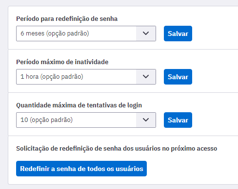

Fonte: SAPS/MS.

Para configurar um período de redefinição de senha, siga os passos abaixo:

1\. No combo box "Período para redefinição de senha", conforme a figura acima, selecione uma das opções:

- 1 Mês, 2 Meses, 3 Meses, 4 Meses, 5 Meses ou 6 Meses.

2\. Para concluir, clique em "Salvar".

Para configurar o período máximo de inatividade do sistema , siga os passos abaixo:

1\. No combo box "Período máximo de inatividade", conforme figura acima, selecione uma das opções:

- 30 minutos, 1 hora, 2 hora, 3 hora ou 4 hora.

2\. Para concluir, clique em "Salvar".

Para configurar o número máximo de tentativas consecutivas de acesso do usuário ao sistema com autenticação inválida, siga os passos abaixo:

1\. No combo box "Máximo de tentativas consecutivas de login com autenticação inválida", conforme figura acima, selecione uma das opções:

- 1 Tentativa, 2 Tentativas, 3 Tentativas, 4 Tentativas, 5 Tentativas, 6 Tentativas, 7 Tentativas, 8 Tentativas, 9 Tentativas ou 10 Tentativas.

2\. Para concluir, clique em "Salvar".

Em condições excepcionais, é possível solicitar a redefinição de senhas de todos os profissionais manualmente . Isto solicitará aos profissionais (usuários do sistema) que redefinam suas senhas no primeiro acesso após a solicitação.

## 3.1.3 Servidores

Esta funcionalidade permite que o administrador da instalação configure o servidor da sua instalação e um servidor SMTP para disponibilizar a opção de \"Esqueci minha senha\" na tela de login. Esta opção permite que os profissionais redefinam suas senhas via e- mail.

Para configurar o servidor da instalação e-SUS APS PEC, siga os passos abaixo:

1\. No campo "Nome da instalação", informe um nome para o servidor PEC;

2\. No campo "Link da instalação", informe o endereço ou IP de acesso do servidor PEC que está disponível para acesso via internet. Se a porta não for informada no link, o sistema utilizará a porta padrão (80); e

3\. Clique em "Salvar" para concluir.

Para configurar o servidor SMTP para envio de e- mail, siga os passos abaixo:

1\. No campo "Endereço do servidor do e- mail (SMTP)", informe o endereço do servidor de e- mail da conta responsável pelo envio da mensagem de recuperação de senha. Informe também a porta utilizada para a comunicação;

2\. No campo "Login", informe o endereço de e- mail válido usado para acessar o servidor SMTP. Se desejar que esse e- mail seja reconhecido como o remetente da mensagem, marque a opção "Usar como e- mail remetente" ;

3\. No campo "Senha", informe a senha de acesso ao servidor. Caso não tenha optado por usar o mesmo e- mail de login para ser o remetente, informe um e- mail válido para esse fim no campo "E- mail remetente"; e

4\. Clique em "Habilitar" para concluir, se a conexão for "Bem sucedida". É possível desabilitar o serviço a qualquer momento por meio do botão "Desabilitar".

## 3.1.4 Municípios e Responsáveis

A partir da versão 4.0 do e-SUS APS PEC, a instalação poderá ser configurada para ser utilizada por mais de um município. Para adicionar outros municípios é necessário incluir um responsável municipal, que deverá ativar a instalação do seu município.

Os municípios ativos na instalação compartilham apenas os dados de cadastro e prontuário de cidadão que foram cadastrados na instalação ou que foram enviados para ela.

Para adicionar responsáveis municipais (administradores municipais), selecione o município e um profissional da base local, conforme a Figura 3.0:

Figura 3.0 - Lista de responsáveis municipais

Fonte: SAPS/MS.

Para concluir, clique em "Salvar". O perfil de administrador municipal será listado no acesso do responsável municipal recém adicionado.

>  **NOTA**: só é possível habilitar um responsável municipal para cada município, sendo que esse usuário receberá o perfil de administrador municipal no PEC.

### 3.1.5 Configurações avançadas

Na aba "Configurações avançadas", é possível alterar o número de requisições simultâneas que podem ser processadas pelo sistema, conforme figura 4.1. Essa opção é utilizada para gerenciar a performance do sistema em casos peculiares.

Figura 3.1 - Performance - Número de requisições simultâneas processadas

Fonte: SAPS/MS.

A alteração do Número de requisições pode prejudicar o desempenho do sistema, entre em contato com o suporte do e-SUS APS para mais informações acessando o Portal de Suporte por meio do link: [http://esusaps.bridge.ufsc.br](http://esusaps.bridge.ufsc.br/pt-BR/support/home).

No combo box "Desabilitar durante", selecione uma das opções:

30 minutos, 1 hora, 2 horas, 4 horas, 8 horas ou "Tempo indeterminado".

Clique no botão "Desabilitar" para concluir.

Horário de funcionamento das UBS, bem como os dias de funcionamento na semana.

- Horário padrão da agenda do profissional, usado para pré-configurar a agenda do profissional a partir da sua importação pelo XML do CNES.

- Tempo padrão de duração do atendimento, utilizado para determinar os horários de atendimentos disponíveis para a agenda dos profissionais.

Figura 3.2 - Tela de configuração dos Horários

Fonte: SAPS/MS.

No bloco "Horário padrão da agenda do profissional" são definidas as informações padrões para pré-configuração da agenda dos profissionais. Deve ser informado os períodos de atendimento, preenchendo horário inicial e final de cada período, na sequência deve ser informado o "Tempo padrão de duração dos atendimentos". Esta informação trata- se da média da duração das consultas dos profissionais e servirá de base para a organização das agendas. Veja a seção 3.2 para outras opções de tempo de duração por CBO.

Figura 3.3 - Tela de configuração de horários- padrão de atendimento

Fonte: SAPS/MS.

>  **NOTA**: os turnos matutino, vespertino e noturno, e em casos excepcionais de madrugada, devem ser configurados dentro de cada período, conforme a necessidade local.

>  **DICA**: as configurações de horário padrão serão utilizadas no sistema para pré- configurar a agenda dos profissionais, portanto busque definir aqui o que é mais frequente.

Após efetuar as alterações necessárias clique no botão Salvar para confirmar as alterações.

# 3.2 CBO

O módulo CBO é utilizado para controlar, por meio do código da Classificação Brasileira de Ocupações (CBO), o tipo de **profissional que poderá ser lotado em uma unidade** e o **tempo de atendimento** de cada um, quando for o caso.

Esta configuração já vem pré definida com uma configuração- padrão, no entanto pode ser alterada conforme a necessidade do município.

Para ter acesso à lista de CBOs e suas configurações, basta acessar o módulo "Administração" e clicar em "CBO". Será apresentada a lista dos códigos da CBO disponíveis e o *status* de cada categoria, conforme a Figura 3.4.

Use as opções de filtro para localizar o CBO desejado. As opções para filtro são "Nome da CBO" ou pelos campos Código da CBO e Disponível para Lotação no botão de filtro . Digite ou selecione a opção desejada e clique no botão "Pesquisar";

Figura 3.4 - Lista de CBOs

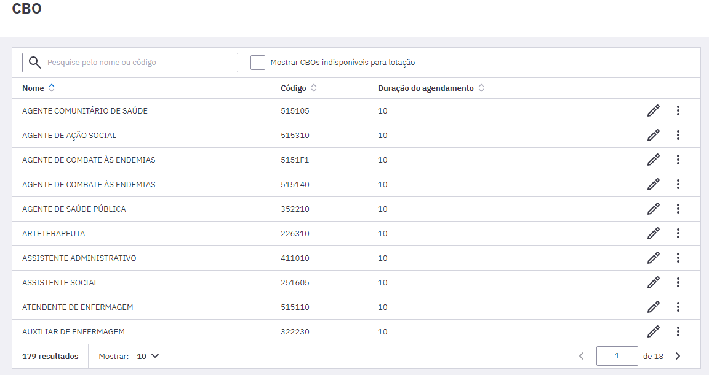

Fonte: SAPS/MS.

## 3.2.1 Editar CBO

Para editar o algum CBO, siga os passos:

1.clique no ícone "Editar"  do CBO desejado para alterar o tempo de agendamento de uma consulta para outra;

2.Clique em "Mais opções"  e marque o campo "**Indisponível para lotação**" se o município não possui aquele CBO para lotação dos profissionais.

3.Também é possível disponibilizar um CBO previamente indisponível. Para isso, marque a opção "Mostrar CBOs indisponíveis para lotação", Clique em "Mais opções"  e "Disponibilizar para lotação";

4.clique no botão "Salvar"  para concluir.

# 3.3 CNES

Esta funcionalidade permite importar os dados do Sistema de Cadastro Nacional de Estabelecimentos de Saúde (SCNES), por meio do arquivo XML, disponibilizado na área do gestor no site do CNES [http:// cnes2.datasus.gov.br/](http://cnes2.datasus.gov.br/). Tanto o administrador da instalação (administrador da instalação) quanto o administrador municipal podem importar o arquivo CNES no sistema.

>  **ATENÇÃO**: toda vez que houver uma atualização dos dados no CNES, deve- se gerar um novo arquivo para importação no e-SUS APS.

Para fazer download do arquivo do CNES, siga os passos:

1\. acesse o site [http://cnes2.datasus.gov.br/](http://cnes2.datasus.gov.br/);

2\. No item do menu "**Serviços"**, vá até "Gestores" e, após, clique em "Recebimento Arquivos (Download)";

3\. Agora, acesse o sistema do CNES com suas respectivas informações;

4\. Clique no nome do arquivo "XMLPARAESUS_XXXXXX.ZIP", onde XXXXXX corresponde ao número do IBGE do município, e escolha um local para salvá- lo.

Após carregar (*download*) o arquivo XML gerado CNESNet, é possível importá- lo por meio dos seguintes passos:

1\. na tela "Administração", clique na opção "CNES";

2\. será apresentada a tela "Importação de CNES", conforme a Figura 3.5;

3\. clique no botão "Clique para importar ou arraste os arquivos" e localize o arquivo XML gerado pelo CNESNet, ou arraste o arquivo para essa área. Para o administrador da instalação, é necessário selecionar o município antes;

4\. em seguida, clique no botão \"abrir\" e aguarde até que todos os dados sejam importados;

5\. Ao concluir a importação, a mensagem de \"Importação Concluída\" será exibida no sistema. Basta clicar OK para finalizar.

Ao carregar os dados do arquivo XML do CNESNet no Sistema e-SUS APS, todas as informações de profissionais, unidades e equipes serão salvas no sistema. Com a importação do arquivo concluída, o sistema disponibiliza, por meio da opção "Histórico de Importações", um relatório sintético sobre os itens importados, similar à Figura 3.6, para cada importação feita no sistema. O relatório pode ser acessado clicando no botão  "Visualizar", correspondente à data da importação, como podemos ver na Figura 3.5.

Figura 3.5 - Tela de importação do CNES

Fonte: SAPS/MS.

Figura 3.6 - Modelo do relatório de profissionais com mais de uma lotação que não tiveram agenda configurada.

Fonte: SAPS/MS.

O relatório de importação traz dados importantes sobre a consistência dos cadastros realizados no CNES em relação aos dados necessários para um bom funcionamento no sistema, portanto, é altamente recomendado que seja analisado antes de prosseguir.

Figura 3.7 - Modelo do relatório de registros não importados.

Fonte: SAPS/MS.

Figura 3.8 - Modelo do relatório registros importados.

Fonte: SAPS/MS.

# 3.4 Unidades de Saúde

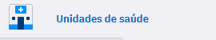

Os dados sobre os estabelecimentos (unidades de saúde) usados pelo sistema, como vimos na seção 3.2, são importados do Sistema CNES, via XML, portanto todos os estabelecimentos devem estar devidamente cadastrados e atualizados no Sistema CNES do seu município e enviados para a base nacional.

Para ter acesso à lista das unidade, conforme a Figura 3.9, basta acessar o módulo "Administração" e clicar em "Unidades de Saúde".

Figura 3.9 - Lista de unidades de saúde

Fonte: SAPS/MS.

>  **ATENÇÃO**: todos os dados das unidades de saúde utilizadas pelo Sistema e-SUS APS são provenientes do CNES, portanto é importante sempre manter as informações atualizadas no CNES, a fim de evitar erros de validação das informações enviadas ao SISAB.

## 3.4.1 Visualizar Tipos de Serviço

Todas as informações principais da unidade de saúde vem do cadastro do CNES e, portanto, não podem ser alteradas no Sistema e-SUS APS. Porém, para um bom funcionamento das funções do sistema em relação ao fluxo de serviço da unidade, é necessário editar os tipos de serviço no módulo "Gestão municipal" (seção 3.11.4), no acesso de administrador municipal, para indicar quais são os tipos de serviços realizados nas UBS do município. Siga os passos indicados, conforme a Figura 4.10, para editar os tipos de serviço:

1.clique na opção "Visualizar"  da unidade de saúde desejada;

2.as informações da unidade de saúde serão previamente carregadas para edição, porém os blocos de informações provenientes do CNES não poderão ser alterados. Para realizar atualizações no cadastro da unidade, atualize os dados no SCNES do seu município e gere novamente o XML para importação (conforme seção 3.2);

3.Clique em "Tipos de serviço" para visualizar os tipos de serviço disponíveis.

Os tipos de serviços, ver Seção 6.1, ajudam os profissionais de saúde a orientar o fluxo de encaminhamento interno dentro de sua unidade de saúde.

Figura 3.10 - Visualizar os tipos de serviços das unidades de saúde

Fonte: SAPS/MS.

## 3.4.2 Equipes

Da mesma forma que os dados das unidades de saúde, os dados das equipes são importados por meio do arquivo do Sistema CNES, onde estão disponíveis o código do Identificador Nacional de Equipe (INE) da equipe e o número da área sob responsabilidade da equipe.

Para visualizar as informações das equipes:

1.clique na opção "Equipe"  da unidade de saúde desejada;

2.será apresentada a lista das equipes cadastradas no CNES para a unidade de saúde escolhida, apresentando o tipo de equipe, o número do INE, o código da área/equipe, nome da equipe e se está ativa no SCNES (Figura 3.21);

3.para acessar mais detalhes sobre as equipes, clique na opção "Visualizar"  da equipe desejada.

Figura 3.11 - Visualizar dados das equipes (INE/área)

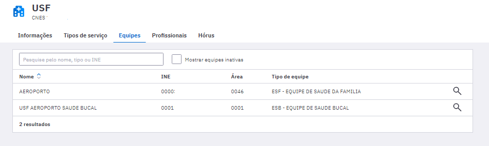

Fonte: SAPS/MS.

>  **DICA**: mantenha as informações de Área e Equipe (INE) responsável pelo território corretamente vinculadas e atualizadas no CNES, pois estas informações são utilizadas nos relatórios do sistema e também auxiliam no processamento e controle de acesso quando a equipe (INE) responsável pela área for alterada.

# 3.5 Profissionais (Usuários do Sistema)

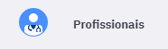

O módulo "Profissionais" está disponível para os perfis de administrador da instalação e administrador municipal e concentra uma série de funcionalidade importantes para o bom funcionamento do sistema. Por meio dele, será possível:

- gerenciar os profissionais/usuários do sistema;

- gerenciar as lotações de cada profissional nas unidades de saúde;

- gerenciar a agenda dos profissionais (como coordenador);

- gerenciar as permissões de acesso.

Para ter acesso à lista de profissionais, basta acessar o sistema com o perfil de administrador da instalação ou de administrador municipal e clicar em "Profissionais". Será apresentada a lista dos profissionais importados via XML do CNES, ou excepcionalmente cadastrados na aplicação, conforme a Figura 3.12.

Figura 3.12 - Lista de profissionais do sistema

Fonte: SAPS/MS.

## 3.5.1 Cadastrar Profissional/Usuário do Sistema

A lista de usuários do sistema é controlada pela lista de profissionais do sistema. Ou seja, todos os profissionais ativos têm acesso ao sistema usando o CPF de seu cadastro e senha pessoal.

>  **DICA**: **evite utilizar esta funcionalidade** **para cadastrar profissionais de saúde** que realizam atendimentos e ações de saúde por meio do sistema. pois ao enviar os dados para o SISAB esses registros de atendimentos podem não ser validados pelo CNES, ou seja, serão rejeitados pelo SISAB caso o cadastro do profissional não seja atualizado antes do fechamento da competência.

Para cadastrar um profissional/usuário do sistema, siga os passos:

1\. clique no botão "Cadastrar profissional";

2\. preencha o formulário com as informações do profissional, conforme a Figura 3.13, e clique em "Salvar".

Figura 3.13 - Cadastrar profissional/usuário do sistema

Fonte: SAPS/MS.

O bloco **Endereço Residencial** utiliza a base de endereços da Empresa Brasileira de Correios e Telégrafos. Ao incluir um **CEP**, o sistema automaticamente preenche os campos Estado, municípios, bairro e logradouro. Caso o bairro ou logradouro não esteja disponível na base dos Correios, é possível editar esses campos manualmente.

## 3.5.2 Desbloquear ou Redefinir Senha do Usuário

Como observado no tópico 3.1.2, quando o número de tentativas de *login* realizadas pelo usuário do sistema atingir a quantidade configurada o acesso deste profissional será bloqueado, como mostra a imagem abaixo.

Figura 3.14 - Aviso de bloqueio de acesso por tentativas sem sucesso.

Fonte: SAPS/MS.

Quando houver profissionais com acesso bloqueado por tentativa de login sem sucesso, estes serão apresentados na cor vermelha na lista de profissionais no módulo de administração como mostra a imagem a seguir.

Figura 3.15 - Apresentação de profissionais com bloqueio de acesso por tentativas sem sucesso.

Fonte: SAPS/MS.

O **desbloqueio de senha** deverá ser realizado pelo administrador da instalação ou pelo administrador municipal ou pelo gerente da UBS clicando em "Mais opções"  e "Desbloquear e redefinir senha". Após esta ação, será solicitada a confirmação da ação como a imagem abaixo:

Figura 3.16 - Tela de confirmação de desbloqueio e redefinição de senha.

Caso seja necessário **redefinir** a senha de um usuário, conforme vimos na Seção 1.3.2, esta ação poderá ser realizada usando a opção \"Redefinir Senha\".

Para redefinir a senha de um usuário, siga os passos:

1\. conforme vimos na Figura 4.15, localize o profissional o qual necessita redefinir a senha, caso necessário, utilize a opção de filtro logo acima da listagem para encontrar o profissional a qual se deseja redefinir a senha;

2\. clique em "Mais opções"  e em \"Redefinir Senha\", o sistema solicitará confirmação;

3\. a senha será redefinida para o número do CNS do profissional mais a palavra "esus", clique no botão "Redefinir senha" para concluir. Exemplo: "267207490990000esus".

>  **DICA**: evite utilizar esta funcionalidade sem que o profissional solicite, pois isso poderá gerar insegurança no uso do sistema pelos profissionais.

## 3.5.3 Lotar um Profissional

Assim como a lista de profissionais, as lotações também são importadas por meio do XML gerado pelo CNES, no entanto é possível alterar os dados, caso seja necessário.

>  **ATENÇÃO**: todas as informações desatualizadas ou com inconsistência em relação ao CNES não serão validadas, portanto evite criar ou alterar lotação do profissional manualmente, prefira fazê-lo, sempre que possível, pelo CNES. As lotações criadas manualmente não são alteradas nem desativadas automaticamente com a importação do XML, é necessário selecionar a opção "Atualizar perfis ao importar CNES" ao cadastrar a lotação.

Para acessar a lotação de um profissional, basta clicar na opção "Visualizar"  do profissional desejado. Será apresentada a lista das lotações previamente cadastradas do profissional escolhido no final da página, conforme a Figura 3.17.

Figura 3.17 - Lotações do profissional

Fonte: SAPS/MS.

Para **adicionar** uma lotação, clique no botão "Cadastrar lotação" e siga os passos:

1\. preencha o formulário com as informações gerais da lotação do profissional, como Unidade de saúde, o número do INE, se houver, e CBO (Figura 4.18);

2\. Selecione a opção "Atualizar perfis ao importar CNES" caso deseje que a importação do arquivo XML desative ou altere a lotação;

3\. selecione o(s) "Perfil(is)" do profissional (coordenador, médico, recepcionista etc.);

4\. para excluir as informações, clique no ícone  "Excluir". O registro de perfil será removido;

5\. após o preenchimento dos dados, clique no botão "Salvar" e, caso haja alguma inconsistência, o sistema mostrará mensagem na tela indicando os campos que deverão ser corrigidos.

Figura 3.18 - Cadastrar lotação do profissional

Fonte: SAPS/MS.

Para **editar** uma lotação, na lista de lotações (Figura 3.17), clique na opção "Editar"  da lotação desejada. Serão apresentadas as informações da lotação, edite- as conforme necessário, e clique no botão "Salvar".

Para **excluir** uma lotação, clique em "Mais opções"  e "Excluir" da lotação desejada. Será solicitada a confirmação desta exclusão.

## 3.5.4 Perfil de Acesso dos Profissionais

Como vimos na Figura 3.18, ao adicionar a lotação de um profissional, também é definido o seu perfil de acesso, por meio da opção "Perfis".

>  **NOTA**: o sistema já define o perfil de acesso dos profissionais de saúde com perfis- padrão, estes perfis são definidos com base no CBO importado do cadastro do CNES, no entanto todos os perfis e/ou recursos podem ser alterados conforme a necessidade local.

Para definir o perfil de acesso do profissional para determinada lotação, basta seguir os passos:

1\. acesse a lotação desejada por meio da opção \"Editar\" ou \"Cadastrar lotação\", caso ela ainda não exista;

2\. na opção \"Perfis\", selecione o(s) perfil(is) desejado(s), de acordo com a necessidade local.

3\. por fim, clique em "Salvar" para concluir.

## 3.5.5 Definir Agenda dos Profissionais

Para definir a agenda de trabalho um profissional da unidade de saúde, basta acessar a lista de profissionais e em seguida a lotação do profissional. [**Esta etapa é fundamental para realizar o agendamento dos cidadãos para as consultas**.]

>  **NOTA**: a agenda do profissional de saúde **que possuir apenas uma lotação** é definida por padrão pelo sistema, por meio do horário- padrão definido no sistema, caso seja necessário ajustar, clique em "Mais opções"  e "Editar configuração de agenda".

>  **NOTA**: somente o perfil de coordenador, ou seja, o Coordenador da UBS, poderá alterar ou definir a agenda dos profissionais de saúde que realizam atendimento.

Para ativar a agenda de um profissional, siga os passos:

1\. localize na lista de lotações a que terá a agenda ativada;

2\. clique em "Mais opções"  e "Criar configuração de agenda";

3\. preencha o horário inicial e final de cada período, para cada dia da semana desejado, conforme a necessidade, ou clique na opção "horário- padrão" para que o sistema preencha automaticamente a agenda com o horário padrão de agendamento configurado na instalação. Ao selecionar a caixa "Mostrar fim de semana", serão mostrados o sábado e o domingo;

4\. Após a definição dos horários da agenda, clique em "salvar".

Figura 3.19 - Definir a agenda do profissional

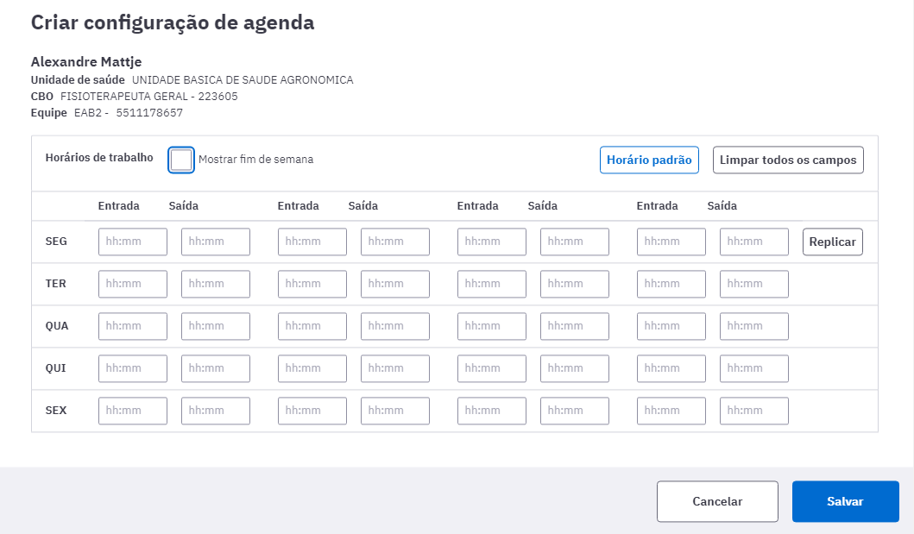

Fonte: SAPS/MS.

## 3.5.6 Fechamento de Agenda do Profissional

Para definir data na qual a agenda do profissional estará fechada, o usuário, com perfil de coordenador, deverá seguir os passos:

1\. localize na lista de lotações a qual será adicionado um fechamento;

2\. clique em "Mais opções"  e "Visualizar fechamento de agenda";

3\. Preencha o formulário com a Data inicial e final do fechamento da agenda, bem como o motivo do fechamento que pode ser: atestado, curso, férias, licença, reunião ou outro (nesse caso, será necessário descrever o motivo no campo "Especifique");

4\. clique em "Adicionar" para concluir.

Figura 3.20 - Configuração de fechamentos da agenda

Fonte: SAPS/MS.

## 3.5.7 Configurações Agenda Online

O módulo de **Agendamento Online** foi desenvolvido conjuntamente entre o Departamento de Saúde da Família - DESF e o Departamento de Informática do SUS - DATASUS, a fim de facilitar o acesso dos cidadãos aos serviços de Atenção Primária à Saúde em todo o país. Dessa forma, foi realizado o desenvolvimento da ferramenta de Agenda Online no PEC e adequações no aplicativo "Conecte SUS Cidadão" para a efetivação desta funcionalidade.

Este módulo está disponível para as equipes de Atenção Primária que utilizam o PEC do e-SUS APS, a partir da versão 3.1, e foi pensando levando em consideração avanços tecnológicos e no aumento de acesso constante da população a aparelhos de *smartphones*, dessa forma tendo acesso a aplicações *mobile*.

O Agendamento Online consiste na disponibilização de horários da agenda dos profissionais da APS para esse tipo de agendamento, entendendo que esta não deve ser a forma principal ou preferencial de agendamento nas equipes, sendo assim, a equipe deve definir quais serão os horários disponíveis para esse tipo de agendamento, considerando os agendamentos para cuidado continuado e outros tipos de agendamento a serem realizados diretamente na Unidade de Saúde ou para consultas de retorno. Além disto permite o disparo de notificações "*push"* em com informações relacionadas ao agendamento realizado no PEC para o cidadão através do aplicativo "Conecte SUS Cidadão".

Para uso desta funcionalidade, é necessário que a UBS tenha boa conectividade com a internet, pois utiliza- se um servidor nacional para troca de informação entre a UBS e os cidadãos que utilizam o aplicativo "Conecte SUS".

Para que o cidadão tenha acesso a agenda da equipe para agendamento de uma consulta é necessário que esse cidadão possua um cadastro individual na equipe, somente os cidadãos cadastrados na equipe terão acesso a agendar um atendimento no aplicativo "Conecte SUS".

Para configurar o módulo de Agenda Online no PEC, com perfil de coordenação, acesse a lista de lotações do profissional, clique em "Mais opções"  e "Criar configuração de agenda online", após isso serão apresentados todos os horários do profissional disponíveis para agendamento. Nesta tela é possível selecionar horários para disponibilizar para agendamento online a ser realizado pelos cidadãos por meio do aplicativo "Conecte SUS" (Figura 3.21).

Figura 3.21 - Grade de horários disponíveis para agendamento

Para **habilitar** horários para o agendamento online pelos cidadãos, o profissional com perfil de coordenação deve selecionar os horários (Figura 3.21).

Para **desabilitar** horários para o agendamento online basta clicar novamente.

Clique em "Salvar" para concluir.

>  **ATENÇÃO**: Não é possível configurar o agendamento online para profissionais que são inseridos manualmente no PEC.

>  **NOTA**: A mudança de configuração da agenda pode ser realizada a qualquer momento, porém não altera os horários agendados previamente.

>  **DICA**: Antes de realizar a configuração da Agenda Online realize uma conversa prévia com toda a equipe, para pactuação de estratégia de abertura desse formato de agendamento, a disponibilização de horários pode ser gradual. Atente- se para informar a população sobre esse possibilidade de agendamento.

## 3.5.8 Outras Opções para um Profissional

Para **visualizar** um profissional, clique na opção "Visualizar" 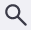 do profissional desejado. Serão apresentadas as informações do profissional escolhido (somente para visualização).

Para **editar** um profissional, clique em "Mais opções"  e "Editar" do profissional desejado. Serão apresentadas as informações do profissional previamente cadastradas em modo de edição. Altere- as caso necessário e clique no botão "Salvar".

Para **excluir** um profissional, clique em "Mais opções"  e "Excluir" do profissional desejado. Será apresentada uma mensagem solicitando a confirmação desta exclusão.

# 3.6 Perfis (de acesso)

Ao conjunto de definições para acesso aos recursos do sistema é dado o nome de "perfil", ou seja, ao associar um profissional a um perfil, especifica- se, em regra geral, o que determinado profissional pode ou não acessar dentro do sistema. Cada perfil está associado a um conjunto de recursos do sistema, que podem estar ativos ou inativos a depender das atividades desenvolvidas pelo profissional.

Para ter acesso à lista de perfis disponíveis no sistema, basta acessar o sistema com o perfil de administrador municipal e clicar em "Perfis". Será apresentada a lista de perfis definidos (padrão e personalizado) (Figura 3.22).

Figura 3.22 - Lista de perfis do sistema

Fonte: SAPS/MS.

## 3.6.1 Tipo de Perfil e tipo de acesso

O sistema agrupa o tipo de perfil por algumas categorias, de tal forma que, não é possível que um mesmo profissional misture funcionalidades em um mesmo tipo de acesso, separando funções administrativas ou de coordenação com funções de atendimento/consulta ao cidadão. Além disso, passa a definir explicitamente a categoria **Tipo de acesso**.

O tipo de acesso se divide em: **lotação**, **gestor municipal** e **gestor estadual**. Os tipos de acesso de gestor municipal e gestor estadual vinculam- se, respectivamente, aos perfis de gestor municipal e gestor estadual. Os demais perfis possuem lotação como tipo de acesso. Para atribuir o perfil de gestor municipal a um profissional, acesse o módulo de profissionais com o acesso de administrador municipal e clique em "Cadastrar acesso" no final da página. Outrossim, para atribuir o perfil de gestor estadual, faça o mesmo passo a passo acessando o sistema com o perfil de administrador da instalação.

O Quadro 3.2 apresenta os tipos de perfis disponível no sistema.

Quadro 3.2 - Tipo de perfil no sistema

| **Perfil** | **Descrição** |
|- |- |
|Administração|Perfil exclusivo para fins de administração do sistema e, em geral, usado por   técnicos de informática.|
|Coordenação|Perfil com recursos de administração e coordenação da unidade de saúde.|
|Atendimento|Perfil com recursos de atendimento ao cidadão e funções de cuidado da população.|
|Gestor Municipal/Estadual|Perfil com recursos limitados de acesso, porém que permitem ao gestor acompanhar as ações do seu município/Estado por meio de relatórios.|

Fonte: SAPS/MS.

## 3.6.2 Perfil Padrão

O sistema oferece um conjunto de perfis- padrão no sistema de tal forma que seja fácil e rápido iniciar o uso do sistema sem uma configuração mais refinada das necessidades dos profissionais de saúde em cada unidade de saúde.

A lista de perfis- padrão foram determinadas por meio da avaliação de boas práticas de uma equipe de Atenção Primária. No entanto, considerando a grande diversidade e especificidades regionais, não devem ser tomadas como regras, mas apenas como referências para um conjunto de recursos.

Em anexo a este manual, ANEXO I, apresentamos a lista de perfis- padrão do sistema e breve descrição de sua aplicação nas unidade de saúde, em funções gerenciais ou administrativas.

## 3.6.3 Perfil Personalizado

É possível editar os recursos dos perfis padrão. Na migração para novas versões que possuam alterações nos perfis padrão do sistema, os perfis padrão editados receberão os novos recursos definidos na nova versão, e não terão recursos removidos.

Para definir perfis de acesso diferente dos perfis padrão no sistema, é possível fazê-lo de duas formas:

- copiar; ou

- adicionar.

Para **copiar** um perfil, basta seguir os passos:

1\. clique em "Mais opções" , em seguida, clique na opção \"Perfis\";

2\. aparecerá uma lista de perfis, como na Figura 3.23 ;

3\. clique em "Mais opções" , em seguida, clique na opção \"Copiar\" na linha correspondente ao perfil que deseja copiar;

4\. no formulário, altere o \"Nome\" do perfil para poder identificá- lo mais tarde. Não é possível alterar o \"Tipo de acesso\";

Figura 3.23 - Cópia de perfil

5\. para concluir, clique em \"Salvar\".

De forma similar, para **adicionar** um novo perfil, basta seguir os passos:

1\. clique em "Mais opções" , em seguida, clique na opção \"Perfis\";

2\. aparecerá a tela com a lista de perfis, como na Figura 3.24;

3\. clique em \"Cadastrar perfil\".

4\. no formulário, crie um novo \"Nome\" para o perfil para poder identificá- lo mais tarde e defina o \"Tipo de acesso\" que deseja;

5\. para concluir, clique em \"Salvar\".

Figura 3.24 - Cadastro de perfil

## 3.6.4 Editando os Recursos de um Perfil

Após adicionar ou copiar um perfil, é necessário editar os recursos conforme a necessidade local. Os recursos dos perfis- padrão também poderão ser editados. Para tal, siga os passos:

1\. clique na opção "Editar"  do perfil desejado. Será exibida uma tela, conforme a Figura 4.25. Se for um perfil novo, os recursos estarão todos inativados . Na coluna dos \"Recursos\", será exibido o caminho de acordo com a navegação estrutural do sistema;

2\. para autorizar uma ação no recurso, clique no símbolo , que será alterado para ;

3\. para revogar a permissão de uma ação em um recurso, clique no ícone . O símbolo voltará ao seu padrão ;

4\. os recursos de nível acima do selecionado e que estejam na mesma hierarquia serão autorizados automaticamente. O símbolo será alterado para .

Figura 3.25 - Lista de recursos do perfil

Fonte: SAPS/MS.

## 3.6.5 Outras Opções do Perfil

Para **visualizar** um perfil, clique na opção "Visualizar"  do perfil desejado. Serão apresentadas as informações de identificação do perfil, apenas para leitura.

Para **editar** um perfil, clique em "Editar"  para o perfil desejado. Serão apresentadas as informações de identificação do perfil. Altere- as caso necessário e clique no botão "Salvar".

Para **excluir** um perfil, clique em "Mais opções"  e "Excluir" do perfil desejado. Será apresentada uma mensagem solicitando a confirmação desta exclusão.

>  **ATENÇÃO**: só é possível excluir um perfil que não esteja em uso no sistema, ou seja, sem nenhum usuário associado a ele.

Para **inativar** um perfil, clique em "Mais opções"  e "Inativar" do perfil desejado. Será apresentada uma mensagem solicitando a confirmação desta inativação.

# 3.7 Rotina de Transmissão, Sincronização e Processamento de Dados

Na estrutura preconizada pelo Sistema e-SUS APS, recomenda- se o compartilhamento hierárquico das informações, onde a base maior alimenta a base menor em um processo de recuperação de informação.

É recomendado que uma instalação de PEC ou centralizador municipal processe os dados do Sistema e-SUS APS com CDS ou com PEC a serem enviados ao SISAB, de modo a garantir a sincronização da rede local e, por conseguinte, a gestão municipal das informações geradas na AB.

## 3.7.1 Rotina de Sincronização da Rede Municipal

Considerando os cenários de implantação, a opção de base descentralizada pode atender os municípios. Entende- se por base descentralizada a organização da rede de Atenção Básica municipal com instalações CDS e/ou PEC em UBS, regionais de saúde/distritos de saúde.

Essa descentralização pressupõe uma estrutura de sincronização do sistema, entre a base local (UBS, regionais de saúde/distritos de saúde ou similares) e o PEC/centralizador municipal.

Independentemente do cenário de transmissão e da forma de envio - seja ela **via arquivo** (*off-line*) ou via internet (*on-line*), a sincronização das bases deve respeitar o fluxo de envio de informações ao SISAB (leia a Portaria que orienta os prazos para alimentação do SISAB referente ao ano corrente), ou seja, num período máximo de um mês entre a sincronia das bases.

## 3.7.2 Tipos de Registro: CAD, RAS e RAC

O Sistema e-SUS APS com PEC avança na perspectiva de eliminar os registros em fichas e formulários de papel. E com a oferta de ferramentas informatizadas adequadas ao processo de trabalho das equipes de APS. Os mesmos blocos que são consolidados no CDS são registrados individualmente no PEC.

Essa integração é estruturada para oferecer evolução gradual da capacidade de registro de informação, ao mesmo tempo em que deve atender ao SISAB. Neste contexto, o sistema possui diferentes documentos de troca de dados para atender às características particulares de cada sistema, gerando os seguintes documentos eletrônicos:

• **CAD:** gerado a partir dos dados de cadastro da APS, é um documento que permite compartilhar as informações de cadastro por cidadão, em especial para atender aos processos de importação de cadastros já consolidados em nível local, evitando- se, portanto, retrabalho;

• **RAS:** o Registro de Atendimento Simplificado é o conjunto essencial de informações gerado a partir dos eventos de saúde individualizados, que é transmitido para a base federal;

• **RAC:** o Registro de Atendimento Compartilhável, além das informações do RAS, agrega outras informações mais estruturadas, compondo a base de dados local do sistema com PEC, compatibilizando o sistema para o futuro compartilhamento de informações.

Portanto, os documentos RAS e RAC têm origem no bloco de informações de eventos de saúde individualizados.

## 3.7.3 Transmissão de Dados

O módulo "Transmissão de Dados" permite fazer o controle de envio e recebimento dos dados de uma aplicação. Conforme podemos ver na Figura 4.26, este módulo tem três funções básicas: configuração, envio e recebimento.

Figura 3.26 - Módulo "Transmissão de dados"

Fonte: SAPS/MS.

### 3.7.3.1 Configuração de Envio dados

É por meio desta funcionalidade que o administrador da instalação deve inserir o endereço eletrônico do servidor para onde enviará os dados de produção da equipe de saúde. Os dados coletados a partir do sistema devem ser enviados a um centralizador na Secretaria Municipal de Saúde ou na Secretaria Estadual de Saúde. Desse modo, esses órgãos poderão realizar a gestão dos serviços públicos de saúde em sua área de atuação, a partir de relatórios agregados. De acordo com a demanda da gestão municipal ou estadual, poderão ser incluídos outros endereços para envio dos dados. O endereço eletrônico do Ministério da Saúde já está previamente configurado em uma instalação de produção, para que o Governo Federal faça a gestão dos serviços públicos de saúde em todo o território nacional. Além do link do Ministério da Saúde, os links dos centralizadores estaduais estão configurados automaticamente nas instalações municipais para os estados que formalizaram a solicitação via ofício ao Ministério da Saúde.

Para incluir novo endereço eletrônico de envio de dados, o usuário deverá clicar em "Adicionar instalação", preencher os campos "Nome da instalação" e "Endereço do servidor" e clicar em "Adicionar", conforme a Figura 3.27.

Figura 3.27 - Configuração de envio dos dados

Fonte: SAPS/MS.

Para configurar o *link* de envio corretamente, siga os passos:

1\. informe o nome (apelido) de destino no campo "Nome da instalação", o qual refere- se ao nome do local para onde serão enviados os dados (exemplo: Centralizador do Estado, Centralizador do Município). Insira no campo "Endereço do servidor" o endereço eletrônico do computador que receberá os dados, ou seja, a máquina que possui um PEC Centralizador, municipal ou estadual (exemplo: [http://enderecoeletronico.municipio.gov.br:8080/esus](http://enderecoeletronico.municipio.gov.br:8080/esus)).

**Observação**: O endereço eletrônico, quando mantida a configuração nativa do sistema, deve conter a porta de conexão "8080";

2\. para testar a conexão com os servidores cadastrados, clique no botão "Testar conexão" para verificar a conectividade com os *links* cadastrados. Se o texto "Teste de conexão finalizado" for apresentado e o status da conexão mudar para "Estabelecida", então o link informado está correto e funcionando;

3\. para editar as informações de um receptor, clique no botão "Editar" ;

4\. para excluir um receptor, clique no botão "Excluir";

5\. para inativar o link de conexão com o servidor, clique em "Mais opções"  e "Inativar";

Vale contextualizar que, por padrão, toda instalação PEC realiza a transmissão automática para o Centralizador Nacional às 00:00 horas, porém o administrador da instalação pode alterar esse horário por meio da opção "Horário de geração de lotes e processamento de fichas". Na organização da transmissão na rede municipal de Atenção Básica de uma instalação CDS para PEC e/ou de um PEC para um ou mais centralizadores (regional distrital/municipal), será necessário inclusão do endereço eletrônico (*link*) para envio dos dados.

A transmissão, bem como a forma de envio via arquivo (*off-line*) ou via internet (*on-line*) de um Sistema com PEC ou centralizador municipal para o centralizador estadual, deve ser articulada entre Estados e municípios, onde o ente estadual fornecerá o endereço eletrônico (*link*) para inclusão dele na configuração de envio.

### 3.7.3.2 Envio

Esta funcionalidade permite ao administrador da instalação um melhor controle de envio das informações do sistema tanto para os *links* configurados como para envios manuais realizados por meio de arquivos, conforme podemos ver na Figura 3.27.

Figura 3.27 - Controle de envio dos dados

Fonte: SAPS/MS.

O envio dos dados é automático e está configurado para ocorrer entre 0h e 6h da manhã (por padrão), assim como no processamento. Para isso, o computador deve permanecer ligado e conectado à internet, sem suspender as atividades do sistema operacional. Caso a UBS não tenha conexão à internet, é possível fazer instalação *off-line* tanto do PEC como do CDS. No entanto, é necessário ter ao menos uma versão *on-line* no município - em um Sistema com PEC ou um centralizador municipal - para envio das informações ao SISAB.

Para enviar os dados manualmente, basta seguir os passos:

1\. acesse a aba "Envio", por meio do módulo "Transmissão de Dados";

2\. conforme vimos na Figura 3.36, clique no botão \"Gerar novo lote\";

3\. o sistema solicita confirmação e prepara todos os dados que ainda não foram enviados em um lote de envio. Clique em \"Gerar lotes\" para concluir;

4\. será incluído na lista novo item do lote de dados criado com os dados pendentes de envio;

5\. para salvar um arquivo com os dados gerados no lote, clique na opção \"Salvar em Arquivo\"  e salve o arquivo no local desejado;

As transmissões de dados ocorrerão ao longo do dia e obedecerão a um agendamento automático do servidor do MS com o objetivo de distribuir o fluxo e reduzir a concorrência no acesso e a transmissão de dados para outros servidores serão executadas conforme disponibilidade do servidor destino.

O centralizador nacional agendará um novo horário de envio quando o usuário não conseguir realizar o envio manual. Este horário será informado instantaneamente pelo PEC na mesma tela de transmissão.

Para visualizar os detalhes de um lote gerado manualmente ou pelo sistema, basta clicar na opção \"Visualizar\" . Será exibida uma tela, conforme a Figura 3.28, com informações adicionais de controle de envio ou geração do lote. Por meio da tela de visualização do lote de envio dos dados, também é possível marcar o lote para início do envio automático.

Figura 3.28 - Visualizar detalhes do lote de envio dos dados

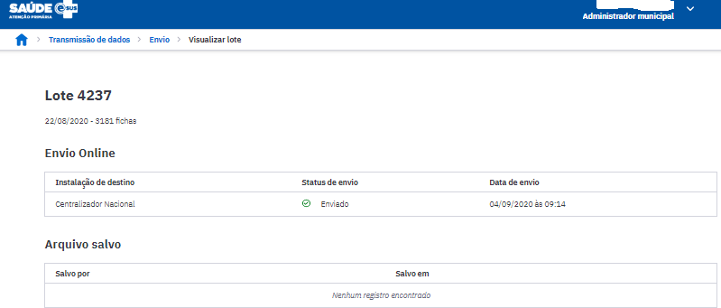

Fonte: SAPS/MS.

### 3.7.3.3 Recebimento

Esta funcionalidade subdivide- se em "Recebimento por lote" e "Recebimento por CNES" conforme podemos ver na Figura 3.29.

Figura 3.29 - Controle de recebimento dos dados

Fonte: SAPS/MS.

#### 3.7.3.3.1 Recebimento por lote

Esta funcionalidade permite ao administrador municipal melhor controle de recebimento de informações enviadas ao sistema, tanto envios *on-line* quanto envios *off-line* (por arquivo), conforme podemos ver na Figura 3.39.

Nesta situação, chamamos de registro um arquivo compactado que pode conter um ou mais atendimentos. O processamento dos registros acontece ao descompactar esse arquivo e acomodar as informações contidas neste registro no banco de dados do PEC.

Registros enviados para o sistema, seja de uma instalação CDS, seja de outra instalação PEC, ficam armazenados numa tabela, aguardando o período **entre 0h e 6h**, ou outro horário estabelecido pelo administrador da instalação, para realizar o **processamento automático** deles. Para isso, o computador deve permanecer ligado.

Para importar arquivos gerados em uma instalação CDS ou por uma instalação PEC, como vimos na seção anterior, basta clicar no botão \"Importar Arquivo\" e seguir os passos:

1\. ao clicar no botão \"Importar ou arraste os arquivos \";

2\. clique no botão "Selecionar arquivo" e selecione o arquivo gerado a partir do CDS, PEC ou outro sistema usando o modelo RAS. Ver Seção 3.6.2 para mais detalhes;

3\. o sistema exibirá uma mensagem de conclusão do processo;

4\. volte na tela de controle de recebimento para mais detalhes;

5\. o sistema exibirá novo lote de fichas recebidas no sistema;

6\. Para gerar o relatório, basta clicar no botão "Imprimir relatório de inconsistências" . Será gerado o relatório em formato CSV conforme a Figura 3.30.

O processamento dos registros também pode ser efetuado manualmente. Para processar os registros importados, clique na opção \"Processar todos\" para processar todos os lotes pendentes.

O relatório de inconsistência passa a ser visualizado por lote e permite ao administrador visualizar possíveis inconsistências nas informações importadas no sistema, por meio da opção "Importar Arquivo", como visto na seção anterior.

Figura 3.30 - Relatório de inconsistências

Fonte: SAPS/MS.

#### 3.7.3.3.2 Recebimento por CNES

Esta funcionalidade permite a consulta dos registros recebidos por estabelecimento por meio do código do CNES e por mês de recebimento.

Para visualizar os detalhes das fichas recebidas para um CNES, basta clicar na opção \"Visualizar\" . Será exibida uma tela, conforme a Figura 3.31. Nesta tela, é possível ver a quantidade de fichas recebidas separadas por tipo e quantidade.

Figura 3.31 - Visualizar detalhes do lote por CNES

Fonte: SAPS/MS.

#### 3.7.3.3.3 Relatório de Inconsistências

Esta funcionalidade permite a extração de relatórios de inconsistências das fichas enviadas e por lote. Para gerar o relatório, clique em "Gerar relatório de Inconsistências" que em seguida aparecerá a seguinte tela.

Para imprimir o relatório escolha o período de recebimento, e se necessário, o nome do responsável e o tipo de recebimento. O documento gerado é o mesmo apresentado na Figura 4.30.

## 3.7.4 Fluxo Recomendado na Transmissão de Dados

A seguir, apresentaremos os fluxos recomendados para transmissão de dados dentro do ambiente municipal até o SISAB (programado por padrão nas instalações PEC/centralizador) considerando cenários a partir de UBS não informatizada, UBS sem internet, UBS com internet e, também, da integração de municípios com sistemas próprios ao SISAB.

Conforme explicado anteriormente, a transmissão para o ambiente estadual pressupõe a articulação bipartite (entre Estado e municípios). Por esse motivo, o ambiente estadual ainda não é apresentado nos fluxos de transmissão a seguir.

### 3.7.4.1 UBS não Informatizada

Para o fluxo recomendado de uma UBS não informatizada, onde apenas a Secretaria Municipal de Saúde (SMS) tem computador e internet, a melhor opção é a implantação do sistema CDS. Nesse caso, a SMS deve definir um fluxo - semanal, quinzenal ou outro - de encaminhamento e digitação das fichas preenchidas na UBS pelos profissionais. Vale esclarecer que o uso das fichas do CDS não substitui o registro no prontuário de papel na UBS.

Figura 3.32 - Fluxo de transmissão de dados para UBS não informatizada

Fonte: SAPS/MS.

Essa digitação poderá ser feita por meio de instalação *off-line* do CDS (os dados deverão ser transmitidos, por arquivo ou internet, para um sistema com centralizador) ou *on-line* do PEC no módulo CDS.

### 3.7.4.2 UBS sem Internet

A UBS com, ao menos, um computador tem infraestrutura para que a digitação das fichas seja feita na própria unidade. Os dados digitados são enviados à SMS por arquivo ou por conexão eventual, por exemplo, modem discado ou 3G. Este cenário também se aplica às equipes de AB que tenham acesso à internet em locais fora da UBS, como em telecentro, lan house etc.

>  **DICA**: este cenário inicia o processo de descentralização da digitação das fichas da SMS para equipes de AB, permitindo o acompanhamento da digitação e qualidade das informações.

Figura 3.33 - Fluxo de transmissão de dados para UBS sem internet

Fonte: SAPS/MS.

### 3.7.4.3 UBS com Internet

Numa UBS com mais de um computador com conectividade parcial ou contínua, é possível utilizar o PEC com instalação *off-line,* por meio de um servidor local, e complementarmente usar as fichas CDS nos pontos da unidade onde ainda não há computador, no processo de trabalho domiciliar dos ACS e no atendimento odontológico.

Figura 3.34 - Fluxo de transmissão de dados para UBS com internet

Fonte: SAPS/MS.

>  **DICA**: é possível implantar alguns módulos do PEC, por exemplo: agenda na recepção e atendimento pelo médico e enfermeiro. Considerando que o custo de informatizar os demais ambientes de atendimento da UBS é relativamente baixo, este fluxo pode ser transitório.

### 3.7.4.4 Integração com Sistemas Próprios

Os municípios com sistema próprio de prontuário devem utilizar a tecnologia Thrift para que transmitam os dados cadastrais e clínicos (CAD+RAS) de seu sistema para uma instalação do tipo PEC ou centralizador municipal, que transmitirá os dados para o SISAB.

Figura 3.35 - Fluxo de transmissão de dados para integração de sistemas próprios com o SISAB

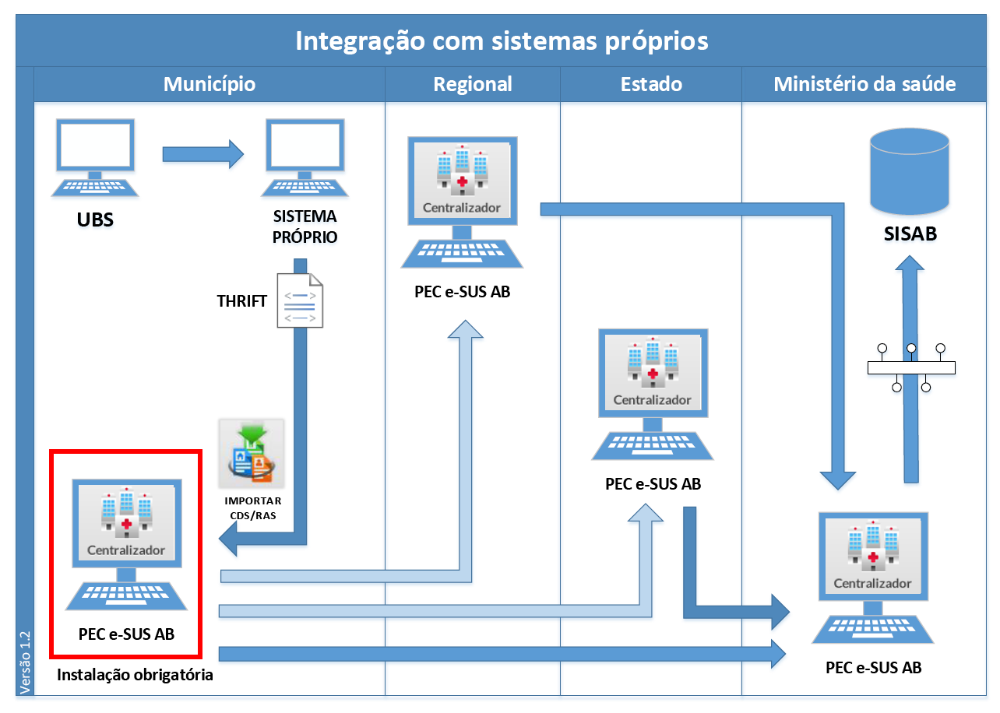

Fonte: SAPS/MS.

## 3.7.5 Sincronização com Aplicativos para Tablet

O processo de sincronização entre os aplicativos para *tablet* do Sistema e-SUS e Sistema com PEC é realizado de forma automática, no entanto são necessários alguns requisitos:

1)o servidor local do PEC e o *tablet* devem estar conectados por uma rede sem fio, para que o *tablet* possa acessar o servidor durante a sincronização;

2)o usuário/profissional que irá usar o *tablet* deve estar cadastrado no sistema (servidor local).

Outras regras adicionais a depender do aplicativo que está em uso:

- para Atenção Domiciliar: somente usuários lotados com INE de Equipe Multiprofissional de Apoio (Emap) ou Equipe Multiprofissional de Atenção Domiciliar (Emad) podem sincronizar com o aplicativo;

- para ACS: somente usuário com lotação de ACS pode sincronizar com o aplicativo.

## 3.7.6 Relatórios

O módulo Relatórios pode ser acessado pelo administrador da instalação. Por meio dessa funcionalidade é possível gerenciar a disponibilidade de recursos para a geração de relatórios no sistema, a fim de evitar sobrecarga na infraestrutura. O módulo subdivide- se em Configuração de impressão e Processamento.

### 3.7.6.1 Configuração de impressão

Para evitar que consultas muito grandes criem uma carga exagerada no servidor da aplicação, é possível configurar o fator que determinará quantos grupos de informação podem ser selecionados e qual período pode ser filtrado em cada relatório, conforme a figura 3.36..

Figura 3.35 - Controle de impressão

Após informar o fator para o relatório desejado, clique em Salvar.

### 3.7.6.2 Configuração de impressão

O processamento das fichas e a geração de lotes ocorrem no horário padrão (ou em outro configurado pelo administrador da instalação) ou a qualquer momento por meio da funcionalidade "Gerar", em "Transmissão de dados", conforme figura 3.37.

Esse processamento pode ser forçado para atualização dos relatórios por meio da funcionalidade "Processamento".

Figura 3.37- Processamento de Relatórios

Fonte: SAPS/MS.

Para forçar o processamento, é necessário clicar em "Marcar para processamento", aguardar o andamento e clicar em "Forçar o processamento".

# 3.8 Importar Cidadão

Este módulo utiliza tecnologia Apache Thrift para permitir que outro sistema de informação possa importar sua base de cadastro de cidadãos, minimizando o esforço de recadastramento e digitação. O cidadão é identificado pelo CNS ou CPF. Sendo assim, os dados já existentes serão alterados com a nova importação, quando for localizado o mesmo cidadão. Esta importação pode ser realizada em qualquer momento.

Para proceder à importação dos dados de cadastro, basta seguir os passos:

1.acesse a funcionalidade \"Importar Cidadão\" por meio do acesso de administrador municipal;

2.o sistema apresentará uma tela, conforme a Figura 4..38. Clique no botão para selecionar o arquivo;

3.ao finalizar a importação, o sistema exibirá uma mensagem de \"Importação Concluída\".

Figura 3.38 - Importar Cidadão

Fonte: SAPS/MS.

# 3.9 Auditoria

Para garantir principalmente, a integridade e segurança do sistema, o módulo de "Auditoria" foi desenvolvido no sistema com o objetivo de aprimorar os requisitos de segurança do PEC. Esta funcionalidade permite saber quais ações foram executadas dentro do sistema e quem as executou, a partir da geração de trilhas de auditoria.

Este módulo é responsável pela visualização das trilhas de auditoria geradas pelo sistema. As trilhas são geradas continuamente e são compostas por eventos que possuem informações sobre o tipo do evento, tipo do registro afetado, identificador do registro afetado, componente gerador e o usuário que gerou o evento.

Figura 3.39 - Trilha de auditoria

Fonte: SAPS/MS.

Para gerar uma trilha de auditoria o administrador do sistema deve seguir os seguintes passos.

**Passo 1**: Selecionar o período para a análise. Este campo é de preenchimento obrigatório;

**Passo 2**: Se preferível, selecione um dos tipos de eventos: tentativa de autenticação com sucesso, bloqueio de conta de usuário, tentativa de autenticação sem sucesso, troca de senha, inativação da sessão do usuário, aceitação do termo de concordância de uso, acesso aos registros de auditoria, operação no banco de dados, ação do usuário, desbloqueio de conta do usuário, configuração de perfil e cópia de segurança.

Figura 3.40 - Tipo de evento

Fonte: SAPS/MS.

**Passo 3**: Ainda é possível gerar a trilha selecionando "tipo de registro afetado" e/ou "usuário gerador do evento". O "tipo de registro afetado" refere- se em que parte do sistema (Cidadão, Perfil, Profissional, Unidade de Saúde) houve um acometimento no registro. Quanto ao "usuário gerador do evento" refere- se ao profissional inserido no sistema que causou o evento. No campo "Detalhes do evento", pode- se inserir uma descrição para refinar a busca (exemplo: Hórus).

**Passo 4**: Ou ainda se preferir, digite apenas o "identificador do registro afetado" e/ou "componente gerador".

**Passo 5**: Para finalizar, gere o arquivo no formato .csv ou imprima o arquivo no formato .pdf, selecionando as opções "PDF" ou "CSV" e clicando em "Gerar trilha de auditoria", respectivamente. O documento gerado para a impressão será conforme modelo abaixo, incluindo inclusive os detalhes do evento. O arquivo estará disponível para download na lista de histórico de trilhas de auditoria. Basta clicar no botão  para baixar o arquivo.

Figura 3.41 - Relatório trilha de auditoria por tipo de registro afetado: Prontuário

Fonte: SAPS/MS.

## 3.8.1 Tipos de eventos

A seguir são apresentados os tipos de eventos que podem ser registrados na trilha de auditoria e suas respectivas descrições e detalhamentos:

| **Tipo de evento** | **Descrição** | **Detalhe do evento** |
|-|-|-|
| Aceitação   do termo de concordância de uso | Concordância do profissional com   os Termos de uso do PEC | - |
| Acesso   aos registros de auditoria | Quando houver acesso ao módulo   de Auditoria. | Período da busca e filtros   selecionados |
| Ação do   usuário | Ações do usuário que não são   contempladas por nenhum outro tipo de evento. | Cada evento possui uma descrição   sobre a ação realizada |
| Bloqueio   de conta de usuário | Bloqueio de usuário devido a   tentativas falhas de autenticação | Login bloqueado: <CPF do   profissional> |
| Configuração   de perfil | Ao alterar os recursos de um   Perfil específico o sistema deve gerar este registro de auditoria. | Uma lista dos registros no   formato: <Adição/Remoção> <Recurso> <Permissão> |
| Cópia de   segurança | A cópia de segurança é realizada   através de uma ferramenta com o objetivo de realizar um backup do sistema. | Descrição das ações da   ferramenta de backup; Possíveis ações da ferramenta de   backup: Realização de cópia de segurança: Quando a ferramenta realiza o   backup com sucesso; Quebra de integridade de cópia de segurança: Quando   existe um problema no arquivo de backup. Restauração de cópia de segurança sem   sucesso: Qualquer ocorrer qualquer outro problema durante o processo de   restauração. |
| Desbloqueio   de conta de usuário | Administrador desbloqueia o   profissional | - |
| Inativação   da sessão do usuário | Quando o login do profissional   atinge o período máximo de inatividade ou quando o usuário sair do sistema. | - |
| Operação   no banco de dados | Toda operação realizada no banco   de dados. | <Tipo da operação>   <Entidade> atributos: <ID>, <colunas>; Os   tipos de operação podem ser: criação, alteração ou exclusão; A entidade   sempre apresentará o seu ID; As colunas podem ou não apresentar os seus   valores. |
| Tentativa   de autenticação com sucesso | Login realizado pelo   profissional no sistema. | - |
| Tentativa   de autenticação sem sucesso | Login não foi realizado pelo   profissional no sistema após a tentativa | Login ou senha incorretos e CPF   do Login utilizado na tentativa |
| Troca   de senha | Profissional utiliza o recurso   Alterar Senha ou a sua senha é redefinida em Redefinir senha. | - |

# 3.10 Lotes de Imunobiológicos

Esta funcionalidade é mais uma novidade no PEC e permite que o profissional de saúde cadastre o fabricante e o lote do imunobiológico no sistema, agilizando e facilitando a busca deste quando for registrar uma dose aplicada.

>  **NOTA**: Somente os profissionais enfermeiros, técnicos de enfermagem, médicos ou farmacêuticos têm acesso ao recurso de cadastramento de lotes de imunobiológico.

Para realizar o cadastramento do lote de imunobiológico o usuário do sistema, com perfil de acesso ao cadastro, deverá seguir as seguintes etapas:

1\. Na tela inicial do PEC clique no módulo "Lotes de Imunobiológico";

2\. A tela apresentada será conforme a figura abaixo;

3\. Para começar a informar os dados sobre o imunobiológico clique no botão "adicionar" .

4\. Em seguida será exibida a tela abaixo:

5\. Prossiga selecionando a vacina que será cadastrada no campo "Imunobiológico". Após digite o lote, o fabricante e a data de validade, nos campos correspondentes e clique em "Salvar". Observe que essas informações são obrigatórias;

6\. A partir desse comando a tela que será exibida apresentará todos os imunobiológicos cadastrados;

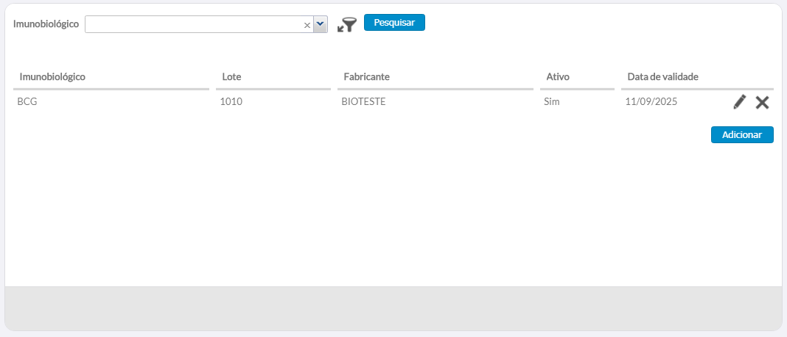

7\. Pronto, no próximo registro de aplicação de doses da vacina, o imunobiológico já estará presente no campo "Lote fabricante" quando for registrar uma dose aplicada.

>  **NOTA**: Para saber mais como realizar um registro de um imunobiológico administrado consulte o capítulo 6.3 deste manual.

8\. Caso queira editar o lote ou excluir o imunobiológico cadastrado basta clicar nos ícones  e , respectivamente. Caso o imunobiológico já tiver sido referenciado a algum registro de aplicação de vacina no sistema, não será possível excluir o lote.

## 3.10.1 Ativar ou Inativar lote de imunobiológico

Caso queira inativar o lote de um imunobiológico que não esteja mais sendo usado no serviço de saúde clique no ícone , em seguida abrirá a tela abaixo, por fim, desmarque o "box"  para desativar o lote do imunobiológico . Clique em "Salvar" para finalizar.

# 3.11 Gestão municipal

O módulo de Gestão municipal agrupa funcionalidades gerais, são elas: Compartilhamento de prontuário, Configuração da agenda padrão dos profissionais, Grupos de exame e Tipo de serviço.

## 3.11.1 Compartilhamento de prontuário

Essa funcionalidade permite compartilhar prontuários com todos os outros municípios que utilizam a mesma instalação em questão.

A funcionalidade estará ativa quando o botão estiver habilitado 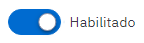. Para desativar o compartilhamento, desabilite o botão .

## 3.11.2 Configuração da agenda padrão

A funcionalidade de "Configuração da agenda padrão" permite configurar um horário padrão de atendimento de todos os profissionais da unidade de saúde para cada dia da semana, incluindo sábado e domingo (opção "Mostrar fim de semana").

Para configurar os horários de atendimento padrão, informe os valores necessários e clique em Salvar.

Figura 3.42 - Períodos de trabalho

Fonte: SAPS/MS.

Também é possível configurar a duração padrão do agendamento (duração padrão da consulta). As lotações que possuem CBOs com duração do agendamento customizado não utiliza a configuração de duração padrão. Para configurar a duração padrão do agendamento, informe o valor em minutos e clique em Salvar.

## 3.11.4 Grupos de exame

Os grupos de exames são apresentados no módulo de solicitação de exames durante o atendimento no PEC, em "Opções rápidas". Estes filtros são filtrados de acordo com idade e sexo do cidadão em atendimento.

Figura 3.43 - Grupos de exames

Fonte: SAPS/MS.

É possível criar novos grupos de exame na aba "Grupos de exames". Para isso, clique em "Adicionar grupo de exames". Informe o "Nome do grupo" e selecione os exames no combo "Exames". Para concluir, clique em "Adicionar".

Figura 3.44 - Grupos de exames

Fonte: SAPS/MS.

Os grupos também podem editados por meio do botão  ou excluídos no botão .

### 3.11.5 Tipos de serviço

Figura 3.45 - Tipos de serviço

Fonte: SAPS/MS.

Na aba "Tipos de serviço", é possível adicionar, editar e excluir os tipos de serviços disponíveis para o município.

Para adicionar, clique em "Adicionar tipo de serviço", informe o nome do tipo de serviço e clique em "Adicionar" para concluir.

Para editar, clique em .

Para excluir um tipo de serviço, cliquem em . Será apresentada uma mensagem de confirmação. Clique no botão  para concluir a ação.

CAPÍTULO 4 - Cidadão
====================

Neste capítulo abordaremos as questões relacionadas ao gerenciamento do cadastro do cidadão, por meio do módulo "Cidadão". Todo cidadão, para ser atendido na UBS por meio do Sistema com PEC, ou seja, para ter um prontuário eletrônico ativo no sistema, deve possuir um cadastro ativo no sistema, independente deste cadastro estar ou não identificado pelo número do Cartão Nacional de Saúde (CNS) ou pelo Cadastro de Pessoas Físicas (CPF).

Figura 4.1 - Cartão Nacional de Saúde e Cadastro de Pessoas Físicas

Fonte: SAPS/MS.

Considerando as diferentes fontes de informações da base de cidadãos do Sistema e-SUS APS e das possibilidades de consultas integradas à base de Cadastramento Nacional de usuários do SUS (CADSUS), por meio do Cartão Nacional de Saúde (CNS),antes de realizar qualquer ação no cadastro de um cidadão, seja para consultar ou alterar os dados dele ou para cadastrar um novo cidadão, o sistema solicita que o usuário realize uma busca sobre a base local ou na base do CNS, quando houver conectividade. O cadastro realizado utilizando este módulo **é enviado para a base nacional do SISAB**, e portanto, **será contabilizado no cadastro do território**.

# 4.1 Busca pelo cidadão

Agora o processo de busca pelo cidadão ficou mais simples. Após selecionar a opção "Cidadão" na aba lateral de navegação, será solicitado que o profissional realize a busca utilizando dados demográficos ou número de alguns documentos válidos:

- Nome do cidadão;
- número do CNS do cidadão;
- número do CPF;
- Data de nascimento;
- Nome da mãe;
- Município de nascimento, como mostra a imagem abaixo:

Figura 4.2 - Busca Cidadão

Fonte: SAPS/MS.

Em caso de sucesso na busca pelo cidadão o resultado mostrará um cartão com informações do cidadão como nome, data de nascimento, número do CNS e CPF, sexo, nome da mãe, unidade de saúde responsável, telefone, município de nascimento e a data da última atualização do cadastro.

Figura 4.3 - Resultado da Busca Cidadão

Fonte: SAPS/MS.

É importante sinalizar que a busca pode retornar como resultado cadastros "inativos", originados de versões anteriores do PEC. Neste caso o sistema apresentará este cadastro com a marcação , como mostra a Figura 4.4.

Figura 4.4 - Marcação de cadastro inativo.

Fonte: SAPS/MS.

O sistema sempre irá realizar uma busca na **base** de cadastro **local** e poderá trazer um ou mais resultados, restando ao profissional a escolha do cidadão que está sendo buscado. Caso não haja nenhum resultado, será realizada, automaticamente, a busca na base nacional do CADSUS.

Caso a busca seja muito genérica o sistema retornará uma mensagem de que muitos cadastros foram encontrados e irá solicitar o refinamento da busca para aproximar com mais fidedignidade os resultados que o profissional está esperando.

Figura 4.5 - Solicitação de refinamento da busca pelo cidadão

Fonte: SAPS/MS.

Caso a consulta à base nacional do CADSUS não retorne nenhum resultado o sistema apresentará a seguinte mensagem:

Neste caso será necessário **cadastrar um novo cidadão** (ver seção 4.3).

## 4.1.2 Busca na base nacional (CADSUS)

Ao fazer uma busca pelo cidadão, caso o mesmo não esteja disponível na primeira busca realizada na base local, será realizada automaticamente uma busca *on-line* na base nacional do CADSUS. Para isso, o servidor do Sistema e-SUS APS deve estar conectado a uma rede de Internet, ou seja, o sistema precisa ter conectividade com a Internet para acessar o serviço do CADSUS. O resultado será exibido indicando que o resultado foi buscado na "Base nacional", conforme podemos visualizar na imagem abaixo.

Figura 4.6 - Resultado da Busca da Base Nacional

Fonte: SAPS/MS.

É possível que a consulta à base nacional seja desativada pelo administrador do sistema, na instalação local. Neste caso o sistema apresentará a seguinte mensagem:

Quando a busca for realizada com parâmetros demográficos, o sistema não realizará uma busca automática na base nacional, caso a consulta retornar registros da base local. Portanto ao final da lista de resultados será apresentado o bloco Cadastros na base nacional. Caso deseje ampliar a busca, clique no botão "Pesquisar na base nacional".

Figura 4.7 - Ampliar Busca na Base Nacional

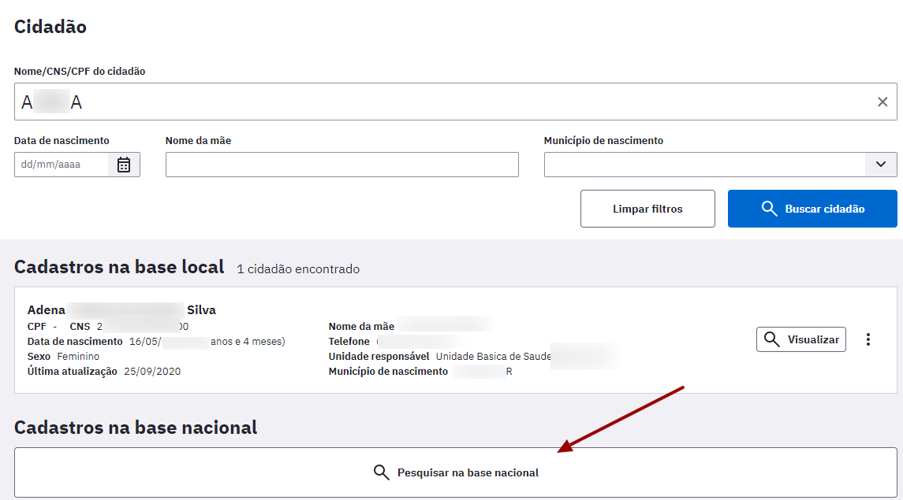

Fonte: SAPS/MS.

A busca ampliada será exibida pela listagem dos resultados da base local seguida dos resultados da base nacional, conforme podemos ver na imagem abaixo.

Figura 4.8 - Resultado da Busca Ampliada na Base Nacional

Fonte: SAPS/MS.

# 4.2 Visualizar dados do cidadão

Ao realizar uma busca com resultado bem sucedido, será apresentado um cartão com os dados do cidadão. Estarão disponíveis algumas opções, como:

- Visualizar;
- Atualizar Cadastro;
- Ver prontuário;
- Ver agendamentos; e
- Excluir.

## 4.2.1 Visualizar

Esta opção permite acessar as informações de cadastro do cidadão, que podem ser de origem do CADSUS e do Cadastro do Território.

O cabeçalho apresenta um resumo das informações. Também é possível visualizar se o cadastro já foi unificado alguma vez, quais os cadastros que foram unificados, data, hora e quem foi o responsável pela unificação.

## 4.2.2 Atualizar cadastro

Esta opção oferece a possibilidade de alterar algum dado do cidadão e sincronizá- lo com a base de dados do CADSUS. Ao realizar a atualização, clique em "Salvar" para que o sistema se conecte ao CADSUS e realize as alterações. Caso não haja conectividade o sistema irá apresentar um alerta de que não foi possível realizar a sincronização.

## 4.2.3 Ver prontuário

Caso o profissional deseje **visualizar o prontuário** por meio do módulo Cidadão é obrigatório o registro de uma justificativa para o acesso a estas informações clínicas fora do momento do atendimento ou na ausência do cidadão na UBS. Esta justificativa fica gravada no banco de dados para uso posterior, no caso de auditoria em relação ao sigilo dos dados clínicos sensíveis do cidadão, garantindo assim a sua privacidade e segurança. Para mais informações sobre o prontuário, veja o Capítulo 6.

Figura 4.19 - Tela para justificar acesso ao prontuário

## 4.2.4 Ver agendamentos

Na opção **Ver agendamentos** é possível visualizar a lista de vezes que o cidadão foi incluído na agenda da UBS, indicando data e hora do seu agendamento, nome do profissional, CBO e observações. Cada item é apresentado com uma indicação da situação do agendamento (Agendado, Não compareceu, Não aguardou e Atendimento realizado).

Figura 4.18 - Tela de Agendamentos do cidadão

Fonte: SAPS/MS.

# 4.3 Adicionar cidadão na base local

Como já mencionado anteriormente, neste capítulo, para realizar qualquer ação (agenda, registro de atendimento, etc) sobre um cidadão, este precisa estar disponível na base local. Existem três formas de adicionar um cidadão à base local:

- a partir da base nacional;
- integração com Cadastro da Atenção Básica (via CDS ou aplicativo e-SUS APS Território); ou
- direto na base local (Novo cidadão).

## 4.3.1 Adicionar cidadão a partir da base nacional

Após o processo de busca, para adicionar um novo cidadão na base local a partir da base nacional, o profissional deverá selecionar o cidadão na lista de resultados por meio da opção .

Figura 4.9 - Cadastrar cidadão da Base Nacional na base local

O sistema exibirá a tela de adicionar cidadão com todos os dados disponíveis na base nacional.

Figura 4.9 - Formulário para preenchimento do cadastro do cidadão

Verifique os dados e identifique atualizações necessárias, e para finalizar clique em "Salvar". Caso não haja nenhum problema na validação dos dados o sistema gravará as alterações realizadas.

Figura 4.10 - Continuação Formulário de preenchimento do cadastro do cidadão

>  **NOTA**: para mais detalhes de preenchimento do formulário, ver seção 4.4.

## 4.3.2 Adicionar cidadão por meio do Cadastro da Atenção Básica

Visando uma maior integração das ações dos ACS no cadastro do território, todo cidadão cadastrado, por meio das fichas de cadastro da atenção básica (cadastro individual e cadastro domiciliar e territorial) é automaticamente importado para o módulo Cidadão do PEC, após finalizado o processo de digitação (módulo CDS), processamento e envio das fichas. De forma similar, ocorre a integração com os dados recebidos no Sistema PEC pelo transmissor de dados.

>  **ATENÇÃO**: o cidadão só será importado para o módulo cidadão após processamento das fichas na transmissão de dados. O processamento das fichas é automático, entretanto o servidor do sistema deve ficar ligado, conectado à internet, durante a noite (0h às 6h).

## 4.3.3 Adicionar um Novo Cidadão

Após realizar a busca, utilizando os métodos mostrados anteriormente, onde o cidadão não foi localizado, será necessário incluir um novo cidadão na base.

Para cadastrar um novo cidadão, basta clicar no botão "Adicionar Cidadão" , como mostra a imagem a seguir:

Figura 4.11 - Opção "Adicionar cidadão"

Fonte: SAPS/MS.

A página de cadastro do cidadão (Figura 4.9 e 4.10) será exibida com todos os campos a serem preenchidos. Após finalizar o preenchimento do formulário basta clicar no botão "Salvar" e o cadastro será processado automaticamente.

# 4.4 Adicionar ou alterar cidadão na base nacional

Caso haja conectividade e acesso à base nacional do CADSUS, ao realizar qualquer alteração no cadastro, o sistema mostrará a mensagem de confirmação da alteração dos dados do cidadão.

Ao adicionar um novo cidadão, após o preenchimento do formulário, caso haja sucesso nesse processo, será mostrada a confirmação da geração do cadastro, assim como o número do CNS do cidadão que foi criado.

Figura 4.12 - Tela cidadão atualizado na Base nacional

Fonte: SAPS/MS.

Caso haja algum problema de conectividade ou indisponibilidade do serviço na base nacional do CADSUS, **o cadastro** será salvo na base local, porém não será criado na base nacional. Este processo pode ser refeito até este cadastro ser aceito pela base nacional, resultando na criação do número do CNS para este cidadão.

Caso não seja possível realizar a **atualização** na base nacional, por algum motivo, será mostrado um aviso confirmando a atualização apenas na base local como mostra a imagem abaixo:

Figura 4.13 - Mensagem de erro na atualização do cadastro da Base nacional

Fonte: SAPS/MS.

# 4.5 Preenchimento do formulário de cadastro

O cadastro no módulo Cidadão é um cadastro simplificado que estende e integra os dados do cadastro do CADSUS ao Sistema e-SUS APS, por meio do número do CNS do cidadão, visando garantir um mínimo de informações sobre o cidadão que está sendo atendido pela equipe de AB.

>  **NOTA**: é importante realizar o cadastro completo dos cidadãos, realizado principalmente pelos agentes de saúde, utilizando as fichas do CDS ou o aplicativo e-SUS Território.

Este cadastro é formado por quatro blocos de informações:

- Dados pessoais;
- Contatos;
- Equipe responsável pelo cidadão;
- Endereço;
- Informações complementares; e
- Compartilhamento de prontuário.

## 4.5.1 Dados pessoais

O bloco de dados pessoais, tem o objetivo de identificar o cidadão conforme as especificações e regras do Cartão Nacional de Saúde (CNS) e integrado ao CADSUS, e a partir da versão 3.2.20 também é possível identificar o cidadão pelo CPF.

Figura 4.12 - Tela de Cadastro do cidadão - Dados pessoais

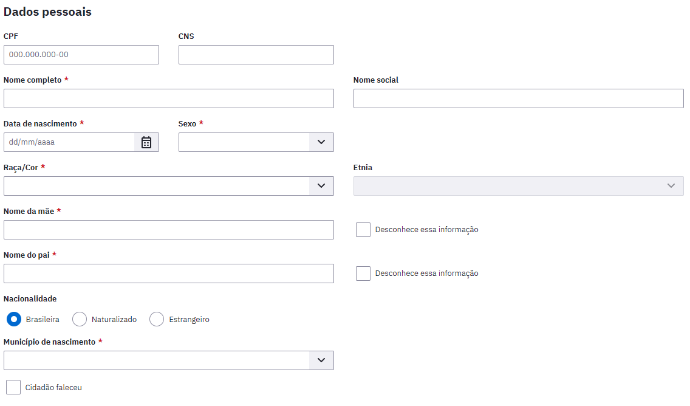

Fonte: SAPS/MS.

## 4.5.2 Contatos

Este bloco tem o objetivo de coletar os dados de contatos, caso seja necessária a comunicação do serviço de saúde com o cidadão.

Figura 4.14 - Tela de Cadastro do cidadão - Contatos

Fonte: SAPS/MS.

## 4.5.3 Equipe responsável pelo cidadão

Este recurso permite a vinculação dos cidadãos às Equipes de saúde, independente do território de residência. A partir dessa vinculação a equipe será responsável pelo acompanhamento do cidadão. Caso o cidadão não esteja vinculado a nenhuma equipe este bloco irá ser apresentado da seguinte forma:

Figura 4.15 - Cidadão sem equipe vinculada

Para vincular um cidadão que não faz parte do território adscrito clique no botão "Vincular Equipe". Será apresentado uma lista com as equipes disponíveis para vinculação.

Figura 4.16 - Vincular equipe responsável, selecionar equipe

Caso haja registro de vinculação do cidadão a uma equipe, seja pelo cadastro do território, seja via solicitação do cidadão, o sistema apresentará as informações da seguinte forma:

Figura 4.17 - Equipe responsável pelo cidadão

Caso o cidadão opte por ser acompanhado por outra equipe, clique no botão , desmarque a opção "Utilizar a informação do cadastro individual do cidadão", selecione a equipe responsável e clique em Salvar.

Caso o cidadão tenha um cadastro individual e deseja manter o acompanhamento com a mesma equipe de cadastro individual, mantenha selecionada a opção "Utilizar a informação do cadastro individual do cidadão" e clique em Salvar.

Figura 4.18 - Vincular equipe responsável

>  **ATENÇÃO**: Pessoas não cadastradas na equipe podem ser atendidas normalmente, porém o acompanhamento de saúde deve ser realizado pela equipe responsável.

## 4.5.4 Endereço

O bloco de Endereço utiliza a base de endereços da Empresa Brasileira de Correios e Telégrafos, também conhecido pelo nome Diretório Nacional de Endereços (DNE). Ao incluir um Código de Endereço Postal - CEP, o sistema automaticamente preenche os campos: estado, município, bairro e logradouro. Caso o bairro ou logradouro não esteja disponível na base dos Correios, os campos permitirão a inclusão manual das referidas informações.

Figura 4.13 - Tela de Cadastro do cidadão - Endereço

Fonte: SAPS/MS.

## 4.5.5 Informações Complementares

Este bloco visa a coleta de dados sociodemográficos complementares do cidadão.

Figura 4.15 - Tela de Cadastro do cidadão - Informações Complementares

Fonte: SAPS/MS.

## 4.5.6 Compartilhamento de prontuário

Este recurso permite ao cidadão optar pela forma como seus dados clínicos ficam disponíveis para a rede de saúde. Por padrão seus dados são visíveis a todas as UBS de uma mesma instalação, pois otimiza a recuperação de informações clínicas relevantes para o cuidado. Caso o cidadão não concorde, marque a opção "Desativar compartilhamento de prontuário para este cidadão".

CAPÍTULO 5 - Agenda
===================

O módulo de Agenda é usado para organizar a agenda dos profissionais das unidades básicas de saúde (UBS), e será a principal ferramenta utilizada pelos profissionais das recepções das UBS.

O módulo de **Agendamento Online** foi desenvolvido conjuntamente entre o Departamento de Saúde da Família - DESF/SAPS e o Departamento de Informática do SUS - DATASUS/SE, a fim de facilitar o acesso dos cidadãos aos serviços de Atenção Básica em todo o país. Dessa forma, foi realizado o desenvolvimento da ferramenta de Agenda Online no PEC e adequações no aplicativo "ConecteSUS Cidadão" para a efetivação desta funcionalidade.

Este módulo está disponível para as equipes de Atenção Básica que utilizam o PEC do e-SUS APS, a partir da versão 3.1, e foi pensado levando em consideração avanços tecnológicos alcançados pela Estratégia e no aumento de acesso constante da população a aparelhos do tipo *smartphones*, dessa forma tendo acesso a aplicações móveis.

O Agendamento Online consiste na disponibilização de horários da agenda dos profissionais da APS para esse tipo de agendamento, entendendo que esta não deve ser a forma principal ou preferencial de agendamento nas equipes, sendo assim, a equipe deve definir quais serão os horários disponíveis para esse tipo de agendamento, considerando os agendamentos para cuidado continuado e outros tipos de agendamento a serem realizados diretamente na Unidade de Saúde ou para consultas de retorno.

Para uso desta funcionalidade, é necessário que a UBS tenha boa conectividade com a internet, pois utiliza- se um servidor nacional para troca de informação entre a UBS e os cidadãos que utilizam o aplicativo "ConecteSUS Cidadão".

>  **ATENÇÃO**: A funcionalidade de agendamento de consulta na Atenção Básica por meio do aplicativo "ConecteSUS Cidadão" está disponível apenas para usuários que fazem parte do território de equipes de atenção básica. Para tanto é necessário que o cidadão esteja cadastrado no território da equipe através dos cadastros individual e domiciliar.

>  **NOTA**: A mudança de configuração da agenda pode ser realizada a qualquer momento, porém não altera os horários agendados previamente.

>  **DICA**: Antes de realizar a configuração da Agenda Online realize uma conversa prévia com toda a equipe, para pactuação de estratégia de abertura desse formato de agendamento. A disponibilização de horários pode ser gradual. Atente-se para informar a população sobre essa possibilidade de agendamento.

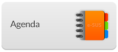

É neste local que os profissionais das UBS poderão, dependendo do seu perfil de acesso, consultar e editar as agendas dos profissionais da unidade, ainda é possível adicionar cidadãos na agenda dos profissionais e reservar horários para reuniões ou outras atividades.

Para começar a utilizá- la, é necessário configurar com informações referentes ao horário de trabalho dos profissionais. Quando o profissional apresenta apenas um vínculo no CNES, a agenda virá com uma formatação padrão de atendimentos (dias e horário de trabalho) que pode ser alterada. A configuração da agenda está disponível unicamente para os profissionais com **perfil de coordenação**. No Capítulo 3, você encontra mais informações sobre a configuração da agenda do profissional.

>  **NOTA**: antes de utilizar a agenda, é necessário que o coordenador verifique a agenda dos profissionais (ver seção 3.4.5), caso esta não esteja disponível.

Para o profissional utilizar a agenda para gestão dos atendimentos, deverá primeiramente clicar na opção "Agenda", após o sistema exibirá a tela da agenda, conforme a Figura 5.1, abrindo na data e no período atual do acesso.

Para visualizar os horários de outros períodos, basta clicar nos links (1) "1° período", \"2° período\", "3°período" ou "4° período", (conforme configuração realizada pelo administrador da instalação) localizados acima da lista de horários , em destaque, o período selecionado na agenda.

Para visualizar os horários de outro dia do mês, basta clicar no calendário no dia desejado, por exemplo, dia 22, . Para retornar à data atual, clique em "Hoje" , ou no dia em destaque .

Figura 5.1 - Tela da agenda

Fonte: SAS/MS.

# 5.1 Agendar uma Consulta

Para agendar uma consulta, basta seguir os passos:

- Passo 1. Selecione o "Profissional" para o qual deseja agendar a consulta;

- Passo 2. Selecione a data do agendamento. É possível trocar o mês, clicando nas setas .

- Passo 3. Clique no horário que deseja realizar o agendamento;

Figura 5.2 - Agendar/Reservar Horários

Fonte: SAS/MS.

- Passo 4. Selecione o tipo de agendamento, clicando na opção "Consulta" ou "Reserva";

- Passo 5. Realize a busca do cidadão pelo nome, CNS ou data de nascimento;

- Passo 6. Selecione o cidadão (o nome do cidadão somente aparecerá caso já esteja cadastrado);

- Passo 7. Se o cidadão não estiver cadastrado, clique no ícone "Cadastrar novo cidadão"  e preencha com os dados solicitados;

- Passo 8. Caso necessário, é possível usar o campo "Observações" para fazer alguma anotação prévia sobre a consulta;

- Passo 9. Clique em "Salvar" . O nome do cidadão será incluído na agenda com a legenda "Agendado", conforme a figura abaixo:

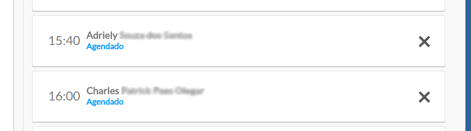

>  **NOTA**: Quando a funcionalidade do Agendamento Online está ativada, todo agendamento salvo no módulo de Agenda do PEC é enviado para o servidor de agendamento online, que dispara uma notificação "*push"* com informações relacionadas a este agendamento para o aplicativo "ConecteSUS". Neste caso, como o agendamento foi realizado presencialmente na UBS, não há restrição em relação ao cidadão pertencer ao território de referência da equipe de atenção básica.

Conforme os agendamentos são realizados para as datas futuras, a agenda do profissional vai sendo preenchida nos horários escolhidos. Este agendamento pode ser realizado pelo recepcionista da UBS, pelo próprio profissional ao finalizar a escuta inicial ou ao finalizar o atendimento, ou ainda, por outros profissionais da equipe.

>  **NOTA**: buscando fortalecer o planejamento da equipe em relação às demandas dos cidadãos no território, o sistema só permite criar um agendamento para consulta ou reserva em horários posteriores ao atual. Por exemplo, caso esteja criando um agendamento às 14h27 do dia corrente, só será possível criar um agendamento nesse dia a partir desse horário (14h40, 15h00,\...), ou nos dias subsequentes.

Após ser realizada a configuração da agenda da equipe com os horários disponíveis para Agendamento Online, os mesmos serão apresentados na agenda da seguinte forma:

A partir do agendamento, o sistema oferece algumas opções para fazer o controle do agendamento:

- "Adicionar cidadão na lista de atendimentos" 

- "Informar falta do cidadão" 

- "Cancelar agendamento" 

- Visualizar agendamento e dados do cidadão (clicando sobre o nome do cidadão)

Além dessas funcionalidades ainda é possível, pesquisar os agendamentos por cidadão e a função "Visualizar prontuário" . Quando necessária esta visualização está disponível para os profissionais de saúde.

Para os horários configurados para agendamento online, não é possível realizar outra forma de agendamento, a opção possível é apenas de reserva da agenda pelos seguintes motivos: atendimento externo, atividade coletiva, reunião ou outro.

## 5.1.1 Agendar atendimento fora da UBS

Para utilizar o recurso de adicionar o cidadão na agenda para os atendimentos a serem realizados fora da UBS, basta seguir o passo a passo de agendar uma consulta, descrita no capítulo 5.1. Entretanto, para esta funcionalidade, deverá ser clicado no box \"Fora da UBS\" e selecionar o local de atendimento, observe a figura 5.2. Após salvar o agendamento apresentará a mensagem com a hora em que foi marcado, o nome do cidadão e a mensagem \"AGENDAMENTO FORA DA UBS\", conforme a figura abaixo.

Figura 5.3 - Agendamento fora da UBS

>  **DICA**: Quando o cidadão é colocado na agenda como agendamento fora da UBS, automaticamente aparecerá na lista de registro tardio de atendimento no dia agendado. Para saber mais sobre o registro tardio de atendimento consulte o capítulo 6.6.

## 5.1.2 Adicionar Cidadão na Lista de Atendimentos

Para incluir o cidadão na lista de atendimentos, clique no ícone "Adicionar cidadão na lista de atendimentos" . O cidadão será incluído na lista, a legenda será "Cidadão presente na unidade".

Para que seja possível realizar o atendimento deste cidadão, o profissional deve ir para o módulo "Atendimentos", onde será possível visualizar a lista dos pacientes agendados que estão presentes na unidade.

## 5.1.3 Visualizar Agendamento e Dados do Cidadão

Para visualizar os detalhes do agendamento do cidadão e dados básicos do cidadão, clique sobre o nome do cidadão. Será apresentado o resumo do agendamento, inclusive, qual o profissional que registrou o agendamento conforme a Figura 5.2. Nesta visualização, é possível acessar o cadastro completo do cidadão por meio da opção \"Ver cadastro completo do cidadão\".

Figura 5.4 - Visualizar detalhes do agendamento

Fonte: SAS/MS.

O agendamento apresenta a situação atual em que se encontra, por exemplo, como vemos na Figura 5.2 o *status* de "Agendado" . Os *status* disponíveis para o agendamento são:

- **Agendado**: cidadão tem um agendamento;

- **Cidadão presente na unidade**: o cidadão foi marcado como presente na unidade

- **Atendimento realizado**: cidadão já teve o atendimento realizado;

- **Não aguardou**: cidadão esteve na unidade, mas não aguardou o atendimento;

- **Não compareceu**: horário do agendamento já passou e o cidadão não compareceu ao atendimento;

- **Cancelado**: agendamento foi cancelado.

### 5.1.3.1 Sincronização com Agenda Online do e-SUS APS

A visualização do agendamento, quando a instalação está com a sincronização com o Servidor de Agenda do e-SUS APS habilitado (ver Seção 3.1.10) apresentará um status de sincronização , como podemos ver na Figura 5.3.

Figura 5.5 - Visualizar detalhes do agendamento com sincronização

Fonte: SAS/MS.

Os *status* de sincronização possíveis são:

- **Sincronizado**: quando a versão mais atual do agendamento já está cadastrada no servidor;

- **Anterior à ativação da agenda online**: quando o agendamento ou a última atualização foi realizada em uma data anterior à ativação da agenda online;

- **Aguardando sincronização**: quando o agendamento está aguardando sincronização com o servidor;

- **Aguardando sincronização de atualização**: quando o agendamento já foi enviado ao servidor, porém o agendamento foi atualizado no PEC e a atualização não foi sincronizada;

- **Cidadão sem CNS cadastrado**: quando o cidadão não possui CNS cadastrado, neste caso é necessário atualizar o cadastro do cidadão com o CNS dele;

- **Aguardando integração com o CADSUS**: quando o cadastro do cidadão não está integrado com o serviço de cadastro de cidadãos do CADSUS;

- **Cidadão sem CNS definitivo**: quando o cidadão possui CNS cadastrado mas este não é considerado um CNS forte (criado pelo CADSUS), ou seja, inicie com número 7 (para a versão de treinamento será considerado também os CNS que iniciem com 8);

- **Registro inconsistente**: quando houver alguma inconsistência que impeça a sincronização do agendamento com o servidor;

- **Inelegível**: quando for um agendamento de Atenção Domiciliar ou reserva de horário.

## 5.1.4 Cancelar agendamento

Para cancelar um agendamento, clique no ícone "Cancelar agendamento" .

>  **NOTA**: caso o horário marcado já tenha passado, não será possível excluir o agendamento. Para estes casos, utilize a opção "informar falta do cidadão", clicando sobre o ícone .

Para efetivar o cancelamento, é necessário preencher uma justificativa, conforme mostrado na Figura 5.4. Para concluir clique em "Salvar" .

Figura 5.6 - Tela de justificativa para cancelar o agendamento

Fonte: SAS/MS.

Após confirmar o Cancelamento, a visualização do agendamento será apresentado como na Figura 5.7.

Figura 5.7 - Visualizar detalhes do agendamento Cancelado

Fonte: SAS/MS.

## 5.1.5 Informar que o Cidadão faltou

Para informar a falta de um cidadão, clique no ícone "Clique para informar que o cidadão faltou" . Ele não poderá ser atendido e ficará com registro de falta no atendimento. O nome do cidadão será visualizado na agenda com a legenda "Não compareceu". Esse procedimento pode ser revertido somente no dia do atendimento ao clicar no ícone "Cidadão faltou". Em seguida, clique para indicar que o cidadão chegou" .

## 5.1.6 Pesquisar por cidadão

Para identificar os agendamentos por cidadão, siga os passos:

- Passo 1. Digite o nome ou parte do nome do cidadão no campo "Pesquisa por cidadão"

- Passo 2. Selecione o cidadão que deseja consultar;

- Passo 3. Serão apresentados os agendamentos realizados para o cidadão selecionado, com data e hora, nome do profissional, CBO e observações.

>  **NOTA**: para visualizar o histórico de agendamento, clique na opção "Mostrar agendamentos anteriores".

>  **DICA**: quando o profissional que estiver consultando os agendamentos do cidadão quiser visualizar apenas os da sua agenda, basta clicar na opção "somente os meus".

## 5.1.7 Visualizar prontuário

Para visualizar o prontuário do cidadão, clique no ícone . Caso o profissional deseje **visualizar o prontuário** direto na agenda, é obrigatório o registro de uma justificativa para o acesso a estas informações clínicas fora do atendimento presencial, ou seja, na ausência do cidadão no momento da consulta. Esta justificativa fica gravada no banco de dados para posterior uso, no caso de auditoria, em relação ao sigilo dos dados clínicos sensíveis do cidadão, garantindo assim a sua privacidade e segurança. Para mais informações sobre o prontuário, veja o Capítulo 6.

# 5.2 Reservar horários na agenda do profissional

Esta funcionalidade é utilizada para reserva da agenda do profissional quando este não estiver disponível para realizar consultas. Os motivos de reserva da agenda são: atendimento externo, atividade coletiva, reunião e outro.

>  **DICA**: a reserva da agenda é indicada apenas para atividades de pequena duração e dentro do mesmo turno. Caso haja necessidade de bloqueio de um período maior da agenda do profissional, por exemplo, por motivo de férias ou licença médica, deve ser usada a **opção de fechamento da agenda** com o perfil de coordenação, ver seção 3.4.6.

Para fazer uma reserva de horário na agenda, siga os passos:

- Passo 1. Acesse a agenda;

- Passo 2. Clique no horário que deseja reservar. O sistema se apresentará de acordo com a Figura 3.8;

Figura 5.8 - Visualizar detalhes da agenda

Fonte: SAS/MS.

- Passo 3. Clique na opção "Reserva" ;

- Passo 4. Defina o horário inicial, que corresponde à hora de início da atividade que ocasionou a reserva da agenda e defina o horário final da reserva

- Passo 5. Escolha o motivo da reserva da agenda (atendimento externo, atividade coletiva, reunião ou outro)
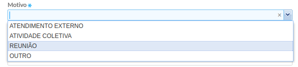

- Passo 6. Caso seja selecionada a opção outro (motivo) use o campo "Especifique" para detalhar o motivo;

- Passo 7. Para concluir, clique em "Salvar" .

Após salvo, a reserva do horário será apresentada na agenda, junto com os outros agendamentos (Figura 5.9).

Figura 5.9 - Horário reservado

Fonte: SAS/MS.

# 5.3 Imprimir a Agenda do Profissional

É possível realizar a impressão da agenda dos profissionais individualmente, para um determinado dia da agenda. Para isto basta selecionar a data do dia desejado, por meio do calendário, e clicar no botão "imprimir" . A impressão apresenta, além da identificação do profissional, a lista de agendamentos com o horário, e os dados de identificação dos cidadãos agendados. Também apresenta as informações em relação a reserva de agenda para atividades previstas.

Figura 5.10 - Impressão da agenda

Fonte: SAS/MS.

CAPÍTULO 6 - Atendimentos
=========================

A partir do novo padrão de funcionamento do PEC os profissionais de saúde têm acesso à Lista de Atendimentos da unidade de saúde utilizando a barra lateral de navegação. É por meio dela que são iniciados os atendimentos aos cidadãos agendados ou os que buscam um atendimento de demanda espontânea.

Essa funcionalidade é apresentada na barra lateral de navegação do sistema e pode ser acessada ao clicar na opção "Lista de Atendimentos". Neste momento, será visualizada a lista de atendimentos da unidade de saúde, conforme podemos ver na Figura 6.1.

Figura 6.1 - Tela principal da "Lista de Atendimentos"

Fonte: SAPS/MS.

# 6.1 Lista de Atendimentos

A lista de atendimentos oferece uma série de recursos que auxiliam na organização das ações realizadas aos cidadãos que já entraram no fluxo de atendimento, seja por um atendimento agendado, seja por uma demanda espontânea, como vimos na Seção 5.1.1.

Para pesquisar um cidadão específico que esteja incluído na Lista de Atendimento basta digitar o seu nome, CPF ou CNS na caixa de busca, como mostrado em destaque na imagem a seguir:

Caso o profissional deseje visualizar apenas os cidadãos que estão aguardando para o seu atendimento, selecione a opção "Ver somente os meus atendimentos". Esta opção filtra a lista de atendimento apenas com os cidadãos marcados para serem atendidos pelo profissional logado no sistema.

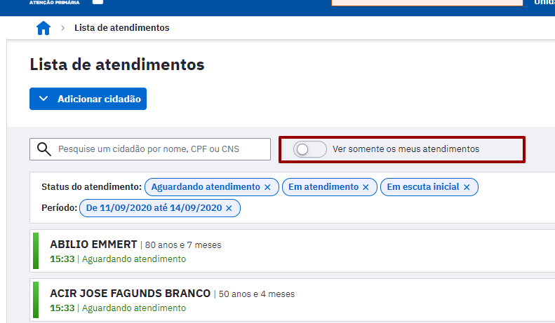

Um recurso importante desta lista são as formas de pesquisa e filtro, conforme a Figura 6.2. Clique na opção de filtro  para mais campos de pesquisa.

Figura 6.2 - Opções de pesquisa da lista de atendimentos

Fonte: SAPS/MS.

Em seguida, veremos a função de cada campo:

- **status* atendimento:** filtra a lista pela situação do cidadão em relação ao fluxo de atendimento;

- **período:** filtra e pesquisa os atendimentos em espaço de tempo definido;

- **tipo de serviço:** filtra a lista de atendimento pelo tipo de serviço ao qual o cidadão está marcado, seja agendado ou não, a depender do fluxo de atendimento que ele já tenha passado na unidade de saúde;

- **equipe:** filtra a lista pela equipe;

- **profissional:** filtra a lista pelo nome do profissional.

Ao clicar nos campos "Período", "Tipo de serviço", "Equipe" e "Profissional", o sistema irá abrir uma lista de opções disponíveis para utilizar como filtro. É possível realizar pesquisa por digitação nestes campos.

>  **NOTA**: os **tipos de serviços** mostrados no filtro rápido são os que foram cadastrados, no momento da configuração, para a unidade de saúde. Para mais informações sobre tipo de serviço, ver seção 3.3.1.

Se for preenchido mais de um campo para pesquisa, a lista de atendimento resultante conterá apenas os registros que contemplem todos os filtros simultaneamente. O sistema também apresenta em formato de *tags* identificando as opções utilizadas para a filtragem da lista de atendimento, como observado na imagem a seguir:

Caso o profissional deseje retornar os filtros para o padrão, basta clicar no botão "Voltar para padrão".

>  **NOTA**: a lista com os cidadãos para atendimento, por padrão, apresenta os atendimentos do dia, filtrando os cidadãos com *status* "Atendimento realizado" e ou que "Não aguardou o atendimento".

A lista de atendimentos apresenta informações sobre a hora de chegada, nome do cidadão, profissional e tipo de serviço. A barra colorida no canto esquerdo da lista indica o *status* daquele atendimento, e as cores estão relacionadas com o quadro do "Status atendimento", que se encontra no ícone da pesquisa e filtro .

Outra funcionalidade para auxiliar na organização do atendimento é o \"**Ordenar por**\", recurso que permite ao usuário a escolha da ordenação dos registros na lista.

É possível ordenar pela data e hora de chegada (crescente ou decrescente) ou pela classificação de risco (apenas atendimentos que passaram pela escuta inicial). Por padrão, a lista é ordenada por ordem crescente (ordem de chegada) + classificação de risco.

>  **DICA**: sempre observe se há algum tipo de filtro ativo para visualização da lista, a fim de não haver confusão ou falsa impressão da quantidade de cidadãos dentro da lista de atendimento.

Como podemos ver na Figura 6.3, algumas ferramentas são disponibilizadas para cada cidadão na lista de atendimentos. A seguir, apresentamos cada ferramenta e para que servem:

Figura 6.3 - Ferramentas da lista de atendimentos

Fonte: SAPS/MS.

**Gerar declaração de comparecimento:** será disponibilizada para impressão com os dados do cidadão selecionado, podendo adicionar o **nome do acompanhante.** A impressão só estará disponível após o cidadão passar por algum atendimento na UBS;

>  **DICA**: ao imprimir a declaração de comparecimento do cidadão, certifique- se de que o controle do pop- up da janela do navegador esteja desbloqueado.

 **realizar escuta inicial:** inicia- se a escuta inicial do cidadão;

 **visualizar escuta inicial:** visualização da escuta inicial, caso ela já tenha sido realizada e registrada no mesmo dia;

 **atender:** inicia- se o atendimento de um cidadão;

 **realizar vacinação:** realizar o registro de vacinação para este cidadão;

**Cidadão não aguardou:** permite indicar no sistema que um cidadão estava na lista de atendimentos, mas, por algum motivo, não aguardou o atendimento;

**Cidadão retornou:** permite desfazer a ação \"Cidadão não aguardou\";

**Visualizar prontuário:** visualização do prontuário completo do cidadão (caso o cidadão já tenha um registro anterior neste prontuário);

**Visualizar atendimentos do dia:** visualização dos atendimentos ou escuta inicial. Disponível somente se o cidadão tiver algum atendimento no dia;

**Editar:** edição do dados referentes às demandas daquele cidadão que aguarda na Lista de Atendimento. É possível editar o profissional, equipe de referência que irá atendê- lo ou o tipo de serviço oferecido pela UBS em que o cidadão será atendido;

 **Excluir:** excluir cidadão da lista de atendimento. Esta opção estará habilitada apenas se o registro não possuir referências, ou seja, se o atendimento já tiver sido iniciado, não será possível realizar a exclusão.

## 6.1.1 Adicionar um Novo Atendimento à Lista

Além dos atendimentos agendados para os profissionais da unidade de saúde, é possível a inclusão no sistema dos cidadãos, que procuram o serviço de saúde por demanda espontânea. Para mais informações sobre demanda espontânea, ver [**CAB 28 - Acolhimento à Demanda Espontânea Volume I**](http://189.28.128.100/dab/docs/publicacoes/geral/miolo_CAP_28.pdf).

### 6.1.1.1 Adicionar cidadão em demanda espontânea

Para adicionar um cidadão à lista de atendimento por demanda espontânea, siga os seguintes passos:

- Passo 1. Na tela da lista de atendimentos, clique em ;

- Passo 2. Selecione o **cidadão**. Observe que o sistema apresenta a lista de cidadãos com seus dados demográficos e indica se o mesmo já está adicionado na Lista de Atendimentos. Caso o cidadão não esteja cadastrado nesta UBS, é possível realizar o cadastro dele clicando em ;  

- Passo 3. Selecione o **profissional** que irá atendê-lo. Esta seleção não é obrigatória e não impede que outro profissional realize o atendimento deste cidadão, apenas visa à organização interna e filtros de pesquisa;

- Passo 4. Selecione a **equipe** que estará a frente do cuidado ao cidadão. Esta seleção não é obrigatória e não impede que outro profissional realize o atendimento deste cidadão, apenas visa à organização interna e filtros de pesquisa;

- Passo 5. Selecione os **tipos de serviço** que serão oferecidos no atendimento. Esta seleção não é obrigatória e não restringe os serviços que serão realizados no atendimento;

Figura 6.4 - Adicionar Atendimento

- Passo 6. Para concluir, clique em "**Adicionar**". Após isso, o cidadão será exibido na lista de atendimento.

### 6.1.1.2 Adicionar cidadão em demanda agendada

É possível incluir um cidadão com demanda agendada a partir da lista de atendimento, prevenindo possíveis inconsistências com o módulo Agenda. Para adicionar um cidadão à lista de atendimento por demanda agendada, siga os passos:

- Passo 1. Na tela da lista de atendimentos, clique em . Caso o cidadão tenha agendamentos para este dia, será apresentada uma lista indicando as reservas de agenda para aquele dia.

Figura 6.5 - Adicionar Atendimento

- Passo 2. Ao selecionar o agendamento o sistema automaticamente preenche os campos disponíveis, como Profissional, Equipe e Tipo de Serviço;.

Figura 6.6 - Adicionar Atendimento

- Passo 3. Para concluir, clique em "**Adicionar**". Após isso, o cidadão será exibido na lista de atendimento

>  ATENÇÃO: Caso o cidadão tenha procurado a Unidade Básica de Saúde para a realização de vacinação a recepção poderá, no momento de inclusão do cidadão na lista de atendimento, marcar a opção "**Vacina**".

# 6.2 Escuta Inicial

A escuta inicial representa o primeiro atendimento realizado ao cidadão em **demanda espontânea** na unidade de saúde. A finalidade desta escuta é acolher o indivíduo, levantar informações sobre o motivo da busca pelo cuidado em saúde e orientar a conduta mais adequada para o caso. É possível coletar informações subjetivas, medições objetivas e classificar o risco/vulnerabilidade, de acordo com a avaliação do risco biológico e da vulnerabilidade subjetivo- social do indivíduo. O profissional que realizou a escuta inicial poderá resolver o caso por meio de orientação ou encaminhar o cidadão para atendimento no dia, procedimento na UBS ou agendamento de consulta em outro dia.

O perfil de escuta inicial poderá ser habilitado para os profissionais a depender da organização do processo de trabalho em cada município (ver Seção 3.4.4).

>  **NOTA:** Só é permitido realizar uma escuta para cada atendimento, e não é permitida a exclusão, nem a adição de informações após a finalização do atendimento.

Ao clicar na opção  \"**Realizar escuta inicial**\", disponível na tela da lista de atendimentos, será exibida uma tela, conforme a Figura 6.4.

Figura 6.7 - Ferramentas para realizar escuta Inicial

Fonte: SAPS/MS.

Na tela de escuta inicial, os campos "**Motivo da consulta (CIAP2)**", "**Classificação de risco/vulnerabilidade**" e "**Desfecho da escuta inicial**" são obrigatórios.

>  **NOTA**: a ferramenta de escuta inicial também permite o registro de "pré- atendimento" (opção  \"**Realizar pré- atendimento**\" na lista de atendimento) quando for uma consulta agendada, entretanto a funcionalidade "**Classificação de risco/vulnerabilidade**" não estará disponível.

Para fazer o registro da escuta inicial, siga os passos:

- Passo 1: Registre o motivo da consulta usando a CIAP2;

- Passo 2.Faça as anotações necessárias da escuta inicial do cidadão, no campo "Motivo da consulta (Descrição)";

- Passo 3. Registre dados de antropometria, sinais vitais e glicemia, de acordo com as necessidades observadas no atendimento;

Figura 6.8 - Antropometria, Sinais Vitais e Glicemia

- Passo 4. Informe a classificação de risco/vulnerabilidade. Esta classificação permite aos profissionais a priorização dos casos mais urgentes ou que requerem atendimento imediato, permitindo a ordenação da lista por prioridade no atendimento;

- AZUL - para risco e/ou vulnerabilidade **não aguda**;

- VERDE - para risco e/ou vulnerabilidade **baixa**;

- AMARELO - para risco e/ou vulnerabilidade **intermediária**;

- VERMELHO - para risco e/ou vulnerabilidade **alta**.

>  **NOTA**: o protocolo de classificação de risco utilizado no sistema está definido no [Caderno de Atenção Básica (CAB) 28 - Acolhimento à Demanda Espontânea - Volume I](http://189.28.128.100/dab/docs/publicacoes/geral/miolo_CAP_28.pdf). Adaptações deste protocolo podem ser realizadas de acordo com a necessidade local.

>  **ATENÇÃO**: a classificação de risco/vulnerabilidade é um campo de preenchimento obrigatório para os atendimentos à demanda espontânea, em especial para as consultas que serão realizadas no mesmo dia.

>  **DICA**: Ao fazer a classificação de risco/vulnerabilidade e encaminhar o cidadão para atendimento no dia, o sistema exibe essa informação na lista de atendimento, após finalizar a escuta inicial, para auxiliar na organização e fluxo do atendimento.

- Passo 5. Informe os procedimentos realizados na escuta inicial, caso algum procedimento complementar tenha sido executado;

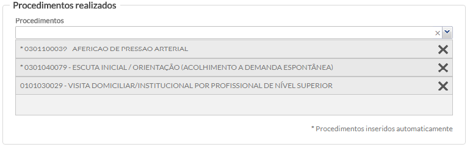

>  **NOTA:** Se forem preenchidos os grupos **Antropometria**, no que se refere a peso e altura, **Sinais** **vitais** e **Glicemia**, os procedimentos que correspondem a essas ações serão inseridos no grupo **Procedimentos** **realizados** automaticamente.

- Passo 6. Faça o Desfecho da Escuta Inicial do cidadão escolhendo uma das ações a seguir:

- **liberar cidadão:** libera o cidadão da lista de atendimentos, para os casos em que o problema foi resolvido na própria escuta inicial ou nos casos em que se possa agendar uma consulta;

- **adicionar na lista de atendimento:** para os casos em que o cidadão precisa de outro atendimento e/ou serviço na unidade de saúde no mesmo dia, o cidadão será reinserido na lista de atendimento e permanece com a situação "Aguardando atendimento" para que ele possa ser atendido/consultado por outro profissional;

>  **ATENÇÃO**: Caso o cidadão seja incluído na lista de atendimento para a aplicação de vacinas deve ser marcado a opção "**Vacina**" para que a equipe da sala de vacina identifique- o na lista de atendimento e realize o registro da aplicação.

- **agendar consulta:** Adicionalmente, é possível, para os casos em que o problema não foi resolvido, agendar uma consulta para um profissional, na data, turno e horário disponível. Na agenda do profissional, será adicionada esta nova consulta.

- Passo 7. Clique no botão  para concluir o atendimento e salvar as informações.

Só é permitido realizar uma escuta inicial para cada atendimento, e não é permitido a edição, nem a exclusão dessas informações. No caso em que o usuário tenha acessado a escuta inicial por engano, é possível cancelar essa ação, se a escuta não tiver sido "finalizada". Para isso, deve- se ir até o fim da página e clicar no botão 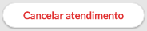.

>  **ATENÇÃO**: para interromper um atendimento iniciado de forma equivocada, é importante usar o botão "cancelar atendimento", caso contrário, o atendimento ficará travado e aguardando ser finalizado pelo profissional que iniciou o atendimento, não sendo possível que outro profissional o atenda.

# 6.3 Realizar Vacinação

O módulo de vacinação é mais uma novidade na versão 3.0, possibilitando a organização do processo de trabalho, o registro das vacinas, imunoglobulinas e soros que fazem parte do Programa Nacional de Imunização (PNI) do Ministério da Saúde, contribuindo, dessa forma, para o controle, erradicação e eliminação de doenças imunopreveníveis. O PNI define o calendário de vacinação com orientações específicas para crianças, adolescentes, adultos, gestantes e idosos. Sendo assim, a equipe da Atenção Básica realiza a verificação da caderneta para avaliar a situação vacinal e encaminha a população à unidade de saúde para iniciar ou completar o esquema vacinal, conforme o calendário de vacinação. A partir de então, começa o fluxo de atendimento no PEC.

## 6.3.1 Registrar Vacina Aplicada

O registro da vacina no fluxo de atendimento do PEC é ativado pela opção "Vacina" marcada na inclusão do cidadão na lista de atendimento ou nos blocos de desfecho da escuta inicial e atendimentos realizados na UBS como demonstrado nos tópicos anteriores. Caso esta opção seja selecionada o botão "Realizar Vacinação" estará disponível como mostra a imagem a seguir:

Figura 6.9 - Opção de registro da Vacinação

Fonte: SAPS/MS.

Após clicar em  realizar vacinação estará disponível o registro da vacinação no PEC.

Figura 6.10 - Tela de registro da Vacinação

Fonte: SAPS/MS.

A tela para registrar a vacinação apresenta os seguintes Blocos de preenchimento: a) Condições; b) Vacinação e c) Desfecho. Neste subcapítulo abordaremos sobre os blocos "Condições" e "Vacinação".

**CONDIÇÕES**

Este bloco apresenta ao profissional as condições específicas relacionadas ao cidadão que será vacinado. As condições são "Gestante", "Puérpera" e "Viajante".

Figura 6.11 - Bloco de Condições do Registro de Vacinação

Fonte: SAPS/MS.

**VACINAÇÃO**

Este bloco apresenta os recursos disponíveis para o registro da vacinação. O quadro de vacinação é apresentado conforme figura abaixo:

Figura 6.12 - Quadro para o registro dos imunobiológicos
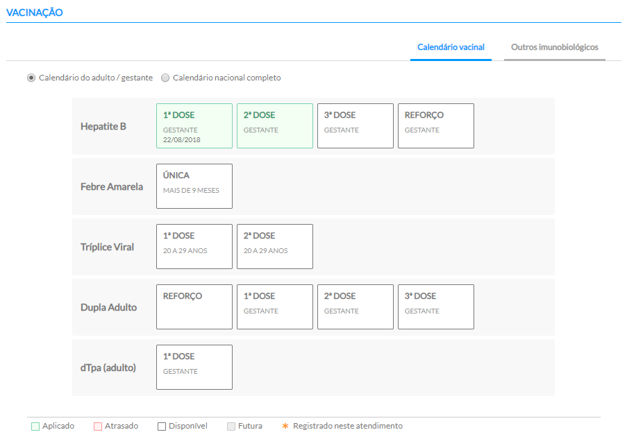

Neste quadro é possível visualizar o status da situação vacinal de cada imunobiológico. Se a vacina estiver em dia, o quadro da "DOSE" do imunobiológico aparecerá na cor verde. Caso a vacina esteja atrasada aparecerá na cor vermelha. Se a dose a ser aplicada fazer parte do calendário vacinal do cidadão e estiver no tempo para ser realizada, o quadro aparecerá na cor branca como disponível. Os quadros das "DOSES" das vacinas na cor cinza significam que são doses a serem aplicadas futuramente.

Quando aparecer um asterisco  no quadro "DOSE" do imunobiológico significa que esta vacina foi registrada no atendimento.

Para registrar uma vacina aplicada siga as seguintes etapas:

1\. É possível visualizar o calendário vacinal de acordo com o ciclo de vida (criança, adolescente, adulto e idoso) ou pelo calendário nacional completo;
2\. Clique sobre a "Dose" do imunobiológico que será administrado. Após será aberta uma nova tela "ADICIONAR VACINAÇÃO" conforme a figura 6.9:

Figura 6.13 - Tela para adicionar vacinação

3\. Se o registro for de uma dose da vacina administrada no momento, o botão permanece, por padrão, como "Não" . Caso seja para um registro de dose administrada em outro dia ou em outro local de atendimento, com a finalidade de atualizar a caderneta do cidadão no PEC, então deve- se mover o botão para "SIM" . Esta última funcionalidade será detalhada mais adiante.

4\. Os campos para o registro do "Imunobiológico" e "dose" aparecerão conforme a seleção realizada pelo profissional de saúde na tela do quadro de vacinação (Figura 6.8), não sendo possível a sua alteração.

5\. Selecionar a estratégia de vacinação no campo "Estratégia", que é de preenchimento obrigatório.

6\. Selecionar no campo "Lote/Fabricante", o número de fabricação do lote que se encontra, geralmente, no frasco do imunobiológico, assim como o nome do fabricante da vacina. Caso o lote e fabricante não estejam disponíveis, é possível realizar a sua inclusão. Veja como realizar esta operação no tópico **6.3.1.1** a seguir.

7\. Selecione a opção desejada nos combos "Via de administração" e "Local de aplicação". Caso seja necessário, descreva as observações no campo com este destino.

8\. Ao final destas etapas clique em "SALVAR" e aparecerá a mensagem "Registro salvo com sucesso". Caso esteja faltando o preenchimento de algum campo obrigatório, o registro não será salvo e o sistema emitirá um alerta informando qual(is) campo(s) não foram preenchidos.

>  **ATENÇÃO:** os profissionais de saúde que realizam a administração de imunobiológicos deverão seguir as normas e procedimentos para a vacinação de acordo com o Programa Nacional de Imunização do Ministério da Saúde.

9\. Ainda é possível verificar as informações sobre o registro ao clicar no quadro da dose da vacina administrada (Figura 6.14).

Figura 6.14 - Visualização de Imunobiológico

>  **DICA:** Para aumentar a segurança na aplicação dos imunobiológicos o sistema emite alertas quando da tentativa de registro de uma dose que não seja recomendada para o cidadão (Figura 6.15).

Figura 6.15 - Confirmação de registro de dose advertida

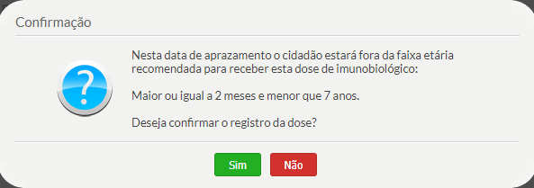

### 6.3.1.1 Cadastrar lote e fabricante

Caso o lote e o fabricante não estejam previamente cadastrado no sistema é possível realizar a inserção destas informações a partir da opção "+ Adicionar novo".

Serão disponibilizados mais campos para a realização da operação conforme a figura a seguir:

Siga os passos as seguir para cadastrar novos lotes e fabricantes de uma vacina.

- Passo 1. No campo "Cadastrar lote" digite o número do Lote, o nome do Fabricante e a Data de validade contida no frasco/embalagem do imunobiológico. Observe que todos esses campos são de preenchimento
obrigatório.

- Passo 2. Caso o Lote, Fabricante e a Data de validade que foi adicionado no campo "Cadastrar lote" já esteja cadastrado no sistema irá aparecer a mensagem "Este lote de imunobiológico já está cadastrado", conforme a figura 6.16. Nesta situação, clique em "OK" e após na opção  que removerá os campos para cadastro de lote e voltará exibir o combo "Lote/Fabricante".

Figura 6.16. Mensagem de Alerta

## 6.3.2. Registrar dose anterior

Aproveitando a oportunidade do registro da dose aplicada no cidadão é recomendado também registrar as doses anteriores com a finalidade de atualizar o calendário vacinal. Para registrar uma dose anterior siga as seguintes etapas.

1\. É possível visualizar o calendário vacinal de acordo com o ciclo de vida (criança, adolescente, adulto e idoso) ou pelo calendário nacional completo;

2\. Clique sobre a "Dose" do imunobiológico que será administrado. Após será aberta uma nova tela "ADICIONAR VACINAÇÃO" conforme a figura 6.9, visto anteriormente.

3\. Mova o botão "É registro anterior?" até que apareça a palavra "Sim" . Após essa ação aparecerá a tela conforme a figura abaixo:

Figura 6.18 - Tela para adicionar doses de vacinas aplicadas anteriormente

4\. Os combos para o registro do "Imunobiológico" e "dose" aparecerão conforme a seleção realizada pelo profissional de saúde na tela do quadro de vacinação (Figura 6.18), não sendo possível a sua alteração.

5\. Registrar a data de aplicação (campo obrigatório), o número do lote e do fabricante, se houver essa informação na caderneta apresentada pelo cidadão, além de observações, caso necessário, no campo específico para esse fim.

6\. Ao final destas etapas clique em "SALVAR" e aparecerá a mensagem "Registro salvo com sucesso". Caso esteja faltando o preenchimento de algum campo obrigatório, o registro não será salvo e o sistema emitirá um alerta informando qual(is) campo(s) não foram preenchidos.

## 6.3.3. Realizar Aprazamento das doses das vacinas

Quando for o caso, o profissional de saúde poderá aprazar a data do retorno do cidadão para receber a dose subsequente da vacina.

Para realizar o aprazamento siga as seguintes etapas:

1\. Visualize o calendário vacinal de acordo com o ciclo de vida (criança, adolescente, adulto e idoso) ou pelo calendário nacional completo;

2\. Clique sobre a "Dose" do imunobiológico que será registrado e aprazado. Após será aberta a tela "ADICIONAR VACINAÇÃO" conforme a figura 6.9, visto anteriormente.

3\. O aprazamento poderá ser feito por meio da aba "Aprazamento" , com a finalidade de aprazar qualquer dose do calendário vacinal, ou simplesmente por meio do campo "Aprazamento", quando for registrar uma dose aplicada e aprazar a próxima dose. Em ambos os casos, digite a data que o cidadão deverá retornar para receber a dose.

4\. Ao finalizar o registro clique no botão "SALVAR" e o quadro de vacinação aparecerá com a dose aprazada para uma data futura, conforme figura 6.19

Figura 6.19 - Calendário Vacinal com doses de vacinas aprazadas

5\. Ainda é possível verificar as informações sobre o registro ao clicar no quadro da dose da vacina aprazada (Figura 6.20).

Figura 6.20 - Visualização de Imunobiológico

## 6.3.4. Registrar outros imunobiológicos

Caso o imunobiológico a ser administrado não faça parte do calendário nacional de vacina, ou ainda não conste no quadro de vacinação, há a possibilidade de registrar a dose por meio da aba "Outros imunobiológicos".

Ao clicar em "Adicionar dose" aparecerá a tela, de acordo com a Figura 6.17. Em seguida siga os mesmos passos conforme já descrito no subcapítulo 6.3.1 deste manual para a adição de doses de imunobiológico no sistema com PEC.

Figura 6.21 - Tela de adicionar vacinação

Ao clicar em "Salvar" aparecerá a dose aplicada e a aprazada, esta última se for o caso, na tela da aba "Outros imunobiológicos".

## 6.3.5. Finalizar registro de dose aplicada

Para finalizar o registro da(s) dose(s) da(s) vacina(s) aplicada(s) passaremos para o bloco "Desfecho" do módulo de vacinação do sistema com PEC.

**DESFECHO**

Após registrar os dados da vacinação o profissional deve selecionar um desfecho, de modo semelhante ao passo 6 do módulo da "Escuta inicial", e em seguida, clicar em "Finalizar o Atendimento".

Figura 6.22 - Bloco de Desfecho do Registro de Vacinação

Fonte: SAPS/MS.

Após finalizar o atendimento será possível visualizar os registros feitos para este cidadão na ferramenta "HISTÓRICO".

Figura 6.23 - Visualização no Histórico do Registro de Vacinação

Fonte: SAPS/MS.

Clicando em cada "card" apresentado no histórico é possível ver o detalhamento do registro clínico.

Figura 6.24 - Registro de Vacinação no Histórico de Atendimento

Fonte: SAPS/MS.

## 6.3.6 Acompanhamento da situação vacinal

No intuito de proporcionar aos profissionais de saúde o acompanhamento da situação vacinal do cidadão, sob a responsabilidade da equipe, foi desenvolvido no PEC esta funcionalidade que facilita, no momento da consulta, a visualização das vacinas que já foram aplicadas, as que estão em atraso e as que ainda não estão no período indicado.

O *Cartão* minimizado apresenta informações essenciais e objetivas ao acompanhamento da situação vacinal, tais como: Se a vacina está em dia, qual foi a última vacina aplicada e a data em que foi aplicada, conforme a figura abaixo.

Figura 6.25 - Cartão de Vacinação

Ao clicar neste *Cartão* aparecem as vacinas recomendadas segundo o ciclo de vida do cidadão. Caso queira visualizar todas as vacinas de acordo com o PNI clique em "Calendário nacional completo". Neste momento, o profissional de saúde poderá analisar a situação vacinal e indicar a atualização da caderneta de vacinação se existirem vacinas atrasadas ou disponíveis, conforme a figura abaixo.

Figura 6.26 - Acompanhamento da situação do cartão vacinal

### 6.3.6.1 Adicionar doses anteriores

No módulo de acompanhamento da vacinação é possível atualizar a caderneta do cidadão no PEC incluindo as doses que estão na caderneta física de vacinação. Para registrar essas doses clique em  e siga os passos do capítulo 6.3.2.

Figura 6.27 - Adicionar doses anteriores

# 6.4 Atender - Prontuário do Cidadão

Ao clicar na opção  \"Atender\" da lista de atendimentos, o sistema exibirá uma tela com as funcionalidades do Prontuário Eletrônico do Cidadão (Figura 6.21).

Figura 6. 28 - Tela do Prontuário Eletrônico do Cidadão

É por meio do PEC que o profissional de saúde poderá efetuar o registro da consulta, utilizando principalmente, o modelo de Registro Clínico Orientado a Problemas (RCOP), sendo possível acessar as seguintes ferramentas:

- 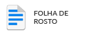 **Folha de Rosto:** ferramenta que permite visualizar um sumário clínico do paciente e que auxilia o profissional a ter acesso rápido aos dados mais relevantes de saúde e de cuidado do cidadão;

-  **SOAP:** ferramenta que orienta a inserção de dados subjetivos, clínicos da saúde do cidadão, o estabelecimento de diagnósticos, o planejamento das ações ou intervenções, além da avaliação dos problemas e das condições de saúde detectadas no atendimento;

-  **Problemas/Condições e Alergias:** ferramenta que permite o registro e gestão da lista de problemas ou outras condições de saúde o cidadão, além do registro de história pregressa do cidadão relacionado a alergias e/ou a reação adversa;

-  **Acompanhamento:** ferramenta que apresenta o resumo estruturado das informações importantes para o acompanhamento de determinados problemas ou condições de saúde do cidadão;

-  **Antecedentes:** ferramenta que permite fazer o registro da história familiar, de patologias pregressas e de saúde do cidadão; é integrada com a lista de problema;

-  **Histórico:** ferramenta que possibilita visualizar com mais detalhes o histórico de atendimentos do cidadão;

-  **Dados Cadastrais:** funcionalidade que permite o acesso rápido e a visualização do cadastro do cidadão;

-  **Finalização do Atendimento:** funcionalidade de controle de finalização do atendimento.

>  **NOTA**: os **técnicos de enfermagem** podem realizar o registro de atendimento por meio da opção "Atender" da lista de atendimento. As funcionalidades disponíveis serão: a folha de rosto, o SOAP restrito ao subjetivo, objetivo e plano com lembretes, visualização de prescrições de medicamentos e orientações, além do acompanhamento, dados cadastrais, fichas CDS e da finalização do atendimento.

## 6.4.1 Folha de Rosto

A folha de rosto, por meio de um sumário clínico do cidadão, oferece acesso rápido a um conjunto de informações importantes do cidadão.

Figura 6.29 - Prontuário do Cidadão - folha de rosto

Fonte: SAPS/MS.

Conforme podemos ver na Figura 6.22, a folha de rosto conta com os seguintes blocos de informações:

- **Escuta inicial:** permite visualizar os registros do atendimento ao cidadão na escuta inicial, caso ele tenha passado por essa escuta;

Fonte: SAPS/MS.

- **Últimos contatos:** exibe os últimos três atendimentos do cidadão na unidade de saúde, permitindo saber quais os problemas/condições avaliadas e quando ocorreram. Caso haja necessidade de ver mais informações do histórico do cidadão é possível clicar no botão "Mais informações";

Fonte: SAPS/MS.

- **Problemas/condições:** exibe os problemas/condições ativos ou latentes do cidadão . Não exibe os problemas/condições resolvidos (estes poderão ser visualizados clicando no ícone "Lista de Problemas");

Fonte: SAPS/MS.

- **Alergias/Reações Adversas**: exibe a lista de alergias e as reações adversas provocadas no cidadão, identificando Agente Causador, Categoria e Criticidade, além da data de instalação. Caso haja necessidade de ver mais informações sobre alergias/reações adversas é possível clicar no botão "Mais informações".

Fonte: SAPS/MS.

- **Vacinação:** apresenta informações em relação a situação vacinal do cidadão, última vacina aplicada, data da aplicação, se existem vacinas atrasadas ou aprazadas. Clicando no botão "Mais informações" é possível acessar o acompanhamento de vacinação do cidadão.

Fonte: SAPS/MS.

- **Medicamentos Ativos:** exibe as medicações em uso contínuo com a data de início da prescrição, além disso, apresenta também as últimas prescrições acompanhadas pela data. Caso haja necessidade de ver mais informações sobre prescrições de medicamentos é possível clicar no botão "Mais informações".

Fonte: SAPS/MS.

- **Lembretes:** exibe os lembretes ativos criados pelo profissional ou por algum membro da equipe (veja como criar lembretes por meio do Plano do SOAP, na Seção 6.4.2.7).

Fonte: SAPS/MS.

Figura 6.30 - Folha de Rosto com informações sumarizadas a partir de registros anteriores

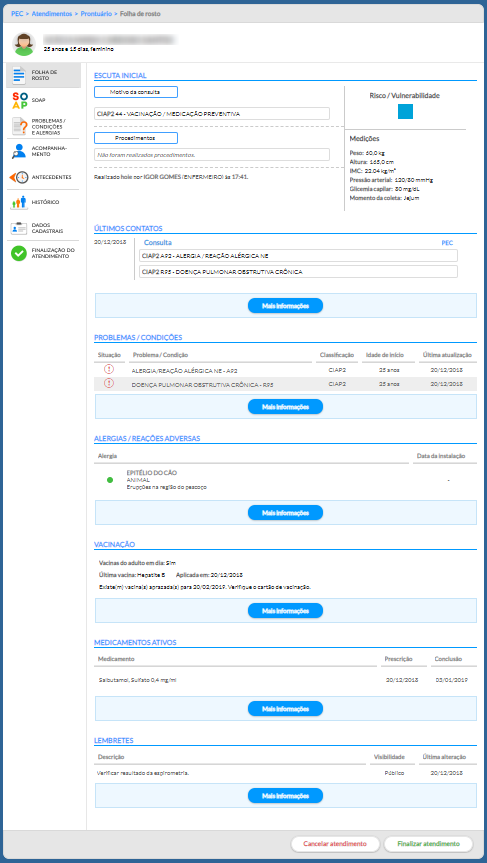

Fonte: SAPS/MS.

## 6.4.2 SOAP

O **SOAP** (Subjetivo, Objetivo, Avaliação e Plano), é o método de registro da **nota de evolução**, permite registrar de forma sintética e estruturada as questões subjetivas do cidadão, além das impressões objetivas sobre o estado geral do cidadão. Pode ainda ser registrado o exame físico, exames complementares, a avaliação, as necessidades ou problemas identificados, e o plano de cuidados realizados no encontro entre o profissional de saúde e o cidadão. O método SOAP é a principal ferramenta para registro do atendimento usada pelo modelo RCOP.

A sigla SOAP corresponde a quatro blocos de informações detalhadas a seguir:

- **(S) subjetivo:** conjunto de campos que possibilita o registro da parte subjetiva da anamnese da consulta, ou seja, os dados dos sentimentos e percepções do cidadão em relação à sua saúde;

- **(O) objetivo:** conjunto de campos que possibilita o registro do exame físico, como os sinais e sintomas detectados, além do registro de resultados de exames realizados;

- **(A) avaliação:** conjunto de campos que possibilita o registro da conclusão feita pelo profissional de saúde a partir dos dados observados nos itens anteriores, como os motivos para aquele encontro, a anamnese do cidadão e dos exames físico e complementares;

- **(P) plano:** conjunto de funcionalidades que permite registrar o plano de cuidado ao cidadão em relação ao(s) problema(s) avaliado(s).

Em especial o Subjetivo (motivo da consulta), Avaliação (problema detectado) e Plano (intervenção- procedimento) vêm acompanhados de uma informação entre parênteses que está relacionada ao uso da Classificação Internacional de Atenção Primária - 2ª edição (CIAP2), conforme podemos ver no diagrama da Figura 6.15.

Figura 6.31 - Uso da CIAP2 no registro do atendimento

Fonte: CIAP2, 2008.

Para fazer melhor uso da informação, a definição abaixo nos auxilia a entender o conceito de **episódio de cuidado**, caracterizado pelo registro desses três elementos da consulta:

> *"Os motivos da consulta, os problemas de saúde/diagnósticos, e os procedimentos para o cuidado/intervenções são a base de um episódio de cuidados, constituído por uma ou mais consultas incluindo as alterações ao longo do tempo. Por conseguinte, um episódio de cuidados refere- se a todo tipo de atenção prestada a determinado indivíduo que apresente um problema de saúde ou uma doença. Quando esses episódios são introduzidos no processo informatizado de um paciente com base na CIAP2, é possível avaliar a necessidade de cuidados de saúde, a abrangência, o grau de integração, de acessibilidade e responsabilidade.*" (CIAP2, 2008)

Ao fazer a associação do registro via SOAP a uma classificação adequada ao processo de trabalho das equipes de Atenção Básica, o sistema potencializa o uso da informação de registro do atendimento a médio e longo prazo, possibilitando melhor avaliação da situação de saúde da população no território e ampliando a capacidade do sistema de produzir conhecimento novo e estruturado.

>  **NOTA**: para mais informações sobre como utilizar a CIAP 2, acesse o [Guia Rápido](http://189.28.128.100/dab/docs/portaldab/documentos/guia_CIAP2.pdf), no site do e-SUS APS.

### 6.4.2.1 SOAP - Subjetivo

**S** O A P

O registro da parte subjetiva pode ser realizado usando um campo aberto e/ou por meio de codificação dos motivos da consulta usando a CIAP2 e algumas notas, quando necessário. Ainda é possível registrar (em campo aberto) se o cidadão está sendo acompanhado por algum especialista em relação ao motivo da consulta.

Figura 6.32 - SOAP - Subjetivo (motivo da consulta)

Fonte: SAPS/MS.

Para adicionar um motivo de consulta usando a CIAP2, siga os passos:

- Passo 1. Preencha o campo CIAP2 para localizar o código;

- Passo 2. Caso necessário, é possível complementar a informação com uma nota explicativa.

- Passo 3. Clique no botão  para concluir a inserção do código;

- Passo 4. Ao inserir o motivo da consulta, o sistema irá criar uma lista de motivos da consulta registrados. Caso queira editar ou  excluir o registro, clique, respectivamente, nos ícones  "Editar" e  "Excluir" na lista de motivos da consulta.

### 6.4.2.2 SOAP - Objetivo

S **O** A P

O registro do "Objetivo", conforme a Figura 6.26, pode ser realizado usando campos abertos e/ou estruturados para anotar sinais e sintomas percebidos pelo profissional de saúde durante o atendimento.  O sistema oferece um bloco de campos estruturados para facilitar o preenchimento das aferições mais frequentes na consulta. Os campos disponíveis são:

- **Antropometria**:

 - Perímetro cefálico: registrar em centímetros (cm);
 - Peso: registrar em quilogramas (kg);
 - Altura: registrar em centímetros (cm);
 - Índice de massa corpórea (IMC): calculado automaticamente a partir da inserção dos dados referentes ao peso e à altura do cidadão;
 - Perímetro da panturrilha: registrar em centímetros (cm).

- **Sinais vitais**:
 - Pressão arterial (PA): o campo para registro da PA é no formato SSS/DDD, onde SSS é a pressão sistólica e DDD é a pressão diastólica, medidas em milímetros de mercúrio (mmHg);
 - Frequência respiratória: registrar em movimentos por minuto (mpm);
 - Frequência cardíaca: registrar em batimentos por minuto (bpm);
 - Temperatura: temperatura corporal, registrar em graus Celsius (°C);
 - Saturação O2: saturação do oxigênio no sangue, registrar em percentual (%);

- **Vacinação**:

 - Vacinação em dia: campo destinado a informar se a vacinação do indivíduo, em qualquer faixa etária, está atualizada ou não, observando as normas preconizadas pelo Programa Nacional de Imunização (PNI) do Ministério da Saúde sobre o calendário vacinal nacional.

- **Glicemia**:
 - Glicemia capilar: registrar em miligramas por decilitro (mg/dL). É necessário informar se, no **momento da coleta**, o cidadão encontrava-se na situação de jejum, pré-prandial, pós-prandial ou não especificado.

Figura 6.33 - SOAP - Objetivo

Fonte: SAPS/MS.

Para os casos em que o cidadão em atendimento é do sexo feminino, o bloco "Mulher" é disponibilizado, como mostra a Figura 6.34.

Figura 6.34 - SOAP - Objetivo - grupo mulher (sem DUM registrada)

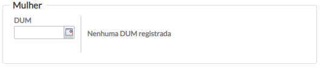

Fonte: SAPS/MS.

- **DUM (Data da Última Menstruação):** neste campo, é possível registrar a data da última menstruação da cidadã em atendimento, mesmo que não haja suspeita ou condição de gravidez. Após salvo o registro da DUM aparece a informação conforme figura abaixo.

Figura 6.35 - SOAP - Objetivo - grupo mulher (com DUM registrada)

Fonte: SAPS/MS.

No bloco "Objetivo", é possível gerenciar exames solicitados, avaliados e seus resultados. Itens solicitados por meio da ferramenta "Exames" do PEC são mostrados no grupo "Exames solicitados e/ou avaliados" no atendimento seguinte. Para mais detalhes sobre como solicitar exames pelo sistema, ver o tópico "Plano", na Seção 6.4.2.4. A lista será exibida conforme a Figura 6.29.

Figura 6.36 - SOAP - Objetivo - lista de exames

Fonte: SAPS/MS.

Para informar o resultado de um exame já solicitado, siga os passos descritos abaixo:

- Passo 1. Clique no botão \"Informar Resultado\"  do exame - o sistema apresentará uma tela, conforme a Figura 6.37;

- Passo 2. o bloco "Solicitação", será mostrado o nome do exame em questão, a data da solicitação, os dados do profissional e UBS que realizou a solicitação;

- Passo 3. No bloco "Resultados", informe a data de realização, a data do resultado e a descrição sobre o(s) resultado(s) do exame;

- Passo 4. No caso de ser um exame específico, algumas outras informações aparecerão no bloco \"Resultado de exame específico\" para serem preenchidas;

- Passo 5. Para concluir, clique em \"Salvar\".

Figura 6.37 - SOAP - Objetivo - entrada de resultado de exame previamente solicitado via PEC

Fonte: SAPS/MS.

É possível registrar exames não solicitados por meio do PEC, mas que foram trazidos pelo cidadão em atendimento. Para isso, siga os passos abaixo:

- Passo 1. Clique no botão \"Adicionar\" no bloco "Exames solicitados e/ou avaliados" - o sistema apresentará uma tela, conforme a Figura 6.31;

- Passo 2. No bloco "Solicitação", informe o exame e a data que ele foi solicitado;

- Passo 3. No bloco "Resultados", informe a data de realização, a data do resultado e a descrição referente ao(s) resultado(s) do(s) exame(s);

- Passo 4. Caso seja um exame específico, algumas outras informações aparecerão no bloco \"Resultado de exame específico\" para serem preenchidas;

- Passo 5. Para concluir, clique em \"Salvar\".

Figura 6.37 - SOAP - Objetivo - adicionar resultado de exame não solicitado via PEC

Fonte: SAPS/MS.

Alguns exames requerem o registro de dados específicos dos resultados. Estes resultados são utilizados em outras seções do PEC. Um exemplo é o exame de dosagem de hemoglobina glicosilada, onde é possível registrar o resultado em percentil (%), como mostra a imagem abaixo:

Figura 6.38 - Registro de dados específicos de Resultado de Exame

Para facilitar a busca dos exames solicitados ou avaliados o recurso de filtro  permite selecionar o período na qual se quer fazer a pesquisa e ainda exibir os exames com resultado e/ou sem resultado, conforme figura abaixo:

Fonte: SAPS/MS.

### 6.4.2.3 SOAP - Avaliação

S O **A** P

Neste campo é registrado a avaliação do cidadão feito pelo profissional de saúde, considerando o raciocínio clínico baseado na análise dos blocos "Subjetivo" e "Objetivo". Aqui podem ser colocadas as hipóteses de diagnóstico ou diagnóstico codificado.

O código do problema e/ou condição detectada ou avaliada durante o atendimento é de preenchimento obrigatório, sendo necessário informar pelo menos um código, CIAP2 ou CID10. Caso seja necessário, também poderá ser incluída uma nota, conforme podemos ver na Figura 6.33.

Figura 6.39 - SOAP - Avaliação

Fonte: SAPS/MS.

Caso o profissional decida acompanhar o problema/condição avaliada, em consultas posteriores, é possível incluí-lo na Lista de Problemas/Condições como situação "Ativo".

Para registrar uma avaliação ou problema detectado, siga os passos:

- Passo 1. Informe o código CIAP2;

- Passo 2. Após informar o código CIAP2, para registros de profissional médico ou odontólogo, é possível marcar a opção "Filtro CID10 X CIAP2", que possibilita restringir a lista de códigos CID10 em relação a um código da CIAP2; logo depois, informe o CID10;

- Passo 3. Caso necessário, registre alguma nota relacionada com o problema detectado;

- Passo 4. Se houver necessidade de acompanhar este problema/condição, marque a opção "Inserir na Lista de Problemas/Condições como ativo";

- Passo 5. Por último, clique no botão \"Confirmar\" para concluir.

>  **ATENÇÃO:** Não é possível informar mais de uma vez a mesma codificação CIAP2/CID10, ou seja, repetido. Então, se não conseguir adicionar um problema/condição esteja atento a essa situação.

### 6.4.2.4 SOAP - Plano

S O A **P**

Após identificar os problemas/condições de saúde do cidadão que está demandando cuidados, a última parte do SOAP possibilita o registro das informações do plano de cuidado. O sistema oferece uma estrutura que permite registro rápido do plano por meio de um campo de texto e/ou usando códigos para o registro de procedimentos e intervenções, conforme Figura 6.34.

Na versão 3.2 o profissional pode realizar o registro de procedimentos clínicos realizados utilizando duas classificações: a Tabela de Procedimentos do SUS (SIGTAP) e o Capítulo de procedimentos da CIAP2. Este campo novo apresenta apenas procedimentos clínicos, ou seja, procedimentos que podem ser executados diretamente no cuidado ao cidadão.

Figura 6.40 - SOAP - Plano

Fonte: SAPS/MS.

O sistema ainda disponibiliza algumas ferramentas específicas para auxiliar no registro e acompanhamento do plano de cuidado, como vemos a seguir:

- **Atestados:** ferramenta que ajuda o profissional na emissão e controle de atestados e de licença maternidade elaborados para o cidadão;

- **Exames:** ferramenta que auxilia o profissional na solicitação de exame comum e/ou de alto custo;

- **Lembretes:** ferramenta que auxilia o profissional a registrar lembretes para serem visualizados, por meio da folha de rosto, nas próximas consultas;

- **Prescrição de medicamentos:** ferramenta que auxilia o profissional nas prescrições medicamentosas no atendimento ao cidadão, na visualização do histórico de prescrições e da lista de medicamentos, além da impressão dos receituários com as medicações prescritas no momento;

- **Orientações:** ferramenta que auxilia o profissional na elaboração de recomendações para o cidadão;

- **Encaminhamentos:** ferramenta de registro e geração de impressão da guia de referência e contra referência para atendimento em outros níveis de atenção à saúde.

Será apresentada, nas próximas seções, cada uma dessas ferramentas com mais detalhes.

#### 6.4.2.4.1 Ferramentas do Plano - Atestado

O atestado é um documento de conteúdo informativo, redigido e assinado por **médicos e odontólogos**, de acordo com a Lei nº 605/49, combinada com a Lei nº 5.081/66, como \"atestação\" da existência de certa obrigação ou de ato por ele praticado. Podendo o beneficiário do atestado requerer os direitos daquilo que foi declarado, como os abonos de faltas ao trabalho.

Figura 6.41 - SOAP - Plano - Atestado

Fonte: SAPS/MS.

Conforme podemos ver na Figura 6.35, para emitir um atestado, basta seguir os passos:

- Passo 1. Clique na ferramenta "Atestados";

- Passo 2. Escolha uma das opções: "*Em branco*", "*Padrão*" ou "*Licença maternidade*"

**Em Branco**: um campo para descrição livre será disponibilizado para o profissional preencher, conforme a necessidade do atendimento (Figura 6.36);

Figura 6.42 - Ferramenta Atestado com a função Em branco

 **Padrão**: um modelo de atestado será disponibilizado. O profissional deverá preencher os campos obrigatórios: data, hora e dias, além do campo CID10, este último não é obrigatório (Figura 6.37). Caso seja informado o CID 10, é possível escolher se esse código também será impresso no atestado. Para isso, selecione a opção "Imprimir CID10". Ao selecionar essa opção, o atestado impresso, também apresentará uma declaração para assinatura do cidadão autorizando o médico o registro e a apresentação do diagnóstico codificado (CID10) no atestado emitido;

Figura 6.43 - Ferramenta Atestado com a função Padrão

**Licença maternidade**: um modelo de licença- maternidade será disponibilizado com os dados do cidadão já preenchidos automaticamente. Caso ele não possua o CNS ou CPF cadastrados, poderá informar manualmente no atestado. Esta opção estará disponível apenas no atendimento de pessoas do sexo feminino e na condição de gravidez na Lista de Problemas/Condições com a situação Ativo (Figura 6.38);

Figura 6.44 - Ferramenta Atestados com a função Licença Maternidade

- Passo 3. Para concluir as emissões dos atestados clique em "Salvar".

Ao criar um atestado, na listagem de atestados, aparecerão algumas opções por padrão. São elas:

 **Imprimir**: será apresentada a tela com o atestado em modo de impressão;

 **Visualizar**: os dados do atestado serão apresentados somente para visualização;

 **Excluir**: retirar um atestado da listagem. O sistema solicitará a confirmação da exclusão;

 **Editar**: apresentar os dados do atestado em modo de edição. Após as alterações, clique no botão "Salvar".

#### 6.4.2.4.2 Ferramentas do Plano - Exames

Nesta ferramenta, é possível solicitar exames para o cidadão em atendimento. Exames cadastrados neste módulo irão ser incluídos no bloco "Objetivo" do registro de atendimento do SOAP, na parte de exames solicitados e/ou avaliados, após a finalização da consulta em que eles foram inseridos.

Como podemos ver na Figura 6.45, há duas opções para solicitação de exames:

Figura 6.45 - SOAP - Plano - exames

Fonte: SAPS/MS.

Os exames que têm alta complexidade são classificados como exames de **alto custo**. Os exames que têm menor custo e baixa densidade tecnológica são classificados como exames **comuns** e não precisam de detalhamento maior, apenas os dados clínicos do cidadão.

##### 6.4.2.4.2.1 Solicitar um exame **Comum**:

Para criar uma solicitação de exame **Comum** basta seguir os passos a seguir:

- Passo 1. Clique na opção \"Adicionar exame comum\" , conforme vimos na Figura 6.45;

Figura 6.46 - Adicionar exames

- Passo 2. Para adicionar um exame, utilize o campo "Exame", digitando parte ou todo o nome do exame desejado, e selecione o exame por meio da lista que será exibida;

- Passo 3. Também poderá ser informado o CID 10, entretanto, esse item não é obrigatório;

- Passo 4. Justificar o procedimento relatando o motivo da solicitação do exame comum;

- Passo 5. Para mais anotações importantes basta preencher o campo observações.

O sistema também oferece as "Opções rápidas".

Figura 6.47 - Opções Rápidas

Esta é uma alternativa que agiliza a requisição de exames, visto que são apresentados combos de exames previamente selecionados para cada condição (gestante 1º, 2º e 3º trimestre, além dos exames de risco cardiovascular). Clique na opção  \"Adicionar\" para incluir um grupo de exames, ao clicar aparecerá uma lista de exames. Em seguida siga os passos:

- Passo 1. Caso o profissional queira adicionar outros exames além dos apresentados na lista de cada grupo, basta adicionar no campo "Exame";

- Passo 2. Marque os exames que deseja adicionar;

- Passo 3. Para concluir, clique no botão .

##### 6.4.2.4.2.2 Solicitar exames de **Alto Custo**

Para cadastrar a solicitação de um exame de "**Alto Custo**" é necessário adicionar o exame e justificar a solicitação, informando o CID10 e motivo do procedimento, de acordo com os passos a seguir:

- Passo 1. Clique na opção \"Adicionar exame alto custo\" , conforme vimos na Figura 6.39;

Figura 6.48 - Adicionar exame de Alto Custo

- Passo 2. Para adicionar um exame de alto custo, utilize o campo de busca "Exame", digitando parte ou todo o nome do exame desejado, e selecione o item desejado por meio da lista que será exibida;

- Passo 3. Preencha o código CID10 por meio do campo de busca "CID10". O CID10 deve ser aquele que justifica a solicitação do exame;

- Passo 4. Preencha a "Justificativa do procedimento";

- Passo 5. Para concluir, clique no botão .

Figura 6.49 - SOAP - Plano - exames - solicitações do atendimento

Após cadastrar aparecerá uma lista de exames no bloco "Solicitações do atendimento", conforme exemplo da Figura 6.49.

- Ao clicar no botão "Imprimir" será apresentada a tela com a solicitação de exame em modo de impressão;

- Ao clicar no botão  excluirá uma solicitação de exames. O sistema solicitará a confirmação da exclusão;

- Ao clicar sobre o nome do exame é possível editar algum dado da solicitação de exames. Após as alterações, clique no botão "Salvar".

#### 6.4.2.4.3 Ferramentas do Plano - Lembrete

Nesta ferramenta, é possível cadastrar lembretes para as próximas consultas, permitindo anotar informações importantes a respeito do atendimento e/ou do indivíduo que devam ser retomadas pelo profissional ou pela equipe.

Figura 6.50 - SOAP - Plano - lembretes

Fonte: SAPS/MS.

Para adicionar um lembrete, siga os passos:

- Passo 1. Clique no botão "Lembrete";

- Passo 2. Clique no botão \"Adicionar\";

- Passo 3. Antes do preenchimento o lembrete poderá ter visualização controlada ao selecionar \"Público\", dessa forma, o lembrete será visualizado por todos os profissionais. Ao selecionar \"Somente eu\", restringirá o acesso ao profissional que está adicionando o lembrete;

Figura 6.51 - Adicionar lembrete

- Passo 4. Escreva o lembrete e clique no botão "Salvar" para concluir;

Os lembretes só poderão ser editados enquanto o atendimento em que eles foram adicionados não for finalizado. Os atendimentos anteriores, já finalizados, não poderão ser editados.

Na listagem de lembretes, na primeira coluna (mais à esquerda), terá a opção "Ativo", conforme Figura 6.52. Cada registro tem uma caixa de seleção desta alternativa. Se selecionada, o lembrete estará ativo, portanto será visualizado na Folha de Rosto do prontuário do cidadão. Para mudar a situação basta clicar no checkbox "Ativo" desativando a visualização do lembrete.

Figura 6.52 - SOAP - Plano - lembretes

Fonte: SAPS/MS.

>  **ATENÇÃO:** Lembretes desativados não poderão ter a descrição alterada e não aparecerá mais na folha de rosto do cidadão.

#### 6.4.2.4.4 Ferramentas do Plano - Prescrição de Medicamentos

Esta ferramenta permite fazer a prescrição de medicamentos, contendo orientação de uso para o paciente, efetuada por profissional legalmente habilitado, podendo ser de lista padrão (pré- definida pelo CATMAT[^1]) ou descrição em texto livre (Registro Manual).

Como podemos ver na Figura 6.53, a ferramenta de prescrição de medicamentos inicia pela lista de medicamentos, possibilitando que o profissional observe os medicamentos que estão "Em uso" , ou os medicamento de "Uso contínuo" 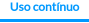, ou os que tiveram o "Tratamento concluído" , mas que possam ter alguma influência no tratamento atual. É possível por meio do botão recomendações , visualizar as recomendações feitas para cada medicamento prescrito. Ainda, por meio do botão replicar , qualquer medicamento pode ser copiado para a prescrição atual.

Figura 6.53 - SOAP - Plano - Prescrição de Medicamentos

Fonte: SAPS/MS.

Na aba de \"Histórico de prescrições\", como podemos ver na Figura 6.54, visualiza- se o histórico dos medicamentos prescritos ao cidadão, organizados por prescritor e data da prescrição. Assim como na lista de medicamentos é possível replicar  ou visualizar as recomendações para uso do medicamento clicando no botão .

Figura 6.54 - SOAP - Plano - Prescrição de Medicamentos - Histórico de prescrições

Fonte: SAPS/MS.

Para criar uma receita, siga os passos:

- Passo 1. Clique em "Prescrição do Atendimento",em seguida no botão "adicionar" e exibirá uma tela para a criação da receita;

Figura 6.55 - Adicionar medicamentos no receituário

- Passo 2. Para compor o receituário, observe que existem campos obrigatórios para preenchimento da prescrição de um medicamento. Os campos para prescrição são:

 - Princípio Ativo/Medicamento
 - Via de administração
 - Posologia [^2]:
 - Período de Tratamento
 - Recomendações
 - Fornecimento

 **Princípio Ativo/Medicamento**: lista de medicamentos do CATMAT, controlado pela Anvisa e pelo DAF/SCTIE/MS. Os campos Concentração, Forma Farmacêutica e Tipo de Receita, já são preenchidos automaticamente a partir do medicamento selecionado;

**Via de administração**: é a via de administração do medicamento;

**Posologia[^2]**: descreve a dose do medicamento e a frequência na qual deve ser administrado. A frequência da dose pode ser definida por meio de Intervalo (em horas), Frequência (vezes dentro de um período) ou Turno (manhã, tarde ou noite). Utilize a opção "Dose única"  caso o medicamento seja administrado em dose única (Figura 6.56).

Figura 6.56 - Posologia e Frequência da dose

**Período de Tratamento**: define o período de início e fim do tratamento; Utilize a opção "Uso contínuo"  caso o medicamento seja para tratamento de condições crônicas ou cronificadas. Essa opção auxilia na gestão da prescrição de medicamentos, incluindo este na lista de medicamentos de uso contínuo.

**Recomendações**: as orientações sobre a forma de administração ou cuidados relacionados ao tratamento.

**Fornecimento**: onde se deve informar a quantidade de unidades ou apresentação da medicação a ser fornecida ao cidadão a partir da prescrição do tratamento;

- Passo 3. Para concluir, clique em "Salvar" ;

- Passo 4. Para adicionar mais de um medicamento na receita, preencha novamente os campos da prescrição e clique em "Salvar", o sistema irá exibir uma lista lateral com os medicamento prescritos durante o atendimento;

- Passo 5. Para finalizar clique no botão "Fechar" .

>  **NOTA**: as regras por medicamento, determinam o tipo de receita e consequentemente o tipo de impressão a ser gerada de acordo com o tipo de medicamento listado na receita. Caso existam medicamentos para tipos de receitas diferentes o sistema irá distribuí-los nos impressos adequados, automaticamente.

>  **NOTA**: caso seja necessário prescrever um medicamento que esteja fora da lista padrão, use a opção "Registro manual" . Essa forma de prescrição não traz as informações de Princípio Ativo, Concentração, Forma Farmacêutica e Tipo de Receita, por padrão, sendo necessário o seu preenchimento.

Caso a UBS utilize o Sistema Hórus para gestão da farmácia será possível realizar a consulta de disponibilidade do medicamento prescrito. A indicação de ativação da integração com o Hórus é representada pelo ícone  ativo, como vimos, anteriormente, no bloco de fornecimento. Ao final da prescrição do medicamento será exibida a lista de estabelecimentos que tem o medicamento disponível, por meio da coluna "Disponibilidade".

Figura 6.57 - Exemplo de disponibilidade de medicamentos

Fonte: SAPS/MS.

>  **NOTA**: caso sua UBS tenha implantado o Sistema Hórus e o recurso não esteja disponível, é necessário verificar se o recurso está habilitado. Para mais detalhes ver Seção 3.1.7.

- Passo 6. Para imprimir a receita elaborada na consulta, clique no botão \"Imprimir prescrições deste atendimento\" .

Figura 6.58 - Prescrição do Atendimento

Fonte: SAPS/MS.

O sistema exibirá uma tela onde será possível organizar os impressos conforme a necessidade, ver exemplo na Figura 6.59. Para utilizar as definições padrões, basta manter selecionado todos os medicamentos.

Figura 6.59 - SOAP - Plano - Prescrição de Medicamentos

Fonte: SAPS/MS.

- Passo 7. Por fim, para imprimir a prescrição dos medicamentos a serem entregues para o cidadão clique sobre o botão "Imprimir". Em seguida, aparecerá a receita conforme a figura 6.60.

Figura 6.60 - Modelo do Receituário Impresso no PEC

#### 6.4.2.4.5 Ferramentas do Plano - Orientações

Esta ferramenta permite ao profissional de saúde registrar orientações a serem entregues ao paciente. Por exemplo, podem ser escritas orientações alimentares ou sobre cuidados a sua saúde.

Figura 6.61 - SOAP - Plano - orientações

Fonte: SAPS/MS.

Para adicionar uma orientação, siga os passos:

- Passo 1. Clique em "Orientações", em seguida Clique no botão \"Adicionar\";

- Passo 2. Registre as orientações a serem fornecidas no campo "Descrição" e, em seguida, clique no botão "Salvar" (Figura 6.62);

Figura 6.62 - Campo para descrição das orientações

- Passo 3. Ao clicar em "Salvar" serão apresentadas as informações conforme a figura abaixo:

Figura 6.66 - Adicionar Orientações

- Passo 4. Para imprimir basta selecionar no botão  e em seguida aparecerá uma tela com as orientações prescritas.

Figura 6.67 - Orientações

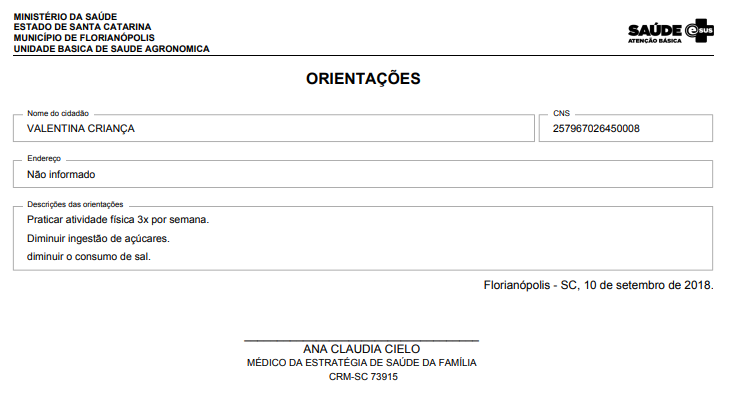

#### 6.4.2.4.6 Ferramentas do Plano - Encaminhamentos

Esta ferramenta oferta aos profissionais a possibilidade de registrar e gerar a impressão da solicitação de encaminhamento para atendimento em serviços de atenção especializada.

Figura 6.68 - Tela de Encaminhamentos

Fonte: SAPS/MS.

É possível visualizar todos os encaminhamentos solicitados para o cidadão em atendimento. O componente de filtro permite a busca pelo profissional solicitante, pela especialidade e pela data. Caso o profissional queira verificar apenas as suas solicitações, basta clicar na opção "somente os meus".

Para incluir nova solicitação, clique no botão "Adicionar".

Figura 6.69 - Tela de solicitação de Encaminhamento

Para o registro do encaminhamento são necessárias as informações da especialidade a ser solicitada, opcionalmente, é possível incluir complemento à especialidade, por exemplo:

Também é necessário um código CID10 ou CIAP2 (a depender da categoria profissional que está solicitando o encaminhamento) relacionado a avaliação realizada durante a consulta e a necessidade do encaminhamento.

A classificação de risco também é um campo de preenchimento obrigatório, podendo ser: eletivo, prioritário, urgência ou emergência. A classificação utilizada nesta ferramenta obedece ao padrão determinado pelo **Sistema Nacional de Regulação (SISREG)**.

Informações relacionadas ao "motivo do encaminhamento" e "observações" podem ser incluídas, porém sem obrigatoriedade.

A ferramenta de encaminhamento permite visualizar cada solicitação em uma lista com as informações de classificação de risco, data da solicitação, especialidade e hipótese/diagnóstico.

Fonte: SAPS/MS.

Para cada registro, é possível:

-   **imprimir**: realizar a impressão da solicitação. O padrão utilizado obedece às premissas do SISREG (Figura 6.60). A impressão, além dos dados da solicitação, traz o campo da contra referência, na qual pode ser preenchido pelo profissional de saúde do serviço referenciado, como forma de devolver à UBS as informações importantes sobre a situação de saúde do cidadão encaminhado;

Figura 6.70 - Modelo de Guia de Encaminhamento

-  **visualizar**: visualizar as informações da solicitação;

-  **editar**: editar as informações da solicitação. Esta opção não estará mais disponível após a finalização do atendimento;

-  **excluir**: excluir a solicitação. Esta opção só estará disponível durante o próprio atendimento.

Além do SOAP e suas ferramentas, ainda é possível usar as outras ferramentas do prontuário, como seguem nas próximas seções.

## 6.4.3 Problemas / Condições e Alergias

A ferramenta "Problemas/Condições e Alergias" auxilia o profissional de saúde no controle da lista de problemas e/ou condições de saúde do cidadão.

### 6.4.3.1 Lista de Problemas e Condições

Ao acessar esta funcionalidade, o sistema exibe uma tela com a lista de problemas do indivíduo, que podem estar ativos, latentes ou resolvidos. Segundo Weed (1968, apud CANTALE), um problema clínico é tudo aquilo que requeira diagnóstico e manejo posterior, ou aquilo que interfira com a qualidade de vida, de acordo com a percepção da própria pessoa. Como exemplos de problemas e condições a serem incluídos nessa ferramenta, tem- se: diagnósticos, deficiências, sintomas, sinais, fatores de risco e condições socioeconômicas.

Figura 6.71 - Problemas/Condições e Alergias

Fonte: SAPS/MS.

Conforme podemos ver na Figura 6.71, para inserir um problema ou condição de saúde **ativo e latente** , siga os passos a seguir:

- Passo 1. Clique no botão "Problemas/Condições e Alergias", à esquerda da tela;

- Passo 2. Para adicionar novos problemas ou condições, clique no botão "Adicionar problema ou condição +".

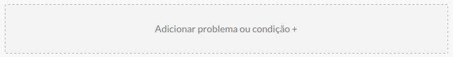

- Passo 3. Preencha os dados conforme necessário;

Figura 6.72 - Problemas/Condições

O grupo "Problema" pode ser preenchido de três maneiras: utilizando a CIAP2, e/ou CID10 e/ou outro problema que não esteja catalogado nestas duas classificações;

É possível relacionar o código CIAP2 com um código CID10. Use a opção "Filtro CIAP2 x CID10" caso deseje que o campo CID10 seja restringido à lista de códigos relacionados ao código CIAP2 selecionado;

Caso não encontre o problema catalogado em alguma das classificações, registre manualmente o problema no campo "Outro";

- Passo 4. Preencha a "Data inicial do problema"" ou "idade de início do problema" caso o profissional deseje registrar a data ou idade em que o problema começou ou foi detectado no cidadão;

- Passo 5. O sistema ainda oferece um campo de "Observações" caso o profissional deseje fazer alguma anotação geral sobre o problema registrado;

- Passo 6. Selecione a situação atual do problema conforme a necessidade:

 - **Ativo**: problema detectado e não resolvido
 - **Latente**: problema resolvido, porém pode trazer risco ao cidadão
 - **Resolvido**: problema já resolvido

Caso seja informado que o problema já foi resolvido, será solicitada a "data final do problema ou idade final do problema";

- Passo 7. Clique no botão "Salvar" para concluir.

Podemos ainda inserir um problema ou condição de saúde como **resolvido**, seguindo os passos a seguir:

- Passo 1. Clique no botão "Problemas/Condições e Alergias", à esquerda da tela;

- Passo 2. Clique na aba "Resolvidos";

- Passo 3. Adicione novos problemas ou condições que foram resolvidos, clicando no botão "Adicionar problema ou condição +".

### 6.4.3.2 Alergias e Reações Adversas

É possível inserir **alergias e reações adversas** seguindo os seguintes passos:

- Passo 1. Clique no botão "Problemas/Condições e Alergias", à esquerda da tela;

- Passo 2. Clique no botão "Adicionar alergia/reação adversa +";

- Passo 3. Preencha as informações do bloco ALERGIA/REAÇÃO ADVERSA conforme necessário:

Figura 6.73 - Alergia / Reação Adversar

**Categoria do agente causador:** campo obrigatório, que pode ser: alimento, animal, ingrediente não ativo do medicamento, fármaco(s) presente(s) no medicamento ou contraste radiológico, outras substâncias ou produtos químicos, produto ambiental e outros;

**Agente/Substância específica:** campo obrigatório, de descrição livre e pré- cadastrada. O sistema irá consultar os registros anteriores em busca de algum registro similar, a fim de manter a relação histórica entre os registros;

**Manifestações:** informar as manifestações da reação adversa ou alergia em um campo para livre descrição;

**Criticidade:** classificar a Alergia/Reação Adversa como Alta ou Baixa;

**Data de instalação:** Digite a data da instalação dos sinais e sintomas, além da evolução do quadro alérgico ou da reação;

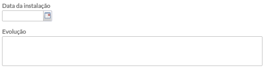

- Passo 4. Clique em "Salvar" para concluir.

## 6.4.4 Acompanhamento

O bloco "Acompanhamento", mais um componente do modelo RCOP, permite a visualização de um sumário clínico focado em determinado problema/condição, de maneira estruturada e sem a necessidade de revisar todo o histórico do cidadão. É nesse local que serão reunidas informações clínicas relevantes para o cuidado longitudinal da saúde dos cidadãos em formato de relatórios individuais.

Por meio desta funcionalidade os profissionais podem realizar o acompanhamento das condições de saúde, tais como:

- **Pré-natal**, para acompanhamento das gestantes;

- **Puericultura**, para acompanhamento do crescimento e desenvolvimento da criança até 10 anos;

- **Idoso**, para o acompanhamento do cidadão com 60 anos ou mais; e

- **Vacinação**, para o acompanhamento da situação vacinal do cidadão.

Futuramente será possível realizar o acompanhamento de outras condições importantes como doenças crônicas, infecto-contagiosas, entre outras.

## 6.4.5 Antecedentes

A ferramenta "Antecedentes" permite o registro das histórias dos problemas e condições pregressas do cidadão e familiares. Esta ferramenta transitória dialoga diretamente com a seção "Problemas/condições e alergias".

A tela de antecedentes é separada em blocos de informações:

- **Pré-natal, parto e nascimento:** caso o cidadão tenha passado por uma consulta de acompanhamento do crescimento e desenvolvimento da criança / puericultura, serão apresentados os dados relacionados ao pré-natal, parto e nascimento como mostrado abaixo;

- **Geral:** onde é possível registrar algumas informações mais gerais do cidadão;

- **Pessoal:** onde é possível registrar os problemas resolvidos do cidadão. Eles serão automaticamente incluídos na Lista de Problemas como resolvidos. Para incluir um problema, use as opções rápidas por meio do ícone  associado às "Opções rápidas", ou por meio do campo CIAP2;

- **Familiares:** onde é possível registrar a história patológica dos antecedentes familiares do cidadão. Para incluir um problema, use as opções rápidas por meio do ícone  associado às "Opções rápidas", ou por meio do campo CIAP2;

Caso o cidadão for do **sexo feminino**, também será exibido os blocos de "Antecedentes Obstétricos", onde se podem registrar os dados de gravidezes anteriores, além de antecedentes obstétricos familiares.

Figura 6.74 - Antecedentes Obstétricos

Fonte: SAPS/MS.

Os antecedentes pessoais são imediatamente incluídos na seção "Problemas/Condições e Alergias" por meio da codificação CIAP2. É possível editar ou atualizar a situação dos problemas/condições com status "resolvido" por meio das opções:

- edição : disponível somente se o problema foi adicionado ou atualizado durante o atendimento;

- atualização : disponível somente para problemas de atendimentos anteriores.

Também serão mostrados nos antecedentes itens sem codificação que foram marcados como resolvidos na Lista de Problemas/Condições, como mostra a Figura 6.75.

Figura 6.75 - Lista de problemas resolvidos com opções "editar", "atualizar" e problema sem codificação incluído por meio da Lista de Problemas/Condições.

Fonte: SAPS/MS.

## 6.4.6 Histórico

A ferramenta "Histórico" possibilita visualizar com mais detalhes a história de atendimento do cidadão na unidade de saúde. Neste local, estarão disponíveis todos os registros anteriores ( escuta inicial, consultas, atendimento realizados pelo técnico de enfermagem, etc). Ao acessar esta funcionalidade, o sistema exibe uma tela dos atendimentos ao cidadão em ordem cronológica decrescente. É possível a utilização do filtro para buscar um atendimento pelo nome do profissional, categoria profissional (CBO), período de tempo ou por tipo de atendimento. O profissional de saúde ainda pode realizar a busca dos pacientes que foram atendidos por ele mesmo, por meio, do checkbox "somente os meus".

Para acessar o histórico, basta clicar no botão "Histórico". No menu à esquerda da tela de atendimentos, o sistema exibirá uma tela, conforme a Figura 6.76.

Figura 6.76 - Histórico de atendimento

Fonte: SAPS/MS.

É possível realizar a impressão do registro do atendimento clicando sobre o card do atendimento e após no ícone , localizado no final do *Cartão*.

É possível visualizar no histórico também os atendimentos registrados por meio do CDS, apresentados por ordem de ocorrência, conforme Figura 6.76.

Figura 6.77 - Tela de visualização do atendimento

Fonte: SAPS/MS.

>  **NOTA**: os procedimentos apresentados no detalhamento do atendimento do cidadão, por meio do histórico, são aqueles que não se enquadram em "tipo de consulta" ou aqueles gerados a partir da entrada de dados clínicos no quadro "informações complementares", os quais geram procedimentos automáticos.

## 6.4.7 Dados Cadastrais

Esta ferramenta permite fazer acesso rápido aos dados de cadastro do cidadão, exibindo a tela de cadastro, como vimos na Seção 4.2.

## 6.4.8 Fichas CDS

Esta ferramenta não está mais presente a partir da versão 3.1. Agora é possível visualizar os registros feitos pelo sistema com CDS, por meio, da ferramenta histórico do cidadão (Tópico 6.4.6).

## 6.4.9 Finalizar Atendimento

Após o preenchimento dos dados de atendimento, clique no botão  no fim da página, ou clique na opção \"Finalização do atendimento\", no menu à esquerda. Cabe lembrar, que o atendimento só será finalizado, caso nenhum campo obrigatório no SOAP não tenha ficado em branco.

Será apresentada uma tela, conforme a Figura 6.78, que irá permitir adicionar informações complementares em relação ao atendimento realizado.

Figura 6.78 - Finalização do atendimento

Fonte: SAPS/MS.

Para concluir o atendimento, na tela de finalização do atendimento, informe:

- **tipo de atendimento:** para o exemplo na tela, aparecem duas opções para atendimentos de demanda espontânea na unidade, podendo ser:

- **consulta no dia ou de urgência**, disponível nos casos em que  o cidadão entra por demanda espontânea na lista de atendimento;

- **Consulta (agendada) ou Consulta programada/cuidado continuado**, disponível nos casos em que o cidadão é atendido via um agendamento prévio no módulo "Agenda".

- **atendimento compartilhado:** este campo se destina a informar se outro profissional participou do atendimento. O registro de outro profissional é meramente informativo, portanto não gera produção individual para este profissional.

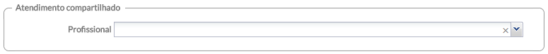

- **Procedimentos:** A partir da versão 3.2 os procedimentos são divididos em clínicos e administrativos. Esta alteração visa organizar a informação no PEC e melhorar a qualidade do registro pelos profissionais de saúde.

- **procedimentos administrativos:** neste bloco são apresentados  procedimentos administrativos que já são mapeados pelas ações  realizadas durante o atendimento e são preenchidos  automaticamente, como por exemplo os procedimentos de consulta. Caso necessário o profissional poderá adicionar outro procedimento que tenha realizado ou alterar o procedimento  automático, caso não esteja adequado. Os procedimentos são  apresentados indicando o tipo de classificação utilizada (AB,  CIAP2 ou SIGTAP), o respectivo código e sua descrição;

- **procedimentos clínicos:** neste bloco são apresentados todos os procedimentos clínicos realizados no atendimento e registrados no Plano. Estes são apresentados indicando o tipo de classificação utilizada (AB, CIAP2 ou SIGTAP), o respectivo código e a descrição.

>  **DICA**: Os **procedimentos clínicos** são aqueles que são executados diretamente no cidadão, como por exemplo uma sutura, uma sessão de auriculoterapia ou tratamento de pé diabético, e que informam um contexto clínico mais específico, apoiando a tomada de decisão clínica e a continuidade do cuidado. Os **procedimentos administrativos** são aqueles que representam uma informação em saúde mais ampla e inespecífica como tipos de consulta (ex. consulta médica em atenção básica) e não necessariamente apoiam a tomada de decisão clínica.

- **Lista de CID10 inseridos na avaliação:** lista de códigos CID10 inseridos na avaliação, para os casos de consultas médicas.

- **Notificação de agravos:** Caso haja a identificação de um agravo de notificação compulsória é possível gerar a ficha de notificação neste bloco. Estão disponíveis 47 tipos de notificação no padrão SINAN. O profissional poderá imprimir a notificação com diversas informações já coletadas pelo PEC. É importante realizar a conferência dos dados, pois alguns campos podem ficar sem preenchimento e deverão ser preenchidos à mão.

>  **NOTA**: O PEC gera apenas a notificação no formato SINAN que deve ser enviado à Secretaria Municipal de Saúde. A continuação do processo de investigação deve ser realizado pelas equipes de vigilância do município.

- **Racionalidade em saúde:** Com base no termo Racionalidades Médicas, que é todo o sistema médico complexo construído sobre seis dimensões: morfologia humana, dinâmica vital, doutrina médica (o que é estar doente ou ter saúde), sistema diagnóstico, cosmologia e sistema terapêutico. O termo Racionalidade em Saúde propõe uma ampliação desse conceito para uma abordagem multiprofissional de cuidado em saúde, incluindo as práticas tradicionais/ populares, ancestrais, complementares ou alternativas. Caso o profissional tenha usado alguma racionalidade em saúde diferente da alopatia para nortear o atendimento, deve informá- la neste bloco.

- **Conduta:** este bloco lista as principais condutas durante a finalização do atendimento, padronizado com a Ficha de Atendimento Individual da Coleta de Dados Simplificada (CDS).

- **Desfecho do atendimento:** para finalizar o atendimento, ainda deverá ser selecionado o desfecho do atendimento. Neste bloco é possível: liberar o cidadão ou retornar o cidadão à lista de atendimento. Adicionalmente nas duas opções é possível agendar uma consulta.

- **liberar o cidadão:** esta opção deve ser selecionada quando o indivíduo não receberá outro atendimento pela equipe/UBS;

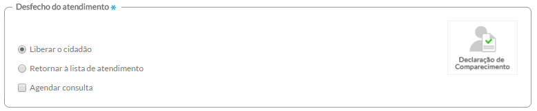

- **retornar à lista de atendimento:** é possível realizar o encaminhamento do cidadão para um profissional/serviço específico, no mesmo dia. Para isso, clique na opção "retornar à lista de atendimento" e selecione o profissional que irá atendê- lo ou tipo de serviço que o cidadão ainda irá precisar. Caso o cidadão tenha agendamentos para aquele dia a opção "Agendada" estará habilitada e mostrará uma listagem desses agendamentos, permitindo dessa forma encaminhar o cidadão para a consulta agendada e mantendo o cidadão no fluxo de atendimento da UBS. Caso o atendimento não esteja agendado, este será caracterizado como uma demanda espontânea.

- **agendar uma consulta:** é possível agendar uma consulta para o cidadão. Para isso, selecione o profissional, a data e o horário do agendamento em que a consulta será realizada. O sistema finalizará o agendamento após concluído o atendimento, apresentando uma mensagem:

No "Desfecho do atendimento" também é possível imprimir a declaração de comparecimento à consulta para o cidadão. Caso exista a necessidade de incluir o acompanhante deve ser preenchido o campo "nome do acompanhante".

Figura 6.79 - Opção para impressão da Declaração de Comparecimento

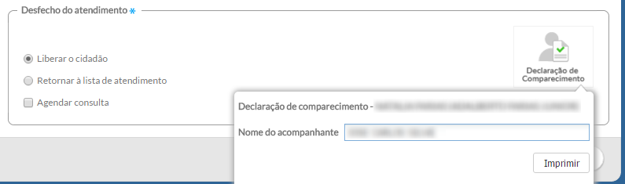

Fonte: SAPS/MS.

Figura 6.80 - Modelo de Impressão da Declaração de Comparecimento

Fonte: SAPS/MS.

Por último clique no botão "Finalizar atendimento" , para encerrar o atendimento. Quando for o caso, se o profissional quiser cancelar o atendimento em curso, basta clicar no botão "Cancelar atendimento" , todo o registro será cancelado e o cidadão retornará à lista de atendimentos. Cabe lembrar que nesta seção, se houver algum campo obrigatório não preenchido, o atendimento não poderá ser finalizado.

Após finalizar o atendimento, antes de voltar para a lista de atendimento, o sistema ofertará ao profissional a impressão do atendimento realizado.

Figura 6.81 - Tela de confirmação para imprimir o atendimento

Fonte: SAPS/MS.

Clicando no "Sim", o sistema apresentará a impressão do atendimento (que pode ser enviada para a impressora ou ser salva em formato ".PDF") e voltará para a lista de atendimento. Clicando na opção "Não", o sistema irá logo para a lista de atendimento. Caso necessário, as impressões dos atendimentos podem ser realizadas por meio da ferramenta "**Histórico**".

# 6.5 Atendimento / Acompanhamento Específico

## 6.5.1 Saúde Bucal

Ao clicar na opção  \"Atender\", o sistema exibirá uma tela com as funcionalidades do Prontuário Eletrônico do Cidadão (PEC). É por meio desta alternativa que o **profissional de saúde bucal** poderá efetuar o registro clínico do **atendimento odontológico**.

Como vimos na seção anterior, as funcionalidades do prontuário estão organizadas com base no método de Registro Clínico Orientado por Problemas (RCOP), que utiliza os dados cadastrais, a lista de problemas, as notas de evolução clínica e as fichas de acompanhamento para registro e recuperação das informações clínicas dos pacientes.  O registro clínico do atendimento odontológico não é diferente, no entanto, inclui novos campos e ferramentas que tornam o registro mais próximo das necessidades encontradas durante o atendimento odontológico.  Nesta seção, abordaremos as diferenças, que incluem, por exemplo, a possibilidade de uso da ferramenta de **Odontograma** para registrar a situação da saúde bucal do cidadão e o registro da evolução odontológica.

### 6.5.1.1 SOAP - Subjetivo (Odontologia)

Consiste em um campo aberto que possibilita o registro da parte subjetiva da anamnese da consulta, ou seja, os dados trazidos pelo cidadão, que incluem a descrição do motivo da consulta com percepções do indivíduo em relação ao seu processo saúde- doença.

Figura 6.82 - SOAP - Subjetivo

Fonte: SAPS/MS.

### 6.5.1.2 SOAP - Objetivo (Odontologia)

Este bloco traz um campo de texto livre e um conjunto de campos estruturados. O campo de texto livre possibilita o registro das observações do profissional de saúde durante o atendimento, como a percepção geral, dados do exame físico (intra e extra bucal) e exames complementares, incluindo os laboratoriais.

Figura 6.83 - SOAP - Objetivo

Fonte: SAPS/MS.

Abaixo do campo de texto livre do "Objetivo", existe o campo *checkbox* específico "**Paciente com necessidades especiais**", para informar se o paciente atendido é considerado como necessidade especial em odontologia. O registro dessa informação possui valor de uso significativo, que orienta o cuidado em saúde e gera subsídios para a gestão, no que se refere ao monitoramento da produção e do planejamento das ações em saúde.

Vale ressaltar que, segundo o Caderno de Atenção Básica nº 17, Saúde Bucal na odontologia, é considerado paciente com necessidades especiais, todo usuário que apresente uma ou mais limitações, temporárias ou permanentes, de ordem mental, física, sensorial, emocional, de crescimento ou médica, que o impeça de ser submetido a uma situação odontológica convencional. As razões das necessidades especiais são inúmeras e vão desde doenças hereditárias, defeitos congênitos, até as alterações que ocorrem durante a vida, como moléstias sistêmicas, alterações comportamentais, envelhecimento, etc. Esse conceito é amplo e abrange, entre os diversos casos que requerem atenção diferenciada, pessoas com deficiência visual, auditiva, física ou múltipla (conforme definidas nos Decretos de nº 3.296 99 e nº 5.296/04) que eventualmente precisam ser submetidas à atenção odontológica especial.

### 6.5.1.3 SOAP - Avaliação (Odontologia)

Os problemas ou condições detectadas/avaliadas na consulta odontológica devem ser registrados na parte de avaliação. O registro pode ser realizado usando campo aberto e/ou por meio de codificação dos problemas avaliados, usando a Classificação Internacional Atenção Primária (CIAP2) ou a Classificação Internacional de Doenças (CID10), além de algumas notas.

Figura 6.84 - SOAP - Avaliação

Fonte: SAPS/MS.

É possível informar quantos CIAP2/CID10 forem necessários. Porém o sistema não aceita o cadastro de códigos repetidos, então, se não conseguir adicionar um CIAP2/CID10, é porque ele já foi cadastrado neste atendimento.

#### 6.5.1.3.1 Vigilância em Saúde Bucal

Inserido ao campo SOAP - "Avaliação", o campo "Vigilância em saúde bucal" visa subsidiar a observação do processo saúde- doença bucal, em âmbito populacional, e mostra- se um instrumento fundamental para a elaboração de políticas e ações de cuidados mais resolutivas. Este campo é composto por *checkbox* que permite múltipla escolha das opções.

Figura 6.85 - SOAP - Avaliação - vigilância em saúde bucal

Fonte: SAPS/MS.

- **abscesso dentoalveolar:** a condição do indivíduo com abscesso dentoalveolar independe do número de áreas afetadas e características do abscesso;

- **alteração em tecidos moles:** a condição de alteração em tecidos moles independe do número, do tipo e do grau da lesão. Essas alterações podem ser processos proliferativos não neoplásicos, neoplasias benignas, neoplasias malignas, doenças infecciosas (bacterianas, fúngicas ou virais), doenças mucocutâneas e manifestações bucais de doenças sistêmicas;

- **dor de dente:** a condição de indivíduo com dor de dente independe do número de dentes afetados e características da dor (espontânea ou provocada);

- **traumatismo dentoalveolar:** a condição de indivíduo com história de traumatismo dentoalveolar independe do número de dentes afetados e do tipo de lesão;

- **fendas ou fissuras labiopalatais:** CID10 \"Q36.0\", \"Q36.1\", \"Q36.9\", \"Q35.1\", \"Q35.3\", \"Q35.5\", \"Q35.9\", \"Q37\", Q37.0\", \"Q37.1\", \"Q37.2\", \"Q37.3\", \"Q37.4\", \"Q37.5\", \"Q37.8\" ou \"Q37.9\" se, na seção \"**Problemas/Condições e Alergias**\", existir o registro de pelo menos um desses CID e a situação igual a \"Ativo\"; então, apresenta a informação \"\*Detectada presença de fendas ou fissuras labiopalatais\". Caso contrário, será apresentada a informação \"\*Não detectada a presença de fendas ou fissuras labiopalatais\". A condição de fenda ou fissura independe do tipo da anomalia (se apenas labial, apenas palatal ou labiopalatal);

- **fluorose dentária moderada ou severa:** CID10 \"K00.3\" se, na seção \" **Problemas/Condições e Alergias**\", existir o registro desse CID e a situação igual a "Ativo"; então, apresenta \"\*Detectada presença de fluorose dentária moderada ou severa\". Se não, será apresentada a informação \"\*Não detectada presença de fluorose dentária moderada ou severa\". A condição de fluorose dentária moderada ou severa independe do número de dentes atingidos;

- **não identificado:** deve ser preenchido todas as vezes que não for identificada nenhuma condição de vigilância em saúde bucal descrita acima.

>  **NOTA**: quando identificada a presença de **fendas ou fissuras labiopalatais** ou **fluorose dentária moderada ou severa** no paciente, o cirurgião- dentista deverá registrar na \"**lista de problemas/condições**\" essas situações, por meio do CID 10 correspondente, conforme códigos citados acima. O registro na lista de problemas auxiliará o profissional na vigilância da saúde bucal do cidadão acerca desses problemas/condições.

#### 6.5.1.3.2 Prótese Dentária Superior/Inferior

Este campo tem como finalidade sinalizar a necessidade de prótese dentária para o cidadão, marcando "sim" ou "não". Para os casos em que for marcada a opção "sim", as especificações acerca da prótese, com o detalhamento se será parcial ou total, superior e/ou inferior, serão preenchidas no campo SOAP - "Plano ".

Figura 6.86 - SOAP - Avaliação - prótese dentária superior/inferior

Fonte: SAPS/MS.

### 6.5.1.4 SOAP - Plano (Odontologia)

Esta funcionalidade permite o registro do plano de cuidado ao cidadão em relação ao(s) problema(s) avaliado(s), especificando a conduta e desfecho do atendimento. O SOAP - Plano, é composto pelo bloco de intervenções/procedimentos, odontograma, pelos campos de sinalização de uso da prótese dentária total superior e/ou inferior e também pelas ferramentas para emissão de atestados, exames, lembretes, prescrição de medicamentos, orientações, encaminhamentos e evoluções odontológicas.

Figura 6.87 - SOAP - Plano

Fonte: SAPS/MS.

#### 6.5.1.4.1 Intervenção e/ou Procedimentos

Este bloco se destina ao registro de procedimentos realizados durante a consulta que não são específicos do processo de cuidado odontológico. Os procedimentos específicos do atendimento odontológico devem ser registrados nas Evoluções Odontológicas, pois permite a vinculação do procedimento ao elemento dentário.

#### 6.5.1.4.2 Odontograma

A imagem do odontograma é composta por todos os dentes (coroa e raiz), inclusive os decíduos e as faces de cada coroa, estando separada em arcadas superior e inferior.  O campo de seleção "Odontograma" permite a visualização de todos os atendimentos realizados no usuário, por meio de data (dia/mês/ano). Para cidadãos avaliados pela primeira vez, aparecerá somente a opção de "Odontograma Atual".

Com relação às duas opções de *checkbox*, são para informar/registrar se o usuário usa prótese dentária total superior e/ou prótese dentária total inferior.

Ao marcar a opção \"prótese total superior\" e/ou \"prótese total inferior\", o sistema:

- atribui o estado \"prótese total\" para todos os dentes da respectiva arcada;

- desabilita a opção do clique com o botão esquerdo do *mouse*;

- apresenta o *hint* \"prótese total\" ao passar o *mouse* sobre qualquer dente da arcada.

Figura 6.88 - Odontograma - prótese total superior e inferior

Fonte: SAPS/MS.

Se desmarcar a opção \"prótese total superior\" e/ou \"prótese total inferior\":

- no mesmo atendimento: o sistema desfaz o registro e apresenta o odontograma na situação anterior à marcação de \"prótese total\".

- em um próximo atendimento: o sistema atribui a característica \"A - Ausente\" para todos os dentes da respectiva arcada.

Com o objetivo de aproximar as informações em saúde bucal e oferecer maior agilidade no preenchimento das informações, o odontograma oferece um bloco de informações sobre os problemas identificados avaliados no atendimento em saúde bucal ao usuário. Sendo assim, essas condições detectadas/avaliadas na consulta odontológica devem ser registradas sobre o dente (coroa e/ou raiz).

Quando for o primeiro atendimento ao usuário, o cirurgião- dentista deverá realizar avaliação clínica e registrar no odontograma as condições encontradas em cada elemento dentário. Dessa forma, é importante destacar que é a partir do odontograma que será elaborado o plano preventivo- terapêutico de cada usuário. Essa primeira avaliação ficará salva e será registrada automaticamente pelo sistema como 1ª consulta odontológica programática. Sendo assim, os futuros atendimentos odontológicos a este usuário, tomarão como referência os registros da primeira avaliação.

É importante ressaltar que, uma 1ª consulta odontológica programática só será registrada novamente para a mesma pessoa 12 meses após a conclusão do plano preventivo- terapêutico, e ainda, caso o paciente abandone o tratamento, seis meses após a última consulta.

Para registrar avaliação ou problema detectado na coroa do dente, siga os passos:

- clique com o botão **esquerdo** sobre a coroa do dente e aparecerá uma lista de problemas que poderá estar relacionado com o dente em questão;

Figura 6.89 - Lista de problemas (Odontograma)

- clique com o botão **esquerdo** sobre um dos problemas detectados para confirmar a situação identificada na coroa do dente; Por exemplo: Ao clicar em Cariado (C),aparecerá conforme a figura 6.90.

- selecionando a opção, aparecerá o resultado na coroa do dente selecionada (Figura 6.91);

Figura 6.90 - Problema identificado e confirmado na coroa do dente

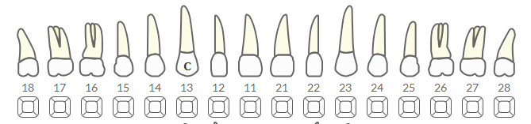

- é importante registrar em qual face (mesial/distal/palatina/lingual/vestibular) da coroa do dente que tem a alteração identificada. Para isso, clique com o botão esquerdo do mouse, sobre a face desejada e marque com a cor rosa o local que está cariado.

Figura 6.91. Odontograma e bloco de problemas identificados/avaliados na coroa dentária

Fonte: SAPS/MS.

#### 6.5.1.4.3 Evoluções Odontológicas

Ao realizar o procedimento na coroa do dente, clique com o botão **esquerdo** sobre ela e, em seguida, em "Adicionar evolução", com o objetivo de caracterizar as ações desenvolvidas. Siga os passos:

- Passo 1. É importante registrar em qual face (mesial/distal/palatina/lingual/vestibular) da coroa do dente que foi realizado o procedimento. Para isso, clique com o botão esquerdo sobre a face desejada e marque com a cor azul o local que foi restaurado;

- Passo 2. Clique na coroa do dente e em seguida botão

- Passo 3. Selecione o campo "Local":

- identifique se o procedimento foi realizado no dente, no sextante, na arcada ou em outro local da boca, como o tecido mole;

- em seguida, informe em qual local (dente, sextante, arcada ou outro) foi realizado o procedimento.

Figura 6.92 - SOAP - Plano - evolução odontológica - dente

Fonte: SAPS/MS.

Figura 6.93 - SOAP - Plano - evolução odontológica - sextante

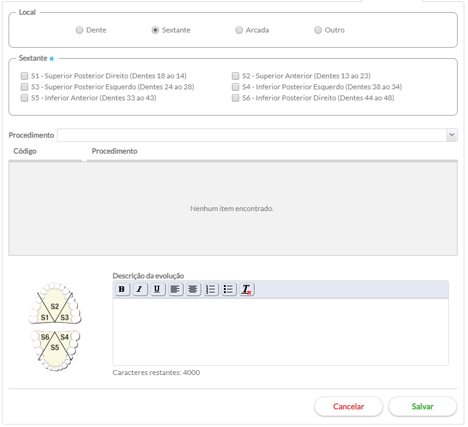

Fonte: SAPS/MS.

Figura 6.94 - SOAP - Plano - evolução odontológica - arcada

Fonte: SAPS/MS.

Figura 6.95 - SOAP - Plano - evolução odontológica - outro

Fonte: SAPS/MS.

Ao cadastrar e salvar a(s) evolução(ões) odontológica(s), aparecerão algumas opções- padrão:

- clique no botão "Visualizar"  para que os dados da solicitação de exames sejam apresentados somente para visualização;

- clique no botão "Editar"  para alterar algum dado da solicitação de exames. Após as alterações, clique no botão "Salvar";

- clique no botão "Excluir"  para apagar uma solicitação de procedimento.

Figura 6.96 - Evoluções Odontológicas

Para registrar avaliação ou problema detectado na [raiz do dente], siga os passos:

- Passo 1. Clique com o botão **esquerdo** sobre a raiz do dente;

- Passo 2. Clique com o botão **esquerdo** sobre a detecção para confirmar a situação identificada na [raiz do dente;]

- Passo 3. Selecionando a opção, aparecerá o resultado na raiz do dente selecionada, com alteração de cor para situação identificada.

- Passo 4. Ao realizar o procedimento na raiz do dente, clique com o botão **esquerdo** sobre ela e, em seguida, em "Tratado".

Dessa forma, a marcação na raiz do dente mudará de cor para a azul, informando que o problema foi tratado.

- Passo 5. Para informar/descrever o procedimento realizado na raiz do dente, deve- se clicar em "Evoluções Odontológicas" e adicionar os devidos registros, conforme orientado na seção **6.5.1.4.1**.

Observação: casos de "Lesão de furca\" somente podem ser registrados para os dentes: 14, 15, 16, 17, 18, 24, 25, 26, 27, 28, 34, 35, 36, 37, 38, 44, 45, 46, 47 e 48.

Figura 6.97 - SOAP - Plano - odontograma e bloco de problemas identificados/avaliados na raiz

Fonte: SAPS/MS.

**Observações gerais sobre o registro:**

- para dentes decíduos, o sistema não permite selecionar as opções \"Coroa (Co)\", \"Pilar (P)\", \"Prótese parcial removível\" e \"Prótese coronária/Unitária\" e \"Prótese temporária\";

- ao clicar com o botão **esquerdo** sobre a face da coroa do dente, o sistema deve marcar a região na cor vermelha, indicando que há problema a ser tratado. Clicar novamente na região para indicar que o problema foi tratado (ficando na cor azul). Ao clicar mais uma vez, o sistema voltará ao estado normal;

- a cada atendimento realizado, o sistema deve armazenar as informações de modo que os odontogramas de atendimentos anteriores possam ser consultados. Ou seja, o histórico dos atendimentos deve ser mantido;

- é possível navegar entre os odontogramas por meio das setas laterais presentes nas laterais do odontograma.

Para todas as opções onde uma ação pode ser realizada, alterar o cursor de acordo com o padrão do sistema.

### 6.5.1.5 - Finalizar atendimento - Saúde bucal

O bloco "**Tipo de consulta"** oferta três opções de tipificação de consultas sendo elas 1ª consulta, consulta de retorno ou consulta de manutenção.

- 1ª consulta: utilizar quando for realizada avaliação das condições gerais de saúde e realização de exame clínico odontológico com finalidade de diagnóstico e, necessariamente, elaboração de plano preventivo- terapêutico. É importante ressaltar que:

- o tratamento deve ser iniciado na mesma sessão da primeira consulta odontológica programática;

- uma primeira consulta odontológica programática só poderá ser registrada novamente para a mesma pessoa 12 meses após a conclusão do plano preventivo- terapêutico; e, caso o paciente abandone o tratamento, seis meses após a última consulta;

- não devem ser considerados como primeira consulta odontológica programática os atendimentos eventuais, por exemplo, os de urgência/emergência/consulta dia, que não têm elaboração de plano preventivo- terapêutico e seguimento previsto.

- Consulta de retorno: Consiste na(s) consulta(s) subsequente(s) do usuário que está em continuidade do tratamento iniciado e programado por meio da primeira consulta odontológica programática. Portanto será registrada a consulta de retorno acrescida do(s) procedimento(s) realizado(s) neste dia. (Exemplo: Considerando que um usuário possui seis restaurações para serem feitas, segundo plano preventivo- terapêutico elaborado pelo Cirurgião Dentista.

- Consulta de manutenção: Consiste na consulta do usuário para manutenção, acompanhamento ou reparos clínicos após ter concluído um tratamento, conforme previsto no plano preventivo- terapêutico, em geral definido na primeira consulta odontológica. Uma consulta de manutenção, ocorre quando o retorno do usuário se dá em um período inferior a 12 meses da conclusão do tratamento, não caracterizando um novo tratamento. Portanto será registrada a consulta de manutenção acrescida do(s) procedimento(s) realizado(s) neste dia. (Exemplo: O usuário concluiu o tratamento no mês de julho e no mês de setembro do mesmo ano ele retorna ao atendimento odontológico para reparo em uma determinada restauração.

Em "**Fornecimento"**, é informado se houve fornecimento de algum(ns) material(is) de higiene bucal:

É importante lembrar que a equipe de Saúde Bucal deve realizar a entrega dos materiais junto com as orientações de higiene bucal.

No bloco "**Procedimentos Administrativos**" é possível registrar os procedimentos administrativos feitos durante o atendimento odontológico. Alguns procedimentos já são mapeados pelas ações realizadas durante a realização do atendimento e são preenchidos automaticamente, como os procedimentos de consulta.

O bloco "**Procedimentos Clínicos**" apresenta a lista de procedimentos realizados e registrados no Plano e nas Evoluções Odontológicas do SOAP.

O sistema também apresenta lista de códigos de CID10 inseridos durante a fase de avaliação no SOAP.

Além dessas informações, o sistema também apresenta, no "Finalizar Atendimento", a lista de códigos pela CID10 inseridos na avaliação.

Em "**Conduta**", o cirurgião- dentista registra os encaminhamentos internos do usuário, bem como informa a conclusão do tratamento.

- **retorno para consulta agendada:** caso o usuário necessite de retorno para a continuidade do tratamento com a equipe de Saúde Bucal;

- **agendamento para outros profissionais de AB:** caso se tenha identificado necessidade de agendar para outro profissional da Atenção Básica (por exemplo, médico, enfermeiro, entre outros);

- **agendamento para Nasf:** caso se tenha identificado necessidade de agendar para os profissionais do Núcleo de Ampliado de Saúde da Família (NASF);

- **agendamento para grupos**: caso se tenha identificado necessidade de agendar para algum grupo de acompanhamento que a unidade de saúde disponha;

- **tratamento concluído:** consiste na consulta que encerra um período de tratamento previsto no plano preventivo- terapêutico do usuário. É o mesmo que "tratamento concluído", que diz respeito ao encerramento de determinado "período de tratamento", ou seja, realizou todas as ações que se propôs a realizar no plano preventivo- terapêutico da 1ª consulta odontológica programática.

- **Alta do episódio:** Esta opção é destinada para os usuários que tiveram como Tipo de Atendimento "Demanda Espontânea" e não realizaram a "Primeira Consulta Odontológica Programática". Por exemplo: O usuário chega com dor de dente (Atendimento de urgência) e a equipe de SB resolve o problema sem a necessidade de retorno deste usuário para continuidade do tratamento. Neste caso deve- se marcar "ALTA DO EPISÓDIO", pois para assinalar "TRATAMENTO CONCLUÍDO" deve haver a elaboração e conclusão do plano preventivo- terapêutico da primeira consulta odontológica programática).

Em "**Desfecho do atendimento**", o profissional irá finalizar o atendimento informando o desfecho deste, conforme visto na Seção 6.3.9.

## 6.5.2 Pré-Natal

A gestação representa uma das fases mais importantes na vida do ser humano. Desta forma o período pré- natal necessita de um acompanhamento adequado à gestante. Este acompanhamento pode ser realizado por meio do *Cartão* Pré-Natal sendo possível observar o seu andamento desde a primeira consulta até o seu desfecho. O *Cartão* organiza em formato de sumário clínico as principais informações relacionadas à gestação de forma clara e objetiva. É importante enfatizar que o bloco de notas de evolução SOAP é a principal entrada de dados deste módulo, portanto, é indispensável observar todas as informações para o bom uso da ferramenta. Nas seções que seguem, são destacados alguns pontos específicos de registro e do acompanhamento da gestação de uma cidadã, para potencializar o uso dessa ferramenta pelo profissional por meio do sistema.

### 6.5.2.1 Registrando o atendimento do pré-natal

Para dar início ao acompanhamento do pré-natal, é necessário que o profissional registre a condição de gravidez da cidadã por meio da opção "Problemas/Condições e Alergias" inserindo algum dos códigos que identificam essa condição. São eles:

- CIAP2:

- W71 - INFECÇÕES QUE COMPLICAM A GRAVIDEZ;

- **W78 - GRAVIDEZ;**

- W79 - GRAVIDEZ NÃO DESEJADA;

- W80 - GRAVIDEZ ECTÓPICA;

- W81 - TOXEMIA GRAVÍDICA - DHEG;

- W84 - GRAVIDEZ DE ALTO RISCO;

- W85 - DIABETES GESTACIONAL;

- CID10:

- **Z34 - SUPERVISÃO DE GRAVIDEZ NORMAL** (e subgrupo);

- Z35 - SUPERVISÃO DE GRAVIDEZ DE ALTO RISCO (e subgrupo).

Outra forma de realizar esse registro é a inclusão de algum dos códigos na seção de "Avaliação" do SOAP, por meio do bloco "Problema e/ou Condição detectada" mantendo a situação do problema/condição como "Ativo". Dessa forma, o sistema dá início ao acompanhamento do pré-natal da gestante captando informações úteis a esta condição de saúde.

Dependendo do problema e ou condição detectada, a gestação pode ser classificada em dois tipos: "alto risco" e "risco habitual", também conhecida como baixo risco. Esta situação pode ser modificada ao longo do acompanhamento da gestação por meio de entradas tanto pela avaliação quanto pela Lista de Problemas/Condições e Alergias. Sempre que o registro mais atual for diferente dos códigos W78 e Z34 e houver qualquer outro da lista anterior, a gestação será considerada de "alto risco" e será mostrada no Cartão de Acompanhamento.

Caso o primeiro registro da gravidez seja realizado por profissional médico ou enfermeiro, na seção "Avaliação" do SOAP, será mostrado o bloco "Pré-Natal - Primeira Consulta" (Figura 6.98).

Figura 6.98 - Pré-Natal - Primeira consulta

Nele, é possível realizar os registros de:

- **tipo de gravidez:** especificar a quantidade de gestação na gravidez atual, sendo as opções "Única", "Dupla/Gemelar", "Tripla ou mais" e "ignorada";

- **gravidez planejada:** especificar se foi ou não planejada, clicando em sim ou não;

- **edema:** registrar o resultado da avaliação de presença de edema utilizando a escala de gradação "- " (sem edema), "+", "++" ou "+++";

- **altura uterina:** registrar a altura em centímetros (cm);

- **batimento cardíaco fetal:** registrar em batimentos por minuto (bpm);

- **movimentação fetal:** registrar a percepção materna ou do profissional de saúde em relação a presença de movimentos do feto. Para isto, clique em sim ou não.

>  **ATENÇÃO**: *o sistema sempre irá tornar [obrigatório] o preenchimento da **DUM** na seção "Objetivo" quando se tratar de uma "primeira consulta de pré-natal". Esta data pode ser ajustada nas próximas consultas de pré-natal por meio do mesmo campo ou dos resultados de exames específicos, como mencionado anteriormente.*
>
>  **NOTA**: caso os antecedentes obstétricos estejam desatualizados, o sistema mostrará a mensagem "Atualize os antecedentes obstétricos".

A partir da segunda consulta de pré-natal, os dados do bloco "Pré-Natal - Primeira Consulta" serão transferidos da seção "Avaliação" para a seção "Objetivo" do SOAP.

Figura 6.99 - SOAP - Objetivo - grupo pré-natal

Fonte: SAPS/MS.

Junto à seção "Avaliação", sempre que houver uma entrada de CIAP2 ou CID10 relacionada a uma gravidez, será mostrado o bloco "Pré- Natal" com o item "tipo de gravidez", como mostrado anteriormente.

Alguns exames requerem o registro de dados específicos dos resultados. Estes resultados são utilizados em outras seções do PEC, principalmente no acompanhamento a condições específicas, como o pré- natal. São eles:

- 0202010503 - Dosagem de hemoglobina glicosilada / CDS - Hemoglobina glicada;

- 0205020143 - Ultrassonografia obstétrica;

- 0205020151 - Ultrassonografia obstétrica c/ doppler colorido e pulsado;

- 0205010059 - Ultrassonografia c/ doppler de fluxo obstétrico.

Para os resultados de ultrassonografias realizadas durante o pré- natal, é possível registrar a idade gestacional (IG ecográfica) em semanas e dias, além da data provável do parto (DPP ecográfica), como mostra a imagem abaixo:

Figura 6.100 - Campos específicos do resultado da Ultrassonografia obstétrica

Fonte: SAPS/MS.

#### 6.5.2.1.1 Desfecho de uma gestação

Para realizar o desfecho de uma gestação, por nascimento ou interrupção, o profissional deve informar por meio de código CIAP2 ou CID10. Os códigos que podem ser utilizados para encerrar uma gestação são mostrados no quadro a seguir.

Quadro 6: Códigos CIAP2 e CID10 que encerram uma gestação

|**CIAP2**|**Descrição**|**CID10 relacionáveis**|
|- |- |- |
|W82|Aborto espontâneo|O02, O03, O05, O06|
|W83|Aborto provocado|O04, Z30.3|
|W90|Parto sem complicações de nascido vivo|O80, Z37.0, Z37.9, Z38, Z39|
|W91|Parto sem complicações de natimorto|Z37.1, Z37.9|
|W92|Parto com complicações de nascido vivo|O42, O45, O60, O61, O62, O63, O64, O65, O66, O67, O68, O69, O70, O71, O73, O75.0, O75.1, O75.4, O75.5, O75.6, O75.7, O75.8, O75.9, O81, O82, O83, O84, Z37.2, Z37.5, Z37.9, Z38, Z39|
|W93|Parto com complicações de natimorto|O42, O45, O60, O61, O62, O63, O64, O65, O66, O67, O68, O69, O70, O71, O73, O75.0, O75.1, O75.4, O75.5, O75.6, O75.7, O75.8, O75.9, O81, O82, O83, O84, Z37.1, Z37.3, Z37.4, Z37.6, Z37.7, Z37.9|

Fonte: SAPS/MS.

O desfecho pode ser informado por meio da inclusão de um desses itens na seção "Avaliação" do SOAP, por meio do bloco "Problema e/ou condição detectada". Em caso de identificação de algum desses códigos, o sistema mostrará o campo "Data de desfecho da gestação" dentro do bloco "Pré-Natal", conforme Figura 6.88. Irá também atualizar a condição de gravidez na Lista de Problemas\\Condições e Alergias automaticamente e registrar a data do desfecho como a data da resolução da condição.

Figura 6.101 - Avaliação - Registro do desfecho da Gestação

Fonte: SAPS/MS.

Se o registro do desfecho da gestação for realizado por meio da Lista de Problema\\ Condições e Alergias, é possível marcar a condição de gravidez (W78) como **resolvida**, como pode ser visto na Figura 6.102. Neste caso, o campo "Data final" torna- se obrigatório, e passa a ser considerada como a "Data de desfecho da gestação".

Figura 6.102 - Registro da Gestação na Lista de Problemas

Fonte: SAPS/MS.

### 6.5.2.2 Acompanhamento do Pré-natal

O *Cartão* minimizado apresenta informações essenciais e objetivas ao acompanhamento da gestante como: o risco (habitual ou alto risco); a data da última menstruação (DUM); a idade gestacional (IG) cronológica e data provável do parto (DPP) calculadas a partir da DUM, a IG e DPP baseadas nos registros dos exames de imagem, além disso, apresenta a data da última consulta de pré-natal e o profissional que realizou a última consulta como mostra a imagem a seguir.

Figura 6.103 - Cartão do Acompanhamento do Pré-natal

Fonte: SAPS/MS.

Clicando no *Cartão* é possível verificar o conjunto de informações completas relacionadas ao acompanhamento do pré-natal. Existem três blocos de informações principais sendo eles "Lista de problemas condições ativas", "Medições da gestação" e "histórico da condição" (Figura 6.104).

Figura 6.104 - Acompanhamento do Pré-Natal

#### 6.5.2.2.1 Lista de problemas / condições ativas

Este bloco disponibiliza as condições que estão com status "Ativo" na seção "Problemas/Condições e Alergias", informando qual o problema/condição e a idade de início do mesmo, durante o período da gestação, como vemos a seguir.

Figura 6.105 - Bloco de Lista de problemas do Acompanhamento do Pré-natal

Fonte: SAPS/MS.

#### 6.5.2.2.2 Medições da Gestação

Este bloco apresenta aos profissionais as informações das medições realizadas durante as consultas de pré- natal. Cada consulta é identificada em sua sequência pela coluna "Consulta" seguida da data da consulta, IG, peso e IMC calculado, classificação do edema, pressão arterial (PA), altura uterina, batimento cardíaco fetal (BCF) e presença de movimento fetal como mostra a imagem a seguir.

Figura 6.106 - Bloco de Medições da Gestação

Neste bloco ainda é possível verificar os gráficos de acompanhamento da evolução de alguns indicadores da saúde da gestante como o Índice de Massa Corporal (IMC), a Glicemia capilar, a Pressão Arterial (PA) e a Altura Uterina (AU). Basta clicar nas abas IMC, Glicemia, PA ou AU, respectivamente.

Abaixo o modelo do gráfico do IMC (Figura 6.107).

Figura 6.107 - Gráfico do IMC - Índice de Massa Corporal

#### 6.5.2.2.3 Histórico da condição

Neste bloco é possível acompanhar a evolução da condição gravídica por meio da Lista de Problemas/Condições ativas. Caso haja atualização em relação a esta condição ou nova informação no campo de observação será possível acompanhar por meio do botão .

Figura 6.108 - Bloco de Histórico da condição

Fonte: SAPS/MS.

#### 6.5.2.2.4 Impressão do acompanhamento da gestante

Caso o profissional deseje realizar a impressão do acompanhamento da gestante, seja para arquivamento físico, seja para entregar à gestante, basta clicar no botão . Em seguida aparecerá uma tela onde é possível selecionar os itens que deseja imprimir (Figura 6.019).

Figura 6.109 - Imprimir Acompanhamento da Gestação

Abaixo um exemplo da impressão do acompanhamento da gestante.

Figura 6.110 - Modelo de impresso do Acompanhamento do Pré-natal apenas com Dados do acompanhamento

Fonte: SAPS/MS.

## 6.5.3 Puericultura

Uma das principais fases do crescimento e do desenvolvimento humano é a infância. Desta forma o Prontuário Eletrônico do Cidadão traz a ferramenta de **acompanhamento do crescimento e desenvolvimento da criança**. Este acompanhamento pode ser realizado por meio do *Cartão de puericultura*, que organiza em formato de sumário clínico, as principais informações relacionadas a esta fase do crescimento e do desenvolvimento infantil, de forma clara e objetiva. Algumas das informações mostradas no *Cartão* tem sua entrada via SOAP, da mesma forma que o *Cartão* do acompanhamento do pré-natal, conforme visto anteriormente. Nas seções que seguem, são destacados alguns pontos específicos de registro e do acompanhamento da puericultura, para potencializar o uso dessa ferramenta pelo profissional por meio do sistema. O acompanhamento da criança é realizado até os 10 anos de idade.

### 6.5.3.1 Registrando o atendimento em puericultura

Em atendimento no qual o cidadão esteja na faixa etária para a realização da puericultura, será ofertada ao profissional a opção de ativar o "registro do atendimento de puericultura", com objetivo de acompanhar o crescimento e desenvolvimento da criança.

Figura 6.111 - Opção na seção "Objetivo" do SOAP para habilitar campos da puericultura

Fonte: SAPS/MS.

Após a primeira ativação da puericultura, será ofertado ao profissional a possibilidade de registrar informações clínicas em relação ao pré-natal, parto e nascimento, além do acompanhamento do crescimento e desenvolvimento da criança.

Figura 6.112 - Campos da Puericultura

Fonte: SAS/MS

No bloco pré-natal, parto e puerpério, o profissional de saúde pode registrar os dados que apoiam o cuidado da criança provenientes tanto do cartão de pré-natal quanto da caderneta da criança, tais como o tipo de gravidez, tipo de parto, idade gestacional ao nascer, avaliação do apgar e os dados antropométricos ao nascer relativo ao peso, altura e perímetro cefálico.

>  **NOTA**: o bloco "Pré-natal, parto e nascimento" é exibido apenas quando não há registro anterior em relação a estes dados no sistema.

Após o registro dos dados no bloco sobre "pré-natal, parto e nascimento" no SOAP, estes poderão ser acessados no módulo "Antecedentes".

No registro do atendimento de puericultura é possível registrar o padrão de amamentação do bebê por meio do bloco "Tipo de Aleitamento" ao informar se é *exclusivo, predominante, complementado ou inexistente*. Este bloco permanecerá ativo até a criança completar 02 (dois) anos de idade.

Após os 02 (dois) anos de idade, apenas os dados de peso, altura e perímetro cefálico serão utilizados para compor o cartão de acompanhamento do crescimento da criança.

O bloco do desenvolvimento da criança, somente estará presente no campo "Objetivo", até o indivíduo completar 10 (dez) anos de idade.

### 6.5.3.2 Registrando o crescimento da criança

Para registrar o crescimento da criança com a finalidade de avaliar o estado nutricional e o desenvolvimento do perímetro cefálico, o profissional de saúde deverá preencher os campos do bloco "Antropometria" e digitar os valores referentes ao *Peso em Quilogramas (Kg), Altura e Perímetro Cefálico* em centímetros (cm). Após a inserção dos valores do Peso e Altura o Índice de Massa Corporal (IMC) é calculado automaticamente.

>  **DICA**: Para o acompanhamento adequado da criança é importante que o profissional de saúde registre em todas as consultas de puericultura os dados antropométricos. Estes dados comporão as tabelas e gráficos no módulo de "Acompanhamento" da Puericultura. Neste módulo é possível analisar a curva de crescimento da criança, mais informações no capítulo ***6.5.3.2. Acompanhamento da Puericultura***.

Figura 6.113 - Bloco Antropometria

### 6.5.3.3 Registrando o desenvolvimento da criança

Com a finalidade de avaliar as etapas de evolução da criança de acordo com a faixa etária foi implementado o bloco de "Desenvolvimento da criança", de acordo com a caderneta da criança do Ministério da Saúde e o Caderno de Atenção Básica nº 33 Saúde da Criança: Crescimento e Desenvolvimento.

Neste Bloco, o profissional de saúde que realiza a puericultura, registra os dados referentes às alterações fenotípicas presentes na criança, os fatores de riscos sociais, ambientais, de condições de saúde e parto que podem indicar perigo para o desenvolvimento na infância, além de registrar os marcos do desenvolvimento, de acordo com a idade e segundo a Caderneta da Criança 2019. No marco do desenvolvimento também é possível registrar os reflexos primitivos que são esperados nos primeiros 15 dias de vida do recém- nascido.

Figura 6.114 - Bloco de avaliação do Desenvolvimento da criança

Para avaliar as alterações fenotípicas clique no botão "Avaliar" e em seguida será aberta uma tela conforme a figura abaixo. Neste momento clique sobre "Ausente" ou "Presente" em cada condição a ser observada.

Figura 6.115 - Avaliação das Alterações Fenotípicas

Se for selecionado alguma condição com o status "Presente" ao clicar em "Salvar", será aberto uma caixa de diálogo, solicitando a confirmação se realmente a alteração fenotípica está presente na criança, pois ao finalizar o atendimento essa informação **não** poderá ser modificada.

Figura 6.116 - Confirmação de status "Presente" para a alteração fenotípica

>  **ATENÇÃO**: Atente para a caixa de diálogo solicitando a confirmação da alteração fenotípica na criança. Após a finalização do atendimento não será possível alterar o status. Se o profissional de saúde finalizar o atendimento com o status "presente" de forma errônea, o sistema emitirá alerta relacionado ao desenvolvimento que não condiz com a realidade da criança. Por isso, fique atento às boas práticas do registro em prontuários.

Para iniciar a avaliação dos fatores de risco clique no botão "Avaliar" e em seguida será aberta uma tela conforme a figura abaixo. Neste momento clique sobre "Ausente" ou "Presente" em cada condição a ser observada.

Figura 6.117 - Avaliação dos Fatores de Risco

Após selecionar os fatores de riscos com os status de "Ausente" ou "Presente" clique em "Salvar" para finalizar a avaliação.

Ao finalizar as avaliações das ***Alterações fenotípicas*** e dos ***Fatores de risco,*** as condições que foram avaliadas como "Presente", aparecerão no bloco do Desenvolvimento da criança, conforme a figura 6.118.

Figura 6.118 - Desenvolvimento da criança

Para avaliar os Marcos do desenvolvimento, o profissional deve observar a idade em que a criança se encontra, entretanto, é possível registrar no sistema os marcos alcançados anteriormente e que já foram avaliados na caderneta da criança.

Neste bloco também é possível registrar os reflexos primitivos presentes no recém- nascido. Para começar a avaliação desses reflexos clique no "bloco" 15 primeiros dias.

Após clicar neste bloco será apresentada uma tela com os reflexos esperados na faixa etária dos 15 (quinze) primeiros dias de vida da criança. Em cada reflexo o profissional deverá selecionar o status como "Ausente" ou "Presente". Ao concluir a avaliação clique em "Salvar".

Figura 6.119 - Avaliação dos Marcos de Desenvolvimento

Caso um ou mais reflexos neurológicos não sejam alcançados e registrado como "Ausente" no bloco "15 primeiros dias de vida" o sistema irá exibir a mensagem com a quantidade e quais foram os reflexos que não foram alcançados, conforme a figura 6.124.

Para avaliar os marcos das demais faixas etárias, siga conforme a orientação para o registro dos reflexos primitivos, clicando sobre o "bloco" da idade que será avaliada.

Figura 6.120 - Avaliação dos Marcos de desenvolvimento

Ao clicar no bloco de uma das faixas etárias a ser avaliada abrirá a tela com os marcos esperados para aquela faixa, conforme podemos observar na avaliação dos marcos da faixa etária do 1º mês (Figura 6.121).

Figura 6.121 - Avaliação dos Marcos de Desenvolvimento do 1º mês de vida

Ao selecionar o marco com os status de "Presente" o profissional de saúde que está fazendo a puericultura deverá registrar a idade em que o mesmo foi alcançado (Figura 6.122).

Figura 6.122 - Avaliação dos Marcos de Desenvolvimento

>  DICA: No bloco de avaliação dos marcos de desenvolvimento ao clicar no símbolo da seta para baixo  aparece as informações relacionadas aos significados ou comportamentos esperados na avaliação do marco, com a finalidade de orientar o profissional que irá realizar a averiguação e o registro do mesmo (Figura 6.122).

Ao finalizar a avaliação do marco do desenvolvimento, o bloco apresentará o status de cada marco, de acordo com o encontrado no momento da avaliação. Os status apresentados são os seguintes:

 **Presente:** quando o marco é alcançado e registrado no sistema dentro da faixa etária esperada;

 **Presente com atraso:** quando o marco é alcançado e > registrado no sistema fora da faixa etária esperada;

 **Ausente:** quando o marco não foi alcançado na faixa etária esperada e foi registrado no sistema como ausente;

 **Não Avaliado:** quando o profissional não registra no sistema se o marco está presente ou ausente, ou simplesmente, ainda não foi avaliado por não estar no período de avaliação.

Figura 6.123 - Marcos de Desenvolvimento

Caso nenhuma avaliação tenha sido registrada no bloco de Desenvolvimento da criança não será apresentada nenhuma informação sobre a classificação do desenvolvimento integral da criança. No entanto, caso o profissional tenha realizado e registrado as informações referentes ao desenvolvimento, então será apresentada as mensagens, conforme os critérios para a classificação (Figura 6.124). As classificações estão de acordo com a caderneta da criança do Ministério da Saúde e são as seguintes:

 - **Provável atraso no desenvolvimento:** quando o perímetro cefálico é \< - 2 Z escores ou \> +2 Z escores ou presença de 3 ou mais alterações fenotípicas ou ausência de 1 ou mais reflexos/posturas habilidades para a faixa etária anterior;

- **Alerta para o desenvolvimento:** ausência de 1 ou mais reflexos/ posturas/habilidades para a sua faixa etária ou todos os reflexos/posturas/habilidades para a sua faixa etária estão presentes, mas existe 1 ou mais fatores de risco; e

- **Desenvolvimento normal:** todos os reflexos/posturas/habilidades presentes para a faixa etária.

Figura 6.124 - Desenvolvimento da criança

> **LEMBRETE:** Além de registrar as informações sobre o crescimento e desenvolvimento da criança no sistema e-SUS APS com PEC é importante também que se registre os dados coletados na consulta na caderneta da criança, pois este é um instrumento de acompanhamento do crescimento e desenvolvimento da criança pelos pais. Quando o profissional faz este registro nesta caderneta fortalece o vínculo e a co responsabilidade pelo cuidado da criança.

### 6.5.3.4 Registrando o resultado de exames da puericultura

Alguns exames requerem o registro de dados específicos dos resultados. Estes resultados são utilizados em outras seções do PEC, principalmente no acompanhamento de crianças com suspeita da Síndrome Neurológica por Zika/Microcefalia. As codificações abaixo são inseridas no bloco "exames solicitados ou avaliados" no campo **OBJETIVO** do SOAP:

- 0211070270 - Potencial evocado auditivo p/ triagem auditiva

- 0211070149 - Emissões otoacusticas evocadas p/ triagem auditiva/CDS - Teste da orelhinha (EOA)

- 0205020178 - Ultra- sonografia transfontanela;

- 0206010079 - Tomografia computadorizada do crânio;

- 207010064 - Ressonância magnética de crânio;

- 0211060100 - Fundoscopia

- CDS - Teste do Reflexo Vermelho (TRV)

Fonte: SAPS/MS.

O registro de resultados de exames específicos de imagem não são exclusivos para o acompanhamento da criança com suspeita da Síndrome Neurológica por Zika/Microcefalia. Desta forma estes resultados também devem ser registrados para quaisquer outras situações independente de faixa etária ou sexo.

Fonte: SAPS/MS.

Todas estas informações compõem o cartão de acompanhamento da criança que veremos nos próximos tópicos.

### 6.5.3.5 Acompanhamento da Puericultura

O *Cartão* minimizado apresenta informações sobre a situação vacinal, tipo de aleitamento materno, estado nutricional, data da última consulta de puericultura e o profissional que realizou a última consulta como mostra a imagem abaixo.

Figura 6.125 - Cartão do Acompanhamento da Puericultura

Fonte: SAPS/MS.

Clicando em cima do *Cartão* é possível verificar o conjunto de informações completas relacionadas ao acompanhamento do crescimento e desenvolvimento da criança. Existem três blocos de informações principais, sendo eles: "Pré- natal, parto e nascimento", "Medições da criança", "Desenvolvimento da criança" e "Lista de problemas/condições ativas".

Figura 6.126 - Tela com informações do acompanhamento da criança

Verificaremos cada bloco das informações sobre o acompanhamento da saúde da criança a seguir.

#### 6.5.3.5.1 - Pré-natal, parto e nascimento

O bloco **Pré-natal, parto e nascimento** oferta aos profissionais informações importantes relacionadas ao pré-natal, parto e nascimento da criança como o tipo de gravidez, o tipo de parto, a idade gestacional de nascimento e as notas Apgar no 1º, 5º e 10º minutos como mostra a imagem abaixo:

Figura 6.127 - Bloco de Pré-natal, parto e nascimento do acompanhamento

Fonte: SAPS/MS.

#### 6.5.3.5.2 - Medições da criança

Abaixo, o bloco **Medições da criança** apresenta os dados de medições realizadas durante as consultas. Estão representadas em forma de tabela e gráficos. A tabela mostra os dados da data da consulta, a idade da criança naquela data, o peso, estatura, perímetro cefálico e o índice de massa corporal (IMC) calculado para aquela data.

Figura 6.128 - Medições da criança para Acompanhamento da Puericultura

Fonte: SAPS/MS.

As outras abas trazem os gráficos montados pelo sistema a partir dos dados registrados durante as consultas e mostrados na tabela anterior. Estão disponíveis os gráficos de peso por idade, estatura por idade, IMC e perímetro cefálico por idade. Os dados são agrupados nas faixas etárias 0 a 2 anos e de 2 a 5 anos de idade. Foram utilizados como base os padrões utilizados pela Caderneta de Saúde da Criança do ano de 2013 nas versões "Menina" e "Menino". Da mesma forma que a caderneta da criança, é possível navegar entre o tipos de gráficos e entre as faixas etárias.

Figura 6.129 - Gráfico de Peso por idade

Fonte: SAPS/MS.

Figura 6.130 - Gráfico de Estatura por idade

Fonte: SAPS/MS.

Figura 6.131 - Gráfico de Perímetro Cefálico por Idade

Fonte: SAPS/MS.

Figura 6.132 - Gráfico do IMC

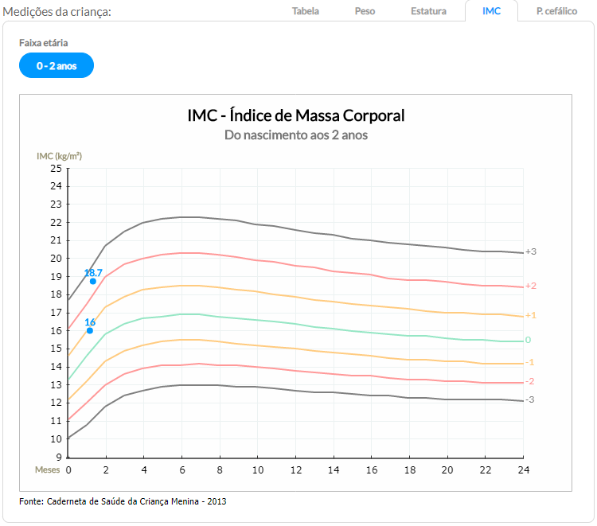

#### 6.5.3.5.3 - Desenvolvimento da criança

O bloco **Desenvolvimento da criança** apresenta as informações das Alterações fenotípicas, fatores de risco, os reflexos primitivos nos primeiros 15 dias de vida e os marcos do desenvolvimento coletadas na consulta de puericultura.

#### 6.5.3.5.4 - Lista de problemas/condições ativas

O último bloco do acompanhamento da criança é a Lista de problemas/condições ativas que disponibiliza as condições que estão com status "Ativo" na seção Problemas/Condições e Alergias, informando qual o problema e a idade de início do problema como vemos a seguir.

Figura 6.133 - Bloco de Lista de problemas do Acompanhamento da Puericultura

## 6.5.4 - Idoso

Para qualificar o cuidado à saúde ofertada às pessoas idosas, o sistema e-SUS APS com PEC, conta com a funcionalidade de acompanhamento do idoso. Para tirar o maior proveito desta funcionalidade é fundamental o preenchimento adequado das informações no prontuário eletrônico.

Neste primeiro momento todas as pessoas com 60 anos ou mais poderão ser avaliadas, tendo em vista, a situação da polifarmácia, os problemas/condições presente, avaliações antropométricas, incluindo o perímetro da panturrilha, alergias/reações adversas, além da aferição da pressão arterial e glicemia capilar.

### 6.5.4.1 - Registrando o atendimento a pessoa idosa

Para a elaboração de uma evolução clínica de qualidade é essencial seguir o modelo RCOP e o preenchimento das estruturas do SOAP.

Na parte do Subjetivo registra- se as informações sobre o motivo da consulta e as impressões subjetivas do profissional de saúde e as expressadas pela pessoa idosa.

Na parte Objetiva registram- se as observações importantes do exame físico, os sinais vitais, a glicemia capilar, os exames solicitados e/ou avaliados e as medições antropométricas, que a partir da versão 3.2, foi incluído o campo para o registro do perímetro da panturrilha. Para realizar a avaliação no módulo de acompanhamento da pessoa idosa é essencial digitar o PESO e ALTURA para o cálculo do IMC, o PERÍMETRO DA PANTURRILHA, quando necessário, além do da PRESSÃO ARTERIAL e da GLICEMIA CAPILAR, se necessário.

Na parte da Avaliação utiliza-se o CIAP-2 ou CID-10 para a classificação do problema ou condição detectada. Para o acompanhamento dos problemas/condições e alergias/reações adversas presente na pessoa idosa, deve- se registrar no módulo "Problemas/Condições e Alergias" e informar como "Ativo", conforme descrito no capítulo 6.4.3. Para registrar apenas os problemas e condições de saúde, outra alternativa é clicar no box "inserir na lista de problema/condição como ativo", conforme figura abaixo.

Figura 6.134 - Problema e / ou condição detectada

Na bloco **Plano** registra-se o plano de cuidados ou condutas a serem tomadas em relação ao problema ou necessidade avaliada para a pessoa idosa. No plano terapêutico com a finalidade de avaliar no acompanhamento se a pessoa idosa faz uso concomitante de 5 ou mais medicamentos, o profissional de saúde deverá prescrever os medicamentos utilizando a ferramenta "Prescrição de Medicamentos", conforme descrito no capítulo 6.4.2.8. Entretanto, para este acompanhamento, somente é considerado os medicamentos classificados como de uso contínuo e que não estão como tratamentos concluídos.

### 6.5.4.2 - Acompanhamento da pessoa idosa

O *Cartão* minimizado apresenta informações sobre o estado nutricional e se a pessoa idosa faz uso de 5 ou mais medicamentos como mostra a imagem abaixo.

Figura 6.135 - Cartão da pessoa idosa

Clicando em cima do *Cartão* é possível verificar o conjunto de informações completas relacionadas ao acompanhamento da pessoa idosa. Existem quatro blocos de informações principais, sendo eles: "Medicamentos ativos", "Problemas/Condições", "Gráficos e medições" e "Alergias/Reações Adversas".

Figura 6.136 - Cartão da pessoa idosa

Cada bloco das informações sobre o acompanhamento da pessoa idosa serão detalhados a seguir.

#### 6.5.4.2.1 - Medicamentos ativos

O bloco Medicamentos ativos oferta aos profissionais de saúde informações importantes relacionadas aos medicamentos em uso contínuo pela pessoa idosa, conforme mostra a imagem abaixo:

Figura 6.137 - Medicamentos ativos

Neste bloco também é possível verificar se há prescrições de medicações sujeitos a controle especial conforme o tipo de prescrição.

Figura 6.138 - Medicamentos ativos

#### 6.5.4.2.2 - Problemas/Condições

O bloco do acompanhamento da pessoa idosa apresenta a Lista de problemas/condições ativas ou latentes, informando qual a situação, o problema/condição, a idade de início do problema e a última atualização, conforme vemos a seguir.

Figura 6.139 - Problemas/Condições

#### 6.5.4.2.3 - Gráficos e Medições da pessoa idosa

Abaixo, o bloco Gráficos e medições da pessoa idosa apresenta os dados de medições registradas durante as consultas. Estão representadas em forma de tabela e gráficos. A tabela mostra os dados da data da consulta, a idade da pessoa idosa naquela data, o peso, estatura, o IMC calculado para aquela data, o perímetro da panturrilha, a pressão arterial e a glicemia capilar.

Figura 6.140 - Gráficos e medições

As outras abas trazem os gráficos montados pelo sistema a partir dos dados registrados durante as consultas. Estão disponíveis os gráficos de IMC e perímetro da panturrilha. Estes gráficos permitem a avaliação do estado nutricional e da massa muscular da pessoa idosa, respectivamente.

Os dados são agrupados em faixas etárias, numa escala de 05 em 05 anos, a partir dos 60 anos até a faixa etária atual da pessoa idosa. Foram utilizados como base os padrões utilizados pela Caderneta de Saúde da Pessoa Idosa de 2017.

Figura 6. 141 - Gráfico com dados de IMC

Figura 6.142 - Gráficos com dados do perímetro da panturrilha

#### 6.5.4.2.4 - Alergias e Reações Adversas

O último bloco do acompanhamento da pessoa idosa é a lista de Alergias/Reações adversas, informando qual é a alergia, a data da instalação do problema e o nível de criticidade, conforme a figura abaixo.

Figura 6.143 - Alergias/Reações adversas

# 6.6 Registro Tardio de Atendimento

O registro tardio de atendimento possibilita ao profissional de saúde a transcrição dos atendimentos que não foram registrados no momento em que de fato ocorreu a consulta, como por exemplo, os atendimentos individuais realizados fora da UBS ou naqueles em que o sistema e-SUS APS com PEC estava indisponível por qualquer motivo.

Figura 6.144 - Registro Tardio de Atendimento

## 6.6.1 - Registrar o atendimento

Para iniciar o registro tardio do atendimento clique sobre o módulo "Registro tardio de atendimento"

Em seguida será aberta a tela para adicionar os cidadãos que foram atendidos e que o registro não pode ser feito no sistema e-SUS APS com PEC no momento da consulta.

Figura 6.145 - Listar registro tardio de atendimento

Ao clicar no botão \"adicionar\" abrirá uma nova tela na qual é possível buscar ou adicionar um cidadão para realizar o registro tardio do atendimento, inserir data e hora em que ocorreu a consulta, o profissional que prestou a assistência, assim como, inserir o local de atendimento selecionando entre as opções *UBS, Unidade Móvel, Rua, Domicílio, Escola/Creche, Polo da Academia da Saúde, Instituição/Abrigo, Unidade Socioeducativa, Unidade prisional/congêneres ou Outros*. Ao selecionar o local de atendimento como a UBS será necessário selecionar uma justificativa, dentre as possíveis, referente ao motivo do registro tardio no sistema e-SUS APS com PEC.

Figura 6.146 - Registrar atendimento tardio

Ao finalizar o registro clique no botão \"Salvar\", em seguida, o cidadão aparecerá na lista do registro tardio de atendimento, na qual o profissional poderá incluir mais pessoas a esta lista, clicando no botão \"Adicionar\", iniciar o processo do registro clicando no ícone , editar as informações do cidadão inserido na lista clicando no ícone  ou excluí-lo clicando em . Ao clicar no ícone  para registrar o atendimento tardio o prontuário abrirá para realizar a transcrição com todas as funcionalidades do atendimento do PEC.

Figura 6.147 - Lista registro tardio de atendimento

>  **DICA**: Atendimentos realizados fora da UBS podem ser agendados ao selecionar na agenda a opção \"Fora da UBS\". Os registros agendados são automaticamente inseridos na lista de registro tardio. Para saber mais como agendar um cidadão para o atendimento fora da UBS, consulte o capítulo 5.1.1.

# ANEXOS

Lista de Notificações SINAN disponíveis

**1 - Acidentes**

- Acidente de trabalho grave
- Acidente de trabalho com exposição a material biológico

**2 - Identificação de primeiros sintomas**

- Acidentes por animais peçonhentos
- Botulismo
- Chikungunya
- Cólera
- Coqueluche
- Dengue
- Difteria
- Doenças de chagas aguda
- Doença meningocócica
- Esquistossomose
- Febre amarela
- Febre Maculosa / Rickettsioses
- Febre por vírus do Nilo ocidental
- Febre tifóide
- Hantavirose
- Hepatites virais
- Intoxicação exógena
- Leishmaniose visceral
- Leptospirose
- Malária
- Outras meningites
- Paralisia flácida aguda / Poliomielite
- Peste
- Raiva humana
- Rubéola
- Sarampo
- Tétano acidental

**3 - Identificação de primeiros sintomas (Gestante e neonatal):**

- Rotavírus
- Tétano neonatal

**4 - Diagnósticos**

- AIDS (Pacientes maiores de 13 anos)
- AIDS (Pacientes menores de 13 anos)
- DRT - Câncer relacionado ao trabalho
- DRT - Dermatoses ocupacionais
- DRT - LER / DORT
- DRT - PAIR
- DRT - Pneumoconioses
- DRT - Transtornos mentais relacionados ao trabalho
- Hanseníase
- Leishmaniose tegumentar americana
- Tuberculose

**5 - Diagnósticos (Gestante)**

- Gestante HIV+
- Sífilis em gestante

**6 - Diagnósticos (Neonatal)**

- Sífilis congênita
- Síndrome da rubéola congênita

**7 - Atendimento anti-rábico**

- Atendimento anti-rábico humano

CAPÍTULO 7 - Coleta de Dados Simplificada (CDS)
===============================================

A Coleta de Dados Simplificada (CDS) é um dos componentes da Estratégia e-SUS APS, sendo utilizada principalmente nos serviços de saúde que não dispõem de sistema informatizado para utilização rotineira no trabalho. Este capítulo apresenta informações para a utilização do Módulo CDS, agregado ao Sistema com PEC, considerando o processo de digitação das fichas previamente preenchidas. Todas as orientações que constam neste manual se aplicam ao Sistema com CDS (*standalone*). Para mais informações sobre o Sistema com CDS, em especial sobre a forma de preenchimento das fichas, consulte o Manual do Sistema com Coleta de Dados Simplificada, disponível por meio do endereço eletrônico [http://dab.saude.gov.br/portaldab/esus.php](http://dab.saude.gov.br/portaldab/esus.php).

>  **NOTA**: Para conhecer os conceitos e orientações de preenchimento das fichas, consulte o Manual do Sistema com Coleta de Dados Simplificada (CDS).

# 7.1 Visão Geral do Sistema/Módulo CDS

O Sistema com CDS ou o Módulo CDS (do Sistema com PEC) é um **sistema de apoio à digitação** das fichas que compõem esse sistema. A Figura 7.1 apresenta a tela principal do CDS, na qual também são visualizadas as doze fichas para o registro de informações, que compõem o sistema e-SUS AB. São elas:

- Cadastro individual;
- Cadastro domiciliar e territorial;
- Ficha de atendimento individual;
- Ficha de atendimento odontológico;
- Ficha de atividade coletiva;
- Ficha de procedimentos;
- Ficha de visita domiciliar e territorial;
- Marcadores de consumo alimentar;
- Ficha de avaliação de elegibilidade;
- Ficha de atendimento domiciliar;
- Ficha complementar - Síndrome neurológica por Zika/Microcefalia;
- Ficha de Vacinação.

Figura 7.1 - Tela do menu do CDS

Fonte: SAS/MS.

## 7.1.1 Orientações Gerais sobre o Processo de Digitação das Fichas

O processo de digitação deve ser definido no âmbito da gestão municipal, considerando os aspectos logísticos e os recursos humanos disponíveis para esse fim. Em especial, considerando os diferentes cenários de implantação, como visto no Manual de Implantação da Estratégia e-SUS APS, o fluxo deve estar adequado a cada realidade.

Veja a Nota Técnica: [**Alimentação dos sistemas de informação pelos profissionais das equipes de Atenção Básica**](http://189.28.128.100/dab/docs/portaldab/documentos/NT_ACS.pdf) ([[http:// 189.28.128.100/dab/docs/portaldab/documentos/ NT_ACS.pdf]](http://189.28.128.100/dab/docs/portaldab/documentos/NT_ACS.pdf)). De modo a facilitar o processo de digitação, foi elaborado modelo padrão de cabeçalho para todas as fichas usadas no Sistema com CDS, como ilustrado na Figura 7.2. Estes campos não são registrados no sistema, tampouco existe relatório desse processo, e são de uso exclusivo dos responsáveis pela digitação para **controle interno da digitação**.

Figura 7.2 - Cabeçalho- padrão das fichas CDS
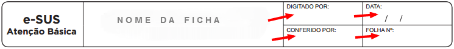
Fonte: SAS/MS.

Cada campo é definido da seguinte maneira:

- **DIGITADO POR:** nome do profissional que digitou a ficha;

- **DATA:** dia em que a digitação foi realizada;

- **CONFERIDO POR:** nome do profissional que fez a supervisão do processo de digitação da ficha;

- **FOLHA Nº:** este campo pode ser utilizado na organização do processo de trabalho do profissional que preencher as informações da ficha em determinado contexto, identificando, quando for o caso, o número da folha usada para esse fim.

## 7.1.2 Orientações Gerais sobre Digitação das Fichas no Sistema

Conforme vimos na Figura 7.1, o Sistema com CDS organiza as ferramentas para digitação por fichas. De modo geral, quando acessamos alguma das fichas é possível observar a lista com os registros que já foram digitados no sistema (estará vazia quando não houver nenhuma ficha digitada, ou se já tiverem sido enviadas), como podemos ver na Figura 7.3, para o caso das Fichas de Atendimento Individual.

Figura 7.3 - Ficha de Atendimento Individual - listagem
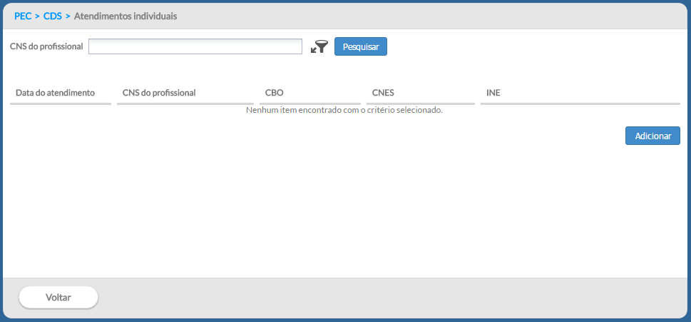
Fonte: SAS/MS.

Portanto, para digitar uma ficha, selecione a ferramenta correspondente, na tela principal, conforme a ficha que deseja digitar. Após abrir a tela de listagem da ficha correspondente, clique no botão . Logo depois, já é possível iniciar a digitação da ficha. Nas seções a seguir, cada ficha será abordada com mais detalhes.

Neste momento, vale destacar ainda o novo componente de filtro , disponível na listagem das fichas, conforme podemos ver na Figura 7.4. Ele permite a realização de pesquisa utilizando algumas informações dos cabeçalhos das fichas, como o CNS do profissional, data de nascimento, CBO, CNES da unidade onde a ficha foi preenchida, INE, entre outras. Os campos de pesquisa variam de acordo com cada ficha.

Figura 7.4 - Componente de filtro da listagem das fichas

Fonte: SAS/MS.

Para filtrar a lista, digite a informação desejada no campo correspondente e clique no botão Pesquisar . Para retirar o filtro, deixe todos os campos vazios e clique novamente em Pesquisar.

Outra funcionalidade importante na listagem de fichas é o controle de envio das fichas. As fichas não enviadas recebem uma marcação especial, como podemos ver na Figura 7.5. Quando uma ficha é enviada a marcação some, indicando que a ficha já foi enviada/transmitida para o SISAB.

Figura 7.5 - Fichas não enviadas

Fonte: SAS/MS.

Na listagem das fichas, ainda existem várias ações possíveis para cada registro e, por padrão, as seguintes opções estão disponíveis:

-  **Visualizar:** permite visualizar as informações de uma ficha digitada;

-  **Editar:** permite fazer alterações em uma ficha digitada. Disponível apenas para fichas não enviadas.

-  **Excluir:** permite excluir uma ficha digitada. Disponível apenas para fichas não enviadas.

>  **ATENÇÃO**: caso a ficha digitada já tenha sido transmitida para o SISAB, não será possível editá- la ou excluí- la (botão esmaecido), apenas será possível visualizar a ficha .

## 7.1.3 Inconsistência ao Finalizar a Digitação

Ao finalizar a digitação de uma ficha, clique no botão . Caso o sistema não detecte alguma inconsistência, o sistema salvará os dados e voltará para a tela com a lista de registros/colunas da ficha.

Caso haja alguma inconsistência, o sistema mostrará mensagem na tela indicando os campos que deverão ser corrigidos, como ilustrado na Figura 7.6.

Figura 7.6 - Verificação de inconsistência ao finalizar a digitação

Fonte: SAS/MS.

Verifique as mensagens, corrigindo a informação conforme estiver preenchido na ficha. Caso ela esteja preenchida de forma **inconsistente**, em relação à validação do sistema, **cancele a digitação** da ficha e informe o supervisor, a equipe de saúde ou o profissional responsável pelo preenchimento dela.

>  **ATENÇÃO**: caso alguma **inconsistência** seja **detectada** pela validação do sistema, o supervisor ou o próprio profissional deve ser avisado para que esta ficha possa ser **verificada na origem da informação**.

# 7.2 Cadastro da Atenção Básica

O Cadastro da Atenção Básica (AB) é uma extensão do CadSUS no que se refere aos dados que apoiam as equipes de AB a mapear as características sociais, econômicas e de saúde da população adscrita ao território sob sua responsabilidade. Esse cadastro está organizado em duas dimensões: a) Cadastro individual e b) Cadastro domiciliar e territorial.

## 7.2.1 Cadastro Individual

Na tela principal, clique no ícone "Cadastro individual". A janela com a lista de fichas digitadas de cadastro individual será mostrada, conforme a Figura 7.7. É possível visualizar esta lista e as opções relacionadas a cada registro, além das opções de filtro da lista.

Figura 7.7 - Tela principal do cadastro individual
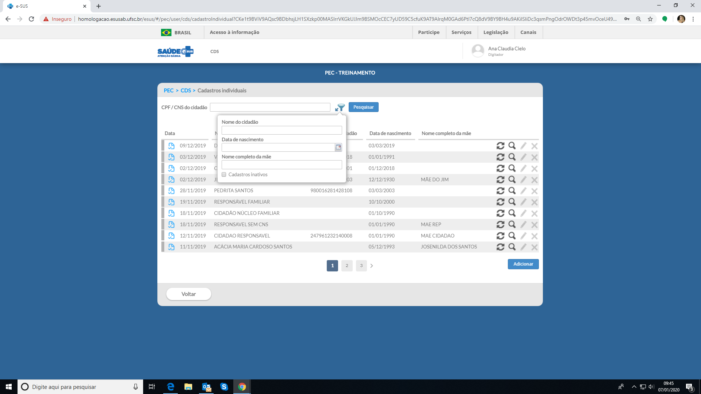
Fonte:SAS/MS.

### 7.2.1.1 Adicionar Cadastro Individual

Após clicar no botão \"Adicionar\", o sistema mostrará a tela de preenchimento da ficha de cadastro, conforme as Figuras 7.8, 7.9 (continuação) e 7.10 (continuação).

Figura 7.8 - Adicionar cadastro individual
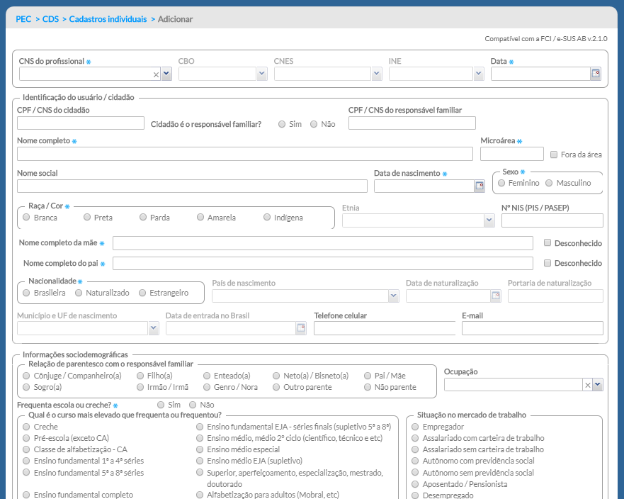
Fonte:SAS/MS.

Figura 7.9 - Adicionar cadastro individual - continuação

Fonte:SAS/MS.

Figura 7.10 - Adicionar cadastro individual - continuação
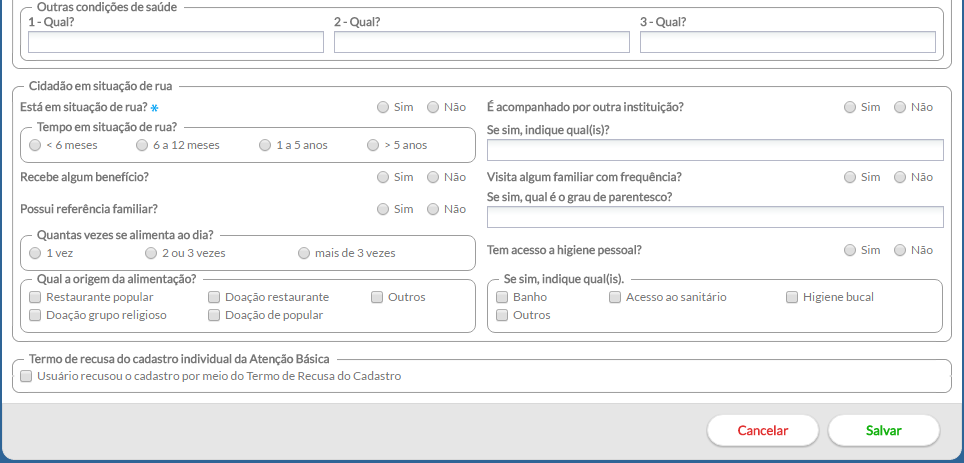
Fonte:SAS/MS.

Para digitar a ficha de cadastro, atente para o que se segue:

#### 7.2.1.1.1 Informações de cabeçalho

1.Preencha os campos do cabeçalho, digitando os dados que constam na ficha de cadastro;

a.Ao incluir o número do Cartão SUS do profissional, o sistema mostrará opções para o CNES e o INE que vêm da base de dados do CNES importado na instalação da aplicação;

b.Caso o profissional tenha apenas um vínculo no município, os dados serão preenchidos automaticamente;

c.Caso o trabalhador tenha mais de um vínculo, o sistema mostrará as opções e o digitador indicará o que está registrado na ficha. Também são apresentados para o preenchimento, dependendo da ficha que irá digitar, os campos "microárea" e a data em que o cadastro foi realizado;

#### 7.2.1.1.2 Dados de identificação

2.Preencha os "Dados de identificação" do cidadão de acordo com a ficha CDS. Se a resposta da questão "Cidadão é o responsável familiar?" for "Não", o campo "CNS ou CPF do responsável familiar" deve ser preenchido obrigatoriamente;

#### 7.2.1.1.3 Informações sociodemográficas

3.Preencha as "Informações sociodemográficas" de acordo com as informações da ficha. Se a resposta de uma questão for "Sim", verifique as opções adicionais de preenchimento (ex.: Tem alguma deficiência? "Sim". Então, responda também "Se sim, quais?" outro exemplo; É membro de povo ou comunidade tradicional? Se sim, qual?). No momento da digitação, deve- se escolher uma das opções disponíveis no software, conforme seu preenchimento na ficha.

#### 7.2.1.1.4 Questionário autorreferido de condições/situações de saúde

4.Preencha as informações de "Condições/situações de saúde gerais" do cidadão de acordo com os dados da ficha. Observe que algumas perguntas devem ser especificadas caso a resposta seja "Sim";

#### 7.2.1.1.5 Cidadão em situação de rua

5.Preencha as informações de "Em situação de rua" de acordo com as informações registradas na ficha. Observe que a pergunta "Está em situação de rua" é obrigatória;

6.Após a digitação dos dados, clique no botão  e, caso haja alguma inconsistência, o sistema mostrará mensagem na tela indicando os campos que deverão ser corrigidos. Se não houver inconsistência, o sistema salvará os dados e voltará para a tela anterior.

### 7.2.1.2 Adicionar Cadastro Individual com Termo de Recusa

Para fazer cadastro individual com termo de recusa, siga os passos:

- Passo 1. Preencha os dados de cabeçalho e de identificação do cidadão;

- Passo 2. Marque o campo "Termo de recusa do cadastro individual da Atenção Básica" quando o cidadão não desejar ser cadastrado pela equipe de saúde, seja Saúde da Família ou Unidade de Saúde Tradicional;

>  **ATENÇÃO**: caso o campo "Termo de recusa" seja marcado, os campos ficam desabilitados para preenchimento, exceto os campos de identificação do cidadão.

## 7.2.2 Cadastro domiciliar e territorial

Na tela principal do CDS, clique no ícone "Cadastro domiciliar e territorial". A janela da "Lista de cadastro domiciliar" será mostrada, conforme a Figura 7.11. É possível visualizar a lista de cadastros realizados, o componente de filtro e as opções relacionadas a cada registro.

Figura 7.11 - Tela principal do cadastro domiciliar
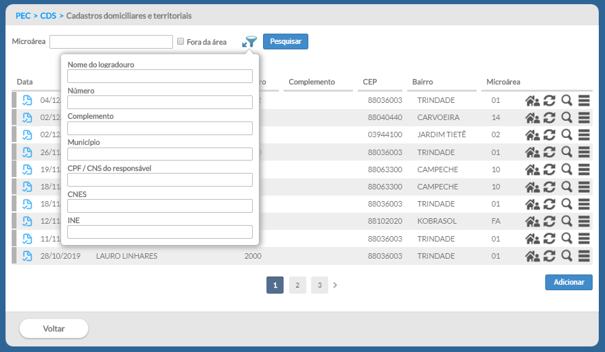
Fonte: SAS/MS.

Como vimos nas orientações gerais de digitação das fichas, várias ações podem ser realizadas para cada registro. E, em especial para as fichas de Cadastro Domiciliar, ainda podem ser destacadas duas opções:

-  **Cadastros individuais:** permite visualizar dados das famílias vinculadas àquele domicílio;

-  **Atualizar**: permite atualizar os dados cadastrais do domicílio.

Por fim, o botão  é utilizado para incluir novos cadastros domiciliares. Vamos observar como é realizado este cadastro.

### 7.2.2.1 Adicionar Cadastro Domiciliar

Após clicar no botão \"Adicionar\", o sistema mostrará a tela de preenchimento da ficha de cadastro, conforme a Figura 7.12.

Figura 7.12 - Adicionar cadastro domiciliar
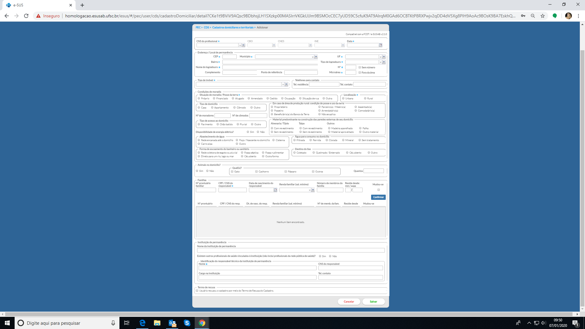
Fonte: SAS/MS.

Para digitar a ficha de cadastro, observe os seguintes itens:

#### 7.2.2.1.1 Informações de cabeçalho

1.Preencha os campos do cabeçalho, digitando os dados que constam na ficha de cadastro;

a.Ao incluir o número do Cartão SUS do profissional, o sistema mostrará opções para o CNES e o INE que vêm da base de dados do CNES importado na instalação da aplicação;

b.Caso o profissional tenha apenas um vínculo no município, os dados serão preenchidos automaticamente.

c.Caso tenha mais de um, o sistema mostrará as opções e o digitador indicará o que está registrado na ficha. Também será apresentado para preenchimento, de acordo com a ficha, o campo "Data" em que o cadastro foi realizado;

#### 7.2.2.1.2 Informações de identificação e contato do domicílio

2.Preencha as informações do "Endereço/Local de permanência" do domicílio.

a.Após preenchimento do CEP, os campos "Município", "UF", "Bairro"  e "Tipo de logradouro" e "Nome de logradouro" são completados  automaticamente, conforme imagem a seguir:

b.Também é possível incluir, nesse cadastro, as informações sobre o "Tipo de imóvel" e "Telefones para contato". Atenção para o telefone, que deve estar acompanhado pelo número de DDD do município;

c.Para o "Tipo de imóvel", selecione uma das opções:

- 01 - Domicílio

- 02 - comércio

- 03 - terreno baldio

- 04 - Ponto Estratégico (PE: cemitério, borracharia, ferro- velho,  depósito de sucata ou materiais de construção, garagem de ônibus  ou veículo de grande porte)

- 05 - Escola

- 06 - Creche

- 07 - Abrigo

- 08 - Instituição de longa permanência para idosos

- 09 - Unidade prisional

- 10 - Unidade de medida sócio educativa

- 11 - Delegacia

- 12 - Estabelecimento religioso

- 99 - Outros

| **Atenção para as regras do sistema a partir do Tipo de Imóvel!**|
|- |
| **Domicílio:** |
|- Ao selecionar a opção \"01 - ­Domicílio\" para Tipo de Imóvel, serão desabilitados os campos \"Nome da instituição de permanência\" e \"Existem outros profissionais de saúde vinculados à instituição (não inclui profissionais da rede pública de saúde)?\", além do grupo \"Identificação do responsável técnico da instituição de permanência\". Será alterado o nome do grupo \"Termo de recusa\" para \"Termo de recusa do cadastro domiciliar e territorial da Atenção Básica\". |

| **Imóveis sem finalidade de moradia/longa permanência:**|
|- |
| - No caso da seleção das opções \"02 - ­ Comércio\", \"03 - ­ Terreno baldio\", \"04 - ­ Ponto estratégico\", \"05 - ­ Escola\", \"06 - ­ Creche\", \"12 - ­ Estabelecimento religioso\" ou \"99 - ­ \Outros\", serão desabilitados os grupos \"Condições de moradia\", \"Animais no domicílio?\", \"Famílias\", \"Identificação do responsável técnico da instituição de permanência\" e \"Termo de recusa\". Também serão desabilitados os campos \"Nome da instituição de permanência\" e \"Existem outros profissionais de saúde vinculados à instituição (não inclui profissionais da rede pública de saúde)?\".|

| **Instituição de longa permanência:**|
|- |
| - E se forem selecionadas as opções \"07 - ­ Abrigo\", \"08 - ­ Instituição de longa permanência para idosos\", \"09 - ­ Unidade prisional\", \"10 - ­ Unidade de medida sócio educativa\" ou \"11 - ­ Delegacia\", os campos \"Situação de moradia/Posse de terra\", \"Tipo de domicílio\", \"Nº de cômodos\", \"Em caso de área de produção rural: condição de posse e uso da terra\", \"Material predominante na construção das paredes externas de seu domicílio\" e \"Tipo de acesso ao domicílio\", os grupos \"Animais no domicílio\" e \"Famílias\" serão desabilitados. Nesta ocasião, será alterado o nome do termo de recusa para \"Termo de recusa do cadastro da instituição de permanência\".|

#### 7.2.2.1.3 Condições de moradia

3.Preencha as informações de "Condições de moradia" de acordo com o registrado na ficha. Caso o campo "Animais no domicílio" estiver marcado com a resposta "Sim", informe "Qual(is)" e "Quantos", como mostra a imagem abaixo:

#### 7.2.2.1.4 Adicionar núcleo familiar

4.Preencha as informações do bloco "Famílias" (núcleos familiares) que vivem no domicílio. Cada uma é representada pelo número do CNS ou CPF do Responsável Familiar de cada núcleo familiar. Para adicionar uma família, basta preencher os campos no início do bloco e clicar no botão "Confirmar";

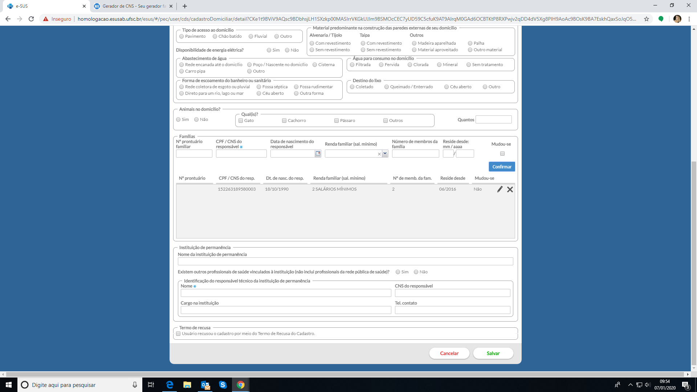

a.Caso existam **mais famílias** informadas na ficha, **repita o processo conforme item anterior** para todas as linhas que identificam núcleos familiares daquele domicílio;

b.Ao digitar as informações, após confirmada a inclusão, caso alguma tenha sido registrada de forma incorreta, é possível alterá- la de um registro já incluído, clicando na opção  "Editar". O registro será habilitado para edição nos campos de entrada de dados principal. Para salvar, clique novamente no botão "Confirmar";

c.Durante a atualização deste registro, ver mais na Seção 7.1.3, é possível indicar se a família "mudou- se" clicando na caixa correspondente. Esta opção está desabilitada ao adicionar nova família;

d.Caso o registro tenha sido inserido de forma incorreta, também é possível excluir a família. Para excluir o registro, clique na opção  "Excluir" e este será removido;

5.Após a digitação dos dados, clique no botão  e, caso haja alguma inconsistência, o sistema mostrará mensagem na tela indicando os campos que deverão ser corrigidos. Se não houver inconsistência, o sistema salvará os dados e voltará para a tela anterior.

### 7.2.2.2 Adicionar Cadastro Domiciliar com Termo de Recusa

O campo ao final da ficha/tela do termo de recusa tem um processo de cadastro diferenciado. Ao ter um cadastro domiciliar com termo de recusa preenchido, basta adicionar os dados de identificação do domicílio e marcar a opção \"Termo de recusa do cadastro domiciliar da Atenção Básica\", conforme a Figura 7.13.

Figura 7.13 - Termo de recusa do cadastro domiciliar

Fonte: SAS/MS.

>  **ATENÇÃO**: caso o campo de termo de recusa seja marcado, os campos ficam desabilitados para preenchimento, exceto os campos de identificação do imóvel.

## 7.2.3 Atualizar Cadastro da Atenção Básica

A ferramenta de "Atualizar" é parte importante do processo de trabalho das equipes para manter as informações do território atualizadas.

Ao clicar no botão "Atualizar"  é iniciado o procedimento de atualização das fichas. Serão apresentadas todas as informações do último registro salvo, com a exceção dos Campos do cabeçalho (CNS do profissional, CNES, INE, Microárea e Data) e do Campo \"Saída do cidadão do cadastro\". Será permitida a alteração dos dados, exceto do campo \"CNS do cidadão\" quando estiver preenchido. Ao informar o CNS ou CPF do cidadão, o sistema deverá verificar se o mesmo existe na base de dados e apresentará a mensagem \"CNS já cadastrado no sistema.\" com opção \"OK\" e não permitirá salvar o registro até que esta ação seja resolvida. Caso contrário, as alterações serão salvas normalmente.

# 7.3 Fichas de Atendimento

As fichas de atendimento são utilizadas para registro dos profissionais de nível superior. Elas não objetivam esgotar todo o processo de atendimento de um indivíduo e também não substituem o registro clínico feito no prontuário em papel. As informações nelas contidas foram selecionadas segundo a sua relevância no cuidado ao cidadão e por comporem indicadores de monitoramento e avaliação para a AB e para as Redes de Atenção à Saúde como um todo.

## 7.3.1 Ficha de Atendimento Individual

Na tela principal do Módulo do CDS, clique no ícone "Ficha de Atendimento Individual". Será apresentada a lista das "Fichas de Atendimento Individual" digitadas, em que constará a Data do atendimento, CNS do profissional responsável pelo atendimento, CBO do profissional, CNES da UBS, e o INE da equipe, conforme a Figura 7.14.

Figura 7.14 - Lista de Fichas de Atendimento Individual

Fonte: SAS/MS.

### 7.3.1.1 Adicionar Ficha de Atendimento Individual

Para informar nova Ficha de Atendimento Individual, clique no botão . O sistema exibirá uma tela , conforme a Figura 7.15.

Figura 7.15 - Adicionar Ficha de Atendimento Individual

Fonte: SAS/MS.

Para preencher os dados da Ficha de Atendimento Individual, atente para os itens a seguir:

#### 7.3.1.1.1 Informações de cabeçalho

1.Preencha o cabeçalho da ficha (Figura 7.15), ao incluir o número do CNS do profissional, o sistema mostrará opções para o CBO, CNES e INE que vêm da base de dados do CNES importado na instalação da aplicação;

a.caso o profissional tenha apenas um vínculo no município, os dados serão preenchidos automaticamente;

b.caso o profissional tenha mais de um vínculo, o sistema mostrará as opções e o digitador indicará o que está registrado na ficha. Também são apresentados para preenchimento os campos para inclusão de outros profissionais da equipe para os casos em que houver a realização de consulta compartilhada;

2.para informar novo registro de atendimento, clique no botão . O sistema exibirá uma tela com cabeçalho preenchido (somente leitura) e os dados a serem completados para cada atendimento;

a.deve- se obedecer o conteúdo da ficha, portanto, poderão ser  registrados até 13 atendimentos para usuários diferentes e  realizados pelo mesmo profissional;

3.quando for realizado um atendimento compartilhado é necessário incluir os dados do outro profissional que participou.

#### 7.3.1.1.2 Dados de identificação do cidadão

4.digite os dados conforme preenchido na ficha, iniciando- se pelos dados de identificação do cidadão e de alguns dados sobre o atendimento;

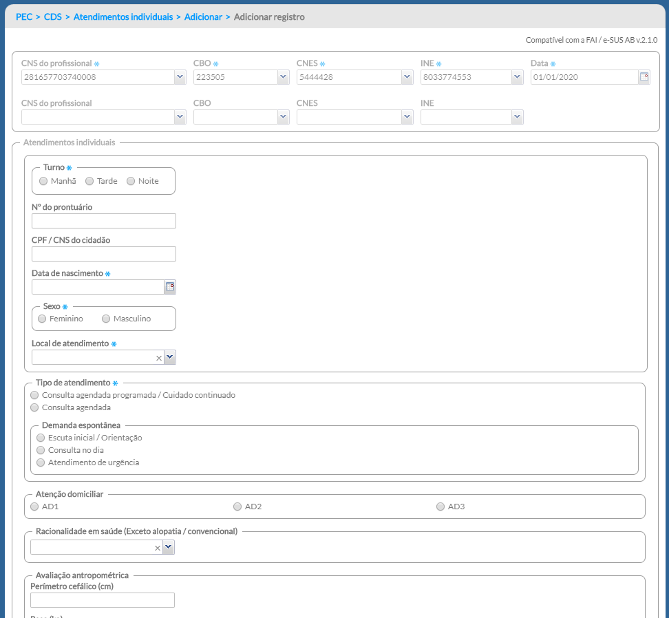

5.na sequência, digite o tipo de atendimento e alguns dados de saúde, conforme preenchido na ficha;

6.após, digite as informações correspondentes ao bloco "Problema/Condição Avaliada". Atenção aos campos CIAP2 e CID10, que são informados usando códigos correspondentes das classificações e estão no verso da ficha, acompanhados de outras opções;

7.na sequência, marque os exames solicitados e avaliados. Cada *checkbox* corresponde a um item marcado na ficha pelo profissional. Atenção aos itens "Outros exames", que são informados pelo código do SIGTAP e acompanhados de uma marcação se foi solicitado (S) e/ou avaliado (A);

8.por último, informe se ficou em observação. Caso se trate de **profissional do NASF** ou Polo, marque as opções correspondentes. Assinale, também, as opções de conduta/desfecho e/ou encaminhamento, caso tenha sido assinalado na ficha;

9.após a digitação dos dados, clique no botão  e, caso haja alguma inconsistência, o sistema mostrará mensagem na tela indicando os campos que deverão ser corrigidos. Se não houver inconsistência, o sistema salvará os dados e voltará para a tela anterior.

#### 7.3.1.1.3 Lista de registro dos atendimentos individuais

O sistema traz, para cada ficha, a lista dos atendimentos individuais. Ao clicar em visualizar ou editar é possível acessar o conteúdo do atendimento, facilitando a busca do registro pelo usuário do sistema, como podemos ver na Figura 7.16.

Figura 7.16 - Lista de registros de atendimento na Ficha de Atendimento Individual

Fonte: SAS/MS.

Ao finalizar a digitação da Ficha de Atendimento Individual, clique no botão 

## 7.3.2 Ficha de Atendimento Odontológico Individual

Na tela principal, clique no ícone "Ficha de Atendimento Odontológico". Será apresentada a lista das "Fichas de Atendimento Odontológico" digitadas, conforme a Figura 7.17, em que constará a data do atendimento, o número do CNS do profissional que preencheu a ficha, o CBO do profissional, o código CNES da UBS e o código INE da equipe.

Figura 7.17 - Lista de Fichas de Atendimento Odontológico

Fonte: SAS/MS.

### 7.3.2.1 Adicionar Ficha de Atendimento Odontológico

Para informar nova Ficha de Atendimento Odontológico, clique no botão  e atente para os itens a seguir:

1.após clicar no botão \"Adicionar\", o sistema mostrará a tela de preenchimento da ficha de cadastro;

#### 7.3.2.1.1 Informações de cabeçalho

2.digite os dados do cabeçalho conforme preenchido na ficha, ao incluir o CNS do profissional, o sistema mostrará opções para o CBO, CNES e INE que vêm da base de dados do CNES importado na instalação da aplicação;

a.caso o profissional tenha apenas um vínculo no município, os dados serão preenchidos automaticamente;

b.caso o profissional tenha mais de um vínculo, o sistema mostrará as opções e o digitador indicará o que está registrado na ficha;

c.também são apresentados para preenchimento os campos para inclusão de outros profissionais da equipe para os casos em que houver a realização de atendimento compartilhado;

3.para informar novo registro de atendimento, clique no botão . O sistema exibirá uma tela com cabeçalho preenchido (somente leitura) e os dados a serem completados para cada atendimento;

a.deve- se obedecer ao conteúdo da ficha, portanto poderão ser registrados até 13 atendimentos para usuários diferentes e realizados pelo mesmo profissional;

#### 7.3.2.1.2 Dados de identificação do cidadão e do serviço de saúde

4.digite os dados no sistema conforme preenchido na ficha, iniciando pelos dados de identificação do cidadão e alguns dados sobre o atendimento;

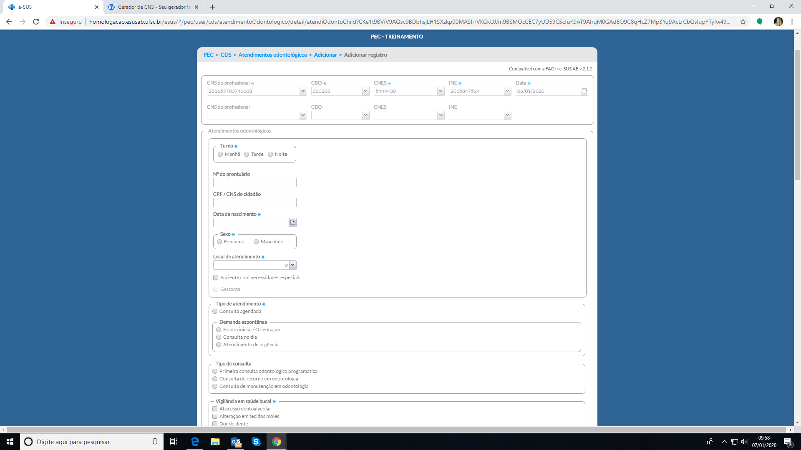

5.digite os dados "Tipo de atendimento", "Tipo de consulta" e "Vigilância em saúde bucal", que são obrigatórios;

6.digite os dados de procedimentos realizados no sistema, conforme preenchido na ficha. Perceba que, diferentemente da Ficha de Atendimento Individual, os procedimentos de odontologia são preenchidos com a quantidade;

7.no campo "Outros procedimentos", digite os procedimentos preenchidos com a quantidade informada na coluna da ficha e o código do SIGTAP informado na linha da ficha, nos respectivos campos "Quantidade" e "Procedimento", e clique em "Confirmar". Faça isso para todos os procedimentos preenchidos na coluna correspondente ao registro de atendimento do cidadão;

8.por fim, digite os itens de fornecimento, caso estes tenham sido preenchidos na ficha, e a conduta/desfecho e/ou encaminhamento, caso tenha sido realizado no atendimento;

9.após a digitação dos dados, clique no botão  e, caso haja alguma inconsistência, o sistema mostrará mensagem na tela indicando os campos que deverão ser corrigidos. Se não houver inconsistência, o sistema salvará os dados e voltará para a tela anterior.

#### 7.3.2.1.3 Lista de registro dos atendimentos individuais

Diferentemente das versões anteriores do CDS, em que cada registro de atendimento era mostrado em abas, desde a versão 1.3, o sistema traz a lista de atendimentos, representada em forma de colunas na Ficha de Atendimento Odontológico, facilitando a busca do registro pelo usuário do sistema, como podemos ver na Figura 7.18.

Figura 7.18 - Lista de registros de atendimento na Ficha de Atendimento Odontológico
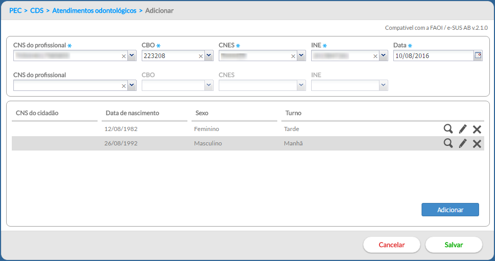
Fonte: SAS/MS.

Ao finalizar a digitação da Ficha de Atendimento Odontológico, clique no botão .

# 7.4 Ficha de Atividade Coletiva

A Ficha de Atividade Coletiva visa ao registro das atividades realizadas pelas equipes conforme as necessidades do território e capacidade da equipe de estruturar as ações. Nela, pode ser registrada ações estruturantes para a organização do processo de trabalho, como reuniões da própria equipe de saúde, reuniões com outras equipes de saúde, ou reuniões com outros órgãos, além das atividades de saúde voltadas para a população, como: educação em saúde, atendimentos, avaliações em grupo e mobilizações sociais, conforme podemos ver na Figura 7.19.

Figura 7.19 - Tipo de atividade da Ficha de Atividade Coletiva
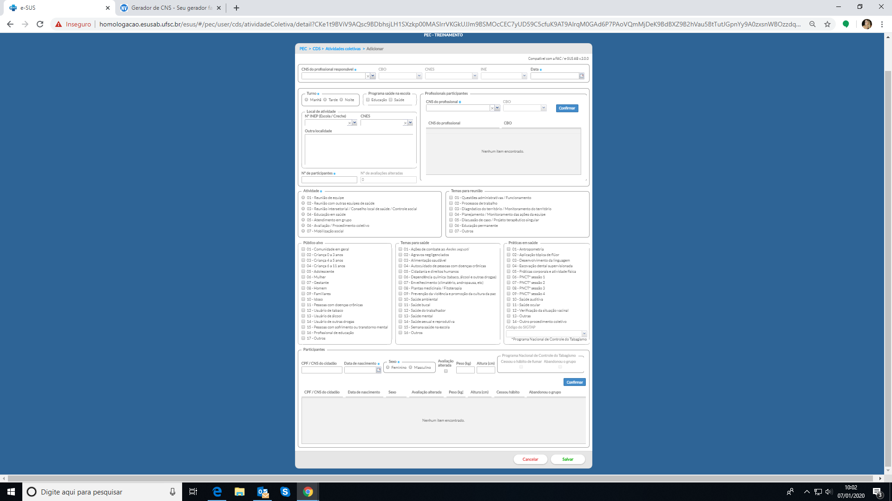
Fonte: SAS/MS.

## 7.4.1 Adicionar Ficha de Atividade Coletiva

Na tela principal, clique no ícone "Ficha de Atividade Coletiva". Será apresentada a lista das "Fichas de Atividade Coletiva" digitadas, em que constará a data da atividade, o tipo de atividade realizada, o número do Cartão SUS do profissional responsável pela atividade, o CBO do profissional, o código CNES da UBS e o código INE da equipe, conforme a Figura 7.20.

Figura 7.20 - Lista de atividade coletiva

Fonte: SAS/MS.

Para informar Ficha de Atividade Coletiva, clique no botão  e atente para os itens a seguir:

1.Digite as informações sobre a atividade coletiva realizada nos campos apresentados no início da ficha. Perceba que o cabeçalho é um pouco diferente das demais fichas, informando dados do profissional responsável por organizar e conduzir a atividade coletiva;

2.Digite as informações da realização da atividade, como Turno, Programa saúde na escola, Local de atividade, etc.;

a.Caso seja uma atividade do Programa Saúde na Escola, o n⁰ do INEP (Escola/Creche) deve estar preenchido no bloco "Local da  atividade", assim como, deve ser preenchida no bloco "Programa  saúde na escola", se é uma atividade realizada pela equipe de educadores da escola e/ou pela equipe de saúde;

b.Atividades realizadas em outros estabelecimentos de saúde que não o estabelecimento de origem da equipe, deverá ser preenchido o campo "CNES" no bloco Local de atividade (Exemplo: quando realiza atividade em um Polo de Academia da Saúde);

>  **ATUALIZAÇÃO:** A partir da versão 3.1, no momento da digitação da ficha será apresentada uma lista com as Escolas do Município no campo INEP, com o isso deve- se escolher uma das escolas listadas para informar onde a Atividade Coletiva foi realizada.

3.No bloco "Profissionais participantes", preencha o n⁰ do CNS e o CBO de cada profissional que participou da atividade e clique em , inserindo- os na lista, um a um;

a.Caso necessário, para excluir um profissional da lista, clique  na opção  "Excluir";

4.Preencha o "Nº de participantes" e o campo "Nº de avaliações alteradas", o qual traz o resultado da contagem de participantes da atividade coletiva que tiveram a marcação de "Avaliação alterada" na lista de participantes;

### 7.4.1.1 Atividades de planejamento da equipe e temas para reunião

5.As atividades 01, 02 e 03 estão relacionadas com quaisquer dos assunto do bloco "Temas para reunião", conforme imagem abaixo;

a.Quando a atividade não for destinada a atender aos 03 (três) itens acima descritos, o sistema desabilita o bloco "Temas para reunião";

### 7.4.1.2 Atividades de saúde

6.As atividades relacionadas a ações de saúde com os usuários (itens 04, 05, 06 e 07) fazem relação com os blocos "Público- alvo", "Temas para saúde" e "Práticas em saúde";

a.O bloco "Público alvo" é de múltipla opção, sendo de preenchimento obrigatório para as atividades 4, 5, 6 e 7;

b.O bloco "Temas para saúde" também é de múltipla opção, sendo de preenchimento obrigatório para as atividades 4, 5 e 7;

c.O bloco "Práticas em saúde" é de opção única e de preenchimento obrigatório para a atividade 6, e de múltipla opção para atividades 5.

### 7.4.1.3 Adicionar participantes

7.Para adicionar os participantes da atividade coletiva, é necessário incluir os dados do CNS do cidadão, data de nascimento e sexo;

8.Caso a opção "Prática em saúde" seja marcada como \"Antropometria\", os campos "Peso" e "Altura" da lista de participantes se tornam obrigatórios;

9.Para atividades de "avaliação/procedimento coletivo", é possível indicar se foi identificada alguma alteração durante a avaliação realizada ao cidadão usando a opção "Avaliação alterada".

10.É possível registrar no bloco "Práticas em saúde" qual sessão do Programa Nacional de Controle do Tabagismo (PNCT) os cidadãos participaram. Ao clicar em uma das sessões do PNCT habilita- se o campo "Programa Nacional de Controle do Tabagismo", onde poderá informar, caso necessário, se o cidadão cessou o hábito de fumar e/ou abandonou o grupo;

11. Clique no botão  e o sistema incluirá o cidadão na lista e mostrará uma linha com campos em branco para o próximo preenchimento. Repita esses passos para informar todos os participantes da atividade coletiva;

12. Caso seja necessário alterar as informações de algum participante, clique no ícone  "Editar" e as informações serão carregadas nos campos abertos. Para salvar, clique no ícone . Há possibilidade de edição das fichas até o momento do seu envio;

13. Caso seja necessário excluir um participante, clique no ícone  "Excluir". O registro será removido;

14. Ao finalizar a digitação da ficha, clique no botão .

## 7.4.2 Copiar Ficha de Atividade Coletiva

Além das opções- padrão da listagem da Ficha de Atividade Coletiva, ainda tem a opção  "**Copiar**", que estará disponível apenas para o caso de uma atividade coletiva do tipo **"Avaliação/Procedimento Coletivo"**. Para outros tipos de atividades, esta opção não estará disponível, como podemos visualizar na Figura 7.21.

Essa opção auxilia, portanto, nas atividades de avaliação/procedimento coletivo feitas com o mesmo grupo de indivíduos, por exemplo, as atividades do Programa Saúde na Escola.

Figura 7.21 - Tipo de atividade em que a função "Copiar" está disponível (somente para a avaliação/procedimento coletivo)

Fonte: SAS/MS.

# 7.5 Ficha de Procedimentos

A Ficha de Procedimentos é utilizada para a coleta de dados sobre a realização de procedimentos ambulatoriais. Ela capta os procedimentos que foram realizados por determinado profissional, diferentemente da Ficha de Atendimento Individual, em que são registradas a solicitação e a avaliação de exames.

## 7.5.1 Como registrar as informações de uma Ficha de Procedimentos

Na tela principal, clique no ícone "Ficha de Procedimentos". Será apresentada a lista das "Fichas de Procedimento" digitadas, em que constará a data do atendimento, o CNS do profissional responsável pela ficha, o CBO do profissional, o código CNES da UBS e o código INE da equipe, conforme abaixo:

Figura 7.22 - Tela principal com a lista de Fichas de Procedimentos

Fonte: SAS/MS.

### 7.5.1.1 Adicionar Ficha de Procedimentos

Figura 7.23 - Adicionar Ficha de Procedimentos

Fonte: SAS/MS.

1.Após clicar no botão "Adicionar", o sistema mostrará a tela de preenchimento da Ficha de Procedimentos para ser preenchida;

#### 7.5.1.1.1 Informações de cabeçalho

2.Digite o cabeçalho conforme preenchido na ficha;

3.Ao incluir o número do CNS do profissional, o sistema mostrará opções para o CNES e INE que vêm da base de dados do CNES importado na instalação da aplicação;

4.Caso o profissional tenha apenas um vínculo no município, os dados serão preenchidos automaticamente;

5.Caso o profissional tenha mais de um vínculo, o sistema mostrará as opções e o digitador indicará o que está registrado na ficha. Diferentemente da Ficha de Atendimento Individual, a Ficha de Procedimentos é por profissional e não permite o registro de ações compartilhadas;

6.Para informar novo registro de procedimentos de um atendimento, clique no botão ;

#### 7.5.1.1.2 Registro de procedimentos individualizados

7.O primeiro bloco de informações são relacionados aos dados do cidadão atendido, local de atendimento e se houve escuta inicial/orientação;

8.Os campos marcados com um asterisco (\*) na cor azul, são de preenchimento obrigatório. O campo "Nº do prontuário" deve ser numérico. O campo "CNS do cidadão" será validado por meio de algoritmo e deverá possuir, no mínimo, 15 caracteres;

#### 7.5.1.1.3 Detalhamento dos procedimentos individualizados realizados

9.Preencha os dados solicitados referentes ao atendimento do cidadão, marcando os procedimentos conforme preenchido na ficha;

10. Para os campos de \"Outros Procedimentos\", preencha o campo \"Código do SIGTAP\" conforme informado na ficha, e aperte a tecla \"Enter\" ou clique no procedimento. Todos os procedimentos informados por código do SIGTAP serão incluídos na Lista de Procedimentos;

11. Ao finalizar o preenchimento, clique no botão . Caso haja alguma inconsistência, o sistema mostrará mensagem na tela indicando os campos que deverão ser corrigidos. Do contrário, o sistema salvará os dados e voltará para a tela com a lista de registros da ficha.

#### 7.5.1.1.3 Lista de registro dos procedimentos individualizados

O sistema traz, para cada ficha, uma lista dos registros dos procedimentos individualizados por cidadão. Ao clicar em visualizar ou editar é possível acessar o conteúdo do registro, facilitando a busca do registro pelo usuário do sistema, como podemos ver na Figura 7.24.

Figura 7.24 - Lista de registros de atendimento na Ficha de Procedimentos

Fonte: SAS/MS.

O número de registros deve obedecer ao conteúdo da ficha, portanto poderão ser registrados no máximo 14 registros para cada cidadão e realizados pelo mesmo profissional.

#### 7.5.1.1.4 Registro dos procedimentos consolidados

Com intuito de dar mais destaque e facilitar o preenchimento e uso do bloco para registro dos procedimentos consolidados, este se apresenta abaixo da lista de procedimentos individualizados, como podemos visualizar na Figura 7.25.

Figura 7.25 - Registro de procedimentos consolidados

Fonte: SAS/MS.

Como podemos visualizar, os procedimentos individualizados permanecem em telas separadas para facilitar o registro dos procedimentos consolidados. Caso não haja nenhum procedimento individualizado, basta preencher os itens consolidados e clicar no botão  para que o sistema guarde o registro da ficha.

# 7.6 Ficha de Visita Domiciliar e Territorial

A Ficha de Visita Domiciliar e Territorial tem como objetivo principal registrar as atividades de visitas domiciliares do Agente Comunitário de Saúde (ACS) ou do Agente de Combate a Endemias (ACE), realizadas no território adstrito à equipe da UBS.

## 7.6.1 Como registrar as informações de uma Ficha de Visita Domiciliar e Territorial

Na tela principal, clique no ícone "Ficha de Visita Domiciliar e Territorial". A janela da lista de "Visita domiciliar" será mostrada, conforme a Figura 7.26.

Figura 7.26 - Listagem da Ficha de Visita Domiciliar

Fonte: SAS/MS.

## 7.6.2 Adicionar Ficha de Visita Domiciliar

Após clicar no botão , siga os passos:

- Passo 1. Preencha os campos do cabeçalho com o CNS do profissional e a data. O sistema automaticamente preencherá os campos CBO e CNES;

- Passo 2. após preencher os dados do cabeçalho, clique no botão  para incluir uma visita domiciliar e territorial individualmente;

### 7.6.2.1 Identificação do usuário e do serviço de saúde

- Passo 3. Na sequência, digite as informações de identificação do usuário e alguns detalhes sobre o serviço de saúde;

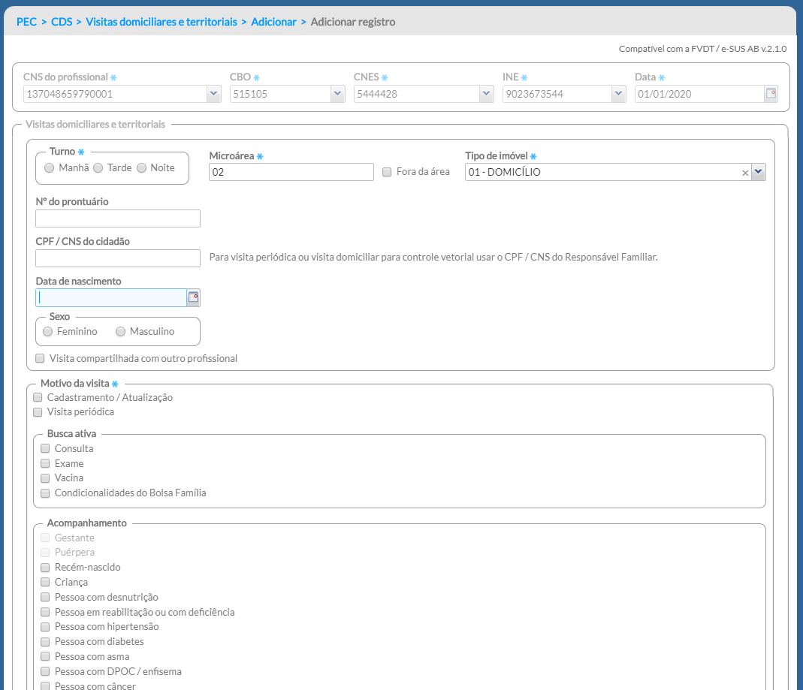

### 7.6.2.2 Detalhamento da visita domiciliar

- Passo 4. Marque, conforme preenchido na ficha, o motivo da visita. Perceba que é possível escolher múltiplas opções;

- Passo 5. Caso haja necessidade de acompanhamento do peso e altura dos indivíduos visitados, preencha os campos "Peso (kg)" e "Altura (cm)" do bloco "Antropometria".

- Passo 6. Na sequência, marque a opção de desfecho da visita;

- Passo 7. Para finalizar , clique no botão ;

- Caso haja alguma inconsistência ou ausência de preenchimento de campos obrigatórios, o sistema mostrará mensagem na tela indicando os que deverão ser corrigidos ou preenchidos. Caso contrário, os dados serão salvos e o sistema retornará à lista das fichas de visitas;

- Para cada visita, adicione novo registro, conforme orientado nos passos acima;

- Como na ficha de papel, nesta tela, poderão ser registradas **até 23 visitas domiciliares e territoriais** para cidadãos diferentes e realizados pelo mesmo profissional, na mesma data e turno. Para visualizar todos os registros, use a barra de rolagem (detalhe indicado pela seta vermelha);

- Passo 8. Ao digitar todas as visitas, clique no botão  para concluir a digitação da ficha.

# 7.7 Marcadores de Consumo Alimentar

Esse instrumento permite a identificação de marcadores positivos ou negativos da alimentação e, de maneira mais dinâmica, a composição de indicadores.

>  **DICA**: para auxiliar a utilização da ficha, que pode **ser feita por qualquer profissional da Atençãoásica**, e a orientação sobre práticas alimentares saudáveis, recomenda- se o uso do documento "Orientações para Avaliação de Marcadores de Consumo Alimentar na Atenção Básica", disponível em [[http://dab.saude.gov.br/portaldab/biblioteca.php?conteudo=publicacoes/marcadores_consumo_alimentar_atencao_basica]](http://dab.saude.gov.br/portaldab/biblioteca.php?conteudo=publicacoes/marcadores_consumo_alimentar_atencao_basica).

Após clicar no botão , siga os passos:

- Passo 1. Preencha os campos do cabeçalho com o número do CNS do profissional e a data da avaliação. O sistema automaticamente preencherá os campos CBO e CNES;

- Passo 2. Identifique o cidadão atendido. Os campos "Nome do cidadão", "Data de nascimento", "Sexo" e "Local de atendimento" são de preenchimento obrigatório registre também o CNS ou CPF do cidadão.

- Passo 3. Preencha os campos do bloco referente às questões específicas organizadas segundo o grupo etário habilitado pelo sistema, de acordo com a data de nascimento do cidadão.

- Todas as questões do bloco são de preenchimento obrigatório, respeitando- se os casos de opção de múltipla escolha.

**Crianças menores de seis meses:**

**Crianças de 6 a 23 meses:**

**Crianças com dois anos ou mais, adolescentes, adultos, gestantes e idosos:**

- Passo 4. Ao finalizar a digitação da ficha, clique no botão .

# 7.8 Ficha de Avaliação de Elegibilidade e Admissão

**Exclusiva para uso em Serviço de Atenção Domiciliar (SAD)**, pode ser utilizada pelos profissionais das equipes de Atenção Domiciliar (AD), cadastrados no CNES, por meio dos tipos: i) Equipe Multiprofissional de Atenção Domiciliar (EMAD); e ii) Equipe Multiprofissional de Apoio (EMAP). Esse instrumento permite identificar os cidadãos elegíveis para acompanhamento pelas equipes de AD.

## 7.8.1 Como registrar as informações de uma Ficha de Avaliação de Elegibilidade

Na tela principal, clique no ícone "Ficha de Avaliação de Elegibilidade". A janela da lista de fichas digitadas de avaliações de elegibilidade e admissão será mostrada, conforme a Figura 7.27.  

Figura 7.27 - Listagem da Fichas de Avaliação de Elegibilidade

Fonte: SAS/MS.

## 7.8.2 Adicionar Ficha de Avaliação de Elegibilidade e Admissão

Após clicar no botão "Adicionar", siga os passos:

- Passo 1. Preencha os dados de identificação do profissional que realizou a avaliação e alguns detalhes sobre o serviço de saúde;

- Passo 2. Clique no Turno em que foi realizado a avaliação e que está indicado na ficha;

- Passo 3. Preencha os dados de identificação do cidadão e a procedência;

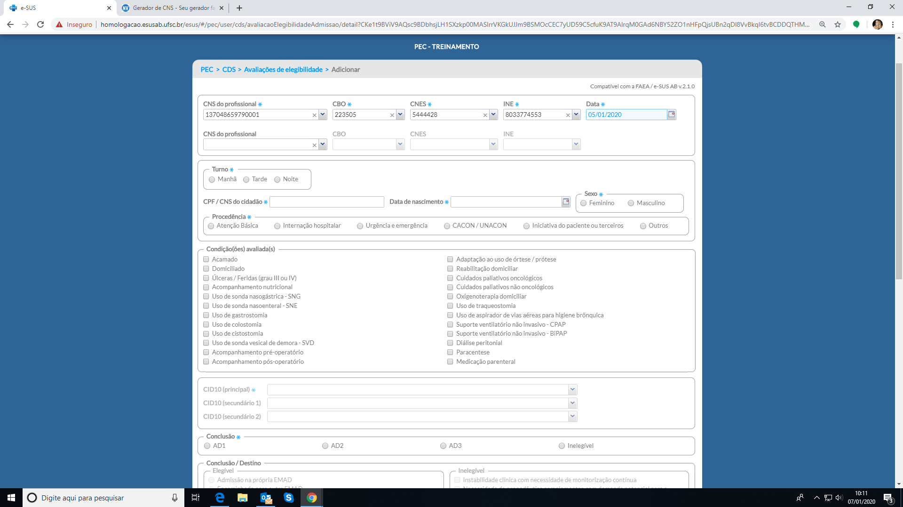

- Passo 4. Na sequência, preencha os dados da avaliação;

- Passo 5. Informar os dados da conclusão, atenção aos campos de preenchimento obrigatórios condicionados à conclusão:

a.inelegível;

b.elegível, com admissão na equipe;

c.No caso de elegível, mas sem admissão na equipe, marcar o tipo de encaminhamento;

Passo 5. Conclua o preenchimento, respeitando minimamente os campos obrigatórios, e clique em "Salvar" para concluir.

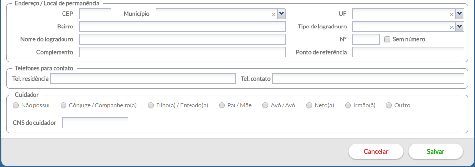

7.9 Ficha de Atendimento Domiciliar

Esta ficha é de uso **exclusivo do Serviço de Atenção Domiciliar (SAD)**, os profissionais de nível superior da equipe de AB deverão informar o atendimento domiciliar na ficha de atendimento individual no campo "Local de Atendimento" conforme descrito no capítulo 7.1.3. Por tanto, a Ficha de atendimento domiciliar pode ser utilizada pelos **profissionais das equipes de Atenção Domiciliar**, cadastrados no CNES, por meio dos tipos: i) Equipe Multiprofissional de Atenção Domiciliar (EMAD); e ii) Equipe Multiprofissional de Apoio (EMAP). Esse instrumento permite registrar os atendimentos realizados pelas equipes de AD.

Na tela principal do Módulo do CDS, clique no ícone "Ficha de Atendimento Domiciliar". Será apresentada a lista das Fichas de Atendimento Domiciliar digitadas, conforme a Figura 7.28.

Figura 7.28 - Lista de Fichas de Atendimento Domiciliar

Fonte: SAS/MS.

## 7.9.1 Adicionar Ficha de Atendimento Domiciliar

Para informar nova Ficha de Atendimento Domiciliar, clique no botão{width="0.9945745844269467in" height="0.2572178477690289in"}. O sistema exibirá uma tela, conforme Figura 7.29.

Figura 7.29 - Adicionar Ficha de Atendimento Domiciliar
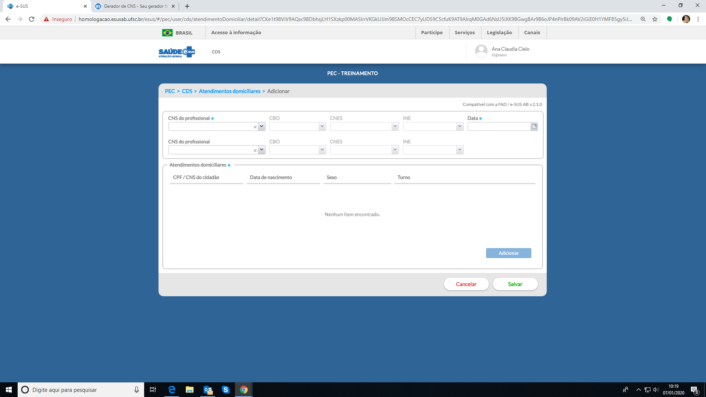
Fonte: SAS/MS.

Para preencher os dados da Ficha de Atendimento Domiciliar, siga os passos:

- Passo 1. Após clicar no botão \"Adicionar\", o sistema mostrará a tela de preenchimento da ficha;

### 7.9.1.1 Informações de cabeçalho

- Passo 2. Preencha o cabeçalho da ficha;

- Ao incluir CNS do profissional, o sistema mostrará opções para o CNES e INE que vêm da base de dados do CNES importado na instalação da aplicação;

- Caso o profissional tenha apenas um vínculo no município, os dados serão preenchidos automaticamente;

- Caso o profissional tenha mais de um vínculo, o sistema mostrará as opções e o digitador indicará o que está registrado na ficha;

- Passo 3. Para informar novo registro de atendimento (registro em **colunas** da ficha), clique no botão . O sistema exibirá uma tela com cabeçalho preenchido (somente leitura) e os dados a serem completados para cada atendimento;

### 7.9.1.2 Dados de identificação do cidadão

- Passo 4. Digite os dados conforme preenchido na ficha, iniciando pelo Turno do atendimento domiciliar, os dados de identificação do cidadão, local de atendimento e a Modalidade AD.

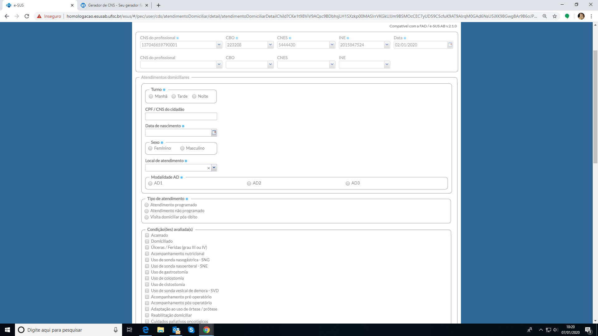

- Passo 5. Na sequência, clique no tipo de atendimento, conforme preenchido na ficha;

- Passo 6. Clique na Condição(ões) avaliada(s);

- Passo 7. Na sequência, clique nos procedimentos realizados no atendimento domiciliar;

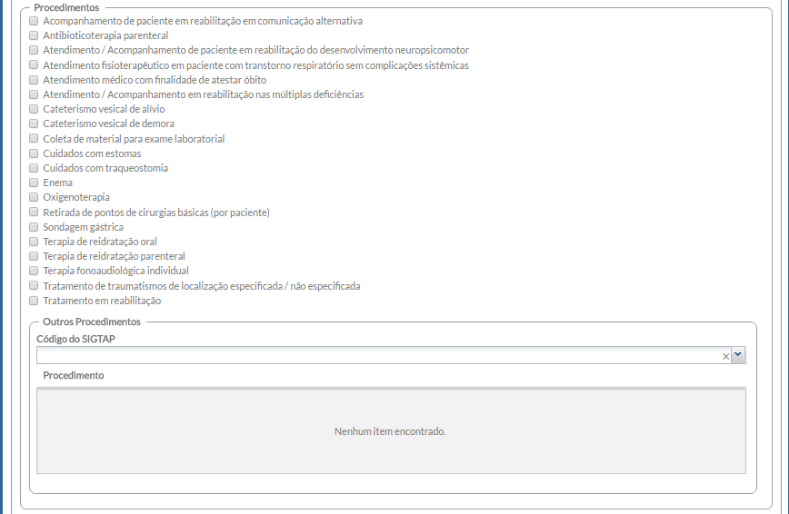

- Passo 8. Na sequência, insira a "conduta/desfecho" e/ou o encaminhamento, caso tenha sido informado na ficha do atendimento domiciliar;

- Passo 9. Após a digitação dos dados, clique no botão  e, caso haja alguma inconsistência, o sistema mostrará mensagem na tela indicando os campos que deverão ser corrigidos. Se não houver inconsistência, o sistema salvará os dados e voltará para a tela anterior.

### 7.9.1.3 Lista de registro dos atendimentos individuais

- Passo 10. Ao finalizar a digitação dos registros de atendimento da Ficha de Atendimento Domiciliar, clique no botão para concluir a digitação da ficha.

# 7.10 Ficha Complementar - Registro de Emergência em Saúde Pública Síndrome Neurológica por Zika/Microcefalia

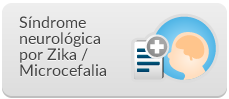

Na tela principal do Módulo do CDS, clique no ícone "Síndrome neurológica por Zika/Microcefalia". Será apresentada a lista das fichas digitadas, em que constará a data do atendimento, o número do Cartão SUS do cidadão, o número do cartão do SUS do responsável familiar e o turno do atendimento., conforme a Figura 7.30.

Figura 7.30 - Lista de Fichas complementares
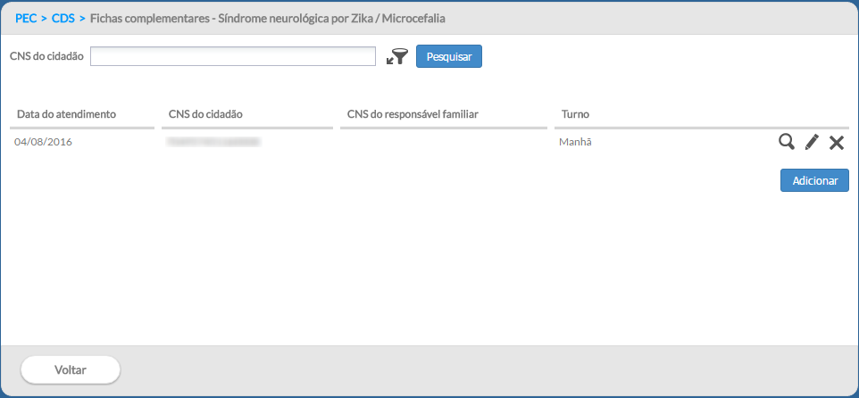
Fonte: SAS/MS.

## 7.10.1 Adicionar Ficha complementar

Para informar nova Ficha complementar, clique no botão . O sistema exibirá os dados da ficha.

### 7.10.1.1 Informações de cabeçalho

1.Preencha o cabeçalho da ficha;

2.Ao incluir o número do CNS do profissional, o sistema mostrará opções para o CBO, CNES e INE que vêm da base de dados do CNES importado na instalação da aplicação;

a.Caso o profissional tenha apenas um vínculo no município, os dados serão preenchidos automaticamente;

b.Caso o profissional tenha mais de um vínculo, o sistema mostrará as opções e o digitador indicará o que está registrado na ficha. Também são apresentados para preenchimento os campos para inclusão de outros profissionais da equipe para os casos em que houver a realização de consulta compartilhada;

3.Para informar novo registro de atendimento, após finalizado e salvado o preenchimento da ficha anterior, ao retornar para a tela apresentada pela Figura 7.30, clique no botão . O sistema exibirá uma tela com cabeçalho preenchido (somente leitura) e os dados a serem completados para cada atendimento;

4.Deve- se obedecer ao conteúdo da ficha, portanto poderão ser registrados até 13 atendimentos para usuários diferentes e realizados pelo mesmo profissional;

### 7.10.1.2 Dados de identificação do cidadão

7.Digite os dados de identificação do cidadão, conforme preenchido na ficha;

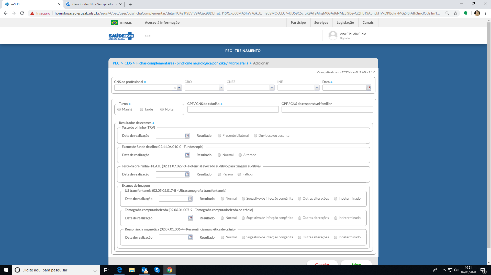

8.Na sequência, digite a data e o resultados dos exames correspondentes;

9.Após a digitação dos dados, clique no botão  e, caso haja alguma inconsistência, o sistema mostrará mensagem na tela indicando os campos que deverão ser corrigidos. Se não houver inconsistência, o sistema salvará os dados e voltará para a tela anterior.

# 7.11 Ficha de vacinação

Esta ficha é para o registro dos imunobiológicos, soros e imunoglobulinas administradas no âmbito da Atenção Básica e o seu registro é fundamental para a continuidade do cuidado e acompanhamento da imunização do cidadão conforme preconizado pelo Programa Nacional de Imunização do Ministério da Saúde.

Na tela principal do Módulo do CDS, clique no ícone "Ficha de vacina". Será apresentada a lista das fichas de vacinação digitadas com as informações CNS do cidadão, Data de nascimento, sexo e turno.

Figura 7.31 - Adicionar Vacinação Individualizada

Fonte: SAS/MS.

## 7.11.1 Adicionar Ficha de vacinação

Observando a Figura 7.31, para adicionar uma nova ficha de vacinação basta clicar no botão {width="1.1666666666666667in" height="0.28125in"} e aparecerá a seguinte tela:

Figura 7.31 - Adicionar Vacinação Individualizada

Fonte: SAS/MS.

Em seguida preencha o cabeçalho da Ficha de vacina no sistema.

### 7.11.1.1 Informações de cabeçalho

1.Informe o CNS do profissional e automaticamente o sistema apresentará opções para o CBO, CNES e INE oriundas da base de dados do CNES e que foram importado na instalação da aplicação. Lembre também de informar a data em que foi(ram) administrado(s) o(s) imunobiológico(s) no cidadão.

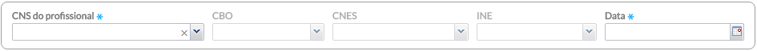

a.Caso o profissional tenha apenas um vínculo no município, os dados do cabeçalho serão preenchidos automaticamente, com exceção da data;

b.Caso o profissional tenha mais de um vínculo, o sistema mostrará as opções e o digitador escolherá o que está registrado na ficha de vacina.

c.Caso queira informar novo registro de vacinação realizado no mesmo dia e para o mesmo profissional, clique no botão {width="0.8576388888888888in" height="0.2218033683289589in"}. O sistema exibirá uma tela com cabeçalho preenchido (somente leitura) e os dados a serem completados para se efetivar o registro de vacinação.

### 7.11.1.2 Vacinações individualizadas

2.Após clicar no botão  digite os dados conforme preenchido na ficha, iniciando pelo Turno da administração do imunobiológico, os dados de identificação do cidadão, o local de atendimento e o grupo, se for o caso:

a.Se o cidadão está na situação de "viajante"

b.A Situação de "Gestante" e "Puérpera" somente estará habilitado  quando for selecionado o sexo "Feminino".

c.O campo "Comunicante de hanseníase" somente estará habilitado  após a confirmação do registro da BCG.

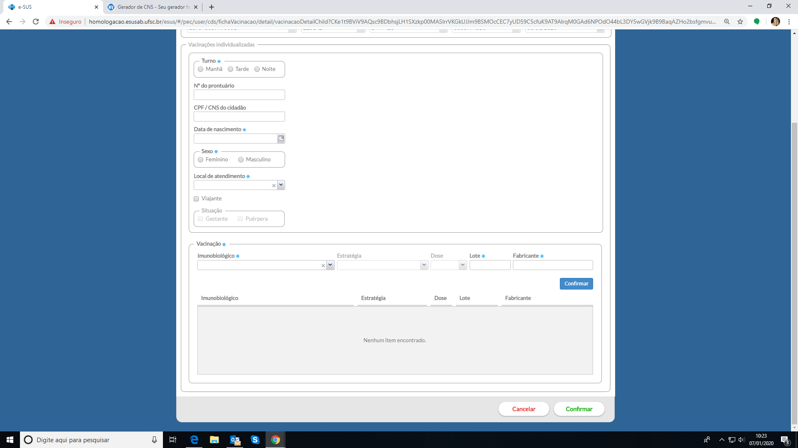

>  **ATENÇÃO:** Para habilitar o campo e registrar um comunicante de hanseníase, o digitador terá que preencher, no bloco "Vacinação", o campo imunobiológico com a vacina **BCG** e os demais campos obrigatórios. Em seguida deverá clicar no botão "confirmar".

### 7.11.1.3 Vacinação

No bloco "Vacinação" digite o Imunobiológico, a Estratégia, a Dose, o Lote e o Fabricante, conforme preenchido na ficha de vacinação. Em seguida clique no botão  para adicionar o registro do imunobiológico. Para cada imunobiológico repita essa mesma operação.

Figura 7.32 - Adicionar Vacinação

Fonte: SAS/MS.

Ao terminar de registrar todos imunobiológicos preenchidos na ficha de vacinação clique no botão  e caso haja alguma inconsistência, o sistema mostrará mensagem na tela indicando os campos que deverão ser corrigidos. Por outro lado, caso não haja nenhuma inconsistência, o sistema salvará os dados, voltará para a tela de adicionar os registros de vacinação e apresentará a mensagem "registro confirmado com sucesso".

Figura 7.33 - Registro de Vacinação

Fonte: SAS/MS.

### 7.11.1.4. Lista de registro das vacinações individualizadas

O sistema traz, para cada ficha, a lista das vacinações individualizadas. Nesta Lista é possível visualizar , editar  ou excluir  o registro dos imunobiológicos. A funcionalidade editar e excluir somente estarão disponíveis enquanto a lista não for salva.

Figura 7.34 - Adicionar Registro Individualizada

Fonte: SAS/MS.

Ao finalizar todo o processo de digitação das Fichas de vacina, clique no botão .

CAPÍTULO 8 - Relatórios
=======================

O acompanhamento das ações de saúde que são realizadas no território é uma tarefa extremamente importante do cotidiano das equipes de Atenção Primária à Saúde. Esta atividade, além de auxiliar os trabalhadores a enxergar seu território, exprime o resultado do seu esforço, podendo ser potente ferramenta de reflexão e transformação do seu processo de trabalho.

O módulo "Relatórios" permite que trabalhadores e gestores possam visualizar, de forma sintetizada e sistematizada, as ações de saúde realizadas no território. São vários tipos de relatórios, divididos em consolidados, produção e operacionais, e são utilizados por diferentes tipos de atores.

Nesta versão os relatórios são exibidos na barra lateral de navegação, oferecendo um caminho mais simples e rápido para cada relatório (Figura 8.1). Clicando na opção "Relatórios" o sistema apresenta a lista com todos os disponíveis, dependendo do tipo de acesso que o profissional ou gestor tenha. Caso haja dúvida em relação ao relatório, é possível acionar um balão de ajuda representado pelo símbolo  no canto superior direito de cada tela dos relatórios.

Figura 8.1 - Tela do Relatórios exibida com o perfil de profissional da equipe de AB

Fonte: SAPS/MS.

# 8.1 Administração dos relatórios

As opções de administração e configuração estão disponíveis APENAS para os perfis de administração da instalação. Para evitar o processamento desnecessário dos relatórios apenas o administrador da instalação, devidamente instruído, poderá utilizá- la.

## 8.1.1 Processamento

O processamento dos relatórios é um processo diário e incremental iniciado a meia- noite (0h) do próximo dia, a partir dos itens registrados ou enviados por meio do sistema. Este processo é ativado sempre que o usuário clica em Gerar/Transmitir os dados para envio ao SISAB, ver Seção 3.6.3.2.

Nesta funcionalidade, conforme podemos ver na Figura 8.2, é possível Marcar para reprocessamento  ou forçar o processamento  dos dados dos relatórios do sistema. A primeira funcionalidade permite que os dados dos relatórios, mesmo os dados que já foram processados, sejam reprocessados junto ao fluxo automático do sistema. A segunda funcionalidade força o processamento a ser executado de imediato.

>  **ATENÇÃO**: a funcionalidade de "Forçar o processamento" pode ser um tanto dispendioso para a performance do PEC, a depender do tamanho da base de dados, podendo gerar lentidão para os outros usuários. Portanto, sempre que possível utilize a opção "Marcar para reprocessamento".

Figura 8.2 - Tela Processamento de Relatórios exibida somente com o perfil de administrador

Fonte: SAPS/MS.

## 8.1.2 Configuração da Impressão

Para evitar que consultas muito grandes criem uma carga exagerada no servidor da aplicação, por meio desta funcionalidade é possível configurar o fator que determinará quantos grupos de informações podem ser selecionados ao mesmo tempo, e ainda o período máximo, em meses, que poderá ser definido como intervalo para filtrar em cada relatório.  

Figura 8.3 - Tela de Configuração de Impressão exibida somente com o perfil de administrador

Fonte: SAPS/MS.

>  **DICA**: o fator de carga no sistema, em relação à geração de um relatório, está relacionado com a capacidade de processamento do computador que está sendo utilizado, bem como com a quantidade de registros dentro do sistema/instalação. Caso a geração de relatórios prejudique o desempenho do sistema, opte por uma configuração com fatores menores.

Após finalizar a configuração clique em Salvar  para ativar a nova configuração.

# 8.2 Nível de Agregação das Informações

O Sistema e-SUS APS, como sistema de gerenciamento de dados e informações da Atenção Básica, traz grande avanço no que diz respeito à segurança, sigilo e confidencialidade dos dados de saúde dos cidadãos. Isso quer dizer que apenas os profissionais que participam do atendimento ao cidadão têm acesso aos seus dados de saúde.

Atualmente, os relatórios do e-SUS APS disponibilizam informações agregadas, por meio dos relatórios consolidados e de produção, além dos relatórios operacionais, com informações individualizadas (Figura 8.1). A seguir uma breve explicação sobre os agrupamentos dos relatórios no sistema:

- **Relatórios consolidados**: são os relatórios que permitem uma visualização da situação cadastral consolidada, de acordo com a data selecionada, permitindo ao usuário ver a informação mais atual até aquele momento. Ver seção 8.3 para mais detalhes sobre os relatórios.

- **Relatórios de produção**: são os relatórios que permitem uma visualização agregada das informações, tais como: o atendimento individual, odontológico, domiciliar (SAD), atividade coletiva, procedimentos, entre outros, bem como relatórios de resumo de produção. Ver seção 8.4 para mais detalhes sobre os relatórios.

- **Relatórios operacionais:** são os relatórios que apresentam as informações individualizadas e identificadas da situação de saúde dos cidadãos do território. Estes relatórios são acessados apenas pelos trabalhadores das Unidades Básicas de Saúde, pois trazem dados relacionados ao cuidado individual do cidadão. Esta medida serve para proteger a individualidade e o direito à privacidade dos usuários do SUS, da mesma forma que é preservado o sigilo durante a relação trabalhador da saúde e usuário do serviço. Ver seção 8.5 para mais informações os relatórios disponíveis.

## 8.2.1 Perfis de acesso e Filtros disponíveis

Para a geração dos relatórios estão disponíveis diversos tipos de filtros de acordo com o tipo de perfil utilizado pelo usuário, obedecendo o seu papel na estrutura da saúde no município. Os relatórios consolidados e de produção possuem estrutura de filtros iguais como descrito a seguir.

O gestor municipal, seja ele o próprio secretário, coordenador da Atenção Básica ou outros profissionais que fazem parte da equipe de gestão, terá opções de visualização no âmbito de todo o município. Desta forma, é possível utilizar filtros para a totalização dos dados nos relatórios em relação ao "Período", "Unidade saúde", "Equipe", "Profissional" e "Categoria Profissional", como mostra a Figura 8.4.

Figura 8.4 - Tipos de filtro de gestor municipal

Fonte: SAPS/MS.

>  **NOTA**: as opções "Profissional" e "Categoria profissional" [não podem] ser utilizadas em conjunto. É possível filtrar as informações do relatório por profissional **[ou]** por uma categoria profissional.

O perfil de coordenador da UBS terá acesso apenas a dados do serviço de saúde sob sua gestão. É possível utilizar filtros para a totalização dos dados nos relatórios de acordo com as vinculações de unidade de saúde e equipe de saúde registradas no CNES. Estão disponíveis os filtros "Período", "Equipe", "Profissional" e "Categoria Profissional", como mostra a Figura 8.5.

Figura 8.5 - Tipos de filtro de coordenador de UBS

Fonte: SAPS/MS.

Já os trabalhadores de saúde têm acesso aos relatórios, porém apenas aos dados produzidos por sua equipe. É possível utilizar, para a totalização dos dados nos relatórios, os filtros "Período", "Minha equipe" ou apenas "Minhas produções", como mostra a Figura 8.6.

Figura 8.6 - Tipos de filtro de trabalhador de saúde

Fonte: SAPS/MS.

Outra novidade para os filtros disponíveis é possibilidade de extrair relatórios analíticos  e da série histórica  nos relatórios de produção. Já nos relatórios consolidados, além da série histórica é possível extrair o mensal  no relatório de situação do território, que será abordado mais adiante. A estrutura dos filtros segue o mesmo padrão dos descritos anteriormente, com a diferença que nos relatórios da série histórica, o período pode ser escolhido entre os últimos 3 meses, últimos 6 meses, últimos 12 meses ou simplesmente selecionar o período que deseja extrair os relatórios.

## 8.2.2 Grupo de Informações Disponíveis para Impressão

Os relatórios consolidados e de produção, tem um modelo padronizado para ativar ou desativar os grupos de informações a serem disponibilizados no impresso do relatório. Conforme vemos na Figura 8.7, usando como exemplo o relatório de Atividades Coletivas, podemos fazê- lo por meio da seleção do checkbox correspondente ao grupo de informações do relatório.

Figura 8.7 - Tipo de seleção dos grupos de informação

Fonte: SAPS/MS.

Para configurar o impresso do relatório realize os passos a seguir:

1.Abra a opção de seleção dos grupos de informação clicando no botão de dropdown .

2.Marque ou desmarque o checkbox, conforme a necessidade. Caso o checkbox esteja marcado , o grupo será mostrado no impresso, caso contrário , o grupo não será mostrado.

Todos os grupos de informações vem ativados por padrão nos relatórios. Utilize as opções Selecionar Todos  e Limpar , para marcar todos os grupos de informação ou desmarcar todos os grupos, respectivamente.

## 8.2.3 Filtros personalizados

As opções de filtros personalizados possibilitam ao usuário filtrar as informações do relatório. Para usar filtros personalizados realize os passos a seguir:

Passo 1. Em "Filtros personalizados" selecione na opção "Campo filtro" a informação que deseja obter e clique em adicionar .

Passo 2. Ao selecionar um dos itens do "Campo filtro", serão apresentadas outras opções de filtro.

Passo 3. Selecione o(s) iten(s) desejado(s), clicando marcando cada checkbox do item que irá filtrar o relatório. No caso em destaque, selecione para "Destino do lixo" o item "Céu aberto" , por exemplo, para filtrar os cadastros onde os domicílios tem lixo a céu aberto.

Passo 4. Para filtrar outros itens para compor um mesmo relatório, basta seguir os passos anteriores.

- Caso queira remover um filtro, basta excluir o item do campo "filtro personalizado", usando o botão "Excluir" .

# 8.3 Relatórios Consolidados

Figura 8.8 - Tela do Relatórios consolidados exibida com o perfil de profissional da equipe de AB

Fonte: SAPS/MS.

Os relatórios consolidados trazem o estado atual do registro para um determinado conjunto de informações. Estes seguem o modelo padrão de estruturação dos relatórios, porém o usuário ao invés de selecionar um período, selecionará a data limite para consolidação dos dados.

Figura 8.9 - Tela do Relatório Consolidado de Cadastro Individual

Fonte: SAPS/MS.

## 8.3.1 Relatório consolidado de Cadastro domiciliar e territorial

Este relatório reflete o consolidado do estado atual do cadastro domiciliar e territorial, contém as informações registradas por meio das fichas de Cadastro domiciliar e territorial, bem como do Aplicativo do e-SUS APS Território, quando este estiver sendo utilizado.

Figura 8.10 - Tela do Relatório de cadastro domiciliar e territorial exibida com o perfil de profissional de saúde

Fonte: SAPS/MS.

Para gerar o relatório de cadastro domiciliar e territorial primeiro o usuário do sistema deve escolher a data limite para a consolidação dos dados no campo "Data" .

Os relatórios poderão ser gerados a partir dos "grupos de informações disponíveis para impressão" ou pela opção "filtros personalizados". as variáveis do grupo de informação são:

- Tipo de imóvel

- Condições de moradia

- Situação de moradia / Posse da terra

- Localização

- Tipo de domicílio

- Condição de posse e uso da terra

- Tipo de acesso ao domicílio

- Material predominante na construção das paredes externas

- Disponibilidade de energia elétrica

- Abastecimento de água

- Água para consumo no domicílio

- Forma de escoamento do banheiro ou sanitário

- Destino do lixo

- Animais no domicílio

- Famílias - Renda familiar

No filtro personalizado são apresentados as variáveis consolidadas que informam os dados sobre o abastecimento de água, água para consumo no domicílio, animais no domicílio, condição de posse e uso da terra, destino do lixo, disponibilidade de energia elétrica, forma de escoamento do banheiro ou sanitário, localização, material predominante na construção das paredes externas, microárea, qual animal no domicílio, recusa de cadastro, renda familiar (salário mínimo), situação de moradia, tipo de acesso ao domicílio, tipo de domicílio e tipo de imóvel.

Após selecionar as variáveis desejadas para gerar o relatório basta clicar no botão "Exportar CSV" ou "Imprimir".

As variáveis apresentadas possibilitam a realização de uma análise inicial da situação de saúde do território de atuação das equipes de Atenção Básica, com a finalidade de construção de estratégia de enfrentamento das condicionalidades e dos determinantes sociais que afetam a qualidade da saúde da população assistida.

>  NOTA: Para mais informações sobre as variáveis e as opções de filtro, consulte o Manual de Preenchimento das Fichas do CDS sobre a Ficha de Cadastro Domiciliar e Territorial.

## 8.3.2 Relatório consolidado de Cadastro Individual

Este relatório reflete o consolidado do estado atual do cadastro individual, contém as informações registradas por meio da ficha de Cadastro Individual, bem como do Aplicativo do e-SUS APS Território, quando este estiver sendo utilizado.

Figura 8.11 - Tela do Relatório de cadastro individual exibida com o perfil de profissional da equipe de AB

Fonte: SAPS/MS.

Para gerar o relatório de cadastro individual primeiro o usuário do sistema deve escolher a data limite para a consolidação dos dados no campo "Data" .

Os relatórios poderão ser gerados a partir dos "grupos de informações disponíveis para impressão" ou pela opção "filtros personalizados". As variáveis do grupo de informação são :

- Dados gerais

- Identificação do usuário / cidadão

- Faixa etária

- Sexo

- Raça / Cor

- Etnia

- Nacionalidade

- Informações sociodemográficas

- Relação de parentesco com o responsável familiar

- Ocupação

- Qual é o curso mais elevado que frequenta ou frequentou

- Situação no mercado de trabalho

- Crianças de 0 a 9 anos, com quem fica

- Orientação sexual

- Identidade de gênero

- Deficiência

- Outras informações sociodemográficas

- Tipo de saída do cidadão do cadastro

- Condições / Situações de saúde gerais

- Sobre seu peso, você se considera

- Doença respiratória

- Doença cardíaca

- Problemas nos rins

- Cidadão em situação de rua

- Tempo em situação de rua

- Quantas vezes se alimenta ao dia

- Qual a origem da alimentação

- Tem acesso à higiene pessoal

No filtro personalizado são apresentados outras variáveis consolidadas que informam os dados sobre o cidadão que estão presentes na ficha de cadastro individual.

Após selecionar as variáveis desejadas para gerar o relatório basta clicar no botão "Exportar CSV" ou "Imprimir".

As variáveis apresentadas podem complementar a análise da situação de saúde do território de atuação das equipes de Atenção Básica, com a finalidade de construção de estratégia de enfrentamento das condicionalidades e dos determinantes de saúde que afetam a qualidade de vida da população assistida. A variável "Dados Gerais" apresentará a quantidade de "cidadãos ativos" e "saída de cidadão do cadastro". O primeiro refere- se ao cidadãos que permanecem vinculados ao território e o segundo aos cidadãos que foram cadastrados, mas que não estão mais vinculados ao território.

>  NOTA: Para mais informações sobre as variáveis e as opções de filtro, consulte o Manual de Preenchimento das Fichas do CDS sobre a Ficha de Cadastro Individual.

## 8.3.3 Relatório da Situação do Território

O relatório consolidado da situação do território apresenta informações gerais sobre a área de atuação das equipes de saúde, reunindo dados sobre o cadastro do cidadão, condições gerais do domicílio, situação sociodemográfica e pessoas em situação de rua, sendo um conjunto de informação necessária para o planejamento das ações de saúde do território.

Neste relatório é possível avaliar a situação do território para uma competência específica ou avaliar a evolução dos dados do território para um período escolhido. Para isso, escolha entre os tipos de relatório  ou de , conforme as figuras a seguir, respectivamente:

# 8.4 Relatórios de Produção

Os relatórios de produção trazem os dados (eventos) agregados em um determinado período, orientados pelo bloco de informação dentro do sistema. Os blocos de informações são organizados de forma similar ao formato de envio dos registros ao SISAB. Atualmente os blocos disponíveis são:

- Atendimento domiciliar

- Atendimento individual

- Atendimento odontológico individual

- Atividade coletiva

- Avaliação de elegibilidade e admissão

- Marcadores de consumo alimentar

- Procedimentos

- Procedimentos consolidados

- Resumo de produção

- Síndrome neurológica por Zika / Microcefalia

- Visita domiciliar e territorial

- Vacinação

Figura 8.12 - Tela de Relatório de produção exibida com o perfil de profissional da equipe de AB

Fonte: SAPS/MS.

Os relatórios de produção apresentam novidades para os filtros disponíveis, sendo possível extrair relatórios analíticos  e da série histórica .

Nas seções seguintes são detalhados cada bloco de informação.

## 8.4.1 Atendimento domiciliar

Este relatório contabiliza os dados referentes aos atendimentos domiciliares dentro do período determinado, tendo como fonte de informação as Fichas de Atendimento Domiciliar ou do Aplicativo e-SUS AD, que são de uso exclusivo do Serviço de Atenção Domiciliar (SAD).

Figura 8.13 - Tela do Relatório de atendimento domiciliar exibida com o perfil de profissional da equipe de AB

Fonte: SAPS/MS.

Para gerar o relatório de atendimento domiciliar primeiro o usuário do sistema deve escolher o período que gostaria de consultar.

Os relatórios poderão ser gerados a partir dos "grupos de informações disponíveis para impressão" ou pela opção "filtros personalizados". As variáveis do grupo de informação são :

- Resumo de produção

- Turno

- Sexo

- Faixa etária

- Local de atendimento

- Modalidade AD

- Tipo de atendimento

- Condições avaliadas

- Condições avaliadas (CID10)

- Condições avaliadas (CIAP2)

- Conduta / Desfecho

- Procedimentos

- Outros procedimentos (SIGTAP)

No filtro personalizado são apresentados outras variáveis consolidadas que informam os dados sobre o atendimento domiciliar e que estão presentes na ficha de atendimento domiciliar.

Após selecionar as variáveis desejadas para gerar o relatório basta clicar no botão "Exportar CSV" ou "Imprimir".

> {width="0.3906255468066492in" height="0.33203083989501314in"} NOTA: Para mais informações sobre as variáveis e as opções de filtro, consulte o Manual de Preenchimento das Fichas do **CDS** sobre a **Ficha de Atendimento Domiciliar**.

## 8.4.2 Atendimento individual

Este relatório contabiliza os dados referentes aos atendimentos individuais dentro do período determinado, tendo como fonte de informação às Ficha de atendimento individual e os Atendimentos realizados no PEC.

Figura 8.14 - Tela do Relatório de cadastro individual exibida com o perfil de profissional da equipe de AB

Fonte: SAPS/MS.

Para gerar o relatório de atendimento individual primeiro o usuário do sistema deve escolher o período que gostaria de consultar.

Os relatórios poderão ser gerados a partir dos "grupos de informações disponíveis para impressão" ou pela opção "filtros personalizados". As variáveis do grupo de informação são:

- Resumo de produção

- Dados gerais

- Turno

- Sexo

- Faixa etária

- Local de atendimento

- Tipo de atendimento

- Atenção domiciliar

- Racionalidade em saúde

- Criança - Aleitamento materno

- NASF / Polo

- Conduta / Desfecho

- Encaminhamento

- Problemas / Condições avaliadas

- Problemas / Condições avaliadas - Doenças transmissíveis

- Problemas / Condições avaliadas - Rastreamento

- Problemas / Condições avaliadas - Outros CIAP2

- Problemas / Condições avaliadas - Outros CID10

- Exames solicitados e avaliados

- Exames - Triagem neonatal

- Outros exames solicitados e avaliados (código do SIGTAP)

No filtro personalizado são apresentados outras variáveis consolidadas que informam os dados sobre o atendimento e que estão presentes na ficha de atendimento individual.

Após selecionar as variáveis desejadas para gerar o relatório basta clicar no botão "Exportar CSV" ou "Imprimir".

>  NOTA: Para mais informações sobre as variáveis e as opções de filtro, consulte o Manual de Preenchimento das Fichas do **CDS** sobre a **Ficha de Atendimento Individual**.

## 8.4.3 Atendimento odontológico individual

Este relatório contabiliza os dados referentes aos atendimentos odontológicos individuais dentro do período determinado, tendo como fonte de informação as Fichas de atendimento odontológico individual e os Atendimentos odontológicos realizados no PEC.

Figura 8.15 - Tela do Relatório de cadastro individual exibida com o perfil de profissional da equipe de AB

Fonte: SAPS/MS.

Para gerar o relatório de atendimento odontológico primeiro o usuário do sistema deve escolher o período que gostaria de consultar.

Os relatórios poderão ser gerados a partir dos "grupos de informações disponíveis para impressão" ou pela opção "filtros personalizados". As variáveis do grupo de informação são:

- Resumo de produção

- Dados gerais

- Turno

- Sexo

- Faixa etária

- Local de atendimento

- Tipo de atendimento

- Tipo de consulta

- Vigilância em saúde bucal

- Procedimentos

- Outros procedimentos (SIGTAP)

- Fornecimento

- Conduta / Desfecho

- Encaminhamento

- Problema/ Condições avaliadas

- Condições avaliadas (CID10)

- Condições avaliadas (CIAP2)

No filtro personalizado são apresentados outras variáveis consolidadas que informam os dados sobre o atendimento e que estão presentes na ficha de atendimento odontológico.

Após selecionar as variáveis desejadas para gerar o relatório basta clicar no botão "Exportar CSV" ou "Imprimir".

>  NOTA: Para mais informações sobre as variáveis e as opções de filtro, consulte o Manual de Preenchimento das Fichas do **CDS** sobre a **Ficha de Atendimento Individual Odontológico**.

## 8.4.4 Atividade coletiva

Este relatório contabiliza os dados referentes às atividades coletivas dentro do período determinado, tendo como fonte de informação os registros das Fichas de atividade coletiva.

Figura 8.16 - Tela do Relatório de atividade coletiva exibida com o perfil de profissional da equipe de AB

Fonte: SAPS/MS.

Para gerar o relatório de atividades coletivas primeiro o usuário do sistema deve escolher o período que gostaria de consultar.

Os relatórios poderão ser gerados a partir dos "grupos de informações disponíveis para impressão" ou pela opção "filtros personalizados". As variáveis do grupo de informação são:

- Resumo de produção

- Número de participantes

- Turno

- Programa Saúde na Escola

- Atividade

- Público alvo

- Temas para saúde

- Práticas em saúde

- Outros procedimentos coletivos

- Temas para reunião

O número de participantes nas atividades coletivas está disponível neste relatório. Os Participantes identificados, correspondem aos participantes que tiveram seu número de CNS registrado, já o Total de participantes corresponde ao número de participante informados. Ainda é possível utilizar os filtros personalizados para refinar o relatório.

No filtro personalizado são apresentados outras variáveis consolidadas que informam os dados sobre a atividade e que estão presentes na ficha de atividade coletiva.

Após selecionar as variáveis desejadas para gerar o relatório basta clicar no botão "Exportar CSV" ou "Imprimir".

>  NOTA: Para mais informações sobre as variáveis e as opções de filtro, consulte o Manual de Preenchimento das Fichas do **CDS** sobre a **Ficha de Atividade Coletiva**.

## 8.4.5 Avaliação de elegibilidade e admissão

Este relatório contabiliza os dados referentes às avaliações de elegibilidade e admissão dentro do período determinado, tendo como fonte de informação as Fichas de avaliação de elegibilidade e admissão, bem como os registros de avaliação de elegibilidade do Aplicativo e-SUS AD. Estes instrumentos são de uso exclusivo do SAD.

Figura 8.17 - Tela do Relatório de atividade coletiva exibida com o perfil de profissional da equipe de AB

Fonte: SAPS/MS.

Para gerar o relatório de avaliação de elegibilidade e admissão primeiro o usuário do sistema deve escolher o período que gostaria de consultar.

Os relatórios poderão ser gerados a partir dos "grupos de informações disponíveis para impressão" ou pela opção "filtros personalizados". As variáveis do grupo de informação são:

- Resumo de produção

- Turno

- Dados gerais

- Etnia

- Sexo

- Raça / Cor

- Nacionalidade

- Faixa etária

- Procedência

- Condições avaliadas

- CID- 10

- Conclusão / Destino

- Destino elegibilidade

- Motivo inelegibilidade

- Cuidador

No filtro personalizado são apresentados outras variáveis consolidadas que informam os dados sobre esta avaliação e que estão contidas na ficha de avaliação de exigibilidade e admissão.

Após selecionar as variáveis desejadas para gerar o relatório basta clicar no botão "Exportar CSV" ou "Imprimir".

>  NOTA: Para mais informações sobre as variáveis e as opções de filtro, consulte o Manual de Preenchimento das Fichas do **CDS** sobre a **Ficha de Avaliação de Elegibilidade e Admissão** do SAD.

## 8.4.6 Marcadores de consumo alimentar

Este relatório contabiliza os dados referentes aos marcadores de consumo alimentar dentro do período determinado, tendo como fonte as fichas de Marcadores de consumo alimentar.

Figura 8.18 - Tela do Relatório de marcadores de consumo alimentar exibida com o perfil de profissional da equipe de AB

Fonte: SAPS/MS.

Para gerar o relatório de marcadores de consumo alimentar primeiro o usuário do sistema deve escolher o período que gostaria de consultar.

Os relatórios poderão ser gerados a partir dos "grupos de informações disponíveis para impressão" ou pela opção "filtros personalizados". As variáveis do grupo de informação são:

- Resumo de produção

- Faixa etária

- Sexo

- Local de atendimento

- Crianças menores de 6 meses

- Crianças de 6 a 23 meses

No filtro personalizado são apresentados outras variáveis consolidadas que informam os dados sobre estes marcadores e que estão contidas na ficha de marcadores de consumo alimentar.

Após selecionar as variáveis desejadas para gerar o relatório basta clicar no botão "Exportar CSV" ou "Imprimir".

>  NOTA: Para mais informações sobre as variáveis e as opções de filtro, consulte o Manual de Preenchimento das Fichas do **CDS** sobre a ficha **Marcadores de Consumo Alimentar**.

## 8.4.7 Procedimentos

Este relatório contabiliza os dados referentes aos procedimentos dentro do período determinado, tendo como fonte as Fichas de procedimentos ou os registros de procedimentos no PEC.

Figura 8.19 - Tela de Relatório de procedimentos exibida com o perfil de profissional da equipe de AB

Fonte: SAPS/MS.

Para gerar o relatório procedimentos primeiro o usuário do sistema deve escolher o período que gostaria de consultar.

Os relatórios poderão ser gerados a partir dos "grupos de informações disponíveis para impressão" ou pela opção "filtros personalizados". As variáveis do grupo de informação são:

Os grupos de informações disponíveis para impressão e as opções de campos para filtros personalizados são:

- Resumo de produção

- Turno

- Faixa etária

- Sexo

- Local de atendimento

- Dados gerais

- Procedimentos / Pequenas cirurgias

- Teste rápido

- Administração de medicamentos

- Outros procedimentos (SIGTAP)

No filtro personalizado são apresentados outras variáveis consolidadas que informam os dados sobre os procedimentos e que estão contidas na ficha de procedimentos.

Após selecionar as variáveis desejadas para gerar o relatório basta clicar no botão "Exportar CSV" ou "Imprimir".

>  NOTA: Para mais informações sobre as variáveis e as opções de filtro, consulte o Manual de Preenchimento das Fichas do **CDS** sobre a **Ficha de Procedimentos**.

## 8.4.8 Procedimentos consolidados

Este relatório contabiliza os dados referentes aos procedimentos consolidados dentro do período determinado, tendo como fonte as Fichas de procedimentos e os registros de procedimentos no PEC.

Figura 8.20 - Tela de Relatório de procedimentos consolidados exibida com o perfil de profissional da equipe de AB

Fonte: SAPS/MS.

Para gerar o relatório procedimentos consolidados primeiro o usuário do sistema deve escolher o período que gostaria de consultar.

Os relatórios poderão ser gerados a partir dos "grupos de informações disponíveis para impressão" ou pela opção "filtros personalizados".

O filtro personalizado apresenta todas as variáveis que aparecem no relatório de procedimentos consolidados e que podem ser gerados de forma isoladas, tais como os totais de aferição de PA, temperatura, coleta de material para exame laboratorial, curativo simples, glicemia capilar, medição de altura e medição de peso.

Após selecionar as variáveis desejadas para gerar o relatório basta clicar no botão "Exportar CSV" ou "Imprimir".

>  NOTA: Para mais informações sobre as variáveis e as opções de filtro, consulte o Manual de Preenchimento das Fichas do **CDS** sobre a **Ficha de Procedimento**, especialmente sobre o bloco de procedimentos consolidados.

## 8.4.9 Resumo de produção

Este relatório contabiliza a produção de todos os registros realizados por tipo de ficha.

Figura 8.21 - Tela de Resumo de produção exibida com perfil de profissional da equipe de AB

Fonte: SAPS/MS.

Para gerar o relatório de resumo de produção primeiro o usuário do sistema deve escolher o período que gostaria de consultar.

Após a escolha do período basta clicar em "Exportar CSV" ou "Imprimir" para gerar o relatório de resumo de produção.

Figura 8.22 - Exemplo do Relatório de Resumo de Produção

Fonte: SAPS/MS.

Os registros nas fichas onde é informado o CNS do cidadão são apresentados como \"Identificados\", já os registros sem CNS são os \"Não identificados\". Ou seja, por meio desse relatório pode- se monitorar o percentual de ações que ficam vinculadas ao prontuário do cidadão e aquelas que terão apenas finalidade estatística. Idealmente se espera que o máximo de registro sejam identificados.

Ainda é possível identificar a quantidade de novos cadastros, atualização dos cadastrados e recusa de cadastro.

## 8.4.10 Síndrome neurológica por Zika / Microcefalia

Este relatório contabiliza os dados referentes aos atendimentos de síndrome neurológica por Zika / Microcefalia dentro de um período determinado , tendo como fonte de informação os registros da Ficha complementar de Síndrome neurológica por Zika / Microcefalia, bem como os atendimentos no PEC.

Figura 8.23 - Tela do Relatório da ficha complementar - Síndrome neurológica por Zika/Microcefalia exibida com perfil de profissional da equipe de AB.

Fonte: SAPS/MS.

Para gerar o relatório da ficha complementar primeiro o usuário do sistema deve escolher o período que gostaria de consultar.

Os relatórios poderão ser gerados a partir dos "grupos de informações disponíveis para impressão" ou pela opção "filtros personalizados". As variáveis do grupo de informação são:

- Resumo de produção

- Turno

- Resultado de Teste do olhinho (Reflexo vermelho)

- Resultado de Exame de fundo de olho (02.11.06.010- 0 - Fundoscopia)

- Resultado de Teste da orelhinha - PEATE (02.11.07.027- 0 - Potencial evocado auditivo para a triagem auditiva)

- Resultado de US transfontanela (02.05.02.017- 8 - Ultrassonografia transfontanela)

- Resultado de Tomografia computadorizada (02.06.01.007- 9 - Tomografia computadorizada do crânio)

- Resultado de Ressonância magnética (02.07.01.006- 4 - Ressonância magnética de crânio)

Após selecionar as variáveis desejadas para gerar o relatório basta clicar no botão "Exportar CSV" ou "Imprimir".

>  NOTA: Para mais informações sobre as variáveis e as opções de filtro, consulte o Manual de Preenchimento das Fichas do **CDS** sobre a **Ficha complementar** de Síndrome neurológica por Zika / Microcefalia.

## 8.4.11 Visita domiciliar e territorial

Este relatório contabiliza os dados referentes às visitas domiciliares dentro do período determinado, tendo como fonte de informação as Fichas de visita domiciliar e territorial ou o Aplicativo e-SUS APS Território.

Figura 8.24 - Tela do Relatório de visita domiciliar e territorial exibida com perfil de profissional da equipe de AB

Fonte: SAPS/MS.

Para gerar o relatório de visita domiciliar e territorial primeiro o usuário do sistema deve escolher o período que gostaria de consultar.

Os relatórios poderão ser gerados a partir dos "grupos de informações disponíveis para impressão" ou pela opção "filtros personalizados". As variáveis do grupo de informação são:

- Resumo de produção

- Turno

- Tipo de imóvel

- Faixa etária

- Sexo

- Visitas compartilhadas

- Motivo de visita

- Geral

- Busca ativa

- Acompanhamento

- Controle ambiental / vetorial

- Desfecho

No filtro personalizado são apresentados outras variáveis consolidadas que informam os dados sobre a visita dos agentes aos cidadãos do território de abrangência da equipe de AB e que estão contidas na ficha de visita domiciliar e territorial.

Após selecionar as variáveis desejadas para gerar o relatório basta clicar no botão "Exportar CSV" ou "Imprimir".

>  NOTA: Para mais informações sobre as variáveis e as opções de filtro, consulte o Manual de Preenchimento das Fichas do **CDS** sobre a **Ficha de Visita Domiciliar e Territorial**.

## 8.4.12 Vacinação

Este relatório contabiliza os dados referentes a administração dos imunobiológicos dentro de um período determinado, tendo como fonte de informação as Fichas de vacinação ou por meio do registro no PEC.

Figura 8.25 - Tela do Relatório de vacinação exibida com perfil de profissional da equipe de AB

Fonte: SAPS/MS.

Para gerar o relatório de vacinação primeiro o usuário do sistema deve escolher o período que gostaria de consultar.

Os relatórios poderão ser gerados a partir dos "grupos de informações disponíveis para impressão" ou pela opção "filtros personalizados". As variáveis do grupo de informação são:

- Resumo de produção

- Turno

- Sexo

- Faixa etária

- Local de Atendimento

- Dados gerais

- Imunobiológico

- Estratégia

- Dose

- Lote

- Fabricante

No filtro personalizado são apresentados outras variáveis consolidadas que informam os dados sobre o registro de vacinação e que estão contidas na ficha de vacinação.

Após selecionar as variáveis desejadas para gerar o relatório basta clicar no botão "Exportar CSV" ou "Imprimir".

>  NOTA: Para mais informações sobre as variáveis e as opções de filtro, consulte o Manual de Preenchimento das Fichas do **CDS** sobre a **Ficha de Vacinação**.

### 8.4.12.1 Orientação para extração de relatórios de doses aplicadas para auxílio no cálculo de cobertura vacinal.

O relatório de vacinação apresenta informações agregadas dos registros de doses aplicadas por imunobiológicos.

Para a geração dos relatórios estão disponíveis diversos tipos de filtros de acordo com o tipo de perfil utilizado pelo usuário do sistema e-SUS APS.

Para a impressão com o perfil de gestor municipal (secretário de saúde, coordenador da Atenção Básica ou outros profissionais que fazem parte da equipe de gestão) existe a opção de visualização dos dados em todo o município. Desta forma, é possível utilizar filtros para a totalização dos dados nos relatórios em relação ao "Período", "Unidade saúde", "Equipe", "Profissional" e "Categoria Profissional", como mostra a Figura 1.

Figura 1 - Tipos de filtro de gestor municipal

>  **NOTA**: as opções "Profissional" e "Categoria profissional" [não podem] ser utilizadas em conjunto. É possível filtrar as informações do relatório por profissional **[ou]** por uma categoria profissional.

Para visualizar os dados referentes ao quantitativo de dose aplicadas referentes a um imunobiológico em um determinado período e local, siga os passos a seguir:

1.Escolha o "Período" e a "Unidade de saúde";

2.Utilize o campo "Filtros personalizados";

3.No "Campo filtro" selecione as variáveis que pretende usar para compor o relatório.

**Por exemplo:** Quantas doses de BCG foram aplicadas em crianças menores de 01 ano. Para isso basta selecionar as variáveis "imunobiológico", "Dose" e "Faixa etária" e incluir "BCG", "Dose" + "Revacinação" e "menos de 01 ano", respectivamente.

Figura 5. Filtros personalizados

4\. Se quiser extrair o relatório somente com as informações escolhidas nas variáveis, selecione as mesmas, no campo "Grupos de informações disponíveis para a impressão" (Figura 6).

Figura 6. Grupo de informação disponíveis para impressão

5\. Após a seleção das variáveis é possível extrair o relatório no formato .CSV ou simplesmente imprimi- lo.

6\. Pronto o relatório é apresentado conforme a figura abaixo.

# 8.5 Relatórios Operacionais

Os relatórios operacionais foram criados para auxiliar os trabalhadores das equipes de Atenção Básica no acompanhamento da situação de saúde dos usuários adscritos no território[^3]. Estes relatórios são acessados apenas pelos perfis de trabalhadores de saúde das equipes e coordenadores de UBS, tendo em vista as questões de segurança, privacidade e sigilo já tratadas no início deste capítulo.

Os quatro relatórios operacionais auxiliam a equipe a monitorar e acompanhar a situação de saúde dos cidadãos. Neste momento, cada um traz informações detalhadas dos indivíduos de acordo com a condição apresentada nos registros de saúde do e-SUS APS, seja por meio da Coleta de Dados Simplificada, seja por meio do Prontuário Eletrônico do Cidadão.

Nesta versão, estão disponíveis quatro tipos de relatórios operacionais, como mostra a Figura 8.26, abaixo:

Figura 8.26 - Tipos de relatório operacional

Fonte: SAPS/MS.

Cada relatório trata de linhas de cuidados diferentes, além do relatório de cadastro territorial. Falaremos sobre cada um com mais profundidade mais adiante.

Para a geração dos relatórios, os profissionais podem utilizar alguns filtros que ajudam a organizar a forma como as informações serão mostradas. Da mesma forma que os relatórios consolidados, os relatórios operacionais possuem filtros que dependem do tipo de perfil utilizado.

Há uma diferença entre os filtros utilizados no relatório de cadastro e nos relatórios por linha de cuidado. Por padrão, os Coordenadores de UBS tem acesso a estes relatórios por equipe caso haja mais de uma equipe vinculada à UBS. Os profissionais acessam apenas os dados em relatório operacional apenas daqueles cidadãos adscritos a sua equipe.

## 8.5.1 Relatório operacional de cadastro territorial

O Relatório Operacional de Cadastro Territorial traz informações essenciais sobre os cidadãos cadastrados no território por meio das fichas de Cadastro Individual e Cadastro Domiciliar da Coleta de Dados Simplificada (CDS). Nele, é possível visualizar os agrupamentos de indivíduos que compõem uma família, com seu responsável em destaque, os agrupamentos das famílias nos domicílios e os domicílios, de acordo com a microárea a que pertencem.

Para estes relatórios, é possível optar tanto pelo relatório "Cadastro territorial" , onde são apresentados a composição dos núcleos familiares organizados por microárea e logradouro (Figura 8.27), quanto pelo relatório "Inconsistências"  do cadastro territorial (Figura 8.29).

Para listar apenas o cadastro é necessário selecionar um INE (caso seja um Coordenador de UBS) e uma microárea[^4]. Caso estes campos fiquem em branco, será gerado um relatório com todos os cadastros relacionados a esta UBS. Caso seja selecionada a opção de inconsistências, serão habilitadas as situações de inconsistência, sendo obrigatória a seleção de pelo menos um item.

Figura 8.27 - Filtro do relatório operacional de cadastro

Fonte: SAPS/MS.

Ao selecionar o relatório de Cadastro Territorial, uma lista com informações sobre o território como microárea, endereço, dados de identificação e contato dos cidadãos serão exibidos, como mostra o exemplo da Figura 8.28.

Figura 8.28 - Exemplo de Relatório de Cadastro - Cadastro Territorial

Fonte: SAPS/MS.

O relatório de inconsistências permite a visualização do tipo de incoerência em relação ao cidadão, seu núcleo familiar, vínculo com responsável familiar e domicílio. Com estas informações, é possível realizar as adequações para manter a consistência do cadastro do território, permitindo maior fidedignidade nas informações em relação aos indivíduos, assim como, as famílias adscritas no território da equipe.

Ao selecionar a opção "inconsistências do cadastro territorial", oito inconsistências possíveis ficarão disponíveis, conforme é possível visualizar na figura 8.29, sendo relacionadas ao domicílio, a família e aos cidadãos individualmente.

Figura 8.29 - Tela do Relatório de Cadastro - Inconsistências

Fonte: SAPS/MS.

A impressão deste relatório apresentará dois blocos distintos por INE e microárea: cidadãos com dados inconsistentes e domicílios com dados inconsistentes. Cada bloco apresenta os dados de identificação do cidadão ou do domicílio inconsistente, acrescido da identificação do tipo de inconsistência, como mostra o exemplo na Figura 8.30.

Figura 8.30 - Exemplo de Relatório de Inconsistência do Cadastro Territorial

Fonte: SAPS/MS.

### 8.5.1.1 Critérios de Inclusão e Exclusão do relatório de Cadastro Territorial

Ao observar o relatório de Cadastro Territorial deve- se estar atento aos critérios de inclusão e exclusão dos registros exibidos no relatório, tal como segue:

- Inclusão:

- As fichas de cadastro domiciliar e cadastro individual devem pertencer ao mesmo CNES da lotação do profissional;

- As famílias devem estar cadastradas de acordo com as regras de composição do núcleo familiar, identificadas a partir do CNS do Responsável Familiar.

- As informações das fichas de cadastro com a data mais atual são exibidas da seguinte forma:

 - Caso sejam ​dados gerais​, considerar a informação mais atual, independente da equipe que a registrou;

 - Caso sejam dados não globais​, considerar a informação mais atual, da equipe que a registrou.

- Considerar somente as fichas de cadastro domiciliar que possuem \"Tipo de imóvel\" igual a \"01 - Domicílio\";

- Exclusão:

- Não deve ter sido informado na ficha de cadastro individual os campos \"mudança de território\" ou \"óbito\";

- Famílias não devem estar cadastradas de acordo com Regras de inativação do núcleo familiar;

- Cidadãos não devem estar cadastrados com inconsistências

### 8.5.1.2 Critérios de Inclusão do relatório de Inconsistência

Ao observar o relatório de Inconsistências deve- se estar atento aos critérios de inclusão no relatório, tanto em relação ao cadastro individual do cidadão, quanto para o núcleo familiar ao qual ele
pertence, tal como segue:

- **Relacionado ao Núcleo Familiar:**

**Inconsistência identificada: Família excluída durante a  atualização do cadastro (1)**. Esta inconsistência é observada  quando a atualização do cadastro domiciliar não possuir mais o  registro da família cadastrada na última visita.

*Como resolver?* Para remover a inconsistência deve- se registrar o CNS do Responsável Familiar em um Cadastro Domiciliar, vinculando a família a um domicílio.

**Inconsistência identificada: Responsável sem cadastro individual (2)**. Esta inconsistência é observada quando não existe uma ficha de cadastro individual para o responsável familiar, com CNS, indicado na ficha de cadastro domiciliar.

*Como resolver?* Para remover a inconsistência deve- se cadastrar o Responsável Familiar informando o CNS na ficha de cadastro individual.

**Inconsistência identificada: Responsável não declarado no cadastro individual (3)**. Esta inconsistência é identificada quando no cadastro individual do responsável familiar, o campo \"Responsável familiar\" é marcado como \"Não\" ou está em branco.

 *Como resolver?* Para remover a inconsistência, a ficha de cadastro individual do responsável deve ser atualizada, registrando \"Sim\" no campo de \"Responsável familiar\".

**Inconsistência identificada: Responsável em outro domicílio mais atual (4)**. Esta inconsistência é observada quando o responsável familiar está sendo cadastrado em outro domicílio.

*Como resolver?* Para remover a inconsistência será necessário atualizar o domicílio anterior, marcando a opção \"Mudou- se\" no grupo \"Famílias\", onde o CNS do Responsável Familiar está referido.

- **Relacionado ao Cidadão:**

**Inconsistência identificada: Responsável com mudança de território (5).** Esta inconsistência é observada quando o cadastro individual do cidadão possui o campo \"CNS do responsável familiar\" com CNS de um responsável com mudança de território.

*Como resolver?* Para que a inconsistência não ocorra, é necessário informar o \"CNS do responsável familiar\" cujo cadastro individual não possua a informação da mudança de território.

**Inconsistência identificada: Responsável com óbito no cadastro individual (6).** Esta inconsistência é observada quando o cadastro individual do cidadão possui o campo \"CNS do responsável familiar\" com CNS de um responsável com óbito.

*Como resolver?* Para que a inconsistência não ocorra, é necessário informar o \"CNS do responsável familiar\" cujo cadastro individual não possua a informação do óbito.

**Inconsistência identificada: Responsável não informado (7).** Esta inconsistência é identificada quando o cadastro individual do cidadão não possui seu responsável familiar informado, ou seja, o campo \"CNS do responsável familiar\" está vazio e o campo \"Cidadão é o responsável familiar?\" foi respondido como \"Não\" ou encontra- se em branco.

 *Como resolver?* Para que a inconsistência não ocorra, é necessário manter o campo \"Cidadão é o responsável familiar?\" como \"Não\" e informar um CNS do responsável familiar que possua cadastro individual no mesmo território.

**Inconsistência identificada: Sem vínculo com domicílio (8):** Esta inconsistência é observada quando o cidadão não está vinculado a um domicílio cadastrado. Nesse caso existem as seguintes inconsistências adicionais.

**Cidadão com responsável sem cadastro individual:** O cadastro do cidadão está com o campo \"Cidadão é o responsável familiar?\" marcado como \"Não\" e o CNS indicado no campo \"CNS do responsável familiar\" não possui cadastro individual.

*Como resolver?* Para que a inconsistência não ocorra, é necessário manter o campo \"Cidadão é o responsável familiar?\" como \"Não\" e informar um CNS do responsável familiar que possua cadastro individual no mesmo território.

**Responsável sem domicílio:** O cadastro do cidadão está com o campo \"Cidadão é o responsável familiar?\" marcado como \"Sim\", declarando- o como responsável. Porém, não há domicílio cadastrado com seu respectivo CNS.

*Como resolver?* Para que a inconsistência não ocorra, é necessário cadastrar um domicílio informando o mesmo CNS do cidadão (campo \"CNS do cidadão\" no cadastro individual) no grupo \"Famílias\" do respectivo domicílio.

**Cadastro individual com responsável declarado sem domicílio:** O cadastro do cidadão está com o campo \"Cidadão é o responsável familiar?\" marcado como \"Não\" e não há domicílio cadastrado com o CNS do responsável familiar.

*Como resolver?* Para que a inconsistência não ocorra, é necessário cadastrar um domicílio informando o mesmo CNS do responsável (campo \"CNS do responsável familiar\" no cadastro individual) no grupo \"Famílias\" do respectivo domicílio.

**Cadastro individual sem CNS e declarado como responsável:** O cadastro do cidadão está com o campo \"Cidadão é o responsável familiar?\" marcado como \"Sim\", declarando- o como responsável. Porém, o campo \"CNS do cidadão\" está vazio.

*Como resolver?* Para que a inconsistência não ocorra, é necessário informar um CNS válido no campo \"CNS do cidadão\".

## 8.5.2 Relatório operacional de gestantes e puérperas

O Relatório Operacional de Gestantes/Puérperas permite o acompanhamento das mulheres que estão nesta condição. Comporão esta lista, aquelas que tiveram algum registro de condição de saúde relacionado à gestação nos instrumentos de captação de dados clínicos (PEC ou CDS), de acordo com a quantidade e qualidade do preenchimento destes instrumentos.

Para o relatório de gestantes/puérperas, são utilizados filtros diferentes do relatório de cadastro. Para o coordenador da UBS, serão disponibilizadas as opções de filtragem por "INE/Equipe" e "Microárea". Caso deseje listar todas as microáreas do seu território basta deixar este campo em branco (Figura 8.31).

Figura 8.31 - Filtro do relatório operacional de gestantes/puérperas - coordenador da UBS

Fonte: SAPS/MS.

>  NOTA: os profissionais de saúde, sem perfil de coordenação, irão observar que o filtro INE estará desabilitado, mas poderão utilizar o filtro "Microárea" para selecionar uma microárea específica.

Prioritariamente, as **gestantes cadastradas** no território da equipe comporão este relatório, devendo estar **vinculadas a um responsável familiar**, *e este*, **vinculado a um domicílio do território**. Contudo, é possível verificar se há alguma gestante sendo acompanhada, mas que está fora da área de cobertura da equipe. O relatório oferece à equipe dados relacionados à DUM, DPP, IG, informações relacionadas à última consulta pré- natal (data da última consulta e situação vacinal), status do VDRL, além da data de outras consultas e visita domiciliar realizada pelo ACS, como observado na imagem a seguir.

Figura 8.32 - Exemplo de Relatório Operacional de Gestante/Puérpera

Fonte: SAPS/MS.

## 8.5.3 Relatório operacional de crianças menores de 5 anos

O Relatório Operacional de Crianças Menores de 5 Anos oferta aos profissionais de saúde informações importantes para o acompanhamento das crianças residentes no território de abrangência da UBS. Tais informações são coletadas por meio do registro de ações de saúde, tanto do Prontuário Eletrônico do Cidadão quanto da Coleta de Dados Simplificada.

Para o relatório de crianças menores de 5 anos são utilizados filtros diferentes dos outros relatórios. Para o coordenador da UBS, serão disponibilizadas as opções de filtragem por "INE", "Microárea" e por CID10. Para selecionar todas as microáreas este campo deve ficar em branco. O filtro baseado no CID10 pode auxiliar o acompanhamento de crianças em situações específicas, como as identificadas com a Síndrome Neurológica por Zika/Microcefalia, ou outras situações que podem ser identificadas por meio da CID10 (Figura 8.33).

Figura 8.33 - Tela do Relatório de crianças menores de 5 anos - perfil de coordenador da UBS

Fonte: SAPS/MS.

>  NOTA: os profissionais de saúde, sem perfil de coordenação, irão observar que o filtro INE estará desabilitado, mas poderão utilizar o filtro "Microárea" para selecionar uma microárea específica, bem como um CID10.

Prioritariamente, as **crianças menores de 5 anos cadastradas no território** da equipe comporão este relatório, devendo estar **vinculadas a um responsável familiar**, *e este*, **vinculado a um domicílio no território**. Entretanto, é possível verificar se há alguma criança sendo acompanhada, mas que está fora da área de cobertura da equipe. O relatório oferece à equipe dados relacionados a realização da consulta na primeira semana de vida, se foram avaliados os testes da triagem neonatal (pezinho, orelhinha e olhinho), última consulta odontológica, última visita do ACS e os registros da última consulta de puericultura (tipo de aleitamento, status de imunização, últimas medições de perímetro cefálico, peso, altura e estado nutricional), como mostra a imagem a seguir.

Figura 8.34 - Exemplo de Relatório Operacional de Crianças menores que 5 anos

Fonte: SAPS/MS.

## 8.5.4 Relatório operacional de risco cardiovascular

O Relatório Operacional de Risco Cardiovascular mostra à equipe informações sobre a situação de saúde dos usuários que, de alguma forma, se enquadram num estado que apresente risco ao desenvolvimento de doenças cardiovasculares. A presença de usuários neste relatório, depende de alguns fatores de risco coletados nos instrumentos de registro do e-SUS APS, seja no Prontuário Eletrônico do Cidadão, seja na Coleta de Dados Simplificada.

Neste relatório são utilizados os seguintes filtros: o coordenador da UBS terá a sua disposição as opções de filtragem por "INE/Equipe" e "Microárea" . Caso deseje listar todas as microáreas do seu território basta deixar este campo em branco (Figura 8.35).

Figura 8.35 - Tela do Relatório de Risco Cardiovascular - perfil de coordenador da UBS

Fonte: SAPS/MS.

>  NOTA: os profissionais de saúde, sem perfil de coordenação, irão observar que o filtro INE estará desabilitado, mas poderão utilizar o filtro "Microárea" para selecionar uma microárea específica.

Os **cidadãos em risco cardiovascular**, **cadastrados no território** da equipe, comporão este relatório devendo estar **vinculados a um responsável familiar**, *e este*, **vinculado a um domicílio no território**. Todavia, é possível verificar se há algum cidadão sendo acompanhado, mas que está fora da área de cobertura da equipe. O relatório oferece à equipe, dados relacionados a presença de diagnóstico ou informação auto referida de hipertensão arterial sistêmica, diabetes, tabagismo, último IMC, data do atendimento em que foi realizada a consulta para rastreamento de risco cardiovascular e a data da última consulta para condições que ampliam o risco cardiovascular, além da consulta odontológica e da última visita domiciliar realizada pelo ACS.
Os critérios de inclusão do cidadão neste relatório são:

- Resposta afirmativa no questionário autorreferido de condições da Ficha de Cadastro Individual para os itens \"Tem hipertensão arterial?\"; \"Tem diabetes?\"; \"Teve AVC/derrame?\"; \"Teve infarto?\"; \"Tem doença cardíaca/do coração?\"; \"Tem ou teve problemas nos rins?\"; \"Está fumante?\".

- CID e/ou CIAP informado(s) no atendimento PEC ou na Ficha de Atendimento Individual de acordo com o Quadro 8.1 abaixo;

- Opções \"Hipertensão arterial\"; \"Diabetes\"; \"Obesidade\"; \"Tabagismo\" marcada na Ficha de Atendimento Individual;

Figura 8.36 - Exemplo de Relatório Operacional de risco cardiovascular

Fonte: SAPS/MS.

Quadro 8.1 - Códigos CIAP2 e CID10 para o Relatório de Risco Cardiovascular

|Condição|CIAP2|CID10|
|- |- |- |
|Hipertensão Arterial (HAS)|K86, K87|I10, P292, K766, I270, I272, que contenha o código I13, que contenha o código I15|
|Diabetes (DIA)|T90, T89|que contenha o código E10, que contenha o código E11, que contenha o código E12, que contenha o código E13, que contenha o código E14, que contenha o código O24, E232, N083, N251, P700, P702|
|Tabagismo|P17|Z720
|Obesidade|T82|que contenha o código E66|
|AVC|K89, K90, K91|G45, G46, I60, que contenha o código I61, I62, que contenha o código I63, I64, I65, I66, que contenha o código I67 (exceto I674), I68, I69|
|Infarto|K75, K78|que contenha o código I21, que contenha o código I22, que contenha o código I23, I241, I48|
|Doença Cardíaca|K74, K76, K77, K79, K80, K82, K83, K84, K99|I20, I240, I249, I25, I50, I47, I49, I27, I28, I34, I35, I36, I37, I31, que contenha o código I42 (exceto I424), I43, I44, I45, I46, I51, I52, O903, I71, I72, I77, I780, I788, I789, I79, I85, I86, I871, I879, I890, I98, I99, M30, M31, R57, T063|
|Doenças Renais|U70, U71, U72, U75, U76, U77, U78, U79, U80, U85, U88, U90, U95, U98, U99|N10, N11, N12, N151, N159, N30, N390, A560, A562, A590, B374, N34, C64, C65, C67, C66, C68, D30, D099, D091, D41, S370, S371, S372, S373, T190, T191, T283, Q60, Q61, Q62, Q63, Q64, N00, N01, N03, N04, N05, N07, N08, N14, N150, N158, N16, N392, 20, N21, N22, N391, R80, R81, R82, N06, N13, N17, N18, N19, N25, N26, N27, N28, N29, N31, N32, N33, N35, N36, N37, N398, R392, T198, T199, Z905, Z906|
|Rastreamento Risco Cardiovascular|K22|Z136, Z824|

Fonte: SAPS/MS.

CAPÍTULO 9 - Gestão de Cadastros
================================

Neste capítulo abordaremos as questões relacionadas ao gerenciamento do cadastro do cidadão, principalmente no que tange a situações de multiplicidade de cadastro. A presença de situações deste tipo podem ter ocorrido por diversos motivos, como falta de conectividade para recuperação do CNS através do módulo cidadão, falta da informação do número do CNS no momento do cadastro individual do CDS, dentre outros. Pensando em solucionar esta situação apresentamos a funcionalidade da **Unificação de Cadastros** que tem por objetivo unificar os cadastros dos cidadãos, com ou sem CNS, que pertencem a uma única pessoa. Esse processo unirá de forma automática todos os registros de cadastro e atendimento, seja no PEC, seja no CDS, em um único prontuário.  Esse processo de unificação pode ser executado em algumas etapas pelo **gerente de serviços de saúde** ao clicar na opção "Unificação de Cadastros" (Figura 9.1) localizada na barra de navegação lateral.

Figura 9.1. Módulo de Gestão de Cadastros

Fonte: SAPS/MS.

>  **NOTA**: Por se tratar de uma ação de alta sensibilidade e de muita responsabilidade apenas profissionais com perfil de "Gerente de UBS" poderão ter acesso a esta funcionalidade.

# 9.1 Busca pelo cidadão

A primeira etapa da unificação de cadastro consiste em realizar a pesquisa dos cadastros que serão unificados. Após clicar em "Unificação de cadastros" (Figura 9.1) a busca pelo cidadão se dá nos mesmos moldes do módulo Cidadão, permitindo que se realize a busca utilizando dados demográficos ou número de alguns documentos válidos:

- Nome do cidadão;

- número do CNS do cidadão;

- número do CPF;

- Data de nascimento;

- Nome da mãe;

Município de nascimento, como mostra a imagem abaixo:

Figura 9.3 - Busca Unificação de Cadastros

Fonte: SAPS/MS.

Para realizar esse tipo de consulta o profissional precisa preencher no mínimo o nome completo do cidadão, porém quanto mais informações forem preenchidas, maior será a acurácia do sistema na lista de resultados.

Após a inserção de pelo menos o nome do cidadão na busca é possível realizar a consulta clicando no botão "Buscar cidadão". Em seguida é apresentada uma lista conforme a figura 9.5.

Figura 9.5 - Resultado da Busca Cidadão

Fonte: SAPS/MS.

As buscas são realizadas apenas na base de dados local da instalação do PEC observando cadastros realizados tanto no módulo Cidadão quanto na Ficha Cadastro Individual do CDS. É importante sinalizar que nesta busca os cadastros "inativos", originados de versões anteriores do PEC, também estarão disponíveis para unificação, facilitando a agregação de informações clínicas anteriores que possam ter ficado vinculadas aos cadastros inativados. Caso a busca apresente algum cadastro inativo o sistema mostrará este cadastro com a marcação . Apesar disto ele estará disponível para unificação como mostra a Figura 9.6.

Figura 9.6 - Marcação de cadastro inativo.

Fonte: SAPS/MS.

Caso a primeira consulta não apresente as opções de cadastros a serem unificados é possível realizar novas buscas sem perder os resultados das buscas já realizadas como indica a Figura 9.7.

Figura 9.7 - Ampliação dos resultados de busca

Fonte: SAPS/MS.

Caso o profissional deseje visualizar mais informações relacionadas ao cadastro apresentado na busca, basta clicar no ícone  e o sistema apresentará dados relevantes do cidadão. Estes dados poderão auxiliar o profissional a ter certeza de que se trata de cadastros do mesmo cidadão, como mostra a Figura 9.9.

Figura 9.9 - Tela com informações de identificação do cadastro do cidadão

Fonte: SAPS/MS.

# 9.2 Processo de seleção de cadastros a serem unificados

Após a etapa de busca, é necessário selecionar os cadastros a serem unificados através do checkbox localizado ao lado esquerdo de cada item da lista (Figura 9.10).

Figura 9.10 - Tela de Unificar Cadastro

Fonte: SAPS/MS.

Após selecionados os cadastros, o usuário do sistema deverá selecionar o cadastro que ele deseja utilizar como o principal (Figura 9.11). O cadastro principal definirá os dados cadastrais, como por exemplo nome, data de nascimento e nome da mãe. A escolha do CNS é feita de forma automática e prioriza o CNS definitivo.

Figura 9.11 - Tela de Unificação do Cidadão

Fonte: SAPS/MS.

Ao clicar no botão "Unificar cadastros" o sistema apresentará a forma como o cadastro ficará após a unificação. Caso esteja de acordo com o desejado, é necessário clicar no botão "**Confirmar unificação**". Caso haja alguma incongruência é possível cancelar a ação, como mostra a imagem 9.12.

Figura 9.12 - Confirmação do processo de unificação de cadastros

Fonte: SAPS/MS.

A escolha do cadastro como principal interfere apenas nos dados demográficos, como por exemplo, nome, data de nascimento, nome da mãe. Cada cadastro unificado nesse processo pode possuir um prontuário diferente, com registros clínicos diversos, entretanto, todos esses registros serão unificados em apenas um prontuário.

Nas próximas buscas os cadastros unificados sempre serão identificados com uma marcação, como mostra a imagem a seguir:

CAPÍTULO 10 - Acompanhamento de condições de saúde
==================================================

Uma das atividades da Atenção Primária à Saúde é realizar o acompanhamento das condições de saúde dos cidadãos vinculados às Equipes da APS. Esta ação é importante e demanda muita organização por parte da equipe. Uma forma facilitada de realizar o acompanhamento das situações de saúde é por meio de relatórios ou listas de cidadãos que possuem determinada condição de saúde, extraídos a partir do sistema de informação utilizado pela equipe. Este módulo visa proporcionar aos profissionais de saúde um formato mais simples e otimizado de visualizar estas informações.

Figura 10.1 - Tela do Relatórios exibida com o perfil de profissional da equipe de AB

Fonte: SAPS/MS.

O painel de Acompanhamento de condições de saúde busca apresentar de forma clara a lista de cidadão vinculados à equipe de APS que possuem determinada situação de saúde.

>  **NOTA**: Somente são apresentados neste painel cidadãos que estão vinculados à equipe de APS. A busca retorna apenas cidadãos que possuem todas as condições selecionadas e ativas na lista de problemas ou avaliadas no SOAP e na ficha de atendimento individual.

# 10.1 Filtros

Nesta funcionalidade são apresentados diversos filtros, para facilitar a busca de cidadãos por determinadas situações de saúde. Como ocorre nos relatórios do sistema, neste módulo também existe hierarquia de acesso, o gerente da unidade pode escolher a UBS ou a equipe que deseja visualizar o painel, já os profissionais das equipes, conseguem visualizar os cidadãos apenas de sua própria equipe.

## 10.1.1 Filtro de problemas e condições pré estruturado

O primeiro bloco apresenta situações muito comuns na APS, e que devem ser acompanhadas pelas equipes, conforme imagem. Lembre- se que essa forma de extração visa facilitar a busca, porém, as possibilidade de busca não se limitam a esse bloco.

Estes itens contemplam os seguintes CID10 e CIAP 2:

|Grupo|CIAP2|CID10|
|- |- |- |
|Diabetes|T89, T90, W85|E10, E100, E101, E102, E103, E104, E105, E106, E107, E108, E109, E11, E110, E111, E112, E113, E114, E115, E116, E117, E118, E119, E12, E120, E121, E122, E123, E124, E125, E126, E127, E128, E129, E13, E130, E131, E132, E133, E134, E135, E136, E137, E138, E139, E14, E140, E141, E142, E143, E144, E145, E146, E147, E148, E149, O24, O240, O241, O242, O243, O244, O249, P702, E232, N083, N251, P700|
|Hipertensão arterial|K86, K87, W81|I10, I11, I110, I119, I12, I120, I129, I13, I130, I131, I132, I139, I15, I150, I151, I152, I158, I159, I270, I272, O10, O100, O101, O102, O103, O104, O109, O11, O13, O14, O140, O141, O149, O15, O150, O151, O152, O159, O16, P292, K766|
|Obesidade|T82|E66, E660, E661, E662, E668, E669|
|Gravidez|W03, W05, W29, W71, W72, W73, W76, W78, W79, W80, W81, W84, W85, W75|O000, O001, O002, O008, O009, O11, O12, O120, O121, O122, O13, O14 , O140, O141, O149, O15, O150, O151, O159, O16, O20, O200, O208, O209, O21, O210, O211, O212, O218, O219, O22, O220, O221, O222, O223, O224, O225, O228, O229, O23, O230, O231, O232, O233, O234, O235, O239, O24, O240, O241, O242, O243, O244, O249, O25, O26, O260, O261, O263, O264, O265, O268, O269, O28, O280, O281, O282, O283, O284, O285, O288, O289, O29, O290, O291, O292, O293, O294, O295, O296, O298, O299, O30, O300, O301, O302, O308, O309, O31, O311, O312, O318, O32, O320, O321, O322, O323, O324, O325, O326, O328, O329, O33, O330, O331, O332, O333, O334, O335, O336, O337, O338, O339, O34, O340, O341, O342, O343, O344, O345, O346, O347, O348, O349, O35, O350, O351, O352, O353, O354, O355, O356, O357, O358, O359, O36, O360, O361, O362, O363, O365, O366, O367, O368, O369, O40, O41, O410, O411, O418, O419, O43, O430, O431, O438, O439, O44, O440, O441, O46, O460, O468, O469, O47, O470, O471, O479, O48, Z321, Z33, Z34, Z340, Z348, Z349, Z35, Z350, Z351, Z352, Z353, Z354, Z357, Z358, Z359, Z640, O00, O990, O991, O992, O993, O994, O995, O996, O997, z355, z356, W03, W05, W29, W71, W72, W73, W76, W78, W79, W80, W81, W84, W85, W75|

## 10.1.2 Filtro de problemas e condições pré estruturado ou busca por CIAP2 e CID10

É possível ainda realizar a busca por outras condições de saúde que contemplam um grupo de CIAP2 e CID10 relacionados, ou ainda, selecionando os códigos CIAP2 e CID10.

Para realizar a busca pelo "Grupos de condições prioritárias", selecione um ou mais problemas, conforme imagem abaixo:

Os problemas ou condições deste bloco representam um conjunto de CIAP2 e CID10, conforme quadro abaixo:

|Grupo|CIAP2|CID10|
|-|-|-|
|Asma|R96|J45, J450, J451, J458, J459, J46|
|AVC|K89, K90, K91|G45, G46, I60, I61, I610, I611, I612, I613, I614, I615, I616, I618, I619, I62, I63, I630, I631, I632, I633, I634, I635, I636, I638, I639, I64, I65, I66, I67, I670, I671, I672, I673, I675, I676, I677, I678, I679, I68, I69|
|Dengue|A77|A90, A91|
|Desnutrição|B80, B81, B82, T91|D46, D460, D461, D462, D463, D464, D50, D500, D508, D509, D51, D510, D511, D512, D513, D518, D519, D52, D520, D521, D528, D529, D53, D530, D531, D532, D538, D539, E40, E41, E42, E43, E44, E440, E441, E45, E46, E50, E500, E501, E502, E503, E504, E505, E506, E507, E508, E509, E51, E511, E512, E518, E519, E52, E53, E530, E531, E538, E539, E54, E55, E550, E559, E56, E560, E561, E568, E569, E58, E58, E59, E60, E60, E61, E610, E611, E612, E613, E614, E615, E616, E617, E618, E619, E63, E630, E631, E638, E639, O25, O990, P050, P052|
|Diabetes|T89, T90, W85|E10, E100, E101, E102, E103, E104, E105, E106, E107, E108, E109, E11, E110, E111, E112, E113, E114, E115, E116, E117, E118, E119, E12, E120, E121, E122, E123, E124, E125, E126, E127, E128, E129, E13, E130, E131, E132, E133, E134, E135, E136, E137, E138, E139, E14, E140, E141, E142, E143, E144, E145, E146, E147, E148, E149, O24, O240, O241, O242, O243, O244, O249, P702, E232, N083, N251, P700|
|Doença cardíaca|K74, K76, K77, K79, K80, K82, K83, K84, K99|I20, I240, I249, I25, I50, I47, I49, I27, I28, I34, I35, I36, I37, I31, I43, I44, I45, I46, I51, I52, O903, I71, I72, I77, I780, I788, I789, I79, I85, I86, I871, I879, I890, I98, I99, M30, M31, R57, T063, I420, I421, I422, I423, I425, I426, I427, I428, I429|
|DPOC|R95|J43, J430, J431, J432, J438, J439, J44, J440, J441, J448, J449|
|DST|X70, X71, X73, X90, X91, X92, Y70, Y71, Y72, Y76|A50, A500, A501, A502, A503, A504, A505, A506, A507, A509, A51, A510, A511, A512, A513, A514, A515, A519, A52, A520, A521, A522, A523, A527, A528, A529, A53, A530 , A539, A54, A540, A541, A542, A543, A544, A545, A546, A548, A549, A55, A56, A560, A561, A562, A563, A564, A568, A57, A58, A59, A590, A598, A599, A60, A600, A601, A609, A63, A630, A638, A64|
|Gravidez|W03, W05, W29, W71, W72, W73, W76, W78, W79, W80, W81, W84, W85, W75|O000, O001, O002, O008, O009, O11, O12, O120, O121, O122, O13, O14 , O140, O141, O149, O15, O150, O151, O159, O16, O20, O200, O208, O209, O21, O210, O211, O212, O218, O219, O22, O220, O221, O222, O223, O224, O225, O228, O229, O23, O230, O231, O232, O233, O234, O235, O239, O24, O240, O241, O242, O243, O244, O249, O25, O26, O260, O261, O263, O264, O265, O268, O269, O28, O280, O281, O282, O283, O284, O285, O288, O289, O29, O290, O291, O292, O293, O294, O295, O296, O298, O299, O30, O300, O301, O302, O308, O309, O31, O311, O312, O318, O32, O320, O321, O322, O323, O324, O325, O326, O328, O329, O33, O330, O331, O332, O333, O334, O335, O336, O337, O338, O339, O34, O340, O341, O342, O343, O344, O345, O346, O347, O348, O349, O35, O350, O351, O352, O353, O354, O355, O356, O357, O358, O359, O36, O360, O361, O362, O363, O365, O366, O367, O368, O369, O40, O41, O410, O411, O418, O419, O43, O430, O431, O438, O439, O44, O440, O441, O46, O460, O468, O469, O47, O470, O471, O479, O48, Z321, Z33, Z34, Z340, Z348, Z349, Z35, Z350, Z351, Z352, Z353, Z354, Z357, Z358, Z359, Z640, O00, O990, O991, O992, O993, O994, O995, O996, O997, z355, z356, W03, W05, W29, W71, W72, W73, W76, W78, W79, W80, W81, W84, W85, W75|
|Hanseníase|A78|A30, A300, A301, A302, A303, A304, A305, A308, A309, B92|
|Hipertensão arterial|K86, K87, W81|I10, I11, I110, I119, I12, I120, I129, I13, I130, I131, I132, I139, I15, I150, I151, I152, I158, I159, I270, I272, O10, O100, O101, O102, O103, O104, O109, O11, O13, O14, O140, O141, O149, O15, O150, O151, O152, O159, O16, P292, K766|
|Infarto|K75, K78|I21, I210, I211, I212, I213, I214, I219, I220, I221, I228, I229, I230, I231, I232, I233, I234, I235, I236, I238, I241, I48|
|Obesidade|T82|E66, E660, E661, E662, E668, E669|
|Reabilitação|A57|Z500, Z501, Z505, Z506, Z507|
|Rins|­­­­­­­­­­U70, U71, U72, U75, U76, U77, U78, U79, U80, U85, ­­­­U88, U90, U95, U98, U99|N10, N11, N12, N151, N159, N30, N390, A560, A562, A590, B374, N34,C64, C65, C67, C66, C68, D30, D099, D091, D41, S370, S371, S372, S373, T190, T191, T283, Q60, Q61, Q62, Q63, Q64, N00, N01, N03, N04, N05, N07, N08,­­­­­­­­­­­­­­­­­­­­­­­­­­­­­­­­­­N14, N150, N158, N16, N392, N20, N21, N22, N391, R80, R81, R82, N06, N13, N17, N18, N19, N25, N26, N27, N28, N29, N31, N32, N33, N35,N36, N37, N398, R392, T198, T199, Z905, Z906|
|Saúde mental|P02, P06, P10, P11, P12, P13, P22, P23, P24, P29, P73, P70, P71, P72, P73, P74, P75, P76, P78, P79, P80, P81, P85, P98, P99|F00, F000, F001, F002, F009, F01, F010, F011, F012, F013, F018, F019, F02, F020, F021, F022, F023, F024, F028, F03, F04, F05, F050, F051, F058, F059, F06, F060, F061, F062, F063, F064, F065, F066, F067, F068, F069, F07, F070, F071, F072, F078, F079, F09, F20, F200, F201, F202, F203, F204, F205, F206, F208, F209, F21, F22, F220, F228, F229, F23, F230, F231, F232, F233, F238, F239, F24, F25, F250, F251, F252, F258, F259, F28, F29, F30, F300, F301, F302, F308, F309, F31, F310, F311, F312, F313, F314, F315, F316, F317, F318, F319, F32, F320, F321, F322, F323, F328, F329, F33, F330, F331, F332, F333, F334, F338, F339, F34, F340, F341, F348, F349, F38, F380, F381, F388, F39, F40, F400, F401, F402, F408, F409, F41, F410, F411, F412, F413, F418, F419, F42, F420, F421, F422, F428, F429, F43, F430, F431, F432, F438, F439, F44, F440, F441, F442, F443, F444, F445, F446, F447, F448, F449, F45, F450, F451, F452, F453, F454, F458, F459, F48, F480, F481, F488, F489, F50, F500, F501, F502, F503, F504, F505, F508, F509, F51, F510, F511, F512, F513, F514, F515, F518, F519, F52, F520, F521, F522, F523, F524, F525, F526, F527, F528, F529, F53, F530, F531, F538, F539, F54, F55, F59, F60, F600, F601, F602, F603, F604, F605, F606, F607, F608, F609, F61, F62, F620, F621, F628, F629, F63, F630, F631, F632, F633, F638, F639, F64, F640, F641, F642, F648, F649, F65, F650, F651, F652, F653, F654, F655, F656, F658, F659, F66, F660, F661, F662, F668, F669, F68, F680, F681, F688, F69, F70, F700, F701, F708, F709, F71, F710, F711, F718, F719, F72, F720, F721, F728, F729, F73, F730, F731, F738, F739, F78, F780, F781, F788, F789, F79, F790, F791, F798, F799, F80, F800, F801, F802, F803, F808, F809, F81, F810, F811, F812, F813, F818, F819, F82, F83, F84, F840, F841, F842, F843, F844, F845, F848, F849, F88, F89, F90, F900, F901, F908, F909, F91, F910, F911, F912, F913, F918, F919, F92, F920, F928, F929, F93, F930, F931, F932, F933, F938, F939, F94, F940, F941, F942, F948, F949, F95, F950, F951, F952, F958, F959, F98, F980, F981, F982, F983, F984, F985, F986, F988, F989, F99|
|Saúde Sexual e Reprodutiva|P07, P08, P09, W10, W11, W12, W13, W14, W15, X01, X02, X03, X04, X05, X06, X07, X08, X09, X10, X11, X12, X13, X18, X20, X21, X22, X24, Y01, Y02, Y04, Y05, Y06, Y07, Y08, Y10, Y13, Y14, Y16, Y24|Z70, Z700, Z701, Z702, Z703, Z708, Z709|
|Tabagismo|P17|F17, F170, F171, F172, F173, F174, F175, F176, F177, F178, F179, Z716, Z720|
|Tuberculose|A70|A15, A150, A151, A152, A153, A154, A155, A156, A157, A158, A159, A16, A160, A161, A162, A163, A164, A165, A167, A168, A169, A17, A170, A171, A178, A179, A18, A180, A181, A182, A183, A184, A185, A186, A187, A188, A19, A190, A191, A192, A198, A199, B90, B900, B901, B902, B908, B909, J65|
|Usuário de álcool|P15, P16|F10, F100, F101, F102, F103, F104, F105, F106, F107, F108, F109, Z502, Z714, Z721|
|Usuário de outras drogas|P18, P19|F11, F110, F111, F112, F113, F114, F115, F116, F117, F118, F119, F12, F120, F121, F122, F123, F124, F125, F126, F127, F128, F129, F13, F130, F131, F132, F133, F134, F135, F136, F137, F138, F139, F14, F140, F141, F142, F143, F144, F145, F146, F147, F148, F149, F15, F150, F151, F152, F153, F154, F155, F156, F157, F158, F159, F16, F160, F161, F162, F163, F164, F165, F166, F167, F168, F169, F18, F180, F181, F182, F183, F184, F185, F186, F187, F188, F189, F19, F190, F191, F192, F193, F194, F195, F196, F197, F198, F199, R781, R782, R783, R784, R785, Z503, Z715, Z722|

> {width="0.3906255468066492in" height="0.33203083989501314in"} **NOTA**: Atente para a opção de buscar apenas problemas/condições ativas na lista de problemas e condições do PEC. Essa função permite que os profissionais possam visualizar apenas a lista de cidadão com problemas ativos na lista de problemas e condições, e desconsiderar os problemas latentes ou resolvidos.

## 10.1.3 Filtro sexo ou identidade de gênero

Neste bloco é possível selecionar o sexo (feminino ou masculino, ou ambos) ou ainda selecionar a identidade de gênero (mulher transsexual, homem transsexual, travesti e outros).

## 10.1.4 Filtro de período

Neste bloco é possível selecionar o período em que deseja obter as informações. Informe o dia/mês/ano de início e o dia/mês/ano de fim, conforme figura abaixo. Caso a data de início não esteja preenchida, o sistema considera todos os atendimentos realizados até a data de fim. Caso contrário, se a data de fim não estiver preenchida, o sistema irá considerar o intervalo da data de início até a data do dia atual.

## 10.1.5 Filtro de faixa etária

Neste bloco é possível definir a faixa etária desejada para consulta. É possível buscar "Todas as faixas", "Criança (0 a 10 anos)", "Adolescente (11 a 19 anos), "Adulto (20 a 59 anos)", "Idoso (60 anos ou mais)" ou ainda, clique em "Outra" e insira a faixa etária desejada, conforme figura abaixo:

Após selecionar todos os filtros desejados, clique no botão , e serão listados os cidadão vinculados à equipe, conforme imagem abaixo:

Ainda, será apresentado o botão  para gerar os relatórios operacionais já existentes no sistema, a saber: "Relatório operacional de Crianças menores de 5 anos", "Relatório operacional de Gestante/Puérpera" e "Relatório operacional de Risco cardiovascular\'\'. Estes serão gerados utilizando as regras já existentes, como núcleo familiar consistido, dentre outros. Veja a imagem abaixo:

[^1]: O Catálogo de Materiais (CATMAT) do Sistema Integrado de Administração de Serviços Gerais (SIASG) do Ministério do Planejamento, Orçamento e Gestão (MPOG) é um sistema informatizado que permite a catalogação dos materiais destinados às atividades fins e meios da Administração Pública. O principal objetivo do CATMAT é estabelecer e manter uma linguagem única e padronizada para identificação, codificação e descrição de materiais a serem adquiridos pelo Governo Federal. O Ministério da Saúde (UC/MS) é responsável pela manutenção das classes referentes a produtos de saúde e medicamentos.

[^2]: [Resolução RDC nº 134 de 13 de julho de 2001](http://e-legis.anvisa.gov.br/leisref/public/showAct.php?id=16038&word=)

[^3]: Segundo a Política Nacional de Atenção Básica (BRASIL, 2011), "adscrição de usuários" é um processo de vinculação de pessoas e/ou famílias e grupos a profissionais/equipes, com o objetivo de ser referência para o seu cuidado.

[^4]: Em caso de re- territorialização, os logradouros, domicílios ou cidadãos que fiquem fora da área de cobertura da equipe poderão ser identificados com o status "Fora de Área", sendo identificados desta forma nos relatórios e no filtro "microárea".
