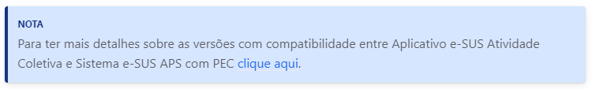

# MINISTÉRIO DA SAÚDE<br>

Secretaria de Atenção Primária à Saúde<br>
Coordenação-Geral de Inovação e Aceleração Digital da APS<br>

# e-SUS Atenção Primária à Saúde<br>

PRONTUÁRIO ELETRÔNICO DO CIDADÃO – PEC<br>
MANUAL DE USO<br>

## Orientações Gerais

O conteúdo deste manual foi elaborado utilizando Markdown. Orientações em relação a utilização deste método de escrita pode ser acessado em [Markdown Guide](https://www.markdownguide.org/basic-syntax/).

O template utilizado neste manual é o [Just the Docs](https://github.com/just-the-docs/just-the-docs). Para maiores informações e customização, acesse o repositório no GitHub [Just the Docs](https://github.com/just-the-docs/just-the-docs).

## Estrutura

Cada manual está em uma subpasta exclusiva na pasta `\docs\`. Os mesmos estão organizado em capítulos, sendo um arquivo `.md` para da um deles. Todos os manuais possuem um arquivo `index.md` como página principal de acesso e com informações da ficha catalográfica.

O arquivo `_config.yml` contém as configurações de funcionamento do template atualmente utilizado. A pasta `\_sass\` contém os arquivos de customização (`.scss`), que podem ser realizados no esquema de cores (`\color_schemes\`), seja em customizações em geral (`\custom\`). Arquivos de customização também estão presentes nas pastas `\_inlcudes\` e `\_layouts\`.
> *Manipule estes arquivos apenas se souber o que está fazendo.*

Os arquivos de imagem devem ser gravados na pasta `\media\` de cada manual, de preferência em formato `.png`.

## Atualizações

As atualizações dos manuais do e-SUS APS devem observar as seguintes premissas, observando o funcionamento da [Política de Controle de Versão do Sistema e-SUS APS](https://saps-ms.github.io/Manual-eSUS_APS/docs/PEC/PEC_00_base_conceitual/#2-pol%C3%ADtica-de-controle-de-vers%C3%A3o-do-sistema-e-sus-aps).

- **Versões de manutenção correção (*revision*):** Em caso de atualização de conteúdo em versões de correção, manter a atualização no projeto de manual da versão de melhorias atual.

- **Versões de melhoria (*minor*) e novidades (*major*):** os manuais destas versões precisam ter projetos independentes no GitHub. Para isto é necessário duplicar a versão anterior e continuar as atualizações.

## Configurar, baixar projeto e enviar atualizações com GitHub Desktop

Utilize o [GitHub Desktop](https://desktop.github.com/) para baixar o projeto em seu computador. Após a instalação, faça o *login* na sua conta GitHub. Escolha o projeto e selecione a opção `Clone`. O GitHub Desktop irá salvar uma cópia do projeto no seu computador.

### Editando os arquivos `.md`

Utilize um editor de código como o [Atom](https://atom.io/) ou [Visual Studio Code](https://code.visualstudio.com/) para realizar as edições dos arquivos e os respectivos envios (também conhecido como *commit*).

Não esqueça de salvar as alterações antes de realizar o *commit*. Após salvar os arquivos vá ao GitHub Desktop e serão mostrados os arquivos que foram alterados. Caso seja mais de um arquivo será necessário descrever resumidamente as alterações. Clique em `Commit to main` para confirmar as alterações no arquivo. Por fim clique em `Push origin` para que os arquivos sejam atualizados no repositório do GitHub.

> *Sempre que for realizar uma atualização de conteúdo é desejável que inclua um resumo das alterações na descrição do commit. Isto facilitará o entendimento da alteração realizada por outros usuários do repositório.*

## Atualização de conteúdo

Cada arquivo `.md` inicia com uma "folha de rosto" (*frontmatter*) que indica algumas configurações de comportamento daquele arquivo. Uma delas é a *Data da Última Atualização*, representada pela *tag* `last_modified_date`, como mostrado a seguir:

```yaml
---
layout: default
title: e-SUS Atividade Coletiva v1.3
nav_order: 5
nav_exclude: false
has_children: true
last_modified_date: "21/02/2021"
description: "Manual e-SUS APS"
permalink: /docs/ac
---
```

> Sempre que for realizada uma atualização de conteúdo a tag `last_modified_date` deve conter a data do dia em que a atualização está sendo concluída e enviada ao repositório, sempre usando aspas ("").

Desta forma sempre será mostrado no rodapé do capítulo a data da sua última atualização.

### Blocos de chamada (*callouts*)

É possível utilizar blocos de chamada (callouts) no texto para dar destaque a informações do tipo `Atenção`, `Nota`, `Dica` e `Atualização`. Os conceitos de cada item e o comando que deve ser utilizado antes de cada bloco são apresentados no quadro a seguir:

|Bloco|Conceito|Formato|
|-|-|-|
|**ATENÇÃO**|bloco utilizado para destacar uma informação importante para o funcionamento do sistema, caso o usuário não tome atenção ao fato citado é possível que o fluxo não funcione.|{: .atencao }|
|**NOTA**|bloco utilizado para informar ao usuário sobre possíveis problemas na execução de um processo com um fluxo diferente do padrão (caminho feliz).|{: .nota }|
|**DICA**|bloco que dá dicas sobre boas práticas no uso do sistema que podem garantir melhores resultados no uso do sistema.|{: .dica }|
|**ATUALIZAÇÃO**|este marcador localiza no manual as alterações (novidades e melhorias) disponível no sistema a partir da versão em questão.|{: .atualizacao }|

Exemplo:

Com o código:

```md
{: .atencao }
Para ter mais detalhes sobre as versões com compatibilidade entre Aplicativo e-SUS Atividade Coletiva e Sistema e-SUS APS com PEC [clique aqui](http://dab.saude.gov.br/portaldab/esus.php?conteudo=download).
```

O manual se apresenta desta forma:


