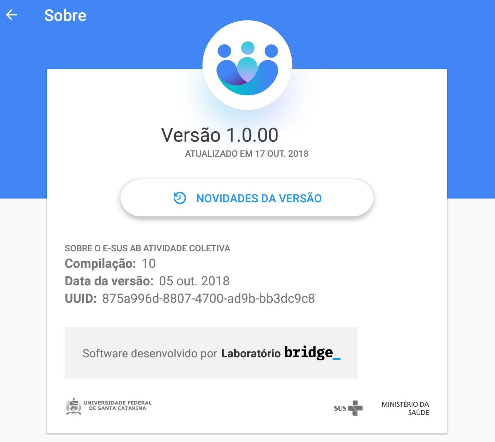
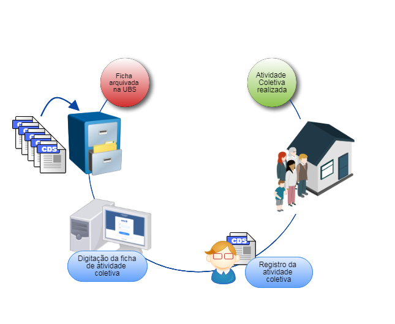
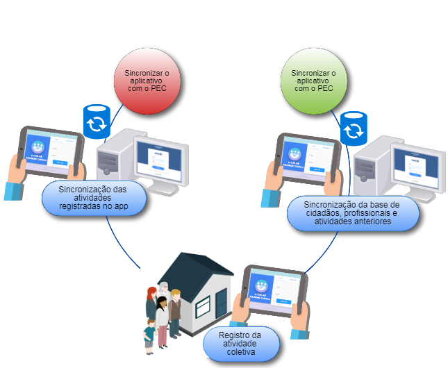

# Capítulo 1 - Introdução
{: .no_toc }

Neste capítulo, apresentaremos brevemente, os conceitos e as orientações para utilização do Aplicativo e-SUS Atividade Coletiva.

## Sumário
{: .no_toc .text-delta }

- TOC
{:toc}

A Secretaria de Atenção Primária (SAPS) incluiu na Estratégia e-SUS Atenção Básica (e-SUS APS) aplicativos móveis para registro das ações realizadas pelos profissionais de saúde em locais de difícil manejo de computadores ou notebooks. O desenvolvimento destes aplicativos é integrado ao Sistema e-SUS APS com Prontuário Eletrônico do Cidadão (PEC) ampliando a capacidade de troca de informações entre a equipe. Nesse contexto, o segundo aplicativo desenvolvido para AB priorizou as ações coletivas desenvolvidas por todos os profissionais das Equipes de Atenção Básica.

O aplicativo e-SUS Atividade Coletiva foi desenvolvido para utilização em dispositivos do tipo tablet, levando em conta aspectos relacionados ao conforto, à segurança e à usabilidade da ferramenta dentro do processo de trabalho dos profissionais de saúde. Na Seção 2.2 são oferecidas especificações do tablet que melhor se adequam à ferramenta.

Sua experiência de uso poderá contribuir para que o aplicativo e-SUS Atividade Coletiva e os sistemas e-SUS APS dialoguem cada vez mais com a sua prática profissional. O canal para registro de sua experiência e sugestões é o [Pesquisa de Opinião do e-SUS APS - Seção e-SUS Atividade Coletiva](http://dabsistemas.saude.gov.br/sistemas/pesquisaesusab/).

## 1.1 Versão do Aplicativo Usado neste Manual

Este manual foi elaborado usando como referência o Aplicativo e-SUS Atividade Coletiva em sua **versão 1.0**. O acesso às informações sobre a versão do aplicativo, bem como a lista de novidades  disponibilizadas na versão, podem ser visualizadas na opção **Sobre** (Figura 1.1), acessada no menu principal do aplicativo .  

Figura 1.1 -- Versão do Aplicativo e-SUS Atividade Coletiva

Fonte: SAS/MS.

## 1.2 A Estratégia e-SUS Atenção Básica

O Departamento de Atenção Básica (DAB) no ano de 2011 assumiu o compromisso de reestruturar o Sistema de Informação da Atenção Básica (SIAB), com o objetivo de melhorar a qualidade da informação em saúde e de otimizar o uso dessas informações pelos gestores, profissionais de saúde e cidadãos. Essa reestruturação chamada de Estratégia e-SUS APS preconiza:

1.  o registro individualizado das informações em saúde, para o acompanhamento dos atendimentos aos cidadãos;

2.  a integração dos diversos sistemas de informação oficiais existentes na AB, reduzindo a necessidade de registrar informações similares em mais de um instrumento (fichas/sistemas) ao mesmo tempo;

3.  o desenvolvimento de soluções tecnológicas que contemplem os processos de trabalho da AB, com recomendações de boas práticas e o estímulo à informatização dos serviços de saúde;

4.  a introdução de novas tecnologias para otimizar o trabalho dos profissionais;

5.  a qualificação do uso da informação na gestão e no cuidado em saúde.

## 1.3 SISAB e Sistema e-SUS APS

Em substituição ao SIAB, foi criado o Sistema de Informação em Saúde para a Atenção Básica (SISAB). Este sistema é alimentado pelo Sistema e-SUS APS: Sistema com Coleta de Dados Simplificada (CDS), Sistema com Prontuário Eletrônico do Cidadão (PEC), aplicativos móveis para a captação dos dados coletados em ações fora da UBS, ou ainda por sistemas terceiros que utilizam o Sistema e-SUS APS para transmitir os dados para o SISAB.

Nessa perspectiva, o desenvolvimento do Sistema e-SUS APS passa a priorizar o atendimento realizado pelos profissionais de saúde, e não mais o preenchimento de informações gerenciais e administrativas, as quais devem ser geradas de forma secundária pelo sistema.

## 1.4 Atividade Coletiva

As ações desenvolvidas no contexto das equipes de AB podem ser classificadas como administrativas e em saúde. Dentro dessas ações encontram-se as atividades coletivas, que também podem ser subdivididas em atividades coletivas administrativas e atividades coletivas em saúde. No âmbito da estratégia do e-SUS APS as ações coletivas em saúde são as de educação em saúde, atendimento/avaliação em grupo e mobilização social. Já as ações coletivas administrativas são, de uma forma geral, as reuniões de equipe ou com outras equipes, além das reuniões intersetoriais ou com outros colegiados.

Levando em consideração esse processo de trabalho, o aplicativo ***e-SUS Atividade Coletiva***, tem como objetivo, o registro digital das ações referidas anteriormente.

Dessa forma, o aplicativo está focado em dois blocos de atuação: 1) Ações coletivas em saúde voltadas para a população da área de abrangência do território da Unidade Básica de Saúde e 2) Ações coletivas para a organização do processo de trabalho, tendo em vista, as necessidades e situação de saúde do território sob sua responsabilidade. Assim, o aplicativo foi desenvolvido para o uso de todos os profissionais das equipes de Atenção Básica (Equipes de Saúde Bucal, Núcleo de Ampliado de Saúde da Família e Atenção Básica, Polo Academia da Saúde, Consultório na Rua e as equipes de Atenção Básica Prisional). Além disso, as ações realizadas no Programa Saúde na Escola e no Programa Nacional de Controle do Tabagismo, também podem ser registradas nesta aplicação.

## 1.5 Fluxo de Registros de Atividades Coletivas no Aplicativo

O fluxo de registro das atividades coletivas no sistema e-SUS APS com o uso das fichas para a coleta de dados relacionado às atividades coletivas é um processo contínuo que se inicia no momento em que se está realizando estas ações no território ou na própria Unidade Básica de Saúde até a inserção desses dados no sistema.

A partir das ações coletivas dos profissionais da Atenção Básica, o processo, utilizando as fichas do CDS, ocorre como segue:

a.  O profissional responsável pela atividade coletiva realiza uma ação coletiva administrativa ou em saúde;

b.  Durante a realização da ação registra os dados do tipo de atividade realizada, os temas para reunião, se for o caso, o público-alvo, temas para saúde e práticas em saúde, sempre observando as regras de preenchimento da ficha contidas no Manual do Sistema com Coleta de Dados Simplificada. Além disso, preenche o cabeçalho da ficha, turno, local de atividade, número de participantes, CNS dos profissionais participantes, entre outros.

c.  Após finalizada a atividade, deve-se inserir as fichas no sistema, pelo próprio profissional, ou pelo digitador.

Figura 1.2 - Fluxo de registro das fichas de Atividade Coletiva usando CDS

Fonte: SAS/MS.

Ao utilizar o aplicativo e-SUS Atividade Coletiva o processo ocorre como segue:

a.  O profissional responsável pela atividade coletiva sincroniza o aplicativo instalado no tablet com servidor do PEC;

b.  No momento da atividade coletiva administrativa ou em saúde registra no aplicativo as ações desenvolvidas junto às equipes e ou comunidade;

c.  Após finalizada a atividade coletiva, o profissional responsável pela ação realiza nova sincronização com o servidor.

Figura 1.3 - Fluxo de Atualização usando aplicativo e-SUS Atividade Coletiva

Fonte: SAS/MS.

Observando este último fluxo de registro das ações coletivas utilizando o aplicativo e-SUS Atividade Coletiva percebe-se que há uma simplificação do processo de registro no sistema e-SUS APS. Algumas vantagens são:

1.  Eliminação de fichas de atividade coletiva em papel;

2.  Eliminação do processo auxiliar de digitação dos dados coletados na atividade coletiva, considerando o uso do CDS;

3.  Redução no armazenamento de fichas de papel dentro da UBS;

4.  Diminuição do tempo de compartilhamento de informação com o restante da equipe;
