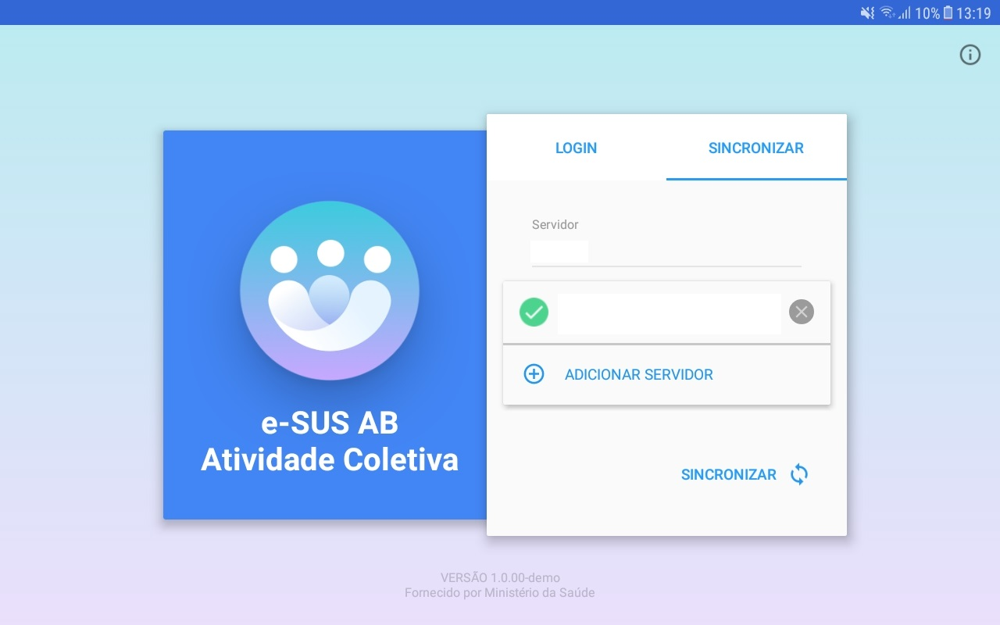

# Capítulo 2 - Instalação e Sincronização
{: .no_toc }

Neste capítulo abordaremos algumas questões sobre instalação e as etapas
necessárias para o primeiro acesso ao aplicativo.

## Sumário
{: .no_toc .text-delta }

- TOC
{:toc}

## 2.1 Instalação

A instalação do Aplicativo e-SUS Atividade Coletiva se dá pelo fluxo padrão de instalação de aplicativos para Android do Google Play. Para instalá-lo no dispositivo móvel basta seguir o passos:

1.  Acesse a instalação do aplicativo por meio do link: [https://play.google.com/store/apps/details?id=](https://play.google.com/store/apps/details?id=br.gov.saude.acs)

2.  Ou por meio do aplicativo Google Play no dispositivo Android e busque pelo aplicativo "e-SUS Atividade Coletiva"

3.  Clique em Instalar  e aguarde a instalação.

4.  Após finalizado o dispositivo irá notificar a conclusão da instalação.

## 2.2 Requisitos Mínimos

Para um bom funcionamento do aplicativo, fique atento aos requisitos mínimos do dispositivo:

-   Sistema Operacional Android versão 4.4 ou superior

-   Processador, mínimo de 1,3 GHz Quad core e 2 Mb L2 cache;

-   Memória RAM, mínimo de 1 GB (um gigabyte)

-   Tela com tamanho mínimo de 07 (sete) polegadas. Recomendamos telas de 9 ou 10 polegadas.

-   Armazenamento, mínimo de 16 GB

-   Conexão Wi-Fi

>  **NOTA**: Consulte a especificação completa no [site do e-SUS APS](http://189.28.128.100/dab/docs/portaldab/documentos/especificacoes_tablet_esus.pdf).

## 2.3 Primeiro Acesso ao Aplicativo

Durante o primeiro acesso, o profissional de saúde deve realizar a sincronização do aplicativo com uma instalação do Sistema e-SUS APS PEC da sua UBS. Para tanto, algumas questões devem ser observadas:

1)  Deve haver uma instalação do Sistema e-SUS APS com PEC compatível com a versão do aplicativo e-SUS Atividade Coletiva;

2)  O profissional que fará uso do aplicativo deve estar cadastrado no sistema e-SUS APS com PEC;

3)  Deve haver uma rede local, sem fio (wireless), para que seja possível fazer a sincronização do sistema com o aplicativo;

{: .note }  **NOTA**: Para ter mais detalhes sobre as versões com compatibilidade entre Aplicativo e-SUS Atividade Coletiva e Sistema e-SUS APS com PEC [clique aqui](http://dab.saude.gov.br/portaldab/esus.php?conteudo=download).

## 2.4 Sincronização

A sincronização permite que os dados da equipe que utilizará o aplicativo, bem como as informações referentes às atividades coletivas registradas anteriormente, quando houverem, sejam transmitidos para o aplicativo, de modo a permitir que o profissional de saúde desenvolva os registros de suas ações com mais facilidade e reutilize os dados pré-existentes no PEC. São recuperados para o tablet os registros em CDS de até 3 meses anteriores.

A tela de sincronização, conforme podemos ver na Figura 2.1, apresenta três campos de preenchimento obrigatório:

-   **Endereço do servidor**: deverá ser informado o endereço eletrônico do servidor (computador onde o Sistema e-SUS APS com PEC está instalado) com o qual o aplicativo realizará a sincronização (ex.: `http://www.municipio.esusab.gov.br:8080/esus` ou `http://IP_Computador:8080/esus`.

-   **Login**: CPF do profissional de saúde (uma vez feita a sincronização com o CPF do profissional de saúde esse dado não poderá ser alterado, a menos que todos os dados do aplicativo sejam apagados nas configurações dos aplicativos instalados no dispositivo).

-   **Senha**: a mesma senha cadastrada no PEC de sincronização.

Figura 2.1 - Tela de sincronização app e-SUS Atividade Coletiva.

Fonte: SAS/MS.

É importante lembrar que o processo de sincronização depende de conectividade entre o tablet e a instalação PEC do e-SUS APS, seja por rede local Wi-Fi, seja via internet. Verifique com a gestão do seu município as orientações para esta configuração.

Figura 2.2. Tela de sincronização app e-SUS Atividade Coletiva

Fonte: SAS/MS.

Figura 2.3. Tela de sincronização app e-SUS Atividade Coletiva

Fonte: SAS/MS.

Figura 2.4. Tela de sincronização app e-SUS Atividade Coletiva

Fonte: SAS/MS.

Após a confirmação de sucesso na primeira sincronização, caso haja Fichas de Atividade Coletiva registradas na base, estes são carregados no tablet. Também serão carregados no aplicativo os profissionais da UBS e os dados dos cidadãos que foram cadastrados na UBS do profissional que fez o login.

 **ATENÇÃO**: É importante sempre manter as bases sincronizadas para garantir a integridade das bases de dados entre o tablet e o PEC. Recomenda-se que a sincronização seja feita ao menos uma vez por dia.

## 2.5 Alterar o Servidor de Sincronização

O aplicativo grava o endereço do servidor configurado inicialmente no processo de sincronização, podendo ser modificado futuramente caso seja necessário. Caso seja necessário sincronizar com outra instalação PEC é possível salvar mais de um link de sincronização, permitindo que profissionais que atuam em mais de uma UBS, como os pertencentes às equipes NASF, possam recuperar os dados pré-existentes. O cadastro é realizado ao clicar no campo "endereço do servidor". Após isso é mostrado a opção "adicionar servidor" como mostra a imagem abaixo.

Figura 2.5. Tela para adicionar servidor no aplicativo e-SUS Atividade Coletiva

Fonte: SAS/MS.

Figura 2.6. Tela para adicionar servidor no aplicativo e-SUS Atividade Coletiva

Fonte: SAS/MS.

>  **ATENÇÃO**: para garantir que nenhum dado seja perdido, faça a sincronização com a aplicação que você está usando anteriormente.

## 2.6 Autenticação

Nos próximos acessos, o aplicativo mostrará os campos "LOGIN" e "SENHA", como mostra a Figura 2.7.

Figura 2.7 - Tela de autenticação, app e-SUS Atividade Coletiva

Fonte: SAS/MS.

A tela de autenticação apresenta dois campos de preenchimento obrigatório:

-   **Login**: insira o número de CPF do profissional de saúde que irá registrar a AC

-   **Senha**: insira a senha do usuário (a mesma senha cadastrada no Sistema com PEC de sincronização)

>  **NOTA**: A **senha de acesso** para o Aplicativo é a mesma utilizada pelo usuário no Sistema com PEC.

## 2.7 Sincronizações Subsequentes

É recomendado que ao menos uma vez por dia, quando possível, o usuário do aplicativo e-SUS Atividade Coletiva realize a sincronização do mesmo com o servidor local do PEC, lembrando que essa ação só é efetiva quando houver conectividade com a internet.

Além da forma de sincronizar demonstrada no capítulo 2.4 e 2.5, por meio da tela inicial do aplicativo, também é possível realizar a sincronização clicando sobre o Menu  e em seguida na opção "Sincronizar" . Após será apresentada a seguinte tela.  

Figura 2.8. Tela de Sincronização do aplicativo e-SUS Atividade Coletiva

No canto superior esquerdo da figura 2.8 acima é apresentada a quantidade de atividades finalizadas e que ainda não foram sincronizadas. As atividades não finalizadas não são sincronizadas até que termine o completo preenchimento e resolva as inconsistências. Para finalizar essas atividades basta clicar sobre o quadro com a quantidade de atividades não finalizadas.

Na figura 2.8 ainda se observa o histórico de sincronização com as informações sobre as datas das últimas sincronizações, a quantidade de atividades sincronizadas que foram enviadas pelo aplicativo e-SUS APS AC e as que foram recebidas por meio do e-SUS APS PEC.

Por fim, para realizar a sincronização escolha o servidor, preencha o login, a senha e clique sobre o botão .

>  **DICA**: Caso durante a sincronização o usuário do aplicativo e-SUS Atividade Coletiva queira receber profissionais que estão lotados em outras unidades de saúde, basta selecioná-las a partir do ícone .
