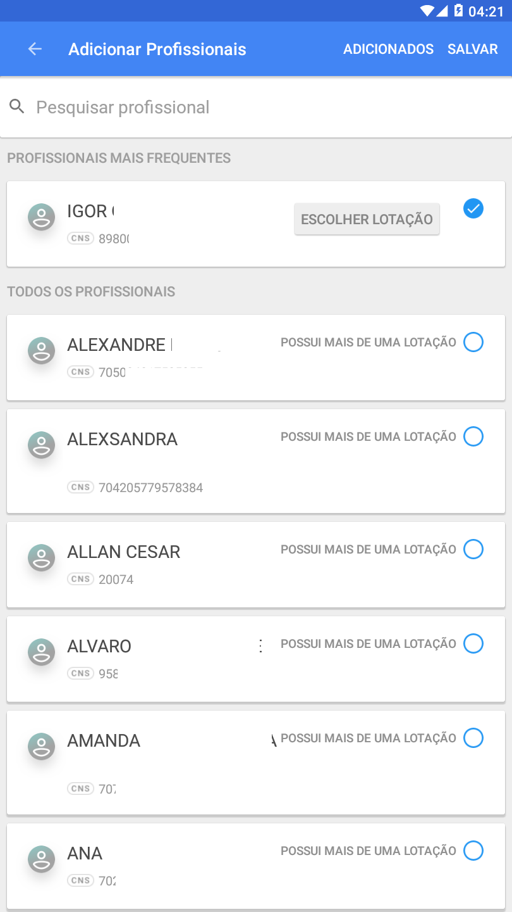
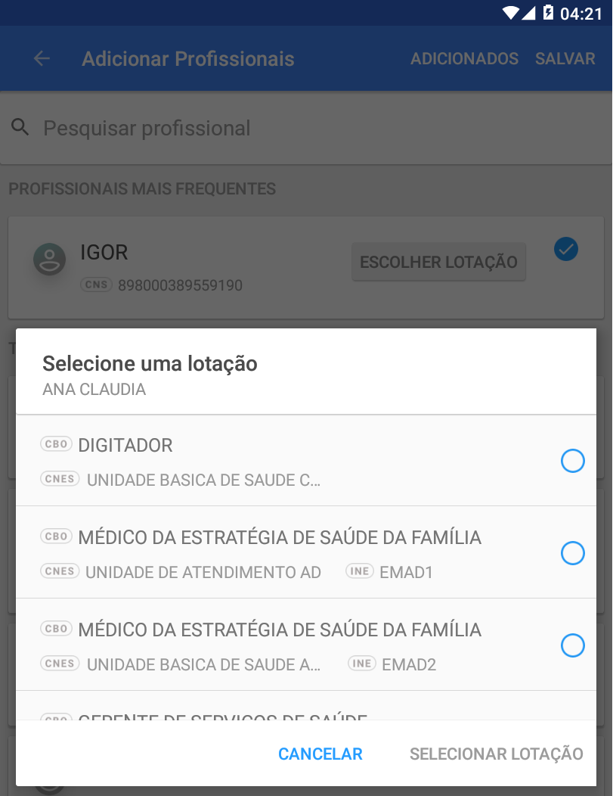
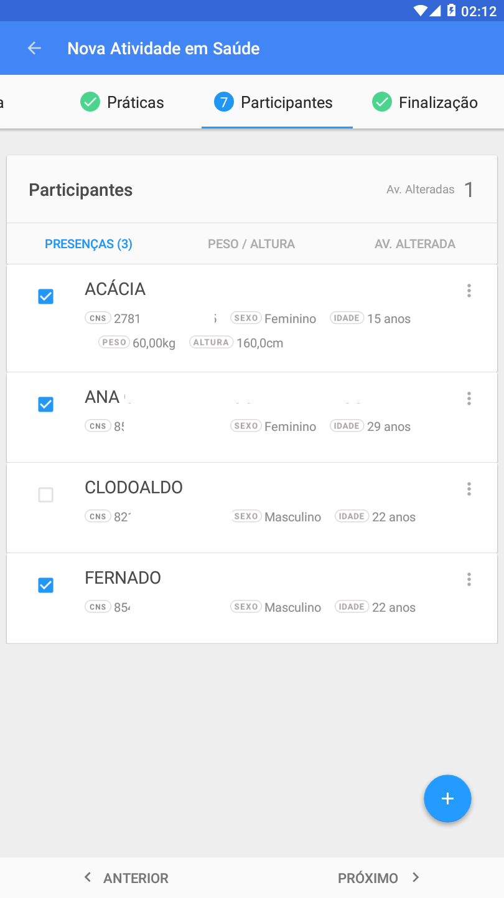
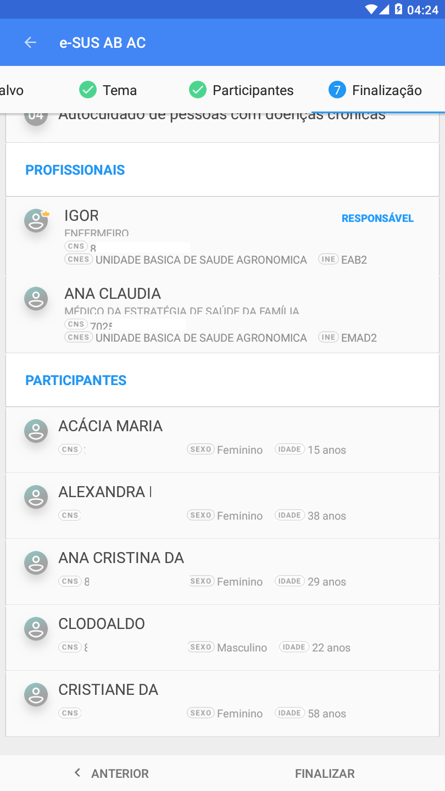

# Capítulo 3 - Registro da Atividade Coletiva
{: .no_toc }

Neste capítulo será demonstrado como realizar o registro das atividade coletivas desenvolvidas na atenção básica no aplicativo e-SUS Atividade Coletiva.

## Sumário
{: .no_toc .text-delta }

- TOC
{:toc}

## 3.1 Organização dos registros de Atividade Coletiva

Após a tela de login do aplicativo é mostrado o ambiente principal com as abas "Grupos" e "Atividades Coletivas".

### 3.1.1 Criar Grupos de Atividade Coletiva

Os grupos funcionam para os casos de atividades que são realizadas de forma mais frequente com um conjunto específico de cidadãos. Esta funcionalidade foi elaborada para facilitar para os profissionais a identificação destes agrupamentos, seu gerenciamento e registro das atividades.

Figura 3.1. Tela de Grupos e/ou Atividades Coletivas do e-SUS Atividade Coletiva

Fonte: SAS/MS

Para criar um grupo é necessário tocar no botão  e selecionar a opção "Novo Grupo".

Figura 3.2. Tela de Grupos e/ou Atividades Coletivas do e-SUS Atividade Coletiva

Fonte: SAS/MS

Na sequência é possível dar um nome ao grupo, escolher a cor do ícone, editar suas iniciais, selecionar o CNES do estabelecimento onde o grupo faz parte e definir se é uma atividade de saúde ou de reunião.

Figura 3.3. Cadastrar Grupo

Fonte: SAS/MS

Após esta etapa é possível apenas salvar o grupo ou salvar o grupo e iniciar um registro de atividade coletiva para este grupo.

Figura 3.4. Cadastrar Grupo

Fonte: SAS/MS

Após salvar o grupo, o mesmo ficará disponível na aba Grupos para ser reutilizado quando for necessário. Ao passo que forem sendo criados, os grupos permanecerão nesta aba.

Figura 3.5. Tela dos Grupos do aplicativo e-SUS Atividade Coletiva

Fonte: SAS/MS

Cada cartão de grupo disponibiliza opções  possibilitando editar ou remover o grupo. Tocando no cartão do grupo o aplicativo abre a tela com a listagem de atividades realizadas e apresenta o botão , pelo qual pode ser registrada uma nova atividade para aquele grupo.

Figura 3.6. Tela de Grupos do aplicativo e-SUS Atividade Coletiva

Fonte: SAS/MS

{: .nota  }
Grupos que já foram sincronizados não podem ser removidos.

### 3.1.2 Atividades Coletivas

Na aba "Atividades Coletivas" são apresentadas outras duas abas, uma com os registros não finalizados e outra com as atividades finalizadas. As atividades não finalizadas são aquelas em que por algum motivo não foram totalmente preenchidas, podendo ser complementadas posteriormente.

Figura 3.7. Tela Atividades Coletivas do aplicativo e-SUS Atividade Coletiva

Fonte: SAS/MS

A aba "Atividades Finalizadas" apresenta a lista de atividades que tiveram seu registro concluído e que estão prontas para sincronização ou já foram sincronizadas com o PEC.

Figura 3.8. Tela Atividades Coletivas do aplicativo e-SUS Atividade Coletiva

Fonte: SAS/MS

{: .atencao }
As atividades que ainda não foram sincronizadas apresentam o símbolo . Sincronize sempre que possível.

Atividades coletivas que ainda não foram sincronizadas podem ser "Excluídas" ou "Editadas". A opção "Copiar" fica disponível sempre para todas as atividades.

Figura 3.9. Tela Atividades Coletivas do aplicativo e-SUS Atividade Coletiva

Fonte: SAS/MS

{: .nota  }
Após a sincronização é possível apenas copiar a atividade para realizar um novo registro.

### 3.1.3. Copiar Atividade Coletiva

Ainda na aba "Atividades Finalizadas" ao clicar na opção , conforme visto nas figuras 3.8 e 3.9, é possível "Copiar" a atividade coletiva já registrada no aplicativo. Ao acionar essa opção aparece a caixa de diálogo abaixo, a partir daí, pode escolher apenas os dados que queira copiar da atividade selecionada.

Figura 3.10. Caixa de diálogo Copiar atividade

Fonte: SAS/MS

Por padrão, todos os itens já vem selecionados. Ao permanecer selecionado o item "Dados da atividade" serão copiadas as informações referentes ao cabeçalho, tipo, tema, público e práticas. Ao permanecer selecionado o item "Participantes" serão copiados os dados referentes ao CNS, nome, sexo e data de nascimento dos participantes da atividade copiada. E por fim, ao permanecer selecionada o item "Profissionais" as informações sobre CNS, nome e CBO dos profissionais que participaram da atividade copiada serão replicadas.

## 3.2 Adicionar atividade coletiva

Para adicionar uma nova atividade coletiva, clique no botão . Esta opção é apresentada em diversos locais no aplicativo, como nas abas "Grupos" e "Atividades Coletivas", além dos cartões dos grupos já formados. Caso a atividade seja criada dentro de um grupo, a mesma já virá com os dados característicos daquele grupo preenchidos, como o nome do grupo e o tipo de atividade, saúde ou reunião. Para registrar atividades coletivas sem grupo específico, será solicitado a escolha entre "nova atividade em saúde" ou "nova atividade de reunião".

### 3.2.1 Nova Atividade em Saúde

Ao clicar em "Nova Atividade em Saúde" inicia-se o registro da atividade coletiva. O processo de registro é dividido em etapas, iniciando pelo Cabeçalho até a Finalização.

No **Cabeçalho** são solicitados o Grupo (se houver), data da atividade, número de participantes, turno, local da atividade (neste caso quando é uma UBS é solicitado o número CNES, se for escola/creche é solicitado o número INEP e caso seja outro local, descrever qual localidade) e se é uma atividade do Programa Saúde na Escola.

Figura 3.11. Tela Nova Atividade Coletiva em Saúde

Fonte: SAS/MS

A lista de **Profissionais** consiste em incluir os executores da atividade, destacando o responsável pela atividade. Ao clicar no botão , é apresentada uma tela de pesquisa, na qual é possível realizar a busca pelos profissionais existentes no Cadastro Nacional de Estabelecimentos de Saúde (CNES) do município.

Figura 3.12. Tela Nova Atividade Coletiva em Saúde

Fonte: SAS/MS

Caso o profissional tenha mais de uma lotação, será possível selecionar a partir de uma lista carregada previamente do PEC. Para adicionar o profissional selecionado na lista de Profissionais da atividade, deve-se clicar em .

Figura 3.12. Tela Adicionar profissional

Fonte: SAS/MS

O **Tipo** de atividade, como no registro realizado na Coleta de Dados Simplificada (CDS), determina o funcionamento posterior do aplicativo a partir da escolha da atividade. Dito isto, as próximas etapas poderão mostrar apenas as opções condizentes com o tipo de atividade selecionada.

Figura 3.13. Tela Nova Atividade Coletiva em Saúde

Fonte: SAS/MS

{: .nota  }
Somente uma opção pode ser selecionada em "Tipo de Atividade"..

No **Público-alvo** o profissional deverá selecionar para que tipo de público está sendo realizada a atividade. Esta etapa é obrigatória e permite a seleção de uma ou mais opções.

Figura 3.14. Tela Nova Atividade Coletiva em Saúde

Fonte: SAS/MS

O **Tema** apresenta a lista de temáticas em saúde que foram abordados na atividade coletiva realizada. É de preenchimento obrigatório permitindo a seleção de um ou mais temas.

Figura 3.15. Tela Nova Atividade Coletiva em Saúde

Fonte: SAS/MS

Quando a atividade coletiva for do "Tipo" "05 - Atendimento em Grupo" ou "06 - Avaliação / Procedimento coletivo" a aba "**Práticas em Saúde**" fica visível no aplicativo e a seleção das práticas é obrigatória.

Figura 3.16. Tela Nova Atividade Coletiva em Saúde

Fonte: SAS/MS

Além da lista de práticas mostrada anteriormente é possível incluir práticas não listadas através da opção "Outro procedimento coletivo". Selecionando esta opção será mostrado a lista de práticas disponíveis e seu código SIGTAP.

Figura 3.17. Tela adicionar procedimento em Nova Atividade Coletiva em Saúde

Fonte: SAS/MS

Em **Participantes** o profissional irá incluir os cidadãos que participaram da atividade coletiva. Neste momento é possível incluir os cidadãos tocando no botão . Serão listados os cidadãos cadastrados no território da UBS, recebidos na sincronização com o PEC local previamente realizada.

Figura 3.18. Tela Nova Atividade Coletiva em Saúde

Fonte: SAS/MS

Caso o cidadão não seja encontrado é possível incluir seus dados diretamente no aplicativo tocando o botão  na lista de cidadãos. Após esta ação o aplicativo solicita que alguns campos sejam preenchidos como nome, sexo, data de nascimento e número de CNS se houver.

Figura 3.19. Adicionar novo participante em Nova Atividade Coletiva em Saúde

Fonte: SAS/MS

Após incluir um cidadão é necessário salvar o registro e depois tocar em Salvar no canto superior direito do aplicativo para salvar a lista de cidadãos participantes da atividade.

Com a lista de cidadãos salva, será possível marcar aqueles cidadãos que estiveram presentes na atividade. Caso seja um grupo de participação fixa é possível reutilizar a lista de participantes, sendo necessário apenas atribuir a presença dos que compareceram na atividade.

Figura 3.20. Tela Nova Atividade Coletiva em Saúde

Fonte: SAS/MS

Caso se trate de uma atividade do tipo "05- Atendimento em Grupo" ou "06- Avaliação / Procedimento coletivo", será possível incluir informações específicas da prática realizada.

Figura 3.21. Tela Nova Atividade Coletiva em Saúde

Fonte: SAS/MS

A última etapa do preenchimento é a **Finalização** do registro em que o profissional revisa as informações inseridas e salva as informações da atividade coletiva realizada.

Figura 3.22. Tela Nova Atividade Coletiva em Saúde

Fonte: SAS/MS

Caso haja algum campo obrigatório que não foi preenchido o aplicativo indicará quais são as inconsistências do registro como é mostrado abaixo:

Figura 3.23. Tela com as inconsistências na Atividade

Fonte: SAS/MS

Tocando na opção "Ver inconsistências" o aplicativo mostra em detalhes onde estão a inconsistência.

Figura 3.24. Tela com as inconsistências na atividade

Fonte: SAS/MS

### 3.2.2 Nova Atividade de Reunião

Nesta seção será abordado como incluir uma nova atividade de reunião no aplicativo de Atividade Coletiva. Assim como na inserção de uma nova atividade coletiva em saúde, o registro de uma atividade de reunião é dividido em etapas, começando pelo Cabeçalho até a Finalização.

No **Cabeçalho** são solicitados o Grupo (se houver), data em que ocorreu a atividade, número de participantes, que deve possuir no mínimo 01 (um), turno, local da atividade, quando é uma UBS é solicitado o número CNES, quando é uma escola/creche é solicitado o número INEP e por fim, quando é outro local descreva qual é a localidade, esses campos são obrigatórios. Se for uma atividade de reunião relacionada ao Programa Saúde na Escola selecione as opções "Educação" e/ou "Saúde" .

Figura 3.25. Tela Nova Atividade de Reunião

Fonte: SAS/MS

A seguir selecione os profissionais que participarão da reunião, para isso, basta selecionar os "Profissionais" na lista, conforme figura abaixo. Caso um dos participantes não estejam previamente na lista é possível adicionar clicando no botão .

Figura 3.26. Tela Nova Atividade de Reunião

Fonte: SAS/MS

Quando o profissional não é selecionado o seu status fica como "ausente" , ao selecioná-lo muda para a opção de "Responsável" . Os profissionais selecionados serão os participantes da atividade de reunião. Cabe lembrar que é possível selecionar apenas 01 (um) responsável pela atividade, quando escolhido o responsável os demais profissionais da lista terá esta opção desabilitada.

O próximo passo é selecionar o "Tipo" de Atividade. Na tela aparecerá como tipo de atividade a "Reunião de equipe", "Reunião com outras equipes de saúde" e "Reunião intersetorial/Conselho local de saúde/Controle Social". Somente é possível selecionar uma dessas atividades.

Figura 3.27. Tela Nova Atividade de Reunião

Fonte: SAS/MS

Seguindo o registro da atividade coletiva a próxima etapa se configura em selecionar o "Tema" para a reunião. Na tela será exibida os temas referentes a "Questões administrativas Funcionamento", "Processo de trabalho", "Diagnóstico do território/Monitoramento do território", "Planejamento/Monitoramento das ações da equipe", "Discussão de caso/Projeto terapêutico singular", "Educação Permanente" e "Outros". Diferente da aba "Tipo", é possível selecionar mais de um tema.

Figura 3.28. Tela Nova Atividade de Reunião

Fonte: SAS/MS

Por fim, a última etapa será revisar o que foi registrado na seção "Finalização". Ao confirmar os dados clique no botão "Finalizar".

Figura 3.28. Tela Nova Atividade de Reunião

Fonte: SAS/MS

Caso algum campo obrigatório não tenha sido preenchido o aplicativo apresentará o mesmo comportamento referido para o registro da atividade coletiva no capítulo 3.2.1 ao apontar as inconsistências para as devidas correções.
