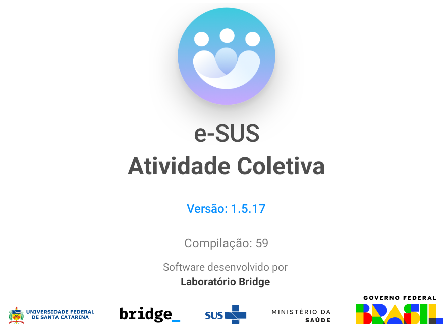
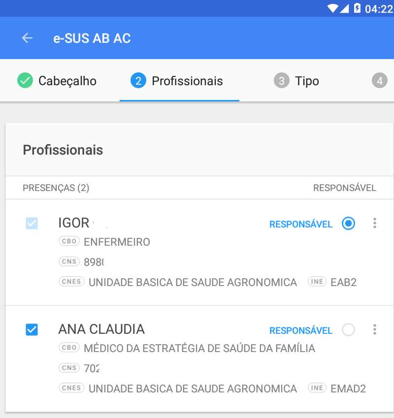
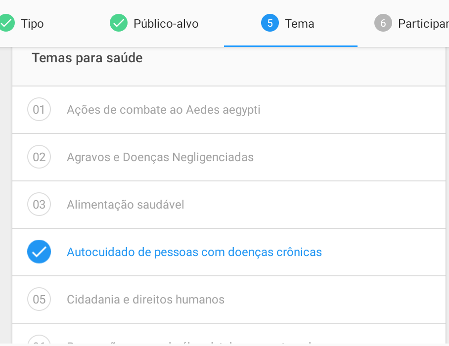
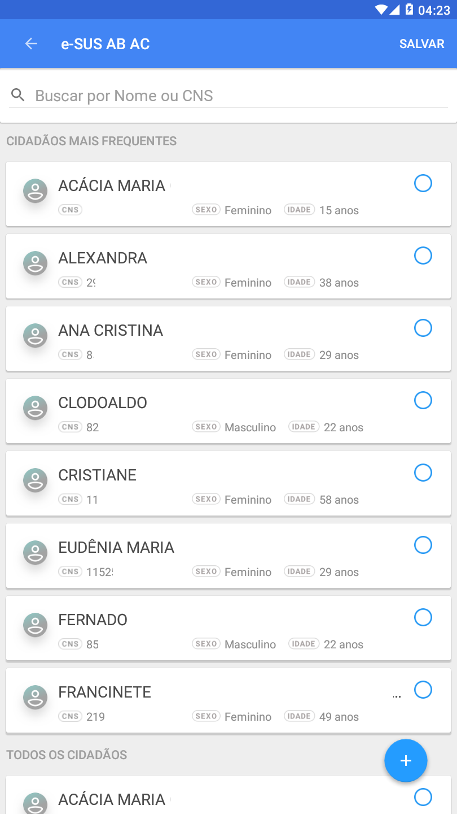
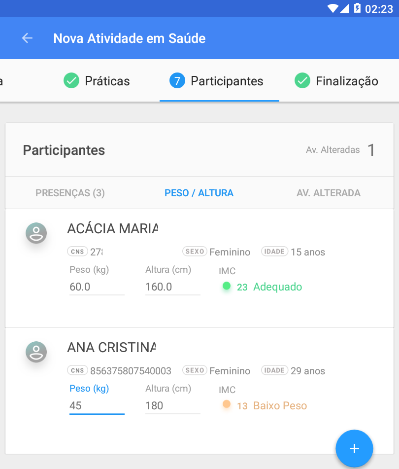
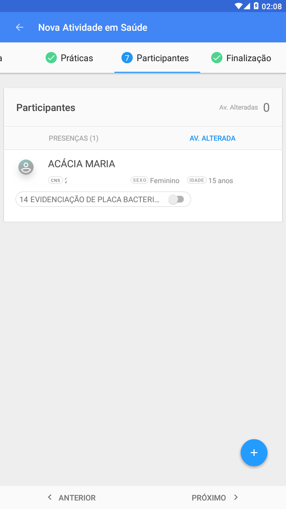

# Capítulo 1 - Introdução
{: .no_toc }

Neste capítulo, apresentaremos brevemente, os conceitos e as orientações para utilização do Aplicativo e-SUS Atividade Coletiva.

## Sumário
{: .no_toc .text-delta }

- TOC
{:toc}

O Departamento de Atenção Básica (DAB) incluiu na Estratégia e-SUS Atenção Básica (e-SUS APS) aplicativos móveis para registro das ações realizadas pelos profissionais de saúde em locais de difícil manejo de computadores ou notebooks. O desenvolvimento destes aplicativos é integrado ao Sistema e-SUS APS com Prontuário Eletrônico do Cidadão (PEC) ampliando a capacidade de troca de informações entre a equipe. Nesse contexto, o segundo aplicativo desenvolvido para AB priorizou as ações coletivas desenvolvidas por todos os profissionais das Equipes de Atenção Básica.

O aplicativo e-SUS Atividade Coletiva foi desenvolvido para utilização em dispositivos do tipo tablet, levando em conta aspectos relacionados ao conforto, à segurança e à usabilidade da ferramenta dentro do processo de trabalho dos profissionais de saúde. Na Seção 2.2 são oferecidas especificações do tablet que melhor se adequam à ferramenta.

Sua experiência de uso poderá contribuir para que o aplicativo e-SUS Atividade Coletiva e os sistemas e-SUS APS dialoguem cada vez mais com a sua prática profissional. O canal para registro de sua experiência e sugestões é o [Pesquisa de Opinião do e-SUS APS - Seção e-SUS Atividade Coletiva](http://dabsistemas.saude.gov.br/sistemas/pesquisaesusab/).

## 1.1 Versão do Aplicativo Usado neste Manual

Este manual foi elaborado usando como referência o Aplicativo e-SUS Atividade Coletiva em sua **versão 1.0**. O acesso às informações sobre a versão do aplicativo, bem como a lista de novidades  disponibilizadas na versão, podem ser visualizadas na opção **Sobre** (Figura 1.1), acessada no menu principal do aplicativo .  

Figura 1.1 -- Versão do Aplicativo e-SUS Atividade Coletiva

Fonte: SAS/MS.

## 1.2 A Estratégia e-SUS Atenção Básica

O DAB assumiu o compromisso de reestruturar o Sistema de Informação da Atenção Básica (SIAB), com o objetivo de melhorar a qualidade da informação em saúde e de otimizar o uso dessas informações pelos gestores, profissionais de saúde e cidadãos. Essa reestruturação chamada de Estratégia e-SUS APS preconiza:

1.  o registro individualizado das informações em saúde, para o acompanhamento dos atendimentos aos cidadãos;

2.  a integração dos diversos sistemas de informação oficiais existentes na AB, reduzindo a necessidade de registrar informações similares em mais de um instrumento (fichas/sistemas) ao mesmo tempo;

3.  o desenvolvimento de soluções tecnológicas que contemplem os processos de trabalho da AB, com recomendações de boas práticas e o estímulo à informatização dos serviços de saúde;

4.  a introdução de novas tecnologias para otimizar o trabalho dos profissionais;

5.  a qualificação do uso da informação na gestão e no cuidado em saúde.

## 1.3 SISAB e Sistema e-SUS APS

Em substituição ao SIAB, foi criado o Sistema de Informação em Saúde para a Atenção Básica (SISAB). Este sistema é alimentado pelo Sistema e-SUS APS: Sistema com Coleta de Dados Simplificada (CDS), Sistema com Prontuário Eletrônico do Cidadão (PEC), aplicativos móveis para a captação dos dados coletados em ações fora da UBS, ou ainda por sistemas terceiros que utilizam o Sistema e-SUS APS para transmitir os dados para o SISAB.

Nessa perspectiva, o desenvolvimento do Sistema e-SUS APS passa a priorizar o atendimento realizado pelos profissionais de saúde, e não mais o preenchimento de informações gerenciais e administrativas, as quais devem ser geradas de forma secundária pelo sistema.

## 1.4 Atividade Coletiva

As ações desenvolvidas no contexto das equipes de AB podem ser classificadas como administrativas e em saúde. Dentro dessas ações encontram-se as atividades coletivas, que também podem ser subdivididas em atividades coletivas administrativas e atividades coletivas em saúde. No âmbito da estratégia do e-SUS APS as ações coletivas em saúde são as de educação em saúde, atendimento/avaliação em grupo e mobilização social. Já as ações coletivas administrativas são, de uma forma geral, as reuniões de equipe ou com outras equipes, além das reuniões intersetoriais ou com outros colegiados.

Levando em consideração esse processo de trabalho, o aplicativo ***e-SUS Atividade Coletiva***, tem como objetivo, o registro digital das ações referidas anteriormente.

Dessa forma, o aplicativo está focado em dois blocos de atuação: 1) Ações coletivas em saúde voltadas para a população da área de abrangência do território da Unidade Básica de Saúde e 2) Ações coletivas para a organização do processo de trabalho, tendo em vista, as necessidades e situação de saúde do território sob sua responsabilidade. Assim, o aplicativo foi desenvolvido para o uso de todos os profissionais das equipes de Atenção Básica (Equipes de Saúde Bucal, Núcleo de Ampliado de Saúde da Família e Atenção Básica, Polo Academia da Saúde, Consultório na Rua e as equipes de Atenção Básica Prisional). Além disso, as ações realizadas no Programa Saúde na Escola e no Programa Nacional de Controle do Tabagismo, também podem ser registradas nesta aplicação.

## 1.5 Fluxo de Registros de Atividades Coletivas no Aplicativo

O fluxo de registro das atividades coletivas no sistema e-SUS APS com o uso das fichas para a coleta de dados relacionado às atividades coletivas é um processo contínuo que se inicia no momento em que se está realizando estas ações no território ou na própria Unidade Básica de Saúde até a inserção desses dados no sistema.

A partir das ações coletivas dos profissionais da Atenção Básica, o processo, utilizando as fichas do CDS, ocorre como segue:

a.  O profissional responsável pela atividade coletiva realiza uma ação coletiva administrativa ou em saúde;

b.  Durante a realização da ação registra os dados do tipo de atividade realizada, os temas para reunião, se for o caso, o público-alvo, temas para saúde e práticas em saúde, sempre observando as regras de preenchimento da ficha contidas no Manual do Sistema com Coleta de Dados Simplificada. Além disso, preenche o cabeçalho da ficha, turno, local de atividade, número de participantes, CNS dos profissionais participantes, entre outros.

c.  Após finalizada a atividade, deve-se inserir as fichas no sistema, pelo próprio profissional, ou pelo digitador.

Figura 1.2 - Fluxo de registro das fichas de Atividade Coletiva usando CDS

Fonte: SAS/MS.

Ao utilizar o aplicativo e-SUS Atividade Coletiva o processo ocorre como segue:

a.  O profissional responsável pela atividade coletiva sincroniza o aplicativo instalado no tablet com servidor do PEC;

b.  No momento da atividade coletiva administrativa ou em saúde registra no aplicativo as ações desenvolvidas junto às equipes e ou comunidade;

c.  Após finalizada a atividade coletiva, o profissional responsável pela ação realiza nova sincronização com o servidor.

Figura 1.3 - Fluxo de Atualização usando aplicativo e-SUS Atividade Coletiva

Fonte: SAS/MS.

Observando este último fluxo de registro das ações coletivas utilizando o aplicativo e-SUS Atividade Coletiva percebe-se que há uma simplificação do processo de registro no sistema e-SUS APS. Algumas vantagens são:

1.  Eliminação de fichas de atividade coletiva em papel;

2.  Eliminação do processo auxiliar de digitação dos dados coletados na atividade coletiva, considerando o uso do CDS;

3.  Redução no armazenamento de fichas de papel dentro da UBS;

4.  Diminuição do tempo de compartilhamento de informação com o restante da equipe;

# Capítulo 2 - Instalação e Sincronização

Neste capítulo abordaremos algumas questões sobre instalação e as etapas
necessárias para o primeiro acesso ao aplicativo.

## 2.1 Instalação

A instalação do Aplicativo e-SUS Atividade Coletiva se dá pelo fluxo padrão de instalação de aplicativos para Android do Google Play. Para instalá-lo no dispositivo móvel basta seguir o passos:

1.  Acesse a instalação do aplicativo por meio do link: [https://play.google.com/store/apps/details?id=](https://play.google.com/store/apps/details?id=br.gov.saude.acs)

2.  Ou por meio do aplicativo Google Play no dispositivo Android e busque pelo aplicativo "e-SUS Atividade Coletiva"

3.  Clique em Instalar  e aguarde a instalação.

4.  Após finalizado o dispositivo irá notificar a conclusão da instalação.

## 2.2 Requisitos Mínimos

Para um bom funcionamento do aplicativo, fique atento aos requisitos mínimos do dispositivo:

-   Sistema Operacional Android versão 4.4 ou superior

-   Processador, mínimo de 1,3 GHz Quad core e 2 Mb L2 cache;

-   Memória RAM, mínimo de 1 GB (um gigabyte)

-   Tela com tamanho mínimo de 07 (sete) polegadas. Recomendamos telas de 9 ou 10 polegadas.

-   Armazenamento, mínimo de 16 GB

-   Conexão Wi-Fi

>  **NOTA**: Consulte a especificação completa no [site do e-SUS APS](http://189.28.128.100/dab/docs/portaldab/documentos/especificacoes_tablet_esus.pdf).

## 2.3 Primeiro Acesso ao Aplicativo

Durante o primeiro acesso, o profissional de saúde deve realizar a sincronização do aplicativo com uma instalação do Sistema e-SUS APS PEC da sua UBS. Para tanto, algumas questões devem ser observadas:

1)  Deve haver uma instalação do Sistema e-SUS APS com PEC compatível com a versão do aplicativo e-SUS Atividade Coletiva;

2)  O profissional que fará uso do aplicativo deve estar cadastrado no sistema e-SUS APS com PEC;

3)  Deve haver uma rede local, sem fio (wireless), para que seja possível fazer a sincronização do sistema com o aplicativo;

>  **NOTA**: Para ter mais detalhes sobre as versões com compatibilidade entre Aplicativo e-SUS Atividade Coletiva e Sistema e-SUS APS com PEC [clique aqui](http://dab.saude.gov.br/portaldab/esus.php?conteudo=download).

## 2.4 Sincronização

A sincronização permite que os dados da equipe que utilizará o aplicativo, bem como as informações referentes às atividades coletivas registradas anteriormente, quando houverem, sejam transmitidos para o aplicativo, de modo a permitir que o profissional de saúde desenvolva os registros de suas ações com mais facilidade e reutilize os dados pré-existentes no PEC. São recuperados para o tablet os registros em CDS de até 3 meses anteriores.

A tela de sincronização, conforme podemos ver na Figura 2.1, apresenta três campos de preenchimento obrigatório:

-   **Endereço do servidor**: deverá ser informado o endereço eletrônico do servidor (computador onde o Sistema e-SUS APS com PEC está instalado) com o qual o aplicativo realizará a sincronização (ex.: `http://www.municipio.esusab.gov.br:8080/esus` ou `http://IP_Computador:8080/esus`.

-   **Login**: CPF do profissional de saúde (uma vez feita a sincronização com o CPF do profissional de saúde esse dado não poderá ser alterado, a menos que todos os dados do aplicativo sejam apagados nas configurações dos aplicativos instalados no dispositivo).

-   **Senha**: a mesma senha cadastrada no PEC de sincronização.

Figura 2.1 - Tela de sincronização app e-SUS Atividade Coletiva.

Fonte: SAS/MS.

É importante lembrar que o processo de sincronização depende de conectividade entre o tablet e a instalação PEC do e-SUS APS, seja por rede local Wi-Fi, seja via internet. Verifique com a gestão do seu município as orientações para esta configuração.

Figura 2.2. Tela de sincronização app e-SUS Atividade Coletiva

Fonte: SAS/MS.

Figura 2.3. Tela de sincronização app e-SUS Atividade Coletiva

Fonte: SAS/MS.

Figura 2.4. Tela de sincronização app e-SUS Atividade Coletiva

Fonte: SAS/MS.

Após a confirmação de sucesso na primeira sincronização, caso haja Fichas de Atividade Coletiva registradas na base, estes são carregados no tablet. Também serão carregados no aplicativo os profissionais da UBS e os dados dos cidadãos que foram cadastrados na UBS do profissional que fez o login.

 **ATENÇÃO**: É importante sempre manter as bases sincronizadas para garantir a integridade das bases de dados entre o tablet e o PEC. Recomenda-se que a sincronização seja feita ao menos uma vez por dia.

## 2.5 Alterar o Servidor de Sincronização

O aplicativo grava o endereço do servidor configurado inicialmente no processo de sincronização, podendo ser modificado futuramente caso seja necessário. Caso seja necessário sincronizar com outra instalação PEC é possível salvar mais de um link de sincronização, permitindo que profissionais que atuam em mais de uma UBS, como os pertencentes às equipes NASF, possam recuperar os dados pré-existentes. O cadastro é realizado ao clicar no campo "endereço do servidor". Após isso é mostrado a opção "adicionar servidor" como mostra a imagem abaixo.

Figura 2.5. Tela para adicionar servidor no aplicativo e-SUS Atividade Coletiva

Fonte: SAS/MS.

Figura 2.6. Tela para adicionar servidor no aplicativo e-SUS Atividade Coletiva

Fonte: SAS/MS.

>  **ATENÇÃO**: para garantir que nenhum dado seja perdido, faça a sincronização com a aplicação que você está usando anteriormente.

## 2.6 Autenticação

Nos próximos acessos, o aplicativo mostrará os campos "LOGIN" e "SENHA", como mostra a Figura 2.7.

Figura 2.7 - Tela de autenticação, app e-SUS Atividade Coletiva

Fonte: SAS/MS.

A tela de autenticação apresenta dois campos de preenchimento obrigatório:

-   **Login**: insira o número de CPF do profissional de saúde que irá registrar a AC

-   **Senha**: insira a senha do usuário (a mesma senha cadastrada no Sistema com PEC de sincronização)

>  **NOTA**: A **senha de acesso** para o Aplicativo é a mesma utilizada pelo usuário no Sistema com PEC.

## 2.7 Sincronizações Subsequentes

É recomendado que ao menos uma vez por dia, quando possível, o usuário do aplicativo e-SUS Atividade Coletiva realize a sincronização do mesmo com o servidor local do PEC, lembrando que essa ação só é efetiva quando houver conectividade com a internet.

Além da forma de sincronizar demonstrada no capítulo 2.4 e 2.5, por meio da tela inicial do aplicativo, também é possível realizar a sincronização clicando sobre o Menu  e em seguida na opção "Sincronizar" . Após será apresentada a seguinte tela.  

Figura 2.8. Tela de Sincronização do aplicativo e-SUS Atividade Coletiva

No canto superior esquerdo da figura 2.8 acima é apresentada a quantidade de atividades finalizadas e que ainda não foram sincronizadas. As atividades não finalizadas não são sincronizadas até que termine o completo preenchimento e resolva as inconsistências. Para finalizar essas atividades basta clicar sobre o quadro com a quantidade de atividades não finalizadas.

Na figura 2.8 ainda se observa o histórico de sincronização com as informações sobre as datas das últimas sincronizações, a quantidade de atividades sincronizadas que foram enviadas pelo aplicativo e-SUS APS AC e as que foram recebidas por meio do e-SUS APS PEC.

Por fim, para realizar a sincronização escolha o servidor, preencha o login, a senha e clique sobre o botão .

>  **DICA**: Caso durante a sincronização o usuário do aplicativo e-SUS Atividade Coletiva queira receber profissionais que estão lotados em outras unidades de saúde, basta selecioná-las a partir do ícone .

# Capítulo 3 - Registro da Atividade Coletiva

Neste capítulo será demonstrado como realizar o registro das atividade coletivas desenvolvidas na atenção básica no aplicativo e-SUS Atividade Coletiva.

## 3.1 Organização dos registros de Atividade Coletiva

Após a tela de login do aplicativo é mostrado o ambiente principal com as abas "Grupos" e "Atividades Coletivas".

### 3.1.1 Criar Grupos de Atividade Coletiva

Os grupos funcionam para os casos de atividades que são realizadas de forma mais frequente com um conjunto específico de cidadãos. Esta funcionalidade foi elaborada para facilitar para os profissionais a identificação destes agrupamentos, seu gerenciamento e registro das atividades.

Figura 3.1. Tela de Grupos e/ou Atividades Coletivas do e-SUS Atividade Coletiva

Fonte: SAS/MS

Para criar um grupo é necessário tocar no botão  e selecionar a opção "Novo Grupo".

Figura 3.2. Tela de Grupos e/ou Atividades Coletivas do e-SUS Atividade Coletiva

Fonte: SAS/MS

Na sequência é possível dar um nome ao grupo, escolher a cor do ícone, editar suas iniciais, selecionar o CNES do estabelecimento onde o grupo faz parte e definir se é uma atividade de saúde ou de reunião.

Figura 3.3. Cadastrar Grupo

Fonte: SAS/MS

Após esta etapa é possível apenas salvar o grupo ou salvar o grupo e iniciar um registro de atividade coletiva para este grupo.

Figura 3.4. Cadastrar Grupo

Fonte: SAS/MS

Após salvar o grupo, o mesmo ficará disponível na aba Grupos para ser reutilizado quando for necessário. Ao passo que forem sendo criados, os grupos permanecerão nesta aba.

Figura 3.5. Tela dos Grupos do aplicativo e-SUS Atividade Coletiva

Fonte: SAS/MS

Cada cartão de grupo disponibiliza opções  possibilitando editar ou remover o grupo. Tocando no cartão do grupo o aplicativo abre a tela com a listagem de atividades realizadas e apresenta o botão , pelo qual pode ser registrada uma nova atividade para aquele grupo.

Figura 3.6. Tela de Grupos do aplicativo e-SUS Atividade Coletiva

Fonte: SAS/MS

>  **NOTA**: Grupos que já foram sincronizados não podem ser removidos.

### 3.1.2 Atividades Coletivas

Na aba "Atividades Coletivas" são apresentadas outras duas abas, uma com os registros não finalizados e outra com as atividades finalizadas. As atividades não finalizadas são aquelas em que por algum motivo não foram totalmente preenchidas, podendo ser complementadas posteriormente.

Figura 3.7. Tela Atividades Coletivas do aplicativo e-SUS Atividade Coletiva

Fonte: SAS/MS

A aba "Atividades Finalizadas" apresenta a lista de atividades que tiveram seu registro concluído e que estão prontas para sincronização ou já foram sincronizadas com o PEC.

Figura 3.8. Tela Atividades Coletivas do aplicativo e-SUS Atividade Coletiva

Fonte: SAS/MS

>  **ATENÇÃO**: As atividades que ainda não foram sincronizadas apresentam o símbolo . Sincronize sempre que possível.

Atividades coletivas que ainda não foram sincronizadas podem ser "Excluídas" ou "Editadas". A opção "Copiar" fica disponível sempre para todas as atividades.

Figura 3.9. Tela Atividades Coletivas do aplicativo e-SUS Atividade Coletiva

Fonte: SAS/MS

>  **NOTA**: Após a sincronização é possível apenas copiar a atividade para realizar um novo registro.

### 3.1.3. Copiar Atividade Coletiva

Ainda na aba "Atividades Finalizadas" ao clicar na opção , conforme visto nas figuras 3.8 e 3.9, é possível "Copiar" a atividade coletiva já registrada no aplicativo. Ao acionar essa opção aparece a caixa de diálogo abaixo, a partir daí, pode escolher apenas os dados que queira copiar da atividade selecionada.

Figura 3.10. Caixa de diálogo Copiar atividade

Fonte: SAS/MS

Por padrão, todos os itens já vem selecionados. Ao permanecer selecionado o item "Dados da atividade" serão copiadas as informações referentes ao cabeçalho, tipo, tema, público e práticas. Ao permanecer selecionado o item "Participantes" serão copiados os dados referentes ao CNS, nome, sexo e data de nascimento dos participantes da atividade copiada. E por fim, ao permanecer selecionada o item "Profissionais" as informações sobre CNS, nome e CBO dos profissionais que participaram da atividade copiada serão replicadas.

## 3.2 Adicionar atividade coletiva

Para adicionar uma nova atividade coletiva, clique no botão . Esta opção é apresentada em diversos locais no aplicativo, como nas abas "Grupos" e "Atividades Coletivas", além dos cartões dos grupos já formados. Caso a atividade seja criada dentro de um grupo, a mesma já virá com os dados característicos daquele grupo preenchidos, como o nome do grupo e o tipo de atividade, saúde ou reunião. Para registrar atividades coletivas sem grupo específico, será solicitado a escolha entre "nova atividade em saúde" ou "nova atividade de reunião".

### 3.2.1 Nova Atividade em Saúde

Ao clicar em "Nova Atividade em Saúde" inicia-se o registro da atividade coletiva. O processo de registro é dividido em etapas, iniciando pelo Cabeçalho até a Finalização.

No **Cabeçalho** são solicitados o Grupo (se houver), data da atividade, número de participantes, turno, local da atividade (neste caso quando é uma UBS é solicitado o número CNES, se for escola/creche é solicitado o número INEP e caso seja outro local, descrever qual localidade) e se é uma atividade do Programa Saúde na Escola.

Figura 3.11. Tela Nova Atividade Coletiva em Saúde

Fonte: SAS/MS

A lista de **Profissionais** consiste em incluir os executores da atividade, destacando o responsável pela atividade. Ao clicar no botão , é apresentada uma tela de pesquisa, na qual é possível realizar a busca pelos profissionais existentes no Cadastro Nacional de Estabelecimentos de Saúde (CNES) do município.

Figura 3.12. Tela Nova Atividade Coletiva em Saúde

Fonte: SAS/MS

Caso o profissional tenha mais de uma lotação, será possível selecionar a partir de uma lista carregada previamente do PEC. Para adicionar o profissional selecionado na lista de Profissionais da atividade, deve-se clicar em .

Figura 3.12. Tela Adicionar profissional

Fonte: SAS/MS

O **Tipo** de atividade, como no registro realizado na Coleta de Dados Simplificada (CDS), determina o funcionamento posterior do aplicativo a partir da escolha da atividade. Dito isto, as próximas etapas poderão mostrar apenas as opções condizentes com o tipo de atividade selecionada.

Figura 3.13. Tela Nova Atividade Coletiva em Saúde

Fonte: SAS/MS

>  **NOTA**: Somente uma opção pode ser selecionada em "Tipo de Atividade"..

No **Público-alvo** o profissional deverá selecionar para que tipo de público está sendo realizada a atividade. Esta etapa é obrigatória e permite a seleção de uma ou mais opções.

Figura 3.14. Tela Nova Atividade Coletiva em Saúde

Fonte: SAS/MS

O **Tema** apresenta a lista de temáticas em saúde que foram abordados na atividade coletiva realizada. É de preenchimento obrigatório permitindo a seleção de um ou mais temas.

Figura 3.15. Tela Nova Atividade Coletiva em Saúde

Fonte: SAS/MS

Quando a atividade coletiva for do "Tipo" "05 - Atendimento em Grupo" ou "06 - Avaliação / Procedimento coletivo" a aba "**Práticas em Saúde**" fica visível no aplicativo e a seleção das práticas é obrigatória.

Figura 3.16. Tela Nova Atividade Coletiva em Saúde

Fonte: SAS/MS

Além da lista de práticas mostrada anteriormente é possível incluir práticas não listadas através da opção "Outro procedimento coletivo". Selecionando esta opção será mostrado a lista de práticas disponíveis e seu código SIGTAP.

Figura 3.17. Tela adicionar procedimento em Nova Atividade Coletiva em Saúde

Fonte: SAS/MS

Em **Participantes** o profissional irá incluir os cidadãos que participaram da atividade coletiva. Neste momento é possível incluir os cidadãos tocando no botão . Serão listados os cidadãos cadastrados no território da UBS, recebidos na sincronização com o PEC local previamente realizada.

Figura 3.18. Tela Nova Atividade Coletiva em Saúde

Fonte: SAS/MS

Caso o cidadão não seja encontrado é possível incluir seus dados diretamente no aplicativo tocando o botão  na lista de cidadãos. Após esta ação o aplicativo solicita que alguns campos sejam preenchidos como nome, sexo, data de nascimento e número de CNS se houver.

Figura 3.19. Adicionar novo participante em Nova Atividade Coletiva em Saúde

Fonte: SAS/MS

Após incluir um cidadão é necessário salvar o registro e depois tocar em Salvar no canto superior direito do aplicativo para salvar a lista de cidadãos participantes da atividade.

Com a lista de cidadãos salva, será possível marcar aqueles cidadãos que estiveram presentes na atividade. Caso seja um grupo de participação fixa é possível reutilizar a lista de participantes, sendo necessário apenas atribuir a presença dos que compareceram na atividade.

Figura 3.20. Tela Nova Atividade Coletiva em Saúde

Fonte: SAS/MS

Caso se trate de uma atividade do tipo "05- Atendimento em Grupo" ou "06- Avaliação / Procedimento coletivo", será possível incluir informações específicas da prática realizada.

Figura 3.21. Tela Nova Atividade Coletiva em Saúde

Fonte: SAS/MS

A última etapa do preenchimento é a **Finalização** do registro em que o profissional revisa as informações inseridas e salva as informações da atividade coletiva realizada.

Figura 3.22. Tela Nova Atividade Coletiva em Saúde

Fonte: SAS/MS

Caso haja algum campo obrigatório que não foi preenchido o aplicativo indicará quais são as inconsistências do registro como é mostrado abaixo:

Figura 3.23. Tela com as inconsistências na Atividade

Fonte: SAS/MS

Tocando na opção "Ver inconsistências" o aplicativo mostra em detalhes onde estão a inconsistência.

Figura 3.24. Tela com as inconsistências na atividade

Fonte: SAS/MS

### 3.2.2 Nova Atividade de Reunião

Nesta seção será abordado como incluir uma nova atividade de reunião no aplicativo de Atividade Coletiva. Assim como na inserção de uma nova atividade coletiva em saúde, o registro de uma atividade de reunião é dividido em etapas, começando pelo Cabeçalho até a Finalização.

No **Cabeçalho** são solicitados o Grupo (se houver), data em que ocorreu a atividade, número de participantes, que deve possuir no mínimo 01 (um), turno, local da atividade, quando é uma UBS é solicitado o número CNES, quando é uma escola/creche é solicitado o número INEP e por fim, quando é outro local descreva qual é a localidade, esses campos são obrigatórios. Se for uma atividade de reunião relacionada ao Programa Saúde na Escola selecione as opções "Educação" e/ou "Saúde" .

Figura 3.25. Tela Nova Atividade de Reunião

Fonte: SAS/MS

A seguir selecione os profissionais que participarão da reunião, para isso, basta selecionar os "Profissionais" na lista, conforme figura abaixo. Caso um dos participantes não estejam previamente na lista é possível adicionar clicando no botão .

Figura 3.26. Tela Nova Atividade de Reunião

Fonte: SAS/MS

Quando o profissional não é selecionado o seu status fica como "ausente" , ao selecioná-lo muda para a opção de "Responsável" . Os profissionais selecionados serão os participantes da atividade de reunião. Cabe lembrar que é possível selecionar apenas 01 (um) responsável pela atividade, quando escolhido o responsável os demais profissionais da lista terá esta opção desabilitada.

O próximo passo é selecionar o "Tipo" de Atividade. Na tela aparecerá como tipo de atividade a "Reunião de equipe", "Reunião com outras equipes de saúde" e "Reunião intersetorial/Conselho local de saúde/Controle Social". Somente é possível selecionar uma dessas atividades.

Figura 3.27. Tela Nova Atividade de Reunião

Fonte: SAS/MS

Seguindo o registro da atividade coletiva a próxima etapa se configura em selecionar o "Tema" para a reunião. Na tela será exibida os temas referentes a "Questões administrativas Funcionamento", "Processo de trabalho", "Diagnóstico do território/Monitoramento do território", "Planejamento/Monitoramento das ações da equipe", "Discussão de caso/Projeto terapêutico singular", "Educação Permanente" e "Outros". Diferente da aba "Tipo", é possível selecionar mais de um tema.

Figura 3.28. Tela Nova Atividade de Reunião

Fonte: SAS/MS

Por fim, a última etapa será revisar o que foi registrado na seção "Finalização". Ao confirmar os dados clique no botão "Finalizar".

Figura 3.28. Tela Nova Atividade de Reunião

Fonte: SAS/MS

Caso algum campo obrigatório não tenha sido preenchido o aplicativo apresentará o mesmo comportamento referido para o registro da atividade coletiva no capítulo 3.2.1 ao apontar as inconsistências para as devidas correções.
