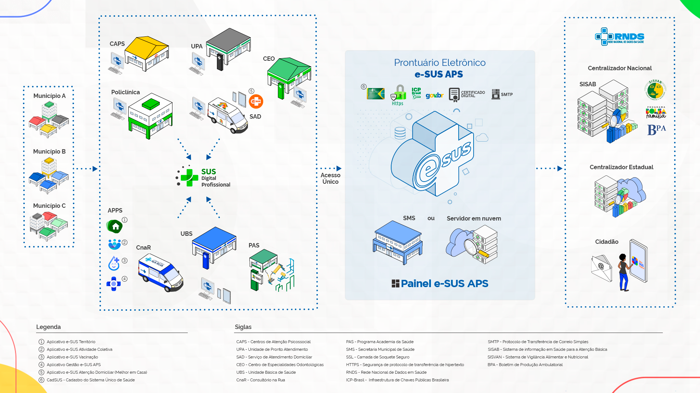

# Visão Geral da Estratégia e-SUS APS
{: .no_toc }

<head>
    
</head>

Após 11 anos, a **Estratégia e-SUS APS** transformou o cenário de informatização e conectividade das Unidades Básicas de Saúde (UBS) no Brasil. Com avanços significativos, o **Prontuário Eletrônico e-SUS APS** já está implementado em mais de 4 mil municípios brasileiros, consolidando-se como um pilar essencial na gestão do cuidado da Atenção Primária à Saúde (APS).

O Prontuário Eletrônico e-SUS APS pode alcançar seu máximo potencial ao ser implementado de maneira estratégica e integrada. Essa evolução requer um modelo de implantação robusto, centralizado em uma única instalação, capaz de otimizar os recursos avançados do sistema, fortalecer a infraestrutura tecnológica e assegurar a qualidade e a integridade dos dados, promovendo maior eficiência e integração em toda a Rede de Atenção à Saúde.

Neste sentido, é possível considerar uma perspectiva de estágio mais avançado a partir do acesso em tempo real e simultâneo a toda a rede de APS e serviços especializados, de acordo com a conformação municipal, regional ou estadual da Rede de Atenção à Saúde, bem como a arquitetura de infraestrutura adequada ao número de acessos simultâneos de usuários ao Prontuário Eletrônico e-SUS APS, além da garantia de boa performance e conexão de internet estável. Também é efetivado o envio de dados ao Centralizador Nacional/SISAB e Centralizador Estadual, quando aplicável, diariamente.

{: .nota }
Para garantir um acesso seguro à instalação, o protocolo HTTPS deve estar habilitado. 

O envio direto de registros à Rede Nacional de Dados em Saúde (RNDS) ocorre em tempo real, mediante a habilitação do certificado digital na instalação. O **login gov.br** deve estar habilitado e a sincronização com o CADSUS precisa estar ativa. Para garantir o envio de e-mails relacionados a agendamentos, prescrição digital de medicamentos e atestados digitais, o servidor SMTP deve estar habilitado.

Como protocolo de segurança, recomenda-se a realização de backup diário e automático do banco de dados da instalação, devidamente ativo e configurado. Toda essa arquitetura deve ser gerenciada por uma equipe de Tecnologias Digitais de Informação e Comunicação capacitada para garantir a estabilidade, integridade, segurança, otimização e eficiência do ecossistema.

As estações de trabalho são adequadas e disponíveis para todos os profissionais que atuam no âmbito do cuidado e para a equipe de recepção. Os aplicativos, especialmente o e-SUS Território, são amplamente utilizados pelos Agentes Comunitários de Saúde (ACS) e Agentes de Combate às Endemias (ACE), sendo realizada a sincronização diária com a instalação do Prontuário Eletrônico do e-SUS APS.

Os profissionais de saúde devem utilizar o SUS Digital Profissional para acesso ao histórico clínico do cidadão a partir das informações existentes na RNDS. Já o cidadão acessa informações sobre seus registros de vacinação, atendimentos, atestados e prescrições digitais pelo aplicativo Meu SUS Digital.

