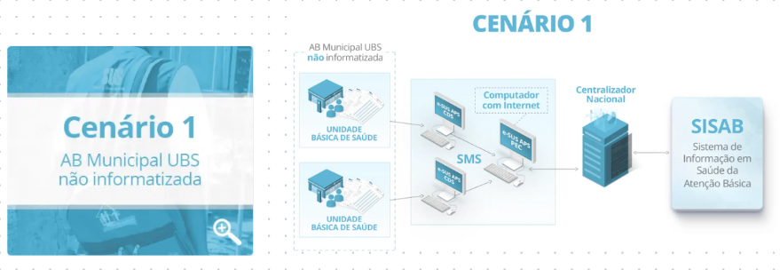
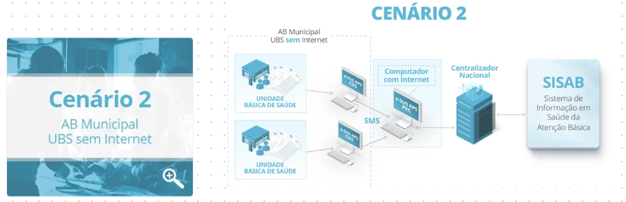
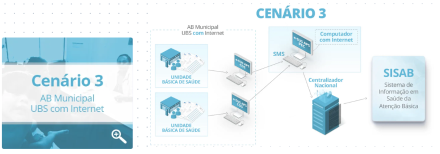
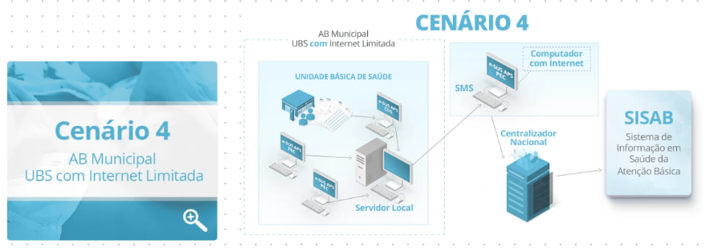
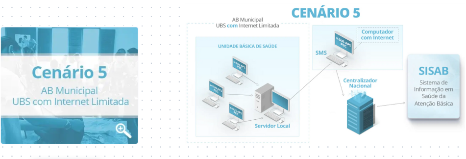
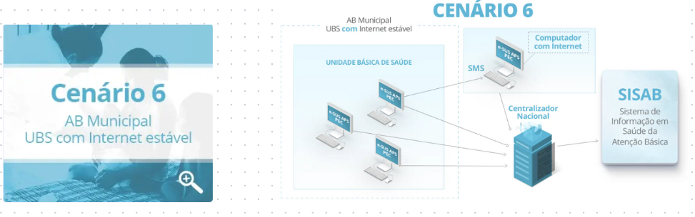
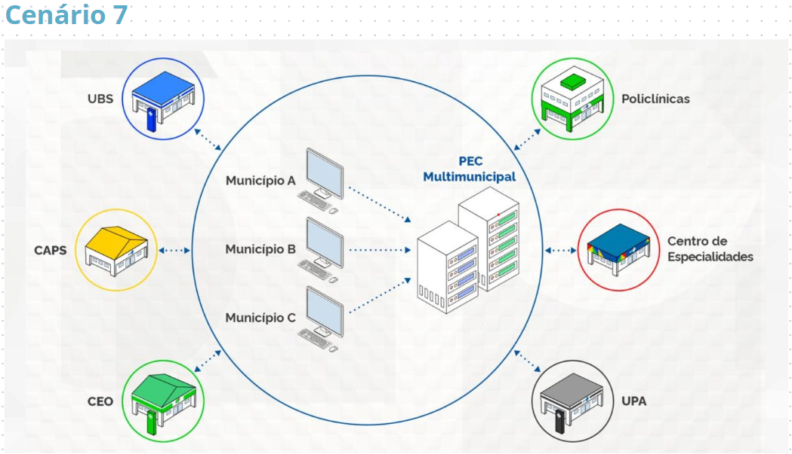

# Cenários de Implantação:
{: .no_toc }

Antes de efetivamente realizar a implantação do Prontuário Eletrônico do Cidadão (PEC) em ambiente de produção, deve-se primeiramente, realizar o mapeamento do ambiente, identificar necessidades e de acordo com o cenário proposto, implementar ajustes técnicos de acordo com as especificidades de cada Cenário.

Sete, são os possíveis cenários de implantação, que poderão assumir a forma **Centralizada** ou **Descentralizada**, dentro do município:

**Cenário 1: UBS não informatizada** 

Neste Cenário, o município dispõe de baixa infraestrutura, problemas de conectividade e/ou energia elétrica, realizando a transcrição de suas produções em fichas de papel (CDS), para posterior registro no PEC ou CDS da Secretaria de Saúde do Município.

Importante ressaltar que este cenário encontra-se em desuso, estando presente em apenas 309, dos 5.568 municípios do Brasil.

Orienta-se a adoção deste modelo, apenas quando o município não dispor de equipamentos de informática, conectividade e/ou infraestrutura necessária na unidade básica de saúde (UBS), para operacionalização do sistema!

**Cenário 2: UBS sem internet** 

Nesta modalidade, as UBSs dispõe de computadores para o registro das produções, entretanto, não possuem conectividade de internet para o envio dos dados à Base Nacional. 

Os registros poderão ocorrer normalmente no CDS ou PEC offline e após geração do arquivo .RAS, as produções serem importadas no PEC da Secretaria Municipal de Saúde (SMS).

**Cenário 3: UBS com internet** 

No cenário 3, existem computadores e internet disponível para operacionalização do PEC e o envio das produções diretamente à Base Nacional. Podendo sua transmissão ocorrer de forma autônoma e independente, sem qualquer envolvimento da SMS.

**Cenário 4: UBS com internet limitada** 

Ambiente com internet limitada, entretanto, com potencial de transmissão dos dados para a base federal.

**Cenário 5: UBS com internet limitada** 

Ambiente com internet limitada, entretanto, com potencial de transmissão dos dados para a base federal.

**Cenário 6: UBS com internet estável** 

Instalação PEC transmitindo dados diretamente para o Centralizador Nacional e/ou Unidades Básicas de Sáude (UBSs) fazendo interface com instalação única do PEC no município, para utilização da ferramenta de forma centralizada.

**Cenário 7: Cenário Multimunicipal do PEC e-SUS APS** 

No Cenário 7, tem-se a implementação do Conceito de PEC Multimunicipal. Nesta modalidade, uma única instalação do Prontuário Eletrônico do Cidadão (PEC), é concebida para utilização por dois ou mais municípios que a utilizam de forma compartilhada para o registro das produções e acesso ao prontuário clínico do cidadão.

