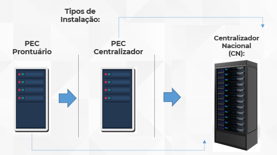
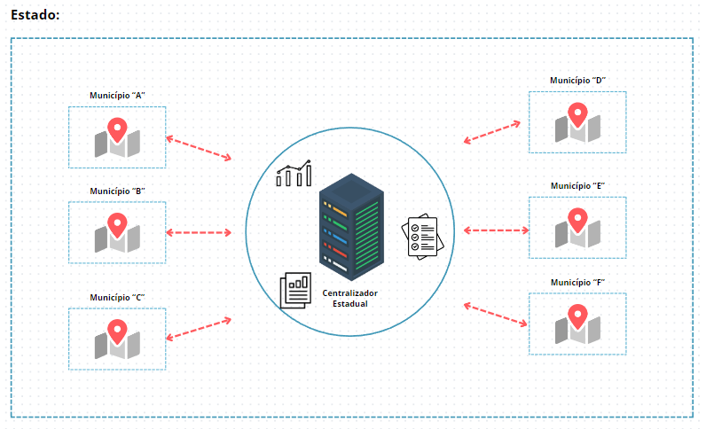
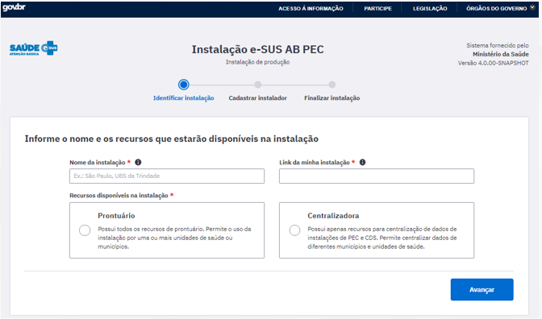
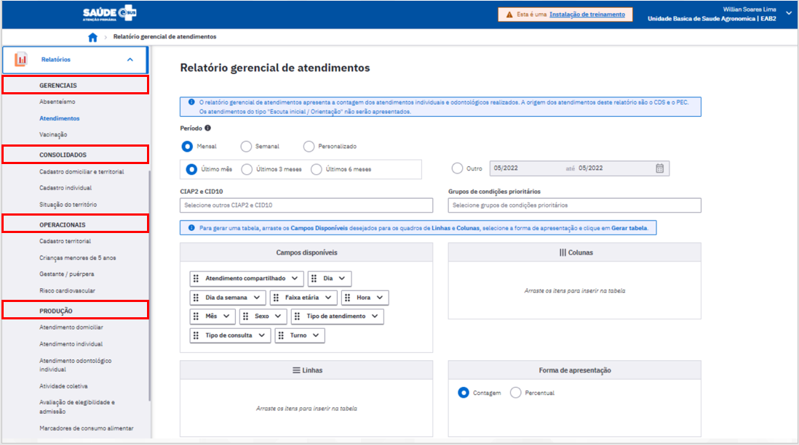

# Centralizadores Estaduais:
{: .no_toc }

Importante destacar que existem dois tipos de instalação do Prontuário Eletrônico do Cidadão (PEC), conforme ilustração abaixo:

### Instalação Prontuário:

A instalação Prontuário Eletrônico do Cidadão pode ser utilizada em servidor nas UBS ou a partir de um servidor único no Município funcionando como a instância única de prontuário no ambiente municipal. Possibilita a importação de dados de outros sistemas, como o CDS, e os transmite para outros pontos, entre eles, por padrão, ao SISAB;

As principais funcionalidades do PEC - Prontuário são:

* Módulo administração;
* Módulo cidadão;
* Agenda;
* Módulo atendimento;
* Módulo CDS;
* Relatórios.

O Sistema e-SUS APS com PEC ainda apresenta a função de centralizador de informações, que permite importar ou digitar informações do Sistema com CDS, de forma que estejam integradas aos relatórios do sistema, bem como possam ser transmitidas ao SISAB.

### Instalação Centralizador:

O tipo de instalação centralizador tem a função de reunir os dados de transmissão das instalações PEC e CDS do distrito federal, município, Estado ou região de saúde, fortalecendo uma organização hierárquica no fluxo da informação na esfera distrital/municipal/estadual e da produção de relatórios.

Fluxo do envio dos dados para o Centralizadro Estadual (CE):

<caption><b>Imagem:</b> Fluxo do envio dos dados para o Centralizador Estadual</caption>

 

As principais funcionalidades do centralizador são:

* Enviar dados: configuração de link para envio de dados para a base federal fica como padrão
* Importar CDS/Registro de Atendimento Simplificado (RAS);
* Relatórios: com dados compatíveis ao usuário gestor, onde as informações ficam agregadas desde a equipe até o consolidado municipal.

### Modalidades de instalação:

A partir da consolidação do Centralizador Estadual, será possível ter uma visão geral da APS do estado, a partir dos relatórios disponíveis no Prontuário Eletrônico do Cidadão (PEC):

### Benefícios da adoção de um Centralizador Estadual (CE):

* Tomada de decisão
* Ações Estratégicas direcionadas
* Melhor Planejamento
* Economia de tempo
* Redução de gastos financeiros
* Ações assertivas 
* Acesso rápido as informações
* Atuar no foco do problema
* Economia de tempo
* Redução de gastos
* Agilidade nas ações
* Aumento da eficiência e eficácia

