# Criando gratuitamente um certificado SSL e habilitando o protocolo HTTPS no e-SUS APS em servidores Windows
{: .no_toc }

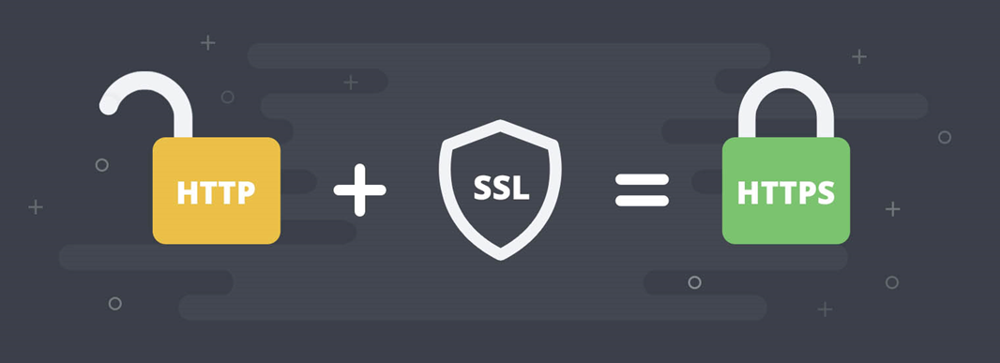
Fonte: Imagem da internet

## Etapa 1 - Introdução ao certificado SSL e requisitos para habilitação do protocolo HTTPS na Instalação do e-SUS APS 

Um certificado SSL é um certificado digital que autentica a identidade de um site e permite uma conexão criptografada. SSL significa Secure Sockets Layer, um protocolo de segurança que cria um link criptografado entre um servidor web e um navegador web. 

Caso o município já possua um certificado SSL em formato P12 ou JKS, compatível com o e-SUS APS, pule para a **Etapa 6 - Parametrizando o certificado SSL na aplicação do e-SUS APS**. 

Neste artigo, apresentaremos o passo a passo para inclusão de um certificado SSL no e-SUS APS em servidores Windows e garantir ainda mais segurança no acesso à sua instalação. **É válido ressaltar que este processo não emite certificados para endereços IP simples, apenas nomes de domínio,** e os passos abaixo de geração de certificado através do **Let’s Encrypt/Certbot** e **OpenSSL** são apenas sugestões, podendo o município utilizar a certificadora que desejar para geração. 

Assim sendo, para que possamos gerar um certificado SSL através do próprio Let’s Encrypt/Certbot, precisamos nos atentar aos seguintes requisitos obrigatórios: 

- Sistema operacional Windows 10 (ou superior) ou Windows Server 2019 (versão 1709 ou superior) na sua instalação do e-SUS APS; 

- Sua Instalação do e-SUS APS já deve possuir **IP público** para acesso externo; 

- Deve ser disponibilizado um domínio apontando para o IP público de acesso à sua Instalação do e-SUS APS, sem indicar nenhuma porta, somente o IP. Se o seu município já tem o domínio próprio, basta solicitar que seja criado o subdomínio para sua Instalação. Exemplo que será utilizado nesse tutorial: **esus.municipio.uf.gov.br**; 

- Assim como está a porta **8080** configurada, as portas de entrada **80** e **443** também devem ser liberadas pelo provedor. Também é necessário que estar mesmas portas sejam redirecionadas no roteador de borda para o IP na rede local da sua Instalação do e-SUS APS; 

- Verifique se o acesso remoto à administração do seu roteador está ativado, pois em muitos roteadores, esse acesso se dá pela porta padrão 80, dando assim conflito durante o processo de geração do certificado na Etapa 3 deste tutorial, que utiliza esta mesma porta. Recomenda-se que a porta de acesso remoto do roteador seja alterada (desde que não seja as opções 8080 e 443) ou o acesso seja desativado se não for possível alterá-la. 
 

## Etapa 2 – Preparando o ambiente para habilitação do protocolo HTTPS 

Inicialmente, é necessário realizar este processo de configuração em um horário que não haja profissionais utilizando o e-SUS APS, pois será necessário reiniciar algumas vezes o serviço do sistema e, após conclusão, o novo endereço de acesso se tornará o domínio do servidor antecedido do padrão HTTPS, exemplo https://esus.municipio.uf.gov.br.

1º Passo: iniciaremos todo o processo habilitando as portas de entrada 80 e 443 no Windows. Para isso, procure pelo termo “firewall” no menu Iniciar e selecione o ícone a seguir: 


2º Passo: no menu esquerdo, seleciona e opção “Regras de entrada” e clique em “Nova Regra...”. 

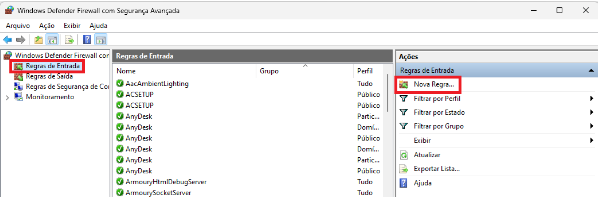

3º Passo: habilite a porta “80” para entrada, utilizando os seguintes parâmetros: 

- Em “Tipo de Regra”, marcar a opção “Porta” e clique em AVANÇAR. 

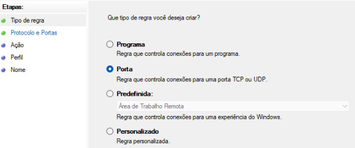

- Em “Protocolos e Porta”, marcar a opção “TCP” e abaixo definir em “Portas locais específicas” a porta “80” e clique em AVANÇAR. 

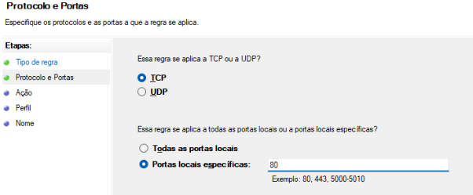

- Em ”Ação”, marcar a opção ”Permitir a conexão” e clique em AVANÇAR. 

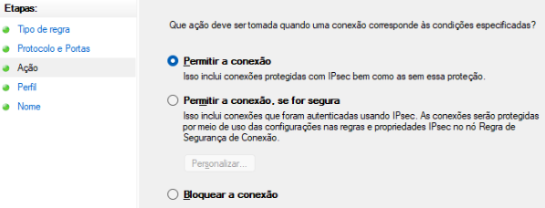

- Em “Perfil”, selecione todos os tipos possíveis e clique em AVANÇAR. 

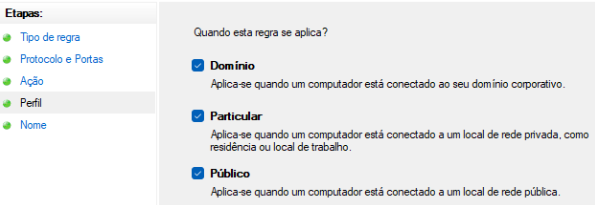

- Em “Nome”, digite “esus80” e clique em CONCLUIR. 

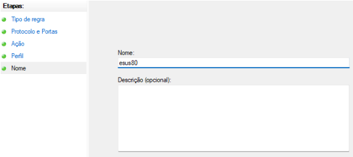

4º Passo: **ATENÇÃO**, faça o mesmo processo do 2º e 3º passo desta etapa, habilitando agora a porta “443” para entrada. 

5º Passo: altere a porta de acesso da Instalação do e-SUS APS para porta padrão do protocolo HTTPS, que é a 443. Para isso, procure o “Bloco de notas” do Windows no menu Iniciar, clique com o botão direito no ícone, e abra-o “Executando como administrador”. 

6º Passo: localize e abra o arquivo "application.properties" no diretório "C:\Program Files\e-SUS\webserver\config" (caminho padrão no Windows). 

7º Passo: insira a seguinte linha ao fim do conteúdo e salve o arquivo: 

`server.port=443`

Exemplo: 

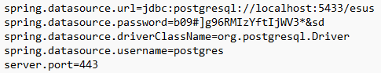

8º Passo: após a inclusão, é necessário que o serviço "e-SUS-PEC" seja reiniciado, conforme imagem abaixo, nos Serviços do Windows e, a partir deste momento, as unidades não mais conseguirão acessar a Instalação do e-SUS pela porta 8080, como antes.


9º Passo: após reinício do serviço e aguardando o tempo de inicialização, que dependendo das configurações da sua instalação pode demorar alguns minutos, verifique se a instalação já pode ser acessada, digitando no navegador o caminho “localhost:443”. Se sua Instalação foi acessada, a porta 443 está devidamente configurada. 

> Observação: Se surgir uma mensagem indicando que seu site é inseguro ou "Sua conexão não é particular" conforme imagem abaixo. Clique em "Avançado" e logo em seguida, "Ir para http://localhost:443 (não seguro)". 

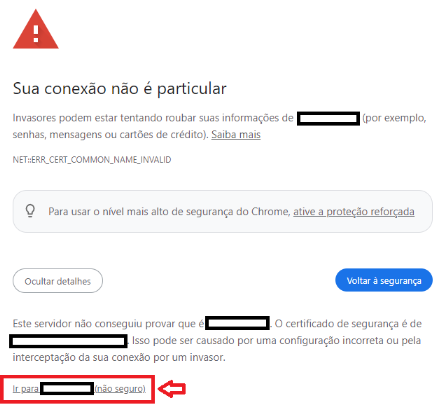

10º Passo: acesse agora a sua Instalação, em um outro computador fora da rede local da Instalação, para testar se a porta 443 está corretamente configurada, da seguinte maneira “SEU-IP-PUBLICO:443”. Se a mesma mensagem acima surgir, faça o mesmo processo para acessar sua Instalação. 

> Observação: Se aqui houver algum problema, entre em contato com seu provedor ou referência técnica da rede local para que seja conferido o processo de liberação e configuração de portas no roteador. Até que o problema de acesso pela porta 443 seja resolvido, indica-se que seja apagada a linha "server.port=443" inserida anteriormente no arquivo "application.properties" e se reinicie o serviço “e-SUS-PEC" para que a instalação volte a ficar acessível pela porta 8080, evitando assim prejuízos quanto ao registro das unidades.  
 

## Etapa 3 - Instalando o Certbot e criando o certificado PEM  

A iniciativa Let’s Encrypt, com seu programa Certbot, é uma autoridade certificadora gratuita que fornece certificados digitais necessários para habilitar HTTPS em serviços web.   

1º Passo: baixe aqui o Certbot para Windows: https://certbot.eff.org/instructions?ws=other&os=windows

> Link direto do download: https://github.com/certbot/certbot/releases/latest/download/certbot-beta-installer-win_amd64_signed.exe

2º Passo: instale o programa, de preferência, no diretório “C:\Certbot”. 

3º Passo: no menu Iniciar, procure e abra o “Certbot” pelo seu ícone:  


4º Passo: digite o comando abaixo e tecle ENTER:  

`certbot certonly --standalone`

5º Passo: será solicitado que seja informado um e-mail do responsável técnico pelo certificado. Digite o e-mail e tecle ENTER. 

6º Passo: será também solicitado o aceite de dois termos do Certbot, basta digitar Y (para YES) e teclar ENTER em cada um deles.  

7º Passo: será solicitado o domínio que foi criado anteriormente e que já está devidamente apontado para o IP público da sua Instalação. Digite este domínio e tecle ENTER (exemplo: esus.municipio.uf.gov.br). 

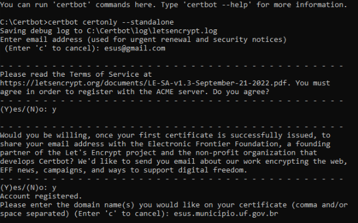

Nesse momento, em caso de sucesso, a mensagem “Successfully received certificate” aparecerá, indicando que seu certificado foi corretamente criado no diretório "C:\Certbot\Live\esus.municipio.uf.gov.br". 

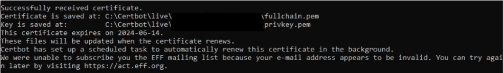

> Atenção: Em caso de qualquer outra mensagem de erro neste passo, provavelmente relacionado a porta 80 não estar devidamente configurada, que é a porta padrão do Certbot para geração do certificado, você poderá reiniciar o processo a partir do 4º Passo e realizar o seguinte comando, gerando o certificado pela porta 8080 e assim dar andamento no processo:  

`certbot certonly --standalone --http-01-port 8080` 

> Observação: os certificados no formato PEM criados pelo Certbot tem duração de 90 dias, porém, o próprio Certbot cria uma tarefa automática no Windows para realizar sua renovação em tempo oportuno, mas, para que isso ocorra, a porta pela qual o certificado foi gerado deve permanecer devidamente configurada, conforme já explicado anteriormente. 

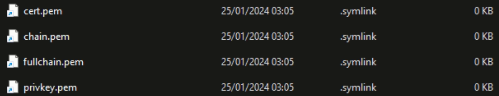


## Etapa 4 - Instalando o OpenSSL e criando o certificado P12 

O Certbot gera certificados SSL no formato PEM, que não são reconhecidos para parametrização no e-SUS APS. Assim sendo, trazemos o OpenSSL como alternativa, outro sistema gratuito, que converte certificados no formato P12 a partir do PEM, formato este que será permitido para parametrização. 

1º Passo: baixe o OpenSSL para Windows, obrigatoriamente na versão 1.1, Win64 executável (EXE): [DOWNLOAD](../../Win64OpenSSL-1_1_1w.exe)

2º Passo: instale o OpenSSL, de preferência, no diretório “C:\OpenSSL”. 

3º Passo: abra o diretório de instalação do OpenSSL, “C:\OpenSSL”, e aqui vamos criar um arquivo ".bat".  

> Observação: arquivo com a extensão ".bat" é um arquivo de lote (batch file) usado principalmente no sistema operacional Windows. Ele contém um conjunto de comandos que são executados sequencialmente quando o arquivo é aberto ou quando é chamado através do prompt de comando do Windows.  

4º Passo: dentro do diretório do OpenSSL, “C:\OpenSSL”, crie um bloco de notas e salve-o como "certificado.bat", e no seu conteúdo os seguintes comandos: 

```
@echo off
certbot renew
C:\OpenSSL
@set PATH=%PATH%;%~dp0bin
cd C:\Certbot\live\esus.municipio.uf.gov.br
openssl pkcs12 -export -in fullchain.pem -inkey privkey.pem -out "C:\Program Files\e-SUS\webserver\config\esusaps.p12" -name esus -CAfile chain.pcdem -caname esus -passout pass:SUA-SENHA-PARA-O-CERTIFICADO
cd C:\Windows\System32
net.exe stop "e-SUS-PEC"
net.exe start "e-SUS-PEC"
```

Observações importantes:  
- Atenção, pois qualquer caractere equivocado ou espaço deixado no fim de cada linha pode fazer com que seu .bat não seja executado corretamente. 
- Confira e edite o caminho completo do seu certificado PEM gerado na pasta do Certbot. Exemplo: **C:\Certbot\live\esus.municipio.uf.gov.br**
- Edite onde há **SUA-SENHA-PARA-O-CERTIFICADO**, crie uma senha para seu certificado e anote-a para a próxima etapa de parametrização na instalação. Qualquer tipo de caractere poderá ser utilizado. 

5º Passo: após criação do "certificado.bat", clique no arquivo com o botão direito e execute-o como administrador. Aguarde o tempo necessário para que a sua instalação inicie o serviço, pois o comando criado já realiza o reinício da aplicação automaticamente. 

6º Passo: verifique se o arquivo "esusaps.p12" foi criado no diretório "C:\Program Files\e-SUS\webserver\config". 

 > Observação: se o arquivo foi criado, o processo foi concluído com êxito. Se não foi criado ou o serviço "e-SUS-PEC" não se mantem em execução, verifique se os passos desta etapa foram rigorosamente seguidos.  


## Etapa 5 - Automatizando a renovação dos certificados PEM e P12 

1º Passo: no menu Iniciar, procure e abra o "Agendador de Tarefas" do Windows e crie uma tarefa básica com o nome "Certificado HTTPS" e clique em AVANÇAR. 

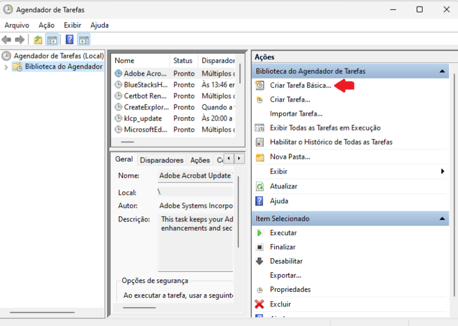

2º Passo: escolha como disparador de tarefa a opção "Mensalmente", clique em AVANÇAR e configure os seguintes parâmetros: 

- Iniciar na data atual, com horário a sua escolha, de preferência no período noturno onde não há usuários utilizando o e-SUS APS. 

- Em "Meses", escolha todos os meses do ano. 

- Em "Dias", selecione o dia correspondente ao dia que você gerou o certificado PEM pelo Certbot. Exemplo: se o certificado foi gerado no dia 10/01/2024, selecione o dia “10”. 

3º Passo: Selecione a opção "Iniciar um programa" e clique em AVANÇAR. 

4º Passo:  em PROCURAR, encontre o arquivo "certificado.bat" criado, selecione-o e clique em AVANÇAR. Seguindo este tutorial, ele tem seu caminho em "C:\OpenSSL\certificado.bat". 

5º Passo: selecione a opção "Abrir a caixa Propriedades da tarefa depois de clicar em Concluir" e clique em CONCLUIR. 

6º Passo: na tela de Propriedades, selecione a opção "Executar estando o usuário conectado ou não", selecione também a opção "Executar com privilégios mais altos" e clique em OK. Observação: Neste momento, se sua conta de usuário do Windows possui senha, será necessário confirmar esta senha para concluir o processo. 

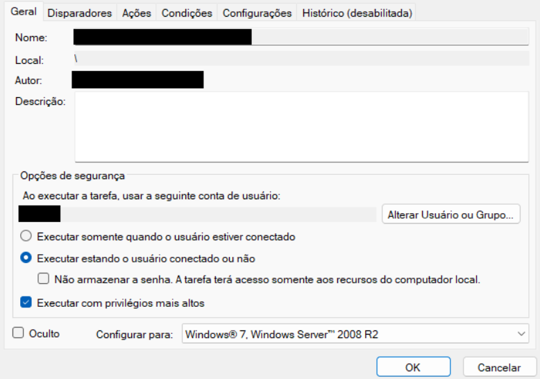

7º Passo: por fim, clique com o botão direito na tarefa criada e selecione a opção "Executar" para criar seu certificado P12 no diretório "C:\Program Files\e-SUS\webserver\config" com o nome "esusaps.p12". Abra esse diretório e confira se o arquivo foi criado com data e horário que você executou a tarefa para conferir se a automatização do processo foi concluída com êxito.  

> Observação: se por alguma razão os certificados vencerem e sua Instalação não se tornar acessível corretamente pelo protocolo HTTPS, como será observado na próxima etapa, volte ao “Agendador de Tarefas” do Windows e execute esta tarefa criada para renová-lo manualmente. 
  

## Etapa 6 - Parametrizando o certificado SSL na aplicação do e-SUS APS 

1º Passo: procure o “Bloco de notas” do Windows no menu Iniciar, clique com o botão direito no ícone, e abra-o “Executando como administrador”. 

2º Passo: localize e abra o arquivo "application.properties" no diretório "C:\Program Files\e-SUS\webserver\config". 

3º Passo: insira as seguintes linhas no fim do conteúdo do arquivo: 

```
security.require-ssl=true
server.ssl.key-store-type=PKCS12
server.ssl.key-store=config/esusaps.p12
server.ssl.key-store-password=SUA-SENHA-PARA-O-CERTIFICADO
server.ssl.key-alias=esus
```

5º Passo: onde há no comando “SUA-SENHA-PARA-O-CERTIFICADO", substitua pela senha criada no 4º passo da **Etapa 4 - Instalando o OpenSSL e criando o certificado P12** e salve as alterações do arquivo. 

> Explicação de cada propriedade:  
> - **security.require-ssl**: Propriedade que indica ao Spring se desejamos fazer uso do protocolo SSL. 
> - **server.ssl.key-store-type**: Indica o tipo de certificado. Caso o tipo seja “.p12” (como neste tutorial), é necessário manter esta propriedade e após o = indicar que é PKCS12. Mas, se o tipo for JKS, essa propriedade pode ser omitida. 
> - **server.ssl.key-store**: Este é o caminho relativo ao “.jar” da aplicação (pec-bundle.jar) de onde se encontra o certificado. Por exemplo, se estiver na pasta "config" como sugerido nas etapas anteriores, utilizar: server.ssl.key-store=config/esusaps.p12 
> - **server.ssl.key-store-password**: Senha indicada no momento da criação do certificado P12 pelo OpenSSL. 
> - **server.ssl.key-alias**: “Apelido” indicado no momento da criação do certificado. 

6º Passo: reinicie o serviço "e-SUS-PEC" nos serviços do Windows e aguarde reinicialização da aplicação. 

7º Passo: se o processo foi concluído com sucesso, sua Instalação do e-SUS APS já está com o protocolo HTTPS configurado, podendo ser acessada, a partir de agora, pelo domínio configurado (exemplo: https://esus.municipio.uf.gov.br), observando-se no navegador as características de um site seguro, conforme imagens abaixo: 


> Observação: Se a Instalação não está sendo acessada, verifique se o serviço "e-SUS-PEC" está se mantendo em execução. Se o serviço não se mantenha ativo, reveja se o processo dessa etapa foi seguido na sua integridade. 

8º Passo: é muito comum que, após a habilitação do protocolo HTTPS, o município não consiga alterar o “Link da Instalação” e nem consiga acessar o e-SUS APS pelo domínio no próprio servidor da Instalação ou em sua rede local, conseguindo acessar somente com o endereço https://localhost (no próprio servidor da instalação) e https://IP-LOCAL-DO-SERVIDOR (exemplo: https://192.168.1.13) nos computadores da mesma rede.  Assim sendo, apresentamos a seguinte solução. 

8º Passo-A (para ser realizado no servidor da Instalação do e-SUS APS): procure o “Bloco de notas” do Windows no menu Iniciar, clique com o botão direito no ícone, e abra-o “Executando como administrador”. 

Localize e abra o arquivo "hosts" no diretório " C:\Windows\System32\drivers\etc" 

No fim do conteúdo do arquivo, adicione a seguinte linha e salve o arquivo: 

`127.0.0.1  esus.municipio.uf.gov.br`

> Observação: onde há **esus.municipio.uf.gov.br**, substitua pelo seu domínio da Instalação sem o https:// como prefixo. 

Exemplo:
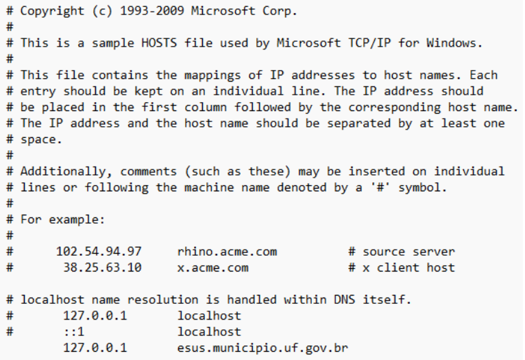

Assim você já poderá alterar o “Link da Instalação” no servidor da Instalação e acessar o domínio neste mesmo computador. 

8º Passo-B (para ser realizado em cada computador da mesma rede local da Instalação do e-SUS APS): procure o “Bloco de notas” do Windows no menu Iniciar, clique com o botão direito no ícone, e abra-o “Executando como administrador” 

Localize e abra o arquivo "hosts" no diretório “C:\Windows\System32\drivers\etc" 

No fim do conteúdo do arquivo, adicione a seguinte linha e salve o arquivo: 

`IP-LOCAL-DO-SERVIDOR	esus.municipio.uf.gov.br` 

> Observação: onde há **IP-LOCAL-DO-SERVIDOR** substitua pelo endereço de IP local, ou de rede, do seu servidor da Instalação (não é o IP público); onde há **esus.municipio.uf.gov.br**, substitua pelo seu domínio da Instalação sem o https:// como prefixo.

Exemplo:
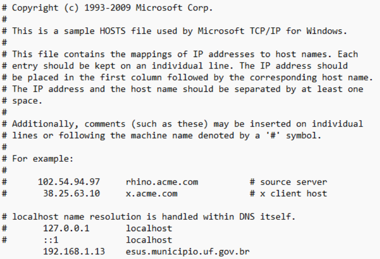

Assim você já poderá acessar o e-SUS APS pelo domínio com HTTPS nos computadores da mesma rede do servidor. 

> Observação: para as unidades que acessam a Instalação do e-SUS APS externamente à rede local do servidor, nenhuma ação de configurações do arquivo “hosts” é necessária. 

9º Passo: faça login no e-SUS APS com o acesso do Administrador da Instalação, vá em “Configurações da Instalação”, aba “Servidores” e altere o “Link da instalação” para o seu novo domínio com HTTPS.  

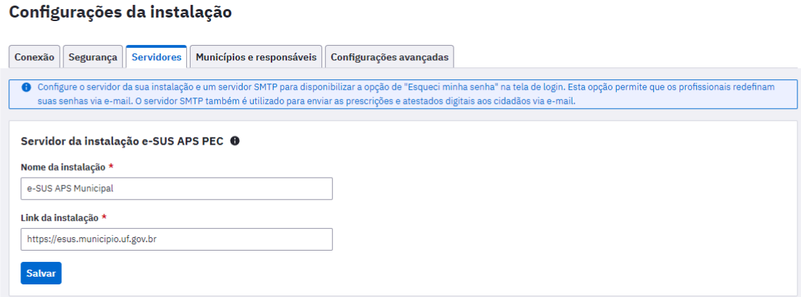

10º e último passo: 

Informe o novo link de acesso da sua Instalação à todas as suas unidades que utilizam o e-SUS APS e reconfigure todos os aplicativos da estratégia e-SUS APS em celulares e tablets com este novo link para sincronização (e-SUS Território, e-SUS AD, e-SUS Atividade Coletiva, e-SUS Vacinação, Gestão e-SUS APS).   

> Importante: após a habilitação do protocolo HTTPS, por motivos padrão de segurança do Android, é importante ressaltar que apenas os aplicativos da estratégia e-SUS APS instalados em Android versão 5.0 ou superior conseguirão realizar sincronização com a Instalação. 

**FIM** 

1ª versão. Atualizado em 26 de março de 2024. 