# Fluxo de geração do certificado digital no e-Gestor AB para o e-SUS APS:

<video width="800" height="520" controls="controls" poster="capa_RNDS.png">
  <source src="https://saps-ms.github.io/Manual-eSUS_APS/certificado.mp4" type="video/mp4">
</video>

<a href="https://saps-ms.github.io/Manual-eSUS_APS/infografico.pdf">Download Infográfico</a>

 

# Geração do certificado digital no e-GESTOR AB:

Este instrutivo visa orientar os gestores e técnicos responsáveis pela Estratégia e-SUS APS a habilitarem o Certificado Digital no e-SUS APS para envio de registros e acesso a RNDS via SUS Digital Profissional e também habilitar a primeira etapa para ativação da interoperabilidade com o CADSUS no módulo de cadastro do Cidadão.

Vale ressaltar que para habilitar por completo a interoperabilidade entre o e-SUS APS e o CADSUS, após este processo, é necessário ativar o acesso via HTTPS a Instalação do PEC e também o método de login via gov.br, com tutoriais presentes nessa sessão de manual (Apoio a Implantação).

### Municípios que NÃO possuem certificado digital A1

Quando o município ou Distrito Federal que utilizam o PEC não possuir certificado digital do tipo A1, o **Administrador Municipal** da instalação PEC deverá seguir os seguintes passos:

1º\) Acessar o ambiente restrito do portal [e-Gestor Atenção Básica](https://egestorab.saude.gov.br/paginas/login.xhtml/) com Login e Senha do **gestor municipal**;

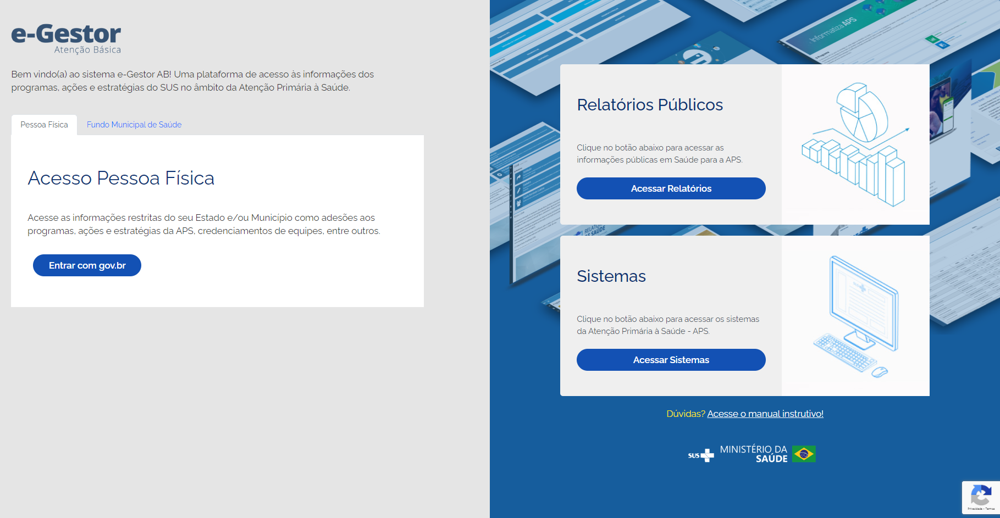

2º) No perfil **Gestor da Atenção Básica**, vá em **Gerencias Usuários**;

3º) No nome do **Gestor da Atenção Básica** ou da **Referência Técnica do e-SUS APS**, vá em **Adicionar perfil**;

4º) Em **Perfis de acesso**, selecione o programa **Implantação e-SUS APS** e o perfil de acesso **Gestor do Programa Municial**

5º\) Agora, faremos login novamente na área restrita do e-Gestor AB, mas com o acesso do Fundo Municipal de Saúde, com CNPJ e senha.

6º) Selecione o perfil "TOKEN PARA IMPLANTAÇÃO e-SUS APS";

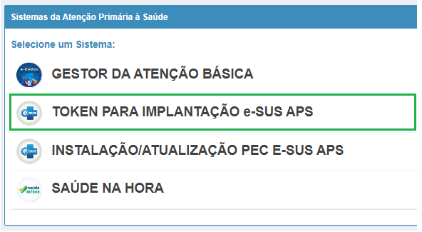

7º\) Preencha o Formulário (Figura 3.12.3) com os dados do usuário responsável pela geração do token (CPF e Nome) e selecione o Estabelecimento de saúde onde o token será utilizado para autenticação, em seguida clique em "Gerar Token". Todos os tokens gerados serão exibidos na aba "Tokens gerados".

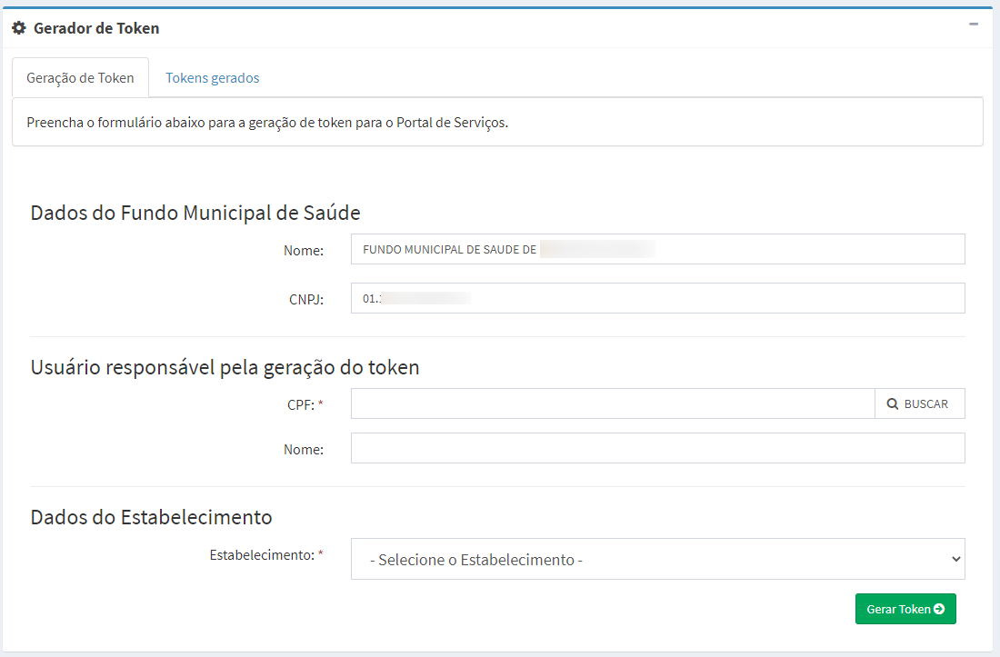

{: .atencao }
[**ATENÇÃO**] A validade do token é até às 23:59h do dia de sua geração. Após esse período é automaticamente desativado, não sendo mais possível utilizá-lo.

{: .nota }
O responsável (CPF) por gerar o token no e-Gestor AB deverá ser o mesmo a realizar a solicitação de credenciamento no e-GESTOR AB.

8º\) Após obter o **Token** copie a **Contra Chave** no sistema e-SUS APS com PEC no módulo "Gestão Municipal" na aba "Configuração RNDS, conforme a figura 3.11.4.

9º\) De posse do **token** gerado no sistema e-Gestor AB e a **Contra Chave** copiada no sistema e-SUS APS com PEC, proceda na solicitação de credenciamento no e-GESTOR AB, para obter permissão de acesso a RNDS e APROVAÇÃO para produção. 

10º\) Após realizar o credenciamento faça o download do certificado gerado.

### Municípios que POSSUEM certificado digital A1

O município ou Distrito Federal que possua certificado digital A1 também deverá gerar o token no e-Gestor AB e copiar a Contra Chave do PEC para preehimento dos campos abaixo:

{: .atencao }
[**ATENÇÃO**] Não carregue o 'certificado .cer'. O tipo de arquivo gerado não é compatível com o sistema.

### Realizando solicitação de credenciamento no e-GESTOR AB:

Ao logar no e-GESTOR AB com o perfil de gestor municipal, selecione o programa Implantação e-SUS APS:

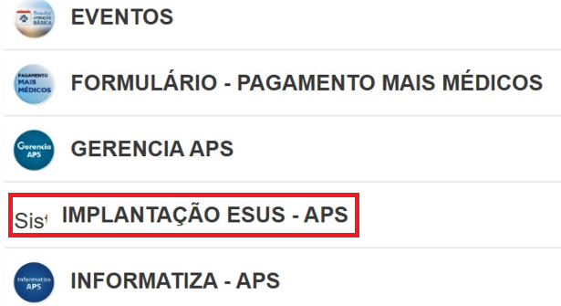

Na tela seguinte, serão exibidas informações diversas relativas as credenciais geradas, termo de uso, certificado disponível e solicitação de nova credencial, conforme pode ser visto na imgem abaixo:

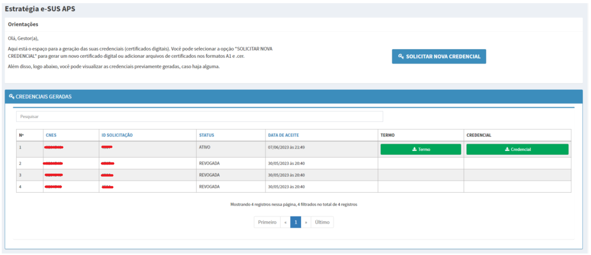

Clicando em  será solicitado ao integrador, informar o token e contra-chave para seguimento no processo de credenciamento:

Após validação dos dados na tela acima, será apresentado ao solicitante o formulário de credenciamento abaixo:

Na área de Certificado Digital, caso tenha um certificado próprio, importe-o conforme a extensão .CER ou .PFX. Caso não tenha um certificado próprio, clique em gerar certificado e cadaste uma senha:

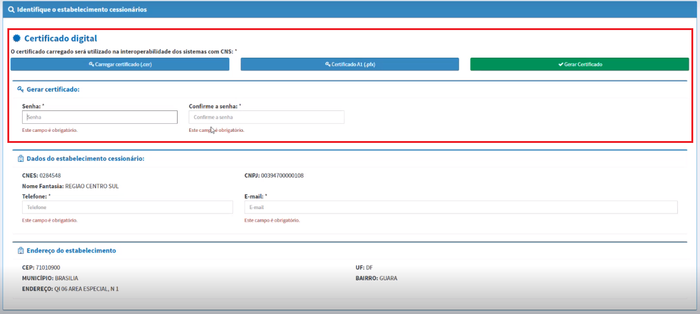

Siga com o preenchimento dos dados do formulário, informando o telefone de contato e e-mail da gestão responsável.

Em "Indique um estabelecimento filho", informe os estabelecimentos que ficarão vinculados ao CNES pai:

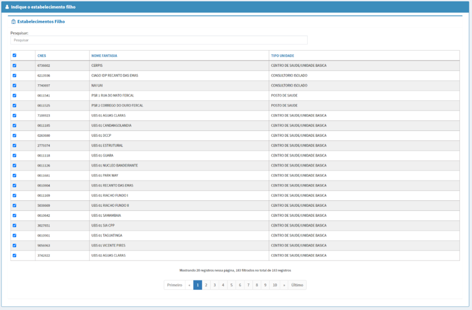

Depois indique os dados do gestor responsável:

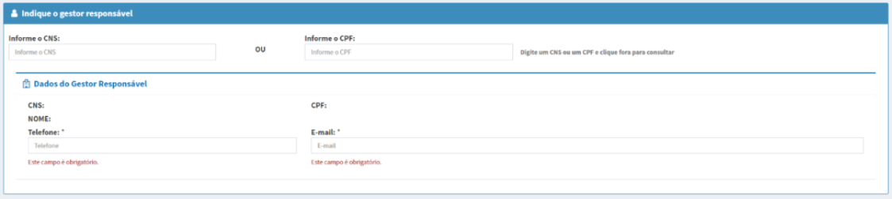

E as informações do sistema solicitante:

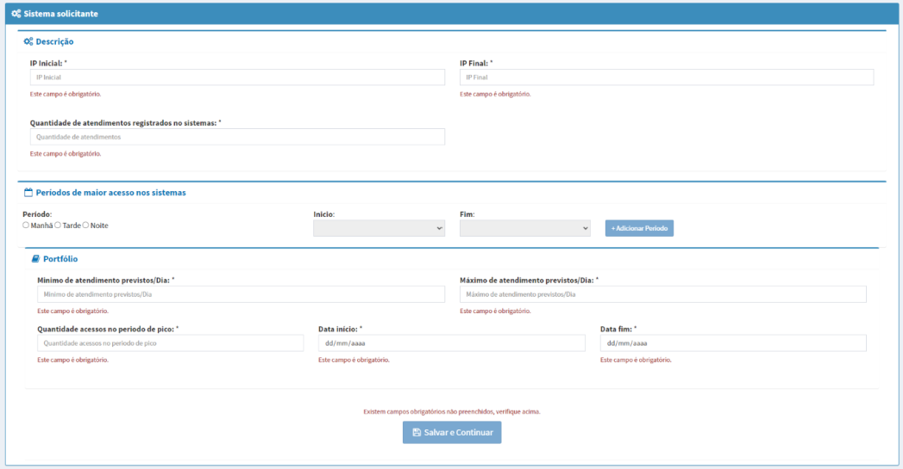

Ao clicar em 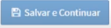 será exibida a tela de aceite dos termos de uso, conforme pode ser visto abaixo:

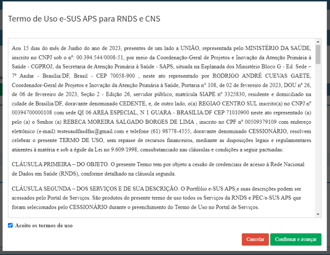

Ao clicar em "Confirmar e avançar", será realizada a conclusão de solicitação de credenciamento no e-GESTOR AB e o integrador estará formalmente apto para integração a RNDS via e-SUS APS PEC. 

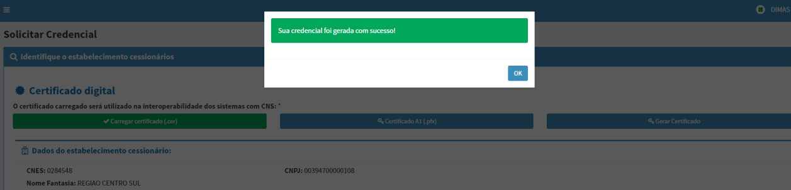

Na tela de credenciais geradas, será possível ter acesso ao ID do solicitante e ao certificado que deverá ser informado no PEC.

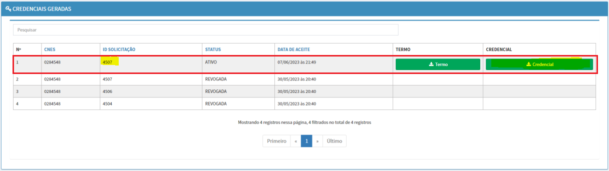
