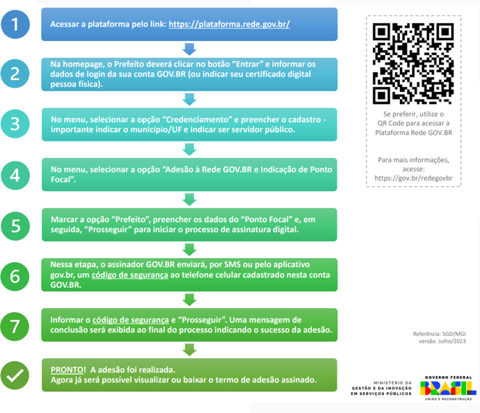
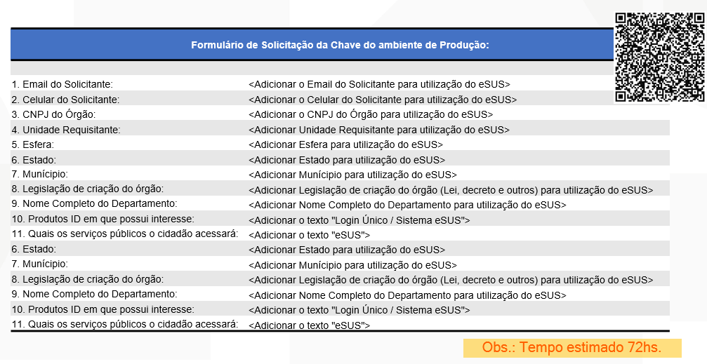
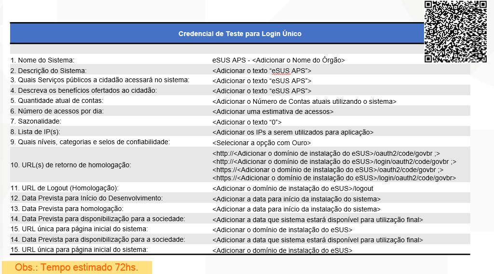
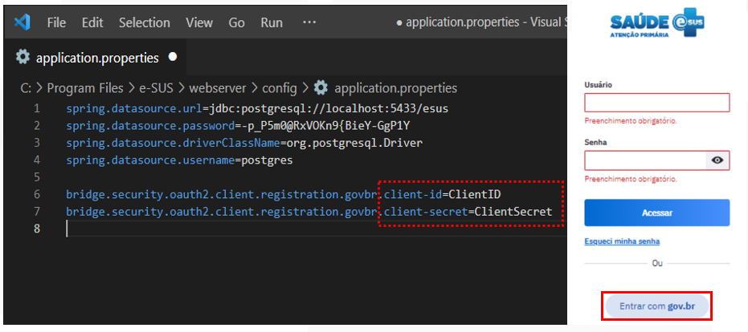

# Fluxo para solicitação de Adesão ao GOV.BR:

Caso seu município não faça parte da Rede GOV.BR ainda, o prefeito precisará realizar a adesão através da Plataforma Rede GOV.BR, seguindo os passos abaixo:

O profissional responsável deverá preencher o formulároi de login único:

Realizar a credencial de teste para login único:

Após o município ser liberado pelo gov.br para utilização da funcionalidade, você precisará habilitar o botão para login na tela inicial do sistema. Você receberá um "ClientID" e um "ClientSecret", que devem ser inseridos no arquivo de configuração da instalação do PEC, chamado de "application.properties".

Diretório: e-SUS\webserver\config\

