Geração do Certificado TLS (SSL) e habilitação do protocolo HTTPS de forma automatizada pelo PEC e-SUS APS:

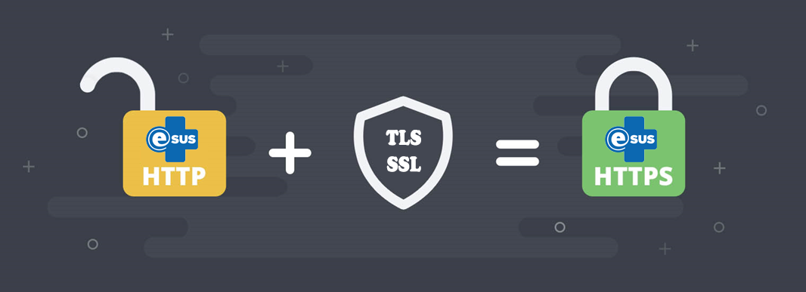

A geração e renovação do Certificado TLS (SSL) / HTTPS no PEC se tornou bem mais fácil, sendo agora gerenciado pela própria aplicação de maneira totalmente automatizada. 

A partir da versão X do PEC e-SUS APS, o próprio instalador do sistema questionará se você deseja utilizar/gerar um certificado TLS (SSL) na sua instalação e, para isso, você precisará fornecer apenas o domínio e a porta que o PEC utilizará para este protocolo.

Você sabia? Um certificado TLS/SSL é um arquivo digital usado para autenticar a identidade de um site ou serviço na internet e criptografar a comunicação entre o navegador do usuário e o servidor web. TLS (Transport Layer Security) é o sucessor do SSL (Secure Sockets Layer), mas ambos são frequentemente referidos de maneira combinada, visto que o SSL é um protocolo mais antigo e menos seguro que o TLS. Em resumo, um certificado TLS/SSL desempenha um papel fundamental na segurança da comunicação na internet, protegendo a privacidade dos usuários e garantindo que eles estejam se comunicando com sites legítimos e confiáveis.

ATENÇÃO

▪ A Instalação que já possui Certificado TLS (SSL) gerado e HTTPS habilitado por outros métodos (Certbot, ZeroSSL, etc) poderá sem nenhum problema utilizar a nova funcionalidade automatizada do PEC e-SUS APS, desde que observados os requisitos obrigatórios para a funcionalidade, que serão detalhados na sequência. Para estas Instalações, é possível que este tutorial seja seguido a partir da Etapa 2;
▪ Uma vez realizado o processo de geração do Certificado TLS (SSL) e habilitação do HTTPS pela Instalação/Atualização do PEC e-SUS APS, não será necessária qualquer outra configuração para a renovação do certificado, pois todo o processo é automatizado (geração e renovação);
▪ Este processo não é necessário para quem já possui um proxy/apache/nginx com HTTPS parametrizado.

Assim sendo, precisamos destacar quais são os requisitos obrigatórios para que esta funcionalidade seja aplicada no sistema.

**REQUISITOS OBRIGATÓRIOS:**

▪ Sua Instalação do PEC e-SUS APS já deve possuir IP público para acesso externo;

▪ Deve ser disponibilizado um domínio apontando para o IP público de acesso à sua Instalação do e-SUS APS, sem indicar nenhuma porta, somente o IP. Se o seu município já tem o domínio próprio, basta solicitar aos responsáveis por este domínio gov.br que seja criado o subdomínio para sua Instalação. Exemplo que será utilizado nesse tutorial: esus.municipio.uf.gov.br. Destaca-se que, posteriormente, caso o município tenha interesse em realizar a habilitação do login gov.br no e-SUS APS (Tutorial: [LINK](https://saps-ms.github.io/Manual-eSUS_APS/docs/Apoio%20a%20Implanta%C3%A7%C3%A3o/Login_GOV.BR/)), conforme a [Portaria SGD/MGI Nº 7.076, de 2 de outubro de 2024](http://www.in.gov.br/web/dou/-/portaria-sgd/mgi-n-7.076-de-2-de-outubro-de-2024-588863325), em seu Art. 3º, “para realizar a solicitação de integração à Conta gov.br …, é imprescindível que o sistema a ser integrado esteja hospedado em um domínio oficial de governo”, ou seja, domínios com final “GOV.BR”. Desta forma, apenas solicitações de integração que atendam essa premissa receberão chaves de produção para conclusão da integração. Vale destacar que a mesma Portaria, em seu Parágrafo Único, alerta que “os órgãos que não estiverem em conformidade com o disposto …, terão o prazo de um ano, a partir da publicação desta Portaria, para se adequarem, sob pena de revogação das credenciais de acesso.”;

▪ Assim como está a porta 8080 configurada, as portas de entrada 80 e 443 também devem ser liberadas pelo provedor. Também é necessário que estas mesmas portas sejam redirecionadas no roteador de borda para o IP na rede local da sua instalação do PEC e-SUS APS;

▪ Verifique se o acesso remoto à administração do seu roteador está ativado, pois em muitos roteadores, esse acesso se dá pela porta padrão 80, dando assim conflito durante o processo de geração do certificado, que utiliza esta mesma porta. Recomenda-se que a porta de acesso remoto do roteador seja alterada (desde que não seja as opções 8080, 80 ou 443) ou o acesso seja desativado se não for possível alterá-la;

▪ De forma geral, é necessário que as portas 80 e 443 estejam livres, sem outras aplicações utilizando-as, para que então seja possível a geração do certificado.

**Etapa 1 – Liberando portas de acesso no firewall do sistema operacional**

**Sistema operacional WINDOWS:**

▪ Procure pelo termo “firewall” no menu Iniciar e selecione o ícone a seguir:

▪ No menu esquerdo, seleciona e opção “Regras de entrada” e clique em “Nova Regra…”.

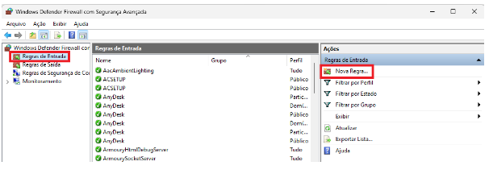

▪ Habilite a porta “80” e “443” para entrada, utilizando os seguintes parâmetros:

▪ Em “Tipo de Regra”, marcar a opção “Porta” e clique em AVANÇAR.

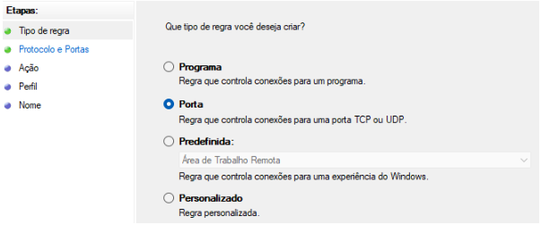

▪ Em “Protocolos e Porta”, marcar a opção “TCP” e abaixo definir em “Portas locais específicas” digite “80,443” e clique em AVANÇAR.

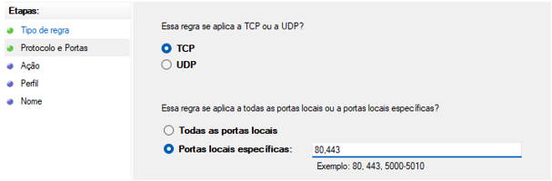

▪ Em ”Ação”, marcar a opção ”Permitir a conexão” e clique em AVANÇAR.

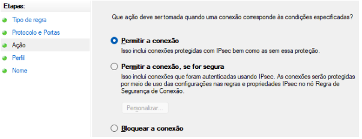

▪ Em “Perfil”, selecione todos os tipos possíveis e clique em AVANÇAR.

▪ Em “Nome”, digite “esusaps” e clique em CONCLUIR.

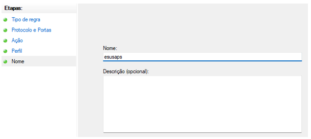

**Sistema operacional LINUX**

**Execute os comandos abaixo no terminal:**

sudo iptables -A INPUT -p tcp --dport 80 -j ACCEPT
sudo iptables -A INPUT -p tcp --dport 443 -j ACCEPT

É importante ressaltar que o iptables é uma das ferramentas possíveis, mas pode variar dependendo da distribuição Linux e do gerenciador de firewall usado (como ufw para sistemas baseados em Ubuntu). Certifique-se de adaptar os comandos conforme necessário para o seu ambiente específico.

**Etapa 2 – Gerando o Certificado TSL (SSL) e habilitando o acesso HTTPS no PEC e-SUS APS**

▪ Instalação/Atualização em Windows ou Linux com modo gráfico:

A partir da versão 5.3.4, durante a Instalação/Atualização do sistema PEC e-SUS APS, após a etapa de realização do backup do banco de dados, o sistema apresentará a seguinte tela caso a aplicação não reconheça já ter o processo automatizado configurado anteriormente pela aplicação de Instalação/Atualização do sistema PEC e-SUS APS.

**Observação:** caso não seja desejado utilizar o certificado do PEC e-SUS APS ou a instalação já tem seu certificado próprio que se deseja ser mantido, basta clicar em “Não” durante a Instalação/Atualização e dar sequência normalmente no processo.

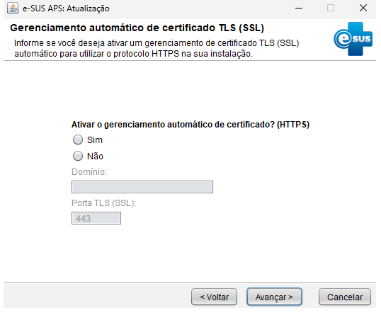

Para ativar o gerenciamento automático do certificado, ou seja, gerar o Certificado TLS (SSL) e habilitar o HTTPS no PEC e-SUS APS:

▪ Marque “Sim”
▪ Informe o domínio de acesso à sua Instalação do PEC (exemplo: esus.municipio.uf.gov.br)
▪ Informe a porta de acesso ao protocolo HTTPS da sua Instalação do PEC (padrão: 443)
▪ Clique em “Avançar”

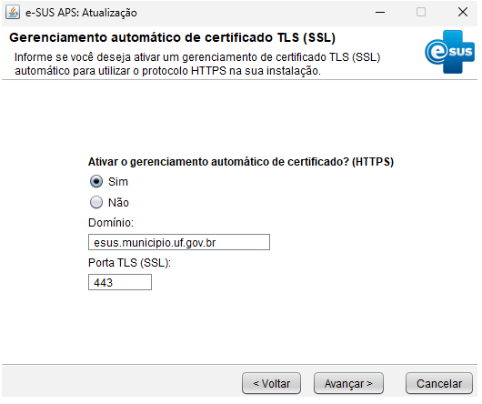

**Aguarde a validação das informações e conclusão do processo.**

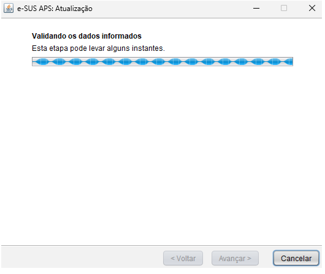

Se o processo for corretamente validado, a aplicação dará andamento às próximas etapas comuns da Instalação/Atualização do sistema.

Em caso de erro, a seguinte mensagem surgirá na tela:

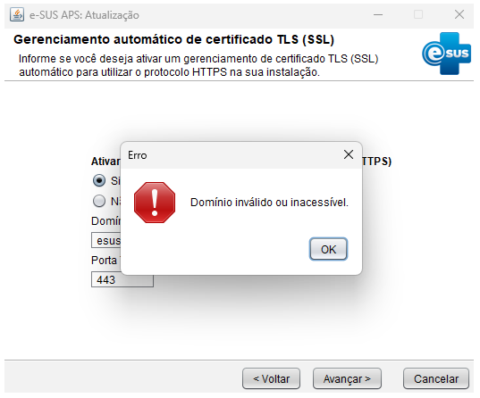

Nestes casos, verifique se os requisitos obrigatórios para esta funcionalidade foram corretamente seguidos e corrija o que for necessário para assim realizar nova tentativa.

Após o término da Instalação/Atualização da versão, a tela final será assim apresentada, informando a URL de acesso à Instalação do PEC:

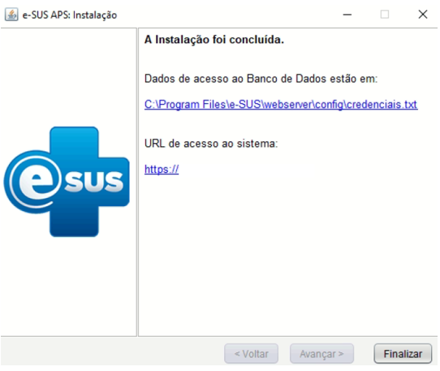

▪ Instalação/Atualização sem modo gráfico (via terminal - linha de comando)

O processo é equivalente, neste caso, ao invés de executarmos o instalador do PEC, realizaremos o processo adotando alguns parâmetros durante a Instalação/Atualização da aplicação, neste caso, utilize a seguinte linha de comando:

java -jar eSUS-AB-PEC-VERSAO-SO64.jar -console -cert-domain=esus.municipio.uf.gov.br -url="jdbc:postgresql://localhost:5433/esus" -username="postgres" -password="exemplo123456"

Atenção para realizar as substituições corretas na linha de comando nos dados em vermelho:

▪ VERSAO = trocar pela versão de acordo com o arquivo de Instalação/Atualização
▪ SO = sistema operacional da instalação (opções de comando: Win ou Linux)
▪ esus.municipio.uf.gov.br = informar o domínio de acesso ao PEC
▪ 5433 = porta padrão de acesso ao banco de dados do PEC (verificar no arquivo “credenciais”, se necessário)
▪ esus = nome do banco de dados padrão do PEC (verificar no arquivo “credenciais”, se necessário)
▪ postgres = usuário padrão do banco de dados do PEC (verificar no arquivo “credenciais”, se necessário)

▪ exemplo123456 = informar a senha do usuário “postgres” presente no arquivo “credenciais”

Observação: note que foi inserido um parâmetro novo: "-cert-domain", porém, ainda é possível inserir o parâmetro "-cert-port", neste caso, para especificar a porta. Quando não informado, ele utilizará a porta 443 que é indicada como padrão. Após isso, basta prosseguir com a Instalação/Atualização.

▪ Teste de conexão segura

Com o processo concluído, sua Instalação do PEC e-SUS APS já está com o protocolo HTTPS configurado, podendo ser acessada, a partir de agora, pelo domínio configurado sem a necessidade de indicar a porta 443 ao fim do domínio (exemplo: https://esus.municipio.uf.gov.br).

Observe no navegador as características de uma conexão segura, conforme imagem abaixo:

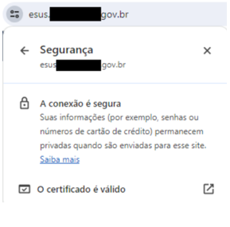

▪ Verificação do “Link da Instalação”

Com o HTTPS devidamente habilitado, verifique se o “Link da Instalação” foi alterado, apresentando agora o novo link de acesso à Instalação do PEC informado durante e Instalação/Atualização do PEC e-SUS APS. Para isso, faça login no PEC e-SUS APS com o acesso do Administrador da Instalação, vá em “Configurações da Instalação”, aba “Servidores” e verifique o campo “Link da instalação”.

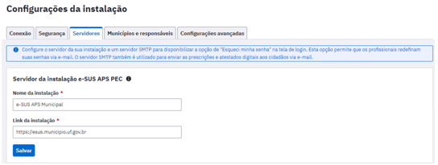

Se o “Link da Instalação” não foi alterado, informe o domínio completo de acesso à instalação do PEC e clique em "Salvar”.

**Observação:** em caso de não ser possível alterar o “Link da Instalação”, realize a “Etapa extra” ao fim deste tutorial.

▪ Disseminação do novo link de acesso ao PEC e-SUS APS

Informe o novo link de acesso da sua Instalação à todas as suas unidades que utilizam o PEC e-SUS APS e reconfigure todos os aplicativos da estratégia e-SUS APS com este novo link do servidor para sincronização (e-SUS Território, e-SUS AD, e-SUS Atividade Coletiva, e-SUS Vacinação, Gestão e-SUS APS).

**ATENÇÃO:** Após a habilitação do protocolo HTTPS, por motivos de compatibilidade entre o sistema operacional Android e o Certificado TLS (SSL), é importante ressaltar que apenas os aplicativos da estratégia e-SUS APS instalados em Android versão 7.1.2 ou superior conseguirão realizar sincronização com a Instalação.

**Etapa extra - Configuração do arquivo “hosts”**

É muito comum que, por motivos de configuração de rede/provedor, após a habilitação do protocolo HTTPS, o município não consiga alterar o “Link da Instalação” do servidor e nem consiga acessar o PEC e-SUS APS, pelo domínio, no próprio servidor da Instalação ou em sua rede local, conseguindo acessar somente com o endereço https://localhost (no próprio servidor da instalação) e https://IP-LOCAL-DO-SERVIDOR (exemplo: https://192.168.1.13) nos computadores da mesma rede. Assim sendo, apresentamos a seguinte solução.

**ATENÇÃO:** Para as unidades que acessam a Instalação do PEC e-SUS APS externamente à rede local do servidor, nenhuma ação de configurações do arquivo “hosts” é necessária.

**WINDOWS:**

Procure o “Bloco de notas” do Windows no menu Iniciar, clique com o botão direito no ícone, e abra-o “Executando como administrador”.

Localize e abra o arquivo “hosts” no diretório “C:\Windows\System32\drivers\etc”

**LINUX:**

**Abra o terminal e digite a seguinte linha de comando:**

sudo nano /etc/hosts

PROCEDIMENTO A SER REALIZADO NO SERVIDOR DA INSTALAÇÃO DO PEC e-SUS APS

No fim do conteúdo do arquivo, adicione a seguinte linha e salve o arquivo:

127.0.0.1	esus.municipio.uf.gov.br

**NOTA:** Onde há esus.municipio.uf.gov.br, substitua pelo seu domínio da Instalação sem o https:// como prefixo.

PROCEDIMENTO A SER REALIZADO EM CADA COMPUTADOR DA MESMA REDE LOCAL DA INSTALAÇÃO DO PEC e-SUS APS

No fim do conteúdo do arquivo, adicione a seguinte linha e salve o arquivo:

IP-LOCAL-DO-SERVIDOR		esus.municipio.uf.gov.br

**NOTA:** Onde há IP-LOCAL-DO-SERVIDOR substitua pelo endereço de IP local, ou de rede, do seu servidor da Instalação (não é o IP público); onde há esus.municipio.uf.gov.br, substitua pelo seu domínio da Instalação sem o https:// como prefixo.

Como remover a parametrização do HTTPS ou trocar o domínio configurado automaticamente pelo PEC e-SUS APS?

**WINDOWS:**

Localize no diretório a seguir e exclua o arquivo “ssl.properties”:

“C:\Program Files\e-SUS\webserver\certmgr\config”

**LINUX:**

Localize no diretório a seguir e exclua o arquivo “ssl.properties”:

“/opt/e-SUS/webserver/certmgr/config”

**ATENÇÃO:** no caso de necessidade de alteração de domínio de acesso ao PEC e-SUS APS, o processo é o mesmo. Após a exclusão do arquivo “ssl.properties”, para parametrizar novamente o Certificado TLS (SSL), basta iniciar o processo de atualização do sistema para realizar as configurações explicadas anteriormente neste tutorial. Assim sendo, recomenda-se realizar a alteração de domínio no momento de realizar nova atualização de versão do PEC e-SUS APS.

**FIM.**

