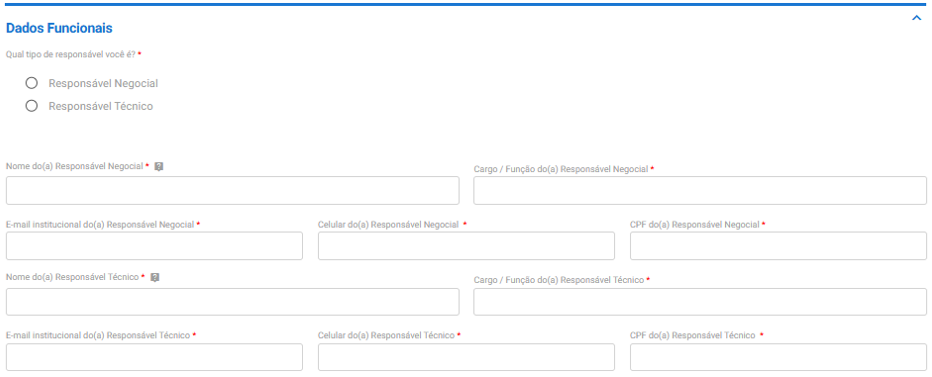
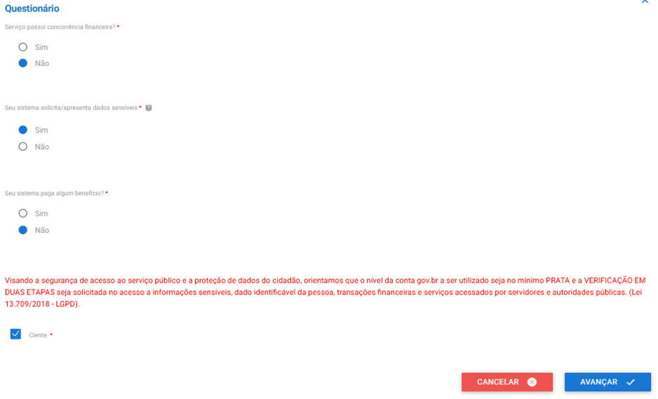
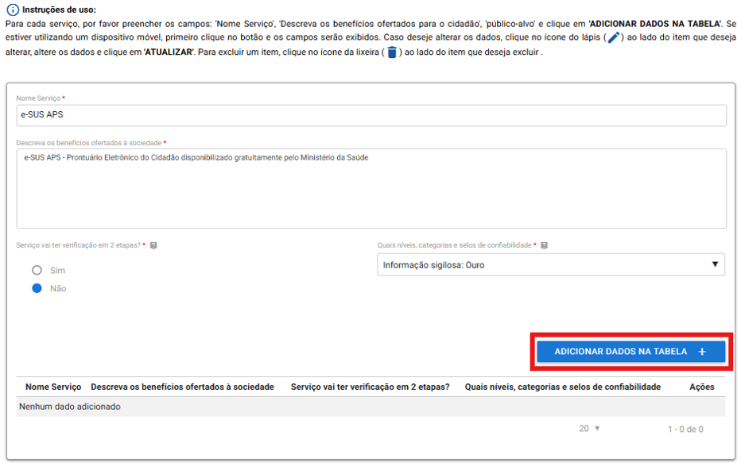
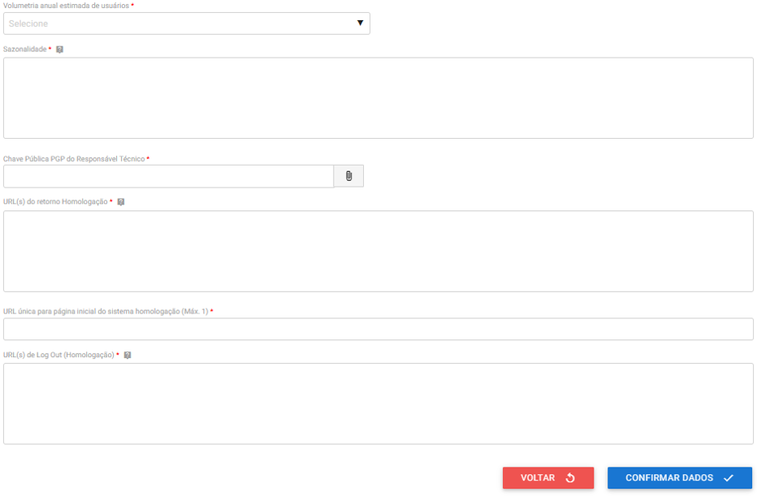
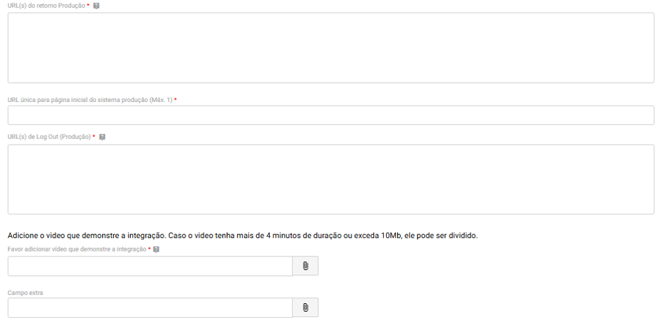
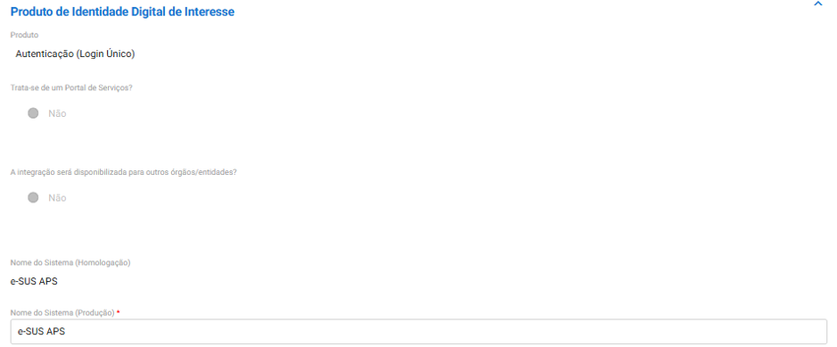

<head>
    <style>
        p{text-align:justify};
    </style>
</head>

# Habilitação do login GOV.BR no PEC e-SUS APS 

{: .nota }
Saiba mais sobre o que é o acesso GOV.BR: [LINK](https://www.gov.br/governodigital/pt-br/identidade/conta-gov-br)


Neste tutorial, explicaremos os passos necessários para habilitação da autenticação via login único GOV.BR no PEC e-SUS APS, que possibilitará a retomada da sincronização do PEC com os servidores do CADSUS (PIX/PDQ), possibilitando assim novas funcionalidades no módulo Cidadão, sendo elas: 

- Cadastrar cidadãos na base local por busca direta na base nacional do CADSUS, evitando retrabalho de digitação de informações e duplicações de cadastro; 

- Ao editar dados cadastrais de um cidadão no PEC e-SUS APS, edita-se também estes dados diretamente no CADSUS, como por exemplo, telefone de contato e endereço; 

- Gerar novo CNS válido diretamente pelo PEC e-SUS APS, como por exemplo para recém-nascidos, sem a necessidade de entrar no CADSUS para esta ação; 

- Durante a edição de um cadastro, será possível sincronizar o cadastro da base local com a base nacional do CADSUS para correção de dados digitados de maneira equivocada antes da integração com o login GOV.BR, como por exemplo, nome e data de nascimento. 

{: .atencao }
Antes de iniciar as etapas deste tutorial, vale destacar que para habilitação da autenticação via login único GOV.BR no PEC e-SUS APS, são obrigatórias duas habilitações anteriores. Verifique se já foram cumpridos os seguintes requisitos na sua Instalação do PEC e-SUS APS: 

**1º - Habilitação do certificado digital do e-Gestor AB com a opção CADSUS ativa**

Tutorial desta habilitação: [LINK](https://saps-ms.github.io/Manual-eSUS_APS/docs/Apoio%20a%20Implanta%C3%A7%C3%A3o/Certificado_eGestor/)


**2º - Acesso ao PEC e-SUS APS por endereço de domínio via protocolo HTTPS**

Tutorial desta habilitação: Servidores WINDOWS: [LINK](https://saps-ms.github.io/Manual-eSUS_APS/docs/Apoio%20a%20Implanta%C3%A7%C3%A3o/Certificado_Https_Windows/) / Servidores LINUX: [LINK](https://saps-ms.github.io/Manual-eSUS_APS/docs/Apoio%20a%20Implanta%C3%A7%C3%A3o/Certificado_Https_Linux/)


{: .atencao }
Conforme a [Portaria SGD/MGI Nº 7.076, de 2 de outubro de 2024](http://www.in.gov.br/web/dou/-/portaria-sgd/mgi-n-7.076-de-2-de-outubro-de-2024-588863325), em seu Art. 3º, "para realizar a solicitação de integração à Conta gov.br ..., é imprescindível que o sistema a ser integrado esteja hospedado em um domínio oficial de governo", ou seja, domínios com final "GOV.BR". Desta forma, apenas solicitações de integração que atendam essa premissa receberão chaves de produção para conclusão da integração. Vale destacar que a mesma Portaria, em seu Parágrafo Único, alerta que "os órgãos que não estiverem em conformidade com o disposto ..., terão o prazo de um ano, a partir da publicação desta Portaria, para se adequarem, sob pena de revogação das credenciais de acesso."

## Etapa 1 - Adesão à Rede Nacional de Governo Digital 

{: .nota }
Saiba o que é a Rede Nacional de Governo Digital: [LINK](https://www.gov.br/governodigital/pt-br/estrategias-e-governanca-digital/rede-nacional-de-governo-digital) 

Inicialmente, verifique se seu município já realizou adesão à Rede Nacional de Governo Digital aqui: [LINK](https://www.gov.br/governodigital/pt-br/estrategias-e-governanca-digital/rede-nacional-de-governo-digital/adesoes-a-rede-nacional-de-governo-digital) 

> Observação: todos os estados já realizaram esta adesão. 

Se seu município já está com a adesão realizada, pule para a próxima etapa deste tutorial: **Etapa 2 - Solicitação da credencial de login único e habilitação do login gov.br no PEC e-SUS APS**. 

Para municípios que não se encontram listados, é necessário que o Prefeito(a) Municipal, como autoridade máxima do Poder Executivo municipal, com seu login GOV.BR, realize esta adesão conforme manual a seguir:


{: .nota }
- No passo 5, o “Ponto Focal” deverá ser um agente público municipal (preferencialmente um servidor público ou cargo comissionado) que atue na gestão da temática de Transformação Digital no município. Este agente público será o ponto de contato entre a Rede Nacional de Governo Digital e o município em caso de contatos futuros. 
- No passo 6, caso haja dificuldade no processo de assinatura digital do termo, veja este tutorial: [LINK](https://bit.ly/AssinaturaDigitalGov). Destacamos que só poderão assinar os usuários com nível de conta GOV.BR prata ou ouro. Para subir o nível da sua conta, veja este tutorial: [LINK](https://bit.ly/44satdh).

Com a adesão realizada, já é possível iniciar imediatamente a realização da próxima etapa. 

## Etapa 2 - Solicitação da credencial de login único e habilitação do login gov.br no PEC e-SUS APS 

Destacamos que todos os passos dos formulários a seguir deverão ser realizadas por um agente público municipal (preferencialmente um servidor público ou cargo comissionado) que atue na gestão da temática de Saúde Digital no município, de preferência a Referência Técnica responsável pela habilitação do login GOV.BR no PEC e-SUS APS. 

### 1ª PARTE

1º Passo: entre no site de solicitação do Serviço de Integração aos Produtos de Identidade Digital GOV.BR: **https://www.gov.br/governodigital/integrarprodutoid** 

2º Passo: clique no botão “Iniciar”; 


3º Passo: faça login com a conta GOV.BR do agente público municipal (preferencialmente um servidor público ou cargo comissionado) que atue na gestão da temática de Saúde Digital no município, de preferência a Referência Técnica responsável pela habilitação do login GOV.BR no PEC e-SUS APS; 

4º Passo: preencha os dados do solicitante e da Secretaria Municipal/Estadual de Saúde em “Dados do Órgão e do Solicitante”; 


> Observação: no campo ”CNPJ do órgão/entidade pública”, deve-se utilizar preferencialmente o CNPJ do município ou do Estado.

5º Passo: preencha dos dados do Responsável Negocial e do Responsável Técnico em “Dados Funcionais”;



> Observações:
- Marque a opção ”Responsável Negocial” se o processo está sendo realizado por um agente público municipal que não seja o Responsável Técnico pela habilitação ou marque a opção “Responsável Técnico” se o processo está sendo realizado pela Referência Técnica responsável pela habilitação; 
- Os números de “matrícula de ligação à administração pública” podem ser adquiridos, geralmente, pelos portais de transparência dos municípios/estados na sessão de servidores ou via contato direto com o setor de Recursos Humanos/Departamento Pessoal da administração local.

6º Passo: preencha o “Questionário” conforme imagem abaixo: 



7º Passo: em “Produto(s) de Identidade Digital de interesse”, preencha conforme imagem abaixo: 


8º Passo: em sequência, preencha os dados a seguir e clique em “adicionar dados na tabela”: 



9º Passo: preencha os campos abaixo conforme indicação: 



> Observações: 
- Em “Lista de IPs dos servidores”, digite o IP público da instalação do e-SUS APS 
- Em “Justificativa de acesso” digite por exemplo: “De acordo com sua categoria profissional, os usuários do e-SUS APS tem acesso a dados pessoais/sensíveis dos cidadãos cadastrados.” 
- Em “Volumetria anual estimada de usuários”, selecione a opção que mais se adeque a sua realidade, estimando a quantidade anual de acessos no sistema pelo login GOV.BR 
- Em Sazonalidade, pode-se preencher “N/A” ou o maior período de acesso ao e-SUS APS pelo login gov.br, como por exemplo “Segunda a sexta-feira, das 7 às 9h e das 13 às 15h.” 

10º Passo: preencha os campos abaixo conforme indicação: 


> Como preencher:

- Em “Chave Pública PGP do Responsável Técnico”, siga este tutorial ([LINK](https://acesso.gov.br/roteiro-tecnico/chavepgp.html#como-criar-um-par-de-chaves-pgp)) na primeira parte “Como criar um par de chaves PGP”, gere a chave com os dados do Responsável Técnico e anexe o arquivo *.asc neste campo. 

- Em “URL”(s) do retorno Homologação”, digite os domínios abaixo, substituindo “SEU-DOMINIO.gov.br” pelo domínio de acesso à sua Instalação do e-SUS APS, exemplo: 
```
https://SEU-DOMINIO.gov.br/login/oauth2/code/govbr
https://SEU-DOMINIO.gov.br/oauth2/code/govbr
```

- Em “URL única para página inicial do sistema Homologação”, digite o domínio de acesso à sua Instalação do e-SUS APS, substituindo “SEU-DOMINIO.gov.br” pelo domínio de acesso à sua Instalação do e-SUS APS exemplo:
```
https://SEU-DOMINIO.gov.br
```

- Em “URL(s) de Log Out (Homologação), digite seu domínio de acesso à sua Instalação do e-SUS APS com /logout ao fim, substituindo “SEU-DOMINIO.gov.br” pelo domínio de acesso à sua Instalação do e-SUS APS exemplo: 
```
https://SEU-DOMINIO.gov.br/logout
```

- Nas três datas previstas ao fim da imagem, estime o tempo da disponibilização do login gov.br para os profissionais que acessar a sua instalação do e-SUS APS, exemplo:  **Início do desenvolvimento**: data atual do preenchimento do formulário / **Homologação**: 10 dias após o preenchimento do formulário / **Disponibilização para a sociedade**: 20 dias após o preenchimento do formulário

11º Passo: aceite os termos e clique em “Enviar solicitação”, aguardando o prazo de até 10 dias úteis para retorno deste primeiro formulário, onde seu processo ficará com o status “(3) Análise/Aprovação”: 


### 2ª PARTE

12º Passo: após conclusão do passo anterior, recomendamos que seja verificado nos próximos dias (pois o processo pode não demorar até 10 dias úteis) se o status do processo foi alterado. Para isso, entre no site de solicitação do Serviço de Integração aos Produtos de Identidade Digital GOV.BR: **https://www.gov.br/governodigital/integrarprodutoid**

13º Passo: clique no botão “Acompanhamento”; 


14º Passo: faça login com a mesma conta GOV.BR que o processo foi iniciado;

15º Passo: se houve alteração do status “(3) Análise/Aprovação” para outro, conforme imagem abaixo, clique em “Responder” para dar andamento no processo. Caso o status não se alterou, favor aguardar e continuar verificando dentro dos 10 dias úteis: 


16º Passo: desça a página e procure pela sessão “Análise do Produto Homologação”:


17º Passo: em "considerações", copie o “client_id” e “secret” informados: 


18º Passo: no servidor da sua Instalação do e-SUS APS, vá no diretório indicado e edite o arquivo “application.properties”: 

- Servidor WINDOWS: C:\Program Files\e-SUS\webserver\config\

- Servidor LINUX: /opt/e-SUS/webserver/config/ 

19º Passo: adicione as seguintes linhas ao fim do arquivo e salve as alterações: 

```
bridge.security.oauth2.client.registration.govbr.client-id=SEU-CLIENT_ID 
bridge.security.oauth2.client.registration.govbr.client-secret=SEU-SECRET
```

> Observação: substituir onde há “SEU-CLIENT_ID” e “SEU-SECRET” pelas informações obtidas no 17º Passo. 

Exemplo:


20º Passo: reinicie o serviço da aplicação do e-SUS APS no servidor: 

- Servidor WINDOWS: no menu Iniciar, procure por “Serviços”, abra o sistema, procure pelo serviço “e-SUS-PEC", clique com o botão direito e vá em “Reiniciar”:


- Servidor LINUX: digite no console o comando: 

```
sudo systemctl restart e-SUS-PEC 
```

21º Passo: após reinicialização do serviço, abra sua Instalação do e-SUS APS em um navegador para observar que o botão do login GOV.BR já estará disponível:

 

22º Passo: volte ao formulário de solicitação do login GOV.BR e procure pelos seguintes campos: 



> Como preencher: 

- Em “URL(s) do retorno Produção”, digite os domínios abaixo, substituindo “SEU-DOMINIO.gov.br” pelo domínio de acesso à sua Instalação do e-SUS APS, exemplo:
```
https://SEU-DOMINIO.gov.br/login/oauth2/code/govbr
https://SEU-DOMINIO.gov.br/oauth2/code/govbr
```

- Em “URL única para página inicial do sistema produção” digite o domínio de acesso da sua instalação do e-SUS APS, substituindo “SEU-DOMINIO.gov.br” pelo domínio de acesso à sua Instalação do e-SUS APS, exemplo:
```
https://SEU-DOMINIO.gov.br
```

- Em “URL(s) de Log Out (Produção)” digite seu domínio de acesso à sua Instalação do e-SUS APS com /logout ao fim, substituindo “SEU-DOMINIO.gov.br” pelo domínio de acesso à sua Instalação do e-SUS APS exemplo:
```
https://SEU-DOMINIO.gov.br/logout
```

- Caso necessário, altere as datas possíveis 

- Anexe um vídeo que demonstre a integração do login GOV.BR à sua Instalação do e-SUS APS seguindo as seguintes instruções:
```
(1) Abra sua Instalação do e-SUS APS no navegador
(2) Clique no botão “Entrar com gov.br”
(3) Faça login no sistema através da conta de qualquer usuário que tenha conta gov.br e acesso ao sistema
(4) Faça logout do sistema (sair da conta de usuário)
```

23º Passo: procure a sessão “Produto(s) de Identidade Digital de interesse” e digite em “Nome do Sistema (Produção): e-SUS APS, conforme imagem abaixo: 



24º Passo: vá ao fim do formulário em “Enviar dados/Dúvidas” e selecione a opção abaixo: 


25º Passo: clique em “Enviar dados de produção” e a integração do login GOV.BR ao e-SUS APS foi concluída com sucesso!:


{: .atencao } 
- A opção de login gov.br funcionará paralelamente ao login convencional do sistema e-SUS APS, sendo possível acessar o sistema pelas duas opções. 

- Caso algum dado de produção foi preenchido de maneira equivocada, você receberá um retorno nos e-mails cadastrados no formulário para correção do problema. 

- Qualquer dúvida sobre este tutorial, abra um ticket em nosso canal de suporte do e-SUS APS: **https://esusaps.freshdesk.com** 

- Se seu processo de solicitação da credencial de login único do GOV.BR paralisou em alguma de suas etapas ou passou-se o prazo de 10 dias úteis e você não obteve retorno nem observou alteração de status no processo, entre em contato pelo seguinte e-mail: **integracaoid@economia.gov.br**, apresentando o número da sua solicitação e explicando detalhes do questionamento para a equipe responsável por este suporte. 

- Para dúvidas técnicas sobre o preenchimento de alguma etapa do formulário que nosso tutorial não contemplou, enviar para o seguinte e-mail: **integracao-acesso-govbr@economia.gov.br**

**FIM** 

4ª versão. Atualizado em 14 de outubro de 2024.