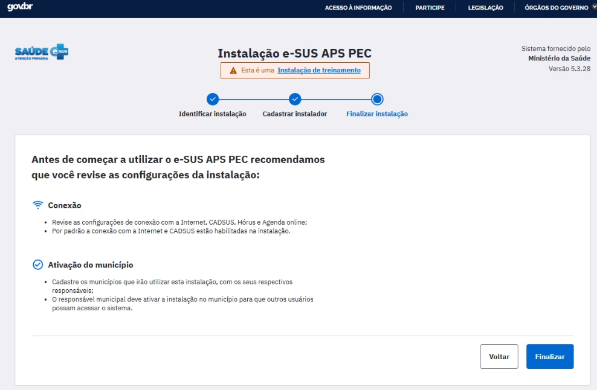
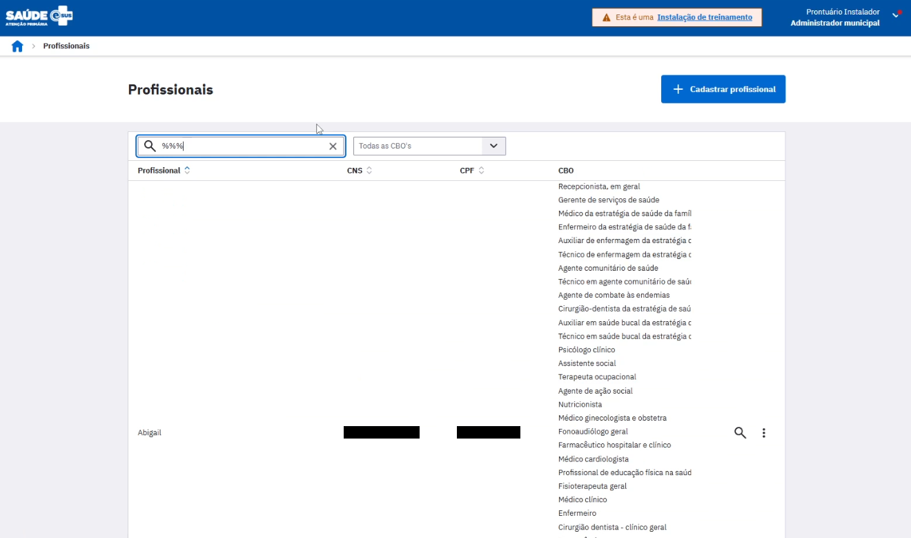

<head>
    
</head>

# **Instalação e configuração do ambiente de Treinamento do PEC e-SUS APS (Windows)**

## 1. Introdução:

Este manual tem como objetivo oferecer suporte a Estados, Municípios e Instituições de Ensino interessadas em utilizar o PEC e-SUS APS como ferramenta de estudo e capacitação.

A instalação de treinamento do PEC e-SUS APS foi desenvolvida para proporcionar um ambiente seguro de simulação, onde profissionais da saúde, gestores, equipes técnicas, professores e estudantes podem explorar as funcionalidades do sistema sem comprometer dados reais. Dessa forma, é possível realizar estudos práticos, treinamentos e testes operacionais, garantindo maior familiaridade com a plataforma antes de sua implementação no dia a dia dos serviços de saúde.

Ao longo deste manual, serão apresentadas as orientações para instalação e configurações iniciais do ambiente, utilizando o arquivo XML fictício disponibilizado pelo Ministério da Saúde, que traz a seguinte uma estrutura:

- 9 unidades de saúde (2 UBS, 1 CAPS, 1 Centro de Especialidades, 1 CEO, 1 CER, 1 Policlínica, 1 Unidade do Serviço de Atenção Domiciliar e 1 UPA);
- 8 equipes de saúde da APS (2 eSF, 1 eAP, 2 eSB, 1 eMulti, 1 eCR, 1 eAPP);
- 2 equipes de saúde do programa Melhor em Casa (1 EMAP, 1 EMAD);
- 40 profissionais, cada um com lotações em todas as unidades e equipes, com diversos perfis, possibilitando o uso de todas as funcionalidades do sistema.

Destaca-se que o XML fictício facilita o processo de configuração e viabiliza que todos possam criar uma instalação de treinamento do PEC e-SUS APS.´

Observação: Qualquer incidente ou dúvida em relação ao processo aqui explicado, abra um chamado no [Canal de Suporte dos sistemas da Estratégia e-SUS APS](http://esusaps.bridge.ufsc.br/).

## 2. Requisitos de ambiente para a instalação:

- Requisitos mínimos de sistema
A instalação de treinamento segue as mesmas premissas da instalação de produção. Assim sendo, indica-se leitura da seção [Apoio à Implantação](https://saps-ms.github.io/Manual-eSUS_APS/docs/Apoio%20a%20Implanta%C3%A7%C3%A3o/Apoio_implantacao/) deste manual para mais informações.

- Java
É necessário instalar previamente a aplicação Java, versão 64 bits, no ambiente. Para download, [clique aqui](https://www.java.com/pt-BR/download/).

- Instalador do PEC e-SUS APS
Para download da versão disponibilizada nacionalmente, [clique aqui](https://sisaps.saude.gov.br/esus/). Vale destacar que a versão treinamento é a mesma versão de produção.

- XML fictício
Para download da última versão do arquivo, [clique aqui]().

## 3. Processo de instalação

Após checagem de requisitos mínimos do ambiente e instalação do Java 64 bits, conforme indicado, daremos início ao processo de instalação do PEC e-SUS APS para treinamento.

**Passo 1 - Execute o instalador do PEC e-SUS APS**

Clique em AVANÇAR.

**Passo 2 - Escolha o tipo de instalação "Treinamento"**

Clique em AVANÇAR.

**Passo 3 - Gerenciamento automático de certificado TLS/SSL**

Marque a opção NÃO e clique em avançar.

Observação: Se o seu ambiente de treinamento possuir IP público para acesso externo e domínio configurado, utilize a opção SIM. Para mais detalhes sobre este processo, visite o manual completo da funcionalidade [aqui](https://saps-ms.github.io/Manual-eSUS_APS/docs/Apoio%20a%20Implanta%C3%A7%C3%A3o/HTTPS_Automatizado/).

**Passo 4 - Inicie a instalação**

Clique em INSTALAR.

**Passo 5 - Aguarde o processo de instalação**

**Passo 6 - Conclua o processo de instalação**

Clique em FINALIZAR.

## 4. Processo de configuração do ambiente

Após a instalação do PEC e-SUS APS, daremos início ao processo de configuração inicial do sistema.

**Passo 1 - Abra um navegador de internet e acesso o seguinte endereço: http://localhost:8080**

Observação: Logo após a instalação, dependendo das configurações de hardware do ambiente, a inicialização da aplicação do PEC e-SUS APS pode demorar alguns minutos para ser iniciada. Aguarde a conclusão deste processo.

**Passo 2 - Nomeie a instalação e preencha o link da instalação (exemplo na imagem abaixo)**

Clique em AVANÇAR.

**Passo 3 - Cadastre o Administrador da Instalação (exemplo na imagem abaixo)**

Observação: Somente são obrigatórios os campos com *.

Clique em AVANÇAR.

**Passo 4 - Conclua o processo de configuração inicial**

Clique em FINALIZAR.

**Passo 5 - Faça login com o usuário Administrador da Instalação criado**

**Passo 6 - Leia e aceite o termo de uso do sistema**

**Passo 7 - Selecione o módulo inicial do sistema (sugestão: Configurações da instalação)**

**Passo 8 - Em "Configurações da instalação", aba "Municípios e responsáveis", escolha o município "Brasília/DF", que é o município no qual o XML fictício está configurado por padrão, e escolha o responsável pelo município, que pode ser o próprio Administrador da Instalação e por fim clique em SALVAR (exemplo abaixo).**

**Passo 9 - Acesso o perfil de Administrador Municipal, ative a instalação e importe o XML fictício**

Troque o acesso do usuário.

Acesse o perfil Administrador Municipal.

Clique em AVANÇAR.

Em "Configurar agenda padrão", clique em AVANÇAR.

Importe o XML fictício e clique em FINALIZAR.

Selecione o módulo inicial para o perfil de Administrador Municipal (sugestão: Gestão municipal) e clique em SALVAR.

Sua instalação de treinamento está pronta para uso.

## 5. Orientações finais

- Unidades e Equipes

Para verificar as unidades e equipes da instalação, como Administrador Municipal, acesso o módulo "Unidades de saúde".

- Profissionais

Para liberar o acesso dos profissionais fictícios à instalação, como Administrador Municipal, acesse o módulo "Profissionais".

Na busca, digite "%%%" para lista todos os profissionais.

Em cada profissional desejado, clique nas opções (três pontos) e redefina a senha.

Confirme a redefinição de senha.

De preferência, crie uma senha provisório para o profissional fictício.

Ao criar a senha, clique em SALVAR.

**1ª versão. Atualizado em 28 de março de 2025.**