<head>
    
</head>

# Funcionalidade: Unificação de Bases

### 1. Introdução:

Considerando a necessidade de um cenário cada vez mais digital e interconectado para assegurar a qualidade e eficiência da Estratégia e-SUS APS, a Secretaria de Atenção Primária à Saúde (Saps) do Ministério da Saúde desenvolveu uma ferramenta inovadora que permite aos municípios ajustar suas conformações de cenários, assegurando o funcionamento a partir de uma única instalação do Prontuário Eletrônico do Cidadão (PEC e-SUS APS) em cada município.

Esta ferramenta consolida as bases descentralizadas do PEC (atualmente distribuídas entre diversas instalações locais em cada município) em uma estrutura única e centralizada. Esse avanço permite que todos os estabelecimentos de saúde integrem e implementem o conceito de Prontuário Eletrônico do Cidadão (PEC e-SUS APS) de forma unificada no âmbito municipal. 

Assim, independentemente de onde o cidadão receba atendimento, seu histórico clínico será acessível e completo, promovendo um cuidado contínuo e possibilitando decisões rápidas e precisas pela equipe de saúde que conduzirá o seu acompanhamento. 

### 2. Modalidades de instalação do PEC e-SUS APS (conceitos):

O Prontuário Eletrônico do Cidadão (PEC), poderá ser utilizado no município de duas formas: **PEC Centralizado** (instalação única) ou **PEC Descentralizado** (diversas instalações).

#### 2.1 PEC Descentralizado:

Na modalidade descentralizada, cada Unidade de Saúde possui o seu próprio Prontuário Eletrônico (PEC), NÃO compartilha dados no município e as informações ficam disponíveis apenas em cada Unidade de Saúde.

**Cenário com bases de dados descentralizadas:**

#### 2.2 PEC Centralizado:

Ao contrário da modalidade descentralizada, na arquitetura centralizada, uma única
instalação do PEC e-SUS APS é externa e compartilhada, podendo várias Unidades de Saúde terem acesso simultâneo e em tempo real a aplicação, para todos os registros do cidadão.

#### 2.3 Proposta de Cenário após unificação das bases:

Após a unificação das bases de dados, todas as Unidades de Saúde acessarão uma única
base de dados no município, com prontuário compartilhado: (Figura 2.0)

### 3. Quando NÃO utilizar uma Instalação Centralizada do e-SUS APS:

É importante ressaltar que apesar dos vários benefícios e vantagens da adoção do
Prontuário Eletrônico do Cidadão (PEC) na modalidade Centralizada, o seu uso em alguns
cenários, não é recomendado. Por exemplo:

▪ Ausência de infraestrutura adequada para garantir a eficiência do uso do PEC em todas as Unidades de Saúde;

▪ Ausência de equipe de TI com habilidades específicas para atender às demandas da
Estratégia e-SUS APS e garantir a eficácia da implementação e manutenção do sistema;

▪ Instabilidade na conexão de internet no município;

▪ A rede elétrica municipal apresenta quedas constantes;

▪ Ambientes que não tenham rotinas de backup automatizado implementadas;

▪ Locais com ausência de Política de Segurança da Informação (PSI).

Portanto, considere todas as situações acima, antes de efetivamente iniciar um
processo de unificação de bases para criação de uma estrutura centralizada do Prontuário Eletrônico do Cidadão (PEC).

### 4. Desejo unificar as bases de dados do meu município, o que fazer?

Os benefícios da unificação de bases são significativos para uma Atenção Primária mais digital e bem qualificada, no entanto, é crucial um planejamento assertivo para garantir a disponibilidade contínua do cenário e consistência dos dados.

Após a unificação das bases, qualquer reversão para o cenário anterior exigirá uma
infraestrutura descentralizada em cada instalação PEC, com requisitos computacionais robustos para suportar o volume total de dados resultantes dessa unificação.

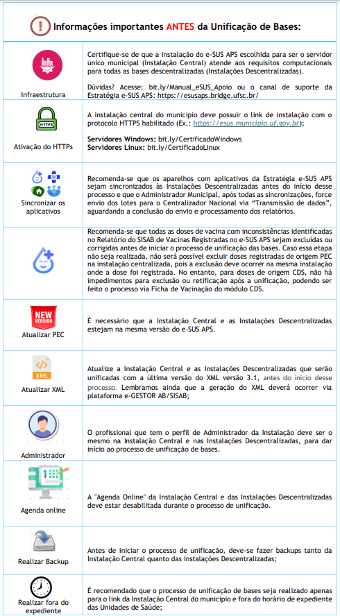
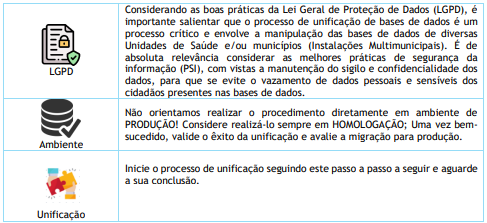

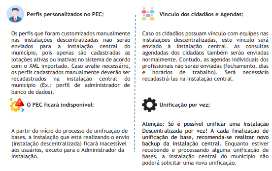

### 5.0 Etapas de Unificação de bases de dados no e-SUS PEC:

**Considerações iniciais:**

É importante destacar que o processo de unificação de bases de dados foi desenvolvido para operar de forma remota, onde uma Instalação do PEC (Instalação
descentralizada que será unificada e desativada após o processo) remete dados para outra Instalação do PEC (Instalação central) a partir de um link de internet! Durante o processo de unificação, caso haja queda no link de internet ou interrupção de energia, o processo de unificação será interrompido e o processo deverá ser reiniciado, restaurando-se os backups da Instalação descentralizada e da Instalação Central que foram realizados antes de iniciar
o processo de unificação, para assim realizar uma nova tentativa! 

Sempre que possível, considere preparar um ambiente na rede local da Instalação Central, com uma “instalação alternativa do PEC” para receber o backup das instalações descentralizadas, um por vez, e realizar a unificação dentro da mesma infraestrutura; tal ação permitirá maior agilidade, segurança e rapidez no processo de unificação das bases de dados e evitará transtornos advindos de quaisquer interrupções.

O Administrador da Instalação deverá acessar o PEC com sua respectiva credencial de acesso e clicar na aba lateral “Configurações da instalação”. Ao clicar em “Unificação de base”, o sistema apresentará as opções abaixo:

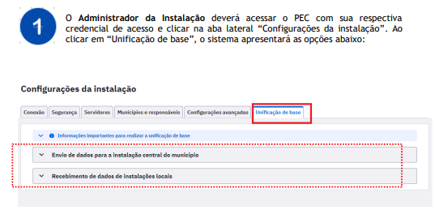
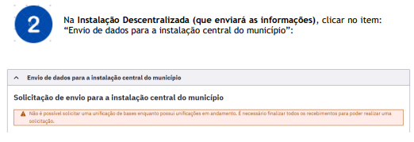
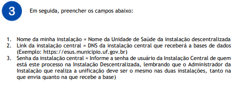
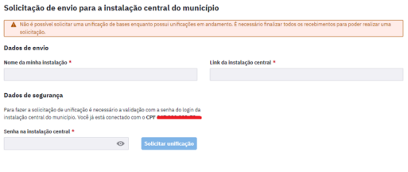
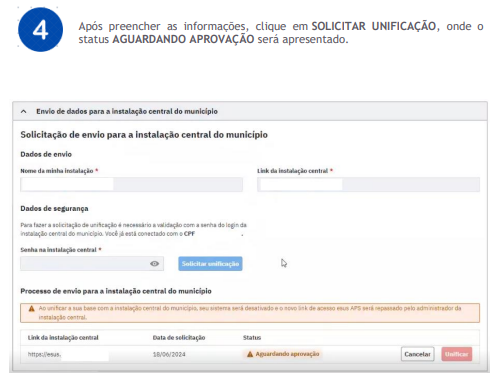

> **Observações:**

▪ Não é possível solicitar uma unificação de bases enquanto houver outra em andamento;

▪ É necessário finalizar todos os recebimentos para poder realizar uma nova solicitação;

▪ Ao unificar a sua base com a instalação central do município, seu sistema será
desativado e o novo link de acesso e-SUS APS será repassado pelo administrador da
instalação central.

**Sobre o tempo de unificação:**

O tempo de unificação poderá variar conforme o tamanho da base de dados remetente
(descentralizada), podendo levar algumas horas para ser concluído; a depender da volumetria da base de dados, considere realizar o procedimento no final de semana; caso o processo não tenha sido concluído, tenha sempre em mãos um plano de contingência a ser adotado; se necessário, acione o Suporte Técnico para maiores informações.

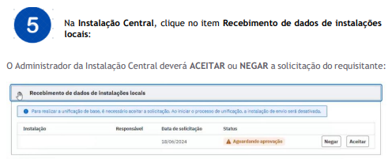

Clique em **ACEITAR** para autorizar o início do processo de unificação por parte da Instalação Central.

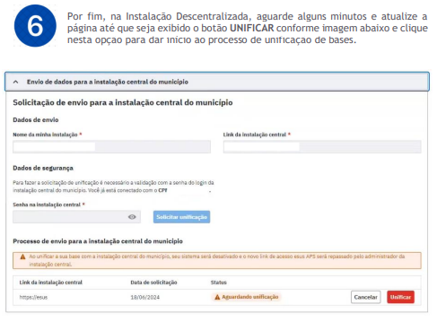

Em seguida, aguarde o término da unificação, que poderá variar de acordo com o tamanho da base de dados da Unidade de Saúde que está enviando seu banco para a Instalação Central:

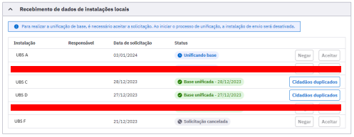

{: .atencao }
Após realizada a unificação, repasse o novo link de acesso da Instalação Central do PEC aos profissionais de saúde da Unidade unificada e valide o êxito da operação! 

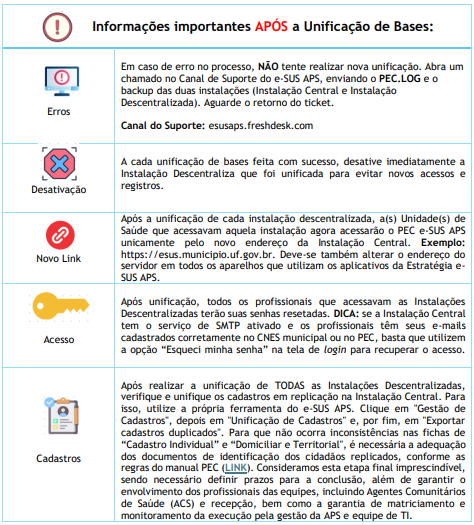

**FIM**

1ª versão. Atualizado em 25 de outubro de 2024.