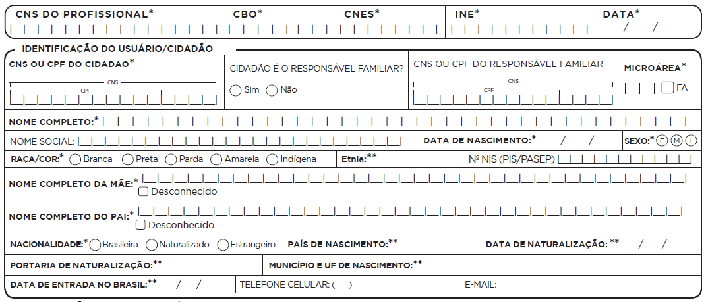

# CAPÍTULO 2 - Cadastro da Atenção Básica
{: .no_toc }

## Sumário
{: .no_toc .text-delta }

- TOC
{:toc}

O cadastro da Atenção Básica é uma extensão do Sistema de Cadastramento de Usuários do Sistema Único de Saúde (CadSUS)[^1], complementando as informações, por meio do número do Cartão Nacional de Saúde (CNS) do cidadão, com o objetivo de apoiar as equipes de Atenção Básica no mapeamento das características sociais, econômicas e de saúde da população adscrita[^2] ao território sob sua responsabilidade.

O cadastro está organizado em duas dimensões -- individual e domiciliar/territorial --, a dimensão individual capta as informações do cidadão, enquanto a dimensão domiciliar/territorial permite captar as informações do domicílio, vinculando o cidadão ao território. A partir da v 2.1, no e SUS AB esse cadastro possibilita o registro de domicílios que estejam vazios ou abandonados e outros imóveis do território, além da inserção de novos núcleos familiares sem que a equipe tenha que refazer o cadastro domiciliar.

{: .atencao }
novos conceitos! A visão de território agora está ampliada. Além de cadastrar os domicílios, também mapeamos outros imóveis do território, como: comércios, terrenos baldios, pontos estratégicos, escola, creche, abrigo, instituição de longa permanência para idosos, unidade prisional, delegacia, estabelecimento religioso, entre outros.

## 2.1 Cadastro Individual

**Objetivo da ficha:** registrar as condições de saúde, características sociais, econômicas, demográficas, entre outras, dos usuários no território das equipes de AB. É composta por duas partes: informações de identificação/sociodemográficas e condições de saúde autorreferidas pelo usuário.

**Profissionais que utilizam esta ficha:** Todos os membros das Equipes que atuam na Atenção Básica. Todos os profissionais são habilitados a preencher a ficha de Cadastro Individual.

{: .atencao }
toda vez que o ACS realizar cadastro individual, ele deverá preencher esta atividade também na Ficha de Visita Domiciliar, assinalando o campo "Cadastramento/Atualização". Deverá ser utilizado o CNS ou CPF do indivíduo cadastrado.

A seguir, detalharemos o modo de preenchimento da ficha, atenção aos campos assinalados na ficha com asterisco (/*), pois estes são de preenchimento obrigatório.

### 2.1.1 Cabeçalho

O cabeçalho da ficha, assim como o de todas as fichas do CDS, tem um bloco para a identificação e controle da digitação, que é importante na organização do processo de trabalho no nível local, e deve ser utilizado pelo digitador e pelo profissional que realiza a supervisão do processo de digitação. Esses campos são apenas para controle local da digitação, portanto não são enviados para a base nacional.

**Figura 2.1 -- Cabeçalho da Ficha de Cadastro Individual**

*Fonte: SAS/MS.*

**Quadro 2.1 -- Identificação e controle da digitação**

|**CAMPO**|**ORIENTAÇÕES SOBRE O PREENCHIMENTO**|
|--|--|
|DIGITADO POR|Nome do profissional que digitou a ficha.|
|DATA|Dia/mês/ano em que a digitação foi realizada no sistema.|
|CONFERIDO POR|Nome do profissional que fez a supervisão do preenchimento da ficha.|
|FOLHA Nº|Este campo pode ser utilizado na organização do processo de trabalho do profissional que realizou o cadastro, por meio da inserção de numeração das folhas.|

*Fonte: SAS/MS.*

### 2.1.2 Identificação do profissional e do estabelecimento de saúde

O próximo bloco é utilizado para identificação do profissional que realizou o cadastro do cidadão. A seguir são detalhados os campos que compõem esse bloco.

**Figura 2.2 -- Identificação do profissional e lotação**

*Fonte: SAS/MS.*

**Quadro 2.2 -- Identificação do profissional e lotação**

|**CAMPO**|**ORIENTAÇÕES SOBRE O PREENCHIMENTO**|
|--|--|
|CNS do Profissional*| Número do Cartão Nacional de Saúde (CNS) do profissional que realizou o cadastro do cidadão.|
|CBO*|Classificação Brasileira de Ocupações (CBO) do profissional que realizou os cadastro do cidadão.|
|CNES*|Código do Cadastro Nacional de Estabelecimentos de Saúde (CNES) da Unidade Básica de Saúde onde o profissional está lotado.|
|INE*|Código Identificador Nacional de Equipes (INE) no Cadastro Nacional de Estabelecimentos de Saúde (CNES) do Ministério da Saúde, onde o profissional está lotado, seja equipes Saúde da Família, Nasf, CnR, etc. Este campo não é obrigatório para profissionais que não estão vinculados a equipes.|
|DATA*|Dia/mês/ano em que foi realizado o cadastro do cidadão.|

*Fonte: SAS/MS.*

\* Campo de preenchimento obrigatório.

### 2.1.3 Identificação do usuário/cidadão

Este bloco visa a identificação do cidadão/usuário do serviço de saúde
que está sendo cadastrado.

{: .atencao }
Para aumentar o número de registros identificados, a partir da versão 3.2.20 é possível registrar CNS ou CPF do cidadão atendido.

**Figura 2.3 -- Identificação do usuário/cidadão**

*Fonte: SAS/MS.*

**Quadro 2.3 -- Identificação do usuário/cidadão**

|CAMPO|ORIENTAÇÕES SOBRE O PREENCHIMENTO|
|-|-|
|CNS OU CPF DO   CIDADÃO|Preencha o número do CNS   ou CPF do cidadão que está sendo   cadastrado.|
|RESPONSÁVEL FAMILIAR|Identifica se o usuário   que está sendo cadastrado é o responsável pelo núcleo familiar (aquele que o   nº do CNS ou CPF e data de nascimento foram inseridos como responsável por núcleo familiar no cadastro domiciliar).     |
|CNS ou CPF DO RESPONSÁVEL FAMILIAR|Caso o cidadão   não seja o responsável pelo núcleo familiar, deve-se inserir o do n°   do CNS ou CPFdo   responsável familiar.|
|NOME COMPLETO*|Preencha o nome completo   do cidadão.|
|NOME SOCIAL|Registro do nome social,   independentemente do registro civil do cidadão, conforme apresentado no box acima.|
|DATA DE NASCIMENTO*|Anote a data de   nascimento do usuário, no formato dia/mês/ano.|
|SEXO*|Marque com um "x" no sexo: masculino ou feminino.|
|RAÇA/COR*|Raça autodeclarada do   indivíduo. Este campo é de preenchimento obrigatório. Pode ser: Branca,   Preta, Parda, Amarela e Indígena. Se indígena, indique a   etnia**. No   sistema, há uma listagem de 264 etnias encontradas no Brasil.  |
|N°NIS-PIS-Pasep|NIS: preencha o número   do NIS do usuário que está sendo cadastrado. O número de identificação social   é usado pelo Ministério de Desenvolvimento Social e Combate à Fome para   identificar os titulares do Programa Bolsa Família. Esse campo também pode   ser utilizado para vinculação do cidadão a programas sociais.     OU      PIS/Pasep: o número de   identificação nos fundos do Programa de Integração Social (PIS) e do Programa   de Formação do Patrimônio do Servidor Público (Pasep) é constituído com a   arrecadação das contribuições dos trabalhadores.|
|NOME COMPLETO DA MÃE*|Preencher com o nome completo da mãe do usuário. Este é um campo de preenchimento obrigatório. Caso não seja possível obter essa informação, poderá ser assinalado um "x" no campo “desconhecido”.|
|NOME COMPLETO DO PAI*|Preencher com o nome completo do pai do usuário. Esse campo foi inserido na ficha para contemplar as informações contidas no CNS. Caso não seja possível obter essa informação, poderá ser assinalado um "x" no campo “desconhecido”.|
|NACIONALIDADE*|Marque com um "x" a nacionalidade do usuário:  ●	brasileira, se pessoa nascida no Brasil;  ●	naturalizada, se pessoa nascida em país estrangeiro e naturalizada como brasileira de forma legal. Caso seja essa a opção, torna-se obrigatório o preenchimento dos campos "Data de naturalização" e "Portaria de naturalização";  ●	estrangeira, se pessoa nascida e registrada fora do território brasileiro e que ainda não seja naturalizada brasileira e nem possua documentos de registro e identificação autênticos do Brasil. Nesse caso, é obrigatório o preenchimento dos campos "País de nascimento" e "Data de entrada no Brasil".|
|PAÍS DE NASCIMENTO**|Se o usuário for estrangeiro ou naturalizado, é obrigatório identificar o país de origem, conforme a lista do site do IBGE (disponível em: <http://www.ibge.gov.br/paisesat/main.php>).|
|TELEFONE CELULAR|Anote o número de telefone celular do usuário cadastrado, incluindo o DDD.|
|MUNICÍPIO E UF DE NASCIMENTO**|Preencha a UF e o município onde o usuário nasceu SE FOR BRASILEIRO.|
|E-MAIL|Endereço do correio eletrônico do usuário.|

*Fonte: SAS/MS.*

\* Campo de preenchimento obrigatório.

\** Campo obrigatório condicionado a pergunta anterior.

{: .atencao }
é importante registrar o **CNS** ou CPF para **identificação** e vinculação do cidadão de seus dados com os registros de atendimento dentro do serviço de saúde. Entretanto, sob hipótese alguma, o fato de **não ter** disponível o n° do **CNS** **ou CPF** deverá inviabilizar o acesso do cidadão aos estabelecimentos de saúde, bem como o cuidado prestado a ele.

{: .nota }
para mais informações sobre o CNS, acesse o endereço eletrônico [https://portaldocidadao.saude.gov.br/portalcidadao/](https://portaldocidadao.saude.gov.br/portalcidadao/).

|RESPONSÁVEL FAMILIAR|
|--|
|O responsável familiar é a pessoa reconhecida, naturalmente, pelo conjunto de moradores de um mesmo domicílio como o responsável pelo domicílio, sem necessariamente possuir vínculo consanguíneo ou legal. O responsável deve, preferencialmente, ser morador do domicílio e integrante do núcleo familiar, com idade superior a 16 anos.   Nesta ficha, há um campo para que o n° do CNS ou CPF do responsável familiar seja incluído. É importante estar atento a essa ação durante o cadastramento do indivíduo, pois é por meio deste dado que será possível relacionar o indivíduo que está sendo cadastrado ao seu núcleo familiar, bem como ao seu domicílio.|

|NOME SOCIAL |
|--|
|Segundo a Carta dos Direitos dos Usuários de Saúde, datada de 2011, no inciso I do artigo 4º, é garantida a “identificação pelo nome e sobrenome civil, devendo existir, em todo o documento do usuário e usuária, um campo para se registrar o nome social, independentemente do registro civil, sendo assegurado o uso do nome de preferência, não podendo ser identificado por número, nome ou código da doença, ou outras formas desrespeitosas ou preconceituosas”.   Considerando as determinações da 13ª Conferência Nacional de Saúde (BRASIL, 2008) acerca da inclusão das orientações sexual e da identidade de gênero na análise da determinação social da saúde, a Portaria nº 2.836, de 1º de dezembro de 2011, que “instituiu, no âmbito do Sistema Único de Saúde (SUS), a Política Nacional de Saúde Integral de Lésbicas, Gays, Bissexuais, Travestis e Transexuais (Política Nacional de Saúde Integral LGBT)”, busca garantir o uso do nome social de travestis e transexuais, de acordo com a Carta dos Direitos dos Usuários da Saúde supracitada.   Diante disso, para assegurar ao usuário o acesso universal, igualitário e ordenado às ações e serviços de saúde do SUS, conforme o Decreto nº 7.508, de 28 de junho de 2011, que regulamenta a Lei nº 8.080, de 19 de setembro de 1990, foi criado o campo NOME SOCIAL nas fichas de Coleta de Dados Simplificada.|

### 2.1.4 Informações sociodemográficas

Este bloco é composto por campos que mapeiam as condições sociodemográficas do indivíduo e devem ser preenchidos conforme descrito a seguir.

**Figura 2.4 -- Informações sociodemográficas**

*Fonte: SAS/MS.*

**Relação de parentesco com o responsável familiar**: Este item busca identificar a relação do indivíduo cadastrado e a pessoa indicada como o responsável familiar. Caso o cadastro seja do próprio responsável familiar, não é necessário preencher este campo.

**Ocupação**: Informar a principal ocupação do usuário cadastrado. No sistema, a ocupação cadastrada deve estar de acordo com a Classificação Brasileira de Ocupações (CBO).

|CLASSIFICAÇÃO BRASILEIRA DE OCUPAÇÕES (CBO)|
|--|
|É possível digitar apenas ocupações que estejam expressas na Classificação Brasileira de Ocupações (CBO). Os profissionais devem estar atentos para seguir a lista do Ministério do Trabalho (MT), bem como com possíveis sinônimos dentro da classificação. Para saber mais, acesse: http://www.mtecbo.gov.br/cbosite/pages/pesquisas/BuscaPorTituloA-Z.jsf.   No caso do cidadão desenvolver outras atividades, como por exemplo, estudante ou pessoas que cuidam da casa (“do lar”) sem finalidade de obter renda, o campo ocupação não deve ser preenchido.|

**Situação no mercado de trabalho**: este item registra a inserção da pessoa no mercado de trabalho, podendo ser:

**Quadro 2.4 -- Situação no mercado de trabalho**

|     ITEM    |     DESCRIÇÃO DO ITEM    |
|-|-|
|     EMPREGADOR    |     Pessoa que trabalha explorando o   seu próprio empreendimento com, pelo menos, um empregado (BRASIL, 2010b).    |
|     ASSALARIADO COM CARTEIRA DE   TRABALHO    |     Pessoa que trabalha com carteira assinada   para um empregador (pessoa física ou jurídica), geralmente, obrigando-se ao   cumprimento de jornada de trabalho e recebendo, em contrapartida, remuneração   em dinheiro (BRASIL, 2010b).    |
|     ASSALARIADO SEM CARTEIRA DE   TRABALHO    |     Pessoa que trabalha sem carteira   assinada para um empregador (pessoa física ou jurídica), geralmente,   obrigando-se ao cumprimento de jornada de trabalho e recebendo, em   contrapartida, remuneração em dinheiro. Considere, também, neste quesito, a   pessoa que presta serviço militar obrigatório (BRASIL, 2010b).    |
|     AUTÔNOMO COM PREVIDÊNCIA SOCIAL    |     Pessoa que contribui com a   Previdência Social e trabalha explorando seu próprio empreendimento, sozinha   ou com sócio, sem ter empregado, ainda que contando com ajuda de trabalhador   não remunerado. São exemplos de trabalhador por conta própria taxistas,   camelôs, manicures em domicílio. Também se encontram nesta categoria os   trabalhadores eventuais, ou seja, aquelas pessoas que prestam serviço em   caráter esporádico, para exercer tarefa específica em/a uma ou mais   empresas/pessoas (encanadores, eletricistas, pedreiros) (BRASIL, 2010b).    |
|     AUTÔNOMO SEM PREVIDÊNCIA SOCIAL    |     Pessoa que trabalha explorando seu   próprio empreendimento, sozinha ou com sócio, sem ter empregado, ainda que   contando com ajuda de trabalhador não remunerado. São exemplos de trabalhador   por conta própria taxistas, camelôs, manicures em domicílio. Também se   encontram nesta categoria os trabalhadores eventuais, ou seja, aquelas   pessoas que prestam serviço em caráter esporádico, para exercer tarefa   específica em/a uma ou mais empresas/pessoas (encanadores, eletricistas,   pedreiros) e que não contribuem com a Previdência Social (BRASIL, 2010b).    |
|     APOSENTADO/ PENSIONISTA    |     Pessoa que tem remuneração recebida   do Plano de Seguridade Social da União (PSS), do Instituto Nacional de Seguro   Social (INSS) e de institutos oficiais de previdência estadual ou municipal,   a título de aposentadoria, jubilação ou reforma ou também deixado por pessoa   da qual era beneficiária, no caso de pensionista (BRASIL, 2010b).    |
|     DESEMPREGADO    |     Pessoa que se encontra   desempregada, sem nenhuma fonte de renda ou recebendo seguro-desemprego e à   procura de trabalho.    |
|     NÃO TRABALHA    |     Pessoa que não procura trabalho.    |
|     SERVIDOR PÚBLICO/MILITAR    |     Pessoa que mantêm vínculo de trabalho profissional com os   órgãos e entidades governamentais, integrados em cargos ou empregos de   qualquer delas: União, estados, Distrito Federal, municípios e suas   respectivas autarquias, fundações, empresas públicas e sociedades de economia   mista.    |
|     OUTRA    |     Pessoa que não se enquadra em   nenhuma das situações de trabalho referidas acima.    |

Fonte: SAS/MS.

**Frequenta escola ou creche?**: Informar se o cidadão frequenta ou não escola ou creche.

**Qual o curso mais elevado que frequenta ou frequentou?**: Este item busca identificar qual o nível de escolaridade máximo cursado pela pessoa, conforme o quadro a seguir.

**Quadro 2.5 -- Nível de escolaridade**

|     ITEM    |     DESCRIÇÃO DO ITEM    |
|-|-|
|     CRECHE    |     Destina-se às crianças,   geralmente com até três anos de idade, que frequentam estabelecimentos   juridicamente regulamentados ou não, destinado a dar assistência   diurna às crianças (BRASIL, 2010b).     |
|     PRÉ-ESCOLA      (EXCETO CA)    |     Destina-se, geralmente,   às crianças com quatro ou cinco anos de idade. Pode receber várias denominações   de acordo com a região e o nível alcançado pelas crianças: maternal, jardim   de infância, jardim I etc. (BRASIL, 2010b).    |
|     CLASSE      DE ALFABETIZAÇÃO (CA)    |     Curso destinado à   alfabetização de crianças, para os estabelecimentos que ainda não implantaram   o Ensino Fundamental com duração de nove anos (BRASIL, 2010b). Equivalente ao 1° ano no sistema   com duração de 9 (nove) anos.    |
|     ENSINO FUNDAMENTAL 1ª A   4ª SÉRIES    |     Curso de Ensino   Fundamental organizado em oito séries anuais, dividido em duas fases ou   ciclos, sendo esta a primeira fase (BRASIL, 2010b). Equivalente ao 2°, 3°,   4° e 5° ano no sistema com duração de 9 (nove) anos.    |
|     ENSINO FUNDAMENTAL 5ª A   8ª SÉRIES    |     Curso de Ensino   Fundamental organizado em oito séries anuais, dividido em duas fases ou   ciclos, sendo esta a segunda fase (BRASIL, 2010b). Equivalente ao 6°, 7°, 8° e 9° ano   no sistema com duração de 9 (nove) anos.    |
|     ENSINO FUNDAMENTAL   COMPLETO    |     Curso de Ensino Fundamental   organizado em oito séries anuais, dividido em duas fases ou ciclos (BRASIL, 2010b).    |
|     ENSINO FUNDAMENTAL   ESPECIAL    |     Atendimento educacional   especializado no Ensino Fundamental regular, voltado a pessoas com   necessidades especiais originadas de deficiência ou altas   habilidades/superdotação (BRASIL, 2010b).    |
|     ENSINO FUNDAMENTAL EJA   – SÉRIES INICIAIS (SUPLETIVO DE 1ª A 4ª)    |     Nova denominação para o   curso supletivo de Ensino Fundamental ou de 1º grau, seriado ou não (BRASIL,   2010b).    |
|     ENSINO FUNDAMENTAL EJA   – SÉRIES FINAIS (SUPLETIVO DE 5ª A 8ª)    |     Nova denominação para o   curso supletivo de Ensino Fundamental ou de 1º grau, seriado ou não (BRASIL,   2010b).    |
|     ENSINO MÉDIO, 2º GRAU,   MÉDIO 2º CICLO (CIENTÍFICO, CLÁSSICO, TÉCNICO, NORMAL)    |     Curso de Ensino Médio   organizado em três ou quatro séries anuais ou em regime de créditos, períodos   letivos, semestres, fases, módulos, ciclos etc. (BRASIL, 2010b).    |
|     ENSINO MÉDIO ESPECIAL    |     Atendimento educacional   especializado no Ensino Médio regular, voltado a pessoas com necessidades   especiais originadas de deficiência ou altas habilidades/superdotação   (BRASIL, 2010b).    |
|     ENSINO MÉDIO EJA   (SUPLETIVO)    |     Nova denominação para o   curso supletivo de Ensino Médio ou de 2º grau, seriado ou não (BRASIL,   2010b).    |
|     SUPERIOR, APERFEIÇOAMENTO,   ESPECIALIZAÇÃO, MESTRADO, DOUTORADO    |     Curso regular de   graduação universitária, frequentado após o término do Ensino Médio, que   habilita a pessoa a exercer uma profissão, e cursos frequentados após a   conclusão do Ensino Superior (BRASIL, 2010b).    |
|     ALFABETIZAÇÃO PARA   ADULTOS (MOBRAL ETC.)    |     Curso destinado à   alfabetização de jovens e adultos (BRASIL, 2010b).    |
|     NENHUM    |     Quando a pessoa não se   enquadrar em nenhuma das descrições anteriores.    |

*Fonte: SAS/MS.*

**Criança de 0 a 9 anos, com quem fica?**: nesta variável, caso a criança tenha até 9 anos de idade, pretende-se identificar quem é responsável por permanecer com ela enquanto os pais se ausentam, e, quando for o caso, fora do horário escolar, podendo ser:

**Quadro 2.6 -- Responsável pela criança até nove anos durante a ausência dos pais**

|ITEM|DESCRIÇÃO DO ITEM|
|-|-|
|ADULTO   RESPONSÁVEL|Neste caso,   a criança fica sob a supervisão de um adulto. Analisando os diversos   parâmetros existentes para definição dessa fase da vida (parâmetros civis, da   Organização Mundial da Saúde etc.) e priorizando a definição do Estatuto da   Criança e do Adolescente (ECA) para o adolescente (entre 12 e 18 anos),   consideramos adultos pessoas maiores de 18 anos.|
|OUTRA(S) CRIANÇA(S)|Neste caso,   a criança permanece com outras crianças com até 12 anos.|
|ADOLESCENTE|Analisando   os diversos parâmetros existentes para definição dessa fase da vida, será   utilizado o parâmetro do Estatuto da Criança e do Adolescente que define   adolescente como a pessoa com idade entre 12 e 18 anos.|
| SOZINHA|Neste caso,   a criança permanece sozinha.|
|CRECHE|Neste caso,   a criança vai para uma creche ou instituição que a supervisiona e que atenda   às suas necessidades básicas.    |
|OUTRO|Caso a   criança permaneça sob circunstâncias diferentes não mencionadas acima.|

*Fonte: SAS/MS.*

**Frequenta cuidador tradicional? Participa de algum grupo comunitário? e Possui plano de saúde privado? :** são campos que retratam a interação do cidadão com a comunidade e com outras modalidade de cuidado em saúde, regulamentadas ou não.

**É membro de povo ou comunidade tradicional**: permite registrar se o cidadão faz parte de grupos culturalmente diferenciados e que se reconhecem como tais, como por exemplo, indígenas, quilombolas, caiçaras, entre outros (ver Anexo D)

**Quadro 2.7 -- Outros campos**

|CAMPO|	ORIENTAÇÕES SOBRE O PREENCHIMENTO|
|-|-|
|FREQUENTA CUIDADOR TRADICIONAL?|	Marque sim, caso o cidadão frequente algum cuidador tradicional ou não em caso contrário. O termo “Cuidador tradicional ou popular” denomina os especialistas populares ou tradicionais não profissionalizados, com práticas de diferentes curadores populares (parteiras, benzedeiras, raizeiros) ou curadores que fazem parte de povos ou comunidades tradicionais (indígenas, populações ribeirinhas amazônicas etc.), com teorias, aspectos culturais, sociais e visão de mundo convergente ou divergente entre si, cujos saberes e práticas baseiam-se em uma abordagem holística, herdada de familiares, de um “dom” ou aprendizado com outro curador, sendo parte da relação com o usuário a criação de vínculo.|
|PARTICIPA DE ALGUM GRUPO COMUNITÁRIO?|	Marque sim, caso o cidadão participe de atividades desenvolvidas em associação comunitária ou outros espaços que envolvam os moradores de um território.|
|POSSUI PLANO DE SAÚDE PRIVADO?|	Esse campo serve para identificar se o cidadão possui plano de saúde privado ou não.|
|É MEMBRO DE POVO OU COMUNIDADE TRADICIONAL?|	Marque sim, caso o cidadão seja membro de algum povo ou comunidade tradicional.
|SE SIM, QUAL?| o campo é de livre preenchimento, no entanto o sistema deve mapear as opções de acordo com a lista de povos e comunidades tradicionais, veja a lista no Anexo D.|

Fonte: SAS/MS.*

**Orientação sexual e Identidade de Gênero**

A orientação sexual do cidadão é a capacidade de ter, sentir ou desenvolver atração e/ou relação emocional, afetiva ou sexual por outra(s) pessoa(s). Enquanto a identidade de gênero é a expressão de uma identidade construída a partir de como a pessoa se reconhece e/ou se apresenta, que pode corresponder ou não ao seu corpo biológico. A identidade de gênero, em suas diferentes expressões, pode ou não envolver modificação da aparência ou do corpo.

Para saber mais sobre o tema, acesse [www.saude.gov.br/saudeLGBT](http://www.saude.gov.br/saudeLGBT), em especial a [Cartilha de Atenção Integral à Saúde da População Trans.](http://portalsaude.saude.gov.br/cds_images/pdf/2016/fevereiro/18/CARTILHA-Equidade-10x15cm.pdf)

Na atualização da ficha de cadastro individual, entendendo estes como conceitos distintos e complementares, as questões foram subdivididas, como seguem abaixo.

**Deseja informar orientação sexual?**: em caso afirmativo, marque "Sim" para a resposta ou "Não" caso contrário. Se sim, prossiga com a questão e pergunte "Qual?" as possibilidades apresentadas são:

**Quadro 2.8 - Orientação sexual**

|     ITEM    |     DESCRIÇÃO DO ITEM    |
|-|-|
|     HETEROSSEXUAL          |     Pessoa que sente atração e/ou se   relaciona emocional, afetiva ou sexualmente com pessoas do sexo oposto.    |
|     HOMOSSEXUAL (GAY/LÉSBICA)    |     Pessoa que sente atração e/ou se   relaciona emocional, afetiva ou sexualmente com pessoas do mesmo sexo.     Homens homossexuais são chamados de   gays.     Mulheres homossexuais são chamadas   de lésbicas.    |
|     BISSEXUAL    |     Pessoa que sente atração e/ou se   relaciona emocional, afetiva ou sexualmente com pessoas de ambos os sexos.    |
|     OUTRO    |     Pessoa que não se identifica com   nenhuma das definições mencionadas.    |

*Fonte: SAS/MS.*

Deseja informar a identidade de gênero? em caso afirmativo, marque "Sim" para a resposta ou "Não" caso contrário. **Se sim,** prossiga com a questão e pergunte **qual?** As possibilidades apresentadas são:

**Quadro 2.9 - Identidade de gênero**

|     ITEM    |     DESCRIÇÃO DO ITEM    |
|-|-|
|     HOMEM TRANSSEXUAL    |     Pessoa que nasce em corpo feminino,   e se reconhece como gênero masculino, desejando ou não modificar seu corpo   para exercer sua identidade masculina.    |
|     MULHER TRANSSEXUAL    |     Pessoa que nasce em corpo   masculino, e se reconhece como gênero feminino, desejando ou não modificar   seu corpo para exercer sua identidade feminina.    |
|     TRAVESTI    |     Pessoa que nasce em corpo   masculino, se relaciona com o mundo no gênero feminino. Realiza modificações   corporais, mas mistura as características femininas e masculinas em um mesmo   corpo. Identificam-se como as travestis.    |
|     OUTRO    |     Pessoa que não se identifica com   nenhuma das definições mencionadas.    |

*Fonte: SAS/MS.*

**Tem alguma deficiência?**: este item identifica se o cidadão apresenta alguma deficiência[^5]. Assinalar com um "x" a opção referida. Este campo de preenchimento obrigatório. **Se sim, qual ou quais deficiências o cidadão?** Podendo ser:

**Quadro 2.10 -- Tipos de deficiência**

|     ITEM    |     DESCRIÇÃO DO ITEM    |
|-|-|
|     AUDITIVA    |     Limitação, temporária   ou permanente, de natureza auditiva. Segundo a Política Nacional de Saúde da   Pessoa com Deficiência, a deficiência auditiva é caracterizada pela perda   total ou parcial da capacidade de ouvir, manifesta-se como surdez leve e   moderada e surdez severa ou profunda. É perda bilateral, parcial ou total de   41 decibéis (dB) ou mais aferida por audiograma nas frequências de 500 Hz,   1.000 Hz, 2.000 Hz e 3.000 Hz.    |
|     VISUAL    |     A Política Nacional de   Saúde da Pessoa com Deficiência compreende a deficiência visual como sendo   uma situação irreversível da função visual, mesmo após tratamentos clínicos e   ou cirúrgicos pertinentes e uso de óculos convencionais. A pessoa com   deficiência visual, cegueira ou baixa visão tem sua funcionalidade   comprometida, com prejuízo na capacidade de realização de tarefas. Deficiência   visual é a cegueira cuja acuidade visual for igual ou menor que 0,05 no   melhor olho, com a melhor correção óptica; baixa visão que significa acuidade   visual entre 0,3 e 0,05 no melhor olho, com a melhor correção óptica; casos   em que o somatório da medida do campo visual, em ambos os olhos, for igual ou   menor que 60º; ocorrência simultânea de qualquer das condições anteriores.    |
|     INTELECTUAL/COGNITIVA    |     Limitação, temporária   ou permanente, de natureza intelectual/cognitiva. A deficiência mental, segundo   a Política Nacional de Saúde da Pessoal com Deficiência, é o funcionamento   intelectual significativamente inferior à média, com manifestações antes dos   18 anos e limitações associadas a duas ou mais áreas de habilidades   adaptativas: comunicação, cuidado pessoal, habilidades sociais, utilização   dos recursos da comunidade, saúde e segurança, habilidades acadêmicas, lazer   e trabalho.    |
|     FÍSICA    |     É alteração completa ou   parcial de um ou mais segmentos do corpo humano que acarreta o   comprometimento da função física, apresentando-se sob as formas de   paraplegia, paraparesia, monoplegia, monoparesia, tetraplegia, tetraparesia,   triplegia, triparesia, hemiplegia, hemiparesia, ostomia, amputação ou   ausência de membro, paralisia cerebral, nanismo, membros com deformidade   congênita ou adquirida, exceto as deformidades estéticas e as que não   produzam dificuldades para o desempenho de funções.    |
|     OUTRA    |     Outros tipos de   limitações, temporárias ou permanentes.     |

*Fonte: SAS/MS.*

### 2.1.5 Informações socioeconômicas

#### Triagem para Risco de Insegurança Alimentar (TRIA)
Faça as duas perguntas da TRIA para o cidadão e registre a resposta com uma das opções: “sim” ou “não”. 
Essas informações são importantes para rastrear o Risco de insegurança alimentar da família.

Fonte: SAPS/MS.

Para mais informações sobre a TRIA, acesse o link do [Manual de Triagem de Insegurança Alimentar](http://189.28.128.100/dab/docs/portaldab/publicacoes/instrutivo_inseguranca_alimentar_aps.pdf).

### 2.1.6 Saída do cidadão do cadastro

Este bloco de campos servirá para que os ACS possam apontar o motivo da saída do cidadão do território. Para tanto, o profissional assinala com um "x" em uma das opções apresentadas:

-   mudança do território; ou
-   óbito

Caso o motivo de saída do cidadão do cadastro seja por óbito, registrar ainda:

-   Data do óbito, este é um campo de preenchimento obrigatório nessa situação; e
-   Número de Declaração de Óbito (D.O.)

### 2.1.7 Termo de recusa do cadastro individual da Atenção Básica

Este bloco é preenchido quando o cidadão se recusa a fornecer os dados para preenchimento do seu cadastro. Quando isso acontece, é solicitado ao entrevistado que assine o termo de recusa para assegurar que ele está ciente.
Em situações em que o cidadão se recuse também a assinar o termo, a validação dessa informação deve ser discutida com o profissional responsável pela supervisão e/ou coordenação desta equipe.

{: .nota }
para que a recusa seja efetivada, é necessário que o ACS preencha alguns campos que são obrigatórios para o sistema, tais como número do CNS do profissional que faz o cadastro, CNES da unidade de saúde e data de cadastro. Com isso, é importante que estes campos também sejam preenchidos no caso de recusa do cadastro, para que esta informação possa ser digitada no sistema com CDS.
>
{: .atencao }
a recusa do cidadão ao cadastro, seja ele individual ou domiciliar / territorial, não implicará o não atendimento deste na unidade de saúde, bem como quaisquer outras formas de discriminação.

### 2.1.8 Questionário Autorreferido de Condições/Situações de Saúde

Este questionário possibilita que, no momento do cadastro do cidadão, os problemas/condições de saúde referidos sinalizem para a equipe a necessidade de acompanhamento e qual a prioridade dele. Para o profissional que estiver realizando o cadastro, é uma oportunidade para orientações quanto aos cuidados necessários e apresentação das ofertas da unidade de saúde para cada problema/condição, como, fluxo para marcação de consultas, realização de exames, participação em grupos, entre outros.

#### 2.1.8.1 Condições/situações de saúde gerais

Este bloco deverá ser preenchido com informações oferecidas pelo usuário e coletadas pelo profissional de saúde no momento do cadastro.

**Figura 2.5 -- Condições/situações de saúde gerais**

*Fonte: SAS/MS.*

**Quadro 2.11 -- Condições/situações de saúde gerais**

|CAMPO|	ORIENTAÇÕES SOBRE O PREENCHIMENTO|
|-|-|
|ESTÁ GESTANTE?|	Assinale com um "x" a opção referida. É fundamental que esta informação seja observada e atualizada frequentemente, visto que é uma situação transitória.|
|SE SIM, QUAL É A MATERNIDADE DE REFERÊNCIA?|	Campo aberto. Informe qual é a maternidade de referência indicada pelo município para realização do parto.|
|SOBRE SEU PESO, VOCÊ SE CONSIDERA?|	Indique qual é a percepção do usuário em relação ao seu próprio peso, podendo ser:  ●	Abaixo do Peso;  ●	Peso Adequado;  ●	Acima do Peso.|
|ESTÁ FUMANTE?|	Assinale com um "x" a opção referida.|
|FAZ USO DE ÁLCOOL?|	Assinale com um "x" a opção referida.|
|FAZ USO DE OUTRAS DROGAS?|	Assinale com um "x" a opção referida.|
|TEM HIPERTENSÃO ARTERIAL?|	Assinale com um "x" a opção referida.|
|TEM DIABETES?|	Assinale com um "x" a opção referida.|
|TEVE AVC/DERRAME?|	Assinale com um "x" a opção referida.|
|TEVE INFARTO?|	Assinale com um "x" a opção referida.|
|TEM DOENÇA CARDÍACA/DO CORAÇÃO?|	Assinale com um "x" a opção referida.|
|SE SIM, INDIQUE QUAL(IS)?**| – se possui problemas no coração, indicar quais em relação às seguintes opções:  ●	Insuficiência Cardíaca;  ●	Outro;  ●	Não Sabe.|
|TEM OU TEVE PROBLEMAS NOS RINS?|	Assinale com um "x" a opção referida.|
|SE SIM, INDIQUE QUAL(IS)?**| – se possui problemas nos rins, indicar quais em relação às seguintes opções:  ●	Insuficiência Renal;  ●	Outro;  ●	Não Sabe.|
|TEM DOENÇA RESPIRATÓRIA/NO PULMÃO?|	Assinale com um "x" a opção referida.|
|SE SIM, INDIQUE QUAL(IS)?**| – se possui alguma doença respiratória, indicar qual em relação às seguintes opções:  ●	Asma;  ●	DPOC/Enfisema;  ●	Outro;  ●	Não Sabe.|
|ESTÁ COM HANSENÍASE?|	Assinale com um "x" a opção referida.|
|ESTÁ COM TUBERCULOSE?|	Assinale com um "x" a opção referida.|
|TEVE ALGUMA INTERNAÇÃO NOS ÚLTIMOS 12 MESES?|	Assinale com um "x" a opção referida.|
|SE SIM, POR QUAL CAUSA?**| Campo aberto. Indicar a(s) causa(s) de internação. |
|TEVE DIAGNÓSTICO DE ALGUM PROBLEMA DE SAÚDE MENTAL POR PROFISSIONAL DE SAÚDE?|	Assinale com um "x" a opção referida.|
|ESTÁ ACAMADO?|	Marque um "x" na opção “Sim” caso a pessoa encontre-se restrita à cama por alguma condição de saúde e “Não” caso contrário.|
|ESTÁ DOMICILIADO?|	Se restrito ao lar por alguma condição de saúde, marcar um "x" na opção “Sim” caso afirmativo e “Não” caso contrário.|
|USA PLANTAS MEDICINAIS?|	Assinale com um "x" a opção referida.|
|SE SIM, INDIQUE QUAL(IS)?| – Campo aberto. Indicar quais as plantas medicinais utilizadas. Listadas na Relação Nacional de Medicamentos Essenciais – Rename.|
|USA OUTRAS PRÁTICAS INTEGRATIVAS E COMPLEMENTARES?|	Assinale com um "x" a opção referida. Exemplos de PIC: medicina tradicional chinesa, homeopatia, termalismo/crenoterapia, medicina antroposófica, entre outras. |
|OUTRAS CONDIÇÕES DE SAÚDE, QUAL?|	Campo aberto. Indicar doenças referidas pelo usuário que não foram citadas anteriormente.|

*Fonte: SAS/MS.*

\** *Campo obrigatório condicionado à pergunta anterior**

#### 2.1.8.2 Cidadão em situação de rua

Este bloco deverá ser preenchido pelo agente de ação social das equipes de Consultório na Rua (eCR) ou pelo agente comunitário de saúde (ACS), quando este desenvolver suas atividades junto a elas. Nos casos em que o agente de ação social não participar da composição das eCR ou quando estas não possuírem nenhum ACS agregado à sua formação mínima, esta ficha poderá ser preenchida por qualquer profissional da eCR. O bloco também poderá ser preenchido pelo ACS ou outro componente da equipe de Atenção Básica nos casos em que existirem usuários em situação de rua no território adscrito da UBS, mas se não tiver nenhuma equipe de Consultório na Rua vinculada.

**Quadro 2.12 -- Situação de rua**

|CAMPO| 	ORIENTAÇÕES SOBRE O PREENCHIMENTO|
|-|-|
|ESTÁ EM SITUAÇÃO DE RUA?*|	Assinale com um "x" a opção referida. Este campo é de preenchimento obrigatório.
|TEMPO EM SITUAÇÃO DE RUA|	Marque, conforme as opções, qual é o tempo:  ●	< 6 meses;  ●	6 a 12 meses;  ●	1 a 5 anos;  ●	> 5 anos.
|RECEBE ALGUM BENEFÍCIO?|	Assinale com um "x" a opção referida.
|POSSUI REFERÊNCIA FAMILIAR?|	Assinale com um "x" a opção referida.
|QUANTAS VEZES SE ALIMENTA AO DIA?|	Marque com um "x" uma das opções:  ●	1 vez;  ●	2 ou 3 vezes;  ●	mais de 3 vezes.
|QUAL A ORIGEM DA ALIMENTAÇÃO?|	Indique de onde vem a alimentação do usuário. Pode-se marcar mais de uma opção:  ●	Restaurante Popular;  ●	Doação de Grupo Religioso;  ●	Doação de Restaurante;  ●	Doação Popular;  ●	Outros.
|É ACOMPANHADO POR OUTRA INSTITUIÇÃO?|	Assinale com um "x" a opção referida.
|SE SIM, INDIQUE QUAL(IS)?| – campo aberto para indicar qual instituição acompanha esta pessoa, por exemplo: Cras, unidade socioeducativa, entre outras.
|VISITA ALGUM FAMILIAR COM FREQUÊNCIA?|	Assinale com um "x" a opção referida.
|SE SIM, QUAL GRAU DE PARENTESCO?| – campo de preenchimento livre, no entanto, o sistema deve identificar aqui o grau de parentesco em relação aos seguintes itens:  ●	avô/avó;  ●	pai/mãe;  ●	filho(a);  ●	irmão(ã);  ●	cônjuge ou companheiro(a);  ●	tio(a);  ●	primo(a);  ●	outros.
|TEM ACESSO À HIGIENE PESSOAL?|	Assinale com um "x" a opção referida.
|SE SIM, INDIQUE QUAL(IS)?**| – indicar qual recurso de higiene pessoal a que o usuário tem acesso. Pode-se marcar mais de uma opção:  ●	Banho;  ●	Acesso ao Sanitário;  ●	Higiene Bucal;  ●	Outros.

*Fonte: SAS/MS.*

\* *Campo de preenchimento obrigatório.*
\** *Campos de preenchimento obrigatório condicionados à pergunta anterior*

## 2.2 Cadastro Domiciliar

**Objetivo da ficha:** registrar as características sociossanitárias dos domicílios no território das equipes de AB. Por meio dela, é possível registrar também situações de populações domiciliadas em locais que não podem ser considerados domicílio, por exemplo, situação de rua (IBGE, 2010), mas que devem ser monitoradas pela equipe de saúde. As informações presentes nesta ficha são relevantes porque compõem indicadores de monitoramento e avaliação para a AB e para as Redes de Atenção à Saúde.

**Profissionais que utilizam esta ficha:** todos os membros das Equipes que atuam na Atenção Básica. Todos os profissionais são habilitados a preencher a ficha de Cadastro Individual.

A seguir detalharemos o modo de preenchimento da ficha, atenção aos
campos assinalados na ficha com asterisco (*), pois estes são de
preenchimento obrigatório.

### 2.2.1 Cabeçalho

O cabeçalho do instrumento, assim como o de todas as fichas de coleta de dados, tem um bloco para a identificação e controle da digitação, que é importante na organização do trabalho no nível local. Este bloco será preenchido pelo digitador.

**Figura 2.6 -- Bloco de cabeçalho do cadastro**

*Fonte: SAS/MS.*

**Quadro 2.13 -- Identificação e controle da digitação**

|     CAMPO    |     ORIENTAÇÕES SOBRE O PREENCHIMENTO    |
|-|-|
|     DIGITADO POR    |     Nome do profissional que digitou a   ficha.    |
|     DATA    |     Dia/mês/ano em que a digitação foi   realizada no sistema.    |
|     CONFERIDO POR    |     Nome do profissional que fez a   supervisão do preenchimento da ficha.    |
|     FOLHA Nº    |     Este campo pode ser utilizado na   organização do processo de trabalho do profissional que realizou o cadastro,   por meio da inserção de numeração das folhas.    |

*Fonte: SAS/MS.*

### 2.2.2 Identificação do profissional e do estabelecimento de saúde

O próximo bloco é utilizado para identificação do profissional que realizou o cadastro do cidadão.

**Figura 2.7 -- Identificação do profissional e lotação**

*Fonte: SAS/MS.*

**Quadro 2.14 -- Identificação do profissional e lotação**

|     CAMPO    |     ORIENTAÇÕES SOBRE O PREENCHIMENTO    |
|-|-|
|     CNS do Profissional*    |     Número do Cartão Nacional de Saúde   (CNS) do profissional que realizou o cadastro do cidadão.    |
|     CBO*    |     Classificação Brasileira de   Ocupações (CBO) do profissional que realizou os cadastro do cidadão.    |
|     CNES*    |     Código do Cadastro Nacional de   Estabelecimentos de Saúde (CNES) da Unidade Básica de Saúde onde o   profissional está lotado.    |
|     INE*    |     Código   Identificador Nacional de Equipes (INE) no Cadastro Nacional de   Estabelecimentos de Saúde (CNES) do Ministério da Saúde, onde o profissional   está lotado, seja equipes Saúde da Família, Nasf, CnR, etc. Este campo não é   obrigatório para profissionais que não estão vinculados a equipes.    |
|     DATA*    |     Dia/mês/ano em que foi realizado o   cadastro do cidadão.    |

*Fonte: SAS/MS.*

/* Campo de preenchimento obrigatório.

### 2.2.3 Endereço/Local de permanência

Neste bloco, é registrado o endereço do domicílio localizado na área de atuação da equipe e os telefones para contato. Para pessoas ou famílias em situação de rua, esses campos devem ser preenchidos com o endereço do local de permanência. Nos casos de itinerância, ou seja, nos quais as pessoas ou famílias em situação de rua mudarem o local de permanência, solicite que elas optem pelo local no qual serão encontradas com maior facilidade e/ou frequência. Os campos de identificação do domicílio são compatíveis com os dados do CADSUS, conforme descrito no Manual de Operações do CADSUS.[^6]

**Figura 2.8 -- Endereço/Local de permanência**

*Fonte: SAS/MS.*

**Quadro 2.15 -- Endereço/Local de permanência**

|CAMPO|	ORIENTAÇÕES SOBRE O PREENCHIMENTO|
|-|-|
|CEP*|	Escreva o Código de Endereçamento Postal da residência. Campo numérico no formato 99.999-999.|
|MUNICÍPIO*|	Escreva o nome da cidade em que o usuário reside atualmente. Informações conforme tabela do site do IBGE (disponível em: <http://www.ibge.gov.br/cidadesat/topwindow.htm?1>). |
|UF*|	Escreva o Estado de residência do cidadão conforme o IBGE. Vide Anexo C. |
|MICROÁREA*|	Preencha o código da microárea onde está situado o domicílio do cidadão cadastrado, utilizando a numeração determinada na territorialização da eSF. Ou, indique a opção FA (fora de área).|
|BAIRRO*|	Escreva o bairro em que o usuário reside atualmente. Pode ser preenchido com nomes e números (alfanumérico). |
|TIPO DE LOGRADOURO|	Escreva o tipo de logradouro conforme opções fornecidas pelos correios (Rua, Avenida etc.). Vide Anexo B. |
|NOME DO LOGRADOURO*|	Escreva o nome do logradouro em que o indivíduo reside ou permanece, no caso de pessoa em situação de rua. |
|NÚMERO*|	Escreva o número da casa ou apartamento. No caso da ausência de número, preencha “Sem número”.|
|COMPLEMENTO|	Escreva o complemento do endereço. Pode ser preenchido com o nome e números (alfanumérico) do edifício ou algum outro dado que não se enquadre nos outros campos.|
|PONTO DE REFERÊNCIA|	Escreva se existe algum ponto referência próximo ao domicílio ou ao local de permanência. Ex: mercado, farmácia, escola, etc.|
|TIPO DE IMÓVEL|	O tipo de imóvel deve ser inserido segundo a legenda:  ●	01 Domicílio  ●	02 Comércio   ●	03 Terreno baldio  ●	04 Ponto Estratégico (PE: cemitério, borracharia, ferro-velho, depósito de sucata ou materiais de construção, garagem de ônibus ou veículo de grande porte)  ●	05 Escola  ●	06 Creche  ●	07 Abrigo  	08 Instituição de longa permanência para idosos  ●	09 Unidade prisional  ●	10 Unidade de medida socioeducativa  ●	11 Delegacia  ●	12 Estabelecimento religioso  ●	99 Outros|
|TELEFONE RESIDENCIAL|	Anote o número do telefone fixo com DDD (Discagem Direta a Distância) do município em que o usuário reside.|
|TELEFONE DE REFERÊNCIA|	Anote o número do telefone com DDD do município em que o usuário pode ser encontrado mais facilmente. A preferência é que seja telefone fixo ou contato próximo ao domicílio. Caso não possua, o campo deverá ficar em branco. O telefone celular deverá ser preenchido no cadastro individual. Evitar telefones de empresa, que são trocados com frequência.|

*Fonte: SAS/MS.*

\* *Campo de preenchimento obrigatório.*

**Atenção para as regras do sistema a partir do Tipo do Imóvel!**

Domicílio:
-	opção "01 ­ Domicílio":
-	serão desabilitados os campos do bloco "Instituição de permanência" e
-	será alterado o nome do grupo "Termo de recusa" para "Termo de recusa do cadastro domiciliar e territorial da Atenção Básica".

Imóveis sem finalidade de moradia/longa permanência:
-	as opções:
 -	"02 ­ Comércio",
 -	"03 ­ Terreno baldio",
 -	"04 ­ Ponto estratégico",
 -	"05 ­ Escola",
 -	"06 ­ Creche",
 -	"12 ­ Estabelecimento religioso" ou
 -	"99 ­ Outros":
-	serão desabilitados os campos dos blocos:
 -	"Condições de moradia",
 -	"Animais no domicílio?",
 -	"Famílias", e
 -	"Instituição de permanência"

Instituição de longa permanência:
-	as opções:
 -	"07 ­ Abrigo",
 -	"08 ­ Instituição de longa permanência para idosos",
 -	"09 ­ Unidade prisional",
 -	"10 ­ Unidade de medida socioeducativa" ou
 -	"11 ­ Delegacia"
-	serão desabilitados os campos:
 -	"Situação de moradia / Posse de terra",
 -	"Tipo de domicílio",
 -	"Nº de cômodos",
 -	"Em caso de área de produção rural: condição de posse e uso da terra",
 -	 "Material predominante na construção das paredes externas de seu domicílio" e
 -	"Tipo de acesso ao domicílio",
-	ainda serão desabilitados os campos dos blocos:
 -	"Animais no domicílio" e
 -	"Famílias"
-	será alterado o nome do termo de recusa para "Termo de recusa do cadastro da instituição de permanência".

### 2.2.4 Condições de moradia

O bloco de condições de moradia é composto por campos que mapeiam as condições sociossanitárias do domicílio. Podem ser registradas informações sobre situação de moradia, localização, além de outras características do domicílio. A seguir, serão apresentados os conceitos de cada item dos campos deste bloco.

**Figura 2.9 -- Condições de moradia**

*Fonte: SAS/MS.*

**Situação de moradia/posse da terra**: O preenchimento deste campo informa a situação de propriedade do domicílio. Este é um campo de preenchimento obrigatório. Deverá ser assinalada uma das opções, conforme descrição a seguir:

**Quadro 2.16 -- Situação de moradia/posse da terra/***

|     ITEM    |     DESCRIÇÃO DO ITEM    |
|-|-|
|     PRÓPRIO    |     Domicílio de   propriedade, total ou parcial, de morador, integralmente quitado ou em   processo de quitação, independentemente da condição de ocupação do terreno   (IBGE, 2010).    |
|     FINANCIADO    |     Domicílio   cuja aquisição se deu por meio de recurso advindo de financiamento, sendo   integralmente quitado ou em processo de quitação.    |
|     ALUGADO    |     Domicílio   cujo aluguel seja, totalmente ou parcialmente, pago por morador (IBGE, 2010).    |
|     ARRENDADO    |     Domicílio   cujo proprietário concede ao arrendatário o gozo temporário de uma   propriedade, no todo ou em parte, mediante retribuição financeira ou mão de   obra.    |
|     CEDIDO    |     Domicílio   cedido gratuitamente por empregador de morador, instituição ou pessoa não   moradora (parente ou não), ainda que mediante taxa de ocupação ou   conservação. Nesta condição, incluiu-se domicílio cujo aluguel fosse   integralmente pago, diretamente ou indiretamente, por empregador de morador,   instituição ou pessoa não moradora (IBGE, 2010).    |
|     OCUPAÇÃO    |     Domicílio,   área pública ou privada cuja ocupação se deu sem regularização formal.    |
|     SITUAÇÃO DE   RUA    |     A população   em situação de rua forma um grupo heterogêneo, em situação de   vulnerabilidade. Não apresenta moradia convencional regular, utilizando a rua   como espaço de moradia, por condição temporária ou de forma permanente.   Quando esta opção for assinalada, é importante o preenchimento de todo o   bloco “endereço/local de permanência” e do campo “localização” para que a informação   “situação de rua” possa ser digitada no sistema com CDS.    |
|     OUTRA    |     Para o   domicílio que não se enquadre em nenhuma das categorias acima.    |
*Fonte: SAS/MS.*

\* *Campo de preenchimento obrigatório.*

**Localização**: informa a localização do domicílio/propriedade em
relação ao perímetro urbano ou rural da cidade. Este é um campo de
preenchimento obrigatório. Deverá ser assinalada uma das opções,
conforme descrição a seguir

Quadro 2.17 -- Localização

|ITEM|DESCRIÇÃO DO ITEM|
|-|-|
|URBANA|Área correspondente às cidades (sedes municipais), às vilas (sedes distritais) ou às áreas urbanas isoladas (IBGE, 2010).|
|RURAL|Toda a área situada fora dos limites do perímetro urbano, inclusive os aglomerados rurais de extensão urbana, os povoados e os núcleos. Esse critério também é utilizado na classificação da população urbana e rural (IBGE, 2010).|

*Fonte: SAS/MS.*

\* Campo de preenchimento obrigatório.

**Tipo de domicílio**: deverá ser assinalada uma das opções, conforme descrição a seguir:

**Quadro 2.18 -- Tipo de domicílio**

|ITEM|DESCRIÇÃO DO ITEM|
|-|-|
|CASA|Edificação de um ou mais pavimentos, desde que ocupada integralmente por um único domicílio, com acesso direto a um logradouro (arruamento, vila, avenida, caminho etc.), legalizada ou não, independentemente do material utilizado em sua construção (IBGE, 2010).|
|APARTAMENTO|Localizado em edifício de um ou mais andares, com mais de um domicílio, servido por espaços comuns (*hall* de entrada, escadas, corredores, portaria ou outras dependências). O domicílio localizado em um prédio de dois ou mais andares em que as demais unidades não são residenciais e, ainda, aquele localizado em edifício de dois ou mais pavimentos com entradas independentes para os andares são considerados como apartamentos (IBGE, 2010).|
|CÔMODO|Habitação que se caracteriza pelo uso comum do morador de instalações hidráulica, elétrica e/ou sanitária (banheiro, cozinha etc.), composta por um ou mais aposentos localizados em uma casa de cômodos, cortiço, cabeça de porco etc. (IBGE, 2010).|
|OUTRO|Quando o tipo de domicílio não se enquadra em nenhuma das categorias acima.|

*Fonte: SAS/MS.*

**Número de moradores e cômodos**: preencher com o número de moradores e cômodos do domicílio.

**Quadro 2.19 -- Quantidade de moradores e cômodos**

|CAMPO|ORIENTAÇÕES SOBRE O PREENCHIMENTO|
|-|-|
|NÚMERO DE MORADORES|Anote o número de moradores no domicílio (campo numérico). Se neste domicílio mora mais de um núcleo familiar/família, o número a ser registrado é o total de moradores de todas as famílias.|
|NÚMERO DE CÔMODOS|Anote o número de cômodos no domicílio. Cômodos ou peças são "todos os compartimentos integrantes do domicílio, inclusive banheiro e cozinha, separados por paredes, e os existentes na parte externa do prédio, desde que constituam parte integrante do domicílio, com exceção de corredores, alpendres, varandas abertas e outros compartimentos utilizados para fins não residenciais como garagens, depósitos etc." (IBGE, 1994). Investiga-se aqui, com a variável de número de moradores, a relação de cômodos por moradores do domicílio.|

*Fonte: SAS/MS.*

**Condições de posso e uso da terra**: preencher informações sobre a condição de posse e uso da terra no caso do domicílio estar em área de produção rural. Deverá ser assinalada uma das opções, conforme descrição a seguir:

Quadro 2.20 -- Condições de posse e uso da terra em área de produção rural

|ITEM|DESCRIÇÃO DO ITEM|
|-|-|
|PROPRIETÁRIO(A)|Área de propriedade do beneficiário e/ou com cláusula de usufruto vitalício da propriedade.|
|PARCEIRO(A)/MEEIRO(A)|Pessoa que explora o imóvel rural, no todo ou em parte, mediante contrato agrário, remunerando ou repartindo com o proprietário percentual da produção alcançada.|
|ASSENTADO(A)|Família ou associação de agricultores, beneficiários do Programa Nacional de Reforma Agrária (PNRA), que recebe a concessão de uso e visa a contribuir para a fixação do homem na terra.|
|POSSEIRO(A)|Pessoa que ocupa terras particulares ou devolutas (propriedades públicas que nunca pertenceram a um proprietário particular), na intenção de se tornar proprietária e usufruir a propriedade, mesmo sem título legítimo de propriedade.|
|ARRENDATÁRIO(A)|Pessoa que recebe ou toma por aluguel o imóvel rural, no todo ou em parte, mediante contrato firmado entre as partes, para exploração do imóvel rural, remunerando o proprietário com valor predeterminado.|
|COMODATÁRIO(A)|Pessoa que explora imóvel rural, no todo ou em parte, cedido pelo proprietário de forma gratuita, mediante contrato firmado entre as partes.|
|BENEFICIÁRIO(A) DO BANCO DA TERRA|Trabalhadores rurais (assalariados), parceiros, meeiros, posseiros ou arrendatários que comprovem, no mínimo, cinco anos de experiência na agropecuária e que tenham financiado a propriedade rural pelo programa Fundo de Terras e Reforma Agrária, ou Banco da Terra.|
|NÃO SE APLICA|Pessoa que não se enquadra em nenhuma das variáveis sobre condição de posse e uso da terra citadas acima.|

*Fonte: SAS/MS.*

**Tipo de acesso ao domicílio**: refere-se ao principal tipo de pavimentação ou vias de acesso para se chegar ao logradouro que dá acesso ao domicílio. Deverá ser assinalada uma das opções, conforme descrição a seguir:

Quadro 2.21 -- Acesso ao domicílio

|ITEM|DESCRIÇÃO DO ITEM|
|-|-|
|PAVIMENTO|Trecho que dá acesso ao domicílio predominantemente provido de asfalto, paralelepípedos, lajotas, entre outros materiais para pavimentação urbana.|
|CHÃO BATIDO|Trecho que dá acesso ao domicílio predominantemente de terra socada e/ou trilhas, sem nenhum tipo de revestimento.|
|FLUVIAL|Para se chegar ao domicílio, é necessário utilizar meios de transporte fluviais como canoa, barco, balsa etc.|
|OUTRO|Quando o tipo de acesso não se enquadra em nenhuma das categorias acima.|

*Fonte: SAS/MS.*

**Disponibilidade de energia elétrica**: informa a existência de energia elétrica no domicílio. Marque com um /"x/" a opção escolhida.

**Material predominante na construção das paredes externas do domicílio**: Refere-se ao material predominante utilizado na construção do domicílio, ou aquele que, de algum modo, se destaca aos demais materiais utilizados. Deverá ser assinalada uma das opções, conforme descrição a seguir:

Quadro 2.22 -- Material predominante na construção das paredes externas do domicílio

|ITEM|DESCRIÇÃO DO ITEM|
|-|-|
|ALVENARIA/TIJOLO COM REVESTIMENTO|   Domicílio feito predominantemente de tijolo, adobe (tijolo grande e cru feito de terra argilosa, seco ao sol) e/ou pedra, recoberto por reboco, cerâmica, azulejo, granito, mármore, metal, vidro, lambris (revestimento de madeira ou mármore) etc.|
|ALVENARIA/TIJOLO SEM REVESTIMENTO|   Domicílio feito predominantemente de tijolo, adobe e/ou pedra, sem qualquer tipo de revestimento.|
|TAIPA COM REVESTIMENTO|              Domicílio feito predominantemente de barro ou cal e areia, utilizando varas de madeira, estuque (massa preparada com gesso, água e cola) ou pau a pique (técnica que consiste no entrelaçamento de madeiras verticais fixadas no solo, com vigas horizontais, geralmente de bambu, amarradas entre si por cipós, dando origem a um grande painel perfurado que, após ter os vãos preenchidos com barro, se transforma em parede), revestidas por qualquer tipo de material.|
|TAIPA SEM REVESTIMENTO|              Domicílio feito predominantemente de paredes não revestidas constituídas de barro ou cal e areia, utilizando varas de madeira, tabique, estuque, pau a pique etc.|
|MADEIRA APARELHADA|                  Domicílio feito predominantemente de qualquer tipo de madeira que foi trabalhada (industrializada), ou seja, preparada para construir paredes.|
|MATERIAL APROVEITADO|                Domicílio construído a partir de reciclagem de materiais de construção, como tijolos, telhas, vigas, barras, compensados, podendo utilizar também materiais dispensados e/ou inutilizados provenientes de outras fontes como lonas, papelão, garrafas, latas etc. (definição própria).|
|PALHA|                               Domicílio com as paredes feitas de sapé, folha ou casca de vegetal.|
|OUTRO MATERIAL|                      Quando o material utilizado não se enquadra em nenhuma das categorias acima.|

*Fonte: SAS/MS.*

**Abastecimento de água**: Informa a existência de água canalizada no domicílio e a sua procedência. Deverá ser assinalada uma das opções, conforme descrição a seguir:

Quadro 2.23 -- Abastecimento de água

|ITEM|DESCRIÇÃO DO ITEM|
|-|-|
|REDE ENCANADA ATÉ O DOMICÍLIO|   Quando o domicílio, o terreno ou a propriedade onde ele está localizado for servido de água canalizada proveniente de rede geral de abastecimento (BRASIL, 2010a).
|POÇO/NASCENTE NO DOMICÍLIO|      Quando o domicílio for servido por água de poço ou nascente localizada no terreno ou na propriedade onde está construído, podendo ou não haver distribuição interna para o domicílio (BRASIL, 2010a).
|CISTERNA|                       Quando o domicílio for servido por água das chuvas, armazenada em cisterna de placas de cimento pré-moldadas (reservatório semienterrado e protegido da evaporação e da contaminação) que captam água das chuvas (BRASIL, 2010a).
|CARRO-PIPA|                      Quando a água utilizada no domicílio for transportada por meio de carro-pipa, podendo a água ser proveniente de várias fontes (BRASIL, 2010a).
|OUTRO|                           Quando o domicílio for servido de água de reservatório (ou caixa), poço ou nascente localizado fora do terreno onde está construído, quando for servido de água de rio ou lago, ou ainda de outra maneira não descrita acima.

*Fonte: SAS/MS.*

**Forma de escoamento do banheiro ou sanitário**: Refere-se ao principal tipo de escoamento do banheiro ou sanitário do domicílio. Deverá ser assinalada uma das opções, conforme descrição a seguir:

Quadro 2.24 -- Forma de escoamento do banheiro ou sanitário

|ITEM|DESCRIÇÃO DO ITEM|
|-|-|
|REDE COLETORA DE ESGOTO OU PLUVIAL|   Quando a canalização das águas e dos dejetos provenientes do banheiro ou do sanitário estiver ligada a um sistema de coleta que os conduza a um desaguadouro geral da área, região ou município, mesmo que o sistema não disponha de estação de tratamento da matéria esgotada (BRASIL, 2010a).
|FOSSA SÉPTICA|                        Quando a canalização das águas e dos dejetos provenientes do banheiro ou do sanitário estiver ligada a uma fossa séptica, ou seja, a matéria é esgotada para uma fossa próxima, passando por processo de tratamento ou decantação (BRASIL, 2010a).
|FOSSA RUDIMENTAR|                     Quando os dejetos provenientes do banheiro ou do sanitário forem esgotados para uma fossa rústica (fossa negra, poço, buraco etc.), sem passar por nenhum processo de tratamento (BRASIL, 2010a).
|DIRETO PARA UM RIO, LAGO OU MAR|      Quando os dejetos ou águas provenientes do banheiro ou do sanitário forem esgotados diretamente para um rio, lago ou mar (BRASIL, 2010a).
|CÉU ABERTO|                           Quando os dejetos ou águas provenientes do banheiro ou do sanitário forem esgotados diretamente para uma vala a céu aberto (BRASIL, 2010a).
|OUTRA FORMA|                          Quando o escoadouro dos dejetos e águas provenientes do banheiro ou do sanitário não se enquadrar nas categorias descritas anteriormente.

*Fonte: SAS/MS.*

**Água para consumo no domicílio**: Refere-se ao tratamento predominante da água realizado no domicílio para ingestão. Deverá ser assinalada uma das opções, conforme descrição a seguir:

Quadro 2.25 -- Água para consumo no domicílio

|ITEM|DESCRIÇÃO DO ITEM|
|-|-|
|MINERAL|          A água mineral é obtida diretamente de fontes naturais ou por extração de águas subterrâneas. Caracteriza-se pelo conteúdo definido e constante de sais minerais, oligoelementos e outros constituintes, considerando-se as flutuações naturais.|
|FILTRADA|         A água passa por um leito filtrante constituído por saibro, areia com granulometria variável, ou outras matérias porosas, com o objetivo de reter microrganismos e impurezas.|
|FERVIDA|          Aquecimento da água até o ponto de ferver por, pelo menos, cinco minutos.|
|CLORADA|          Adição de cloro ou de outros produtos desinfetantes e/ou bactericidas. Tem como finalidade a eliminação dos microrganismos ainda existentes.|
|SEM TRATAMENTO|   Marque esta opção quando não for referido nenhum tratamento de água realizado no domicílio.|

*Fonte: SAS/MS.*

**Destino do lixo**: deverá ser assinalada uma das opções oferecidas.
Abaixo, são apresentadas as opções de destino do lixo.

Quadro 2.26 -- Destinação dada ao lixo

|ITEM|DESCRIÇÃO DO ITEM|
|-|-|
|COLETADO|Quando o lixo do domicílio for coletado diretamente por serviço ou empresa pública ou privada, ou ainda quando for depositado em caçamba, tanque ou depósito, fora do domicílio, para, então, ser coletado por serviço ou empresa pública ou privada (BRASIL, 2010b).
|QUEIMADO/ENTERRADO|Quando o lixo do domicílio for queimado ou enterrado no terreno ou na propriedade onde se localiza o domicílio (BRASIL, 2010b).
|CÉU ABERTO|Quando o lixo do domicílio é jogado a céu aberto em lugares como terrenos baldios, logradouros públicos, margens de rio, lago ou mar (BRASIL, 2010b).
|OUTRO|Quando o lixo tiver outro destino que não se enquadre em nenhuma das categorias acima.

*Fonte: SAS/MS.*

### 2.2.5 Animais no domicílio

Este bloco é utilizado para registrar a existência e quantidade de animais no domicílio. Animais domésticos são do convívio diário familiar, tais como gato, cachorro, pássaro etc. Caso existam animais no domicílio e a opção "Sim" tenha sido marcada, será necessário indicar quais e a quantidade deles. A partir dessas informações, é possível que a equipe de saúde desenvolva ações para minimizar o risco de agravos à saúde da população, articuladas com outros setores responsáveis, a fim de efetivar a vigilância dos fatores de risco ambientais e sanitários.

Figura 2.10 -- Animais no domicílio

*Fonte: SAS/MS.*

### 2.2.6 Identificação de famílias ou núcleos familiares

Este bloco viabiliza o registro das famílias (ou núcleos familiares) que moram no domicílio cadastrado. Esta informação amplia e qualifica o cuidado em saúde, a partir da abordagem familiar, realizado por toda a equipe de saúde.

No Cadastro da Atenção Básica, o **núcleo familiar ou família** corresponde à unidade nuclear composta por uma ou mais pessoas, eventualmente ampliada por outras que contribuam para o rendimento ou tenham suas despesas atendidas por ela, todas moradoras de um mesmo domicílio. Para cada núcleo familiar, deve-se informar um **responsável familiar**.

A definição desse responsável familiar é feita pela própria família, sendo, preferencialmente, morador desse domicílio e integrante dessa unidade familiar (independentemente se há algum grau de parentesco), com idade superior a 16 anos.

Figura 2.11 -- Identificação de famílias ou núcleos familiares

*Fonte: SAS/MS.*

\* *Campo com obrigatoriedade condicional*

**Quadro 2.27 -- Identificação de famílias ou núcleos familiares**

|     CAMPO    |     ORIENTAÇÕES SOBRE O PREENCHIMENTO    |
|-|-|
|     Nº PRONTUÁRIO FAMILIAR     |     Coloque o número do   prontuário familiar do estabelecimento de saúde. Tem a finalidade de   relacionar os dados do cadastro com as informações da família no   estabelecimento de saúde.    |
|     CNS ou CPF   DO RESPONSÁVEL    |     O campo deve ser   preenchido com o número do CNS ou CPF do   responsável pela família, no domicílio.    |
|     DATA DE NASCIMENTO DO   RESPONSÁVEL    |     Anote a data de   nascimento do responsável no formato dia/mês/ano, pois auxiliará na   verificação do Cartão Nacional de Saúde dele.    |
|     RENDA FAMILIAR      (Salário mínimo)    |     Marcar a opção, em   salários mínimos, que representa a soma da renda de todos os membros da   família.    |
|     NÚMERO DE MEMBROS DA   FAMÍLIA    |     Anote a quantidade de   indivíduos do mesmo núcleo familiar que moram no domicílio.    |
|     RESIDE DESDE    |     Coloque a data em que o   núcleo familiar passou a residir nesse domicílio (mudou-se para o atual   domicílio), preenchida no formato mês/ano. Não tendo a informação do mês,   preencher somente o ano.    |
|     MUDOU-SE    |     Utilize este campo apenas quando a   família sair do território.    |

*Fonte: SAS/MS.*

{: .atencao }
o bloco de identificação de famílias/núcleos familiares deve ser preenchido somente se houver moradores ocupando o domicílio. Caso esteja ocupado, será obrigatório o preenchimento do CNS ou CPF do responsável a fim de permitir a identificação de vínculos familiares entre os indivíduos cadastrados pela Ficha de Cadastro Individual.

{: .atencao }
mesmo que um cidadão tenha mais de um cadastro no território, para fins de vinculação de um núcleo familiar, o **cidadão não poderá ser Responsável Familiar em mais de um domicílio**.

### 2.2.9 Termo de Recusa do Cadastro Domiciliar da Atenção Básica

Este bloco é preenchido quando as pessoas do domicílio se recusam a fornecer os dados para preenchimento do cadastro. Nesse caso, o profissional solicita ao entrevistado que assine o termo de recusa, de forma a assegurar que ele recusou o cadastro e está ciente de que esse fato não impede o atendimento do usuário e sua família na UBS. Em situações em que o cidadão se recuse também a assinar o termo, a validação desta informação deve ser discutida com o profissional responsável pela supervisão e/ou coordenação desta equipe.

Mesmo quando o Termo de Recusa é assinalado, é obrigatório o preenchimento dos campos do bloco de identificação do estabelecimento de saúde, profissional e data da visita.

{: .atencao }
sempre que o profissional realizar um cadastro domiciliar no domicílio, ele deverá preencher esta atividade também na Ficha de Visita Domiciliar, assinalando o campo "Cadastramento/Atualização". Neste caso, deverá ser utilizado o CNS ou CPF do responsável familiar.

Figura 2.12 -- Termo de Recusa do Cadastro Domiciliar da Atenção
Básica

*Fonte: SAS/MS.*

### 2.2.10 Instituição de Permanência

Neste bloco, será possível cadastrar instituições de permanência, como escolas, creches, abrigos, ou instituições de longa permanência para idosos. Escreva o nome da instituição de permanência no campo aberto. Depois marque com um X a opção referente a se existem outros profissionais de saúde vinculados à instituição, neste campo não devem ser incluídos profissionais da rede pública de saúde.

Figura 2.13 -- Instituição de permanência

*Fonte: SAS/MS.*

**Identificação do Responsável Técnico pela Instituição de Permanência**: neste bloco, deve-se inserir os dados referentes ao responsável técnico pela instituição de permanência. Os campos assinalados com asterisco (/*) são de preenchimento obrigatório.  

Figura 2.14 -- Identificação do responsável técnico da instituição de permanência

*Fonte: SAS/MS.*

Quadro 2.28 -- Identificação do responsável técnico da instituição de
permanência

|CAMPO|ORIENTAÇÃO SOBRE O BLOCO/PREENCHIMENTO|
|-|-|
|NOME|Escreva o nome do responsável pela instituição de permanência.|
|CNS ou CPF RESPONSÁVEL|Insira o Cartão Nacional de Saúde do responsável pela instituição de permanência.|
|CARGO NA INSTITUIÇÃO|Descreva o cargo ocupado pelo responsável na instituição de permanência.|
|TEL. CONTATO|Anote o número do telefone com DDD do município em que o responsável pela instituição de permanência pode ser encontrado mais facilmente.|

*Fonte: SAS/MS.*

### 2.2.11 Termo de Recusa da instituição de Permanência

Este bloco é preenchido quando o responsável técnico da instituição de permanência não deseja fornecer estes dados para a realização do cadastro. Nesse caso, o profissional solicita ao entrevistado que assine o termo de recusa, de forma a assegurar que ele recusou o cadastro e está ciente de que esse fato não impede o atendimento na UBS dos cidadãos vinculados à instituição de permanência. Em situações em que o técnico responsável se recuse também a assinar o termo, a validação desta informação deve ser discutida com o profissional responsável pela supervisão e/ou coordenação desta equipe.

Figura 2.15 -- Termo de recusa da instituição de permanência

*Fonte: SAS/MS.*

[^1]: Como este cadastro é uma extensão do CADSUS, os dados devem    garantir consistência com o Manual de Operações do CADSUS.

[^2]: Segundo a Política Nacional de Atenção Básica (BRASIL, 2017),   "adscrição de usuários" é um processo de vinculação de pessoas e/ou   famílias e grupos a profissionais/equipes, com o objetivo de ser    referência para o seu cuidado.

[^3]: MENÉDEZ, E. Modelos, saberes e formas de atenção ao padecimento: exclusões ideológicas e articulações práticas. In: \______. Sujeitos, saberes e estruturas: uma introdução ao enfoque relacional no estudo da Saúde Coletiva. São Paulo: Hucitec, 2009. p.17-70.

[^4]: MENÉDEZ, E. Modelos, saberes e formas de atenção ao padecimento: exclusões ideológicas e articulações práticas. In: \______. Sujeitos, saberes e estruturas: uma introdução ao enfoque relacional no estudo da Saúde Coletiva. São Paulo: Hucitec, 2009. p.17-70.

[^5]: Ver na íntegra Política Nacional de Saúde da Pessoa com Deficiência (2010), disponíveis em: <http://bvsms.saude.gov.br/bvs/publicacoes/>.
