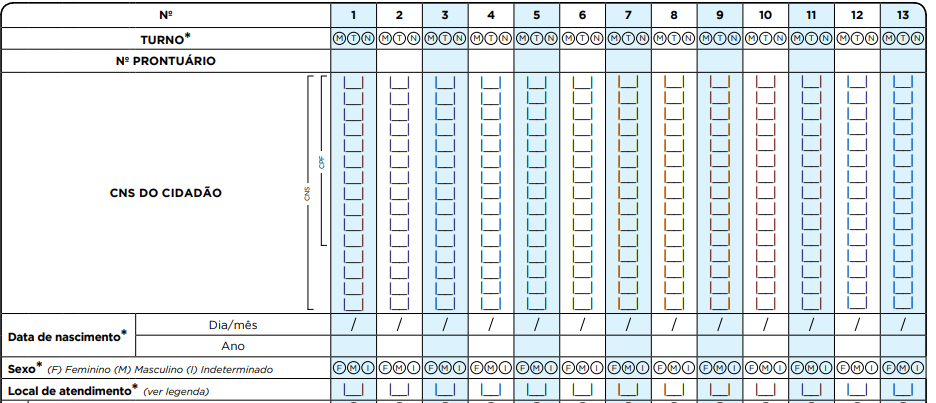

# CAPÍTULO 3 - Ficha de Atendimento Individual
{: .no_toc }

## Sumário
{: .no_toc .text-delta }

- TOC
{:toc}

**Objetivo da ficha:** registro das informações de atendimentos individuais realizados por profissionais de nível superior na Atenção Básica. Não objetiva esgotar todo o processo de atendimento de um indivíduo e também não substitui o registro clínico feito no prontuário clínico de papel. As informações que constam na ficha foram selecionadas segundo a sua relevância e por comporem indicadores de monitoramento e avaliação da AB e das Redes de Atenção à Saúde.

**Profissionais que utilizam esta ficha:** É utilizada por profissionais de nível superior das equipes de Atenção Básica, do Núcleo de Apoio à Saúde da Família (NASF), do Polo Academia da Saúde, do Consultório na Rua (eCR) e das equipes de Atenção Básica Prisional (eABP), com exceção do cirurgião-dentista, que preenche a Ficha de Atendimento Odontológico Individual (específica para ESB).

>  **NOTA**: devem ser inseridos, na ficha, os registros dos atendimentos realizados, **por profissional**, **exceto** quando for realizado um **atendimento compartilhado**. Neste caso, deve-se preencher uma Ficha de Atendimento Individual, com os dados dos dois profissionais que realizaram o atendimento compartilhado.

>  **ATENÇÃO**: a ficha com registro de atendimento compartilhado, **não deve** ser utilizada para registrar outros atendimentos individuais realizado por apenas um dos profissionais.

A seguir, serão apresentados os campos da Ficha de Atendimento Individual e as orientações sobre como preenchê-los. Os campos assinalados com asterisco (/*) são de preenchimento obrigatório.  

## 3.1 Cabeçalho

O cabeçalho tem um bloco para a identificação e controle da digitação, que é importante na organização do trabalho a nível local. Este bloco é preenchido pelo digitador.

Figura 3.1 -- Identificação e controle da digitação da ficha

*Fonte: SAS/MS.*

Quadro 3.1 -- Identificação e controle da digitação

|CAMPO|ORIENTAÇÃO SOBRE O BLOCO/PREENCHIMENTO|
|-|-|
|DIGITADO POR|Nome do profissional que digitou a ficha.|
|DATA|Dia/mês/ano em que a digitação foi realizada no sistema.|
|CONFERIDO POR|Nome do profissional que fez a supervisão do preenchimento da ficha.|
|FOLHA Nº|Este campo pode ser utilizado na organização do processo de trabalho do profissional que realizou o cadastro, por meio da inserção de numeração das folhas.|

*Fonte: SAS/MS.*

## 3.2 Identificação do(s) profissional(is) e lotação(ões)

O próximo bloco é utilizado para identificar o profissional que realizou os atendimentos individuais e informar quando é realizado um atendimento compartilhado (neste caso, deve-se preencher ficha específica).

Figura 3.2 -- Identificação do(s) profissional(is) e lotação(ões)

*Fonte: SAS/MS.*

Quadro 3.2 -- Identificação do(s) profissional(is) e lotação(ões)

|CAMPO|ORIENTAÇÃO DE PREENCHIMENTO|
|-|-|
|CNS do Profissional*|Número do Cartão Nacional de Saúde (CNS) do profissional que realizou os atendimentos individuais.|
|CBO*|Classificação Brasileira de Ocupações (CBO) do profissional que realizou os atendimentos individuais.|
|CNES*|Código do Cadastro Nacional de Estabelecimentos de Saúde (CNES) da Unidade Básica de Saúde onde o profissional está lotado.|
|INE*|Código Identificador Nacional de Equipes (INE) no Cadastro Nacional de Estabelecimentos de Saúde (CNES) do Ministério da Saúde, onde o profissional está lotado, seja equipes Saúde da Família, NASF, CnR, etc. Este campo não é obrigatório para profissionais que não estão vinculados a equipes.|
|DATA*|Dia/mês/ano em que foram realizados os atendimentos.|

*Fonte: SAS/MS.*

\* *Campo de preenchimento obrigatório.*

>  **ATENÇÃO**: os **atendimentos compartilhados**, realizado com frequência pelas equipes de NASF e de AB, esse tipo de atendimento deve ser informado nas fichas do CDS inserindo-se todos os dados (CNS do profissional, CBO, CNES, INE) dos profissionais que realizaram o atendimento compartilhado.

## 3.3 Identificação dos cidadãos e local do atendimento

>  ATENÇÃO: Para aumentar o número de registros identificados, a partir da versão 3.2.20 é possível registrar CNS ou CPF do cidadão atendido.

Figura 3.3 -- Identificação do cidadão e local de atendimento

*Fonte: SAS/MS.*

Quadro 3.3 -- Identificação dos cidadãos e local de atendimento

|     CAMPO    |     ORIENTAÇÃO SOBRE O BLOCO/PREENCHIMENTO    |
|-|-|
|     N°    |     Em cada ficha pode-se registrar informações de até 13 atendimentos   distintos.     |
|     TURNO*    |     Turno em que foram realizados os   atendimentos, sendo: M - manhã, T - tarde ou N - noite.    |
|     Nº PRONTUÁRIO    |     Campo destinado ao número do prontuário   da família no estabelecimento de saúde. Este campo é usado como referência da   informação do paciente na unidade, para os casos em que seja necessário fazer   verificação dos dados.    |
|     CNS ou CPF   DO CIDADÃO    |     Campo destinado ao número do Cartão   Nacional de Saúde (CNS) do cidadão que está em atendimento. Os números devem   ser inseridos no sentido vertical. Cidadãos sem o CNS poderão e deverão ser   atendidos pela equipe.     |
|     DATA DE NASCIMENTO*     |     Informe o dia, mês e ano do nascimento do   cidadão. Variável de verificação do CNS.     |
|     SEXO*    |     Assinalar F – feminino ou M – masculino.    |
|     LOCAL DE ATENDIMENTO*    |     Informar o número referente ao local em   que foi realizado o atendimento do usuário, considerando as seguintes opções:     (01) UBS - Unidade Básica de Saúde     (02) Unidade Móvel     (03) Rua     (04) Domicílio     (05) Escola/Creche     (06) Outros     (07) Polo (Academia da Saúde) – denomina-se polo a unidade (espaço físico) do Programa Academia da   Saúde. É considerado polo tanto a estrutura física construída especificamente   para o desenvolvimento do programa quanto o espaço físico destinado para tal   fim nas dependências de uma UBS, desde que o número de CNES desta UBS esteja   associado ao código 12 (estrutura de Academia da Saúde).     (08) Instituição/Abrigo – instituições para acolhimento destinadas a famílias e/ou indivíduos   com vínculos familiares rompidos ou fragilizados, a fim de garantir proteção   integral.     (09) Unidade prisional ou congêneres – cadeia pública, colônia agrícola,   industrial ou similar, casa do albergado, centro de observação e hospital de   custódia e tratamento psiquiátrico.     (10) Unidade socioeducativa – base física necessária para a organização   e o funcionamento de programa de atendimento de medidas socioeducativas.    |

*Fonte: SAS/MS.*

\* *Campo de preenchimento obrigatório.*

É importante que todos os cidadãos do território adscrito tenham o
número do CNS, mesmo que este item não seja de preenchimento
obrigatório. Esse número é essencial para a identificação e vinculação
do cidadão. Caso o número não seja preenchido, não será possível
visualizar informações identificadas nos relatórios de saúde e serão
obtidos apenas dados consolidados.

## 3.4 Informações do atendimento

Este bloco apresenta informações do atendimento, tais como tipo de atendimento, problema/condição avaliada, exames, conduta, entre outras. A seguir, são detalhados os campos.

### 3.4.1 Tipo de atendimento

Neste bloco, são registrados os tipos de atendimentos realizados pelas equipes de Atenção Básica.

Figura 3.4 - Tipo de atendimento

*Fonte: SAS/MS.*

\* *Campo de preenchimento obrigatório.*

Quadro 3.4 -- Tipo de atendimento

|     CAMPO    |     ORIENTAÇÃO SOBRE O BLOCO/PREENCHIMENTO    |
|-|-|
|     CONSULTA AGENDADA   PROGRAMADA/CUIDADO CONTINUADO    |     São consultas que constituem ações   programáticas individuais, direcionadas para os ciclos de vida, doenças e   agravos prioritários, as quais necessitam de acompanhamento contínuo. Como   exemplo, o cuidado dispensado às gestantes, crianças, idosos, pessoas com doenças   crônicas (hipertensão arterial, diabetes),   etc.    |
|     CONSULTA AGENDADA    |     É toda consulta realizada com   agendamento prévio. É oriunda da demanda espontânea ou por agendamento direto   na recepção, de caráter não urgente e que não foi atendida no mesmo dia da   procura, mas agendada para outro dia. Por exemplo, casos de lesões de pele,   sem sinais flogísticos ou infecciosos; queixas inespecíficas de fadiga;   cansaço; cefaleia crônica; mudança ou início de medicação anticoncepcional   etc.    |
|     ESCUTA INICIAL/ORIENTAÇÃO    |     Refere-se à escuta realizada por   profissional de nível superior no momento em que o usuário chega ao serviço   de saúde, relatando queixas ou sinais e sintomas percebidos por ele. Não   inclui as orientações de fluxos dentro da UBS.      Durante o acolhimento e a escuta, o   profissional, quando possível, irá resolver o caso por meio de orientação.   Caso contrário, poderá ser realizada a classificação de risco e análise de   vulnerabilidade para as devidas providências, por exemplo, encaminhamento para consulta   no mesmo dia ou data posterior.    |
|     CONSULTA NO DIA    |     É a consulta que é realizada no mesmo   dia em que o usuário busca o serviço, de caráter não urgente. Pode   representar também a consulta realizada no dia por haver disponibilidade na   agenda do profissional. Como exemplo, quadros com sintomas de dor de grande   intensidade ou que não têm indicação de aguardar agendamento para outro dia,   como dor lombar, dor na garganta, sintomas urinários etc. Outra indicação de   atendimento no mesmo dia pode estar relacionada com a vulnerabilidade social   ou psíquica do usuário.    |
|     ATENDIMENTO DE URGÊNCIA    |     É o atendimento realizado ao usuário   quando há possibilidade de agravamento do quadro ou risco de vida e que   determina a necessidade de assistência imediata para alívio do sofrimento   físico e/ou psíquico, recuperação do estado de saúde, estabilização/suporte   de vida e/ou encaminhamento a outro ponto da rede quando necessário. Como   exemplos, casos de dor torácica, sintomas e/ou sinais neurológicos, urgência   hipertensiva etc.    |

*Fonte: SAS/MS.*

\* *Campo de preenchimento obrigatório.*

Figura 3.5: Atenção Domiciliar e Racionalidades em Saúde

*Fonte: SAS/MS.*

### 3.4.2 Atenção Domiciliar

Esse bloco será utilizado por profissionais de nível superior da AB e NASF. A partir do registro da modalidade de atenção domiciliar (AD), é possível que a equipe identifique quantos e quais são os usuários de seu território que necessitam de cuidado continuado em domicílio, para, assim, poder se organizar melhor para realizar o cuidado a esses usuários. Também permite a identificação de usuários do território que necessitam de outras modalidades de AD (2 ou 3) elegíveis para o acompanhamento pelas equipes do Serviço de Atenção Domiciliar (Programa Melhor em Casa).

A modalidade de atenção domiciliar deve ser preenchida nos casos em que se preveja um cuidado continuado no domicílio, e não naqueles casos de atendimentos pontuais. Por exemplo, se o atendimento for a um paciente acamado após um acidente vascular cerebral, o cuidado prestado pela equipe provavelmente será contínuo; com isso, é importante registrar a modalidade de AD de forma a gerar dados para o acompanhamento contínuo. Ao contrário, não é recomendado esse registro, por exemplo, no caso de um atendimento domiciliar pontual a uma pessoa com transtorno afetivo bipolar, que usualmente receba atendimentos na UBS. Atentar para que, em ambas as situações exemplificadas, no campo "Local de atendimento", deve-se marcar "domicílio".

**Quadro 3.5 -- Modalidades de Atenção Domiciliar.**

|MODALIDADES DE ATENÇÃO DOMICILIAR|DEFINIÇÃO|
|-|-|
|**AD1** Atenção Domiciliar modalidade tipo 1|prestação da assistência à saúde na modalidade AD1 é de responsabilidade das equipes de Atenção Básica (eSF, eAB, NASF), por meio de atendimentos regulares em domicílio. Destina-se a usuários que possuam problemas de saúde controlados/compensados e com dificuldade ou impossibilidade física de locomoção até uma unidade de saúde e que necessitem de cuidados com menor frequência e com menor necessidade de intervenções multiprofissionais, uma vez que se pressupõe estabilidade e cuidados satisfatórios pelos cuidadores.|
|**AD2** Atenção Domiciliar modalidade tipo 2|prestação da assistência à saúde na modalidade AD2 é de responsabilidade dos Serviços de Atenção Domiciliar, por meio das EMAD e EMAP, mantendo-se o cuidado compartilhado com as equipes de Atenção Básica. Referem-se a usuários que possuam problemas de saúde e dificuldade ou impossibilidade física de locomoção até uma unidade de saúde e que necessitem de maior frequência de cuidado, recursos de saúde e acompanhamento contínuo, podendo ser oriundos de diferentes serviços da rede de atenção. Exemplos de situações que caracterizam AD2: adaptação ao uso de sondas e ostomias; acompanhamento domiciliar em pós-operatório; uso de aspirador de vias aéreas para higiene brônquica; necessidade de medicação parenteral.|
|**AD3** Atenção Domiciliar modalidade tipo 3| prestação da assistência à saúde na modalidade AD3 é de responsabilidade das equipes de Atenção Domiciliar (EMAD e EMAP), mantendo-se o cuidado compartilhado com a equipe de Atenção Básica. Quando necessitar de cuidado multiprofissional mais frequente, uso de equipamento(s) ou agregação de procedimento(s) de maior complexidade (por exemplo, ventilação mecânica, paracentese de repetição, nutrição parenteral e transfusão sanguínea), usualmente demandando períodos maiores de acompanhamento domiciliar.|

Fonte: Portaria GM/MS nº 825, de 25 de abril de 2016.

### 3.4.3 Racionalidade em saúde

Com base no termo Racionalidades Médicas que é todo o sistema médico complexo construído sobre seis dimensões: morfologia humana, dinâmica vital, doutrina médica (o que é estar doente ou ter saúde), sistema diagnóstico, cosmologia e sistema terapêutico; o termo Racionalidades em Saúde propõe uma ampliação desse conceito para uma abordagem multiprofissional de cuidado em saúde, incluindo as práticas tradicionais/ populares, ancestrais e ou alternativas.

Quadro 3.6 -- Racionalidade em Saúde

|CAMPO	ORIENTAÇÃO SOBRE O BLOCO/PREENCHIMENTO|
|-|
|Tipos de racionalidades em saúde	●	01 - Medicina Tradicional Chinesa  ●	02 - Antroposofia Aplicada à Saúde  ●	03 - Homeopatia   ●	04 - Fitoterapia   ●	05 - Ayurveda   ●	06 - Outra (Caso a racionalidade utilizada seja a Alopatia/ Convencional, deixar este campo em branco)|

*Fonte: SAS/MS.*

### 3.4.4 Avaliação antropométrica

Este campo é composto por informações essenciais de acompanhamento nutricional dos usuários do serviço de saúde em que são informados:

Figura 3.6 - Avaliação antropométrica

*Fonte: SAS/MS.*

Quadro 3.7 -- Avaliação antropométrica

|CAMPO|ORIENTAÇÃO SOBRE O BLOCO/PREENCHIMENTO|
|-|-|
|PERÍMETRO CEFÁLICO|Anote o perímetro cefálico do cidadão em **centímetros**.|
|PESO (KG)|Anote o peso do cidadão em **quilogramas**.|
|ALTURA (CM)|Anote a altura do cidadão em **centímetros**.|

*Fonte: SAS/MS.*

### 3.4.5 Vacinação em dia, criança e gestante

O campo **vacina em dia** é destinado a qualquer indivíduo. As informações no campo **criança**, são utilizadas para dados de aleitamento materno de crianças até 2 anos de idade e o campo **gestante**, para história pregressa e atual da gestação.  

Figura 3.6 -- Vacinação em dia, criança, gestante

*Fonte: SAS/MS.*

Quadro 3.8 -- Vacinação em dia, criança, gestante

|     CAMPO    |     ORIENTAÇÃO SOBRE O BLOCO/PREENCHIMENTO    |
|-|-|
|     VACINAÇÃO EM DIA?    |     Campo destinado a informar se   a vacinação de determinado indivíduo, de qualquer faixa etária, está em dia   pelos parâmetros preconizados. A ficha de atendimento individual não   contempla o registro das vacinas realizadas.     |
|     CRIANÇA     Aleitamento Materno          |     Utilizar o número indicado na   legenda:  01 – Aleitamento materno exclusivo (AME) – quando a criança recebe somente leite   materno, da mama ou ordenhado, ou leite humano de outra fonte, sem outros   líquidos ou sólidos, com exceção de medicamentos, sais de reidratação oral e   vitaminas.  02 – Aleitamento materno predominante (AMP) – quando a criança recebe, além do   leite materno, água ou bebidas à base de água (água adocicada, chás,   infusões, sucos de frutas).   03 – Aleitamento materno complementado (AMC) – quando a criança recebe, além do   leite materno, qualquer alimento sólido ou semissólido com a finalidade de   complementá-lo, e não de substituí-lo. Nessa categoria, a criança pode   receber, além do leite materno, outro tipo de leite.  04 – Aleitamento materno inexistente (AMI) – a criança ingere alimentos sólidos e   semissólidos, sem o leite materno.    |
|     GESTANTE    |     **DUM** (dia/mês/ano): informar dia, mês e ano da última menstruação da gestante.       **Gravidez planejada**: assinalar se a gestação foi planejada ou não.       **Idade gestacional (semanas)**: registrar com quantas semanas de gestação a mulher se   encontra. Não preencher os dias, apenas as semanas.       **Gestas prévias/partos**: preencher número de gestações anteriores à atual (não incluir a   gestação atual) e o número de partos. Não incluir em “partos” casos de   aborto. Exemplo: mulher é atendida   em sua terceira gestação. Tem uma filha e história de um aborto. O   preenchimento na ficha será 2/1 ou 02/01, ou seja, duas gestações prévias e   um parto.    |

*Fonte: SAS/MS.*

### 3.4.6 Problema/condição avaliada

Estes campos devem ser utilizados para registrar problemas/condições de saúde avaliados e manejados pelo profissional de saúde **no momento do atendimento**. Bloco de preenchimento obrigatório, ao menos uma opção deverá ser assinalada (opção descrita na lista de Problema/Condição Avaliada e/ou codificação pela CIAP-2/CID-10).

A primeira parte do bloco deve ser preenchida marcando um "X" na opção da linha correspondente ao problema identificado ou condição avaliada. Somente se o problema não estiver descrito na ficha, poderá ser utilizado o campo "**Outros**" para esse registro, podendo registrar: CIAP-2 (Classificação Internacional de Atenção Primária) e CID-10 (Classificação Internacional de Doenças).

-   **CIAP-2**: dois campos de código para registrar problemas     identificados usando a Classificação Internacional de Atenção     Primária, versão 2. No Anexo O, pode-se encontrar pequena descrição     da CIAP 2 e como deve ser utilizada para identificar problemas.     Conheça também o [Sumário da CIAP-2](http://www.sbmfc.org.br/media/CIAP2_sumario_correcao_W84.pdf).

-   **CID-10**: dois campos que permitem registrar problemas     identificados utilizando a Classificação Internacional de Doenças, versão 10.

***Exemplo de registro***

Usuário procurou a unidade de saúde por estar com dor lombar. No histórico de saúde, consta que é hipertenso. O profissional que o atender pode abordar como está o tratamento, o uso das medicações, solicitar exames de acompanhamento para a hipertensão. No registro desse atendimento, será identificado no campo "Outros" o código da CIAP 2 (código L 03) ou da CID 10 (código M 54.5) de dor lombar; além de assinalado o problema "hipertensão arterial", visto que também foi um problema/condição avaliado e manejado na consulta. Seguindo esse mesmo exemplo, caso o usuário também tenha asma, que no momento está controlada e não foi avaliada ou manejada nessa consulta, **NÃO** deverá ser marcado o item "asma", mantendo identificado apenas o caso de dor lombar e o problema de hipertensão arterial. Portanto, o bloco de informações sobre "Problema/condição avaliada" se refere a questões que foram avaliadas e manejadas **na consulta**, e não a um registro dos antecedentes de saúde do usuário.

**Obs.:** não deve-se codificar o problema/condição avaliado, pela CIAP 2 e/ou CID 10, caso esteja descrito nos campos anteriores. Conforme o exemplo anterior, não será preciso identificar pelos códigos (CIAP 2 ou CID 10) a "hipertensão arterial", pois já está descrita, neste caso, basta assinalar.

Figura 3.7 -- Problema/condição avaliada

*Fonte: SAS/MS.*

\* *Campo de preenchimento obrigatório.*

**Quadro 3.9 -- Problema/condição avaliada/***

|CAMPOS|ORIENTAÇÃO SOBRE O BLOCO/PREENCHIMENTO|
|-|-|
|ASMA, DESNUTRIÇÃO, DIABETES, DPOC, HIPERTENSÃO ARTERIAL, OBESIDADE, PRÉ-NATAL, PUERICULTURA, PUERPÉRIO (ATÉ 42 DIAS), SAÚDE SEXUAL E REPRODUTIVA, TABAGISMO, USUÁRIO DE ÁLCOOL, USUÁRIO DE OUTRAS DROGAS, SAÚDE MENTAL, REABILITAÇÃO|Preencher marcando um "X" na opção da linha correspondente ao problema identificado ou condição avaliada abordados no atendimento. É obrigatório marcar ao menos uma opção sobre o problema/condição de saúde avaliada. Somente se o problema não estiver descrito na ficha, poderá ser utilizado o campo "**Outros**" para esse registro.|
|**DOENÇAS TRANSMISSÍVEIS**|Marque a opção que identifique a situação encontrada.|
|TUBERCULOSE, HANSENÍASE, DENGUE, DST|Marque a opção que identifique a situação|
|**RASTREAMENTO**|Marque a opção que identifique a situação encontrada.|
|CÂNCER DE COLO DE ÚTERO| Orientação e realização/encaminhamento de exame específico. Obs.: se a coleta do exame citopatológico ocorrer na UBS, este deve ser registrado na ficha de procedimentos[^7].|
|CÂNCER DE MAMA| Orientação e realização de exame clínico de mamas e/ou encaminhamento para realização de mamografia[^8].|
|RISCO CARDIOVASCULAR| Realização da avaliação de risco pelo escore de Framingham; rastreamento de dislipidemia, hipertensão e diabetes mellitus[^9].|
|**OUTROS**||
|CIAP-2 e CID-10|Caso o problema não esteja descrito no bloco "problema/condição avaliada", pode ser utilizado o campo "**Outros**" para esse registro, utilizando os códigos CIAP-2 e/ou CID-10.|

*Fonte: SAS/MS.*

\* *Campo de preenchimento obrigatório.*

### 3.4.7 Exames solicitados (S) e avaliados (A)

Conforme citado no início deste capítulo, a Ficha de Atendimento Individual não objetiva esgotar todo o processo de atendimento do indivíduo e, especificamente nesse ponto, todos os exames solicitados e avaliados. [Cabe às equipes e gestão municipal a discussão de quais outros exames são relevantes e que devem ser registrados localmente]{.ul} para monitoramento e avaliação.

Figura 3.8 -- Bloco de exames solicitados (S) e avaliados (A)

*Fonte: SAS/MS.*

Quadro 3.10 -- Exames solicitados (S) e avaliados (A)

|CAMPO|ORIENTAÇÃO SOBRE O BLOCO/PREENCHIMENTO|
|-|-|
|COLESTEROL TOTALCREATININA, EAS/EQU (ELEMENTOS ANORMAIS DO SEDIMENTO. SINÔNIMO DE EXAME COMUM DE URINA, PARCIAL DE URINA, URINA TIPO I), ELETROCARDIOGRAMA, ELETROFORESE DE HEMOGLOBINA, ESPIROMETRIA, EXAME DE ESCARRO, GLICEMIA, HDL, HEMOGLOBINA, GLICADA, HEMOGRAMA, LDL, RETINOGRAFIA/FUNDO DE OLHO, COM OFTALMOLOGISTA, SOROLOGIA PARA SÍFILIS (VDRL), SOROLOGIA,PARA DENGUE, SOROLOGIA PARA HIV, TESTE INDIRETO DE ANTIGLOBULINA HUMANA (TIA), TESTE DE GRAVIDEZ, ULTRASSONOGRAFIA, OBSTÉTRICA, UROCULTURA|O campo “S” deve ser assinalado com um “X” quando o exame for solicitado na consulta; o campo “A” deve ser assinalado com um “X” quando o resultado desse tipo de exame for avaliado pelo profissional durante a consulta.|
|**TRIAGEM NEONATAL** TESTE DA ORELHINHA (EOA), TESTE DO OLHINHO (TRV), TESTE DO PEZINHO|	O campo “S” deve ser assinalado com um “X” quando o exame for solicitado na consulta; o campo “A” deve ser assinalado com um “X” quando o resultado desse tipo de exame for avaliado pelo profissional durante o atemdimento.|
|OUTROS EXAMES (código do SIGTAP)|	Campo destinado para registro de exames que não se encontram listados acima. Utilizar código do SIGTAP. Saiba mais: http://sigtap.datasus.gov.br/tabela-unificada/app/sec/inicio.jsp |

*Fonte: SAS/MS.*

### 3.4.8 Ficou em observação?

Caso o usuário tenha ficado ou não em observação durante o atendimento, essa informação deverá ser registrada neste campo.

Figura 3.9 - Ficou em observação?

*Fonte: SAS/MS.*

Quadro 3.11 - Ficou em observação?

|CAMPO|ORIENTAÇÃO SOBRE O BLOCO/PREENCHIMENTO|
|FICOU EM OBSERVAÇÃO?|Deve ser marcado "**Sim**" quando o cidadão necessitou ficar em observação serviço de saúde, com ou sem medicação, para recuperação do seu estado de saúde ou estabilização, e/ou aguardando ser encaminhado para outro ponto da rede. Caso contrário, deve ser marcado a opção **"Não"**.|

*Fonte: SAS/MS.*

>  **ATENÇÃO**: **concluído** o tempo de **observação**, o campo "**Conduta**" **deve** ser **informado** normalmente, por exemplo, informando se o cidadão foi "Encaminhamento para urgência" ou se teve "Alta do episódio", de acordo com cada caso.

### 3.4.9 Núcleo de Apoio à Saúde da Família (NASF) e Polo Academia da Saúde

Os profissionais do NASF e do Polo Academia da Saúde devem utilizar toda a Ficha de Atendimento Individual e, inclusive, o bloco específico NASF/Polo.

Figura 3.10 -- Informações para uso exclusivo das equipes do NASF e atividades desenvolvidas no Polo Academia da Saúde

*Fonte: SAS/MS.*

Este bloco foi dividido em três: avaliação/diagnóstico, procedimentos clínicos/terapêuticos e prescrição terapêutica.

Quadro 3.12 -- Campo exclusivo para uso dos profissionais do NASF e Polo Academia da Saúde

|CAMPO|ORIENTAÇÃO SOBRE O BLOCO/PREENCHIMENTO|
|-|-|
|AVALIAÇÃO/DIAGNÓSTICO|Deve ser marcado sempre que forem realizados anamneses, testes e avaliações (testes físicos, inquérito alimentar, avaliação funcional, avaliação psicológica, social, avaliação antropométrica, avaliação psicossocial, entre outros).|
|PROCEDIMENTOS CLÍNICOS/TERAPÊUTICOS|Deve ser marcado sempre que ocorrer intervenção (manipulações osteoarticulares, exercícios respiratórios, estimulações neurossensoriais, exercícios ortoarticulares, exercícios de equilíbrio, psicoterapia, entre outras).|
|PRESCRIÇÃO TERAPÊUTICA|Deve ser marcado sempre que ocorrerem prescrições, orientações e recomendações (prescrições de atividades psicoterapêuticas, recomendações para o usuário -- como dietas, exercícios, adaptações no domicílio para atender às demandas relacionadas à funcionalidade e à autonomia, entre outras).|

*Fonte: SAS/MS.*

### 3.4.10 Conduta/Desfecho

É utilizado para registrar a conduta/desfecho do atendimento realizado. É obrigatório marcar, **pelo menos**, uma opção.

Figura 3.11 - Conduta

*Fonte: SAS/MS.*

Quadro 3.13 -- Conduta

|CAMPO|ORIENTAÇÃO SOBRE O BLOCO/PREENCHIMENTO|
|-|-|
|RETORNO PARA CONSULTA AGENDADA|Conduta atribuída no momento do atendimento em consulta ou em escuta inicial que demande o agendamento de nova consulta. Não devem ser marcados aqui os retornos que caracteristicamente sejam de cuidado continuado ou programado.
|RETORNO PARA CUIDADO CONTINUADO/PROGRAMADO|Conduta aplicada aos casos em que for necessário o retorno para continuidade do cuidado, como condições crônicas ou de acompanhamento prolongado.|
|AGENDAMENTO PARA GRUPOS|Assinalar quando o usuário for orientado a participar de algum grupo terapêutico, de educação em saúde ou de convivência.|
|AGENDAMENTO PARA NASF|Campo utilizado para registrar o agendamento do cidadão para os profissionais do NASF.|
|ALTA DO EPISÓDIO|Utilizado para identificar os atendimentos realizados sem a necessidade de retorno referente ao problema ou condição apresentada.|
|ENCAMINHAMENTO INTERNO NO DIA|Assinalar quando, após o atendimento, o usuário for encaminhado para atendimento de outro profissional da UBS.|
|ENCAMINHAMENTO PARA SERVIÇO ESPECIALIZADO|Utilizado para registrar os casos em que for necessário fazer encaminhamento do usuário para serviço especializado.
|ENCAMINHAMENTO PARA CAPS|Utilizado para registrar os casos em que for necessário fazer encaminhamento do usuário para o Centro de Atenção Psicossocial (Caps).
|ENCAMINHAMENTO PARA INTERNAÇÃO HOSPITALAR|Utilizado para registrar os casos em que for necessário fazer encaminhamento do usuário para internação hospitalar.
|ENCAMINHAMENTO PARA URGÊNCIA|Utilizado para registrar os casos em que for necessário fazer encaminhamento do usuário para atendimento de urgência.
|ENCAMINHAMENTO PARA SERVIÇO DE ATENÇÃO DOMICILIAR|Utilizado para registrar os casos em que for necessário fazer encaminhamento do usuário para o Serviço de Atenção Domiciliar e que **não** sejam elegíveis para atendimento pela própria Atenção Básica.
|ENCAMINHAMENTO INTERSETORIAL|Utilizado para registrar os casos em que for necessário fazer encaminhamento do usuário para atendimento em serviços de outros setores, como: Conselho Tutelar, Centro de Referência de Assistência Social (Cras), escola etc.

*Fonte: SAS/MS.*

# CAPÍTULO 3A - FICHA COMPLEMENTAR - Registro de Emergência em Saúde Pública Síndrome Neurológica por Zika/Microcefalia

**Objetivo da ficha:** registro do acometimento de Síndrome Neurológica por Zika ou de Microcefalia. O preenchimento desta ficha é complementar a Ficha de Atendimento Individual para os casos de atendimento do profissional de nível superior a crianças que apresentam microcefalia (código CID10 Q02).

**Profissionais que utilizam esta ficha:** profissionais de nível superior da equipe de Atenção Básica.

O profissional deverá preencher com as informações de cada atendimento, para os casos de Síndrome Neurológica por Zika ou de Microcefalia (código CID10 - Q02), complementarmente em relação aos resultados de exames e vinculado a um atendimento individual por meio do CNS do cidadão registrado na Ficha de Atendimento Individual. A seguir, serão apresentados os campos da Ficha Complementar e as orientações sobre como preenchê-la. Os campos assinalados com asterisco (/*) são de preenchimento obrigatório.

## 3A.1 Cabeçalho

O cabeçalho do instrumento, assim como de todas as fichas do CDS, tem um bloco para a identificação e controle da digitação, que é importante na organização do trabalho no nível local. Este bloco será preenchido pelo digitador.

Figura 3A.1 -- Identificação e controle da digitação da ficha

*Fonte: SAS/MS.*

Quadro 3A.1 -- Identificação e controle da digitação

|CAMPO|ORIENTAÇÃO SOBRE O BLOCO/PREENCHIMENTO|
|-|-|
|DIGITADO POR|Nome do profissional que digitou a ficha.|
|DATA|Dia/mês/ano em que a digitação foi realizada no sistema.|  |CONFERIDO POR|Nome do profissional que fez a supervisão do preenchimento da ficha.|
|FOLHA Nº|Este campo pode ser utilizado na organização do processo de trabalho do profissional que realizou o cadastro, por meio da inserção de numeração das folhas.|

*Fonte: SAS/MS.*

## 3A.2 Identificação do estabelecimento de saúde e do(s) profissional(is)

Figura 3A.2 -- Identificação do estabelecimento de saúde e do(s) profissional(is)

*Fonte: SAS/MS.*

Quadro 3A.2 -- Identificação do profissional e do estabelecimento de saúde

|CAMPO|ORIENTAÇÃO SOBRE O BLOCO/PREENCHIMENTO|
|-|-|
|CNS DO PROFISSIONAL*|   Número do Cartão Nacional de Saúde (CNS) do profissional que realizou o atendimento.|
|CBO*|                   Classificação Brasileira de Ocupações (CBO) do profissional que realizou os atendimento.|
|CNES*|                  Código do Cadastro Nacional de Estabelecimentos de Saúde (CNES) da Unidade Básica de Saúde onde o profissional está lotado.|
|INE*|                   Código Identificador Nacional de Equipes (INE) no Cadastro Nacional de Estabelecimentos de Saúde (CNES) do Ministério da Saúde, onde o profissional está lotado, seja equipes Saúde da Família, NASF, etc. Este campo não é obrigatório para profissionais que não estão vinculados a equipes.|
|DATA*|                  Dia/mês/ano em que foram realizados os atendimentos.|

*Fonte: SAS/MS.*

\* *Campo de preenchimento obrigatório.*

## 3A.3 Identificação do cidadão

>  ATENÇÃO: Para aumentar o número de registros identificados, a partir da versão 3.2.20 é possível registrar CNS ou CPF do cidadão atendido.

Figura 3A.3 -- Identificação do cidadão

*Fonte: SAS/MS.*

Quadro 3A.3 -- Identificação do cidadão

|CAMPO|ORIENTAÇÃO SOBRE O BLOCO/PREENCHIMENTO|
|-|-|
|CNS ou CPF DO CIDADÃO*|CNS do cidadão que está em atendimento. É um campo obrigatório para que haja identificação no Sistema de Informação e Registro de Atendimento em Microcefalia (SIRAM).|
|CNS ou CPF DO RESPONSÁVEL FAMILIAR|Refere-se ao CNS do responsável familiar, que deve ser o mesmo número referido no Cadastro Domiciliar e Territorial.|

*Fonte: SAS/MS.*

\* *Campo de preenchimento obrigatório.*

## 3A.4 Resultado de Exames

A microcefalia relaciona-se com alterações do desenvolvimento neuropsicomotor e do/ comportamento que podem ser acompanhadas por problemas auditivos e visuais.

Este bloco é de preenchimento obrigatório, com o resultado dos exames recebidos pelos profissionais da equipe de Atenção Básica realizados em outros pontos da Rede de Atenção à Saúde para identificação e diagnóstico de microcefalia.

Figura 3A.4 - Resultado de Exames

*Fonte: SAS/MS.*

Quadro 3A.4 - Resultado de Exames

|     CAMPO    |     ORIENTAÇÃO SOBRE O BLOCO/PREENCHIMENTO    |
|-|-|
|     TESTE DO OLHINHO (TRV)    |     A triagem ocular neonatal ou   “Teste do Olhinho”, faz parte do exame físico do recém-nascido ainda na   maternidade, contemplando a inspeção (ectoscopia) e o teste do reflexo   vermelho, que se faz pela incidência de feixe de luz dirigido sobre os olhos   da criança e, com isso, observa-se a área pupilar, que nos bebês normais   emite um brilho laranja-avermelhado.     Marcar X na opção do resultado do exame   recebido pelo profissional no momento do atendimento, podendo ser Presente   bilateral ou Duvidoso ou ausente.    |
|     EXAME DE FUNDO   DE OLHO (02.11.06.010-0 - Fundoscopia)    |     Para auxiliar no diagnóstico   diferencial de infecções congênitas, como sífilis, toxoplasmose e   citomegalovírus, bem como a identificação de outras alterações não detectadas   na Triagem Ocular Neonatal, como retinopatia e outros transtornos oculares   congênitos e hereditários, deve-se proceder ao exame do fundo de olho, que   pode ser realizado após a alta da criança da maternidade.     Marcar X na opção do resultado do exame   recebido pelo profissional no momento do atendimento, podendo ser Normal   ou Alterado.    |
|     TESTE DA ORELHINHA - PEATE (02.11.07.027-0   - Potencial evocado auditivo para triagem auditiva)    |     A presença de microcefalia é   um indicador de risco para perda auditiva (Irda). O teste da orelhinha ou   Potencial Evocado Auditivo de Tronco Encefálico (Peate) deve ser realizada,   preferencialmente, nos primeiros dias de vida (24 h a 48 h), e preferencialmente   ainda na maternidade.      Marcar X na opção do resultado do exame   recebido pelo profissional no momento do atendimento, podendo ser Passou   ou Falhou.    |
|     EXAMES DE cds_imageM    |     US TRANSFONTANELA   (02.05.02.017-8 Ultrassonografia transfontanela):   indicada para crianças com fontanela aberta, o que se verifica geralmente até   os 6 meses de idade.     Marcar X na opção do resultado do exame   recebido pelo profissional no momento do atendimento, podendo ser Normal,   Sugestivo de infecção congênita, Outras alterações ou Indeterminado.      TOMOGRAFIA COMPUTADORIZADA (02.06.01.007-9 - Tomografia computadorizada   do crânio): sem contraste, para RN cujo tamanho da fontanela   impossibilite a US-TF e para aqueles em que, após a US-TF, ainda persista   dúvida diagnóstica.      Marcar X na opção do resultado do exame   recebido pelo profissional no momento do atendimento, podendo ser Normal,   Sugestivo de infecção congênita, Outras alterações ou Indeterminado.      RESSONÂNCIA MAGNÉTICA (02.07.01.006-4 - Ressonância magnética de   crânio): a ressonância   deve permitir uma melhor avaliação das malformações, especialmente por   possibilitar uma melhor caracterização das alterações corticais e uma melhor   avaliação da substância branca.      Marcar X na opção do resultado do exame   recebido pelo profissional no momento do atendimento, podendo ser Normal,   Sugestivo de infecção congênita, Outras alterações ou Indeterminado.    |

*Fonte: SAS/MS.*

\* *Campo de preenchimento obrigatório.*

>  **NOTA**: para saber mais a respeito do Plano Nacional de Enfrentamento à Microcefalia, acesse os endereços eletrônicos [http://189.28.128.100/dab/docs/portaldab/documentos/Protocolo_microcefalia_virus_Zika.pdf](http://189.28.128.100/dab/docs/portaldab/documentos/Protocolo_microcefalia_virus_Zika.pdf) e [http://dab.saude.gov.br/portaldab/combate_aedes_aegypti.php?conteudo=material_apoio](http://dab.saude.gov.br/portaldab/combate_aedes_aegypti.php?conteudo=material_apoio)

[^6]: Disponível em: <https://cadastro.saude.gov.br/cadsusweb/manual.pdf/>.

[^7]: Caderno de Atenção Básica (CAB) nº 13 (BRASIL, 2013); CAB nº 29 (BRASIL, 2010).

[^8]: CAB nº 13 (BRASIL, 2013); CAB nº 29 (BRASIL, 2010).

[^9]: CAB nº 29 (BRASIL, 2010).
