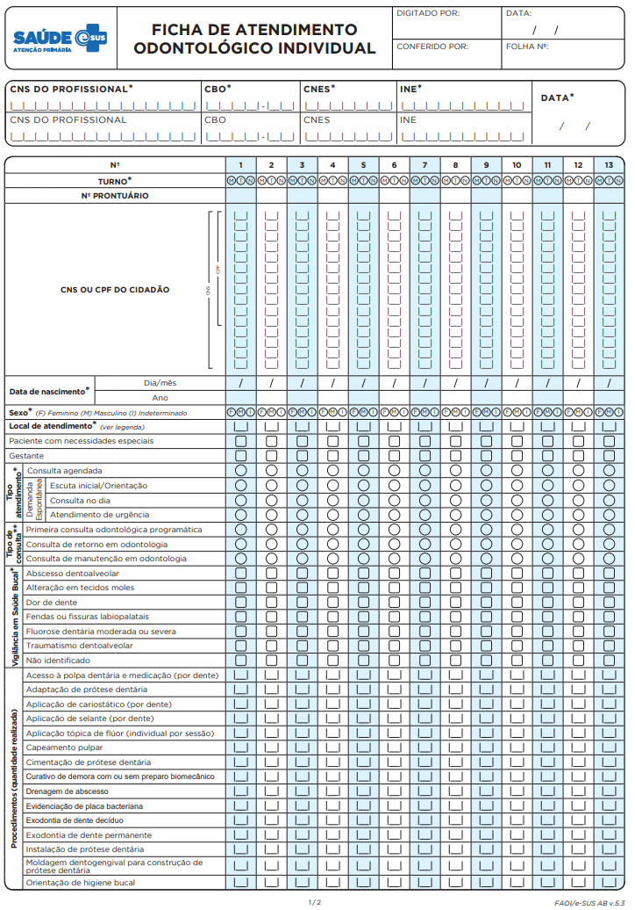
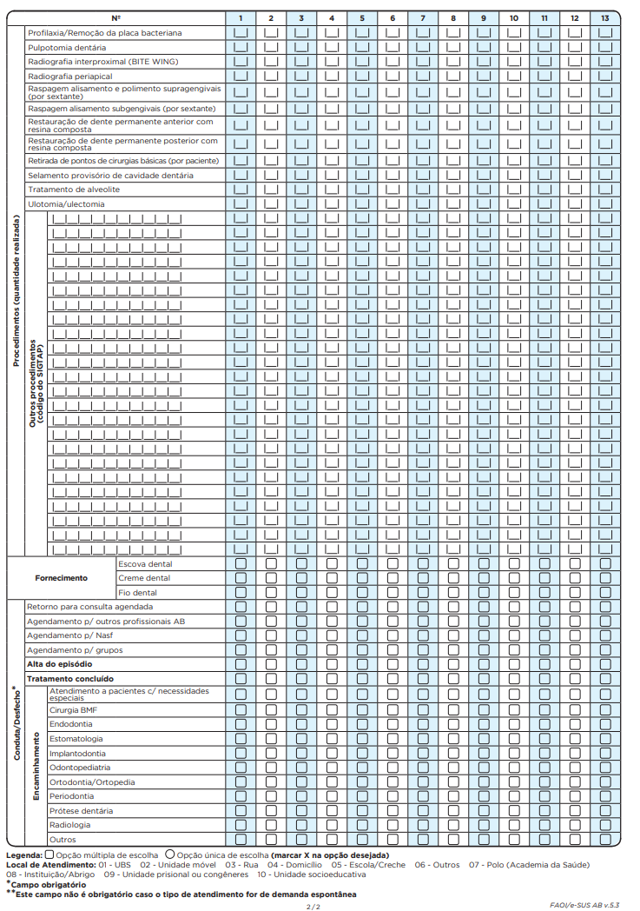
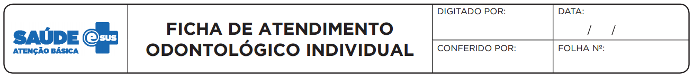
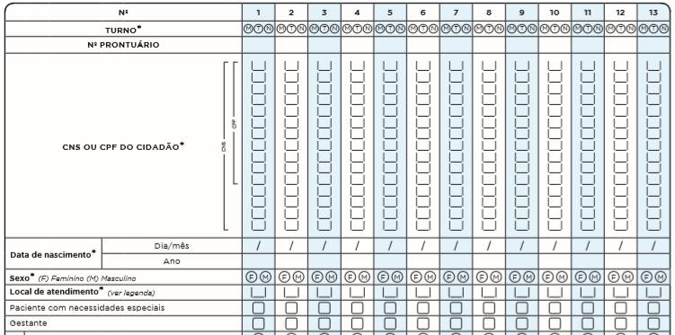
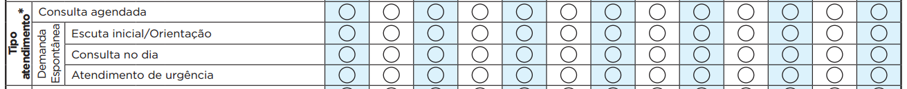
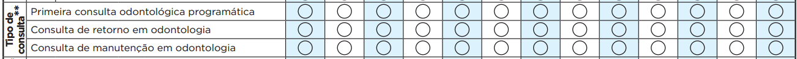
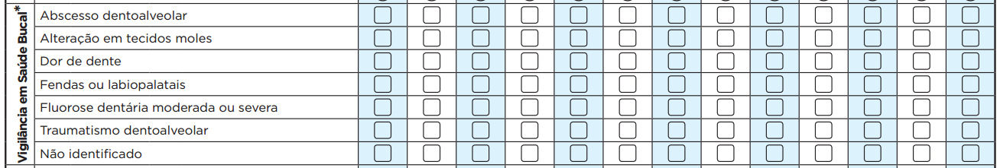
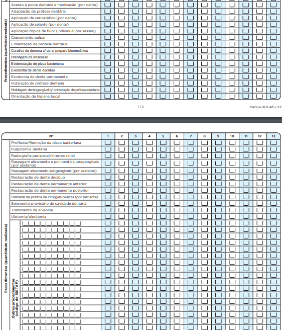
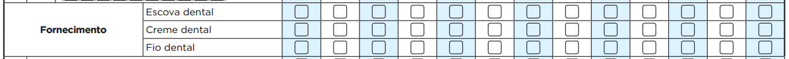
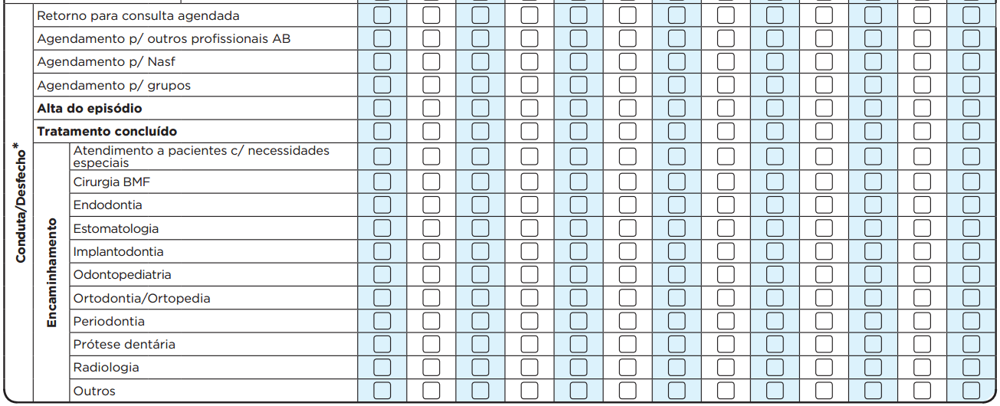

<head>
    
</head>

# CAPÍTULO 4 - Ficha de Atendimento Odontológico Individual
{: .no_toc }

## Sumário
{: .no_toc .text-delta }

- TOC
{:toc}

**Objetivo da ficha:** registrar as informações do atendimento individual realizado pela equipe de Saúde Bucal na Atenção Básica.

**Profissionais que utilizam esta ficha:** os profissionais da Atenção Básica aptos a fazer o uso dela são: cirurgião-dentista e técnico em saúde bucal (TSB), além do auxiliar em saúde bucal (ASB) quando acompanhar o atendimento com o cirurgião-dentista.

A seguir, serão apresentados os campos da Ficha de Atendimento Odontológico Individual e as orientações sobre como preenchê-la. Os campos assinalados com asterisco (\*) são de preenchimento obrigatório.

## 4.1 Cabeçalho

O cabeçalho tem um bloco para a identificação e controle da digitação, que é importante na organização do trabalho a nível local. Este bloco é preenchido pelo digitador.

Figura 4.1 - Cabeçalho do formulário de Marcadores de Consumo Alimentar**

*Fonte: SAPS/MS.*

Quadro 4.1 -- Identificação e controle da digitação

|CAMPO|ORIENTAÇÃO SOBRE O BLOCO/PREENCHIMENTO|
|-|-|
|DIGITADO POR|    Nome do profissional que digitou a ficha.
|DATA|            Dia/mês/ano em que a digitação foi realizada no sistema.|
|CONFERIDO POR|   Nome do profissional que conferiu o correto preenchimento da ficha.|
|FOLHA Nº|        Este campo pode ser utilizado na organização do processo de trabalho do profissional que realizou o registro, por meio da inserção de numeração das folhas.|

*Fonte: SAPS/MS.*

## 4.2 Identificação do(s) profissional(is) e lotação(ões)

O próximo bloco é utilizado para identificação do profissional que realizou os atendimentos individuais. Quando os atendimentos odontológicos forem feitos pelo cirurgião-dentista, conjuntamente com o ASB ou TSB, preenche-se no cabeçalho o CNS e CBO dos profissionais envolvidos. A mesma orientação cabe para o atendimento conjunto do TSB com o ASB. Já o ASB não deverá preencher sozinho a Ficha de Atendimento Odontológico Individual, apenas a Ficha de Atividade Coletiva.

Figura 4.2 -- Identificação do(s) profissional(is) e lotação(ões)

*Fonte: SAPS/MS.*

Quadro 4.2 -- Identificação do(s) profissional(is) e lotação(ões)

|CAMPO|ORIENTAÇÃO SOBRE O BLOCO/PREENCHIMENTO|
|-|-|
|CNS DO PROFISSIONAL*|   Número do Cartão Nacional de Saúde (CNS) do profissional que realizou os atendimentos odontológicos individuais.
|CBO*|                   Classificação Brasileira de Ocupações (CBO) do profissional que realizou os atendimentos odontológicos individuais.
|CNES*|                  Código do Cadastro Nacional de Estabelecimentos de Saúde (CNES) da Unidade Básica de Saúde onde o profissional está lotado.
|INE*|                   Código Identificador Nacional de Equipes (INE) no Cadastro Nacional de Estabelecimentos de Saúde (CNES) do Ministério da Saúde, onde o profissional está lotado, seja equipes Saúde da Família, Nasf, CnR, etc. Este campo não é obrigatório para profissionais que não estão vinculados a equipes.
|DATA*|                  Dia/mês/ano em que foram realizados os atendimentos.

*Fonte: SAPS/MS.*

\* *Campo de preenchimento obrigatório.*

## 4.3 Identificação dos cidadãos e local do atendimento

{: .atencao }
Para aumentar o número de registros identificados, a partir da versão 3.2.20 é possível registrar CNS ou **CPF** do cidadão atendido.

Figura 4.3 -- Identificação do cidadão e local de atendimento e condição de saúde

*Fonte: SAPS/MS.*

Quadro 4.3 - Identificação do cidadão e local de atendimento e condição de saúde

|     CAMPO    |     ORIENTAÇÃO SOBRE O BLOCO/PREENCHIMENTO    |
|-|-|
|     N°    |           Em cada ficha pode-se registrar   informações de até 13 atendimentos distintos.    |
|     TURNO*    |     Turno em que foram   realizados os atendimentos, sendo: M - manhã, T - tarde ou N - noite.    |
|     Nº PRONTUÁRIO    |     Campo destinado ao   número do prontuário da família no estabelecimento de saúde. Este campo é   usado como referência da informação do paciente na unidade, para os casos em   que seja necessário fazer verificação dos dados.    |
|     CNS ou CPF DO CIDADÃO    |     Campo destinado ao   número do Cartão Nacional de Saúde (CNS) do cidadão que está em atendimento.   Os números devem ser inseridos no sentido vertical. Cidadãos sem o CNS   poderão e deverão ser atendidos pela equipe.     |
|     DATA DE NASCIMENTO*     |     Informe o dia, mês e ano   do nascimento do cidadão. Variável de verificação do CNS.     |
|     SEXO*    |     Assinalar F – feminino   ou M – masculino ou I - Indeterminado    |
|     LOCAL DE ATENDIMENTO*    |     Informar o número   referente ao local em que foi realizado o atendimento do cidadão,   considerando as seguintes opções:     (01) UBS - Unidade   Básica de Saúde     (02) Unidade Móvel     (03) Rua     (04) Domicílio     (05) Escola/Creche     (06) Outros     (07) Polo (Academia da Saúde) – denomina-se polo a unidade (espaço físico)   do Programa Academia da Saúde. É considerado polo tanto a estrutura física construída   especificamente para o desenvolvimento do programa quanto o espaço físico   destinado para tal fim nas dependências de uma UBS, desde que o número de   CNES desta UBS esteja associado ao código 12 (estrutura de Academia da   Saúde).     (08) Instituição/Abrigo – instituições para acolhimento destinadas a   famílias e/ou indivíduos com vínculos familiares rompidos ou fragilizados, a   fim de garantir proteção integral.     (09) Unidade prisional   ou congêneres – cadeia pública, colônia   agrícola, industrial ou similar, casa do albergado, centro de observação e   hospital de custódia e tratamento psiquiátrico.     (10) Unidade   socioeducativa – base física necessária   para a organização e o funcionamento de programa de atendimento de medidas   socioeducativas.    |
|     PACIENTE COM NECESSIDADES   ESPECIAIS    |     Marque com um “x” caso o usuário seja uma   pessoa com necessidades especiais.     Na odontologia, é considerado paciente   com necessidades especiais todo usuário que apresente uma ou mais limitações,   temporárias ou permanentes, de ordem mental, física, sensorial, emocional, de   crescimento ou médica, que o impeça de ser submetido a uma situação   odontológica convencional. As razões das necessidades especiais são inúmeras   e vão desde doenças hereditárias e defeitos congênitos até alterações que ocorrem   durante a vida, como moléstias sistêmicas, alterações comportamentais,   envelhecimento etc.     Para saber mais, acesse o Caderno de Atenção Básica nº 17 – Saúde Bucal – no   endereço eletrônico    <http://bvsms.saude.gov.br/bvs/publicacoes/saude_bucal.pdf>    |
|     GESTANTE    |     Marque com um “x” caso a usuária esteja   gestante, independentemente do período gestacional.    |

*Fonte: SAPS/MS.*

\* *Campo de preenchimento obrigatório.*

É importante que todos os cidadãos do território adscrito tenham o número do CNS, mesmo que este item não seja de preenchimento obrigatório. Esse número é importante para a identificação e vinculação do cidadão. Caso o número não seja preenchido não será possível visualizar informações identificadas nos relatórios de saúde e serão obtidos apenas os dados consolidados.

## 4.4 Informações do atendimento

Este bloco apresenta informações do atendimento, tais como tipo de atendimento, problema/condição avaliada, exames, conduta, entre outras. A seguir, são detalhados os campos.

### 4.4.1 Tipo de atendimento

O preenchimento deste bloco é obrigatório e indica qual o tipo de atendimento foi realizado ao usuário do serviço de saúde. Só cabe marcar uma opção sobre o tipo de atendimento.

Figura 4.4 - Tipo de atendimento

*Fonte: SAPS/MS.*

\* *Campo de preenchimento obrigatório.*

Quadro 4.4 -- Tipo de atendimento

|CAMPO|ORIENTAÇÃO SOBRE O BLOCO/PREENCHIMENTO|
|-|-|
|CONSULTA AGENDADA|É toda consulta realizada **após agendamento**, **de caráter não urgente**. Pode ser oriunda da demanda espontânea que não foi atendida no mesmo dia da procura, mas tinha indicação e foi agendada para outro dia ou em casos de retorno dos atendimentos. Por exemplo, uma consulta de retorno agendada para a continuidade do tratamento previsto na primeira consulta odontológica individual.|
|**DEMANDA ESPONTÂNEA**||
|ESCUTA INICIAL/ORIENTAÇÃO|Refere-se à escuta/orientação realizada no momento em que o usuário chega ao serviço de saúde, relatando queixas ou sinais e sintomas percebidos por ele. Não inclui as orientações de fluxos dentro da UBS informados pela recepção. Durante o acolhimento e escuta qualificada, o profissional, quando possível, resolverá o caso por meio de orientação. Caso contrário, deve ser realizada a classificação de risco e análise de vulnerabilidade para o encaminhamento do usuário em situação aguda ou não. Um exemplo é a mãe que procura a equipe de Saúde Bucal para orientações quanto à cronologia de erupção dentária de seu bebê. Após a escuta, a equipe orienta a mãe.|
|CONSULTA NO DIA|É a consulta que é realizada no mesmo dia em que o usuário busca o serviço, de caráter não urgente. Pode representar também a consulta realizada no dia por haver disponibilidade na agenda do profissional Por exemplo, um usuário procura a UBS para atendimento odontológico sem relato de urgência; e, ao verificar disponibilidade na agenda, o profissional realiza o atendimento no mesmo dia e mediante a necessidade garante o retorno do usuário para continuidade do tratamento.|
|ATENDIMENTO DE URGÊNCIA|É o atendimento realizado ao usuário acometido por quadros agudos ou agudizações de patologias crônicas, podendo haver possibilidade de agravamento do quadro que determina a necessidade de assistência imediata para alívio do sofrimento físico e/ou psíquico, recuperação do estado de saúde, estabilização/suporte de vida e/ou encaminhamento a outro ponto da rede quando necessário, por exemplo usuário procura atendimento odontológico com queixa de dor dentária espontânea, necessita de atendimento odontológico no mesmo turno.|

*Fonte: SAPS/MS.*

\* C*ampo de preenchimento obrigatório.*

### 4.4.2 Tipo de consulta

Este bloco visa a indicar qual o tipo de consulta realizada. Para tanto, marque com um "x" na linha referente à qual tipo de consulta realizado. Este campo permite apenas 1 (uma) marcação. **Este bloco não será obrigatório caso o tipo de atendimento marcado anteriormente seja "demanda espontânea".**

**Figura 4.5 -- Tipo de consulta/*/***

*Fonte: SAPS/MS.*

\* *Campo de preenchimento obrigatório.*

**Quadro 4.5 -- Tipo de consulta/*/***

|     CAMPO    |     ORIENTAÇÃO SOBRE O BLOCO/PREENCHIMENTO    |
|-|-|
|     PRIMEIRA CONSULTA ODONTOLÓGICA PROGRAMÁTICA    |     Consiste na   avaliação das condições gerais de saúde e realização de exame clínico odontológico com finalidade de diagnóstico e,   necessariamente, elaboração de plano preventivo-terapêutico. O tratamento   deve ser iniciado na mesma sessão da primeira consulta odontológica   programática.     É   importante lembrar que nessa consulta acontece uma minuciosa análise dos   dentes e tecidos moles e o paciente tem todas as explicações e orientações   quanto ao seu caso. Também é feito um levantamento do histórico do paciente   tanto da sua condição oral, quanto de saúde geral. Para que se estabeleça uma   relação de confiança/vínculo deve-se ouvir, com atenção, as queixas e dúvidas   do paciente.     Uma   primeira consulta odontológica programática só poderá ser registrada   novamente para a mesma pessoa 12 (doze) meses após a conclusão do plano   preventivo-terapêutico ou caso o paciente abandone o tratamento 6 (seis)   meses após a última consulta.      Não devem ser considerados como primeira   consulta odontológica programática os atendimentos eventuais, por exemplo, os   de urgência/emergência/consulta no dia que não têm elaboração de plano   preventivo-terapêutico e seguimento do tratamento previsto.     As necessidades do usuário levantadas   durante esta avaliação deverão ser registradas no prontuário clínico do   usuário.    |
|     CONSULTA DE RETORNO EM ODONTOLOGIA    |     Consiste   na(s) consulta(s) subsequente(s) do usuário que está em continuidade do   tratamento iniciado e programado por meio da primeira consulta odontológica   programática. Portanto será registrada a consulta de retorno acrescida do(s) procedimento(s)   realizado(s) neste dia. (Exemplo: Considerando que um usuário possui seis   restaurações para serem feitas, segundo plano preventivo-terapêutico   elaborado pelo CD. Dessa forma as consultas agendadas para a realização   dessas restaurações deverão ser consideradas como “CONSULTA DE RETORNO EM   ODONTOLOGIA”.    |
|     CONSULTA DE MANUTENÇÃO EM ODONTOLOGIA    |     Consiste na   consulta do usuário para manutenção,   acompanhamento ou reparos clínicos após este ter concluído o tratamento   previsto na primeira consulta odontológica. Ocorre quando o retorno do   usuário ocorre em um período inferior a 12 meses da conclusão do tratamento.   Portanto será registrada a consulta de manutenção acrescida do(s) procedimento(s) realizado(s) neste dia. (Exemplo: O usuário   conclui o tratamento no mês de julho e no mês de setembro do mesmo ano ele   retorna ao atendimento odontológico para reparo em uma determinada   restauração. Neste caso deve-se marcar “CONSULTA DE MANUTENÇÃO EM   ODONTOLOGIA” pois o retorno do usuário ocorreu dois meses após a conclusão do   tratamento.    |

*Fonte: SAS/MS.*

\* *Este campo não é obrigatório caso o tipo de atendimento for de demanda espontânea.*

### 4.4.3 Vigilância em saúde bucal

Visa a subsidiar a observação do processo saúde--doença bucal em âmbito populacional e é fundamental para sua compreensão e para a elaboração de políticas e ações de cuidados mais resolutivas.

Figura 4.6 -- Vigilância em saúde bucal

*Fonte: SAS/MS.*

\* *Campo de preenchimento obrigatório.*

Marque com um "x" na opção da linha referente às condições de vigilância em saúde bucal percebidas no momento da consulta clínica. É obrigatória a marcação de **pelo menos** uma opção.

Quadro 4.6 -- Vigilância em saúde bucal

|CAMPO|ORIENTAÇÃO SOBRE O BLOCO/PREENCHIMENTO|
|-|-|
|ABSCESSO DENTOALVEOLAR|A condição do indivíduo com abscesso dentoalveolar, tanto na variável aguda quanto na crônica, **independe do número de áreas afetadas e características do abscesso**.|
|ALTERAÇÃO EM TECIDOS MOLES|A condição de alteração em tecidos moles **independe do número, do tipo e do grau da lesão**. Essas alterações podem ser processos proliferativos não neoplásicos, neoplasias benignas, neoplasias malignas, doenças infecciosas (bacterianas, fúngicas ou virais), doenças mucocutâneas e manifestações bucais de doenças sistêmicas.[^10]|
|DOR DE DENTE|A condição de indivíduo com dor de dente **independe do número de dentes afetados e características da dor (espontânea ou provocada)**.|
|FENDAS OU FISSURAS LABIOPALATAIS|A condição de fenda ou fissura **independe do tipo da anomalia (se apenas labial, apenas palatal ou labiopalatal)**.|
|FLUOROSE DENTÁRIA MODERADA OU SEVERA[^11]|A condição de fluorose dentária **moderada** ou **severa** **independe do número de dentes atingidos**.|
|TRAUMATISMO DENTOALVEOLAR|A condição de indivíduo que sofreu traumatismo dentoalveolar **independe do número de dentes, permanente e/ou decíduo, afetados e do tipo de lesão**.
|NÃO IDENTIFICADO|Deve ser preenchido todas as vezes que **não for identificada nenhuma condição de vigilância em saúde bucal descrita acima**.|

*Fonte: SAS/MS.*

\* *Campo de preenchimento obrigatório.*

### 4.4.4 Procedimentos odontológicos

Todos os procedimentos estão relacionados aos que constam no Sistema de Gerenciamento da Tabela de Procedimentos, Medicamentos e OPM do SUS (Sigtap) na Atenção Básica, disponível no endereço eletrônico <http://sigtap.datasus.gov.br>, e constituirão o arquivo BPA gerado pelo e-SUS AB para alimentar o Sistema de Informação Ambulatorial (SIA).

Figura 4.7 -- Procedimentos odontológicos

*Fonte: SAS/MS.*

Deve-se preencher a quantidade **(números)** de procedimentos realizados durante o atendimento a determinado usuário. Estes campos estão em conformidade com a descrição dos procedimentos (por dente, por sextante ou por usuário) no Sigtap, como segue abaixo:

Quadro 4.7 -- Procedimentos (quantidade realizada)

|CAMPOS|ORIENTAÇÃO SOBRE O PREENCHIMENTO|
|-|-|
|  ACESSO À POLPA DENTÁRIA E MEDICAÇÃO (POR DENTE),  ADAPTAÇÃO DE PRÓTESE DENTÁRIA,  APLICAÇÃO DE CARIOSTÁTICO (POR DENTE),  APLICAÇÃO DE SELANTE (POR DENTE),  APLICAÇÃO TÓPICA DE FLÚOR (INDIVIDUAL POR SESSÃO),  CAPEAMENTO PULPAR,  CIMENTAÇÃO DE PRÓTESE,  CURATIVO DE DEMORA COM OU SEM PREPARO BIOMECÂNICO,  DRENAGEM DE ABSCESSO,  EVIDENCIAÇÃO DE PLACA BACTERIANA,  EXODONTIA DE DENTE DECÍDUO,  EXODONTIA DE DENTE PERMANENTE,  INSTALAÇÃO DE PRÓTESE DENTÁRIA,  MOLDAGEM DENTOGENGIVAL PARA A CONSTRUÇÃO DE PRÓTESE DENTÁRIA,  ORIENTAÇÃO DE HIGIENE BUCAL,  PROFILAXIA/REMOÇÃO DA PLACA BACTERIANA,  PULPOTOMIA DENTÁRIA,  RADIOGRAFIA PERIAPICAL/INTERPROXIMAL,  RASPAGEM,  ALISAMENTO E POLIMENTO SUPRAGENGIVAIS (POR SEXTANTE),  RASPAGEM,  ALISAMENTO SUBGENGIVAIS (POR SEXTANTE),  RESTAURAÇÃO DE DENTE DECÍDUO,  RESTAURAÇÃO DE DENTE PERMANENTE ANTERIOR,  RESTAURAÇÃO DE DENTE PERMANENTE POSTERIOR,  RETIRADA DE PONTOS DE CIRURGIAS BÁSICAS (POR PACIENTE),  SELAMENTO PROVISÓRIO DE CAVIDADE DENTÁRIA,  TRATAMENTO DE ALVEOLITE,  ULOTOMIA/ULECTOMIA|Anote a quantidade **(número)** de procedimentos realizados.|
|OUTROS (SIA)|Campos destinados para o registro dos códigos de procedimentos do Sigtap que não estejam contidos na relação de procedimentos anterior. Preenche-se a quantidade (números) de procedimentos realizados na coluna referente ao usuário que recebeu esse atendimento. Estes dados constituirão a base de dados do e-SUS AB e também o arquivo BPA gerado pelo e-SUS AB. As informações do BPA serão validadas no SIA, conforme regras específicas deste sistema.|

*Fonte: SAS/MS.*

### 4.4.5 Fornecimento de insumos

Visa ao registro de insumos entregues aos usuários durante o atendimento clínico individual.

Figura 4.8 -- Fornecimento de insumos

*Fonte: SAS/MS.*

Quadro 4.8 -- Fornecimento de insumos

|CAMPO|ORIENTAÇÃO SOBRE O PREENCHIMENTO|
|-|-|
|ESCOVA DENTAL,  CREME DENTAL,  FIO DENTAL|Marque com um "x" na linha do insumo que foi entregue ao usuário. Poderá ser marcada mais de uma opção.|

*Fonte: SAS/MS.*

### 4.4.6 Conduta/Desfecho

Neste bloco, deve-se registrar a conduta/desfecho do episódio, bem como os encaminhamentos realizados para unidades de referência de atenção secundária em saúde bucal **quando o município dispuser de serviços de referência especializados em saúde bucal**. Ele é de preenchimento obrigatório e serve também para reagendamentos para a própria equipe de SB e para outras equipes da AB, como NASF ou mesmo outros profissionais.

Figura 4.9 -- Conduta/Desfecho

*Fonte: SAS/MS.*

Quadro 4.9 -- Conduta/Desfecho

|     CAMPO    |     ORIENTAÇÃO   SOBRE O PREENCHIMENTO    |
|-|-|
|     RETORNO PARA CONSULTA   AGENDADA    |     Marque com um “x” caso o usuário   necessite de retorno com a equipe de Saúde Bucal. Conduta aplicada aos casos   em que for necessário o retorno para continuidade do tratamento previsto no   plano preventivo-terapêutico da primeira consulta odontológica programática,    |
|     AGENDAMENTO PARA OUTROS   PROFISSIONAIS DA ATENÇÃO BÁSICA    |     Marque com um “x” caso se tenha   identificado a necessidade de agendar para outro profissional da Atenção   Básica, (como por exemplo, para enfermeiro, médico, entre outros).    |
|     AGENDAMENTO PARA NÚCLEO DE   APOIO À SAÚDE DA FAMÍLIA (NASF)    |     Marque com um “x” caso identifique a   necessidade de agendar para os profissionais do NASF.     |
|     AGENDAMENTO PARA GRUPOS    |     Marque com um “x” caso tenha   identificado a necessidade de agendar para algum grupo de acompanhamento que   a unidade de saúde disponibiliza.    |
|     ALTA DO EPISÓDIO    |     Marque com um “x” para identificar os   atendimentos concluídos sem a necessidade de retorno referente ao problema ou   condição apresentada. Esta opção é destinada para os usuários que tiveram   como Tipo de Atendimento “Demanda Espontânea” e não realizaram a “Primeira   Consulta Odontológica Programática”.     Por exemplo: O usuário chega com dor de   dente (Atendimento de urgência) e a equipe de SB resolve o problema sem a   necessidade de retorno deste usuário para continuidade do tratamento. Neste   caso deve-se marcar “ALTA DO EPISÓDIO”, pois para assinalar “TRATAMENTO   CONCLUÍDO” deve haver a elaboração e conclusão do plano   preventivo-terapêutico da primeira consulta odontológica programática).    |
|     TRATAMENTO CONCLUÍDO    |     Marque com um “x” quando houver o   encerramento de determinado “período de tratamento”, ou seja, foram   concluídas todas as ações propostas no plano preventivo-terapêutico da   primeira consulta odontológica programática.    |

*Fonte: SAS/MS.*

Os encaminhamentos, dentro do bloco de conduta/desfecho, deverão ser marcados para outras especialidades odontológicas e, em caso de necessidades não relacionadas, o campo "Outros" deverá ser assinalado. Esta seção deverá ser utilizada apenas pelo cirurgião dentista.

Quadro 4.10 -- Encaminhamento

|CAMPO|ORIENTAÇÃO SOBRE O PREENCHIMENTO|
|-|-|
|ATENDIMENTO A PACIENTES COM NECESSIDADES ESPECIAIS,  CIRURGIA BUCOMAXILOFACIAL (BMF),   ENDODONTIA,   ESTOMATOLOGIA,   IMPLANTODONTIA,   ODONTOPEDIATRIA,   ORTODONTIA/ORTOPEDIA,  PERIODONTIA,  PRÓTESE DENTÁRIA,  RADIOLOGIA,  OUTROS|Marque com um "x" na linha que corresponder ao tipo de encaminhamento realizado, podendo ser marcada mais de uma opção.|

*Fonte: SAS/MS.*

[^10]: Manual de Especialidades em Saúde Bucal* (BRASIL, 2008), no capítulo intitulado Estomatologia. Disponível em: <http://189.28.128.100/dab/docs/portaldab/publicacoes/manual_especialidades_bucal.pdf/>.

[^11]: Guia de Recomendações para Uso de Fluoretos no Brasil* (BRASIL, 2009). Disponível em: <http://189.28.128.100/dab/docs/portaldab/publicacoes/guia_fluoretos.pdf/>.
