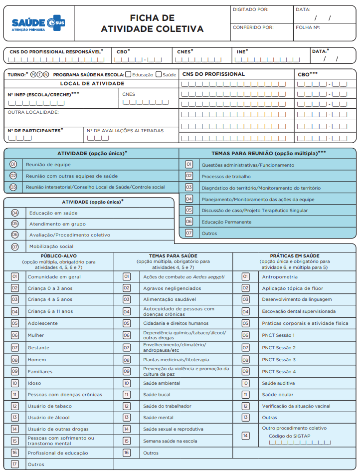
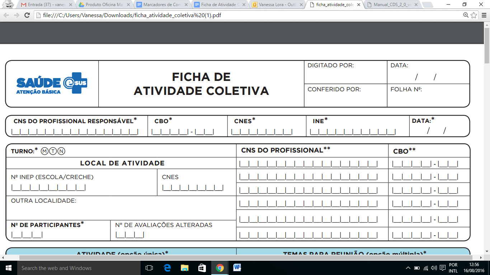
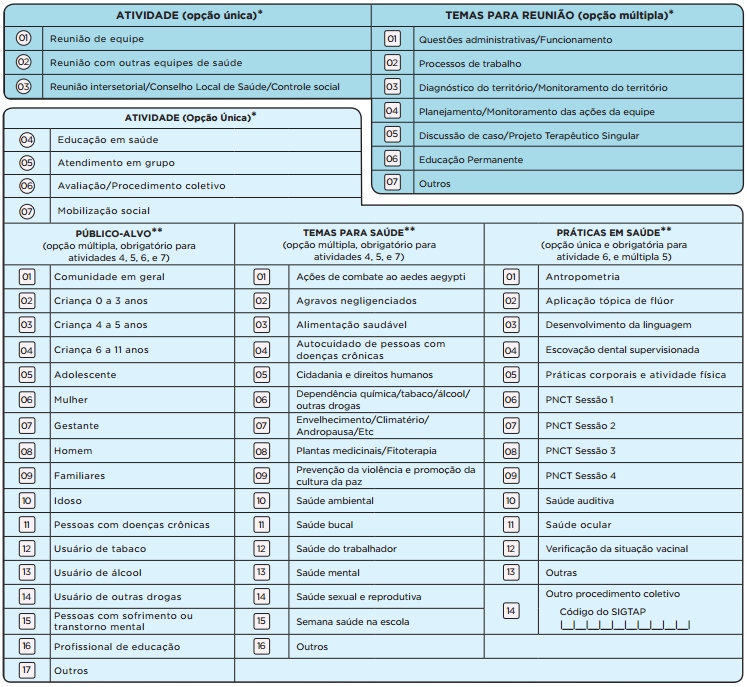
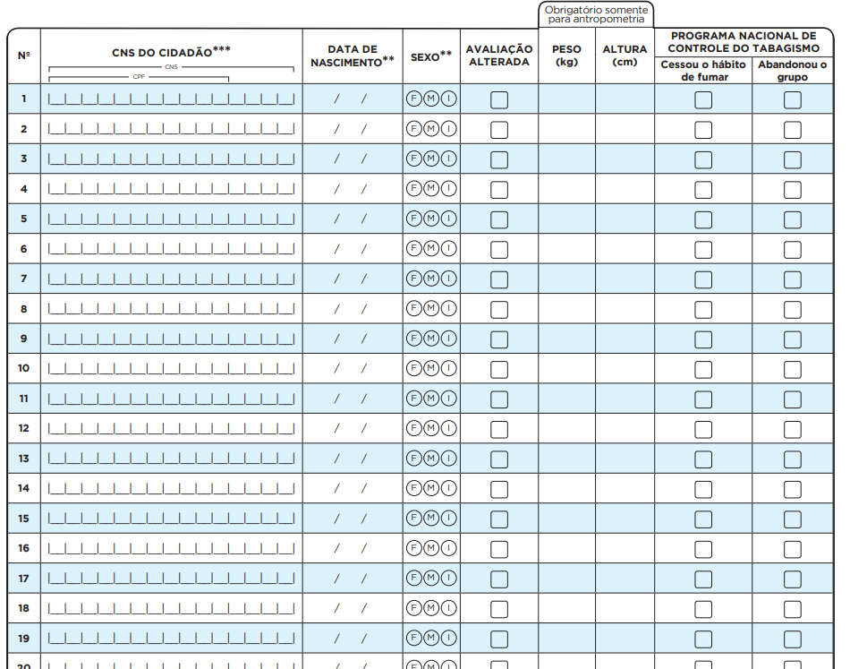

<head>
    
</head>

# CAPÍTULO 5 - Ficha de Atividade Coletiva
{: .no_toc }

## Sumário
{: .no_toc .text-delta }

- TOC
{:toc}

**Objetivo da ficha:** registrar as ações realizadas em grupo pelas equipes, conforme as necessidades do território e da própria equipe. Já em sua organização, marcada por blocos de tonalidades de cor diferentes, é perceptível que a ficha apresenta dois focos: as ações coletivas de saúde para a população (como atividades de educação em saúde, atendimentos e avaliações em grupo, e mobilizações sociais) e as ações coletivas para a organização da equipe (reuniões de equipe, reuniões com outras equipes, ou reuniões com outros órgãos).

**Profissionais que utilizam esta ficha:** É utilizada por profissionais das equipes de Atenção Básica (incluindo equipe de Saúde Bucal), do Núcleo de Apoio à Saúde da Família (NASF), do Polo Academia da Saúde, do Consultório na Rua (eCR) e das equipes de Atenção Básica Prisional (EABP).

{: .nota }
as ações realizadas nos **Programa Saúde na Escola**, da Política Nacional de Combate ao Tabagismo, entre outras, devem ser registradas usando a Ficha de Atividade Coletiva.

A seguir, serão apresentados os campos da Ficha de Atividade Coletiva e as orientações sobre como preenchê-la. Os campos assinalados com asterisco (/*) são de preenchimento obrigatório.

{: .atencao }
deverá ser preenchida **uma ficha para cada atividade** coletiva realizada.

## 5.1 Cabeçalho

O cabeçalho desta ficha é diferente das demais apresentadas. Ele possui um bloco de identificação e controle da digitação, um bloco de identificação do profissional responsável e um bloco de identificação da atividade e dos demais profissionais envolvidos na condução da atividade.

Figura 5.1 -- Cabeçalho do formulário de Atividade Coletiva

*Fonte: SAPS/MS.*

Quadro 5.1 -- Identificação e controle da digitação

|CAMPO|ORIENTAÇÃO SOBRE O BLOCO/PREENCHIMENTO|
|-|-|
|DIGITADO POR|Nome do profissional que digitou a ficha.|
|DATA|Dia/mês/ano em que a digitação foi realizada no sistema.|
|CONFERIDO POR|Nome do profissional que conferiu o correto preenchimento da ficha.|
|FOLHA Nº|Este campo pode ser utilizado na organização do processo de trabalho do profissional que realizou o registro, por meio da inserção de numeração das folhas.|

*Fonte: SAPS/MS.*

## 5.2 Identificação do profissional e do estabelecimento de saúde

O próximo bloco é utilizado para identificação do profissional de saúde responsável pela atividade e sua lotação. Se a atividade é realizada por mais de um profissional, para este campo, elege-se o principal responsável.

Figura 5.2 -- Identificação do profissional responsável e lotação

*Fonte: SAPS/MS.*

\* *Campo de preenchimento obrigatório.*

Quadro 5.2 -- Identificação do profissional e lotação

|CAMPO|ORIENTAÇÃO SOBRE O BLOCO/PREENCHIMENTO|
|-|-|
|CNS DO PROFISSIONAL RESPONSÁVEL|Número do Cartão Nacional de Saúde (CNS) do profissional que realizou o registro no formulário de Marcadores de Consumo Alimentar.|
|CBO|Classificação Brasileira de Ocupações (CBO) do profissional que realizou o registro no formulário.|
|CNES|Código do Cadastro Nacional de Estabelecimentos de Saúde (CNES) da Unidade Básica de Saúde onde o profissional está lotado.|
|INE|Código Identificador Nacional de Equipes (INE) no Cadastro Nacional de Estabelecimentos de Saúde (CNES) do Ministério da Saúde, onde o profissional está lotado, seja equipes Saúde da Família, Nasf, CnR, etc. Este campo não é obrigatório para profissionais que não estão vinculados a equipes.|
|DATA|Dia/mês/ano em que foi realizado o registro no formulário.|

*Fonte: SAPS/MS.*

\* *Campo de preenchimento obrigatório.*

## 5.3 Identificação da atividade coletiva e de outros profissionais

Este bloco permite o registro da data, turno e local de realização da atividade e, ainda, do número de participantes, número de avaliações alteradas e dados de outros profissionais envolvidos na organização da atividade.

Figura 5.3 -- Identificação da atividade coletiva e de outros profissionais

*Fonte: SAPS/MS.*

\* *Campo de preenchimento obrigatório.*

Quadro 5.3 -- Identificação da atividade coletiva e de outros profissionais

|CAMPO|ORIENTAÇÃO SOBRE O BLOCO/PREENCHIMENTO|
|-|-|
|TURNO*|	Turno em que a atividade foi desenvolvida. Use M para manhã, T para tarde e N para noite.
|PROGRAMA SAÚDE NA ESCOLA|Marcar se foram profissionais da saúde ou da educação que realizaram a atividade do Programa Saúde na Escola, quando a atividade for realizada em conjunto, é possível assinalar os dois campos.
|LOCAL DE ATIVIDADE|	Estão previstas três situações:   ●	No DO INEP (ESCOLA/CRECHE) - para atividade realizada no âmbito do Programa Saúde na Escola,   ●	CNES – para atividade realizada em outro estabelecimento de saúde que não o estabelecimento de origem da equipe (Exemplo: quando realizar atividade em um Polo de Academia da Saúde),  ●	OUTRA LOCALIDADE - Campo descritivo para informar qualquer outro espaço, diferente de escola ou estabelecimento de saúde (Exemplos: igreja, associação de moradores, etc.).
|Nº DE PARTICIPANTES*|Número de participantes que efetivamente compareceram à atividade programada.
|Nº DE AVALIAÇÕES ALTERADAS|Total de avaliações realizadas que apresentaram alteração (listada no bloco de identificação de usuários no verso da ficha de atividade coletiva). Este campo é preenchido automaticamente no sistema a partir dos dados dos usuários identificados no verso da ficha.
|CNS DO PROFISSIONAL** E CBO**|Número do Cartão Nacional do SUS (CNS) e código Classificação Brasileira de Ocupações (CBO) dos outros profissionais envolvidos na organização da atividade, que não o responsável.  Embora exista a restrição de seis campos para identificação dos profissionais na ficha, no momento da digitação das informações no sistema, não existe essa restrição.  Numa reunião de equipe, por exemplo, não há necessidade de registrar o CNS de cada profissional presente. Registra-se dos mediadores, já os demais profissionais são contabilizados no campo ‘nº de participantes’.|

*Fonte: SAS/MS.*

\* *Campo de preenchimento obrigatório.*

\** *Campo com obrigatoriedade condicionada.*

{: .atualizacao }
disponível a partir da versão 3.0.

|PROGRAMA SAÚDE NA ESCOLA|
|-|
|Novo campo -  a partir da versão 3.0 é possível identificar as ações do PSE, por meio do campo Programa Saúde na Escola. Esse campo deve ser assinalado quando forem realizadas atividades no âmbito do PSE. Assinalar o campo “educação” caso a atividade seja realizada pelos profissionais da escola e “saúde” caso a atividade seja realizada pelos profissionais da Atenção Básica em Saúde. Marque os campos “educação” e “saúde” quando a atividade for realizada em conjunto.  Campo Nº do INEP (ESCOLA/CRECHE) - Este campo deve ser preenchido obrigatoriamente e somente se a atividade for realizada no âmbito do PSE. Quando a atividade do PSE for realizada fora do ambiente escolar, deverá ser registrado o Nº do INEP (da escola de referência dos alunos público-alvo da atividade).|

{: .nota }
para saber mais sobre o PSE, acesse http://dab.saude.gov.br/portaldab/pse.php.

## 5.4 Tipos de atividade coletiva

Este bloco é utilizado para registrar o tipo de atividade. É possível
marcar apenas uma opção entre os tipos de atividade coletiva.

Figura 5.4 -- Tipos de atividade coletiva

*Fonte: SAPS/MS.*

## 5.5 Atividades e Temas para reunião

O bloco está subdividido em dois tipos de atividades. O primeiro tipo são as ações coletivas estruturantes para a organização dos processos de trabalho da equipe, a partir da marcação das opções 01, 02 ou 03.

Quadro 5.4 -- Atividade (Opção única)

|     CAMPO    |     ORIENTAÇÃO SOBRE O BLOCO/PREENCHIMENTO    |
|-|-|
|     01) REUNIÃO DE EQUIPE    |     Opção utilizada para indicar reunião da   própria equipe.    |
|     02) REUNIÃO COM OUTRAS EQUIPES DE SAÚDE    |     Opção utilizada para indicar reunião da   equipe com outras equipes de saúde (inclusive com outras equipes de AB, por   exemplo, reunião entre eSF e eNasf ou reunião entre eSF e eCR).    |
|     03) REUNIÃO INTERSETORIAL/     CONSELHO LOCAL DE SAÚDE/     CONTROLE SOCIAL    |     Indica a realização de reunião com   agentes externos da comunidade ou outros órgãos de governo.    |

*Fonte: SAPS/MS.*

\* *Campo de preenchimento obrigatório.*

Ao assinalar uma das opções acima, será necessário registrar obrigatoriamente, **pelo menos**, uma opção do bloco de "TEMAS PARA REUNIÃO". Os temas que podem ser registrados estão expostos no quadro a seguir.

Quadro 5.5 -- Temas para reuniões (Opção múltipla)

|     CAMPO    |     ORIENTAÇÃO SOBRE O BLOCO/PREENCHIMENTO    |
|-|-|
|     01) QUESTÕES ADMINISTRATIVAS/   FUNCIONAMENTO    |     Opção utilizada para indicar reunião de   equipe onde são tratadas questões administrativas e de funcionamento da   unidade.    |
|     02) PROCESSO DE TRABALHO    |     Opção utilizada para indicar reunião em   que será discutido o processo de trabalho da equipe, seja sobre os núcleos   profissionais, questões clínicas, seja sobre o contexto geral da equipe e   estabelecimento de saúde,  seguindo os   preceitos trazidos pela PNAB e tendo os cidadãos e o território como eixo   principal e norteador da discussão.    |
|     03) DIAGNÓSTICO DO   TERRITÓRIO/MONITORAMENTO DO TERRITÓRIO    |     Indica a realização de reunião de equipe   para debater a situação de saúde do território a partir de dados dos sistemas   de informação em saúde, formulando indicadores e o retrato epidemiológico da   população assistida.    |
|     04) PLANEJAMENTO/  MONITORAMENTO DAS AÇÕES DA EQUIPE    |     Opção utilizada para indicar reunião com   foco no planejamento de ações de saúde a partir do diagnóstico da situação de   saúde do território, com utilização de indicadores e epidemiologia dos dados   de saúde.    |
|     05) DISCUSSÃO DE CASO/ PROJETO   TERAPÊUTICO SINGULAR    |     Opção utilizada para indicar uma reunião   de equipe que tem como tema discussão do caso de saúde de um cidadão ou de   uma família, podendo ter como resultado a articulação dos diversos saberes   dos profissionais envolvidos diante da singularidade do sujeito, pensando   novas possibilidades e caminhos para a intervenção, resultando na elaboração   de um projeto terapêutico singular. Esta opção também poderá ser utilizada   para os projetos de saúde do território, que busca ações direcionadas à   produção de saúde e à redução de vulnerabilidades em um determinado   território.    |
|     06) EDUCAÇÃO PERMANENTE    |     Opção utilizada quando a equipe   desenvolve uma atividade de produção de conhecimento dentro das premissas básicas de ser um processo   constante de promoção e desenvolvimento integral e contextualizado da equipe,   centrando-se nas circunstâncias e problemas de seu processo de trabalho, de   modo crítico e criativo, envolvendo práticas que considerem elementos que   façam sentido para os profissionais envolvidos. Saiba mais : http://dab.saude.gov.br/portaldab/educacao_permanente.php    |
|     07) OUTROS    |     Campo destinado para registro de temas   que não se encontram listados acima.     |

*Fonte: SAPS/MS.*

\* *Campo de preenchimento obrigatório.*

## 5.6 Atividades de saúde

O segundo tipo de atividade é composto de ações de saúde voltadas para a população, a partir da marcação das opções 04, 05, 06 ou 07. Quando for marcada uma dessas opções, será necessário registrar, ao menos, uma opção do bloco de "PÚBLICO-ALVO" e, ao menos, uma opção do bloco de "PRÁTICAS EM SAÚDE" ou de "TEMAS PARA SAÚDE", obrigatoriamente.

**Quadro 5.6 -- Atividade (Opção única)/***

|     CAMPO    |     ORIENTAÇÃO SOBRE O BLOCO/PREENCHIMENTO    |
|-|-|
|     04) EDUCAÇÃO EM SAÚDE    |     Indica uma ação de educação em saúde,   como encenações teatrais sobre algum tema em saúde, rodas de conversa com temas   da saúde, atividades de sala de espera na UBS, campanhas pontuais ou sazonais   de saúde, etc..     Essa opção não exige que os usuários da atividade sejam   identificados.     |
|     05) ATENDIMENTO EM GRUPO    |     Campo utilizado para indicar a realização   de grupos terapêuticos, grupos operativos, oficinas, grupos temáticos por   ciclo de vida ou condição de saúde, grupos de atividade física, terapia   comunitária, entre outros.     Essa opção exige que os usuários que participaram da atividade sejam   identificados, mesmo que não apresentem alterações na avaliação.    |
|     06) AVALIAÇÃO/PROCEDIMENTO COLETIVO    |     Indica avaliações ou procedimentos   realizados em um grupo, como avaliação antropométrica, testes de acuidade   visual, escovação dental supervisionada, aplicação tópica de flúor, entre outros.     Exige a identificação dos usuários que participaram da atividade por meio do preenchimento   do CNS.    |
|     07) MOBILIZAÇÃO SOCIAL     |     Ações de promoção de mobilização   comunitária com a constituição de redes sociais de apoio e ambientes de   convivência e solidariedade.     Essa opção não exige que os usuários da atividade sejam   identificados.    |

*Fonte: SAPS/MS.*

\* *Campo de preenchimento obrigatório.*

### 5.6.1 Público-alvo

Este bloco é utilizado para registrar, na Ficha de Atividade Coletiva, os públicos-alvo que participaram da ação em saúde. É um campo obrigatório para as atividades de 04 a 07 e é possível marcar mais de uma opção. A opção 01 -- Comunidade em geral - deve ser marcada quando a ação não possuir público-alvo específico. Entre as opções, existem algumas categorias:

-   Por faixa etária (criança até 3 anos, criança de 4 e 5 anos, criança de 6 a 11 anos, adolescente, idoso);
-   Por sexo (mulher, homem);
-   Por condição de saúde (gestante, pessoas com doenças crônicas, usuário de tabaco, usuário de álcool, usuário de outras drogas, pessoas com sofrimento ou transtorno mental);
-   Familiares, profissionais de educação e outros.

### 5.6.2 Temas para saúde

Este bloco é utilizado para registrar, na Ficha de Atividade Coletiva, os temas discutidos na ação em saúde. É possível marcar mais de uma opção e é campo de preenchimento obrigatório nas Atividades 04 - Educação em saúde, 05 - Atendimento em grupo, e 07 - Mobilização social.

### 5.6.3 Práticas em saúde

Neste bloco são registradas algumas práticas em saúde. Também é possível marcar mais de uma opção, caso a atividade desenvolvida seja a 05 - Atendimento em grupo e atividade 06 - Avaliação procedimento coletivo.

As opções 06 a 09 devem ser marcadas somente se ação for realizada no âmbito do Programa Nacional de Controle do Tabagismo, e conforme protocolo desse programa.

|PROGRAMA NACIONAL DE CONTROLE DO TABAGISMO|
|-|
|O tratamento das pessoas tabagistas deve ser realizado prioritariamente pela Atenção Básica, nas Unidades Básicas de Saúde (UBS), devido sua descentralização, capilaridade e maior proximidade dos usuários dos serviços de saúde.  Ao ingressar no Programa Nacional de Controle do Tabagismo (PNCT), o município e suas equipes de Atenção Básica assumem o compromisso de organização e implantação das ações para o cuidado da pessoa tabagista. Este cuidado inclui avaliação clínica, abordagem mínima, breve ou intensiva, individual ou em grupo e, quando necessário e indicado pelo médico assistente, terapia medicamentosa (sempre associada à abordagem intensiva).  A abordagem em grupo recomendada organiza-se na forma de quatro sessões iniciais, com periodicidade semanal ou quinzenal, seguidas de um acompanhamento de duração e periodicidade variável de acordo com cada realidade local (idealmente, com duração de 12 meses). As quatro sessões iniciais são discriminadas na Ficha de Atividade Coletiva com o intuito de permitir o levantamento posterior, pelo gestor e pelas próprias equipes, das taxas de abandono e acompanhamento completo dos usuários encaminhados para esta abordagem. Por recomendação do Inca e da Coordenação-Geral de Atenção a Pessoas com Doenças Crônicas (CGAPDC/Daet/MS), disponível no Tire suas Dúvidas (http://www1.inca.gov.br/inca/Arquivos/tire_duvidas_pnct_2014.pdf), a Ficha de Atividade Coletiva relativa ao PNCT deve ser obrigatoriamente preenchida por profissional de nível superior, ao contrário das demais, que devem ser preenchidas por profissionais de nível superior ou de nível médio ou por agentes comunitários de saúde. Para mais informações a respeito do tratamento preconizado para cessação do tabagismo, vide o documento “Abordagem e Tratamento do Fumante – Consenso 2001”, disponível em http://www.inca.gov.br/tabagismo/parar/tratamento_consenso.pdf.|

## 5.7 Lista de Participantes

{: .atencao }
Para aumentar o número de egistros identificados, a partir da versão 3.2.20 é possível registrar CNS ou **CPF** do cidadão atendido.

Para as atividades coletivas que demandam a identificação dos usuários (opções 05 - Atendimento em Grupo e 06 - Avaliação Procedimento Coletivo), é preciso registrar, no verso da Ficha de Atividade Coletiva, as seguintes informações junto à lista de participantes da atividade:

-   CNS ou CPF do cidadão participante da atividade (ATENÇÃO: campo obrigatório ao informar lista de participantes);

-   Data de nascimento do cidadão (ATENÇÃO: campo com obrigatoriedade condicionada);

-   Sexo do cidadão, podendo optar por F - feminino ou M - masculino ou I - Indeterminado (ATENÇÃO: campo com obrigatoriedade condicionada);

-   Marcar se o cidadão apresentou avaliação alterada;

-   Peso e altura do cidadão no caso a atividade ser de avaliação antropométrica. Para tanto, também é necessário assinalar o item 01 - Antropometria - no bloco de Práticas em saúde;

-   Se a atividade ocorreu no âmbito do Programa Nacional de Controle do Tabagismo, marcar se o cidadão cessou o hábito de fumar e/ou se abandonou o grupo. Em caso afirmativo, é preciso registrar também, no bloco de Práticas em saúde, um dos itens de 06 a 09, de acordo com cada situação.

Quando se proceder à digitação da ficha no sistema, este fará a validação do número de CNS do cidadão participante da atividade. Para que não haja problemas com possíveis equívocos de registro de CNS do cidadão, é importante estar atento ao preenchimento correto do campo.

{: .atencao }
as opções 05 - Atendimento em Grupo e 06 -- Avaliação/Procedimento Coletivo, devem ser anotados todos os participantes, identificando-se os alterados. Especificamente **para o PSE**, a **exceção** são as atividades de avaliação da **acuidade visual**. Para esta, são anotados **apenas os alterados**.

Figura 5.5 - Identificação dos cidadãos participantes da atividade coletiva

*Fonte: SAPS/MS.*
