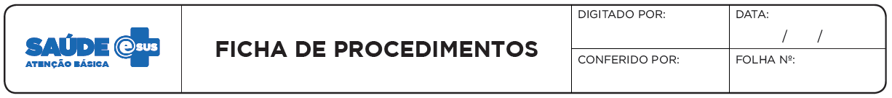
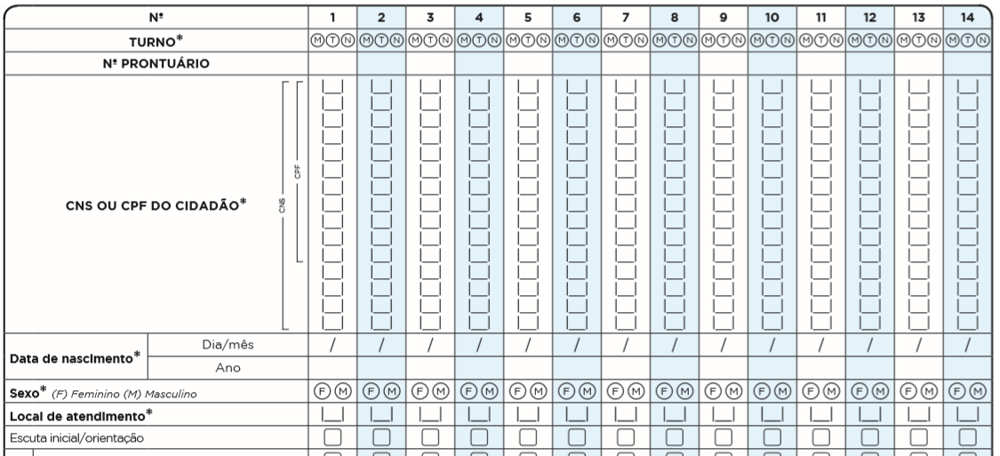
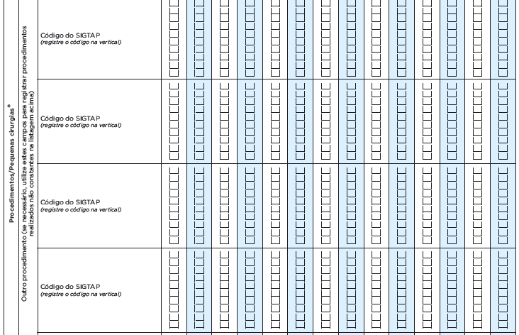
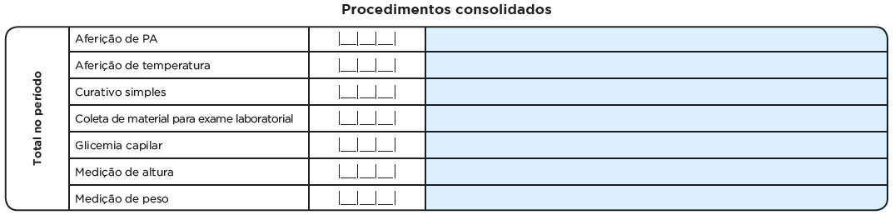

# CAPÍTULO 6 - Ficha de Procedimentos
{: .no_toc }

## Sumário
{: .no_toc .text-delta }

- TOC
{:toc}

**Objetivo da ficha:** registrar os procedimentos realizados na Atenção Básica. Ela, identifica os procedimentos que foram feitos por determinado profissional, em ato, diferentemente da Ficha de Atendimento Individual, em que são registradas a solicitação e a avaliação de procedimentos de exames, por exemplo.

**Profissionais que utilizam esta ficha:** é utilizada pelos profissionais de equipes da Saúde da Família, de Saúde Prisional, dos Núcleos de Apoio à Saúde da Família, da Academia da Saúde, de Consultório na Rua e outras equipes de AB. Todos os profissionais de nível superior são habilitados a preenchê-la (médico, enfermeiro, fisioterapeuta, nutricionista, etc.) ou de nível médio (técnicos e auxiliares de enfermagem) da área da saúde, com exceção da equipe de Saúde Bucal (que utiliza a Ficha de Atendimento Odontológico Individual).

A seguir, serão apresentados os campos da Ficha de Procedimentos e as orientações sobre como preenchê-los. Os campos assinalados com asterisco (\*) são de preenchimento obrigatório.

## 6.1 Cabeçalho

O cabeçalho tem um bloco para a identificação e controle da digitação, que é importante na organização do trabalho a nível local. Este bloco é preenchido pelo digitador.

Figura 6.1 -- Cabeçalho da Ficha de Procedimentos

*Fonte: SAS/MS.*

Quadro 6.1 -- Identificação e controle da digitação

|CAMPO|ORIENTAÇÃO DE PREENCHIMENTO|
|-|-|
|DIGITADO POR|Nome do profissional que digitou a ficha.|
|DATA|Dia/mês/ano em que a digitação foi realizada no sistema.|
|CONFERIDO POR|Nome do profissional que conferiu o correto preenchimento da ficha.|
|FOLHA Nº|Este campo pode ser utilizado na organização do processo de trabalho do profissional que realizou o procedimento, por meio da inserção de numeração das folhas.|

*Fonte: SAS/MS.*

## 6.2 Identificação do profissional e do estabelecimento de saúde

O próximo bloco é utilizado para identificação do profissional que realizou os procedimentos.

Figura 6.2 -- Identificação do profissional e lotação

*Fonte: SAS/MS.*

Quadro 6.2 - Identificação do profissional e lotação

|CAMPO|ORIENTAÇÃO DE PREENCHIMENTO|
|-|-|
|CNS do Profissional*|Número do Cartão Nacional de Saúde (CNS) do profissional que realizou os procedimentos. Cada procedimento pode ser realizado e registrado por apenas UM profissional.|
|CBO*|Classificação Brasileira de Ocupações (CBO) do profissional que realizou os procedimentos.|
|CNES*|Código do Cadastro Nacional de Estabelecimentos de Saúde (CNES) da Unidade Básica de Saúde onde o profissional está lotado.|
|INE*|Código Identificador Nacional de Equipes (INE) no Cadastro Nacional de Estabelecimentos de Saúde (CNES) do Ministério da Saúde, onde o profissional está lotado, seja equipes Saúde da Família, Nasf, CnR, etc. Este campo não é obrigatório para profissionais que não estão vinculados a equipes.|
|DATA*|Dia/mês/ano em que foram realizados os procedimentos.|

*Fonte: SAS/MS.*

\* *Campo de preenchimento obrigatório.*

## 6.3 Identificação dos cidadãos, local de atendimento e escuta inicial/orientação

Este bloco de informações permite a identificação do usuário que foi atendido por meio do CNS ou CPF, data de nascimento e sexo. Os dados informam também sobre o local do atendimento. Pode ser utilizado ainda para registro da escuta inicial/orientação.

O campo "Escuta inicial/Orientação" deverá ser marcado para registrar a realização de acolhimento, utilizado para demanda espontânea de acordo com o fluxo de cada UBS. Caso o acolhimento na UBS seja realizado por profissional técnico ou auxiliar de enfermagem, esse procedimento deverá ser registrado na Ficha de Procedimentos; caso seja realizado por profissional de nível superior, poderá ser registrado na Ficha de Procedimentos quando a escuta inicial orientação se der fora do atendimento, ou na Ficha de Atendimento Individual quando o próprio tipo de atendimento se configurar como escuta inicial/orientação.

{: .atencao }
Para aumentar o número de registros identificados, a partir da versão 3.2.20 é possível registrar CNS ou **CPF** do cidadão atendido.

Figura 6.3 -- Identificação dos cidadãos, local de atendimento e escuta inicial/orientação

*Fonte: SAS/MS.*

Quadro 6.3 -- Dados dos usuários, local de atendimento e escuta inicial/orientação

|     CAMPO    |     ORIENTAÇÃO   SOBRE O BLOCO/PREENCHIMENTO    |
|-|-|
|     N°    |     Cada Ficha de Procedimentos permite   registro de informações de 14 cidadãos (um por coluna). Caso o número de procedimentos no dia exceda esse total, o profissional deverá utilizar   uma nova ficha.    |
|     TURNO*    |     Turno em que foram realizados os atendimentos,   sendo: M - manhã, T - tarde  ou N -   noite.    |
|     Nº PRONTUÁRIO    |     Campo destinado ao número do prontuário   da família no   estabelecimento de saúde. Este campo é usado como referência da informação do   paciente na unidade, para os casos em que seja necessário fazer verificação   dos dados.    |
|     CNS DO CIDADÃO    |     Campo destinado ao número do Cartão Nacional de   Saúde (CNS) do cidadão que está em atendimento. Os   números devem ser inseridos no sentido   vertical. Cidadãos sem o CNS poderão e   deverão ser atendidos pela equipe.     |
|     DATA DE NASCIMENTO*    |     Informe o dia, mês e ano do nascimento   do cidadão. Variável de verificação do CNS.     |
|     SEXO*    |     Assinalar F – feminino ou M –   masculino.    |
|     LOCAL DE ATENDIMENTO*    |     Informar o número referente   ao local em que foi realizado o atendimento do usuário, considerando as   seguintes opções:     (01) UBS     (02) Unidade Móvel     (03) Rua     (04) Domicílio     (05) Escola/Creche     (06) Outros     (07) Polo (Academia da Saúde) – denomina-se polo a unidade (espaço físico)   do Programa Academia da Saúde. É considerado polo tanto a estrutura física   construída especificamente para o desenvolvimento do programa quanto o espaço   físico destinado para tal fim nas dependências de uma UBS, desde que o número   de CNES desta UBS esteja associado ao código 12 (estrutura de Academia da   Saúde).     (08) Instituição/Abrigo – instituições para acolhimento destinadas a   famílias e/ou indivíduos com vínculos familiares rompidos ou fragilizados, a   fim de garantir proteção integral.     (09) Unidade prisional ou   congêneres – cadeia pública, colônia   agrícola, industrial ou similar, casa do albergado, centro de observação   e  hospital de custódia e tratamento   psiquiátrico.     (10) Unidade socioeducativa –   base física necessária para a   organização e o funcionamento de programa de atendimento de medidas   socioeducativas.    |

*Fonte: SAS/MS.*

\* *Campo de preenchimento obrigatório.*

## 6.4 Escuta inicial/orientação

É realizada no momento em que o usuário chega ao serviço de saúde, primeiro contato, relatando queixas ou sinais e sintomas percebidos por ele. Durante o acolhimento e escuta qualificada, o profissional, poderá resolver o caso por meio de orientação ou, ainda, realizar classificação de risco com análise de vulnerabilidade para atendimento imediato/no mesmo dia para cidadão em situação aguda ou com agendamento garantido para outro dia para cidadão com situação não aguda.

{: .atencao }
o ato de escuta inicial/orientação deve ser **registrado** uma **única vez por cidadão**.

{: .nota }
para saber mais sobre escuta inicial e processo de acolhimento à demanda espontânea, consulte o [Caderno de Atenção Básica - CAB - Acolhimento nº 28](http://189.28.128.100/dab/docs/publicacoes/cadernos_ab/caderno_28.pdf)

## 6.5 Procedimentos/pequenas cirurgias

Este bloco de informações é utilizado para o registro dos procedimentos realizados na Atenção Básica, os procedimentos possuem um código SIGTAP correspondente e para alguns casos, existem apenas os códigos AB.

Figura 6.4 -- Procedimentos/pequenas cirurgias

*Fonte: SAS/MS.*

O profissional deverá marcar um "x" na opção da linha correspondente ao procedimento realizado.

{: .atencao }
os campos de administração de medicamentos, são destinados ao registro do profissional que administrou, e **não** deve ser utilizado para registro de prescrição.

Ainda neste bloco, o profissional pode registrar outros procedimentos não constantes na listagem (até seis por cidadão). Esses procedimentos devem ser descritos a partir do seu código SIGTAP, sendo o preenchimento registrado de forma vertical.

Figura 6.5 -- Registro de outros procedimentos

*Fonte: SAS/MS.*

{: .nota }
para mais informações sobre o **SIGTAP** acesse: http://sigtap.datasus.gov.br/tabela-unificada/app/sec/inicio.jsp.

## 6.6 Procedimentos consolidados

Este bloco de informações é utilizado para o registro dos procedimentos realizados com maior frequência. O registro dessas ações não é individualizado, sendo necessário registrar a quantidade total dos procedimentos feitos no dia em que foi utilizada a ficha.

O bloco em questão traz informações consolidadas e destina-se principalmente aos profissionais que atuam na sala de procedimentos (a exemplo de auxiliares e técnicos de enfermagem) e realizam esses procedimentos comuns em grande número de usuários em um mesmo dia, tais como: aferição de PA, aferição de temperatura, curativo simples, coleta de material para exame laboratorial, glicemia capilar, medição de altura e medição de peso.

{: .atencao }
Caso um profissional de nível superior faça um desses procedimentos durante o atendimento individual, se necessário, pode registrá-lo na Ficha de Atendimento Individual, não havendo necessidade de registrá-lo no bloco de procedimentos consolidados.

Figura 6.6 -- Registro de procedimentos consolidados

*Fonte: SAS/MS.*
