# CAPÍTULO 9 - Fichas de Atenção Domiciliar
{: .no_toc }

## Sumário
{: .no_toc .text-delta }

- TOC
{:toc}

A Coleta de Dados Simplificada, no âmbito do Serviço de Atenção Domiciliar (SAD), é composta por duas fichas de uso exclusivo das equipes que compõem o SAD -- Equipe Multiprofissional de Atenção Domiciliar (EMAD) e Equipe Multiprofissional de Apoio (EMAP): a Ficha de Avaliação de Elegibilidade e Admissão e a Ficha de Atendimento Domiciliar. Além disso, as equipes de Atenção Domiciliar (AD) também devem utilizar a Ficha de Atividade Coletiva da Atenção Básica, sobretudo, para registro do processo de qualificação do cuidador.

{: .atencao }
os campos assinalados com asterisco (\*) são de preenchimento obrigatório. Os campos com a figura geométrica: "□" são de múltipla escolha (ou seja, pode-se assinalar mais de uma opção), enquanto os que contêm a figura geométrica "○" são de opção única.

## 9.1 Ficha de Avaliação de Elegibilidade e Admissão

**Objetivo da ficha:** A ficha de avaliação de elegibilidade e admissão é um instrumento de coleta de dados dessas ações realizadas pelas equipes. É para registro de apenas um cidadão. Sendo a EMAD responsável pela admissão dos cidadãos no Serviço de Atenção Domiciliar, esta ficha deve ser preenchida com dados de um profissional desta equipe de nível superior, obrigatoriamente, ainda que outros profissionais, inclusive de nível médio, façam parte da avaliação, sendo possível inserir um segundo profissional.

**Equipes que utilizam esta ficha:** Equipes Multiprofissionais de Atenção Domiciliar (EMAD).

**Profissionais que utilizam esta ficha:** Profissionais de nível superior (obrigatório) e de nível médio (opcional).

{: .atencao }
a ficha não deve ser repetida mensalmente. Apenas no caso de saída do usuário e readmissão na equipe é que deverá ser preenchida novamente.

{: .nota }
a ficha de avaliação deve ser utilizada sempre que a equipe realizar avaliação de cidadãos, mesmo que no momento o usuário não seja admitido no SAD.

A seguir são apresentados os campos da ficha de Avaliação de Elegibilidade e Admissão, para uso exclusivo para o Serviço de Atenção Domiciliar (SAD). Os campos assinalados com asterisco (\*) são de preenchimento obrigatório.

### 9.1.1 Cabeçalho

O cabeçalho do instrumento contém um bloco para a identificação e controle da digitação. Este registro é importante na organização do trabalho no nível local.

Figura 9.1 -- Cabeçalho da ficha de avaliação de elegibilidade e admissão

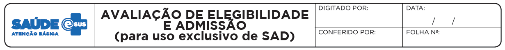

*Fonte: SAS/MS.*

Quadro 9.1 -- Bloco Cabeçalho

|CAMPO|ORIENTAÇÃO DE PREENCHIMENTO|
|-|-|
|DIGITADO POR|Nome do profissional que digitou a ficha.|
|DATA|Dia/mês/ano em que a digitação foi realizada no sistema.|
|CONFERIDO POR|Nome do profissional que fez a supervisão do preenchimento da ficha.|
|FOLHA Nº|Esse campo pode ser utilizado na organização do processo de trabalho do profissional que realizou o cadastro, através da inserção da numeração das folhas.|

*Fonte: SAS/MS.*

### 9.1.2 Identificação identificação do profissional realizou a avaliação e da equipe

Figura 9.2 -- Identificação do profissional e da equipe

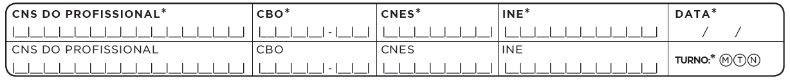

*Fonte: SAS/MS.*

Quadro 9.2 -- Bloco de identificação do profissional e da equipe

{: .atencao }
Para aumentar o número de registros identificados, a partir da versão 3.2.20 é possível registrar CNS ou CPF do cidadão atendido.

|CAMPO|ORIENTAÇÃO DE PREENCHIMENTO|
|-|-|
|CNS do Profissional\*|   Preencha o número do cartão nacional de saúde do profissional que realizou a avaliação. Observe que o CNS utilizado deve ser o mesmo que consta no cadastro deste profissional no CNES.|
|CBO\*|                   Código da Classificação Brasileira de Ocupações do Profissional que realizou a avaliação. Observe que o código utilizado deve ser o mesmo que consta no cadastro deste profissional no CNES.|
|CNES\*|                  Código do Cadastro Nacional de Estabelecimentos de Saúde (CNES) referente ao estabelecimento no qual o SAD está sediado. Observe que o CNES deve ser o mesmo habilitado por portaria.|
|INE\*|                   Código identificador nacional de equipes no Cadastro Nacional de Estabelecimentos de Saúde (CNES) do Ministério da Saúde.|

*Fonte: SAS/MS.*

\* *Campo de preenchimento obrigatório.*

Obs.: em caso de dúvida a respeito dos códigos, consultar o CNES Net.

Para inserir os dados de identificação da equipe e do profissional no sistema clicar em "Adicionar". Uma vez digitado o CNS do profissional, os campos CBO, CNES, INE serão preenchidos automaticamente.

### 9.1.3 identificação do cidadão

Figura 9.3 -- Identificação do cidadão

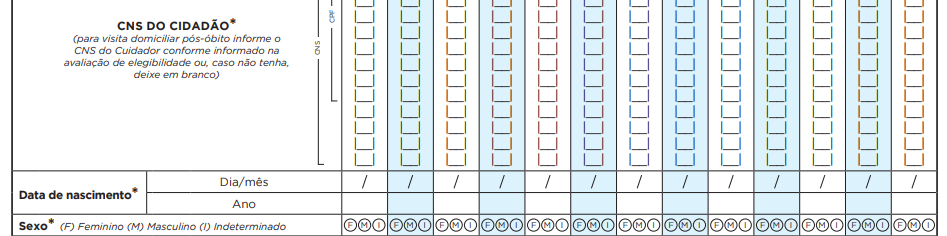

*Fonte: SAS/MS.*

Quadro 9.3 -- Bloco de identificação do cidadão

|CAMPO|ORIENTAÇÃO SOBRE O BLOCO/PREENCHIMENTO|
|-|-|
|CNS ou CPF do Cidadão\*|Número do cartão nacional de saúde do cidadão que está sendo avaliado.|
|DATA DE NASCIMENTO\*|Anote o dia/mês/ano de nascimento do cidadão.|
|SEXO\*|Assinalar F - feminino ou M - masculino.|

*Fonte: SAS/MS.*

\* *Campo de preenchimento obrigatório.*

O início da ficha solicita dados de identificação essenciais do cidadão, como: "CNS OU CPF DO CIDADÃO", "DATA DE NASCIMENTO" e "SEXO". Caso o cidadão seja elegível para o serviço de Atenção Domiciliar, os dados complementares serão solicitados no final da ficha.

### 9.1.4 Procedência

Figura 9.4 - Procedência

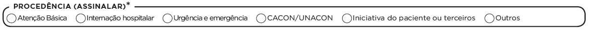

*Fonte: SAS/MS.*

Campo para registrar a procedência do cidadão para o acompanhamento em Atenção Domiciliar. Mesmo que o usuário já esteja no domicílio, deve-se registrar a informação do serviço que o encaminhou. Este campo é de preenchimento obrigatório.

Quadro 9.4 -- Bloco origem do usuário

|     CAMPO    |     ORIENTAÇÃO DE PREENCHIMENTO    |
|-|-|
|     Atenção Básica    |     Encaminhamentos feitos por Equipe de   Saúde da Família (todas as modalidades)/Equipe de Atenção Básica.    |
|     Internação hospitalar    |     Encaminhamentos feitos por equipes de   qualquer setor hospitalar, com exceção de hospitais vinculados ao Programa   SOS Emergências.    |
|     Urgência e emergência    |     Encaminhamentos feitos por equipes de   UPA, de Pronto Atendimento, de Serviço de Atendimento Móvel de Urgência, etc.    |
|     Cacon/Unacon    |     Encaminhamentos feitos por equipes de   Centros de Referências de Alta Complexidade em Oncologia/Unidades de   Assistência de Alta Complexidade.    |
|     Iniciativa do paciente   ou terceiros    |     Utilizar este campo para cidadãos que chegaram ao   serviço por demanda espontânea, ou seja, não vieram encaminhados por nenhum   outro serviço de saúde.    |
|     Outros    |     Utilizar este campo para cidadãos que   chegaram ao serviço por procedência diferente daquelas descritas nos demais   campos.    |

*Fonte: SAS/MS.*

### 9.1.5 Condição(ões) avaliada(s)

Figura 9.5 - Bloco Condição(ões) avaliada(s)

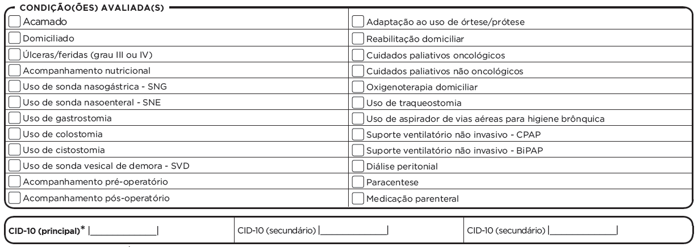

*Fonte: SAS/MS.*

Esse bloco deve ser utilizado para registrar situações/condições presentes e/ou avaliadas pelo profissional de saúde na avaliação de elegibilidade para possível admissão.

O campo "CID principal" é de preenchimento obrigatório e deve referir a patologia/lesão/situação de saúde que motivou a admissão do cidadão em AD, utilizando a Classificação Internacional de Doenças, versão 10 (CID-10). O campo "CID-10 secundário" é opcional e deve ser utilizado para registro de outras doenças que o cidadão apresenta. Nos casos em que já exista um diagnóstico prévio indicado nos documentos de encaminhamento/referência para o SAD, o CID-10 principal pode ser preenchido por qualquer profissional da EMAD.

{: .atencao }
o CID-10 secundário não deve ser igual ao CID-10 primário.

O registro das condições avaliadas serve para facilitar a identificação e o registro de situações frequentes na AD, auxiliando na organização do trabalho da equipe e na análise da produção. Não deve, portanto, substituir o registro de informações no prontuário.

### 9.1.6 Conclusão / Destino

Figura 9.6 -- Bloco Conclusão/destino

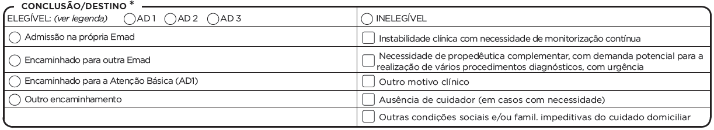

*Fonte: SAS/MS.*

Com a utilização da ficha de elegibilidade, o processo de avaliação do cidadão pode ter duas conclusões/destinos, conforme detalhado a seguir.

1)  Caso seja cidadão ELEGÍVEL para o SAD: a ficha deve ser preenchida do início ao fim.

2)  Caso seja cidadão INELEGÍVEL: a ficha deve ser preenchida até o bloco "conclusão/destino". É possível preencher os demais campos no caso de instalação que integre mais serviços (por exemplo, ESF) para que os dados de cadastro possam ser compartilhados.

Nesse bloco, será definido se o cidadão será admitido ou não no SAD, classificando-o em:

-   ELEGÍVEL na modalidade AD1, AD2 ou AD3: podendo ser admitido na própria EMAD; encaminhado para outra EMAD; encaminhado para Atenção Básica; ou, ainda, ter outros tipos de encaminhamento. Uma vez classificado como AD1, o recomendado em seguida seria marcar "encaminhamento para Atenção Básica". Essa classificação não impede que o acompanhamento seja feito também pelo SAD, caso o encaminhamento para a AB não seja possível.

-   INELEGÍVEL: quando o cidadão não será admitido no SAD, apresentando-se as seguintes justificativas: instabilidade clínica com necessidade de monitorização contínua; necessidade de propedêutica complementar, com demanda potencial para a realização de vários procedimentos diagnósticos, com urgência; outro motivo clínico; ausência de cuidador (em casos com necessidade); ou outras condições familiares impeditivas do cuidado domiciliar.

Quadro 9.5 -- Bloco Classificação da Atenção Domiciliar em
modalidades

|MODALIDADE DE AD||
|-|-|
|**AD1**  Atenção Domiciliar na modalidade 1| a prestação da assistência à saúde na modalidade AD1 é de responsabilidade das equipes de Atenção Básica (eSF, eAB, Nasf), por meio de atendimentos regulares no domicílio. Destina-se a usuários que possuam problemas de saúde controlados/compensados e com dificuldade ou impossibilidade física de locomoção até uma unidade de saúde e que necessitem de cuidados com menor frequência e com menor necessidade de intervenções multiprofissionais, uma vez que se pressupõe estabilidade e cuidados satisfatórios pelos cuidadores.|
|**AD2**  Atenção Domiciliar na modalidade 2| a prestação da assistência à saúde na modalidade AD2 é de responsabilidade dos Serviços de Atenção Domiciliar, por meio das EMAD e EMAP, mantendo-se o cuidado compartilhado com as equipes de Atenção Básica. Referem-se a usuários que possuem problemas de saúde e dificuldade ou impossibilidade física de locomoção até uma unidade de saúde e que necessitem de maior frequência de cuidado, recursos de saúde e acompanhamento contínuo, podendo ser oriundos de diferentes serviços da rede de atenção. Exemplos de situações que caracterizam AD2: adaptação inicial ao uso de sondas e ostomias; acompanhamento domiciliar em pós-operatório; uso de aspirador de vias aéreas para higiene brônquica; necessidade de medicação parenteral.
|**AD3**  Atenção Domiciliar na modalidade 3| a prestação da assistência à saúde na modalidade AD3 é de responsabilidade das equipes de Atenção Domiciliar (EMAD e EMAP), mantendo-se o cuidado compartilhado com a equipe de Atenção Básica. Refere-se a usuário com os critérios de AD2 somados a suporte ventilatório.|

*Fonte: Portaria GM/MS nº 825, de 25 de abril de 2016*

**Quadro 9.6 -- Bloco Conclusão/destino**

|     CONCLUSÃO    |     TIPO    |     ORIENTAÇÃO DE PREENCHIMENTO    |
|-|-|-|
|     ELEGÍVEL    |     Admissão na própria Emad    |     Assinale esta opção nos casos em que a   avaliação indicar que o cidadão é elegível para a Atenção Domiciliar e será   acompanhado pela própria equipe que está realizando a avaliação.    |
| ELEGÍVEL |     Encaminhado para outra Emad    |     Assinale esta opção nos casos em que a   avaliação indicar que o cidadão é elegível para a Atenção Domiciliar e será   encaminhado para acompanhamento por outra Emad.    |
| ELEGÍVEL |     Encaminhado para a Atenção Básica (AD1)    |     Assinale esta opção nos casos em que a   avaliação indicar que o cidadão é elegível para a Atenção Domiciliar, na   modalidade AD1, e será encaminhado para acompanhamento de equipe da Atenção   Básica.    |
| ELEGÍVEL |     Outro encaminhamento    |     Assinale esta opção nos casos em que a   avaliação indicar que o cidadão é elegível para Atenção Domiciliar e terá   encaminhamento diferente.    |
|     INELEGÍVEL    |     Instabilidade clínica com necessidade de   monitorização contínua    |     Assinale esta opção nos casos em que a   avaliação indicar que o cidadão é inelegível para a Atenção Domiciliar em   função de instabilidade clínica, que acarretaria risco ao cuidado no   domicílio e demandaria monitorização contínua.    |
| INELEGÍVEL |     Necessidade de propedêutica complementar,   com demanda potencial para a realização de vários procedimentos diagnósticos,   com urgência    |     Assinale esta opção nos casos em que a   avaliação indicar que o cidadão é inelegível para a Atenção Domiciliar em   função de necessitar de propedêutica complementar, com demanda potencial para   a realização de vários procedimentos diagnósticos, em sequência, com   urgência.    |
| INELEGÍVEL |     Outro motivo clínico    |     Assinale esta opção nos casos em que a   avaliação indicar que o cidadão é inelegível para a Atenção Domiciliar em   função de motivos clínicos diferentes dos listados anteriormente.    |
| INELEGÍVEL |     Ausência de cuidador (em casos de   necessidade)    |     Assinale esta opção nos casos em que a   avaliação indicar que o cidadão é inelegível para a Atenção Domiciliar em   função de não haver cuidador disponível, nos casos de usuários dependentes   funcionalmente, assim considerados nos termos da Classificação Internacional   de Funcionalidade, Incapacidade e Saúde (CIF).    |
| INELEGÍVEL |     Outras condições sociais e/ou familiares   impeditivas do cuidado domiciliar    |     Assinale esta opção nos casos em que a   avaliação indicar que o cidadão é inelegível para a Atenção Domiciliar em   função de outras condições sociais e/ou familiares impeditivas do cuidado   domiciliar (ex.: negativa da família em realizar o cuidado domiciliar;   conflitos familiares envolvendo o cidadão que necessita de AD; condições de   moradia que impossibilitem o cuidado no domicílio).    |

*Fonte: SAS/MS.*

### 9.1.7 Identificação do usuário/cidadão para admissão

**Figura 9.7 -- Bloco Identificação do usuário/cidadão para admissão**

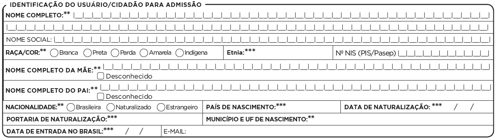

*Fonte: SAS/MS.*

Uma vez classificado como elegível para o serviço de Atenção Domiciliar, com a conclusão "admitido na própria EMAD", o profissional deve realizar também o preenchimento dos dados referentes à identificação do cidadão. Os campos obrigatórios para cidadãos admitidos na própria Emad, neste caso, estarão marcados com dois asteriscos (\**). Os campos obrigatórios com três asteriscos (\***) são condicionados ás respostas anteriores.

Quadro 9.7 -- Segundo bloco de identificação do usuário

|     CAMPO    |     ORIENTAÇÃO DE PREENCHIMENTO    |
|-|-|
|     NOME COMPLETO    |     Preencha o nome completo do usuário.   Obrigatório no caso de cadastramento.    |  
|     NOME SOCIAL    |     Registro do nome social, independentemente   do registro civil do cidadão.    |  
|     NOME COMPLETO DA MÃE    |     Preencha o nome completo da mãe do   cidadão. Caso o usuário não tenha essa informação, marcar como   “desconhecido”.     |  
|     MUNICÍPIO/UF DE NASCIMENTO    |     No caso de cidadãos brasileiros,   preencher com o nome do município e a Unidade da Federação de nascimento.   Obrigatório no caso de cadastramento.    |  |
|     ESTRANGEIRO    |     Assinale esta opção caso o cidadão seja   nascido e registrado fora do território brasileiro.    |  
|                 RAÇA/COR          |     Assinale a raça/cor autodeclarada do indivíduo.   Este campo é de preenchimento obrigatório, com as opções:    |  
|     *Branca*     |     Pessoa que se autodeclarar branca.1    |
|     *Preta*     |     Pessoa que se autodeclarar preta ou   negra.1    |
|     *Parda*     |     Pessoa que se autodeclarar parda, mulata,   cabocla, cafuza, mameluca, morena, ou mestiça.1    |
|     *Amarela*     |     Pessoa que se autodeclarar amarela, ou   seja, de origem japonesa, chinesa, coreana.1    |
|     *Indígena*    |     Pessoa que se autodeclarar indígena.1    |
|     ETNIA    |     O campo “Etnia” é obrigatório quando a opção “Raça/Cor” for   “Indígena”.    |  
|     E-MAIL    |     Endereço de correio eletrônico do usuário.    |  

*Fonte: SAS/MS.*

Nota: ^1^ Conforme a Pesquisa nacional por amostra de domicílios (IBGE, 2010).

Figura 9.8 -- Bloco Endereço/local de permanência

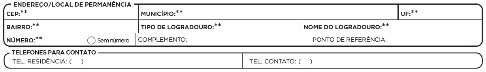

*Fonte: SAS/MS.*

Quadro 9.8 -- Bloco de endereço/local de permanência

|     CAMPO    |     ORIENTAÇÃO DE PREENCHIMENTO    |
|-|-|
|     CEP*    |     Preencha o Código de Endereçamento Postal   da residência. Campo numérico no formato 99.999-999.    |
|     MUNICÍPIO*    |     Preencha o nome da cidade em que o   usuário reside atualmente. Informações conforme tabela do site do IBGE   (disponível em: <http://www.ibge.gov.br/cidadesat/topwindow.htm?1>).     |
|     UF*    |     Preencha o Estado de residência do   cidadão conforme o IBGE. Vide Anexo B.     |
|     BAIRRO*    |     Escreva o bairro em que o usuário reside   atualmente. Pode ser preenchido com nomes e números (alfanumérico).     |
|     TIPO DE LOGRADOURO    |     Escreva o tipo de logradouro conforme   opções fornecidas pelos correios (Rua, Avenida etc.). Vide Anexo C.     |
|     NOME DO LOGRADOURO*    |     Escreva o nome do logradouro em que o   indivíduo reside ou permanece, no caso de pessoa em situação de rua.     |
|     NÚMERO*    |     Escreva o número da casa ou apartamento.   No caso da ausência de número, assinale o campo “Sem número”.    |
|     COMPLEMENTO    |     Escreva o complemento do endereço. Pode   ser preenchido com o nome e números (alfanumérico) do edifício ou algum outro   dado que não se enquadre nos outros campos.    |
|     PONTO DE REFERÊNCIA    |     Escreva se existe algum ponto referência   próximo ao domicílio ou ao local de permanência. Ex: mercado, farmácia,   escola, etc.    |
|     TELEFONE RESIDENCIAL    |     Anote o número do telefone fixo com DDD   (Discagem Direta a Distância) do município em que o usuário reside.    |
|     TELEFONE DE CONTATO    |     Anote o número do telefone com DDD do   município em que o usuário pode ser encontrado mais facilmente. A preferência   é que seja telefone fixo ou contato próximo ao domicílio. Caso não possua, o   campo deverá ficar em branco. Evitar telefones de empresa, que são trocados   com frequência.    |

*Fonte: SAS/MS.*

### 9.1.8 Cuidador

O(s) cuidador(es) é(são) a referência no cuidado ao cidadão para as equipes de Atenção Domiciliar, que tanto pode ser alguém da própria família ou pessoa que se dispõe a cuidar, quanto alguém contratado para exercer essa função. O bloco do cuidador permitirá traçar o perfil desse ator que tem fundamental importância no plano terapêutico estabelecido para o usuário. Nos casos em que há um arranjo entre vários cuidadores, solicitar que eles indiquem uma pessoa para o registro na ficha. É de suma importância o preenchimento do CNS do cuidador, nos casos em que há cuidador, pois será a esse CNS que o atendimento pós-óbito será vinculado no sistema, caso ocorra.

Figura 9.9 - Bloco Cuidador

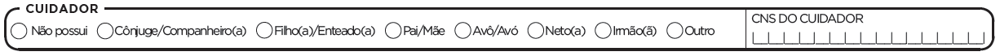

*Fonte: SAS/MS.*

Quadro 9.9 - Cuidador

|CAMPO|ORIENTAÇÃO DE PREENCHIMENTO|
|-|-|
|NÃO POSSUI|Marcar quando não houver cuidador.|
|CÔNJUGE/COMPANHEIRO|Marcar se o cuidador for casado legalmente ou que simplesmente vive no mesmo teto do usuário.|
|FILHO(A)/ENTEADO(A)|Marcar se o cuidador for filho ou enteado do usuário.|
|PAI/MÃE|Marcar se o cuidado for pai/mãe do usuário.|
|AVÔ/AVÓ|Marcar se o cuidador for avô/avó do usuário.|
|NETO(A)|Marcar se o cuidador for neto(a) do usuário.|
|IRMÃO(Ã)|Marcar se o cuidador for irmão(ã) do usuário.|
|OUTRO|Marcar se o cuidador tiver outro grau de parentesco que não descrito anteriormente.|

*Fonte: SAS/MS.*

## 9.2 Ficha de Atendimento Domiciliar

**Objetivo da ficha:** A ficha de atendimento domiciliar é o instrumento para coleta de dados dos atendimentos realizados pelo SAD. A ficha deverá ser utilizada, por cada profissional, em todos os atendimentos, sendo que cada profissional registrará a sua conduta. Há espaço para informações referentes a até 13 atendimentos dispostos em posição vertical. Caso a quantidade de atendimentos em um dia exceda esse número, o profissional deverá utilizar uma nova ficha.

**Equipes que utilizam esta ficha:** Equipes Multiprofissionais de Atenção Domiciliar (EMAD) e Equipes Multiprofissionais de Apoio (EMAP).

**Profissionais que utilizam esta ficha:** Profissionais de nível superior e de nível médio.

A seguir, serão apresentados os campos da Ficha de Atendimento
Domiciliar e as orientações sobre como preenchê-los. Os campos
assinalados com asterisco (/*) são de preenchimento obrigatório.

### 9.2.1 Cabeçalho

Figura 9.10 -- Cabeçalho da ficha de atendimento domiciliar

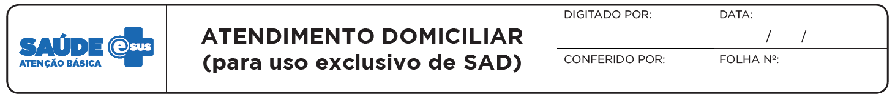

*Fonte: SAS/MS.*

O cabeçalho do instrumento, assim como na ficha de avaliação, tem um bloco para a identificação e o controle da digitação, que é importante na organização do trabalho em nível local. Esse bloco será preenchido pelo digitador.

### 9.2.2 Identificação do profissional e do estabelecimento de saúde

Figura 9.11 -- Bloco de identificação do profissional e do estabelecimento de saúde

*Fonte: SAS/MS.*

O bloco de identificação do atendimento compreende o registro de informações referentes à equipe e ao profissional de saúde. Esse bloco difere da ficha de elegibilidade apenas pelo campo "turno", que deverá ser informado em cada atendimento, constando no bloco seguinte. Assim essa ficha deverá ser de produção diária. Exemplo: se, no dia 10 de fevereiro, o profissional realizou dez atendimentos domiciliares, no dia seguinte, 11 de fevereiro, ele deve iniciar com uma nova ficha, mesmo que tenha sobrado espaço para outros atendimentos na ficha do dia anterior. As fichas de coleta de dados trazem a informação individualizada por cidadão, por meio do número do CNS, além da identificação do estabelecimento de saúde e dos profissionais de saúde envolvidos, que também é feita pelo número do CNS.

Quadro 9.10 -- Bloco de identificação do profissional e estabelecimento de saúde

|     CAMPO    |     ORIENTAÇÃO DE PREENCHIMENTO    |
|-|-|
|     CNS do profissional*    |     Cartão Nacional de Saúde do   profissional que realizou a avaliação. Observe que o CNS utilizado deve ser o   mesmo que consta no cadastro deste profissional no CNES.     |
|     CBO*    |     Cadastro Brasileiro de Ocupações do   profissional que realizou o atendimento. Observe que o código utilizado deve ser o mesmo que   consta no cadastro deste profissional no CNES.     |
|     CNES*    |     Código do Cadastro Nacional   de Estabelecimentos de Saúde (CNES) referente ao estabelecimento no qual o   SAD está sediado. Observe que o CNES deve ser o mesmo habilitado por   portaria.     |
|     INE*    |     Código Identificador   Nacional de Equipes no Cadastro Nacional de Estabelecimentos de Saúde (CNES)   do Ministério da Saúde.     |
|     DATA*    |     Dia/mês/ano em que foram realizados os   atendimentos.    |

*Fonte: SAS/MS.*

\* *Campo de preenchimento obrigatório.*

*Obs.: em caso de dúvida a respeito dos códigos, consultar o CNES Net.*

### 9.2.3 Identificação dos cidadãos e local do atendimento

Figura 9.12 -- Bloco Identificação dos cidadãos e local do atendimento

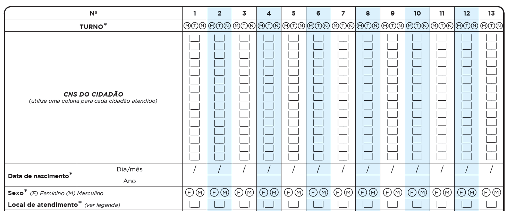

*Fonte: SAS/MS.*

Nesse bloco, serão identificados os dados dos cidadão tais como: turno em que ele foi atendido (manhã, tarde ou noite), CNS do Cidadão, data de nascimento, sexo e local de atendimento. O número do CNS não é obrigatório em função de esse registro ainda estar em processo de universalização. Entretanto sua utilização é de suma importância, uma vez que esse registro permitirá a vinculação dos dados de todos os atendimentos de um mesmo cidadão, permitindo seu acompanhamento integral e longitudinal de fato e a geração de relatórios. Ou seja, é através da agregação das informações em um mesmo número de CNS que, futuramente, o cidadão poderá acessar informações de seus atendimentos em diferentes serviços de saúde.

Quadro 9.11 -- Bloco de identificação do usuário

|     CAMPO    |     ORIENTAÇÃO SOBRE O BLOCO/PREENCHIMENTO    |
|-|-|
|     TURNO*    |     Turno em que foram realizados os   atendimentos, sendo: M - manhã, T - tarde ou N - noite.    |
|     CNS DO CIDADÃO    |     Campo destinado ao número do Cartão   Nacional de Saúde (CNS) do cidadão que está em atendimento. Os números devem   ser inseridos no sentido vertical. Cidadãos sem o CNS poderão e deverão ser   atendidos pela equipe.     |
|     DATA DE NASCIMENTO*    |     Informe o dia, mês e ano do nascimento do   cidadão. Variável de verificação do CNS.     |
|     SEXO*    |     Assinalar F – feminino ou M – masculino.    |
|     LOCAL DE ATENDIMENTO*    |     Informar o número referente ao local em   que foi realizado o atendimento do usuário, considerando as seguintes opções:       (01) UBS - Unidade Básica de Saúde      (02) Unidade Móvel       (03) Rua       (04) Domicílio       (05) Escola/Creche       (06) Outros       (07) Polo (Academia da Saúde) – denomina-se polo a unidade (espaço físico) do Programa Academia da   Saúde. É considerado polo tanto a estrutura física construída especificamente   para o desenvolvimento do programa quanto o espaço físico destinado para tal   fim nas dependências de uma UBS, desde que o número de CNES desta UBS esteja   associado ao código 12 (estrutura de Academia da Saúde).       (08) Instituição/Abrigo – instituições para acolhimento destinadas a famílias e/ou indivíduos   com vínculos familiares rompidos ou fragilizados, a fim de garantir proteção   integral.       (09) Unidade prisional ou congêneres – cadeia pública, colônia agrícola,   industrial ou similar, casa do albergado, centro de observação e hospital de   custódia e tratamento psiquiátrico.       (10) Unidade socioeducativa – base física necessária para a organização   e o funcionamento de programa de atendimento de medidas socioeducativas.    |

*Fonte: SAS/MS.*

\* *Campo de preenchimento obrigatório.*

A modalidade de AD, assim como descrita na ficha de elegibilidade, Quadro 9.05, é definida a partir da caracterização do cidadão, do tipo de atenção e dos procedimentos utilizados para a realização do cuidado. No rodapé da ficha está a legenda para classificar a modalidade em AD1, AD2 e AD3.

Figura 9.13 -- Bloco modalidade de AD

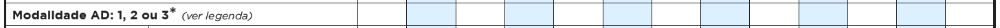

*Fonte: SAS/MS.*

### 9.2.4 Tipo de atendimento

Figura 9.14 -- Bloco Tipo de atendimento

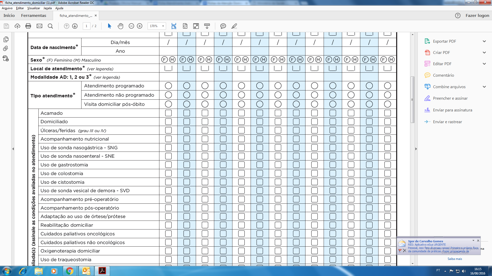

*Fonte: SAS/MS.*

Quadro 9.12 -- Tipo de atendimento

|     CAMPO    |     ORIENTAÇÃO SOBRE O BLOCO/PREENCHIMENTO    |
|-|-|
|ATENDIMENTO   PROGRAMADO| assinale   este campo caso o atendimento tenha sido programado previamente.    |
|  ATENDIMENTO   NÃO PROGRAMADO| assinale   este campo caso o atendimento tenha sido realizado em função de demanda do   usuário/cuidadores, outro serviço ou outros, não programado previamente pela equipe.    |
|    VISITA   DOMICILIAR PÓS-ÓBITO| Esse   campo deve ser assinalado no(s) atendimento(s) posterior(es) à constatação de   óbito do cidadão, nas situações em que ocorrerá acompanhamento da   família/cuidador mesmo após o óbito. Verificar, ao final do capítulo,   orientações específicas de preenchimento da ficha, nestes casos.    |

*Fonte: SAS/MS.*

### 9.2.5 Situações presentes e/ou avaliadas e CID

Este bloco deve ser utilizado para registrar situações/condições presentes e/ou avaliadas pelo profissional de saúde no atendimento do cidadão. As situações presentes devem ser assinaladas em todos os atendimentos e por todos os profissionais presentes, e a ausência de marcação indicará que a situação/condição deixou de ocorrer.

{: .atencao }
este registro serve para facilitar a identificação e o registro de situações frequentes na AD, auxiliando na organização do trabalho da equipe e na análise da demanda. Não deve, portanto, substituir o registro de informações na evolução e o registro de procedimentos realizados no prontuário clínico.

Figura 9.15 -- Bloco Situações presentes e/ou avaliadas e CID

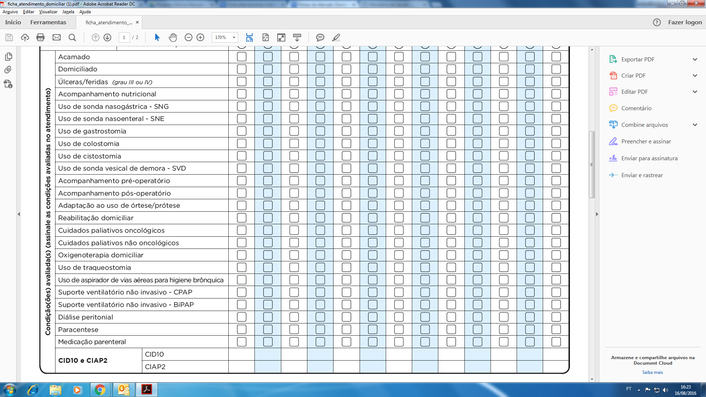

*Fonte: SAS/MS.*

Quadro 9.13 -- Orientação sobre a CID-10 e CIAP-2

|CAMPO|ORIENTAÇÃO SOBRE O BLOCO/PREENCHIMENTO|
|-|-|
|CID-10|      Utilize esse campo para registro da patologia/lesão que motivou o atendimento domiciliar do cidadão. É possível repetir o CID-10 de admissão do paciente ou utilizar algum CID-10 que tenha motivado especificamente este atendimento.|
|CIAP-2|      Utilize este campo para registro da CIAP-2 que motivou o atendimento domiciliar do cidadão.|

*Fonte: SAS/MS.*

### 9.2.6 Procedimentos realizados

O objetivo desse bloco é o registro dos procedimentos realizados. Devem-se assinalar os procedimentos realizados durante o atendimento ao cidadão, considerando-se as regras para procedimentos estabelecidas no SIGTAP (por exemplo, relação de procedimento com CBO). Caso não tenham sido realizados procedimentos, não se faz necessário acrescentar nenhuma informação, visto que o sistema contabilizará essa visita considerando os dados do profissional constantes no cabeçalho.

O campo "Outro procedimento" deve ser utilizado para registrar procedimentos realizados não constantes na listagem disponível na ficha, considerando que procedimentos restritos por habilitações ou classificações de serviço poderão ser visualizados através de relatórios, mas não serão contabilizados no relatório de BPA. Caso tenham sido realizados mais de quatro procedimentos não constantes na listagem, o profissional deve eleger os quatro principais.

Sugere-se que sejam registrados apenas os procedimentos mais característicos da AD. Assim, não há necessidade de registrar, por exemplo, procedimento de verificação de pressão arterial, sendo que este é um procedimento intrínseco ao processo de avaliação clínica de qualquer usuário.

{: .atencao }
vale ressaltar uma **mudança** significativa em relação aos **registros de procedimentos** no RAAS. Devido ao e-SUS AB conter informações oriundas do CNES e ter entradas individualizadas e registros por turno, **não** será **necessário o registro** de procedimentos relativos a **consultas, visitas, atendimento**. Estas informações serão obtidas do cabeçalho da ficha, ou seja, conforme o CNS e CBO do profissional.

No caso de profissional de nível superior, serão contabilizados automaticamente os seguintes procedimentos: "consulta/atendimento domiciliar" e "visita domiciliar por profissional de nível superior". Por sua vez, os profissionais de nível médio terão registros automáticos de: "assistência domiciliar por profissional de nível médio" e "visita domiciliar por profissional de nível médio".

Por exemplo, quando um cirurgião dentista realiza uma visita e assinala o campo de atendimento domiciliar ao registrar os dados do usuário, automaticamente, será gerado um registro dos procedimentos 03.01.01.013-7 -- Consulta/atendimento domiciliar, e 03.01.05.014-7 -- Visita domiciliar por profissional de nível superior.

Figura 9.16 -- Bloco Procedimentos

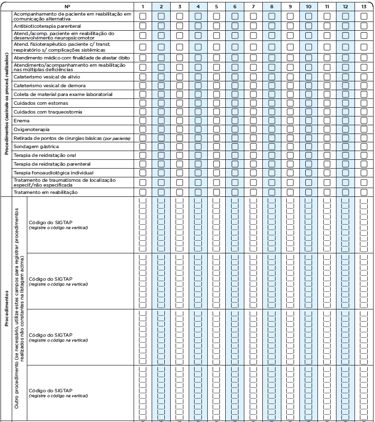

*Fonte: SAS/MS.*

### 9.2.7 Conduta / Desfecho

Esse bloco de informação é utilizado para registrar a conduta/desfecho após o atendimento realizado. Este campo deve ser utilizado em todos os atendimentos, definindo se permanecerá em atendimento ou se o cidadão deixará de ser acompanhado pela equipe, ainda que temporariamente. Por exemplo, caso o cidadão seja encaminhado para internação hospitalar, ainda que com possibilidade de retorno breve para o SAD, deve-se assinalar a conduta "internação hospitalar". Quando ele retornar, deverá ser feita nova ficha de avaliação de elegibilidade para reiniciar os atendimentos. Como outro exemplo, caso o cidadão seja encaminhado para internação apenas para realização de exames, com previsão exata de retorno ao SAD em 24h ou 48h, pode-se manter o desfecho permanência, sem necessidade de saída e readmissão.

Figura 9.17 -- Bloco Conduta/desfecho

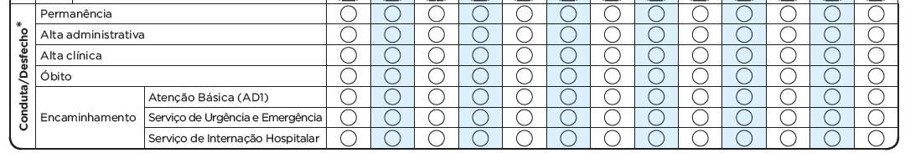

*Fonte: SAS/MS.*

Quadro 9.14 -- Conduta/desfecho

|CAMPO|	ORIENTAÇÃO SOBRE O BLOCO / PREENCHIMENTO|
|-|-|
|Permanência|	Utilize este desfecho nas situações em que o usuário atendido permanecer em acompanhamento pela equipe.
|Alta administrativa|	Utilize este desfecho nas situações em que o acompanhamento for descontinuado em função de situações como:  ●	mudança de área de abrangência (devendo ser transferido para a equipe responsável pela área do novo domicílio, seja SAD, seja Atenção Básica);  ●	impossibilidade da permanência do cuidador no domicílio (nos casos em que há necessidade);  ●	não aceitação do acompanhamento;  ●	solicitação de desligamento a pedido do paciente e/ou familiar;  ●	não cumprimento das combinações construídas no plano de cuidados, após tentativas de negociação/repactuação entre equipe/família/cuidador/usuário com o objetivo de reconstruir vínculo.
|Alta clínica|	Utilize este desfecho nas situações em que o acompanhamento for descontinuado em função de situações como:  ●	cura;  ●	recuperação ou melhora das condições que justificavam o acompanhamento pelo SAD .
|Óbito|	Utilize este desfecho nas situações de óbito do usuário em acompanhamento.
|Encaminhamento|	**Atenção Básica (AD1)**: Utilize esta conduta/desfecho nas situações em que o acompanhamento for descontinuado em função de situações como:  ●	melhora das condições clínicas e/ou estabilidade clínica, com encaminhamento para a Atenção Básica;    **Serviço de urgência e emergência**: Utilize esta conduta/desfecho nas situações em que o acompanhamento for descontinuado em função de situações como:  ●	situação clínica que demande encaminhamento para serviço de urgência/emergência, seja encaminhado pela equipe, seja por procura espontânea do usuário/cuidador.    **Serviço de internação hospitalar**:  Utilize este desfecho nas situações em que o acompanhamento for descontinuado em função de situações como:  ●	piora clínica que justifique internação hospitalar.

*Fonte: SAS/MS.*

### 9.2.8 Visitas pós-óbito

Uma situação muito frequente na AD é a necessidade de acompanhar a família ou cuidador(es) no processo inicial de luto após o óbito do cidadão que estava em acompanhamento, fomentando inclusive o vínculo com a Atenção Básica, quando este não estiver bem estabelecido, ou encaminhando para outros serviços, quando necessário.  Para esse acompanhamento, existe o campo de visita pós-óbito na ficha de atendimento, que nesta versão foi modificado para facilitar o uso e qualificar as informações que poderão ser obtidas. A seguir são apresentadas orientações específicas para o preenchimento da ficha no caso de visita pós-óbito, caso em que o cidadão atendido será o familiar/cuidador:

-   **CNS do cidadão (cuidador)**: o registro de visita pós-óbito apenas     será vinculado ao cidadão falecido caso tenha havido registro do CNS     do cuidador na Ficha de Avaliação de Elegibilidade e Admissão (FAE).     Caso o atendimento seja realizado para outra pessoa, também     cuidadora, mas cujo CNS não foi registrado na FAE, indica-se     preencher a visita com o CNS do cuidador constante na FAE, para que     seja possível relacionar essa visita com o cidadão que estava sob     acompanhamento do SAD. Data de nascimento e sexo: preencher com os     dados do cuidador ou familiar, considerando as orientações acima;

-   **Modalidade de AD**: preencher com a modalidade do cidadão falecido     que estava em atendimento pelo SAD.

-   **Tipo de atendimento:** marcar visita pós-óbito.

-   **Condições avaliadas e procedimentos:** estes campos não precisam     ser preenchidos. O procedimento de "visita domiciliar pós-óbito"     será registrado no sistema automaticamente, quando o tipo de     atendimento selecionado for este.

-   **Conduta/desfecho:** preencher com a conduta relacionada ao cuidado     do familiar/cuidador, ou seja, caso haja mais de uma visita marcar     permanência, até que seja finalizado o atendimento.

Os demais campos, a exemplo do "Turno", devem ser preenchidos conforme
orientações anteriores, constantes neste manual.

*Fonte: SAS/MS.*
