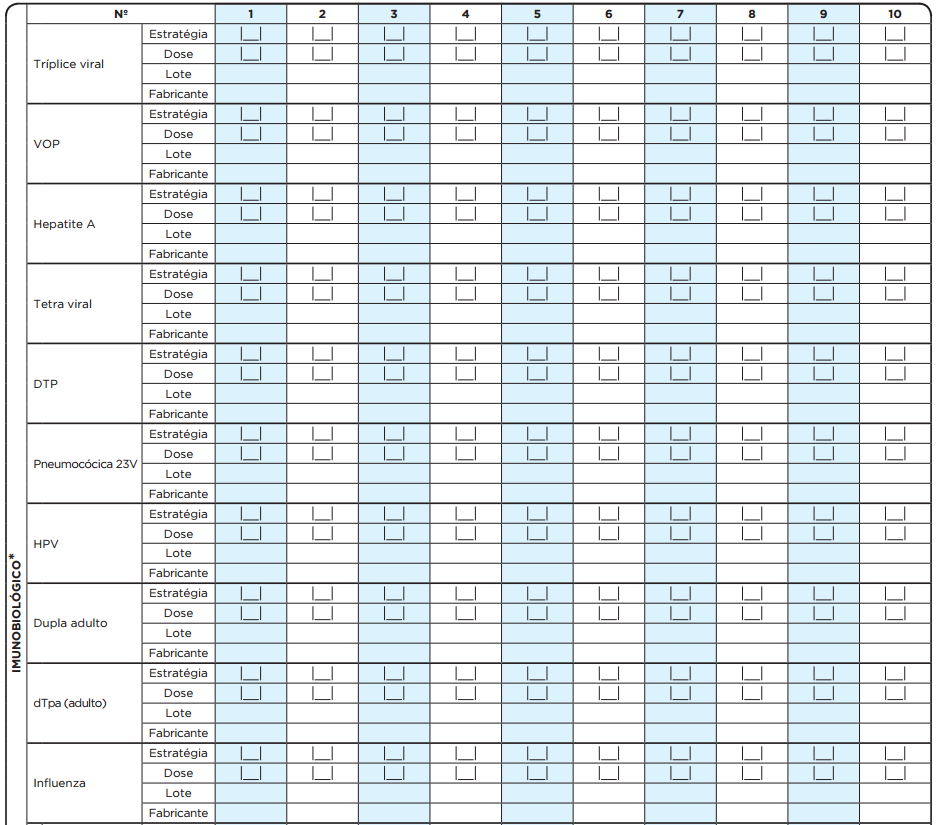
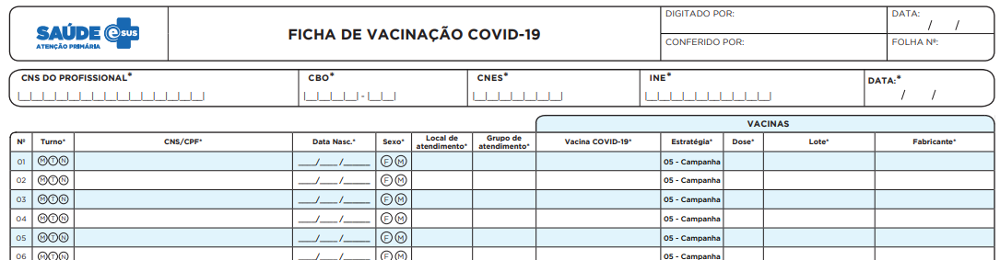
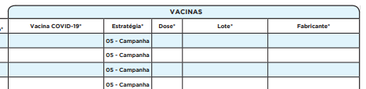

|---
layout: default
title: Ficha de Vacinação
parent: Coleta de Dados Simplificada v3.2
nav_order: 11
has_children: false
has_toc: true
---

# CAPÍTULO 10 - Ficha de Vacinação
{: .no_toc }

## Sumário
{: .no_toc .text-delta }

- TOC
{:toc}

>  **ATUALIZAÇÃO:** disponível a partir da versão 3.0.

**Objetivo da ficha:** É utilizada para registro de informações das vacinas aplicadas na rotina, campanhas ou demais estratégias realizadas na Atenção Básica. Ela identifica as vacinas que foram aplicadas no cidadão, assim como o profissional que a realizou. Esta ficha não deve ser utilizada para o registro de doses aplicadas anteriormente, mas somente para as administradas no dia.

**Profissionais que utilizam esta ficha:** É utilizada pelos profissionais que realizam aplicação de vacinas no âmbito da Atenção Básica, como enfermeiros, técnicos de enfermagem e médicos.

A seguir são apresentados os campos da Ficha de Vacinação e as orientações de como preenchê-los. Os campos assinalados com asterisco (\*) são de preenchimento obrigatório.

>  **NOTA**: para informações sobre **Normas e Procedimento de Vacinação**, acesse o endereço eletrônico do [Manual disponibilizado pelo Programa Nacional de Imunizações](http://bvsms.saude.gov.br/bvs/publicacoes/manual_procedimentos_vacinacao.pdf)

## 10.1 Cabeçalho

O cabeçalho tem um bloco para a identificação e controle da digitação, que é importante na organização do trabalho a nível local. Este bloco é preenchido pelo digitador.

Figura 10.1 -- Cabeçalho da Ficha de Vacinas

*Fonte: SAS/MS.*

Quadro 10.1 -- Identificação e controle da digitação
|CAMPO|ORIENTAÇÃO DE PREENCHIMENTO|
|-|-|
|DIGITADO POR|Nome do profissional que digitou a ficha.|
|DATA|Dia/mês/ano em que a digitação foi realizada no sistema.|
|CONFERIDO POR   Nome do profissional que conferiu o correto preenchimento da ficha.|
|FOLHA Nº|Este campo pode ser utilizado na organização do processo de trabalho do profissional que realizou o procedimento, por meio da inserção de numeração das folhas.|

*Fonte: SAS/MS.*

## 10.2 Identificação do profissional e do estabelecimento de saúde

O próximo bloco é utilizado para identificação do profissional que realizou os procedimentos.

Figura 10.2 -- Identificação do profissional e lotação

*Fonte: SAS/MS.*

Quadro 10.2 -- Identificação do profissional e lotação

|CAMPO|ORIENTAÇÃO DE PREENCHIMENTO|
|-|-|
|  CNS do Profissional*|   Número do Cartão Nacional de Saúde (CNS) do profissional que realizou a aplicação da vacina. Cada registro de aplicação de vacina deve ser realizado e registrado por apenas UM profissional.|
|  CBO*|                   Classificação Brasileira de Ocupações (CBO) do profissional que realizou a aplicação da(s) vacina(s).|
|  CNES* |                 Código do Cadastro Nacional de Estabelecimentos de Saúde (CNES) da Unidade Básica de Saúde que oferta o serviço de vacinação onde o profissional que aplicou a(s) vacina(s) está lotado.|
|  INE* |                  Código Identificador Nacional de Equipes (INE) no Cadastro Nacional de Estabelecimentos de Saúde (CNES) do Ministério da Saúde, que identifica a equipe onde o profissional está lotado, seja equipes Saúde da Família, Nasf, CnR, etc. Este campo não é obrigatório para profissionais que não estão vinculados a equipes.|
|  DATA*  |                Dia/mês/ano em que foram realizadas as aplicações de vacina.|

*Fonte: SAS/MS.*

\* *Campo de preenchimento obrigatório.*

## 10.3 Identificação dos cidadãos e local de atendimento

Este bloco de informações permite a identificação do usuário que foi atendido por meio do CNS ou CPF, data de nascimento e sexo. Os dados informam também sobre o local do atendimento.

>  ATENÇÃO: Para aumentar o número de registros identificados, a partir da versão 3.2.20 é possível registrar CNS ou CPF do cidadão atendido.

Figura 10.3 -- Identificação dos cidadãos e local de atendimento

*Fonte: SAS/MS.*

Quadro 10.3 -- Dados dos usuários e local de atendimento

|     CAMPO    |     ORIENTAÇÃO SOBRE O BLOCO/PREENCHIMENTO    |
|-|-|
|     N°    |     Cada Ficha de Vacinação permite o   registro de informações de 08 cidadãos (um   por coluna). Caso o número de vacinas no dia   exceda esse total, o profissional deverá utilizar uma nova ficha.    |
|     TURNO*    |     Turno em que foram realizadas as   vacinações, sendo: M - manhã, T - tarde    ou N - noite.    |
|     Nº PRONTUÁRIO    |     Campo destinado ao número do   prontuário da família ou do indivíduo no estabelecimento de saúde. Este campo é usado como   referência da informação do paciente na unidade, para os casos em que seja   necessário fazer verificação dos dados.    |
|     CNS ou CPF DO   CIDADÃO    |     Campo destinado ao número do Cartão Nacional de   Saúde (CNS) do cidadão que está em atendimento. Os   números devem ser inseridos no sentido   vertical. Cidadãos sem o CNS poderão e   deverão ser atendidos pela equipe.     |
|     DATA DE NASCIMENTO*    |     Informe o dia, mês e ano do   nascimento do cidadão. Variável de verificação do CNS.     |
|     SEXO*    |     Assinalar F – feminino ou M –   masculino.    |
|     LOCAL DE ATENDIMENTO*    |     Informar o número referente   ao local em que foi realizada a(s) vacinação(ões) do usuário, considerando as   seguintes opções:       (01) UBS       (02) Unidade Móvel       (03) Rua       (04) Domicílio       (05) Escola/Creche       (06) Outros       (07) Polo (Academia da Saúde) – denomina-se polo a unidade (espaço físico)   do Programa Academia da Saúde. É considerado polo tanto a estrutura física   construída especificamente para o desenvolvimento do programa quanto o espaço   físico destinado para tal fim nas dependências de uma UBS, desde que o número   de CNES desta UBS esteja associado ao código 12 (estrutura de Academia da   Saúde).       (08) Instituição/Abrigo – instituições para acolhimento destinadas a   famílias e/ou indivíduos com vínculos familiares rompidos ou fragilizados, a   fim de garantir proteção integral.       (09) Unidade prisional ou   congêneres – cadeia pública, colônia   agrícola, industrial ou similar, casa do albergado, centro de observação   e  hospital de custódia e tratamento   psiquiátrico.       (10) Unidade socioeducativa –   base física necessária para a   organização e o funcionamento de programa de atendimento de medidas   socioeducativas.    |

*Fonte: SAS/MS.*

\* *Campo de preenchimento obrigatório.*

## 10.4 Situação/Condição

Este grupo mostra a situação ou condição do cidadão que está recebendo a(s) vacina(s), sendo possível a indicação de gestante, puérpera (exclusivo do sexo feminino) e/ou viajante.

Figura 10.4 -- Situação / Condição no momento da vacinação

*Fonte: SAS/MS.*

## 10.5 Imunobiológico

Este bloco de informações é utilizado para o registro da(s) dose(s) de vacina(s) aplicada(s) nos serviços de Atenção Básica. A lista dos imunobiológicos disponíveis para registro é definida pela Coordenação Geral do Programa Nacional de Imunizações (CGPNI).

Figura 10.5 -- Imunobiológicos (frente)

*Fonte: SAS/MS.*

Figura 10.6 - Imunobiológicos (verso)

*Fonte: SAS/MS.*

Para cada vacina aplicada o profissional deverá indicar a estratégia, a dose, o lote e o fabricante do imunobiológico. A estratégia e a dose obedecerão à legenda disponível no verso da ficha.

>  **ATENÇÃO**: **exclusivamente** para o registro de aplicação de **BCG**, caso o cidadão for **comunicante de hanseníase**, deverá marcar um "X" no campo "Comun. Hansen.".

Ainda neste bloco, o profissional pode registrar **outros imunobiológicos** não constantes na listagem (até cinco por ficha), como vacinas especiais, soros e imunoglobulinas. Esses imunobiológicos devem ser descritos a partir da sua nomenclatura oficial disponibilizada pela CGPNI, observando o preenchimento do tipo de estratégia, dose, lote e fabricante.

Figura 10.7 - Registro de aplicação de outros imunobiológicos

*Fonte: SAS/MS.*

### 10.5.1 Vacinas COVID-19

Exclusivamente para atendimento à situação nacional de Emergência em Saúde Pública está disponível o registro das doses aplicadas da vacina COVID-19. Visando otimizar o processo de registro em papel das vacinas aplicadas para a COVID-19 foi elaborado e disponibilizado uma ficha de vacinação específica para este imunobiológico. O formato de registro muda em relação ao padrão utilizado nas outras fichas, ou seja, cada indivíduo é representado nas linhas.

Figura 10.8 - Registro de aplicação da vacina contra COVID-19

*Fonte: SAS/MS.*

Para esta vacina será obrigatória a identificação do cidadão através do CPF ou CNS, data de nascimento, sexo, local de atendimento e grupo de atendimento. Este último se aplica apenas à campanhas de vacinação e é representada pela legenda com os códigos de cada grupo de atendimento específico como mostra o quadro a seguir:

Quadro 10.4 - Grupos de atendimento para campanha de vacinação contra COVID-19.

|Código|Grupo de Atendimento|
|-|-|
5  | Quilombola
6  | Privado de Liberdade
10 | Outros
13 | Func. do Sistema Prisional
31 | Caminhoneiro
32 | Coletivo Rodoviário Passageiros Urbano e de Longo Curso
33 | Portuário
34 | Anemia Falciforme
35 | Câncer
36 | Diabetes
37 | Portador de DPOC
38 | Doença Renal
39 | Doenças Cardio-Cerebrovasculares
40 | Hipertensão Grave
41 | Transplantados
42 | Obesidade Grave
43 | 60 a 64 Anos
44 | 65 a 69 Anos
45 | 70 a 74 Anos
46 | 75 a 79 Anos
47 | 80 anos ou Mais
48 | Idosos Institucionalizados
49 | Marinha
50 | Exército
51 | Força Aérea
52 | Bombeiro Civil
53 | Bombeiro Militar
54 | Guarda Municipal
55 | Policial Rod. Federal
56 | Policial Civil
57 | Policial Federal
58 | Policial Militar
59 | Ribeirinha
60 | Povos indígenas
61 | Ensino Básico
62 | Ensino Superior
63 | Auxiliar de Veterinário
64 | Biólogo
65 | Biomédico
66 | Cozinheiro e Auxiliares
67 | Cuidador de Idosos
68 | Doula/Parteira
69 | Enfermeiro(a)
70 | Farmacêutico
71 | Fisioterapeutas
72 | Fonoaudiólogo
73 | Funcionário do Sist. funerário
74 | Médico
75 | Med. Veterinário
76 | Motorista de Ambulância
77 | Nutricionista
78 | Odontologista
79 | Aux. limpeza
80 | Educador Físico
81 | Psicólogo
82 | Recepcionista
83 | Segurança
84 | Assistente Social
85 | Téc. de Enfermagem
86 | Técnico de Veterinário
87 | Terapeuta Ocup.
88 | Prof. Transporte Aéreo Coletivo
89 | Ferroviário
90 | Metroviário
91 | Aquaviário
92 | Pessoas com Deficiência Institucionalizadas
93 | Deficiência Grave
94 | Situação de Rua
95 | Trab. industriais
96 | Síndrome de Down
97 | Aux.de Enfermagem
98 | Téc. de Odontologia
99 | Estudante

Os campos do bloco "Vacinas" também são todos de preenchimento obrigatório.

Figura 10.9 - Registro de aplicação da vacina contra COVID-19

*Fonte: SAS/MS.*

O campo `Vacina COVID-19` deve ser preenchido com a **sigla** referente à vacina aplicada, de acordo com o quadro a seguir:

Quadro 10.5 - Vacinas contra COVID-19.

|Código|Imunobiológico|Fabricante|
|-|-|-|
COV19-AZE | Covid-19-Covishield | Oxford/AstraZeneca
COV19-VAC | Covid-19-Coronavac | Sinovac/Butantan
COV19-PFZ | BNT162b2 | BioNTech/Fosun Pharma/Pfizer
COV19-JAN | Ad26.COV2.S | Janssen-Cilag

O campo `Estratégia` já vem pré-preenchido com a opção "5-Campanha". O campo `Dose` deverá ser preenchido com a dose aplicada do imunobiológico. O campo `lote` deverá ser preenchido com a numeração do lote contido no frasco da vacina. O campo `Fabricante` deverá ser preenchido de acordo com o apresentado no frasco do imunobiológico.

>  **ATENÇÃO**: É importante prestar muita atenção tanto ao processo de preparação e aplicação da vacina quanto o registro da vacinação no e-SUS APS, pois não pode haver aplicação cruzada de vacinas. Desta forma o registro correto da vacinação é importante para que não ocorram erros na execução da 2ª dose da vacina.
