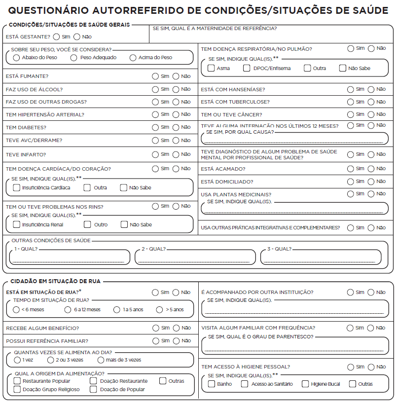
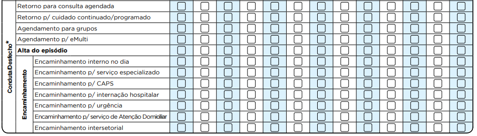
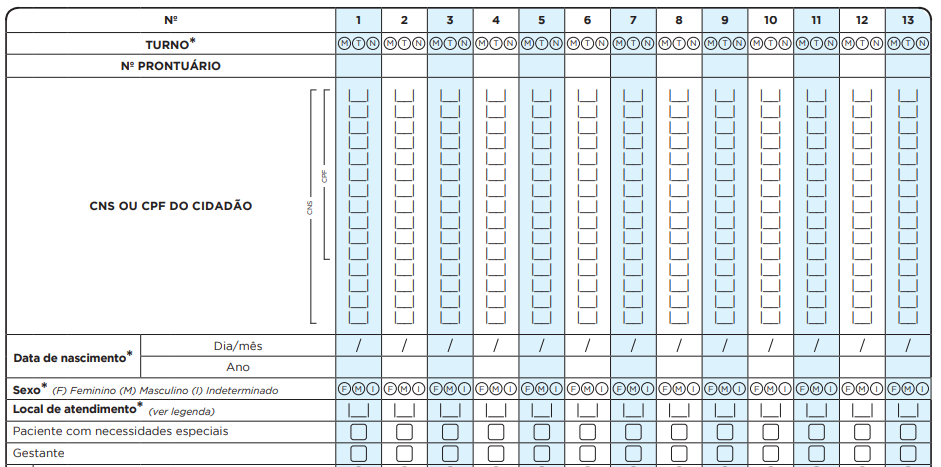
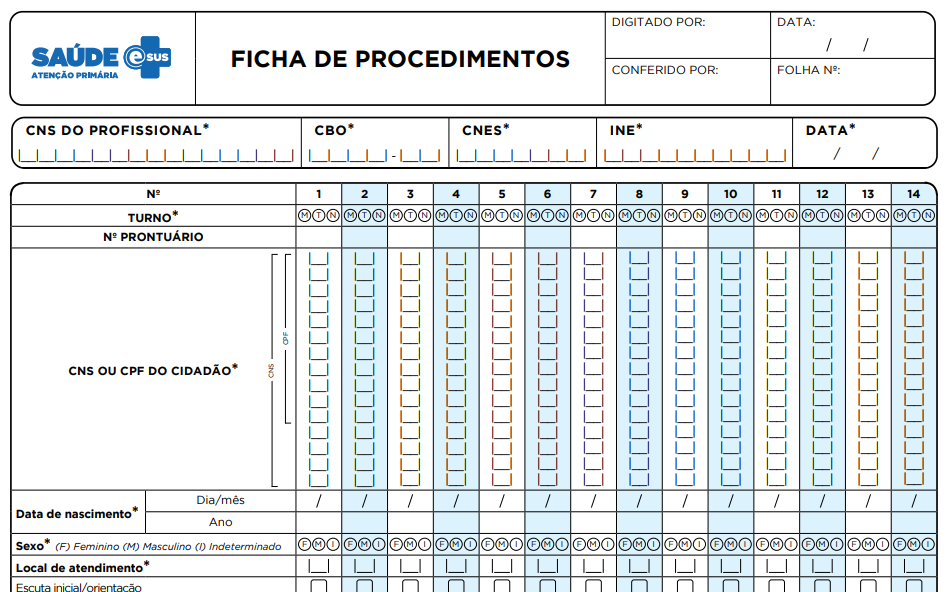
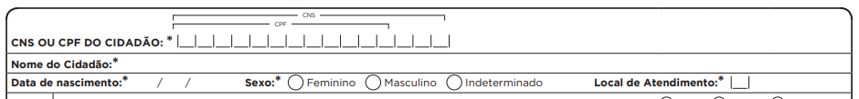
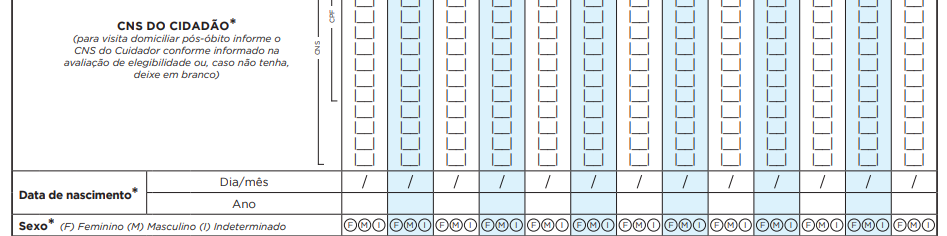

# CAPÍTULO 1 - Introdução

Neste capítulo, abordaremos, de forma resumida, os conceitos básicos que orientam o Sistema e-SUS Atenção Básica (e-SUS AB) e o funcionamento das ferramentas do sistema.

## 1. Estratégia e-SUS Atenção Básica

O e-SUS AB é uma estratégia do Departamento de Atenção Básica (DAB) para reestruturar as informações da Atenção Básica (AB) em nível nacional. Esta ação está alinhada com a proposta mais geral de reestruturação dos Sistemas de Informação em Saúde (SIS) do Ministério da Saúde (MS), entendendo que a qualificação da gestão da informação é fundamental para ampliar a qualidade no atendimento à população.

A Estratégia e-SUS AB faz referência ao processo de informatização qualificada do Sistema Único de Saúde (SUS) em busca de um SUS eletrônico (e-SUS) e tem como objetivo concretizar um novo modelo de gestão de informação que apoie os municípios e os serviços de saúde na gestão efetiva da AB e na qualificação do cuidado dos usuários. Esse modelo nacional de gestão da informação na AB é definido a partir de diretrizes e requisitos essenciais que orientam e organizam o processo de reestruturação do sistema de informação, instituído o Sistema de Informação em Saúde para a Atenção Básica (SISAB), por meio da Portaria GM/MS Nº 1.412, de 10 de julho de 2013, e a Estratégia e-SUS AB para sua operacionalização.

A Estratégia e-SUS AB preconiza:

-   **Individualizar o registro**: registro individualizado das informações em saúde, para o acompanhamento dos atendimentos aos cidadãos;

-   **Integrar a informação**: integração dos diversos sistemas de informação oficiais existentes na AB, a partir do modelo de informação;

-   **Reduzir o retrabalho na coleta de dados**: reduzir a necessidade de registrar informações similares em mais de um instrumento (fichas/sistemas) ao mesmo tempo;

-   **Informatizar as unidades**: desenvolvimento de soluções tecnológicas que contemplem os processos de trabalho da AB, com recomendações de boas práticas e o estímulo à informatização dos serviços de saúde;

-   **Gestão do cuidado**: introdução de novas tecnologias para otimizar o trabalho dos profissionais na perspectiva de fazer gestão do cuidado

-   **Coordenação do cuidado**: a qualificação do uso da informação na gestão e no cuidado em saúde na perspectiva de integração dos serviços de saúde.

A estratégia é composta por dois sistemas:

-   **SISAB**, sistema de informação nacional, que passa a ser o sistema de informação vigente para fins de financiamento, monitoramento, acompanhamento do cuidado em saúde e de adesão aos programas e estratégias da Política Nacional de Atenção Básica (PNAB), e

-   **Sistema e-SUS AB**, composto por dois softwares para coleta dos dados:

    -   Sistema com Coleta de Dados Simplificada (**CDS**), sistema de transição/contingência, que apoia o processo de coleta de dados por meio de fichas e sistema de digitação;

    -   Sistema com Prontuário Eletrônico do Cidadão (**PEC**), sistema com prontuário eletrônico, que tem como principal objetivo apoiar o processo de informatização das UBS.

Durante o texto, os softwares do Sistema e-SUS AB também são referidos como Sistema com CDS e Sistema com PEC, respectivamente, ou ainda, simplesmente, CDS e PEC.

>  **NOTA**: Para conhecer os conceitos e orientações do Sistema com PEC, consulte o Manual do Sistema com Prontuário Eletrônico do Cidadão. Especificamente sobre o módulo de digitação do CDS acesse o Capítulo 07 desse manual.

>  **NOTA**: Para mais informações sobre legislação, documentos e materiais de apoio sobre a Estratégia e-SUS AB, acesse a **página do e-SUS AB** por meio do endereço eletrônico[http://dab.saude.gov.br/portaldab/esus.php](http://dab.saude.gov.br/portaldab/esus.php)

## 2. Fichas de Coleta de Dados Simplificada

O Sistema com CDS é um dos componentes da estratégia e-SUS AB, adequada para UBS com cenários **sem informatização**, ou quando esta está temporariamente indisponível (falta de energia elétrica, etc).

O objetivo é ser uma estratégia de preenchimento de fichas que coletam dados de cadastros, visitas domiciliares, atendimentos e atividades desenvolvidas pelas equipes de AB. Esses dados devem ser digitados no CDS off-line ou PEC e, posteriormente, enviados para o SISAB por meio do PEC com conectividade.

O CDS é composto por doze fichas para o registro de informações:

-   Cadastro Individual,
-   Cadastro Domiciliar,
-   Ficha de Atendimento Individual,
-   Ficha de Procedimentos,
-   Ficha de Atendimento Odontológico Individual,
-   Ficha de Atividade Coletiva,
-   Ficha de Vacinação (**nova**),
-   Ficha de Visita Domiciliar,
-   Marcadores de Consumo Alimentar,
-   Ficha Complementar.

Ainda existem mais duas fichas exclusivas para Serviço de Atenção Domiciliar (SAD):

-   Ficha de Avaliação de Elegibilidade,
-   Ficha de Atenção Domiciliar.

A estratégia avança ao permitir a entrada dos dados orientada pelo curso natural do atendimento e não ser focada na situação-problema de saúde. A entrada de dados individualizados por cidadão abre caminho para a gestão do cuidado e aproximação desses dados ao processo de planejamento da equipe.

Este manual foi elaborado para orientar os profissionais de saúde e gestores a utilizarem o Sistema e-SUS AB com CDS em relação ao preenchimento das fichas impressas e à digitação delas no sistema.

O processo de digitação deve ser definido no âmbito da gestão municipal, considerando os aspectos logísticos e os recursos humanos disponíveis a esse fim. Em especial, contemplando os diferentes cenários de implantação, como visto no Manual de Implantação da Estratégia e-SUS AB, o fluxo deve estar adequado a cada realidade.

>  **ATENÇÃO**: o **profissional que realizou** o cadastro ou o atendimento/procedimento **é responsável pelas informações** que fornece, **não cabendo** ao digitador, ou a qualquer **outro profissional,** a complementação**, a correção** ou o apontamento de campos que faltam, mesmo que conheçam a informação para complementar. Na ocasião de incorreções, sugere-se a devolução da ficha ao profissional que deu origem ao registro.

Nos outros capítulos deste manual serão apresentadas as fichas do CDS com a descrição dos campos disponíveis para o preenchimento das informações, os conceitos associados a cada um deles e as regras para o seu preenchimento e digitação no sistema.

>  **NOTA**: diferente da política de controle de versão do Sistema e-SUS AB como um todo, visto na próxima seção, **as Fichas de CDS** podem passar por **alterações**/melhorias **anuais ou bienais**, conforme a necessidade apontada pelos municípios e pactuação tripartite. Por isso, é importante que os gestores e coordenadores de Atenção Básica estejam atentos à previsão de alteração de fichas para o planejamento da produção gráfica destas.

### 3. Política de Controle de Versão do Sistema e-SUS AB

O desenvolvimento do Sistema e-SUS AB, considerando todos os *softwares* e aplicativos, está organizado em versões. A Política de Controle de Versões do Sistema e-SUS AB, conforme ilustra a Figura 1, utiliza um esquema clássico de versionamento de sistemas (*major.minor.revision*), alinhando-se ao tipo de implementação incluída no sistema, considerando três tipos de alterações como seguem:

a.  o primeiro dígito para indicar novas funcionalidades (N);

b.  o segundo dígito para indicar manutenção evolutiva (E); e

c.  o último dígito para indicar apenas manutenção corretiva do sistema  (C).

Figura 1 -- Política de Controle de Versões do Sistema e-SUS AB

*Fonte: SAS/MS.*

Essas regras de versionamento permitem que os administradores do sistema nos municípios entendam melhor qual é o tipo de impacto que a substituição de uma versão do sistema poderá trazer aos seus usuários. O que se espera é que, ao passo de estar ciente do lançamento de uma versão, o gestor, em conjunto com o administrador do sistema, proceda da seguinte forma em relação à atualização do sistema em uso no município:

-   **Novas Funcionalidades** (N): avaliar as novas funcionalidades e substituir o sistema considerando as necessidades de requalificação dos profissionais que estão utilizando o sistema, em especial os que podem fazer uso das novas funcionalidades;

-   **Manutenção Evolutiva** (E): avaliar as alterações, substituir o sistema quando possível e alertar os profissionais das melhorias no sistema;

-   **Manutenções Corretivas** (C): proceder com a atualização o mais breve possível, com vistas a manter o sistema seguro e com correções de pequenas falhas de desenvolvimento do sistema ou de alguma biblioteca;

Considerando esta política de controle de versão, para identificar uma versão do Sistema e-SUS AB, em especial para identificar alguma funcionalidade do sistema, será possível fazê-lo usando apenas o primeiro e o segundo dígito, por exemplo, Sistema e-SUS AB versão 2.2. O último dígito pode ser omitido, pois não identifica nenhuma funcionalidade, sendo útil quando for necessário identificar alguma versão específica do sistema, em geral em produção, por exemplo, para identificar uma versão do sistema em uma solicitação de suporte técnico.

## 4. Cadastro da Atenção Básica

### 4.1 Individualização e Identificação dos Registros

O Prontuário Eletrônico do Cidadão e a Coleta de Dados Simplificada do e-SUS AB são utilizados de forma complementar nos cenários possíveis de informatização das Unidades Básicas de Saúde (UBS) nos municípios e no distrito federal. Ambas as ferramentas possibilitam a identificação do registro dos atendimentos por meio do Cartão Nacional de Saúde (CNS), promovendo efetiva coordenação e gestão do cuidado do cidadão, além da possibilidade de compartilhamento de informações com outros serviços de saúde.

Considerando o princípio doutrinário da universalidade no SUS, se o cidadão não tiver um CNS, ele **DEVE** ser atendido e poderá ser utilizado o registro no CDS ou PEC. Entretanto, este registro do atendimento vira um dado individualizado e não identificado, portanto, apenas comporá o consolidado de ações desenvolvidas pela equipe. Em relação ao cadastro, é possível marcar a opção "Não possui CNS" e acompanhá-lo normalmente.

### 4.2 Utilizando o Cadastro do Cidadão

O e-SUS AB apresenta aos profissionais das equipes de Atenção Básica um grande módulo de cadastro de cidadãos, o qual se subdivide em dois módulos distintos: **Cadastro do Cidadão** e **Cadastro do Território**. O primeiro é realizado por meio do PEC nas UBS e o seu principal objetivo é realizar o cadastramento dos usuários do serviço, mesmo que não façam parte do seu território. Trata-se de um cadastro mais simplificado, apenas com informações individuais, com possibilidade de interoperabilidade com a base nacional do CNS. Já o segundo é realizado por meio da Coleta de Dados Simplificada (CDS), a partir das fichas de Cadastro Individual e de Cadastro Domiciliar e Territorial, utilizados pelo Agente Comunitário de Saúde (ACS) para cadastrar os residentes em suas microáreas. Este cadastro é mais extenso e contém informações-chave sobre a população sob responsabilidade da equipe de saúde. Abordaremos o CDS com mais profundidade no Capítulo 7.

>  **NOTA**: A consulta na base nacional do CNS depende de conexão de internet disponível na UBS.

Apesar de se tratar de duas formas de cadastrar, os dados de ambas estão disponíveis para que a equipe de saúde possa obter informações de seus usuários da forma mais integrada possível. Uma vez cadastrado pela equipe, usando as fichas, e tenha sido digitado por meio do Sistema com CDS, se estiver utilizando o Sistema com PEC, as informações de cadastro já estarão disponíveis na base local para acesso, por meio do módulo "Cidadão".

Ao contrário, caso o usuário seja cadastrado no módulo "Cidadão" do Sistema com PEC e, posteriormente, venha a ser cadastrado pelo ACS usando as fichas de cadastro da AB, ao digitar o cadastro no Sistema com CDS, se houver registro do cidadão identificado pelo CNS, no primeiro cadastro, os dados de identificação do cidadão serão aproveitados.

### 4.3 Interoperabilidade com o CadSUS

A partir da normatização dos padrões de interoperabilidade, por meio da Portaria GM/MS 2.073, de 31 de agosto de 2011, que regulamenta o uso de padrões de interoperabilidade e informação em saúde para sistemas de informação em saúde no âmbito do S, nos níveis Municipal, Distrital, Estadual e Federal, e para os sistemas privados e do setor de saúde suplementar. O Ministério da Saúde vem desenvolvendo, com o apoio do Departamento de Informática do SUS (DataSUS), uma série de ações com vistas a ampliar a interoperabilidade entre os diversos sistemas de apoio à assistência à saúde.

Em especial, sobre o processo de interoperabilidade de cadastro do cidadão, organizado pelo Sistema Cartão Nacional de Saúde, e conforme definido no Catálogo de Padrões de Interoperabilidade de Informações de Sistemas de Saúde (CPIISS), temos as especificações dos perfis IHE PIX e PDQ:

-   PIX - Patient Identifier Cross-referencing HL7 V3 (PIXV3) - possibilita que múltiplas aplicações distribuídas possam correlacionar informações sobre um único paciente, a partir de fontes que conhecem este paciente por diferentes identificadores;

-   PDQ - Patient Demographics Query HL7 V3 (PDQV3) - possibilita que múltiplas aplicações distribuídas consultem os dados demográficos de pessoas armazenados num servidor central (no caso Brasileiro, o servidor do Cadastro Nacional de Usuários de SUS), a partir de um conjunto de dados demográficos pré-definidos.

As especificações dos perfis IHE PIX e PDQ para interoperabilidade de cadastro, já constam no barramento do Cartão Nacional de Saúde, disponibilizados pelo DataSUS, e já estão integrados ao Sistema e-SUS AB.

## 5. Fluxo do Cidadão no Sistema e-SUS AB

As ferramentas do Sistema e-SUS AB desenvolvidas para organizar o fluxo do cidadão no sistema, como a Lista de Atendimento e a Agenda, tiveram como base conceitual o Caderno de Atenção Básica (CAB) nº 28 - Volume I, o qual define o processo de [Acolhimento à Demanda Espontânea](http:/ 189.28.128.100/dab/docs/publicacoes/geral/miolo_CAP_28.pdf), observando as possíveis variações desse fluxo, a partir da necessidade de atendimento do cidadão, bem como, quando este já tem uma consulta agendada ou busca por algum serviço específico dentro da UBS.

O fluxograma, como mostrado na figura a seguir, busca representar um padrão de fluxo dos usuários nas UBS, partindo do pressuposto de que a recepção é o primeiro contato e de que, havendo situações imprevistas cuja avaliação e definição de oferta(s) precisa(s) de cuidado não seja(m) possível(is) na recepção, deve haver um espaço adequado para escuta, análise, definição de oferta de cuidado com base na necessidade de saúde e, em alguns casos, intervenções. Em boa parte dos serviços, esse espaço é uma sala de acolhimento (lugar especificamente tomado com essa função, mas que deve ser visto como um dos momentos e espaços de acolhimento, sem exclusividade, pois há -- ou pode haver -- acolhimento antes e depois, com ou sem uma sala específica).

Figura 3 - Usuário chega à UBS

*Fonte: CAB 28, Volume I, pág 28*

Como todo padrão, este, ainda que se aplique a grande número de situações, não pode ser tomado em caráter absoluto, sob pena de gerar problemas decorrentes da falta de mediação e ajuste entre um padrão recomendado e uma realidade com características singulares. O mais importante, nesse desenho, não é a definição da ordem e do local onde cada ação deve ser realizada, mas a lógica dele, que, sinteticamente, supõe:

1/) Que usuários com atividades agendadas (consultas, por exemplo) ou da rotina da unidade (vacina, por exemplo) devem ser recebidos e devidamente direcionados, evitando esperas desnecessárias com potencial de confusão na recepção;

2/) Que situações imprevistas são inerentes à vida e, nesses casos, requerem certa organização da unidade e do processo de trabalho da equipe, tanto para compreendê-las quanto para intervir sobre elas;

3/) Que os trabalhadores encarregados de escutar demandas que surgem espontaneamente (sem agendamento prévio) devem ter: capacidade de analisá-las (identificando riscos e analisando vulnerabilidade), clareza das ofertas de cuidado existentes na UBS, possibilidade de diálogo com outros colegas, algum grau de resolutividade e respaldo para acionar as ofertas de cuidado em tempos e modos que considerem a necessidade dos usuários.

Figura 4 - Usuário precisa de atendimento diferente do específico de rotina da UBS

Fonte: CAB 28, Volume I, pág 28

Outro aspecto importante que merece ser destacado é que, em algumas situações, a própria pessoa que realiza a Escuta Inicial pode ser a responsável por realizar intervenções (em maior ou menor grau). Por exemplo, se um usuário apresenta dispneia moderada, a acomodação dele e a colocação de uma máscara de oxigênio podem ser feita até que o médico o avalie. Se uma usuária refere atraso menstrual ou tosse (sem sinais de gravidade) há seis semanas e, se a escuta e avaliação está sendo realizada por um enfermeiro, já se pode avaliar a possibilidade de solicitação de teste de gravidez e exame de escarro, respectivamente, considerando os protocolos locais ou aqueles recomendados pelo Ministério da Saúde. Ou, ainda, se uma criança de quatro anos apresenta diarreia leve sem qualquer sinal de risco, o enfermeiro, imediatamente após a escuta, pode oferecer sais para reidratação oral e orientar os pais sobre cuidados e sinais de risco, inclusive, solicitando o ACS a visitar a família, se necessário (a depender da avaliação de vulnerabilidade psicossocial).

Em todos esses casos, fica evidente a preocupação de não burocratizar o acolhimento e o fluxo do usuário na unidade, bem como de ampliar a resolutividade e a capacidade de cuidado da equipe. Lembrando que, na atenção básica, os usuários geralmente são conhecidos ou estão próximos (por morarem perto ou serem adstritos à UBS) e que o efetivo trabalho em equipe (multi e transdisciplinar) produz relações solidárias e complementares entre os profissionais (enriquecendo-os individualmente e ao conjunto da equipe), gerando, assim, mais segurança e proteção para os usuários.  No que se refere à definição de intervenções, segundo a estratificação da necessidade do usuário (mediante avaliação de risco e vulnerabilidade), em "não agudo" (intervenções programadas) e "agudo" (atendimento imediato, prioritário ou no dia), o que se pretende é que a necessidade do usuário seja estruturante do tipo e do tempo das intervenções, materializando, aqui, o princípio da equidade. Mais uma vez, o fluxograma proposto deve ser contextualizado, pois, se há um usuário cuja necessidade requer agendamento de consulta em até uma semana e se há disponibilidade no dia (pelo número de faltosos, por exemplo), pode-se aproveitar para atendê-lo (facilitando a vida dele, otimizando as ofertas existentes e fortalecendo potencialmente o seu vínculo com a equipe). No item que trata da "avaliação de risco e vulnerabilidade" no CAB 28 do Volume 1, bem como no volume 2, esse tema é abordado de forma mais detalhada.

Em síntese, o fluxograma definido no CAB 28, mostrado nas figuras 3 e 4, deve ser tomado como uma oferta, um ponto de partida possível, uma estratégia de visualização e organização do trabalho coletivo na UBS, devendo, sempre que necessário, ser adaptado, enriquecido, testado e ajustado, considerando a singularidade de cada lugar, de modo a facilitar o acesso, a escuta inicial qualificada e o atendimento a necessidades de saúde com equidade, assumindo a perspectiva usuário-centrada como um posicionamento ético-político, que tem implicações organizativas e no processo de trabalho das equipes.

>  **NOTA**: para mais informações sobre fluxo de acolhimento à demanda espontânea, consulte o Caderno de Atenção Básica (CAB) nº 28, **Volume I**, por meio do endereço: [http://bvsms.saude.gov.br/bvs/publicacoes/acolhimento_demanda_espontanea.pdf](http://bvsms.saude.gov.br/bvs/publicacoes/acolhimento_demanda_espontanea.pdf), e **Volume II**, por meio do endereço: [http://bvsms.saude.gov.br/bvs/publicacoes/acolhimento_demanda_espontanea_queixas_comuns.pdf](http://bvsms.saude.gov.br/bvs/publicacoes/acolhimento_demanda_espontanea_queixas_comuns.pdf)

## 6. Classificação Internacional de Atenção Primária (CIAP)

Em atenção primária, frequentemente o diagnóstico etiológico não é o mais importante, e a Classificação Internacional de Atenção Primária (CIAP), atualmente na versão 2, tem como principal critério de sistematização a pessoa, incluindo o contexto social, e não a doença. Apresenta estrutura simples, fundada em dois eixos: 17 capítulos e sete componentes comuns aos capítulos. Na ficha para registro ambulatorial do Sistema com CDS, utilizamos a CIAP2 para identificar os Problemas Avaliados:

-   **Problema de saúde/diagnóstico**: é um ponto muito importante do cuidado, sendo que muitos problemas de saúde são constituídos por outras condições, tais como medo de doenças, sintomas, queixas, incapacidades ou necessidade de cuidados (por exemplo, imunização).

**Quadro 01 - Estrutura da CIAP 2**

|**Capítulos e componentes da CIAP**|
|--|
| A Geral e não específico|
| B Sangue, órgãos hematopoiéticos e linfáticos (baço, medula óssea)|
| D Aparelho digestivo|
| F Olhos|
| H Ouvidos|
| K Aparelho circulatório|
| L Sistema musculoesquelético|
| N Sistema nervoso|
| P Psicológico|
| R Aparelho respiratório|
| S Pele|
| T Endócrino, metabólico e nutricional|
| U Aparelho urinário|
| W Gravidez e planejamento familiar|
| X Aparelho genital feminino (incluindo mama)|
| Y Aparelho genital masculino|
| Z Problemas sociais|

| **Componentes (iguais para todos os capítulos)**|
|--|
| 1 Componente de queixas e sintomas|
| 2 Componente de procedimentos diagnósticos e preventivos|
| 3 Componente de medicações, tratamentos e procedimentos trapêuticos|
| 4 Componente de resultados de exames|
| 5 Componente administrativo|
| 6 Componente de acompanhamento e outros motivos de consulta|
| 7 Componente de diagnósticos e doenças, incluindo:|
| -- doenças infecciosas|
| -- neoplasias|
| -- lesões|
| -- anomalias congênitas|
| -- outras doenças específicas|
| *Sempre que possível, foi utilizado um código alfa mnemônico.*|

Fonte: WONCA, 2010

## 7. Referências Bibliográficas

BRASIL. Ministério da Saúde. **Acolhimento à demanda espontânea**. v. 1. Brasília: Ministério da Saúde, 2011. (Série A. Normas e Manuais Técnicos) (Cadernos de Atenção Básica n. 28, Volume I)

BRASIL. Ministério da Saúde. **Acolhimento à demanda espontânea: queixas mais comuns na atenção básica**. Brasília: Ministério da Saúde, 2012. (Cadernos de Atenção Básica, n. 28, volume 2)

OLIVEIRA, Maria Amélia de Campos; PEREIRA, Iara Cristina. **Atributos essenciais da Atenção Primária e a Estratégia Saúde da Família**. Rev. bras. enferm., Brasília , v. 66, n. spe, p. 158-164, Sept. 2013 . Available from /<http://www.scielo.br/scielo.php?script=sci_arttext&pid=S0034 71672013000700020&lng=en&nrm=iso/>. access on 22 Aug. 2017. http://dx.doi.org/10.1590/S0034-71672013000700020.

ZURRO, A. Martín et al. **Atención primaria: conceptos, organización y práctica clínica**. Elsevier España, 2003

WONCA. World Organization of National Colleges. Associations of General Practitioners. Family Physicians. Elaborada pelo Comitê Internacional de Classificação da WONCA. **Classificação Internacional de Atenção Primária (CIAP 2)**. 2. ed. Florianópolis: Sociedade Brasileira de Medicina de Família e Comunidade, 2010

# CAPÍTULO 2 - Cadastro da Atenção Básica

O cadastro da Atenção Básica é uma extensão do Sistema de Cadastramento de Usuários do Sistema Único de Saúde (CadSUS)[^1], complementando as informações, por meio do número do Cartão Nacional de Saúde (CNS) do cidadão, com o objetivo de apoiar as equipes de Atenção Básica no mapeamento das características sociais, econômicas e de saúde da população adscrita[^2] ao território sob sua responsabilidade.

O cadastro está organizado em duas dimensões -- individual e domiciliar/territorial --, a dimensão individual capta as informações do cidadão, enquanto a dimensão domiciliar/territorial permite captar as informações do domicílio, vinculando o cidadão ao território. A partir da v 2.1, no e SUS AB esse cadastro possibilita o registro de domicílios que estejam vazios ou abandonados e outros imóveis do território, além da inserção de novos núcleos familiares sem que a equipe tenha que refazer o cadastro domiciliar.

>  **ATENÇÃO**: novos conceitos! A visão de território agora está ampliada. Além de cadastrar os domicílios, também mapeamos outros imóveis do território, como: comércios, terrenos baldios, pontos estratégicos, escola, creche, abrigo, instituição de longa permanência para idosos, unidade prisional, delegacia, estabelecimento religioso, entre outros.

## 2.1 Cadastro Individual

**Objetivo da ficha:** registrar as condições de saúde, características sociais, econômicas, demográficas, entre outras, dos usuários no território das equipes de AB. É composta por duas partes: informações de identificação/sociodemográficas e condições de saúde autorreferidas pelo usuário.

**Profissionais que utilizam esta ficha:** Todos os membros das Equipes que atuam na Atenção Básica. Todos os profissionais são habilitados a preencher a ficha de Cadastro Individual.

>  **ATENÇÃO**: toda vez que o ACS realizar cadastro individual, ele deverá preencher esta atividade também na Ficha de Visita Domiciliar, assinalando o campo "Cadastramento/Atualização". Deverá ser utilizado o CNS ou CPF do indivíduo cadastrado.

A seguir, detalharemos o modo de preenchimento da ficha, atenção aos campos assinalados na ficha com asterisco (/*), pois estes são de preenchimento obrigatório.

### 2.1.1 Cabeçalho

O cabeçalho da ficha, assim como o de todas as fichas do CDS, tem um bloco para a identificação e controle da digitação, que é importante na organização do processo de trabalho no nível local, e deve ser utilizado pelo digitador e pelo profissional que realiza a supervisão do processo de digitação. Esses campos são apenas para controle local da digitação, portanto não são enviados para a base nacional.

**Figura 2.1 -- Cabeçalho da Ficha de Cadastro Individual**

*Fonte: SAS/MS.*

**Quadro 2.1 -- Identificação e controle da digitação**

|**CAMPO**|**ORIENTAÇÕES SOBRE O PREENCHIMENTO**|
|--|--|
|DIGITADO POR|Nome do profissional que digitou a ficha.|
|DATA|Dia/mês/ano em que a digitação foi realizada no sistema.|
|CONFERIDO POR|Nome do profissional que fez a supervisão do preenchimento da ficha.|
|FOLHA Nº|Este campo pode ser utilizado na organização do processo de trabalho do profissional que realizou o cadastro, por meio da inserção de numeração das folhas.|

*Fonte: SAS/MS.*

### 2.1.2 Identificação do profissional e do estabelecimento de saúde

O próximo bloco é utilizado para identificação do profissional que realizou o cadastro do cidadão. A seguir são detalhados os campos que compõem esse bloco.

**Figura 2.2 -- Identificação do profissional e lotação**

*Fonte: SAS/MS.*

**Quadro 2.2 -- Identificação do profissional e lotação**

|**CAMPO**|**ORIENTAÇÕES SOBRE O PREENCHIMENTO**|
|--|--|
|CNS do Profissional*| Número do Cartão Nacional de Saúde (CNS) do profissional que realizou o cadastro do cidadão.|
|CBO*|Classificação Brasileira de Ocupações (CBO) do profissional que realizou os cadastro do cidadão.|
|CNES*|Código do Cadastro Nacional de Estabelecimentos de Saúde (CNES) da Unidade Básica de Saúde onde o profissional está lotado.|
|INE*|Código Identificador Nacional de Equipes (INE) no Cadastro Nacional de Estabelecimentos de Saúde (CNES) do Ministério da Saúde, onde o profissional está lotado, seja equipes Saúde da Família, Nasf, CnR, etc. Este campo não é obrigatório para profissionais que não estão vinculados a equipes.|
|DATA*|Dia/mês/ano em que foi realizado o cadastro do cidadão.|

*Fonte: SAS/MS.*

\* Campo de preenchimento obrigatório.

### 2.1.3 Identificação do usuário/cidadão

Este bloco visa a identificação do cidadão/usuário do serviço de saúde
que está sendo cadastrado.

>  ATENÇÃO: Para aumentar o número de registros identificados, a partir da versão 3.2.20 é possível registrar CNS ou CPF do cidadão atendido.

**Figura 2.3 -- Identificação do usuário/cidadão**

*Fonte: SAS/MS.*

**Quadro 2.3 -- Identificação do usuário/cidadão**

|CAMPO|ORIENTAÇÕES SOBRE O PREENCHIMENTO|
|-|-|
|CNS OU CPF DO   CIDADÃO|Preencha o número do CNS   ou CPF do cidadão que está sendo   cadastrado.|
|RESPONSÁVEL FAMILIAR|Identifica se o usuário   que está sendo cadastrado é o responsável pelo núcleo familiar (aquele que o   nº do CNS ou CPF e data de nascimento foram inseridos como responsável por núcleo familiar no cadastro domiciliar).     |
|CNS ou CPF DO RESPONSÁVEL FAMILIAR|Caso o cidadão   não seja o responsável pelo núcleo familiar, deve-se inserir o do n°   do CNS ou CPFdo   responsável familiar.|
|NOME COMPLETO*|Preencha o nome completo   do cidadão.|
|NOME SOCIAL|Registro do nome social,   independentemente do registro civil do cidadão, conforme apresentado no box acima.|
|DATA DE NASCIMENTO*|Anote a data de   nascimento do usuário, no formato dia/mês/ano.|
|SEXO*|Marque com um "x" no sexo: masculino ou feminino.|
|RAÇA/COR*|Raça autodeclarada do   indivíduo. Este campo é de preenchimento obrigatório. Pode ser: Branca,   Preta, Parda, Amarela e Indígena. Se indígena, indique a   etnia**. No   sistema, há uma listagem de 264 etnias encontradas no Brasil.  |
|N°NIS-PIS-Pasep|NIS: preencha o número   do NIS do usuário que está sendo cadastrado. O número de identificação social   é usado pelo Ministério de Desenvolvimento Social e Combate à Fome para   identificar os titulares do Programa Bolsa Família. Esse campo também pode   ser utilizado para vinculação do cidadão a programas sociais.     OU      PIS/Pasep: o número de   identificação nos fundos do Programa de Integração Social (PIS) e do Programa   de Formação do Patrimônio do Servidor Público (Pasep) é constituído com a   arrecadação das contribuições dos trabalhadores.|
|NOME COMPLETO DA MÃE*|Preencher com o nome completo da mãe do usuário. Este é um campo de preenchimento obrigatório. Caso não seja possível obter essa informação, poderá ser assinalado um "x" no campo “desconhecido”.|
|NOME COMPLETO DO PAI*|Preencher com o nome completo do pai do usuário. Esse campo foi inserido na ficha para contemplar as informações contidas no CNS. Caso não seja possível obter essa informação, poderá ser assinalado um "x" no campo “desconhecido”.|
|NACIONALIDADE*|Marque com um "x" a nacionalidade do usuário:  ●	brasileira, se pessoa nascida no Brasil;  ●	naturalizada, se pessoa nascida em país estrangeiro e naturalizada como brasileira de forma legal. Caso seja essa a opção, torna-se obrigatório o preenchimento dos campos "Data de naturalização" e "Portaria de naturalização";  ●	estrangeira, se pessoa nascida e registrada fora do território brasileiro e que ainda não seja naturalizada brasileira e nem possua documentos de registro e identificação autênticos do Brasil. Nesse caso, é obrigatório o preenchimento dos campos "País de nascimento" e "Data de entrada no Brasil".|
|PAÍS DE NASCIMENTO**|Se o usuário for estrangeiro ou naturalizado, é obrigatório identificar o país de origem, conforme a lista do site do IBGE (disponível em: <http://www.ibge.gov.br/paisesat/main.php>).|
|TELEFONE CELULAR|Anote o número de telefone celular do usuário cadastrado, incluindo o DDD.|
|MUNICÍPIO E UF DE NASCIMENTO**|Preencha a UF e o município onde o usuário nasceu SE FOR BRASILEIRO.|
|E-MAIL|Endereço do correio eletrônico do usuário.|

*Fonte: SAS/MS.*

\* Campo de preenchimento obrigatório.

\** Campo obrigatório condicionado a pergunta anterior.

>  **ATENÇÃO**: é importante registrar o **CNS** ou CPF para **identificação** e vinculação do cidadão de seus dados com os registros de atendimento dentro do serviço de saúde. Entretanto, sob hipótese alguma, o fato de **não ter** disponível o n° do **CNS** **ou CPF** deverá inviabilizar o acesso do cidadão aos estabelecimentos de saúde, bem como o cuidado prestado a ele.

>  **NOTA**: para mais informações sobre o CNS, acesse o endereço eletrônico [https://portaldocidadao.saude.gov.br/portalcidadao/](https://portaldocidadao.saude.gov.br/portalcidadao/).

|RESPONSÁVEL FAMILIAR|
|--|
|O responsável familiar é a pessoa reconhecida, naturalmente, pelo conjunto de moradores de um mesmo domicílio como o responsável pelo domicílio, sem necessariamente possuir vínculo consanguíneo ou legal. O responsável deve, preferencialmente, ser morador do domicílio e integrante do núcleo familiar, com idade superior a 16 anos.   Nesta ficha, há um campo para que o n° do CNS ou CPF do responsável familiar seja incluído. É importante estar atento a essa ação durante o cadastramento do indivíduo, pois é por meio deste dado que será possível relacionar o indivíduo que está sendo cadastrado ao seu núcleo familiar, bem como ao seu domicílio.|

|NOME SOCIAL |
|--|
|Segundo a Carta dos Direitos dos Usuários de Saúde, datada de 2011, no inciso I do artigo 4º, é garantida a “identificação pelo nome e sobrenome civil, devendo existir, em todo o documento do usuário e usuária, um campo para se registrar o nome social, independentemente do registro civil, sendo assegurado o uso do nome de preferência, não podendo ser identificado por número, nome ou código da doença, ou outras formas desrespeitosas ou preconceituosas”.   Considerando as determinações da 13ª Conferência Nacional de Saúde (BRASIL, 2008) acerca da inclusão das orientações sexual e da identidade de gênero na análise da determinação social da saúde, a Portaria nº 2.836, de 1º de dezembro de 2011, que “instituiu, no âmbito do Sistema Único de Saúde (SUS), a Política Nacional de Saúde Integral de Lésbicas, Gays, Bissexuais, Travestis e Transexuais (Política Nacional de Saúde Integral LGBT)”, busca garantir o uso do nome social de travestis e transexuais, de acordo com a Carta dos Direitos dos Usuários da Saúde supracitada.   Diante disso, para assegurar ao usuário o acesso universal, igualitário e ordenado às ações e serviços de saúde do SUS, conforme o Decreto nº 7.508, de 28 de junho de 2011, que regulamenta a Lei nº 8.080, de 19 de setembro de 1990, foi criado o campo NOME SOCIAL nas fichas de Coleta de Dados Simplificada.|

### 2.1.4 Informações sociodemográficas

Este bloco é composto por campos que mapeiam as condições sociodemográficas do indivíduo e devem ser preenchidos conforme descrito a seguir.

**Figura 2.4 -- Informações sociodemográficas**

*Fonte: SAS/MS.*

**Relação de parentesco com o responsável familiar**: Este item busca identificar a relação do indivíduo cadastrado e a pessoa indicada como o responsável familiar. Caso o cadastro seja do próprio responsável familiar, não é necessário preencher este campo.

**Ocupação**: Informar a principal ocupação do usuário cadastrado. No sistema, a ocupação cadastrada deve estar de acordo com a Classificação Brasileira de Ocupações (CBO).

|CLASSIFICAÇÃO BRASILEIRA DE OCUPAÇÕES (CBO)|
|--|
|É possível digitar apenas ocupações que estejam expressas na Classificação Brasileira de Ocupações (CBO). Os profissionais devem estar atentos para seguir a lista do Ministério do Trabalho (MT), bem como com possíveis sinônimos dentro da classificação. Para saber mais, acesse: http://www.mtecbo.gov.br/cbosite/pages/pesquisas/BuscaPorTituloA-Z.jsf.   No caso do cidadão desenvolver outras atividades, como por exemplo, estudante ou pessoas que cuidam da casa (“do lar”) sem finalidade de obter renda, o campo ocupação não deve ser preenchido.|

**Situação no mercado de trabalho**: este item registra a inserção da pessoa no mercado de trabalho, podendo ser:

**Quadro 2.4 -- Situação no mercado de trabalho**

|     ITEM    |     DESCRIÇÃO DO ITEM    |
|-|-|
|     EMPREGADOR    |     Pessoa que trabalha explorando o   seu próprio empreendimento com, pelo menos, um empregado (BRASIL, 2010b).    |
|     ASSALARIADO COM CARTEIRA DE   TRABALHO    |     Pessoa que trabalha com carteira assinada   para um empregador (pessoa física ou jurídica), geralmente, obrigando-se ao   cumprimento de jornada de trabalho e recebendo, em contrapartida, remuneração   em dinheiro (BRASIL, 2010b).    |
|     ASSALARIADO SEM CARTEIRA DE   TRABALHO    |     Pessoa que trabalha sem carteira   assinada para um empregador (pessoa física ou jurídica), geralmente,   obrigando-se ao cumprimento de jornada de trabalho e recebendo, em   contrapartida, remuneração em dinheiro. Considere, também, neste quesito, a   pessoa que presta serviço militar obrigatório (BRASIL, 2010b).    |
|     AUTÔNOMO COM PREVIDÊNCIA SOCIAL    |     Pessoa que contribui com a   Previdência Social e trabalha explorando seu próprio empreendimento, sozinha   ou com sócio, sem ter empregado, ainda que contando com ajuda de trabalhador   não remunerado. São exemplos de trabalhador por conta própria taxistas,   camelôs, manicures em domicílio. Também se encontram nesta categoria os   trabalhadores eventuais, ou seja, aquelas pessoas que prestam serviço em   caráter esporádico, para exercer tarefa específica em/a uma ou mais   empresas/pessoas (encanadores, eletricistas, pedreiros) (BRASIL, 2010b).    |
|     AUTÔNOMO SEM PREVIDÊNCIA SOCIAL    |     Pessoa que trabalha explorando seu   próprio empreendimento, sozinha ou com sócio, sem ter empregado, ainda que   contando com ajuda de trabalhador não remunerado. São exemplos de trabalhador   por conta própria taxistas, camelôs, manicures em domicílio. Também se   encontram nesta categoria os trabalhadores eventuais, ou seja, aquelas   pessoas que prestam serviço em caráter esporádico, para exercer tarefa   específica em/a uma ou mais empresas/pessoas (encanadores, eletricistas,   pedreiros) e que não contribuem com a Previdência Social (BRASIL, 2010b).    |
|     APOSENTADO/ PENSIONISTA    |     Pessoa que tem remuneração recebida   do Plano de Seguridade Social da União (PSS), do Instituto Nacional de Seguro   Social (INSS) e de institutos oficiais de previdência estadual ou municipal,   a título de aposentadoria, jubilação ou reforma ou também deixado por pessoa   da qual era beneficiária, no caso de pensionista (BRASIL, 2010b).    |
|     DESEMPREGADO    |     Pessoa que se encontra   desempregada, sem nenhuma fonte de renda ou recebendo seguro-desemprego e à   procura de trabalho.    |
|     NÃO TRABALHA    |     Pessoa que não procura trabalho.    |
|     SERVIDOR PÚBLICO/MILITAR    |     Pessoa que mantêm vínculo de trabalho profissional com os   órgãos e entidades governamentais, integrados em cargos ou empregos de   qualquer delas: União, estados, Distrito Federal, municípios e suas   respectivas autarquias, fundações, empresas públicas e sociedades de economia   mista.    |
|     OUTRA    |     Pessoa que não se enquadra em   nenhuma das situações de trabalho referidas acima.    |

Fonte: SAS/MS.

**Frequenta escola ou creche?**: Informar se o cidadão frequenta ou não escola ou creche.

**Qual o curso mais elevado que frequenta ou frequentou?**: Este item busca identificar qual o nível de escolaridade máximo cursado pela pessoa, conforme o quadro a seguir.

**Quadro 2.5 -- Nível de escolaridade**

|     ITEM    |     DESCRIÇÃO DO ITEM    |
|-|-|
|     CRECHE    |     Destina-se às crianças,   geralmente com até três anos de idade, que frequentam estabelecimentos   juridicamente regulamentados ou não, destinado a dar assistência   diurna às crianças (BRASIL, 2010b).     |
|     PRÉ-ESCOLA      (EXCETO CA)    |     Destina-se, geralmente,   às crianças com quatro ou cinco anos de idade. Pode receber várias denominações   de acordo com a região e o nível alcançado pelas crianças: maternal, jardim   de infância, jardim I etc. (BRASIL, 2010b).    |
|     CLASSE      DE ALFABETIZAÇÃO (CA)    |     Curso destinado à   alfabetização de crianças, para os estabelecimentos que ainda não implantaram   o Ensino Fundamental com duração de nove anos (BRASIL, 2010b). Equivalente ao 1° ano no sistema   com duração de 9 (nove) anos.    |
|     ENSINO FUNDAMENTAL 1ª A   4ª SÉRIES    |     Curso de Ensino   Fundamental organizado em oito séries anuais, dividido em duas fases ou   ciclos, sendo esta a primeira fase (BRASIL, 2010b). Equivalente ao 2°, 3°,   4° e 5° ano no sistema com duração de 9 (nove) anos.    |
|     ENSINO FUNDAMENTAL 5ª A   8ª SÉRIES    |     Curso de Ensino   Fundamental organizado em oito séries anuais, dividido em duas fases ou   ciclos, sendo esta a segunda fase (BRASIL, 2010b). Equivalente ao 6°, 7°, 8° e 9° ano   no sistema com duração de 9 (nove) anos.    |
|     ENSINO FUNDAMENTAL   COMPLETO    |     Curso de Ensino Fundamental   organizado em oito séries anuais, dividido em duas fases ou ciclos (BRASIL, 2010b).    |
|     ENSINO FUNDAMENTAL   ESPECIAL    |     Atendimento educacional   especializado no Ensino Fundamental regular, voltado a pessoas com   necessidades especiais originadas de deficiência ou altas   habilidades/superdotação (BRASIL, 2010b).    |
|     ENSINO FUNDAMENTAL EJA   – SÉRIES INICIAIS (SUPLETIVO DE 1ª A 4ª)    |     Nova denominação para o   curso supletivo de Ensino Fundamental ou de 1º grau, seriado ou não (BRASIL,   2010b).    |
|     ENSINO FUNDAMENTAL EJA   – SÉRIES FINAIS (SUPLETIVO DE 5ª A 8ª)    |     Nova denominação para o   curso supletivo de Ensino Fundamental ou de 1º grau, seriado ou não (BRASIL,   2010b).    |
|     ENSINO MÉDIO, 2º GRAU,   MÉDIO 2º CICLO (CIENTÍFICO, CLÁSSICO, TÉCNICO, NORMAL)    |     Curso de Ensino Médio   organizado em três ou quatro séries anuais ou em regime de créditos, períodos   letivos, semestres, fases, módulos, ciclos etc. (BRASIL, 2010b).    |
|     ENSINO MÉDIO ESPECIAL    |     Atendimento educacional   especializado no Ensino Médio regular, voltado a pessoas com necessidades   especiais originadas de deficiência ou altas habilidades/superdotação   (BRASIL, 2010b).    |
|     ENSINO MÉDIO EJA   (SUPLETIVO)    |     Nova denominação para o   curso supletivo de Ensino Médio ou de 2º grau, seriado ou não (BRASIL,   2010b).    |
|     SUPERIOR, APERFEIÇOAMENTO,   ESPECIALIZAÇÃO, MESTRADO, DOUTORADO    |     Curso regular de   graduação universitária, frequentado após o término do Ensino Médio, que   habilita a pessoa a exercer uma profissão, e cursos frequentados após a   conclusão do Ensino Superior (BRASIL, 2010b).    |
|     ALFABETIZAÇÃO PARA   ADULTOS (MOBRAL ETC.)    |     Curso destinado à   alfabetização de jovens e adultos (BRASIL, 2010b).    |
|     NENHUM    |     Quando a pessoa não se   enquadrar em nenhuma das descrições anteriores.    |

*Fonte: SAS/MS.*

**Criança de 0 a 9 anos, com quem fica?**: nesta variável, caso a criança tenha até 9 anos de idade, pretende-se identificar quem é responsável por permanecer com ela enquanto os pais se ausentam, e, quando for o caso, fora do horário escolar, podendo ser:

**Quadro 2.6 -- Responsável pela criança até nove anos durante a ausência dos pais**

|ITEM|DESCRIÇÃO DO ITEM|
|-|-|
|ADULTO   RESPONSÁVEL|Neste caso,   a criança fica sob a supervisão de um adulto. Analisando os diversos   parâmetros existentes para definição dessa fase da vida (parâmetros civis, da   Organização Mundial da Saúde etc.) e priorizando a definição do Estatuto da   Criança e do Adolescente (ECA) para o adolescente (entre 12 e 18 anos),   consideramos adultos pessoas maiores de 18 anos.|
|OUTRA(S) CRIANÇA(S)|Neste caso,   a criança permanece com outras crianças com até 12 anos.|
|ADOLESCENTE|Analisando   os diversos parâmetros existentes para definição dessa fase da vida, será   utilizado o parâmetro do Estatuto da Criança e do Adolescente que define   adolescente como a pessoa com idade entre 12 e 18 anos.|
| SOZINHA|Neste caso,   a criança permanece sozinha.|
|CRECHE|Neste caso,   a criança vai para uma creche ou instituição que a supervisiona e que atenda   às suas necessidades básicas.    |
|OUTRO|Caso a   criança permaneça sob circunstâncias diferentes não mencionadas acima.|

*Fonte: SAS/MS.*

**Frequenta cuidador tradicional? Participa de algum grupo comunitário? e Possui plano de saúde privado? :** são campos que retratam a interação do cidadão com a comunidade e com outras modalidade de cuidado em saúde, regulamentadas ou não.

**É membro de povo ou comunidade tradicional**: permite registrar se o cidadão faz parte de grupos culturalmente diferenciados e que se reconhecem como tais, como por exemplo, indígenas, quilombolas, caiçaras, entre outros (ver Anexo D)

**Quadro 2.7 -- Outros campos**

|CAMPO|	ORIENTAÇÕES SOBRE O PREENCHIMENTO|
|-|-|
|FREQUENTA CUIDADOR TRADICIONAL?|	Marque sim, caso o cidadão frequente algum cuidador tradicional ou não em caso contrário. O termo “Cuidador tradicional ou popular” denomina os especialistas populares ou tradicionais não profissionalizados, com práticas de diferentes curadores populares (parteiras, benzedeiras, raizeiros) ou curadores que fazem parte de povos ou comunidades tradicionais (indígenas, populações ribeirinhas amazônicas etc.), com teorias, aspectos culturais, sociais e visão de mundo convergente ou divergente entre si, cujos saberes e práticas baseiam-se em uma abordagem holística, herdada de familiares, de um “dom” ou aprendizado com outro curador, sendo parte da relação com o usuário a criação de vínculo.|
|PARTICIPA DE ALGUM GRUPO COMUNITÁRIO?|	Marque sim, caso o cidadão participe de atividades desenvolvidas em associação comunitária ou outros espaços que envolvam os moradores de um território.|
|POSSUI PLANO DE SAÚDE PRIVADO?|	Esse campo serve para identificar se o cidadão possui plano de saúde privado ou não.|
|É MEMBRO DE POVO OU COMUNIDADE TRADICIONAL?|	Marque sim, caso o cidadão seja membro de algum povo ou comunidade tradicional.
|SE SIM, QUAL?| o campo é de livre preenchimento, no entanto o sistema deve mapear as opções de acordo com a lista de povos e comunidades tradicionais, veja a lista no Anexo D.|

Fonte: SAS/MS.*

**Orientação sexual e Identidade de Gênero**

A orientação sexual do cidadão é a capacidade de ter, sentir ou desenvolver atração e/ou relação emocional, afetiva ou sexual por outra(s) pessoa(s). Enquanto a identidade de gênero é a expressão de uma identidade construída a partir de como a pessoa se reconhece e/ou se apresenta, que pode corresponder ou não ao seu corpo biológico. A identidade de gênero, em suas diferentes expressões, pode ou não envolver modificação da aparência ou do corpo.

Para saber mais sobre o tema, acesse [www.saude.gov.br/saudeLGBT](http://www.saude.gov.br/saudeLGBT), em especial a [Cartilha de Atenção Integral à Saúde da População Trans.](http://portalsaude.saude.gov.br/cds_images/pdf/2016/fevereiro/18/CARTILHA-Equidade-10x15cm.pdf)

Na atualização da ficha de cadastro individual, entendendo estes como conceitos distintos e complementares, as questões foram subdivididas, como seguem abaixo.

**Deseja informar orientação sexual?**: em caso afirmativo, marque "Sim" para a resposta ou "Não" caso contrário. Se sim, prossiga com a questão e pergunte "Qual?" as possibilidades apresentadas são:

**Quadro 2.8 - Orientação sexual**

|     ITEM    |     DESCRIÇÃO DO ITEM    |
|-|-|
|     HETEROSSEXUAL          |     Pessoa que sente atração e/ou se   relaciona emocional, afetiva ou sexualmente com pessoas do sexo oposto.    |
|     HOMOSSEXUAL (GAY/LÉSBICA)    |     Pessoa que sente atração e/ou se   relaciona emocional, afetiva ou sexualmente com pessoas do mesmo sexo.     Homens homossexuais são chamados de   gays.     Mulheres homossexuais são chamadas   de lésbicas.    |
|     BISSEXUAL    |     Pessoa que sente atração e/ou se   relaciona emocional, afetiva ou sexualmente com pessoas de ambos os sexos.    |
|     OUTRO    |     Pessoa que não se identifica com   nenhuma das definições mencionadas.    |

*Fonte: SAS/MS.*

Deseja informar a identidade de gênero? em caso afirmativo, marque "Sim" para a resposta ou "Não" caso contrário. **Se sim,** prossiga com a questão e pergunte **qual?** As possibilidades apresentadas são:

**Quadro 2.9 - Identidade de gênero**

|     ITEM    |     DESCRIÇÃO DO ITEM    |
|-|-|
|     HOMEM TRANSSEXUAL    |     Pessoa que nasce em corpo feminino,   e se reconhece como gênero masculino, desejando ou não modificar seu corpo   para exercer sua identidade masculina.    |
|     MULHER TRANSSEXUAL    |     Pessoa que nasce em corpo   masculino, e se reconhece como gênero feminino, desejando ou não modificar   seu corpo para exercer sua identidade feminina.    |
|     TRAVESTI    |     Pessoa que nasce em corpo   masculino, se relaciona com o mundo no gênero feminino. Realiza modificações   corporais, mas mistura as características femininas e masculinas em um mesmo   corpo. Identificam-se como as travestis.    |
|     OUTRO    |     Pessoa que não se identifica com   nenhuma das definições mencionadas.    |

*Fonte: SAS/MS.*

**Tem alguma deficiência?**: este item identifica se o cidadão apresenta alguma deficiência[^5]. Assinalar com um "x" a opção referida. Este campo de preenchimento obrigatório. **Se sim, qual ou quais deficiências o cidadão?** Podendo ser:

**Quadro 2.10 -- Tipos de deficiência**

|     ITEM    |     DESCRIÇÃO DO ITEM    |
|-|-|
|     AUDITIVA    |     Limitação, temporária   ou permanente, de natureza auditiva. Segundo a Política Nacional de Saúde da   Pessoa com Deficiência, a deficiência auditiva é caracterizada pela perda   total ou parcial da capacidade de ouvir, manifesta-se como surdez leve e   moderada e surdez severa ou profunda. É perda bilateral, parcial ou total de   41 decibéis (dB) ou mais aferida por audiograma nas frequências de 500 Hz,   1.000 Hz, 2.000 Hz e 3.000 Hz.    |
|     VISUAL    |     A Política Nacional de   Saúde da Pessoa com Deficiência compreende a deficiência visual como sendo   uma situação irreversível da função visual, mesmo após tratamentos clínicos e   ou cirúrgicos pertinentes e uso de óculos convencionais. A pessoa com   deficiência visual, cegueira ou baixa visão tem sua funcionalidade   comprometida, com prejuízo na capacidade de realização de tarefas. Deficiência   visual é a cegueira cuja acuidade visual for igual ou menor que 0,05 no   melhor olho, com a melhor correção óptica; baixa visão que significa acuidade   visual entre 0,3 e 0,05 no melhor olho, com a melhor correção óptica; casos   em que o somatório da medida do campo visual, em ambos os olhos, for igual ou   menor que 60º; ocorrência simultânea de qualquer das condições anteriores.    |
|     INTELECTUAL/COGNITIVA    |     Limitação, temporária   ou permanente, de natureza intelectual/cognitiva. A deficiência mental, segundo   a Política Nacional de Saúde da Pessoal com Deficiência, é o funcionamento   intelectual significativamente inferior à média, com manifestações antes dos   18 anos e limitações associadas a duas ou mais áreas de habilidades   adaptativas: comunicação, cuidado pessoal, habilidades sociais, utilização   dos recursos da comunidade, saúde e segurança, habilidades acadêmicas, lazer   e trabalho.    |
|     FÍSICA    |     É alteração completa ou   parcial de um ou mais segmentos do corpo humano que acarreta o   comprometimento da função física, apresentando-se sob as formas de   paraplegia, paraparesia, monoplegia, monoparesia, tetraplegia, tetraparesia,   triplegia, triparesia, hemiplegia, hemiparesia, ostomia, amputação ou   ausência de membro, paralisia cerebral, nanismo, membros com deformidade   congênita ou adquirida, exceto as deformidades estéticas e as que não   produzam dificuldades para o desempenho de funções.    |
|     OUTRA    |     Outros tipos de   limitações, temporárias ou permanentes.     |

*Fonte: SAS/MS.*

### 2.1.4 Saída do cidadão do cadastro

Este bloco de campos servirá para que os ACS possam apontar o motivo da saída do cidadão do território. Para tanto, o profissional assinala com um "x" em uma das opções apresentadas:

-   mudança do território; ou
-   óbito

Caso o motivo de saída do cidadão do cadastro seja por óbito, registrar ainda:

-   Data do óbito, este é um campo de preenchimento obrigatório nessa situação; e
-   Número de Declaração de Óbito (D.O.)

### 2.1.5 Termo de recusa do cadastro individual da Atenção Básica

Este bloco é preenchido quando o cidadão se recusa a fornecer os dados para preenchimento do seu cadastro. Quando isso acontece, é solicitado ao entrevistado que assine o termo de recusa para assegurar que ele está ciente.
Em situações em que o cidadão se recuse também a assinar o termo, a validação dessa informação deve ser discutida com o profissional responsável pela supervisão e/ou coordenação desta equipe.

>  **NOTA**: para que a recusa seja efetivada, é necessário que o ACS preencha alguns campos que são obrigatórios para o sistema, tais como número do CNS do profissional que faz o cadastro, CNES da unidade de saúde e data de cadastro. Com isso, é importante que estes campos também sejam preenchidos no caso de recusa do cadastro, para que esta informação possa ser digitada no sistema com CDS.
>
>  **ATENÇÃO**: a recusa do cidadão ao cadastro, seja ele individual ou domiciliar / territorial, não implicará o não atendimento deste na unidade de saúde, bem como quaisquer outras formas de discriminação.

### 2.1.6 Questionário Autorreferido de Condições/Situações de Saúde

Este questionário possibilita que, no momento do cadastro do cidadão, os problemas/condições de saúde referidos sinalizem para a equipe a necessidade de acompanhamento e qual a prioridade dele. Para o profissional que estiver realizando o cadastro, é uma oportunidade para orientações quanto aos cuidados necessários e apresentação das ofertas da unidade de saúde para cada problema/condição, como, fluxo para marcação de consultas, realização de exames, participação em grupos, entre outros.

#### 2.1.6.1 Condições/situações de saúde gerais

Este bloco deverá ser preenchido com informações oferecidas pelo usuário e coletadas pelo profissional de saúde no momento do cadastro.

**Figura 2.5 -- Condições/situações de saúde gerais**

*Fonte: SAS/MS.*

**Quadro 2.11 -- Condições/situações de saúde gerais**

|CAMPO|	ORIENTAÇÕES SOBRE O PREENCHIMENTO|
|-|-|
|ESTÁ GESTANTE?|	Assinale com um "x" a opção referida. É fundamental que esta informação seja observada e atualizada frequentemente, visto que é uma situação transitória.|
|SE SIM, QUAL É A MATERNIDADE DE REFERÊNCIA?|	Campo aberto. Informe qual é a maternidade de referência indicada pelo município para realização do parto.|
|SOBRE SEU PESO, VOCÊ SE CONSIDERA?|	Indique qual é a percepção do usuário em relação ao seu próprio peso, podendo ser:  ●	Abaixo do Peso;  ●	Peso Adequado;  ●	Acima do Peso.|
|ESTÁ FUMANTE?|	Assinale com um "x" a opção referida.|
|FAZ USO DE ÁLCOOL?|	Assinale com um "x" a opção referida.|
|FAZ USO DE OUTRAS DROGAS?|	Assinale com um "x" a opção referida.|
|TEM HIPERTENSÃO ARTERIAL?|	Assinale com um "x" a opção referida.|
|TEM DIABETES?|	Assinale com um "x" a opção referida.|
|TEVE AVC/DERRAME?|	Assinale com um "x" a opção referida.|
|TEVE INFARTO?|	Assinale com um "x" a opção referida.|
|TEM DOENÇA CARDÍACA/DO CORAÇÃO?|	Assinale com um "x" a opção referida.|
|SE SIM, INDIQUE QUAL(IS)?**| – se possui problemas no coração, indicar quais em relação às seguintes opções:  ●	Insuficiência Cardíaca;  ●	Outro;  ●	Não Sabe.|
|TEM OU TEVE PROBLEMAS NOS RINS?|	Assinale com um "x" a opção referida.|
|SE SIM, INDIQUE QUAL(IS)?**| – se possui problemas nos rins, indicar quais em relação às seguintes opções:  ●	Insuficiência Renal;  ●	Outro;  ●	Não Sabe.|
|TEM DOENÇA RESPIRATÓRIA/NO PULMÃO?|	Assinale com um "x" a opção referida.|
|SE SIM, INDIQUE QUAL(IS)?**| – se possui alguma doença respiratória, indicar qual em relação às seguintes opções:  ●	Asma;  ●	DPOC/Enfisema;  ●	Outro;  ●	Não Sabe.|
|ESTÁ COM HANSENÍASE?|	Assinale com um "x" a opção referida.|
|ESTÁ COM TUBERCULOSE?|	Assinale com um "x" a opção referida.|
|TEVE ALGUMA INTERNAÇÃO NOS ÚLTIMOS 12 MESES?|	Assinale com um "x" a opção referida.|
|SE SIM, POR QUAL CAUSA?**| Campo aberto. Indicar a(s) causa(s) de internação. |
|TEVE DIAGNÓSTICO DE ALGUM PROBLEMA DE SAÚDE MENTAL POR PROFISSIONAL DE SAÚDE?|	Assinale com um "x" a opção referida.|
|ESTÁ ACAMADO?|	Marque um "x" na opção “Sim” caso a pessoa encontre-se restrita à cama por alguma condição de saúde e “Não” caso contrário.|
|ESTÁ DOMICILIADO?|	Se restrito ao lar por alguma condição de saúde, marcar um "x" na opção “Sim” caso afirmativo e “Não” caso contrário.|
|USA PLANTAS MEDICINAIS?|	Assinale com um "x" a opção referida.|
|SE SIM, INDIQUE QUAL(IS)?| – Campo aberto. Indicar quais as plantas medicinais utilizadas. Listadas na Relação Nacional de Medicamentos Essenciais – Rename.|
|USA OUTRAS PRÁTICAS INTEGRATIVAS E COMPLEMENTARES?|	Assinale com um "x" a opção referida. Exemplos de PIC: medicina tradicional chinesa, homeopatia, termalismo/crenoterapia, medicina antroposófica, entre outras. |
|OUTRAS CONDIÇÕES DE SAÚDE, QUAL?|	Campo aberto. Indicar doenças referidas pelo usuário que não foram citadas anteriormente.|

*Fonte: SAS/MS.*

\** *Campo obrigatório condicionado à pergunta anterior**

#### 2.1.6.2 Cidadão em situação de rua

Este bloco deverá ser preenchido pelo agente de ação social das equipes de Consultório na Rua (eCR) ou pelo agente comunitário de saúde (ACS), quando este desenvolver suas atividades junto a elas. Nos casos em que o agente de ação social não participar da composição das eCR ou quando estas não possuírem nenhum ACS agregado à sua formação mínima, esta ficha poderá ser preenchida por qualquer profissional da eCR. O bloco também poderá ser preenchido pelo ACS ou outro componente da equipe de Atenção Básica nos casos em que existirem usuários em situação de rua no território adscrito da UBS, mas se não tiver nenhuma equipe de Consultório na Rua vinculada.

**Quadro 2.12 -- Situação de rua**

|CAMPO| 	ORIENTAÇÕES SOBRE O PREENCHIMENTO|
|-|-|
|ESTÁ EM SITUAÇÃO DE RUA?*|	Assinale com um "x" a opção referida. Este campo é de preenchimento obrigatório.
|TEMPO EM SITUAÇÃO DE RUA|	Marque, conforme as opções, qual é o tempo:  ●	< 6 meses;  ●	6 a 12 meses;  ●	1 a 5 anos;  ●	> 5 anos.
|RECEBE ALGUM BENEFÍCIO?|	Assinale com um "x" a opção referida.
|POSSUI REFERÊNCIA FAMILIAR?|	Assinale com um "x" a opção referida.
|QUANTAS VEZES SE ALIMENTA AO DIA?|	Marque com um "x" uma das opções:  ●	1 vez;  ●	2 ou 3 vezes;  ●	mais de 3 vezes.
|QUAL A ORIGEM DA ALIMENTAÇÃO?|	Indique de onde vem a alimentação do usuário. Pode-se marcar mais de uma opção:  ●	Restaurante Popular;  ●	Doação de Grupo Religioso;  ●	Doação de Restaurante;  ●	Doação Popular;  ●	Outros.
|É ACOMPANHADO POR OUTRA INSTITUIÇÃO?|	Assinale com um "x" a opção referida.
|SE SIM, INDIQUE QUAL(IS)?| – campo aberto para indicar qual instituição acompanha esta pessoa, por exemplo: Cras, unidade socioeducativa, entre outras.
|VISITA ALGUM FAMILIAR COM FREQUÊNCIA?|	Assinale com um "x" a opção referida.
|SE SIM, QUAL GRAU DE PARENTESCO?| – campo de preenchimento livre, no entanto, o sistema deve identificar aqui o grau de parentesco em relação aos seguintes itens:  ●	avô/avó;  ●	pai/mãe;  ●	filho(a);  ●	irmão(ã);  ●	cônjuge ou companheiro(a);  ●	tio(a);  ●	primo(a);  ●	outros.
|TEM ACESSO À HIGIENE PESSOAL?|	Assinale com um "x" a opção referida.
|SE SIM, INDIQUE QUAL(IS)?**| – indicar qual recurso de higiene pessoal a que o usuário tem acesso. Pode-se marcar mais de uma opção:  ●	Banho;  ●	Acesso ao Sanitário;  ●	Higiene Bucal;  ●	Outros.

*Fonte: SAS/MS.*

\* *Campo de preenchimento obrigatório.*
\** *Campos de preenchimento obrigatório condicionados à pergunta anterior*

## 2.2 Cadastro Domiciliar

**Objetivo da ficha:** registrar as características sociossanitárias dos domicílios no território das equipes de AB. Por meio dela, é possível registrar também situações de populações domiciliadas em locais que não podem ser considerados domicílio, por exemplo, situação de rua (IBGE, 2010), mas que devem ser monitoradas pela equipe de saúde. As informações presentes nesta ficha são relevantes porque compõem indicadores de monitoramento e avaliação para a AB e para as Redes de Atenção à Saúde.

**Profissionais que utilizam esta ficha:** todos os membros das Equipes que atuam na Atenção Básica. Todos os profissionais são habilitados a preencher a ficha de Cadastro Individual.

A seguir detalharemos o modo de preenchimento da ficha, atenção aos
campos assinalados na ficha com asterisco (*), pois estes são de
preenchimento obrigatório.

### 2.2.1 Cabeçalho

O cabeçalho do instrumento, assim como o de todas as fichas de coleta de dados, tem um bloco para a identificação e controle da digitação, que é importante na organização do trabalho no nível local. Este bloco será preenchido pelo digitador.

**Figura 2.6 -- Bloco de cabeçalho do cadastro**

*Fonte: SAS/MS.*

**Quadro 2.13 -- Identificação e controle da digitação**

|     CAMPO    |     ORIENTAÇÕES SOBRE O PREENCHIMENTO    |
|-|-|
|     DIGITADO POR    |     Nome do profissional que digitou a   ficha.    |
|     DATA    |     Dia/mês/ano em que a digitação foi   realizada no sistema.    |
|     CONFERIDO POR    |     Nome do profissional que fez a   supervisão do preenchimento da ficha.    |
|     FOLHA Nº    |     Este campo pode ser utilizado na   organização do processo de trabalho do profissional que realizou o cadastro,   por meio da inserção de numeração das folhas.    |

*Fonte: SAS/MS.*

### 2.2.2 Identificação do profissional e do estabelecimento de saúde

O próximo bloco é utilizado para identificação do profissional que realizou o cadastro do cidadão.

**Figura 2.7 -- Identificação do profissional e lotação**

*Fonte: SAS/MS.*

**Quadro 2.14 -- Identificação do profissional e lotação**

|     CAMPO    |     ORIENTAÇÕES SOBRE O PREENCHIMENTO    |
|-|-|
|     CNS do Profissional*    |     Número do Cartão Nacional de Saúde   (CNS) do profissional que realizou o cadastro do cidadão.    |
|     CBO*    |     Classificação Brasileira de   Ocupações (CBO) do profissional que realizou os cadastro do cidadão.    |
|     CNES*    |     Código do Cadastro Nacional de   Estabelecimentos de Saúde (CNES) da Unidade Básica de Saúde onde o   profissional está lotado.    |
|     INE*    |     Código   Identificador Nacional de Equipes (INE) no Cadastro Nacional de   Estabelecimentos de Saúde (CNES) do Ministério da Saúde, onde o profissional   está lotado, seja equipes Saúde da Família, Nasf, CnR, etc. Este campo não é   obrigatório para profissionais que não estão vinculados a equipes.    |
|     DATA*    |     Dia/mês/ano em que foi realizado o   cadastro do cidadão.    |

*Fonte: SAS/MS.*

/* Campo de preenchimento obrigatório.

### 2.2.3 Endereço/Local de permanência

Neste bloco, é registrado o endereço do domicílio localizado na área de atuação da equipe e os telefones para contato. Para pessoas ou famílias em situação de rua, esses campos devem ser preenchidos com o endereço do local de permanência. Nos casos de itinerância, ou seja, nos quais as pessoas ou famílias em situação de rua mudarem o local de permanência, solicite que elas optem pelo local no qual serão encontradas com maior facilidade e/ou frequência. Os campos de identificação do domicílio são compatíveis com os dados do CADSUS, conforme descrito no Manual de Operações do CADSUS.[^6]

**Figura 2.8 -- Endereço/Local de permanência**

*Fonte: SAS/MS.*

**Quadro 2.15 -- Endereço/Local de permanência**

|CAMPO|	ORIENTAÇÕES SOBRE O PREENCHIMENTO|
|-|-|
|CEP*|	Escreva o Código de Endereçamento Postal da residência. Campo numérico no formato 99.999-999.|
|MUNICÍPIO*|	Escreva o nome da cidade em que o usuário reside atualmente. Informações conforme tabela do site do IBGE (disponível em: <http://www.ibge.gov.br/cidadesat/topwindow.htm?1>). |
|UF*|	Escreva o Estado de residência do cidadão conforme o IBGE. Vide Anexo C. |
|MICROÁREA*|	Preencha o código da microárea onde está situado o domicílio do cidadão cadastrado, utilizando a numeração determinada na territorialização da eSF. Ou, indique a opção FA (fora de área).|
|BAIRRO*|	Escreva o bairro em que o usuário reside atualmente. Pode ser preenchido com nomes e números (alfanumérico). |
|TIPO DE LOGRADOURO|	Escreva o tipo de logradouro conforme opções fornecidas pelos correios (Rua, Avenida etc.). Vide Anexo B. |
|NOME DO LOGRADOURO*|	Escreva o nome do logradouro em que o indivíduo reside ou permanece, no caso de pessoa em situação de rua. |
|NÚMERO*|	Escreva o número da casa ou apartamento. No caso da ausência de número, preencha “Sem número”.|
|COMPLEMENTO|	Escreva o complemento do endereço. Pode ser preenchido com o nome e números (alfanumérico) do edifício ou algum outro dado que não se enquadre nos outros campos.|
|PONTO DE REFERÊNCIA|	Escreva se existe algum ponto referência próximo ao domicílio ou ao local de permanência. Ex: mercado, farmácia, escola, etc.|
|TIPO DE IMÓVEL|	O tipo de imóvel deve ser inserido segundo a legenda:  ●	01 Domicílio  ●	02 Comércio   ●	03 Terreno baldio  ●	04 Ponto Estratégico (PE: cemitério, borracharia, ferro-velho, depósito de sucata ou materiais de construção, garagem de ônibus ou veículo de grande porte)  ●	05 Escola  ●	06 Creche  ●	07 Abrigo  	08 Instituição de longa permanência para idosos  ●	09 Unidade prisional  ●	10 Unidade de medida socioeducativa  ●	11 Delegacia  ●	12 Estabelecimento religioso  ●	99 Outros|
|TELEFONE RESIDENCIAL|	Anote o número do telefone fixo com DDD (Discagem Direta a Distância) do município em que o usuário reside.|
|TELEFONE DE REFERÊNCIA|	Anote o número do telefone com DDD do município em que o usuário pode ser encontrado mais facilmente. A preferência é que seja telefone fixo ou contato próximo ao domicílio. Caso não possua, o campo deverá ficar em branco. O telefone celular deverá ser preenchido no cadastro individual. Evitar telefones de empresa, que são trocados com frequência.|

*Fonte: SAS/MS.*

\* *Campo de preenchimento obrigatório.*

**Atenção para as regras do sistema a partir do Tipo do Imóvel!**

Domicílio:
-	opção "01 ­ Domicílio":
-	serão desabilitados os campos do bloco "Instituição de permanência" e
-	será alterado o nome do grupo "Termo de recusa" para "Termo de recusa do cadastro domiciliar e territorial da Atenção Básica".

Imóveis sem finalidade de moradia/longa permanência:
-	as opções:
 -	"02 ­ Comércio",
 -	"03 ­ Terreno baldio",
 -	"04 ­ Ponto estratégico",
 -	"05 ­ Escola",
 -	"06 ­ Creche",
 -	"12 ­ Estabelecimento religioso" ou
 -	"99 ­ Outros":
-	serão desabilitados os campos dos blocos:
 -	"Condições de moradia",
 -	"Animais no domicílio?",
 -	"Famílias", e
 -	"Instituição de permanência"

Instituição de longa permanência:
-	as opções:
 -	"07 ­ Abrigo",
 -	"08 ­ Instituição de longa permanência para idosos",
 -	"09 ­ Unidade prisional",
 -	"10 ­ Unidade de medida socioeducativa" ou
 -	"11 ­ Delegacia"
-	serão desabilitados os campos:
 -	"Situação de moradia / Posse de terra",
 -	"Tipo de domicílio",
 -	"Nº de cômodos",
 -	"Em caso de área de produção rural: condição de posse e uso da terra",
 -	 "Material predominante na construção das paredes externas de seu domicílio" e
 -	"Tipo de acesso ao domicílio",
-	ainda serão desabilitados os campos dos blocos:
 -	"Animais no domicílio" e
 -	"Famílias"
-	será alterado o nome do termo de recusa para "Termo de recusa do cadastro da instituição de permanência".

### 2.2.4 Condições de moradia

O bloco de condições de moradia é composto por campos que mapeiam as condições sociossanitárias do domicílio. Podem ser registradas informações sobre situação de moradia, localização, além de outras características do domicílio. A seguir, serão apresentados os conceitos de cada item dos campos deste bloco.

**Figura 2.9 -- Condições de moradia**

*Fonte: SAS/MS.*

**Situação de moradia/posse da terra**: O preenchimento deste campo informa a situação de propriedade do domicílio. Este é um campo de preenchimento obrigatório. Deverá ser assinalada uma das opções, conforme descrição a seguir:

**Quadro 2.16 -- Situação de moradia/posse da terra/***

|     ITEM    |     DESCRIÇÃO DO ITEM    |
|-|-|
|     PRÓPRIO    |     Domicílio de   propriedade, total ou parcial, de morador, integralmente quitado ou em   processo de quitação, independentemente da condição de ocupação do terreno   (IBGE, 2010).    |
|     FINANCIADO    |     Domicílio   cuja aquisição se deu por meio de recurso advindo de financiamento, sendo   integralmente quitado ou em processo de quitação.    |
|     ALUGADO    |     Domicílio   cujo aluguel seja, totalmente ou parcialmente, pago por morador (IBGE, 2010).    |
|     ARRENDADO    |     Domicílio   cujo proprietário concede ao arrendatário o gozo temporário de uma   propriedade, no todo ou em parte, mediante retribuição financeira ou mão de   obra.    |
|     CEDIDO    |     Domicílio   cedido gratuitamente por empregador de morador, instituição ou pessoa não   moradora (parente ou não), ainda que mediante taxa de ocupação ou   conservação. Nesta condição, incluiu-se domicílio cujo aluguel fosse   integralmente pago, diretamente ou indiretamente, por empregador de morador,   instituição ou pessoa não moradora (IBGE, 2010).    |
|     OCUPAÇÃO    |     Domicílio,   área pública ou privada cuja ocupação se deu sem regularização formal.    |
|     SITUAÇÃO DE   RUA    |     A população   em situação de rua forma um grupo heterogêneo, em situação de   vulnerabilidade. Não apresenta moradia convencional regular, utilizando a rua   como espaço de moradia, por condição temporária ou de forma permanente.   Quando esta opção for assinalada, é importante o preenchimento de todo o   bloco “endereço/local de permanência” e do campo “localização” para que a informação   “situação de rua” possa ser digitada no sistema com CDS.    |
|     OUTRA    |     Para o   domicílio que não se enquadre em nenhuma das categorias acima.    |
*Fonte: SAS/MS.*

\* *Campo de preenchimento obrigatório.*

**Localização**: informa a localização do domicílio/propriedade em
relação ao perímetro urbano ou rural da cidade. Este é um campo de
preenchimento obrigatório. Deverá ser assinalada uma das opções,
conforme descrição a seguir

Quadro 2.17 -- Localização

|ITEM|DESCRIÇÃO DO ITEM|
|-|-|
|URBANA|Área correspondente às cidades (sedes municipais), às vilas (sedes distritais) ou às áreas urbanas isoladas (IBGE, 2010).|
|RURAL|Toda a área situada fora dos limites do perímetro urbano, inclusive os aglomerados rurais de extensão urbana, os povoados e os núcleos. Esse critério também é utilizado na classificação da população urbana e rural (IBGE, 2010).|

*Fonte: SAS/MS.*

\* Campo de preenchimento obrigatório.

**Tipo de domicílio**: deverá ser assinalada uma das opções, conforme descrição a seguir:

**Quadro 2.18 -- Tipo de domicílio**

|ITEM|DESCRIÇÃO DO ITEM|
|-|-|
|CASA|Edificação de um ou mais pavimentos, desde que ocupada integralmente por um único domicílio, com acesso direto a um logradouro (arruamento, vila, avenida, caminho etc.), legalizada ou não, independentemente do material utilizado em sua construção (IBGE, 2010).|
|APARTAMENTO|Localizado em edifício de um ou mais andares, com mais de um domicílio, servido por espaços comuns (*hall* de entrada, escadas, corredores, portaria ou outras dependências). O domicílio localizado em um prédio de dois ou mais andares em que as demais unidades não são residenciais e, ainda, aquele localizado em edifício de dois ou mais pavimentos com entradas independentes para os andares são considerados como apartamentos (IBGE, 2010).|
|CÔMODO|Habitação que se caracteriza pelo uso comum do morador de instalações hidráulica, elétrica e/ou sanitária (banheiro, cozinha etc.), composta por um ou mais aposentos localizados em uma casa de cômodos, cortiço, cabeça de porco etc. (IBGE, 2010).|
|OUTRO|Quando o tipo de domicílio não se enquadra em nenhuma das categorias acima.|

*Fonte: SAS/MS.*

**Número de moradores e cômodos**: preencher com o número de moradores e cômodos do domicílio.

**Quadro 2.19 -- Quantidade de moradores e cômodos**

|CAMPO|ORIENTAÇÕES SOBRE O PREENCHIMENTO|
|-|-|
|NÚMERO DE MORADORES|Anote o número de moradores no domicílio (campo numérico). Se neste domicílio mora mais de um núcleo familiar/família, o número a ser registrado é o total de moradores de todas as famílias.|
|NÚMERO DE CÔMODOS|Anote o número de cômodos no domicílio. Cômodos ou peças são "todos os compartimentos integrantes do domicílio, inclusive banheiro e cozinha, separados por paredes, e os existentes na parte externa do prédio, desde que constituam parte integrante do domicílio, com exceção de corredores, alpendres, varandas abertas e outros compartimentos utilizados para fins não residenciais como garagens, depósitos etc." (IBGE, 1994). Investiga-se aqui, com a variável de número de moradores, a relação de cômodos por moradores do domicílio.|

*Fonte: SAS/MS.*

**Condições de posso e uso da terra**: preencher informações sobre a condição de posse e uso da terra no caso do domicílio estar em área de produção rural. Deverá ser assinalada uma das opções, conforme descrição a seguir:

Quadro 2.20 -- Condições de posse e uso da terra em área de produção rural

|ITEM|DESCRIÇÃO DO ITEM|
|-|-|
|PROPRIETÁRIO(A)|Área de propriedade do beneficiário e/ou com cláusula de usufruto vitalício da propriedade.|
|PARCEIRO(A)/MEEIRO(A)|Pessoa que explora o imóvel rural, no todo ou em parte, mediante contrato agrário, remunerando ou repartindo com o proprietário percentual da produção alcançada.|
|ASSENTADO(A)|Família ou associação de agricultores, beneficiários do Programa Nacional de Reforma Agrária (PNRA), que recebe a concessão de uso e visa a contribuir para a fixação do homem na terra.|
|POSSEIRO(A)|Pessoa que ocupa terras particulares ou devolutas (propriedades públicas que nunca pertenceram a um proprietário particular), na intenção de se tornar proprietária e usufruir a propriedade, mesmo sem título legítimo de propriedade.|
|ARRENDATÁRIO(A)|Pessoa que recebe ou toma por aluguel o imóvel rural, no todo ou em parte, mediante contrato firmado entre as partes, para exploração do imóvel rural, remunerando o proprietário com valor predeterminado.|
|COMODATÁRIO(A)|Pessoa que explora imóvel rural, no todo ou em parte, cedido pelo proprietário de forma gratuita, mediante contrato firmado entre as partes.|
|BENEFICIÁRIO(A) DO BANCO DA TERRA|Trabalhadores rurais (assalariados), parceiros, meeiros, posseiros ou arrendatários que comprovem, no mínimo, cinco anos de experiência na agropecuária e que tenham financiado a propriedade rural pelo programa Fundo de Terras e Reforma Agrária, ou Banco da Terra.|
|NÃO SE APLICA|Pessoa que não se enquadra em nenhuma das variáveis sobre condição de posse e uso da terra citadas acima.|

*Fonte: SAS/MS.*

**Tipo de acesso ao domicílio**: refere-se ao principal tipo de pavimentação ou vias de acesso para se chegar ao logradouro que dá acesso ao domicílio. Deverá ser assinalada uma das opções, conforme descrição a seguir:

Quadro 2.21 -- Acesso ao domicílio

|ITEM|DESCRIÇÃO DO ITEM|
|-|-|
|PAVIMENTO|Trecho que dá acesso ao domicílio predominantemente provido de asfalto, paralelepípedos, lajotas, entre outros materiais para pavimentação urbana.|
|CHÃO BATIDO|Trecho que dá acesso ao domicílio predominantemente de terra socada e/ou trilhas, sem nenhum tipo de revestimento.|
|FLUVIAL|Para se chegar ao domicílio, é necessário utilizar meios de transporte fluviais como canoa, barco, balsa etc.|
|OUTRO|Quando o tipo de acesso não se enquadra em nenhuma das categorias acima.|

*Fonte: SAS/MS.*

**Disponibilidade de energia elétrica**: informa a existência de energia elétrica no domicílio. Marque com um /"x/" a opção escolhida.

**Material predominante na construção das paredes externas do domicílio**: Refere-se ao material predominante utilizado na construção do domicílio, ou aquele que, de algum modo, se destaca aos demais materiais utilizados. Deverá ser assinalada uma das opções, conforme descrição a seguir:

Quadro 2.22 -- Material predominante na construção das paredes externas do domicílio

|ITEM|DESCRIÇÃO DO ITEM|
|-|-|
|ALVENARIA/TIJOLO COM REVESTIMENTO|   Domicílio feito predominantemente de tijolo, adobe (tijolo grande e cru feito de terra argilosa, seco ao sol) e/ou pedra, recoberto por reboco, cerâmica, azulejo, granito, mármore, metal, vidro, lambris (revestimento de madeira ou mármore) etc.|
|ALVENARIA/TIJOLO SEM REVESTIMENTO|   Domicílio feito predominantemente de tijolo, adobe e/ou pedra, sem qualquer tipo de revestimento.|
|TAIPA COM REVESTIMENTO|              Domicílio feito predominantemente de barro ou cal e areia, utilizando varas de madeira, estuque (massa preparada com gesso, água e cola) ou pau a pique (técnica que consiste no entrelaçamento de madeiras verticais fixadas no solo, com vigas horizontais, geralmente de bambu, amarradas entre si por cipós, dando origem a um grande painel perfurado que, após ter os vãos preenchidos com barro, se transforma em parede), revestidas por qualquer tipo de material.|
|TAIPA SEM REVESTIMENTO|              Domicílio feito predominantemente de paredes não revestidas constituídas de barro ou cal e areia, utilizando varas de madeira, tabique, estuque, pau a pique etc.|
|MADEIRA APARELHADA|                  Domicílio feito predominantemente de qualquer tipo de madeira que foi trabalhada (industrializada), ou seja, preparada para construir paredes.|
|MATERIAL APROVEITADO|                Domicílio construído a partir de reciclagem de materiais de construção, como tijolos, telhas, vigas, barras, compensados, podendo utilizar também materiais dispensados e/ou inutilizados provenientes de outras fontes como lonas, papelão, garrafas, latas etc. (definição própria).|
|PALHA|                               Domicílio com as paredes feitas de sapé, folha ou casca de vegetal.|
|OUTRO MATERIAL|                      Quando o material utilizado não se enquadra em nenhuma das categorias acima.|

*Fonte: SAS/MS.*

**Abastecimento de água**: Informa a existência de água canalizada no domicílio e a sua procedência. Deverá ser assinalada uma das opções, conforme descrição a seguir:

Quadro 2.23 -- Abastecimento de água

|ITEM|DESCRIÇÃO DO ITEM|
|-|-|
|REDE ENCANADA ATÉ O DOMICÍLIO|   Quando o domicílio, o terreno ou a propriedade onde ele está localizado for servido de água canalizada proveniente de rede geral de abastecimento (BRASIL, 2010a).
|POÇO/NASCENTE NO DOMICÍLIO|      Quando o domicílio for servido por água de poço ou nascente localizada no terreno ou na propriedade onde está construído, podendo ou não haver distribuição interna para o domicílio (BRASIL, 2010a).
|CISTERNA|                       Quando o domicílio for servido por água das chuvas, armazenada em cisterna de placas de cimento pré-moldadas (reservatório semienterrado e protegido da evaporação e da contaminação) que captam água das chuvas (BRASIL, 2010a).
|CARRO-PIPA|                      Quando a água utilizada no domicílio for transportada por meio de carro-pipa, podendo a água ser proveniente de várias fontes (BRASIL, 2010a).
|OUTRO|                           Quando o domicílio for servido de água de reservatório (ou caixa), poço ou nascente localizado fora do terreno onde está construído, quando for servido de água de rio ou lago, ou ainda de outra maneira não descrita acima.

*Fonte: SAS/MS.*

**Forma de escoamento do banheiro ou sanitário**: Refere-se ao principal tipo de escoamento do banheiro ou sanitário do domicílio. Deverá ser assinalada uma das opções, conforme descrição a seguir:

Quadro 2.24 -- Forma de escoamento do banheiro ou sanitário

|ITEM|DESCRIÇÃO DO ITEM|
|-|-|
|REDE COLETORA DE ESGOTO OU PLUVIAL|   Quando a canalização das águas e dos dejetos provenientes do banheiro ou do sanitário estiver ligada a um sistema de coleta que os conduza a um desaguadouro geral da área, região ou município, mesmo que o sistema não disponha de estação de tratamento da matéria esgotada (BRASIL, 2010a).
|FOSSA SÉPTICA|                        Quando a canalização das águas e dos dejetos provenientes do banheiro ou do sanitário estiver ligada a uma fossa séptica, ou seja, a matéria é esgotada para uma fossa próxima, passando por processo de tratamento ou decantação (BRASIL, 2010a).
|FOSSA RUDIMENTAR|                     Quando os dejetos provenientes do banheiro ou do sanitário forem esgotados para uma fossa rústica (fossa negra, poço, buraco etc.), sem passar por nenhum processo de tratamento (BRASIL, 2010a).
|DIRETO PARA UM RIO, LAGO OU MAR|      Quando os dejetos ou águas provenientes do banheiro ou do sanitário forem esgotados diretamente para um rio, lago ou mar (BRASIL, 2010a).
|CÉU ABERTO|                           Quando os dejetos ou águas provenientes do banheiro ou do sanitário forem esgotados diretamente para uma vala a céu aberto (BRASIL, 2010a).
|OUTRA FORMA|                          Quando o escoadouro dos dejetos e águas provenientes do banheiro ou do sanitário não se enquadrar nas categorias descritas anteriormente.

*Fonte: SAS/MS.*

**Água para consumo no domicílio**: Refere-se ao tratamento predominante da água realizado no domicílio para ingestão. Deverá ser assinalada uma das opções, conforme descrição a seguir:

Quadro 2.25 -- Água para consumo no domicílio

|ITEM|DESCRIÇÃO DO ITEM|
|-|-|
|MINERAL|          A água mineral é obtida diretamente de fontes naturais ou por extração de águas subterrâneas. Caracteriza-se pelo conteúdo definido e constante de sais minerais, oligoelementos e outros constituintes, considerando-se as flutuações naturais.|
|FILTRADA|         A água passa por um leito filtrante constituído por saibro, areia com granulometria variável, ou outras matérias porosas, com o objetivo de reter microrganismos e impurezas.|
|FERVIDA|          Aquecimento da água até o ponto de ferver por, pelo menos, cinco minutos.|
|CLORADA|          Adição de cloro ou de outros produtos desinfetantes e/ou bactericidas. Tem como finalidade a eliminação dos microrganismos ainda existentes.|
|SEM TRATAMENTO|   Marque esta opção quando não for referido nenhum tratamento de água realizado no domicílio.|

*Fonte: SAS/MS.*

**Destino do lixo**: deverá ser assinalada uma das opções oferecidas.
Abaixo, são apresentadas as opções de destino do lixo.

Quadro 2.26 -- Destinação dada ao lixo

|ITEM|DESCRIÇÃO DO ITEM|
|-|-|
|COLETADO|Quando o lixo do domicílio for coletado diretamente por serviço ou empresa pública ou privada, ou ainda quando for depositado em caçamba, tanque ou depósito, fora do domicílio, para, então, ser coletado por serviço ou empresa pública ou privada (BRASIL, 2010b).
|QUEIMADO/ENTERRADO|Quando o lixo do domicílio for queimado ou enterrado no terreno ou na propriedade onde se localiza o domicílio (BRASIL, 2010b).
|CÉU ABERTO|Quando o lixo do domicílio é jogado a céu aberto em lugares como terrenos baldios, logradouros públicos, margens de rio, lago ou mar (BRASIL, 2010b).
|OUTRO|Quando o lixo tiver outro destino que não se enquadre em nenhuma das categorias acima.

*Fonte: SAS/MS.*

### 2.2.5 Animais no domicílio

Este bloco é utilizado para registrar a existência e quantidade de animais no domicílio. Animais domésticos são do convívio diário familiar, tais como gato, cachorro, pássaro etc. Caso existam animais no domicílio e a opção "Sim" tenha sido marcada, será necessário indicar quais e a quantidade deles. A partir dessas informações, é possível que a equipe de saúde desenvolva ações para minimizar o risco de agravos à saúde da população, articuladas com outros setores responsáveis, a fim de efetivar a vigilância dos fatores de risco ambientais e sanitários.

Figura 2.10 -- Animais no domicílio

*Fonte: SAS/MS.*

### 2.2.6 Identificação de famílias ou núcleos familiares

Este bloco viabiliza o registro das famílias (ou núcleos familiares) que moram no domicílio cadastrado. Esta informação amplia e qualifica o cuidado em saúde, a partir da abordagem familiar, realizado por toda a equipe de saúde.

No Cadastro da Atenção Básica, o **núcleo familiar ou família** corresponde à unidade nuclear composta por uma ou mais pessoas, eventualmente ampliada por outras que contribuam para o rendimento ou tenham suas despesas atendidas por ela, todas moradoras de um mesmo domicílio. Para cada núcleo familiar, deve-se informar um **responsável familiar**.

A definição desse responsável familiar é feita pela própria família, sendo, preferencialmente, morador desse domicílio e integrante dessa unidade familiar (independentemente se há algum grau de parentesco), com idade superior a 16 anos.

Figura 2.11 -- Identificação de famílias ou núcleos familiares

*Fonte: SAS/MS.*

\* *Campo com obrigatoriedade condicional*

**Quadro 2.27 -- Identificação de famílias ou núcleos familiares**

|     CAMPO    |     ORIENTAÇÕES SOBRE O PREENCHIMENTO    |
|-|-|
|     Nº PRONTUÁRIO FAMILIAR     |     Coloque o número do   prontuário familiar do estabelecimento de saúde. Tem a finalidade de   relacionar os dados do cadastro com as informações da família no   estabelecimento de saúde.    |
|     CNS ou CPF   DO RESPONSÁVEL    |     O campo deve ser   preenchido com o número do CNS ou CPF do   responsável pela família, no domicílio.    |
|     DATA DE NASCIMENTO DO   RESPONSÁVEL    |     Anote a data de   nascimento do responsável no formato dia/mês/ano, pois auxiliará na   verificação do Cartão Nacional de Saúde dele.    |
|     RENDA FAMILIAR      (Salário mínimo)    |     Marcar a opção, em   salários mínimos, que representa a soma da renda de todos os membros da   família.    |
|     NÚMERO DE MEMBROS DA   FAMÍLIA    |     Anote a quantidade de   indivíduos do mesmo núcleo familiar que moram no domicílio.    |
|     RESIDE DESDE    |     Coloque a data em que o   núcleo familiar passou a residir nesse domicílio (mudou-se para o atual   domicílio), preenchida no formato mês/ano. Não tendo a informação do mês,   preencher somente o ano.    |
|     MUDOU-SE    |     Utilize este campo apenas quando a   família sair do território.    |

*Fonte: SAS/MS.*

>  **ATENÇÃO**: o bloco de identificação de famílias/núcleos familiares deve ser preenchido somente se houver moradores ocupando o domicílio. Caso esteja ocupado, será obrigatório o preenchimento do CNS ou CPF do responsável a fim de permitir a identificação de vínculos familiares entre os indivíduos cadastrados pela Ficha de Cadastro Individual.

>  **ATENÇÃO**: mesmo que um cidadão tenha mais de um cadastro no território, para fins de vinculação de um núcleo familiar, o **cidadão não poderá ser Responsável Familiar em mais de um domicílio**.

### 2.2.7 Termo de Recusa do Cadastro Domiciliar da Atenção Básica

Este bloco é preenchido quando as pessoas do domicílio se recusam a fornecer os dados para preenchimento do cadastro. Nesse caso, o profissional solicita ao entrevistado que assine o termo de recusa, de forma a assegurar que ele recusou o cadastro e está ciente de que esse fato não impede o atendimento do usuário e sua família na UBS. Em situações em que o cidadão se recuse também a assinar o termo, a validação desta informação deve ser discutida com o profissional responsável pela supervisão e/ou coordenação desta equipe.

Mesmo quando o Termo de Recusa é assinalado, é obrigatório o preenchimento dos campos do bloco de identificação do estabelecimento de saúde, profissional e data da visita.

>  **ATENÇÃO**: sempre que o profissional realizar um cadastro domiciliar no domicílio, ele deverá preencher esta atividade também na Ficha de Visita Domiciliar, assinalando o campo "Cadastramento/Atualização". Neste caso, deverá ser utilizado o CNS ou CPF do responsável familiar.

Figura 2.12 -- Termo de Recusa do Cadastro Domiciliar da Atenção
Básica

*Fonte: SAS/MS.*

### 2.2.8 Instituição de Permanência

Neste bloco, será possível cadastrar instituições de permanência, como escolas, creches, abrigos, ou instituições de longa permanência para idosos. Escreva o nome da instituição de permanência no campo aberto. Depois marque com um X a opção referente a se existem outros profissionais de saúde vinculados à instituição, neste campo não devem ser incluídos profissionais da rede pública de saúde.

Figura 2.13 -- Instituição de permanência

*Fonte: SAS/MS.*

**Identificação do Responsável Técnico pela Instituição de Permanência**: neste bloco, deve-se inserir os dados referentes ao responsável técnico pela instituição de permanência. Os campos assinalados com asterisco (/*) são de preenchimento obrigatório.  

Figura 2.14 -- Identificação do responsável técnico da instituição de permanência

*Fonte: SAS/MS.*

Quadro 2.28 -- Identificação do responsável técnico da instituição de
permanência

|CAMPO|ORIENTAÇÃO SOBRE O BLOCO/PREENCHIMENTO|
|-|-|
|NOME|Escreva o nome do responsável pela instituição de permanência.|
|CNS ou CPF RESPONSÁVEL|Insira o Cartão Nacional de Saúde do responsável pela instituição de permanência.|
|CARGO NA INSTITUIÇÃO|Descreva o cargo ocupado pelo responsável na instituição de permanência.|
|TEL. CONTATO|Anote o número do telefone com DDD do município em que o responsável pela instituição de permanência pode ser encontrado mais facilmente.|

*Fonte: SAS/MS.*

### 2.2.9 Termo de Recusa da instituição de Permanência

Este bloco é preenchido quando o responsável técnico da instituição de permanência não deseja fornecer estes dados para a realização do cadastro. Nesse caso, o profissional solicita ao entrevistado que assine o termo de recusa, de forma a assegurar que ele recusou o cadastro e está ciente de que esse fato não impede o atendimento na UBS dos cidadãos vinculados à instituição de permanência. Em situações em que o técnico responsável se recuse também a assinar o termo, a validação desta informação deve ser discutida com o profissional responsável pela supervisão e/ou coordenação desta equipe.

Figura 2.15 -- Termo de recusa da instituição de permanência

*Fonte: SAS/MS.*

# CAPÍTULO 3 - Ficha de Atendimento Individual

**Objetivo da ficha:** registro das informações de atendimentos individuais realizados por profissionais de nível superior na Atenção Básica. Não objetiva esgotar todo o processo de atendimento de um indivíduo e também não substitui o registro clínico feito no prontuário clínico de papel. As informações que constam na ficha foram selecionadas segundo a sua relevância e por comporem indicadores de monitoramento e avaliação da AB e das Redes de Atenção à Saúde.

**Profissionais que utilizam esta ficha:** É utilizada por profissionais de nível superior das equipes de Atenção Básica, do Núcleo de Apoio à Saúde da Família (NASF), do Polo Academia da Saúde, do Consultório na Rua (eCR) e das equipes de Atenção Básica Prisional (eABP), com exceção do cirurgião-dentista, que preenche a Ficha de Atendimento Odontológico Individual (específica para ESB).

>  **NOTA**: devem ser inseridos, na ficha, os registros dos atendimentos realizados, **por profissional**, **exceto** quando for realizado um **atendimento compartilhado**. Neste caso, deve-se preencher uma Ficha de Atendimento Individual, com os dados dos dois profissionais que realizaram o atendimento compartilhado.

>  **ATENÇÃO**: a ficha com registro de atendimento compartilhado, **não deve** ser utilizada para registrar outros atendimentos individuais realizado por apenas um dos profissionais.

A seguir, serão apresentados os campos da Ficha de Atendimento Individual e as orientações sobre como preenchê-los. Os campos assinalados com asterisco (/*) são de preenchimento obrigatório.  

## 3.1 Cabeçalho

O cabeçalho tem um bloco para a identificação e controle da digitação, que é importante na organização do trabalho a nível local. Este bloco é preenchido pelo digitador.

Figura 3.1 -- Identificação e controle da digitação da ficha

*Fonte: SAS/MS.*

Quadro 3.1 -- Identificação e controle da digitação

|CAMPO|ORIENTAÇÃO SOBRE O BLOCO/PREENCHIMENTO|
|-|-|
|DIGITADO POR|Nome do profissional que digitou a ficha.|
|DATA|Dia/mês/ano em que a digitação foi realizada no sistema.|
|CONFERIDO POR|Nome do profissional que fez a supervisão do preenchimento da ficha.|
|FOLHA Nº|Este campo pode ser utilizado na organização do processo de trabalho do profissional que realizou o cadastro, por meio da inserção de numeração das folhas.|

*Fonte: SAS/MS.*

## 3.2 Identificação do(s) profissional(is) e lotação(ões)

O próximo bloco é utilizado para identificar o profissional que realizou os atendimentos individuais e informar quando é realizado um atendimento compartilhado (neste caso, deve-se preencher ficha específica).

Figura 3.2 -- Identificação do(s) profissional(is) e lotação(ões)

*Fonte: SAS/MS.*

Quadro 3.2 -- Identificação do(s) profissional(is) e lotação(ões)

|CAMPO|ORIENTAÇÃO DE PREENCHIMENTO|
|-|-|
|CNS do Profissional*|Número do Cartão Nacional de Saúde (CNS) do profissional que realizou os atendimentos individuais.|
|CBO*|Classificação Brasileira de Ocupações (CBO) do profissional que realizou os atendimentos individuais.|
|CNES*|Código do Cadastro Nacional de Estabelecimentos de Saúde (CNES) da Unidade Básica de Saúde onde o profissional está lotado.|
|INE*|Código Identificador Nacional de Equipes (INE) no Cadastro Nacional de Estabelecimentos de Saúde (CNES) do Ministério da Saúde, onde o profissional está lotado, seja equipes Saúde da Família, NASF, CnR, etc. Este campo não é obrigatório para profissionais que não estão vinculados a equipes.|
|DATA*|Dia/mês/ano em que foram realizados os atendimentos.|

*Fonte: SAS/MS.*

\* *Campo de preenchimento obrigatório.*

>  **ATENÇÃO**: os **atendimentos compartilhados**, realizado com frequência pelas equipes de NASF e de AB, esse tipo de atendimento deve ser informado nas fichas do CDS inserindo-se todos os dados (CNS do profissional, CBO, CNES, INE) dos profissionais que realizaram o atendimento compartilhado.

## 3.3 Identificação dos cidadãos e local do atendimento

>  ATENÇÃO: Para aumentar o número de registros identificados, a partir da versão 3.2.20 é possível registrar CNS ou CPF do cidadão atendido.

Figura 3.3 -- Identificação do cidadão e local de atendimento

*Fonte: SAS/MS.*

Quadro 3.3 -- Identificação dos cidadãos e local de atendimento

|     CAMPO    |     ORIENTAÇÃO SOBRE O BLOCO/PREENCHIMENTO    |
|-|-|
|     N°    |     Em cada ficha pode-se registrar informações de até 13 atendimentos   distintos.     |
|     TURNO*    |     Turno em que foram realizados os   atendimentos, sendo: M - manhã, T - tarde ou N - noite.    |
|     Nº PRONTUÁRIO    |     Campo destinado ao número do prontuário   da família no estabelecimento de saúde. Este campo é usado como referência da   informação do paciente na unidade, para os casos em que seja necessário fazer   verificação dos dados.    |
|     CNS ou CPF   DO CIDADÃO    |     Campo destinado ao número do Cartão   Nacional de Saúde (CNS) do cidadão que está em atendimento. Os números devem   ser inseridos no sentido vertical. Cidadãos sem o CNS poderão e deverão ser   atendidos pela equipe.     |
|     DATA DE NASCIMENTO*     |     Informe o dia, mês e ano do nascimento do   cidadão. Variável de verificação do CNS.     |
|     SEXO*    |     Assinalar F – feminino ou M – masculino.    |
|     LOCAL DE ATENDIMENTO*    |     Informar o número referente ao local em   que foi realizado o atendimento do usuário, considerando as seguintes opções:     (01) UBS - Unidade Básica de Saúde     (02) Unidade Móvel     (03) Rua     (04) Domicílio     (05) Escola/Creche     (06) Outros     (07) Polo (Academia da Saúde) – denomina-se polo a unidade (espaço físico) do Programa Academia da   Saúde. É considerado polo tanto a estrutura física construída especificamente   para o desenvolvimento do programa quanto o espaço físico destinado para tal   fim nas dependências de uma UBS, desde que o número de CNES desta UBS esteja   associado ao código 12 (estrutura de Academia da Saúde).     (08) Instituição/Abrigo – instituições para acolhimento destinadas a famílias e/ou indivíduos   com vínculos familiares rompidos ou fragilizados, a fim de garantir proteção   integral.     (09) Unidade prisional ou congêneres – cadeia pública, colônia agrícola,   industrial ou similar, casa do albergado, centro de observação e hospital de   custódia e tratamento psiquiátrico.     (10) Unidade socioeducativa – base física necessária para a organização   e o funcionamento de programa de atendimento de medidas socioeducativas.    |

*Fonte: SAS/MS.*

\* *Campo de preenchimento obrigatório.*

É importante que todos os cidadãos do território adscrito tenham o
número do CNS, mesmo que este item não seja de preenchimento
obrigatório. Esse número é essencial para a identificação e vinculação
do cidadão. Caso o número não seja preenchido, não será possível
visualizar informações identificadas nos relatórios de saúde e serão
obtidos apenas dados consolidados.

## 3.4 Informações do atendimento

Este bloco apresenta informações do atendimento, tais como tipo de atendimento, problema/condição avaliada, exames, conduta, entre outras. A seguir, são detalhados os campos.

### 3.4.1 Tipo de atendimento

Neste bloco, são registrados os tipos de atendimentos realizados pelas equipes de Atenção Básica.

Figura 3.4 - Tipo de atendimento

*Fonte: SAS/MS.*

\* *Campo de preenchimento obrigatório.*

Quadro 3.4 -- Tipo de atendimento

|     CAMPO    |     ORIENTAÇÃO SOBRE O BLOCO/PREENCHIMENTO    |
|-|-|
|     CONSULTA AGENDADA   PROGRAMADA/CUIDADO CONTINUADO    |     São consultas que constituem ações   programáticas individuais, direcionadas para os ciclos de vida, doenças e   agravos prioritários, as quais necessitam de acompanhamento contínuo. Como   exemplo, o cuidado dispensado às gestantes, crianças, idosos, pessoas com doenças   crônicas (hipertensão arterial, diabetes),   etc.    |
|     CONSULTA AGENDADA    |     É toda consulta realizada com   agendamento prévio. É oriunda da demanda espontânea ou por agendamento direto   na recepção, de caráter não urgente e que não foi atendida no mesmo dia da   procura, mas agendada para outro dia. Por exemplo, casos de lesões de pele,   sem sinais flogísticos ou infecciosos; queixas inespecíficas de fadiga;   cansaço; cefaleia crônica; mudança ou início de medicação anticoncepcional   etc.    |
|     ESCUTA INICIAL/ORIENTAÇÃO    |     Refere-se à escuta realizada por   profissional de nível superior no momento em que o usuário chega ao serviço   de saúde, relatando queixas ou sinais e sintomas percebidos por ele. Não   inclui as orientações de fluxos dentro da UBS.      Durante o acolhimento e a escuta, o   profissional, quando possível, irá resolver o caso por meio de orientação.   Caso contrário, poderá ser realizada a classificação de risco e análise de   vulnerabilidade para as devidas providências, por exemplo, encaminhamento para consulta   no mesmo dia ou data posterior.    |
|     CONSULTA NO DIA    |     É a consulta que é realizada no mesmo   dia em que o usuário busca o serviço, de caráter não urgente. Pode   representar também a consulta realizada no dia por haver disponibilidade na   agenda do profissional. Como exemplo, quadros com sintomas de dor de grande   intensidade ou que não têm indicação de aguardar agendamento para outro dia,   como dor lombar, dor na garganta, sintomas urinários etc. Outra indicação de   atendimento no mesmo dia pode estar relacionada com a vulnerabilidade social   ou psíquica do usuário.    |
|     ATENDIMENTO DE URGÊNCIA    |     É o atendimento realizado ao usuário   quando há possibilidade de agravamento do quadro ou risco de vida e que   determina a necessidade de assistência imediata para alívio do sofrimento   físico e/ou psíquico, recuperação do estado de saúde, estabilização/suporte   de vida e/ou encaminhamento a outro ponto da rede quando necessário. Como   exemplos, casos de dor torácica, sintomas e/ou sinais neurológicos, urgência   hipertensiva etc.    |

*Fonte: SAS/MS.*

\* *Campo de preenchimento obrigatório.*

Figura 3.5: Atenção Domiciliar e Racionalidades em Saúde

*Fonte: SAS/MS.*

### 3.4.2 Atenção Domiciliar

Esse bloco será utilizado por profissionais de nível superior da AB e NASF. A partir do registro da modalidade de atenção domiciliar (AD), é possível que a equipe identifique quantos e quais são os usuários de seu território que necessitam de cuidado continuado em domicílio, para, assim, poder se organizar melhor para realizar o cuidado a esses usuários. Também permite a identificação de usuários do território que necessitam de outras modalidades de AD (2 ou 3) elegíveis para o acompanhamento pelas equipes do Serviço de Atenção Domiciliar (Programa Melhor em Casa).

A modalidade de atenção domiciliar deve ser preenchida nos casos em que se preveja um cuidado continuado no domicílio, e não naqueles casos de atendimentos pontuais. Por exemplo, se o atendimento for a um paciente acamado após um acidente vascular cerebral, o cuidado prestado pela equipe provavelmente será contínuo; com isso, é importante registrar a modalidade de AD de forma a gerar dados para o acompanhamento contínuo. Ao contrário, não é recomendado esse registro, por exemplo, no caso de um atendimento domiciliar pontual a uma pessoa com transtorno afetivo bipolar, que usualmente receba atendimentos na UBS. Atentar para que, em ambas as situações exemplificadas, no campo "Local de atendimento", deve-se marcar "domicílio".

**Quadro 3.5 -- Modalidades de Atenção Domiciliar.**

|MODALIDADES DE ATENÇÃO DOMICILIAR|DEFINIÇÃO|
|-|-|
|**AD1** Atenção Domiciliar modalidade tipo 1|prestação da assistência à saúde na modalidade AD1 é de responsabilidade das equipes de Atenção Básica (eSF, eAB, NASF), por meio de atendimentos regulares em domicílio. Destina-se a usuários que possuam problemas de saúde controlados/compensados e com dificuldade ou impossibilidade física de locomoção até uma unidade de saúde e que necessitem de cuidados com menor frequência e com menor necessidade de intervenções multiprofissionais, uma vez que se pressupõe estabilidade e cuidados satisfatórios pelos cuidadores.|
|**AD2** Atenção Domiciliar modalidade tipo 2|prestação da assistência à saúde na modalidade AD2 é de responsabilidade dos Serviços de Atenção Domiciliar, por meio das EMAD e EMAP, mantendo-se o cuidado compartilhado com as equipes de Atenção Básica. Referem-se a usuários que possuam problemas de saúde e dificuldade ou impossibilidade física de locomoção até uma unidade de saúde e que necessitem de maior frequência de cuidado, recursos de saúde e acompanhamento contínuo, podendo ser oriundos de diferentes serviços da rede de atenção. Exemplos de situações que caracterizam AD2: adaptação ao uso de sondas e ostomias; acompanhamento domiciliar em pós-operatório; uso de aspirador de vias aéreas para higiene brônquica; necessidade de medicação parenteral.|
|**AD3** Atenção Domiciliar modalidade tipo 3| prestação da assistência à saúde na modalidade AD3 é de responsabilidade das equipes de Atenção Domiciliar (EMAD e EMAP), mantendo-se o cuidado compartilhado com a equipe de Atenção Básica. Quando necessitar de cuidado multiprofissional mais frequente, uso de equipamento(s) ou agregação de procedimento(s) de maior complexidade (por exemplo, ventilação mecânica, paracentese de repetição, nutrição parenteral e transfusão sanguínea), usualmente demandando períodos maiores de acompanhamento domiciliar.|

Fonte: Portaria GM/MS nº 825, de 25 de abril de 2016.

### 3.4.3 Racionalidade em saúde

Com base no termo Racionalidades Médicas que é todo o sistema médico complexo construído sobre seis dimensões: morfologia humana, dinâmica vital, doutrina médica (o que é estar doente ou ter saúde), sistema diagnóstico, cosmologia e sistema terapêutico; o termo Racionalidades em Saúde propõe uma ampliação desse conceito para uma abordagem multiprofissional de cuidado em saúde, incluindo as práticas tradicionais/ populares, ancestrais e ou alternativas.

Quadro 3.6 -- Racionalidade em Saúde

|CAMPO	ORIENTAÇÃO SOBRE O BLOCO/PREENCHIMENTO|
|-|
|Tipos de racionalidades em saúde	●	01 - Medicina Tradicional Chinesa  ●	02 - Antroposofia Aplicada à Saúde  ●	03 - Homeopatia   ●	04 - Fitoterapia   ●	05 - Ayurveda   ●	06 - Outra (Caso a racionalidade utilizada seja a Alopatia/ Convencional, deixar este campo em branco)|

*Fonte: SAS/MS.*

Figura 3.6 -- Vacinação em dia, criança, gestante

*Fonte: SAS/MS.*

### 3.4.4 Avaliação antropométrica

Este campo é composto por informações essenciais de acompanhamento nutricional dos usuários do serviço de saúde em que são informados:

Quadro 3.7 -- Avaliação antropométrica

|CAMPO|ORIENTAÇÃO SOBRE O BLOCO/PREENCHIMENTO|
|-|-|
|PERÍMETRO CEFÁLICO|Anote o perímetro cefálico do cidadão em **centímetros**.|
|PESO (KG)|Anote o peso do cidadão em **quilogramas**.|
|ALTURA (CM)|Anote a altura do cidadão em **centímetros**.|

*Fonte: SAS/MS.*

### 3.4.5 Vacinação em dia, criança e gestante

O campo **vacina em dia** é destinado a qualquer indivíduo. As informações no campo **criança**, são utilizadas para dados de aleitamento materno de crianças até 2 anos de idade e o campo **gestante**, para história pregressa e atual da gestação.  

Quadro 3.8 -- Vacinação em dia, criança, gestante

|     CAMPO    |     ORIENTAÇÃO SOBRE O BLOCO/PREENCHIMENTO    |
|-|-|
|     VACINAÇÃO EM DIA?    |     Campo destinado a informar se   a vacinação de determinado indivíduo, de qualquer faixa etária, está em dia   pelos parâmetros preconizados. A ficha de atendimento individual não   contempla o registro das vacinas realizadas.     |
|     CRIANÇA     Aleitamento Materno          |     Utilizar o número indicado na   legenda:  01 – Aleitamento materno exclusivo (AME) – quando a criança recebe somente leite   materno, da mama ou ordenhado, ou leite humano de outra fonte, sem outros   líquidos ou sólidos, com exceção de medicamentos, sais de reidratação oral e   vitaminas.  02 – Aleitamento materno predominante (AMP) – quando a criança recebe, além do   leite materno, água ou bebidas à base de água (água adocicada, chás,   infusões, sucos de frutas).   03 – Aleitamento materno complementado (AMC) – quando a criança recebe, além do   leite materno, qualquer alimento sólido ou semissólido com a finalidade de   complementá-lo, e não de substituí-lo. Nessa categoria, a criança pode   receber, além do leite materno, outro tipo de leite.  04 – Aleitamento materno inexistente (AMI) – a criança ingere alimentos sólidos e   semissólidos, sem o leite materno.    |
|     GESTANTE    |     **DUM** (dia/mês/ano): informar dia, mês e ano da última menstruação da gestante.       **Gravidez planejada**: assinalar se a gestação foi planejada ou não.       **Idade gestacional (semanas)**: registrar com quantas semanas de gestação a mulher se   encontra. Não preencher os dias, apenas as semanas.       **Gestas prévias/partos**: preencher número de gestações anteriores à atual (não incluir a   gestação atual) e o número de partos. Não incluir em “partos” casos de   aborto. Exemplo: mulher é atendida   em sua terceira gestação. Tem uma filha e história de um aborto. O   preenchimento na ficha será 2/1 ou 02/01, ou seja, duas gestações prévias e   um parto.    |

*Fonte: SAS/MS.*

### 3.4.6 Problema/condição avaliada

Estes campos devem ser utilizados para registrar problemas/condições de saúde avaliados e manejados pelo profissional de saúde **no momento do atendimento**. Bloco de preenchimento obrigatório, ao menos uma opção deverá ser assinalada (opção descrita na lista de Problema/Condição Avaliada e/ou codificação pela CIAP-2/CID-10).

A primeira parte do bloco deve ser preenchida marcando um "X" na opção da linha correspondente ao problema identificado ou condição avaliada. Somente se o problema não estiver descrito na ficha, poderá ser utilizado o campo "**Outros**" para esse registro, podendo registrar: CIAP-2 (Classificação Internacional de Atenção Primária) e CID-10 (Classificação Internacional de Doenças).

-   **CIAP-2**: dois campos de código para registrar problemas     identificados usando a Classificação Internacional de Atenção     Primária, versão 2. No Anexo O, pode-se encontrar pequena descrição     da CIAP 2 e como deve ser utilizada para identificar problemas.     Conheça também o [Sumário da CIAP-2](http://www.sbmfc.org.br/media/CIAP2_sumario_correcao_W84.pdf).

-   **CID-10**: dois campos que permitem registrar problemas     identificados utilizando a Classificação Internacional de Doenças, versão 10.

***Exemplo de registro***

Usuário procurou a unidade de saúde por estar com dor lombar. No histórico de saúde, consta que é hipertenso. O profissional que o atender pode abordar como está o tratamento, o uso das medicações, solicitar exames de acompanhamento para a hipertensão. No registro desse atendimento, será identificado no campo "Outros" o código da CIAP 2 (código L 03) ou da CID 10 (código M 54.5) de dor lombar; além de assinalado o problema "hipertensão arterial", visto que também foi um problema/condição avaliado e manejado na consulta. Seguindo esse mesmo exemplo, caso o usuário também tenha asma, que no momento está controlada e não foi avaliada ou manejada nessa consulta, **NÃO** deverá ser marcado o item "asma", mantendo identificado apenas o caso de dor lombar e o problema de hipertensão arterial. Portanto, o bloco de informações sobre "Problema/condição avaliada" se refere a questões que foram avaliadas e manejadas **na consulta**, e não a um registro dos antecedentes de saúde do usuário.

**Obs.:** não deve-se codificar o problema/condição avaliado, pela CIAP 2 e/ou CID 10, caso esteja descrito nos campos anteriores. Conforme o exemplo anterior, não será preciso identificar pelos códigos (CIAP 2 ou CID 10) a "hipertensão arterial", pois já está descrita, neste caso, basta assinalar.

Figura 3.7 -- Problema/condição avaliada

*Fonte: SAS/MS.*

\* *Campo de preenchimento obrigatório.*

**Quadro 3.9 -- Problema/condição avaliada/***

|CAMPOS|ORIENTAÇÃO SOBRE O BLOCO/PREENCHIMENTO|
|-|-|
|ASMA, DESNUTRIÇÃO, DIABETES, DPOC, HIPERTENSÃO ARTERIAL, OBESIDADE, PRÉ-NATAL, PUERICULTURA, PUERPÉRIO (ATÉ 42 DIAS), SAÚDE SEXUAL E REPRODUTIVA, TABAGISMO, USUÁRIO DE ÁLCOOL, USUÁRIO DE OUTRAS DROGAS, SAÚDE MENTAL, REABILITAÇÃO|Preencher marcando um "X" na opção da linha correspondente ao problema identificado ou condição avaliada abordados no atendimento. É obrigatório marcar ao menos uma opção sobre o problema/condição de saúde avaliada. Somente se o problema não estiver descrito na ficha, poderá ser utilizado o campo "**Outros**" para esse registro.|
|**DOENÇAS TRANSMISSÍVEIS**|Marque a opção que identifique a situação encontrada.|
|TUBERCULOSE, HANSENÍASE, DENGUE, DST|Marque a opção que identifique a situação|
|**RASTREAMENTO**|Marque a opção que identifique a situação encontrada.|
|CÂNCER DE COLO DE ÚTERO| Orientação e realização/encaminhamento de exame específico. Obs.: se a coleta do exame citopatológico ocorrer na UBS, este deve ser registrado na ficha de procedimentos[^7].|
|CÂNCER DE MAMA| Orientação e realização de exame clínico de mamas e/ou encaminhamento para realização de mamografia[^8].|
|RISCO CARDIOVASCULAR| Realização da avaliação de risco pelo escore de Framingham; rastreamento de dislipidemia, hipertensão e diabetes mellitus[^9].|
|**OUTROS**||
|CIAP-2 e CID-10|Caso o problema não esteja descrito no bloco "problema/condição avaliada", pode ser utilizado o campo "**Outros**" para esse registro, utilizando os códigos CIAP-2 e/ou CID-10.|

*Fonte: SAS/MS.*

\* *Campo de preenchimento obrigatório.*

### 3.4.7 Exames solicitados (S) e avaliados (A)

Conforme citado no início deste capítulo, a Ficha de Atendimento Individual não objetiva esgotar todo o processo de atendimento do indivíduo e, especificamente nesse ponto, todos os exames solicitados e avaliados. [Cabe às equipes e gestão municipal a discussão de quais outros exames são relevantes e que devem ser registrados localmente]{.ul} para monitoramento e avaliação.

Figura 3.8 -- Bloco de exames solicitados (S) e avaliados (A)

*Fonte: SAS/MS.*

Quadro 3.10 -- Exames solicitados (S) e avaliados (A)

|CAMPO|ORIENTAÇÃO SOBRE O BLOCO/PREENCHIMENTO|
|-|-|
|COLESTEROL TOTALCREATININA, EAS/EQU (ELEMENTOS ANORMAIS DO SEDIMENTO. SINÔNIMO DE EXAME COMUM DE URINA, PARCIAL DE URINA, URINA TIPO I), ELETROCARDIOGRAMA, ELETROFORESE DE HEMOGLOBINA, ESPIROMETRIA, EXAME DE ESCARRO, GLICEMIA, HDL, HEMOGLOBINA, GLICADA, HEMOGRAMA, LDL, RETINOGRAFIA/FUNDO DE OLHO, COM OFTALMOLOGISTA, SOROLOGIA PARA SÍFILIS (VDRL), SOROLOGIA,PARA DENGUE, SOROLOGIA PARA HIV, TESTE INDIRETO DE ANTIGLOBULINA HUMANA (TIA), TESTE DE GRAVIDEZ, ULTRASSONOGRAFIA, OBSTÉTRICA, UROCULTURA|O campo “S” deve ser assinalado com um “X” quando o exame for solicitado na consulta; o campo “A” deve ser assinalado com um “X” quando o resultado desse tipo de exame for avaliado pelo profissional durante a consulta.|
|**TRIAGEM NEONATAL** TESTE DA ORELHINHA (EOA), TESTE DO OLHINHO (TRV), TESTE DO PEZINHO|	O campo “S” deve ser assinalado com um “X” quando o exame for solicitado na consulta; o campo “A” deve ser assinalado com um “X” quando o resultado desse tipo de exame for avaliado pelo profissional durante o atemdimento.|
|OUTROS EXAMES (código do SIGTAP)|	Campo destinado para registro de exames que não se encontram listados acima. Utilizar código do SIGTAP. Saiba mais: http://sigtap.datasus.gov.br/tabela-unificada/app/sec/inicio.jsp |

*Fonte: SAS/MS.*

### 3.4.8 Ficou em observação?

Caso o usuário tenha ficado ou não em observação durante o atendimento, essa informação deverá ser registrada neste campo.

Figura 3.9 - Ficou em observação?

*Fonte: SAS/MS.*

Quadro 3.11 - Ficou em observação?

|CAMPO|ORIENTAÇÃO SOBRE O BLOCO/PREENCHIMENTO|
|FICOU EM OBSERVAÇÃO?|Deve ser marcado "**Sim**" quando o cidadão necessitou ficar em observação serviço de saúde, com ou sem medicação, para recuperação do seu estado de saúde ou estabilização, e/ou aguardando ser encaminhado para outro ponto da rede. Caso contrário, deve ser marcado a opção **"Não"**.|

*Fonte: SAS/MS.*

>  **ATENÇÃO**: **concluído** o tempo de **observação**, o campo "**Conduta**" **deve** ser **informado** normalmente, por exemplo, informando se o cidadão foi "Encaminhamento para urgência" ou se teve "Alta do episódio", de acordo com cada caso.

### 3.4.9 Núcleo de Apoio à Saúde da Família (NASF) e Polo Academia da Saúde

Os profissionais do NASF e do Polo Academia da Saúde devem utilizar toda a Ficha de Atendimento Individual e, inclusive, o bloco específico NASF/Polo.

Figura 3.10 -- Informações para uso exclusivo das equipes do NASF e atividades desenvolvidas no Polo Academia da Saúde

*Fonte: SAS/MS.*

Este bloco foi dividido em três: avaliação/diagnóstico, procedimentos clínicos/terapêuticos e prescrição terapêutica.

Quadro 3.12 -- Campo exclusivo para uso dos profissionais do NASF e Polo Academia da Saúde

|CAMPO|ORIENTAÇÃO SOBRE O BLOCO/PREENCHIMENTO|
|-|-|
|AVALIAÇÃO/DIAGNÓSTICO|Deve ser marcado sempre que forem realizados anamneses, testes e avaliações (testes físicos, inquérito alimentar, avaliação funcional, avaliação psicológica, social, avaliação antropométrica, avaliação psicossocial, entre outros).|
|PROCEDIMENTOS CLÍNICOS/TERAPÊUTICOS|Deve ser marcado sempre que ocorrer intervenção (manipulações osteoarticulares, exercícios respiratórios, estimulações neurossensoriais, exercícios ortoarticulares, exercícios de equilíbrio, psicoterapia, entre outras).|
|PRESCRIÇÃO TERAPÊUTICA|Deve ser marcado sempre que ocorrerem prescrições, orientações e recomendações (prescrições de atividades psicoterapêuticas, recomendações para o usuário -- como dietas, exercícios, adaptações no domicílio para atender às demandas relacionadas à funcionalidade e à autonomia, entre outras).|

*Fonte: SAS/MS.*

### 3.4.10 Conduta/Desfecho

É utilizado para registrar a conduta/desfecho do atendimento realizado. É obrigatório marcar, **pelo menos**, uma opção.

Figura 3.11 - Conduta

*Fonte: SAS/MS.*

Quadro 3.13 -- Conduta

|CAMPO|ORIENTAÇÃO SOBRE O BLOCO/PREENCHIMENTO|
|-|-|
|RETORNO PARA CONSULTA AGENDADA|Conduta atribuída no momento do atendimento em consulta ou em escuta inicial que demande o agendamento de nova consulta. Não devem ser marcados aqui os retornos que caracteristicamente sejam de cuidado continuado ou programado.
|RETORNO PARA CUIDADO CONTINUADO/PROGRAMADO|Conduta aplicada aos casos em que for necessário o retorno para continuidade do cuidado, como condições crônicas ou de acompanhamento prolongado.|
|AGENDAMENTO PARA GRUPOS|Assinalar quando o usuário for orientado a participar de algum grupo terapêutico, de educação em saúde ou de convivência.|
|AGENDAMENTO PARA NASF|Campo utilizado para registrar o agendamento do cidadão para os profissionais do NASF.|
|ALTA DO EPISÓDIO|Utilizado para identificar os atendimentos realizados sem a necessidade de retorno referente ao problema ou condição apresentada.|
|ENCAMINHAMENTO INTERNO NO DIA|Assinalar quando, após o atendimento, o usuário for encaminhado para atendimento de outro profissional da UBS.|
|ENCAMINHAMENTO PARA SERVIÇO ESPECIALIZADO|Utilizado para registrar os casos em que for necessário fazer encaminhamento do usuário para serviço especializado.
|ENCAMINHAMENTO PARA CAPS|Utilizado para registrar os casos em que for necessário fazer encaminhamento do usuário para o Centro de Atenção Psicossocial (Caps).
|ENCAMINHAMENTO PARA INTERNAÇÃO HOSPITALAR|Utilizado para registrar os casos em que for necessário fazer encaminhamento do usuário para internação hospitalar.
|ENCAMINHAMENTO PARA URGÊNCIA|Utilizado para registrar os casos em que for necessário fazer encaminhamento do usuário para atendimento de urgência.
|ENCAMINHAMENTO PARA SERVIÇO DE ATENÇÃO DOMICILIAR|Utilizado para registrar os casos em que for necessário fazer encaminhamento do usuário para o Serviço de Atenção Domiciliar e que **não** sejam elegíveis para atendimento pela própria Atenção Básica.
|ENCAMINHAMENTO INTERSETORIAL|Utilizado para registrar os casos em que for necessário fazer encaminhamento do usuário para atendimento em serviços de outros setores, como: Conselho Tutelar, Centro de Referência de Assistência Social (Cras), escola etc.

*Fonte: SAS/MS.*

# CAPÍTULO 3A - FICHA COMPLEMENTAR - Registro de Emergência em Saúde Pública Síndrome Neurológica por Zika/Microcefalia

**Objetivo da ficha:** registro do acometimento de Síndrome Neurológica por Zika ou de Microcefalia. O preenchimento desta ficha é complementar a Ficha de Atendimento Individual para os casos de atendimento do profissional de nível superior a crianças que apresentam microcefalia (código CID10 Q02).

**Profissionais que utilizam esta ficha:** profissionais de nível superior da equipe de Atenção Básica.

O profissional deverá preencher com as informações de cada atendimento, para os casos de Síndrome Neurológica por Zika ou de Microcefalia (código CID10 - Q02), complementarmente em relação aos resultados de exames e vinculado a um atendimento individual por meio do CNS do cidadão registrado na Ficha de Atendimento Individual. A seguir, serão apresentados os campos da Ficha Complementar e as orientações sobre como preenchê-la. Os campos assinalados com asterisco (/*) são de preenchimento obrigatório.

## 3A.1 Cabeçalho

O cabeçalho do instrumento, assim como de todas as fichas do CDS, tem um bloco para a identificação e controle da digitação, que é importante na organização do trabalho no nível local. Este bloco será preenchido pelo digitador.

Figura 3A.1 -- Identificação e controle da digitação da ficha

*Fonte: SAS/MS.*

Quadro 3A.1 -- Identificação e controle da digitação

|CAMPO|ORIENTAÇÃO SOBRE O BLOCO/PREENCHIMENTO|
|-|-|
|DIGITADO POR|Nome do profissional que digitou a ficha.|
|DATA|Dia/mês/ano em que a digitação foi realizada no sistema.|  |CONFERIDO POR|Nome do profissional que fez a supervisão do preenchimento da ficha.|
|FOLHA Nº|Este campo pode ser utilizado na organização do processo de trabalho do profissional que realizou o cadastro, por meio da inserção de numeração das folhas.|

*Fonte: SAS/MS.*

## 3A.2 Identificação do estabelecimento de saúde e do(s) profissional(is)

Figura 3A.2 -- Identificação do estabelecimento de saúde e do(s) profissional(is)

*Fonte: SAS/MS.*

Quadro 3A.2 -- Identificação do profissional e do estabelecimento de saúde

|CAMPO|ORIENTAÇÃO SOBRE O BLOCO/PREENCHIMENTO|
|-|-|
|CNS DO PROFISSIONAL*|   Número do Cartão Nacional de Saúde (CNS) do profissional que realizou o atendimento.|
|CBO*|                   Classificação Brasileira de Ocupações (CBO) do profissional que realizou os atendimento.|
|CNES*|                  Código do Cadastro Nacional de Estabelecimentos de Saúde (CNES) da Unidade Básica de Saúde onde o profissional está lotado.|
|INE*|                   Código Identificador Nacional de Equipes (INE) no Cadastro Nacional de Estabelecimentos de Saúde (CNES) do Ministério da Saúde, onde o profissional está lotado, seja equipes Saúde da Família, NASF, etc. Este campo não é obrigatório para profissionais que não estão vinculados a equipes.|
|DATA*|                  Dia/mês/ano em que foram realizados os atendimentos.|

*Fonte: SAS/MS.*

\* *Campo de preenchimento obrigatório.*

3A.3 Identificação do cidadão
-----------------------------

>  ATENÇÃO: Para aumentar o número de registros identificados, a partir da versão 3.2.20 é possível registrar CNS ou CPF do cidadão atendido.

Figura 3A.3 -- Identificação do cidadão

*Fonte: SAS/MS.*

Quadro 3A.3 -- Identificação do cidadão

|CAMPO|ORIENTAÇÃO SOBRE O BLOCO/PREENCHIMENTO|
|-|-|
|CNS ou CPF DO CIDADÃO*|CNS do cidadão que está em atendimento. É um campo obrigatório para que haja identificação no Sistema de Informação e Registro de Atendimento em Microcefalia (SIRAM).|
|CNS ou CPF DO RESPONSÁVEL FAMILIAR|Refere-se ao CNS do responsável familiar, que deve ser o mesmo número referido no Cadastro Domiciliar e Territorial.|

*Fonte: SAS/MS.*

\* *Campo de preenchimento obrigatório.*

## 3A.4 Resultado de Exames

A microcefalia relaciona-se com alterações do desenvolvimento neuropsicomotor e do/ comportamento que podem ser acompanhadas por problemas auditivos e visuais.

Este bloco é de preenchimento obrigatório, com o resultado dos exames recebidos pelos profissionais da equipe de Atenção Básica realizados em outros pontos da Rede de Atenção à Saúde para identificação e diagnóstico de microcefalia.

Figura 3A.4 - Resultado de Exames

*Fonte: SAS/MS.*

Quadro 3A.4 - Resultado de Exames

|     CAMPO    |     ORIENTAÇÃO SOBRE O BLOCO/PREENCHIMENTO    |
|-|-|
|     TESTE DO OLHINHO (TRV)    |     A triagem ocular neonatal ou   “Teste do Olhinho”, faz parte do exame físico do recém-nascido ainda na   maternidade, contemplando a inspeção (ectoscopia) e o teste do reflexo   vermelho, que se faz pela incidência de feixe de luz dirigido sobre os olhos   da criança e, com isso, observa-se a área pupilar, que nos bebês normais   emite um brilho laranja-avermelhado.     Marcar X na opção do resultado do exame   recebido pelo profissional no momento do atendimento, podendo ser Presente   bilateral ou Duvidoso ou ausente.    |
|     EXAME DE FUNDO   DE OLHO (02.11.06.010-0 - Fundoscopia)    |     Para auxiliar no diagnóstico   diferencial de infecções congênitas, como sífilis, toxoplasmose e   citomegalovírus, bem como a identificação de outras alterações não detectadas   na Triagem Ocular Neonatal, como retinopatia e outros transtornos oculares   congênitos e hereditários, deve-se proceder ao exame do fundo de olho, que   pode ser realizado após a alta da criança da maternidade.     Marcar X na opção do resultado do exame   recebido pelo profissional no momento do atendimento, podendo ser Normal   ou Alterado.    |
|     TESTE DA ORELHINHA - PEATE (02.11.07.027-0   - Potencial evocado auditivo para triagem auditiva)    |     A presença de microcefalia é   um indicador de risco para perda auditiva (Irda). O teste da orelhinha ou   Potencial Evocado Auditivo de Tronco Encefálico (Peate) deve ser realizada,   preferencialmente, nos primeiros dias de vida (24 h a 48 h), e preferencialmente   ainda na maternidade.      Marcar X na opção do resultado do exame   recebido pelo profissional no momento do atendimento, podendo ser Passou   ou Falhou.    |
|     EXAMES DE cds_imageM    |     US TRANSFONTANELA   (02.05.02.017-8 Ultrassonografia transfontanela):   indicada para crianças com fontanela aberta, o que se verifica geralmente até   os 6 meses de idade.     Marcar X na opção do resultado do exame   recebido pelo profissional no momento do atendimento, podendo ser Normal,   Sugestivo de infecção congênita, Outras alterações ou Indeterminado.      TOMOGRAFIA COMPUTADORIZADA (02.06.01.007-9 - Tomografia computadorizada   do crânio): sem contraste, para RN cujo tamanho da fontanela   impossibilite a US-TF e para aqueles em que, após a US-TF, ainda persista   dúvida diagnóstica.      Marcar X na opção do resultado do exame   recebido pelo profissional no momento do atendimento, podendo ser Normal,   Sugestivo de infecção congênita, Outras alterações ou Indeterminado.      RESSONÂNCIA MAGNÉTICA (02.07.01.006-4 - Ressonância magnética de   crânio): a ressonância   deve permitir uma melhor avaliação das malformações, especialmente por   possibilitar uma melhor caracterização das alterações corticais e uma melhor   avaliação da substância branca.      Marcar X na opção do resultado do exame   recebido pelo profissional no momento do atendimento, podendo ser Normal,   Sugestivo de infecção congênita, Outras alterações ou Indeterminado.    |

*Fonte: SAS/MS.*

\* *Campo de preenchimento obrigatório.*

>  **NOTA**: para saber mais a respeito do Plano Nacional de Enfrentamento à Microcefalia, acesse os endereços eletrônicos [http://189.28.128.100/dab/docs/portaldab/documentos/Protocolo_microcefalia_virus_Zika.pdf](http://189.28.128.100/dab/docs/portaldab/documentos/Protocolo_microcefalia_virus_Zika.pdf) e [http://dab.saude.gov.br/portaldab/combate_aedes_aegypti.php?conteudo=material_apoio](http://dab.saude.gov.br/portaldab/combate_aedes_aegypti.php?conteudo=material_apoio)

# CAPÍTULO 4 - Ficha de Atendimento Odontológico Individual

**Objetivo da ficha:** registrar as informações do atendimento individual realizado pela equipe de Saúde Bucal na Atenção Básica.

**Profissionais que utilizam esta ficha:** os profissionais da Atenção Básica aptos a fazer o uso dela são: cirurgião-dentista e técnico em saúde bucal (TSB), além do auxiliar em saúde bucal (ASB) quando acompanhar o atendimento com o cirurgião-dentista.

A seguir, serão apresentados os campos da Ficha de Atendimento Odontológico Individual e as orientações sobre como preenchê-la. Os campos assinalados com asterisco (/*) são de preenchimento obrigatório.

## 4.1 Cabeçalho

O cabeçalho tem um bloco para a identificação e controle da digitação, que é importante na organização do trabalho a nível local. Este bloco é preenchido pelo digitador.

Figura 4.1 - Cabeçalho do formulário de Marcadores de Consumo Alimentar**

*Fonte: SAS/MS.*

Quadro 4.1 -- Identificação e controle da digitação

|CAMPO|ORIENTAÇÃO SOBRE O BLOCO/PREENCHIMENTO|
|-|-|
|DIGITADO POR|    Nome do profissional que digitou a ficha.
|DATA|            Dia/mês/ano em que a digitação foi realizada no sistema.|
|CONFERIDO POR|   Nome do profissional que conferiu o correto preenchimento da ficha.|
|FOLHA Nº|        Este campo pode ser utilizado na organização do processo de trabalho do profissional que realizou o registro, por meio da inserção de numeração das folhas.|

*Fonte: SAS/MS.*

## 4.2 Identificação do(s) profissional(is) e lotação(ões)

O próximo bloco é utilizado para identificação do profissional que realizou os atendimentos individuais. Quando os atendimentos odontológicos forem feitos pelo cirurgião-dentista, conjuntamente com o ASB ou TSB, preenche-se no cabeçalho o CNS e CBO dos profissionais envolvidos. A mesma orientação cabe para o atendimento conjunto do TSB com o ASB. Já o ASB não deverá preencher sozinho a Ficha de Atendimento Odontológico Individual, apenas a Ficha de Atividade Coletiva.

Figura 4.2 -- Identificação do(s) profissional(is) e lotação(ões)

*Fonte: SAS/MS.*

Quadro 4.2 -- Identificação do(s) profissional(is) e lotação(ões)

|CAMPO|ORIENTAÇÃO SOBRE O BLOCO/PREENCHIMENTO|
|-|-|
|CNS DO PROFISSIONAL*|   Número do Cartão Nacional de Saúde (CNS) do profissional que realizou os atendimentos odontológicos individuais.
|CBO*|                   Classificação Brasileira de Ocupações (CBO) do profissional que realizou os atendimentos odontológicos individuais.
|CNES*|                  Código do Cadastro Nacional de Estabelecimentos de Saúde (CNES) da Unidade Básica de Saúde onde o profissional está lotado.
|INE*|                   Código Identificador Nacional de Equipes (INE) no Cadastro Nacional de Estabelecimentos de Saúde (CNES) do Ministério da Saúde, onde o profissional está lotado, seja equipes Saúde da Família, Nasf, CnR, etc. Este campo não é obrigatório para profissionais que não estão vinculados a equipes.
|DATA*|                  Dia/mês/ano em que foram realizados os atendimentos.

*Fonte: SAS/MS.*

\* *Campo de preenchimento obrigatório.*

## 4.3 Identificação dos cidadãos e local do atendimento

>  **ATENÇÃO:** Para aumentar o número de registros identificados, a partir da versão 3.2.20 é possível registrar CNS ou **CPF** do cidadão atendido.

Figura 4.3 -- Identificação do cidadão e local de atendimento e condição de saúde

*Fonte: SAS/MS.*

Quadro 4.3 - Identificação do cidadão e local de atendimento e condição de saúde

|     CAMPO    |     ORIENTAÇÃO SOBRE O BLOCO/PREENCHIMENTO    |
|-|-|
|     N°    |           Em cada ficha pode-se registrar   informações de até 13 atendimentos distintos.    |
|     TURNO*    |     Turno em que foram   realizados os atendimentos, sendo: M - manhã, T - tarde ou N - noite.    |
|     Nº PRONTUÁRIO    |     Campo destinado ao   número do prontuário da família no estabelecimento de saúde. Este campo é   usado como referência da informação do paciente na unidade, para os casos em   que seja necessário fazer verificação dos dados.    |
|     CNS ou CPF DO CIDADÃO    |     Campo destinado ao   número do Cartão Nacional de Saúde (CNS) do cidadão que está em atendimento.   Os números devem ser inseridos no sentido vertical. Cidadãos sem o CNS   poderão e deverão ser atendidos pela equipe.     |
|     DATA DE NASCIMENTO*     |     Informe o dia, mês e ano   do nascimento do cidadão. Variável de verificação do CNS.     |
|     SEXO*    |     Assinalar F – feminino   ou M – masculino.    |
|     LOCAL DE ATENDIMENTO*    |     Informar o número   referente ao local em que foi realizado o atendimento do cidadão,   considerando as seguintes opções:     (01) UBS - Unidade   Básica de Saúde     (02) Unidade Móvel     (03) Rua     (04) Domicílio     (05) Escola/Creche     (06) Outros     (07) Polo (Academia da Saúde) – denomina-se polo a unidade (espaço físico)   do Programa Academia da Saúde. É considerado polo tanto a estrutura física construída   especificamente para o desenvolvimento do programa quanto o espaço físico   destinado para tal fim nas dependências de uma UBS, desde que o número de   CNES desta UBS esteja associado ao código 12 (estrutura de Academia da   Saúde).     (08) Instituição/Abrigo – instituições para acolhimento destinadas a   famílias e/ou indivíduos com vínculos familiares rompidos ou fragilizados, a   fim de garantir proteção integral.     (09) Unidade prisional   ou congêneres – cadeia pública, colônia   agrícola, industrial ou similar, casa do albergado, centro de observação e   hospital de custódia e tratamento psiquiátrico.     (10) Unidade   socioeducativa – base física necessária   para a organização e o funcionamento de programa de atendimento de medidas   socioeducativas.    |
|     PACIENTE COM NECESSIDADES   ESPECIAIS    |     Marque com um “x” caso o usuário seja uma   pessoa com necessidades especiais.     Na odontologia, é considerado paciente   com necessidades especiais todo usuário que apresente uma ou mais limitações,   temporárias ou permanentes, de ordem mental, física, sensorial, emocional, de   crescimento ou médica, que o impeça de ser submetido a uma situação   odontológica convencional. As razões das necessidades especiais são inúmeras   e vão desde doenças hereditárias e defeitos congênitos até alterações que ocorrem   durante a vida, como moléstias sistêmicas, alterações comportamentais,   envelhecimento etc.     Para saber mais, acesse o Caderno de Atenção Básica nº 17 – Saúde Bucal – no   endereço eletrônico    <http://bvsms.saude.gov.br/bvs/publicacoes/saude_bucal.pdf>    |
|     GESTANTE    |     Marque com um “x” caso a usuária esteja   gestante, independentemente do período gestacional.    |

*Fonte: SAS/MS.*

\* *Campo de preenchimento obrigatório.*

É importante que todos os cidadãos do território adscrito tenham o número do CNS, mesmo que este item não seja de preenchimento obrigatório. Esse número é importante para a identificação e vinculação do cidadão. Caso o número não seja preenchido não será possível visualizar informações identificadas nos relatórios de saúde e serão obtidos apenas os dados consolidados.

## 4.4 Informações do atendimento

Este bloco apresenta informações do atendimento, tais como tipo de atendimento, problema/condição avaliada, exames, conduta, entre outras. A seguir, são detalhados os campos.

### 4.4.1 Tipo de atendimento

O preenchimento deste bloco é obrigatório e indica qual o tipo de atendimento foi realizado ao usuário do serviço de saúde. Só cabe marcar uma opção sobre o tipo de atendimento.

Figura 4.4 - Tipo de atendimento

*Fonte: SAS/MS.*

\* *Campo de preenchimento obrigatório.*

Quadro 4.4 -- Tipo de atendimento

|CAMPO|ORIENTAÇÃO SOBRE O BLOCO/PREENCHIMENTO|
|-|-|
|CONSULTA AGENDADA|É toda consulta realizada **após agendamento**, **de caráter não urgente**. Pode ser oriunda da demanda espontânea que não foi atendida no mesmo dia da procura, mas tinha indicação e foi agendada para outro dia ou em casos de retorno dos atendimentos. Por exemplo, uma consulta de retorno agendada para a continuidade do tratamento previsto na primeira consulta odontológica individual.|
|**DEMANDA ESPONTÂNEA**||
|ESCUTA INICIAL/ORIENTAÇÃO|Refere-se à escuta/orientação realizada no momento em que o usuário chega ao serviço de saúde, relatando queixas ou sinais e sintomas percebidos por ele. Não inclui as orientações de fluxos dentro da UBS informados pela recepção. Durante o acolhimento e escuta qualificada, o profissional, quando possível, resolverá o caso por meio de orientação. Caso contrário, deve ser realizada a classificação de risco e análise de vulnerabilidade para o encaminhamento do usuário em situação aguda ou não. Um exemplo é a mãe que procura a equipe de Saúde Bucal para orientações quanto à cronologia de erupção dentária de seu bebê. Após a escuta, a equipe orienta a mãe.|
|CONSULTA NO DIA|É a consulta que é realizada no mesmo dia em que o usuário busca o serviço, de caráter não urgente. Pode representar também a consulta realizada no dia por haver disponibilidade na agenda do profissional Por exemplo, um usuário procura a UBS para atendimento odontológico sem relato de urgência; e, ao verificar disponibilidade na agenda, o profissional realiza o atendimento no mesmo dia e mediante a necessidade garante o retorno do usuário para continuidade do tratamento.|
|ATENDIMENTO DE URGÊNCIA|É o atendimento realizado ao usuário acometido por quadros agudos ou agudizações de patologias crônicas, podendo haver possibilidade de agravamento do quadro que determina a necessidade de assistência imediata para alívio do sofrimento físico e/ou psíquico, recuperação do estado de saúde, estabilização/suporte de vida e/ou encaminhamento a outro ponto da rede quando necessário, por exemplo usuário procura atendimento odontológico com queixa de dor dentária espontânea, necessita de atendimento odontológico no mesmo turno.|

*Fonte: SAS/MS.*

\* C*ampo de preenchimento obrigatório.*

### 4.4.2 Tipo de consulta

Este bloco visa a indicar qual o tipo de consulta realizada. Para tanto, marque com um "x" na linha referente à qual tipo de consulta realizado. Este campo permite apenas 1 (uma) marcação. **Este bloco não será obrigatório caso o tipo de atendimento marcado anteriormente seja "demanda espontânea".**

**Figura 4.5 -- Tipo de consulta/*/***

*Fonte: SAS/MS.*

\* *Campo de preenchimento obrigatório.*

**Quadro 4.5 -- Tipo de consulta/*/***

|     CAMPO    |     ORIENTAÇÃO SOBRE O BLOCO/PREENCHIMENTO    |
|-|-|
|     PRIMEIRA CONSULTA ODONTOLÓGICA PROGRAMÁTICA    |     Consiste na   avaliação das condições gerais de saúde e realização de exame clínico odontológico com finalidade de diagnóstico e,   necessariamente, elaboração de plano preventivo-terapêutico. O tratamento   deve ser iniciado na mesma sessão da primeira consulta odontológica   programática.     É   importante lembrar que nessa consulta acontece uma minuciosa análise dos   dentes e tecidos moles e o paciente tem todas as explicações e orientações   quanto ao seu caso. Também é feito um levantamento do histórico do paciente   tanto da sua condição oral, quanto de saúde geral. Para que se estabeleça uma   relação de confiança/vínculo deve-se ouvir, com atenção, as queixas e dúvidas   do paciente.     Uma   primeira consulta odontológica programática só poderá ser registrada   novamente para a mesma pessoa 12 (doze) meses após a conclusão do plano   preventivo-terapêutico ou caso o paciente abandone o tratamento 6 (seis)   meses após a última consulta.      Não devem ser considerados como primeira   consulta odontológica programática os atendimentos eventuais, por exemplo, os   de urgência/emergência/consulta no dia que não têm elaboração de plano   preventivo-terapêutico e seguimento do tratamento previsto.     As necessidades do usuário levantadas   durante esta avaliação deverão ser registradas no prontuário clínico do   usuário.    |
|     CONSULTA DE RETORNO EM ODONTOLOGIA    |     Consiste   na(s) consulta(s) subsequente(s) do usuário que está em continuidade do   tratamento iniciado e programado por meio da primeira consulta odontológica   programática. Portanto será registrada a consulta de retorno acrescida do(s) procedimento(s)   realizado(s) neste dia. (Exemplo: Considerando que um usuário possui seis   restaurações para serem feitas, segundo plano preventivo-terapêutico   elaborado pelo CD. Dessa forma as consultas agendadas para a realização   dessas restaurações deverão ser consideradas como “CONSULTA DE RETORNO EM   ODONTOLOGIA”.    |
|     CONSULTA DE MANUTENÇÃO EM ODONTOLOGIA    |     Consiste na   consulta do usuário para manutenção,   acompanhamento ou reparos clínicos após este ter concluído o tratamento   previsto na primeira consulta odontológica. Ocorre quando o retorno do   usuário ocorre em um período inferior a 12 meses da conclusão do tratamento.   Portanto será registrada a consulta de manutenção acrescida do(s) procedimento(s) realizado(s) neste dia. (Exemplo: O usuário   conclui o tratamento no mês de julho e no mês de setembro do mesmo ano ele   retorna ao atendimento odontológico para reparo em uma determinada   restauração. Neste caso deve-se marcar “CONSULTA DE MANUTENÇÃO EM   ODONTOLOGIA” pois o retorno do usuário ocorreu dois meses após a conclusão do   tratamento.    |

*Fonte: SAS/MS.*

\* *Este campo não é obrigatório caso o tipo de atendimento for de demanda espontânea.*

### 4.4.3 Vigilância em saúde bucal

Visa a subsidiar a observação do processo saúde--doença bucal em âmbito populacional e é fundamental para sua compreensão e para a elaboração de políticas e ações de cuidados mais resolutivas.

Figura 4.6 -- Vigilância em saúde bucal

*Fonte: SAS/MS.*

\* *Campo de preenchimento obrigatório.*

Marque com um "x" na opção da linha referente às condições de vigilância em saúde bucal percebidas no momento da consulta clínica. É obrigatória a marcação de **pelo menos** uma opção.

Quadro 4.6 -- Vigilância em saúde bucal

|CAMPO|ORIENTAÇÃO SOBRE O BLOCO/PREENCHIMENTO|
|-|-|
|ABSCESSO DENTOALVEOLAR|A condição do indivíduo com abscesso dentoalveolar, tanto na variável aguda quanto na crônica, **independe do número de áreas afetadas e características do abscesso**.|
|ALTERAÇÃO EM TECIDOS MOLES|A condição de alteração em tecidos moles **independe do número, do tipo e do grau da lesão**. Essas alterações podem ser processos proliferativos não neoplásicos, neoplasias benignas, neoplasias malignas, doenças infecciosas (bacterianas, fúngicas ou virais), doenças mucocutâneas e manifestações bucais de doenças sistêmicas.[^10]|
|DOR DE DENTE|A condição de indivíduo com dor de dente **independe do número de dentes afetados e características da dor (espontânea ou provocada)**.|
|FENDAS OU FISSURAS LABIOPALATAIS|A condição de fenda ou fissura **independe do tipo da anomalia (se apenas labial, apenas palatal ou labiopalatal)**.|
|FLUOROSE DENTÁRIA MODERADA OU SEVERA[^11]|A condição de fluorose dentária **moderada** ou **severa** **independe do número de dentes atingidos**.|
|TRAUMATISMO DENTOALVEOLAR|A condição de indivíduo que sofreu traumatismo dentoalveolar **independe do número de dentes, permanente e/ou decíduo, afetados e do tipo de lesão**.
|NÃO IDENTIFICADO|Deve ser preenchido todas as vezes que **não for identificada nenhuma condição de vigilância em saúde bucal descrita acima**.|

*Fonte: SAS/MS.*

\* *Campo de preenchimento obrigatório.*

### 4.4.4 Procedimentos odontológicos

Todos os procedimentos estão relacionados aos que constam no Sistema de Gerenciamento da Tabela de Procedimentos, Medicamentos e OPM do SUS (Sigtap) na Atenção Básica, disponível no endereço eletrônico <http://sigtap.datasus.gov.br>, e constituirão o arquivo BPA gerado pelo e-SUS AB para alimentar o Sistema de Informação Ambulatorial (SIA).

Figura 4.7 -- Procedimentos odontológicos

*Fonte: SAS/MS.*

Deve-se preencher a quantidade **(números)** de procedimentos realizados durante o atendimento a determinado usuário. Estes campos estão em conformidade com a descrição dos procedimentos (por dente, por sextante ou por usuário) no Sigtap, como segue abaixo:

Quadro 4.7 -- Procedimentos (quantidade realizada)

|CAMPOS|ORIENTAÇÃO SOBRE O PREENCHIMENTO|
|-|-|
|  ACESSO À POLPA DENTÁRIA E MEDICAÇÃO (POR DENTE),  ADAPTAÇÃO DE PRÓTESE DENTÁRIA,  APLICAÇÃO DE CARIOSTÁTICO (POR DENTE),  APLICAÇÃO DE SELANTE (POR DENTE),  APLICAÇÃO TÓPICA DE FLÚOR (INDIVIDUAL POR SESSÃO),  CAPEAMENTO PULPAR,  CIMENTAÇÃO DE PRÓTESE,  CURATIVO DE DEMORA COM OU SEM PREPARO BIOMECÂNICO,  DRENAGEM DE ABSCESSO,  EVIDENCIAÇÃO DE PLACA BACTERIANA,  EXODONTIA DE DENTE DECÍDUO,  EXODONTIA DE DENTE PERMANENTE,  INSTALAÇÃO DE PRÓTESE DENTÁRIA,  MOLDAGEM DENTOGENGIVAL PARA A CONSTRUÇÃO DE PRÓTESE DENTÁRIA,  ORIENTAÇÃO DE HIGIENE BUCAL,  PROFILAXIA/REMOÇÃO DA PLACA BACTERIANA,  PULPOTOMIA DENTÁRIA,  RADIOGRAFIA PERIAPICAL/INTERPROXIMAL,  RASPAGEM,  ALISAMENTO E POLIMENTO SUPRAGENGIVAIS (POR SEXTANTE),  RASPAGEM,  ALISAMENTO SUBGENGIVAIS (POR SEXTANTE),  RESTAURAÇÃO DE DENTE DECÍDUO,  RESTAURAÇÃO DE DENTE PERMANENTE ANTERIOR,  RESTAURAÇÃO DE DENTE PERMANENTE POSTERIOR,  RETIRADA DE PONTOS DE CIRURGIAS BÁSICAS (POR PACIENTE),  SELAMENTO PROVISÓRIO DE CAVIDADE DENTÁRIA,  TRATAMENTO DE ALVEOLITE,  ULOTOMIA/ULECTOMIA|Anote a quantidade **(número)** de procedimentos realizados.|
|OUTROS (SIA)|Campos destinados para o registro dos códigos de procedimentos do Sigtap que não estejam contidos na relação de procedimentos anterior. Preenche-se a quantidade (números) de procedimentos realizados na coluna referente ao usuário que recebeu esse atendimento. Estes dados constituirão a base de dados do e-SUS AB e também o arquivo BPA gerado pelo e-SUS AB. As informações do BPA serão validadas no SIA, conforme regras específicas deste sistema.|

*Fonte: SAS/MS.*

### 4.4.5 Fornecimento de insumos

Visa ao registro de insumos entregues aos usuários durante o atendimento clínico individual.

Figura 4.8 -- Fornecimento de insumos

*Fonte: SAS/MS.*

Quadro 4.8 -- Fornecimento de insumos

|CAMPO|ORIENTAÇÃO SOBRE O PREENCHIMENTO|
|-|-|
|ESCOVA DENTAL,  CREME DENTAL,  FIO DENTAL|Marque com um "x" na linha do insumo que foi entregue ao usuário. Poderá ser marcada mais de uma opção.|

*Fonte: SAS/MS.*

### 4.4.6 Conduta/Desfecho

Neste bloco, deve-se registrar a conduta/desfecho do episódio, bem como os encaminhamentos realizados para unidades de referência de atenção secundária em saúde bucal **quando o município dispuser de serviços de referência especializados em saúde bucal**. Ele é de preenchimento obrigatório e serve também para reagendamentos para a própria equipe de SB e para outras equipes da AB, como NASF ou mesmo outros profissionais.

Figura 4.9 -- Conduta/Desfecho

*Fonte: SAS/MS.*

Quadro 4.9 -- Conduta/Desfecho

|     CAMPO    |     ORIENTAÇÃO   SOBRE O PREENCHIMENTO    |
|-|-|
|     RETORNO PARA CONSULTA   AGENDADA    |     Marque com um “x” caso o usuário   necessite de retorno com a equipe de Saúde Bucal. Conduta aplicada aos casos   em que for necessário o retorno para continuidade do tratamento previsto no   plano preventivo-terapêutico da primeira consulta odontológica programática,    |
|     AGENDAMENTO PARA OUTROS   PROFISSIONAIS DA ATENÇÃO BÁSICA    |     Marque com um “x” caso se tenha   identificado a necessidade de agendar para outro profissional da Atenção   Básica, (como por exemplo, para enfermeiro, médico, entre outros).    |
|     AGENDAMENTO PARA NÚCLEO DE   APOIO À SAÚDE DA FAMÍLIA (NASF)    |     Marque com um “x” caso identifique a   necessidade de agendar para os profissionais do NASF.     |
|     AGENDAMENTO PARA GRUPOS    |     Marque com um “x” caso tenha   identificado a necessidade de agendar para algum grupo de acompanhamento que   a unidade de saúde disponibiliza.    |
|     ALTA DO EPISÓDIO    |     Marque com um “x” para identificar os   atendimentos concluídos sem a necessidade de retorno referente ao problema ou   condição apresentada. Esta opção é destinada para os usuários que tiveram   como Tipo de Atendimento “Demanda Espontânea” e não realizaram a “Primeira   Consulta Odontológica Programática”.     Por exemplo: O usuário chega com dor de   dente (Atendimento de urgência) e a equipe de SB resolve o problema sem a   necessidade de retorno deste usuário para continuidade do tratamento. Neste   caso deve-se marcar “ALTA DO EPISÓDIO”, pois para assinalar “TRATAMENTO   CONCLUÍDO” deve haver a elaboração e conclusão do plano   preventivo-terapêutico da primeira consulta odontológica programática).    |
|     TRATAMENTO CONCLUÍDO    |     Marque com um “x” quando houver o   encerramento de determinado “período de tratamento”, ou seja, foram   concluídas todas as ações propostas no plano preventivo-terapêutico da   primeira consulta odontológica programática.    |

*Fonte: SAS/MS.*

Os encaminhamentos, dentro do bloco de conduta/desfecho, deverão ser marcados para outras especialidades odontológicas e, em caso de necessidades não relacionadas, o campo "Outros" deverá ser assinalado. Esta seção deverá ser utilizada apenas pelo cirurgião dentista.

Quadro 4.10 -- Encaminhamento

|CAMPO|ORIENTAÇÃO SOBRE O PREENCHIMENTO|
|-|-|
|ATENDIMENTO A PACIENTES COM NECESSIDADES ESPECIAIS,  CIRURGIA BUCOMAXILOFACIAL (BMF),   ENDODONTIA,   ESTOMATOLOGIA,   IMPLANTODONTIA,   ODONTOPEDIATRIA,   ORTODONTIA/ORTOPEDIA,  PERIODONTIA,  PRÓTESE DENTÁRIA,  RADIOLOGIA,  OUTROS|Marque com um "x" na linha que corresponder ao tipo de encaminhamento realizado, podendo ser marcada mais de uma opção.|

*Fonte: SAS/MS.*

# CAPÍTULO 5 - Ficha de Atividade Coletiva

**Objetivo da ficha:** registrar as ações realizadas em grupo pelas equipes, conforme as necessidades do território e da própria equipe. Já em sua organização, marcada por blocos de tonalidades de cor diferentes, é perceptível que a ficha apresenta dois focos: as ações coletivas de saúde para a população (como atividades de educação em saúde, atendimentos e avaliações em grupo, e mobilizações sociais) e as ações coletivas para a organização da equipe (reuniões de equipe, reuniões com outras equipes, ou reuniões com outros órgãos).

**Profissionais que utilizam esta ficha:** É utilizada por profissionais das equipes de Atenção Básica (incluindo equipe de Saúde Bucal), do Núcleo de Apoio à Saúde da Família (Nasf), do Polo Academia da Saúde, do Consultório na Rua (eCR) e das equipes de Atenção Básica Prisional (EABP).

>  **NOTA**: as ações realizadas nos **Programa Saúde na Escola**, da Política Nacional de Combate ao Tabagismo, entre outras, devem ser registradas usando a Ficha de Atividade Coletiva.

A seguir, serão apresentados os campos da Ficha de Atividade Coletiva e as orientações sobre como preenchê-la. Os campos assinalados com asterisco (/*) são de preenchimento obrigatório.

>  **ATENÇÃO**: deverá ser preenchida **uma ficha para cada atividade** coletiva realizada.

## 5.1 Cabeçalho

O cabeçalho desta ficha é diferente das demais apresentadas. Ele possui um bloco de identificação e controle da digitação, um bloco de identificação do profissional responsável e um bloco de identificação da atividade e dos demais profissionais envolvidos na condução da atividade.

Figura 5.1 -- Cabeçalho do formulário de Marcadores de Consumo Alimentar

*Fonte: SAS/MS.*

Quadro 5.1 -- Identificação e controle da digitação

|CAMPO|ORIENTAÇÃO SOBRE O BLOCO/PREENCHIMENTO|
|-|-|
|DIGITADO POR|Nome do profissional que digitou a ficha.|
|DATA|Dia/mês/ano em que a digitação foi realizada no sistema.|
|CONFERIDO POR|Nome do profissional que conferiu o correto preenchimento da ficha.|
|FOLHA Nº|Este campo pode ser utilizado na organização do processo de trabalho do profissional que realizou o registro, por meio da inserção de numeração das folhas.|

*Fonte: SAS/MS.*

## 5.2 Identificação do profissional e do estabelecimento de saúde

O próximo bloco é utilizado para identificação do profissional de saúde responsável pela atividade e sua lotação. Se a atividade é realizada por mais de um profissional, para este campo, elege-se o principal responsável.

Figura 5.2 -- Identificação do profissional responsável e lotação

*Fonte: SAS/MS.*

\* *Campo de preenchimento obrigatório.*

Quadro 5.2 -- Identificação do profissional e lotação

|CAMPO|ORIENTAÇÃO SOBRE O BLOCO/PREENCHIMENTO|
|-|-|
|CNS DO PROFISSIONAL RESPONSÁVEL|Número do Cartão Nacional de Saúde (CNS) do profissional que realizou o registro no formulário de Marcadores de Consumo Alimentar.|
|CBO|Classificação Brasileira de Ocupações (CBO) do profissional que realizou o registro no formulário.|
|CNES|Código do Cadastro Nacional de Estabelecimentos de Saúde (CNES) da Unidade Básica de Saúde onde o profissional está lotado.|
|INE|Código Identificador Nacional de Equipes (INE) no Cadastro Nacional de Estabelecimentos de Saúde (CNES) do Ministério da Saúde, onde o profissional está lotado, seja equipes Saúde da Família, Nasf, CnR, etc. Este campo não é obrigatório para profissionais que não estão vinculados a equipes.|
|DATA|Dia/mês/ano em que foi realizado o registro no formulário.|

*Fonte: SAS/MS.*

\* *Campo de preenchimento obrigatório.*

## 5.3 Identificação da atividade coletiva e de outros profissionais

Este bloco permite o registro da data, turno e local de realização da atividade e, ainda, do número de participantes, número de avaliações alteradas e dados de outros profissionais envolvidos na organização da atividade.

Figura 5.3 -- Identificação da atividade coletiva e de outros profissionais

*Fonte: SAS/MS.*

\* *Campo de preenchimento obrigatório.*

Quadro 5.3 -- Identificação da atividade coletiva e de outros profissionais

|CAMPO|ORIENTAÇÃO SOBRE O BLOCO/PREENCHIMENTO|
|-|-|
|TURNO*|	Turno em que a atividade foi desenvolvida. Use M para manhã, T para tarde e N para noite.
|PROGRAMA SAÚDE NA ESCOLA|Marcar se foram profissionais da saúde ou da educação que realizaram a atividade do Programa Saúde na Escola, quando a atividade for realizada em conjunto, é possível assinalar os dois campos.
|LOCAL DE ATIVIDADE|	Estão previstas três situações:   ●	No DO INEP (ESCOLA/CRECHE) - para atividade realizada no âmbito do Programa Saúde na Escola,   ●	CNES – para atividade realizada em outro estabelecimento de saúde que não o estabelecimento de origem da equipe (Exemplo: quando realizar atividade em um Polo de Academia da Saúde),  ●	OUTRA LOCALIDADE - Campo descritivo para informar qualquer outro espaço, diferente de escola ou estabelecimento de saúde (Exemplos: igreja, associação de moradores, etc.).
|Nº DE PARTICIPANTES*|Número de participantes que efetivamente compareceram à atividade programada.
|Nº DE AVALIAÇÕES ALTERADAS|Total de avaliações realizadas que apresentaram alteração (listada no bloco de identificação de usuários no verso da ficha de atividade coletiva). Este campo é preenchido automaticamente no sistema a partir dos dados dos usuários identificados no verso da ficha.
|CNS DO PROFISSIONAL** E CBO**|Número do Cartão Nacional do SUS (CNS) e código Classificação Brasileira de Ocupações (CBO) dos outros profissionais envolvidos na organização da atividade, que não o responsável.  Embora exista a restrição de seis campos para identificação dos profissionais na ficha, no momento da digitação das informações no sistema, não existe essa restrição.  Numa reunião de equipe, por exemplo, não há necessidade de registrar o CNS de cada profissional presente. Registra-se dos mediadores, já os demais profissionais são contabilizados no campo ‘nº de participantes’.|

*Fonte: SAS/MS.*

\* *Campo de preenchimento obrigatório.*

\** *Campo com obrigatoriedade condicionada.*

>  **ATUALIZAÇÃO:** disponível a partir da versão 3.0.

|PROGRAMA SAÚDE NA ESCOLA|
|-|
|Novo campo -  a partir da versão 3.0 é possível identificar as ações do PSE, por meio do campo Programa Saúde na Escola. Esse campo deve ser assinalado quando forem realizadas atividades no âmbito do PSE. Assinalar o campo “educação” caso a atividade seja realizada pelos profissionais da escola e “saúde” caso a atividade seja realizada pelos profissionais da Atenção Básica em Saúde. Marque os campos “educação” e “saúde” quando a atividade for realizada em conjunto.  Campo Nº do INEP (ESCOLA/CRECHE) - Este campo deve ser preenchido obrigatoriamente e somente se a atividade for realizada no âmbito do PSE. Quando a atividade do PSE for realizada fora do ambiente escolar, deverá ser registrado o Nº do INEP (da escola de referência dos alunos público-alvo da atividade).|

>  **NOTA**: para saber mais sobre o PSE, acesse http://dab.saude.gov.br/portaldab/pse.php.

## 5.4 Tipos de atividade coletiva

Este bloco é utilizado para registrar o tipo de atividade. É possível
marcar apenas uma opção entre os tipos de atividade coletiva.

Figura 5.4 -- Tipos de atividade coletiva

*Fonte: SAS/MS.*

## 5.5 Atividades e Temas para reunião

O bloco está subdividido em dois tipos de atividades. O primeiro tipo são as ações coletivas estruturantes para a organização dos processos de trabalho da equipe, a partir da marcação das opções 01, 02 ou 03.

Quadro 5.4 -- Atividade (Opção única)

|     CAMPO    |     ORIENTAÇÃO SOBRE O BLOCO/PREENCHIMENTO    |
|-|-|
|     01) REUNIÃO DE EQUIPE    |     Opção utilizada para indicar reunião da   própria equipe.    |
|     02) REUNIÃO COM OUTRAS EQUIPES DE SAÚDE    |     Opção utilizada para indicar reunião da   equipe com outras equipes de saúde (inclusive com outras equipes de AB, por   exemplo, reunião entre eSF e eNasf ou reunião entre eSF e eCR).    |
|     03) REUNIÃO INTERSETORIAL/     CONSELHO LOCAL DE SAÚDE/     CONTROLE SOCIAL    |     Indica a realização de reunião com   agentes externos da comunidade ou outros órgãos de governo.    |

*Fonte: SAS/MS.*

\* *Campo de preenchimento obrigatório.*

Ao assinalar uma das opções acima, será necessário registrar obrigatoriamente, **pelo menos**, uma opção do bloco de "TEMAS PARA REUNIÃO". Os temas que podem ser registrados estão expostos no quadro a seguir.

Quadro 5.5 -- Temas para reuniões (Opção múltipla)

|     CAMPO    |     ORIENTAÇÃO SOBRE O BLOCO/PREENCHIMENTO    |
|-|-|
|     01) QUESTÕES ADMINISTRATIVAS/   FUNCIONAMENTO    |     Opção utilizada para indicar reunião de   equipe onde são tratadas questões administrativas e de funcionamento da   unidade.    |
|     02) PROCESSO DE TRABALHO    |     Opção utilizada para indicar reunião em   que será discutido o processo de trabalho da equipe, seja sobre os núcleos   profissionais, questões clínicas, seja sobre o contexto geral da equipe e   estabelecimento de saúde,  seguindo os   preceitos trazidos pela PNAB e tendo os cidadãos e o território como eixo   principal e norteador da discussão.    |
|     03) DIAGNÓSTICO DO   TERRITÓRIO/MONITORAMENTO DO TERRITÓRIO    |     Indica a realização de reunião de equipe   para debater a situação de saúde do território a partir de dados dos sistemas   de informação em saúde, formulando indicadores e o retrato epidemiológico da   população assistida.    |
|     04) PLANEJAMENTO/  MONITORAMENTO DAS AÇÕES DA EQUIPE    |     Opção utilizada para indicar reunião com   foco no planejamento de ações de saúde a partir do diagnóstico da situação de   saúde do território, com utilização de indicadores e epidemiologia dos dados   de saúde.    |
|     05) DISCUSSÃO DE CASO/ PROJETO   TERAPÊUTICO SINGULAR    |     Opção utilizada para indicar uma reunião   de equipe que tem como tema discussão do caso de saúde de um cidadão ou de   uma família, podendo ter como resultado a articulação dos diversos saberes   dos profissionais envolvidos diante da singularidade do sujeito, pensando   novas possibilidades e caminhos para a intervenção, resultando na elaboração   de um projeto terapêutico singular. Esta opção também poderá ser utilizada   para os projetos de saúde do território, que busca ações direcionadas à   produção de saúde e à redução de vulnerabilidades em um determinado   território.    |
|     06) EDUCAÇÃO PERMANENTE    |     Opção utilizada quando a equipe   desenvolve uma atividade de produção de conhecimento dentro das premissas básicas de ser um processo   constante de promoção e desenvolvimento integral e contextualizado da equipe,   centrando-se nas circunstâncias e problemas de seu processo de trabalho, de   modo crítico e criativo, envolvendo práticas que considerem elementos que   façam sentido para os profissionais envolvidos. Saiba mais : http://dab.saude.gov.br/portaldab/educacao_permanente.php    |
|     07) OUTROS    |     Campo destinado para registro de temas   que não se encontram listados acima.     |

*Fonte: SAS/MS.*

\* *Campo de preenchimento obrigatório.*

## 5.6 Atividades de saúde

O segundo tipo de atividade é composto de ações de saúde voltadas para a população, a partir da marcação das opções 04, 05, 06 ou 07. Quando for marcada uma dessas opções, será necessário registrar, ao menos, uma opção do bloco de "PÚBLICO-ALVO" e, ao menos, uma opção do bloco de "PRÁTICAS EM SAÚDE" ou de "TEMAS PARA SAÚDE", obrigatoriamente.

**Quadro 5.6 -- Atividade (Opção única)/***

|     CAMPO    |     ORIENTAÇÃO SOBRE O BLOCO/PREENCHIMENTO    |
|-|-|
|     04) EDUCAÇÃO EM SAÚDE    |     Indica uma ação de educação em saúde,   como encenações teatrais sobre algum tema em saúde, rodas de conversa com temas   da saúde, atividades de sala de espera na UBS, campanhas pontuais ou sazonais   de saúde, etc..     Essa opção não exige que os usuários da atividade sejam   identificados.     |
|     05) ATENDIMENTO EM GRUPO    |     Campo utilizado para indicar a realização   de grupos terapêuticos, grupos operativos, oficinas, grupos temáticos por   ciclo de vida ou condição de saúde, grupos de atividade física, terapia   comunitária, entre outros.     Essa opção exige que os usuários que participaram da atividade sejam   identificados, mesmo que não apresentem alterações na avaliação.    |
|     06) AVALIAÇÃO/PROCEDIMENTO COLETIVO    |     Indica avaliações ou procedimentos   realizados em um grupo, como avaliação antropométrica, testes de acuidade   visual, escovação dental supervisionada, aplicação tópica de flúor, entre outros.     Exige a identificação dos usuários que participaram da atividade por meio do preenchimento   do CNS.    |
|     07) MOBILIZAÇÃO SOCIAL     |     Ações de promoção de mobilização   comunitária com a constituição de redes sociais de apoio e ambientes de   convivência e solidariedade.     Essa opção não exige que os usuários da atividade sejam   identificados.    |

*Fonte: SAS/MS.*

\* *Campo de preenchimento obrigatório.*

### 5.6.1 Público-alvo

Este bloco é utilizado para registrar, na Ficha de Atividade Coletiva, os públicos-alvo que participaram da ação em saúde. É um campo obrigatório para as atividades de 04 a 07 e é possível marcar mais de uma opção. A opção 01 -- Comunidade em geral - deve ser marcada quando a ação não possuir público-alvo específico. Entre as opções, existem algumas categorias:

-   Por faixa etária (criança até 3 anos, criança de 4 e 5 anos, criança de 6 a 11 anos, adolescente, idoso);
-   Por sexo (mulher, homem);
-   Por condição de saúde (gestante, pessoas com doenças crônicas, usuário de tabaco, usuário de álcool, usuário de outras drogas, pessoas com sofrimento ou transtorno mental);
-   Familiares, profissionais de educação e outros.

### 5.6.2 Temas para saúde

Este bloco é utilizado para registrar, na Ficha de Atividade Coletiva, os temas discutidos na ação em saúde. É possível marcar mais de uma opção e é campo de preenchimento obrigatório nas Atividades 04 - Educação em saúde, 05 - Atendimento em grupo, e 07 - Mobilização social.

### 5.6.3 Práticas em saúde

Neste bloco são registradas algumas práticas em saúde. Também é possível marcar mais de uma opção, caso a atividade desenvolvida seja a 05 - Atendimento em grupo. Se a atividade for a 06 - Avaliação procedimento coletivo, é possível optar por uma única prática.

As opções 06 a 09 devem ser marcadas somente se ação for realizada no âmbito do Programa Nacional de Controle do Tabagismo, e conforme protocolo desse programa.

|PROGRAMA NACIONAL DE CONTROLE DO TABAGISMO|
|-|
|O tratamento das pessoas tabagistas deve ser realizado prioritariamente pela Atenção Básica, nas Unidades Básicas de Saúde (UBS), devido sua descentralização, capilaridade e maior proximidade dos usuários dos serviços de saúde.  Ao ingressar no Programa Nacional de Controle do Tabagismo (PNCT), o município e suas equipes de Atenção Básica assumem o compromisso de organização e implantação das ações para o cuidado da pessoa tabagista. Este cuidado inclui avaliação clínica, abordagem mínima, breve ou intensiva, individual ou em grupo e, quando necessário e indicado pelo médico assistente, terapia medicamentosa (sempre associada à abordagem intensiva).  A abordagem em grupo recomendada organiza-se na forma de quatro sessões iniciais, com periodicidade semanal ou quinzenal, seguidas de um acompanhamento de duração e periodicidade variável de acordo com cada realidade local (idealmente, com duração de 12 meses). As quatro sessões iniciais são discriminadas na Ficha de Atividade Coletiva com o intuito de permitir o levantamento posterior, pelo gestor e pelas próprias equipes, das taxas de abandono e acompanhamento completo dos usuários encaminhados para esta abordagem. Por recomendação do Inca e da Coordenação-Geral de Atenção a Pessoas com Doenças Crônicas (CGAPDC/Daet/MS), disponível no Tire suas Dúvidas (http://www1.inca.gov.br/inca/Arquivos/tire_duvidas_pnct_2014.pdf), a Ficha de Atividade Coletiva relativa ao PNCT deve ser obrigatoriamente preenchida por profissional de nível superior, ao contrário das demais, que devem ser preenchidas por profissionais de nível superior ou de nível médio ou por agentes comunitários de saúde. Para mais informações a respeito do tratamento preconizado para cessação do tabagismo, vide o documento “Abordagem e Tratamento do Fumante – Consenso 2001”, disponível em http://www.inca.gov.br/tabagismo/parar/tratamento_consenso.pdf.|

## 5.7 Lista de Participantes

>  **ATENÇÃO:** Para aumentar o número de egistros identificados, a partir da versão 3.2.20 é possível registrar CNS ou **CPF** do cidadão atendido.

Para as atividades coletivas que demandam a identificação dos usuários (opções 05 - Atendimento em Grupo e 06 - Avaliação Procedimento Coletivo), é preciso registrar, no verso da Ficha de Atividade Coletiva, as seguintes informações junto à lista de participantes da atividade:

-   CNS ou CPF do cidadão participante da atividade (ATENÇÃO: campo obrigatório ao informar lista de participantes);

-   Data de nascimento do cidadão (ATENÇÃO: campo com obrigatoriedade condicionada);

-   Sexo do cidadão, podendo optar por F - feminino ou M - masculino (ATENÇÃO: campo com obrigatoriedade condicionada);

-   Marcar se o cidadão apresentou avaliação alterada;

-   Peso e altura do cidadão no caso a atividade ser de avaliação antropométrica. Para tanto, também é necessário assinalar o item 01 - Antropometria - no bloco de Práticas em saúde;

-   Se a atividade ocorreu no âmbito do Programa Nacional de Controle do Tabagismo, marcar se o cidadão cessou o hábito de fumar e/ou se abandonou o grupo. Em caso afirmativo, é preciso registrar também, no bloco de Práticas em saúde, um dos itens de 06 a 09, de acordo com cada situação.

Quando se proceder à digitação da ficha no sistema, este fará a validação do número de CNS do cidadão participante da atividade. Para que não haja problemas com possíveis equívocos de registro de CNS do cidadão, é importante estar atento ao preenchimento correto do campo.

>  **ATENÇÃO**: as opções 05 - Atendimento em Grupo e 06 -- Avaliação/Procedimento Coletivo, devem ser anotados todos os participantes, identificando-se os alterados. Especificamente **para o PSE**, a **exceção** são as atividades de avaliação da **acuidade visual**. Para esta, são anotados **apenas os alterados**.

Figura 5.5 - Identificação dos cidadãos participantes da atividade coletiva

*Fonte: SAS/MS.*

# CAPÍTULO 6 - Ficha de Procedimentos

**Objetivo da ficha:** registrar os procedimentos realizados na Atenção Básica. Ela, identifica os procedimentos que foram feitos por determinado profissional, em ato, diferentemente da Ficha de Atendimento Individual, em que são registradas a solicitação e a avaliação de procedimentos de exames, por exemplo.

**Profissionais que utilizam esta ficha:** é utilizada pelos profissionais de equipes da Saúde da Família, de Saúde Prisional, dos Núcleos de Apoio à Saúde da Família, da Academia da Saúde, de Consultório na Rua e outras equipes de AB. Todos os profissionais de nível superior são habilitados a preenchê-la (médico, enfermeiro, fisioterapeuta, nutricionista, etc.) ou de nível médio (técnicos e auxiliares de enfermagem) da área da saúde, com exceção da equipe de Saúde Bucal (que utiliza a Ficha de Atendimento Odontológico Individual) e dos agentes comunitários de saúde.

A seguir, serão apresentados os campos da Ficha de Procedimentos e as orientações sobre como preenchê-los. Os campos assinalados com asterisco (\*) são de preenchimento obrigatório.

## 6.1 Cabeçalho

O cabeçalho tem um bloco para a identificação e controle da digitação, que é importante na organização do trabalho a nível local. Este bloco é preenchido pelo digitador.

Figura 6.1 -- Cabeçalho da Ficha de Procedimentos

*Fonte: SAS/MS.*

Quadro 6.1 -- Identificação e controle da digitação

|CAMPO|ORIENTAÇÃO DE PREENCHIMENTO|
|-|-|
|DIGITADO POR|Nome do profissional que digitou a ficha.|
|DATA|Dia/mês/ano em que a digitação foi realizada no sistema.|
|CONFERIDO POR|Nome do profissional que conferiu o correto preenchimento da ficha.|
|FOLHA Nº|Este campo pode ser utilizado na organização do processo de trabalho do profissional que realizou o procedimento, por meio da inserção de numeração das folhas.|

*Fonte: SAS/MS.*

## 6.2 Identificação do profissional e do estabelecimento de saúde

O próximo bloco é utilizado para identificação do profissional que realizou os procedimentos.

Figura 6.2 -- Identificação do profissional e lotação

*Fonte: SAS/MS.*

Quadro 6.2 - Identificação do profissional e lotação

|CAMPO|ORIENTAÇÃO DE PREENCHIMENTO|
|-|-|
|CNS do Profissional*|Número do Cartão Nacional de Saúde (CNS) do profissional que realizou os procedimentos. Cada procedimento pode ser realizado e registrado por apenas UM profissional.|
|CBO*|Classificação Brasileira de Ocupações (CBO) do profissional que realizou os procedimentos.|
|CNES*|Código do Cadastro Nacional de Estabelecimentos de Saúde (CNES) da Unidade Básica de Saúde onde o profissional está lotado.|
|INE*|Código Identificador Nacional de Equipes (INE) no Cadastro Nacional de Estabelecimentos de Saúde (CNES) do Ministério da Saúde, onde o profissional está lotado, seja equipes Saúde da Família, Nasf, CnR, etc. Este campo não é obrigatório para profissionais que não estão vinculados a equipes.|
|DATA*|Dia/mês/ano em que foram realizados os procedimentos.|

*Fonte: SAS/MS.*

\* *Campo de preenchimento obrigatório.*

## 6.3 Identificação dos cidadãos, local de atendimento e escuta inicial/orientação

Este bloco de informações permite a identificação do usuário que foi atendido por meio do CNS ou CPF, data de nascimento e sexo. Os dados informam também sobre o local do atendimento. Pode ser utilizado ainda para registro da escuta inicial/orientação.

O campo "Escuta inicial/Orientação" deverá ser marcado para registrar a realização de acolhimento, utilizado para demanda espontânea de acordo com o fluxo de cada UBS. Caso o acolhimento na UBS seja realizado por profissional técnico ou auxiliar de enfermagem, esse procedimento deverá ser registrado na Ficha de Procedimentos; caso seja realizado por profissional de nível superior, poderá ser registrado na Ficha de Procedimentos quando a escuta inicial orientação se der fora do atendimento, ou na Ficha de Atendimento Individual quando o próprio tipo de atendimento se configurar como escuta inicial/orientação.

>  **ATENÇÃO:** Para aumentar o número de registros identificados, a partir da versão 3.2.20 é possível registrar CNS ou **CPF** do cidadão atendido.

Figura 6.3 -- Identificação dos cidadãos, local de atendimento e escuta inicial/orientação

*Fonte: SAS/MS.*

Quadro 6.3 -- Dados dos usuários, local de atendimento e escuta inicial/orientação

|     CAMPO    |     ORIENTAÇÃO   SOBRE O BLOCO/PREENCHIMENTO    |
|-|-|
|     N°    |     Cada Ficha de Procedimentos permite   registro de informações de 14 cidadãos (um por coluna). Caso o número de procedimentos no dia exceda esse total, o profissional deverá utilizar   uma nova ficha.    |
|     TURNO*    |     Turno em que foram realizados os atendimentos,   sendo: M - manhã, T - tarde  ou N -   noite.    |
|     Nº PRONTUÁRIO    |     Campo destinado ao número do prontuário   da família no   estabelecimento de saúde. Este campo é usado como referência da informação do   paciente na unidade, para os casos em que seja necessário fazer verificação   dos dados.    |
|     CNS DO CIDADÃO    |     Campo destinado ao número do Cartão Nacional de   Saúde (CNS) do cidadão que está em atendimento. Os   números devem ser inseridos no sentido   vertical. Cidadãos sem o CNS poderão e   deverão ser atendidos pela equipe.     |
|     DATA DE NASCIMENTO*    |     Informe o dia, mês e ano do nascimento   do cidadão. Variável de verificação do CNS.     |
|     SEXO*    |     Assinalar F – feminino ou M –   masculino.    |
|     LOCAL DE ATENDIMENTO*    |     Informar o número referente   ao local em que foi realizado o atendimento do usuário, considerando as   seguintes opções:     (01) UBS     (02) Unidade Móvel     (03) Rua     (04) Domicílio     (05) Escola/Creche     (06) Outros     (07) Polo (Academia da Saúde) – denomina-se polo a unidade (espaço físico)   do Programa Academia da Saúde. É considerado polo tanto a estrutura física   construída especificamente para o desenvolvimento do programa quanto o espaço   físico destinado para tal fim nas dependências de uma UBS, desde que o número   de CNES desta UBS esteja associado ao código 12 (estrutura de Academia da   Saúde).     (08) Instituição/Abrigo – instituições para acolhimento destinadas a   famílias e/ou indivíduos com vínculos familiares rompidos ou fragilizados, a   fim de garantir proteção integral.     (09) Unidade prisional ou   congêneres – cadeia pública, colônia   agrícola, industrial ou similar, casa do albergado, centro de observação   e  hospital de custódia e tratamento   psiquiátrico.     (10) Unidade socioeducativa –   base física necessária para a   organização e o funcionamento de programa de atendimento de medidas   socioeducativas.    |

*Fonte: SAS/MS.*

\* *Campo de preenchimento obrigatório.*

## 6.4 Escuta inicial/orientação

É realizada no momento em que o usuário chega ao serviço de saúde, primeiro contato, relatando queixas ou sinais e sintomas percebidos por ele. Durante o acolhimento e escuta qualificada, o profissional, poderá resolver o caso por meio de orientação ou, ainda, realizar classificação de risco com análise de vulnerabilidade para atendimento imediato/no mesmo dia para cidadão em situação aguda ou com agendamento garantido para outro dia para cidadão com situação não aguda.

>  **ATENÇÃO**: o ato de escuta inicial/orientação deve ser **registrado** uma **única vez por cidadão**.

>  **NOTA**: para saber mais sobre escuta inicial e processo de acolhimento à demanda espontânea, consulte o [Caderno de Atenção Básica - CAB - Acolhimento nº 28](http://189.28.128.100/dab/docs/publicacoes/cadernos_ab/caderno_28.pdf)

## 6.5 Procedimentos/pequenas cirurgias

Este bloco de informações é utilizado para o registro dos procedimentos realizados na Atenção Básica, os procedimentos possuem um código SIGTAP correspondente e para alguns casos, existem apenas os códigos AB.

Figura 6.4 -- Procedimentos/pequenas cirurgias

*Fonte: SAS/MS.*

O profissional deverá marcar um "x" na opção da linha correspondente ao procedimento realizado.

>  **ATENÇÃO**: os campos de administração de medicamentos, são destinados ao registro do profissional que administrou, e **não** deve ser utilizado para registro de prescrição.

Ainda neste bloco, o profissional pode registrar outros procedimentos não constantes na listagem (até seis por cidadão). Esses procedimentos devem ser descritos a partir do seu código SIGTAP, sendo o preenchimento registrado de forma vertical.

Figura 6.5 -- Registro de outros procedimentos

*Fonte: SAS/MS.*

>  **NOTA**: para mais informações sobre o **SIGTAP** acesse: http://sigtap.datasus.gov.br/tabela-unificada/app/sec/inicio.jsp.

## 6.6 Procedimentos consolidados

Este bloco de informações é utilizado para o registro dos procedimentos realizados com maior frequência. O registro dessas ações não é individualizado, sendo necessário registrar a quantidade total dos procedimentos feitos no dia em que foi utilizada a ficha.

O bloco em questão traz informações consolidadas e destina-se principalmente aos profissionais que atuam na sala de procedimentos (a exemplo de auxiliares e técnicos de enfermagem) e realizam esses procedimentos comuns em grande número de usuários em um mesmo dia, tais como: aferição de PA, aferição de temperatura, curativo simples, coleta de material para exame laboratorial, glicemia capilar, medição de altura e medição de peso.

>  **ATENÇÃO**: Caso um profissional de nível superior faça um desses procedimentos durante o atendimento individual, se necessário, pode registrá-lo na Ficha de Atendimento Individual, não havendo necessidade de registrá-lo no bloco de procedimentos consolidados.

Figura 6.6 -- Registro de procedimentos consolidados

*Fonte: SAS/MS.*

# CAPÍTULO 7 - Ficha de Visita Domiciliar e Territorial

**Objetivo da ficha:** registrar a atividade de visita ao cidadão ou a outros pontos do território adscrito da equipe da AB. As informações solicitadas na ficha foram selecionadas segundo a sua importância e por comporem indicadores de monitoramento e avaliação para a AB e para as Redes de Atenção à Saúde.

**Profissionais que utilizam esta ficha:** o conceito de visita domiciliar foi redefinido. Dessa forma, agora é considerado apenas de competência do agente comunitário de saúde (ACS) e do agente de combate às endemias (ACE). Para todos os outros profissionais de saúde, nível médio e nível superior redefiniu-se como atendimento individual, e o local - domicílio.

>  **ATENÇÃO**: a Ficha de Visita Domiciliar e Territorial é de **uso exclusivo** do ACS e do ACE. Para os demais profissionais, a visita domiciliar é definida como atendimento realizado no domicílio, e deve ser registrada na Ficha de Atendimento (Individual/Odontológico Individual), especificando, no campo "Local de Atendimento", 04 - Domicílio.

Preencher no momento da visita. Caso não seja possível, pode ser preenchida logo após o término da visita**.** A seguir, serão apresentados os campos e as orientações sobre como preenchê-la. Os campos assinalados com asterisco (/*) são de preenchimento obrigatório.

## 7.1 Cabeçalho

O cabeçalho da ficha, assim como o de todas as outras fichas de coleta de dados, tem um bloco de identificação e controle da digitação, que é importante na organização do trabalho no nível local.

Figura 7.1 - Cabeçalho da Ficha de Visita Domiciliar e Territorial

*Fonte: SAS/MS.*

Quadro 7.1 -- Identificação e controle da digitação

|CAMPO|ORIENTAÇÃO SOBRE O BLOCO/PREENCHIMENTO|
|-|-|
|DIGITADO POR|Nome do profissional que digitou a ficha.|
|DATA|Dia/ mês/ ano em que a digitação foi realizada no sistema.|
|CONFERIDO POR|Nome do profissional que fez a supervisão do preenchimento da ficha.|
|FOLHA Nº|Esse campo pode ser utilizado na organização do processo de trabalho do profissional que realizou o cadastro, através da inserção de numeração nas folhas.|

*Fonte: SAS/MS.*

Os demais campos do cabeçalho são utilizados para identificar o profissional que realizou a visita domiciliar e territorial:

Figura 7.2 -- Identificação do profissional e do estabelecimento de saúde

*Fonte: SAS/MS.*

Quadro 7.2 -- Identificação do estabelecimento de saúde e do profissional

|CAMPO|ORIENTAÇÃO SOBRE O BLOCO/PREENCHIMENTO|
|-|-|
|CNS DO PROFISSIONAL\** \***|Número do Cartão Nacional de Saúde do profissional que realizou a visita domiciliar e territorial.|
|CBO\** \***|Código da Classificação Brasileira de Ocupação (CBO) do profissional que realizou a visita (ACS - 5151-05 ou ACE - 5151-40).|
|CNES\** \***|Código do Cadastro Nacional de Estabelecimentos de Saúde (CNES) da Unidade Básica de Saúde onde está lotado.|
|INE\** \***|Código Identificador Nacional de Equipes (INE) no Cadastro Nacional de Estabelecimentos de Saúde (CNES) do Ministério da Saúde, onde o profissional está lotado.|
|DATA\** \***|Anote o dia/mês/ano em que foram realizadas as visitas.|

*Fonte: SAS/MS.*

\* *Campo de preenchimento obrigatório.*

Além das informações que constam no cabeçalho de cada ficha, esta ainda possui campos que permitem a identificação do usuário, essenciais à individualização do registro, e a sinalização de realização de visita compartilhada. São eles:

>  ATENÇÃO: Para aumentar o número de registros identificados, a partir da versão 3.2.20 é possível registrar CNS ou CPF do cidadão atendido.

Figura 7.3 -- Identificação do usuário e visita compartilhada

*Fonte: SAS/MS.*

Quadro 7.3 -- Identificação do usuário e visita compartilhada

|     CAMPO    |     ORIENTAÇÃO SOBRE O BLOCO/PREENCHIMENTO    |
|-|-|
|     N°    |     Em cada Ficha de Visita   Domiciliar e Territorial, há possibilidade de registrar até 23 visitas.    |
|     TURNO*    |     Turno em que foram realizados os   atendimentos, sendo: M - manhã, T - tarde ou N - noite.    |
|     MICROÁREA*    |     Preencha o número de 00 a 99 que identifique a microárea ou com FA para visita Fora de   Área.    |
|     TIPO DE IMÓVEL*    |     Preencha com o número que corresponda ao   imóvel: 01 (Domicílio), 02 (Comércio), 03 (Terreno baldio), 04 (cemitério, borracharia, ferro-velho,   depósito de sucata ou materiais de construção, garagem de ônibus ou veículo   de grande porte), 05 (Escola), 06 (Creche), 07 (Abrigo), 08 (Instituição de   longa permanência para idosos), 09(Unidade prisional), 10 (Unidade de medida   sócio educativa), 11 (Delegacia), 12 (Estabelecimento religioso), 99   (Outros).    |
|     Nº PRONTUÁRIO    |     Campo destinado ao número do prontuário   da família, próprio do estabelecimento de saúde. Este campo é usado como   referência da informação do paciente na própria unidade, para os casos em que   seja necessário fazer verificação dos dados.    |
|     CNS ou CPF DO   CIDADÃO     |     Campo destinado ao número do Cartão Nacional de Saúde do cidadão   ou do responsável familiar, os números são   incluídos no sentido vertical. Para visita periódica ou visita para controle   vetorial utilizar o CNS do Responsável   Familiar.    |
|     DATA DE NASCIMENTO    |     Informe o dia, mês e ano.   Variável de verificação do número do CNS.     |
|     SEXO*    |     Assinalar F – feminino ou M – masculino.    |
|     VISITA COMPARTILHADA COM   OUTRO PROFISSIONAL    |     Campo utilizado para   identificar se a visita de um ACS ou ACE foi realizada com outro   profissional. Marque um “X” na linha quando for o caso.    |

*Fonte: SAS/MS.*

\* *Campo de preenchimento obrigatório.*

## 7.2 Motivo da visita

Os motivos da visita estão organizados de forma a facilitar o registro pelo ACS ou ACE, **podendo estes, quando necessário, marcar mais de uma opção**. É obrigatório identificar, **pelo menos**,uma opção.

Figura 7.4 -- Motivo da visita domiciliar

*Fonte: SAS/MS.*

Quadro 7.4 -- Motivo da visita

|CAMPO|ORIENTAÇÃO SOBRE O BLOCO/PREENCHIMENTO|
|-|-|
|CADASTRAMENTO/ATUALIZAÇÃO|	Campo destinado ao registro da ação de cadastro ou  atualização de cadastro da Atenção Básica, que pode ser, cadastro individual (CNS do cidadão) ou cadastro domiciliar e territorial (CNS do responsável familiar).|
|VISITA PERIÓDICA|	Campo destinado ao registro da abordagem periódica realizada pelos ACS às famílias que não apresentam situações de saúde (doenças crônicas, fases da vida - gestante, criança, idoso) mas que são visitadas na rotina do ACS ou ACE. Para registrar a visita periódica, deve-se:  ●	NÚMERO DO CARTÃO SUS E DATA DE NASCIMENTO: registrar somente o número do CNS e data de nascimento do responsável familiar;  ●	MOTIVO DA CONSULTA: marcar o campo “Visita periódica”;  ●	DESFECHO: visita realizada.     ATENÇÃO! O preenchimento da ficha como abordagem familiar só será aceito no sistema como visita periódica.|

*Fonte: SAS/MS.*

### 7.2.1 Busca Ativa

Quadro 7.5 -- Motivo da visita -- Busca ativa

|     CAMPO    |     ORIENTAÇÃO SOBRE O BLOCO/PREENCHIMENTO    |
|-|-|
|     CONSULTA    |     Busca de usuários para entrega de marcação de consulta, ou para   cidadãos que faltaram à consulta agendada ou de   cuidado continuado ou programada.    |
|     EXAME    |     Entrega ou marcação de exames para o   usuário.    |
|     VACINA    |     Busca de usuários com   situação vacinal atrasada ou para campanhas de vacinação.    |
|     CONDICIONALIDADES DO BOLSA   FAMÍLIA    |     Busca de usuários que fazem   parte do Programa Bolsa Família e precisam estar em dia com a avaliação das   condicionalidades do programa.    |

*Fonte: SAS/MS.*

### 7.2.2 Acompanhamento

Quadro 7.6 -- Motivo de visita -- Acompanhamento

|     CAMPO    |     ORIENTAÇÃO SOBRE O BLOCO/PREENCHIMENTO    |
|-|-|
|     GESTANTE    |     Acompanhamento   de usuária gestante.    |
|     PUÉRPERA    |     Acompanhamento   de usuária puérpera.    |
|     RECÉM-NASCIDO    |     Acompanhamento   de recém-nascido.    |
|     CRIANÇA    |     Acompanhamento   do crescimento e desenvolvimento da criança.    |
|     PESSOA COM   DESNUTRIÇÃO    |     Acompanhamento   de usuário com diagnóstico de desnutrição.    |
|     PESSOA EM   REABILITAÇÃO OU COM DEFICIÊNCIA    |     Acompanhamento   de usuário em reabilitação ou com alguma deficiência que necessite de   acompanhamento.    |
|     PESSOA COM   HIPERTENSÃO    |     Acompanhamento   de usuário com hipertensão.    |
|     PESSOA COM   DIABETES    |     Acompanhamento   de usuário com diabetes.    |
|     PESSOA COM   ASMA    |     Acompanhamento   de usuário com asma.    |
|     PESSOA COM   DPOC/ENFISEMA    |     Acompanhamento   de usuário com doença pulmonar obstrutiva crônica (DPOC) ou enfisema pulmonar.    |
|     PESSOA COM   CÂNCER    |     Acompanhamento   de usuário com câncer.    |
|     PESSOA COM   OUTRAS DOENÇAS CRÔNICAS    |     Acompanhamento   de usuários com outras doenças crônicas.    |
|     PESSOA COM   HANSENÍASE    |     Acompanhamento   de usuário com hanseníase.    |
|     PESSOA COM   TUBERCULOSE    |     Acompanhamento   de usuário com tuberculose.    |
|     SINTOMÁTICOS   RESPIRATÓRIOS    |     Acompanhamento   de usuários que apresentam suspeita de tuberculose, com tosse persistente por   mais de duas semanas.    |
|     TABAGISTA    |     Acompanhamento   de usuários tabagistas.    |
|     DOMICILIADOS/ACAMADOS    |     Acompanhamento   de usuários domiciliados ou acamados.    |
|     CONDIÇÕES   DE VULNERABILIDADE SOCIAL    |     Acompanhamento   de usuário em condições de vulnerabilidade social.    |
|     CONDICIONALIDADES   DO BOLSA FAMÍLIA    |     Acompanhamento   de usuário em relação às condicionalidades do Programa Bolsa Família.    |
|     SAÚDE   MENTAL    |     Acompanhamento   de usuário com problema de saúde mental, exceto usuário de álcool ou outras   drogas.    |
|     USUÁRIO DE   ÁLCOOL    |     Acompanhamento   de usuário que faz uso prejudicial de álcool.    |
|     USUÁRIO DE   OUTRAS DROGAS    |     Acompanhamento   de usuário que faz uso prejudicial de outras drogas (inclusive uso abusivo de   medicamentos).    |
|     CONTROLE   AMBIENTAL/VETORIAL    |     AÇÃO   EDUCATIVA - Preencha   caso tenha realizado ação educativa junto aos usuários, com orientações sobre   ações de controle ambiental/vetorial.      IMÓVEL COM   FOCO - Preencha   caso tenha sido identificado no imóvel algum foco do mosquito Aedes aegypti.   AÇÃO   MECÂNICA -   Preencha nos casos onde foi realizada remoção mecânica (manual ou utilizando   outros objetos) do foco do mosquito.   TRATAMENTO   FOCAL - Preencha   nos casos onde foi realizado tratamento químico (com larvicida ou adulticida)   onde há focos do mosquito.    |
|     EGRESSO DE   INTERNAÇÃO    |     Acompanhamento   de usuários egressos de internação.    |
|     CONVITE   ATIVIDADES COLETIVAS/CAMPANHA DE SAÚDE    |     Convite a   alguma atividade realizada pela equipe no território ou sob sua supervisão.    |
|     ORIENTAÇÃO/PREVENÇÃO    |     Realização   de orientações relacionadas às   condições de saúde e situações apresentadas pelo cidadão   ou para prevenção de agravos.    |
|     OUTROS    |     Outras   ações que não constam nas descrições acima.    |

*Fonte: SAS/MS.*

### 7.2.3 Controle ambiental/vetorial

As ações de controle ambiental/vetorial devem ser desenvolvidas e registradas pelo ACS ou ACE de modo a minimizar o risco de agravos à saúde da população e permitir o planejamento das equipes de saúde, a fim de efetivar a vigilância dos fatores de risco ambientais e sanitários, sobretudo no contexto das doenças relacionadas ao Aedes aegypti. Este bloco é de múltipla escolha.

Figura 7.5 -- Controle ambiental/vetorial

*Fonte: SAS/MS.*

|VISITA PERIÓDICA|
|-|
|O registro das visitas do ACS não será mais contabilizado por “famílias visitadas”, mas sim por “indivíduos visitados”. Indiretamente, será possível vincular estes indivíduos a seus núcleos familiares e calcular também quantas famílias foram visitadas. Esta nova forma de registro permite a individualização dos dados e maior detalhamento do alcance das ações deste profissional. A exceção está para as opções “Visita Periódica” e “Cadastramento/Atualização” quando for feito um cadastro domiciliar (seção específica da Ficha de Cadastro Domiciliar e Territorial).    Quando o motivo da visita for “Visita Periódica”, os campos “Cadastramento/Atualização”, “Busca Ativa”, “Acompanhamento” e “Egresso de Internação” não devem ser assinalados, porque compreendem ações vinculadas ao indivíduo, e não ao núcleo familiar. Nos casos de visita periódica, deve-se informar o CNS do responsável pelo núcleo familiar.    O cadastro/atualização não é uma visita periódica. Entende-se como motivo de visita “Cadastramento/Atualização” quando é realizado o cadastro ou a atualização do cadastro de Atenção Básica do cidadão, ou do responsável familiar, no caso de cadastro domiciliar. Nesse caso, deve ser registrado o CNS do cidadão.    Na visita domiciliar, realizada pelo ACS, para cidadão com alguma situação de saúde, o profissional deverá registrar o CNS da pessoa que está sendo acompanhada.    Por exemplo: em uma visita domiciliar identificou-se uma gestante, considerando que essa condição demanda acompanhamento, deverá ser registrado “Gestante”, como motivo da visita, e também de “Cadastramento/Atualização”, deixando de ser uma visita periódica. Então, deverão ser assinalados os dois campos.|

## 7.3 Antropometria

Este campo é composto por informações que servem para o acompanhamento nutricional dos indivíduos visitados.

Figura 7.6 -- Antropometria

*Fonte: SAS/MS.*

Quadro 7.7 -- Antropometria

|CAMPO|ORIENTAÇÃO SOBRE O BLOCO/PREENCHIMENTO|
|-|-|
|PESO (KG)|Anote o peso do usuário em quilogramas.|
|ALTURA (CM)|Anote a altura do usuário em centímetros.|

*Fonte: SAS/MS.*

## 7.4 Desfecho

Bloco utilizado para identificar o desfecho da visita domiciliar e territorial. Este campo é de preenchimento obrigatório (*).

Figura 7.7 -- Desfecho**

*Fonte: SAS/MS.*

Quadro 7.8 -- Desfecho

|CAMPO|ORIENTAÇÃO SOBRE O BLOCO/PREENCHIMENTO|
|-|-|
|VISITA REALIZADA|Visita realizada conforme planejado pelo profissional, ao cidadão, domicílio, ou território.|
|VISITA RECUSADA|Visita recusada pelo cidadão, impossibilitando realizar a ação pretendida.|
|AUSENTE|O cidadão procurado estava ausente ou não foi possível contatá-lo.|

*Fonte: SAS/MS.*

>  **ATENÇÃO**: quando a visita for recusada ou o cidadão estiver ausente, o profissional deverá apontar um dos desfechos: "Visita recusada" ou "Ausente", lembrando sempre de preencher a identificação do profissional, lotação e data, para que seja possível a inserção da ficha no sistema.

# CAPÍTULO 8 - Marcadores de Consumo Alimentar

**Objetivo do formulário:** este remete à etapa inicial do Ciclo de Gestão e Produção do Cuidado, que corresponde ao uso do instrumento para avaliar as práticas alimentares e o registro das informações. Os formulários de marcadores de consumo alimentar propõem a avaliação de alimentos consumidos no dia anterior. Esse instrumento permite a identificação de marcadores positivos ou negativos da alimentação e, de maneira mais dinâmica, a composição de indicadores. Por meio da avaliação do consumo alimentar, o profissional da equipe de saúde pode orientar quanto às práticas alimentares adequadas e saudáveis.

**Profissionais que utilizam esta ficha:** podem ser utilizados por qualquer profissional da equipe de Atenção Básica.

>  **NOTA**: para saber mais sobre o Ciclo de Gestão e Produção do Cuidado acesse o [**Marco de Referência da Vigilância Alimentar e Nutricional na Atenção Básica**](http://bvsms.saude.gov.br/bvs/publicacoes/marco_referencia_vigilancia_alimentar.pdf).

>  **NOTA**: para auxiliar a utilização do formulário de Marcadores de Consumo Alimentar e a orientação sobre práticas alimentares saudáveis, recomenda-se o uso do documento [**Orientações para Avaliação de Marcadores de Consumo Alimentar na Atenção Básica**](http://bvsms.saude.gov.br/bvs/publicacoes/marcadores_consumo_alimentar_atencao_basica.pdf).

A seguir, serão apresentados os campos do formulário de Marcadores de Consumo Alimentar e as orientações sobre como preenchê-los. Os campos assinalados com asterisco (\*) são de preenchimento obrigatório. Os campos assinalados com dois asteriscos (\*) apontam que todas as questões do bloco deverão ser respondidas.

## 8.1 Cabeçalho

O cabeçalho tem um bloco para a identificação e controle da digitação, que é importante na organização do trabalho a nível local. Este bloco é preenchido pelo digitador.

Figura 8.1 -- Cabeçalho do formulário de Marcadores de Consumo Alimentar

*Fonte: SAS/MS.*

Quadro 8.1 -- Identificação e controle da digitação

|CAMPO|ORIENTAÇÕES SOBRE O PREENCHIMENTO|
|-|-|
|DIGITADO POR|Nome do profissional que digitou a ficha.|
|DATA|Dia/mês/ano em que a digitação foi realizada no sistema.|
|CONFERIDO POR|Nome do profissional que conferiu o correto preenchimento da ficha.|
|FOLHA Nº|Este campo pode ser utilizado na organização do processo de trabalho do profissional que realizou o registro, por meio da inserção de numeração das folhas.|

*Fonte: SAS/MS.*

## 8.2 Identificação do profissional e do estabelecimento de saúde

O próximo bloco é utilizado para identificação do profissional que realizou o registro das informações do cidadão no formulário.

Figura 8.2 -- Identificação do profissional e lotação

*Fonte: SAS/MS.*

\* *Campo de preenchimento obrigatório.*

Quadro 8.2 -- Identificação do profissional e lotação

|CAMPO|ORIENTAÇÃO SOBRE O BLOCO/PREENCHIMENTO|
|-|-|
|CNS DO PROFISSIONAL\*|   Número do Cartão Nacional de Saúde (CNS) do profissional que realizou o registro no formulário de Marcadores de Consumo Alimentar.|
|CBO\*|Classificação Brasileira de Ocupações (CBO) do profissional que realizou o registro no formulário.
|CNES\*|Código do Cadastro Nacional de Estabelecimentos de Saúde (CNES) da Unidade Básica de Saúde onde o profissional está lotado.
|INE\*|Código Identificador Nacional de Equipes (INE) no Cadastro Nacional de Estabelecimentos de Saúde (CNES) do Ministério da Saúde, onde o profissional está lotado, seja equipes Saúde da Família, Nasf, CnR, etc. Este campo não é obrigatório para profissionais que não estão vinculados a equipes.
|DATA\*|Dia/mês/ano em que foi realizado o registro no formulário.

*Fonte: SAS/MS.*

\* *Campo de preenchimento obrigatório.*

## 8.3 Identificação do cidadão e local de atendimento

Este bloco de informações permite a identificação do usuário que foi atendido por meio do CNS e nome do cidadão, data de nascimento e sexo. Os dados deste bloco informam também sobre o local do atendimento.

>  **ATENÇÃO:** Para aumentar o número de registros identificados, a partir da versão 3.2.20 é possível registrar CNS ou **CPF** do cidadão atendido.

Figura 8.3 -- Identificação do cidadão e local de atendimento

*Fonte: SAS/MS.*

\* *Campo de preenchimento obrigatório.*

Quadro 8.3 -- Identificação do cidadão e local de atendimento

|     CAMPO    |     ORIENTAÇÃO SOBRE O BLOCO/PREENCHIMENTO    |
|-|-|
|     CNS ou CPF DO CIDADÃO    |     Campo destinado ao número do Cartão   Nacional de Saúde (CNS) do cidadão que está em atendimento. Os números devem   ser inseridos no sentido vertical. Cidadãos sem o CNS poderão e deverão ser   atendidos pela equipe.     |
|     NOME DO CIDADÃO*    |     Preencha o nome do cidadão.    |
|     DATA DE NASCIMENTO*    |     Informe o dia, mês e ano do   nascimento do cidadão. Variável de verificação do CNS.     |
|     SEXO*    |     Assinalar F – feminino ou M –   masculino.    |
|     LOCAL DE ATENDIMENTO*    |     Informar o número referente ao   local em que foi realizado o atendimento do usuário, considerando as   seguintes opções:      (01) UBS       (02) Unidade Móvel       (03) Rua       (04) Domicílio       (05) Escola/Creche       (06) Outros       (07)   Polo (Academia da Saúde) – denomina-se   polo a unidade (espaço físico) do Programa Academia da Saúde. É considerado   polo tanto a estrutura física construída especificamente para o   desenvolvimento do programa quanto o espaço físico destinado para tal fim nas   dependências de uma UBS, desde que o número de CNES desta UBS esteja   associado ao código 12 (estrutura de Academia da Saúde).       (08)   Instituição/Abrigo – instituições para   acolhimento destinadas a famílias e/ou indivíduos com vínculos familiares   rompidos ou fragilizados, a fim de garantir proteção integral.       (09) Unidade prisional ou congêneres   – cadeia pública, colônia agrícola,   industrial ou similar, casa do albergado, centro de observação e  hospital de custódia e tratamento   psiquiátrico.       (10) Unidade socioeducativa – base física necessária para a organização   e o funcionamento de programa de atendimento de medidas socioeducativas.    |
*Fonte: SAS/MS.*

\* *Campo de preenchimento obrigatório.*

## 8.4 Marcadores de Consumo Alimentar

A avaliação do consumo alimentar, bem como a do estado nutricional, deve ser realizada na rotina da Atenção Básica. Assim, considerando que todas as fases do curso da vida (criança, adolescente, adulto, idoso e gestante) devem ser abrangidas pelas ações de vigilância alimentar e nutricional, a avaliação do consumo alimentar pode ser potencializada em ações rotineiras da atenção, como, nas consultas de pré-natal e de acompanhamento do crescimento e desenvolvimento infantil, nos grupos de idosos, entre outros.

Uma peculiaridade desse formulário é a sua forma de apresentação, organizando-se em blocos de questões estratificados por idade.

### 8.4.1 Crianças menores de 6 meses

Quadro 8.4 -- Marcadores de consumo alimentar para crianças menores de 6 meses

*Fonte: SAS/MS.*

\* *Todas as questões do bloco devem ser respondidas.*

### 8.4.2 Crianças de 6 a 23 meses

Quadro 8.5 - Marcadores de consumo alimentar para crianças de 6 a 23
meses**

*Fonte: SAS/MS.*

\* *Todas as questões do bloco devem ser respondidas.*

### 8.4.3 Crianças com 2 anos ou mais, adolescentes, adultos, gestantes e idosos

Quadro 8.6 -- Marcadores de consumo alimentar para crianças com 2 anos ou mais, adolescentes, adultos, gestantes e idosos

*Fonte: SAS/MS.*

\* *Todas as questões do bloco devem ser respondidas.*

Cada bloco de questões é de preenchimento obrigatório e deve estar de acordo com a idade do sujeito, respeitando-se os casos de opção de múltipla escolha.

Com relação à periodicidade de registro no formulário de marcadores de consumo alimentar, recomenda-se acompanhamento diferenciado para crianças de até 2s anos de idade e indivíduos maiores de 2 anos, como mostrado no quadro abaixo.

Quadro 8.7 -- Periodicidade de registro no formulário de marcadores de consumo alimentar

|Faixa etária|	Periodicidade de acompanhamento|
|-|-|
|Crianças até 2 anos|	Aos 15 dias de vida, 1 mês, 2, 4, 6, 9, 12, 18 e 24 meses|
|Indivíduos a partir de 2 anos|	No mínimo, 1 registro por ano|

*Fonte: SAS/MS.*

# CAPÍTULO 9 - Fichas de Atenção Domiciliar

A Coleta de Dados Simplificada, no âmbito do Serviço de Atenção Domiciliar (SAD), é composta por duas fichas de uso exclusivo das equipes que compõem o SAD -- Equipe Multiprofissional de Atenção Domiciliar (EMAD) e Equipe Multiprofissional de Apoio (EMAP): a Ficha de Avaliação de Elegibilidade e Admissão e a Ficha de Atendimento Domiciliar. Além disso, as equipes de Atenção Domiciliar (AD) também devem utilizar a Ficha de Atividade Coletiva da Atenção Básica, sobretudo, para registro do processo de qualificação do cuidador.

>  **ATENÇÃO**: os campos assinalados com asterisco (\*) são de preenchimento obrigatório. Os campos com a figura geométrica: "□" são de múltipla escolha (ou seja, pode-se assinalar mais de uma opção), enquanto os que contêm a figura geométrica "○" são de opção única.

## 9.1 Ficha de Avaliação de Elegibilidade e Admissão

**Objetivo da ficha:** A ficha de avaliação de elegibilidade e admissão é um instrumento de coleta de dados dessas ações realizadas pelas equipes. É para registro de apenas um cidadão. Sendo a EMAD responsável pela admissão dos cidadãos no Serviço de Atenção Domiciliar, esta ficha deve ser preenchida com dados de um profissional desta equipe de nível superior, obrigatoriamente, ainda que outros profissionais, inclusive de nível médio, façam parte da avaliação, sendo possível inserir um segundo profissional.

**Equipes que utilizam esta ficha:** Equipes Multiprofissionais de Atenção Domiciliar (EMAD).

**Profissionais que utilizam esta ficha:** Profissionais de nível superior (obrigatório) e de nível médio (opcional).

>  **ATENÇÃO**: a ficha não deve ser repetida mensalmente. Apenas no caso de saída do usuário e readmissão na equipe é que deverá ser preenchida novamente.

>  **NOTA**: a ficha de avaliação deve ser utilizada sempre que a equipe realizar avaliação de cidadãos, mesmo que no momento o usuário não seja admitido no SAD.

A seguir são apresentados os campos da ficha de Avaliação de Elegibilidade e Admissão, para uso exclusivo para o Serviço de Atenção Domiciliar (SAD). Os campos assinalados com asterisco (\*) são de preenchimento obrigatório.

### 9.1.1 Cabeçalho

O cabeçalho do instrumento contém um bloco para a identificação e controle da digitação. Este registro é importante na organização do trabalho no nível local.

Figura 9.1 -- Cabeçalho da ficha de avaliação de elegibilidade e admissão

*Fonte: SAS/MS.*

Quadro 9.1 -- Bloco Cabeçalho

|CAMPO|ORIENTAÇÃO DE PREENCHIMENTO|
|-|-|
|DIGITADO POR|Nome do profissional que digitou a ficha.|
|DATA|Dia/mês/ano em que a digitação foi realizada no sistema.|
|CONFERIDO POR|Nome do profissional que fez a supervisão do preenchimento da ficha.|
|FOLHA Nº|Esse campo pode ser utilizado na organização do processo de trabalho do profissional que realizou o cadastro, através da inserção da numeração das folhas.|

*Fonte: SAS/MS.*

### 9.1.2 Identificação identificação do profissional realizou a avaliação e da equipe

Figura 9.2 -- Identificação do profissional e da equipe

*Fonte: SAS/MS.*

Quadro 9.2 -- Bloco de identificação do profissional e da equipe

>  **ATENÇÃO**: Para aumentar o número de registros identificados, a partir da versão 3.2.20 é possível registrar CNS ou CPF do cidadão atendido.

|CAMPO|ORIENTAÇÃO DE PREENCHIMENTO|
|-|-|
|CNS do Profissional\*|   Preencha o número do cartão nacional de saúde do profissional que realizou a avaliação. Observe que o CNS utilizado deve ser o mesmo que consta no cadastro deste profissional no CNES.|
|CBO\*|                   Código da Classificação Brasileira de Ocupações do Profissional que realizou a avaliação. Observe que o código utilizado deve ser o mesmo que consta no cadastro deste profissional no CNES.|
|CNES\*|                  Código do Cadastro Nacional de Estabelecimentos de Saúde (CNES) referente ao estabelecimento no qual o SAD está sediado. Observe que o CNES deve ser o mesmo habilitado por portaria.|
|INE\*|                   Código identificador nacional de equipes no Cadastro Nacional de Estabelecimentos de Saúde (CNES) do Ministério da Saúde.|

*Fonte: SAS/MS.*

\* *Campo de preenchimento obrigatório.*

Obs.: em caso de dúvida a respeito dos códigos, consultar o CNES Net.

Para inserir os dados de identificação da equipe e do profissional no sistema clicar em "Adicionar". Uma vez digitado o CNS do profissional, os campos CBO, CNES, INE serão preenchidos automaticamente.

### 9.1.3 identificação do cidadão

Figura 9.3 -- Identificação do cidadão

*Fonte: SAS/MS.*

Quadro 9.3 -- Bloco de identificação do cidadão

|CAMPO|ORIENTAÇÃO SOBRE O BLOCO/PREENCHIMENTO|
|-|-|
|CNS ou CPF do Cidadão\*|Número do cartão nacional de saúde do cidadão que está sendo avaliado.|
|DATA DE NASCIMENTO\*|Anote o dia/mês/ano de nascimento do cidadão.|
|SEXO\*|Assinalar F - feminino ou M - masculino.|

*Fonte: SAS/MS.*

\* *Campo de preenchimento obrigatório.*

O início da ficha solicita dados de identificação essenciais do cidadão, como: "CNS OU CPF DO CIDADÃO", "DATA DE NASCIMENTO" e "SEXO". Caso o cidadão seja elegível para o serviço de Atenção Domiciliar, os dados complementares serão solicitados no final da ficha.

### 9.1.4 Procedência

Figura 9.4 - Procedência

*Fonte: SAS/MS.*

Campo para registrar a procedência do cidadão para o acompanhamento em Atenção Domiciliar. Mesmo que o usuário já esteja no domicílio, deve-se registrar a informação do serviço que o encaminhou. Este campo é de preenchimento obrigatório.

Quadro 9.4 -- Bloco origem do usuário

|     CAMPO    |     ORIENTAÇÃO DE PREENCHIMENTO    |
|-|-|
|     Atenção Básica    |     Encaminhamentos feitos por Equipe de   Saúde da Família (todas as modalidades)/Equipe de Atenção Básica.    |
|     Internação hospitalar    |     Encaminhamentos feitos por equipes de   qualquer setor hospitalar, com exceção de hospitais vinculados ao Programa   SOS Emergências.    |
|     Urgência e emergência    |     Encaminhamentos feitos por equipes de   UPA, de Pronto Atendimento, de Serviço de Atendimento Móvel de Urgência, etc.    |
|     Cacon/Unacon    |     Encaminhamentos feitos por equipes de   Centros de Referências de Alta Complexidade em Oncologia/Unidades de   Assistência de Alta Complexidade.    |
|     Iniciativa do paciente   ou terceiros    |     Utilizar este campo para cidadãos que chegaram ao   serviço por demanda espontânea, ou seja, não vieram encaminhados por nenhum   outro serviço de saúde.    |
|     Outros    |     Utilizar este campo para cidadãos que   chegaram ao serviço por procedência diferente daquelas descritas nos demais   campos.    |

*Fonte: SAS/MS.*

### 9.1.5 Condição(ões) avaliada(s)

Figura 9.5 - Bloco Condição(ões) avaliada(s)

*Fonte: SAS/MS.*

Esse bloco deve ser utilizado para registrar situações/condições presentes e/ou avaliadas pelo profissional de saúde na avaliação de elegibilidade para possível admissão.

O campo "CID principal" é de preenchimento obrigatório e deve referir a patologia/lesão/situação de saúde que motivou a admissão do cidadão em AD, utilizando a Classificação Internacional de Doenças, versão 10 (CID-10). O campo "CID-10 secundário" é opcional e deve ser utilizado para registro de outras doenças que o cidadão apresenta. Nos casos em que já exista um diagnóstico prévio indicado nos documentos de encaminhamento/referência para o SAD, o CID-10 principal pode ser preenchido por qualquer profissional da EMAD.

>  **ATENÇÃO**: o CID-10 secundário não
> deve ser igual ao CID-10 primário.

O registro das condições avaliadas serve para facilitar a identificação e o registro de situações frequentes na AD, auxiliando na organização do trabalho da equipe e na análise da produção. Não deve, portanto, substituir o registro de informações no prontuário.

### 9.1.6 Conclusão / Destino

Figura 9.6 -- Bloco Conclusão/destino

*Fonte: SAS/MS.*

Com a utilização da ficha de elegibilidade, o processo de avaliação do cidadão pode ter duas conclusões/destinos, conforme detalhado a seguir.

1)  Caso seja cidadão ELEGÍVEL para o SAD: a ficha deve ser preenchida do início ao fim.

2)  Caso seja cidadão INELEGÍVEL: a ficha deve ser preenchida até o bloco "conclusão/destino". É possível preencher os demais campos no caso de instalação que integre mais serviços (por exemplo, ESF) para que os dados de cadastro possam ser compartilhados.

Nesse bloco, será definido se o cidadão será admitido ou não no SAD, classificando-o em:

-   ELEGÍVEL na modalidade AD1, AD2 ou AD3: podendo ser admitido na própria EMAD; encaminhado para outra EMAD; encaminhado para Atenção Básica; ou, ainda, ter outros tipos de encaminhamento. Uma vez classificado como AD1, o recomendado em seguida seria marcar "encaminhamento para Atenção Básica". Essa classificação não impede que o acompanhamento seja feito também pelo SAD, caso o encaminhamento para a AB não seja possível.

-   INELEGÍVEL: quando o cidadão não será admitido no SAD, apresentando-se as seguintes justificativas: instabilidade clínica com necessidade de monitorização contínua; necessidade de propedêutica complementar, com demanda potencial para a realização de vários procedimentos diagnósticos, com urgência; outro motivo clínico; ausência de cuidador (em casos com necessidade); ou outras condições familiares impeditivas do cuidado domiciliar.

Quadro 9.5 -- Bloco Classificação da Atenção Domiciliar em
modalidades

|MODALIDADE DE AD||
|-|-|
|**AD1**  Atenção Domiciliar na modalidade 1| a prestação da assistência à saúde na modalidade AD1 é de responsabilidade das equipes de Atenção Básica (eSF, eAB, Nasf), por meio de atendimentos regulares no domicílio. Destina-se a usuários que possuam problemas de saúde controlados/compensados e com dificuldade ou impossibilidade física de locomoção até uma unidade de saúde e que necessitem de cuidados com menor frequência e com menor necessidade de intervenções multiprofissionais, uma vez que se pressupõe estabilidade e cuidados satisfatórios pelos cuidadores.|
|**AD2**  Atenção Domiciliar na modalidade 2| a prestação da assistência à saúde na modalidade AD2 é de responsabilidade dos Serviços de Atenção Domiciliar, por meio das EMAD e EMAP, mantendo-se o cuidado compartilhado com as equipes de Atenção Básica. Referem-se a usuários que possuem problemas de saúde e dificuldade ou impossibilidade física de locomoção até uma unidade de saúde e que necessitem de maior frequência de cuidado, recursos de saúde e acompanhamento contínuo, podendo ser oriundos de diferentes serviços da rede de atenção. Exemplos de situações que caracterizam AD2: adaptação inicial ao uso de sondas e ostomias; acompanhamento domiciliar em pós-operatório; uso de aspirador de vias aéreas para higiene brônquica; necessidade de medicação parenteral.
|**AD3**  Atenção Domiciliar na modalidade 3| a prestação da assistência à saúde na modalidade AD3 é de responsabilidade das equipes de Atenção Domiciliar (EMAD e EMAP), mantendo-se o cuidado compartilhado com a equipe de Atenção Básica. Refere-se a usuário com os critérios de AD2 somados a suporte ventilatório.|

*Fonte: Portaria GM/MS nº 825, de 25 de abril de 2016*

**Quadro 9.6 -- Bloco Conclusão/destino**

|     CONCLUSÃO    |     TIPO    |     ORIENTAÇÃO DE PREENCHIMENTO    |
|-|-|-|
|     ELEGÍVEL    |     Admissão na própria Emad    |     Assinale esta opção nos casos em que a   avaliação indicar que o cidadão é elegível para a Atenção Domiciliar e será   acompanhado pela própria equipe que está realizando a avaliação.    |
| ELEGÍVEL |     Encaminhado para outra Emad    |     Assinale esta opção nos casos em que a   avaliação indicar que o cidadão é elegível para a Atenção Domiciliar e será   encaminhado para acompanhamento por outra Emad.    |
| ELEGÍVEL |     Encaminhado para a Atenção Básica (AD1)    |     Assinale esta opção nos casos em que a   avaliação indicar que o cidadão é elegível para a Atenção Domiciliar, na   modalidade AD1, e será encaminhado para acompanhamento de equipe da Atenção   Básica.    |
| ELEGÍVEL |     Outro encaminhamento    |     Assinale esta opção nos casos em que a   avaliação indicar que o cidadão é elegível para Atenção Domiciliar e terá   encaminhamento diferente.    |
|     INELEGÍVEL    |     Instabilidade clínica com necessidade de   monitorização contínua    |     Assinale esta opção nos casos em que a   avaliação indicar que o cidadão é inelegível para a Atenção Domiciliar em   função de instabilidade clínica, que acarretaria risco ao cuidado no   domicílio e demandaria monitorização contínua.    |
| INELEGÍVEL |     Necessidade de propedêutica complementar,   com demanda potencial para a realização de vários procedimentos diagnósticos,   com urgência    |     Assinale esta opção nos casos em que a   avaliação indicar que o cidadão é inelegível para a Atenção Domiciliar em   função de necessitar de propedêutica complementar, com demanda potencial para   a realização de vários procedimentos diagnósticos, em sequência, com   urgência.    |
| INELEGÍVEL |     Outro motivo clínico    |     Assinale esta opção nos casos em que a   avaliação indicar que o cidadão é inelegível para a Atenção Domiciliar em   função de motivos clínicos diferentes dos listados anteriormente.    |
| INELEGÍVEL |     Ausência de cuidador (em casos de   necessidade)    |     Assinale esta opção nos casos em que a   avaliação indicar que o cidadão é inelegível para a Atenção Domiciliar em   função de não haver cuidador disponível, nos casos de usuários dependentes   funcionalmente, assim considerados nos termos da Classificação Internacional   de Funcionalidade, Incapacidade e Saúde (CIF).    |
| INELEGÍVEL |     Outras condições sociais e/ou familiares   impeditivas do cuidado domiciliar    |     Assinale esta opção nos casos em que a   avaliação indicar que o cidadão é inelegível para a Atenção Domiciliar em   função de outras condições sociais e/ou familiares impeditivas do cuidado   domiciliar (ex.: negativa da família em realizar o cuidado domiciliar;   conflitos familiares envolvendo o cidadão que necessita de AD; condições de   moradia que impossibilitem o cuidado no domicílio).    |

*Fonte: SAS/MS.*

### 9.1.7 Identificação do usuário/cidadão para admissão

**Figura 9.7 -- Bloco Identificação do usuário/cidadão para admissão**

*Fonte: SAS/MS.*

Uma vez classificado como elegível para o serviço de Atenção Domiciliar, com a conclusão "admitido na própria EMAD", o profissional deve realizar também o preenchimento dos dados referentes à identificação do cidadão. Os campos obrigatórios para cidadãos admitidos na própria Emad, neste caso, estarão marcados com dois asteriscos (\**). Os campos obrigatórios com três asteriscos (\***) são condicionados ás respostas anteriores.

Quadro 9.7 -- Segundo bloco de identificação do usuário

|     CAMPO    |     ORIENTAÇÃO DE PREENCHIMENTO    |
|-|-|
|     NOME COMPLETO    |     Preencha o nome completo do usuário.   Obrigatório no caso de cadastramento.    |  
|     NOME SOCIAL    |     Registro do nome social, independentemente   do registro civil do cidadão.    |  
|     NOME COMPLETO DA MÃE    |     Preencha o nome completo da mãe do   cidadão. Caso o usuário não tenha essa informação, marcar como   “desconhecido”.     |  
|     MUNICÍPIO/UF DE NASCIMENTO    |     No caso de cidadãos brasileiros,   preencher com o nome do município e a Unidade da Federação de nascimento.   Obrigatório no caso de cadastramento.    |  |
|     ESTRANGEIRO    |     Assinale esta opção caso o cidadão seja   nascido e registrado fora do território brasileiro.    |  
|                 RAÇA/COR          |     Assinale a raça/cor autodeclarada do indivíduo.   Este campo é de preenchimento obrigatório, com as opções:    |  
|     *Branca*     |     Pessoa que se autodeclarar branca.1    |
|     *Preta*     |     Pessoa que se autodeclarar preta ou   negra.1    |
|     *Parda*     |     Pessoa que se autodeclarar parda, mulata,   cabocla, cafuza, mameluca, morena, ou mestiça.1    |
|     *Amarela*     |     Pessoa que se autodeclarar amarela, ou   seja, de origem japonesa, chinesa, coreana.1    |
|     *Indígena*    |     Pessoa que se autodeclarar indígena.1    |
|     ETNIA    |     O campo “Etnia” é obrigatório quando a opção “Raça/Cor” for   “Indígena”.    |  
|     E-MAIL    |     Endereço de correio eletrônico do usuário.    |  

*Fonte: SAS/MS.*

Nota: ^1^ Conforme a Pesquisa nacional por amostra de domicílios (IBGE, 2010).

Figura 9.8 -- Bloco Endereço/local de permanência

*Fonte: SAS/MS.*

Quadro 9.8 -- Bloco de endereço/local de permanência

|     CAMPO    |     ORIENTAÇÃO DE PREENCHIMENTO    |
|-|-|
|     CEP*    |     Preencha o Código de Endereçamento Postal   da residência. Campo numérico no formato 99.999-999.    |
|     MUNICÍPIO*    |     Preencha o nome da cidade em que o   usuário reside atualmente. Informações conforme tabela do site do IBGE   (disponível em: <http://www.ibge.gov.br/cidadesat/topwindow.htm?1>).     |
|     UF*    |     Preencha o Estado de residência do   cidadão conforme o IBGE. Vide Anexo B.     |
|     BAIRRO*    |     Escreva o bairro em que o usuário reside   atualmente. Pode ser preenchido com nomes e números (alfanumérico).     |
|     TIPO DE LOGRADOURO    |     Escreva o tipo de logradouro conforme   opções fornecidas pelos correios (Rua, Avenida etc.). Vide Anexo C.     |
|     NOME DO LOGRADOURO*    |     Escreva o nome do logradouro em que o   indivíduo reside ou permanece, no caso de pessoa em situação de rua.     |
|     NÚMERO*    |     Escreva o número da casa ou apartamento.   No caso da ausência de número, assinale o campo “Sem número”.    |
|     COMPLEMENTO    |     Escreva o complemento do endereço. Pode   ser preenchido com o nome e números (alfanumérico) do edifício ou algum outro   dado que não se enquadre nos outros campos.    |
|     PONTO DE REFERÊNCIA    |     Escreva se existe algum ponto referência   próximo ao domicílio ou ao local de permanência. Ex: mercado, farmácia,   escola, etc.    |
|     TELEFONE RESIDENCIAL    |     Anote o número do telefone fixo com DDD   (Discagem Direta a Distância) do município em que o usuário reside.    |
|     TELEFONE DE CONTATO    |     Anote o número do telefone com DDD do   município em que o usuário pode ser encontrado mais facilmente. A preferência   é que seja telefone fixo ou contato próximo ao domicílio. Caso não possua, o   campo deverá ficar em branco. Evitar telefones de empresa, que são trocados   com frequência.    |

*Fonte: SAS/MS.*

### 9.1.8 Cuidador

O(s) cuidador(es) é(são) a referência no cuidado ao cidadão para as equipes de Atenção Domiciliar, que tanto pode ser alguém da própria família ou pessoa que se dispõe a cuidar, quanto alguém contratado para exercer essa função. O bloco do cuidador permitirá traçar o perfil desse ator que tem fundamental importância no plano terapêutico estabelecido para o usuário. Nos casos em que há um arranjo entre vários cuidadores, solicitar que eles indiquem uma pessoa para o registro na ficha. É de suma importância o preenchimento do CNS do cuidador, nos casos em que há cuidador, pois será a esse CNS que o atendimento pós-óbito será vinculado no sistema, caso ocorra.

Figura 9.9 - Bloco Cuidador

*Fonte: SAS/MS.*

Quadro 9.9 - Cuidador

|CAMPO|ORIENTAÇÃO DE PREENCHIMENTO|
|-|-|
|NÃO POSSUI|Marcar quando não houver cuidador.|
|CÔNJUGE/COMPANHEIRO|Marcar se o cuidador for casado legalmente ou que simplesmente vive no mesmo teto do usuário.|
|FILHO(A)/ENTEADO(A)|Marcar se o cuidador for filho ou enteado do usuário.|
|PAI/MÃE|Marcar se o cuidado for pai/mãe do usuário.|
|AVÔ/AVÓ|Marcar se o cuidador for avô/avó do usuário.|
|NETO(A)|Marcar se o cuidador for neto(a) do usuário.|
|IRMÃO(Ã)|Marcar se o cuidador for irmão(ã) do usuário.|
|OUTRO|Marcar se o cuidador tiver outro grau de parentesco que não descrito anteriormente.|

*Fonte: SAS/MS.*

## 9.2 Ficha de Atendimento Domiciliar

**Objetivo da ficha:** A ficha de atendimento domiciliar é o instrumento para coleta de dados dos atendimentos realizados pelo SAD. A ficha deverá ser utilizada, por cada profissional, em todos os atendimentos, sendo que cada profissional registrará a sua conduta. Há espaço para informações referentes a até 13 atendimentos dispostos em posição vertical. Caso a quantidade de atendimentos em um dia exceda esse número, o profissional deverá utilizar uma nova ficha.

**Equipes que utilizam esta ficha:** Equipes Multiprofissionais de Atenção Domiciliar (EMAD) e Equipes Multiprofissionais de Apoio (EMAP).

**Profissionais que utilizam esta ficha:** Profissionais de nível superior e de nível médio.

A seguir, serão apresentados os campos da Ficha de Atendimento
Domiciliar e as orientações sobre como preenchê-los. Os campos
assinalados com asterisco (/*) são de preenchimento obrigatório.

### 9.2.1 Cabeçalho

Figura 9.10 -- Cabeçalho da ficha de atendimento domiciliar

*Fonte: SAS/MS.*

O cabeçalho do instrumento, assim como na ficha de avaliação, tem um bloco para a identificação e o controle da digitação, que é importante na organização do trabalho em nível local. Esse bloco será preenchido pelo digitador.

### 9.2.2 Identificação do profissional e do estabelecimento de saúde

Figura 9.11 -- Bloco de identificação do profissional e do estabelecimento de saúde

*Fonte: SAS/MS.*

O bloco de identificação do atendimento compreende o registro de informações referentes à equipe e ao profissional de saúde. Esse bloco difere da ficha de elegibilidade apenas pelo campo "turno", que deverá ser informado em cada atendimento, constando no bloco seguinte. Assim essa ficha deverá ser de produção diária. Exemplo: se, no dia 10 de fevereiro, o profissional realizou dez atendimentos domiciliares, no dia seguinte, 11 de fevereiro, ele deve iniciar com uma nova ficha, mesmo que tenha sobrado espaço para outros atendimentos na ficha do dia anterior. As fichas de coleta de dados trazem a informação individualizada por cidadão, por meio do número do CNS, além da identificação do estabelecimento de saúde e dos profissionais de saúde envolvidos, que também é feita pelo número do CNS.

Quadro 9.10 -- Bloco de identificação do profissional e estabelecimento de saúde

|     CAMPO    |     ORIENTAÇÃO DE PREENCHIMENTO    |
|-|-|
|     CNS do profissional*    |     Cartão Nacional de Saúde do   profissional que realizou a avaliação. Observe que o CNS utilizado deve ser o   mesmo que consta no cadastro deste profissional no CNES.     |
|     CBO*    |     Cadastro Brasileiro de Ocupações do   profissional que realizou o atendimento. Observe que o código utilizado deve ser o mesmo que   consta no cadastro deste profissional no CNES.     |
|     CNES*    |     Código do Cadastro Nacional   de Estabelecimentos de Saúde (CNES) referente ao estabelecimento no qual o   SAD está sediado. Observe que o CNES deve ser o mesmo habilitado por   portaria.     |
|     INE*    |     Código Identificador   Nacional de Equipes no Cadastro Nacional de Estabelecimentos de Saúde (CNES)   do Ministério da Saúde.     |
|     DATA*    |     Dia/mês/ano em que foram realizados os   atendimentos.    |

*Fonte: SAS/MS.*

\* *Campo de preenchimento obrigatório.*

*Obs.: em caso de dúvida a respeito dos códigos, consultar o CNES Net.*

### 9.2.3 Identificação dos cidadãos e local do atendimento

Figura 9.12 -- Bloco Identificação dos cidadãos e local do atendimento

*Fonte: SAS/MS.*

Nesse bloco, serão identificados os dados dos cidadão tais como: turno em que ele foi atendido (manhã, tarde ou noite), CNS do Cidadão, data de nascimento, sexo e local de atendimento. O número do CNS não é obrigatório em função de esse registro ainda estar em processo de universalização. Entretanto sua utilização é de suma importância, uma vez que esse registro permitirá a vinculação dos dados de todos os atendimentos de um mesmo cidadão, permitindo seu acompanhamento integral e longitudinal de fato e a geração de relatórios. Ou seja, é através da agregação das informações em um mesmo número de CNS que, futuramente, o cidadão poderá acessar informações de seus atendimentos em diferentes serviços de saúde.

Quadro 9.11 -- Bloco de identificação do usuário

|     CAMPO    |     ORIENTAÇÃO SOBRE O BLOCO/PREENCHIMENTO    |
|-|-|
|     TURNO*    |     Turno em que foram realizados os   atendimentos, sendo: M - manhã, T - tarde ou N - noite.    |
|     CNS DO CIDADÃO    |     Campo destinado ao número do Cartão   Nacional de Saúde (CNS) do cidadão que está em atendimento. Os números devem   ser inseridos no sentido vertical. Cidadãos sem o CNS poderão e deverão ser   atendidos pela equipe.     |
|     DATA DE NASCIMENTO*    |     Informe o dia, mês e ano do nascimento do   cidadão. Variável de verificação do CNS.     |
|     SEXO*    |     Assinalar F – feminino ou M – masculino.    |
|     LOCAL DE ATENDIMENTO*    |     Informar o número referente ao local em   que foi realizado o atendimento do usuário, considerando as seguintes opções:       (01) UBS - Unidade Básica de Saúde      (02) Unidade Móvel       (03) Rua       (04) Domicílio       (05) Escola/Creche       (06) Outros       (07) Polo (Academia da Saúde) – denomina-se polo a unidade (espaço físico) do Programa Academia da   Saúde. É considerado polo tanto a estrutura física construída especificamente   para o desenvolvimento do programa quanto o espaço físico destinado para tal   fim nas dependências de uma UBS, desde que o número de CNES desta UBS esteja   associado ao código 12 (estrutura de Academia da Saúde).       (08) Instituição/Abrigo – instituições para acolhimento destinadas a famílias e/ou indivíduos   com vínculos familiares rompidos ou fragilizados, a fim de garantir proteção   integral.       (09) Unidade prisional ou congêneres – cadeia pública, colônia agrícola,   industrial ou similar, casa do albergado, centro de observação e hospital de   custódia e tratamento psiquiátrico.       (10) Unidade socioeducativa – base física necessária para a organização   e o funcionamento de programa de atendimento de medidas socioeducativas.    |

*Fonte: SAS/MS.*

\* *Campo de preenchimento obrigatório.*

A modalidade de AD, assim como descrita na ficha de elegibilidade, Quadro 9.05, é definida a partir da caracterização do cidadão, do tipo de atenção e dos procedimentos utilizados para a realização do cuidado. No rodapé da ficha está a legenda para classificar a modalidade em AD1, AD2 e AD3.

Figura 9.13 -- Bloco modalidade de AD

*Fonte: SAS/MS.*

### 9.2.4 Tipo de atendimento

Figura 9.14 -- Bloco Tipo de atendimento

*Fonte: SAS/MS.*

Quadro 9.12 -- Tipo de atendimento

|     CAMPO    |     ORIENTAÇÃO SOBRE O BLOCO/PREENCHIMENTO    |
|-|-|
|ATENDIMENTO   PROGRAMADO| assinale   este campo caso o atendimento tenha sido programado previamente.    |
|  ATENDIMENTO   NÃO PROGRAMADO| assinale   este campo caso o atendimento tenha sido realizado em função de demanda do   usuário/cuidadores, outro serviço ou outros, não programado previamente pela equipe.    |
|    VISITA   DOMICILIAR PÓS-ÓBITO| Esse   campo deve ser assinalado no(s) atendimento(s) posterior(es) à constatação de   óbito do cidadão, nas situações em que ocorrerá acompanhamento da   família/cuidador mesmo após o óbito. Verificar, ao final do capítulo,   orientações específicas de preenchimento da ficha, nestes casos.    |

*Fonte: SAS/MS.*

### 9.2.5 Situações presentes e/ou avaliadas e CID

Este bloco deve ser utilizado para registrar situações/condições presentes e/ou avaliadas pelo profissional de saúde no atendimento do cidadão. As situações presentes devem ser assinaladas em todos os atendimentos e por todos os profissionais presentes, e a ausência de marcação indicará que a situação/condição deixou de ocorrer.

>  **ATENÇÃO**: este registro serve para facilitar a identificação e o registro de situações frequentes na AD, auxiliando na organização do trabalho da equipe e na análise da demanda. Não deve, portanto, substituir o registro de informações na evolução e o registro de procedimentos realizados no prontuário clínico.

Figura 9.15 -- Bloco Situações presentes e/ou avaliadas e CID

*Fonte: SAS/MS.*

Quadro 9.13 -- Orientação sobre a CID-10 e CIAP-2

|CAMPO|ORIENTAÇÃO SOBRE O BLOCO/PREENCHIMENTO|
|-|-|
|CID-10|      Utilize esse campo para registro da patologia/lesão que motivou o atendimento domiciliar do cidadão. É possível repetir o CID-10 de admissão do paciente ou utilizar algum CID-10 que tenha motivado especificamente este atendimento.|
|CIAP-2|      Utilize este campo para registro da CIAP-2 que motivou o atendimento domiciliar do cidadão.|

*Fonte: SAS/MS.*

### 9.2.6 Procedimentos realizados

O objetivo desse bloco é o registro dos procedimentos realizados. Devem-se assinalar os procedimentos realizados durante o atendimento ao cidadão, considerando-se as regras para procedimentos estabelecidas no SIGTAP (por exemplo, relação de procedimento com CBO). Caso não tenham sido realizados procedimentos, não se faz necessário acrescentar nenhuma informação, visto que o sistema contabilizará essa visita considerando os dados do profissional constantes no cabeçalho.

O campo "Outro procedimento" deve ser utilizado para registrar procedimentos realizados não constantes na listagem disponível na ficha, considerando que procedimentos restritos por habilitações ou classificações de serviço poderão ser visualizados através de relatórios, mas não serão contabilizados no relatório de BPA. Caso tenham sido realizados mais de quatro procedimentos não constantes na listagem, o profissional deve eleger os quatro principais.

Sugere-se que sejam registrados apenas os procedimentos mais característicos da AD. Assim, não há necessidade de registrar, por exemplo, procedimento de verificação de pressão arterial, sendo que este é um procedimento intrínseco ao processo de avaliação clínica de qualquer usuário.

>  **ATENÇÃO**: vale ressaltar uma **mudança** significativa em relação aos **registros de procedimentos** no RAAS. Devido ao e-SUS AB conter informações oriundas do CNES e ter entradas individualizadas e registros por turno, **não** será **necessário o registro** de procedimentos relativos a **consultas, visitas, atendimento**. Estas informações serão obtidas do cabeçalho da ficha, ou seja, conforme o CNS e CBO do profissional.

No caso de profissional de nível superior, serão contabilizados automaticamente os seguintes procedimentos: "consulta/atendimento domiciliar" e "visita domiciliar por profissional de nível superior". Por sua vez, os profissionais de nível médio terão registros automáticos de: "assistência domiciliar por profissional de nível médio" e "visita domiciliar por profissional de nível médio".

Por exemplo, quando um cirurgião dentista realiza uma visita e assinala o campo de atendimento domiciliar ao registrar os dados do usuário, automaticamente, será gerado um registro dos procedimentos 03.01.01.013-7 -- Consulta/atendimento domiciliar, e 03.01.05.014-7 -- Visita domiciliar por profissional de nível superior.

Figura 9.16 -- Bloco Procedimentos

*Fonte: SAS/MS.*

### 9.2.7 Conduta / Desfecho

Esse bloco de informação é utilizado para registrar a conduta/desfecho após o atendimento realizado. Este campo deve ser utilizado em todos os atendimentos, definindo se permanecerá em atendimento ou se o cidadão deixará de ser acompanhado pela equipe, ainda que temporariamente. Por exemplo, caso o cidadão seja encaminhado para internação hospitalar, ainda que com possibilidade de retorno breve para o SAD, deve-se assinalar a conduta "internação hospitalar". Quando ele retornar, deverá ser feita nova ficha de avaliação de elegibilidade para reiniciar os atendimentos. Como outro exemplo, caso o cidadão seja encaminhado para internação apenas para realização de exames, com previsão exata de retorno ao SAD em 24h ou 48h, pode-se manter o desfecho permanência, sem necessidade de saída e readmissão.

Figura 9.17 -- Bloco Conduta/desfecho

*Fonte: SAS/MS.*

Quadro 9.14 -- Conduta/desfecho

|CAMPO|	ORIENTAÇÃO SOBRE O BLOCO / PREENCHIMENTO|
|-|-|
|Permanência|	Utilize este desfecho nas situações em que o usuário atendido permanecer em acompanhamento pela equipe.
|Alta administrativa|	Utilize este desfecho nas situações em que o acompanhamento for descontinuado em função de situações como:  ●	mudança de área de abrangência (devendo ser transferido para a equipe responsável pela área do novo domicílio, seja SAD, seja Atenção Básica);  ●	impossibilidade da permanência do cuidador no domicílio (nos casos em que há necessidade);  ●	não aceitação do acompanhamento;  ●	solicitação de desligamento a pedido do paciente e/ou familiar;  ●	não cumprimento das combinações construídas no plano de cuidados, após tentativas de negociação/repactuação entre equipe/família/cuidador/usuário com o objetivo de reconstruir vínculo.
|Alta clínica|	Utilize este desfecho nas situações em que o acompanhamento for descontinuado em função de situações como:  ●	cura;  ●	recuperação ou melhora das condições que justificavam o acompanhamento pelo SAD .
|Óbito|	Utilize este desfecho nas situações de óbito do usuário em acompanhamento.
|Encaminhamento|	**Atenção Básica (AD1)**: Utilize esta conduta/desfecho nas situações em que o acompanhamento for descontinuado em função de situações como:  ●	melhora das condições clínicas e/ou estabilidade clínica, com encaminhamento para a Atenção Básica;    **Serviço de urgência e emergência**: Utilize esta conduta/desfecho nas situações em que o acompanhamento for descontinuado em função de situações como:  ●	situação clínica que demande encaminhamento para serviço de urgência/emergência, seja encaminhado pela equipe, seja por procura espontânea do usuário/cuidador.    **Serviço de internação hospitalar**:  Utilize este desfecho nas situações em que o acompanhamento for descontinuado em função de situações como:  ●	piora clínica que justifique internação hospitalar.

*Fonte: SAS/MS.*

### 9.2.8 Visitas pós-óbito

Uma situação muito frequente na AD é a necessidade de acompanhar a família ou cuidador(es) no processo inicial de luto após o óbito do cidadão que estava em acompanhamento, fomentando inclusive o vínculo com a Atenção Básica, quando este não estiver bem estabelecido, ou encaminhando para outros serviços, quando necessário.  Para esse acompanhamento, existe o campo de visita pós-óbito na ficha de atendimento, que nesta versão foi modificado para facilitar o uso e qualificar as informações que poderão ser obtidas. A seguir são apresentadas orientações específicas para o preenchimento da ficha no caso de visita pós-óbito, caso em que o cidadão atendido será o familiar/cuidador:

-   **CNS do cidadão (cuidador)**: o registro de visita pós-óbito apenas     será vinculado ao cidadão falecido caso tenha havido registro do CNS     do cuidador na Ficha de Avaliação de Elegibilidade e Admissão (FAE).     Caso o atendimento seja realizado para outra pessoa, também     cuidadora, mas cujo CNS não foi registrado na FAE, indica-se     preencher a visita com o CNS do cuidador constante na FAE, para que     seja possível relacionar essa visita com o cidadão que estava sob     acompanhamento do SAD. Data de nascimento e sexo: preencher com os     dados do cuidador ou familiar, considerando as orientações acima;

-   **Modalidade de AD**: preencher com a modalidade do cidadão falecido     que estava em atendimento pelo SAD.

-   **Tipo de atendimento:** marcar visita pós-óbito.

-   **Condições avaliadas e procedimentos:** estes campos não precisam     ser preenchidos. O procedimento de "visita domiciliar pós-óbito"     será registrado no sistema automaticamente, quando o tipo de     atendimento selecionado for este.

-   **Conduta/desfecho:** preencher com a conduta relacionada ao cuidado     do familiar/cuidador, ou seja, caso haja mais de uma visita marcar     permanência, até que seja finalizado o atendimento.

Os demais campos, a exemplo do "Turno", devem ser preenchidos conforme
orientações anteriores, constantes neste manual.

# CAPÍTULO 10 - Ficha de Vacinação

>  **ATUALIZAÇÃO:** disponível a partir da versão 3.0.

**Objetivo da ficha:** É utilizada para registro de informações das vacinas aplicadas na rotina, campanhas ou demais estratégias realizadas na Atenção Básica. Ela identifica as vacinas que foram aplicadas no cidadão, assim como o profissional que a realizou. Esta ficha não deve ser utilizada para o registro de doses aplicadas anteriormente, mas somente para as administradas no dia.

**Profissionais que utilizam esta ficha:** É utilizada pelos profissionais que realizam aplicação de vacinas no âmbito da Atenção Básica, como enfermeiros, técnicos de enfermagem e médicos.

A seguir são apresentados os campos da Ficha de Vacinação e as orientações de como preenchê-los. Os campos assinalados com asterisco (\*) são de preenchimento obrigatório.

>  **NOTA**: para informações sobre **Normas e Procedimento de Vacinação**, acesse o endereço eletrônico do [Manual disponibilizado pelo Programa Nacional de Imunizações](http://bvsms.saude.gov.br/bvs/publicacoes/manual_procedimentos_vacinacao.pdf)

## 10.1 Cabeçalho

O cabeçalho tem um bloco para a identificação e controle da digitação, que é importante na organização do trabalho a nível local. Este bloco é preenchido pelo digitador.

Figura 10.1 -- Cabeçalho da Ficha de Vacinas

*Fonte: SAS/MS.*

Quadro 10.1 -- Identificação e controle da digitação
|CAMPO|ORIENTAÇÃO DE PREENCHIMENTO|
|-|-|
|DIGITADO POR|Nome do profissional que digitou a ficha.|
|DATA|Dia/mês/ano em que a digitação foi realizada no sistema.|
|CONFERIDO POR   Nome do profissional que conferiu o correto preenchimento da ficha.|
|FOLHA Nº|Este campo pode ser utilizado na organização do processo de trabalho do profissional que realizou o procedimento, por meio da inserção de numeração das folhas.|

*Fonte: SAS/MS.*

## 10.2 Identificação do profissional e do estabelecimento de saúde

O próximo bloco é utilizado para identificação do profissional que realizou os procedimentos.

Figura 10.2 -- Identificação do profissional e lotação

*Fonte: SAS/MS.*

Quadro 10.2 -- Identificação do profissional e lotação

|CAMPO|ORIENTAÇÃO DE PREENCHIMENTO|
|-|-|
|  CNS do Profissional*|   Número do Cartão Nacional de Saúde (CNS) do profissional que realizou a aplicação da vacina. Cada registro de aplicação de vacina deve ser realizado e registrado por apenas UM profissional.|
|  CBO*|                   Classificação Brasileira de Ocupações (CBO) do profissional que realizou a aplicação da(s) vacina(s).|
|  CNES* |                 Código do Cadastro Nacional de Estabelecimentos de Saúde (CNES) da Unidade Básica de Saúde que oferta o serviço de vacinação onde o profissional que aplicou a(s) vacina(s) está lotado.|
|  INE* |                  Código Identificador Nacional de Equipes (INE) no Cadastro Nacional de Estabelecimentos de Saúde (CNES) do Ministério da Saúde, que identifica a equipe onde o profissional está lotado, seja equipes Saúde da Família, Nasf, CnR, etc. Este campo não é obrigatório para profissionais que não estão vinculados a equipes.|
|  DATA*  |                Dia/mês/ano em que foram realizadas as aplicações de vacina.|

*Fonte: SAS/MS.*

\* *Campo de preenchimento obrigatório.*

## 10.3 Identificação dos cidadãos e local de atendimento

Este bloco de informações permite a identificação do usuário que foi atendido por meio do CNS ou CPF, data de nascimento e sexo. Os dados informam também sobre o local do atendimento.

>  ATENÇÃO: Para aumentar o número de registros identificados, a partir da versão 3.2.20 é possível registrar CNS ou CPF do cidadão atendido.

Figura 10.3 -- Identificação dos cidadãos e local de atendimento

*Fonte: SAS/MS.*

Quadro 10.3 -- Dados dos usuários e local de atendimento

|     CAMPO    |     ORIENTAÇÃO SOBRE O BLOCO/PREENCHIMENTO    |
|-|-|
|     N°    |     Cada Ficha de Vacinação permite o   registro de informações de 08 cidadãos (um   por coluna). Caso o número de vacinas no dia   exceda esse total, o profissional deverá utilizar uma nova ficha.    |
|     TURNO*    |     Turno em que foram realizadas as   vacinações, sendo: M - manhã, T - tarde    ou N - noite.    |
|     Nº PRONTUÁRIO    |     Campo destinado ao número do   prontuário da família ou do indivíduo no estabelecimento de saúde. Este campo é usado como   referência da informação do paciente na unidade, para os casos em que seja   necessário fazer verificação dos dados.    |
|     CNS ou CPF DO   CIDADÃO    |     Campo destinado ao número do Cartão Nacional de   Saúde (CNS) do cidadão que está em atendimento. Os   números devem ser inseridos no sentido   vertical. Cidadãos sem o CNS poderão e   deverão ser atendidos pela equipe.     |
|     DATA DE NASCIMENTO*    |     Informe o dia, mês e ano do   nascimento do cidadão. Variável de verificação do CNS.     |
|     SEXO*    |     Assinalar F – feminino ou M –   masculino.    |
|     LOCAL DE ATENDIMENTO*    |     Informar o número referente   ao local em que foi realizada a(s) vacinação(ões) do usuário, considerando as   seguintes opções:       (01) UBS       (02) Unidade Móvel       (03) Rua       (04) Domicílio       (05) Escola/Creche       (06) Outros       (07) Polo (Academia da Saúde) – denomina-se polo a unidade (espaço físico)   do Programa Academia da Saúde. É considerado polo tanto a estrutura física   construída especificamente para o desenvolvimento do programa quanto o espaço   físico destinado para tal fim nas dependências de uma UBS, desde que o número   de CNES desta UBS esteja associado ao código 12 (estrutura de Academia da   Saúde).       (08) Instituição/Abrigo – instituições para acolhimento destinadas a   famílias e/ou indivíduos com vínculos familiares rompidos ou fragilizados, a   fim de garantir proteção integral.       (09) Unidade prisional ou   congêneres – cadeia pública, colônia   agrícola, industrial ou similar, casa do albergado, centro de observação   e  hospital de custódia e tratamento   psiquiátrico.       (10) Unidade socioeducativa –   base física necessária para a   organização e o funcionamento de programa de atendimento de medidas   socioeducativas.    |

*Fonte: SAS/MS.*

\* *Campo de preenchimento obrigatório.*

## 10.4 Situação/Condição

Este grupo mostra a situação ou condição do cidadão que está recebendo a(s) vacina(s), sendo possível a indicação de gestante, puérpera (exclusivo do sexo feminino) e/ou viajante.

Figura 10.4 -- Situação / Condição no momento da vacinação

*Fonte: SAS/MS.*

## 10.5 Imunobiológico

Este bloco de informações é utilizado para o registro da(s) dose(s) de vacina(s) aplicada(s) nos serviços de Atenção Básica. A lista dos imunobiológicos disponíveis para registro é definida pela Coordenação Geral do Programa Nacional de Imunizações (CGPNI).

Figura 10.5 -- Imunobiológicos (frente)

*Fonte: SAS/MS.*

Figura 10.6 - Imunobiológicos (verso)

*Fonte: SAS/MS.*

Para cada vacina aplicada o profissional deverá indicar a estratégia, a dose, o lote e o fabricante do imunobiológico. A estratégia e a dose obedecerão à legenda disponível no verso da ficha.

>  **ATENÇÃO**: **exclusivamente** para o registro de aplicação de **BCG**, caso o cidadão for **comunicante de hanseníase**, deverá marcar um "X" no campo "Comun. Hansen.".

Ainda neste bloco, o profissional pode registrar **outros imunobiológicos** não constantes na listagem (até cinco por ficha), como vacinas especiais, soros e imunoglobulinas. Esses imunobiológicos devem ser descritos a partir da sua nomenclatura oficial disponibilizada pela CGPNI, observando o preenchimento do tipo de estratégia, dose, lote e fabricante.

Figura 10.7 -- Registro de aplicação de outros imunobiológicos

*Fonte: SAS/MS.*

[^1]: Como este cadastro é uma extensão do CADSUS, os dados devem    garantir consistência com o Manual de Operações do CADSUS.

[^2]: Segundo a Política Nacional de Atenção Básica (BRASIL, 2017),   "adscrição de usuários" é um processo de vinculação de pessoas e/ou   famílias e grupos a profissionais/equipes, com o objetivo de ser    referência para o seu cuidado.

[^3]: MENÉDEZ, E. Modelos, saberes e formas de atenção ao padecimento: exclusões ideológicas e articulações práticas. In: \______. Sujeitos, saberes e estruturas: uma introdução ao enfoque relacional no estudo da Saúde Coletiva. São Paulo: Hucitec, 2009. p.17-70.

[^4]: MENÉDEZ, E. Modelos, saberes e formas de atenção ao padecimento: exclusões ideológicas e articulações práticas. In: \______. Sujeitos, saberes e estruturas: uma introdução ao enfoque relacional no estudo da Saúde Coletiva. São Paulo: Hucitec, 2009. p.17-70.

[^5]: Ver na íntegra Política Nacional de Saúde da Pessoa com Deficiência (2010), disponíveis em: <http://bvsms.saude.gov.br/bvs/publicacoes/>.

[^6]: Disponível em: <https://cadastro.saude.gov.br/cadsusweb/manual.pdf/>.

[^7]: Caderno de Atenção Básica (CAB) nº 13 (BRASIL, 2013); CAB nº 29 (BRASIL, 2010).

[^8]: CAB nº 13 (BRASIL, 2013); CAB nº 29 (BRASIL, 2010).

[^9]: CAB nº 29 (BRASIL, 2010).

[^10]: Manual de Especialidades em Saúde Bucal* (BRASIL, 2008), no capítulo intitulado Estomatologia. Disponível em: <http://189.28.128.100/dab/docs/portaldab/publicacoes/manual_especialidades_bucal.pdf/>.

[^11]: Guia de Recomendações para Uso de Fluoretos no Brasil* (BRASIL, 2009). Disponível em: <http://189.28.128.100/dab/docs/portaldab/publicacoes/guia_fluoretos.pdf/>.
