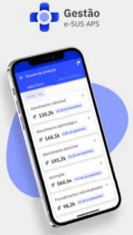

<head>
    
</head>

# Capítulo 1 - Introdução
{: .no_toc }

Neste capítulo, vamos expor de forma concisa os conceitos e as diretrizes para o uso do Aplicativo Gestão e-SUS APS. 

## Sumário
{: .no_toc .text-delta }

- TOC
{:toc}

A Secretaria de Atenção Primária à Saúde (SAPS) incorporou à Estratégia eSUS Atenção Primária à Saúde (e-SUS APS) este aplicativo móvel para o gerenciamento e monitoramento das atividades de saúde dos serviços de Atenção Primária à Saúde (APS) de forma oportuna. O propósito do aplicativo é oferecer acesso facilitado e ágil aos dados dos Relatórios de Produção do eSUS APS PEC.

Dessa forma, o aplicativo **Gestão e-SUS APS** está vinculado ao **Sistema e-SUS APS** com o Prontuário Eletrônico do Cidadão (PEC), ampliando a capacidade de administração das informações da APS. Nesse cenário, o terceiro aplicativo criado para a APS enfatizou as atividades de gestão realizadas por todos os
profissionais responsáveis pelos serviços de saúde nesse nível de atenção.

O aplicativo *Gestão e-SUS APS* foi concebido para ser utilizado em dispositivos móveis, como tablets e smartphones, levando em consideração fatores relacionados ao conforto, à segurança e à eficiência da ferramenta no contexto das atividades dos gestores dos serviços de saúde da APS. Na Seção 2.2, serão detalhadas as especificações dos dispositivos móveis que melhor se alinham
com as exigências da ferramenta.

Sua vivência no uso da ferramenta poderá enriquecer a interação entre o aplicativo Gestão e-SUS APS e o sistema e-SUS APS, promovendo uma integração crescente com sua prática profissional. O meio adequado para o registro de suas experiências e contribuições é a [Pesquisa de Opinião do e-SUS APS](http://sisaps.saude.gov.br/pesquisa/).

Caso ainda tenha alguma dificuldade em utilizar este aplicativo, consulte este Manual de instrução de instalação e uso. Permancendo a dificuldade entre em contato com os desenvolvedores por este [Suporte](http://esusaps.bridge.ufsc.br/support/login).

## 1.1 Versão do Aplicativo Usado neste Manual

Este manual foi elaborado usando como referência a a versão mais atual disponível do Aplicativo *Gestão e-SUS APS*, versão 1.7.2

A partir desta versão foi realizada a alteração da terminologia "Idoso" para "Pessoa idosa".

Esta versão tem como objetivo fornecer ferramentas para os gestores de saúde acompanharem os dados e serviços de saúde nos territórios, facilitando o controle e a tomada de decisões.

## 1.2 A Estratégia e-SUS Atenção Primária à Saúde

A SAPS assumiu o compromisso de reestruturar o Sistema de Informação da Atenção Básica (SIAB), com o objetivo de melhorar a qualidade da informação em saúde e de otimizar o uso dessas informações pelos gestores, profissionais de saúde e cidadãos. Essa reestruturação chamada de Estratégia e-SUS APS preconiza:

1.  O registro individualizado das informações em saúde, para o acompanhamento dos atendimentos aos cidadãos;

2.  A integração dos diversos sistemas de informação oficiais existentes na APS, reduzindo a necessidade de registrar informações similares em mais de um instrumento (fichas/sistemas) ao mesmo tempo;

3.  O desenvolvimento de soluções tecnológicas que contemplem os processos de trabalho da APS, com recomendações de boas práticas e o estímulo à informatização dos serviços de saúde;

4.  A introdução de novas tecnologias para otimizar o trabalho dos profissionais;

5.  A qualificação do uso da informação na gestão e no cuidado em saúde.

## 1.3 SISAB e Sistema e-SUS APS

Em substituição ao SIAB, foi criado o Sistema de Informação em Saúde para a Atenção Básica (SISAB).

O SISAB é alimentado pelos Sistemas da Estratégia e-SUS APS: Sistema com Coleta de Dados Simplificada (CDS), Sistema com Prontuário Eletrônico do Cidadão (PEC), aplicativos móveis para a captação dos dados coletados em ações fora da UBS, ou ainda por sistemas terceiros que utilizam o Sistema e-SUS APS para transmitir os dados para o SISAB.

Nessa perspectiva, o desenvolvimento dos Sistemas da Estratégia e-SUS APS passa a priorizar o atendimento realizado pelos profissionais de saúde, e não mais o preenchimento de informações gerenciais e administrativas, as quais serão geradas de forma secundária pelo sistema.

## 1.4 Gestão das Ações e Serviços de APS

Para que as ações nos serviços de saúde da APS possam avançar e realmente atingir os seus objetivos, é imprescindível uma liderança participativa e atuante, que se proponha a enfrentar os dilemas dos problemas encontrados no território e na organização dos serviços de saúde com a finalidade de propor mudanças nestes contextos. Além disso, é indispensável que haja instrumentos e ferramentas que auxiliem os gestores da APS no processo da tomada de decisão para que suas escolhas sejam baseadas em evidências. 

Pensando nisso, o DESF por meio da Estratégia e-SUS APS, está lançando o aplicativo ***Gestão e-SUS APS***, que pretende trazer informações, em tempo oportuno e na palma das suas mãos, sobre as ações dos serviços de saúde da APS sob sua gestão. 

Nesse primeiro momento, o aplicativo estará focado em trazer informações sobre a atividades das unidades de saúde e equipes da APS, tais como o Atendimento Individual, Atendimento Odontológico, Atendimento Domiciliar, Vacinação, Procedimentos em geral e Atividade Coletiva. O *Gestão e-SUS APS* permite a visualização dos dados no formato **ANALÍTICO** e **SÉRIE HISTÓRICA**. 

{: .atencao }
Os dados apresentados no ***Gestão e-SUS APS*** são oriundos da instalação local dos sistemas e-SUS APS com PEC do distrito federal ou município. Por tanto, não são dados provenientes do SISAB. 
