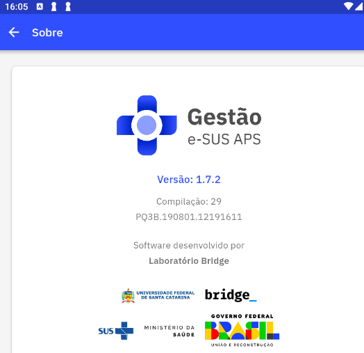

# Capítulo 1 - Introdução
{: .no_toc }

Neste capítulo, apresentaremos brevemente, os conceitos e as orientações para utilização do Aplicativo Gestão e-SUS APS.

## Sumário
{: .no_toc .text-delta }

- TOC
{:toc}

O Departamento de Saúde da Família (DESF) incluiu na Estratégia e-SUS Atenção Primária à Saúde (e-SUS APS) este aplicativo móvel para o gerenciamento e acompanhamnto dos serviços e ações em saúde em tempo oportuno na Atenção Primária à Saúde (APS). Este aplicativo é integrado ao Sistema e-SUS APS com Prontuário Eletrônico do Cidadão (PEC) ampliando a capacidade de troca de informações entre a equipe. Nesse contexto, o terceiro aplicativo desenvolvido para APS priorizou as ações de gerenciamento desenvolvidas por todos os profissionais responsáveis pelas equipes de APS.

O aplicativo Gestão e-SUS APS foi desenvolvido para utilização em dispositivos do tipo tablet e smartphones, levando em conta aspectos relacionados ao conforto, à segurança e à usabilidade da ferramenta dentro do processo de trabalho dos gerentes dos serviços de saúde da APS. Na Seção 2.2 serão oferecidas especificações do tablet e do smartphone que melhor se adequam à ferramenta.

Sua experiência de uso poderá contribuir para que o aplicativo Gestão e-SUS APS e os sistemas e-SUS APS dialoguem cada vez mais com a sua prática profissional. O canal para registro de sua experiência e sugestões é o [Pesquisa de Opinião do e-SUS APS](http://dabsistemas.saude.gov.br/sistemas/pesquisaesusab/).

Caso ainda tenha alguma dificuldade técnica ou em utilizar este aplicativo, consulte este Manual de instrução de instalação e uso. Permancendo a dificuldade entre em contato com os desenvolvedores por este [Suporte](http://esusaps.bridge.ufsc.br/support/login).

## 1.1 Versão do Aplicativo Usado neste Manual

Este manual foi elaborado usando como referência a **versão 1.0** do Aplicativo Gestão e-SUS APS. O acesso às informações sobre a versão do aplicativo podem ser visualizadas na seção **Sobre** (Figura 1.2), acessada no **Perfil** ao clicar sobre o simbolo  no menu do aplicativo, conforme a Figura 1.1 abaixo:

Figura 1.1 -- Perfil do Usuário

 

 Fonte: SAPS/MS  

Figura 1.2 -- Versão do Aplicativo Gestão e-SUS APS

Fonte: SAPS/MS.

## 1.2 A Estratégia e-SUS Atenção Primária à Saúde

O DESF assumiu o compromisso de reestruturar o Sistema de Informação da Atenção Básica (SIAB), com o objetivo de melhorar a qualidade da informação em saúde e de otimizar o uso dessas informações pelos gestores, profissionais de saúde e cidadãos. Essa reestruturação chamada de Estratégia e-SUS APS preconiza:

1.  o registro individualizado das informações em saúde, para o acompanhamento dos atendimentos aos cidadãos;

2.  a integração dos diversos sistemas de informação oficiais existentes na APS, reduzindo a necessidade de registrar informações similares em mais de um instrumento (fichas/sistemas) ao mesmo tempo;

3.  o desenvolvimento de soluções tecnológicas que contemplem os processos de trabalho da APS, com recomendações de boas práticas e o estímulo à informatização dos serviços de saúde;

4.  a introdução de novas tecnologias para otimizar o trabalho dos profissionais;

5.  a qualificação do uso da informação na gestão e no cuidado em saúde.

## 1.3 SISAB e Sistema e-SUS APS

Em substituição ao SIAB, foi criado o Sistema de Informação em Saúde para a Atenção Básica (SISAB). Este sistema é alimentado pelo Sistema e-SUS APS: Sistema com Coleta de Dados Simplificada (CDS), Sistema com Prontuário Eletrônico do Cidadão (PEC), aplicativos móveis para a captação dos dados coletados em ações fora da UBS, ou ainda por sistemas terceiros que utilizam o Sistema e-SUS APS para transmitir os dados para o SISAB.

Nessa perspectiva, o desenvolvimento do Sistema e-SUS APS passa a priorizar o atendimento realizado pelos profissionais de saúde, e não mais o preenchimento de informações gerenciais e administrativas, as quais devem ser geradas de forma secundária pelo sistema.

## 1.4 Gestão das Ações e Serviços de APS

Para que as ações e serviços de saúde na APS possam avançar e realmente atingir os seus objetivos, é imprescindível uma liderança participativa e atuante, que se proponha a enfrentar os dilemas dos problemas encontrados no território e na organização dos serviços de saúde com a finalidade de propor mudanças nestes contextos. Além disso, é indispensável que haja instrumentos e ferramentas que auxiliem os gestores da APS no processo da tomada de decisão para que suas escolhas sejam baseadas em evidências. 

Pensando nisso, o DESF por meio da estratégia e-SUS APS está lançando o aplicativo ***Gestão e-SUS APS***, que tem como objetivo, levar as informações das ações e serviços de saúde das unidades de APS sob sua gestão, em tempo oportuno e na palma das mãos. 

Nesse primeiro momento, o aplicativo estará focado em trazer informações sobre a atividades das equipes de APS, tais como o Atendimento Individual, Atendimento Odontológico, Vacinação, Procedimentos em geral e Atividades Coletivas. O aplicativo permite a visualização dos dados no formato **analítico** e **série histórica**. 
