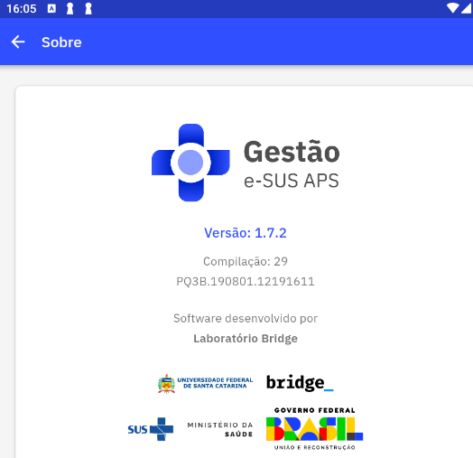

# Capítulo 2 - Instalação
{: .no_toc }

Neste capítulo abordaremos algumas questões sobre a instalação e as etapas necessárias para o acesso ao aplicativo.

## Sumário
{: .no_toc .text-delta }

- TOC
{:toc}

## 2.1 Instalação

A instalação do Aplicativo **Gestão e-SUS APS** se dá pelo fluxo padrão de instalação de aplicativos para dispositivos Android e iOS. 

{: .atualizacao }
O aplicativo **Gestão e-SUS APS** também está disponível para iOS na Play Store. 

* Na Google Play acesse a instalação do aplicativo [aqui](https://play.google.com/store/apps/details?id=br.gov.saude)

* Na Play Store acesse a instalação do aplicativo [aqui](https://play.google.com/store/apps/details?id=br.gov.saude.)

## 2.2 Requisitos Mínimos

Para um bom funcionamento do aplicativo, fique atento aos requisitos mínimos do dispositivo:

-   Sistema Operacional Android versão 4.4 ou superior

-   Sistema Operacional iOS versão 12 ou superior

-   Processador, mínimo de 1,3 GHz Quad core e 2 Mb L2 cache;

-   Memória RAM, mínimo de 1 GB (um gigabyte)

-   Tela com tamanho mínimo de 07 (sete) polegadas, porém recomenda-se telas de 9 ou 10 polegadas.

-   Armazenamento, mínimo de 16 GB

-   Conexão a internet

{: .nota } 
Consulte a especificação completa no [site do e-SUS APS](http://189.28.128.100/dab/docs/portaldab/documentos/especificacoes_tablet_esus.pdf).

## 2.3 Autenticação do Usuário

Por meio da tela de autenticação do aplicativo o gestor deve se conectar a um servidor do sistema e-SUS APS com Prontuário Eletrônico do Cidadão (PEC) na qual serão obtidos os dados apresentados durante o uso da aplicação.

Figura 2.3.1 - Tela de Autenticação do aplicativo Gestão e-SUS APS

Fonte: SAPS/MS

A tela de autenticação apresenta três campos de preenchimento obrigatório. Nesta tela o gestor deverá informar:

- **URL do servidor**: informe o endereço do servidor onde está instalado o sistema e-SUS APS com PEC na qual se quer ver os dados e o gestor esteja cadastrado;

- **Usuário**: insira o número de CPF do gestor que irá acessar o aplicativo **Gestão e-SUS APS**; 

- **Senha**: insira a senha do usuário (a mesma senha cadastrada no servidor da instalação do sistema e-SUS APS com PEC informada na URL do servidor).

Após informar esses dados, basta clicar em "Conectar". Em seguida aparecerá a tela de escolha de lotação, caso o gestor possua mais de uma lotação, aparecerão os cards com as lotações em que o gestor está vinculado na instalação informada na tela de autenticação. 

Figura 2.3.2 - Tela de escolha de lotação

Fonte: SAPS/MS

{: .nota }
O gestor que fará uso do aplicativo ***Gestão e-SUS APS*** deve estar cadastrado no servidor do sistema e-SUS APS com PEC informado na autenticação. 

{: .atencao }
Somente os profissionais com lotação ativa no servidor informado e com perfil de Gestor Municipal ou de Coordenador de UBS conseguirão acessar o aplicativo. 

Para mais informações sobre cadastro dos profissionais acesse o [Capitulo 3 - Administração e Configurações do Sistema](https://cgiap-saps.github.io/Manual-eSUS-APS/docs/PEC/PEC_03_adm_conf/) do Manual do PEC.

## 2.4 Perfil

Esta funcionalidade permite ao usuário do aplicativo gerenciar o seu perfil na lotação, caso possua mais de um perfil de gerente/coordenador cadastrado na instalação do PEC informado no login de acesso. 

Para escolher o perfil da lotação com os relatórios que deseja visualizar basta clicar nas setas  no card: 

Figura 2.4.1 - Tela Perfil do usuário do aplicativo

Fonte: SAPS/MS

{: .nota }
Na tela do perfil, se precisar de suporte para uso do aplicativo, o usuário pode acessar o card "Obter ajuda" e será direcionado para o canal de suporte oficial do e-SUS APS. 

{: .atencao }
Para acessar a funcionalidade "Obter ajuda" o dispositivo deverá ter acesso a internet. 

Na tela do perfil ainda é possível acessar a ferramenta "**Sobre**"  para acessar às informações da versão do aplicativo

Figura 2.4.2 - Tela Sobre a versão do aplicativo

Fonte: SAPS/MS