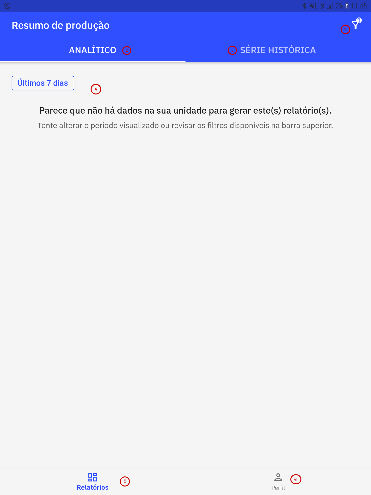
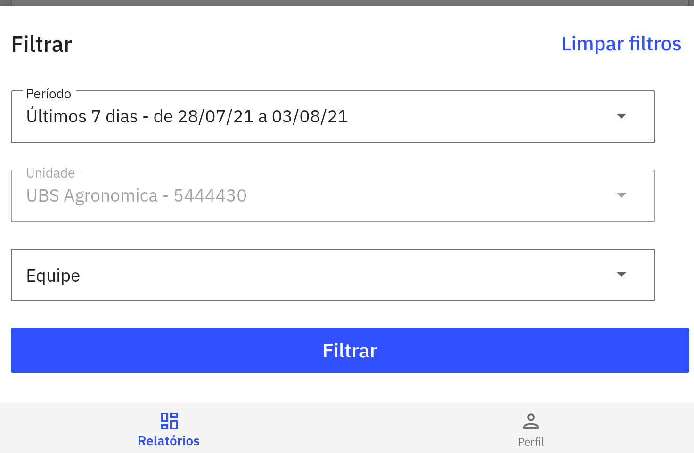
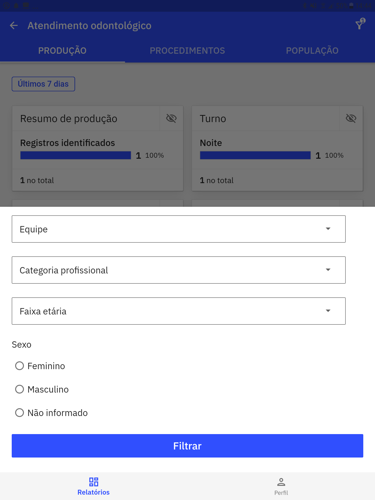
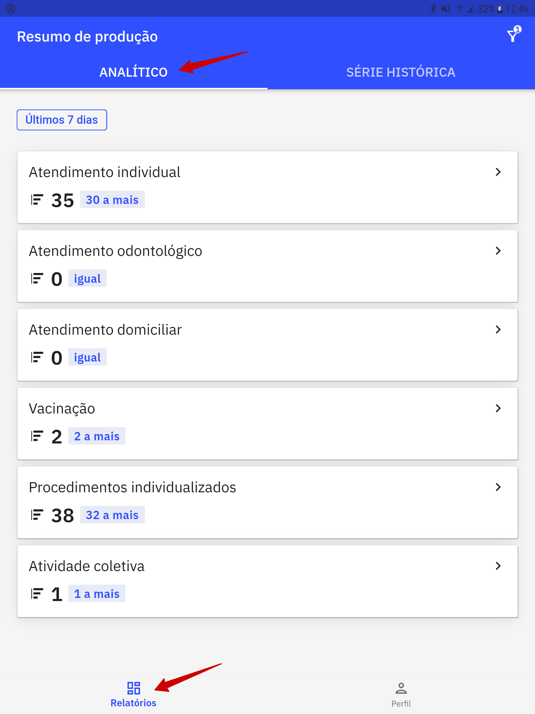
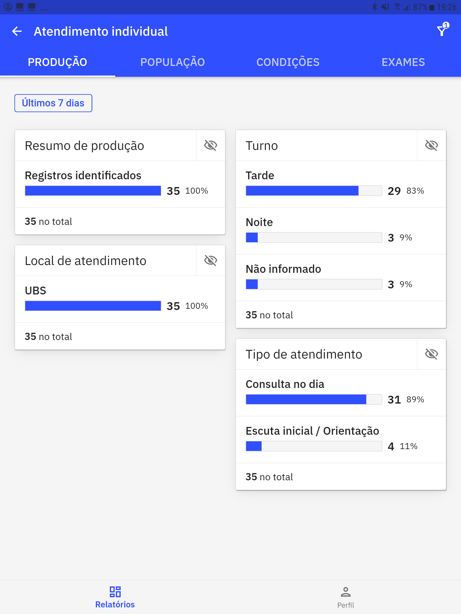
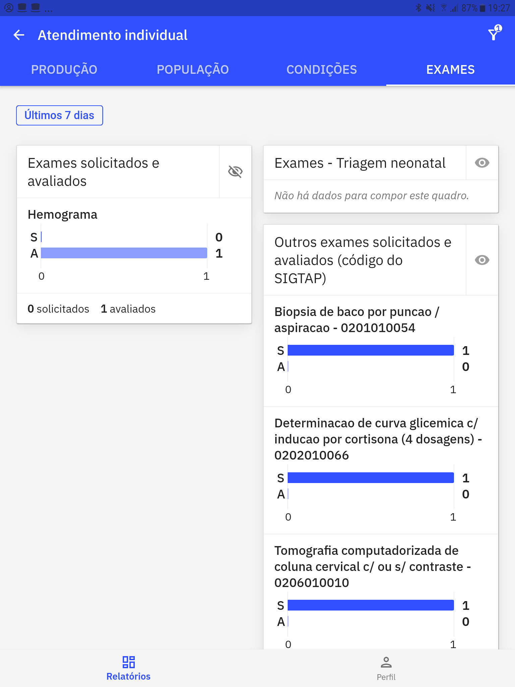
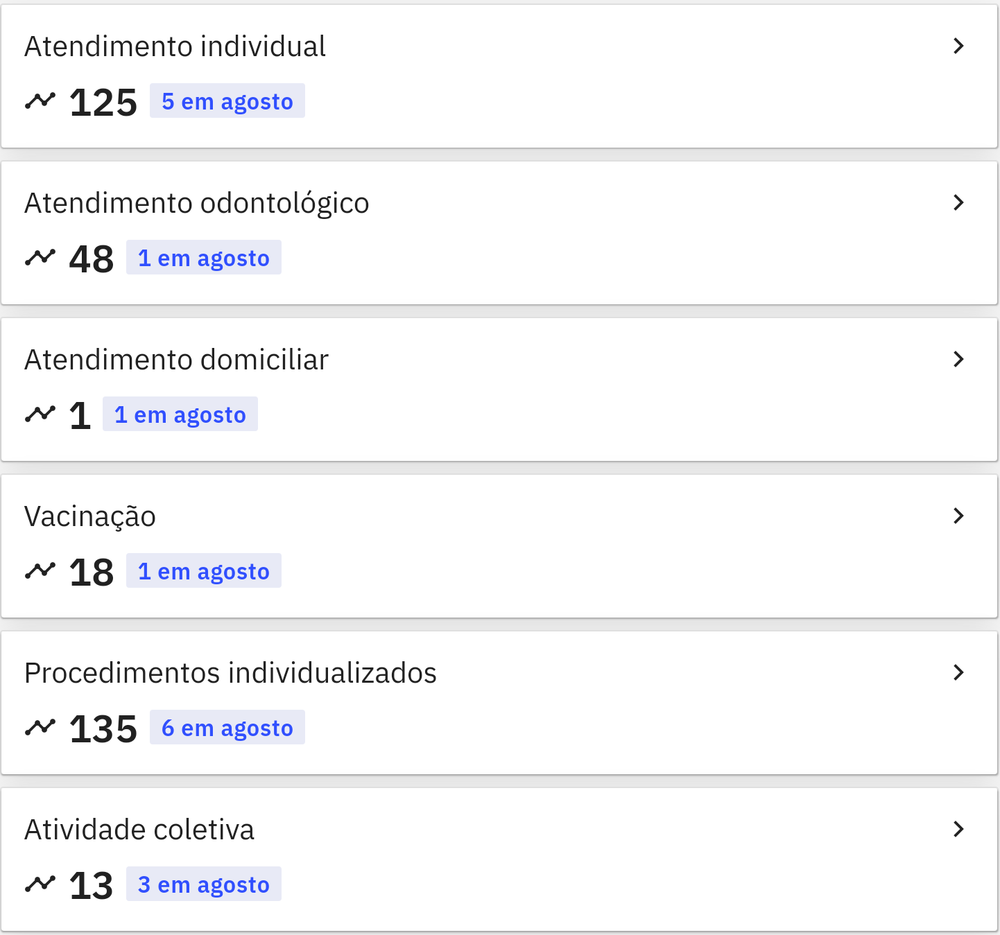
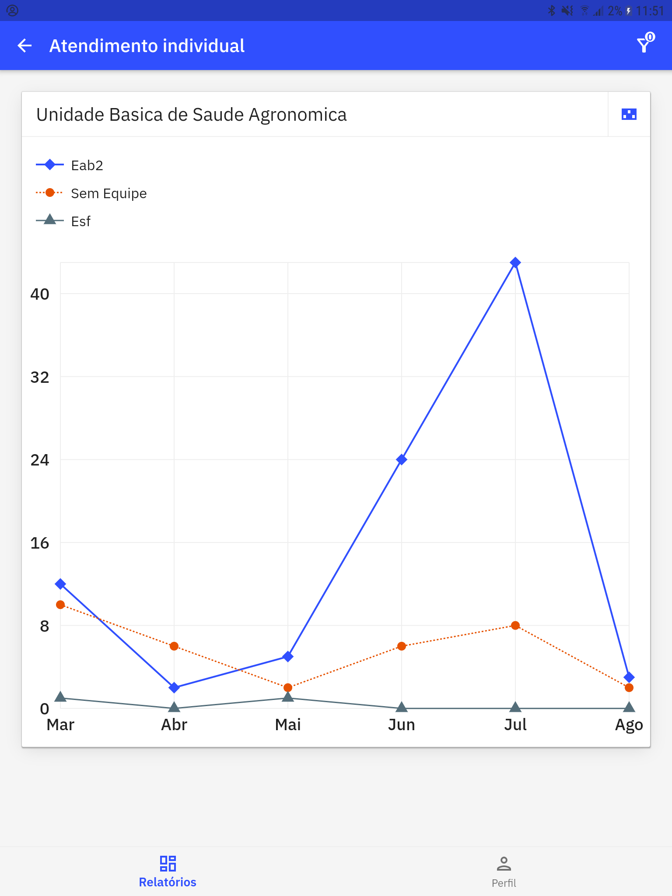

# Capítulo 3 - Relatórios
{: .no_toc }

Neste capítulo será demonstrado como gerar os relatórios de produção da Atenção Primária à Saúde (APS) no aplicativo **Gestão e-SUS APS** no formato analítico ou de série histórica. 

## Sumário
{: .no_toc .text-delta }

- TOC
{:toc}

## 3.1 Resumo de Produção

Após a tela de escolha de acesso [Figura 2.3.2]() é apresentada a tela principal com os recursos "**(1) Filtro**", "**(2) Analítico**", "**(3) Série histórica**", "**(4) ambiente onde os dados serão apresentados os cards de relatórios**, "**(5) Relatórios**" e "**(6) Perfil**".

Figura 3.1.1 - Tela de Resumo de Produção com os principais recursos

Fonte: SAPS/MS

{: .nota  }
Por padrão a tela inicial apresenta a aba dos relatórios analíticos com dados referentes aos últimos 7 dias. 

### 3.1.1 Gerar Relatório

O aplicativo gera relatórios tanto analíticos quanto de séries históricas referentes ao Atendimento individual, Atendimento odontológico, Atendimento domiciliar, Vacinação, Procedimentos individualizados e Atividade coletiva produzidos nos serviços de atenção primária. 

{: .atencao  }
Todos os dados dos relatóros citados acima são apresentados no aplicativo provenientes do sistema e-SUS APS com PEC configurado na URL do login inicial.

A funcionalidade "filtrar"  aplica filtros aos relatórios exibidos, compatíveis com os mesmos filtros utilizados nos relatórios do sistema e-SUS APS com PEC.

Esta funcionalidade apresenta filtros de **Período**, **Unidade**, **Equipe**, **Categoria profissional**, **Sexo** e **Faixa etária**.  

* **Período**: Consiste em períodos pré-definidos - *Últimos 7 dias*; *Semana Passada*; *Últimos 30 dias* ou *Última competência*. 
* **Unidade**: Seleciona a Unidade de Saúde que queira visualizar o relatório.
* **Equipe**: Seleciona as equipes pertencentes à Unidade de Saúde escolhida.
* **Categoria profissional**: Seleciona a categoria profissional que atua na Unidade/Equipe escolhida.
* **Sexo**: Consiste em sexo biológico - *Feminino*; *Masculino* e *Não informado*. 
* **Faixa etária**: Consiste em faixa etária pré estabelecida - **Criança**: *0 a 09 anos*; **Adolescente**: *10 a 189 anos*; **Adulto**: *20 a 59 anos* e **Idoso**: *60 anos ou mais*.

{: .nota  }
Os filtros para escolha de Unidade ou Equipe variam de acordo com o perfil de acesso do usuário do aplicativo

{: .nota  }
Na tela inicial somente os filtros **Período**, **Unidade** e **Equipe** são visualizados. Para aplicar os demais filtros clique em um dos cards de relatórios para selecionar os filtros **Categoria profissional**, **Sexo** e **Faixa etária**.

Após escolhida as varíaveis clique em "Filtrar". Caso queira refazer a busca, clique em "**Limpar filtros**". 

Figura 3.1.1.1 - Tela inicial com a funcionalidade Filtrar.

Fonte: SAPS/MS

Figura 3.1.1.2 - Tela Produção com os filtros Categoria Profissional, Sexo e Faixa etária

Fonte: SAPS/MS

{: .nota  }
Para verificar os relatórios gerados a partir dos campos selecionados no "filtro", o recurso "Relatórios" no rodapé da tela de resumo de produção deve estar selecionado. A partir disso, basta selecionar a aba "Analítico" para os relatórios analíticos ou selecione a aba "Série histórica" para os relatórios de série histórica.

## 3.2 Relatório Analítico

Figura 3.2.1 - Tela Resumo de produção (Relatório Analítico)

Fonte: SAPS/MS

Na aba **ANALÍTICO** aparecerão os cards com os relatórios de produção do Atendimento Individual, Atendimento Odontológico, Atendimento domiciliar, Vacinação, Procedimentos individualizados e Atividade Coletiva, conforme a figura acima.

{: .nota  }
O card de relatórios apresentará o total absoluto das ações de saúde para o período selecionado no filtro e uma tag  de comparação do valor absoluto com o do período imediateamente anterior.

Figura 3.2.2 - Card de Relatório de Atendimento Individual

Fonte: SAPS/MS

Ao clicar em um dos cards de Relatórios serão apresentados mais dados:

Figura 3.2.3 - Tela Relatório de Atendimento individual (Produção)

Fonte: SAPS/MS

{: .nota  }
Ao clicar no símbolo  o card expandirá apresentando demais informações, clicando no símbolo  o card apresentará somente as informações que possuam dados a serem apresentados

Figura 3.2.4 - Tela sobre a População do Relatório de Atendimento Individual

Fonte: SAPS/MS

Figura 3.2.5 - Tela sobre Condições do Relatório de Atendimento Individual

Fonte: SAPS/MS

Figura 3.2.6 - Tela sobre Exames do Relatório de Atendimento Individual

Fonte: SAPS/MS

### 3.2.1 - Detalhamento do Relatório Analítico: Atendimento Individual

Ao acessar o card de relatório do atendimento individual o gestor observará (4) quatro blocos com seus respectivos dados:

I) **PRODUÇÃO**
            
            - *Resumo de produção* (Registros identificados e Registros não identificados)
            - *Local de Atendimento* (UBS, Domicílio, Escola/Creche, Instituição/Abrigo, Polo/Academia da saúde, Rua, Unidade móvel, Unidade prisional/congênere, Unidade sócioeducativa e Outros)
            - *Turno* (Manhã, Tarde, Noite e Não informado)
            - *Tipo de Atendimento* (Consulta no dia, Escuta inicial, Atendimento de urgência, Consulta agendada, Cuidado continuado e Não informado).

II) **POPULAÇÃO**

            - *Sexo* (Masculino, Feminino e Não informado)
            - *Faixa etária* (Criança de 0 a 09 anos, Adolescente de 10 a 19 anos, Adultos de 20 a 59 anos e Idoso de 60 anos ou mais)

III) **CONDIÇÕES**

            - *Problemas/Condições avaliadas* (Asma, Desnutrição, Diabetes, DPOC, Hipertensão Arterial, Obesidade, Pré-Natal, Puericultura, Puerpério, Reabilitação, Saúde Mental, Saúde Sexual/Reprodutiva, Tabagismo, Usuário de outras drogas e Usuário de álcool)
            - *Problmeas/Condições avalidas - Outros CID10*
            - *Problemas/Condições avalidas - Outros CIAP2*
            - *Problemas/Condições avaliadas - Doenças Transmissíveis

IV) **EXAMES**

            - *Exames solicitados e avaliados*
            - *Exames - Triagem neonatal*
            - *Outros exames solicitados e avaliados (código do SIGTAP) 

### 3.2.2 - Detalhamento do Relatório Analítico: Atendimento Odontológico

Ao acessar o card de relatório do atendimento odontológico o gestor observará (3) três blocos com seus respectivos dados:

I) **PRODUÇÃO** 

            - Os mesmos itens apresentados no relatório de Atendimento Individual

II) **PROCEDIMENTOS**
            - *Procedimentos* (Aplicação de cariostático - por dente, Aplicação de selante - por dente, Selamento provisório de cavidade dentária, Acesso à polpa dentária e medicação - por dente, Adaptação de prótese dentária, Aplicação tópica de flúor - individual por sessão, Capeamento pulpar, Cimentação de prótese dentária, Curativo de demora com ou sem preparo biomecânico, Drenagem de abscesso, Evidenciação de placa bacteriana, Exodontia de dente decíduo, Exodontia de dente permanente, Instalação de prótese dentária, Moldagem dentogengival para construção de prótese dentária, Orientação de higiene bucal, Profilaxia/Remoção de placa bacteriana, Pulpotomia dentária, Raspagem alisamento e polimento supragengivais - por sextante, Raspagem alisamento subgengivais - por sextante, Restauração de dente permanente anterior, Retirada de pontos de cirurgias básicas - por paciente, tratamento de alveolite e Ulotomia/Ulectomia)
            - *Outros procedimentos (SIGTAP)
        
III) **POPULAÇÃO**

            - Os mesmos itens apresentadaos no relatório de Atendimento Individual

### 3.2.3 - Detalhamento do Relatório Analítico: Atendimento Domiciliar

Ao acessar o card de relatório do atendimento domiciliar o gestor observará (2) dois blocos com seus respectivos dados:

I) **PRODUÇÃO**

            - Os mesmos itens apresentados no relatório de Atendimento Individual.
            - No *Local de atendimento* está incluída, além das que já são apresentadas nos demais relatórios, as variáveis CACON/UNACON, Hospital e Unidade de Pronto Atendimento.
            - *Tipo de Atendimento* (Atendimento programado, atendimento não programado e visita domiciliar pós-óbito)

II) **POPULAÇÃO** 

            - Os mesmos itens apresentados no relatório de Atendimento Individual

{: .nota  }
O relatório de atendimento domiciliar é referente aos atendimentos prestados pelas equipes de Atenção Domiciliar e não pelas equipes de atenção primária. 

### 3.2.4 - Detalhamento do Relatório Analítico: Vacinação

Ao acessar o card de relatório de vacinação o gestor observará (2) dois blocos com seus respectivos dados:

I) **PRODUÇÃO**

            - Os mesmos itens apresentados no relatório de Atendimento Individual

II) **POPULAÇÃO**

            - Os mesmos itens apresentados no relatório de Atendimento Individual

### 3.2.5 - Detalhamento do Relatório Analítico: Procedimentos Individualizados

Ao acessar o card de relatório dos procedimentos individualizados o gestor observará (3) três blocos com seus respectivos dados:

I) **PRODUÇÃO**

            - Os mesmos itens apresentados no relatório de Atendimento Individual

II) **PROCEDIMENTOS**

            - *Outros procedimentos* (SIGTAP)
            - *Procedimentos/Pequenas cirurgias* (Administração de Vitamina A, Acupuntura com inserção de agulhas, Cateterismo vesical de alívio, Cauterização química de pequenas lesões, Cirurgia de unha/cantoplastia, Coleta de citopatológico de colo uterino, cuidado de estomas, Curativo especial, Drenagem de abscesso, Eletrocardiograma, Exame de fundo de olho/Fundoscopia, Exame do pé diabético, Exérese/Biopsia/Punção de tumores superficiais de pele, Infiltração em cavidade sinovial, Remoção de corpo estranho da cavidade auditiva e nasal, Remoção de corpo estranho da cavidade auditiva e nasal, Remoção de corpo estranho subcutâneo, Retirada de cerume, Retirada de pontos de cirurgias básicas - por paciente, Sutura simples, Tamponamento de epistaxe, Teste do olhinho (TRV) e Triagem oftalmológica)
            - *Procedimentos - Teste rápido* (Gravidez, Dosagem de proteína, para HIV, hepatite C e sífilis)
            - *Procedimentos - Administração de medicamentos* (Via: Oral, Intramuscular, Endovenosa, Inalação/Nebulização, Tópica, Subcutânea, além de informação de Penicilina para tratamento de sífilis)

III) **POPULAÇÃO**

            - Os mesmos itens no relatório de Atendimento Individual

### 3.2.5 - Detalhamento do Relatório Analítico: Atividade Coletiva

Ao acessar o card de relatório das atividades coletivas o gestor observará (3) três blocos com seus respectivos dados:

I) **PRODUÇÃO**

            - *Resumo de produção* (Total de registros)

II) **POPULAÇÃO**

            - *Público-alvo* (Criança 0 a 3 anos, Criança 4 a 5 anos, Criança 6 a 11 anos, Adolescente, Mulher, Gestante, Homem, Idoso, Familiares, Comunidade em geral, Pessoas com doenças crônicas, Usuário de tabaco, Usuário de álcool, Usuário de outras drogas, Pessoas com sofrimento ou transtorno mental, Profissional de educação, Outros e Não informado)

III) **DETALHAMENTO**

            - *Programa Saúde na Escola* (Educação e Saúde)
            - *Temas para saúde* (Autocuidado de pessoas com doenças crônicas, Envelhecimento - climatério, andropausa, etc, Ações de combate ao Aedes aegypti, Agravos negligenciados, Alimentação saudável, Cidadania e direitos humanos, Dependência química - tabaco, álcool e outras drogas, Plantas medicinais/Fitoterapia, Prevenção da violência e promoção da cultura da paz, Saúde ambiental, Saúde bucal, Saúde do trabalhador, Saúde mental, Saúde sexual e reprodutiva, Semana saúde na escola, Outros e Não informado)
            - *Atividade* (Reunião de equipe, Atendimento em grupo, Avaliação/Procedimento coletivo, Reunião com outras equipes de saúde, Reunião intersetorial/Conselho local de saúde/Controle social, Educação em saúde, Mobilização social e Não informado)
            - *Temas para reunião* (Questões administrativas/Funcionamento, Processo de trabalho, Diagnóstico do território/Monitoramento das ações da equipe, Discussão de caso/Projeto terapêutico singular, Educação Permanente e Outros)

{: .nota  }
Para maiores informações sobre as variávies constantes nos relatórios analíticos leia o [Manual de Uso do Sistema de Coleta de Dados Simplificada](https://cgiap-saps.github.io/Manual-eSUS-APS/docs/CDS)

## 3.3 Relatório Série Histórica

Por meio da Tela inicial é possível acessar a aba "*Série Histórica*", na qual serão apresentados os dados quantitativos dos últimos 6 meses referente aos relatórios que queira visualizar. Da mesma forma que o relatório analítico, o da série histórica é composto pelos relatórios de Atendimento individual, Atendimento Odontológico, Atendimento domiciliar, Vacinação, Procedimentos individualizados e Atividade Coletiva.

Figura 3.3.1 - Tela Resumo de Produção (Série Histórica)

Fonte: SAPS/MS

Na série histórica o perído no filtro  já vem por padrão os últimos 6 meses, os demais campos variam de acordo com o perfil de acesso do usuário. Dessa forma, para o coordenador de UBS apenas o campo "equipe" é selecionável, já para o gestor municipal é possível selecionar o campo "unidade".  

Figura 3.3.2 - Tela Filtrar (Perfil coordenador de UBS)

Fonte: SAPS/MS

### 3.3.1 Detalhamento do Relatório da Série Histórica

Na tela inicial todos os cards apresentam o total absoluto da produção para cada tipo de relatório de acordo com o período. 

Figura 3.3.1.1 - Cards com os relatórios 

Fonte: SAPS/MS

{: .nota  }
A tag  no card de Atendimento individual, por exemplo, significa a quantidade de atendimentos feitos no último mês do período em análise. 

Ao clicar no card de relatório de sua escolha aparecerá o gráfico de linha, na qual exibe informações ordenadas pela quantidade de produção de acordo com o período cronológico de tempo, mostrando a evolução da produção por unidade básica de saúde e/ou equipes a depender do perfil de acesso do usuário. 

Figura 3.3.1.2 - Gráfico Atendimento individual (Série Histórica)

Fonte SAPS/MS

Ainda para visualizar os dados no formato de tabela clique na imagem  para voltar a visualizar no formato de gráfico de linha clique na imagem .

Figura 3.3.2 - Tabela do relatório série histórica

Fonte: SAPS/MS