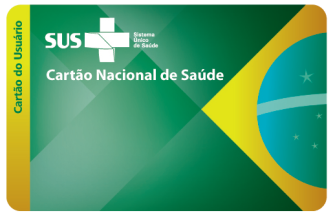
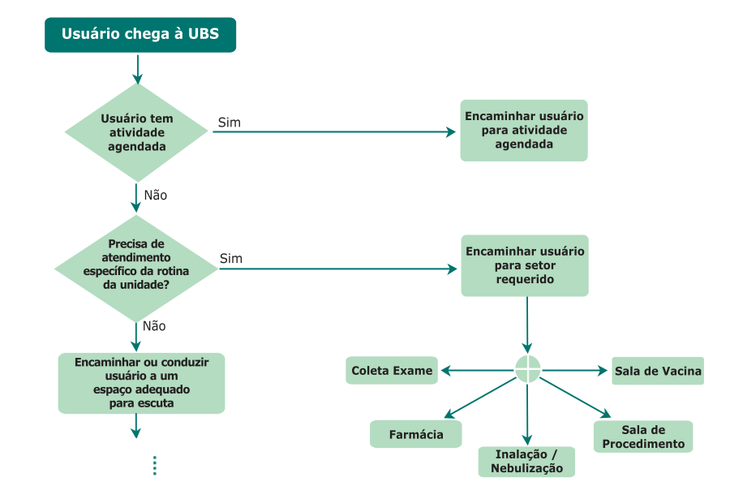
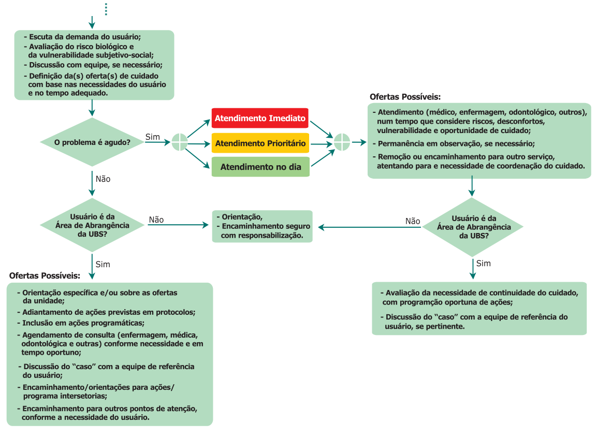
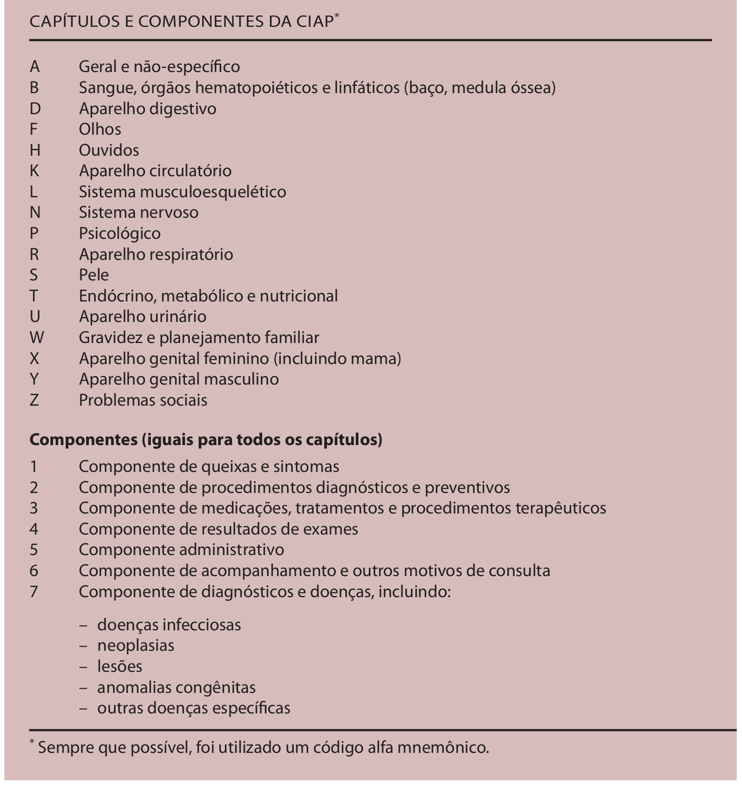

# CAPÍTULO INTRODUTÓRIO - Base Conceitual do Sistema
{: .no_toc }

Neste capítulo, abordaremos, de forma resumida, os conceitos básicos que orientam o Sistema e-SUS Atenção Primária à Saúde (e-SUS APS) e o funcionamento das ferramentas do sistema.

## Sumário
{: .no_toc .text-delta }

- TOC
{:toc}

# 1. Estratégia e-SUS Atenção Primária à Saúde (APS)

O e-SUS APS é uma estratégia do Departamento de Saúde da Família (DESF) para reestruturar as informações da Atenção Primária à Saúde (APS) em nível nacional. Esta ação está alinhada com a proposta mais geral de reestruturação dos Sistemas de Informação em Saúde (SIS) do Ministério da Saúde (MS), entendendo que a qualificação da gestão da informação é fundamental para ampliar a qualidade no atendimento à população.

A Estratégia e-SUS APS faz referência ao processo de informatização qualificada do Sistema Único de Saúde (SUS) em busca de um SUS eletrônico (e-SUS) e tem como objetivo concretizar um novo modelo de gestão de informação que apoie os municípios e os serviços de saúde na gestão efetiva da APS e na qualificação do cuidado dos usuários.

Esse modelo nacional de gestão da informação na APS é definido a partir de diretrizes e requisitos essenciais que orientam e organizam o processo de reestruturação desse SIS, instituindo-se o Sistema de Informação em Saúde para a Atenção Básica (SISAB), por meio da Portaria GM/MS Nº 1.412, de 10 de julho de 2013, e a Estratégia e-SUS APS para sua operacionalização. A Estratégia e-SUS APS preconiza:

- **Identificar e Individualizar o registro**: registro individualizado das informações em saúde e identificado, por meio do Cadastro de Pessoas Físicas (CPF) ou Cartão Nacional de Saúde (CNS), para o acompanhamento dos atendimentos aos cidadãos;

- **Integrar a informação por meio da Rede Nacional de Dados em Saúde (RNDS)**: integrar a RNDS enviando dados em saúde, a partir de modelos de informações padronizados;

- **Reduzir o retrabalho na coleta de dados**: reduzir a necessidade de registrar informações similares em mais de um instrumento (fichas/sistemas) ao mesmo tempo;

- **Informatizar as unidades**: desenvolvimento de soluções tecnológicas que contemplem os processos de trabalho da APS, com recomendações de boas práticas e o estímulo à informatização dos serviços de saúde por meio do **Programa Informatiza APS**;

- **Qualificar os dados em saúde**: promover a qualificação da entrada dos dados em saúde por meio da padronização das terminologias e adoção de metodologias de registro clínico. 

- **Gestão do cuidado**: introdução de novas tecnologias para otimizar o trabalho dos profissionais na perspectiva de realizar a gestão do cuidado;

- **Coordenação do cuidado**: otimizar o uso da informação na gestão e no cuidado em saúde na perspectiva de integração dos serviços de saúde.

A estratégia é composta por dois grandes SIS, um para o armazenamento dos dados e outro para a coleta de dados, sendo respectivamente:

- **SISAB**, sistema de informação nacional vigente para o processamento e a disseminação de dados e informações relacionadas a APS, com a finalidade de construção do conhecimento e tomada de decisão para as três esferas de gestão. Além disso, corrobora para fins de financiamento e de adesão aos programas e estratégias da Política Nacional de Atenção Básica (PNAB), e

- **Sistema e-SUS APS**, composto por dois softwares e dois aplicativos para coleta dos dados:

- Sistema com Coleta de Dados Simplificada (**CDS**), sistema de transição/contingência, que apoia o processo de coleta de dados por meio de fichas e um sistema de digitação;

- Sistema com Prontuário Eletrônico do Cidadão (**PEC**), sistema com prontuário eletrônico (objeto deste manual), que tem como principal objetivo apoiar o processo de informatização das UBS.

- Aplicativo e-SUS Território (**e-SUS Território**) e e-SUS Atividade Coletiva (**e-SUS AC**), aplicativos móveis e offline que auxiliam os profissionais na coleta de dados no território e na coleta de dados das atividades coletivas realizadas pela equipe fora da unidade básica de saúde, respectivamente.  

{: .nota }
Para conhecer mais sobre os aplicativos consulte os Manuais destas aplicações.
Para conhecer os conceitos e orientações de preenchimento das fichas, consulte o Manual do Sistema com Coleta de Dados Simplificada. Entretanto, sobre o sistema de digitação no CDS acesse o Capítulo 07 deste manual.

Durante a leitura deste manual, os softwares do Sistema e-SUS APS também são referidos como Sistema com CDS e Sistema com PEC, respectivamente, ou ainda, simplesmente, CDS e PEC.

{: .nota }
Para mais informações sobre legislação, documentos e materiais de apoio sobre a Estratégia e-SUS APS, acesse a [**página do e-SUS APS**](https://sisaps.saude.gov.br/esus/).

# 2. Política de Controle de Versão do Sistema e-SUS APS

O desenvolvimento do Sistema e-SUS APS, considerando todos os *softwares* e *aplicativos*, está organizado em versões. A Política de Controle de Versões do Sistema e-SUS APS, conforme ilustra a Figura 1, utiliza um esquema clássico de versionamento de sistemas (*major.minor.revision*). Assim, alinhando-se ao tipo de implementação incluída no sistema, considerando três tipos de alterações a seguir:

a. o **primeiro dígito** para indicar novas funcionalidades (N);
b. o **segundo dígito** para indicar manutenção evolutiva (E); e
c. o **último dígito** para indicar apenas manutenção corretiva do sistema (C).

Figura 1 - Política de Controle de Versões do Sistema e-SUS APS

Fonte: SAPS/MS.

Essas regras de versionamento permitem que os administradores do sistema e-SUS APS nos municípios entendam melhor qual é o tipo de impacto que a substituição de uma versão poderá trazer aos seus usuários. O que se espera é que, ao passo de estar ciente do lançamento de uma versão, o gestor, em conjunto com o administrador do sistema, proceda da seguinte forma em relação à atualização do sistema em uso no município:

- **Novas Funcionalidades** (N): avaliar as novas funcionalidades, substituir a versão antiga do sistema e treinar os profissionais que estão utilizando o sistema, em especial os que podem fazer uso das novas funcionalidades;

- **Manutenção Evolutiva** (E): avaliar as alterações, substituir a versão antiga do sistema e alertar os profissionais das melhorias no sistema. Se perceber a necessidade treinar os usuários novamente;

- **Manutenções Corretivas** (C): proceder com a atualização **urgentemente**, a fim de manter o sistema *seguro* e com *correções de pequenas falhas de desenvolvimento* do sistema ou de alguma biblioteca;

Considerando esta política de controle de versão, para identificar uma versão do Sistema e-SUS APS é possível fazê-lo usando apenas o primeiro e o segundo dígito, por exemplo, Sistema e-SUS APS versão 4.2. O último dígito pode ser omitido, pois não identifica nenhuma funcionalidade ou manutenção evolutiva. O terceiro dígito é útil quando for necessário identificar alguma versão específica e para identificar uma versão do sistema em uma solicitação de [suporte técnico](http://esusaps.bridge.ufsc.br/support/login).

# 3. Cadastro na Atenção Primária à Saúde

## 3.1 Individualização e Identificação dos Registros

O PEC e o CDS do e-SUS APS são utilizados de forma complementares nos cenários possíveis de informatização das Unidades Básicas de Saúde (UBS) dos municípios e do distrito federal. Ambas as ferramentas possibilitam a identificação dos registros de atendimentos ao cidadão por meio do CNS ou CPF, promovendo efetiva coordenação e gestão do cuidado, além da possibilidade de compartilhamento de informações com outros sistemas de saúde em diferentes níveis da Rede de Atenção à Saúde (RAS).

Considerando o princípio doutrinário da universalidade no SUS, se o cidadão não tiver um CNS ou CPF, ele **DEVE** ser atendido e poderá ser utilizado o registro no CDS ou PEC. Entretanto, este registro do atendimento vira um *dado individualizado e não identificado*. Dessa maneira, o dado apenas comporá o consolidado de ações desenvolvidas pela equipe.

## 3.2 Utilizando o Cadastro do Cidadão

O e-SUS APS apresenta aos profissionais das equipes de Atenção Primária um grande módulo de cadastro de cidadãos, o qual se subdivide em dois módulos distintos: **Cadastro do Cidadão** e **Cadastro do Território**. O primeiro é realizado por meio do PEC nas UBS e o seu principal objetivo é realizar o cadastramento dos usuários do serviço, mesmo que não façam parte do seu território. Trata-se de um cadastro **simplificado**, apenas com informações individuais, com possibilidade de interoperabilidade com a base nacional do CNS. Já o segundo é realizado por meio do CDS, **a partir das fichas de Cadastro Individual e de Cadastro Domiciliar e Territorial**, utilizados principalmente pelo Agente Comunitário de Saúde (ACS) para cadastrar os residentes da microárea sob responsabilidade deste profissional. Este cadastro é mais completo e contém levantamentos importantes para a análise de saúde do território de abrangência da equipe de saúde. Abordaremos o CDS com mais profundidade no Capítulo 7.

{: .nota }
A consulta na base nacional do CNS dependerá de conectividade de internet disponível na UBS.

Apesar de se tratar de duas formas de cadastrar, os dados de ambas estão disponíveis para que a equipe de saúde possa obter informações de seus usuários da forma mais integrada possível.

Se estiver utilizando o sistema com PEC, uma vez que o cidadão tenha sido cadastrado pela equipe usando as fichas e tenha sido digitado no sistema com CDS, as informações de cadastro deste cidadão, já estarão disponíveis na base local para acesso por meio do módulo "Cidadão".

Ao contrário, caso o cidadão seja cadastrado e **incluído o número do seu CNS ou CPF** no módulo "Cidadão" do sistema com PEC e, posteriormente, venha a ser cadastrado pelo ACS, usando as fichas de cadastro da APS, ao digitar o cadastro no sistema com CDS, os dados de identificação do cidadão serão aproveitados.

## 3.3 Interoperabilidade com o CadSUS

A partir da normatização dos padrões de interoperabilidade, por meio da Portaria GM/MS 2.073, de 31 de agosto de 2011, que regulamenta o uso de padrões de interoperabilidade e informação em saúde para SIS no âmbito do SUS, nos níveis Municipal, Distrital, Estadual e Federal, e para os sistemas privados e do setor de saúde suplementar. O Ministério da Saúde vem desenvolvendo, com o apoio do Departamento de Informática do SUS (DataSUS), uma série de ações com vistas a ampliar a interoperabilidade entre os diversos sistemas de apoio à assistência à saúde.

Em especial, sobre o processo de interoperabilidade de cadastro do cidadão, organizado pelo Sistema do CNS, e conforme definido no Catálogo de Padrões de Interoperabilidade de Informações de Sistemas de Saúde (CPIISS), temos as especificações dos perfis IHE PIX e PDQ:

- PIX - Patient Identifier Cross- referencing HL7 V3 (PIXV3) - possibilita que múltiplas aplicações distribuídas possam correlacionar informações sobre um único paciente, a partir de fontes que conhecem este paciente por diferentes identificadores;

- PDQ - Patient Demographics Query HL7 V3 (PDQV3) - possibilita que múltiplas aplicações distribuídas consultem os dados demográficos de pessoas armazenados num servidor central (no caso Brasileiro, o servidor do Cadastro Nacional de Usuários do SUS), a partir de um conjunto de dados demográficos pré-definidos.

As especificações dos perfis IHE PIX e PDQ para interoperabilidade de cadastro, já constam no barramento do CNS, disponibilizados pelo DATASUS, e já estão integrados ao Sistema e-SUS APS.

# 4. Fluxo do Cidadão no Sistema e-SUS APS

As ferramentas do Sistema e-SUS APS desenvolvidas para organizar o fluxo do cidadão no sistema, como a **Lista de Atendimento** e a **Agenda**, tiveram como base conceitual o Caderno de Atenção Básica (CAB) nº 28 - Volume I, o qual define o processo de [Acolhimento à Demanda Espontânea](http://189.28.128.100/dab/docs/publicacoes/geral/miolo_CAP_28.pdf), observando as possíveis variações desse fluxo a partir da necessidade de atendimento do cidadão, bem como, quando este já tem uma consulta agendada ou busca por algum serviço específico dentro da UBS.

O fluxograma, como mostrado na figura a seguir, busca representar um padrão de fluxo dos usuários nas UBS, partindo do pressuposto de que a recepção é o primeiro contato e de que, havendo situações imprevistas cuja avaliação e definição de oferta(s) precisa(s) de cuidado não seja(m) possível(is) na recepção, deve haver um espaço adequado para escuta, análise, definição de oferta de cuidado com base na necessidade de saúde e, em alguns casos, intervenções. Em boa parte dos serviços, esse espaço é uma sala de acolhimento (lugar especificamente tomado com essa função, mas que deve ser visto como um dos momentos e espaços de acolhimento, sem exclusividade, pois há - ou pode haver - acolhimento antes e depois, com ou sem uma sala específica).

Figura 3 - Usuário chega à UBS

Fonte: CAB 28, Volume I, pág 28.

Como todo padrão, este, ainda que se aplique a grande número de situações, não pode ser tomado em caráter absoluto, sob pena de gerar problemas decorrentes da falta de mediação e ajuste entre um padrão recomendado e uma realidade com características singulares. O mais importante, nesse desenho, não é a definição da ordem e do local onde cada ação deve ser realizada, mas a lógica dele, que, sinteticamente, supõe:

1\) Que usuários com atividades agendadas (consultas, por exemplo) ou da rotina da unidade (vacina, por exemplo) devem ser recebidos e devidamente direcionados, evitando esperas desnecessárias que geram aglomerações na recepção;

2\) Que situações imprevistas são inerentes à vida e, nesses casos, requerem certa organização da unidade de saúde e do processo de trabalho da equipe, tanto para compreendê-las quanto para intervir sobre elas;

3\) Que os trabalhadores encarregados de escutar demandas que surgem espontaneamente (sem agendamento prévio) devem ter: capacidade de analisá-las (identificando riscos e analisando vulnerabilidade), clareza das ofertas de cuidado existentes na UBS, possibilidade de diálogo com outros colegas, algum grau de resolutividade e respaldo para acionar as ofertas de cuidado em tempos e modos que considerem a necessidade dos usuários do SUS.

Figura 4 - Cidadão precisa de atendimento diferente do específico de rotina da UBS

Fonte: CAB 28, Volume I, pág 28

Outro aspecto importante que merece ser destacado é que, em algumas situações, a própria pessoa que realiza a *Escuta Inicial* pode ser a responsável por realizar intervenções (em maior ou menor grau). Por exemplo, se uma usuária refere atraso menstrual ou tosse (sem sinais de gravidade) há seis semanas e, se a escuta e avaliação estão sendo realizadas por um enfermeiro, já se pode avaliar a possibilidade de solicitação de teste de gravidez e exame de escarro, respectivamente, considerando os protocolos locais ou aqueles recomendados pelo MS. Ou, ainda, se uma criança de quatro anos apresenta diarreia leve sem qualquer sinal de risco, o enfermeiro, imediatamente após a escuta, pode oferecer sais para reidratação oral e orientar os pais sobre cuidados e sinais de risco, inclusive, solicitando o ACS a visitar a família, se necessário (a depender da avaliação de vulnerabilidade psicossocial).

Em todos esses casos, fica evidente a preocupação de não burocratizar o acolhimento e o fluxo do usuário na unidade, bem como de ampliar a resolutividade e a capacidade de cuidado da equipe. Lembrando que, na atenção primária à saúde, os usuários geralmente são conhecidos ou estão próximos (por morarem perto ou serem adscritos à UBS) e que o efetivo trabalho em equipe (multi, inter e transdisciplinar) produz relações solidárias e complementares entre os profissionais (enriquecendo-os individualmente e ao conjunto da equipe), gerando, assim, mais segurança e proteção para os usuários da UBS.

No que se refere à definição de intervenções, segundo a estratificação da necessidade do cidadão (mediante avaliação de risco e vulnerabilidade), em "não agudo" (intervenções programadas) e "agudo" (atendimento imediato, prioritário ou no dia), o que se pretende é que a necessidade do usuário seja estruturante do tipo e do tempo das intervenções, materializando, aqui, o princípio da equidade. Mais uma vez, o fluxograma proposto deve ser contextualizado, pois, se há uma pessoa cuja necessidade requer agendamento de consulta em até uma semana e se há disponibilidade no dia (pelo número de faltosos, por exemplo), pode-se aproveitar para atendê-lo (oportunizando o acesso, otimizando as ofertas existentes e fortalecendo potencialmente o seu vínculo com a equipe). No item que trata da "avaliação de risco e vulnerabilidade" no CAB 28 do Volume 1, bem como no volume 2, esse tema é abordado de forma mais detalhada.

Em síntese, o fluxograma definido no CAB 28, mostrado nas figuras 3 e 4, deve ser tomado como uma oferta, um ponto de partida possível, uma estratégia de visualização e organização do trabalho coletivo na UBS, devendo, sempre que necessário, ser adaptado, enriquecido, testado e ajustado, considerando a singularidade de cada lugar, de modo a facilitar o acesso, à escuta inicial qualificada e o atendimento a necessidades de saúde com equidade, assumindo a perspectiva usuário- centrada como um posicionamento ético-político, que tem implicações organizativas e no processo de trabalho das equipes.

{: .nota }
para mais informações sobre fluxo de acolhimento à demanda espontânea, consulte o CAB nº 28, [Volume I](http://bvsms.saude.gov.br/bvs/publicacoes/acolhimento_demanda_espontanea_cab28v1.pdf), e [Volume II](http://bvsms.saude.gov.br/bvs/publicacoes/acolhimento_demanda_espontanea_queixas_comuns_cab28v2.pdf).

# 5. Modelo conceitual do Prontuário Eletrônico do Cidadão

O registro da prática clínica na APS, bem como sua organização no processo do cuidar, têm especificidades oriundas dos atributos essenciais desse nível de atenção à saúde e da própria Estratégia de Saúde da Família (ESF), a saber:

- **Atenção à saúde no primeiro contato**: implica acessibilidade e utilização dos serviços de saúde pelos usuários a cada novo problema ou a cada novo episódio de um mesmo problema;

- **Longitudinalidade**: implica a existência de uma fonte regular de atenção à saúde e seu uso ao longo do tempo, independente da presença de problemas específicos relacionados à saúde ou do tipo de problema;

- **Integralidade**: tomando uma das dimensões da integralidade, implica na abordagem de um cuidado integral ao indivíduo e sua família, relacionada a um valor a ser sustentado e defendido nas práticas dos profissionais de saúde, tanto pela resolutividade da atenção quanto pela articulação da equipe para uma atenção multiprofissional, valorizando a composição dos saberes de cada membro da equipe;

- **Coordenação do cuidado**: implica na articulação entre os diversos serviços e ações de saúde, de forma que estejam sincronizados e voltados ao alcance de um objetivo comum, independentemente do local onde sejam prestados, tendo a equipe de atenção primária à saúde a responsabilidade de atuar como centros de comunicação entre os serviços de atenção secundária, terciária, de apoio diagnóstico e terapêutico, como definido pelas RAS.

As equipes de APS devem estar atentas a esses atributos, incorporando novas formas de organização e registro em seu processo de trabalho cotidiano, a fim de prover cuidado efetivamente centrado nas pessoas, nas famílias e nas comunidades de seu território, remetendo ainda aos atributos complementares da APS, sobre a orientação familiar, a competência cultural e a orientação comunitária do processo de cuidar.

A prática clínica, de acordo com modelo referido para a atenção primária, pode ser entendida, portanto, dentro de um conjunto integrado e articulado de atividades e ações que visam promover uma atenção integral à saúde, a saber:

- **Gestão do Processo Clínico Individual:** organização de dados e informações clínicas que permitem ter um conhecimento razoável, e a cada momento, da situação de saúde de cada pessoa adscrita. Inclui a abordagem clínica individual e a consulta em si, seja na UBS ou no domicílio do cidadão;

- **Gestão do Processo Familiar:** entende a família como um sistema complexo e aberto, e aplica conhecimentos e métodos de análise da sua estrutura e dinâmica, identificando sua história e ciclo de vida, recursos e problemas. Inclui a abordagem familiar;

- **Gestão da Prática Clínica:** diz respeito à organização em equipe dos cuidados às pessoas, famílias e comunidades do território.

Tendo esses conceitos como norteadores, o modelo de Registro Clínico Orientado por Problemas, em conjunto com a Classificação Internacional de Atenção Primária (CIAP), tem um potencial amplamente reconhecido a partir da capacidade de organizar e padronizar a informação, buscando garantir a continuidade e a longitudinalidade do cuidado, auxiliando na comunicação e na tomada de decisão em equipe, e permitindo um arquivo de dados- base das pessoas e famílias em acompanhamento, fornecendo eventualmente também dados para investigação científica ou prova para diligências legais (RAMOS, 2008; WONCA, GUSSO, 2009).

## 5.1 Registro Clínico Orientado por Problemas

O modelo de Registro Clínico Orientado por Problemas (RCOP) foi o modelo adotado pelo Sistema e-SUS APS para estruturação das funcionalidades do PEC. Este modelo, idealizado por Lawrence Weed na década de 1960 como Registro Médico Orientado por Problemas (RMOP), por meio dos trabalhos \"Medical records that guide and teach\" e \"Medical records, medical education and patient care\", os quais ajudaram na sistematização e consolidação dos conceitos de lista de problemas e do próprio conceito de prontuário orientado por problemas, trazendo como uma das principais ferramentas o método SOAP (Subjetivo, Objetivo, Avaliação e Plano) para registro das notas de evolução clínica. Este modelo também é conhecido por História clínica orientada ao problema (HCOP), ou ainda, mais recente, por Registro de Saúde Orientado por Problemas (ReSOAP).

O modelo RCOP traz como elemento central da forma de registro do cuidado, o método SOAP, como veremos detalhadamente mais adiante. Ao longo do tempo, cada registro irá compor a história clínica do cidadão, esta por sua vez, organizada por problema. Logo, neste ponto é válido discutir o que exatamente estamos conceituando como problema.

Para Weed (1966): "Problema é tudo aquilo que requer um diagnóstico, que envolve algum tipo de manejo ou cuidado, ou que interfira na qualidade de vida do cidadão, de acordo com a percepção dele". Para Rakel (1995), quem adaptou o modelo para a medicina de família e comunidade, considera que: "É um problema qualquer item fisiológico, patológico, psicológico ou social, que seja de interesse para o médico ou para o paciente".

Trazendo o conceito para uma abordagem multiprofissional, característica essencial da Atenção Primária à Saúde, podemos conceituar como: "**Problema é tudo aquilo que requer ou pode requerer uma ação da equipe de saúde e, em consequência, motivará um plano de intervenção**". Podemos ainda subjetivar o "problema", considerando outras condições de saúde que requer ações da equipe de saúde, como a atenção ao pré-natal ou o acompanhamento do desenvolvimento da criança.

O modelo RCOP é composto por quatro componentes:

1\) Base de Dados

2\) Lista de Problemas (Folha de Rosto)

3\) Evolução (utilizando o método SOAP)

4\) Folha de Acompanhamento (Fichas de resumo e fluxograma)

A seguir cada componente será detalhado em relação ao que foi proposto no modelo RCOP, e ao mesmo tempo confrontando com a implementação do Sistema e-SUS APS, dada as diferenças na implementação, a partir das potencialidades do processo de informatização.

### 5.1.1 Base de Dados

A base de dados é composta pelos dados da primeira consulta ao cidadão, o que de modo geral inclui: Identificação, Antecedentes pessoais, Antecedentes familiares, Exames clínicos e os fatores de risco. Ao longo do tempo os dados devem ser atualizados a fim de ter a situação geral do cidadão mapeada.

No Sistema e-SUS APS, o componente da base de dados, principalmente considerando o processo de informatização deste componente, não se traduziu em uma única funcionalidade como os outros três componentes, pois de certa forma cada bloco tem um fluxo de alimentação e consumo da informação distinto.

O bloco de identificação, tem pelo menos duas fontes de informação, uma que se dá pelo Cadastro da APS, realizado prioritariamente pelos ACS. A outra fonte de informação é um bloco de informações mais administrativo que dialoga essencialmente com a necessidade de identificar corretamente e univocamente o indivíduo.

O bloco de Antecedentes, tanto os pessoais como os familiares, podem ser compostos por uma quantidade razoável de informação, dialogando com a cultura do processo de anamnese tradicional. O bloco de antecedentes inclui:

- Informações do Pré-natal, parto e nascimento do cidadão;

- Informações gerais: Cirurgias, Internações e outras Observações, registrando alguns possíveis fatores de risco;

- Antecedentes pessoais, os quais são integrados à lista de problemas, entendendo estes como problemas resolvidos (ver Lista de problemas);

- Antecedentes familiares;

- Antecedentes obstétricos:

- bloco de dados gerais;

- Antecedentes obstétricos pessoais, também integrado a lista de  problemas;

- Antecedentes obstétricos familiares

O bloco de Exames clínicos está integrado ao registro do SOAP, e são monitorados, quando necessário, pelas folhas de acompanhamento, vinculados a problemas ativos.

### 5.1.2 Lista de Problemas

A lista de problemas foi um dos pontos importantes, do modelo idealizado por Lawrence Weed. Este componente trouxe a idéia de antepor o prontuário clínico com uma folha de rosto, listando os problemas de saúde do paciente. A lista era composta pelos problemas crônicos de saúde, chamados de Problemas Ativos (que requerem ação terapêutica contínua) e os Inativos ou Resolvidos (que não requerem ações terapêuticas imediatas).

No Sistema e-SUS APS este componente se traduz em duas funcionalidades complementares, uma que compõem a folha de rosto do prontuário, porém que não se limita a apenas a lista de problemas. E outra funcionalidade para visualizar e gerenciar a lista de problemas de forma separada.

Na organização da lista de problemas usamos o modelo proposto por Roman (2009), que acrescentou um subtipo dos problemas inativos, classificando estes problemas como latente, quando estes estão resolvidos, porém ainda podem ter influência negativa na saúde do indivíduo. Os problemas latentes são os problemas pendentes que colocam em risco o paciente, não exigem manejo, mas, sim, vigilância: ex- fumante; familiares portadores de câncer de mama ou Doenças cardiovasculares; revascularização cardíaca, entre outras. Esta organização resultou portanto em duas listas, uma lista de problemas principal, composta por problemas ativos ou latentes, e outra lista com os problemas resolvidos.

A folha de rosto, aproveitando as potencialidades do processo de informatização, trouxe uma composição de blocos de informação, similar a um sumário clínico do cidadão, estendendo a ideia original da lista de problemas principal com o bloco de últimos contatos, a lista de alergias e reações adversas e a lista de medicamentos ativos (em uso).

### 5.1.3 Evolução SOAP

O método SOAP, usado para organizar as notas de evolução no atendimento ao cidadão, é uma forma prática e padronizada de registro, organizada em quatro itens seqüenciais titulados pela primeira letra de cada item, resumidamente como segue:

- **S** (subjetivo), onde é registrado o que é o relato do paciente, se possível da forma como foi referido.

- **O** (objetivo), anotam-se os achados da observação do profissional de saúde, do exame físico e dos exames laboratoriais.

- **A** (avaliação) é o juízo que o profissional de saúde estabelece à luz das queixas, dos achados e do raciocínio clínico. É o espaço das especulações, inferências e conclusões.

- **P** (plano) é o item em que é anotada a conduta, seja solicitando exames, recomendando medicamento ou aconselhamento.

Cada um desses itens desenvolve o problema contido e indexado na lista de problema, estabelecendo um vínculo que facilita a localização, nas várias vezes em que um problema é conduzido.

Diferente do modelo original, conforme estruturado por Roman (2009), o Sistema e-SUS APS estrutura o registro do atendimento utilizando apenas o SOAP. Nos quadros *Subjetivo* e *Avaliação*, cada problema tratado é codificado em uma lista de itens, permitindo um registro integrado sobre a situação de saúde do cidadão. Essa estratégia reduz a quantidade de informação registrada, estimulando a notificação de todos os problemas tratados, dada a simplificação.

### 5.1.4 Folha de Acompanhamento

No RCOP a avaliação da evolução de determinada situação ou sintoma, especialmente em situações crônicas, pode ser anotada sob forma de fluxograma, planilha ou das chamadas \"fichas de programas\". Nesses documentos, pode-se incluir dados como a frequência da sintomatologia, a evolução da medicação, a evolução dos exames complementares e outros dados de interesse.

No Sistema e-SUS APS, a funcionalidade de Acompanhamento, contempla esse último componente do RCOP, permitindo que os profissionais de saúde, a partir dos itens monitorados pela lista de problemas/condições sejam monitorados de forma mais organizada.

### 5.2 Classificação Internacional de Atenção Primária (CIAP)

O sistema de Classificação Internacional de Atenção Primária - Segunda Edição (CIAP2), adotada pelo Brasil, é uma ferramenta adequada à APS, pois permite classificar questões relacionadas às pessoas e não as doenças. Possibilita classificar não só os problemas diagnosticados pelos profissionais de saúde, mas os motivos da consulta e as respostas propostas pela equipe seguindo o método SOAP, como visto na seção anterior. Essa classificação pode ser utilizado por todas as categorias profissionais de saúde.

A CIAP2 evidencia os motivos de procura do cidadão (sofrimento ou enfermidade) ao serviço de saúde, mesmo que não sejam doenças objetivamente evidenciadas por qualquer tipo de exame (clínico, sangue ou de imagem). Permite conhecer melhor a demanda dos pacientes. Potencializa a prevenção quaternária como concebida por Marc Jamouille, visando evitar intervenções inadequadas. Permite qualificar a prática profissional, potencializando o planejamento das ações nas unidades de saúde, como também na programação das atividades de educação permanente. Favorece que o cuidado ao paciente seja assumido de forma multiprofissional pela equipe de saúde.

A CIAP2 baseia-se em uma estrutura simples, fundada em dois eixos (ver Figura 5): 17 capítulos, em um deles, com um código alfa cada, e 7 componentes idênticos no outro, com rubricas numeradas com códigos de dois dígitos, como por exemplo, capítulo dos olhos, músculo- esquelético, circulatório, etc; além de incluir um capítulo geral e outro de problemas sociais.

Figura 5 - Estrutura da CIAP

Fonte: CIAP2, 2008

Dentre as aplicações da CIAP2, as mais importantes consistem em descrever episódios de cuidados e em padronizar os prontuários dos pacientes. Essas duas funções encontram-se intimamente ligadas e têm por base a CIAP2, enquanto princípio classificador de dados obtidos na prática da medicina de família e comunidade, e da atenção primária.

Entendendo a CIAP2 como um sistema de classificação, o modelo de registro, conforme podemos ver no diagrama da Figura 6, inicia pelo problema percebido pelo cidadão e o seu sentimento sobre a necessidade de cuidado, logo, ao acessar o serviço de saúde, devem ser registrados o motivo da consulta, referido pelo cidadão, o problema de saúde detectado pelo profissional e a intervenção/procedimentos de cuidado, iniciando um episódio de cuidado.

Figura 6 - Uso da CIAP2 no registro do atendimento

Fonte: CIAP2, 2008.

Para fazer melhor uso da informação, a definição abaixo nos auxilia a entender o conceito de **episódio de cuidado**, caracterizado pelo registro desses três elementos da consulta:

> *"Os motivos da consulta, os problemas de saúde/diagnósticos, e os procedimentos para o cuidado/intervenções são a base de um episódio de cuidados, constituído por uma ou mais consultas, incluindo as alterações ao longo do tempo. Por conseguinte, um episódio de cuidados refere-se a todo tipo de atenção prestada a determinado indivíduo que apresente um problema de saúde ou uma doença. Quando esses episódios são introduzidos no processo informatizado de um paciente com base na CIAP2, é possível avaliar a necessidade de cuidados de saúde, a abrangência, o grau de integração, de acessibilidade e responsabilidade.*" (CIAP2, 2008)

Ao fazer a associação do registro via SOAP a uma classificação adequada ao processo de trabalho das equipes de APS, o sistema potencializa o uso da informação de registro do atendimento a médio e a longo prazo, possibilitando melhor avaliação da situação de saúde da população no território e ampliando a capacidade do sistema de produzir conhecimento novo e estruturado. Observando este modelo aplicado ao Sistema e-SUS APS, temos:

- **Motivo da consulta**: registrado no bloco Subjetivo do SOAP, o motivo de consulta reflete a perspectiva da pessoa sobre o que está acontecendo com ela. O profissional de saúde deve codificá-la exatamente como o paciente a expressa, sem fazer qualquer juízo de valor quanto à veracidade e/ou exatidão do mesmo. Se o paciente apresentar mais de uma razão para a consulta, essas múltiplas razões devem ser codificadas também. O PEC permite que sejam registrados mais de um motivo da consulta.

- **Problema de saúde**: registrado no bloco Avaliação do SOAP, o problema de saúde, detectado ou avaliado, é o item principal de um episódio de cuidado, podendo ser classificado de acordo com o estágio em que se encontra a gravidade do problema e o grau de certeza que se pode ter sobre o diagnóstico.

- **Intervenção/Procedimento de cuidado**: registrado no bloco Plano do SOAP, a intervenção consiste no plano de ação proposto de acordo com o motivo da consulta e avaliação realizados pelo profissional. 

{: .nota }
para mais informações sobre como utilizar a CIAP 2, acesse o material disponível sobre esse tema no site da Sociedade Brasileira de Medicina de Família e Comunidade, por meio do link: [[http://www.sbmfc.org.br/default.asp?paginaId=72]](http://www.sbmfc.org.br/default.asp?paginaId=72).

## 5.3 Racionalidades em saúde

As racionalidades em saúde é baseado no termo *Racionalidades Médicas*, que é todo o sistema médico complexo construído sobre seis dimensões: morfologia humana, dinâmica vital, doutrina médica (o que é estar doente ou ter saúde), sistema diagnóstico, cosmologia e sistema terapêutico, o termo Racionalidade em Saúde propõe uma ampliação desse conceito para uma abordagem multiprofissional de cuidado em saúde incluindo as práticas tradicionais/populares, ancestrais e ou alternativas.

{: .nota }
para mais informações sobre este tema consulte a Política Nacional de Práticas Integrativas e Complementares (PNPICS) no SUS, por meio do endereço: [[http://bvsms.saude.gov.br/bvs/publicacoes/politica_nacional_praticas_integrativas_complementares_2ed.pdf]](http://bvsms.saude.gov.br/bvs/publicacoes/politica_nacional_praticas_integrativas_complementares_2ed.pdf)

## 5.4 Política Nacional de Saúde Integral de Lésbica, Gays, Bissexuais, Travestis e Transexuais (PNSILGBT)

A PNSILGBT reconhece identidade de gênero e orientação sexual como determinantes sociais de saúde devido à discriminação e ao preconceito que podem vulnerabilizar essas populações. A PNSILGBT tem desenvolvido diversas ações com o objetivo de promover a saúde integral da população LGBT, com foco na eliminação da discriminação e do preconceito institucional, bem como na contribuição para a redução das desigualdades e a consolidação do SUS como um sistema universal, integral e equitativo. Para atender as diretrizes desta política foi incluído no sistema e-SUS APS, tanto na ficha de cadastro individual quanto no cadastro simplificado do PEC, o campo nome social e identidade de gênero.

Ainda prevendo o acesso à saúde da população LGBT sem impedimentos no sistema, o PEC não restringe as classificações da **SIGTAP, CID, CIAP** e demais funcionalidades para um determinado sexo. Dessa forma, se o campo **identidade de gênero** for preenchido ao realizar o **cadastro individual** do cidadão, o sistema e-SUS APS com PEC desabilita as críticas relacionadas ao sexo feminino ou masculino, permitindo o uso de todas as funcionalidades independente do sexo do cidadão.

# 6. Termo de Uso e Condições Gerais

O Termo de Uso e Condições Gerais do Sistema e-SUS APS, é um termo de aceitação obrigatória. Este tem como principal objetivo, esclarecer os direitos e obrigações entre usuário e fornecedor do software, além de, esclarecer alguns pontos importantes sobre a responsabilidade do profissional de saúde em relação a privacidade do cidadão. O texto do termo disponível no sistema está descrito a seguir:

Este documento busca esclarecer os direitos e obrigações do fornecedor e do usuário do Sistema e-SUS Atenção Básica (e-SUS APS), bem como as condições da correta utilização do referido sistema.

"Ao utilizar o e-SUS APS você se torna um **USUÁRIO**, e isso implica a aceitação plena e sem reserva de todos os itens do presente **TERMO**.

**Como funciona?**

O Sistema e-SUS APS é um software público que atende as necessidades de modernização do cuidado em saúde nas unidades de Atenção Primária à Saúde (APS). O Prontuário Eletrônico do Cidadão (PEC) é compartilhado sem ônus pelo portal da APS [http://aps.saude.gov.br/ape/esus](http://aps.saude.gov.br/ape/esus) do Ministério da Saúde (MS). O software é de responsabilidade do Departamento de Saúde da Família (DESF) e da Secretaria de Atenção Primária à Saúde (SAPS) e o desenvolvimento é realizado em cooperação com a Universidade Federal de Santa Catarina (UFSC).

O Sistema e-SUS APS com Prontuário Eletrônico do Cidadão (PEC) é um sistema de software que auxilia, entre outras coisas, nas ações de:

* Gerenciamento de Unidades de Atenção Primária à Saúde;
Organização da agenda e processo de trabalho;

* Registro e organização, em formato de prontuário eletrônico, para os profissionais de saúde;
* Registro e organização, em formato de Coleta de Dados Simplificada (módulo CDS), por meio de fichas e processo de digitação destas;
* Monitoramento e avaliação das ações de saúde no território;

**Cadastro de estabelecimentos e profissionais** 

O cadastramento de estabelecimentos de saúde, bem como o cadastro dos profissionais lotados nestes estabelecimentos, é feito por meio do Sistema de Cadastro Nacional de Estabelecimentos de Saúde (SCNES). A responsabilidade de alimentação e atualização do SCNES é da gestão no nível municipal. Portanto, qualquer informação relacionada a estabelecimentos de saúde e/ou profissionais que estejam em desacordo com a realidade deverá ser adequada no SCNES.

**Acessando o sistema**

O acesso ao sistema se dá única e exclusivamente por meio de *LOGIN* e *SENHA*. Estes são de seu uso pessoal e intransferível, devendo, portanto, o USUÁRIO do sistema tomar todas as medidas necessárias para manter em sigilo as referidas informações.

**Envio de informações ao SISAB**

O Sistema e-SUS APS está totalmente integrado ao Sistema de Informação em Saúde para a Atenção Básica (SISAB), sistema oficial de monitoramento das ações da Atenção Primária à Saúde em nível nacional. A depender do cenário de implantação local, os dados serão enviados de forma automática ou manual ao SISAB.

**Compartilhamento de dados com ferramentas externas**

O e-SUS APS PEC está integrado com o Google *Analytics for Firebase*. Ele permite analisar o comportamento do usuário, de forma que seja possível identificar oportunidades de melhoria no fluxo de uso das funcionalidades do sistema. Também permite diagnosticar problemas na implementação e visualizar informações sobre a performance do sistema. Essa ferramenta usa cookies. Assim, a informação gerada pelo cookie sobre o seu uso do e-SUS APS PEC é transmitida para um servidor Google que pode transferir as informações coletadas por meio deste procedimento técnico à terceiros. Frisamos que o e-SUS APS PEC usa o recurso *Analytics UserID* para rastrear dados de interação. Este ID de usuário é anônimo e criptografado. Não enviaremos nenhum dado pessoal seu. Não enviaremos nenhuma informação clínica ou de cadastro de cidadãos.

*Você pode impedir a coleta de dados gerados pelo cookie e relacionados ao uso do sistema (incluindo seu endereço IP), bem como o processamento desses dados pelo Google, baixando e instalando o plug-in do navegador disponível no seguinte link: https://tools.google.com/dlpage/gaoptout?hl=pt-BR. Mais informações e regulamentos de privacidade aplicáveis ​​do Google podem ser encontrados nas Políticas de Privacidade do Google e na página de sobre do Google Marketing Platform.

**Proteção dos dados**

Considerando o modelo de atenção preconizado pela Política Nacional de Atenção Básica (PNAB), o Sistema e-SUS APS facilita a comunicação entre os profissionais de saúde da mesma equipe, bem como com os profissionais da mesma unidade de saúde, compartilhando informações por meio do sistema. Para isso, será necessário o aceite do presente TERMO e o esclarecimento do cidadão em relação à sua própria privacidade, informando o por que e para que o seu dado está sendo coletado. O modelo adotado pelo Sistema e-SUS APS, para garantir o consentimento do cidadão, é o opt-out, ou seja, todo cidadão terá seus dados compartilhados dentro do serviço de Atenção Primária do município, alinhado ao modelo de atenção preconizado.

Entretanto, caso o cidadão opte por não compartilhar os seus dados de atendimento, basta que ele solicite o bloqueio do compartilhamento por meio da atualização do seu cadastro (no módulo Cidadão). Nesses casos, o profissional, sempre que possível, deve esclarecer os benefícios de compartilhar os dados de atendimentos por meio do Sistema e-SUS APS.

As informações a serem compartilhadas referem-se às registradas durante o atendimento a um cidadão, incluindo, tanto as informações do USUÁRIO do sistema, que se remetem ao contexto do atendimento, quanto a qualquer outra que seja disponibilizada de acordo com as ferramentas oferecidas pelo Sistema e-SUS APS.

O Sistema e-SUS APS mantém conduta de respeito à privacidade e, sobretudo, CONFIDENCIALIDADE dos dados dos profissionais e cidadãos, nos termos dos códigos de éticas que regulamentam as profissões de saúde, da Lei Geral de Proteção de Dados, da Constituição Federal, do Código Penal e de todas as normas brasileiras aplicáveis nesse contexto. Recomendamos que o USUÁRIO do sistema, ao acessá-lo, mantenha a conduta dentro dos parâmetros legais e éticos, mantendo o máximo de cuidado na proteção dos dados coletados, assim como, na privacidade e CONFIDENCIALIDADE dos dados dos cidadãos e dos profissionais aos quais ele tenha acesso.

**ATENÇÃO!** Lembre-se de que o prontuário pertence ao cidadão. O USUÁRIO do sistema, desde já, fica ciente de que toda a informação contida no prontuário eletrônico poderá ser compartilhada nas Redes de Atenção à Saúde que fazem o cuidado do cidadão, em especial com a equipe de saúde de referência¹ para a Atenção Primária, por meio do Sistema e-SUS APS, ou ainda via impresso, quando solicitado pelo cidadão.

1 - Entende-se aqui como equipe de saúde de referência a equipe responsável pela área/território ao qual o cidadão está adstrito, como preconizado pela Política Nacional de Atenção Básica.

**Infraestrutura tecnológica**

A responsabilidade pela certificação da configuração adequada dos equipamentos, em pleno acordo com requisitos mínimos necessários para uso do Sistema e-SUS APS é da gestão no nível municipal. Portanto, não cabe ao Ministério da Saúde a responsabilidade pelo funcionamento e desempenho inadequado do Sistema e-SUS APS, caso as configurações mínimas recomendadas não sejam atendidas. Para obter mais informações sobre os requisitos mínimos, acesse:
http://aps.saude.gov.br/ape/esus/download

**ATENÇÃO!** A integridade da base de dados é de responsabilidade do secretário municipal responsável pela instalação do sistema. Para garantir a consistência dos dados e o correto funcionamento do sistema, as informações devem ser inseridas ou importadas através do e-SUS APS PEC. A realização de uma cópia de segurança dos dados evita a perda completa das informações armazenadas, no caso de qualquer eventualidade, e deve ser realizada periodicamente.

**Responsabilidade do usuário do sistema e do secretário municipal de saúde**

Após o LOGIN, todo registro feito pelo usuário do sistema será de sua responsabilidade:

* O registro e envio dos dados ao SISAB é de responsabilidade do USUÁRIO do sistema. É importante que o registro seja fidedigno em relação às ações de saúde executadas, a fim de garantir a qualidade dos dados do sistema de informação em saúde;
* O USUÁRIO do sistema é responsável pelos resultados obtidos por meio do uso de qualquer ferramenta deste software, inclusive aqueles decorrentes do uso indevido e da não execução dos processos complementares que garantam a segurança dos registros;
* Realizar a guarda, proteção e o tratamento dos dados do prontuário eletrônico, seguindo as disposições presentes na Lei no. 13.709/2018;
* Não disponibilizar, emprestar ou permitir a pessoas ou instituições não autorizadas pelo secretário municipal de saúde o acesso à base de dados do PEC;
* Realizar a anonimização e desidentificação dos dados quando estes forem extraídos com a finalidade de gerar relatórios gerenciais;
* Garantir, para fins de estudos por órgãos de pesquisas, a anonimização e desidentificação dos dados pessoais, sempre que possível, assim como assegurar os devidos padrões éticos relacionados a estudos e pesquisas.

# 7. Referências Bibliográficas

BRASIL. Ministério da Saúde. **Acolhimento à demanda espontânea**. v. 1. Brasília: Ministério da Saúde, 2011. (Série A. Normas e Manuais Técnicos) (Cadernos de Atenção Básica n. 28, Volume I)

BRASIL. Ministério da Saúde. **Acolhimento à demanda espontânea: queixas mais comuns na atenção básica**. Brasília: Ministério da Saúde, 2012. (Cadernos de Atenção Básica, n. 28, volume 2)

CANTALE, Carlos R. **Historia clinica orientada a problemas**. S l : University of Southern California, 2003.

DEMARZO, Marcelo Marcos Piva; OLIVEIRA, C. A.; GONÇALVES, Daniel Almeida. **Prática clínica na estratégia saúde da família: organização e registro**. São Paulo: UNIFESP, 2011.

GUSSO, Gustavo; LOPES, José Mauro Ceratti. **Tratado de Medicina de Família e Comunidade: 2 Volumes: Princípios, Formação e Prática**. Artmed Editora, Brasil, 2012.

JAMOULLE, Marc; GOMES, Luis. **Prevenção Quaternária e limites em medicina**. Revista Brasileira de Medicina de Família e Comunidade, v. 9, n. 31, 2014.

OLIVEIRA, Maria Amélia de Campos; PEREIRA, Iara Cristina. **Atributos essenciais da Atenção Primária e a Estratégia Saúde da Família**. Rev. bras. enferm., Brasília , v. 66, n. spe, p. 158- 164, Sept. 2013 . Available from \<http://www.scielo.br/scielo.php?script=sci_arttext&pid=S0034- 71672013000700020&lng=en&nrm=iso\>. access on 22 Aug. 2017. http://dx.doi.org/10.1590/S0034- 71672013000700020.

ROMAN, Angelmar Constantino. **Informatização do registro clínico essencial para a atenção primária à saúde: um instrumento de apoio às equipes da estratégia saúde da família**. 2009. Tese de Doutorado. Universidade de São Paulo.

ZURRO, A. Martín et al. **Atención primaria: conceptos, organización y práctica clínica**. Elsevier España, 2003

WONCA. World Organization of National Colleges. Associations of General Practitioners. Family Physicians. Elaborada pelo Comitê Internacional de Classificação da WONCA. **Classificação Internacional de Atenção Primária (CIAP 2)**. 2. ed. Florianópolis: Sociedade Brasileira de Medicina de Família e Comunidade, 2010