# CAPÍTULO 3 - Administração e Configurações do Sistema
{: .no_toc }

Este capítulo apresenta as funções de administração e configurações do sistema.

## Sumário
{: .no_toc .text-delta }

- TOC
{:toc}

A administração do sistema, **acessada na tela inicial,** subdivide-se em "Administração da Instalação" e "Administração Municipal", visto que agora o PEC possui apenas um administrador da instalação. E Este agrega todos os tipos de instalação conhecidos anteriormente (municipal, centralizadora e multimunicipal). Assim, será sempre possível configurar o PEC para mais de um município.

O primeiro módulo agrupa as funções de CNES, Configurações da Instalação, Profissionais, Relatórios e Transmissão de dados. O segundo disponibiliza as funções de Auditoria, CBO, CNES, Gestão municipal, Importar cidadão, Perfis, Profissionais, Transmissão de dados e Unidades de saúde.

Figura 3.1.1 - Tela do módulo "Administração da Instalação" acessado com o perfil de administrador da instalação
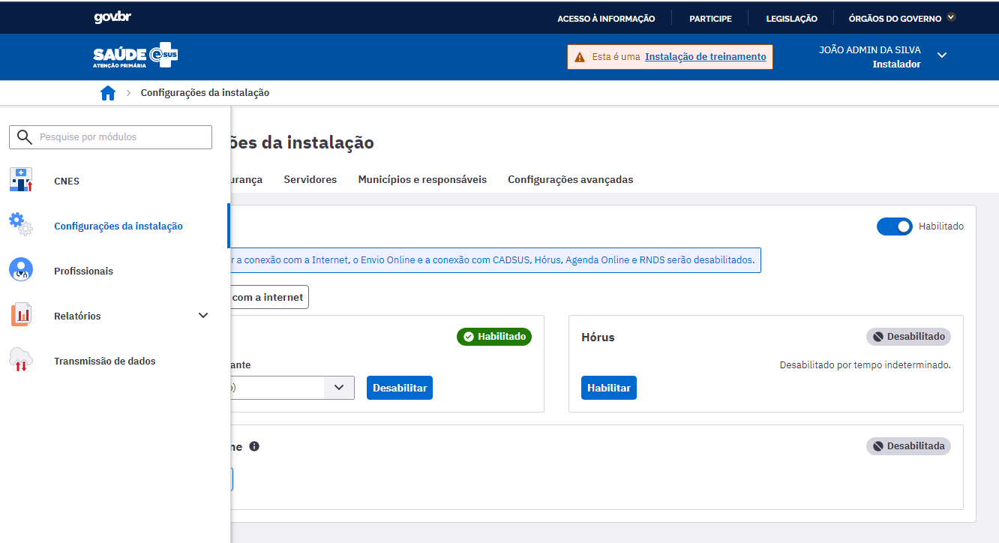

Fonte: SAPS/MS.

Figura 3.1.2 - Tela do módulo "Administração municipal" acessado com o perfil de administrador municipal

Fonte: SAPS/MS.

{: .nota }
caso o usuário acesse esse módulo com perfil diferente de administrador da instalação ou de Administrador municipal terá um conjunto de funcionalidades restritas ao seu perfil.

Após a instalação do sistema, é necessário fazer sua configuração para, então, começar a utilizá-lo. Seguem abaixo as etapas a serem seguidas para o uso do PEC. É importante seguir a ordem dessas orientações, uma vez que algumas etapas dependem de outras anteriores. Os passos a seguir, conforme o Quadro 3.1, constituem um fluxo lógico para manusear o Sistema com PEC.

{: .dica }
o sistema vem pré-configurado com opções padronizadas, a partir de características gerais do processo de trabalho na atenção básica, portanto, é importante verificar as configurações pré-definidas e sempre que necessário adequá-las à realidade local.

Quadro 3.1 - Passo a passo de configuração inicial do Sistema com PEC

|**Passos**|**Descrição**|**Perfil- Padrão**|**Função**|
|- |- |- |- |
|Passo 1|configurar sistema (envio de dados e horário de funcionamento da UBS)| administrador da instalação| |
|Passo 2|definir o(s) administrador(es) do(s) município(s)|administrador da instalação ||
|Passo 3|definir o tempo de consulta de cada categoria profissional por CBO, quando necessário|Administrador municipal||
|Passo 5|criar/redefinir perfis e personalizar recursos de cada perfil, quando necessário|Administrador municipal ou Coordenador |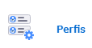|
|Passo 6|verificar configuração dos profissionais importados do CNES (identificação, lotação, perfil)|Administrador municipal ou Coordenador| 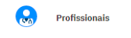|
|Passo 7|verificar a agenda dos profissionais de saúde|Coordenador||

Fonte: SAPS/MS.

{: .atencao }
profissionais que tem mais de uma lotação (vínculo) na unidade de saúde deverão ter sua agenda criada manualmente.

Na sequência, serão apresentadas as funcionalidades do módulo "Configurações da instalação" com vistas a contemplar os passos de configuração do sistema. E, ao final, serão apresentadas as funcionalidades para a transmissão, importação e exportação de dados do sistema.

# 3.1 Configurações da instalação

## 3.1.1 Conexão

Na aba "Conexão", o administrador pode verificar se a instalação está conectada à internet e apta a utilizar as funcionalidades que dependem desta conexão. Além disso, pode também desabilitar ou habilitar essa conexão clicando no botão .

Para realizar um teste de conexão, clique no botão "Testar conexão com a internet". Caso haja conexão com a internet, o sistema exibirá a mensagem "Conexão bem sucedida", conforme vemos na Figura 3.3.

Observação: quando o sistema estiver sem conexão, as funcionalidades que dependem de internet serão desabilitadas automaticamente.

Figura 3.3 - Botão "Testar conexão com a internet"

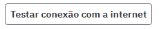

Fonte: SAPS/MS.

### 3.1.1.1 CADSUS

Conforme descrito na seção 4.1.2, o sistema poderá utilizar o barramento do CADSUS para consultar os cadastros do cidadão ou verificar por atualizações no cadastro, caso tenha uma conexão com a internet.

Na opção "CADSUS", o administrador da instalação poderá habilitar ou desabilitar o serviço CADSUS, quando houver instabilidade temporária de conexão ou quando houver algum tipo de instabilidade no próprio serviço do CADSUS.

Para desabilitar a conexão com o serviço do CADSUS, conforme a Figura 3.9, siga os passos abaixo:

1\. No combo box "Desabilitar durante", selecione uma das opções:

- 30 minutos, 1 hora, 2 horas, 4 horas, 8 horas, 1 semana ou 1  mês.

2\. Clique no botão "Desabilitar" para concluir.

Para habilitar a conexão com o CADSUS, após indisponibilidade temporária, clique no botão "Habilitar", conforme a Figura 3.5.

Figura 3.1.4

Fonte: SAPS/MS

Figura 3.1.5

Fonte: SAPS/MS

### 3.1.1.2 Hórus

Por meio dessa funcionalidade, a partir da versão 2.1, é possível ativar a integração com o Sistema Hórus. Para habilitar o recurso, a instalação precisa estar conectada à internet.

Na opção "Hórus", o administrador da instalação poderá habilitar ou desabilitar o serviço Hórus, quando houver necessidade.

Figura 3.1.6

Fonte: SAPS/MS

Figura 3.1.7

Fonte: SAPS/MS

Para desabilitar a conexão com o serviço do Hórus, conforme a Figura 3.6, siga os passos abaixo:

1\. No combo box "Desabilitar durante", selecione uma das opções:

- 30 minutos, 1 hora, 2 horas, 4 horas, 8 horas ou "Tempo  indeterminado".

2\. Clique no botão "Desabilitar" para concluir.

### 3.1.1.3 Agenda Online

Esta funcionalidade permite, a partir da versão 3.0, que o administrador do sistema habilite ou desabilite a sincronização dos dados da Agenda das Unidades de Saúde realizados por meio da instalação local com PEC, no município, com o Servidor de Agendamento Online do e-SUS APS disponibilizado no DATASUS.

{: .atencao }
é preciso ter conectividade **com a internet** para que este serviço funcione.

Para habilitar a sincronização, acesse a funcionalidade de Agenda Online nas opções de configuração do sistema, conforme pode ser visto na Figura 3.1.8.

Figura 3.1.8 - Tela para habilitar a Agenda Online

Para habilitar a sincronização com o Servidor de Agenda Online do e-SUS AB é necessário gerar a contrachave, seguindo o mesmo fluxo de ativação da instalação, como mostra a Seção 2.4.4, porém selecionando a opção de "Agendamento" 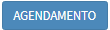.

{: .nota }
para habilitar este serviço é necessário acessar o Portal do e- Gestor AB para gerar a contrachave. Se preferir, é possível receber mais orientação de como gerar a contra- chave ligando para o Disque Saúde através do telefone 136, opção 8. Consulte a **Seção 2.4** para mais informações.

O usuário do sistema ainda pode acessar a ajuda de contexto  para obter mais informações sobre a ativação e configuração da agenda online.

Ao ativar a Agenda Online o sistema irá sincronizar as informações de agendamento existentes no PEC com o Servidor de Agenda Online do e-SUS APS no DATASUS, permitindo que o cidadão receba notificações por meio do aplicativo "ConecteSUS", disponibilizado pelo DATASUS, tanto de confirmação quanto de cancelamento de agendamentos realizados via PEC.

Para desabilitar a sincronização com o Servidor de Agenda Online basta clicar no botão "Desabilitar".

## 3.1.2 Segurança

Na aba "Segurança", o administrador poderá configurar itens para a segurança do sistema, tais como:

- Período para a redefinição da senha dos profissionais que acessam o PEC;

- Tempo limite para encerramento da sessão por inatividade do sistema;

- O número máximo de tentativas consecutivas de login com autenticação inválida; e

- Solicitação manual para redefinição das senhas de todos os usuários do sistema.

Figura 3.1.9. - Tela de configuração de opções de segurança

Fonte: SAPS/MS.

Para configurar um período de redefinição de senha, siga os passos abaixo:

1\. No combo box "Período para redefinição de senha", conforme a figura acima, selecione uma das opções:

- 1 Mês, 2 Meses, 3 Meses, 4 Meses, 5 Meses ou 6 Meses.

2\. Para concluir, clique em "Salvar".

Para configurar o período máximo de inatividade do sistema , siga os passos abaixo:

1\. No combo box "Período máximo de inatividade", conforme figura acima, selecione uma das opções:

- 30 minutos, 1 hora, 2 hora, 3 hora ou 4 hora.

2\. Para concluir, clique em "Salvar".

Para configurar o número máximo de tentativas consecutivas de acesso do usuário ao sistema com autenticação inválida, siga os passos abaixo:

1\. No combo box "Máximo de tentativas consecutivas de login com autenticação inválida", conforme figura acima, selecione uma das opções:

- 1 Tentativa, 2 Tentativas, 3 Tentativas, 4 Tentativas, 5 Tentativas, 6 Tentativas, 7 Tentativas, 8 Tentativas, 9 Tentativas ou 10 Tentativas.

2\. Para concluir, clique em "Salvar".

Em condições excepcionais, é possível solicitar a redefinição de senhas de todos os profissionais manualmente 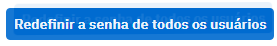. Isto solicitará aos profissionais (usuários do sistema) que redefinam suas senhas no primeiro acesso após a solicitação.

## 3.1.3 Servidores

Esta funcionalidade permite que o administrador da instalação configure o servidor da sua instalação e um servidor SMTP para disponibilizar a opção de \"Esqueci minha senha\" na tela de login. Esta opção permite que os profissionais redefinam suas senhas via e- mail.

Para configurar o servidor da instalação e-SUS APS PEC, siga os passos abaixo:

1\. No campo "Nome da instalação", informe um nome para o servidor PEC;

2\. No campo "Link da instalação", informe o endereço ou IP de acesso do servidor PEC que está disponível para acesso via internet. Se a porta não for informada no link, o sistema utilizará a porta padrão (80); e

3\. Clique em "Salvar" para concluir.

Para configurar o servidor SMTP para envio de e- mail, siga os passos abaixo:

1\. No campo "Endereço do servidor do e- mail (SMTP)", informe o endereço do servidor de e- mail da conta responsável pelo envio da mensagem de recuperação de senha. Informe também a porta utilizada para a comunicação;

2\. No campo "Login", informe o endereço de e- mail válido usado para acessar o servidor SMTP. Se desejar que esse e- mail seja reconhecido como o remetente da mensagem, marque a opção "Usar como e- mail remetente" ;

3\. No campo "Senha", informe a senha de acesso ao servidor. Caso não tenha optado por usar o mesmo e- mail de login para ser o remetente, informe um e- mail válido para esse fim no campo "E- mail remetente"; e

4\. Clique em "Habilitar" para concluir, se a conexão for "Bem sucedida". É possível desabilitar o serviço a qualquer momento por meio do botão "Desabilitar".

## 3.1.4 Municípios e Responsáveis

A partir da versão 4.0 do e-SUS APS PEC, a instalação poderá ser configurada para ser utilizada por mais de um município. Para adicionar outros municípios é necessário incluir um responsável municipal, que deverá ativar a instalação do seu município.

Os municípios ativos na instalação compartilham apenas os dados de cadastro e prontuário de cidadão que foram cadastrados na instalação ou que foram enviados para ela.

Para adicionar responsáveis municipais (administradores municipais), selecione o município e um profissional da base local, conforme a Figura 3.0:

Figura 3.0 - Lista de responsáveis municipais

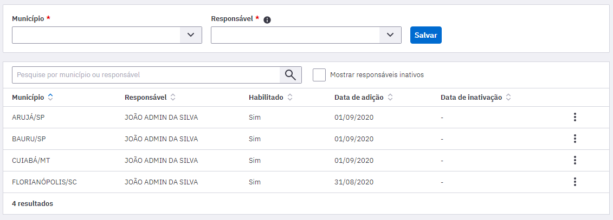

Fonte: SAPS/MS.

Para concluir, clique em "Salvar". O perfil de administrador municipal será listado no acesso do responsável municipal recém adicionado.

{: .nota }
só é possível habilitar um responsável municipal para cada município, sendo que esse usuário receberá o perfil de administrador municipal no PEC.

### 3.1.5 Configurações avançadas

Na aba "Configurações avançadas", é possível alterar o número de requisições simultâneas que podem ser processadas pelo sistema, conforme figura 4.1. Essa opção é utilizada para gerenciar a performance do sistema em casos peculiares.

Figura 3.1 - Performance - Número de requisições simultâneas processadas

Fonte: SAPS/MS.

A alteração do Número de requisições pode prejudicar o desempenho do sistema, entre em contato com o suporte do e-SUS APS para mais informações acessando o Portal de Suporte por meio do link: [http://esusaps.bridge.ufsc.br](http://esusaps.bridge.ufsc.br/pt-BR/support/home).

No combo box "Desabilitar durante", selecione uma das opções:

30 minutos, 1 hora, 2 horas, 4 horas, 8 horas ou "Tempo indeterminado".

Clique no botão "Desabilitar" para concluir.

Horário de funcionamento das UBS, bem como os dias de funcionamento na semana.

- Horário padrão da agenda do profissional, usado para pré-configurar a agenda do profissional a partir da sua importação pelo XML do CNES.

- Tempo padrão de duração do atendimento, utilizado para determinar os horários de atendimentos disponíveis para a agenda dos profissionais.

Figura 3.2 - Tela de configuração dos Horários

Fonte: SAPS/MS.

No bloco "Horário padrão da agenda do profissional" são definidas as informações padrões para pré-configuração da agenda dos profissionais. Deve ser informado os períodos de atendimento, preenchendo horário inicial e final de cada período, na sequência deve ser informado o "Tempo padrão de duração dos atendimentos". Esta informação trata- se da média da duração das consultas dos profissionais e servirá de base para a organização das agendas. Veja a seção 3.2 para outras opções de tempo de duração por CBO.

Figura 3.3 - Tela de configuração de horários- padrão de atendimento

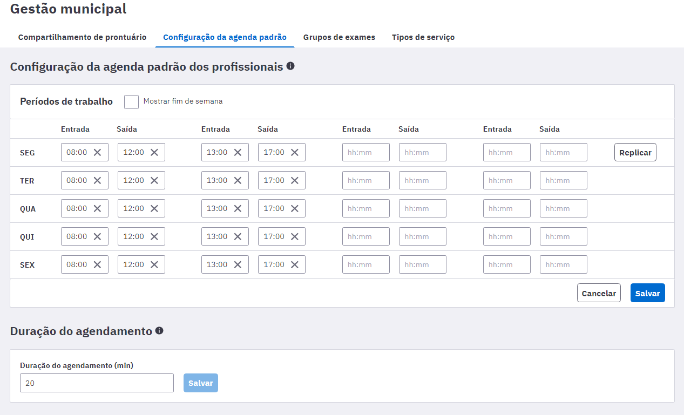

Fonte: SAPS/MS.

{: .nota }
os turnos matutino, vespertino e noturno, e em casos excepcionais de madrugada, devem ser configurados dentro de cada período, conforme a necessidade local.

{: .dica }
as configurações de horário padrão serão utilizadas no sistema para pré- configurar a agenda dos profissionais, portanto busque definir aqui o que é mais frequente.

Após efetuar as alterações necessárias clique no botão Salvar para confirmar as alterações.

# 3.2 CBO

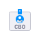

O módulo CBO é utilizado para controlar, por meio do código da Classificação Brasileira de Ocupações (CBO), o tipo de **profissional que poderá ser lotado em uma unidade** e o **tempo de atendimento** de cada um, quando for o caso.

Esta configuração já vem pré definida com uma configuração- padrão, no entanto pode ser alterada conforme a necessidade do município.

Para ter acesso à lista de CBOs e suas configurações, basta acessar o módulo "Administração" e clicar em "CBO". Será apresentada a lista dos códigos da CBO disponíveis e o *status* de cada categoria, conforme a Figura 3.4.

Use as opções de filtro para localizar o CBO desejado. As opções para filtro são "Nome da CBO" ou pelos campos Código da CBO e Disponível para Lotação no botão de filtro . Digite ou selecione a opção desejada e clique no botão "Pesquisar";

Figura 3.4 - Lista de CBOs

Fonte: SAPS/MS.

## 3.2.1 Editar CBO

Para editar o algum CBO, siga os passos:

1.clique no ícone "Editar"  do CBO desejado para alterar o tempo de agendamento de uma consulta para outra;

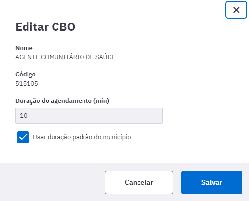

2.Clique em "Mais opções" 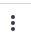 e marque o campo "**Indisponível para lotação**" se o município não possui aquele CBO para lotação dos profissionais.

3.Também é possível disponibilizar um CBO previamente indisponível. Para isso, marque a opção "Mostrar CBOs indisponíveis para lotação", Clique em "Mais opções"  e "Disponibilizar para lotação";

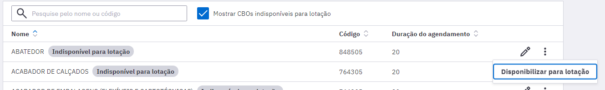

4.clique no botão "Salvar"  para concluir.

# 3.3 CNES

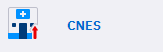

Esta funcionalidade permite importar os dados do Sistema de Cadastro Nacional de Estabelecimentos de Saúde (SCNES), por meio do arquivo XML, disponibilizado na área do gestor no site do CNES [http:// cnes2.datasus.gov.br/](http://cnes2.datasus.gov.br/). Tanto o administrador da instalação (administrador da instalação) quanto o administrador municipal podem importar o arquivo CNES no sistema.

{: .atencao }
toda vez que houver uma atualização dos dados no CNES, deve- se gerar um novo arquivo para importação no e-SUS APS.

Para fazer download do arquivo do CNES, siga os passos:

1\. acesse o site [http://cnes2.datasus.gov.br/](http://cnes2.datasus.gov.br/);

2\. No item do menu "**Serviços"**, vá até "Gestores" e, após, clique em "Recebimento Arquivos (Download)";

3\. Agora, acesse o sistema do CNES com suas respectivas informações;

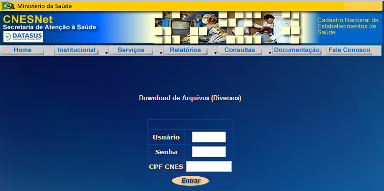

4\. Clique no nome do arquivo "XMLPARAESUS_XXXXXX.ZIP", onde XXXXXX corresponde ao número do IBGE do município, e escolha um local para salvá- lo.

Após carregar (*download*) o arquivo XML gerado CNESNet, é possível importá- lo por meio dos seguintes passos:

1\. na tela "Administração", clique na opção "CNES";

2\. será apresentada a tela "Importação de CNES", conforme a Figura 3.5;

3\. clique no botão "Clique para importar ou arraste os arquivos" e localize o arquivo XML gerado pelo CNESNet, ou arraste o arquivo para essa área. Para o administrador da instalação, é necessário selecionar o município antes;

4\. em seguida, clique no botão \"abrir\" e aguarde até que todos os dados sejam importados;

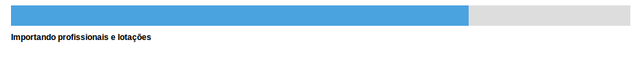

5\. Ao concluir a importação, a mensagem de \"Importação Concluída\" será exibida no sistema. Basta clicar OK para finalizar.

Ao carregar os dados do arquivo XML do CNESNet no Sistema e-SUS APS, todas as informações de profissionais, unidades e equipes serão salvas no sistema. Com a importação do arquivo concluída, o sistema disponibiliza, por meio da opção "Histórico de Importações", um relatório sintético sobre os itens importados, similar à Figura 3.6, para cada importação feita no sistema. O relatório pode ser acessado clicando no botão  "Visualizar", correspondente à data da importação, como podemos ver na Figura 3.5.

Figura 3.5 - Tela de importação do CNES

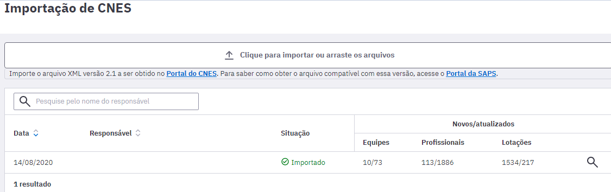

Fonte: SAPS/MS.

Figura 3.6 - Modelo do relatório de profissionais com mais de uma lotação que não tiveram agenda configurada.

Fonte: SAPS/MS.

O relatório de importação traz dados importantes sobre a consistência dos cadastros realizados no CNES em relação aos dados necessários para um bom funcionamento no sistema, portanto, é altamente recomendado que seja analisado antes de prosseguir.

Figura 3.7 - Modelo do relatório de registros não importados.

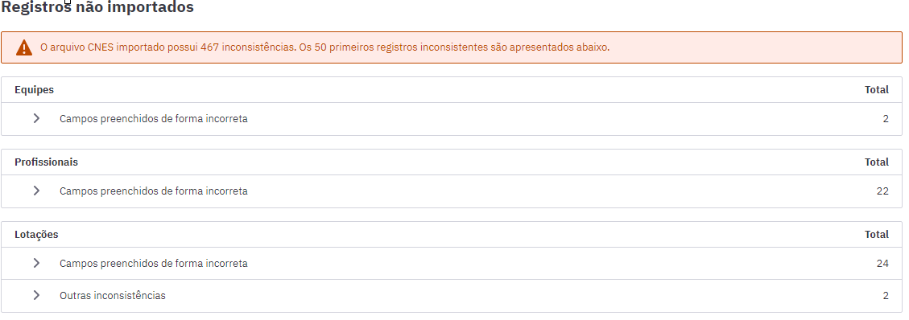

Fonte: SAPS/MS.

Figura 3.8 - Modelo do relatório registros importados.

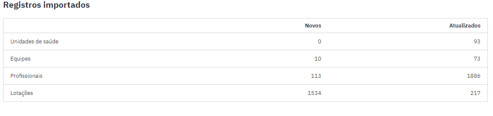

Fonte: SAPS/MS.

# 3.4 Unidades de Saúde

Os dados sobre os estabelecimentos (unidades de saúde) usados pelo sistema, como vimos na seção 3.2, são importados do Sistema CNES, via XML, portanto todos os estabelecimentos devem estar devidamente cadastrados e atualizados no Sistema CNES do seu município e enviados para a base nacional.

Para ter acesso à lista das unidade, conforme a Figura 3.9, basta acessar o módulo "Administração" e clicar em "Unidades de Saúde".

Figura 3.9 - Lista de unidades de saúde

Fonte: SAPS/MS.

{: .atencao }
todos os dados das unidades de saúde utilizadas pelo Sistema e-SUS APS são provenientes do CNES, portanto é importante sempre manter as informações atualizadas no CNES, a fim de evitar erros de validação das informações enviadas ao SISAB.

## 3.4.1 Visualizar Tipos de Serviço

Todas as informações principais da unidade de saúde vem do cadastro do CNES e, portanto, não podem ser alteradas no Sistema e-SUS APS. Porém, para um bom funcionamento das funções do sistema em relação ao fluxo de serviço da unidade, é necessário editar os tipos de serviço no módulo "Gestão municipal" (seção 3.11.4), no acesso de administrador municipal, para indicar quais são os tipos de serviços realizados nas UBS do município. Siga os passos indicados, conforme a Figura 4.10, para editar os tipos de serviço:

1.clique na opção "Visualizar"  da unidade de saúde desejada;

2.as informações da unidade de saúde serão previamente carregadas para edição, porém os blocos de informações provenientes do CNES não poderão ser alterados. Para realizar atualizações no cadastro da unidade, atualize os dados no SCNES do seu município e gere novamente o XML para importação (conforme seção 3.2);

3.Clique em "Tipos de serviço" para visualizar os tipos de serviço disponíveis.

Os tipos de serviços, ver Seção 6.1, ajudam os profissionais de saúde a orientar o fluxo de encaminhamento interno dentro de sua unidade de saúde.

Figura 3.10 - Visualizar os tipos de serviços das unidades de saúde

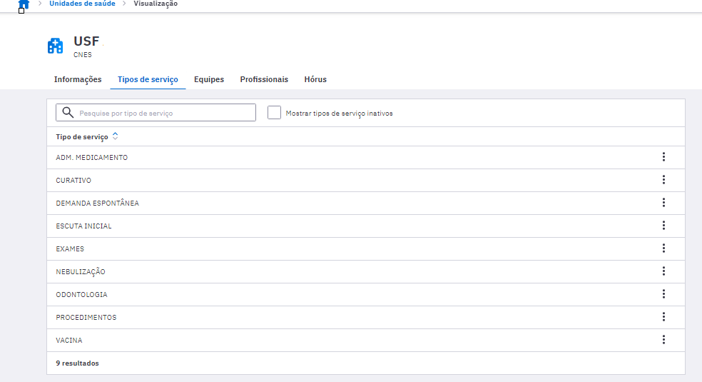

Fonte: SAPS/MS.

## 3.4.2 Equipes

Da mesma forma que os dados das unidades de saúde, os dados das equipes são importados por meio do arquivo do Sistema CNES, onde estão disponíveis o código do Identificador Nacional de Equipe (INE) da equipe e o número da área sob responsabilidade da equipe.

Para visualizar as informações das equipes:

1.clique na opção "Equipe"  da unidade de saúde desejada;

2.será apresentada a lista das equipes cadastradas no CNES para a unidade de saúde escolhida, apresentando o tipo de equipe, o número do INE, o código da área/equipe, nome da equipe e se está ativa no SCNES (Figura 3.21);

3.para acessar mais detalhes sobre as equipes, clique na opção "Visualizar"  da equipe desejada.

Figura 3.11 - Visualizar dados das equipes (INE/área)

Fonte: SAPS/MS.

{: .dica }
mantenha as informações de Área e Equipe (INE) responsável pelo território corretamente vinculadas e atualizadas no CNES, pois estas informações são utilizadas nos relatórios do sistema e também auxiliam no processamento e controle de acesso quando a equipe (INE) responsável pela área for alterada.

# 3.5 Profissionais (Usuários do Sistema)

O módulo "Profissionais" está disponível para os perfis de administrador da instalação e administrador municipal e concentra uma série de funcionalidade importantes para o bom funcionamento do sistema. Por meio dele, será possível:

- gerenciar os profissionais/usuários do sistema;

- gerenciar as lotações de cada profissional nas unidades de saúde;

- gerenciar a agenda dos profissionais (como coordenador);

- gerenciar as permissões de acesso.

Para ter acesso à lista de profissionais, basta acessar o sistema com o perfil de administrador da instalação ou de administrador municipal e clicar em "Profissionais". Será apresentada a lista dos profissionais importados via XML do CNES, ou excepcionalmente cadastrados na aplicação, conforme a Figura 3.12.

Figura 3.12 - Lista de profissionais do sistema

Fonte: SAPS/MS.

## 3.5.1 Cadastrar Profissional/Usuário do Sistema

A lista de usuários do sistema é controlada pela lista de profissionais do sistema. Ou seja, todos os profissionais ativos têm acesso ao sistema usando o CPF de seu cadastro e senha pessoal.

{: .dica }
**evite utilizar esta funcionalidade** **para cadastrar profissionais de saúde** que realizam atendimentos e ações de saúde por meio do sistema. pois ao enviar os dados para o SISAB esses registros de atendimentos podem não ser validados pelo CNES, ou seja, serão rejeitados pelo SISAB caso o cadastro do profissional não seja atualizado antes do fechamento da competência.

Para cadastrar um profissional/usuário do sistema, siga os passos:

1\. clique no botão "Cadastrar profissional";

2\. preencha o formulário com as informações do profissional, conforme a Figura 3.13, e clique em "Salvar".

Figura 3.13 - Cadastrar profissional/usuário do sistema

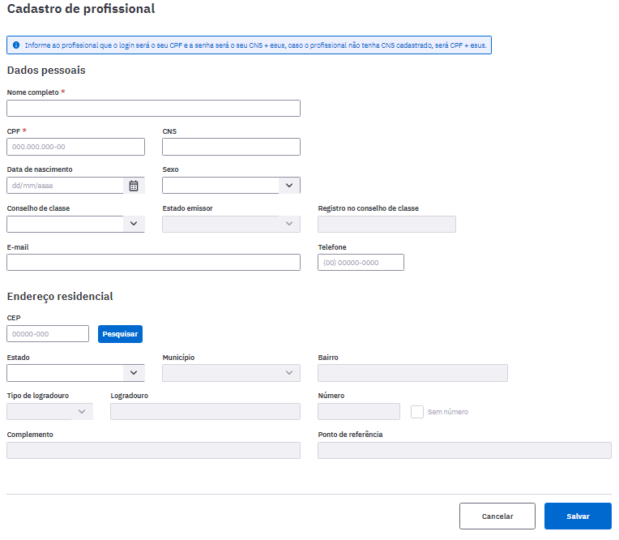

Fonte: SAPS/MS.

O bloco **Endereço Residencial** utiliza a base de endereços da Empresa Brasileira de Correios e Telégrafos. Ao incluir um **CEP**, o sistema automaticamente preenche os campos Estado, municípios, bairro e logradouro. Caso o bairro ou logradouro não esteja disponível na base dos Correios, é possível editar esses campos manualmente.

## 3.5.2 Desbloquear ou Redefinir Senha do Usuário

Como observado no tópico 3.1.2, quando o número de tentativas de *login* realizadas pelo usuário do sistema atingir a quantidade configurada o acesso deste profissional será bloqueado, como mostra a pec_imagem abaixo.

Figura 3.14 - Aviso de bloqueio de acesso por tentativas sem sucesso.

Fonte: SAPS/MS.

Quando houver profissionais com acesso bloqueado por tentativa de login sem sucesso, estes serão apresentados na cor vermelha na lista de profissionais no módulo de administração como mostra a pec_imagem a seguir.

Figura 3.15 - Apresentação de profissionais com bloqueio de acesso por tentativas sem sucesso.

Fonte: SAPS/MS.

O **desbloqueio de senha** deverá ser realizado pelo administrador da instalação ou pelo administrador municipal ou pelo gerente da UBS clicando em "Mais opções" 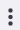 e "Desbloquear e redefinir senha". Após esta ação, será solicitada a confirmação da ação como a pec_imagem abaixo:

Figura 3.16 - Tela de confirmação de desbloqueio e redefinição de senha.

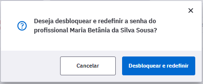

Caso seja necessário **redefinir** a senha de um usuário, conforme vimos na Seção 1.3.2, esta ação poderá ser realizada usando a opção \"Redefinir Senha\".

Para redefinir a senha de um usuário, siga os passos:

1\. conforme vimos na Figura 4.15, localize o profissional o qual necessita redefinir a senha, caso necessário, utilize a opção de filtro logo acima da listagem para encontrar o profissional a qual se deseja redefinir a senha;

2\. clique em "Mais opções"  e em \"Redefinir Senha\", o sistema solicitará confirmação;

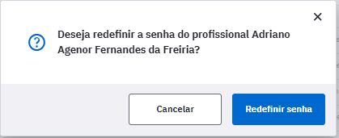

3\. a senha será redefinida para o número do CNS do profissional mais a palavra "esus", clique no botão "Redefinir senha" para concluir. Exemplo: "267207490990000esus".

{: .dica }
evite utilizar esta funcionalidade sem que o profissional solicite, pois isso poderá gerar insegurança no uso do sistema pelos profissionais.

## 3.5.3 Lotar um Profissional

Assim como a lista de profissionais, as lotações também são importadas por meio do XML gerado pelo CNES, no entanto é possível alterar os dados, caso seja necessário.

{: .atencao }
todas as informações desatualizadas ou com inconsistência em relação ao CNES não serão validadas, portanto evite criar ou alterar lotação do profissional manualmente, prefira fazê-lo, sempre que possível, pelo CNES. As lotações criadas manualmente não são alteradas nem desativadas automaticamente com a importação do XML, é necessário selecionar a opção "Atualizar perfis ao importar CNES" ao cadastrar a lotação.

Para acessar a lotação de um profissional, basta clicar na opção "Visualizar"  do profissional desejado. Será apresentada a lista das lotações previamente cadastradas do profissional escolhido no final da página, conforme a Figura 3.17.

Figura 3.17 - Lotações do profissional

Fonte: SAPS/MS.

Para **adicionar** uma lotação, clique no botão "Cadastrar lotação" e siga os passos:

1\. preencha o formulário com as informações gerais da lotação do profissional, como Unidade de saúde, o número do INE, se houver, e CBO (Figura 4.18);

2\. Selecione a opção "Atualizar perfis ao importar CNES" caso deseje que a importação do arquivo XML desative ou altere a lotação;

3\. selecione o(s) "Perfil(is)" do profissional (coordenador, médico, recepcionista etc.);

4\. para excluir as informações, clique no ícone  "Excluir". O registro de perfil será removido;

5\. após o preenchimento dos dados, clique no botão "Salvar" e, caso haja alguma inconsistência, o sistema mostrará mensagem na tela indicando os campos que deverão ser corrigidos.

Figura 3.18 - Cadastrar lotação do profissional

Fonte: SAPS/MS.

Para **editar** uma lotação, na lista de lotações (Figura 3.17), clique na opção "Editar"  da lotação desejada. Serão apresentadas as informações da lotação, edite- as conforme necessário, e clique no botão "Salvar".

Para **excluir** uma lotação, clique em "Mais opções"  e "Excluir" da lotação desejada. Será solicitada a confirmação desta exclusão.

## 3.5.4 Perfil de Acesso dos Profissionais

Como vimos na Figura 3.18, ao adicionar a lotação de um profissional, também é definido o seu perfil de acesso, por meio da opção "Perfis".

{: .nota }
o sistema já define o perfil de acesso dos profissionais de saúde com perfis- padrão, estes perfis são definidos com base no CBO importado do cadastro do CNES, no entanto todos os perfis e/ou recursos podem ser alterados conforme a necessidade local.

Para definir o perfil de acesso do profissional para determinada lotação, basta seguir os passos:

1\. acesse a lotação desejada por meio da opção \"Editar\" ou \"Cadastrar lotação\", caso ela ainda não exista;

2\. na opção \"Perfis\", selecione o(s) perfil(is) desejado(s), de acordo com a necessidade local.

3\. por fim, clique em "Salvar" para concluir.

## 3.5.5 Definir Agenda dos Profissionais

Para definir a agenda de trabalho um profissional da unidade de saúde, basta acessar a lista de profissionais e em seguida a lotação do profissional. [**Esta etapa é fundamental para realizar o agendamento dos cidadãos para as consultas**]

{: .nota }
a agenda do profissional de saúde **que possuir apenas uma lotação** é definida por padrão pelo sistema, por meio do horário- padrão definido no sistema, caso seja necessário ajustar, clique em "Mais opções"  e "Editar configuração de agenda".

{: .nota }
somente o perfil de coordenador, ou seja, o Coordenador da UBS, poderá alterar ou definir a agenda dos profissionais de saúde que realizam atendimento.

Para ativar a agenda de um profissional, siga os passos:

1\. localize na lista de lotações a que terá a agenda ativada;

2\. clique em "Mais opções"  e "Criar configuração de agenda";

3\. preencha o horário inicial e final de cada período, para cada dia da semana desejado, conforme a necessidade, ou clique na opção "horário- padrão" para que o sistema preencha automaticamente a agenda com o horário padrão de agendamento configurado na instalação. Ao selecionar a caixa "Mostrar fim de semana", serão mostrados o sábado e o domingo;

4\. Após a definição dos horários da agenda, clique em "salvar".

Figura 3.19 - Definir a agenda do profissional

Fonte: SAPS/MS.

## 3.5.6 Fechamento de Agenda do Profissional

Para definir data na qual a agenda do profissional estará fechada, o usuário, com perfil de coordenador, deverá seguir os passos:

1\. localize na lista de lotações a qual será adicionado um fechamento;

2\. clique em "Mais opções"  e "Visualizar fechamento de agenda";

3\. Preencha o formulário com a Data inicial e final do fechamento da agenda, bem como o motivo do fechamento que pode ser: atestado, curso, férias, licença, reunião ou outro (nesse caso, será necessário descrever o motivo no campo "Especifique");

4\. clique em "Adicionar" para concluir.

Figura 3.20 - Configuração de fechamentos da agenda

Fonte: SAPS/MS.

## 3.5.7 Configurações Agenda Online

O módulo de **Agendamento Online** foi desenvolvido conjuntamente entre o Departamento de Saúde da Família - DESF e o Departamento de Informática do SUS - DATASUS, a fim de facilitar o acesso dos cidadãos aos serviços de Atenção Primária à Saúde em todo o país. Dessa forma, foi realizado o desenvolvimento da ferramenta de Agenda Online no PEC e adequações no aplicativo "Conecte SUS Cidadão" para a efetivação desta funcionalidade.

Este módulo está disponível para as equipes de Atenção Primária que utilizam o PEC do e-SUS APS, a partir da versão 3.1, e foi pensando levando em consideração avanços tecnológicos e no aumento de acesso constante da população a aparelhos de *smartphones*, dessa forma tendo acesso a aplicações *mobile*.

O Agendamento Online consiste na disponibilização de horários da agenda dos profissionais da APS para esse tipo de agendamento, entendendo que esta não deve ser a forma principal ou preferencial de agendamento nas equipes, sendo assim, a equipe deve definir quais serão os horários disponíveis para esse tipo de agendamento, considerando os agendamentos para cuidado continuado e outros tipos de agendamento a serem realizados diretamente na Unidade de Saúde ou para consultas de retorno. Além disto permite o disparo de notificações "*push"* em com informações relacionadas ao agendamento realizado no PEC para o cidadão através do aplicativo "Conecte SUS Cidadão".

Para uso desta funcionalidade, é necessário que a UBS tenha boa conectividade com a internet, pois utiliza- se um servidor nacional para troca de informação entre a UBS e os cidadãos que utilizam o aplicativo "Conecte SUS".

Para que o cidadão tenha acesso a agenda da equipe para agendamento de uma consulta é necessário que esse cidadão possua um cadastro individual na equipe, somente os cidadãos cadastrados na equipe terão acesso a agendar um atendimento no aplicativo "Conecte SUS".

Para configurar o módulo de Agenda Online no PEC, com perfil de coordenação, acesse a lista de lotações do profissional, clique em "Mais opções"  e "Criar configuração de agenda online", após isso serão apresentados todos os horários do profissional disponíveis para agendamento. Nesta tela é possível selecionar horários para disponibilizar para agendamento online a ser realizado pelos cidadãos por meio do aplicativo "Conecte SUS" (Figura 3.21).

Figura 3.21 - Grade de horários disponíveis para agendamento

Para **habilitar** horários para o agendamento online pelos cidadãos, o profissional com perfil de coordenação deve selecionar os horários (Figura 3.21).

Para **desabilitar** horários para o agendamento online basta clicar novamente.

Clique em "Salvar" para concluir.

{: .atencao }
Não é possível configurar o agendamento online para profissionais que são inseridos manualmente no PEC.

{: .nota }
A mudança de configuração da agenda pode ser realizada a qualquer momento, porém não altera os horários agendados previamente.

{: .dica }
Antes de realizar a configuração da Agenda Online realize uma conversa prévia com toda a equipe, para pactuação de estratégia de abertura desse formato de agendamento, a disponibilização de horários pode ser gradual. Atente- se para informar a população sobre esse possibilidade de agendamento.

## 3.5.8 Outras Opções para um Profissional

Para **visualizar** um profissional, clique na opção "Visualizar"  do profissional desejado. Serão apresentadas as informações do profissional escolhido (somente para visualização).

Para **editar** um profissional, clique em "Mais opções"  e "Editar" do profissional desejado. Serão apresentadas as informações do profissional previamente cadastradas em modo de edição. Altere- as caso necessário e clique no botão "Salvar".

Para **excluir** um profissional, clique em "Mais opções"  e "Excluir" do profissional desejado. Será apresentada uma mensagem solicitando a confirmação desta exclusão.

# 3.6 Perfis (de acesso)

Ao conjunto de definições para acesso aos recursos do sistema é dado o nome de "perfil", ou seja, ao associar um profissional a um perfil, especifica- se, em regra geral, o que determinado profissional pode ou não acessar dentro do sistema. Cada perfil está associado a um conjunto de recursos do sistema, que podem estar ativos ou inativos a depender das atividades desenvolvidas pelo profissional.

Para ter acesso à lista de perfis disponíveis no sistema, basta acessar o sistema com o perfil de administrador municipal e clicar em "Perfis". Será apresentada a lista de perfis definidos (padrão e personalizado) (Figura 3.22).

Figura 3.22 - Lista de perfis do sistema

Fonte: SAPS/MS.

## 3.6.1 Tipo de Perfil e tipo de acesso

O sistema agrupa o tipo de perfil por algumas categorias, de tal forma que, não é possível que um mesmo profissional misture funcionalidades em um mesmo tipo de acesso, separando funções administrativas ou de coordenação com funções de atendimento/consulta ao cidadão. Além disso, passa a definir explicitamente a categoria **Tipo de acesso**.

O tipo de acesso se divide em: **lotação**, **gestor municipal** e **gestor estadual**. Os tipos de acesso de gestor municipal e gestor estadual vinculam- se, respectivamente, aos perfis de gestor municipal e gestor estadual. Os demais perfis possuem lotação como tipo de acesso. Para atribuir o perfil de gestor municipal a um profissional, acesse o módulo de profissionais com o acesso de administrador municipal e clique em "Cadastrar acesso" no final da página. Outrossim, para atribuir o perfil de gestor estadual, faça o mesmo passo a passo acessando o sistema com o perfil de administrador da instalação.

O Quadro 3.2 apresenta os tipos de perfis disponível no sistema.

Quadro 3.2 - Tipo de perfil no sistema

| **Perfil** | **Descrição** |
|- |- |
|Administração|Perfil exclusivo para fins de administração do sistema e, em geral, usado por   técnicos de informática.|
|Coordenação|Perfil com recursos de administração e coordenação da unidade de saúde.|
|Atendimento|Perfil com recursos de atendimento ao cidadão e funções de cuidado da população.|
|Gestor Municipal/Estadual|Perfil com recursos limitados de acesso, porém que permitem ao gestor acompanhar as ações do seu município/Estado por meio de relatórios.|

Fonte: SAPS/MS.

## 3.6.2 Perfil Padrão

O sistema oferece um conjunto de perfis- padrão no sistema de tal forma que seja fácil e rápido iniciar o uso do sistema sem uma configuração mais refinada das necessidades dos profissionais de saúde em cada unidade de saúde.

A lista de perfis- padrão foram determinadas por meio da avaliação de boas práticas de uma equipe de Atenção Primária. No entanto, considerando a grande diversidade e especificidades regionais, não devem ser tomadas como regras, mas apenas como referências para um conjunto de recursos.

Em anexo a este manual, ANEXO I, apresentamos a lista de perfis- padrão do sistema e breve descrição de sua aplicação nas unidade de saúde, em funções gerenciais ou administrativas.

## 3.6.3 Perfil Personalizado

É possível editar os recursos dos perfis padrão. Na migração para novas versões que possuam alterações nos perfis padrão do sistema, os perfis padrão editados receberão os novos recursos definidos na nova versão, e não terão recursos removidos.

Para definir perfis de acesso diferente dos perfis padrão no sistema, é possível fazê-lo de duas formas:

- copiar; ou

- adicionar.

Para **copiar** um perfil, basta seguir os passos:

1\. clique em "Mais opções" , em seguida, clique na opção \"Perfis\";

2\. aparecerá uma lista de perfis, como na Figura 3.23 ;

3\. clique em "Mais opções" , em seguida, clique na opção \"Copiar\" na linha correspondente ao perfil que deseja copiar;

4\. no formulário, altere o \"Nome\" do perfil para poder identificá-lo mais tarde. Não é possível alterar o \"Tipo de acesso\";

Figura 3.23 - Cópia de perfil

5\. para concluir, clique em \"Salvar\".

De forma similar, para **adicionar** um novo perfil, basta seguir os passos:

1\. clique em "Mais opções" , em seguida, clique na opção \"Perfis\";

2\. aparecerá a tela com a lista de perfis, como na Figura 3.24;

3\. clique em \"Cadastrar perfil\".

4\. no formulário, crie um novo \"Nome\" para o perfil para poder identificá- lo mais tarde e defina o \"Tipo de acesso\" que deseja;

5\. para concluir, clique em \"Salvar\".

Figura 3.24 - Cadastro de perfil

## 3.6.4 Editando os Recursos de um Perfil

Após adicionar ou copiar um perfil, é necessário editar os recursos conforme a necessidade local. Os recursos dos perfis- padrão também poderão ser editados. Para tal, siga os passos:

1\. clique na opção "Editar"  do perfil desejado. Será exibida uma tela, conforme a Figura 4.25. Se for um perfil novo, os recursos estarão todos inativados . Na coluna dos \"Recursos\", será exibido o caminho de acordo com a navegação estrutural do sistema;

2\. para autorizar uma ação no recurso, clique no símbolo , que será alterado para ;

3\. para revogar a permissão de uma ação em um recurso, clique no ícone . O símbolo voltará ao seu padrão ;

4\. os recursos de nível acima do selecionado e que estejam na mesma hierarquia serão autorizados automaticamente. O símbolo será alterado para .

Figura 3.25 - Lista de recursos do perfil

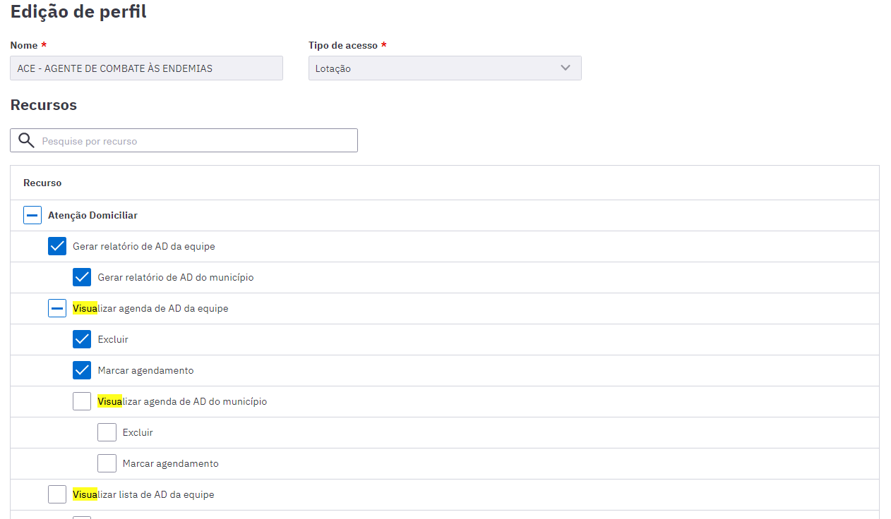

Fonte: SAPS/MS.

## 3.6.5 Outras Opções do Perfil

Para **visualizar** um perfil, clique na opção "Visualizar"  do perfil desejado. Serão apresentadas as informações de identificação do perfil, apenas para leitura.

Para **editar** um perfil, clique em "Editar"  para o perfil desejado. Serão apresentadas as informações de identificação do perfil. Altere- as caso necessário e clique no botão "Salvar".

Para **excluir** um perfil, clique em "Mais opções"  e "Excluir" do perfil desejado. Será apresentada uma mensagem solicitando a confirmação desta exclusão.

{: .atencao }
só é possível excluir um perfil que não esteja em uso no sistema, ou seja, sem nenhum usuário associado a ele.

Para **inativar** um perfil, clique em "Mais opções"  e "Inativar" do perfil desejado. Será apresentada uma mensagem solicitando a confirmação desta inativação.

# 3.7 Rotina de Transmissão, Sincronização e Processamento de Dados

Na estrutura preconizada pelo Sistema e-SUS APS, recomenda- se o compartilhamento hierárquico das informações, onde a base maior alimenta a base menor em um processo de recuperação de informação.

É recomendado que uma instalação de PEC ou centralizador municipal processe os dados do Sistema e-SUS APS com CDS ou com PEC a serem enviados ao SISAB, de modo a garantir a sincronização da rede local e, por conseguinte, a gestão municipal das informações geradas na AB.

## 3.7.1 Rotina de Sincronização da Rede Municipal

Considerando os cenários de implantação, a opção de base descentralizada pode atender os municípios. Entende- se por base descentralizada a organização da rede de Atenção Básica municipal com instalações CDS e/ou PEC em UBS, regionais de saúde/distritos de saúde.

Essa descentralização pressupõe uma estrutura de sincronização do sistema, entre a base local (UBS, regionais de saúde/distritos de saúde ou similares) e o PEC/centralizador municipal.

Independentemente do cenário de transmissão e da forma de envio - seja ela **via arquivo** (*off-line*) ou via internet (*on-line*), a sincronização das bases deve respeitar o fluxo de envio de informações ao SISAB (leia a Portaria que orienta os prazos para alimentação do SISAB referente ao ano corrente), ou seja, num período máximo de um mês entre a sincronia das bases.

## 3.7.2 Tipos de Registro: CAD, RAS e RAC

O Sistema e-SUS APS com PEC avança na perspectiva de eliminar os registros em fichas e formulários de papel. E com a oferta de ferramentas informatizadas adequadas ao processo de trabalho das equipes de APS. Os mesmos blocos que são consolidados no CDS são registrados individualmente no PEC.

Essa integração é estruturada para oferecer evolução gradual da capacidade de registro de informação, ao mesmo tempo em que deve atender ao SISAB. Neste contexto, o sistema possui diferentes documentos de troca de dados para atender às características particulares de cada sistema, gerando os seguintes documentos eletrônicos:

• **CAD:** gerado a partir dos dados de cadastro da APS, é um documento que permite compartilhar as informações de cadastro por cidadão, em especial para atender aos processos de importação de cadastros já consolidados em nível local, evitando- se, portanto, retrabalho;

• **RAS:** o Registro de Atendimento Simplificado é o conjunto essencial de informações gerado a partir dos eventos de saúde individualizados, que é transmitido para a base federal;

• **RAC:** o Registro de Atendimento Compartilhável, além das informações do RAS, agrega outras informações mais estruturadas, compondo a base de dados local do sistema com PEC, compatibilizando o sistema para o futuro compartilhamento de informações.

Portanto, os documentos RAS e RAC têm origem no bloco de informações de eventos de saúde individualizados.

## 3.7.3 Transmissão de Dados

O módulo "Transmissão de Dados" permite fazer o controle de envio e recebimento dos dados de uma aplicação. Conforme podemos ver na Figura 4.26, este módulo tem três funções básicas: configuração, envio e recebimento.

Figura 3.26 - Módulo "Transmissão de dados"

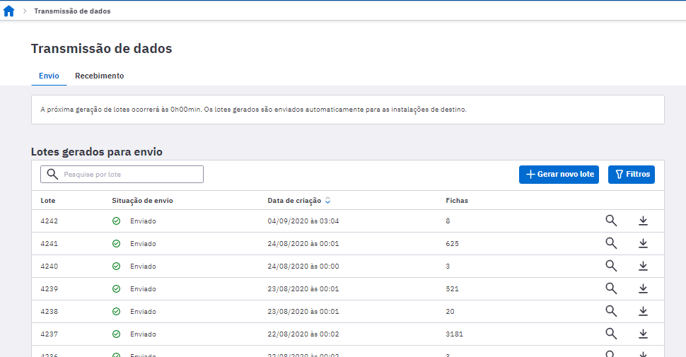

Fonte: SAPS/MS.

### 3.7.3.1 Configuração de Envio dados

É por meio desta funcionalidade que o administrador da instalação deve inserir o endereço eletrônico do servidor para onde enviará os dados de produção da equipe de saúde. Os dados coletados a partir do sistema devem ser enviados a um centralizador na Secretaria Municipal de Saúde ou na Secretaria Estadual de Saúde. Desse modo, esses órgãos poderão realizar a gestão dos serviços públicos de saúde em sua área de atuação, a partir de relatórios agregados. De acordo com a demanda da gestão municipal ou estadual, poderão ser incluídos outros endereços para envio dos dados. O endereço eletrônico do Ministério da Saúde já está previamente configurado em uma instalação de produção, para que o Governo Federal faça a gestão dos serviços públicos de saúde em todo o território nacional. Além do link do Ministério da Saúde, os links dos centralizadores estaduais estão configurados automaticamente nas instalações municipais para os estados que formalizaram a solicitação via ofício ao Ministério da Saúde.

Para incluir novo endereço eletrônico de envio de dados, o usuário deverá clicar em "Adicionar instalação", preencher os campos "Nome da instalação" e "Endereço do servidor" e clicar em "Adicionar", conforme a Figura 3.27.

Figura 3.27 - Configuração de envio dos dados

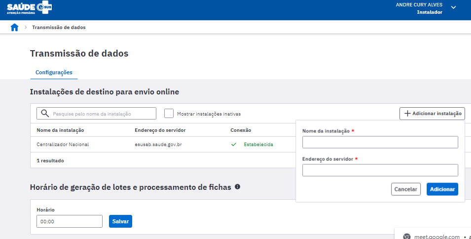

Fonte: SAPS/MS.

Para configurar o *link* de envio corretamente, siga os passos:

1\. informe o nome (apelido) de destino no campo "Nome da instalação", o qual refere- se ao nome do local para onde serão enviados os dados (exemplo: Centralizador do Estado, Centralizador do Município). Insira no campo "Endereço do servidor" o endereço eletrônico do computador que receberá os dados, ou seja, a máquina que possui um PEC Centralizador, municipal ou estadual (exemplo: [http://enderecoeletronico.municipio.gov.br:8080/esus](http://enderecoeletronico.municipio.gov.br:8080/esus)).

**Observação**: O endereço eletrônico, quando mantida a configuração nativa do sistema, deve conter a porta de conexão "8080";

2\. para testar a conexão com os servidores cadastrados, clique no botão "Testar conexão" para verificar a conectividade com os *links* cadastrados. Se o texto "Teste de conexão finalizado" for apresentado e o status da conexão mudar para "Estabelecida", então o link informado está correto e funcionando;

3\. para editar as informações de um receptor, clique no botão "Editar" ;

4\. para excluir um receptor, clique no botão "Excluir";

5\. para inativar o link de conexão com o servidor, clique em "Mais opções"  e "Inativar";

Vale contextualizar que, por padrão, toda instalação PEC realiza a transmissão automática para o Centralizador Nacional às 00:00 horas, porém o administrador da instalação pode alterar esse horário por meio da opção "Horário de geração de lotes e processamento de fichas". Na organização da transmissão na rede municipal de Atenção Básica de uma instalação CDS para PEC e/ou de um PEC para um ou mais centralizadores (regional distrital/municipal), será necessário inclusão do endereço eletrônico (*link*) para envio dos dados.

A transmissão, bem como a forma de envio via arquivo (*off-line*) ou via internet (*on-line*) de um Sistema com PEC ou centralizador municipal para o centralizador estadual, deve ser articulada entre Estados e municípios, onde o ente estadual fornecerá o endereço eletrônico (*link*) para inclusão dele na configuração de envio.

### 3.7.3.2 Envio

Esta funcionalidade permite ao administrador da instalação um melhor controle de envio das informações do sistema tanto para os *links* configurados como para envios manuais realizados por meio de arquivos, conforme podemos ver na Figura 3.27.

Figura 3.27 - Controle de envio dos dados

Fonte: SAPS/MS.

O envio dos dados é automático e está configurado para ocorrer entre 0h e 6h da manhã (por padrão), assim como no processamento. Para isso, o computador deve permanecer ligado e conectado à internet, sem suspender as atividades do sistema operacional. Caso a UBS não tenha conexão à internet, é possível fazer instalação *off-line* tanto do PEC como do CDS. No entanto, é necessário ter ao menos uma versão *on-line* no município - em um Sistema com PEC ou um centralizador municipal - para envio das informações ao SISAB.

Para enviar os dados manualmente, basta seguir os passos:

1\. acesse a aba "Envio", por meio do módulo "Transmissão de Dados";

2\. conforme vimos na Figura 3.36, clique no botão \"Gerar novo lote\";

3\. o sistema solicita confirmação e prepara todos os dados que ainda não foram enviados em um lote de envio. Clique em \"Gerar lotes\" para concluir;

4\. será incluído na lista novo item do lote de dados criado com os dados pendentes de envio;

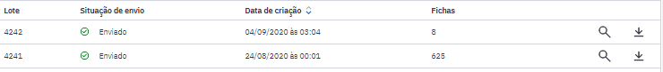

5\. para salvar um arquivo com os dados gerados no lote, clique na opção \"Salvar em Arquivo\"  e salve o arquivo no local desejado;

As transmissões de dados ocorrerão ao longo do dia e obedecerão a um agendamento automático do servidor do MS com o objetivo de distribuir o fluxo e reduzir a concorrência no acesso e a transmissão de dados para outros servidores serão executadas conforme disponibilidade do servidor destino.

O centralizador nacional agendará um novo horário de envio quando o usuário não conseguir realizar o envio manual. Este horário será informado instantaneamente pelo PEC na mesma tela de transmissão.

Para visualizar os detalhes de um lote gerado manualmente ou pelo sistema, basta clicar na opção \"Visualizar\" . Será exibida uma tela, conforme a Figura 3.28, com informações adicionais de controle de envio ou geração do lote. Por meio da tela de visualização do lote de envio dos dados, também é possível marcar o lote para início do envio automático.

Figura 3.28 - Visualizar detalhes do lote de envio dos dados

Fonte: SAPS/MS.

### 3.7.3.3 Recebimento

Esta funcionalidade subdivide- se em "Recebimento por lote" e "Recebimento por CNES" conforme podemos ver na Figura 3.29.

Figura 3.29 - Controle de recebimento dos dados

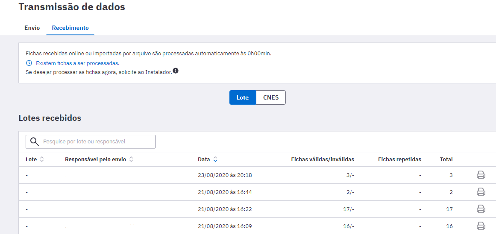

Fonte: SAPS/MS.

#### 3.7.3.3.1 Recebimento por lote

Esta funcionalidade permite ao administrador municipal melhor controle de recebimento de informações enviadas ao sistema, tanto envios *on-line* quanto envios *off-line* (por arquivo), conforme podemos ver na Figura 3.39.

Nesta situação, chamamos de registro um arquivo compactado que pode conter um ou mais atendimentos. O processamento dos registros acontece ao descompactar esse arquivo e acomodar as informações contidas neste registro no banco de dados do PEC.

Registros enviados para o sistema, seja de uma instalação CDS, seja de outra instalação PEC, ficam armazenados numa tabela, aguardando o período **entre 0h e 6h**, ou outro horário estabelecido pelo administrador da instalação, para realizar o **processamento automático** deles. Para isso, o computador deve permanecer ligado.

Para importar arquivos gerados em uma instalação CDS ou por uma instalação PEC, como vimos na seção anterior, basta clicar no botão \"Importar Arquivo\" e seguir os passos:

1\. ao clicar no botão \"Importar ou arraste os arquivos \";

2\. clique no botão "Selecionar arquivo" e selecione o arquivo gerado a partir do CDS, PEC ou outro sistema usando o modelo RAS. Ver Seção 3.6.2 para mais detalhes;

3\. o sistema exibirá uma mensagem de conclusão do processo;

4\. volte na tela de controle de recebimento para mais detalhes;

5\. o sistema exibirá novo lote de fichas recebidas no sistema;

6\. Para gerar o relatório, basta clicar no botão "Imprimir relatório de inconsistências" . Será gerado o relatório em formato CSV conforme a Figura 3.30.

O processamento dos registros também pode ser efetuado manualmente. Para processar os registros importados, clique na opção \"Processar todos\" para processar todos os lotes pendentes.

O relatório de inconsistência passa a ser visualizado por lote e permite ao administrador visualizar possíveis inconsistências nas informações importadas no sistema, por meio da opção "Importar Arquivo", como visto na seção anterior.

Figura 3.30 - Relatório de inconsistências

Fonte: SAPS/MS.

#### 3.7.3.3.2 Recebimento por CNES

Esta funcionalidade permite a consulta dos registros recebidos por estabelecimento por meio do código do CNES e por mês de recebimento.

Para visualizar os detalhes das fichas recebidas para um CNES, basta clicar na opção \"Visualizar\" . Será exibida uma tela, conforme a Figura 3.31. Nesta tela, é possível ver a quantidade de fichas recebidas separadas por tipo e quantidade.

Figura 3.31 - Visualizar detalhes do lote por CNES

Fonte: SAPS/MS.

#### 3.7.3.3.3 Relatório de Inconsistências

Esta funcionalidade permite a extração de relatórios de inconsistências das fichas enviadas e por lote. Para gerar o relatório, clique em "Gerar relatório de Inconsistências" que em seguida aparecerá a seguinte tela.

Para imprimir o relatório escolha o período de recebimento, e se necessário, o nome do responsável e o tipo de recebimento. O documento gerado é o mesmo apresentado na Figura 4.30.

## 3.7.4 Fluxo Recomendado na Transmissão de Dados

A seguir, apresentaremos os fluxos recomendados para transmissão de dados dentro do ambiente municipal até o SISAB (programado por padrão nas instalações PEC/centralizador) considerando cenários a partir de UBS não informatizada, UBS sem internet, UBS com internet e, também, da integração de municípios com sistemas próprios ao SISAB.

Conforme explicado anteriormente, a transmissão para o ambiente estadual pressupõe a articulação bipartite (entre Estado e municípios). Por esse motivo, o ambiente estadual ainda não é apresentado nos fluxos de transmissão a seguir.

### 3.7.4.1 UBS não Informatizada

Para o fluxo recomendado de uma UBS não informatizada, onde apenas a Secretaria Municipal de Saúde (SMS) tem computador e internet, a melhor opção é a implantação do sistema CDS. Nesse caso, a SMS deve definir um fluxo - semanal, quinzenal ou outro - de encaminhamento e digitação das fichas preenchidas na UBS pelos profissionais. Vale esclarecer que o uso das fichas do CDS não substitui o registro no prontuário de papel na UBS.

Figura 3.32 - Fluxo de transmissão de dados para UBS não informatizada

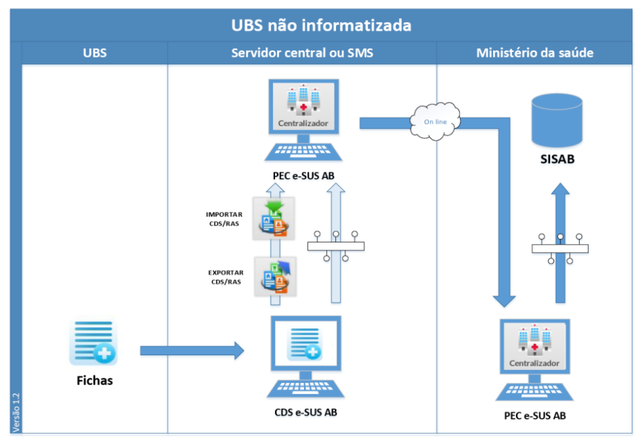

Fonte: SAPS/MS.

Essa digitação poderá ser feita por meio de instalação *off-line* do CDS (os dados deverão ser transmitidos, por arquivo ou internet, para um sistema com centralizador) ou *on-line* do PEC no módulo CDS.

### 3.7.4.2 UBS sem Internet

A UBS com, ao menos, um computador tem infraestrutura para que a digitação das fichas seja feita na própria unidade. Os dados digitados são enviados à SMS por arquivo ou por conexão eventual, por exemplo, modem discado ou 3G. Este cenário também se aplica às equipes de AB que tenham acesso à internet em locais fora da UBS, como em telecentro, lan house etc.

{: .dica }
este cenário inicia o processo de descentralização da digitação das fichas da SMS para equipes de AB, permitindo o acompanhamento da digitação e qualidade das informações.

Figura 3.33 - Fluxo de transmissão de dados para UBS sem internet

Fonte: SAPS/MS.

### 3.7.4.3 UBS com Internet

Numa UBS com mais de um computador com conectividade parcial ou contínua, é possível utilizar o PEC com instalação *off-line,* por meio de um servidor local, e complementarmente usar as fichas CDS nos pontos da unidade onde ainda não há computador, no processo de trabalho domiciliar dos ACS e no atendimento odontológico.

Figura 3.34 - Fluxo de transmissão de dados para UBS com internet

Fonte: SAPS/MS.

{: .dica }
é possível implantar alguns módulos do PEC, por exemplo: agenda na recepção e atendimento pelo médico e enfermeiro. Considerando que o custo de informatizar os demais ambientes de atendimento da UBS é relativamente baixo, este fluxo pode ser transitório.

### 3.7.4.4 Integração com Sistemas Próprios

Os municípios com sistema próprio de prontuário devem utilizar a tecnologia Thrift para que transmitam os dados cadastrais e clínicos (CAD+RAS) de seu sistema para uma instalação do tipo PEC ou centralizador municipal, que transmitirá os dados para o SISAB.

Figura 3.35 - Fluxo de transmissão de dados para integração de sistemas próprios com o SISAB

Fonte: SAPS/MS.

## 3.7.5 Sincronização com Aplicativos para Tablet

O processo de sincronização entre os aplicativos para *tablet* do Sistema e-SUS e Sistema com PEC é realizado de forma automática, no entanto são necessários alguns requisitos:

1)o servidor local do PEC e o *tablet* devem estar conectados por uma rede sem fio, para que o *tablet* possa acessar o servidor durante a sincronização;

2)o usuário/profissional que irá usar o *tablet* deve estar cadastrado no sistema (servidor local).

Outras regras adicionais a depender do aplicativo que está em uso:

- para Atenção Domiciliar: somente usuários lotados com INE de Equipe Multiprofissional de Apoio (Emap) ou Equipe Multiprofissional de Atenção Domiciliar (Emad) podem sincronizar com o aplicativo;

- para ACS: somente usuário com lotação de ACS pode sincronizar com o aplicativo.

## 3.7.6 Relatórios

O módulo Relatórios pode ser acessado pelo administrador da instalação. Por meio dessa funcionalidade é possível gerenciar a disponibilidade de recursos para a geração de relatórios no sistema, a fim de evitar sobrecarga na infraestrutura. O módulo subdivide- se em Configuração de impressão e Processamento.

### 3.7.6.1 Configuração de impressão

Para evitar que consultas muito grandes criem uma carga exagerada no servidor da aplicação, é possível configurar o fator que determinará quantos grupos de informação podem ser selecionados e qual período pode ser filtrado em cada relatório, conforme a figura 3.36..

Figura 3.35 - Controle de impressão

Após informar o fator para o relatório desejado, clique em Salvar.

### 3.7.6.2 Configuração de impressão

O processamento das fichas e a geração de lotes ocorrem no horário padrão (ou em outro configurado pelo administrador da instalação) ou a qualquer momento por meio da funcionalidade "Gerar", em "Transmissão de dados", conforme figura 3.37.

Esse processamento pode ser forçado para atualização dos relatórios por meio da funcionalidade "Processamento".

Figura 3.37- Processamento de Relatórios

Fonte: SAPS/MS.

Para forçar o processamento, é necessário clicar em "Marcar para processamento", aguardar o andamento e clicar em "Forçar o processamento".

# 3.8 Importar Cidadão

Este módulo utiliza tecnologia Apache Thrift para permitir que outro sistema de informação possa importar sua base de cadastro de cidadãos, minimizando o esforço de recadastramento e digitação. O cidadão é identificado pelo CNS ou CPF. Sendo assim, os dados já existentes serão alterados com a nova importação, quando for localizado o mesmo cidadão. Esta importação pode ser realizada em qualquer momento.

Para proceder à importação dos dados de cadastro, basta seguir os passos:

1.acesse a funcionalidade \"Importar Cidadão\" por meio do acesso de administrador municipal;

2.o sistema apresentará uma tela, conforme a Figura 4..38. Clique no botão para selecionar o arquivo;

3.ao finalizar a importação, o sistema exibirá uma mensagem de \"Importação Concluída\".

Figura 3.38 - Importar Cidadão

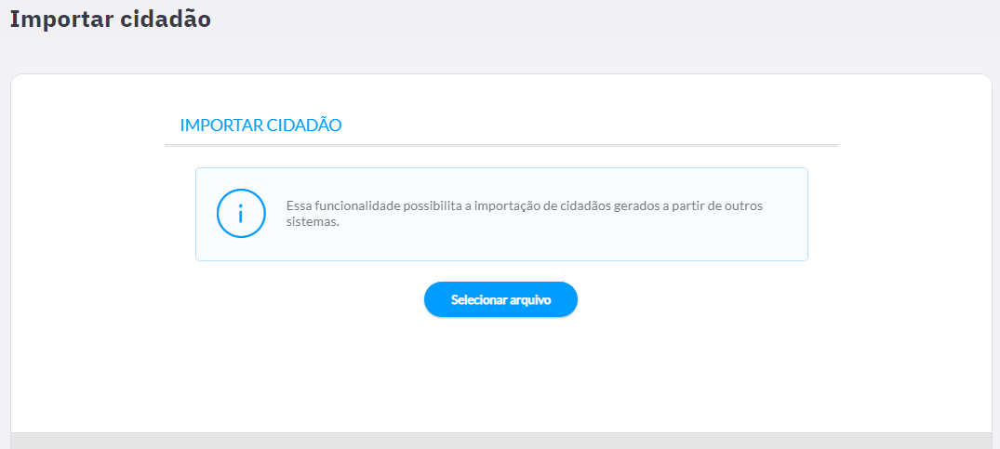

Fonte: SAPS/MS.

# 3.9 Auditoria

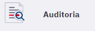

Para garantir principalmente, a integridade e segurança do sistema, o módulo de "Auditoria" foi desenvolvido no sistema com o objetivo de aprimorar os requisitos de segurança do PEC. Esta funcionalidade permite saber quais ações foram executadas dentro do sistema e quem as executou, a partir da geração de trilhas de auditoria.

Este módulo é responsável pela visualização das trilhas de auditoria geradas pelo sistema. As trilhas são geradas continuamente e são compostas por eventos que possuem informações sobre o tipo do evento, tipo do registro afetado, identificador do registro afetado, componente gerador e o usuário que gerou o evento.

Figura 3.39 - Trilha de auditoria

Fonte: SAPS/MS.

Para gerar uma trilha de auditoria o administrador do sistema deve seguir os seguintes passos.

**Passo 1**: Selecionar o período para a análise. Este campo é de preenchimento obrigatório;

**Passo 2**: Se preferível, selecione um dos tipos de eventos: tentativa de autenticação com sucesso, bloqueio de conta de usuário, tentativa de autenticação sem sucesso, troca de senha, inativação da sessão do usuário, aceitação do termo de concordância de uso, acesso aos registros de auditoria, operação no banco de dados, ação do usuário, desbloqueio de conta do usuário, configuração de perfil e cópia de segurança.

Figura 3.40 - Tipo de evento

Fonte: SAPS/MS.

**Passo 3**: Ainda é possível gerar a trilha selecionando "tipo de registro afetado" e/ou "usuário gerador do evento". O "tipo de registro afetado" refere- se em que parte do sistema (Cidadão, Perfil, Profissional, Unidade de Saúde) houve um acometimento no registro. Quanto ao "usuário gerador do evento" refere- se ao profissional inserido no sistema que causou o evento. No campo "Detalhes do evento", pode- se inserir uma descrição para refinar a busca (exemplo: Hórus).

**Passo 4**: Ou ainda se preferir, digite apenas o "identificador do registro afetado" e/ou "componente gerador".

**Passo 5**: Para finalizar, gere o arquivo no formato .csv ou imprima o arquivo no formato .pdf, selecionando as opções "PDF" ou "CSV" e clicando em "Gerar trilha de auditoria", respectivamente. O documento gerado para a impressão será conforme modelo abaixo, incluindo inclusive os detalhes do evento. O arquivo estará disponível para download na lista de histórico de trilhas de auditoria. Basta clicar no botão  para baixar o arquivo.

Figura 3.41 - Relatório trilha de auditoria por tipo de registro afetado: Prontuário

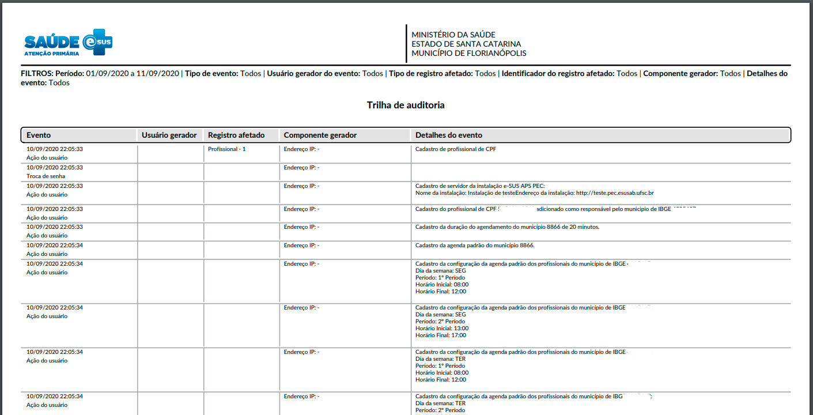

Fonte: SAPS/MS.

## 3.8.1 Tipos de eventos

A seguir são apresentados os tipos de eventos que podem ser registrados na trilha de auditoria e suas respectivas descrições e detalhamentos:

| **Tipo de evento** | **Descrição** | **Detalhe do evento** |
|-|-|-|
| Aceitação   do termo de concordância de uso | Concordância do profissional com   os Termos de uso do PEC | - |
| Acesso   aos registros de auditoria | Quando houver acesso ao módulo   de Auditoria. | Período da busca e filtros   selecionados |
| Ação do   usuário | Ações do usuário que não são   contempladas por nenhum outro tipo de evento. | Cada evento possui uma descrição   sobre a ação realizada |
| Bloqueio   de conta de usuário | Bloqueio de usuário devido a   tentativas falhas de autenticação | Login bloqueado: <CPF do   profissional> |
| Configuração   de perfil | Ao alterar os recursos de um   Perfil específico o sistema deve gerar este registro de auditoria. | Uma lista dos registros no   formato: <Adição/Remoção> <Recurso> <Permissão> |
| Cópia de   segurança | A cópia de segurança é realizada   através de uma ferramenta com o objetivo de realizar um backup do sistema. | Descrição das ações da   ferramenta de backup; Possíveis ações da ferramenta de   backup: Realização de cópia de segurança: Quando a ferramenta realiza o   backup com sucesso; Quebra de integridade de cópia de segurança: Quando   existe um problema no arquivo de backup. Restauração de cópia de segurança sem   sucesso: Qualquer ocorrer qualquer outro problema durante o processo de   restauração. |
| Desbloqueio   de conta de usuário | Administrador desbloqueia o   profissional | - |
| Inativação   da sessão do usuário | Quando o login do profissional   atinge o período máximo de inatividade ou quando o usuário sair do sistema. | - |
| Operação   no banco de dados | Toda operação realizada no banco   de dados. | <Tipo da operação>   <Entidade> atributos: <ID>, <colunas>; Os   tipos de operação podem ser: criação, alteração ou exclusão; A entidade   sempre apresentará o seu ID; As colunas podem ou não apresentar os seus   valores. |
| Tentativa   de autenticação com sucesso | Login realizado pelo   profissional no sistema. | - |
| Tentativa   de autenticação sem sucesso | Login não foi realizado pelo   profissional no sistema após a tentativa | Login ou senha incorretos e CPF   do Login utilizado na tentativa |
| Troca   de senha | Profissional utiliza o recurso   Alterar Senha ou a sua senha é redefinida em Redefinir senha. | - |

# 3.10 Lotes de Imunobiológicos

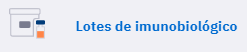

Esta funcionalidade é mais uma novidade no PEC e permite que o profissional de saúde cadastre o fabricante e o lote do imunobiológico no sistema, agilizando e facilitando a busca deste quando for registrar uma dose aplicada.

{: .nota }
Somente os profissionais enfermeiros, técnicos de enfermagem, médicos ou farmacêuticos têm acesso ao recurso de cadastramento de lotes de imunobiológico.

Para realizar o cadastramento do lote de imunobiológico o usuário do sistema, com perfil de acesso ao cadastro, deverá seguir as seguintes etapas:

1\. Na tela inicial do PEC clique no módulo "Lotes de Imunobiológico";

2\. A tela apresentada será conforme a figura abaixo;

3\. Para começar a informar os dados sobre o imunobiológico clique no botão "adicionar" 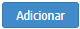.

4\. Em seguida será exibida a tela abaixo:

5\. Prossiga selecionando a vacina que será cadastrada no campo "Imunobiológico". Após digite o lote, o fabricante e a data de validade, nos campos correspondentes e clique em "Salvar". Observe que essas informações são obrigatórias;

6\. A partir desse comando a tela que será exibida apresentará todos os imunobiológicos cadastrados;

7\. Pronto, no próximo registro de aplicação de doses da vacina, o imunobiológico já estará presente no campo "Lote fabricante" quando for registrar uma dose aplicada.

{: .nota }
Para saber mais como realizar um registro de um imunobiológico administrado consulte o capítulo 6.3 deste manual.

8\. Caso queira editar o lote ou excluir o imunobiológico cadastrado basta clicar nos ícones  e , respectivamente. Caso o imunobiológico já tiver sido referenciado a algum registro de aplicação de vacina no sistema, não será possível excluir o lote.

## 3.10.1 Ativar ou Inativar lote de imunobiológico

Caso queira inativar o lote de um imunobiológico que não esteja mais sendo usado no serviço de saúde clique no ícone , em seguida abrirá a tela abaixo, por fim, desmarque o "box"  para desativar o lote do imunobiológico . Clique em "Salvar" para finalizar.

# 3.11 Gestão municipal

O módulo de Gestão municipal agrupa funcionalidades gerais, são elas: Compartilhamento de prontuário, Configuração da agenda padrão dos profissionais, Grupos de exame e Tipo de serviço.

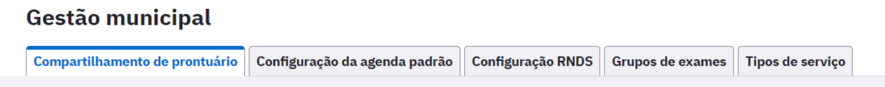

## 3.11.1 Compartilhamento de prontuário

Essa funcionalidade permite compartilhar prontuários com todos os outros municípios que utilizam a mesma instalação em questão.

A funcionalidade estará ativa quando o botão estiver habilitado . Para desativar o compartilhamento, desabilite o botão 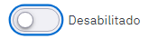.

## 3.11.2 Configuração da agenda padrão

A funcionalidade de "Configuração da agenda padrão" permite configurar um horário padrão de atendimento de todos os profissionais da unidade de saúde para cada dia da semana, incluindo sábado e domingo (opção "Mostrar fim de semana").

Para configurar os horários de atendimento padrão, informe os valores necessários e clique em Salvar.

Figura 3.42 - Períodos de trabalho

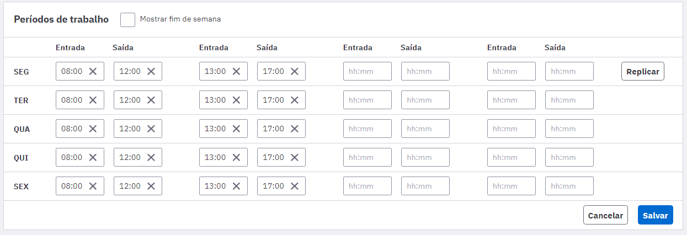

Fonte: SAPS/MS.

Também é possível configurar a duração padrão do agendamento (duração padrão da consulta). As lotações que possuem CBOs com duração do agendamento customizado não utiliza a configuração de duração padrão. Para configurar a duração padrão do agendamento, informe o valor em minutos e clique em Salvar.

## 3.11.4 Grupos de exame

Os grupos de exames são apresentados no módulo de solicitação de exames durante o atendimento no PEC, em "Opções rápidas". Estes filtros são filtrados de acordo com idade e sexo do cidadão em atendimento.

Figura 3.43 - Grupos de exames

Fonte: SAPS/MS.

É possível criar novos grupos de exame na aba "Grupos de exames". Para isso, clique em "Adicionar grupo de exames". Informe o "Nome do grupo" e selecione os exames no combo "Exames". Para concluir, clique em "Adicionar".

Figura 3.44 - Grupos de exames

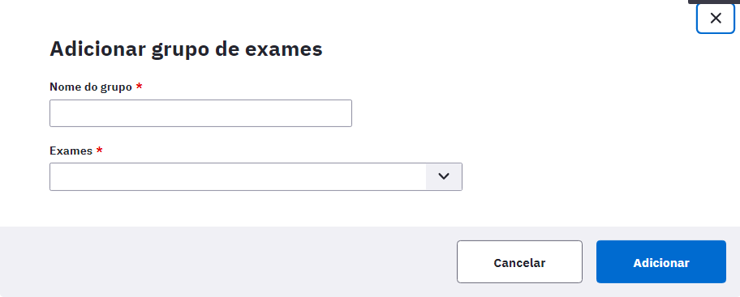

Fonte: SAPS/MS.

Os grupos também podem editados por meio do botão  ou excluídos no botão .

### 3.11.5 Tipos de serviço

Figura 3.45 - Tipos de serviço

Fonte: SAPS/MS.

Na aba "Tipos de serviço", é possível adicionar, editar e excluir os tipos de serviços disponíveis para o município.

Para adicionar, clique em "Adicionar tipo de serviço", informe o nome do tipo de serviço e clique em "Adicionar" para concluir.

Para editar, clique em .

Para excluir um tipo de serviço, cliquem em . Será apresentada uma mensagem de confirmação. Clique no botão  para concluir a ação.
