<head>
    
</head>

# CAPÍTULO 3 - Administração e Configurações do Sistema
{: .no_toc }

Este capítulo apresenta as funções de administração e configurações do sistema.

## Sumário:
{: .no_toc .text-delta }

- TOC
{:toc}

A administração do sistema, **acessada na tela inicial,** subdivide-se em "**Administração da Instalação**" e "**Administração Municipal**", visto que agora o PEC possui apenas um administrador da instalação. E Este agrega todos os tipos de instalação conhecidos anteriormente (municipal, centralizadora e multimunicipal). Assim, será sempre possível configurar o PEC para mais de um município.

Com o perfil de **administrador da instalação** é possível acessar o módulo que agrupa as funções de CNES, Configurações da Instalação, Profissionais, Relatórios e Transmissão de dados. Com o perfil de **administrador municpal** é possível acessar o módulo que disponibiliza as funções de Auditoria, CBO, CNES, Gestão municipal, Importar cidadão, Perfis, Profissionais, Transmissão de dados e Unidades de saúde.

Figura 3.1 - Tela do módulo "Administração da Instalação" acessado com o perfil de **administrador da instalação**.

Fonte: SAPS/MS

Figura 3.1.2 - Tela do módulo "Administração municipal" acessado com o perfil de **administrador municipal**

Fonte: SAPS/MS

{: .nota }
Caso o usuário acesse esse módulo com perfil diferente de administrador da instalação ou de Administrador municipal terá um conjunto de funcionalidades restritas ao seu perfil.

Após a instalação do sistema, é necessário fazer sua configuração para, então, começar a utilizá-lo. Seguem abaixo as etapas a serem seguidas para o uso do PEC. É importante seguir a ordem dessas orientações, uma vez que algumas etapas dependem de outras anteriores. Os passos a seguir, conforme o Quadro 3.1, constituem um fluxo lógico para manusear o Sistema e-SUS APS com PEC.

{: .dica }
O sistema vem pré-configurado com opções padronizadas, a partir de características gerais do processo de trabalho na atenção primária à saúde (APS), portanto, é importante verificar as configurações pré-definidas e sempre que necessário adequá-las à realidade local.

Quadro 3.1 - Passo a passo de configuração inicial do Sistema e-SUS APS com PEC

|**Passos**|**Descrição**|**Perfil-Padrão**|**Função**|
|- |- |- |- |
|Passo 1|Configurar sistema (envio de dados e horário de funcionamento da UBS)| administrador da instalação| |
|Passo 2|Definir o(s) administrador(es) do(s) Distrito Federal/Município(s)|administrador da instalação ||
|Passo 3|Definir o tempo de consulta de cada categoria profissional por CBO, quando necessário|Administrador municipal||
|Passo 5|Criar/redefinir perfis e personalizar recursos de cada perfil, quando necessário|Administrador municipal ou Coordenador ||
|Passo 6|Verificar configuração dos profissionais importados do CNES (identificação, lotação, perfil)|Administrador municipal ou Coordenador| |
|Passo 7|Verificar a agenda dos profissionais de saúde|Coordenador||
|

Fonte: SAPS/MS

{: .atencao }
Profissionais que tem mais de uma lotação (vínculo) na unidade de saúde deverão ter sua agenda criada manualmente.

Na sequência, serão apresentadas as funcionalidades do módulo "Configurações da instalação" com vistas a contemplar os passos de configuração do sistema. E, ao final, serão apresentadas as funcionalidades para a transmissão, importação e exportação de dados do sistema.

# 3.1 Configurações da instalação

## 3.1.1 Conexão

Na aba "Conexão", o **administrador da instalação** pode verificar se o sistema está conectada à internet e apta a utilizar as funcionalidades que dependem desta conexão. Além disso, pode também desabilitar ou habilitar essa conexão clicando no botão .

Para realizar um teste de conexão, clique no botão "Testar conexão com a internet" . 

Caso haja conexão com a internet, o sistema exibirá a mensagem "Conexão bem sucedida".

{: .nota }
Observação: Quando o sistema estiver sem conexão, as funcionalidades que dependem de internet serão desabilitadas automaticamente.

### 3.1.1.1 CADSUS

Conforme descrito na seção 4.1.2, o sistema poderá utilizar o barramento do CADSUS para consultar os cadastros do cidadão ou verificar por atualizações no cadastro, caso tenha uma conexão com a internet.

Na opção "CADSUS", o **administrador da instalação** poderá habilitar ou desabilitar o serviço CADSUS, quando houver instabilidade temporária de conexão ou quando houver algum tipo de instabilidade no próprio serviço do CADSUS.

Para desabilitar a conexão com o serviço do CADSUS, conforme a Figura 3.1.1, siga os passos abaixo:

1\. No combo box "Desabilitar durante", selecione uma das opções:

- 30 minutos, 1 hora, 2 horas, 4 horas, 8 horas, 1 semana ou 1 mês.

2\. Clique no botão "Desabilitar" para concluir.

Para habilitar a conexão com o CADSUS, após indisponibilidade temporária, clique no botão "Habilitar", conforme a Figura 3.1.2.

Figura 3.1.1

Fonte: SAPS/MS

Figura 3.1.2

Fonte: SAPS/MS

A partir da versão 5.1.14 do e-SUS APS é necessário habilitação de alguns fatores dentro do PEC para que o CADSUS passe a funcionar em sua aplicação. Para verificar como realizar habilitação dos serviços, siga o passo a passo na seção 3.1.13 - 
"Acessando ao CADSUS por meio do PEC". 

### 3.1.1.2 Hórus

Por meio dessa funcionalidade, desde a versão 2.1, o **administrador da instalação** pode ativar a integração com o Sistema Hórus. Para habilitar o recurso, a instalação precisa estar conectada à internet.

Na opção "Hórus", o **administrador da instalação** poderá habilitar ou desabilitar o serviço Hórus, quando houver necessidade.

Figura 3.1.4

Fonte: SAPS/MS

Figura 3.1.5

Fonte: SAPS/MS

Para desabilitar a conexão com o serviço do Hórus, conforme a Figura 3.1.1, siga os passos abaixo:

1\. No combo box "Desabilitar durante", selecione uma das opções:

- 30 minutos, 1 hora, 2 horas, 4 horas, 8 horas ou "Tempo indeterminado".

2\. Clique no botão "Desabilitar" para concluir.

Para habilitar a conexão com o HÓRUS clique no botão "Habilitar", conforme a Figura 3.1.2.

### 3.1.1.3 Agenda Online

Esta funcionalidade permite, desde a versão 3.0, que o **administrador do sistema** habilite ou desabilite a sincronização dos dados da Agenda das Unidades de Saúde realizadas por meio da instalação local com PEC no município, com o Servidor de Agendamento Online do e-SUS APS disponibilizado no DATASUS.

{: .atencao }
É preciso estar conectado à **internet** para que este serviço funcione.

Para habilitar a sincronização, acesse a funcionalidade de Agenda Online nas opções de configuração do sistema, conforme pode ser visto na Figura 3.1.5.

Figura 3.1.6 - Tela para habilitar a Agenda Online

Para habilitar a sincronização com o Servidor de Agenda Online do sistema e-SUS APS com PEC é necessário gerar a contrachave no e-Gestor AB, seguindo o mesmo fluxo de ativação da instalação, como mostra a Seção 2.4.4, porém selecionando a opção de "Agendamento" .

{: .nota }
Para habilitar este serviço é necessário acessar o Portal do e-Gestor AB para gerar a contrachave. Se preferir, é possível receber mais orientação de como gerar a contrachave ligando para o Disque Saúde através do telefone 136, opção 8. Consulte a **Seção 2.4** para mais informações.

O usuário do sistema ainda pode acessar a ajuda de contexto  para obter mais informações sobre a ativação e configuração da agenda online.

Ao ativar a Agenda Online o sistema irá sincronizar as informações de agendamento existentes no PEC com o Servidor de Agenda Online do sistema e-SUS APS com PEC no DATASUS, permitindo que o cidadão receba notificações por meio do aplicativo "ConecteSUS", disponibilizado pelo DATASUS, tanto de confirmação quanto de cancelamento de agendamentos realizados via PEC.

Para desabilitar a sincronização com o Servidor de Agenda Online basta clicar no botão "Desabilitar".

### 3.1.1.3 Teleinterconsulta

Para utilizar essa nova funcionalidade, é necessário que o acesso à instalação seja feito utilizando o protocolo HTTPS na instalação local do PEC e que o Administrador da Instalação habilite as videochamadas nas configurações da instalação, conforme animação abaixo:

### 3.1.1.3 Prescrição Digital

Para utização desta nova funcionalidade, é necessário o cumprimento das seguintes premissas, conforme ilustração abaixo:

- Habilitar o SMTP no PEC;
- Habilitar o protocolo HTTPs;
- Ter um certificado digital;
- Estar utilizando versão igual ou superior ao PEC 5.2.6.

#### 3.1.1.3.4 Habilitar o SMTP:

Para que as prescrições digitais sejam enviadas ao e-mail do cidadão, é necessário configurar um Servidor SMTP nas configurações da instalação, que é um serviço que faz o envio dos e-mails gerados pelo PEC aos destinatários. 

Para tal, abra as configurações da instalação utilizando o perfil de administrador da instalação e informe os parâmetros de SMTP para habilitar a funcionialidade, conforme ilustração abaixo:

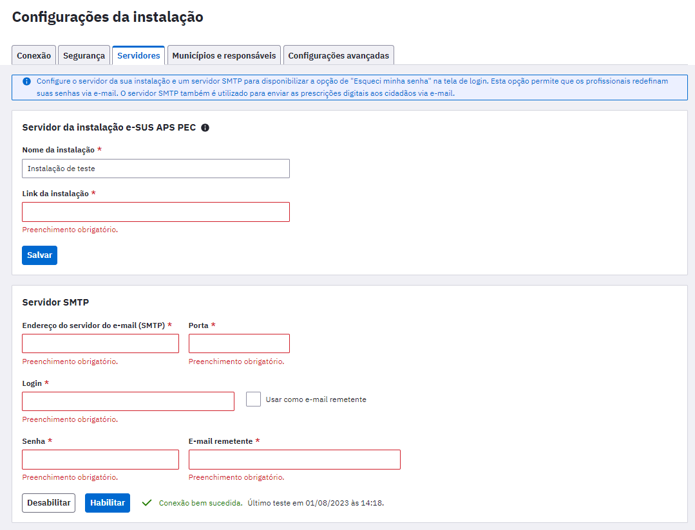

#### 3.1.1.3.5 Habilitar o HTTPs:

Para que a comunicação do PEC com o serviço de prescrição digital ocorra com segurança, é necessário que a instalação utilize o protocolo HTTPS.

#### 3.1.1.3.6 Solicitação de ativação da prescrição digital:

- A solicitação de ativação deverá ser feita através de um ticket de suporte que deverá ser criado pela equipe responsável pela instalação na Plataforma de suporte https://esusaps.freshdesk.com. A URL da instalação deverá ser enviada unto da solicitação;

- A partir da URL da instalação, serão geradas as credenciais (login e senha) para ativar a prescrição digital. Elas serão enviadas como resposta do ticket de suporte;

- O administrador da instalação deverá incluir as credenciais nas configurações da instalação e clicar em "Habilitar".

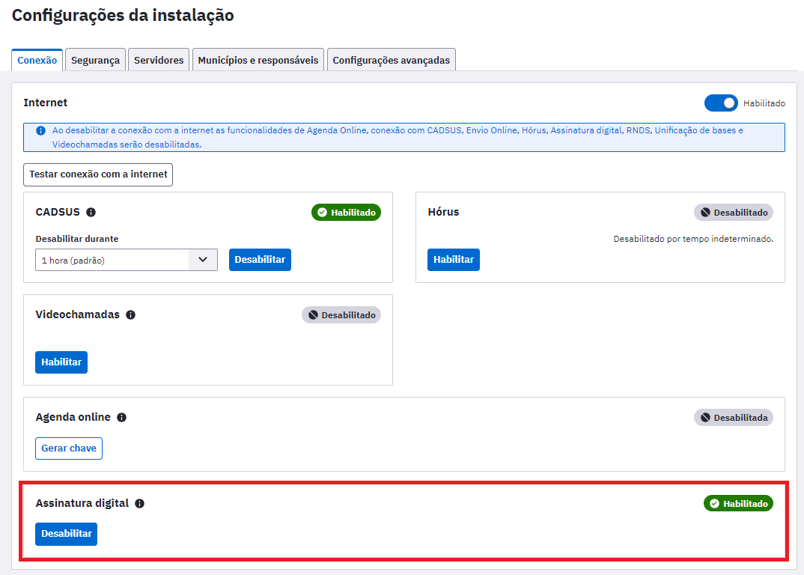

Após a ativação da prescrição digital:

#### 3.1.1.3.7 Certificado digital:

Ter um certificado digital válido, da cadeia ICP Brasil.

#### 3.1.1.3.8 Fazer download do PEC:

Realizar o download da última versão do Prontuário Eletrônico do Cidadão (PEC), no Portal da Atenção Primária à Saúde (APS). Deverá ser uma versão igual ou superior ao PEC 5.2.6.

## 3.1.2 Segurança

Na aba "Segurança", o **administrador da instalação** poderá configurar itens para a segurança do sistema, tais como:

- Período para a redefinição da senha dos profissionais que acessam o PEC;

- Tempo limite para encerramento da sessão por inatividade do sistema;

- O número máximo de tentativas consecutivas de login com autenticação inválida e

- Solicitação manual para redefinição das senhas de todos os usuários do sistema.

Figura 3.1.7. - Tela de configuração de opções de segurança

Fonte: SAPS/MS

Para configurar um período de redefinição de senha, siga os passos abaixo:

1\. No combo box "Período para redefinição de senha", conforme a figura acima, selecione uma das opções:

- 1 Mês, 2 Meses, 3 Meses, 4 Meses, 5 Meses ou 6 Meses.

2\. Para concluir, clique em "Salvar".

Para configurar o período máximo de inatividade do sistema, siga os passos abaixo:

1\. No combo box "Período máximo de inatividade", conforme figura acima, selecione uma das opções:

- 30 minutos, 1 hora, 2 horas, 3 horas ou 4 horas.

2\. Para concluir, clique em "Salvar".

Para configurar o número máximo de tentativas consecutivas de acesso do usuário ao sistema com autenticação inválida, siga os passos abaixo:

1\. No combo box "Máximo de tentativas consecutivas de login com autenticação inválida", conforme figura acima, selecione uma das opções:

- 1 Tentativa, 2 Tentativas, 3 Tentativas, 4 Tentativas, 5 Tentativas, 6 Tentativas, 7 Tentativas, 8 Tentativas, 9 Tentativas ou 10 Tentativas.

2\. Para concluir, clique em "Salvar".

Em condições excepcionais, é possível solicitar a redefinição de senhas de todos os usuários do sistema manualmente . Isto solicitará aos usuários do sistema que redefinam suas senhas no primeiro acesso após a solicitação.

## 3.1.3 Servidores

Esta funcionalidade permite que o **administrador da instalação** configure o servidor da sua instalação e um servidor SMTP para disponibilizar a opção de \"Esqueci minha senha\" na tela de login. Esta opção permite que os profissionais redefinam suas senhas via e-mail.

### 3.1.3.1 Servidor da instalação do PEC

Para configurar o servidor da instalação do sistema e-SUS APS com PEC, siga os passos abaixo:

1\. No campo "Nome da instalação", informe um nome para o servidor PEC;

2\. No campo "Link da instalação", informe o endereço ou IP de acesso do servidor PEC que está disponível para acesso via internet. Se a porta não for informada no link, o sistema utilizará a porta padrão (80); e

3\. Clique em "Salvar" para concluir.

### 3.1.3.2 Servidor SMTP

Para configurar o servidor SMTP para envio de e-mail, siga os passos abaixo:

1\. No campo "Endereço do servidor do e-mail (SMTP)", informe o endereço do servidor de e-mail da conta responsável pelo envio da mensagem de recuperação de senha. Informe também a porta utilizada para a comunicação;

2\. No campo "Login", informe o endereço de e-mail válido usado para acessar o servidor SMTP. Se desejar que esse e-mail seja reconhecido como o remetente da mensagem, marque a opção "Usar como e-mail remetente";

3\. No campo "Senha", informe a senha de acesso ao servidor. Caso não tenha optado por usar o mesmo e-mail de login para ser o remetente, informe um e-mail válido para esse fim no campo "e-mail remetente"; e

4\. Clique em "Habilitar" para concluir, se a conexão for "Bem sucedida". É possível desabilitar o serviço a qualquer momento por meio do botão "Desabilitar".

3.1.3.3 Habilitação de certificado SSL/HTTPS no e-SUS APS PEC:

A  habilitação do certificado SSL/HTTPS no PEC, deverá ser realizada seguindo as instruções abaixo, dependendo do seu sistema operacional. 

3.1.3.3.1 Como incluir um certificado SSL (HTTPS) no e-SUS APS [LINUX]

Um certificado SSL é um certificado digital que autentica a identidade de um site e permite uma conexão criptografada. SSL significa Secure Sockets Layer, um protocolo de segurança que cria um link criptografado entre um servidor web e um navegador web.

3.1.3.3.1.1 Gerando certificado SSL no LINUX

Caso ainda não possua um certificado SSL, mostraremos como obtê-lo usando o Certbot do Let's Encrypt, uma Autoridade Certificadora gratuita, automatizada e aberta, que fornece certificados digitais necessários para habilitar HTTPS em websites. O processo abaixo é destinado para instalações LINUX, porém, você poderá gerar por qualquer outra certificadora para utilização em Windows.

        Caso já possua um certificado SSL, basta pular esta seção e ir para "Instalando o certificado SSL".

Como o PEC vem configurado para o protocolo HTTP na porta 8080 por padrão e o Certbot precisa que o servidor esteja rodando na porta 80 para funcionar, será necessário alterar essa configuração do e-SUS APS. Em PASTA_DE_INSTALACAO_eSUS/webserver/config, modifique o arquivo application.properties para adicionar a seguinte linha:

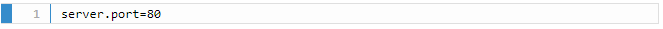

Após a inclusão, é necessário que o serviço do e-SUS APS seja reiniciado:
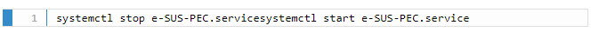

 É preciso ter o snapd instalado, caso ainda não o possua. Ele vem pré-instalado no Ubuntu 18, 20 e 21, e no Manjaro, dentre outros. Porém, se você utiliza ArchLinux, Debian ou Fedora, por exemplo, será necessário instalá-lo. A lista completa de distribuições que vêm ou não com snapd pré-instalado pode ser encontrada https://snapcraft.io/docs/installing-snapd. Neste link você também encontra as instruções para instalação em cada caso.

Com o snapd instalado, execute o comando abaixo:
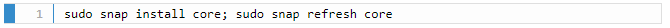

Se tiver algum pacote do Certbot instalado através de um gerenciador de pacotes do sistema (como apt, dnf ou yum), deverá removê-lo antes de prosseguir. O comando exato para fazer isso depende da sua distribuição Linux, mas exemplos comuns são:

- sudo apt-get remove certbot
- sudo dnf remove certbot
- sudo yum remove certbot

Se você já usou o Certbot no passado por meio do script certbot-auto, você também deve remover sua instalação seguindo as instruções na página https://certbot.eff.org/docs/uninstall.html.
   
Finalmente, instale o Certbot executando o comando abaixo:
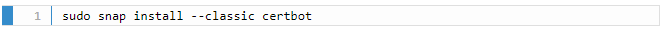

E então rode o comando a seguir para garantir que o Certbot poderá ser executado:
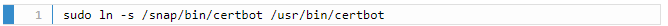

Por fim, execute-o por meio do comando e preencha as informações solicitadas:
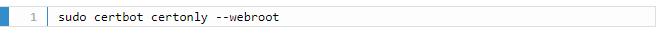

Obs: Através deste comando, solicitará o domínio que gostaria de inserir o protocolo, neste caso, é válido ressaltar que o Let's Encrypt não emite certificados para endereços IP simples, apenas nomes de domínio. Para estes casos, precisará registrar um nome de domínio para obter um certificado Let's Encrypt ou encontrar alguma outra certificadora que emita para endereços de IP simples.

3.1.3.3.1.2 Instalando o certificado SSL no LINUX

Uma vez que você já possui um certificado SSL, vamos armazená-lo em uma keystore. Primeiramente, navegue até a pasta de configuração do e-SUS APS:
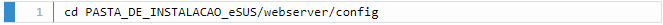

E então use o comando abaixo para importar o certificado e criar a keystore, substituindo:

- "CAMINHO_COMPLETO" pelo caminho completo até a pasta onde se encontra o certificado (/etc/letsencrypt se você criou o certificado seguindo este tutorial);

- "CERTIFICADO" pelo nome do arquivo; e

- "SENHA" pela senha que deseja utilizar para proteger a keystore.
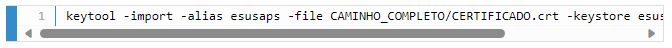

3.1.3.3.1.3 Parametrizando o certificado SSL (LINUX) no e-SUS APS

Agora, é necessário fazer com que o e-SUS APS utilize o certificado salvo na keystore. Em PASTA_DE_INSTALACAO_eSUS/webserver/config, modifique o arquivo application.properties, copiando as seguintes propriedades para o final do arquivo:

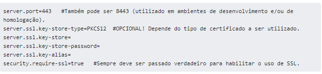

O significado de cada propriedade pode ser observado a seguir:

- server.port: A porta que representa o protocolo HTTPS; utiliza-se como padrão a porta 443. Também é possível utilizar a porta 8443 (para sinalizar desenvolvimento ou homologação).

- server.ssl.key-store-type: Indica o tipo de Key Store. Caso o tipo seja .p12 (como neste tutorial), é necessário manter esta propriedade e após o = indicar que é PKCS12. Mas, se o tipo for JKS, essa propriedade pode ser omitida.

- server.ssl.key-store: Este é o caminho relativo ao .jar da aplicação (pec-bundle.jar) de onde se encontra a Key Store. Por exemplo, se a Key Store estiver dentro da pasta config como sugerido nos últimos passos, utilizar: server.ssl.key-store=config/esusaps.p12

- server.ssl.key-store-password: Senha indicada no momento da criação da Key Store.

- server.ssl.key-alias: "Apelido" indicado no momento da criação da Key Store.

- security.require-ssl: Propriedade que indica ao Spring se desejamos fazer uso do protocolo SSL.

Após incluir essas propriedades no arquivo e salvá-lo, é necessário reiniciar o serviço do servidor:

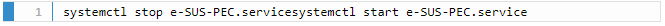

Agora, o certificado SSL já deve ter sido incluído na sua instalação do e-SUS APS! Para confirmar que o processo funcionou, acesse a URL da instalação em seu navegador e procure pelo ícone de cadeado na barra de endereço.

3.1.3.3.2 Como incluir um certificado SSL (HTTPS) no e-SUS APS [WINDOWS]

Neste caso, para que possamos gerar um certificado SSL através do próprio Let's Encrypt, precisamos nos atentar quanto:

- Necessidade de um DOMÍNIO, exemplo: www.municipio.esus.gov.br;
- Necessidade de um sistema operacional Windows 10, Windows Server 2019 (versão 1709) ou superiores;
- Liberação das portas 80 e 443;

 Caso você já possua uma certificadora, passe para a 
 seção 3.1.3.3.2.3 "Parametrizando o certificado SSL no e-SUS APS" no manual.

3.1.3.3.2.1 Gerando certificado SSL no WINDOWS

Caso ainda não possua um certificado SSL, mostraremos como obtê-lo usando o Certbot do Let's Encrypt, uma Autoridade Certificadora gratuita, automatizada e aberta, que fornece certificados digitais necessários para habilitar HTTPS em websites. O processo abaixo é destinado para instalações WINDOWS, porém, você poderá seguir o artigo Como incluir um certificado SSL (HTTPS) no e-SUS APS [LINUX] para instalações do tipo LINUX.

Caso já possua um certificado SSL, basta pular esta seção e ir para o item 3.1.3.3.2.2 "Instalando certificado SSL no WINDOWS".

Como o PEC vem configurado para o protocolo HTTP na porta 8080 por padrão e o Certbot precisa que o servidor esteja rodando na porta 80 para funcionar, será necessário alterar essa configuração do e-SUS APS. Em PASTA_DE_INSTALACAO_eSUS/webserver/config, modifique o arquivo application.properties para adicionar a seguinte linha:

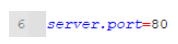

Após a inclusão, é necessário que o serviço do e-SUS APS seja reiniciado:

Figura 3.1.8 - Tela dos serviços do Windows para reinicio da aplicação

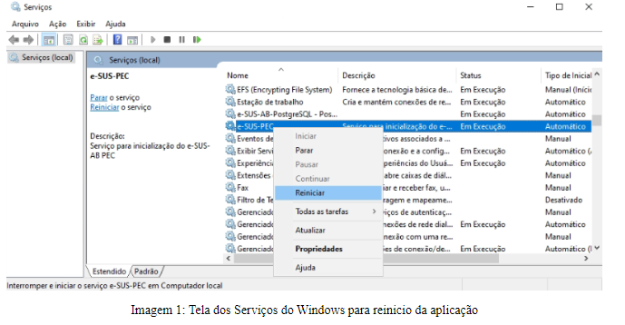

SAPS/MS

Será necessário os seguintes pré-requisitos:

- Computador com Windows 10 ou superior instalado;
- e-SUS APS PEC rodando na porta 80, conforme informado anteriormente;
- e-SUS APS PEC com um domínio parametrizado, exemplo: esus.municipio.gov.br;

3.1.3.3.2.2 Instalando o Certbot

O primeiro passo é instalar o CertBot no Windows (https://certbot.eff.org/instructions?ws=other&os=windows), que faremos através do próprio GitHub do CertBot. 

1. Poderá fazer o download acessando https://github.com/certbot/certbot/releases/latest/download/certbot-beta-installer-win_amd64_signed.exe.

2. Execute o instalador baixado, clique em NEXT, selecione o diretório de instalação e prossiga até finalizar;

3. Após a instalação do CertBot, pare o serviço do e-SUS APS PEC acessando a parte de "serviços" do Windows:

Figura 3.1.9 - Tela dos serviços do Windows

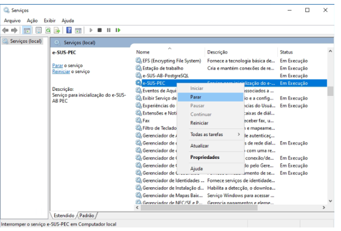
SAPS/MS

4. Abra o PowerShell do Windows em modo Administrador:

Figura 3.1.10 - Tela do menu de pesquisa do Windows para abertura do PowerShell

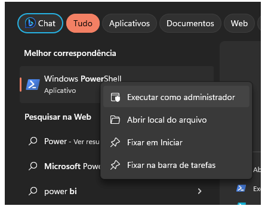
SAPs/MS

5. No console do PowerShell, você digitará a seguinte informação:

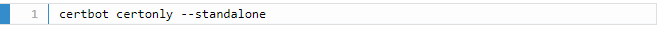

- Após a execução, ele solicitará para que você coloque um e-mail que será o responsável pela parametrização.
- Será solicitado o aceite dos termos do Certbot, bastando pressionar "Y" para yes;

6. Após as parametrizações acima, ele questionará qual o nome do seu domínio, exemplo: "esus.bridge.ufsc.br";

Figura 3.1.11 - Tela do PowerShell para inserir o dominio que deseja colocar o SSL/HTTPS

SAPS/MS

7. Após a inserção do domínio, caso dê sucesso, aparecerá a seguinte mensagem:

    • Qualquer tipo de problema identificado nessa parte, verifique as portas de conexão do seu servidor (80, 8080, 8443, 443);

Figura 3.1.12 - Tela do PowerShell informando sucesso ao gerar certificados

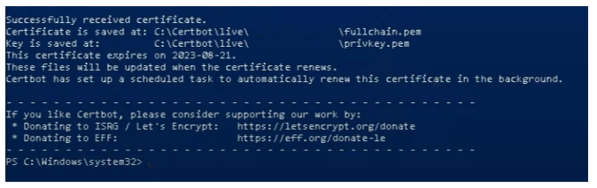
SAPS/MS

8. Ele gerará 4 arquivos no diretório abaixo:

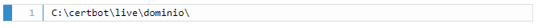

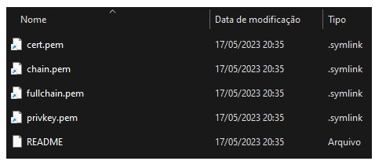

9. Ainda no PowerShell, execute o comando abaixo:

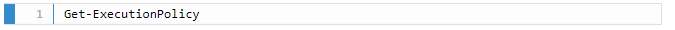

- Caso apareça "RESTRICTED", você deveria ter rodado o seguinte comando:

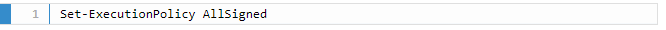

10. Após os comandos acima, instale o "chocolatey" através do seguinte comando:

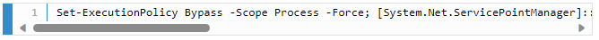

Figura 3.1.13 - Tela do PowerShell com o comando para instalar o Chocolatey

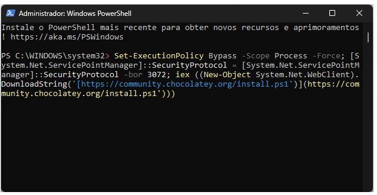
SAPS/MS

11. Instalado o "chocolatey", instalaremos o openssl através do seguinte comando:

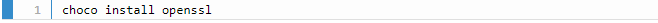

12. Depois de finalizar a instalação do openssl, você deverá fechar o PowerShell e abrir novamente em modo Administrador.

13. Navegue, pelas linhas de comando, até a pasta que seus arquivos .pem estão, neste caso, podendo utilizar o seguinte comando:

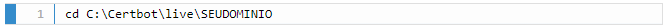

• Lembre-se de trocar a última pasta para aquela de seu domínio;

14. Já dentro da pasta, você digitará o comando para gerar a sua keystore através dos arquivos .pem:

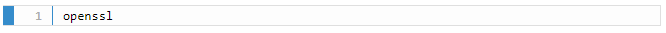

15. Após digitar, aparecerá a informação de "OpenSSL >". Insira então a seguinte linha:

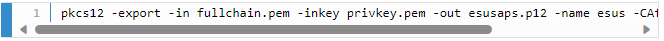

16. Insira uma senha, anote-a que você utilizará posteriormente.

17. O certificado .p12 será criado na mesma pasta do Certbot. Copie o arquivo .p12 e coloque na pasta "config" do e-SUS APS PEC.

18. Após inserir o arquivo na pasta config, abra o arquivo application.properties novamente para parametrizarmos no PEC.

3.1.3.3.2.3  Parametrizando o certificado SSL (WINDOWS) no e-SUS APS

Uma vez que você já possui o arquivo .p12 armazenado em uma keystore, agora, é necessário fazer com que o e-SUS APS utilize o certificado salvo na keystore. Em C:\Program Files\e-SUS\webserver\config\, modifique o arquivo application.properties, copiando as seguintes propriedades para o final do arquivo:

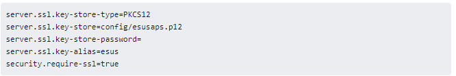

É válido lembrar que você deverá colocar a SENHA parametrizada no passo 14 do openssl. Lembre de alterar também a porta do servidor que parametrizamos no início, de 80 para 443:

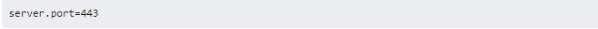

O significado de cada propriedade pode ser observado a seguir:

- server.port: A porta que representa o protocolo HTTPS; utiliza-se como padrão a porta 443. Também é possível utilizar a porta 8443 (para sinalizar desenvolvimento ou homologação).

- server.ssl.key-store-type: Indica o tipo de Key Store. Caso o tipo seja .p12 (como neste tutorial), é necessário manter esta propriedade e após o = indicar que é PKCS12. Mas, se o tipo for JKS, essa propriedade pode ser omitida.

- server.ssl.key-store: Este é o caminho relativo ao .jar da aplicação (pec-bundle.jar) de onde se encontra a Key Store. Por exemplo, se a Key Store estiver dentro da pasta config como sugerido nos últimos passos, utilizar: server.ssl.key-store=config/esusaps.p12

- server.ssl.key-store-password: Senha indicada no momento da criação da Key Store.

- server.ssl.key-alias: "Apelido" indicado no momento da criação da Key Store.

- security.require-ssl: Propriedade que indica ao Spring se desejamos fazer uso do protocolo SSL.

Após incluir essas propriedades no arquivo e salvá-lo, é necessário reiniciar o serviço do servidor. Pronto, o certificado SSL já deve ter sido incluído na sua instalação do e-SUS APS! Para confirmar que o processo funcionou, acesse a URL da instalação em seu navegador e procure pelo ícone de cadeado na barra de endereço.

## 3.1.4 Municípios e Responsáveis

Desde a versão 4.0 do sistema e-SUS APS com PEC, o **administrador da instalação** pode configurar a instalação para ser utilizada por mais de um município ou com o distrito federal. Para adicionar outros municípios ou o distrito federal é necessário incluir um responsável municipal/distrital, que deverá ativar a instalação do seu município/distrito federal.

O Distrito Federal ou os Municípios ativos na instalação compartilham apenas os dados de cadastro e prontuário de cidadão que foram cadastrados na instalação ou que foram enviados para ela.

Para adicionar responsáveis municipais/distrital (**administradores municipais**), selecione no campo "Município" o distrito federal/município e no campo "Responsável" um profissional da base local, conforme a Figura 3.1.7:

Figura 3.1.9 - Lista de responsáveis (administradores municipais)

Fonte: SAPS/MS

Para concluir, clique em "Salvar". O perfil de administrador municipal será listado no acesso do responsável municipal recém adicionado.

{: .nota }
Só é possível habilitar um responsável municipal para cada município/distrito federal, sendo que esse usuário receberá o **perfil de administrador municipal** no PEC.

## 3.1.5 Configurações Avançadas

Na aba "Configurações avançadas", o **administrador da instalação** pode alterar o número de requisições simultâneas que podem ser processadas pelo sistema, conforme figura 3.1.10. Essa opção é utilizada para gerenciar a performance do sistema em casos peculiares.

Figura 3.1.10 - Performance - Número de requisições simultâneas processadas

Fonte: SAPS/MS

{: .nota }
A alteração do número de requisições pode prejudicar o desempenho do sistema, entre em contato com o suporte do e-SUS APS para mais informações acessando o Portal de Suporte por meio do link: [http://esusaps.bridge.ufsc.br](http://esusaps.bridge.ufsc.br/pt-BR/support/home).

<!-- ## 3.1.6 Unificação de base

A unificação de bases objetiva viabilizar a unificação de bases de dados descentralizadas em uma única estrutura global e centralizada, para que estabelecimentos de saúde (UBSs), possam consolidar e implementar o conceito de PEC Municipal e viabilizar a estrutura de Prontuário Eletrônico Único do Cidadão em todo o município! Desta maneira, aonde quer que o cidadão seja atendido, seu histórico clínico o acompanhará, para continuidade do cuidado e tomadas de decisão rápidas e certivas por parte da equipe médica que conduzirá o seu atendimento.

O Administrador Municipal deverá acessar a instalação com sua respectiva credencial de acesso, e clicar na aba lateral "Configurações da instalação". Ao clicar em "Unificação de base", o sistema apresentará as opções abaixo:

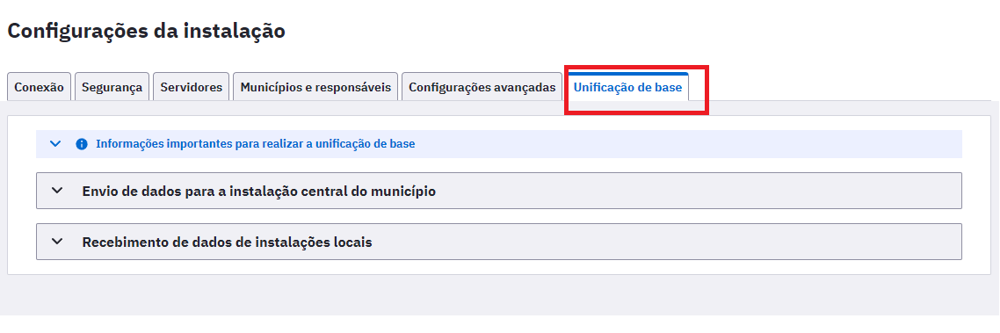

Em **Informações importantes para realizar a unificação de base**, o Administrador Municipal terá acesso as premissas necessárias para realização da unificação de bases entre as instalações PEC de origem e destino:

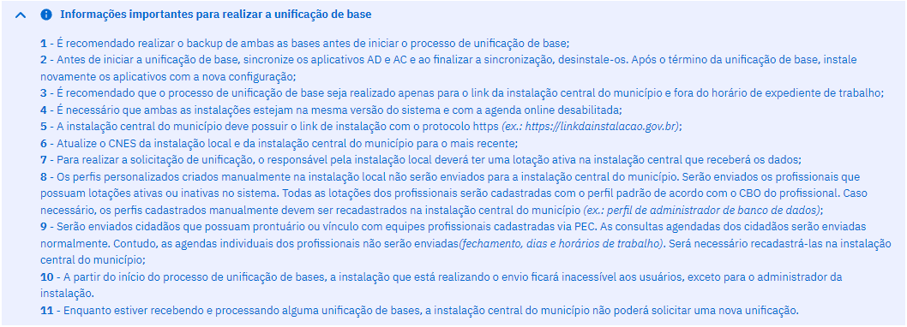

Uma vez cumprida as premissas técnicas, a base descentralizada deverá clicar em 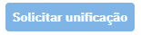 e aguardar a instalação principal aceitar a unificação das bases!

Importante salientar que os campos **nome da minha instalação**, **link da instalação central** e **senha**, deverão ser devidamente preenchidos. 

OBS1.: O **Link da instalação central**, corresponde ao DNS da aplicação central que recepcionará as bases de dados e realizará a unificação!

OBS2.: Não é possível solicitar uma unificação de bases enquanto houver outra em andamento. É necessário finalizar todos os recebimentos para poder realizar uma solicitação.

OBS3.: Ao unificar a sua base com a instalação central do município, seu sistema será desativado e o novo link de acesso esus APS será repassado pelo administrador da instalação central.

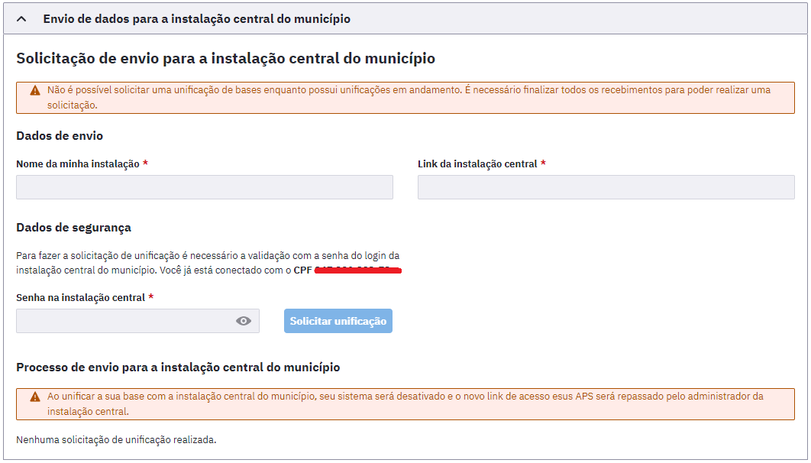

Na instalação principal, o administrador da instalação principal deverá **Aceitar** ou **Negar** a solicitação do requisitante e em seguida, aguardar o término da unificação, que poderá variar de acordo com o tamanho da base de dados do estabelecimento de saúde.

Após realizada a unificação, repasse o novo link de acesso da instalação PEC aos profissionais de saúde da unidade e valide o êxito da operação! Se houver necessidade, execute o restore da base de dados e acione o suporte técnico para maiores informações! Canal do suporte: https://esusaps.freshdesk.com/

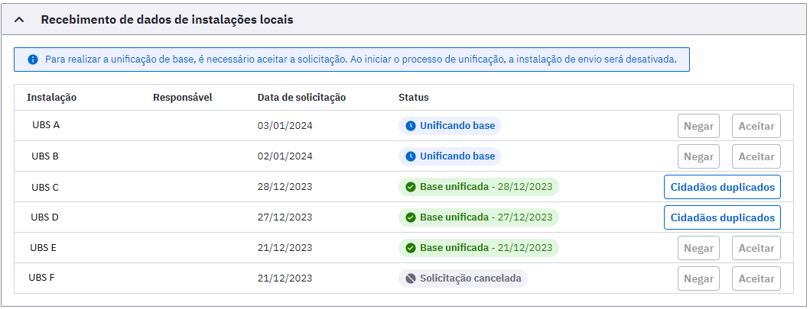 -->

# 3.2 CBO

O módulo CBO é utilizado pelo **administrador municipal** para controlar, por meio do código da Classificação Brasileira de Ocupações (CBO), o tipo de **profissional que poderá ser lotado em uma unidade** e o **tempo de atendimento** de cada um, quando for o caso.

Esta configuração já vem pré definida com uma configuração-padrão, no entanto pode ser alterada conforme a necessidade do município.

Para ter acesso à lista de CBOs e suas configurações, basta acessar o módulo e clicar em "CBO". Será apresentada a lista dos códigos da CBO disponíveis e o *status* de cada categoria, conforme a Figura 3.2.1

Use a opção de pesquisar para localizar o CBO pelo nome ou código desejado. Ainda é possível localizar os CBOs não disponíveis para lotação clicando no box "Mostrar CBOs indisponíveis para lotação" (Figura 3.2.1).

Figura 3.2.1 - Lista de CBOs

Fonte: SAPS/MS

## 3.2.1 Editar CBO

Para editar algum CBO, siga os passos:

1.clique no ícone "Editar"  do CBO desejado para criar o intervalo de agendamento entre as consultas;

2.Clique em "Mais opções"  e marque o campo "**Indisponível para lotação**" se o município não possui profissional com aquele CBO para lotação dos profissionais.

3.Também é possível disponibilizar um CBO previamente indisponível. Para isso, marque a opção "Mostrar CBOs indisponíveis para lotação", Clique em "Mais opções"  e "Disponibilizar para lotação";

4.clique no botão "Salvar"  para concluir.

# 3.3 CNES

Esta funcionalidade permite a importação dos dados do Sistema de Cadastro Nacional de Estabelecimentos de Saúde (SCNES), por meio do arquivo XML, disponibilizado na área do gestor no site do e-GESTOR AB [https://egestorab.saude.gov.br/](https://egestorab.saude.gov.br/). Tanto o **administrador da instalação** quanto o **administrador municipal** podem importar o arquivo CNES no sistema.

Desde a versão 5.0 do Prontuário Eletrônico do Cidadão (PEC), a geração do XML para importação no PEC, não é mais feita via <b>Portal CNES</b>, devendo ser feita exclusivamente via e-GESTOR AB, utilizando o perfil de Gestor Municipal de Saúde, conforme seguem as etapas abaixo:

{: .atencao }
Toda vez que houver uma atualização dos dados no SCNES, deve-se gerar um novo arquivo para importação no sistema e-SUS APS.

1\. Acessar o e-GESTOR AB no seguinte endereço eletrônico: [https://egestorab.saude.gov.br](https://egestorab.saude.gov.br/). O Gestor Municipal deverá se autenticar utilizando suas credenciais GOV.BR, para acesso ao serviço:

2\. No painel "Gestor Municipal", o responsável deverá clicar em "XML-ESUS-APS" e em seguida, escolher um dos dois tipos de XML disponíveis: <b>XML v.2.1 e XML v.3.0.</b> A versão 3.0 é compatível apenas com versões iguais ou superiores ao PEC 5.0:

  

Fonte: SAPS/MS

3\. Na animação abaixo, é possível visualizar a geração do XML para PEC:

Fonte: SAPS/MS

Após carregar (*download*) o arquivo XML gerado no e-GESTOR AB, é possível importá-lo por meio dos seguintes passos:

1\. na tela inicial, clique na opção "CNES" ;

2\. será apresentada a tela "Importação de CNES", conforme a Figura 3.2.2;

3\. clique no botão "Clique para importar ou arraste os arquivos" e localize o arquivo XML gerado pelo CNESNet, ou arraste o arquivo para essa área. Para o **administrador da instalação**, é necessário selecionar o município antes;

4\. em seguida, clique no botão \"abrir\" e aguarde até que todos os dados sejam importados;

5\. Ao concluir a importação, a mensagem de \"Importação Concluída\" será exibida no sistema. Basta clicar OK para finalizar.

Ao carregar os dados do arquivo XML no Sistema e-SUS APS, todas as informações de profissionais, unidades e equipes serão salvas no sistema. Com a importação do arquivo concluída, o sistema disponibiliza, por meio da opção "Histórico de Importações", um relatório sintético sobre os itens importados, similar à Figura 3.2.3, para cada importação feita no sistema. O relatório pode ser acessado clicando no botão  "Visualizar", correspondente à data da importação, como podemos ver na Figura 3.5.

Figura 3.2.1 - Tela de importação do CNES

Fonte: SAPS/MS

Figura 3.2.2 - Modelo do relatório de profissionais com mais de uma lotação que não tiveram agenda configurada.

Fonte: SAPS/MS

{: .atencao }
[**ATENÇÃO**] O relatório de importação traz dados importantes sobre a consistência dos cadastros realizados no CNES em relação aos dados necessários para um bom funcionamento no sistema, portanto, é altamente recomendado que seja analisado antes de prosseguir.

Figura 3.2.2 - Modelo do relatório de registros não importados.

Fonte: SAPS/MS

Figura 3.2.2 - Modelo do relatório registros importados.

Fonte: SAPS/MS

# 3.4 Unidades de Saúde

Os dados sobre os estabelecimentos (unidades de saúde) usados pelo sistema, como vimos na seção 3.2, são importados do SCNES, via XML, portanto todos os estabelecimentos devem estar devidamente cadastrados e atualizados no SCNES do seu Município/Distrito Federal e enviados para a base nacional.

Para ter acesso à lista das unidade, conforme a Figura 3.4.1, o **administrador municipal** deve clicar em "Unidades de Saúde".

Figura 3.4.1 - Lista de unidades de saúde

Fonte: SAPS/MS

{: .atencao }
todos os dados das unidades de saúde utilizadas pelo Sistema e-SUS APS são provenientes do CNES, portanto é importante sempre manter as informações atualizadas no SCNES, a fim de evitar erros de validação das informações enviadas ao SISAB.

Todas as informações principais da unidade de saúde vem do SCNES e, portanto, não podem ser alteradas no Sistema e-SUS APS. Ao clicar na lupa conforme a Figura 3.4.1 é possível visualizar as informações de cada unidade de saúde importadas pelo SCNES para o sistema. A seguir veremos quais são essas informações. 

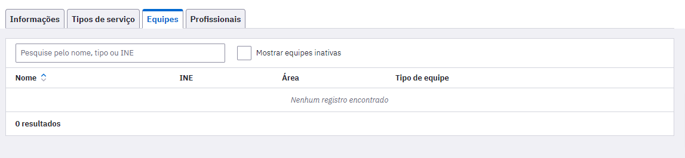

## 3.4.1 Informações

Nesta seção é apresentada as informações gerais do estabelecimento de saúde assim como o seu dados de contato.

## 3.4.2 Tipos de Serviço

Nesta seção são importados de forma automática do SCNES os tipos de serviços cadastrados neste sistema e que são ofertados pelos estabelecimentos de saúde. 

## 3.4.3 Equipes

Da mesma forma que os dados das unidades de saúde, os dados das equipes são importados por meio do arquivo do SCNES, onde estão disponíveis o código do Identificador Nacional de Equipe (INE) e o número da área sob responsabilidade da equipe.

Para visualizar as informações das equipes:

1.clique na opção "Equipe"  da unidade de saúde desejada;

2.será apresentada a importação da lista das equipes cadastradas no CNES da unidade de saúde selecionada. Nesta seção é apresentando o tipo de equipe, o número do INE, o código da área/equipe e nome da equipe. Todas que aparecerem na listagem estão ativas. Para visualizar as inativas clique no box "Mostrar equipes inativas" (Figura 3.4.2);

3.para acessar mais detalhes sobre as equipes, clique na opção "Visualizar"  da equipe desejada.

Figura 3.4.2 - Visualizar dados das equipes

Fonte: SAPS/MS

{: .dica }
Mantenha as informações de Área e Equipe (INE) responsável pelo território corretamente vinculadas e atualizadas no CNES, pois estas informações são utilizadas nos relatórios do sistema e também auxiliam no processamento e controle de acesso quando a equipe (INE) responsável pela área for alterada.

## 3.4.4 Profissionais

Nesta seção são apresentados os profissionais que estão lotados nas equipes e nos estabelecimentos de saúde. Esses dados também são provenientes do SCNES. Na primeira tela aparecerão todos os profissionais com lotação ativa. Caso queira visualizar profissionais sem lotação ativa clique no box "Mostrar profissionais sem lotação ativa". 

Nesta seção é informado o nome, CNS, CPF e CBO do profissional. Para visualizar mais clique na lupa  e para mais opções clique em .    

# 3.5 Profissionais (Usuários do Sistema)

O módulo "Profissionais" está disponível para os perfis de **administrador da instalação** e **administrador municipal** e concentra uma série de funcionalidade importantes para o bom funcionamento do sistema. Por meio dele, será possível:

- gerenciar os profissionais/usuários do sistema;

- gerenciar as lotações de cada profissional nas unidades de saúde;

- gerenciar a agenda dos profissionais (como coordenador);

- gerenciar as permissões de acesso.

Para ter acesso à lista de profissionais, basta acessar o sistema com o perfil de **administrador da instalação** ou de **administrador municipal** e clicar em "Profissionais". Será apresentada a lista dos profissionais importados via XML do SCNES, ou excepcionalmente cadastrados na aplicação, conforme a Figura 3.4.1

Figura 3.5.1 - Lista de profissionais do sistema

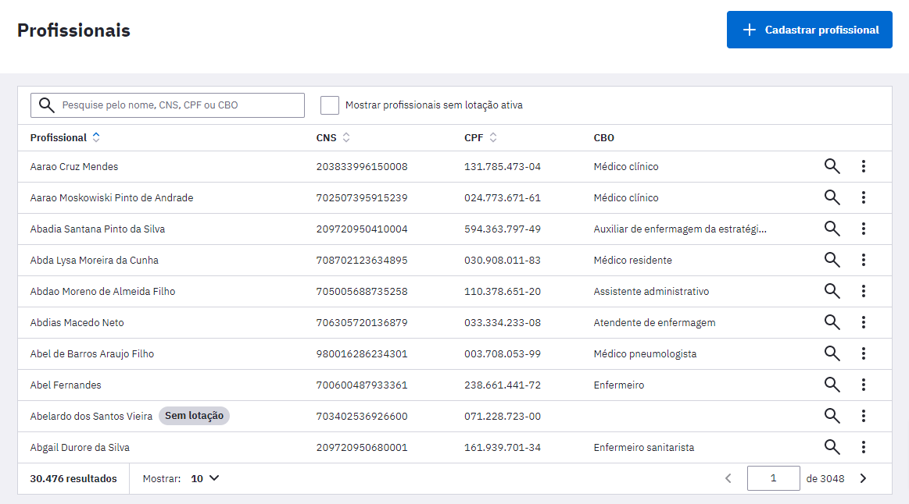

Fonte: SAPS/MS

## 3.5.1 Cadastrar Profissional/Usuário do Sistema

A lista de usuários do sistema é controlada pelo módulo dos "Profissionais" do sistema. Ou seja, todos os profissionais ativos têm acesso ao sistema e-SUS APS usando o CPF e senha pessoal.

{: .dica }
**Evite utilizar esta funcionalidade para cadastrar profissionais de saúde** que registram os atendimentos e ações de saúde por meio do sistema e-SUS APS. Se esses profissionais não estiverem inscritos no SCNES ao enviar os dados para o SISAB os dados de atendimentos serão invalidados por inconsistências no CNES, ou seja, serão rejeitados pelo SISAB caso o cadastro do profissional não seja atualizado antes do fechamento da competência.

Para cadastrar um profissional/usuário do sistema, siga os passos:

1\. clique no botão "Cadastrar profissional";

2\. preencha o formulário com as informações do profissional, conforme a Figura 3.5.2, e clique em "Salvar".

Figura 3.5.2 - Cadastrar profissional/usuário do sistema

Fonte: SAPS/MS

O bloco **Endereço Residencial** utiliza a base de endereços da Empresa Brasileira de Correios e Telégrafos. Ao incluir um **CEP**, o sistema automaticamente preenche os campos Estado, municípios, bairro e logradouro. Caso o bairro ou logradouro não esteja disponível na base dos Correios, é possível editar esses campos manualmente.

Ao finalizar o cadastro informe ao usuário do sistema e-SUS APS que o login será o CPF e a senha o número do CNS acrescido da palavra esus. Caso o usuário do sistema não possua o CNS a senha será o CPF acrescido da palavra esus. No primeiro acesso desse usuário o sistema solicitará a mudança de senha.

## 3.5.2 Desbloquear ou Redefinir Senha do Usuário

Como observado no tópico 3.1.2, quando o número de tentativas de *login* realizadas pelo usuário do sistema atingir a quantidade configurada o acesso deste profissional será bloqueado, como mostra a imagem abaixo.

Figura 3.5.3 - Aviso de bloqueio de acesso por tentativas sem sucesso.

Fonte: SAPS/MS

Quando houver profissionais com acesso bloqueado por tentativa de login sem sucesso, estes serão apresentados na cor vermelha na lista de profissionais no módulo de administração como mostra a imagem a seguir.

Figura 3.5.4 - Apresentação de profissionais com bloqueio de acesso por tentativas sem sucesso.

Fonte: SAPS/MS

O **desbloqueio de senha** pode ser realizado pelo **administrador da instalação** ou **administrador municipal** ou ainda pelo **gerente da UBS** clicando em "Mais opções"  e "Desbloquear e redefinir senha". Após esta ação, será solicitada a confirmação da ação como a imagem abaixo:

Figura 3.5.5 - Tela de confirmação de desbloqueio e redefinição de senha.

Caso seja necessário **redefinir** a senha de um usuário, conforme vimos na Seção 1.3.2, esta ação poderá ser realizada usando a opção \"Redefinir Senha\".

Para redefinir a senha de um usuário, siga os passos:

1\. Localize o profissional na qual a senha será redefinida, caso necessário, utilize a opção de filtro para encontrar o nome do profissional;

2\. clique em "Mais opções"  e em \"Redefinir Senha\", o sistema solicitará confirmação;

3\. Será exibida a tela abaixo, para que o gestor possa compartilhar o link ou QR CODE, para que o profissional possa cadastrar uma nova senha:

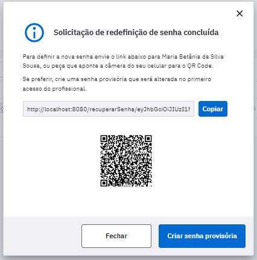

{: .dica }
Evite utilizar esta funcionalidade sem que o profissional solicite, pois isso poderá gerar insegurança no uso do sistema.

Caso necessário, o gestor poderá cadastrar senha temporária para que o profissional possa alterá-la no primeiro acesso:

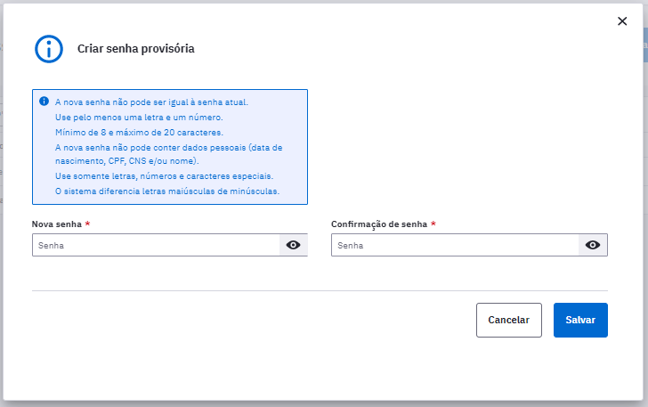

## 3.5.3 Lotar um Profissional

Assim como a lista de profissionais, as lotações também são importadas por meio do XML gerado pelo SCNES, no entanto é possível alterar os dados, caso seja necessário.

{: .atencao }
todas as informações no sistema e-SUS APS que estiverem desatualizadas ou com inconsistência em relação ao SCNES não serão validadas, portanto evite criar ou alterar lotação do profissional manualmente, prefira fazê-lo, sempre que possível, pelo SCNES. As lotações criadas manualmente não são alteradas nem desativadas automaticamente com a importação do XML, é necessário selecionar a opção "Atualizar perfis ao importar CNES" ao cadastrar a lotação.

Para acessar a lotação de um profissional, basta clicar em "Visualizar"  em um dos profissionais das lista. Em seguida, será apresentada a lista das lotações previamente cadastradas do profissional escolhido no final da página, conforme a Figura 3.5.6.

Figura 3.5.6 - Lotações do profissional

Fonte: SAPS/MS

Para **adicionar** uma lotação o **administrador municipal**, deve clicar no botão "Cadastrar lotação" e seguir os seguintes passos:

1\. preencha o formulário com as informações gerais da lotação do profissional, como Unidade de saúde, o número do INE, se houver, CBO e Perfis (Figura 3.5.7);

2\. Selecione a opção "Atualizar perfis ao importar CNES" caso deseje que a importação do arquivo XML desative ou altere a lotação;

3\. selecione o(s) "Perfil(is)" do profissional (coordenador, médico, recepcionista etc.);

4\. para excluir as informações, clique no ícone  "Excluir". O registro de perfil será removido;

5\. após o preenchimento dos dados, clique no botão "Salvar" e, caso haja alguma inconsistência, o sistema mostrará mensagem na tela indicando os campos que deverão ser corrigidos.

Figura 3.5.7 - Cadastrar lotação do profissional

Fonte: SAPS/MS

Para **editar** uma lotação, na lista de lotações (Figura 3.5.6), clique na opção "Editar"  da lotação desejada. Serão apresentadas as informações da lotação, edite-as conforme necessário, e clique no botão "Salvar".

Para **excluir** ou **inativar** uma lotação, clique em "Mais opções"  e em "Excluir" ou "Inativar" a lotação desejada. Será solicitada a confirmação desta exclusão.

## 3.5.4 Perfil de Acesso dos Profissionais

Como vimos na Figura 3.5.7, ao adicionar a lotação de um profissional, também é definido o seu perfil de acesso, por meio da opção "Perfis".

{: .nota }
o sistema já define o perfil de acesso dos profissionais de saúde com perfis-padrão definidos com base na informação do CBO importado do SCNES, no entanto todos os perfis e/ou recursos podem ser alterados conforme a necessidade local.

Para definir o perfil de acesso do profissional para determinada lotação, basta seguir os passos:

1\. acesse a lotação desejada por meio da opção \"Editar\" ou \"Cadastrar lotação\", caso ela ainda não exista;

2\. na opção \"Perfis\", selecione o(s) perfil(is) desejado(s), de acordo com a necessidade local.

3\. por fim, clique em "Salvar" para concluir.

## 3.5.5 Definir Agenda dos Profissionais

Para definir a agenda de trabalho de um profissional da unidade de saúde, **o gerente de unidade de saúde** deve acessar a lista de profissionais e em seguida a lotação do profissional. [**Esta etapa é fundamental para realizar o agendamento dos cidadãos para as consultas**]

{: .nota }
a agenda do profissional de saúde **que possuir apenas uma lotação** é definida por padrão pelo sistema, por meio do horário-padrão definido no sistema, caso seja necessário ajustar, clique em "Mais opções"  e "Editar configuração de agenda".

{: .nota }
somente o perfil de **gerente/coordenador da unidade de saúde** poderá alterar ou definir a agenda dos profissionais de saúde que realizam atendimento.

Para ativar a agenda de um profissional, siga os passos:

1\. No módulo Profissionais localize o profissional que terá a agenda configurada. Na opção visualizar  encontre a lotação que terá a agenda ativada;

2\. clique em "Mais opções"  e "Criar configuração de agenda";

3\. preencha o horário inicial e final de cada período, para cada dia da semana desejado, conforme a necessidade, ou clique na opção "horário-padrão" para que o sistema preencha automaticamente a agenda com o horário padrão de agendamento configurado na instalação. Ao selecionar a caixa "Mostrar fim de semana", serão mostrados o sábado e o domingo;

4\. Após a definição dos horários da agenda, clique em "salvar".

Figura 3.5.9 - Definir a agenda do profissional

Fonte: SAPS/MS

## 3.5.6 Fechamento de Agenda do Profissional

Para definir a(s) data(as) na qual a agenda do profissional estará fechada, o usuário, com perfil de **gerente/coordenador**, deverá seguir seguintes passos:

1\. localize na lista de lotações a qual será adicionado um fechamento de agenda;

2\. clique em "Mais opções"  e "Visualizar fechamento de agenda";

3\. Preencha o formulário com a Data inicial e final do fechamento da agenda, bem como o motivo do fechamento que pode ser: atestado, curso, férias, licença, reunião ou outro (nesse caso, será necessário descrever o motivo no campo "Especifique");

4\. clique em "Adicionar" para concluir.

Figura 3.5.10 - Configuração de fechamentos da agenda

Fonte: SAPS/MS

## 3.5.7 Configurações Agenda Online

A funcionalidade de **Agendamento Online** foi desenvolvido conjuntamente entre o Departamento de Saúde da Família (DESF) e o Departamento de Informática do SUS (DATASUS), a fim de facilitar o acesso dos cidadãos ao atendimento na Atenção Primária à Saúde (APS). Dessa forma, foi realizado o desenvolvimento da ferramenta de Agenda Online no PEC e adequações no aplicativo "ConecteSUS Cidadão" para a efetivação desta funcionalidade.

Esta funcionalidade está disponível para as equipes de APS que utilizam o sistema e-SUS APS com PEC, desde a versão 3.1, e foi pensando levando em consideração avanços tecnológicos e no aumento de acesso constante da população brasileira a aparelhos de *smartphones*, dessa forma tendo acesso a aplicações *mobile*.

O Agendamento Online consiste na disponibilização de horários da agenda dos profissionais da APS para esse tipo de agendamento, entendendo que esta não deve ser a forma principal ou preferencial de agendamento nas equipes, sendo assim, a equipe deve definir quais serão os horários disponíveis para esse tipo de agendamento, considerando os agendamentos para cuidado continuado e outros tipos de agendamento a serem realizados diretamente na Unidade de Saúde ou para consultas de retorno. Além disso, permite o disparo de notificações "*push*" em com informações relacionadas ao agendamento realizado no PEC para o cidadão por meio do aplicativo "ConecteSUS Cidadão".

Para uso desta funcionalidade, é necessário que a unidade de saúde tenha boa conectividade com a internet, pois utiliza-se um servidor nacional para troca de informação entre a unidade de saúde e os cidadãos que utilizam o aplicativo "ConecteSUS".

Para que o cidadão possa acessar a agenda da equipe para agendamento de uma consulta é necessário que esse cidadão **possua um cadastro individual na equipe**. 

{: .nota }
Somente o cidadão com cadastro individual na equipe na qual é vinculada terá acesso a agendar um atendimento no aplicativo "Conecte SUS".

Para configurar a funcionalidade de Agenda Online no PEC, com perfil de **gerente/coordenação**, acesse o módulo "Profissionais", clique sobre "visualizar" no profissional que quer configurar a agenda online, e em seguida na lotação do profissional, clique em "Mais opções"  e "Criar configuração de agenda online". Após, serão apresentados todos os horários do profissional disponíveis para agendamento. Nesta tela é possível selecionar horários para disponibilizar para agendamento online a ser realizado pelos cidadãos por meio do aplicativo "ConecteSUS" (Figura 3.5.11).

Figura 3.5.11 - Grade de horários disponíveis para agendamento

Para **habilitar** horários para o agendamento online pelos cidadãos, o perfil de  **gerente/coordenação** deve selecionar os horários (Figura 3.5.11). Para **desabilitar** horários para o agendamento online basta clicar novamente. Clique em "Salvar" para concluir.

{: .atencao }
Não é possível configurar o agendamento online para profissionais que são inseridos manualmente no PEC.

{: .nota }
A mudança de configuração da agenda pode ser realizada a qualquer momento, porém não altera os horários agendados previamente.

{: .dica }
Antes de realizar a configuração da Agenda Online realize uma conversa prévia com toda a equipe, para pactuação de estratégia de abertura desse formato de agendamento. A disponibilização de horários pode ser gradual. Atente-se para informar a população a baixar o aplicativo **ConecteSUS Cidadão** em seu dispositivo móvel e sobre essa possibilidade de agendamento.

## 3.5.8 Outras Opções do módulo Profissional

Para **visualizar** um profissional, clique na opção "Visualizar"  do profissional desejado. Serão apresentadas as informações do profissional escolhido (somente para visualização).

Para **editar** um profissional, clique em "Mais opções"  e "Editar" do profissional desejado. Serão apresentadas as informações do profissional previamente cadastradas em modo de edição. Altere-as caso necessário e clique no botão "Salvar".

Para **excluir** um profissional, clique em "Mais opções"  e "Excluir" no profissional desejado. Será apresentada uma mensagem solicitando a confirmação desta exclusão.

# 3.6 Perfis (de acesso)

Ao conjunto de definições para acesso aos recursos do sistema e-SUS APS é dado o nome de "perfil", ou seja, ao associar um profissional a um perfil, especifica-se, em regra geral, o que determinado profissional pode ou não acessar dentro do sistema. Cada perfil está associado a um conjunto de recursos do sistema, que podem estar ativos ou inativos a depender das atividades desenvolvidas pelo profissional.

Para ter acesso à lista de perfis disponíveis no sistema, basta acessar o sistema com o perfil de **administrador municipal** ou **gerente/coordenador** e clicar em "Perfis". Será apresentada a lista de perfis definidos (padrão e personalizado) (Figura 3.5.12).

Figura 3.5.12 - Lista de perfis do sistema

Fonte: SAPS/MS

## 3.6.1 Tipo de Perfil e tipo de acesso

O sistema agrupa o tipo de perfil por algumas categorias, de tal forma que, não é possível que um mesmo profissional misture funcionalidades em um mesmo tipo de acesso, separando funções administrativas ou de coordenação com funções de atendimento/consulta ao cidadão. Além disso, passa a definir explicitamente a categoria **Tipo de acesso**.

O tipo de acesso se divide em: **lotação**, **gestor municipal** e **gestor estadual**. Os tipos de acesso de gestor municipal e gestor estadual vinculam-se, respectivamente, aos perfis de gestor municipal e gestor estadual. Os demais perfis possuem lotação como tipo de acesso. Para atribuir o perfil de *gestor municipal* a um profissional, acesse no sistema e-SUS APS com PEC o módulo "Profissionais" com o perfil de **administrador municipal** e clique em "Cadastrar perfil". Outrossim, para atribuir o perfil de *gestor estadual*, acesse o sistema com o perfil de **administrador da instalação** clique no módulo Profissionais, em seguida "Cadastrar profissional". Após completar os dados solicitados, clique em cadastrar "Cadastrar Acesso". 

O Quadro 3.2 apresenta os tipos de perfis disponível no sistema.

Quadro 3.2 - Tipo de perfil no sistema

| **Perfil** | **Descrição** |
|- |- |
|Administração|Perfil exclusivo para fins de administração do sistema e, em geral, usado por   técnicos de informática.|
|Coordenação|Perfil com recursos de administração e coordenação da unidade de saúde.|
|Atendimento|Perfil com recursos de atendimento ao cidadão e funções de cuidado da população.|
|Gestor Municipal/Estadual|Perfil com recursos limitados de acesso, porém que permitem ao gestor acompanhar as ações do seu município/Estado por meio de relatórios.|

Fonte: SAPS/MS

## 3.6.2 Perfil Padrão

O sistema e-SUS APS com PEC oferece um conjunto de perfis-padrão no sistema de tal forma que seja fácil e rápido iniciar o uso do sistema sem uma configuração mais refinada das necessidades dos profissionais de saúde em cada unidade de saúde.

A lista de perfis-padrão foram determinadas por meio da avaliação de boas práticas de uma equipe de Atenção Primária. No entanto, considerando a grande diversidade e especificidades regionais, não devem ser tomadas como regras, mas apenas como referências para um conjunto de recursos.

Em [anexo](https://cgiap-saps.github.io/Manual-eSUS-APS/docs/PEC/Anexos/) a este manual apresentamos a lista de perfis-padrão do sistema e breve descrição de sua aplicação nas unidade de saúde, em funções gerenciais ou administrativas.

## 3.6.3 Perfil Personalizado

É possível editar os recursos dos perfis-padrão. Na migração para novas versões que possuam alterações nos perfis-padrão do sistema, os perfis-padrão editados receberão os novos recursos definidos na nova versão, e não terão recursos removidos.

Para definir perfis de acesso diferente dos perfis-padrão do sistema, o **administrador municipal** pode fazê-lo de duas formas:

- copiar; ou

- Cadastrar perfil.

Para **copiar** um perfil, basta seguir os passos:

1\. No módulo "Perfis" escolha um perfil e clique em "Mais opções" , em seguida, clique na opção \"Copiar\" e

2\. aparecerá uma lista de recursos, como na Figura 3.6.1, altere o \"Nome\" para poder indentificá-lo mais tarde e depois clique em "Salvar". Não é possível alterar o \"Tipo de acesso\".

Figura 3.6.1 - Cópia de perfil

Para **Cadastrar perfil**, basta seguir os passos:

1\. No módulo "Perfil" clique em "Cadastrar perfil" ;

2\. Aparecerá a tela conforme a Figura 3.6.2;

3\. No formulário, crie um novo \"Nome\" para o perfil para poder identificá-lo mais tarde e defina o \"Tipo de acesso\" que deseja;

5\. para concluir, clique em \"Salvar\".

Figura 3.6.2 - Cadastro de perfil

## 3.6.4 Editando os Recursos de um Perfil

Após adicionar ou copiar um perfil, é necessário editar os recursos conforme a necessidade local. Os recursos dos perfis-padrão também poderão ser editados. Para tal, siga os passos:

1\. Clique na opção "Editar"  do perfil desejado. Será exibida uma tela, conforme a Figura 3.6.3. Se for um perfil novo, os recursos estarão todos inativados . Na coluna dos \"Recursos\", será exibido o caminho de acordo com a navegação estrutural do sistema;

2\. Para autorizar uma ação no recurso, clique no símbolo , que será alterado para ;

3\. Para revogar a permissão de uma ação em um recurso, clique no ícone . O símbolo voltará ao seu padrão ;

4\. Os recursos de nível acima do selecionado e que estejam na mesma hierarquia serão autorizados automaticamente. O símbolo será alterado para .

Figura 3.6.3 - Lista de recursos do perfil

Fonte: SAPS/MS

## 3.6.5 Outras Opções do Perfil

Para **visualizar** um perfil, clique na opção "Visualizar"  do perfil desejado. Serão apresentadas as informações de identificação do perfil, apenas para leitura.

Para **editar** um perfil, clique em "Editar"  para o perfil desejado. Serão apresentadas as informações de identificação do perfil. Altere-as caso necessário e clique no botão "Salvar".

Para **excluir** um perfil, clique em "Mais opções"  e "Excluir" o perfil desejado. Será apresentada uma mensagem solicitando a confirmação desta exclusão.

{: .atencao }
só é possível excluir um perfil que não esteja em uso no sistema, ou seja, sem nenhum usuário associado a ele.

Para **inativar** um perfil, clique em "Mais opções"  e "Inativar" o perfil desejado. Será apresentada uma mensagem solicitando a confirmação desta inativação.

# 3.7 Rotina de Transmissão, Sincronização e Processamento de Dados

Na estrutura preconizada pelo Sistema e-SUS APS, recomenda-se o compartilhamento hierárquico das informações, onde a base maior alimenta a base menor em um processo de recuperação de informação.

É recomendado que uma instalação de PEC ou centralizador municipal processe os dados do Sistema e-SUS APS com CDS ou com PEC a serem enviados ao SISAB, de modo a garantir a sincronização da rede local e, por conseguinte, a gestão municipal das informações geradas na APS.

## 3.7.1 Rotina de Sincronização da Rede Municipal

Considerando os diversos cenários de implantação do sistema e-SUS APS, o cenário de base descentralizada é uma das que atendem os municípios. 

Entende-se por base descentralizada a instalação CDS e/ou PEC em unidades básicas de saúde (UBS) e/ou nas regionais/distritos de saúde.

Essa descentralização pressupõe uma estrutura de sincronização do sistema, entre a base local (UBS, regionais/distritos de saúde ou similares) e o PEC/centralizador municipal.

Independentemente do cenário de transmissão e da forma de envio - seja ela **via arquivo** (*off-line*) ou via internet (*on-line*), a sincronização das bases deve respeitar o fluxo de envio de informações ao SISAB (leia a Portaria que orienta os prazos para alimentação do SISAB referente ao ano corrente), ou seja, num período máximo de um mês entre a sincronia das bases.

## 3.7.2 Tipos de Registro: CAD, RAS e RAC

O Sistema e-SUS APS com PEC avança na perspectiva de eliminar os registros em fichas e formulários de papel. E com a oferta de ferramentas informatizadas adequadas ao processo de trabalho das equipes de APS. Os mesmos blocos que são consolidados no CDS são registrados individualmente no PEC.

Essa integração é estruturada para oferecer evolução gradual da capacidade de registro de informação, ao mesmo tempo em que deve atender ao SISAB. Neste contexto, o sistema possui diferentes documentos de troca de dados para atender às características particulares de cada sistema, gerando os seguintes documentos eletrônicos:

• **CAD:** gerado a partir dos dados de cadastro da APS, é um documento que permite compartilhar as informações de cadastro por cidadão, em especial para atender aos processos de importação de cadastros já consolidados em nível local, evitando-se, portanto, retrabalho;

• **RAS:** o Registro de Atendimento Simplificado é o conjunto essencial de informações gerado a partir dos eventos de saúde individualizados, que é transmitido para a base federal;

• **RAC:** o Registro de Atendimento Compartilhável, além das informações do RAS, agrega outras informações mais estruturadas, compondo a base de dados local do sistema com PEC, compatibilizando o sistema para o futuro compartilhamento de informações.

Portanto, os documentos RAS e RAC têm origem no bloco de informações de eventos de saúde individualizados.

## 3.7.3 Transmissão de Dados

O módulo "Transmissão de Dados" permite fazer o controle de envio e recebimento dos dados de uma aplicação. Conforme podemos ver na Figura 3.7.1, este módulo tem três funções básicas: configuração, envio e recebimento.

Figura 3.7.1 - Módulo "Transmissão de dados"

Fonte: SAPS/MS

### 3.7.3.1 Configuração de Envio dados

É por meio desta funcionalidade que o **administrador da instalação** deve inserir o *endereço eletrônico do servidor* para onde enviará os dados de produção da equipe de saúde. 

Os dados coletados a partir do sistema devem ser enviados a um centralizador na Secretaria Municipal de Saúde ou na Secretaria Estadual de Saúde. Desse modo, esses órgãos poderão realizar a gestão dos serviços públicos de saúde em sua área de atuação, a partir de relatórios agregados. 

De acordo com a demanda da gestão municipal ou estadual, poderão ser incluídos outros endereços para envio dos dados. O endereço eletrônico do Ministério da Saúde já está previamente configurado em uma instalação de produção, para que o Governo Federal faça a gestão dos serviços públicos de saúde em todo o território nacional. Além do link do Ministério da Saúde, os links dos centralizadores estaduais estão configurados automaticamente nas instalações municipais para os estados que formalizaram a solicitação via ofício ao Ministério da Saúde.

Para incluir novo endereço eletrônico de envio de dados, o usuário deverá clicar em "Adicionar instalação", preencher os campos "Nome da instalação" e "Endereço do servidor" e clicar em "Adicionar", conforme a Figura 3.7.2.

Figura 3.7.2 - Configuração de envio dos dados

Fonte: SAPS/MS

Para configurar o *link* de envio corretamente, siga os passos:

1\. Informe o nome de destino no campo "Nome da instalação", o qual refere-se ao nome do local para onde serão enviados os dados (Sugestão de nomes: Centralizador do Estado XX, Centralizador do Município XX). Insira no campo "Endereço do servidor" o endereço eletrônico do computador que receberá os dados, ou seja, a máquina que possui um PEC Centralizador, municipal ou estadual (exemplo: http://enderecoeletronico.municipio.gov.br:8080/esus).

**Observação**: O endereço eletrônico, quando mantida a configuração nativa do sistema, deve conter a porta de conexão "8080";

2\. Para testar a conexão com os servidores cadastrados, clique no botão "Testar conexão" para verificar a conectividade com os *links* cadastrados. Se o texto "Teste de conexão finalizado" for apresentado e o status da conexão mudar para "Estabelecida", então o link informado está correto e funcionando;

3\. Para editar as informações de um receptor, clique no botão "Editar" ;

4\. Para excluir um receptor, clique no botão "Excluir";

5\. para inativar o link de conexão com o servidor, clique em "Mais opções"  e "Inativar";

Vale contextualizar que, por padrão, toda instalação PEC realiza a transmissão automática para o Centralizador Nacional às **00:00 horas**, porém o administrador da instalação pode alterar esse horário por meio da opção "Horário de geração de lotes e processamento de fichas". Para a transmissão de dados da rede municipal de Atenção Primária de uma instalação CDS para PEC e/ou de um PEC para um ou mais centralizadores (regional distrital/municipal), será necessário inclusão do endereço eletrônico (*link*) para envio dos dados.

A transmissão, bem como a forma de envio via arquivo (*off-line*) ou via internet (*on-line*) de um Sistema com PEC ou centralizador municipal para o centralizador estadual, deve ser articulada entre Estados e municípios, onde o ente estadual fornecerá o endereço eletrônico (*link*) para inclusão dele na configuração de envio, caso o Estado não tenha enviado o ofício ao Ministério da Saúde solicitando a inclusão do seu link por padrão na aplicação, conforme dito anteriormente.

### 3.7.3.2 Envio

Esta funcionalidade permite ao administrador da instalação um melhor controle de envio das informações do sistema tanto para os *links* configurados como para envios manuais realizados por meio de arquivos, conforme podemos ver na Figura 3.7.3

Figura 3.7.3 - Controle de envio dos dados

Fonte: SAPS/MS

O envio dos dados é automático e está configurado para ocorrer entre **0h e 6h da manhã** (por padrão), assim como no processamento. Para isso, o **computador deve permanecer ligado e conectado à internet, sem suspender as atividades do sistema operacional**. Caso a UBS não tenha conexão à internet, é possível fazer instalação *off-line* tanto do PEC como do CDS. No entanto, é necessário ter ao menos uma versão *on-line* no município - em um Sistema com PEC ou um centralizador municipal - para envio das informações ao SISAB.

Para enviar os dados manualmente, basta seguir os passos:

1\. Acesse a aba "Envio", por meio do módulo "Transmissão de Dados";

2\. Conforme vimos na Figura 3.7.3, clique no botão \"Gerar novo lote\";

3\. O sistema solicita confirmação e prepara todos os dados que ainda não foram enviados em um lote de envio. Clique em \"Gerar lotes\" para concluir;

4\. Será incluído na lista novo item do lote de dados criado com os dados pendentes de envio;

5\. Para salvar um arquivo com os dados gerados no lote, clique na opção \"Salvar em Arquivo\"  e salve o arquivo no local desejado;

As transmissões de dados ocorrerão ao longo do dia e obedecerão a um agendamento automático do servidor do MS, com o objetivo de distribuir o fluxo e reduzir a concorrência no acesso. A transmissão de dados para outros servidores serão executadas conforme disponibilidade do servidor de destino.

O centralizador nacional agendará um novo horário de envio quando o usuário não conseguir realizar o envio manual. Este horário será informado instantaneamente pelo PEC na mesma tela de transmissão.

Para visualizar os detalhes de um lote gerado manualmente ou pelo sistema, basta clicar na opção \"Visualizar\" . Será exibida uma tela, conforme a Figura 3.7.4, com informações adicionais de controle de envio ou geração do lote. Por meio da tela de visualização do lote de envio dos dados, também é possível marcar o lote para início do envio automático.

Figura 3.7.4 - Visualizar detalhes do lote de envio dos dados

Fonte: SAPS/MS

### 3.7.3.3 Recebimento

Esta funcionalidade subdivide-se em "Recebimento por lote" e "Recebimento por CNES" conforme podemos ver na Figura 3.7.5

Figura 3.7.5 - Controle de recebimento dos dados

Fonte: SAPS/MS

#### 3.7.3.3.1 Recebimento por lote

Esta funcionalidade permite ao **administrador municipal** melhor controle de recebimento de informações enviadas ao sistema, tanto envios *on-line* quanto envios *off-line* (por arquivo).

Nesta situação chamamos de registro, um arquivo compactado que pode conter um ou mais atendimentos. O processamento dos registros acontece ao descompactar esse arquivo e acomodar as informações contidas neste registro no banco de dados do PEC.

Registros enviados para o sistema, seja de uma instalação CDS, seja de outra instalação PEC, ficam armazenados numa tabela, aguardando o período **entre 0h e 6h**, ou outro horário estabelecido pelo administrador da instalação, para realizar o **processamento automático** deles. Para isso, o computador deve permanecer ligado.

Para importar arquivos gerados em uma instalação CDS ou por uma instalação PEC, como vimos na seção anterior, basta clicar no botão \"Importar Arquivo\" e seguir os passos:

1\. Ao clicar no botão \"Importar ou arraste os arquivos \";

2\. Clique no botão "Selecionar arquivo" e selecione o arquivo gerado a partir do CDS, PEC ou outro sistema usando o modelo RAS. Ver Seção 3.6.2 para mais detalhes;

3\. O sistema exibirá uma mensagem de conclusão do processo;

4\. Volte na tela de controle de recebimento para mais detalhes;

5\. O sistema exibirá novo lote de fichas recebidas no sistema;

6\. Para gerar o relatório, basta clicar no botão "Imprimir relatório de inconsistências" . Será gerado o relatório em formato CSV conforme a Figura 3.7.6

O processamento dos registros também pode ser efetuado manualmente. Para processar os registros importados, clique na opção \"Processar todos\" para processar todos os lotes pendentes.

O relatório de inconsistência passa a ser visualizado por lote e permite ao administrador visualizar possíveis inconsistências nas informações importadas no sistema, por meio da opção "Importar Arquivo", como visto na seção anterior.

Figura 3.7.6 - Relatório de inconsistências

Fonte: SAPS/MS

#### 3.7.3.3.2 Recebimento por CNES

Esta funcionalidade permite a consulta dos registros recebidos por estabelecimento por meio do código do CNES e por mês de recebimento.

Para visualizar os detalhes das fichas recebidas para um CNES, basta clicar na opção \"Visualizar\" . Será exibida uma tela, conforme a Figura 3.7.7. Nesta tela, é possível ver a quantidade de fichas recebidas separadas por tipo e quantidade.

Figura 3.7.7 - Visualizar detalhes do lote por CNES

Fonte: SAPS/MS

#### 3.7.3.3.3 Relatório de Inconsistências

Esta funcionalidade permite a extração de relatórios de inconsistências das fichas enviadas e por lote. Para gerar o relatório, clique em "Gerar relatório de Inconsistências" que em seguida aparecerá a seguinte tela.

Para imprimir o relatório escolha o período de recebimento, e se necessário, o nome do responsável e o tipo de recebimento (Arquivo ou Online). O documento gerado é o mesmo apresentado na Figura 3.7.6.

## 3.7.4 Fluxo Recomendado na Transmissão de Dados

A seguir, apresentaremos os fluxos recomendados para transmissão de dados dentro do ambiente municipal até o SISAB (programado por padrão nas instalações PEC/centralizador) considerando cenários a partir de UBS não informatizada, UBS sem internet, UBS com internet e, também, da integração com sistemas próprios ao SISAB.

### 3.7.4.1 UBS não Informatizada

Para uma UBS não informatizada, onde apenas a Secretaria Municipal de Saúde (SMS) tem computador e internet, a melhor opção é a implantação do sistema CDS. Nesse caso, a SMS deve definir um fluxo - semanal, quinzenal ou outro - de encaminhamento e digitação das fichas preenchidas na UBS pelos profissionais. 

{: .nota }
O uso das fichas do CDS não substitui o registro no prontuário de papel na UBS.

Figura 3.7.8 - Fluxo de transmissão de dados para UBS não informatizada

Fonte: SAPS/MS

Essa digitação poderá ser feita por meio de instalação *off-line* do CDS (os dados deverão ser transmitidos, por arquivo ou internet, para um sistema com centralizador) ou *on-line* do PEC no módulo CDS.

### 3.7.4.2 UBS sem Internet

A UBS com, ao menos, um computador pode digitar as fichas na própria unidade. Os dados digitados são enviados à SMS por arquivo ou por conexão eventual, por exemplo, modem discado ou 3G. Este cenário também se aplica às equipes de APS que tenham acesso à internet em locais fora da UBS, como em telecentro, lan house etc.

{: .dica }
este cenário inicia o processo de descentralização da digitação das fichas da SMS para equipes de APS, permitindo o acompanhamento da digitação e qualidade das informações.

Figura 3.7.9 - Fluxo de transmissão de dados para UBS sem internet

Fonte: SAPS/MS

### 3.7.4.3 UBS com Internet

Numa UBS com mais de um computador com conectividade parcial ou contínua, é possível utilizar o PEC com instalação *off-line,* por meio de um servidor local, e complementarmente usar as fichas CDS nos pontos da unidade onde ainda não há computador, no processo de trabalho domiciliar dos ACS e no atendimento odontológico.

Figura 3.7.10 - Fluxo de transmissão de dados para UBS com internet

Fonte: SAPS/MS

{: .dica }
É possível implantar alguns módulos do PEC, por exemplo: agenda na recepção e atendimento pelo médico e enfermeiro.

### 3.7.4.4 Integração com Sistemas Próprios

Os municípios com sistema próprio de prontuário devem utilizar a tecnologia Thrift para que transmitam os dados cadastrais e clínicos (CAD+RAS) de seu sistema para uma instalação do tipo PEC ou centralizador municipal, que transmitirá os dados para o SISAB.

Figura 3.7.11 - Fluxo de transmissão de dados para integração de sistemas próprios com o SISAB

Fonte: SAPS/MS

## 3.7.5 Sincronização com Aplicativos para Tablet

O processo de sincronização dos aplicativos para *tablet* e *smartphones* do Sistema e-SUS APS com o PEC é realizado de forma automática, no entanto são necessários alguns requisitos:

1) o servidor local do PEC e o *tablet* ou *smartphones* devem estar conectados por uma rede sem fio, para que os mesmos possam acessar o servidor durante a sincronização;

2) o usuário/profissional que irá usar o *tablet* deve estar cadastrado no sistema (servidor local).

## 3.7.6 Relatórios

O módulo Relatórios pode ser acessado pelo **administrador da instalação**, com a finalidade de gerenciar a disponibilidade de recursos para a geração de relatórios no sistema. Dessa forma, pode-se evitar sobrecarga na infraestrutura. O módulo subdivide-se em Configuração de impressão e Processamento.

### 3.7.6.1 Configuração de impressão

Para evitar que consultas muito grandes criem uma carga exagerada no servidor da aplicação, é possível configurar o fator que determinará quantos grupos de informação podem ser selecionados e qual período pode ser filtrado em cada relatório, conforme a figura 3.7.12.

Figura 3.7.12 - Controle de impressão

Após informar o fator para o relatório desejado, clique em Salvar.

### 3.7.6.2 Configuração de impressão

O processamento das fichas e a geração de lotes ocorrem no horário padrão (ou em outro configurado pelo administrador da instalação) ou a qualquer momento por meio da funcionalidade "Gerar", em "Transmissão de dados", conforme figura 3.7.13.

Esse processamento pode ser forçado para atualização dos relatórios por meio da funcionalidade "Processamento".

Figura 3.7.13 - Processamento de Relatórios

Fonte: SAPS/MS

Para forçar o processamento, é necessário clicar em "Marcar para processamento", aguardar o andamento e clicar em "Forçar o processamento".

# 3.8 Importar Cidadão

Este módulo utiliza tecnologia Apache Thrift para permitir que outro sistema possa importar sua base de cadastro de cidadãos para o PEC, minimizando o esforço de recadastramento e digitação. Cabe lembrar que esta funcionalidade apenas importa o cadastro do cidadão e não o seu prontuário. 

Para proceder à importação dos dados de cadastro, o **administrador municipal** deve seguir os seguintes passos:

1. Acessar o módulo \"Importar Cidadão\";

2. O sistema apresentará uma tela, conforme a Figura 3.8.1. Clique no botão \"selecionar o arquivo"\. Somente arquivos com a extensão .zip são permitidos para a importação;

3. Ao finalizar a importação, o sistema exibirá uma mensagem de \"Importação Concluída\".

{: .nota }
Cada arquivo poderá conter um ou mais cidadãos, porém só cidadãos com todos os campos de preenchimento obrigatório da ficha de cadastro individual terá a importação bem sucedida. 

{: .nota }
Somente cidadãos com CPF ou CNS cadastrados serão importados.

{: .dica }
Em caso de conflito, na situação em que o cidadão já exista na base de dados do PEC, ao atualizar o cadastro dê preferências para as informações que já estavam na base do PEC, pois ao fazer a importação os dados serão alterados. 

Figura 3.8.1 - Importar Cidadão

Fonte: SAPS/MS.

# 3.9 Auditoria

Para garantir principalmente, a integridade e segurança do sistema, o módulo de "Auditoria" foi desenvolvido no sistema e-SUS APS com o objetivo de aprimorar os requisitos de segurança do PEC. Esta funcionalidade permite saber quais ações foram executadas dentro do sistema e quem as executou, a partir da geração de trilhas de auditoria.

Este módulo é responsável pela visualização das trilhas de auditoria geradas pelo sistema. As trilhas são geradas continuamente e são compostas por eventos que possuem informações sobre o tipo do evento, tipo do registro afetado, identificador do registro afetado, componente gerador e o usuário que gerou o evento.

Figura 3.9.1 - Trilha de auditoria

Fonte: SAPS/MS

Para gerar uma trilha de auditoria o **administrador municipal** do sistema deve seguir os seguintes passos.

**Passo 1**: Selecionar o período para a análise. Este campo é de preenchimento obrigatório;

**Passo 2**: Se preferível, selecione um dos tipos de eventos: tentativa de autenticação com sucesso, bloqueio de conta de usuário, tentativa de autenticação sem sucesso, troca de senha, inativação da sessão do usuário, aceitação do termo de concordância de uso, acesso aos registros de auditoria, operação no banco de dados, ação do usuário, desbloqueio de conta do usuário, configuração de perfil e cópia de segurança.

Figura 3.9.2 - Tipo de evento

Fonte: SAPS/MS

**Passo 3**: Ainda é possível gerar a trilha selecionando "tipo de registro afetado" e/ou "usuário gerador do evento". O "tipo de registro afetado" refere-se em que parte do sistema (Cidadão, Perfil, Profissional, Unidade de Saúde) houve um acometimento no registro. Quanto ao "usuário gerador do evento" refere-se ao profissional inserido no sistema que causou o evento. No campo "Detalhes do evento", pode-se inserir uma descrição para refinar a busca (exemplo: Hórus).

**Passo 4**: Ou ainda se preferir, digite apenas o "identificador do registro afetado" e/ou "componente gerador".

**Passo 5**: Para finalizar, gere o arquivo no formato .csv ou .pdf, selecionando as opções "CSV" ou "PDF" e após clique em "Gerar trilha de auditoria". O documento gerado para a impressão será conforme modelo abaixo, com os detalhes do evento. O arquivo estará disponível para download na lista de histórico de trilhas de auditoria. Basta clicar no botão  para baixar o arquivo.

Figura 3.9.3 - Relatório trilha de auditoria por tipo de registro afetado: Prontuário

Fonte: SAPS/MS

## 3.9.1 Tipos de eventos

A seguir são apresentados os tipos de eventos que podem ser registrados na trilha de auditoria e suas respectivas descrições e detalhamentos:

| **Tipo de evento** | **Descrição** | **Detalhe do evento** |
|-|-|-|
| Aceitação do termo de concordância de uso | Concordância do profissional com os Termos de uso do PEC | - |
| Acesso aos registros de auditoria | Quando houver acesso ao módulo de Auditoria. | Período da busca e filtros selecionados |
| Ação do usuário | Ações do usuário que não são contempladas por nenhum outro tipo de evento | Cada evento possui uma descrição sobre a ação realizada |
| Bloqueio de conta de usuário | Bloqueio de usuário devido a tentativas falhas de autenticação | Login bloqueado: <CPF do   profissional> |
| Configuração de perfil | Ao alterar os recursos de um Perfil específico o sistema deve gerar este registro de auditoria | Uma lista dos registros no formato: <Adição/Remoção> <Recurso> <Permissão> |
| Cópia de segurança | A cópia de segurança é realizada através de uma ferramenta com o objetivo de realizar um backup do sistema | Descrição das ações da ferramenta de backup; Possíveis ações da ferramenta de backup: Realização de cópia de segurança; Quando a ferramenta realiza o backup com sucesso; Quebra de integridade de cópia de segurança; Quando existe um problema no arquivo de backup; Restauração de cópia de segurança sem sucesso; Qualquer ocorrer qualquer outro problema durante o processo de restauração. |
| Desbloqueio de conta de usuário | Administrador desbloqueia o profissional | - |
| Inativação da sessão do usuário | Quando o login do profissional atinge o período máximo de inatividade ou quando o usuário sair do sistema. | - |
| Operação no banco de dados | Toda operação realizada no banco de dados | <Tipo da operação> <Entidade> atributos: <ID>, <colunas>; Os tipos de operação podem ser: criação, alteração ou exclusão; A entidade sempre apresentará o seu ID; As colunas podem ou não apresentar os seus valores |
| Tentativa de autenticação com sucesso | Login realizado pelo profissional no sistema | - |
| Tentativa de autenticação sem sucesso | Login não foi realizado pelo profissional no sistema após a tentativa | Login ou senha incorretos e CPF do Login utilizado na tentativa |
| Troca de senha | Profissional utiliza o recurso Alterar Senha ou a sua senha é redefinida em Redefinir senha. | - |
| Habilitar o PEC a acessar RNDS | Habilitação do certificado digital no PEC para acessar a RNDS | - | 
| Desabilitar PEC a acessar RNDS | Desabilitação do certificado digital no PEC para acessar a RNDS | - |

# 3.10 Lotes de Imunobiológicos

Esta funcionalidade é mais uma **novidade** no PEC e permite que o profissional de saúde cadastre o fabricante e o lote do imunobiológico no sistema, agilizando e facilitando a busca deste quando for registrar uma dose aplicada.

{: .nota }
Somente os profissionais enfermeiros, técnicos de enfermagem, médicos ou farmacêuticos têm acesso ao recurso de cadastramento de lotes de imunobiológico.

Para realizar o cadastramento do lote de imunobiológico o usuário do sistema, com perfil de acesso ao cadastro, deverá seguir as seguintes etapas:

1\. Na tela inicial do PEC clique no módulo "Lotes de Imunobiológico";

2\. A tela apresentada será conforme a figura 3.10.1;

Figura 3.10.1 - Lotes de Imunobiológico

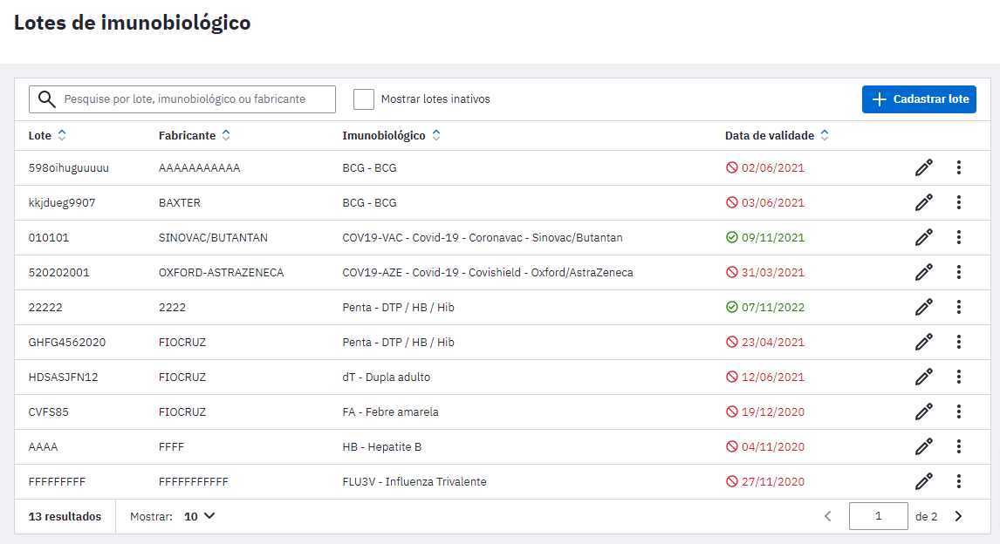

3\. Para começar a informar os dados sobre o imunobiológico clique no botão "Cadastrar lote".

4\. Em seguida será exibida a tela abaixo:

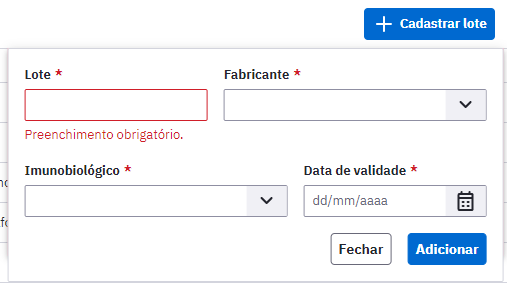

5\. Prossiga selecionando a vacina que será cadastrada no campo Imunobiológico, lote, fabricante e a data de validade, após clique em "Adicionar";

6\. Ao finalizar os lotes de imunbiológicos registrados aparecerão conforme a figura 3.10.1;

7\. Pronto, no próximo registro de aplicação de doses da vacina, o imunobiológico já estará presente no campo "Lote fabricante" quando for registrar uma dose aplicada.

{: .nota }
Para saber mais como realizar um registro de um imunobiológico administrado consulte o capítulo 6.3 deste manual.

8\. Caso queira editar o lote do imunobiológico cadastrado basta clicar nos ícones . Se precisar inativar ou excluir clique em . 

{: .nota }
Caso o imunobiológico já esteja vinculado a algum registro de aplicação de vacina no sistema, não será possível excluir o lote.

# 3.11 Gestão municipal

O módulo de Gestão municipal agrupa funcionalidades gerais, que somente podem ser acessadas com o perfil de **Administrador Municipal** do sistema e-SUS APS, são elas: Configuração da agenda padrão, Certificados, Grupos de exames, Tipos de serviço e RNDS.

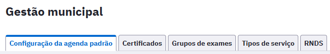

## 3.11.1 Configuração da agenda padrão

A funcionalidade de "Configuração da agenda padrão" permite configurar um horário padrão de atendimento de todos os profissionais das unidades de saúde para cada dia da semana, incluindo sábado e domingo (opção "Mostrar fim de semana").

Para configurar os horários de atendimento padrão, informe os horários e clique em "Salvar".

Figura 3.11.1 - Períodos de trabalho

Fonte: SAPS/MS

Também é possível configurar a duração padrão do agendamento (duração padrão da consulta). As lotações que possuem CBOs com duração do agendamento customizado não utiliza a configuração de duração padrão. Para configurar a duração padrão do agendamento, informe o valor em minutos e clique em Salvar.

## 3.11.2 Certificados

Esta funcionalidade foi implementada no sistema PEC e-SUS APS com a finalidade de habilitar o certificado digital, gerado atualmente via **e-Gestor APS**, sistema **Implantação e-SUS APS**.

Figura 3.11.2 - Tela de Configuração RNDS

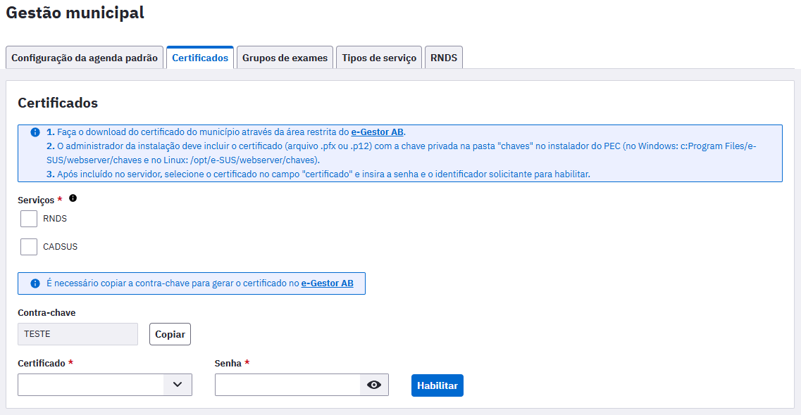

Fonte: SAPS/MS

{: .dica }
Para geração e habilitação do certificado digital no PEC e-SUS APS, além de mais informações sobre as funcionalidades do certificado, siga o manual completo disponibilizado na seção "Apoio à Implantação": [LINK](https://saps-ms.github.io/Manual-eSUS_APS/docs/Apoio%20a%20Implanta%C3%A7%C3%A3o/Certificado_eGestor/)

O certificado digital habilitado permitirá:

Opção "**RNDS**": 
- Envio direto de registros de origem PEC à RNDS (vacinas, atendimentos, prescrição de medicamentos e atestados);
- Habilitação do acesso ao **SUS Digital Profissional** ([mais informações](https://webatendimento.saude.gov.br/faq/susdigitalprofissional)) via prontuário do cidadão pelos profissionais médicos, enfermeiros e cirurgiões-dentistas.

Opção "**CADSUS**": 

Novas opções no módulo Cidadão:
- Cadastrar cidadãos na base local por busca direta na base nacional do CADSUS, evitando retrabalho de digitação de informações e duplicações de cadastro;
- Ao editar dados cadastrais de um cidadão no PEC e-SUS APS, edita-se também estes dados diretamente no CADSUS, como por exemplo, telefone de contato e endereço;
- Gerar novo CNS válido diretamente pelo PEC e-SUS APS, como por exemplo para recém-nascidos, sem a necessidade de entrar no CADSUS para esta ação;
- Durante a edição de um cadastro, será possível sincronizar o cadastro da base local com a base nacional do CADSUS para correção de dados digitados de maneira equivocada antes da integração com o login GOV.BR, como por exemplo, nome e data de nascimento.

{: .atencao }
A habilitação do certificado digital é apenas uma das etapas do processo de habilitação da sincronização do sistema com o CADSUS. Para completar todo o processo desta importante habilitação, será necessário na instalação do PEC e-SUS APS:
- Habilitar o acesso ao sistema por endereço de domínio gov.br via protocolo HTTPS ([manual completo](https://saps-ms.github.io/Manual-eSUS_APS/docs/Apoio%20a%20Implanta%C3%A7%C3%A3o/HTTPS_Automatizado/))
- Habilitar o login via conta gov.br no sistema ([manual completo](https://saps-ms.github.io/Manual-eSUS_APS/docs/Apoio%20a%20Implanta%C3%A7%C3%A3o/Login_GOV.BR/))

## 3.11.3 Grupos de exame

Os grupos de exames são apresentados no módulo de solicitação de exames durante o atendimento no PEC, em "Opções rápidas". Estes filtros são filtrados de acordo com idade e sexo do cidadão em atendimento.

Figura 3.11.3.1 - Grupos de exames

Fonte: SAPS/MS

É possível criar novos grupos de exame na aba "Grupos de exames". Para isso, clique em "Adicionar grupo de exames". Informe o "Nome do grupo" e selecione os exames no combo "Exames". Para concluir, clique em "Adicionar".

Figura 3.11.3.2 - Grupos de exames

Fonte: SAPS/MS

Os grupos também podem ser editados por meio do botão  ou excluídos no botão .

## 3.11.4 Tipos de serviço

Figura 3.11.4 - Tipos de serviço

Fonte: SAPS/MS

Na aba "Tipos de serviço", é possível adicionar, editar e excluir os tipos de serviços de saúde disponíveis para o município.

Para adicionar, clique em "Adicionar tipo de serviço", informe o nome do tipo de serviço e clique em "Adicionar" para concluir.

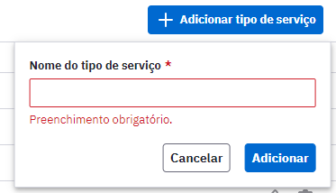

Para editar, clique em . Para excluir um tipo de serviço, cliquem em .

## 3.11.5 RNDS

Esta aba é destinada para acompanhamentos dos envios diretos de registros à Rede Nacioanal de Dados em Saúde (RNDS) pelo PEC e-SUS APS.

Caso não haja certificado digital habilitado no sistema, a seguinte mensagem é exibida:

Figura 3.11.5.1

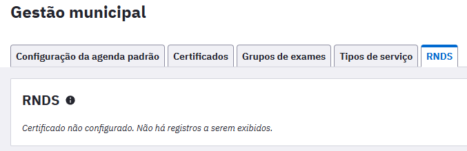

Fonte: SAPS/MS

Com o certificado digital devidamente habilitado, será possível visualizar, por modelo de informação da RNDS, os registros "enviados" e "não enviados", conforme imagem abaixo:

Figura 3.11.5.2

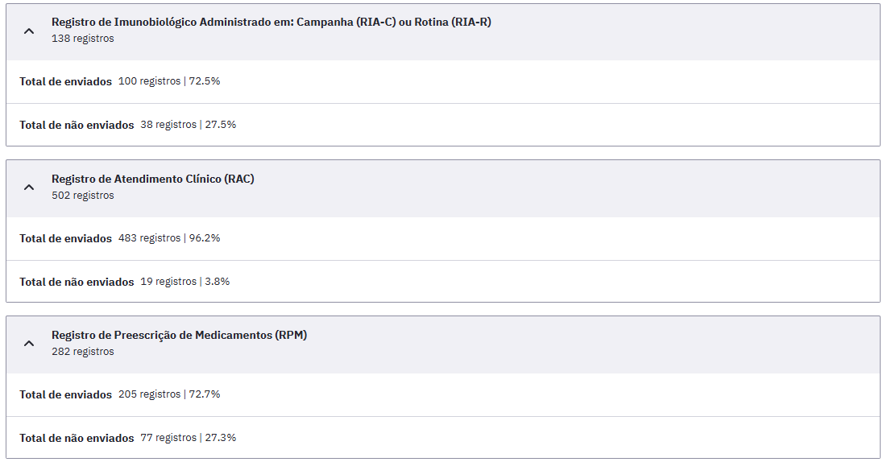

Fonte: SAPS/MS

Também é possível observar o retorno do sistema em relação a conexão com a RNDS quanto ao último envio realizado em "Status do último envio", podendo este campo apresentar as seguintes mensagens:

- **Conexão bem-sucedida**: Ao enviar um registro e não houver problemas de conexão;
- **Sem conexão**: Ao enviar um registro para o serviço da RNDS e houver algum erro de conexão;
- **Certificado expirado**: Quando a data de validade do certificado for menor que a data atual;
- **Falha no certificado**: Ao ocorrer algum erro na autenticação do certificado.

Figura 3.11.5.3

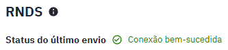

Fonte: SAPS/MS

Vale destacar que a partir da versão 5.3 do PEC e-SUS APS é possível gerar o relatório de erros de registros não enviados diretamente à RNDS.

Para gerar o relatório, selecione a opção "Gerar relatório de erro".

Será exibida uma tela onde poderá ser selecionado o período desejado e gerar o relatório CSV.

Figura 3.11.5.4

Fonte: SAPS/MS

Deverá ser marcado pelo menos um modelo de informação e o relatório gerado trará as seguintes informações: data de envio, tipo de registro, ID do registro, status do envio, erro retornado pela RNDS.

Fonte: SAPS/MS

# 3.12 Importação do Bolsa Família

Para importar um arquivo com os beneficiários do bolsa família de uma vigência específica para que eles sejam identificados em seus prontuários, o profissional deverá acessar o e-GESTOR APS. 

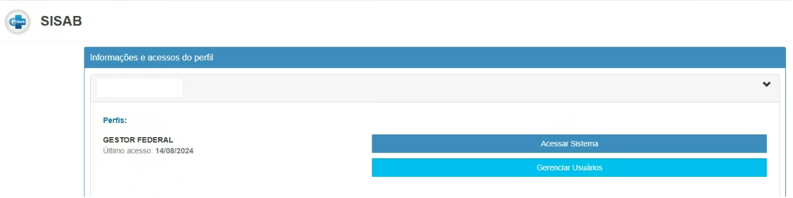

Selecionar o Programa Bolsa Família conforme abaixo:

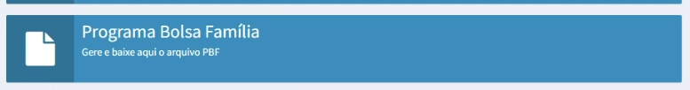

Em seguida, abrirá um aviso na tela que orienta sobre o relatório e a LGPD. 

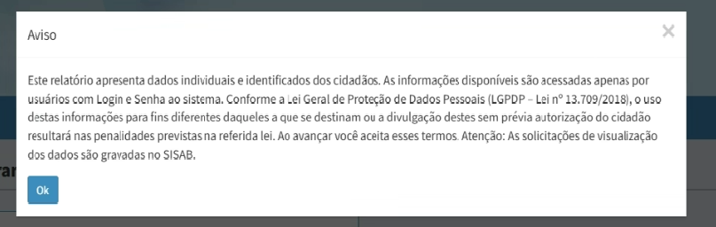

Na sequência será possível gerar o arquivo para importação do Bolsa Família para o PEC.

O arquivo deverá ser baixado no e-Gestor APS (SISAB), descompactado e importado no formato JSON pela funcionalidade "Importação do bolsa família", que pode ser acessada pelo menu lateral com o perfil de Administrador da Instalação, Administrador Municipal ou Gestor Municipal. 

{: .nota } Somente é possível importar um arquivo por vigência do Programa Bolsa Família.

Ao visualizar a folha de rosto de um cidadão que consta como beneficiário no arquivo importado da vigência mais atual, será apresentada uma sinalização de que ele é beneficiário do Programa Bolsa Família.

Além da sinalização no "Acompanhamento de vulnerabilidade", também aparecerá a tela com aviso de que o cidadão consta como beneficiário na vigência mais recente importada. 

