# CAPÍTULO 4 - Cidadão
{: .no_toc }

Neste capítulo abordaremos as questões relacionadas ao gerenciamento do cadastro do cidadão, por meio do módulo "Cidadão".

## Sumário
{: .no_toc .text-delta }

- TOC
{:toc}

Todo cidadão, para ser atendido na UBS por meio do Sistema com PEC, ou seja, para ter um prontuário eletrônico ativo no sistema, deve possuir um cadastro ativo no sistema, independente deste cadastro estar ou não identificado pelo número do Cartão Nacional de Saúde (CNS) ou pelo Cadastro de Pessoas Físicas (CPF).

Figura 4.1 - Cartão Nacional de Saúde e Cadastro de Pessoas Físicas

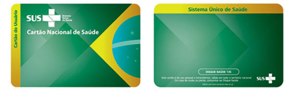

Fonte: SAPS/MS.

Considerando as diferentes fontes de informações da base de cidadãos do Sistema e-SUS APS e das possibilidades de consultas integradas à base de Cadastramento Nacional de usuários do SUS (CADSUS), por meio do Cartão Nacional de Saúde (CNS), antes de realizar qualquer ação no cadastro de um cidadão, seja para consultar ou alterar os dados dele ou para cadastrar um novo cidadão, o sistema solicita que o usuário realize uma busca sobre a base local ou na base do CNS, quando houver conectividade. O cadastro realizado utilizando este módulo **é enviado para a base nacional do SISAB**, e portanto, **será contabilizado no cadastro do território**.

# 4.1 Busca pelo cidadão

Agora o processo de busca pelo cidadão ficou mais simples. Após selecionar a opção "Cidadão" na aba lateral de navegação, será solicitado que o profissional realize a busca utilizando dados demográficos ou número de alguns documentos válidos:

- Nome do cidadão;
- número do CNS do cidadão;
- número do CPF;
- Data de nascimento;
- Nome da mãe;
- Município de nascimento, como mostra a pec_imagem abaixo:

Figura 4.2 - Busca Cidadão

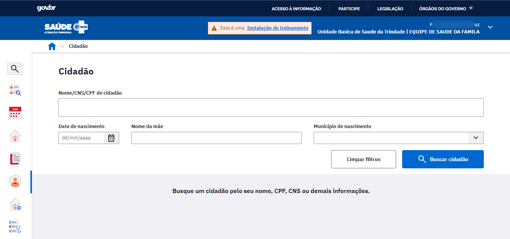

Fonte: SAPS/MS.

Em caso de sucesso na busca pelo cidadão o resultado mostrará um cartão com informações do cidadão como nome, data de nascimento, número do CNS e CPF, sexo, nome da mãe, unidade de saúde responsável, telefone, município de nascimento e a data da última atualização do cadastro.

Figura 4.3 - Resultado da Busca Cidadão

Fonte: SAPS/MS.

É importante sinalizar que a busca pode retornar como resultado de cadastros "inativos", originados de versões anteriores do PEC. Neste caso o sistema apresentará este cadastro com a marcação , como mostra a Figura 4.4.

Figura 4.4 - Marcação de cadastro inativo.

Fonte: SAPS/MS.

O sistema sempre irá realizar uma busca na **base** de cadastro **local** e poderá trazer um ou mais resultados, restando ao profissional a escolha do cidadão que está sendo buscado. Caso não haja nenhum resultado, será realizada, automaticamente, a busca na base nacional do CADSUS.

Caso a busca seja muito genérica o sistema retornará uma mensagem de que muitos cadastros foram encontrados e irá solicitar o refinamento da busca para aproximar com mais fidedignidade os resultados que o profissional está esperando.

Figura 4.5 - Solicitação de refinamento da busca pelo cidadão

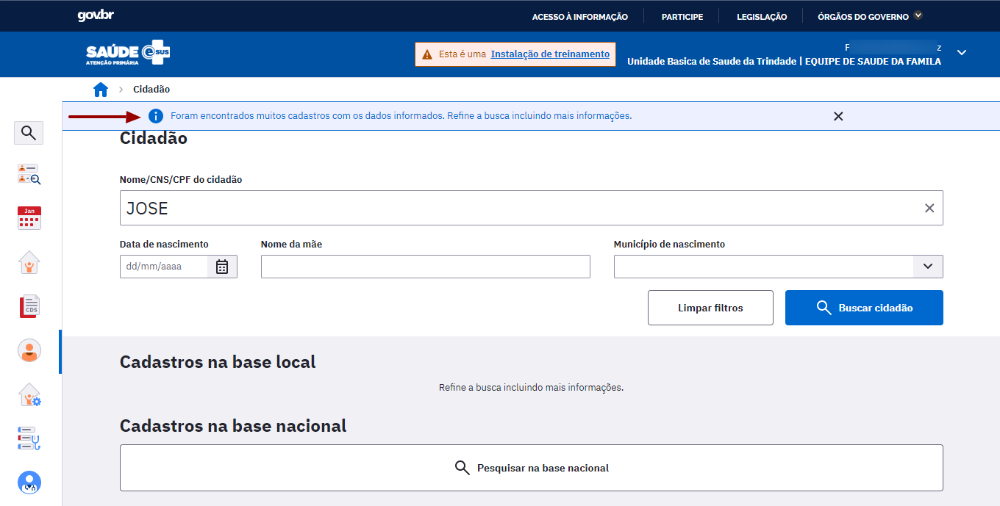

Fonte: SAPS/MS.

Caso a consulta à base nacional do CADSUS não retorne nenhum resultado o sistema apresentará a seguinte mensagem:

Neste caso será necessário **cadastrar um novo cidadão** (ver seção 4.3).

## 4.1.2 Busca na base nacional (CADSUS)

Ao fazer uma busca pelo cidadão, caso o mesmo não esteja disponível na primeira busca realizada na base local, será realizada automaticamente uma busca *on-line* na base nacional do CADSUS. Para isso, o servidor do Sistema e-SUS APS deve estar conectado a uma rede de Internet, ou seja, o sistema precisa ter conectividade com a Internet para acessar o serviço do CADSUS. O resultado será exibido indicando que o resultado foi buscado na "Base nacional", conforme podemos visualizar na pec_imagem abaixo.

Figura 4.6 - Resultado da Busca da Base Nacional

Fonte: SAPS/MS.

É possível que a consulta à base nacional seja desativada pelo administrador do sistema, na instalação local. Neste caso o sistema apresentará a seguinte mensagem:

Quando a busca for realizada com parâmetros demográficos, o sistema não realizará uma busca automática na base nacional, caso a consulta retornar registros da base local. Portanto ao final da lista de resultados será apresentado o bloco Cadastros na base nacional. Caso deseje ampliar a busca, clique no botão "Pesquisar na base nacional".

Figura 4.7 - Ampliar Busca na Base Nacional

Fonte: SAPS/MS.

A busca ampliada será exibida pela listagem dos resultados da base local seguida dos resultados da base nacional, conforme podemos ver na pec_imagem abaixo.

Figura 4.8 - Resultado da Busca Ampliada na Base Nacional

Fonte: SAPS/MS.

# 4.2 Visualizar dados do cidadão

Ao realizar uma busca com resultado bem sucedido, será apresentado um cartão com os dados do cidadão. Estarão disponíveis algumas opções, como:

- Visualizar;
- Atualizar Cadastro;
- Ver prontuário;
- Ver agendamentos; e
- Excluir.

## 4.2.1 Visualizar

Esta opção permite acessar as informações de cadastro do cidadão, que podem ser de origem do CADSUS e do Cadastro do Território.

O cabeçalho apresenta um resumo das informações. Também é possível visualizar se o cadastro já foi unificado alguma vez, quais os cadastros que foram unificados, data, hora e quem foi o responsável pela unificação.

## 4.2.2 Atualizar cadastro

Esta opção oferece a possibilidade de alterar algum dado do cidadão e sincronizá-lo com a base de dados do CADSUS. Ao realizar a atualização, clique em "Salvar" para que o sistema se conecte ao CADSUS e realize as alterações. Caso não haja conectividade o sistema irá apresentar um alerta de que não foi possível realizar a sincronização.

## 4.2.3 Ver prontuário

Caso o profissional deseje **visualizar o prontuário** por meio do módulo Cidadão é obrigatório o registro de uma justificativa para o acesso a estas informações clínicas fora do momento do atendimento ou na ausência do cidadão na UBS. Esta justificativa fica gravada no banco de dados para uso posterior, no caso de auditoria em relação ao sigilo dos dados clínicos sensíveis do cidadão, garantindo assim a sua privacidade e segurança. Para mais informações sobre o prontuário, veja o Capítulo 6.

Figura 4.19 - Tela para justificar acesso ao prontuário

## 4.2.4 Ver agendamentos

Na opção **Ver agendamentos** é possível visualizar a lista com as informações das vezes que o cidadão foi incluído na agenda da UBS, indicando data e hora do seu agendamento, nome do profissional, CBO e observações. Cada item é apresentado com uma indicação da situação do agendamento (Agendado, Não compareceu, Não aguardou e Atendimento realizado).

Figura 4.18 - Tela de Agendamentos do cidadão

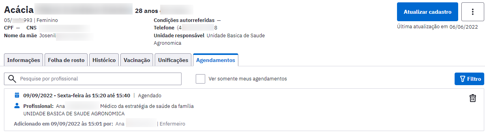

Fonte: SAPS/MS.

# 4.3 Adicionar cidadão na base local

Como já mencionado anteriormente, neste capítulo, para realizar qualquer ação (agenda, registro de atendimento, etc) sobre um cidadão, este precisa estar disponível na base local. Existem três formas de adicionar um cidadão à base local:

- a partir da base nacional;
- integração com Cadastro da Atenção Básica (via CDS ou aplicativo e-SUS APS Território); ou
- direto na base local (Novo cidadão).

## 4.3.1 Adicionar cidadão a partir da base nacional

Após o processo de busca, para adicionar um novo cidadão na base local a partir da base nacional, o profissional deverá selecionar o cidadão na lista de resultados por meio da opção .

Figura 4.9 - Cadastrar cidadão da Base Nacional na base local

O sistema exibirá a tela de adicionar cidadão com todos os dados disponíveis na base nacional.

Figura 4.9 - Formulário para preenchimento do cadastro do cidadão

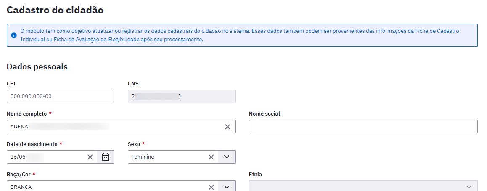

Verifique os dados e identifique atualizações necessárias, e para finalizar clique em "Salvar". Caso não haja nenhum problema na validação dos dados o sistema gravará as alterações realizadas.

Figura 4.10 - Continuação Formulário de preenchimento do cadastro do cidadão

{: .nota }
para mais detalhes de preenchimento do formulário, ver seção 4.4.

## 4.3.2 Adicionar cidadão por meio do Cadastro da Atenção Básica

Visando uma maior integração das ações dos ACS no cadastro do território, todo cidadão cadastrado, por meio das fichas de cadastro da atenção básica (cadastro individual e cadastro domiciliar e territorial) é automaticamente importado para o módulo Cidadão do PEC, após finalizado o processo de digitação (módulo CDS), processamento e envio das fichas. De forma similar, ocorre a integração com os dados recebidos no Sistema PEC pelo transmissor de dados.

{: .atencao }
o cidadão só será importado para o módulo cidadão após processamento das fichas na transmissão de dados. O processamento das fichas é automático, entretanto o servidor do sistema deve ficar ligado, conectado à internet, durante a noite (0h às 6h).

## 4.3.3 Adicionar um Novo Cidadão

Após realizar a busca, utilizando os métodos mostrados anteriormente, onde o cidadão não foi localizado, será necessário incluir um novo cidadão na base.

Para cadastrar um novo cidadão, basta clicar no botão "Adicionar Cidadão" , como mostra a pec_imagem a seguir:

Figura 4.11 - Opção "Adicionar cidadão"

Fonte: SAPS/MS.

A página de cadastro do cidadão (Figura 4.9 e 4.10) será exibida com todos os campos a serem preenchidos. Após finalizar o preenchimento do formulário basta clicar no botão "Salvar" e o cadastro será processado automaticamente.

# 4.4 Adicionar ou alterar cidadão na base nacional

Caso haja conectividade e acesso à base nacional do CADSUS, ao realizar qualquer alteração no cadastro, o sistema mostrará a mensagem de confirmação da alteração dos dados do cidadão.

Ao adicionar um novo cidadão, após o preenchimento do formulário, caso haja sucesso nesse processo, será mostrada a confirmação da geração do cadastro, assim como o número do CNS do cidadão que foi criado.

Figura 4.12 - Tela cidadão atualizado na Base nacional

Fonte: SAPS/MS.

Caso haja algum problema de conectividade ou indisponibilidade do serviço na base nacional do CADSUS, **o cadastro** será salvo na base local, porém não será criado na base nacional. Este processo pode ser refeito até este cadastro ser aceito pela base nacional, resultando na criação do número do CNS para este cidadão.

Caso não seja possível realizar a **atualização** na base nacional, por algum motivo, será mostrado um aviso confirmando a atualização apenas na base local como mostra a pec_imagem abaixo:

Figura 4.13 - Mensagem de erro na atualização do cadastro da Base nacional

Fonte: SAPS/MS.

# 4.5 Preenchimento do formulário de cadastro

O cadastro no módulo Cidadão é um cadastro simplificado que estende e integra os dados do cadastro do CADSUS ao Sistema e-SUS APS, por meio do número do CNS do cidadão, visando garantir um mínimo de informações sobre o cidadão que está sendo atendido pela equipe de AB.

{: .nota }
é importante realizar o cadastro completo dos cidadãos, realizado principalmente pelos agentes de saúde, utilizando as fichas do CDS ou o aplicativo e-SUS Território.

Este cadastro é formado por quatro blocos de informações:

- Dados pessoais;
- Contatos;
- Equipe responsável pelo cidadão;
- Endereço;
- Informações complementares; e
- Compartilhamento de prontuário.

## 4.5.1 Dados pessoais

O bloco de dados pessoais, tem o objetivo de identificar o cidadão conforme as especificações e regras do Cartão Nacional de Saúde (CNS) e integrado ao CADSUS, e a partir da versão 3.2.20 também é possível identificar o cidadão pelo CPF.

Figura 4.12 - Tela de Cadastro do cidadão - Dados pessoais

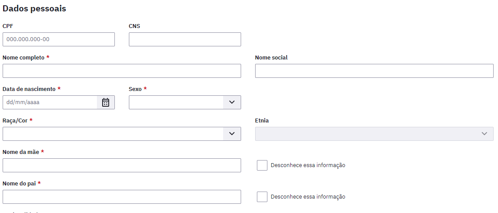

Fonte: SAPS/MS.

## 4.5.2 Contatos

Este bloco tem o objetivo de coletar os dados de contatos, caso seja necessária a comunicação do serviço de saúde com o cidadão.

Figura 4.14 - Tela de Cadastro do cidadão - Contatos

Fonte: SAPS/MS.

## 4.5.3 Equipe responsável pelo cidadão

Este recurso permite a vinculação dos cidadãos às Equipes de saúde, independente do território de residência. A partir dessa vinculação a equipe será responsável pelo acompanhamento do cidadão. Caso o cidadão não esteja vinculado a nenhuma equipe este bloco irá ser apresentado da seguinte forma:

Figura 4.15 - Cidadão sem equipe vinculada

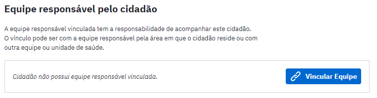

Para vincular um cidadão que não faz parte do território adscrito clique no botão "Vincular Equipe". Será apresentado uma lista com as equipes disponíveis para vinculação.

Figura 4.16 - Vincular equipe responsável, selecionar equipe

Caso haja registro de vinculação do cidadão a uma equipe, seja pelo cadastro do território, seja via solicitação do cidadão, o sistema apresentará as informações da seguinte forma:

Figura 4.17 - Equipe responsável pelo cidadão

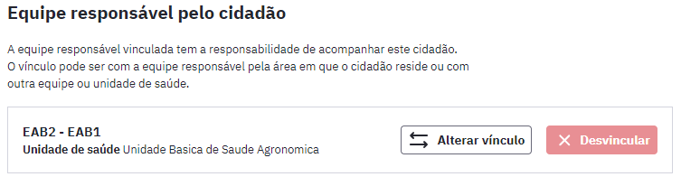

Caso o cidadão opte por ser acompanhado por outra equipe, clique no botão , desmarque a opção "Utilizar a informação do cadastro individual do cidadão", selecione a equipe responsável e clique em Salvar.

Caso o cidadão tenha um cadastro individual e deseja manter o acompanhamento com a mesma equipe de cadastro individual, mantenha selecionada a opção "Utilizar a informação do cadastro individual do cidadão" e clique em Salvar.

Figura 4.18 - Vincular equipe responsável

{: .atencao }
Pessoas não cadastradas na equipe podem ser atendidas normalmente, porém o acompanhamento de saúde deve ser realizado pela equipe responsável.

## 4.5.4 Endereço

O bloco de Endereço utiliza a base de endereços da Empresa Brasileira de Correios e Telégrafos, também conhecido pelo nome Diretório Nacional de Endereços (DNE). Ao incluir um Código de Endereço Postal - CEP, o sistema automaticamente preenche os campos: estado, município, bairro e logradouro. Caso o bairro ou logradouro não esteja disponível na base dos Correios, os campos permitirão a inclusão manual das referidas informações.

Figura 4.13 - Tela de Cadastro do cidadão - Endereço

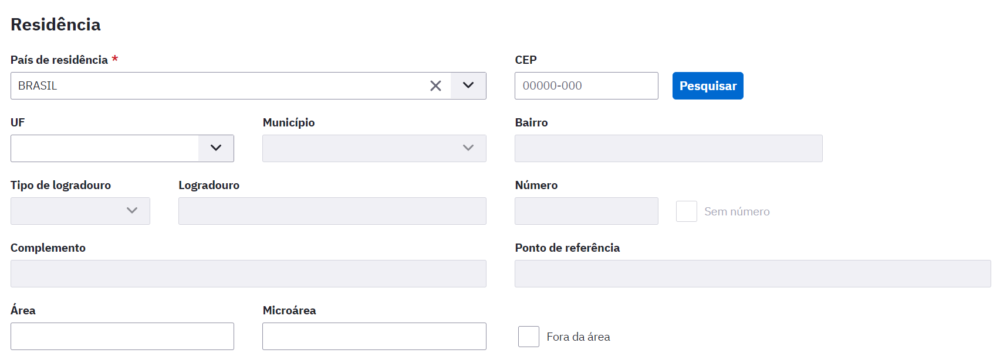

Fonte: SAPS/MS.

## 4.5.5 Informações Complementares

Este bloco visa a coleta de dados sociodemográficos complementares do cidadão.

Figura 4.15 - Tela de Cadastro do cidadão - Informações Complementares

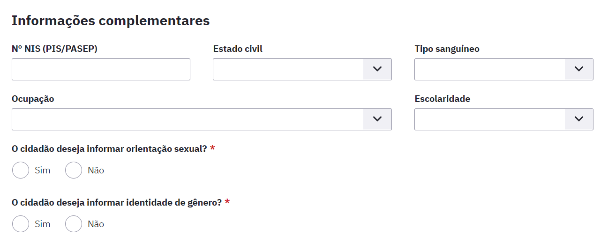

Fonte: SAPS/MS.

## 4.5.6 Compartilhamento de prontuário

Este recurso permite ao cidadão optar pela forma como seus dados clínicos ficam disponíveis para a rede de saúde. Por padrão seus dados são visíveis a todas as UBS de uma mesma instalação, pois otimiza a recuperação de informações clínicas relevantes para o cuidado. Caso o cidadão não concorde, marque a opção "Desativar compartilhamento de prontuário para este cidadão".

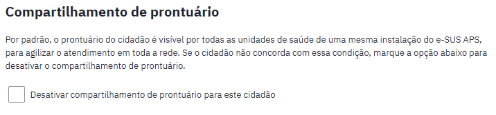
