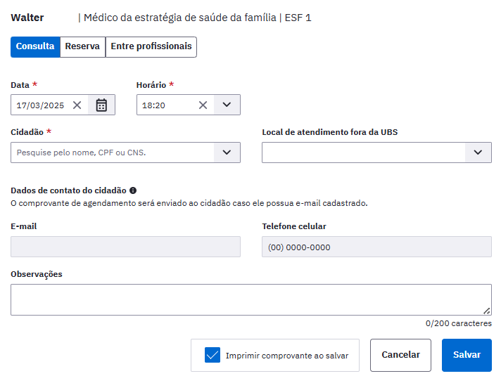

# CAPÍTULO 5 - Agenda
{: .no_toc }

O módulo de Agenda é usado para organizar a agenda dos profissionais das unidades básicas de saúde (UBS), e será a principal ferramenta utilizada pelos profissionais das recepções das UBS.

## Sumário
{: .no_toc .text-delta }

- TOC
{:toc}

É neste local que os profissionais das UBS poderão, dependendo do seu perfil de acesso, consultar e editar as agendas dos profissionais da unidade, ainda é possível adicionar cidadãos na agenda dos profissionais e reservar horários para reuniões ou outras atividades.

Para começar a utilizá-la, é necessário configurar com informações referentes ao horário de trabalho dos profissionais. Quando o profissional apresenta apenas um vínculo no CNES, a agenda virá com uma formatação padrão de atendimentos (dias e horário de trabalho) que pode ser alterada. A configuração da agenda está disponível unicamente para os profissionais com **perfil de coordenação**. No Capítulo 3, você encontra mais informações sobre a configuração da agenda do profissional.

{: .nota }
Antes de utilizar a agenda, é necessário que o coordenador se cerifique sobre a configuração da agenda dos profissionais (ver seção 3.4.5), e realize a adequação, caso necessário.

Para o profissional utilizar a agenda para gestão dos atendimentos, deverá primeiramente clicar na opção "Agenda", após o sistema exibirá a tela da agenda, conforme a Figura 5.1, abrindo na data atual do acesso.

Para visualizar os horários, basta clicar na data desejada na agenda. Para visualizar os horários de outro dia do mês, basta clicar no calendário no dia desejado, por exemplo, dia 22, . Para retornar à data atual, clique em "Hoje" , ou no dia em destaque .

Figura 5.1 - Tela da agenda

Fonte: SAS/MS.

# 5.1 Agendar uma Consulta

Para agendar uma consulta, basta seguir os passos:

- Passo 1. Selecione o "Profissional" para o qual deseja agendar a consulta;

- Passo 2. Selecione a data do agendamento. É possível trocar o mês, clicando nas setas .

- Passo 3. Clique no horário que deseja realizar o agendamento;

Figura 5.2 - Agendar/Reservar Horários

Fonte: SAPS/MS.

- Passo 4. Selecione o tipo de agendamento, clicando na opção "Consulta" ou "Reserva";

- Passo 5. Realize a busca do cidadão pelo nome, CNS ou data de nascimento;

- Passo 6. Selecione o cidadão (o nome do cidadão somente aparecerá caso já esteja cadastrado);

- Passo 7. Se o cidadão não estiver cadastrado, clique no ícone "Cadastrar cidadão"  e preencha com os dados solicitados;

- Passo 8. Caso necessário, é possível usar o campo "Observações" para fazer alguma anotação prévia sobre a consulta;

- Passo 9. Clique em "Salvar" . O nome do cidadão será incluído na agenda, conforme a figura abaixo:

{: .nota }
Quando a funcionalidade do Agendamento Online está ativada, todo agendamento salvo no módulo de Agenda do PEC é enviado para o servidor de agendamento online, que dispara uma notificação "*push"* com informações relacionadas a este agendamento para o aplicativo "ConecteSUS". Neste caso, como o agendamento foi realizado presencialmente na UBS, não há restrição em relação ao cidadão pertencer ao território de referência da equipe de atenção básica.

Conforme os agendamentos são realizados para as datas futuras, a agenda do profissional vai sendo preenchida nos horários escolhidos. Este agendamento pode ser realizado pelo recepcionista da UBS, pelo próprio profissional ao finalizar a escuta inicial ou ao finalizar o atendimento, ou ainda, por outros profissionais da equipe.

{: .nota }
Buscando fortalecer o planejamento da equipe em relação às demandas dos cidadãos no território, o sistema só permite criar um agendamento para consulta ou reserva em horários posteriores ao atual. Por exemplo, caso esteja criando um agendamento às 14h27 do dia corrente, só será possível criar um agendamento nesse dia a partir desse horário (14h40, 15h00,\...).

Após ser realizada a configuração da agenda da equipe com os horários disponíveis para Agendamento Online, os mesmos serão apresentados bloqueados na agenda da seguinte forma:

A partir do agendamento, o sistema oferece algumas opções para fazer o controle do agendamento:

- "Visualizar prontuário" 

- "Adicionar cidadão na lista de atendimentos" 

- "Informar falta do cidadão" 

- "Cancelar agendamento" 

- Visualizar agendamento e dados do cidadão (clicando sobre o nome do cidadão)

Além dessas funcionalidades ainda é possível, pesquisar os agendamentos por cidadão, conforme figura:
. 

Para os horários configurados para agendamento online, não é possível realizar outra forma de agendamento, a opção possível é apenas de reservar da agenda pelos seguintes motivos: atendimento externo, atividade coletiva, reunião ou outro....

## 5.1.1 Agendar atendimento fora da UBS

Para utilizar o recurso de adicionar o cidadão na agenda para os atendimentos a serem realizados fora da UBS, basta seguir o passo a passo de agendar uma consulta, descrita no capítulo 5.1. Entretanto, para esta funcionalidade, clique no box \"Atendimento fora da UBS\" e selecionar o local de atendimento, observe a figura 5.2. Após salvar o agendamento apresentará a mensagem com a hora em que foi marcado, o nome do cidadão e a mensagem \"AGENDAMENTO FORA DA UBS\", conforme a figura abaixo.

Figura 5.3 - Agendamento fora da UBS

{: .dica }
Quando o cidadão é colocado na agenda como agendamento fora da UBS, automaticamente aparecerá na lista de registro tardio de atendimento no dia agendado. Para saber mais sobre o registro tardio de atendimento consulte o capítulo 6.6.

## 5.1.2 Adicionar Cidadão na Lista de Atendimentos

Para incluir o cidadão na lista de atendimentos, clique no ícone "Adicionar cidadão na lista de atendimentos" . O cidadão será incluído na lista, a legenda será "Cidadão presente na unidade".

Para que seja possível realizar o atendimento deste cidadão, o profissional deve ir para o módulo "Atendimentos", onde será possível visualizar a lista dos pacientes agendados que estão presentes na unidade.

## 5.1.3 Visualizar Agendamento e Dados do Cidadão

Para visualizar os detalhes do agendamento do cidadão e dados básicos do cidadão, clique sobre o nome do cidadão. Será apresentado o resumo do agendamento, inclusive, qual o profissional que registrou o agendamento conforme a Figura 5.2. Nesta visualização, é possível acessar o cadastro completo do cidadão por meio da opção \"Ver cadastro completo do cidadão\".

Figura 5.4 - Visualizar detalhes do agendamento

Fonte: SAS/MS.

Através da agenda, é possível identificar a situação do agendamento:

- **Agendado**: cidadão tem um agendamento;

- **Cidadão presente na unidade**: o cidadão foi marcado como presente na unidade

- **Atendimento realizado**: cidadão já teve o atendimento realizado;

- **Não aguardou**: cidadão esteve na unidade, mas não aguardou o atendimento;

- **Não compareceu**: horário do agendamento já passou e o cidadão não compareceu ao atendimento;

- **Cancelado**: agendamento foi cancelado.

## 5.1.4 Agendamento Online

O módulo de **Agendamento Online** foi desenvolvido conjuntamente entre o Departamento de Saúde da Família - DESF/SAPS e o Departamento de Informática do SUS - DATASUS/SE, a fim de facilitar o acesso dos cidadãos aos serviços de Atenção Básica em todo o país. Dessa forma, foi realizado o desenvolvimento da ferramenta de Agenda Online no PEC e adequações no aplicativo "ConecteSUS Cidadão" para a efetivação desta funcionalidade.

Este módulo está disponível para as equipes de Atenção Básica que utilizam o PEC do e-SUS APS, a partir da versão 3.1, e foi pensado considerando-se os avanços tecnológicos alcançados pela Estratégia e no aumento de acesso constante da população a aparelhos do tipo *smartphones*.

O Agendamento Online consiste na disponibilização de horários da agenda dos profissionais da APS para esse tipo de agendamento, entendendo que esta não deve ser a forma principal ou preferencial de agendamento nas equipes, sendo assim, a equipe deve definir quais serão os horários disponíveis para esse tipo de agendamento, considerando os agendamentos para cuidado continuado e outros tipos de agendamento a serem realizados diretamente na Unidade de Saúde ou para consultas de retorno.

Para uso desta funcionalidade, é necessário que a UBS tenha boa conectividade com a internet, pois utiliza-se um servidor nacional para troca de informação entre a UBS e os cidadãos que utilizam o aplicativo "ConecteSUS Cidadão".

{: .atencao }
A funcionalidade de agendamento de consulta na Atenção Básica por meio do aplicativo "ConecteSUS Cidadão" está disponível apenas para usuários que fazem parte do território de equipes de atenção básica. Para tanto é necessário que o cidadão esteja cadastrado no território da equipe através dos cadastros individual e domiciliar.

{: .nota }
A mudança de configuração da agenda pode ser realizada a qualquer momento, porém não altera os horários agendados previamente.

{: .dica }
Antes de realizar a configuração da Agenda Online realize uma conversa prévia com toda a equipe, para pactuação de estratégia de abertura desse formato de agendamento. A disponibilização de horários pode ser gradual. Atente-se para informar a população sobre essa possibilidade de agendamento.

### 5.1.4.1 Sincronização com Agenda Online do e-SUS APS

A visualização do agendamento, quando a instalação está com a sincronização com o Servidor de Agenda do e-SUS APS habilitado (ver Seção 3.1.10) apresentará um status de sincronização , como podemos ver na Figura 5.3.

Figura 5.5 - Visualizar detalhes do agendamento com sincronização

Fonte: SAS/MS.

Os *status* de sincronização possíveis são:

- **Sincronizado**: quando a versão mais atual do agendamento já está cadastrada no servidor;

- **Anterior à ativação da agenda online**: quando o agendamento ou a última atualização foi realizada em uma data anterior à ativação da agenda online;

- **Aguardando sincronização**: quando o agendamento está aguardando sincronização com o servidor;

- **Aguardando sincronização de atualização**: quando o agendamento já foi enviado ao servidor, porém o agendamento foi atualizado no PEC e a atualização não foi sincronizada;

- **Cidadão sem CNS cadastrado**: quando o cidadão não possui CNS cadastrado, neste caso é necessário atualizar o cadastro do cidadão com o CNS dele;

- **Aguardando integração com o CADSUS**: quando o cadastro do cidadão não está integrado com o serviço de cadastro de cidadãos do CADSUS;

- **Cidadão sem CNS definitivo**: quando o cidadão possui CNS cadastrado mas este não é considerado um CNS forte (criado pelo CADSUS), ou seja, inicie com número 7 (para a versão de treinamento será considerado também os CNS que iniciem com 8);

- **Registro inconsistente**: quando houver alguma inconsistência que impeça a sincronização do agendamento com o servidor;

- **Inelegível**: quando for um agendamento de Atenção Domiciliar ou reserva de horário.

## 5.1.5 Cancelar agendamento

Para cancelar um agendamento, clique no ícone "Cancelar agendamento" .

{: .nota }
caso o horário marcado já tenha passado, não será possível excluir o agendamento. Para estes casos, utilize a opção "informar falta do cidadão", clicando sobre o ícone .

Para efetivar o cancelamento, é necessário preencher uma justificativa, conforme mostrado na Figura 5.4. Para concluir clique em "Salvar" .

Figura 5.6 - Tela de justificativa para cancelar o agendamento

Fonte: SAS/MS.

Após confirmar o Cancelamento, a visualização do agendamento será apresentado como na Figura 5.7.

Figura 5.7 - Visualizar detalhes do agendamento Cancelado

Fonte: SAS/MS.

## 5.1.6 Informar que o Cidadão faltou

Para informar a falta de um cidadão, clique no ícone "Clique para informar que o cidadão faltou" . Ele não poderá ser atendido e ficará com registro de falta no atendimento. O nome do cidadão será visualizado na agenda com a legenda "Não compareceu". Esse procedimento pode ser revertido somente no dia do atendimento ao clicar no ícone "Cidadão faltou". Em seguida, clique para indicar que o cidadão chegou" .

## 5.1.7 Pesquisar por cidadão

Para identificar os agendamentos por cidadão, siga os passos:

- Passo 1. Digite o nome ou parte do nome do cidadão no campo "Pesquisa por cidadão"

- Passo 2. Selecione o cidadão que deseja consultar;

- Passo 3. Serão apresentados os agendamentos realizados para o cidadão selecionado, com data e hora, nome do profissional, CBO e observações.

{: .dica }
quando o profissional que estiver consultando os agendamentos do cidadão quiser visualizar apenas os da sua agenda, basta clicar na opção "somente os meus".

## 5.1.8 Visualizar prontuário

Para visualizar o prontuário do cidadão, clique no ícone . Caso o profissional deseje **visualizar o prontuário** direto na agenda, é obrigatório o registro de uma justificativa para o acesso a estas informações clínicas fora do atendimento presencial, ou seja, na ausência do cidadão no momento da consulta. Esta justificativa fica gravada no banco de dados para posterior uso, no caso de auditoria, em relação ao sigilo dos dados clínicos sensíveis do cidadão, garantindo assim a sua privacidade e segurança. Para mais informações sobre o prontuário, veja o Capítulo 6.

# 5.2 Reservar horários na agenda do profissional

Esta funcionalidade é utilizada para reserva da agenda do profissional quando este não estiver disponível para realizar consultas. Os motivos de reserva da agenda são: atendimento externo, atividade coletiva, reunião e outro.

{: .dica }
a reserva da agenda é indicada apenas para atividades de pequena duração e dentro do mesmo turno. Caso haja necessidade de bloqueio de um período maior da agenda do profissional, por exemplo, por motivo de férias ou licença médica, deve ser usada a **opção de fechamento da agenda** com o perfil de coordenação, ver seção 3.4.6.

Para fazer uma reserva de horário na agenda, siga os passos:

- Passo 1. Acesse a agenda;

- Passo 2. Clique no horário que deseja reservar. O sistema se apresentará de acordo com a Figura 3.8;

Figura 5.8 - Realizar reserva na agenda

Fonte: SAS/MS.

- Passo 3. Clique na opção "Reserva" ;

- Passo 4. Defina o horário inicial, que corresponde à hora de início da atividade que ocasionou a reserva da agenda e defina o horário final da reserva

- Passo 5. Escolha o motivo da reserva da agenda (atendimento externo, atividade coletiva, reunião ou outro)

- Passo 6. Caso seja selecionada a opção outro (motivo) use o campo "Especifique" para detalhar o motivo;

- Passo 7. Para concluir, clique em "Salvar" .

Após salvo, a reserva do horário será apresentada na agenda, junto com os outros agendamentos (Figura 5.9).

Figura 5.9 - Horário reservado

Fonte: SAS/MS.

# 5.3 Imprimir a Agenda do Profissional

É possível realizar a impressão da agenda dos profissionais individualmente, para um determinado dia da agenda. Para isto basta selecionar a data desejada, por meio do calendário, e clicar no botão "imprimir" . A impressão apresenta, além da identificação do profissional, a lista de agendamentos com o horário, e os dados de identificação dos cidadãos agendados. Também apresenta as informações em relação a reserva de agenda para atividades previstas.

Figura 5.10 - Impressão da agenda

Fonte: SAS/MS.
