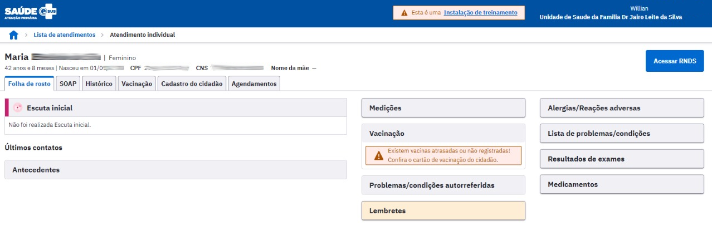

# CAPÍTULO 6 - Atendimentos
{: .no_toc }

Neste capítulo serão apresentadas as funcionalidades que garantem a ordenação da maior parte dos fluxos de atendimento que ocorrem nos serviços de atenção primária.

## Sumário
{: .no_toc .text-delta }

- TOC
{:toc}

A partir do padrão de funcionamento do Prontuário Eletrônico do Cidadão (PEC) os profissionais de saúde têm acesso à Lista de Atendimentos da unidade de saúde utilizando a barra lateral de navegação. É por meio dela que são iniciados os atendimentos aos cidadãos agendados ou os que buscam um atendimento de demanda espontânea.

Essa funcionalidade é apresentada na barra lateral de navegação do sistema e pode ser acessada ao clicar na opção "Lista de Atendimentos". Neste momento, será visualizada a lista de atendimentos da unidade de saúde, conforme podemos ver na Figura 6.1.

Figura 6.1 - Tela principal da "Lista de Atendimentos"

Fonte: SAPS/MS.

# 6.1 Lista de Atendimentos

A lista de atendimentos oferece uma série de recursos que auxiliam na organização das ações realizadas aos cidadãos que já entraram no fluxo de atendimento, seja por um atendimento agendado, seja por uma demanda espontânea, como vimos na Seção 5.1.1.

Para pesquisar um cidadão específico que esteja incluído na Lista de Atendimento basta digitar o nome, CPF ou CNS na caixa de busca, como mostrado em destaque na figura a seguir:

Figura 6.1.1 - Lista de Atendimentos

Fonte: SAPS/MS

Caso o profissional deseje visualizar apenas os cidadãos que estão aguardando para o seu atendimento, selecione a opção "Ver somente os meus atendimentos". Esta opção filtra a lista de atendimento apenas com os cidadãos marcados para serem atendidos pelo profissional logado no sistema.

Figura 6.1.2 - Lista de Atendimentos

Fonte: SAPS/MS

Um recurso importante desta lista são as formas de pesquisa e filtro, conforme a Figura 6.1.3 Clique na opção de filtro  para mais campos de pesquisa.

Figura 6.1.3 - Opções de pesquisa da lista de atendimentos

Fonte: SAPS/MS.

Em seguida, veremos a função de cada campo:

- **status atendimento:** filtra a lista pela situação do cidadão em relação ao fluxo de atendimento;

- **período:** filtra e pesquisa os atendimentos em espaço de tempo definido;

- **tipo de serviço:** filtra a lista de atendimento pelo tipo de serviço ao qual o cidadão está marcado, seja agendado ou não, a depender do fluxo de atendimento que ele já tenha passado na unidade de saúde;

- **equipe:** filtra a lista pela equipe;

- **profissional:** filtra a lista pelo nome do profissional.

Ao clicar nos campos "Período", "Tipo de serviço", "Equipe" e "Profissional", o sistema irá abrir uma lista de opções disponíveis para utilizar como filtro. É possível realizar pesquisa por digitação nestes campos.

Figura 6.1.4 - Tipo de Serviço

Fonte: SAPS/MS

{: .nota }
os **tipos de serviços** mostrados no filtro rápido são os que foram cadastrados, no momento da configuração, para a unidade de saúde. Para mais informações sobre tipo de serviço, ver seção 3.3.1.

Se for preenchido mais de um campo para pesquisa, a lista de atendimento resultante conterá apenas os registros que contemplem todos os filtros simultaneamente. O sistema também apresenta as opções utilizadas para a filtragem da lista de atendimento, como observado na figura a seguir:

Caso o profissional deseje retornar os filtros para o padrão, basta clicar no botão "Voltar para padrão".

{: .nota }
a lista com os cidadãos para atendimento, por padrão, apresenta os atendimentos do dia, filtrando os cidadãos com *status* "Atendimento realizado" e ou que "Não aguardou o atendimento".

A lista de atendimentos apresenta informações sobre a hora de chegada, nome do cidadão, profissional e tipo de serviço. A barra colorida no canto esquerdo da lista indica o *status* daquele atendimento, e as cores estão relacionadas com o quadro do "Status atendimento", que se encontra no ícone da pesquisa e filtro .

Outra funcionalidade para auxiliar na organização do atendimento é o \"**Ordenar por**\", recurso que permite ao usuário a escolha da ordenação dos registros na lista.

É possível ordenar pela data e hora de chegada (crescente ou decrescente) ou pela classificação de risco (apenas atendimentos que passaram pela escuta inicial). Por padrão, a lista é ordenada por ordem crescente (ordem de chegada) + classificação de risco.

{: .dica }
sempre observe se há algum tipo de filtro ativo para visualização da lista, a fim de não haver confusão ou falsa impressão da quantidade de cidadãos dentro da lista de atendimento.

Como podemos ver na Figura 6.1.5, algumas ferramentas são disponibilizadas para cada cidadão na lista de atendimentos. A seguir, apresentamos cada ferramenta e para que servem:

Figura 6.1.5 - Ferramentas da lista de atendimentos

Fonte: SAPS/MS.

**Gerar declaração de comparecimento:** será disponibilizada para impressão com os dados do cidadão selecionado, podendo adicionar o **nome do acompanhante**. A impressão só estará disponível após o cidadão passar por algum atendimento na UBS;

{: .dica }
ao imprimir a declaração de comparecimento do cidadão, certifique-se de que o controle do pop-up da janela do navegador esteja desbloqueado.

 **realizar escuta inicial**: inicia-se a escuta inicial do cidadão;

 **visualizar escuta inicial**: visualização da escuta inicial, caso ela já tenha sido realizada e registrada no mesmo dia;

 **atender**: inicia-se o atendimento de um cidadão;

 **realizar vacinação**: realizar o registro de vacinação para este cidadão;

**Cidadão não aguardou**: permite indicar no sistema que um cidadão estava na lista de atendimentos, mas, por algum motivo, não aguardou o atendimento;

**Cidadão retornou**: permite desfazer a ação \"Cidadão não aguardou\";

**Visualizar prontuário**: visualização do prontuário completo do cidadão (caso o cidadão já tenha um registro anterior neste prontuário);

**Visualizar atendimentos do dia**: visualização dos atendimentos ou escuta inicial. Disponível somente se o cidadão tiver algum atendimento no dia;

**Editar**: edição do dados referentes às demandas daquele cidadão que aguarda na Lista de Atendimento. É possível editar o profissional, equipe de referência que irá atendê- lo ou o tipo de serviço oferecido pela UBS em que o cidadão será atendido;

 **Excluir**: excluir cidadão da lista de atendimento. Esta opção estará habilitada apenas se o registro não possuir referências, ou seja, se o atendimento já tiver sido iniciado, não será possível realizar a exclusão.

## 6.1.1 Adicionar um Novo Cidadão à Lista de Atendimentos

Além dos atendimentos agendados para os profissionais da unidade de saúde, é possível a inclusão no sistema dos cidadãos, que procuram o serviço de saúde por demanda espontânea. Para mais informações sobre demanda espontânea, ver [**CAB 28 - Acolhimento à Demanda Espontânea Volume I**](http://aps.saude.gov.br/biblioteca/index).

### 6.1.1.1 Adicionar cidadão em demanda espontânea

Para adicionar um cidadão à lista de atendimento por demanda espontânea, siga os seguintes passos:

- Passo 1. Na tela da lista de atendimentos, clique em ;

Figura 6.1.6 - Adicionar cidadão na Lista de Atendimento

Fonte: SAPS/MS

- Passo 2. Selecione o **cidadão**. Observe que o sistema apresenta a lista de cidadãos com seus dados demográficos e indica se o mesmo já está adicionado na Lista de Atendimentos. Caso o cidadão não esteja cadastrado nesta UBS, é possível realizar o cadastro dele clicando em ;  

- Passo 3. Selecione o **profissional** que irá atendê-lo. Esta seleção não é obrigatória e não impede que outro profissional realize o atendimento deste cidadão, apenas visa à organização interna e filtros de pesquisa;

- Passo 4. Selecione a **equipe** que estará a frente do cuidado ao cidadão. Esta seleção não é obrigatória e não impede que outro profissional realize o atendimento deste cidadão, apenas visa à organização interna e filtros de pesquisa;

- Passo 5. Selecione os **tipos de serviço** que serão oferecidos no atendimento. Esta seleção não é obrigatória e não restringe os serviços que serão realizados no atendimento;

Figura 6.1.7 - Adicionar Atendimento

Fonte: SAPS/MS

- Passo 6. Para concluir, clique em "**Adicionar**". Após isso, o cidadão será exibido na lista de atendimento.

### 6.1.1.2 Adicionar cidadão em demanda agendada

É possível incluir um cidadão com demanda agendada a partir da lista de atendimento, prevenindo possíveis inconsistências com o módulo Agenda. Para adicionar um cidadão à lista de atendimento por demanda agendada, siga os passos:

- Passo 1. Na tela da lista de atendimentos, clique em . Caso o cidadão tenha agendamentos para este dia, será apresentada uma lista indicando as reservas de agenda para aquele dia.

Figura 6.1.8 - Adicionar Atendimento

Fonte: SAPS/MS

- Passo 2. Ao selecionar o agendamento o sistema automaticamente preenche os campos disponíveis, como Profissional, Equipe e Tipo de Serviço;.

Figura 6.1.9 - Adicionar Atendimento

Fonte:SAPS/MS

- Passo 3. Para concluir, clique em "**Adicionar**". Após isso, o cidadão será exibido na lista de atendimento

Figura 6.1.10 - Adicionar Atendimento

Fonte: SAPS/MS

{: .atencao }
Caso o cidadão tenha procurado a Unidade Básica de Saúde (UBS) para a realização de vacinação a recepção poderá, no momento de inclusão do cidadão na lista de atendimento, marcar a opção "**Vacina**".

# 6.2 Escuta Inicial

A escuta inicial representa o primeiro atendimento realizado ao cidadão em **demanda espontânea** na UBS. A finalidade desta escuta é acolher o indivíduo, levantar informações sobre o motivo da busca pelo cuidado em saúde e orientar a conduta mais adequada para o caso. É possível coletar informações subjetivas, medições objetivas e classificar o risco/vulnerabilidade, de acordo com a avaliação do risco biológico e da vulnerabilidade subjetivo-social do indivíduo. O profissional que realizou a escuta inicial poderá resolver o caso por meio de orientações ou encaminhar o cidadão para atendimento no dia, procedimento na UBS ou agendamento de consulta em outro dia.

O perfil de escuta inicial poderá ser habilitado para os profissionais a depender da organização do processo de trabalho em cada município (ver Seção 3.4.4).

{: .nota }
Só é permitido realizar uma escuta para cada atendimento, e não é permitida a exclusão, nem a adição de informações após a finalização do atendimento.

Ao clicar na opção  \"**Realizar escuta inicial**\", disponível na tela da lista de atendimentos, será exibida uma tela, conforme a Figura 6.2.1

Figura 6.2.1 - Ferramentas para realizar escuta Inicial

Fonte: SAPS/MS.

Na tela de escuta inicial, os campos "**Motivo da consulta (CIAP2)**", "**Classificação de risco/vulnerabilidade**" e "**Desfecho da escuta inicial**" são obrigatórios.

{: .nota }
A ferramenta de escuta inicial também permite o registro de "pré-atendimento" (opção  \"**Realizar pré-atendimento**\" na lista de atendimento) quando for uma consulta agendada, entretanto a funcionalidade "**Classificação de risco/vulnerabilidade**" não estará disponível, pois consultas agendadas são consideradas como "não agudo".

Para fazer o registro da escuta inicial, siga os passos:

- Passo 1: Registre o motivo da consulta usando a CIAP2;

- Passo 2: Faça as anotações necessárias da escuta inicial do cidadão, no campo "Motivo da consulta (Descrição)";

- Passo 3: Registre dados de antropometria, sinais vitais e glicemia, de acordo com as necessidades observadas no atendimento;

Figura 6.2.2 - Antropometria, Sinais Vitais e Glicemia

Fonte: SAPS/MS

- Passo 4: Informe os procedimentos realizados na escuta inicial, caso algum procedimento complementar tenha sido executado;

{: .nota }
Se forem preenchidos os grupos **Antropometria**, no que se refere a peso e altura, **Sinais vitais** e **Glicemia**, os procedimentos que correspondem a essas ações serão inseridos no grupo **Procedimentos realizados** automaticamente.

- Passo 5: Informe a classificação de risco/vulnerabilidade. Esta classificação permite aos profissionais a priorização dos casos mais urgentes ou que requerem atendimento imediato, permitindo a ordenação da lista por prioridade no atendimento;

- AZUL - para risco e/ou vulnerabilidade **não aguda**;

- VERDE - para risco e/ou vulnerabilidade **baixa**;

- AMARELO - para risco e/ou vulnerabilidade **intermediária**;

- VERMELHO - para risco e/ou vulnerabilidade **alta**.

{: .nota }
o protocolo de classificação de risco utilizado no sistema está definido no [Caderno de Atenção Básica (CAB) 28 - Acolhimento à Demanda Espontânea - Volume I](http://189.28.128.100/dab/docs/publicacoes/geral/miolo_CAP_28.pdf). Adaptações deste protocolo podem ser realizadas de acordo com a necessidade local.

{: .atencao }
A classificação de risco/vulnerabilidade é um campo de preenchimento obrigatório para os atendimentos à demanda espontânea, em especial para as consultas que serão realizadas no mesmo dia.

{: .dica }
Ao fazer a classificação de risco/vulnerabilidade e encaminhar o cidadão para atendimento no dia, o sistema exibe essa informação na lista de atendimento, após finalizar a escuta inicial, para auxiliar na organização e fluxo do atendimento.

- Passo 6: Faça o Desfecho da Escuta Inicial do cidadão escolhendo uma das ações a seguir:

- **liberar cidadão**: libera o cidadão da lista de atendimentos, para os casos em que o problema foi resolvido na própria escuta inicial ou nos casos em que se possa agendar uma consulta;

- **adicionar na lista de atendimento**: para os casos em que o cidadão precisa de outro atendimento e/ou serviço na unidade de saúde no mesmo dia, o cidadão será reinserido na lista de atendimento e permanece com a situação "Aguardando atendimento" para que ele possa ser atendido/consultado por outro profissional;

Figura 6.2.3 - Desfecho da escuta inicial

Fonte: SAPS/MS

{: .atencao }
Caso o cidadão seja incluído na lista de atendimento para a aplicação de vacinas deve ser marcado a opção "**Vacina**" para que a equipe da sala de vacina identifique-o na lista de atendimento e realize o registro da aplicação.

- **agendar consulta**: Para os casos em que o problema não foi resolvido na escuta inicial e há a necessidade de agendar uma consulta para um profissional, na data, turno e horário disponível. Na agenda do profissional, será adicionada esta nova consulta.

Figura 6.2.4 - Agendar Cidadão

Fonte: SAPS/MS

- Passo 7: Clique no botão  para concluir o atendimento e salvar as informações.

{: .nota }
Só é permitido realizar uma escuta inicial para cada atendimento! Também não é permitido a edição, nem a exclusão dessas informações após finalizado. No caso em que o usuário tenha acessado a escuta inicial por engano, é possível cancelar essa ação, se a escuta não tiver sido finalizada. Para isso, deve-se ir até o fim da página e clicar no botão .

{: .atencao }
Para interromper um atendimento iniciado de forma equivocada, é importante usar o botão "cancelar atendimento", caso contrário, o atendimento ficará travado e aguardando ser finalizado pelo profissional que iniciou o atendimento, não sendo possível que outro profissional o atenda.

# 6.3 Realizar Vacinação

O módulo de vacinação possibilita a organização do processo de trabalho, o registro das vacinas, imunoglobulinas e soros que fazem parte do Programa Nacional de Imunização (PNI) do Ministério da Saúde (MS), contribuindo, dessa forma, para o controle, erradicação e eliminação de doenças imunopreveníveis. O PNI define o calendário de vacinação com orientações específicas para crianças, adolescentes, adultos, gestantes e idosos. Sendo assim, a equipe da Atenção Primária realiza a verificação da caderneta para avaliar a situação vacinal e encaminha a população à unidade de saúde para iniciar ou completar o esquema vacinal conforme o calendário de vacinação. A partir de então, começa o fluxo de atendimento no PEC.

{: .atualizacao }
A partir da versão 4.1.17 o registro da vacina COVID-19 está disponível exclusivamente para atendimento à situação nacional de Emergência em Saúde Pública. Mais informações no tópico 6.3.1.2 deste capítulo.

## 6.3.1 Registrar Vacina Aplicada

O registro da vacina no fluxo de atendimento do PEC é ativado pela opção "Vacina" marcada na inclusão do cidadão na lista de atendimento ou nos blocos de desfecho da escuta inicial e atendimentos realizados na UBS como demonstrado nos tópicos anteriores. Caso esta opção seja selecionada o botão "Realizar Vacinação" estará disponível como mostra a figura a seguir:

Figura 6.3.1 - Opção de registro da Vacinação

Fonte: SAPS/MS

Após clicar em  realizar vacinação estará disponível o registro da vacinação no PEC.

Figura 6.3.2 - Tela de registro da Vacinação

Fonte: SAPS/MS

A tela para registrar a vacinação apresenta os seguintes Blocos de preenchimento: a) Condições; b) Vacinação e c) Desfecho. Neste subcapítulo abordaremos sobre os blocos "Condições" e "Vacinação".

**CONDIÇÕES**

Este bloco apresenta ao profissional as condições específicas relacionadas ao cidadão que será vacinado. As condições são "Gestante", "Puérpera" e "Viajante".

Figura 6.3.3 - Bloco de Condições do Registro de Vacinação

Fonte: SAPS/MS

**VACINAÇÃO**

Este bloco apresenta os recursos disponíveis para o registro da vacinação. O quadro de vacinação é apresentado conforme figura abaixo:

Figura 6.3.4 - Quadro para o registro dos imunobiológicos

Fonte: SAPS/MS

Neste quadro é possível visualizar o status da situação vacinal de cada imunobiológico. Se a vacina estiver em dia, o quadro da "DOSE" do imunobiológico aparecerá na cor verde. Caso a vacina esteja atrasada aparecerá na cor vermelha. Se a dose aplicada faz parte do calendário vacinal do cidadão e estiver no tempo para ser realizada, o quadro aparecerá na cor branca como "disponível". Os quadros das "DOSES" das vacinas na cor cinza significam que são doses a serem aplicadas futuramente.

Quando aparecer um asterisco  no quadro "DOSE" do imunobiológico significa que esta vacina foi registrada no atendimento.

Para registrar uma vacina aplicada siga as seguintes etapas:

1\. É possível visualizar o calendário vacinal de acordo com o ciclo de vida (criança, adolescente, adulto e idoso) ou pelo calendário nacional completo;

2\. Clique sobre a dose do imunobiológico que será administrado. Após será aberta uma nova tela "ADICIONAR VACINAÇÃO" conforme a figura 6.3.5:

Figura 6.3.5 - Tela para adicionar vacinação

3\. Se o registro for de uma dose da vacina administrada no momento, o botão permanece, por padrão, como "Não" . Caso seja para um registro de dose administrada em outro dia ou em outro local de atendimento, com a finalidade de atualizar a caderneta do cidadão no PEC, então deve-se mover o botão para "SIM" . Esta última funcionalidade será detalhada mais adiante.

4\. Os campos para o registro do "Imunobiológico" e "dose" aparecerão conforme a seleção realizada pelo profissional de saúde na tela do quadro de vacinação (Figura 6.3.4), não sendo possível a sua alteração.

5\. Selecionar a estratégia de vacinação no campo "Estratégia", que é de preenchimento obrigatório.

6\. Selecionar no campo "Lote/Fabricante", o número de fabricação do lote que se encontra, geralmente, no frasco do imunobiológico, assim como o nome do fabricante da vacina. Caso o lote e fabricante não estejam disponíveis, é possível realizar a sua inclusão. Veja como realizar esta operação no tópico **6.3.1.1** a seguir.

7\. Selecione a opção desejada nos combos "Via de administração" e "Local de aplicação". Caso seja necessário, descreva as observações no campo com este destino.

8\. Ao final destas etapas clique em "SALVAR" e aparecerá a mensagem "Registro salvo com sucesso". Caso esteja faltando o preenchimento de algum campo obrigatório, o registro não será salvo e o sistema emitirá um alerta informando qual(is) campo(s) não foram preenchidos.

{: .atencao }
Os profissionais de saúde que realizam a administração de imunobiológicos deverão seguir as normas e procedimentos para a vacinação de acordo com o Programa Nacional de Imunização do Ministério da Saúde.

9\. Ainda é possível verificar as informações sobre o registro ao clicar no quadro da dose da vacina administrada (Figura 6.3.6).

Figura 6.3.6 - Visualização de Imunobiológico

Fonte: SAPS/MS

{: .dica }
Para aumentar a segurança na aplicação dos imunobiológicos o sistema emite alertas quando da tentativa de registro de uma dose que não seja recomendada para o cidadão (Figura 6.3.7).

Figura 6.3.7 - Confirmação de registro de dose advertida

Fonte: SAPS/MS

### 6.3.1.1 Cadastrar lote e fabricante

Caso o lote e o fabricante não estejam previamente cadastrado no sistema, como indicado na [seção 3.10 do Capítulo 3](https://cgiap-saps.github.io/e-SUS-APS-v.4.1/03_adm_conf/#310-lotes-de-imunobiol%C3%B3gicos), é possível realizar a inserção destas informações a partir da opção "+ Adicionar novo".

Serão disponibilizados mais campos para a realização da operação conforme a figura a seguir:

Figura 6.3.8

Fonte: SAPS/MS

Siga os passos as seguir para cadastrar novos lotes e fabricantes de uma vacina.

- Passo 1: No campo "Cadastrar lote" digite o número do Lote, o nome do Fabricante e a Data de validade contida no frasco/embalagem do imunobiológico. Observe que todos esses campos são de preenchimento
obrigatório.

- Passo 2: Caso o Lote, Fabricante e a Data de validade que foi adicionado no campo "Cadastrar lote" já esteja cadastrado no sistema irá aparecer a mensagem "Este lote de imunobiológico já está cadastrado". Nesta situação, clique em "OK" e após na opção  que removerá os campos para cadastro de lote e voltará exibir o combo "Lote/Fabricante".

## 6.3.2. Transcrição de Caderneta

Aproveitando a oportunidade do registro da dose aplicada no cidadão é recomendado também registrar as doses anteriores com a finalidade de atualizar o calendário vacinal no PEC. Para registrar uma dose anterior siga as seguintes etapas.

1\. É possível visualizar o calendário vacinal de acordo com o ciclo de vida (criança, adolescente, adulto e idoso) ou pelo calendário nacional completo;

2\. Clique sobre a "Dose" do imunobiológico que será administrado. Após será aberta uma nova tela "ADICIONAR VACINAÇÃO" conforme a figura 6.3.5, visto anteriormente.

3\. Mova o botão "É registro anterior?" até que apareça a palavra "Sim" . Após essa ação aparecerá a tela conforme a figura abaixo:

Figura 6.3.9 - Tela para adicionar doses de vacinas aplicadas anteriormente

4\. Os campos para o registro do "Imunobiológico" e "dose" aparecerão conforme a seleção realizada pelo profissional de saúde na tela do quadro de vacinação (Figura 6.3.4), não sendo possível a sua alteração.

5\. Registrar a data de aplicação (campo obrigatório), o número do lote e do fabricante, se houver essa informação na caderneta apresentada pelo cidadão, além de observações, caso necessário, no campo específico para esse fim.

6\. Ao final destas etapas clique em "SALVAR" e aparecerá a mensagem "Registro salvo com sucesso". Caso esteja faltando o preenchimento de algum campo obrigatório, o registro não será salvo e o sistema emitirá um alerta informando qual(is) campo(s) não foram preenchidos.

## 6.3.3. Realizar Aprazamento das doses das vacinas

Quando for o caso, o profissional de saúde poderá aprazar a data do retorno do cidadão para receber a dose subsequente da vacina.

Para realizar o aprazamento siga as seguintes etapas:

1\. Visualize o calendário vacinal de acordo com o ciclo de vida (criança, adolescente, adulto e idoso) ou pelo calendário nacional completo;

2\. Clique sobre a "Dose" do imunobiológico que será registrado e aprazado. Após será aberta a tela "ADICIONAR VACINAÇÃO" conforme a figura 6.3.5, visto anteriormente.

3\. O aprazamento poderá ser feito por meio da aba "Aprazamento" , ou simplesmente por meio do campo "Aprazamento", quando for registrar uma dose aplicada. Em ambos os casos, digite a data que o cidadão deverá retornar para receber a dose.

4\. Ao finalizar o registro clique no botão "SALVAR" e o quadro de vacinação aparecerá com a dose aprazada para uma data futura, conforme figura 6.3.10

Figura 6.3.10 - Calendário Vacinal com doses de vacinas aprazadas

Fonte: SAPS/MS

5\. Ainda é possível verificar as informações sobre o registro ao clicar no quadro da dose da vacina aprazada (Figura 6.3.11).

Figura 6.3.11 - Visualização de Imunobiológico

Fonte: SAPS/MS

## 6.3.4. Registrar outros imunobiológicos

Caso o imunobiológico a ser administrado não faça parte do padrão de calendário nacional de vacinação preconizado pelo PNI há a possibilidade de registrar a dose por meio da aba "Outros imunobiológicos".

Figura 6.3.12 - Adicionar outros imunobiológicos

Fonte: SAPS/MS

Ao clicar em "Adicionar dose" aparecerá a tela, de acordo com a Figura 6.3.12. Em seguida siga os mesmos passos conforme já descrito no subcapítulo 6.3.1 deste manual para a adição de doses de imunobiológico no sistema com PEC.

Figura 6.3.13 - Tela de adicionar vacinação

Fonte: SAPS/MS

Ao clicar em "Salvar" aparecerá a dose aplicada e a dose aprazada, esta última se for o caso, na tela da aba "Outros imunobiológicos".

Figura 6.3.14

Fonte: SAPS/MS

## 6.3.5. Finalizar registro de dose aplicada

Para finalizar o registro da(s) dose(s) da(s) vacina(s) aplicada(s) passaremos para o bloco "Desfecho" do módulo de vacinação do sistema com PEC.

**DESFECHO**

Após registrar os dados da vacinação o profissional deve selecionar um desfecho, de modo semelhante ao passo 6 do módulo da "Escuta inicial", e em seguida, clicar em "Finalizar o Atendimento".

Figura 6.3.15 - Bloco de Desfecho do Registro de Vacinação

Fonte: SAPS/MS

Após finalizar o atendimento será possível visualizar os registros feitos para este cidadão na ferramenta "HISTÓRICO".

Figura 6.3.16 - Visualização no Histórico do Registro de Vacinação

Fonte: SAPS/MS

Clicando em cada "card" apresentado no histórico é possível ver o detalhamento do registro clínico.

Figura 6.3.17 - Registro de Vacinação no Histórico de Atendimento

Fonte: SAPS/MS

## 6.3.6 Acompanhamento da situação vacinal

No intuito de proporcionar aos profissionais de saúde o acompanhamento da situação vacinal do cidadão, sob a responsabilidade da equipe, foi desenvolvido no PEC esta funcionalidade que facilita, no momento da consulta, a visualização das vacinas que já foram aplicadas, as que estão em atraso e as que ainda não estão no período indicado.

O *Cartão* minimizado apresenta informações essenciais e objetivas ao acompanhamento da situação vacinal, tais como: Se a vacina está em dia, qual foi a última vacina aplicada e a data em que foi aplicada, conforme a figura abaixo.

Figura 6.3.18 - Cartão de Vacinação

Fonte: SAPS/MS

Ao clicar neste *Cartão* aparecem as vacinas recomendadas segundo o ciclo de vida do cidadão. Caso queira visualizar todas as vacinas do calendário clique em "Calendário nacional completo". Neste momento, o profissional de saúde poderá analisar a situação vacinal e indicar a atualização da caderneta de vacinação se existirem vacinas atrasadas ou disponíveis, conforme a figura abaixo.

Figura 6.3.19 - Acompanhamento da situação do cartão vacinal

Fonte: SAPS/MS

### 6.3.6.1 Adicionar doses anteriores

No módulo de acompanhamento da vacinação é possível atualizar a caderneta do cidadão no PEC incluindo as doses que estão na caderneta física de vacinação. Para registrar essas doses clique em  e siga os passos do capítulo 6.3.2.

Figura 6.3.20 - Adicionar doses anteriores

Fonte: SAPS/MS

## 6.3.7 Registro de doses para vacinação contra COVID-19.

Exclusivamente para atendimento à situação nacional de Emergência em Saúde Pública está disponível o registro das doses aplicadas da vacina COVID-19, além da possibilidade de registro de doses anteriores, se for o caso.

Exclusivamente para esta vacina é **obrigatória** a identificação do cidadão através do CPF ou CNS.

Para iniciar o registro selecione a vacina de acordo com o fabricante como mostra a figura a seguir.

Figura 6.3.21

Fonte: SAPS/MS

O comportamento do sistema durante o registro da dose aplicada das vacinas COVID-19, assim como o seu aprazamento, seguem o mesmo padrão das vacinas de rotina. Idem para o processo de registro de doses anteriores como mostra a seção 6.3.2.

## 6.3.8 Envio de vacinação para Rede Nacional de Dados em Saúde (RNDS)

{: .novidade } A partir da versão 5.1 o PEC recebeu a funcionalidade de envio dos Registros de Vacinação diretamente para a RNDS, que irá disponibilizar a visualização de todas as doses no Conecte SUS profissional e no Conecte SUS cidadão.

Ao finalizar o atendimento de vacinação no PEC será gerado o Registro de Imunobiológico Administrado em Campanha (RIA-C) e o Registro de Imunobiológico Administrado em Rotina (RIA-R). O envio é feito por imunobiológico e não por atendimento de vacinação.

As trascrições de caderneta registradas durante um atendimento de vacinação ou durante um atendimento individual também serão enviadas para a RNDS.

Para saber a respeito da verificação do status de envio dos imunobiológicos para a RNDS consulte o item 3.13.

## 6.3.9 Exclusão de registros de doses aplicadas de vacina após finalizado o atendimento

{: .novidade }
A partir da versão 4.3 o sistema e-SUS APS disponibiliza a funcionalidade de exclusão do registro de dose aplicada de vacina que já estava salvo no PEC

{: .nota }
Esta opção de exclusão do registro de dose aplicada de vacina no PEC só pode ser executada pelo profissional que realizou o registro/atendimento.

Para realizar a exclusão da dose aplicada, após já ter sido salvo e finalizado o atendimento, siga os passos abaixo:

* Adicione o cidadão que terá o registro excluído de vacinação na “Lista de Atendimentos”;

* Clique em "Mais opções" , em seguida  "visualizar prontuário";

* Acesse o módulo “Histórico”  e localize o antedimento em que foi realizado o registro da vacinação de forma equivocada;

* Acesse o histórico daquele atendimento, clicando no “cartão”

Figura 6.3.22 Tela do Histórico

Fonte: SAPS/MS

* Clique na opção “Excluir atendimento”;

Figura 6.3.23 Tela do Histórico expandida

Fonte: SAPS/MS

* Leia com atenção a confirmação de exclusão, e clique em “Excluir atendimento”;

Figura 6.3.24 Exclusão da Tela do Histórico

Fonte: SAPS/MS

* Ao excluir o 'cartão' do histórico apresentará a mensagem "marcado para exclusão". Após o processamento dos dados no sistema, todas as informações desse histórico serão excluídas. 

Figura 6.3.25 Tela do Histórico com exclusão

Fonte: SAPS/MS

* Após a exclusão, deve-se realizar um novo registro, dessa vez é necessário que seja no CDS, com as informações corretas.

{: .atencao }
Quando esta opção "excluir atendimento" for selecionada, **TODAS** as informações daquele atendimento serão excluídas, fique atento para todas as informações contidas naquele atendimento.

# 6.4 Atender - Prontuário do Cidadão

Ao clicar na opção  \"Atender\" da lista de atendimentos, o sistema exibirá uma tela com as funcionalidades do PEC (Figura 6.4.1).

Figura 6.4.1 - Tela do Prontuário Eletrônico do Cidadão

Fonte: SAPS/MS

É por meio do PEC que o profissional de saúde poderá efetuar o registro da consulta, utilizando principalmente, o modelo de Registro Clínico Orientado a Problemas (RCOP), sendo possível acessar em diferentes abas as seguintes ferramentas:

- **Folha de Rosto**: ferramenta que permite visualizar um sumário clínico do paciente e que auxilia o profissional a ter acesso rápido aos dados mais relevantes de saúde e de cuidado do cidadão;

- **SOAP**: ferramenta que orienta a inserção de dados subjetivos, clínicos da saúde do cidadão, o estabelecimento de diagnósticos, o planejamento das ações ou intervenções, além da avaliação dos problemas e das condições de saúde detectadas no atendimento;

- **Vacinação**: ferramenta que permite visualizar o espelho da caderneta de vacinação do cidadão, com indicação de doses atrasadas, aplicadas, aprazadas e disponíveis.

- **Histórico**: ferramenta que possibilita visualizar com mais detalhes o histórico de atendimentos do cidadão;

- **Cadastro do cidadão**: funcionalidade que permite o acesso rápido e a visualização do cadastro do cidadão;

- **Agendamentos**: funcionalidade que permite a visualização de todos os atendimentos para o cidadão, anteriores ou futuros.

-  **Acessar RNDS**: funcionalidade que permite ao profissional de saúde visualizar dados clínicos do cidadão que foram registrados em outros pontos de atenção à saúde e que foram enviados para a Rede Nacional de Dados em Saúde (RNDS). 

{: .nota }
os **técnicos de enfermagem** podem realizar o registro de atendimento por meio da opção "Atender" da lista de atendimento. As funcionalidades disponíveis serão: a folha de rosto, o SOAP restrito ao subjetivo, objetivo e plano com lembretes, visualização de prescrições de medicamentos e orientações, além do acompanhamento, dados cadastrais, fichas CDS e da finalização do atendimento.

{: .nota } 
A funcionalidade "**Acessar RNDS**" somente estará disponivel na tela de atendimento caso o **administrador municipal** da instalação PEC tenha habilitado esta funcionalidade no módulo "**Gestão Municipal**". Para maiores informações acesse o [capítulo 3.11.4](https://cgiap-saps.github.io/Manual-eSUS-APS/docs/PEC/PEC_03_adm_conf/#3114-configura%C3%A7%C3%A3o-rnds) deste manual.

{: .novidade }
A partir da versão 4.0 do sistema e-SUS APS com PEC é possível configurar o sistema para acessar a RNDS.

## 6.4.1 Acessar RNDS 

Esta funcionalidade promove o acesso aos dados clínicos do cidadão que estão na RNDS por meio do portal **Conecte SUS Profissional**.

Para que o profissional de saúde, logado no PEC, consiga visualizar os dados clínicos na RNDS por meio do portal **Conecte SUS Profissional** deverá seguir os seguintes passos:

1\) Na tela de atendimento do PEC clique no botão "Acessar RNDS";

Figura 6.4.2 - Tela de Atendimento PEC

Fonte: SAPS/MS

2\) Após clicar no botão "Acessar RNDS" abrirá o portal **gov.br**. Acesse sua conta com  **CPF** e **senha** cadastrada neste portal (Figura 6.4.3 e Figura 6.4.4). Caso não possua uma conta ativa, crie uma clicando no botão "Crie sua conta gov.br". 

Figura 6.4.3

Fonte: SAPS/MS

Figura 6.4.4

Fonte: SAPS/MS

{: .dica }
Para mais informações ou tirar dúvidas sobre o serviço do gov.br acesse o [site](http://faq-login-unico.servicos.gov.br/en/latest/).

{: .nota }
Para conseguir acessar a RNDS o profissional de saúde deve ter o selo de confiabilidade **Prata** na conta do gov.br. Para entender melhor sobre os níveis de autenticação (bronze, prata e ouro), acesse o portal [gov.br](https://www.gov.br/receitafederal/pt-br/canais_atendimento/atendimento-virtual/criar-govbr/selos-de-confiabilidade).

3\) Uma vez realizado o acesso via login e senha no site **gov.br**, o profissional de saúde acessará o portal **Conecte SUS Profissional**. Após ler e aceitar os termos de responsabilidades no compartilhamento de dados (Figura 6.4.4) terá acesso as informações disponíveis, tais como: resultado de exame laboratorial, vacinas, medicações dispensadas, alergias registradas pelo cidadão, além dos atendimentos e as internações hospitalares (Figura 6.4.5).

Figura 6.4.5 - Nota Informativa - Termo de Responsabilidade de acesso a RNDS

Fonte: DATASUS/MS

Figura 6.4.6 - Portal Conecte SUS Profissional

Fonte: DATASUS/MS

{: .nota }
Nesta primeira etapa de desenvolvimento da RNDS somente os médicos poderão acessar o portal Conecte SUS Profissional por meio do PEC. Futuramente, todos os profissionais de saúde que compõem a equipe de Atenção Primária também terão acesso. 

{: .dica }
Mais informações sobre o Conecte SUS Profissional e/ou a RNDS acesse o [Portal de Serviços](https://servicos-datasus.saude.gov.br/detalhe/kz4a6ol5OH) do DATASUS e/ou o [Portal da RNDS](https://rnds.saude.gov.br/) do Ministério da Saúde. 

## 6.4.2 Folha de Rosto

A folha de rosto, por meio de um sumário clínico do cidadão, oferece acesso rápido a um conjunto de informações importantes do cidadão.

Figura 6.4.7 - Prontuário do Cidadão - folha de rosto

Fonte: SAPS/MS

Conforme podemos ver na Figura 6.4.6, a folha de rosto conta com os seguintes blocos de informações:

- **Escuta inicial**: permite visualizar os registros do atendimento ao cidadão realizados na escuta inicial;

- **Últimos contatos**: exibe os últimos atendimentos do cidadão na unidade de saúde, permitindo saber quais os problemas/condições avaliadas e quando ocorreram. Caso haja necessidade de ver mais informações do histórico do cidadão é possível clicar na guia "Histórico;

- **Antecedentes**: são exibidas na parte de antecedentes informações obstétricas como Gestações prévias, partos e recém-nascidos com abortos, nascidos e nascidos vivos. Além disso, ficam exibidas as informações de antecedentes hospitalares do cidadão.

- **Medições**: são exibidas as últimas medições do cidadão de: peso, altura, IMC, perímetro cefálico, circunferência abdominal, perímetro de panturrilha, pressão arterial, frequência respiratória, frequência cardíaca, temperatura, saturação de O2 e glicemia capilar.

- **Vacinação**: são exibidas as últimas vacinas aplicadas no cidadão e as próximas vacinas aprazadas. Será apresentado, no máximo, as 3 últimas aplicações ou aprazamentos realizados para o cidadão. Caso haja doses de vacinas atrasadas (independente de faixa etária), aparecerá uma  mensagem de alerta: "Existem vacinas atrasadas ou não registradas! Confira o cartão de vacinação do cidadão."

- **Problemas e condições autorreferidas**: exibidas as 
condições autorreferidas pelo cidadão registradas em seu  cadastro individual mais recente.

- **Lembretes**: exibe os lembretes ativos criados pelo profissional ou por algum membro da equipe.

- **Alergias/Reações Adversas**: exibe a lista de alergias e as reações adversas do cidadão, identificando Agente Causador, Categoria, Tipo de reação e Criticidade. Ao clicar no card é possível ver o detalhamento de cada Alergia/Reação adversa com informações de data de início, manifestações e outras observações registradas. 

- **Lista de Problemas/condições**: exibe os problemas/condições ativos ou latentes do cidadão. São exibidos no card os últimos cinco registros de problemas/condições com as informações: CID10/CIAP2; data de início do problema ou condição; idade do problema/condição, ou seja, há quanto tempo ele existe; e data da última atualização do problema/condição no PEC.
 **Não exibe os problemas/condições resolvidos** (estes poderão ser visualizados em Antecedentes no SOAP);

- **Resultados de exames**: o card exibe uma lista dos três últimos resultados de exames inseridos com as informações
de nome do exame, data de realização e resultado do exame.

- **Medicamentos Prescritos**: exibe as medicações com tratamento ativo ou concluído/interrompido nos últimos três meses. São exibidos no card o medicamento prescrito, a dose e o intervalo/frequência prescritos. Ao clicar no card são exibidas as informações se é uso contínuo, data de início da prescrição e conclusão, se for o caso, bem como as recomendações.

Figura 6.4.8 - Folha de Rosto com informações sumarizadas a partir de registros anteriores

Fonte: SAPS/MS

## 6.4.3 SOAP

O **SOAP** (Subjetivo, Objetivo, Avaliação e Plano), é o método de registro da **nota de evolução**, permite registrar de forma sintética e estruturada os dados clínicos do cidadão.  O método começa com as questões subjetivas, segue para as impressões objetivas sobre o estado geral do cidadão observadas no exame físico e exames complementares. Em seguida, após a coleta dos dados subjetivos e objetivos parte-se para a avaliação, identificando as condições ou problemas de saúde. Por fim, o plano de cuidados prescritos no encontro entre o profissional de saúde e o cidadão. 

O método SOAP é a principal ferramenta para registro do atendimento usada pelo modelo RCOP.

A sigla SOAP corresponde a quatro blocos de informações detalhadas a seguir:

> **(S) subjetivo**: conjunto de campos que possibilita o registro da parte subjetiva da anamnese da consulta, ou seja, os dados dos sentimentos e percepções do cidadão em relação à sua saúde;

> **(O) objetivo**: conjunto de campos que possibilita o registro do exame físico, como os sinais e sintomas detectados, além do registro de resultados de exames realizados;

> **(A) avaliação**: conjunto de campos que possibilita o registro da conclusão feita pelo profissional de saúde a partir dos dados coletados nos itens anteriores.

> **(P) plano**: conjunto de funcionalidades que permite registrar o plano de cuidado ao cidadão em relação ao(s) problema(s) e condição(ões) de saúde identificado(s).

{: .nota }
O campo **motivo da consulta** no Subjetivo, **problema detectado** na Avaliação e **intervenção-procedimento** no Plano existe a possibilidade de coleta de dados padronizados por meio do uso da Classificação Internacional de Atenção Primária - 2ª edição (CIAP2), seguindo a metodologia desta classificação conforme podemos ver no diagrama da Figura 6.4.9

Figura 6.4.9- Uso da CIAP2 no registro do atendimento

Fonte: CIAP2, 2008

Para fazer melhor uso da informação, a definição abaixo nos auxilia a entender o conceito de **episódio de cuidado**, caracterizado pelo registro desses três elementos da consulta:

> *"Os motivos da consulta, os problemas de saúde/diagnósticos, e os procedimentos para o cuidado/intervenções são a base de um episódio de cuidados, constituído por uma ou mais consultas incluindo as alterações ao longo do tempo. Por conseguinte, um episódio de cuidados refere-se a todo tipo de atenção prestada a determinado indivíduo que apresente um problema de saúde ou uma doença. Quando esses episódios são introduzidos no processo informatizado de um paciente com base na CIAP2, é possível avaliar a necessidade de cuidados de saúde, a abrangência, o grau de integração, de acessibilidade e responsabilidade.*" (CIAP2, 2008)

Ao fazer a associação do registro via SOAP a uma classificação adequada ao processo de trabalho das equipes de Atenção Primária, o sistema potencializa o uso da informação de registro do atendimento a médio e longo prazo, possibilitando melhor avaliação da situação de saúde da população no território e ampliando a capacidade do sistema de produzir conhecimento novo e estruturado.

{: .nota }
para mais informações sobre como utilizar a CIAP2, acesse o [Guia Rápido](http://189.28.128.100/dab/docs/portaldab/documentos/guia_CIAP2.pdf), no site do e-SUS APS.

### 6.4.3.1 SOAP - Subjetivo

**S** O A P

O registro da parte subjetiva pode ser realizado usando o campo texto e/ou por meio de codificação do motivo da consulta usando a terminologia CIAP2, e ainda registrar notas, se necessário. 

Figura 6.4.10 - SOAP - Subjetivo (motivo da consulta)

Fonte: SAPS/MS.

Para adicionar um motivo de consulta usando a CIAP2, siga os passos:

- Passo 1. Preencha o campo CIAP2 para localizar o código;

- Passo 2. Caso necessário, é possível complementar a informação com uma observação, conforme demosntrado na figura abaixo.

- Passo 3. Clique no botão  para excluir a inserção do código;

### 6.4.3.2 SOAP - Objetivo

S **O** A P

O registro do "Objetivo", conforme a Figura 6.4.11, pode ser realizado usando campo texto e/ou estruturado para anotar sinais e sintomas percebidos pelo profissional de saúde durante o atendimento. O sistema oferece um bloco de campos estruturados para facilitar o preenchimento das aferições mais frequentes na consulta. Os campos disponíveis são:

- **Antropometria**:

 - Perímetro cefálico: registrar em centímetros (cm);
 - Peso: registrar em quilogramas (kg);
 - Altura: registrar em centímetros (cm);
 - Índice de massa corpórea (IMC): calculado automaticamente a partir da inserção dos dados referentes ao peso e à altura do cidadão;
 - Perímetro da panturrilha: registrar em centímetros (cm).

- **Sinais vitais**:
 - Pressão arterial (PA): o campo para registro da PA é no formato SSS/DDD, onde SSS é a pressão sistólica e DDD é a pressão diastólica, medidas em milímetros de mercúrio (mmHg);
 - Frequência respiratória: registrar em movimentos por minuto (mpm);
 - Frequência cardíaca: registrar em batimentos por minuto (bpm);
 - Temperatura: temperatura corporal, registrar em graus Celsius (°C);
 - Saturação O2: saturação do oxigênio no sangue, registrar em percentual (%);

- **Glicemia**:
 - Glicemia capilar: registrar em miligramas por decilitro (mg/dL). É necessário informar se, no **momento da coleta**, o cidadão encontrava-se na situação de jejum, pré-prandial, pós-prandial ou não especificado.

- **Marcadores de consumo alimentar**

- O preenchimento dos campos permite realizar a avaliação do consumo alimentar. Todas as fases do curso da vida (criança, adolescente, adulto, idoso e gestante) devem ser abrangidas pelas ações de vigilância alimentar e nutricional. Dessa forma conforme a data de nascimento do cidadão no sistema exibirá as questões para preenchimento.
Todas as questões do bloco são de preenchimento obrigatório, respeitando- se os casos de opção de múltipla escolha.

Figura 6.4.11 - SOAP - Objetivo

- **Vacinação**:

 - Vacinação em dia: campo destinado a informar se a vacinação do cidadão está atualizada ou não, de acordo com as normas preconizadas pelo Programa Nacional de Imunização (PNI) do Ministério da Saúde (MS) sobre o calendário vacinal nacional.

Fonte: SAPS/MS

Para os casos em que o cidadão em atendimento é do sexo feminino, o bloco "Mulher" é disponibilizado, como mostra a Figura 6.4.12

Figura 6.4.12 - SOAP - Objetivo - grupo mulher (sem DUM registrada)

Fonte: SAPS/MS

- **DUM (Data da Última Menstruação)**: neste campo, registra-se a data da última menstruação da mulher em atendimento, mesmo que não haja suspeita ou condição de gravidez. Após salvo o registro da DUM aparece a informação conforme figura abaixo.

Figura 6.4.13 - SOAP - Objetivo - grupo mulher (com DUM registrada)

Fonte: SAPS/MS.

#### 6.4.3.2.1 - Resultados de Exames

No bloco "Objetivo", é possível gerenciar exames solicitados, avaliados e seus resultados. Itens solicitados por meio da ferramenta “Exames” do PEC são mostrados no grupo “Exames solicitados e/ou avaliados” no atendimento seguinte. Para mais detalhes sobre como solicitar exames pelo sistema, ver o tópico “Plano”, na Seção 6.4.3.4.2. Para visualizar o resultado de exames , siga os passos descritos abaixo:

- Passo 1. Clique no botão \"Adicionar resultados de exames\"  - o sistema apresentará uma tela, conforme a Figura abaixo;

Fonte: SAPS/MS.

- Passo 2. Descreva o exame desejado, será mostrado o nome do exame em questão, 

- Passo 3. Na tela insira o resultado, a data de solicitação e realização do exame, conforme figura abaixo e clique em "Salvar".

Fonte: SAPS/MS.

Para facilitar o gerenciamento do resultado de exame no SOAP, no bloco "Objetivo" é possível visualizar o resumo, conforme figura abaixo:

Fonte: SAPS/MS.

É possível editar o resultado de exames em \" , o sistema apresentará uma tela, conforme figura abaixo.

Fonte: SAPS/MS.

Caso deseje excluir o exame clique em  e selecione "Excluir". O exame será excluído da tela inicial. 

Fonte: SAPS/MS.

Alguns exames requerem o registro de dados específicos dos resultados. Estes resultados são utilizados em outras seções do PEC. Um exemplo é o exame de dosagem de hemoglobina glicada, onde é possível registrar o resultado em percentil (%), como mostra a imagem abaixo:

Fonte: SAPS/MS

{: .atualizacao }
A versão 5.0 amplia o escopo de exames que podem ter o preenchimento estruturado de resultados, ainda que de forma manual. São eles:

|Código SIGTAP| Exame|
|- |- |
|0202010295 | Dosagem de Colesterol Total|
|0202010279 | Dosagem de Colesterol HDL|
|0202010287 | Dosagem de Colesterol LDL|
|0202010678 | Dosagem de Triglicerídeos|
|0202010317 | Dosagem de Creatinina|
|0202050025 | Clearance de Creatinina|
 
### 6.4.3.3 SOAP - Avaliação

S O **A** P

Neste campo é registrado a avaliação do cidadão feito pelo profissional de saúde, considerando o raciocínio clínico baseado na análise dos blocos "Subjetivo" e "Objetivo". Na **Avaliação** podem ser registradas as hipóteses de diagnóstico e/ou diagnóstico codificado.

O código do problema e/ou condição detectada ou avaliada durante o atendimento é de preenchimento obrigatório, sendo necessário informar pelo menos um código, CIAP2 ou CID10, conforme podemos ver na Figura 6.4.14.

Figura 6.4.14 - SOAP - Avaliação

Caso o profissional decida acompanhar o problema/condição avaliada, em consultas posteriores, é possível incluí-lo na Lista de Problemas/Condições, como situação "Ativo", conforme figura abaixo:

Para registrar uma condição ou problema detectado, siga os passos:

- Passo 1. Informe o código CIAP2 ou CID10 e clique em "Adicionar" . Aparecerá na tela os problemas e condições avaliados neste atendimento, conforme figura abaixo:

- Passo 2. Clique em  "Adicionar Observação" para registrar alguma observação relacionada com o problema detectado, caso necessário. Ao registrar aparecerá a seguinte tela:

- Passo 3. Clique em   "Salvar" para concluir.

- Passo 4. Clique em   "Editar" para realizar alguma edição/alteração na lista de problemas e condições e salve a edição feita.

- Passo 5. Clique em   "Excluir" para exclusão do CIAP2 registrado.

Agora relacionado a alergia , em consultas posteriores, é possível incluí-lo na Lista de Problemas/Condições, como situação "Ativo", conforme figura abaixo:

Fonte: SAPS/MS.

{: .nota }
Agora é possível inserir informações de Alergias e reações adversas pelo campo "Avaliação" no SOAP, conforme figura abaixo. Para maiores intruções de como preencher esse campo, observar o item 6.4.4.2 do manual e-SUS APS.

### 6.4.3.4 SOAP - Plano

S O A **P**

Após identificar os problemas/condições de saúde do cidadão que está demandando cuidados, a última parte do SOAP possibilita o registro das informações do plano de cuidado. O sistema oferece uma estrutura que permite registro rápido do plano por meio de um campo de texto e/ou usando códigos para o registro de procedimentos e intervenções, conforme Figura 6.4.15.

{: .atualizacao }
A partir da versão 3.2 o profissional pode realizar o registro de procedimentos clínicos realizados utilizando duas classificações: a Tabela de Procedimentos do SUS (SIGTAP) e o Capítulo de procedimentos da CIAP2. Este campo novo apresenta apenas procedimentos clínicos, ou seja, procedimentos que podem ser executados diretamente no cuidado ao cidadão.

Figura 6.4.15 - SOAP - Plano

Fonte: SAPS/MS.

O sistema ainda disponibiliza algumas ferramentas específicas para auxiliar no registro e acompanhamento do plano de cuidado, como vemos a seguir:

- **Atestados**: ferramenta que ajuda o profissional na emissão e controle de atestados e de licença maternidade elaborados para o cidadão;

- **Solicitação de exames**: ferramenta que auxilia o profissional na solicitação de exame comum e/ou de alto custo;

- **Prescrição de medicamentos**: ferramenta que auxilia o profissional nas prescrições medicamentosas no atendimento ao cidadão, na visualização do histórico de prescrições e da lista de medicamentos, além da impressão dos receituários com as medicações prescritas no momento;

- **Orientações**: ferramenta que auxilia o profissional na elaboração de recomendações para o cidadão;

- **Encaminhamentos**: ferramenta de registro e geração de impressão da guia de referência e contra referência para atendimento em outros níveis de atenção à saúde.

- **Compartilhamento do cuidado**: ferramenta para compartilhar o cuidado com outro profissional de uma equipe multiprofissional. Esta funcionalidade está disponível a partir da versão 5.2.10.

Será apresentada, nas próximas seções, cada uma dessas ferramentas com mais detalhes.

#### 6.4.3.4.1 Ferramentas do Plano - Atestado

O atestado é um documento de conteúdo informativo, redigido e assinado por exemplo por **médicos e odontólogos**, de acordo com a Lei nº 605/49, combinada com a Lei nº 5.081/66, como \"atestação\" da existência de certa obrigação ou de ato por ele praticado. Podendo o beneficiário do atestado requerer os direitos daquilo que foi declarado, como os abonos de faltas ao trabalho.

Figura 6.4.16 - SOAP - Plano - Atestado

Fonte: SAPS/MS.

Conforme podemos ver na Figura acima, para emitir um atestado, basta seguir os passos:

- Passo 1. Clique na ferramenta "+ Gerar declaração de comparecimento";

- Passo 2. Na tela que irá abrir escolha obrigatoriamente uma das opções para período: "Matutino", "Vespertino", "Noturno" e "Horário Personalizado".

Fonte: SAPS/MS

- Passo 3. Para "Horário Personalizao" escolha obrigatoriamente "horário de entrada" e "horário de saída"

- Passo 4. Caso deseje incluir o nome do acompanhante, informe no campo "Incluir nome do acompanhante".

- Passo 4. Para finalizar clique em "Gerar declaração".

#### 6.4.3.4.2 Ferramentas do Plano - Exames

Nesta ferramenta, é possível solicitar exames para o cidadão em atendimento. Exames cadastrados neste módulo irão ser incluídos no bloco "Objetivo" do registro de atendimento do SOAP, na parte de exames solicitados e/ou avaliados, após a finalização da consulta em que eles foram inseridos.

Como podemos ver na Figura 6.45, há duas opções para solicitação de exames:

Figura 6.4.17 - SOAP - Plano - exames

Fonte: SAPS/MS.

Os exames que têm alta complexidade são classificados como exames de **alto custo**. Os exames que têm menor custo e baixa densidade tecnológica são classificados como exames **comuns** e não precisam de detalhamento maior, apenas os dados clínicos do cidadão.

#### 6.4.3.4.2.1 Solicitar um exame **Comum**:

Para criar uma solicitação de exame **Comum** basta seguir os passos a seguir:

- Passo 1. Clique na opção \"Adicionar exame comum\" , conforme vimos na Figura 6.4.18;

Figura 6.4.18 - Adicionar exames

Fonte: SAPS/MS.

- Passo 2. Para adicionar um exame, utilize o campo "Exame", digitando parte ou todo o nome do exame desejado, e selecione o exame por meio da lista que será exibida;

- Passo 3. Também poderá ser informado o CID 10, entretanto, esse item não é obrigatório;

- Passo 4. Justificar o procedimento relatando o motivo da solicitação do exame comum;

- Passo 5. Para mais anotações importantes basta preencher o campo observações.

O sistema também oferece as "Opções rápidas".

Figura 6.4.19 - Opções Rápidas

Fonte: SAPS/MS.

Esta é uma alternativa que agiliza a requisição de exames, visto que são apresentados combos de exames previamente selecionados para cada condição (gestante 1º, 2º e 3º trimestre, além dos exames de risco cardiovascular). Clique na opção  \"Adicionar\" para incluir um grupo de exames, ao clicar aparecerá uma lista de exames. Em seguida siga os passos:

- Passo 1. Caso o profissional queira adicionar outros exames além dos apresentados na lista de cada grupo, basta adicionar no campo "Exame";

- Passo 2. Marque os exames que deseja adicionar;

- Passo 3. Para concluir, clique no botão .

### 6.4.3.4.2.2 Solicitar exames de **Alto Custo**

Para cadastrar a solicitação de um exame de "**Alto Custo**" é necessário adicionar o exame e justificar a solicitação, informando o CID10 e motivo do procedimento, de acordo com os passos a seguir:

- Passo 1. Clique na opção \"Adicionar exame alto custo\" .

Figura 6.4.20 - Adicionar exame de Alto Custo

Fonte: SAPS/MS.

- Passo 2. Para adicionar um exame de alto custo, utilize o campo de busca "Exames", digitando parte ou todo o nome do exame desejado, e selecione o item desejado por meio da lista que será exibida;

- Passo 3. Preencha o código CID10 por meio do campo de busca "CID10". O CID10 deve ser aquele que justifica a solicitação do exame;

- Passo 4. Preencha a "Justificativa do procedimento";

- Passo 5. Caso deseje preencha em "Observações" alguma informação adicional sobre o exame solicitado.

- Passo 6. Para concluir, clique no botão .

Após cadastrar aparecerá uma lista de exames no bloco "Solicitação de exames", conforme exemplo da Figura 6.4.21.

Figura 6.4.21 - SOAP - Solicitações de exames

Fonte: SAPS/MS.

- Ao selecionar a opção "Ver somente as minhas solicitações"  aparecerá somente as solicitações do profissional que realizou à solicitação de exames do atendimento. 

- Ao clicar na opção "Imprimir" .  será apresentada a tela com a solicitação de exame em modo de impressão;

- Ao clicar na opção "Mais opçoes"  terá a opção de editar ou excluir uma solicitação de exames. 

- Para realizar exclusão de algum exame clique em "Excluir" . O sistema pedirá a confirmação da exclusão, conforme figura abaixo:

Fonte: SAPS/MS.

- Para realizar edição de alguma "solicitação de exames" cique em "Editar". O sistema abrirá a tela conforme figura abaixo. 

Fonte: SAPS/MS.

- Passo 1. Selecione o exame que deseja editar. 

- Passo 2. Caso deseje realizar alguma observação para o exame clique em " Observação" .

- Passo 3. Caso deseje excluir alguma exame clique em "Excluir" .

Passo 4.  Após as alterações, clique no botão "Salvar" .

#### 6.4.3.4.3 Ferramentas do Plano - Prescrição de Medicamentos

Esta ferramenta permite fazer a prescrição de medicamentos, contendo orientação de uso para o paciente, efetuada por profissional legalmente habilitado, podendo ser de lista padrão (pré- definida pelo CATMAT[^1]) ou descrição em texto livre (Registro Manual), conforme figura 6.4.22.

Figura 6.4.22 - SOAP - Plano - Prescrição de Medicamentos

Fonte: SAPS/MS.

- Para realizar a prescrição de medicamentos, siga os passo a seguir:

- Passo 1. Clique em "+ Adicionar prescrição" . Abrirá a tela de prescrição, conforme figura 6.4.23:

Figura 6.4.23 - Adicionar prescrição

fonte: SAPS/MS.

Para compor o receituário, observe que existem campos obrigatórios para preenchimento da prescrição de um medicamento. Os campos para prescrição são:

 - Princípio Ativo/Medicamento
 - Via de administração
 - Dose [^2]:
 - Frequência da dose
 - Inicío do tratamento
 - Duração
 - Quantidade

 - Passo 2. Selecione qual o Princípio ativo/ medicamento.

  **Princípio Ativo/Medicamento**: lista de medicamentos do CATMAT, controlado pela Anvisa e pelo DAF/SCTIE/MS. Os campos Concentração, Forma Farmacêutica e Tipo de Receita, já são preenchidos automaticamente a partir do medicamento selecionado;

- Passe 3. Selecione a Via de administração.

**Via de administração**: é a via de administração do medicamento;

- Passo 4. Selecione a dose do medicamento.

**Dose**: é a dose do medicamento, refere-se à quantidade do princípio ativo do medicamento que possui em cada administração. Utilize a opção "Dose única"  caso o medicamento seja administrado em dose única.

- Passo 5. Selecione a Frequência da dose que compõem: "intervalo" (em horas), "Frequência" (vezes dentro de um período e frequência (Dia(s), semana)s) ou mês(es), "Turno" (manhã,tarde ou noite), conforme figuras abaixo:

- Passo 6. Selecione o período do tratamento da medicação, inserindo o "início do tratamento" e "Duração", conforme figura abaixo: 

**Período de Tratamento**: define o período de início e fim do tratamento. 
Utilize a opção "Uso contínuo"  caso o medicamento seja para tratamento de condições crônicas ou cronificadas. Essa opção auxilia na gestão da prescrição de medicamentos, incluindo este na lista de medicamentos de uso contínuo.

- Passo 7. Caso deseje incluir recomendações a respeito do medicamento clique em "Recomendações", conforme figura abaixo:. 

**Recomendações**: as orientações sobre a forma de administração ou cuidados relacionados ao tratamento.

- Passo 8. Insira a quantidade do medicamento a ser administrado/prescrito.

**Quantidade**: onde se deve informar a quantidade de unidades ou apresentação da medicação a ser fornecida ao cidadão a partir da prescrição do tratamento;

- Passo 9. Para concluir, clique em "Salvar prescrição" ;

- Passo 10. Para adicionar mais de um medicamento na receita, preencha novamente os campos da prescrição e clique em "Salvar prescrição", o sistema irá exibir uma lista lateral com os medicamento prescritos durante o atendimento, conforme figura 
6.4.23.

Fonte: SAPS/MS.

- Passo 11. Para finalizar clique no botão "Salvar prescrição" .

{: .nota }
as regras por medicamento, determinam o tipo de receita e consequentemente o tipo de impressão a ser gerada de acordo com o tipo de medicamento listado na receita. Caso existam medicamentos para tipos de receitas diferentes o sistema irá distribuí-los nos impressos adequados, automaticamente.

{: .nota }
caso seja necessário prescrever um medicamento que esteja fora da lista padrão, use a opção " Preencher manualmente. Medicamento não encontrado na lista" . Essa forma de prescrição não traz as informações de Princípio Ativo, Concentração, Forma Farmacêutica e Tipo de Receita, por padrão, sendo necessário o seu preenchimento.

Caso a UBS utilize o Sistema Hórus para gestão da farmácia será possível realizar a consulta de disponibilidade do medicamento prescrito. A indicação de ativação da integração com o Hórus será apresentada com a informação de "Conexão com o servidor Hórus desabilitada" habilitada. Ao final da prescrição do medicamento será exibida a lista de estabelecimentos que tem o medicamento disponível, por meio da coluna "Disponibilidade".

Figura 6.4.24 - Exemplo de disponibilidade de medicamentos

Fonte: SAPS/MS.

{: .nota }
caso sua UBS tenha implantado o Sistema Hórus e o recurso não esteja disponível, é necessário verificar se o recurso está habilitado. Para mais detalhes ver Seção 3.1.7.

- Passo 12. Por fim, para imprimir a prescrição dos medicamentos a serem entregues para o cidadão clique sobre o botão “Imprimir”. Em seguida, aparecerá a tela constando todos os medicamentos prescritos. Selecione o qual gostaria imprimir, conforme figura 6.4.25. Para utilizar as definições padrões, basta manter selecionado todos os medicamentos.

Figura 6.4.25 - Imprimir Prescrição 

Fonte: SAPS/MS.

- Passo 13. Para imprimir o receituário clique em "imprimir". 

Figura 6.4.26 - Modelo do Receituário Impresso no PEC 

Fonte: SAPS/MS.

#### 6.4.3.4.4 Ferramentas do Plano - Prescrição Digital

Essa funcionalidade permitirá que os profissionais prescritores do PEC possam optar por emitir e assinar suas receitas de forma digital por meio de certificados e chaves da Infraestrutura de Chaves Públicas Brasileira – ICP-Brasil. Esse novo recurso proporciona uma série de vantagens como: 

•	Dispensar a utilização de papel

•	Evitar falsificações 

•	Evitar perda de receituários de papel

•	Reduzir erros de interpretação 

•	Apoiar o processo da Telessaúde

•	Contribuir com a Estratégia de Saúde Digital (ESD) 2020-2028.

{: .nota }
para acessar o serviço de prescrição digital, será necessário abrir um chamado em nosso canal de suporte https://esusaps.freshdesk.com/support/login de modo provisório, até que seja definido um novo fluxo.

Quanto aos profissionais prescritores, estes deverão possuir um certificado digital em nuvem para que possam assinar este documento de forma digital e qualificada. 

{: .nota }
para medicamentos que não exigem a retenção da receita, estes poderão ser assinados por meio do GOV.BR (conta nível prata ou ouro) e não exigirão uma assinatura qualificada por meio de certificados digitais em nuvem. 

Neste momento, o sistema de prescrição digital ainda não está habilitado para emissão de receituários que contenham medicamentos que exijam a retenção de receita. Quando essa opção for liberada dentro do sistema, a assinatura digital de receituários que contenham esse tipo de medicamento será indispensável o emprego do uso dos certificados digitais em nuvem. Exemplo: Vidas, RemoteID, NeoID, BirdID, Vidas, Serasa.

FLUXO DA PRESCRIÇÃO DIGITAL 

Prescritor prescreve medicamentos (com exceção de controlados) no módulo de prescrição normalmente. Posteriormente, escolhe se deseja imprimir a receita em papel ou gerar uma prescrição digital. Ao escolher pelo formato digital, será necessário confirmar o dado de e-mail do cidadão. Caso o e-mail esteja incorreto, o profissional poderá na própria tela alterar essa informação.

Ao clicar no botão "Gerar" o profissional será direcionado para uma tela de assinatura digital. Este deverá selecionar o tipo de provedor de assinatura e concluir este processo.

Após assinar o documento, o cidadão receberá no e-mail informado um link para acessar o QR code, o código da receita ou até mesmo fazer o download do documento em PDF.  

FLUXO FARMÁCIA/DISPENSÁRIO

Com o QR CODE/Código de acesso na tela do celular, ou até mesmo impresso, o cidadão irá se dirigir à uma farmácia pública ou privada a fim de obter o fornecimento do medicamento ou até mesmo comprá-lo.

Quando o cidadão apresentar esse QR code ou código na farmácia, o responsável pela dispensação do medicamento deverá acessar a seguinte plataforma de prescrição digital: https://prescricaodigital.esusaps.ufsc.br/login

{: .atencao }
Este link:  https://prescricaodigital.esusaps.ufsc.br/login será utilizado de forma provisória.

Para verificar a validade da prescrição, será necessário logar nesta plataforma por meio do gov.br. Após o login, o farmacêutico ou responsável pela dispensação deverá inserir o código de acesso apresentado pelo cidadão. Caso aquela receita esteja valida, será possível visualizar os dados da mesma na tela:  

Ao final deste processo, o botão registrar medicamento deverá ser acionado a fim de garantir o registro dessa dispensação.

{: .nota }
esse fluxo não invalida a necessidade de realizar os controles internos de estoque/dispensação das farmácias ou dispensários. 

#### 6.4.3.4.5 Ferramentas do Plano - Orientações

Esta ferramenta permite ao profissional de saúde registrar orientações a serem entregues ao paciente. Por exemplo, podem ser escritas orientações alimentares ou sobre cuidados a sua saúde.

Figura 6.4.27 - SOAP - Plano - orientações

Fonte: SAPS/MS.

Para adicionar uma orientação siga os passos:

- Passo 1. Clique em "Orientações", em seguida descreva no quadro em branco as oreintações ao cidadão e clique em "salvar";

- Passo 2. Ao clicar em "Salvar" serão apresentadas as informações conforme a figura abaixo:

Figura 6.4.28 - Tela com as orientações registradas no PEC

- Passo 3. Para imprimir as "Orientações" clique em . Aparecerá a tela conforme figura 6.4.29 abaixo:

Figura 6.4.29 - Impressão das Orientações

- Passo 4. Para editar as "Orientações" registradas clique em . Aparecerá a tela 6.4.30 conforme abaixo. Clique em "Salvar":

Figura 6.4.30 - Edição das "Orientações" registradas

.

Fonte: SAPS/MS.

- Passo 5. Para "Excluir" as "Orientações" registradas clique em .

#### 6.4.3.4.6 Ferramentas do Plano - Encaminhamentos

Esta ferramenta oferta aos profissionais a possibilidade de registrar e gerar a impressão da solicitação de encaminhamento para atendimento em serviços de atenção especializada.

Figura 6.4.31 - Tela de Encaminhamentos

Fonte: SAPS/MS.

Para adicionar um encaminhamento siga os passos:

Passo 1. Selecione qual "Encaminhamentos" deseja dentre as opções aparesentadas. Caso seja um Encaminhamento para especialistas selecione a "Especialidade". Esse campo é obrigatório. 

Também é necessário um código CIAP2 (a depender da categoria profissional que está solicitando o encaminhamento) relacionado a avaliação realizada durante a consulta e a necessidade do encaminhamento.

A classificação de risco também é um campo de preenchimento obrigatório, podendo ser: eletivo, prioritário, urgência ou emergência. A classificação utilizada nesta ferramenta obedece ao padrão determinado pelo **Sistema Nacional de Regulação (SISREG)**.

Informações relacionadas ao "motivo do encaminhamento" e "observações" podem ser incluídas, porém sem obrigatoriedade.

A ferramenta de encaminhamento permite visualizar cada solicitação em uma lista com as informações de data da solicitação, especialidade e hipótese/diagnóstico, conforme figura 6.4.32 abaixo:

Figura 6.4.32 - Lista de Encaminhamentos no PEC

Fonte: SAPS/MS.

Passo 2. Para "Salvar clique em .

Passo 3. Para visualizar os detalhes do encaminhamento clique em . Aparecerá a tela com todos os dados do encaminhamento realizado, conforme figura 6.4.33 abaixo:

Figura 6.4.33 - Lista de Visualização de Encaminhamento

Fonte: SAPS/MS.

Passo 4. Para imprimir o encaminhamento clique em .O padrão utilizado obedece às premissas do SISREG. A impressão, além dos dados da solicitação, traz o campo da contra referência, na qual pode ser preenchido pelo profissional de saúde do serviço referenciado, como forma de devolver à UBS as informações importantes sobre a situação de saúde do cidadão encaminhado;

É possível visualizar todos os encaminhamentos solicitados para o cidadão em atendimento. O componente de filtro permite a busca pelo profissional solicitante, pela especialidade e pela data. Caso o profissional queira verificar apenas as suas solicitações, basta clicar na opção “ver somente os meus encaminhamentos”, conforme figura 6.4.34 abaixo:

Figura 6.4.34 - Tela de Visualização dos meus Encaminhamentos

Fonte: SAPS/MS.

Figura 6.4.35 - Modelo de Guia de Encaminhamento

Fonte: SAPS/MS.

Além do SOAP e suas ferramentas, ainda é possível usar as outras ferramentas do prontuário, como seguem nas próximas seções.

#### 6.4.3.4.7 Ferramentas do Plano - Compartilhamento do Cuidado

Esta ferramenta permite que os profissionais que estão atendendo o cidadão compartilhem o cuidado, ao observar que é necessária a intervenção de outro profissional da equipe multiprofissional ou especialistas.

O compartilhamento do cuidado está disponível a partir da versão 5.2.10 para o compartilhamento das eSF e das e-multi. 

Figura 6.4.36 - Tela de Compartilhamento do Cuidado

Fonte: SAPS/MS.

O CBO não é um campo obrigatório, porém ele serve como filtro ao selecionar a categoria profissional que será acionada no compartilhamento do cuidado. Já o campo profissional é obrigatório. Neste campo aparecerão os profissionais da equipe multiprofissional ou especialistas para serem selecionados e quem vai receber o caso para discussões de forma assíncrona, ou para outras intervenções.

O campo "problemas/condições" deve ser preenchido com a hipótese diagnóstica do profissional que está solicitando o apoio no caso. Este campo é obrigatório. Os profissionais médicos e cirurgiões dentistas podem optar por preencher o campo CIAP 2 ou CID 10.

A classificação da prioridade também é um campo obrigatório e pode ser Baixa, Média, Alta e Muito Alta.

No campo Discussão de Caso Clínico o profissional que está solicitando apoio deve fazer uma descrição do caso de forma objetiva, com a descrição das informações relevantes e o que motivou a hipótese diagnóstica.

Em seguida há o campo perguntando se o cidadão concorda em ter atendimentos com a equipe multiprofissional mediado por tecnologia. Este campo é obrigatório e deve ser marcado "Sim" ou "Não".

Ao clicar em  gera um novo compartilhamento do cuidado na lista de todos os compartilhamentos que o cidadão teve ao longo do acompanhamento dele.

Figura 6.4.37 - Lista de cuidados compartilhados do cidadão

Fonte: SAPS/MS.

A lista de cuidados compartilhados do cidadão mostra a lista de todos os compartilhamentos feitos com o nome do profissional que foi solicitado a participar do cuidado, a prioridade definida no momento do atendimento individual e a data que ocorreu. 

Ao clicar para abrir ao lado esquerdo da data há o resumo do que foi colocado no momento do compartilhamento: problemas/condições que trazem a hipótese diagnóstica; o relato de caso mostra o que foi descrito na discussão de caso para começar a comunicação entre profissionais; a opção do cidadão sobre a possibilidade de uso de tecnologia para o atendimento e o profissional que solicitou esse compartilhamento.

## 6.4.4 Problemas / Condições e Alergias

A ferramenta "Problemas/Condições e Alergias" auxilia o profissional de saúde no controle da lista de problemas e/ou condições de saúde do cidadão.

### 6.4.4.1 Lista de Problemas e Condições

Ao acessar esta funcionalidade, o sistema exibe uma tela com a lista de problemas do indivíduo, que podem estar ativos, latentes ou resolvidos. Segundo Weed (1968, apud CANTALE), um problema clínico é tudo aquilo que requeira diagnóstico e manejo posterior, ou aquilo que interfira com a qualidade de vida, de acordo com a percepção da própria pessoa. Como exemplos de problemas e condições a serem incluídos nessa ferramenta, tem-se: diagnósticos, deficiências, sintomas, sinais, fatores de risco e condições socioeconômicas.

Figura 6.4.38 - Problemas/Condições e Alergias

Fonte: SAPS/MS.

Conforme podemos ver na Figura 6.71, para inserir um problema ou condição de saúde **ativo e latente** , siga os passos a seguir:

- Passo 1. Clique no botão "Problemas/Condições e Alergias", à esquerda da tela;

- Passo 2. Para adicionar novos problemas ou condições, clique no botão "Adicionar problema ou condição +".

- Passo 3. Preencha os dados conforme necessário;

Figura 6.72 - Problemas/Condições

O grupo "Problema" pode ser preenchido de três maneiras: utilizando a CIAP2, e/ou CID10 e/ou outro problema que não esteja catalogado nestas duas classificações;

É possível relacionar o código CIAP2 com um código CID10. Use a opção "Filtro CIAP2 x CID10" caso deseje que o campo CID10 seja restringido à lista de códigos relacionados ao código CIAP2 selecionado;

Caso não encontre o problema catalogado em alguma das classificações, registre manualmente o problema no campo "Outro";

- Passo 4. Preencha a "Data inicial do problema"" ou "idade de início do problema" caso o profissional deseje registrar a data ou idade em que o problema começou ou foi detectado no cidadão;

- Passo 5. O sistema ainda oferece um campo de "Observações" caso o profissional deseje fazer alguma anotação geral sobre o problema registrado;

- Passo 6. Selecione a situação atual do problema conforme a necessidade:

 - **Ativo**: problema detectado e não resolvido
 - **Latente**: problema resolvido, porém pode trazer risco ao cidadão
 - **Resolvido**: problema já resolvido

Caso seja informado que o problema já foi resolvido, será solicitada a "data final do problema ou idade final do problema";

- Passo 7. Clique no botão "Salvar" para concluir.

Podemos ainda inserir um problema ou condição de saúde como **resolvido**, seguindo os passos a seguir:

- Passo 1. Clique no botão "Problemas/Condições e Alergias", à esquerda da tela;

- Passo 2. Clique na aba "Resolvidos";

- Passo 3. Adicione novos problemas ou condições que foram resolvidos, clicando no botão "Adicionar problema ou condição +".

### 6.4.4.2 Alergias e Reações Adversas

Para inserir **Alergias e reações adversas** agora ficou mais fácil. Agora o registro pode ser feito dentro do campo Avaliação do SOAP. 

Clique na seta para baixo para abrir o módulo e realizar o registro ou pesquisar as alergias registradas anteriormente.

Ao clicar na seta para baixo abrirá a tela de Alergias e reações adversas, como mostra a Figura  6.73.

Figura 6.73 - Alergia / Reação Adversas

**Pesquisar por Alergias e reações adversas:** este campo é para verificar e pesquisar as alergias registradas previamente no sistema. Ao clicar na seta aparecerão todas as alergias e reações adversas do cidadão, registradas em atendimentos anteriores.

**Categoria do agente causador:** campo obrigatório em que podem ser selecionados as opções Alimento, Ambiente, Biológico e Medicamento.

 **Agente/Substância específica:** Campo obrigatório que fica habilitado após o preenchimento do campo “Categoria do agente causador”. Vai exibir as opções de acordo com o agente causador selecionado. É um campo que permite a pesquisa pelo nome do Agente/Substância específica ou seus sinônimos.

**Tipo de reação:**  nesse campo o profissional pode classificar se a reação é uma alergia ou é uma intolerância.

**Criticidade:** classificar a Alergia/Reação Adversa como Alta ou Baixa;

**Grau de certeza:** Neste campo podem ser selecionadas as opções confirmado, resolvido, refutado ou suspeito para o profissional classificar em que estágio está a reação adversa de alergia/intolerância.

**Manifestações:** Campo para selecionar uma ou mais manifestações que aquela Alergia/Reação Adversa causa ao cidadão. É um campo que permite a pesquisa pelo nome da manifestação ou seus sinônimos.

**Início:** O registro de quando iniciou a manifestação da alergia/intolerância pode ser feito tanto com uma data específica quanto por idade do cidadão. Ao preencher uma das opções (Data ou Idade) a outra é automaticamente preenchida pelo sistema.

**Observações:** Campo para o profissional descrever impressões adicionais sobre a avaliação da alergia/reação adversa.

Ao terminar a inserção das Alergias e Reações Adversas clique no botão Adicionar. Todas as alergias e intolerâncias ficarão dispostas em lista em que podem ser editadas ou removidas.

## 6.4.4 Acompanhamento

O bloco "Acompanhamento", mais um componente do modelo RCOP, permite a visualização de um sumário clínico focado em determinado problema/condição, de maneira estruturada e sem a necessidade de revisar todo o histórico do cidadão. É nesse local que serão reunidas informações clínicas relevantes para o cuidado longitudinal da saúde dos cidadãos em formato de relatórios individuais.

Por meio desta funcionalidade os profissionais podem realizar o acompanhamento das condições de saúde, tais como:

- **Pré-natal**, para acompanhamento das gestantes;

- **Puericultura**, para acompanhamento do crescimento e desenvolvimento da criança até 10 anos;

- **Idoso**, para o acompanhamento do cidadão com 60 anos ou mais; e

- **Vacinação**, para o acompanhamento da situação vacinal do cidadão.

Futuramente será possível realizar o acompanhamento de outras condições importantes como doenças crônicas, infecto-contagiosas, entre outras.

## 6.4.5 Antecedentes

Fonte: SAPS/MS

A ferramenta "Antecedentes" permite o registro das histórias dos problemas e condições pregressas do cidadão e familiares. Esta ferramenta transitória dialoga diretamente com a seção "Problemas/condições avaliadas".

A tela de antecedentes é separada em dois grandes blocos de informações, o do Cidadão, para descrever a história pregressa daquele indivíduo, e o do Familiar, para descrever os problemas e condições que afetaram seus  familiares. O bloco do **Cidadão** ainda é dividido em partes:

- **Antecedentes resolvidos da Lista de Problemas e Condições:** onde é possível registrar os problemas resolvidos do cidadão. Eles serão automaticamente incluídos na Lista de Problemas/condições como resolvidos. Para incluir um problema, clique no ícone . 

A tela seguinte vai exibir o ícone para Adicionar problema/condição anterior, bem como exibirá a lista de problemas e condições do cidadão. Esta listagem é dividida em  problemas Ativos/Latentes e Resolvidos, como mostrado na Figura 6.74.

Figura 6.74 Antecedentes de Problemas/Condições 

Fonte: SAPS/MS

{: .nota } 
A classificação Ativo e Latente no bloco de Antecedentes é feita na parte de Avaliação do SOAP no campo "Problemas e/ou condições avaliados neste atendimento". Quando adiciona-se uma condição na seção "Problemas e/ou condições avaliados" por meio da codificação CIAP2 ou CID 10, e seleciona-se a opção de "Incluir na lista de problemas/condições", imediatamente esta condicção é incluída nos antecedentes do cidadão, com status de ativo, latente ou resolvido. 

Ao clicar para Adicionar problemas e condição anterior será exibida uma tela para adicionar o CIAP 2 ou CID 10, bem como o início e o fim da condição, que podem ser registrados com uma data específica ou com a idade do cidadão. O campo Observações do problema ou condição permite detalhamento caso o profissional de saúde julgue necessário. 

Fonte: SAPS/MS

É possível editar()  ou apagar () os antecedentes com status "resolvido" somente se o problema foi adicionado ou atualizado durante o atendimento;

- **Antecedentes hospitalares:** onde é possível registrar o histórico de cirurgia e/ou internação daquele cidadão. Ao clicar em Adicionar cirurgia e/ou internação vai abrir uma tela para descrição do episódio, conforme figura abaixo. O campo "Cirurgia e/ou internação" é obrigatório e aberto para descrição. Há ainda o campo data ou idade, quando um deles for preenchido o outro será preenchido de forma automática. Por fim o profissional pode detalhar o episódio no campo Observações, em seguida clicar em Adicionar.

Figura 6.75: Lista de Antecedentes hospitalares.

Fonte: SAPS/MS

- **Antecedentes sobre Parto e Nascimento:** Este bloco de informações está condicionado a idade e sexo ou identidade de gênero do cidadão.

No caso do cidadão ser do sexo feminino ou se for homem transexual este bloco exibirá campos onde se podem registrar os dados de gravidezes anteriores.

No caso do cidadão ter menos de 19 anos ou já tiver realizado atendimento de puericultura o bloco exibirá campos para acompanhamento de antecedentes de puericultura, como demonstrado na figura abaixo. Após a idade de 19 anos, é possível apenas a visualização.

Fonte: SAPS/MS.

No bloco **Familiar** é possível registrar a história patológica dos antecedentes familiares do cidadão. Para incluir um problema deve-se pesquisar ou selecionar o CIAP 2 da patologia do familiar. O campo Observações é aberto para o profissional de saúde inserir informações relacionada aos antecedentes familiares

Fonte: SAPS/MS.

## 6.4.6 Histórico

A ferramenta "Histórico" possibilita visualizar com mais detalhes a história de atendimento do cidadão na unidade de saúde. Neste local, estarão disponíveis todos os registros anteriores ( escuta inicial, consultas, atendimento realizados pelo técnico de enfermagem, etc). Ao acessar esta funcionalidade, o sistema exibe uma tela dos atendimentos ao cidadão em ordem cronológica decrescente. É possível a utilização do filtro para buscar um atendimento pelo nome do profissional, categoria profissional (CBO), período de tempo ou por tipo de atendimento. O profissional de saúde ainda pode realizar a busca dos pacientes que foram atendidos por ele mesmo, por meio, do checkbox "somente os meus".

Para acessar o histórico, basta clicar no botão "Histórico". No menu à esquerda da tela de atendimentos, o sistema exibirá uma tela, conforme a Figura 6.76.

Figura 6.76 - Histórico de atendimento

Fonte: SAPS/MS.

É possível realizar a impressão do registro do atendimento clicando sobre o card do atendimento e após no ícone , localizado no final do *Cartão*.

É possível imprimir no histórico todos os atendimentos registrados, selecione os que desejar a impressão e  clique no ícone .

Figura 6.77 - Tela de visualização do atendimento

Fonte: SAPS/MS.

{: .nota }
os procedimentos apresentados no detalhamento do atendimento do cidadão, por meio do histórico, são aqueles que não se enquadram em "tipo de consulta" ou aqueles gerados a partir da entrada de dados clínicos no quadro "informações complementares", os quais geram procedimentos automáticos.

## 6.4.7 Dados Cadastrais

Esta ferramenta permite fazer acesso rápido aos dados de cadastro do cidadão, exibindo a tela de cadastro, como vimos na Seção 4.2.

## 6.4.8 Fichas CDS

Esta ferramenta não está mais presente a partir da versão 3.1. Agora é possível visualizar os registros feitos pelo sistema com CDS, por meio, da ferramenta histórico do cidadão (Tópico 6.4.6).

## 6.4.9 Finalizar Atendimento

Após o preenchimento dos dados de atendimento, clique no botão  no fim da página, ou clique na opção \"Finalização do atendimento\", no menu à esquerda. Cabe lembrar, que o atendimento só será finalizado, caso nenhum campo obrigatório no SOAP não tenha ficado em branco.

Será apresentada uma tela, conforme a Figura 6.78, que irá permitir adicionar informações complementares em relação ao atendimento realizado.

Figura 6.78 - Finalização do atendimento

Fonte: SAPS/MS.

Para concluir o atendimento, na tela de finalização do atendimento, informe:

- **tipo de atendimento:** para o exemplo na tela, aparecem duas opções para atendimentos de demanda espontânea na unidade, podendo ser:

- **consulta no dia ou de urgência**, disponível nos casos em que  o cidadão entra por demanda espontânea na lista de atendimento;

- **Consulta (agendada) ou Consulta programada/cuidado continuado**, disponível nos casos em que o cidadão é atendido via um agendamento prévio no módulo "Agenda".

- **atendimento compartilhado:** este campo se destina a informar se outro profissional participou do atendimento. O registro de outro profissional é meramente informativo, portanto não gera produção individual para este profissional.

- **Procedimentos:** A partir da versão 3.2 os procedimentos são divididos em clínicos e administrativos. Esta alteração visa organizar a informação no PEC e melhorar a qualidade do registro pelos profissionais de saúde.

- **procedimentos administrativos:** neste bloco são apresentados  procedimentos administrativos que já são mapeados pelas ações  realizadas durante o atendimento e são preenchidos  automaticamente, como por exemplo os procedimentos de consulta. Caso necessário o profissional poderá adicionar outro procedimento que tenha realizado ou alterar o procedimento  automático, caso não esteja adequado. Os procedimentos são  apresentados indicando o tipo de classificação utilizada (AB,  CIAP2 ou SIGTAP), o respectivo código e sua descrição;

- **procedimentos clínicos:** neste bloco são apresentados todos os procedimentos clínicos realizados no atendimento e registrados no Plano. Estes são apresentados indicando o tipo de classificação utilizada (AB, CIAP2 ou SIGTAP), o respectivo código e a descrição.

{: .dica }
Os **procedimentos clínicos** são aqueles que são executados diretamente no cidadão, como por exemplo uma sutura, uma sessão de auriculoterapia ou tratamento de pé diabético, e que informam um contexto clínico mais específico, apoiando a tomada de decisão clínica e a continuidade do cuidado. Os **procedimentos administrativos** são aqueles que representam uma informação em saúde mais ampla e inespecífica como tipos de consulta (ex. consulta médica em atenção básica) e não necessariamente apoiam a tomada de decisão clínica.

- **Lista de CID10 inseridos na avaliação:** lista de códigos CID10 inseridos na avaliação, para os casos de consultas médicas.

- **Notificação de agravos:** Caso haja a identificação de um agravo de notificação compulsória é possível gerar a ficha de notificação neste bloco. Estão disponíveis 47 tipos de notificação no padrão SINAN. O profissional poderá imprimir a notificação com diversas informações já coletadas pelo PEC. É importante realizar a conferência dos dados, pois alguns campos podem ficar sem preenchimento e deverão ser preenchidos à mão.

{: .nota }
O PEC gera apenas a notificação no formato SINAN que deve ser enviado à Secretaria Municipal de Saúde. A continuação do processo de investigação deve ser realizado pelas equipes de vigilância do município.

- **Racionalidade em saúde:** Com base no termo Racionalidades Médicas, que é todo o sistema médico complexo construído sobre seis dimensões: morfologia humana, dinâmica vital, doutrina médica (o que é estar doente ou ter saúde), sistema diagnóstico, cosmologia e sistema terapêutico. O termo Racionalidade em Saúde propõe uma ampliação desse conceito para uma abordagem multiprofissional de cuidado em saúde, incluindo as práticas tradicionais/ populares, ancestrais, complementares ou alternativas. Caso o profissional tenha usado alguma racionalidade em saúde diferente da alopatia para nortear o atendimento, deve informá-la neste bloco.

- **Conduta:** este bloco lista as principais condutas durante a finalização do atendimento, padronizado com a Ficha de Atendimento Individual da Coleta de Dados Simplificada (CDS).

- **Desfecho do atendimento:** para finalizar o atendimento, ainda deverá ser selecionado o desfecho do atendimento. Neste bloco é possível: liberar o cidadão ou retornar o cidadão à lista de atendimento. Adicionalmente nas duas opções é possível agendar uma consulta.

- **liberar o cidadão:** esta opção deve ser selecionada quando o indivíduo não receberá outro atendimento pela equipe/UBS;

- **retornar à lista de atendimento:** é possível realizar o encaminhamento do cidadão para um profissional/serviço específico, no mesmo dia. Para isso, clique na opção "retornar à lista de atendimento" e selecione o profissional que irá atendê- lo ou tipo de serviço que o cidadão ainda irá precisar. Caso o cidadão tenha agendamentos para aquele dia a opção "Agendada" estará habilitada e mostrará uma listagem desses agendamentos, permitindo dessa forma encaminhar o cidadão para a consulta agendada e mantendo o cidadão no fluxo de atendimento da UBS. Caso o atendimento não esteja agendado, este será caracterizado como uma demanda espontânea.

- **agendar uma consulta:** é possível agendar uma consulta para o cidadão. Para isso, selecione o profissional, a data e o horário do agendamento em que a consulta será realizada. O sistema finalizará o agendamento após concluído o atendimento, apresentando uma mensagem:

No "Desfecho do atendimento" também é possível imprimir a declaração de comparecimento à consulta para o cidadão. Caso exista a necessidade de incluir o acompanhante deve ser preenchido o campo "nome do acompanhante".

Figura 6.79 - Opção para impressão da Declaração de Comparecimento

Fonte: SAPS/MS.

Figura 6.80 - Modelo de Impressão da Declaração de Comparecimento

Fonte: SAPS/MS.

Por último clique no botão "Finalizar atendimento" , para encerrar o atendimento. Quando for o caso, se o profissional quiser cancelar o atendimento em curso, basta clicar no botão "Cancelar atendimento" , todo o registro será cancelado e o cidadão retornará à lista de atendimentos. Cabe lembrar que nesta seção, se houver algum campo obrigatório não preenchido, o atendimento não poderá ser finalizado.

Após finalizar o atendimento, antes de voltar para a lista de atendimento, o sistema ofertará ao profissional a impressão do atendimento realizado.

Figura 6.81 - Tela de confirmação para imprimir o atendimento

Fonte: SAPS/MS.

Clicando no "Sim", o sistema apresentará a impressão do atendimento (que pode ser enviada para a impressora ou ser salva em formato ".PDF") e voltará para a lista de atendimento. Clicando na opção "Não", o sistema irá logo para a lista de atendimento. Caso necessário, as impressões dos atendimentos podem ser realizadas por meio da ferramenta "**Histórico**".

# 6.5 Atendimento / Acompanhamento Específico

## 6.5.1 Saúde Bucal

Ao clicar na opção  \"Atender\", o sistema exibirá uma tela com as funcionalidades do Prontuário Eletrônico do Cidadão (PEC). É por meio desta alternativa que o **profissional de saúde bucal** poderá efetuar o registro clínico do **atendimento odontológico**.

Como vimos na seção anterior, as funcionalidades do prontuário estão organizadas com base no método de Registro Clínico Orientado por Problemas (RCOP), que utiliza os dados cadastrais, a lista de problemas, as notas de evolução clínica e as fichas de acompanhamento para registro e recuperação das informações clínicas dos pacientes.  O registro clínico do atendimento odontológico não é diferente, no entanto, inclui novos campos e ferramentas que tornam o registro mais próximo das necessidades encontradas durante o atendimento odontológico.  Nesta seção, abordaremos as diferenças, que incluem, por exemplo, a possibilidade de uso da ferramenta de **Odontograma** para registrar a situação da saúde bucal do cidadão e o registro da evolução odontológica.

### 6.5.1.1 SOAP - Subjetivo (Odontologia)

Consiste em um campo aberto que possibilita o registro da parte subjetiva da anamnese da consulta, ou seja, os dados trazidos pelo cidadão, que incluem a descrição do motivo da consulta com percepções do indivíduo em relação ao seu processo saúde- doença.

Figura 6.5.1 - SOAP - Subjetivo

Fonte: SAPS/MS.

### 6.5.1.2 SOAP - Objetivo (Odontologia)

Este bloco traz um campo de texto livre e um conjunto de campos estruturados. O campo de texto livre possibilita o registro das observações do profissional de saúde durante o atendimento, como a percepção geral, dados do exame físico (intra e extra bucal) e exames complementares, incluindo os laboratoriais.

Figura 6.5.2 - SOAP - Objetivo

Fonte: SAPS/MS.

Abaixo do campo de texto livre do "Objetivo", existe o campo *checkbox* específico "**Paciente com necessidades especiais**", para informar se o paciente atendido é considerado como necessidade especial em odontologia. O registro dessa informação possui valor de uso significativo, que orienta o cuidado em saúde e gera subsídios para a gestão, no que se refere ao monitoramento da produção e do planejamento das ações em saúde.

Vale ressaltar que, segundo o Caderno de Atenção Básica nº 17, Saúde Bucal na odontologia, é considerado paciente com necessidades especiais, todo usuário que apresente uma ou mais limitações, temporárias ou permanentes, de ordem mental, física, sensorial, emocional, de crescimento ou médica, que o impeça de ser submetido a uma situação odontológica convencional. As razões das necessidades especiais são inúmeras e vão desde doenças hereditárias, defeitos congênitos, até as alterações que ocorrem durante a vida, como moléstias sistêmicas, alterações comportamentais, envelhecimento, etc. Esse conceito é amplo e abrange, entre os diversos casos que requerem atenção diferenciada, pessoas com deficiência visual, auditiva, física ou múltipla (conforme definidas nos Decretos de nº 3.296 99 e nº 5.296/04) que eventualmente precisam ser submetidas à atenção odontológica especial.

### 6.5.1.3 SOAP - Avaliação (Odontologia)

Os problemas ou condições detectadas/avaliadas na consulta odontológica devem ser registrados na parte de avaliação. O registro pode ser realizado usando campo aberto e/ou por meio de codificação dos problemas avaliados, usando a Classificação Internacional Atenção Primária (CIAP2) ou a Classificação Internacional de Doenças (CID10), além de algumas notas.

Figura 6.5.3 - SOAP - Avaliação

Fonte: SAPS/MS.

É possível informar quantos CIAP2/CID10 forem necessários. Porém o sistema não aceita o cadastro de códigos repetidos, então, se não conseguir adicionar um CIAP2/CID10, é porque ele já foi cadastrado neste atendimento.

#### 6.5.1.3.1 Vigilância em Saúde Bucal

Inserido ao campo SOAP - "Avaliação", o campo "Vigilância em saúde bucal" visa subsidiar a observação do processo saúde- doença bucal, em âmbito populacional, e mostra- se um instrumento fundamental para a elaboração de políticas e ações de cuidados mais resolutivas. Este campo é composto por *checkbox* que permite múltipla escolha das opções.

Figura 6.5.4 - SOAP - Avaliação - vigilância em saúde bucal

Fonte: SAPS/MS.

- **abscesso dentoalveolar:** a condição do indivíduo com abscesso dentoalveolar independe do número de áreas afetadas e características do abscesso;

- **alteração em tecidos moles:** a condição de alteração em tecidos moles independe do número, do tipo e do grau da lesão. Essas alterações podem ser processos proliferativos não neoplásicos, neoplasias benignas, neoplasias malignas, doenças infecciosas (bacterianas, fúngicas ou virais), doenças mucocutâneas e manifestações bucais de doenças sistêmicas;

- **dor de dente:** a condição de indivíduo com dor de dente independe do número de dentes afetados e características da dor (espontânea ou provocada);

- **traumatismo dentoalveolar:** a condição de indivíduo com história de traumatismo dentoalveolar independe do número de dentes afetados e do tipo de lesão;

- **fendas ou fissuras labiopalatais:** CID10 \"Q36.0\", \"Q36.1\", \"Q36.9\", \"Q35.1\", \"Q35.3\", \"Q35.5\", \"Q35.9\", \"Q37\", Q37.0\", \"Q37.1\", \"Q37.2\", \"Q37.3\", \"Q37.4\", \"Q37.5\", \"Q37.8\" ou \"Q37.9\" se, na seção \"**Problemas/Condições e Alergias**\", existir o registro de pelo menos um desses CID e a situação igual a \"Ativo\"; então, apresenta a informação \"\*Detectada presença de fendas ou fissuras labiopalatais\". Caso contrário, será apresentada a informação \"\*Não detectada a presença de fendas ou fissuras labiopalatais\". A condição de fenda ou fissura independe do tipo da anomalia (se apenas labial, apenas palatal ou labiopalatal);

- **fluorose dentária moderada ou severa:** CID10 \"K00.3\" se, na seção \" **Problemas/Condições e Alergias**\", existir o registro desse CID e a situação igual a "Ativo"; então, apresenta \"\*Detectada presença de fluorose dentária moderada ou severa\". Se não, será apresentada a informação \"\*Não detectada presença de fluorose dentária moderada ou severa\". A condição de fluorose dentária moderada ou severa independe do número de dentes atingidos;

- **não identificado:** deve ser preenchido todas as vezes que não for identificada nenhuma condição de vigilância em saúde bucal descrita acima.

{: .nota }
quando identificada a presença de **fendas ou fissuras labiopalatais** ou **fluorose dentária moderada ou severa** no paciente, o cirurgião- dentista deverá registrar na \"**lista de problemas/condições**\" essas situações, por meio do CID 10 correspondente, conforme códigos citados acima. O registro na lista de problemas auxiliará o profissional na vigilância da saúde bucal do cidadão acerca desses problemas/condições.

#### 6.5.1.3.2 Prótese Dentária Superior/Inferior

Este campo tem como finalidade sinalizar a necessidade de prótese dentária para o cidadão, marcando "sim" ou "não". Para os casos em que for marcada a opção "sim", as especificações acerca da prótese, com o detalhamento se será parcial ou total, superior e/ou inferior, serão preenchidas no campo SOAP - "Plano ".

Figura 6.5.5 - SOAP - Avaliação - prótese dentária superior/inferior

Fonte: SAPS/MS.

### 6.5.1.4 SOAP - Plano (Odontologia)

Esta funcionalidade permite o registro do plano de cuidado ao cidadão em relação ao(s) problema(s) avaliado(s), especificando a conduta e desfecho do atendimento. O SOAP - Plano, é composto pelo bloco de intervenções/procedimentos, odontograma, pelos campos de sinalização de uso da prótese dentária total superior e/ou inferior e também pelas ferramentas para emissão de atestados, exames, lembretes, prescrição de medicamentos, orientações, encaminhamentos e evoluções odontológicas.

Figura 6.5.6 - SOAP - Plano

Fonte: SAPS/MS.

#### 6.5.1.4.1 Intervenção e/ou Procedimentos

Este bloco se destina ao registro de procedimentos realizados durante a consulta que não são específicos do processo de cuidado odontológico. Os procedimentos específicos do atendimento odontológico devem ser registrados nas Evoluções Odontológicas, pois permite a vinculação do procedimento ao elemento dentário.

#### 6.5.1.4.2 Odontograma

A pec_imagem do odontograma é composta por todos os dentes (coroa e raiz), inclusive os decíduos e as faces de cada coroa, estando separada em arcadas superior e inferior.  O campo de seleção "Odontograma" permite a visualização de todos os atendimentos realizados no usuário, por meio de data (dia/mês/ano). Para cidadãos avaliados pela primeira vez, aparecerá somente a opção de "Odontograma Atual".

Com relação às duas opções de *checkbox*, são para informar/registrar se o usuário usa prótese dentária total superior e/ou prótese dentária total inferior.

Ao marcar a opção \"prótese total superior\" e/ou \"prótese total inferior\", o sistema:

- atribui o estado \"prótese total\" para todos os dentes da respectiva arcada;

- desabilita a opção do clique com o botão esquerdo do *mouse*;

- apresenta o *hint* \"prótese total\" ao passar o *mouse* sobre qualquer dente da arcada.

Figura 6.5.7 - Odontograma - prótese total superior e inferior

Fonte: SAPS/MS.

Se desmarcar a opção \"prótese total superior\" e/ou \"prótese total inferior\":

- no mesmo atendimento: o sistema desfaz o registro e apresenta o odontograma na situação anterior à marcação de \"prótese total\".

- em um próximo atendimento: o sistema atribui a característica \"A - Ausente\" para todos os dentes da respectiva arcada.

Com o objetivo de aproximar as informações em saúde bucal e oferecer maior agilidade no preenchimento das informações, o odontograma oferece um bloco de informações sobre os problemas identificados avaliados no atendimento em saúde bucal ao usuário. Sendo assim, essas condições detectadas/avaliadas na consulta odontológica devem ser registradas sobre o dente (coroa e/ou raiz).

Quando for o primeiro atendimento ao usuário, o cirurgião- dentista deverá realizar avaliação clínica e registrar no odontograma as condições encontradas em cada elemento dentário. Dessa forma, é importante destacar que é a partir do odontograma que será elaborado o plano preventivo- terapêutico de cada usuário. Essa primeira avaliação ficará salva e será registrada automaticamente pelo sistema como 1ª consulta odontológica programática. Sendo assim, os futuros atendimentos odontológicos a este usuário, tomarão como referência os registros da primeira avaliação.

É importante ressaltar que, uma 1ª consulta odontológica programática só será registrada novamente para a mesma pessoa 12 meses após a conclusão do plano preventivo- terapêutico, e ainda, caso o paciente abandone o tratamento, seis meses após a última consulta.

Para registrar avaliação ou problema detectado na coroa do dente, siga os passos:

- clique com o botão **esquerdo** sobre a coroa do dente e aparecerá uma lista de problemas que poderá estar relacionado com o dente em questão;

Figura 6.5.8 - Lista de problemas (Odontograma)

- clique com o botão **esquerdo** sobre um dos problemas detectados para confirmar a situação identificada na coroa do dente; Por exemplo: Ao clicar em Cariado (C),aparecerá conforme a figura 6.90.

- selecionando a opção, aparecerá o resultado na coroa do dente selecionada (Figura 6.91);

Figura 6.5.9 - Problema identificado e confirmado na coroa do dente

- é importante registrar em qual face (mesial/distal/palatina/lingual/vestibular) da coroa do dente que tem a alteração identificada. Para isso, clique com o botão esquerdo do mouse, sobre a face desejada e marque com a cor rosa o local que está cariado.

Figura 6.5.10. Odontograma e bloco de problemas identificados/avaliados na coroa dentária

Fonte: SAPS/MS.

#### 6.5.1.4.3 Evoluções Odontológicas

Ao realizar o procedimento na coroa do dente, clique com o botão **esquerdo** sobre ela e, em seguida, em "Adicionar evolução", com o objetivo de caracterizar as ações desenvolvidas. Siga os passos:

- Passo 1. É importante registrar em qual face (mesial/distal/palatina/lingual/vestibular) da coroa do dente que foi realizado o procedimento. Para isso, clique com o botão esquerdo sobre a face desejada e marque com a cor azul o local que foi restaurado;

- Passo 2. Clique na coroa do dente e em seguida botão

- Passo 3. Selecione o campo "Local":

- identifique se o procedimento foi realizado no dente, no sextante, na arcada ou em outro local da boca, como o tecido mole;

- em seguida, informe em qual local (dente, sextante, arcada ou outro) foi realizado o procedimento.

Figura 6.5.11 - SOAP - Plano - evolução odontológica - dente

Fonte: SAPS/MS.

Figura 6.5.12 - SOAP - Plano - evolução odontológica - sextante

Fonte: SAPS/MS.

Figura 6.5.13 - SOAP - Plano - evolução odontológica - arcada

Fonte: SAPS/MS.

Figura 6.5.14 - SOAP - Plano - evolução odontológica - outro

Fonte: SAPS/MS.

Ao cadastrar e salvar a(s) evolução(ões) odontológica(s), aparecerão algumas opções- padrão:

- clique no botão "Visualizar"  para que os dados da solicitação de exames sejam apresentados somente para visualização;

- clique no botão "Editar"  para alterar algum dado da solicitação de exames. Após as alterações, clique no botão "Salvar";

- clique no botão "Excluir"  para apagar uma solicitação de procedimento.

Figura 6.5.15 - Evoluções Odontológicas

Para registrar avaliação ou problema detectado na [raiz do dente], siga os passos:

- Passo 1. Clique com o botão **esquerdo** sobre a raiz do dente;

- Passo 2. Clique com o botão **esquerdo** sobre a detecção para confirmar a situação identificada na [raiz do dente;]

- Passo 3. Selecionando a opção, aparecerá o resultado na raiz do dente selecionada, com alteração de cor para situação identificada.

- Passo 4. Ao realizar o procedimento na raiz do dente, clique com o botão **esquerdo** sobre ela e, em seguida, em "Tratado".

Dessa forma, a marcação na raiz do dente mudará de cor para a azul, informando que o problema foi tratado.

- Passo 5. Para informar/descrever o procedimento realizado na raiz do dente, deve- se clicar em "Evoluções Odontológicas" e adicionar os devidos registros, conforme orientado na seção **6.5.1.4.1**.

Observação: casos de "Lesão de furca\" somente podem ser registrados para os dentes: 14, 15, 16, 17, 18, 24, 25, 26, 27, 28, 34, 35, 36, 37, 38, 44, 45, 46, 47 e 48.

Figura 6.5.16 - SOAP - Plano - odontograma e bloco de problemas identificados/avaliados na raiz

Fonte: SAPS/MS.

**Observações gerais sobre o registro:**

- para dentes decíduos, o sistema não permite selecionar as opções \"Coroa (Co)\", \"Pilar (P)\", \"Prótese parcial removível\" e \"Prótese coronária/Unitária\" e \"Prótese temporária\";

- ao clicar com o botão **esquerdo** sobre a face da coroa do dente, o sistema deve marcar a região na cor vermelha, indicando que há problema a ser tratado. Clicar novamente na região para indicar que o problema foi tratado (ficando na cor azul). Ao clicar mais uma vez, o sistema voltará ao estado normal;

- a cada atendimento realizado, o sistema deve armazenar as informações de modo que os odontogramas de atendimentos anteriores possam ser consultados. Ou seja, o histórico dos atendimentos deve ser mantido;

- é possível navegar entre os odontogramas por meio das setas laterais presentes nas laterais do odontograma.

Para todas as opções onde uma ação pode ser realizada, alterar o cursor de acordo com o padrão do sistema.

### 6.5.1.5 - Finalizar atendimento - Saúde bucal

O bloco "**Tipo de consulta"** oferta três opções de tipificação de consultas sendo elas 1ª consulta, consulta de retorno ou consulta de manutenção.

- 1ª consulta: utilizar quando for realizada avaliação das condições gerais de saúde e realização de exame clínico odontológico com finalidade de diagnóstico e, necessariamente, elaboração de plano preventivo- terapêutico. É importante ressaltar que:

- o tratamento deve ser iniciado na mesma sessão da primeira consulta odontológica programática;

- uma primeira consulta odontológica programática só poderá ser registrada novamente para a mesma pessoa 12 meses após a conclusão do plano preventivo- terapêutico; e, caso o paciente abandone o tratamento, seis meses após a última consulta;

- não devem ser considerados como primeira consulta odontológica programática os atendimentos eventuais, por exemplo, os de urgência/emergência/consulta dia, que não têm elaboração de plano preventivo- terapêutico e seguimento previsto.

- Consulta de retorno: Consiste na(s) consulta(s) subsequente(s) do usuário que está em continuidade do tratamento iniciado e programado por meio da primeira consulta odontológica programática. Portanto será registrada a consulta de retorno acrescida do(s) procedimento(s) realizado(s) neste dia. (Exemplo: Considerando que um usuário possui seis restaurações para serem feitas, segundo plano preventivo- terapêutico elaborado pelo Cirurgião Dentista.

- Consulta de manutenção: Consiste na consulta do usuário para manutenção, acompanhamento ou reparos clínicos após ter concluído um tratamento, conforme previsto no plano preventivo- terapêutico, em geral definido na primeira consulta odontológica. Uma consulta de manutenção, ocorre quando o retorno do usuário se dá em um período inferior a 12 meses da conclusão do tratamento, não caracterizando um novo tratamento. Portanto será registrada a consulta de manutenção acrescida do(s) procedimento(s) realizado(s) neste dia. (Exemplo: O usuário concluiu o tratamento no mês de julho e no mês de setembro do mesmo ano ele retorna ao atendimento odontológico para reparo em uma determinada restauração.

Em "**Fornecimento"**, é informado se houve fornecimento de algum(ns) material(is) de higiene bucal:

É importante lembrar que a equipe de Saúde Bucal deve realizar a entrega dos materiais junto com as orientações de higiene bucal.

No bloco "**Procedimentos Administrativos**" é possível registrar os procedimentos administrativos feitos durante o atendimento odontológico. Alguns procedimentos já são mapeados pelas ações realizadas durante a realização do atendimento e são preenchidos automaticamente, como os procedimentos de consulta.

O bloco "**Procedimentos Clínicos**" apresenta a lista de procedimentos realizados e registrados no Plano e nas Evoluções Odontológicas do SOAP.

O sistema também apresenta lista de códigos de CID10 inseridos durante a fase de avaliação no SOAP.

Além dessas informações, o sistema também apresenta, no "Finalizar Atendimento", a lista de códigos pela CID10 inseridos na avaliação.

Em "**Conduta**", o cirurgião- dentista registra os encaminhamentos internos do usuário, bem como informa a conclusão do tratamento.

- **retorno para consulta agendada:** caso o usuário necessite de retorno para a continuidade do tratamento com a equipe de Saúde Bucal;

- **agendamento para outros profissionais de AB:** caso se tenha identificado necessidade de agendar para outro profissional da Atenção Básica (por exemplo, médico, enfermeiro, entre outros);

- **agendamento para Nasf:** caso se tenha identificado necessidade de agendar para os profissionais do Núcleo de Ampliado de Saúde da Família (NASF);

- **agendamento para grupos**: caso se tenha identificado necessidade de agendar para algum grupo de acompanhamento que a unidade de saúde disponha;

- **tratamento concluído:** consiste na consulta que encerra um período de tratamento previsto no plano preventivo- terapêutico do usuário. É o mesmo que "tratamento concluído", que diz respeito ao encerramento de determinado "período de tratamento", ou seja, realizou todas as ações que se propôs a realizar no plano preventivo- terapêutico da 1ª consulta odontológica programática.

- **Alta do episódio:** Esta opção é destinada para os usuários que tiveram como Tipo de Atendimento "Demanda Espontânea" e não realizaram a "Primeira Consulta Odontológica Programática". Por exemplo: O usuário chega com dor de dente (Atendimento de urgência) e a equipe de SB resolve o problema sem a necessidade de retorno deste usuário para continuidade do tratamento. Neste caso deve- se marcar "ALTA DO EPISÓDIO", pois para assinalar "TRATAMENTO CONCLUÍDO" deve haver a elaboração e conclusão do plano preventivo- terapêutico da primeira consulta odontológica programática).

Em "**Desfecho do atendimento**", o profissional irá finalizar o atendimento informando o desfecho deste, conforme visto na Seção 6.3.9.

## 6.5.2 Pré-Natal

A gestação representa uma das fases mais importantes na vida do ser humano. Desta forma o período pré-natal necessita de um acompanhamento adequado à gestante. Este acompanhamento pode ser realizado por meio do *Cartão* Pré-Natal sendo possível observar o seu andamento desde a primeira consulta até o seu desfecho. O *Cartão* organiza em formato de sumário clínico as principais informações relacionadas à gestação de forma clara e objetiva. É importante enfatizar que o bloco de notas de evolução SOAP é a principal entrada de dados deste módulo, portanto, é indispensável observar todas as informações para o bom uso da ferramenta. Nas seções que seguem, são destacados alguns pontos específicos de registro e do acompanhamento da gestação de uma cidadã, para potencializar o uso dessa ferramenta pelo profissional por meio do sistema.

### 6.5.2.1 Registrando o atendimento do pré-natal

Para dar início ao acompanhamento do pré-natal, é necessário que o profissional registre a condição de gravidez da cidadã por meio da opção "Problemas/Condições e Alergias" inserindo algum dos códigos que identificam essa condição. São eles:

- CIAP2:

- W71 - INFECÇÕES QUE COMPLICAM A GRAVIDEZ;

- **W78 - GRAVIDEZ**;

- W79 - GRAVIDEZ NÃO DESEJADA;

- W80 - GRAVIDEZ ECTÓPICA;

- W81 - TOXEMIA GRAVÍDICA - DHEG;

- W84 - GRAVIDEZ DE ALTO RISCO;

- W85 - DIABETES GESTACIONAL;

- CID10:

- **Z34 - SUPERVISÃO DE GRAVIDEZ NORMAL** (e subgrupo);

- Z35 - SUPERVISÃO DE GRAVIDEZ DE ALTO RISCO (e subgrupo).

Outra forma de realizar esse registro é a inclusão de algum dos códigos na seção de "Avaliação" do SOAP, por meio do bloco "Problema e/ou Condição detectada" mantendo a situação do problema/condição como "Ativo". Dessa forma, o sistema dá início ao acompanhamento do pré-natal da gestante captando informações úteis a esta condição de saúde.

Dependendo do problema e ou condição detectada, a gestação pode ser classificada em dois tipos: "alto risco" e "risco habitual", também conhecida como baixo risco. Esta situação pode ser modificada ao longo do acompanhamento da gestação por meio de entradas tanto pela avaliação quanto pela Lista de Problemas/Condições e Alergias. Sempre que o registro mais atual for diferente dos códigos W78 e Z34 e houver qualquer outro da lista anterior, a gestação será considerada de "alto risco" e será mostrada no Cartão de Acompanhamento.

Caso o primeiro registro da gravidez seja realizado por profissional médico ou enfermeiro, na seção "Avaliação" do SOAP, será mostrado o bloco "Pré-Natal - Primeira Consulta" (Figura 6.5.17).

Figura 6.5.17 - Pré-Natal - Primeira consulta

Fonte: SAPS/MS.

Nele, é possível realizar os registros de:

- **tipo de gravidez:** especificar a quantidade de gestação na gravidez atual, sendo as opções "Única", "Dupla/Gemelar", "Tripla ou mais" e "ignorada";

- **gravidez planejada:** especificar se foi ou não planejada, clicando em sim ou não;

- **edema:** registrar o resultado da avaliação de presença de edema utilizando a escala de gradação "- " (sem edema), "+", "++" ou "+++";

- **altura uterina:** registrar a altura em centímetros (cm);

- **batimento cardíaco fetal:** registrar em batimentos por minuto (bpm);

- **movimentação fetal:** registrar a percepção materna ou do profissional de saúde em relação a presença de movimentos do feto. Para isto, clique em sim ou não.

{: .atencao }
*o sistema sempre irá tornar [obrigatório] o preenchimento da **DUM** na seção "Objetivo" quando se tratar de uma "primeira consulta de pré-natal". Esta data pode ser ajustada nas próximas consultas de pré-natal por meio do mesmo campo ou dos resultados de exames específicos, como mencionado anteriormente.*
>
{: .nota }
caso os antecedentes obstétricos estejam desatualizados, o sistema mostrará a mensagem "Atualize os antecedentes obstétricos".

A partir da segunda consulta de pré-natal, os dados do bloco "Pré-Natal - Primeira Consulta" serão transferidos da seção "Avaliação" para a seção "Objetivo" do SOAP.

Figura 6.5.18 - SOAP - Objetivo - grupo pré-natal

Fonte: SAPS/MS.

Junto à seção "Avaliação", sempre que houver uma entrada de CIAP2 ou CID10 relacionada a uma gravidez, será mostrado o bloco "Pré- Natal" com o item "tipo de gravidez", como mostrado anteriormente.

Alguns exames requerem o registro de dados específicos dos resultados. Estes resultados são utilizados em outras seções do PEC, principalmente no acompanhamento a condições específicas, como o pré- natal. São eles:

- 0202010503 - Dosagem de hemoglobina glicosilada / CDS - Hemoglobina glicada;

- 0205020143 - Ultrassonografia obstétrica;

- 0205020151 - Ultrassonografia obstétrica c/ doppler colorido e pulsado;

- 0205010059 - Ultrassonografia c/ doppler de fluxo obstétrico.

Para os resultados de ultrassonografias realizadas durante o pré- natal, é possível registrar a idade gestacional (IG ecográfica) em semanas e dias, além da data provável do parto (DPP ecográfica), como mostra a pec_imagem abaixo:

Figura 6.5.19 - Campos específicos do resultado da Ultrassonografia obstétrica

Fonte: SAPS/MS.

#### 6.5.2.1.1 Desfecho de uma gestação

Para realizar o desfecho de uma gestação, por nascimento ou interrupção, o profissional deve informar por meio de código CIAP2 ou CID10. Os códigos que podem ser utilizados para encerrar uma gestação são mostrados no quadro a seguir.

Quadro 6: Códigos CIAP2 e CID10 que encerram uma gestação

|**CIAP2**|**Descrição**|**CID10 relacionáveis**|
|- |- |- |
|W82|Aborto espontâneo|O02, O03, O05, O06|
|W83|Aborto provocado|O04, Z30.3|
|W90|Parto sem complicações de nascido vivo|O80, Z37.0, Z37.9, Z38, Z39|
|W91|Parto sem complicações de natimorto|Z37.1, Z37.9|
|W92|Parto com complicações de nascido vivo|O42, O45, O60, O61, O62, O63, O64, O65, O66, O67, O68, O69, O70, O71, O73, O75.0, O75.1, O75.4, O75.5, O75.6, O75.7, O75.8, O75.9, O81, O82, O83, O84, Z37.2, Z37.5, Z37.9, Z38, Z39|
|W93|Parto com complicações de natimorto|O42, O45, O60, O61, O62, O63, O64, O65, O66, O67, O68, O69, O70, O71, O73, O75.0, O75.1, O75.4, O75.5, O75.6, O75.7, O75.8, O75.9, O81, O82, O83, O84, Z37.1, Z37.3, Z37.4, Z37.6, Z37.7, Z37.9|

Fonte: SAPS/MS.

O desfecho pode ser informado por meio da inclusão de um desses itens na seção "Avaliação" do SOAP, por meio do bloco "Problema e/ou condição detectada". Em caso de identificação de algum desses códigos, o sistema mostrará o campo "Data de desfecho da gestação" dentro do bloco "Pré-Natal", conforme Figura 6.5.20. Irá também atualizar a condição de gravidez na Lista de Problemas\\Condições e Alergias automaticamente e registrar a data do desfecho como a data da resolução da condição.

Figura 6.5.20 - Avaliação - Registro do desfecho da Gestação

Fonte: SAPS/MS.

Se o registro do desfecho da gestação for realizado por meio da Lista de Problema\\ Condições e Alergias, é possível marcar a condição de gravidez (W78) como **resolvida**, como pode ser visto na Figura 6.5.21. Neste caso, o campo "Data final" torna- se obrigatório, e passa a ser considerada como a "Data de desfecho da gestação".

Figura 6.5.21 - Registro da Gestação na Lista de Problemas

Fonte: SAPS/MS.

### 6.5.2.2 Acompanhamento do Pré-natal

O *Cartão* minimizado apresenta informações essenciais e objetivas ao acompanhamento da gestante como: o risco (habitual ou alto risco); a data da última menstruação (DUM); a idade gestacional (IG) cronológica e data provável do parto (DPP) calculadas a partir da DUM, a IG e DPP baseadas nos registros dos exames de pec_imagem, além disso, apresenta a data da última consulta de pré-natal e o profissional que realizou a última consulta como mostra a pec_imagem a seguir.

Figura 6.5.22 - Cartão do Acompanhamento do Pré-natal

Fonte: SAPS/MS.

Clicando no *Cartão* é possível verificar o conjunto de informações completas relacionadas ao acompanhamento do pré-natal. Existem três blocos de informações principais sendo eles "Lista de problemas condições ativas", "Medições da gestação" e "histórico da condição" (Figura 6.5.23).

Figura 6.5.23 - Acompanhamento do Pré-Natal

#### 6.5.2.2.1 Lista de problemas / condições ativas

Este bloco disponibiliza as condições que estão com status "Ativo" na seção "Problemas/Condições e Alergias", informando qual o problema/condição e a idade de início do mesmo, durante o período da gestação, como vemos a seguir.

Figura 6.5.24 - Bloco de Lista de problemas do Acompanhamento do Pré-natal

Fonte: SAPS/MS.

#### 6.5.2.2.2 Medições da Gestação

Este bloco apresenta aos profissionais as informações das medições realizadas durante as consultas de pré- natal. Cada consulta é identificada em sua sequência pela coluna "Consulta" seguida da data da consulta, IG, peso e IMC calculado, classificação do edema, pressão arterial (PA), altura uterina, batimento cardíaco fetal (BCF) e presença de movimento fetal como mostra a pec_imagem a seguir.

Figura 6.5.25 - Bloco de Medições da Gestação

Fonte: SAPS/MS.

Neste bloco ainda é possível verificar os gráficos de acompanhamento da evolução de alguns indicadores da saúde da gestante como o Índice de Massa Corporal (IMC), a Glicemia capilar, a Pressão Arterial (PA) e a Altura Uterina (AU). Basta clicar nas abas IMC, Glicemia, PA ou AU, respectivamente.

Fonte: SAPS/MS.

Abaixo o modelo do gráfico do IMC (Figura 6.5.26).

Figura 6.5.26 - Gráfico do IMC - Índice de Massa Corporal

Fonte: SAPS/MS.

#### 6.5.2.2.3 Histórico da condição

Neste bloco é possível acompanhar a evolução da condição gravídica por meio da Lista de Problemas/Condições ativas. Caso haja atualização em relação a esta condição ou nova informação no campo de observação será possível acompanhar por meio do botão .

Figura 6.5.27 - Bloco de Histórico da condição

Fonte: SAPS/MS.

#### 6.5.2.2.4 Agendamento de consultas do pré-natal 

A partir da versão 5.2 está disponível a projeção de agendamentos de consultas pré-natal para a mulher até o fim da gestação.

Esta projeção de agendamentos aparece após ser ativado um CIAP-2 ou CID-10 de gestação e após a inserção da DUM. A partir destas informações são calculadas quantas consultas são necessárias na gestação da mulher atendida até a data provável do parto. 

As consultas, por padrão, seguem o preconizado no Caderno de Atenção Básica nº 32,  por isso são alternadas entre o profissional médico e o enfermeiro da equipe a qual a cidadã é cadastrada. Já as consultas odontológicas são programadas para uma vez a cada trimestre da gestação. A Figura 6.5.28 mostra como é exibido estes agendamentos.

A exibição desta nova funcionalidade ocorre após o desfecho do atendimento, dentro do módulo "Agendar Consulta". 

Figura 6.5.28 - Agendamentos de Consultas pré-natal

Fonte: SAPS/MS.

Quando clicar em  é possível editar o agendamento pré-programado, como mostra a Figura 5.2.29. Dessa forma pode-se alterar o profissional que realizará a consulta e/ou a data de agendamento e/ou o horário de agendamento.

Figura 6.5.29 - Edição de agendamentos de consultas pré-natal

Fonte: SAPS/MS.

#### 6.5.2.2.5 Impressão do acompanhamento da gestante

Caso o profissional deseje realizar a impressão do acompanhamento da gestante, seja para arquivamento físico, seja para entregar à gestante, basta clicar no botão . Em seguida aparecerá uma tela onde é possível selecionar os itens que deseja imprimir (Figura 6.5.30).

Figura 6.5.30 - Imprimir Acompanhamento da Gestação

Abaixo um exemplo da impressão do acompanhamento da gestante.

Figura 6.5.31 - Modelo de impresso do Acompanhamento do Pré-natal apenas com Dados do acompanhamento

Fonte: SAPS/MS.

## 6.5.3 Puericultura

Uma das principais fases do crescimento e do desenvolvimento humano é a infância. Desta forma o Prontuário Eletrônico do Cidadão traz a ferramenta de **acompanhamento do crescimento e desenvolvimento da criança**. Este acompanhamento pode ser realizado por meio do *Cartão de puericultura*, que organiza em formato de sumário clínico, as principais informações relacionadas a esta fase do crescimento e do desenvolvimento infantil, de forma clara e objetiva. Algumas das informações mostradas no *Cartão* tem sua entrada via SOAP, da mesma forma que o *Cartão* do acompanhamento do pré-natal, conforme visto anteriormente. Nas seções que seguem, são destacados alguns pontos específicos de registro e do acompanhamento da puericultura, para potencializar o uso dessa ferramenta pelo profissional por meio do sistema. O acompanhamento da criança é realizado até os 10 anos de idade.

### 6.5.3.1 Registrando o atendimento em puericultura

Em atendimento no qual o cidadão esteja na faixa etária para a realização da puericultura, será ofertada ao profissional a opção de ativar o "registro do atendimento de puericultura", com objetivo de acompanhar o crescimento e desenvolvimento da criança.

Figura 6.5.32 - Opção na seção "Objetivo" do SOAP para habilitar campos da puericultura

Fonte: SAPS/MS.

Após a primeira ativação da puericultura, será ofertado ao profissional a possibilidade de registrar informações clínicas em relação ao pré-natal, parto e nascimento, além do acompanhamento do crescimento e desenvolvimento da criança.

Figura 6.5.33 - Campos da Puericultura

Fonte: SAPS/MS

No bloco pré-natal, parto e puerpério, o profissional de saúde pode registrar os dados que apoiam o cuidado da criança provenientes tanto do cartão de pré-natal quanto da caderneta da criança, tais como o tipo de gravidez, tipo de parto, idade gestacional ao nascer, avaliação do apgar e os dados antropométricos ao nascer relativo ao peso, altura e perímetro cefálico.

{: .nota }
o bloco "Pré-natal, parto e nascimento" é exibido apenas quando não há registro anterior em relação a estes dados no sistema.

Após o registro dos dados no bloco sobre "pré-natal, parto e nascimento" no SOAP, estes poderão ser acessados no módulo "Antecedentes".

No registro do atendimento de puericultura é possível registrar o padrão de amamentação do bebê por meio do bloco "Tipo de Aleitamento" ao informar se é *exclusivo, predominante, complementado ou inexistente*. Este bloco permanecerá ativo até a criança completar 02 (dois) anos de idade.

Após os 02 (dois) anos de idade, apenas os dados de peso, altura e perímetro cefálico serão utilizados para compor o cartão de acompanhamento do crescimento da criança.

O bloco do desenvolvimento da criança, somente estará presente no campo "Objetivo", até o indivíduo completar 10 (dez) anos de idade.

### 6.5.3.2 Registrando o crescimento da criança

Para registrar o crescimento da criança com a finalidade de avaliar o estado nutricional e o desenvolvimento do perímetro cefálico, o profissional de saúde deverá preencher os campos do bloco "Antropometria" e digitar os valores referentes ao *Peso em Quilogramas (Kg), Altura e Perímetro Cefálico* em centímetros (cm). Após a inserção dos valores do Peso e Altura o Índice de Massa Corporal (IMC) é calculado automaticamente.

{: .dica }
Para o acompanhamento adequado da criança é importante que o profissional de saúde registre em todas as consultas de puericultura os dados antropométricos. Estes dados comporão as tabelas e gráficos no módulo de "Acompanhamento" da Puericultura. Neste módulo é possível analisar a curva de crescimento da criança, mais informações no capítulo ***6.5.3.2. Acompanhamento da Puericultura***.

Figura 6.5.34 - Bloco Antropometria

Fonte: SAPS/MS.

### 6.5.3.3 Registrando o desenvolvimento da criança

Com a finalidade de avaliar as etapas de evolução da criança de acordo com a faixa etária foi implementado o bloco de "Desenvolvimento da criança", de acordo com a caderneta da criança do Ministério da Saúde e o Caderno de Atenção Básica nº 33 Saúde da Criança: Crescimento e Desenvolvimento.

Neste Bloco, o profissional de saúde que realiza a puericultura, registra os dados referentes às alterações fenotípicas presentes na criança, os fatores de riscos sociais, ambientais, de condições de saúde e parto que podem indicar perigo para o desenvolvimento na infância, além de registrar os marcos do desenvolvimento, de acordo com a idade e segundo a Caderneta da Criança 2019. No marco do desenvolvimento também é possível registrar os reflexos primitivos que são esperados nos primeiros 15 dias de vida do recém- nascido.

Figura 6.5.35 - Bloco de avaliação do Desenvolvimento da criança

Fonte: SAPS/MS

Para avaliar as alterações fenotípicas clique no botão "Avaliar" e em seguida será aberta uma tela conforme a figura abaixo. Neste momento clique sobre "Ausente" ou "Presente" em cada condição a ser observada.

Figura 6.5.36 - Avaliação das Alterações Fenotípicas

Fonte: SAPS/MS

Se for selecionado alguma condição com o status "Presente" ao clicar em "Salvar", será aberto uma caixa de diálogo, solicitando a confirmação se realmente a alteração fenotípica está presente na criança, pois ao finalizar o atendimento essa informação **não** poderá ser modificada.

Figura 6.5.37 - Confirmação de status "Presente" para a alteração fenotípica

Fonte: SAPS/MS

{: .atencao }
Atente para a caixa de diálogo solicitando a confirmação da alteração fenotípica na criança. Após a finalização do atendimento não será possível alterar o status. Se o profissional de saúde finalizar o atendimento com o status "presente" de forma errônea, o sistema emitirá alerta relacionado ao desenvolvimento que não condiz com a realidade da criança. Por isso, fique atento às boas práticas do registro em prontuários.

Para iniciar a avaliação dos fatores de risco clique no botão "Avaliar" e em seguida será aberta uma tela conforme a figura abaixo. Neste momento clique sobre "Ausente" ou "Presente" em cada condição a ser observada.

Figura 6.5.38 - Avaliação dos Fatores de Risco

Fonte: SAPS/MS

Após selecionar os fatores de riscos com os status de "Ausente" ou "Presente" clique em "Salvar" para finalizar a avaliação.

Ao finalizar as avaliações das ***Alterações fenotípicas*** e dos ***Fatores de risco,*** as condições que foram avaliadas como "Presente", aparecerão no bloco do Desenvolvimento da criança, conforme a figura 6.5.41.

Figura 6.5.39 - Desenvolvimento da criança

Para avaliar os Marcos do desenvolvimento, o profissional deve observar a idade em que a criança se encontra, entretanto, é possível registrar no sistema os marcos alcançados anteriormente e que já foram avaliados na caderneta da criança.

Neste bloco também é possível registrar os reflexos primitivos presentes no recém- nascido. Para começar a avaliação desses reflexos clique no "bloco" 15 primeiros dias.

Após clicar neste bloco será apresentada uma tela com os reflexos esperados na faixa etária dos 15 (quinze) primeiros dias de vida da criança. Em cada reflexo o profissional deverá selecionar o status como "Ausente" ou "Presente". Ao concluir a avaliação clique em "Salvar".

Figura 6.5.40 - Avaliação dos Marcos de Desenvolvimento

Caso um ou mais reflexos neurológicos não sejam alcançados e registrado como "Ausente" no bloco "15 primeiros dias de vida" o sistema irá exibir a mensagem com a quantidade e quais foram os reflexos que não foram alcançados, conforme a figura 6.5.43.

Para avaliar os marcos das demais faixas etárias, siga conforme a orientação para o registro dos reflexos primitivos, clicando sobre o "bloco" da idade que será avaliada.

Figura 6.5.41 - Avaliação dos Marcos de desenvolvimento

Ao clicar no bloco de uma das faixas etárias a ser avaliada abrirá a tela com os marcos esperados para aquela faixa, conforme podemos observar na avaliação dos marcos da faixa etária do 1º mês (Figura 6.5.42).

Figura 6.5.42 - Avaliação dos Marcos de Desenvolvimento do 1º mês de vida

Ao selecionar o marco com os status de "Presente" o profissional de saúde que está fazendo a puericultura deverá registrar a idade em que o mesmo foi alcançado (Figura 6.5.42).

Figura 6.5.43 - Avaliação dos Marcos de Desenvolvimento

{: .dica }
No bloco de avaliação dos marcos de desenvolvimento ao clicar no símbolo da seta para baixo 

 

aparece as informações relacionadas aos significados ou comportamentos esperados na avaliação do marco, com a finalidade de orientar o profissional que irá realizar a averiguação e o registro do mesmo.

Ao finalizar a avaliação do marco do desenvolvimento, o bloco apresentará o status de cada marco, de acordo com o encontrado no momento da avaliação. Os status apresentados são os seguintes:

 **Presente:** quando o marco é alcançado e registrado no sistema dentro da faixa etária esperada;

 **Presente com atraso:** quando o marco é alcançado e > registrado no sistema fora da faixa etária esperada;

 **Ausente:** quando o marco não foi alcançado na faixa etária esperada e foi registrado no sistema como ausente;

 **Não Avaliado:** quando o profissional não registra no sistema se o marco está presente ou ausente, ou simplesmente, ainda não foi avaliado por não estar no período de avaliação.

Figura 6.5.44 - Marcos de Desenvolvimento

Fonte: SAPS/MS

Caso nenhuma avaliação tenha sido registrada no bloco de Desenvolvimento da criança não será apresentada nenhuma informação sobre a classificação do desenvolvimento integral da criança. No entanto, caso o profissional tenha realizado e registrado as informações referentes ao desenvolvimento, então será apresentada as mensagens, conforme os critérios para a classificação (Figura 6.5.43). As classificações estão de acordo com a caderneta da criança do Ministério da Saúde e são as seguintes:

 - **Provável atraso no desenvolvimento:** quando o perímetro cefálico é \< - 2 Z escores ou \> +2 Z escores ou presença de 3 ou mais alterações fenotípicas ou ausência de 1 ou mais reflexos/posturas habilidades para a faixa etária anterior;

- **Alerta para o desenvolvimento:** ausência de 1 ou mais reflexos/ posturas/habilidades para a sua faixa etária ou todos os reflexos/posturas/habilidades para a sua faixa etária estão presentes, mas existe 1 ou mais fatores de risco; e

- **Desenvolvimento normal:** todos os reflexos/posturas/habilidades presentes para a faixa etária.

Figura 6.5.45 - Desenvolvimento da criança

Fonte: SAPS/MS

> **LEMBRETE:** Além de registrar as informações sobre o crescimento e desenvolvimento da criança no sistema e-SUS APS com PEC é importante também que se registre os dados coletados na consulta na caderneta da criança, pois este é um instrumento de acompanhamento do crescimento e desenvolvimento da criança pelos pais. Quando o profissional faz este registro nesta caderneta fortalece o vínculo e a co responsabilidade pelo cuidado da criança.

### 6.5.3.4 Registrando o resultado de exames da puericultura

Alguns exames requerem o registro de dados específicos dos resultados. Estes resultados são utilizados em outras seções do PEC, principalmente no acompanhamento de crianças com suspeita da Síndrome Neurológica por Zika/Microcefalia. As codificações abaixo são inseridas no bloco "exames solicitados ou avaliados" no campo **OBJETIVO** do SOAP:

- 0211070270 - Potencial evocado auditivo p/ triagem auditiva

- 0211070149 - Emissões otoacusticas evocadas p/ triagem auditiva/CDS - Teste da orelhinha (EOA)

- 0205020178 - Ultrassonografia transfontanela;

- 0206010079 - Tomografia computadorizada do crânio;

- 207010064 - Ressonância magnética de crânio;

- 0211060100 - Fundoscopia

- CDS - Teste do Reflexo Vermelho (TRV)

Fonte: SAPS/MS.

O registro de resultados de exames específicos de pec_imagem não são exclusivos para o acompanhamento da criança com suspeita da Síndrome Neurológica por Zika/Microcefalia. Desta forma estes resultados também devem ser registrados para quaisquer outras situações independente de faixa etária ou sexo.

Fonte: SAPS/MS.

Todas estas informações compõem o cartão de acompanhamento da criança que veremos nos próximos tópicos.

### 6.5.3.5 Acompanhamento da Puericultura

O *Cartão* minimizado apresenta informações sobre a situação vacinal, tipo de aleitamento materno, estado nutricional, data da última consulta de puericultura e o profissional que realizou a última consulta como mostra a pec_imagem abaixo.

Figura 6.5.46 - Cartão do Acompanhamento da Puericultura

Fonte: SAPS/MS.

Clicando em cima do *Cartão* é possível verificar o conjunto de informações completas relacionadas ao acompanhamento do crescimento e desenvolvimento da criança. Existem três blocos de informações principais, sendo eles: "Pré- natal, parto e nascimento", "Medições da criança", "Desenvolvimento da criança" e "Lista de problemas/condições ativas".

Figura 6.5.47 - Tela com informações do acompanhamento da criança

Fonte: SAPS/MS

Verificaremos cada bloco das informações sobre o acompanhamento da saúde da criança a seguir.

#### 6.5.3.5.1 - Pré-natal, parto e nascimento

O bloco **Pré-natal, parto e nascimento** oferta aos profissionais informações importantes relacionadas ao pré-natal, parto e nascimento da criança como o tipo de gravidez, o tipo de parto, a idade gestacional de nascimento e as notas Apgar no 1º, 5º e 10º minutos como mostra a pec_imagem abaixo:

Figura 6.5.48 - Bloco de Pré-natal, parto e nascimento do acompanhamento

Fonte: SAPS/MS.

#### 6.5.3.5.2 - Medições da criança

Abaixo, o bloco **Medições da criança** apresenta os dados de medições realizadas durante as consultas. Estão representadas em forma de tabela e gráficos. A tabela mostra os dados da data da consulta, a idade da criança naquela data, o peso, estatura, perímetro cefálico e o índice de massa corporal (IMC) calculado para aquela data.

Figura 6.5.49 - Medições da criança para Acompanhamento da Puericultura

Fonte: SAPS/MS.

As outras abas trazem os gráficos montados pelo sistema a partir dos dados registrados durante as consultas e mostrados na tabela anterior. Estão disponíveis os gráficos de peso por idade, estatura por idade, IMC e perímetro cefálico por idade. Os dados são agrupados nas faixas etárias 0 a 2 anos e de 2 a 5 anos de idade. Foram utilizados como base os padrões utilizados pela Caderneta de Saúde da Criança do ano de 2013 nas versões "Menina" e "Menino". Da mesma forma que a caderneta da criança, é possível navegar entre o tipos de gráficos e entre as faixas etárias.

Figura 6.5.50 - Gráfico de Peso por idade

Fonte: SAPS/MS.

Figura 6.5.51 - Gráfico de Estatura por idade

Fonte: SAPS/MS.

Figura 6.5.52 - Gráfico de Perímetro Cefálico por Idade

Fonte: SAPS/MS.

Figura 6.5.53 - Gráfico do IMC

#### 6.5.3.5.3 - Desenvolvimento da criança

O bloco **Desenvolvimento da criança** apresenta as informações das Alterações fenotípicas, fatores de risco, os reflexos primitivos nos primeiros 15 dias de vida e os marcos do desenvolvimento coletadas na consulta de puericultura.

#### 6.5.3.5.4 - Lista de problemas/condições ativas

O último bloco do acompanhamento da criança é a Lista de problemas/condições ativas que disponibiliza as condições que estão com status "Ativo" na seção Problemas/Condições e Alergias, informando qual o problema e a idade de início do problema como vemos a seguir.

Figura 6.5.54 - Bloco de Lista de problemas do Acompanhamento da Puericultura

## 6.5.4 - Idoso

Para qualificar o cuidado à saúde ofertada às pessoas idosas, o sistema e-SUS APS com PEC, conta com a funcionalidade de acompanhamento do idoso. Para tirar o maior proveito desta funcionalidade é fundamental o preenchimento adequado das informações no prontuário eletrônico.

Neste primeiro momento todas as pessoas com 60 anos ou mais poderão ser avaliadas, tendo em vista, a situação da polifarmácia, os problemas/condições presente, avaliações antropométricas, incluindo o perímetro da panturrilha, alergias/reações adversas, além da aferição da pressão arterial e glicemia capilar.

### 6.5.4.1 - Registrando o atendimento a pessoa idosa

Para a elaboração de uma evolução clínica de qualidade é essencial seguir o modelo RCOP e o preenchimento das estruturas do SOAP.

Na parte do Subjetivo registra- se as informações sobre o motivo da consulta e as impressões subjetivas do profissional de saúde e as expressadas pela pessoa idosa.

Na parte Objetiva registram- se as observações importantes do exame físico, os sinais vitais, a glicemia capilar, os exames solicitados e/ou avaliados e as medições antropométricas, que a partir da versão 3.2, foi incluído o campo para o registro do perímetro da panturrilha. Para realizar a avaliação no módulo de acompanhamento da pessoa idosa é essencial digitar o PESO e ALTURA para o cálculo do IMC, o PERÍMETRO DA PANTURRILHA, quando necessário, além do da PRESSÃO ARTERIAL e da GLICEMIA CAPILAR, se necessário.

Na parte da Avaliação utiliza-se o CIAP-2 ou CID-10 para a classificação do problema ou condição detectada. Para o acompanhamento dos problemas/condições e alergias/reações adversas presente na pessoa idosa, deve- se registrar no módulo "Problemas/Condições e Alergias" e informar como "Ativo", conforme descrito no capítulo 6.4.3. Para registrar apenas os problemas e condições de saúde, outra alternativa é clicar no box "inserir na lista de problema/condição como ativo", conforme figura abaixo.

Figura 6.5.55 - Problema e / ou condição detectada

Na bloco **Plano** registra-se o plano de cuidados ou condutas a serem tomadas em relação ao problema ou necessidade avaliada para a pessoa idosa. No plano terapêutico com a finalidade de avaliar no acompanhamento se a pessoa idosa faz uso concomitante de 5 ou mais medicamentos, o profissional de saúde deverá prescrever os medicamentos utilizando a ferramenta "Prescrição de Medicamentos", conforme descrito no capítulo 6.4.2.8. Entretanto, para este acompanhamento, somente é considerado os medicamentos classificados como de uso contínuo e que não estão como tratamentos concluídos.

### 6.5.4.2 - Acompanhamento da pessoa idosa

O *Cartão* minimizado apresenta informações sobre o estado nutricional e se a pessoa idosa faz uso de 5 ou mais medicamentos como mostra a pec_imagem abaixo.

Figura 6.5.56 - Cartão da pessoa idosa

Clicando em cima do *Cartão* é possível verificar o conjunto de informações completas relacionadas ao acompanhamento da pessoa idosa. Existem quatro blocos de informações principais, sendo eles: "Medicamentos ativos", "Problemas/Condições", "Gráficos e medições" e "Alergias/Reações Adversas".

Figura 6.5.57 - Cartão da pessoa idosa

Cada bloco das informações sobre o acompanhamento da pessoa idosa serão detalhados a seguir.

#### 6.5.4.2.1 - Medicamentos ativos

O bloco Medicamentos ativos oferta aos profissionais de saúde informações importantes relacionadas aos medicamentos em uso contínuo pela pessoa idosa, conforme mostra a pec_imagem abaixo:

Figura 6.5.58 - Medicamentos ativos

Neste bloco também é possível verificar se há prescrições de medicações sujeitos a controle especial conforme o tipo de prescrição.

Figura 6.5.59 - Medicamentos ativos

#### 6.5.4.2.2 - Problemas/Condições

O bloco do acompanhamento da pessoa idosa apresenta a Lista de problemas/condições ativas ou latentes, informando qual a situação, o problema/condição, a idade de início do problema e a última atualização, conforme vemos a seguir.

Figura 6.5.60 - Problemas/Condições

#### 6.5.4.2.3 - Gráficos e Medições da pessoa idosa

Abaixo, o bloco Gráficos e medições da pessoa idosa apresenta os dados de medições registradas durante as consultas. Estão representadas em forma de tabela e gráficos. A tabela mostra os dados da data da consulta, a idade da pessoa idosa naquela data, o peso, estatura, o IMC calculado para aquela data, o perímetro da panturrilha, a pressão arterial e a glicemia capilar.

Figura 6.5.61 - Gráficos e medições

As outras abas trazem os gráficos montados pelo sistema a partir dos dados registrados durante as consultas. Estão disponíveis os gráficos de IMC e perímetro da panturrilha. Estes gráficos permitem a avaliação do estado nutricional e da massa muscular da pessoa idosa, respectivamente.

Os dados são agrupados em faixas etárias, numa escala de 05 em 05 anos, a partir dos 60 anos até a faixa etária atual da pessoa idosa. Foram utilizados como base os padrões utilizados pela Caderneta de Saúde da Pessoa Idosa de 2017.

Figura 6.5.62 - Gráfico com dados de IMC

Figura 6.5.63 - Gráficos com dados do perímetro da panturrilha

#### 6.5.4.2.4 - Alergias e Reações Adversas

O último bloco do acompanhamento da pessoa idosa é a lista de Alergias/Reações adversas, informando qual é a alergia, a data da instalação do problema e o nível de criticidade, conforme a figura abaixo.

Figura 6.5.64 - Alergias/Reações adversas

# 6.6 Atendimentos Realizados Por Estagiário

Esta funcionalidade tem o objetivo de permitir que estagiários visualizem informações do prontuário e realizem atendimentos de forma validada pelo supervisor. O estagiário poderá realizar atendimentos de acordo com o CBO de sua área de formação. Sendo assim, são passíveis de realização por um estagiário os atendimentos:

•	Atendimento individual

•	Escuta Inicial/Pré-Atendimento

•	Atendimento de Procedimentos

•	Atendimento de vacinação

•	Atendimento Odontológico

## 6.6.1 - Cadastro de lotação de estagiário

No acesso de “Gerentes de serviços de saúde” deve-se cadastrar a lotação do estagiário por meio do módulo “Profissionais” como está ilustrado na Figura 6.6.1

Figura 6.6.1 - Cadastro de lotação de estagiário

## 6.6.2 - Atendimentos

Uma vez cadastrado, o estagiário poderá realizar seus atendimentos normalmente. Como exemplo, ao final de um atendimento individual (realizado pelo estagiário) aparecerá o botão “Enviar para revisão” (Figura 6.6.2) O supervisor, por sua vez, deverá revisitar o atendimento registrado pelo estagiário (Figura 6.6.3), realizar as devidas correções caso julgue necessário e “Aprovar e finalizar o atendimento” (Figura 6.6.4).

Figura 6.6.2

Figura 6.6.3

Figura 6.6.4

# 6.7 Registro Tardio de Atendimento

O registro tardio de atendimento possibilita ao profissional de saúde a transcrição dos atendimentos que não foram registrados no momento em que de fato ocorreu a consulta, como por exemplo, os atendimentos individuais realizados fora da UBS ou naqueles em que o sistema e-SUS APS com PEC estava indisponível por qualquer motivo.

Figura 6.144 - Registro Tardio de Atendimento

## 6.7.1 - Registrar o atendimento

Para iniciar o registro tardio do atendimento clique sobre o módulo "Registro tardio de atendimento"

Em seguida será aberta a tela para adicionar os cidadãos que foram atendidos e que o registro não pode ser feito no sistema e-SUS APS com PEC no momento da consulta.

Figura 6.145 - Listar registro tardio de atendimento

Ao clicar no botão \"adicionar\" abrirá uma nova tela na qual é possível buscar ou adicionar um cidadão para realizar o registro tardio do atendimento, inserir data e hora em que ocorreu a consulta, o profissional que prestou a assistência, assim como, inserir o local de atendimento selecionando entre as opções *UBS, Unidade Móvel, Rua, Domicílio, Escola/Creche, Polo da Academia da Saúde, Instituição/Abrigo, Unidade Socioeducativa, Unidade prisional/congêneres ou Outros*. Ao selecionar o local de atendimento como a UBS será necessário selecionar uma justificativa, dentre as possíveis, referente ao motivo do registro tardio no sistema e-SUS APS com PEC.

Figura 6.146 - Registrar atendimento tardio

Ao finalizar o registro clique no botão \"Salvar\", em seguida, o cidadão aparecerá na lista do registro tardio de atendimento, na qual o profissional poderá incluir mais pessoas a esta lista, clicando no botão \"Adicionar\", iniciar o processo do registro clicando no ícone , editar as informações do cidadão inserido na lista clicando no ícone  ou excluí-lo clicando em . Ao clicar no ícone  para registrar o atendimento tardio o prontuário abrirá para realizar a transcrição com todas as funcionalidades do atendimento do PEC.

Figura 6.147 - Lista registro tardio de atendimento

{: .dica }
Atendimentos realizados fora da UBS podem ser agendados ao selecionar na agenda a opção \"Fora da UBS\". Os registros agendados são automaticamente inseridos na lista de registro tardio. Para saber mais como agendar um cidadão para o atendimento fora da UBS, consulte o capítulo 5.1.1.

# 6.8 Obervação do cidadão

Com esta funcionalidade será possível registrar no PEC o período em que um cidadão ficou em observação dentro da UBS ou até mesmo em outro tipo de estabelecimento em que o e-sus esteja sendo utilizado.

Para acionar este recurso, o profissional precisará ativá-lo no campo “Plano” do SOAP. Neste caso, somente profissionais com CBO de Médico ou Enfermeiro podem iniciar um atendimento de observação. 

Os cidadãos que forem submetidos à observação, ficarão em uma seção separada na lista de atendimentos de modo a facilitar a visualização dos mesmos. O profissional que iniciou a observação é considerado o profissional responsável, portanto este será o único que poderá finalizar este atendimento de observação. 

Os demais profissionais que contribuírem para este período de cuidado, serão considerados auxiliares. Neste caso, o foco desses profissionais é estabilizar o cidadão de acordo com o plano de cuidado prescrito pelo profissional responsável. Somente profissionais com CBO de médico, enfermeiro, auxiliar ou técnico de enfermagem poderão realizar registro de observação.

Os atendimentos dos profissionais auxiliares terão o mesmo formato que um atendimento de procedimentos com as seguintes mudanças:

•	A cada ponto de contato que o profissional tiver com o cidadão dentro de uma observação deve ser possível registrar uma medição

•	O histórico de plano de cuidados deve ser exibido no Plano do SOAP, contendo todos os planos de cuidado realizados pelos profissionais da saúde para aquele atendimento de observação

•	Nos atendimentos do profissional responsável todas as informações se mantêm, sendo possível realizar mais de uma medição, além de adicionar o histórico de plano de cuidados no Plano do SOAP

# 6.9 Envio de atendimento individual para Rede Nacional de Dados em Saúde (RNDS)

O modelo de informação do Registro de Atendimento Clínico (RAC) foi instituído pela [PORTARIA Nº 234, DE 18 DE JULHO DE 2022](https://www.in.gov.br/en/web/dou/-/portaria-n-234-de-18-de-julho-de-2022-416506215) a qual determina que o RAC é "o registro de dados essenciais de uma consulta realizada a um indivíduo no âmbito da atenção básica, especializada ou domiciliar (atendimento diário). Apresenta informações relacionadas ao acompanhamento do indivíduo como medições, diagnósticos e/ou problemas avaliados, exames, procedimentos, pequenas cirurgias e desfecho".

Esse modelo de informação quando usado pelos diversos níveis de atenção viabilizam que todos enviem dados de forma padronizada para a RNDS. Logo, quando os profissionais de saúde acessarem o Conecte SUS profissional terão acesso às informações clínicas do cidadão nos vários pontos da Rede de Atenção à Saúde. Isso auxiliará os profissionais de saúde da APS a fazerem a coordenação do cuidado e a terem um olhar longitudinal da saúde do cidadão.

O envio do RAC à RNDS é feito ao finalizar o atendimento individual.

# 6.10 E-sus ampliado

Essa funcionalidade permite que o PEC seja instalado e utilizado em outros níveis de atenção à saúde, que não sejam da Atenção Primária à Saúde.

Serão reconhecidos como estabelecimentos passíveis da utilização do e-sus ampliado:

•	Policlínicas (CNES do tipo 04)

•	Pronto atendimentos (CNES do tipo 73 e subtipo 001, 002 ou 003)

## 6.10.1 Policlínica

### 6.10.1.1 Procedimentos automáticos

Para este tipo de estabelecimento serão utilizados os seguintes procedimentos automáticos no PEC:

Atendimentos individuais

Atendimentos odontológicos

## 6.10.2 Pronto Atendimento

### 6.10.2.1 Procedimentos automáticos

Para este tipo de estabelecimento serão utilizados os seguintes procedimentos automáticos no PEC:

Atendimentos individuais 

Atendimentos odontológicos

Escuta inicial 

Procedimento: "03.01.06.011-8 - ACOLHIMENTO COM CLASSIFICAÇÃO DE RISCO" 

### 6.10.2.2 Demais regras

• A lista de atendimento deve mostrar a data e a hora em que o cidadão foi inserido caso o cidadão tenha sido inserido em datas anteriores a hoje.

•	Na primeira vez que um usuário entrar no módulo de Lista de atendimento o sistema deve aplicar os filtros de "Em atendimento", "Em escuta inicial" e "Aguardando atendimento" e que foram inseridos nas últimas 24 horas.

# ANEXOS

Lista de Notificações SINAN disponíveis

**1 - Acidentes**

- Acidente de trabalho grave
- Acidente de trabalho com exposição a material biológico

**2 - Identificação de primeiros sintomas**

- Acidentes por animais peçonhentos
- Botulismo
- Chikungunya
- Cólera
- Coqueluche
- Dengue
- Difteria
- Doenças de chagas aguda
- Doença meningocócica
- Esquistossomose
- Febre amarela
- Febre Maculosa / Rickettsioses
- Febre por vírus do Nilo ocidental
- Febre tifóide
- Hantavirose
- Hepatites virais
- Intoxicação exógena
- Leishmaniose visceral
- Leptospirose
- Malária
- Outras meningites
- Paralisia flácida aguda / Poliomielite
- Peste
- Raiva humana
- Rubéola
- Sarampo
- Tétano acidental

**3 - Identificação de primeiros sintomas (Gestante e neonatal):**

- Rotavírus
- Tétano neonatal

**4 - Diagnósticos**

- AIDS (Pacientes maiores de 13 anos)
- AIDS (Pacientes menores de 13 anos)
- DRT - Câncer relacionado ao trabalho
- DRT - Dermatoses ocupacionais
- DRT - LER / DORT
- DRT - PAIR
- DRT - Pneumoconioses
- DRT - Transtornos mentais relacionados ao trabalho
- Hanseníase
- Leishmaniose tegumentar americana
- Tuberculose

**5 - Diagnósticos (Gestante)**

- Gestante HIV+
- Sífilis em gestante

**6 - Diagnósticos (Neonatal)**

- Sífilis congênita
- Síndrome da rubéola congênita

**7 - Atendimento anti-rábico**

- Atendimento anti-rábico humano

[^1]: O Catálogo de Materiais (CATMAT) do Sistema Integrado de Administração de Serviços Gerais (SIASG) do Ministério do Planejamento, Orçamento e Gestão (MPOG) é um sistema informatizado que permite a catalogação dos materiais destinados às atividades fins e meios da Administração Pública. O principal objetivo do CATMAT é estabelecer e manter uma linguagem única e padronizada para identificação, codificação e descrição de materiais a serem adquiridos pelo Governo Federal. O Ministério da Saúde (UC/MS) é responsável pela manutenção das classes referentes a produtos de saúde e medicamentos.

[^2]: [Resolução RDC nº 134 de 13 de julho de 2001](http://e-legis.anvisa.gov.br/leisref/public/showAct.php?id=16038&word=)
