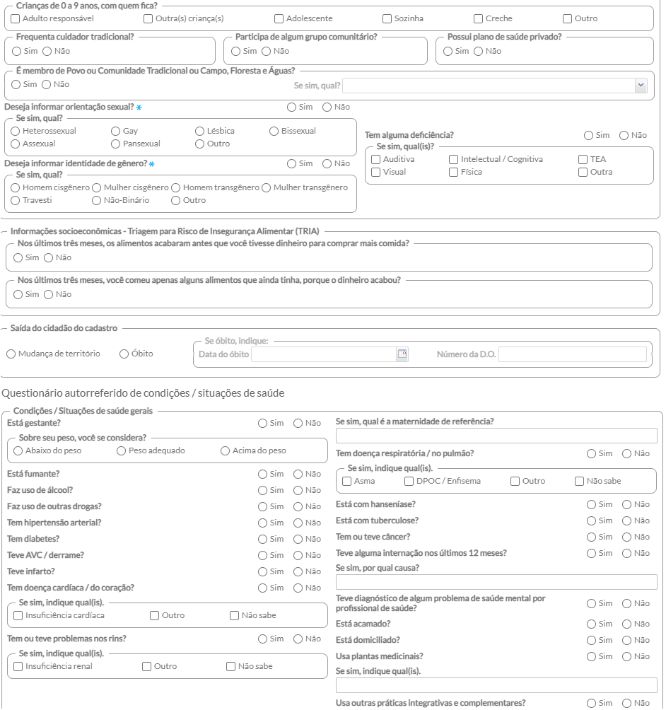

# CAPÍTULO 7 - Coleta de Dados Simplificada (CDS)
{: .no_toc }

Este capítulo apresenta informações para a utilização do Módulo CDS, agregado ao Sistema com PEC, considerando o processo de digitação das fichas previamente preenchidas. Todas as orientações que constam neste manual se aplicam ao Sistema com CDS (*standalone*). Para mais informações sobre o Sistema com CDS, em especial sobre a forma de preenchimento das fichas, consulte o Manual do Sistema com Coleta de Dados Simplificada, disponível por meio do endereço eletrônico [http://dab.saude.gov.br/portaldab/esus.php](http://dab.saude.gov.br/portaldab/esus.php).

## Sumário
{: .no_toc .text-delta }

- TOC
{:toc}

A Coleta de Dados Simplificada (CDS) é um dos componentes da Estratégia e-SUS APS, sendo utilizada principalmente nos serviços de saúde que não dispõem de sistema informatizado para utilização rotineira no trabalho.

{: .nota }
Para conhecer os conceitos e orientações de preenchimento das fichas, consulte o Manual do Sistema com Coleta de Dados Simplificada (CDS).

# 7.1 Visão Geral do Sistema/Módulo CDS

O Sistema com CDS ou o Módulo CDS (do Sistema com PEC) é um **sistema de apoio à digitação** das fichas que compõem esse sistema. A Figura 7.1 apresenta a tela principal do CDS, na qual também são visualizadas os módulos para o registro de informações, que compõem o sistema e-SUS APS. São elas:

- Cadastro individual;
- Cadastro domiciliar e territorial;
- Atendimento individual;
- Atendimento odontológico;
- Atividade coletiva;
- Procedimentos;
- Visita domiciliar e territorial;
- Marcadores de consumo alimentar;
- Avaliação de elegibilidade e admissão;
- Atendimento domiciliar;
- Síndrome neurológica por Zika/Microcefalia;
- Vacinação.

Figura 7.1 - Tela do menu do CDS

Fonte: SAS/MS.

{: .nota }
Devido a Emergência Mundial de Saúde Pública provocada pela Covid-19 foi elaborado uma ficha adicional de vacinação para registro da campanha de vacinação contra a Covid-19. Os registros desta ficha deverão ser realizados também no módulo de vacinação.

## 7.1.1 Orientações Gerais sobre o Processo de Digitação das Fichas

O processo de digitação deve ser definido no âmbito da gestão municipal, considerando os aspectos logísticos e os recursos humanos disponíveis para esse fim. Em especial, considerando os diferentes cenários de implantação, como visto no Manual de Implantação da Estratégia e-SUS APS, o fluxo deve estar adequado a cada realidade.

Veja a Nota Técnica: [**Alimentação dos sistemas de informação pelos profissionais das equipes de Atenção Básica**](http://189.28.128.100/dab/docs/portaldab/documentos/NT_ACS.pdf) ([[http:// 189.28.128.100/dab/docs/portaldab/documentos/ NT_ACS.pdf]](http://189.28.128.100/dab/docs/portaldab/documentos/NT_ACS.pdf)). De modo a facilitar o processo de digitação, foi elaborado modelo padrão de cabeçalho para todas as fichas usadas no Sistema com CDS, como ilustrado na Figura 7.2. Estes campos não são registrados no sistema, tampouco existe relatório desse processo, e são de uso exclusivo dos responsáveis pela digitação para **controle interno da digitação**.

Figura 7.2 - Cabeçalho- padrão das fichas CDS

Fonte: SAS/MS.

Cada campo é definido da seguinte maneira:

- **DIGITADO POR:** nome do profissional que digitou a ficha;

- **DATA:** dia em que a digitação foi realizada;

- **CONFERIDO POR:** nome do profissional que fez a supervisão do processo de digitação da ficha;

- **FOLHA Nº:** este campo pode ser utilizado na organização do processo de trabalho do profissional que preencher as informações da ficha em determinado contexto, identificando, quando for o caso, o número da folha usada para esse fim.

## 7.1.2 Orientações Gerais sobre Digitação das Fichas no Sistema

Conforme vimos na Figura 7.1, o Sistema com CDS organiza as ferramentas para digitação por fichas. De modo geral, quando acessamos alguma das fichas é possível observar a lista com os registros que já foram digitados no sistema (estará vazia quando não houver nenhuma ficha digitada, ou se já tiverem sido enviadas), como podemos ver na Figura 7.3, para o caso das Fichas de Atendimento Individual.

Figura 7.3 - Ficha de Atendimento Individual - listagem

Fonte: SAS/MS.

Portanto, para digitar uma ficha, selecione a ferramenta correspondente, na tela principal, conforme a ficha que deseja digitar. Após abrir a tela de listagem da ficha correspondente, clique no botão . Logo depois, já é possível iniciar a digitação da ficha. Nas seções a seguir, cada ficha será abordada com mais detalhes.

Neste momento, vale destacar ainda o componente de filtro , disponível na listagem das fichas, conforme podemos ver na Figura 7.4. Ele permite a realização de pesquisa utilizando algumas informações dos cabeçalhos das fichas, como o CNS do profissional, data de nascimento, CBO, CNES da unidade onde a ficha foi preenchida, INE, entre outras. Os campos de pesquisa variam de acordo com cada ficha.

Figura 7.4 - Componente de filtro da listagem das fichas

Fonte: SAS/MS.

Para filtrar a lista, digite a informação desejada no campo correspondente e clique no botão Pesquisar . Para retirar o filtro, deixe todos os campos vazios e clique novamente em Pesquisar.

Outra funcionalidade importante na listagem de fichas é o controle de envio das fichas. As fichas não enviadas recebem uma marcação especial, como podemos ver na Figura 7.5. Quando uma ficha é enviada a marcação some, indicando que a ficha já foi enviada/transmitida para o SISAB.

Figura 7.5 - Fichas não enviadas

Fonte: SAS/MS.

A partir da versão 4.3 do sistema e-SUS APS, as fichas são pré-salvas em formato de rascunho, evitando que os dados se percam. Entretanto, para que a ficha seja enviada é necessário salvá-la. Quando a ficha estiver no formato rascunho irá apresentar uma marcaçao na cor laranja.

Figura 7.6 - Ficha no formato rascunho

Fonte: SAS/MS.

Se aparecer essa marcação na cor laranja na listagem das fichas clique em editar  e em seguida clique em "Salvar" para que a mesma possa ser enviada. 

Na listagem das fichas, ainda existem várias ações possíveis para cada registro e, por padrão, as seguintes opções estão disponíveis:

-  **Visualizar:** permite visualizar as informações de uma ficha digitada;

-  **Editar:** permite fazer alterações em uma ficha digitada. Disponível apenas para fichas não enviadas.

-  **Excluir:** permite excluir uma ficha digitada. Disponível apenas para fichas não enviadas.
 
{: .atencao }
Com exceção da ficha de vacina, caso a ficha digitada já tenha sido transmitida para o SISAB, não será possível editá-la ou excluí-la (botão esmaecido), apenas será possível visualizar a ficha .

## 7.1.3 Inconsistência ao Finalizar a Digitação

Ao finalizar a digitação de uma ficha, clique no botão . Caso o sistema não detecte alguma inconsistência, o sistema salvará os dados e voltará para a tela com a lista de registros/colunas da ficha.

Caso haja alguma inconsistência, o sistema mostrará mensagem na tela indicando os campos que deverão ser corrigidos, como ilustrado na Figura 7.6.

Figura 7.6 - Verificação de inconsistência ao finalizar a digitação

Fonte: SAS/MS.

Verifique as mensagens, corrigindo a informação conforme estiver preenchido na ficha. Caso ela esteja preenchida de forma **inconsistente**, em relação à validação do sistema, **cancele a digitação** da ficha e informe o supervisor, a equipe de saúde ou o profissional responsável pelo preenchimento dela.

{: .atencao }
caso alguma **inconsistência** seja **detectada** pela validação do sistema, o supervisor ou o próprio profissional deve ser avisado para que esta ficha possa ser **verificada na origem da informação**.

# 7.2 Cadastro da Atenção Básica

O Cadastro da Atenção Básica (AB) é uma extensão do CadSUS no que se refere aos dados que apoiam as equipes de AB a mapear as características sociais, econômicas e de saúde da população adscrita ao território sob sua responsabilidade. Esse cadastro está organizado em duas dimensões: a) Cadastro individual e b) Cadastro domiciliar e territorial.

## 7.2.1 Cadastro Individual

Na tela principal, clique em "Cadastro individual". A janela com a lista de fichas digitadas de cadastro individual será mostrada, conforme a Figura 7.7. É possível visualizar esta lista e as opções relacionadas a cada registro, além das opções de filtro da lista.

Figura 7.7 - Tela principal do cadastro individual

Fonte:SAS/MS.

### 7.2.1.1 Adicionar Cadastro Individual

Após clicar no botão \"Adicionar\", o sistema mostrará a tela de preenchimento da ficha de cadastro, conforme as Figuras 7.8, 7.9 (continuação) e 7.10 (continuação).

Figura 7.8 - Adicionar cadastro individual

Fonte:SAS/MS.

Figura 7.9 - Adicionar cadastro individual - continuação

Fonte:SAS/MS.

Figura 7.10 - Adicionar cadastro individual - continuação

Fonte:SAS/MS.

Para digitar a ficha de cadastro, atente para o que se segue:

#### 7.2.1.1.1 Informações de cabeçalho

1.Preencha os campos do cabeçalho, digitando os dados que constam na ficha de cadastro;

a.Ao incluir o número do Cartão SUS do profissional, o sistema mostrará opções para o CNES e o INE que vêm da base de dados do CNES importado na instalação da aplicação;

b.Caso o profissional tenha apenas um vínculo no município, os dados serão preenchidos automaticamente;

c.Caso o trabalhador tenha mais de um vínculo, o sistema mostrará as opções e o digitador indicará o que está registrado na ficha. Também são apresentados para o preenchimento, dependendo da ficha que irá digitar, os campos "microárea" e a data em que o cadastro foi realizado;

#### 7.2.1.1.2 Dados de identificação

2.Preencha os "Dados de identificação" do cidadão de acordo com a ficha CDS. Se a resposta da questão "Cidadão é o responsável familiar?" for "Não", o campo "CNS ou CPF do responsável familiar" deve ser preenchido obrigatoriamente;

#### 7.2.1.1.3 Informações sociodemográficas

3.Preencha as "Informações sociodemográficas" de acordo com as informações da ficha. Se a resposta de uma questão for "Sim", verifique as opções adicionais de preenchimento (ex.: Tem alguma deficiência? "Sim". Então, responda também "Se sim, quais?" outro exemplo; É membro de povo ou comunidade tradicional? Se sim, qual?). No momento da digitação, deve- se escolher uma das opções disponíveis no software, conforme seu preenchimento na ficha.

#### 7.2.1.1.4 Questionário autorreferido de condições/situações de saúde

4.Preencha as informações de "Condições/situações de saúde gerais" do cidadão de acordo com os dados da ficha. Observe que algumas perguntas devem ser especificadas caso a resposta seja "Sim";

#### 7.2.1.1.5 Cidadão em situação de rua

5.Preencha as informações de "Em situação de rua" de acordo com as informações registradas na ficha. Observe que a pergunta "Está em situação de rua" é obrigatória;

6.Após a digitação dos dados, clique no botão  e, caso haja alguma inconsistência, o sistema mostrará mensagem na tela indicando os campos que deverão ser corrigidos. Se não houver inconsistência, o sistema salvará os dados e voltará para a tela anterior.

### 7.2.1.2 Adicionar Cadastro Individual com Termo de Recusa

Para fazer cadastro individual com termo de recusa, siga os passos:

- Passo 1. Preencha os dados de cabeçalho e de identificação do cidadão;

- Passo 2. Marque o campo "Termo de recusa do cadastro individual da Atenção Básica" quando o cidadão não desejar ser cadastrado pela equipe de saúde, seja Saúde da Família ou Unidade de Saúde Tradicional;

{: .atencao }
caso o campo "Termo de recusa" seja marcado, os campos ficam desabilitados para preenchimento, exceto os campos de identificação do cidadão.

## 7.2.2 Cadastro domiciliar e territorial

Na tela principal do CDS, clique em "Cadastro domiciliar e territorial". A janela da "Lista de cadastro domiciliar" será mostrada, conforme a Figura 7.11. É possível visualizar a lista de cadastros realizados, o componente de filtro e as opções relacionadas a cada registro.

Figura 7.11 - Tela principal do cadastro domiciliar

Fonte: SAS/MS.

Como vimos nas orientações gerais de digitação das fichas, várias ações podem ser realizadas para cada registro. E, em especial para as fichas de Cadastro Domiciliar, ainda podem ser destacadas duas opções:

-  **Cadastros individuais:** permite visualizar dados das famílias vinculadas àquele domicílio;

-  **Atualizar**: permite atualizar os dados cadastrais do domicílio.

Por fim, o botão  é utilizado para incluir novos cadastros domiciliares. Vamos observar como é realizado este cadastro.

### 7.2.2.1 Adicionar Cadastro Domiciliar

Após clicar no botão \"Adicionar\", o sistema mostrará a tela de preenchimento da ficha de cadastro, conforme a Figura 7.12.

Figura 7.12 - Adicionar cadastro domiciliar

Fonte: SAS/MS.

Para digitar a ficha de cadastro, observe os seguintes itens:

#### 7.2.2.1.1 Informações de cabeçalho

1.Preencha os campos do cabeçalho, digitando os dados que constam na ficha de cadastro;

a.Ao incluir o número do Cartão SUS do profissional, o sistema mostrará opções para o CNES e o INE que vêm da base de dados do CNES importado na instalação da aplicação;

b.Caso o profissional tenha apenas um vínculo no município, os dados serão preenchidos automaticamente.

c.Caso tenha mais de um, o sistema mostrará as opções e o digitador indicará o que está registrado na ficha. Também será apresentado para preenchimento, de acordo com a ficha, o campo "Data" em que o cadastro foi realizado;

#### 7.2.2.1.2 Informações de identificação e contato do domicílio

2.Preencha as informações do "Endereço/Local de permanência" do domicílio.

a.Após preenchimento do CEP, os campos "Município", "UF", "Bairro"  e "Tipo de logradouro" e "Nome de logradouro" são completados  automaticamente, conforme pec_imagem a seguir:

b.Também é possível incluir, nesse cadastro, as informações sobre o "Tipo de imóvel" e "Telefones para contato". Atenção para o telefone, que deve estar acompanhado pelo número de DDD do município;

c.Para o "Tipo de imóvel", selecione uma das opções:

- 01 - Domicílio

- 02 - comércio

- 03 - terreno baldio

- 04 - Ponto Estratégico (PE: cemitério, borracharia, ferro- velho,  depósito de sucata ou materiais de construção, garagem de ônibus  ou veículo de grande porte)

- 05 - Escola

- 06 - Creche

- 07 - Abrigo

- 08 - Instituição de longa permanência para idosos

- 09 - Unidade prisional

- 10 - Unidade de medida sócio educativa

- 11 - Delegacia

- 12 - Estabelecimento religioso

- 99 - Outros

| **Atenção para as regras do sistema a partir do Tipo de Imóvel!**|
|- |
| **Domicílio:** |
|- Ao selecionar a opção \"01 - ­Domicílio\" para Tipo de Imóvel, serão desabilitados os campos \"Nome da instituição de permanência\" e \"Existem outros profissionais de saúde vinculados à instituição (não inclui profissionais da rede pública de saúde)?\", além do grupo \"Identificação do responsável técnico da instituição de permanência\". Será alterado o nome do grupo \"Termo de recusa\" para \"Termo de recusa do cadastro domiciliar e territorial da Atenção Básica\". |

| **Imóveis sem finalidade de moradia/longa permanência:**|
|- |
| - No caso da seleção das opções \"02 - ­ Comércio\", \"03 - ­ Terreno baldio\", \"04 - ­ Ponto estratégico\", \"05 - ­ Escola\", \"06 - ­ Creche\", \"12 - ­ Estabelecimento religioso\" ou \"99 - ­ \Outros\", serão desabilitados os grupos \"Condições de moradia\", \"Animais no domicílio?\", \"Famílias\", \"Identificação do responsável técnico da instituição de permanência\" e \"Termo de recusa\". Também serão desabilitados os campos \"Nome da instituição de permanência\" e \"Existem outros profissionais de saúde vinculados à instituição (não inclui profissionais da rede pública de saúde)?\".|

| **Instituição de longa permanência:**|
|- |
| - E se forem selecionadas as opções \"07 - ­ Abrigo\", \"08 - ­ Instituição de longa permanência para idosos\", \"09 - ­ Unidade prisional\", \"10 - ­ Unidade de medida sócio educativa\" ou \"11 - ­ Delegacia\", os campos \"Situação de moradia/Posse de terra\", \"Tipo de domicílio\", \"Nº de cômodos\", \"Em caso de área de produção rural: condição de posse e uso da terra\", \"Material predominante na construção das paredes externas de seu domicílio\" e \"Tipo de acesso ao domicílio\", os grupos \"Animais no domicílio\" e \"Famílias\" serão desabilitados. Nesta ocasião, será alterado o nome do termo de recusa para \"Termo de recusa do cadastro da instituição de permanência\".|

#### 7.2.2.1.3 Condições de moradia

3.Preencha as informações de "Condições de moradia" de acordo com o registrado na ficha. Caso o campo "Animais no domicílio" estiver marcado com a resposta "Sim", informe "Qual(is)" e "Quantos", como mostra a pec_imagem abaixo:

#### 7.2.2.1.4 Adicionar núcleo familiar

4.Preencha as informações do bloco "Famílias" (núcleos familiares) que vivem no domicílio. Cada uma é representada pelo número do CNS ou CPF do Responsável Familiar de cada núcleo familiar. Para adicionar uma família, basta preencher os campos no início do bloco e clicar no botão "Confirmar";

a.Caso existam **mais famílias** informadas na ficha, **repita o processo conforme item anterior** para todas as linhas que identificam núcleos familiares daquele domicílio;

b.Ao digitar as informações, após confirmada a inclusão, caso alguma tenha sido registrada de forma incorreta, é possível alterá- la de um registro já incluído, clicando na opção  "Editar". O registro será habilitado para edição nos campos de entrada de dados principal. Para salvar, clique novamente no botão "Confirmar";

c.Durante a atualização deste registro, ver mais na Seção 7.1.3, é possível indicar se a família "mudou- se" clicando na caixa correspondente. Esta opção está desabilitada ao adicionar nova família;

d.Caso o registro tenha sido inserido de forma incorreta, também é possível excluir a família. Para excluir o registro, clique na opção  "Excluir" e este será removido;

5.Após a digitação dos dados, clique no botão  e, caso haja alguma inconsistência, o sistema mostrará mensagem na tela indicando os campos que deverão ser corrigidos. Se não houver inconsistência, o sistema salvará os dados e voltará para a tela anterior.

### 7.2.2.2 Adicionar Cadastro Domiciliar com Termo de Recusa

O campo ao final da ficha/tela do termo de recusa tem um processo de cadastro diferenciado. Ao ter um cadastro domiciliar com termo de recusa preenchido, basta adicionar os dados de identificação do domicílio e marcar a opção \"Termo de recusa do cadastro domiciliar da Atenção Básica\", conforme a Figura 7.13.

Figura 7.13 - Termo de recusa do cadastro domiciliar

Fonte: SAS/MS.

{: .atencao }
caso o campo de termo de recusa seja marcado, os campos ficam desabilitados para preenchimento, exceto os campos de identificação do imóvel.

## 7.2.3 Atualizar Cadastro da Atenção Básica

A ferramenta de "Atualizar" é parte importante do processo de trabalho das equipes para manter as informações do território atualizadas.

Ao clicar no botão "Atualizar"  é iniciado o procedimento de atualização das fichas. Serão apresentadas todas as informações do último registro salvo, com a exceção dos Campos do cabeçalho (CNS do profissional, CNES, INE, Microárea e Data) e do Campo \"Saída do cidadão do cadastro\". Será permitida a alteração dos dados, exceto do campo \"CNS do cidadão\" quando estiver preenchido. Ao informar o CNS ou CPF do cidadão, o sistema deverá verificar se o mesmo existe na base de dados e apresentará a mensagem \"CNS já cadastrado no sistema.\" com opção \"OK\" e não permitirá salvar o registro até que esta ação seja resolvida. Caso contrário, as alterações serão salvas normalmente.

# 7.3 Fichas de Atendimento

As fichas de atendimento são utilizadas para registro dos profissionais de nível superior. Elas não objetivam esgotar todo o processo de atendimento de um indivíduo e também não substituem o registro clínico feito no prontuário em papel. As informações nelas contidas foram selecionadas segundo a sua relevância no cuidado ao cidadão e por comporem indicadores de monitoramento e avaliação para a AB e para as Redes de Atenção à Saúde como um todo.

## 7.3.1 Ficha de Atendimento Individual

Na tela principal do Módulo do CDS, clique no ícone "Ficha de Atendimento Individual". Será apresentada a lista das "Fichas de Atendimento Individual" digitadas, em que constará a Data do atendimento, CNS do profissional responsável pelo atendimento, CBO do profissional, CNES da UBS, e o INE da equipe, conforme a Figura 7.14.

Figura 7.14 - Lista de Fichas de Atendimento Individual

Fonte: SAS/MS.

### 7.3.1.1 Adicionar Ficha de Atendimento Individual

Para informar nova Ficha de Atendimento Individual, clique no botão . O sistema exibirá uma tela , conforme a Figura 7.15.

Figura 7.15 - Adicionar Ficha de Atendimento Individual

Fonte: SAS/MS.

Para preencher os dados da Ficha de Atendimento Individual, atente para os itens a seguir:

#### 7.3.1.1.1 Informações de cabeçalho

1.Preencha o cabeçalho da ficha (Figura 7.15), ao incluir o número do CNS do profissional, o sistema mostrará opções para o CBO, CNES e INE que vêm da base de dados do CNES importado na instalação da aplicação;

a.caso o profissional tenha apenas um vínculo no município, os dados serão preenchidos automaticamente;

b.caso o profissional tenha mais de um vínculo, o sistema mostrará as opções e o digitador indicará o que está registrado na ficha. Também são apresentados para preenchimento os campos para inclusão de outros profissionais da equipe para os casos em que houver a realização de consulta compartilhada;

2.para informar novo registro de atendimento, clique no botão . O sistema exibirá uma tela com cabeçalho preenchido (somente leitura) e os dados a serem completados para cada atendimento;

a.deve- se obedecer o conteúdo da ficha, portanto, poderão ser  registrados até 13 atendimentos para usuários diferentes e  realizados pelo mesmo profissional;

3.quando for realizado um atendimento compartilhado é necessário incluir os dados do outro profissional que participou.

#### 7.3.1.1.2 Dados de identificação do cidadão

4.digite os dados conforme preenchido na ficha, iniciando- se pelos dados de identificação do cidadão e de alguns dados sobre o atendimento;

5.na sequência, digite o tipo de atendimento e alguns dados de saúde, conforme preenchido na ficha;

6.após, digite as informações correspondentes ao bloco "Problema/Condição Avaliada". Atenção aos campos CIAP2 e CID10, que são informados usando códigos correspondentes das classificações e estão no verso da ficha, acompanhados de outras opções;

7.na sequência, marque os exames solicitados e avaliados. Cada *checkbox* corresponde a um item marcado na ficha pelo profissional. Atenção aos itens "Outros exames", que são informados pelo código do SIGTAP e acompanhados de uma marcação se foi solicitado (S) e/ou avaliado (A);

8.por último, informe se ficou em observação. Caso se trate de **profissional do NASF** ou Polo, marque as opções correspondentes. Assinale, também, as opções de conduta/desfecho e/ou encaminhamento, caso tenha sido assinalado na ficha;

9.após a digitação dos dados, clique no botão  e, caso haja alguma inconsistência, o sistema mostrará mensagem na tela indicando os campos que deverão ser corrigidos. Se não houver inconsistência, o sistema salvará os dados e voltará para a tela anterior.

#### 7.3.1.1.3 Lista de registro dos atendimentos individuais

O sistema traz, para cada ficha, a lista dos atendimentos individuais. Ao clicar em visualizar ou editar é possível acessar o conteúdo do atendimento, facilitando a busca do registro pelo usuário do sistema, como podemos ver na Figura 7.16.

Figura 7.16 - Lista de registros de atendimento na Ficha de Atendimento Individual

Fonte: SAS/MS.

Ao finalizar a digitação da Ficha de Atendimento Individual, clique no botão 

## 7.3.2 Ficha de Atendimento Odontológico Individual

Na tela principal do CDS, clique no ícone "Ficha de Atendimento Odontológico". Será apresentada a lista das "Fichas de Atendimento Odontológico" digitadas, conforme a Figura 7.17, em que constará a data do atendimento, o número do CNS do profissional que preencheu a ficha, o CBO do profissional, o código CNES da UBS e o código INE da equipe.

Figura 7.17 - Lista de Fichas de Atendimento Odontológico

Fonte: SAS/MS.

### 7.3.2.1 Adicionar Ficha de Atendimento Odontológico

Para informar nova Ficha de Atendimento Odontológico, clique no botão  e atente para os itens a seguir:

1.após clicar no botão \"Adicionar\", o sistema mostrará a tela de preenchimento da ficha de cadastro;

#### 7.3.2.1.1 Informações de cabeçalho

2.digite os dados do cabeçalho conforme preenchido na ficha, ao incluir o CNS do profissional, o sistema mostrará opções para o CBO, CNES e INE que vêm da base de dados do CNES importado na instalação da aplicação;

a.caso o profissional tenha apenas um vínculo no município, os dados serão preenchidos automaticamente;

b.caso o profissional tenha mais de um vínculo, o sistema mostrará as opções e o digitador indicará o que está registrado na ficha;

c.também são apresentados para preenchimento os campos para inclusão de outros profissionais da equipe para os casos em que houver a realização de atendimento compartilhado;

3.para informar novo registro de atendimento, clique no botão . O sistema exibirá uma tela com cabeçalho preenchido (somente leitura) e os dados a serem completados para cada atendimento;

a.deve- se obedecer ao conteúdo da ficha, portanto poderão ser registrados até 13 atendimentos para usuários diferentes e realizados pelo mesmo profissional;

#### 7.3.2.1.2 Dados de identificação do cidadão e do serviço de saúde

4.digite os dados no sistema conforme preenchido na ficha, iniciando pelos dados de identificação do cidadão e alguns dados sobre o atendimento;

5.digite os dados "Tipo de atendimento", "Tipo de consulta" e "Vigilância em saúde bucal", que são obrigatórios;

6.digite os dados de procedimentos realizados no sistema, conforme preenchido na ficha. Perceba que, diferentemente da Ficha de Atendimento Individual, os procedimentos de odontologia são preenchidos com a quantidade;

7.no campo "Outros procedimentos", digite os procedimentos preenchidos com a quantidade informada na coluna da ficha e o código do SIGTAP informado na linha da ficha, nos respectivos campos "Quantidade" e "Procedimento", e clique em "Confirmar". Faça isso para todos os procedimentos preenchidos na coluna correspondente ao registro de atendimento do cidadão;

8.por fim, digite os itens de fornecimento, caso estes tenham sido preenchidos na ficha, e a conduta/desfecho e/ou encaminhamento, caso tenha sido realizado no atendimento;

9.após a digitação dos dados, clique no botão  e, caso haja alguma inconsistência, o sistema mostrará mensagem na tela indicando os campos que deverão ser corrigidos. Se não houver inconsistência, o sistema salvará os dados e voltará para a tela anterior.

#### 7.3.2.1.3 Lista de registro dos atendimentos individuais

Diferentemente das versões anteriores do CDS, em que cada registro de atendimento era mostrado em abas, desde a versão 1.3, o sistema traz a lista de atendimentos, representada em forma de colunas na Ficha de Atendimento Odontológico, facilitando a busca do registro pelo usuário do sistema, como podemos ver na Figura 7.18.

Figura 7.18 - Lista de registros de atendimento na Ficha de Atendimento Odontológico

Fonte: SAS/MS.

Ao finalizar a digitação da Ficha de Atendimento Odontológico, clique no botão .

# 7.4 Ficha de Atividade Coletiva

A Ficha de Atividade Coletiva visa ao registro das atividades realizadas pelas equipes conforme as necessidades do território e capacidade da equipe de estruturar as ações. Nela, pode ser registrada ações estruturantes para a organização do processo de trabalho, como reuniões da própria equipe de saúde, reuniões com outras equipes de saúde, ou reuniões com outros órgãos, além das atividades de saúde voltadas para a população, como: educação em saúde, atendimentos, avaliações em grupo e mobilizações sociais, conforme podemos ver na Figura 7.19.

Figura 7.19 - Tipo de atividade da Ficha de Atividade Coletiva

Fonte: SAS/MS.

## 7.4.1 Adicionar Ficha de Atividade Coletiva

Na tela principal, clique no ícone "Ficha de Atividade Coletiva". Será apresentada a lista das "Fichas de Atividade Coletiva" digitadas, em que constará a data da atividade, o tipo de atividade realizada, o número do Cartão SUS do profissional responsável pela atividade, o CBO do profissional, o código CNES da UBS e o código INE da equipe, conforme a Figura 7.20.

Figura 7.20 - Lista de atividade coletiva

Fonte: SAS/MS.

Para informar Ficha de Atividade Coletiva, clique no botão  e atente para os itens a seguir:

1.Digite as informações sobre a atividade coletiva realizada nos campos apresentados no início da ficha. Perceba que o cabeçalho é um pouco diferente das demais fichas, informando dados do profissional responsável por organizar e conduzir a atividade coletiva;

2.Digite as informações da realização da atividade, como Turno, Programa saúde na escola, Local de atividade, etc.;

a.Caso seja uma atividade do Programa Saúde na Escola, o n⁰ do INEP (Escola/Creche) deve estar preenchido no bloco "Local da  atividade", assim como, deve ser preenchida no bloco "Programa  saúde na escola", se é uma atividade realizada pela equipe de educadores da escola e/ou pela equipe de saúde;

b.Atividades realizadas em outros estabelecimentos de saúde que não o estabelecimento de origem da equipe, deverá ser preenchido o campo "CNES" no bloco Local de atividade (Exemplo: quando realiza atividade em um Polo de Academia da Saúde);

{: .atualizacao }
A partir da versão 3.1, no momento da digitação da ficha será apresentada uma lista com as Escolas do Município no campo INEP, com o isso deve- se escolher uma das escolas listadas para informar onde a Atividade Coletiva foi realizada.

3.No bloco "Profissionais participantes", preencha o n⁰ do CNS e o CBO de cada profissional que participou da atividade e clique em , inserindo- os na lista, um a um;

a. Caso necessário, para excluir um profissional da lista, clique  na opção  "Excluir";

4.Preencha o "Nº de participantes" e o campo "Nº de avaliações alteradas", o qual traz o resultado da contagem de participantes da atividade coletiva que tiveram a marcação de "Avaliação alterada" na lista de participantes;

### 7.4.1.1 Atividades de planejamento da equipe e temas para reunião

5.As atividades 01, 02 e 03 estão relacionadas com quaisquer dos assunto do bloco "Temas para reunião", conforme pec_imagem abaixo;

a. Quando a atividade não for destinada a atender aos 03 (três) itens acima descritos, o sistema desabilita o bloco "Temas para reunião";

### 7.4.1.2 Atividades de saúde

6.As atividades relacionadas a ações de saúde com os usuários (itens 04, 05, 06 e 07) fazem relação com os blocos "Público- alvo", "Temas para saúde" e "Práticas em saúde";

a.O bloco "Público alvo" é de múltipla opção, sendo de preenchimento obrigatório para as atividades 4, 5, 6 e 7;

b.O bloco "Temas para saúde" também é de múltipla opção, sendo de preenchimento obrigatório para as atividades 4, 5 e 7;

c.O bloco "Práticas em saúde" é de opção única e de preenchimento obrigatório para a atividade 6, e de múltipla opção para atividades 5.

### 7.4.1.3 Adicionar participantes

7.Para adicionar os participantes da atividade coletiva, é necessário incluir os dados do CNS do cidadão, data de nascimento e sexo;

8.Caso a opção "Prática em saúde" seja marcada como \"Antropometria\", os campos "Peso" e "Altura" da lista de participantes se tornam obrigatórios;

9.Para atividades de "avaliação/procedimento coletivo", é possível indicar se foi identificada alguma alteração durante a avaliação realizada ao cidadão usando a opção "Avaliação alterada".

10.É possível registrar no bloco "Práticas em saúde" qual sessão do Programa Nacional de Controle do Tabagismo (PNCT) os cidadãos participaram. Ao clicar em uma das sessões do PNCT habilita- se o campo "Programa Nacional de Controle do Tabagismo", onde poderá informar, caso necessário, se o cidadão cessou o hábito de fumar e/ou abandonou o grupo;

11. Clique no botão  e o sistema incluirá o cidadão na lista e mostrará uma linha com campos em branco para o próximo preenchimento. Repita esses passos para informar todos os participantes da atividade coletiva;

12. Caso seja necessário alterar as informações de algum participante, clique no ícone  "Editar" e as informações serão carregadas nos campos abertos. Para salvar, clique no ícone . Há possibilidade de edição das fichas até o momento do seu envio;

13. Caso seja necessário excluir um participante, clique no ícone  "Excluir". O registro será removido;

14. Ao finalizar a digitação da ficha, clique no botão .

## 7.4.2 Copiar Ficha de Atividade Coletiva

Além das opções- padrão da listagem da Ficha de Atividade Coletiva, ainda tem a opção  "**Copiar**", que estará disponível apenas para o caso de uma atividade coletiva do tipo **"Avaliação/Procedimento Coletivo"**. Para outros tipos de atividades, esta opção não estará disponível, como podemos visualizar na Figura 7.21.

Essa opção auxilia, portanto, nas atividades de avaliação/procedimento coletivo feitas com o mesmo grupo de indivíduos, por exemplo, as atividades do Programa Saúde na Escola.

Figura 7.21 - Tipo de atividade em que a função "Copiar" está disponível (somente para a avaliação/procedimento coletivo)

Fonte: SAS/MS.

# 7.5 Ficha de Procedimentos

A Ficha de Procedimentos é utilizada para a coleta de dados sobre a realização de procedimentos ambulatoriais. Ela capta os procedimentos que foram realizados por determinado profissional, diferentemente da Ficha de Atendimento Individual, em que são registradas a solicitação e a avaliação de exames.

## 7.5.1 Como registrar as informações de uma Ficha de Procedimentos

Na tela principal, clique no ícone "Ficha de Procedimentos". Será apresentada a lista das "Fichas de Procedimento" digitadas, em que constará a data do atendimento, o CNS do profissional responsável pela ficha, o CBO do profissional, o código CNES da UBS e o código INE da equipe, conforme abaixo:

Figura 7.22 - Tela principal com a lista de Fichas de Procedimentos

Fonte: SAS/MS.

### 7.5.1.1 Adicionar Ficha de Procedimentos

Figura 7.23 - Adicionar Ficha de Procedimentos

Fonte: SAS/MS.

1.Após clicar no botão "Adicionar", o sistema mostrará a tela de preenchimento da Ficha de Procedimentos para ser preenchida;

#### 7.5.1.1.1 Informações de cabeçalho

2.Digite o cabeçalho conforme preenchido na ficha;

3.Ao incluir o número do CNS do profissional, o sistema mostrará opções para o CNES e INE que vêm da base de dados do CNES importado na instalação da aplicação;

4.Caso o profissional tenha apenas um vínculo no município, os dados serão preenchidos automaticamente;

5.Caso o profissional tenha mais de um vínculo, o sistema mostrará as opções e o digitador indicará o que está registrado na ficha. Diferentemente da Ficha de Atendimento Individual, a Ficha de Procedimentos é por profissional e não permite o registro de ações compartilhadas;

6.Para informar novo registro de procedimentos de um atendimento, clique no botão ;

#### 7.5.1.1.2 Registro de procedimentos individualizados

7.O primeiro bloco de informações são relacionados aos dados do cidadão atendido, local de atendimento e se houve escuta inicial/orientação;

8.Os campos marcados com um asterisco (\*) na cor azul, são de preenchimento obrigatório. O campo "Nº do prontuário" deve ser numérico. O campo "CNS do cidadão" será validado por meio de algoritmo e deverá possuir, no mínimo, 15 caracteres;

#### 7.5.1.1.3 Detalhamento dos procedimentos individualizados realizados

9.Preencha os dados solicitados referentes ao atendimento do cidadão, marcando os procedimentos conforme preenchido na ficha;

10. Para os campos de \"Outros Procedimentos\", preencha o campo \"Código do SIGTAP\" conforme informado na ficha, e aperte a tecla \"Enter\" ou clique no procedimento. Todos os procedimentos informados por código do SIGTAP serão incluídos na Lista de Procedimentos;

11. Ao finalizar o preenchimento, clique no botão . Caso haja alguma inconsistência, o sistema mostrará mensagem na tela indicando os campos que deverão ser corrigidos. Do contrário, o sistema salvará os dados e voltará para a tela com a lista de registros da ficha.

#### 7.5.1.1.3 Lista de registro dos procedimentos individualizados

O sistema traz, para cada ficha, uma lista dos registros dos procedimentos individualizados por cidadão. Ao clicar em visualizar ou editar é possível acessar o conteúdo do registro, facilitando a busca do registro pelo usuário do sistema, como podemos ver na Figura 7.24.

Figura 7.24 - Lista de registros de atendimento na Ficha de Procedimentos

Fonte: SAS/MS.

O número de registros deve obedecer ao conteúdo da ficha, portanto poderão ser registrados no máximo 14 registros para cada cidadão e realizados pelo mesmo profissional.

#### 7.5.1.1.4 Registro dos procedimentos consolidados

Com intuito de dar mais destaque e facilitar o preenchimento e uso do bloco para registro dos procedimentos consolidados, este se apresenta abaixo da lista de procedimentos individualizados, como podemos visualizar na Figura 7.25.

Figura 7.25 - Registro de procedimentos consolidados

Fonte: SAS/MS.

Como podemos visualizar, os procedimentos individualizados permanecem em telas separadas para facilitar o registro dos procedimentos consolidados. Caso não haja nenhum procedimento individualizado, basta preencher os itens consolidados e clicar no botão  para que o sistema guarde o registro da ficha.

# 7.6 Ficha de Visita Domiciliar e Territorial

A Ficha de Visita Domiciliar e Territorial tem como objetivo principal registrar as atividades de visitas domiciliares do Agente Comunitário de Saúde (ACS) ou do Agente de Combate a Endemias (ACE), realizadas no território adstrito à equipe da UBS.

## 7.6.1 Como registrar as informações de uma Ficha de Visita Domiciliar e Territorial

Na tela principal, clique no ícone "Ficha de Visita Domiciliar e Territorial". A janela da lista de "Visita domiciliar" será mostrada, conforme a Figura 7.26.

Figura 7.26 - Listagem da Ficha de Visita Domiciliar

Fonte: SAS/MS.

## 7.6.2 Adicionar Ficha de Visita Domiciliar

Após clicar no botão , siga os passos:

- Passo 1. Preencha os campos do cabeçalho com o CNS do profissional e a data. O sistema automaticamente preencherá os campos CBO e CNES;

- Passo 2. após preencher os dados do cabeçalho, clique no botão  para incluir uma visita domiciliar e territorial individualmente;

### 7.6.2.1 Identificação do usuário e do serviço de saúde

- Passo 3. Na sequência, digite as informações de identificação do usuário e alguns detalhes sobre o serviço de saúde;

### 7.6.2.2 Detalhamento da visita domiciliar

- Passo 4. Marque, conforme preenchido na ficha, o motivo da visita. Perceba que é possível escolher múltiplas opções;

- Passo 5. Caso haja necessidade de acompanhamento do peso e altura dos indivíduos visitados, preencha os campos "Peso (kg)" e "Altura (cm)" do bloco "Antropometria".

- Passo 6. Na sequência, marque a opção de desfecho da visita;

- Passo 7. Para finalizar , clique no botão ;

- Caso haja alguma inconsistência ou ausência de preenchimento de campos obrigatórios, o sistema mostrará mensagem na tela indicando os que deverão ser corrigidos ou preenchidos. Caso contrário, os dados serão salvos e o sistema retornará à lista das fichas de visitas;

- Para cada visita, adicione novo registro, conforme orientado nos passos acima;

- Como na ficha de papel, nesta tela, poderão ser registradas **até 23 visitas domiciliares e territoriais** para cidadãos diferentes e realizados pelo mesmo profissional, na mesma data e turno. Para visualizar todos os registros, use a barra de rolagem (detalhe indicado pela seta vermelha);

- Passo 8. Ao digitar todas as visitas, clique no botão  para concluir a digitação da ficha.

# 7.7 Marcadores de Consumo Alimentar

Esse instrumento permite a identificação de marcadores positivos ou negativos da alimentação e, de maneira mais dinâmica, a composição de indicadores.

{: .dica }
para auxiliar a utilização da ficha, que pode **ser feita por qualquer profissional da Atenção Básica**, e a orientação sobre práticas alimentares saudáveis, recomenda- se o uso do documento "Orientações para Avaliação de Marcadores de Consumo Alimentar na Atenção Básica", disponível em [[http://dab.saude.gov.br/portaldab/biblioteca.php?conteudo=publicacoes/marcadores_consumo_alimentar_atencao_basica]](http://dab.saude.gov.br/portaldab/biblioteca.php?conteudo=publicacoes/marcadores_consumo_alimentar_atencao_basica).

Após clicar no botão , siga os passos:

- Passo 1. Preencha os campos do cabeçalho com o número do CNS do profissional e a data da avaliação. O sistema automaticamente preencherá os campos CBO e CNES;

- Passo 2. Identifique o cidadão atendido. Os campos "Nome do cidadão", "Data de nascimento", "Sexo" e "Local de atendimento" são de preenchimento obrigatório registre também o CNS ou CPF do cidadão.

- Passo 3. Preencha os campos do bloco referente às questões específicas organizadas segundo o grupo etário habilitado pelo sistema, de acordo com a data de nascimento do cidadão.

- Todas as questões do bloco são de preenchimento obrigatório, respeitando- se os casos de opção de múltipla escolha.

**Crianças menores de seis meses:**

**Crianças de 6 a 23 meses:**

**Crianças com dois anos ou mais, adolescentes, adultos, gestantes e idosos:**

- Passo 4. Ao finalizar a digitação da ficha, clique no botão .

# 7.8 Ficha de Avaliação de Elegibilidade e Admissão

**Exclusiva para uso em Serviço de Atenção Domiciliar (SAD)**, pode ser utilizada pelos profissionais das equipes de Atenção Domiciliar (AD), cadastrados no CNES, por meio dos tipos: i) Equipe Multiprofissional de Atenção Domiciliar (EMAD); e ii) Equipe Multiprofissional de Apoio (EMAP). Esse instrumento permite identificar os cidadãos elegíveis para acompanhamento pelas equipes de AD.

## 7.8.1 Como registrar as informações de uma Ficha de Avaliação de Elegibilidade

Na tela principal, clique no ícone "Ficha de Avaliação de Elegibilidade". A janela da lista de fichas digitadas de avaliações de elegibilidade e admissão será mostrada, conforme a Figura 7.27.  

Figura 7.27 - Listagem da Fichas de Avaliação de Elegibilidade

Fonte: SAS/MS.

## 7.8.2 Adicionar Ficha de Avaliação de Elegibilidade e Admissão

Após clicar no botão "Adicionar", siga os passos:

- Passo 1. Preencha os dados de identificação do profissional que realizou a avaliação e alguns detalhes sobre o serviço de saúde;

- Passo 2. Clique no Turno em que foi realizado a avaliação e que está indicado na ficha;

- Passo 3. Preencha os dados de identificação do cidadão e a procedência;

- Passo 4. Na sequência, preencha os dados da avaliação;

- Passo 5. Informar os dados da conclusão, atenção aos campos de preenchimento obrigatórios condicionados à conclusão:

a.inelegível;

b.elegível, com admissão na equipe;

c.No caso de elegível, mas sem admissão na equipe, marcar o tipo de encaminhamento;

Passo 5. Conclua o preenchimento, respeitando minimamente os campos obrigatórios, e clique em "Salvar" para concluir.

# 7.9 Ficha de Atendimento Domiciliar

Esta ficha é de uso **exclusivo do Serviço de Atenção Domiciliar (SAD)**, os profissionais de nível superior da equipe de AB deverão informar o atendimento domiciliar na ficha de atendimento individual no campo "Local de Atendimento" conforme descrito no capítulo 7.1.3. Por tanto, a Ficha de atendimento domiciliar pode ser utilizada pelos **profissionais das equipes de Atenção Domiciliar**, cadastrados no CNES, por meio dos tipos: i) Equipe Multiprofissional de Atenção Domiciliar (EMAD); e ii) Equipe Multiprofissional de Apoio (EMAP). Esse instrumento permite registrar os atendimentos realizados pelas equipes de AD.

Na tela principal do Módulo do CDS, clique no ícone "Ficha de Atendimento Domiciliar". Será apresentada a lista das Fichas de Atendimento Domiciliar digitadas, conforme a Figura 7.28.

Figura 7.28 - Lista de Fichas de Atendimento Domiciliar

Fonte: SAS/MS.

## 7.9.1 Adicionar Ficha de Atendimento Domiciliar

Para informar nova Ficha de Atendimento Domiciliar, clique no botão{width="0.9945745844269467in" height="0.2572178477690289in"}. O sistema exibirá uma tela, conforme Figura 7.29.

Figura 7.29 - Adicionar Ficha de Atendimento Domiciliar

Fonte: SAS/MS.

Para preencher os dados da Ficha de Atendimento Domiciliar, siga os passos:

- Passo 1. Após clicar no botão \"Adicionar\", o sistema mostrará a tela de preenchimento da ficha;

### 7.9.1.1 Informações de cabeçalho

- Passo 2. Preencha o cabeçalho da ficha;

- Ao incluir CNS do profissional, o sistema mostrará opções para o CNES e INE que vêm da base de dados do CNES importado na instalação da aplicação;

- Caso o profissional tenha apenas um vínculo no município, os dados serão preenchidos automaticamente;

- Caso o profissional tenha mais de um vínculo, o sistema mostrará as opções e o digitador indicará o que está registrado na ficha;

- Passo 3. Para informar novo registro de atendimento (registro em **colunas** da ficha), clique no botão . O sistema exibirá uma tela com cabeçalho preenchido (somente leitura) e os dados a serem completados para cada atendimento;

### 7.9.1.2 Dados de identificação do cidadão

- Passo 4. Digite os dados conforme preenchido na ficha, iniciando pelo Turno do atendimento domiciliar, os dados de identificação do cidadão, local de atendimento e a Modalidade AD.

- Passo 5. Na sequência, clique no tipo de atendimento, conforme preenchido na ficha;

- Passo 6. Clique na Condição(ões) avaliada(s);

- Passo 7. Na sequência, clique nos procedimentos realizados no atendimento domiciliar;

- Passo 8. Na sequência, insira a "conduta/desfecho" e/ou o encaminhamento, caso tenha sido informado na ficha do atendimento domiciliar;

- Passo 9. Após a digitação dos dados, clique no botão  e, caso haja alguma inconsistência, o sistema mostrará mensagem na tela indicando os campos que deverão ser corrigidos. Se não houver inconsistência, o sistema salvará os dados e voltará para a tela anterior.

### 7.9.1.3 Lista de registro dos atendimentos individuais

- Passo 10. Ao finalizar a digitação dos registros de atendimento da Ficha de Atendimento Domiciliar, clique no botão para concluir a digitação da ficha.

# 7.10 Ficha Complementar - Registro de Emergência em Saúde Pública Síndrome Neurológica por Zika/Microcefalia

Na tela principal do Módulo do CDS, clique no ícone "Síndrome neurológica por Zika/Microcefalia". Será apresentada a lista das fichas digitadas, em que constará a data do atendimento, o número do Cartão SUS do cidadão, o número do cartão do SUS do responsável familiar e o turno do atendimento., conforme a Figura 7.30.

Figura 7.30 - Lista de Fichas complementares

Fonte: SAS/MS.

## 7.10.1 Adicionar Ficha complementar

Para informar nova Ficha complementar, clique no botão . O sistema exibirá os dados da ficha.

### 7.10.1.1 Informações de cabeçalho

1.Preencha o cabeçalho da ficha;

2.Ao incluir o número do CNS do profissional, o sistema mostrará opções para o CBO, CNES e INE que vêm da base de dados do CNES importado na instalação da aplicação;

a.Caso o profissional tenha apenas um vínculo no município, os dados serão preenchidos automaticamente;

b.Caso o profissional tenha mais de um vínculo, o sistema mostrará as opções e o digitador indicará o que está registrado na ficha. Também são apresentados para preenchimento os campos para inclusão de outros profissionais da equipe para os casos em que houver a realização de consulta compartilhada;

3.Para informar novo registro de atendimento, após finalizado e salvado o preenchimento da ficha anterior, ao retornar para a tela apresentada pela Figura 7.30, clique no botão . O sistema exibirá uma tela com cabeçalho preenchido (somente leitura) e os dados a serem completados para cada atendimento;

4.Deve- se obedecer ao conteúdo da ficha, portanto poderão ser registrados até 13 atendimentos para usuários diferentes e realizados pelo mesmo profissional;

### 7.10.1.2 Dados de identificação do cidadão

7.Digite os dados de identificação do cidadão, conforme preenchido na ficha;

8.Na sequência, digite a data e o resultados dos exames correspondentes;

9.Após a digitação dos dados, clique no botão  e, caso haja alguma inconsistência, o sistema mostrará mensagem na tela indicando os campos que deverão ser corrigidos. Se não houver inconsistência, o sistema salvará os dados e voltará para a tela anterior.

# 7.11 Ficha de vacinação

Esta ficha é para o registro dos imunobiológicos, soros e imunoglobulinas administradas no âmbito da Atenção Básica e o seu registro é fundamental para a continuidade do cuidado e acompanhamento da imunização do cidadão conforme preconizado pelo Programa Nacional de Imunização do Ministério da Saúde.

Na tela principal do Módulo do CDS, clique no ícone "Ficha de vacina". Será apresentada a lista das fichas de vacinação digitadas com as informações CNS do cidadão, Data de nascimento, sexo e turno.

Figura 7.31 - Adicionar Vacinação Individualizada

Fonte: SAS/MS.

## 7.11.1 Adicionar Ficha de vacinação

Observando a Figura 7.31, para adicionar uma nova ficha de vacinação basta clicar no botão {width="1.1666666666666667in" height="0.28125in"} e aparecerá a seguinte tela:

Figura 7.31 - Adicionar Vacinação Individualizada

Fonte: SAS/MS.

Em seguida preencha o cabeçalho da Ficha de vacina no sistema.

### 7.11.1.1 Informações de cabeçalho

1. Informe o CNS do profissional e automaticamente o sistema apresentará opções para o CBO, CNES e INE oriundas da base de dados do CNES e que foram importado na instalação da aplicação. Lembre também de informar a data em que foi(ram) administrado(s) o(s) imunobiológico(s) no cidadão.

a. Caso o profissional tenha apenas um vínculo no município, os dados do cabeçalho serão preenchidos automaticamente, com exceção da data;

b. Caso o profissional tenha mais de um vínculo, o sistema mostrará as opções e o digitador escolherá o que está registrado na ficha de vacina.

c. Caso queira informar novo registro de vacinação realizado no mesmo dia e para o mesmo profissional, clique no botão . O sistema exibirá uma tela com cabeçalho preenchido (somente leitura) e os dados a serem completados para se efetivar o registro de vacinação.

### 7.11.1.2 Vacinações individualizadas

2. Após clicar no botão  digite os dados conforme preenchido na ficha, iniciando pelo Turno da administração do imunobiológico, os dados de identificação do cidadão, o local de atendimento e o grupo, se for o caso:

a. Se o cidadão está na situação de "viajante"

b. A Situação de "Gestante" e "Puérpera" somente estará habilitado  quando for selecionado o sexo "Feminino".

c. O campo "Comunicante de hanseníase" somente estará habilitado  após a confirmação do registro da BCG.

{: .atencao }
Para habilitar o campo e registrar um comunicante de hanseníase, o digitador terá que preencher, no bloco "Vacinação", o campo imunobiológico com a vacina **BCG** e os demais campos obrigatórios. Em seguida deverá clicar no botão "confirmar".

### 7.11.1.3 Vacinação

No bloco "Vacinação" digite o Imunobiológico, a Estratégia, a Dose, o Lote e o Fabricante, conforme preenchido na ficha de vacinação. Em seguida clique no botão  para adicionar o registro do imunobiológico. Para cada imunobiológico repita essa mesma operação.

Figura 7.32 - Adicionar Vacinação

Fonte: SAS/MS.

Ao terminar de registrar todos imunobiológicos preenchidos na ficha de vacinação clique no botão  e caso haja alguma inconsistência, o sistema mostrará mensagem na tela indicando os campos que deverão ser corrigidos. Por outro lado, caso não haja nenhuma inconsistência, o sistema salvará os dados, voltará para a tela de adicionar os registros de vacinação e apresentará a mensagem "registro confirmado com sucesso".

Figura 7.33 - Registro de Vacinação

Fonte: SAS/MS.

### 7.11.1.4. Lista de registro das vacinações individualizadas

O sistema traz, para cada ficha, a lista das vacinações individualizadas. Nesta Lista é possível visualizar , editar  ou excluir  o registro dos imunobiológicos. A funcionalidade editar e excluir somente estarão disponíveis enquanto a lista não for salva.

Figura 7.34 - Adicionar Registro Individualizada

Fonte: SAS/MS.

Ao finalizar todo o processo de digitação das Fichas de vacina, clique no botão .

{: .atualizacao }
A partir da versão 4.1.17 o registro da vacina COVID-19 está disponível exclusivamente para atendimento à situação nacional de Emergência em Saúde Pública.

## 7.11.2 Ficha de Vacinação COVID-19

Esta ficha deverá ser utilizada exclusivamente para o registro de doses aplicadas da vacina contra a COVID-19. Diferente da Ficha de vacinação padrão, esta apresenta algumas especificidades relacionadas à captação dos dados, como a inclusão de alguns campos e a obrigatoriedade da identificação do cidadão através do CPF ou CNS.

### 7.11.2.1 Vacinações individualizadas

Especialmente para a vacinação contra a COVID-19 o campo CPF/CNS é de preenchimento obrigatório. A verificação do preenchimento deste campo ocorre após confirmar o registro da dose aplicada clicando no botão .

### 7.11.2.2 Registro da vacinação

É possível realizar o registro da dose aplicada da vacina contra a COVID-19 utilizando os quatro tipos de vacinas previstas para disponibilização em todo o território nacional.

Para as vacinas contra a COVID-19 estará disponível **exclusivamente** para preenchimento o campo `Grupo de Atendimento` de forma obrigatória. O campo `Estratégia` apresentará apenas o valor **5- Campanha** e o campo `Fabricante` estará travado e preenchido com o nome do fabricante referente ao item escolhido no campo `Imunobiológico`, como mostra a imagem a seguir:

Clique no botão  para incluir este imunobiológico na lista de doses aplicadas para este cidadão. Caso haja necessidade de incluir doses de outras vacinas, reinicie o processo selecionando o imunobiológico e preenchendo os demais campos.

Ao terminar de registrar todas as doses aplicadas no cidadão clique no botão . Caso haja alguma inconsistência, o sistema mostrará mensagem na tela indicando os campos que deverão ser corrigidos. Caso não haja nenhuma inconsistência, o sistema salvará os dados, voltará para a tela de adicionar os registros de vacinação e apresentará a mensagem "registro confirmado com sucesso".

### 7.11.2.3 Exclusão de ficha ou retificação de registro de vacina realizado de maneira equivocada

{: .novidade }
A partir da versão 4.3.5 é possível excluir fichas de vacinação ou retificar um dado na ficha que foi registrado equivocadamete, mesmo que esta já tenha sido processada pelo sistema.

{: .dica }
A exclusão ou retificação de um registro de vacinação realizado de maneira equivocada deve ser realizado de preferência pelo profissional que realizou o registro no sistema.

Para executar esses recursos primeiramente acesse o módulo do CDS na barra lateral do sistema . Em seguida clique sobre em "vacinação".

Em seguida clique no 'box' "mostrar registros enviados/recebidos (1), depois clique no filtro  (2) para buscar as fichas enviadas utilizando o CPF ou CNS do cidadão terão seus dados retificados ou excluídos, e em seguida clique em "Pesquisar" (3). Procedendo dessa forma aparecerá a lista de fichas de vacinação que foram enviadas/recebidas de acordo com a sua pesquisa.

Para **retificar** um dado na ficha siga os passos abaixo: 

* Localize a ficha de vacinação que contém o registro realizado de forma equivocada;

* Clique no menu à esquerda  na ficha a ser retificada encontrada na lista de registros enviados/recebidos, em seguida selecione a opção “Retificar”.

* Após clique na opção “Excluir Ficha e Iniciar retificação”

* Realize as correções no registro realizado de forma equivocada clicando no ícone "editar" .

{: .nota }
Para retificar os dados da vacina clique no ícone "editar"  para habilitar os campos 'imunobiológico', 'Estratégia, 'Grupo de atendimeto', se for o caso, 'dose', 'lote' e 'fabricante'.

* Após finalizar a retificação clique em "Confirmar" e em seguida clique em “Retificar ficha”.

Para **excluir** uma ficha com todos os dados, siga os passos abaixo:

* Localize a ficha de vacinação que contém o registro realizado de forma equivocada;

* Clique no menu à esquerda  na ficha a ser excluída encontrada na lista de registros enviados/recebidos, em seguida selecione a opção “Cancelar”.

* Ao selecionar a opção "Cancelar”, clique em “Excluir ficha”

{: .atencao }
Ao realizar esta ação, todos os registros contidos na ficha serão excluídos.

{: .nota }
Para realizar a exclusão ou retificação de uma ficha, a mesma já deve estar processada.

{: .nota }
As fichas retificadas ou excluídas poderão ser visualizados na trilha de auditoria do sistema e-SUS APS. 