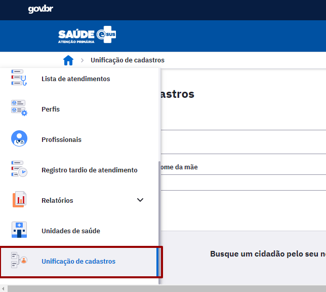
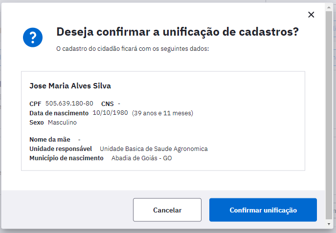
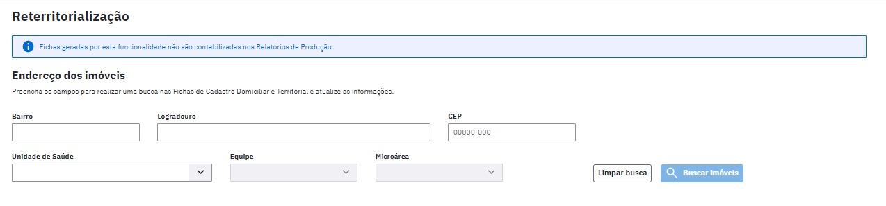

# CAPÍTULO 9 - Gestão de Cadastros
{: .no_toc }

Neste capítulo abordaremos as questões relacionadas ao gerenciamento do cadastro do cidadão, principalmente no que tange a situações de multiplicidade de cadastro.

## Sumário
{: .no_toc .text-delta }

- TOC
{:toc}

A presença de situações deste tipo podem ter ocorrido por diversos motivos, como falta de conectividade para recuperação do CNS através do módulo cidadão, falta da informação do número do CNS no momento do cadastro individual do CDS, dentre outros. Pensando em solucionar esta situação apresentamos a funcionalidade da **Unificação de Cadastros** que tem por objetivo unificar os cadastros dos cidadãos, com ou sem CNS, que pertencem a uma única pessoa. Esse processo unirá de forma automática todos os registros de cadastro e atendimento, seja no PEC, seja no CDS, em um único prontuário.  Esse processo de unificação pode ser executado em algumas etapas pelo **gerente de serviços de saúde** ao clicar na opção "Unificação de Cadastros" (Figura 9.1) localizada na barra de navegação lateral.

Figura 9.1. Módulo de Gestão de Cadastros

Fonte: SAPS/MS.

{: .nota }
Por se tratar de uma ação de alta sensibilidade e de muita responsabilidade apenas profissionais com perfil de "Gerente de UBS" poderão ter acesso a esta funcionalidade.

# 9.1 Busca pelo cidadão

A primeira etapa da unificação de cadastro consiste em realizar a pesquisa dos cadastros que serão unificados. Após clicar em "Unificação de cadastros" (Figura 9.1) a busca pelo cidadão se dá nos mesmos moldes do módulo Cidadão, permitindo que se realize a busca utilizando dados demográficos ou número de alguns documentos válidos:

- Nome do cidadão;

- número do CNS do cidadão;

- número do CPF;

- Data de nascimento;

- Nome da mãe;

Município de nascimento, como mostra a pec_imagem abaixo:

Figura 9.3 - Busca Unificação de Cadastros

Fonte: SAPS/MS.

Para realizar esse tipo de consulta o profissional precisa preencher no mínimo o nome completo do cidadão, porém quanto mais informações forem preenchidas, maior será a acurácia do sistema na lista de resultados.

Após a inserção de pelo menos o nome do cidadão na busca é possível realizar a consulta clicando no botão "Buscar cidadão". Em seguida é apresentada uma lista conforme a figura 9.5.

Figura 9.5 - Resultado da Busca Cidadão

Fonte: SAPS/MS.

As buscas são realizadas apenas na base de dados local da instalação do PEC observando cadastros realizados tanto no módulo Cidadão quanto na Ficha Cadastro Individual do CDS. É importante sinalizar que nesta busca os cadastros "inativos", originados de versões anteriores do PEC, também estarão disponíveis para unificação, facilitando a agregação de informações clínicas anteriores que possam ter ficado vinculadas aos cadastros inativados. Caso a busca apresente algum cadastro inativo o sistema mostrará este cadastro com a marcação . Apesar disto ele estará disponível para unificação como mostra a Figura 9.6.

Figura 9.6 - Marcação de cadastro inativo.

Fonte: SAPS/MS.

Caso a primeira consulta não apresente as opções de cadastros a serem unificados é possível realizar novas buscas sem perder os resultados das buscas já realizadas como indica a Figura 9.7.

Figura 9.7 - Ampliação dos resultados de busca

Fonte: SAPS/MS.

Caso o profissional deseje visualizar mais informações relacionadas ao cadastro apresentado na busca, basta clicar no ícone  e o sistema apresentará dados relevantes do cidadão. Estes dados poderão auxiliar o profissional a ter certeza de que se trata de cadastros do mesmo cidadão, como mostra a Figura 9.9.

Figura 9.9 - Tela com informações de identificação do cadastro do cidadão

Fonte: SAPS/MS.

# 9.2 Processo de seleção de cadastros a serem unificados

Após a etapa de busca, é necessário selecionar os cadastros a serem unificados através do checkbox localizado ao lado esquerdo de cada item da lista (Figura 9.10).

Figura 9.10 - Tela de Unificar Cadastro

Fonte: SAPS/MS.

Após selecionados os cadastros, o usuário do sistema deverá selecionar o cadastro que ele deseja utilizar como o principal (Figura 9.11). O cadastro principal definirá os dados cadastrais, como por exemplo nome, data de nascimento e nome da mãe. A escolha do CNS é feita de forma automática e prioriza o CNS definitivo.

Figura 9.11 - Tela de Unificação do Cidadão

Fonte: SAPS/MS.

Ao clicar no botão "Unificar cadastros" o sistema apresentará a forma como o cadastro ficará após a unificação. Caso esteja de acordo com o desejado, é necessário clicar no botão "**Confirmar unificação**". Caso haja alguma incongruência é possível cancelar a ação, como mostra a pec_imagem 9.12.

Figura 9.12 - Confirmação do processo de unificação de cadastros

Fonte: SAPS/MS.

A escolha do cadastro como principal interfere apenas nos dados demográficos, como por exemplo, nome, data de nascimento, nome da mãe. Cada cadastro unificado nesse processo pode possuir um prontuário diferente, com registros clínicos diversos, entretanto, todos esses registros serão unificados em apenas um prontuário.

Nas próximas buscas os cadastros unificados sempre serão identificados com uma marcação, como mostra a pec_imagem a seguir:

# 9.3 - Reterritorialização

A funcionalidade de reterritorialização tem como objetivo fornecer ao profissional a possibilidade de atualizar as fichas de cadastros de usuarios residentes do seu território adstrito.

Figura: 9.12.1 Módulo Reterritorialização

Ao realizar a busca de imóveis a tela apresentará opções de campos (Unidade de Saúde, Equipe, Profissional, Microárea) que poderão ser alterados sendo possível atualizar os cadastros a partir da mudança de endereço do usuário. 

Figura 9.12.2 Opções de campos

FONTE: SAPS/MS