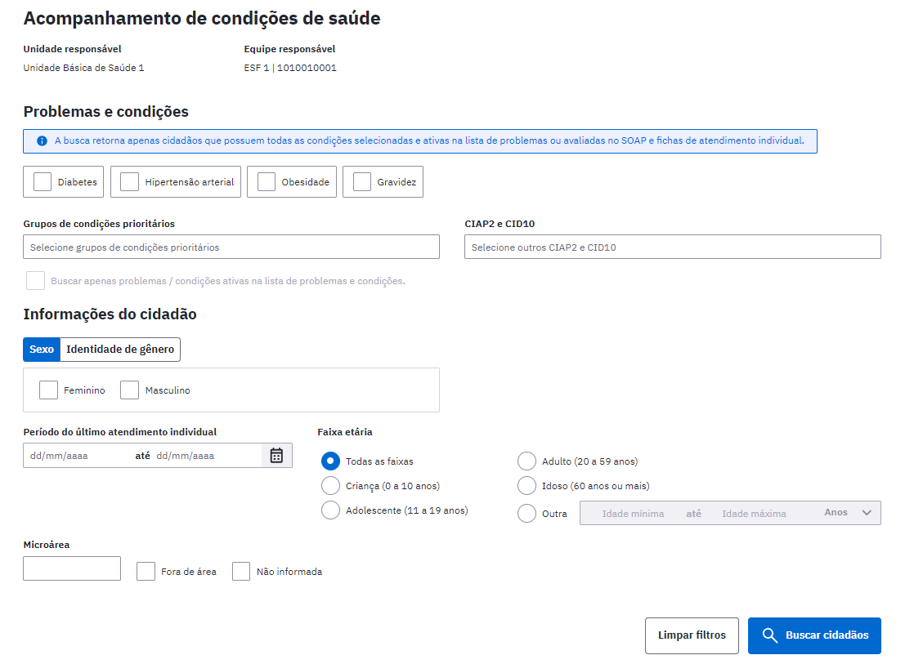
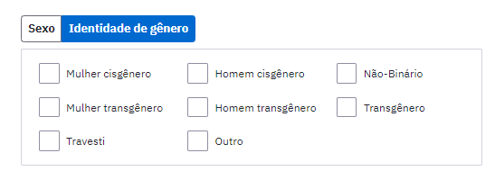
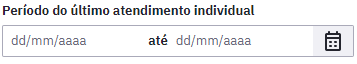
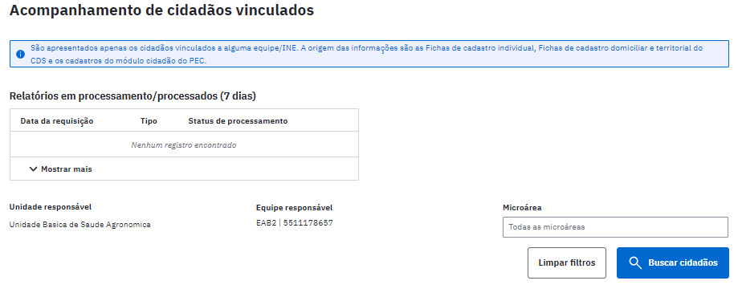
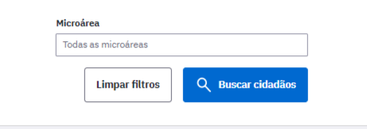

# CAPÍTULO 10 - Acompanhamento de condições de saúde
{: .no_toc }

Este módulo visa proporcionar aos gestores de UBS e profissionais de saúde um formato mais simples e otimizado de visualizar as informações relacionadas aos problemas e condições de saúde da população acompanhadas pelas equipes de atenção primária à saúde.

## Sumário
{: .no_toc .text-delta }

- TOC
{:toc}

Uma das atividades da Atenção Primária à Saúde é realizar o acompanhamento das condições de saúde dos cidadãos vinculados às Equipes da APS. Esta ação é importante e demanda muita organização por parte da equipe. Uma forma facilitada de realizar o acompanhamento das situações de saúde é por meio de relatórios ou listas de cidadãos que possuem determinada condição de saúde, extraídos a partir do sistema de informação utilizado pela equipe.

Figura 10.1 - Tela do Relatórios exibida com o perfil de profissional da equipe de AB

Fonte: SAPS/MS.

O painel de Acompanhamento de condições de saúde busca apresentar de forma clara a lista de cidadão vinculados à equipe de APS que possuem determinada situação de saúde.

{: .nota }
Somente são apresentados neste painel cidadãos que estão vinculados à equipe de APS. A busca retorna apenas cidadãos que possuem todas as condições selecionadas e ativas na lista de problemas ou avaliadas no SOAP e na ficha de atendimento individual.

# 10.1 Filtros

Nesta funcionalidade são apresentados diversos filtros, para facilitar a busca de cidadãos por determinadas situações de saúde. Como ocorre nos relatórios do sistema, neste módulo também existe hierarquia de acesso, o gerente da unidade pode escolher a UBS ou a equipe que deseja visualizar o painel, já os profissionais das equipes, conseguem visualizar os cidadãos apenas de sua própria equipe.

## 10.1.1 Filtro de problemas e condições pré estruturado

O primeiro bloco apresenta situações muito comuns na APS, e que devem ser acompanhadas pelas equipes, conforme pec_imagem. Lembre- se que essa forma de extração visa facilitar a busca, porém, as possibilidade de busca não se limitam a esse bloco.

Estes itens contemplam os seguintes CID10 e CIAP 2:

|Grupo|CIAP2|CID10|
|- |- |- |
|Diabetes|T89, T90, W85|E10, E100, E101, E102, E103, E104, E105, E106, E107, E108, E109, E11, E110, E111, E112, E113, E114, E115, E116, E117, E118, E119, E12, E120, E121, E122, E123, E124, E125, E126, E127, E128, E129, E13, E130, E131, E132, E133, E134, E135, E136, E137, E138, E139, E14, E140, E141, E142, E143, E144, E145, E146, E147, E148, E149, O24, O240, O241, O242, O243, O244, O249, P702, E232, N083, N251, P700|
|Hipertensão arterial|K86, K87, W81|I10, I11, I110, I119, I12, I120, I129, I13, I130, I131, I132, I139, I15, I150, I151, I152, I158, I159, I270, I272, O10, O100, O101, O102, O103, O104, O109, O11, O13, O14, O140, O141, O149, O15, O150, O151, O152, O159, O16, P292, K766|
|Obesidade|T82|E66, E660, E661, E662, E668, E669|
|Gravidez|W03, W05, W29, W71, W72, W73, W76, W78, W79, W80, W81, W84, W85, W75|O000, O001, O002, O008, O009, O11, O12, O120, O121, O122, O13, O14 , O140, O141, O149, O15, O150, O151, O159, O16, O20, O200, O208, O209, O21, O210, O211, O212, O218, O219, O22, O220, O221, O222, O223, O224, O225, O228, O229, O23, O230, O231, O232, O233, O234, O235, O239, O24, O240, O241, O242, O243, O244, O249, O25, O26, O260, O261, O263, O264, O265, O268, O269, O28, O280, O281, O282, O283, O284, O285, O288, O289, O29, O290, O291, O292, O293, O294, O295, O296, O298, O299, O30, O300, O301, O302, O308, O309, O31, O311, O312, O318, O32, O320, O321, O322, O323, O324, O325, O326, O328, O329, O33, O330, O331, O332, O333, O334, O335, O336, O337, O338, O339, O34, O340, O341, O342, O343, O344, O345, O346, O347, O348, O349, O35, O350, O351, O352, O353, O354, O355, O356, O357, O358, O359, O36, O360, O361, O362, O363, O365, O366, O367, O368, O369, O40, O41, O410, O411, O418, O419, O43, O430, O431, O438, O439, O44, O440, O441, O46, O460, O468, O469, O47, O470, O471, O479, O48, Z321, Z33, Z34, Z340, Z348, Z349, Z35, Z350, Z351, Z352, Z353, Z354, Z355, Z356, Z357, Z358, Z359, Z640, O00, O990, O991, O992, O993, O994, O995, O996, O997|

## 10.1.2 Filtro de problemas e condições pré estruturado ou busca por CIAP2 e CID10

É possível ainda realizar a busca por outras condições de saúde que contemplam um grupo de CIAP2 e CID10 relacionados, ou ainda, selecionando os códigos CIAP2 e CID10.

Para realizar a busca pelo "Grupos de condições prioritárias", selecione um ou mais problemas, conforme pec_imagem abaixo:

Os problemas ou condições deste bloco representam um conjunto de CIAP2 e CID10, conforme quadro abaixo:

|Grupo|CIAP2|CID10|
|-|-|-|
|Asma|R96|J45, J450, J451, J458, J459, J46|
|AVC|K89, K90, K91|G45, G46, I60, I61, I610, I611, I612, I613, I614, I615, I616, I618, I619, I62, I63, I630, I631, I632, I633, I634, I635, I636, I638, I639, I64, I65, I66, I67, I670, I671, I672, I673, I675, I676, I677, I678, I679, I68, I69|
|Dengue|A77|A90, A91|
|Desnutrição|B80, B81, B82, T91|D46, D460, D461, D462, D463, D464, D50, D500, D508, D509, D51, D510, D511, D512, D513, D518, D519, D52, D520, D521, D528, D529, D53, D530, D531, D532, D538, D539, E40, E41, E42, E43, E44, E440, E441, E45, E46, E50, E500, E501, E502, E503, E504, E505, E506, E507, E508, E509, E51, E511, E512, E518, E519, E52, E53, E530, E531, E538, E539, E54, E55, E550, E559, E56, E560, E561, E568, E569, E58, E58, E59, E60, E60, E61, E610, E611, E612, E613, E614, E615, E616, E617, E618, E619, E63, E630, E631, E638, E639, O25, O990, P050, P052|
|Diabetes|T89, T90, W85|E10, E100, E101, E102, E103, E104, E105, E106, E107, E108, E109, E11, E110, E111, E112, E113, E114, E115, E116, E117, E118, E119, E12, E120, E121, E122, E123, E124, E125, E126, E127, E128, E129, E13, E130, E131, E132, E133, E134, E135, E136, E137, E138, E139, E14, E140, E141, E142, E143, E144, E145, E146, E147, E148, E149, O24, O240, O241, O242, O243, O244, O249, P702, E232, N083, N251, P700|
|Doença cardíaca|K74, K76, K77, K79, K80, K82, K83, K84, K99|I20, I240, I249, I25, I50, I47, I49, I27, I28, I34, I35, I36, I37, I31, I43, I44, I45, I46, I51, I52, O903, I71, I72, I77, I780, I788, I789, I79, I85, I86, I871, I879, I890, I98, I99, M30, M31, R57, T063, I420, I421, I422, I423, I425, I426, I427, I428, I429|
|DPOC|R95|J43, J430, J431, J432, J438, J439, J44, J440, J441, J448, J449|
|DST|X70, X71, X73, X90, X91, X92, Y70, Y71, Y72, Y76|A50, A500, A501, A502, A503, A504, A505, A506, A507, A509, A51, A510, A511, A512, A513, A514, A515, A519, A52, A520, A521, A522, A523, A527, A528, A529, A53, A530 , A539, A54, A540, A541, A542, A543, A544, A545, A546, A548, A549, A55, A56, A560, A561, A562, A563, A564, A568, A57, A58, A59, A590, A598, A599, A60, A600, A601, A609, A63, A630, A638, A64|
|Gravidez|W03, W05, W29, W71, W72, W73, W76, W78, W79, W80, W81, W84, W85, W75|O000, O001, O002, O008, O009, O11, O12, O120, O121, O122, O13, O14 , O140, O141, O149, O15, O150, O151, O159, O16, O20, O200, O208, O209, O21, O210, O211, O212, O218, O219, O22, O220, O221, O222, O223, O224, O225, O228, O229, O23, O230, O231, O232, O233, O234, O235, O239, O24, O240, O241, O242, O243, O244, O249, O25, O26, O260, O261, O263, O264, O265, O268, O269, O28, O280, O281, O282, O283, O284, O285, O288, O289, O29, O290, O291, O292, O293, O294, O295, O296, O298, O299, O30, O300, O301, O302, O308, O309, O31, O311, O312, O318, O32, O320, O321, O322, O323, O324, O325, O326, O328, O329, O33, O330, O331, O332, O333, O334, O335, O336, O337, O338, O339, O34, O340, O341, O342, O343, O344, O345, O346, O347, O348, O349, O35, O350, O351, O352, O353, O354, O355, O356, O357, O358, O359, O36, O360, O361, O362, O363, O365, O366, O367, O368, O369, O40, O41, O410, O411, O418, O419, O43, O430, O431, O438, O439, O44, O440, O441, O46, O460, O468, O469, O47, O470, O471, O479, O48, Z321, Z33, Z34, Z340, Z348, Z349, Z35, Z350, Z351, Z352, Z353, Z354, Z355, Z356, Z357, Z358, Z359, Z640, O00, O990, O991, O992, O993, O994, O995, O996, O997|
|Hanseníase|A78|A30, A300, A301, A302, A303, A304, A305, A308, A309, B92|
|Hipertensão arterial|K86, K87, W81|I10, I11, I110, I119, I12, I120, I129, I13, I130, I131, I132, I139, I15, I150, I151, I152, I158, I159, I270, I272, O10, O100, O101, O102, O103, O104, O109, O11, O13, O14, O140, O141, O149, O15, O150, O151, O152, O159, O16, P292, K766|
|Infarto|K75, K78|I21, I210, I211, I212, I213, I214, I219, I220, I221, I228, I229, I230, I231, I232, I233, I234, I235, I236, I238, I241, I48|
|Obesidade|T82|E66, E660, E661, E662, E668, E669|
|Reabilitação|A57|Z500, Z501, Z505, Z506, Z507|
|Rins|­­­­­­­­­­U70, U71, U72, U75, U76, U77, U78, U79, U80, U85, ­­­­U88, U90, U95, U98, U99|N10, N11, N12, N151, N159, N30, N390, A560, A562, A590, B374, N34,C64, C65, C67, C66, C68, D30, D099, D091, D41, S370, S371, S372, S373, T190, T191, T283, Q60, Q61, Q62, Q63, Q64, N00, N01, N03, N04, N05, N07, N08,­­­­­­­­­­­­­­­­­­­­­­­­­­­­­­­­­­N14, N150, N158, N16, N392, N20, N21, N22, N391, R80, R81, R82, N06, N13, N17, N18, N19, N25, N26, N27, N28, N29, N31, N32, N33, N35,N36, N37, N398, R392, T198, T199, Z905, Z906|
|Saúde mental|P02, P06, P10, P11, P12, P13, P22, P23, P24, P29, P73, P70, P71, P72, P73, P74, P75, P76, P78, P79, P80, P81, P85, P98, P99|F00, F000, F001, F002, F009, F01, F010, F011, F012, F013, F018, F019, F02, F020, F021, F022, F023, F024, F028, F03, F04, F05, F050, F051, F058, F059, F06, F060, F061, F062, F063, F064, F065, F066, F067, F068, F069, F07, F070, F071, F072, F078, F079, F09, F20, F200, F201, F202, F203, F204, F205, F206, F208, F209, F21, F22, F220, F228, F229, F23, F230, F231, F232, F233, F238, F239, F24, F25, F250, F251, F252, F258, F259, F28, F29, F30, F300, F301, F302, F308, F309, F31, F310, F311, F312, F313, F314, F315, F316, F317, F318, F319, F32, F320, F321, F322, F323, F328, F329, F33, F330, F331, F332, F333, F334, F338, F339, F34, F340, F341, F348, F349, F38, F380, F381, F388, F39, F40, F400, F401, F402, F408, F409, F41, F410, F411, F412, F413, F418, F419, F42, F420, F421, F422, F428, F429, F43, F430, F431, F432, F438, F439, F44, F440, F441, F442, F443, F444, F445, F446, F447, F448, F449, F45, F450, F451, F452, F453, F454, F458, F459, F48, F480, F481, F488, F489, F50, F500, F501, F502, F503, F504, F505, F508, F509, F51, F510, F511, F512, F513, F514, F515, F518, F519, F52, F520, F521, F522, F523, F524, F525, F526, F527, F528, F529, F53, F530, F531, F538, F539, F54, F55, F59, F60, F600, F601, F602, F603, F604, F605, F606, F607, F608, F609, F61, F62, F620, F621, F628, F629, F63, F630, F631, F632, F633, F638, F639, F64, F640, F641, F642, F648, F649, F65, F650, F651, F652, F653, F654, F655, F656, F658, F659, F66, F660, F661, F662, F668, F669, F68, F680, F681, F688, F69, F70, F700, F701, F708, F709, F71, F710, F711, F718, F719, F72, F720, F721, F728, F729, F73, F730, F731, F738, F739, F78, F780, F781, F788, F789, F79, F790, F791, F798, F799, F80, F800, F801, F802, F803, F808, F809, F81, F810, F811, F812, F813, F818, F819, F82, F83, F84, F840, F841, F842, F843, F844, F845, F848, F849, F88, F89, F90, F900, F901, F908, F909, F91, F910, F911, F912, F913, F918, F919, F92, F920, F928, F929, F93, F930, F931, F932, F933, F938, F939, F94, F940, F941, F942, F948, F949, F95, F950, F951, F952, F958, F959, F98, F980, F981, F982, F983, F984, F985, F986, F988, F989, F99|
|Saúde Sexual e Reprodutiva|P07, P08, P09, W10, W11, W12, W13, W14, W15, X01, X02, X03, X04, X05, X06, X07, X08, X09, X10, X11, X12, X13, X18, X20, X21, X22, X24, Y01, Y02, Y04, Y05, Y06, Y07, Y08, Y10, Y13, Y14, Y16, Y24|Z70, Z700, Z701, Z702, Z703, Z708, Z709|
|Tabagismo|P17|F17, F170, F171, F172, F173, F174, F175, F176, F177, F178, F179, Z716, Z720|
|Tuberculose|A70|A15, A150, A151, A152, A153, A154, A155, A156, A157, A158, A159, A16, A160, A161, A162, A163, A164, A165, A167, A168, A169, A17, A170, A171, A178, A179, A18, A180, A181, A182, A183, A184, A185, A186, A187, A188, A19, A190, A191, A192, A198, A199, B90, B900, B901, B902, B908, B909, J65|
|Usuário de álcool|P15, P16|F10, F100, F101, F102, F103, F104, F105, F106, F107, F108, F109, Z502, Z714, Z721|
|Usuário de outras drogas|P18, P19|F11, F110, F111, F112, F113, F114, F115, F116, F117, F118, F119, F12, F120, F121, F122, F123, F124, F125, F126, F127, F128, F129, F13, F130, F131, F132, F133, F134, F135, F136, F137, F138, F139, F14, F140, F141, F142, F143, F144, F145, F146, F147, F148, F149, F15, F150, F151, F152, F153, F154, F155, F156, F157, F158, F159, F16, F160, F161, F162, F163, F164, F165, F166, F167, F168, F169, F18, F180, F181, F182, F183, F184, F185, F186, F187, F188, F189, F19, F190, F191, F192, F193, F194, F195, F196, F197, F198, F199, R781, R782, R783, R784, R785, Z503, Z715, Z722|

{: .nota }
Atente para a opção de buscar apenas problemas/condições ativas na lista de problemas e condições do PEC. Essa função permite que os profissionais possam visualizar apenas a lista de cidadão com problemas ativos na lista de problemas e condições, e desconsiderar os problemas latentes ou resolvidos.

## 10.1.3 Filtro sexo ou identidade de gênero

Neste bloco é possível selecionar o sexo (feminino ou masculino, ou ambos) ou ainda selecionar a identidade de gênero (mulher transsexual, homem transsexual, travesti e outros).

## 10.1.4 Filtro de período

Neste bloco é possível selecionar o período em que deseja obter as informações. Informe o dia/mês/ano de início e o dia/mês/ano de fim, conforme figura abaixo. Caso a data de início não esteja preenchida, o sistema considera todos os atendimentos realizados até a data de fim. Caso contrário, se a data de fim não estiver preenchida, o sistema irá considerar o intervalo da data de início até a data do dia atual.

## 10.1.5 Filtro de faixa etária

Neste bloco é possível definir a faixa etária desejada para consulta. É possível buscar "Todas as faixas", "Criança (0 a 10 anos)", "Adolescente (11 a 19 anos), "Adulto (20 a 59 anos)", "Idoso (60 anos ou mais)" ou ainda, clique em "Outra" e insira a faixa etária desejada, conforme figura abaixo:

Após selecionar todos os filtros desejados, clique no botão , e serão listados os cidadão vinculados à equipe, conforme pec_imagem abaixo:

Ainda, será apresentado o botão  para gerar os relatórios operacionais já existentes no sistema, a saber: "Relatório operacional de Crianças menores de 5 anos", "Relatório operacional de Gestante/Puérpera" e "Relatório operacional de Risco cardiovascular\'\'. Estes serão gerados utilizando as regras já existentes, como núcleo familiar consistido, dentre outros. Veja a pec_imagem abaixo:

##  Acompanhamentos dos cidadãos vinculados

Uma das atividades da Atenção Primária à Saúde é realizar o acompanhamento das condições de saúde dos cidadãos vinculados às Equipes da APS. Esta ação é importante e demanda muita organização por parte da equipe. Uma forma facilitada de realizar o acompanhamento das situações de saúde é por meio de relatórios ou listas de cidadãos que possuem determinada condição de saúde, extraídos a partir do sistema de informação utilizado pela equipe.

Figura 10.2 - Tela do Relatórios exibida 

Fonte: SAPS/MS.

O painel de Acompanhamento de condições de saúde busca apresentar de forma clara a lista de cidadão vinculados à equipe de APS que possuem determinada situação de saúde.

{: .nota }
Somente são apresentados neste painel cidadãos que estão vinculados à equipe de APS. A busca retorna apenas cidadãos que possuem todas as condições selecionadas e ativas na lista de problemas ou avaliadas no SOAP e na ficha de atendimento individual.

# 10.1 Filtro de microárea

Nesta funcionalidade apresenta-se filtro de microárea, para apoiar a busca de cidadãos no território. Como ocorre nos relatórios do sistema, neste módulo também existe hierarquia de acesso, o gerente da unidade pode escolher a UBS ou a equipe que deseja visualizar o painel, já os profissionais das equipes, conseguem visualizar os cidadãos vinculados pela Ficha de cadastro individual, ficha de cadastro domiciliar e territorial e cadastros do módulo cidadão do PEC.

Após selecionar o filtros, clique no botão , e serão listados os cidadão vinculados à equipe, conforme imagem abaixo:

