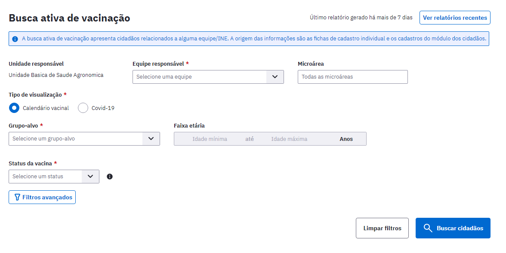
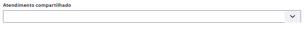
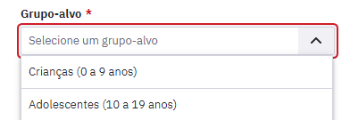
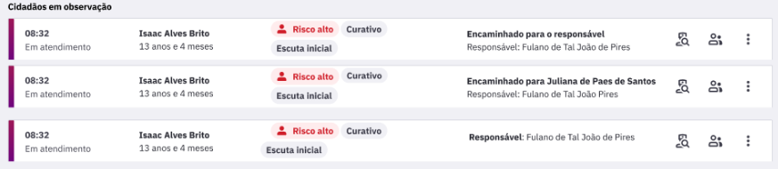
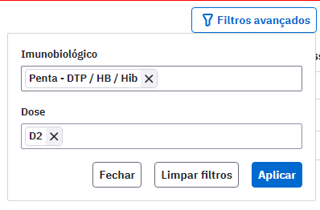
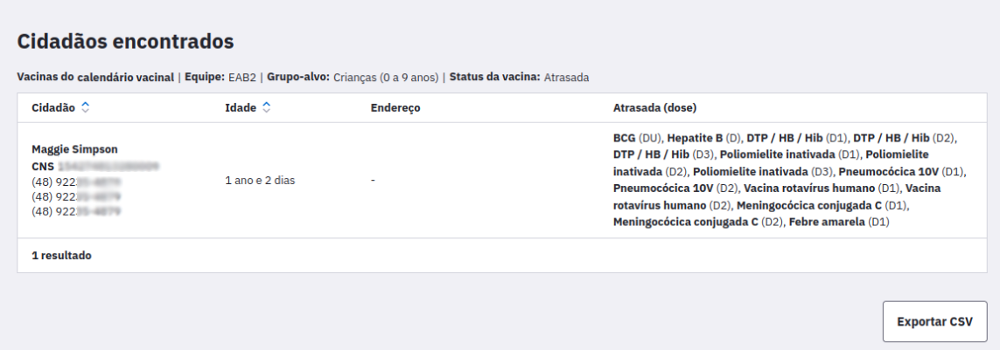
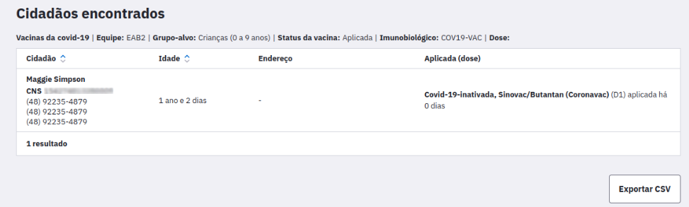
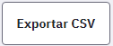

# CAPÍTULO 12 - Gestão da Garantia do Acesso
{: .no_toc }

Este módulo tem como objetivo instrumentalizar os gestores locais e municipais a gerir o acesso do cidadão na Unidade Básica de Saúde.

## Sumário
{: .no_toc .text-delta }

- TOC
{:toc}

A inserção de dados no módulo de Gestão da garantia do acesso pode ser feita no momento de acolhimento do cidadão, que não tem uma demanda urgente no momento da ida ao serviço, e que não é possível atender o caso naquele momento.

Figura 12.1 Tela módulo da garantia do acesso

Fonte: SAPS/MS.

{: .atencao }
O cidadão que procurar a unidade com demanda urgente não pode ter seu atendimento adiado.

A inserção dos dados de um cidadão nesta lista pode ser feita por qualquer profissional da Unidade Básica. Ela deve ser feita quando, considerando o motivo da procura pelo serviço do cidadão, não for possível atender naquele momento, nem for possível o agendamento. 

As informações necessárias para incluir o cidadão nesta lista é o nome completo, CPF ou CNS do cidadão. Caso ele não seja cadastrado, deve-se fazer o cadastro simplificado ou completo. Este é um campo obrigatório.

O campo "Tipo de atendimento" traz três tipos de atendimento como opção, são eles: consulta de enfermagem, consulta médica e consulta odontológica, conforme mostra a Figura 12.2. Este campo deve ser escolhido a partir do que o cidadão foi buscar na unidade naquele momento, porém não conseguiu ter acesso. 

Figura 12.2 Tipos de atendimento buscados pelo cidadão

Fonte: SAPS/MS.

O Campo "Motivo da consulta" também é obrigatório e é um campo aberto para inserir as informações do motivo que o cidadão buscou consulta na unidade.

Por exemplo, uma mulher que foi buscar a realização de um exame citopatológico, mas não é possível naquele momento, e não é possível fazer o agendamento, o registro deve ser feito no módulo como consulta de enfermagem ou médica em "Tipo de atendimento" e deve-se descrever em "Motivo da consulta" que a busca é para a realização de coleta do exame citopatológico. 

O campo "Equipe" não é obrigatório, então pode ser selecionada a equipe que o cidadão é vinculado ou não direcionar para nenhuma equipe no momento de inserção de dados na lista. Serão mostradas as equipes vinculadas aquela UBS.

Ao adicionar todas as informações clique em  para que o cidadão entre na lista. 

A lista é exibida com as informações: Data, Cidadão (Nome, idade, CPF/CNS), telefone, equipe e tipo de atendimento, como mostra a Figura 12.3.

Figura 12.3 Lista de cidadão inseridos no módulo Gestão de garantia do acesso

Fonte: SAPS/MS.

Ao inserir o cidadão na listagem do módulo da gestão da garantia do acesso é possível visualizar quantas vezes ele foi inserido na listagem e o último motivo da procura.

Para retirar o cidadão da lista deve-se clicar no ícone  e em seguida aparecerá na tela a Figura 12.4.

Figura 12.4 Lista de cidadão inseridos no módulo Gestão de garantia do acesso

Fonte: SAPS/MS.

A remoção do registro na lista abre as seguintes opções:

**Atendido em outro estabelecimento:** usado quando o cidadão conseguiu o atendimento que pretendia na unidade em outro serviço, seja na atenção especializada, em serviços particulares, ou até mesmo em outra unidade básica, do mesmo município ou de outro. É recomendado colocar qual o outro lugar no campo Observações para que seja possível um diagnóstico situacional no futuro.

**Atendimento agendado:** usado quando o cidadão for agendado na unidade que buscou atendimento.

**Não respondeu à tentativas de contato:** usado para indicar quantas vezes foi feito contato com o cidadão. Esta opção abre o campo obrigatório "Número de tentativas de contato" feitas com o cidadão e é possível descrever quais foram os meios de comunicação utilizados. 

**Mudou-se do território:**

A busca ativa é uma das atividades da Estratégia de Saúde da Família. Ela é uma ação que pode ser realizada por todos os membros da equipe em seu território de referência, tendo o Agente Comunitário de Saúde protagonismo nessa atividade por seu vínculo com esse território.

A busca ativa está diretamente ligada a integralidade, um dos atributos da Atenção Primária à Saúde (APS), pois aproxima as ações e intervenções de saúde à necessidade da população adstrita, da comunidade e do território. Ela tem importância tanto na vigilância epidemiológica quanto na identificação das necessidades de saúde e socioeconômicas da população, na perspectiva das ações da APS ir no sentido contrário de apenas atender demanda espontânea.

No PEC, a partir da versão 5.1, está disponível o módulo de busca ativa, que pode ser acessado no menu esquerdo do prontuário. A Figura 11.1 mostra os tipos de relatórios de busca ativa disponíveis na versão.

Figura 11.1 - Tipos de relatórios de busca ativa 

{: .nota }
A Busca ativa mostrará apenas os usuários cadastrados na equipe, pois são pessoas do território, as quais a equipe tem vínculo e possibilidade de fazer intervenções de saúde.

# 11.1 Busca Ativa de Vacinação

O Brasil é internacionalmente conhecido pelo seu Programa Nacional de Vacinação e atualmente a maior parte da vacinação é feita no âmbito da Atenção Primária. 
Nessa perspectiva, este módulo instrumentaliza as equipes atuantes na APS com relatórios sobre o status de vacinação da população adscrita. Com estes relatórios os profissionais de saúde desta equipe podem acionar seus usuários, quando houver necessidade, para que se imunizem contra determinadas doenças.  

A Figura 11.2 mostra a tela inicial da Busca Ativa de Vacinação. Este módulo pode ser acessado por todos os profissionais da equipe atuante na APS.

Figura 11.2 - Tela de Busca Ativa

Fonte: SAPS/MS.

Os profissionais da equipe que acessam este módulo podem fazer o filtro por Microárea. Quando o gerente da unidade acessar o módulo, ele poderá fazer o filtro tanto por equipe quanto por microárea.

Há dois tipos de visualização: Calendário Vacinal (que mostra as vacinas de Rotina) e Covid-19, como mostra a Figura 11.3. Este é um campo de seleção obrigatório para geração do relatório.

Figura 11.3 - Tipos de Visualização

Fonte: SAPS/MS.

Em seguida há o campo obrigatório Grupo-Alvo em que podem ser selecionadas as opções Criança (0 a 9 anos) e Adolescentes (10 a 19 anos), como mostra a Figura 11.4.

Figura 11.4 - Grupos Alvo

Fonte: SAPS/MS.

{: .nota }
Novos grupos alvo serão inseridos em novas versões do PEC.

No campo obrigatório "Status da Vacina", quando o Tipo de visualização (Figura 11.3) selecionado é o "Calendário Vacinal", é possível escolher entre No Prazo e Atrasada, conforme mostra a Figura 11.5. Já quando o Tipo de visualização selecionado é Covid-19, aparecerão as vacinas aplicadas. 

Figura 11.5 - Status da Vacina

Fonte: SAPS/MS.

Os Status de vacina significam:

**No prazo:** Aquelas doses de vacinas que estão no prazo para serem aplicadas. Ou seja, é a época que o cidadão deve ser convidado à unidade para receber a vacina no tempo certo.

**Atrasada:** São as doses de vacinas que já passaram do prazo para ser aplicadas. Deve-se convidar o cidadão para regularizar sua situação vacinal o mais rápido possível.

Há disponível alguns Filtros avançados nesse módulo, conforme mostra a Figura 11.6. 

Figura 11.6 - Filtros Avançados

Fonte: SAPS/MS.

No filtro "Imunobiológico" é possível selecionar um ou mais imunobiológicos e no filtro "Dose" é possível selecionar uma ou mais doses. A exibição ocorre em ordem alfabética. Caso não apareça ao clicar o imunobiológico ou a dose que está procurando, comece a digitar o nome para que outras opções apareçam para seleção.

{: .atencao }
Ao selecionar um imunobiológico ou dose no campo Filtros avançados, o relatório mostrará todos os cidadãos com o imunobiológico e/ou dose selecionadas no filtro. Porém, como o relatório é exibido por cidadão, as outras doses atrasadas ou no prazo desse cidadão continuarão a ser exibidas. Isto é, apenas cidadãos que não tiverem os imunobiológico e/ou doses no status de vacina selecionado, deixarão de ser exibidos.

Após a seleção dos campos do módulo deve-se clicar em  para exibir em tela os cidadão naquelas condições, como mostra a Figura 11.7.

Figura 11.7 - Exibição em tela da listagem da Busca Ativa

(A) Relatório de Vacinas do Calendário Vacinal

(B) Relatório de Vacinas de Covid-19

Fonte: SAPS/MS.

É possível gerar relatório em planilha ao clicar em . Nesse formato será exibido a listagem de cidadãos, data de nascimento, idade, CPF, CNS, Telefones de contato e endereço, bem como status da vacina, imunobiológicos e doses. O Formato desse relatório pode ser visualizado na Figura 11.8.

Figura 11.8 - Relatório em CSV

Fonte: SAPS/MS.

