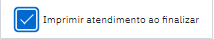
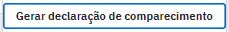
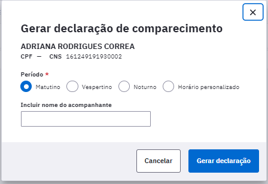
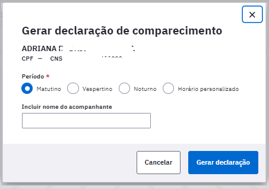
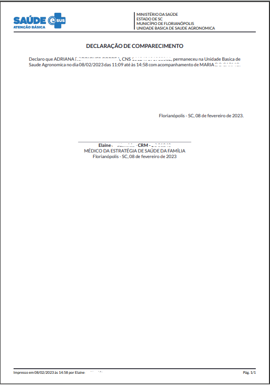
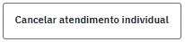
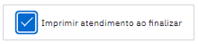

# CAPÍTULO 12 - Gestão da Garantia do Acesso
{: .no_toc }

Este módulo tem como objetivo instrumentalizar os gestores locais e municipais a gerir o acesso do cidadão na Unidade Básica de Saúde.

## Sumário
{: .no_toc .text-delta }

- TOC
{:toc}

A inserção de dados no módulo de Gestão da garantia do acesso pode ser feita no momento de acolhimento do cidadão, que não tem uma demanda urgente no momento da ida ao serviço, e que não é possível atender o caso naquele momento.

Figura 12.1 Tela módulo da garantia do acesso

Fonte: SAPS/MS.

{: .atencao }
O cidadão que procurar a unidade com demanda urgente não pode ter seu atendimento adiado.

A inserção dos dados de um cidadão nesta lista pode ser feita por qualquer profissional da Unidade Básica. Ela deve ser feita quando, considerando o motivo da procura pelo serviço do cidadão, não for possível atender naquele momento, nem for possível o agendamento. 

As informações necessárias para incluir o cidadão nesta lista é o nome completo, CPF ou CNS do cidadão. Caso ele não seja cadastrado, deve-se fazer o cadastro simplificado ou completo. Este é um campo obrigatório.

O campo "Tipo de atendimento" traz três tipos de atendimento como opção, são eles: consulta de enfermagem, consulta médica e consulta odontológica, conforme mostra a Figura 12.2. Este campo deve ser escolhido a partir do que o cidadão foi buscar na unidade naquele momento, porém não conseguiu ter acesso. 

Figura 12.2 Tipos de atendimento buscados pelo cidadão

Fonte: SAPS/MS.

O Campo "Motivo da consulta" também é obrigatório e é um campo aberto para inserir as informações do motivo que o cidadão buscou consulta na unidade.

Por exemplo, uma mulher que foi buscar a realização de um exame citopatológico, mas não é possível naquele momento, e não é possível fazer o agendamento, o registro deve ser feito no módulo como consulta de enfermagem ou médica em "Tipo de atendimento" e deve-se descrever em "Motivo da consulta" que a busca é para a realização de coleta do exame citopatológico. 

O campo "Equipe" não é obrigatório, então pode ser selecionada a equipe que o cidadão é vinculado ou não direcionar para nenhuma equipe no momento de inserção de dados na lista. Serão mostradas as equipes vinculadas aquela UBS.

Ao adicionar todas as informações clique em  para que o cidadão entre na lista. 

A lista é exibida com as informações: Data, Cidadão (Nome, idade, CPF/CNS), telefone, equipe e tipo de atendimento, como mostra a Figura 12.3.

Figura 12.3 Lista de cidadão inseridos no módulo Gestão de garantia do acesso

Fonte: SAPS/MS.

Ao inserir o cidadão na listagem do módulo da gestão da garantia do acesso é possível visualizar quantas vezes ele foi inserido na listagem e o último motivo da procura.

Para retirar o cidadão da lista deve-se clicar no ícone  e em seguida aparecerá na tela a Figura 12.4.

Figura 12.4 Lista de cidadão inseridos no módulo Gestão de garantia do acesso

Fonte: SAPS/MS.

A remoção do registro na lista abre as seguintes opções:

**Atendido em outro estabelecimento:** usado quando o cidadão conseguiu o atendimento que pretendia na unidade em outro serviço, seja na atenção especializada, em serviços particulares, ou até mesmo em outra unidade básica, do mesmo município ou de outro. É recomendado colocar qual o outro lugar no campo Observações para que seja possível um diagnóstico situacional no futuro.

**Atendimento agendado:** usado quando o cidadão for agendado na unidade que buscou atendimento.

**Não respondeu à tentativas de contato:** usado para indicar quantas vezes foi feito contato com o cidadão. Esta opção abre o campo obrigatório "Número de tentativas de contato" feitas com o cidadão e é possível descrever quais foram os meios de comunicação utilizados. 

**Mudou-se do território:** quando o cidadão se muda do território adstrito daquela unidade e não se tem mais contato.

**Outros**: quando o motivo para a remoção da lista não foi contemplado em nenhuma das opções anteriores. Ao selecionar esta opção o campo "Observações" torna-se obrigatório.

Ainda é possível fazer o agendamento do cidadão no próprio módulo de gestão da garantia do acesso no ícone , que abrirá a opção de agendamento de consulta para um dos profissionais de saúde, como mostra a Figura 12.5

Figura 12.5 Agendamento no módulo de gestão da garantia do acesso

Fonte: SAPS/MS.

