<head>
    
</head>

# CAPÍTULO 12 - Gestão de Filas

A Gestão de filas tem como objetivo instrumentalizar os gestores locais e municipais a gerir o acesso do cidadão às Unidades de Saúde. Apresenta os módulos de Garantia do acesso e Cuidados Compartilhados. 

## Sumário
{: .no_toc .text-delta }

- TOC
{:toc}

## 12.1 Garantia do acesso

Um cidadão poderá ser inserido na garantia do acesso durante o seu acolhimento na unidade de saúde, caso não haja possibilidade de atendê-lo naquele momento nem de agendamento. A inserção dos dados de um cidadão nesta lista pode ser feita por qualquer profissional da Unidade Básica. 

{: .atencao }
O cidadão que procurar a unidade com demanda urgente não pode ter seu atendimento adiado.

### 12.1.1 Inserir o cidadão na Garantia do Acesso
As informações necessárias para incluir o cidadão nesta lista são o nome completo, CPF ou CNS do cidadão, conforme exposto na figura 1. Caso ele não seja cadastrado, deve-se fazer o cadastro simplificado ou completo. 

Figura 1 - Dados para inclusão do cidadão 

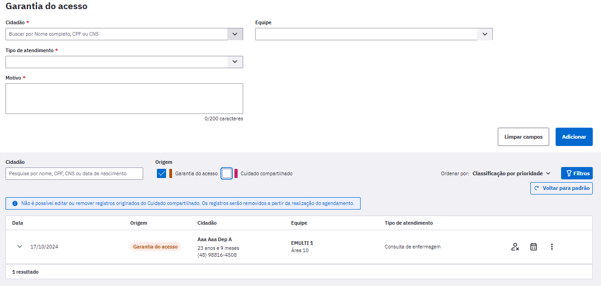
Fonte: SAPS/MS.

O campo "Tipo de atendimento" é de preenchimento obrigatório e apresenta como opções a consulta de enfermagem, consulta médica e consulta odontológica, conforme exibe a Figura 2. 

Figura 2 - Tipos de atendimento 
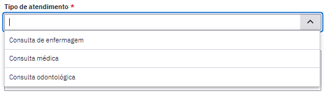
Fonte: SAPS/MS.

O Campo "Motivo da consulta" também é obrigatório e de texto livre para inserir as informações relatadas pelo cidadão quando buscou o atendimento na unidade de saúde. 

No campo "Equipe" serão exibidas todas as equipes vinculadas aquela únidade de saúde. Não é de preenchimento obrigatório, então pode ser selecionada a equipe que o cidadão é vinculado ou não direcionar para nenhuma equipe no momento de inserção de dados na lista. 

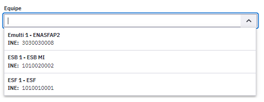

Ao adicionar todas as informações clique em 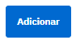 para que o cidadão entre na lista. 

### 12.1.2 Lista de cidadãos da garantia do acesso
A lista é exibida com as informações: data, origem, cidadão (nome, idade, CPF/CNS e telefone), equipe e tipo de atendimento, como mostra a Figura 3.

Figura 3 - Lista de cidadão inseridos no módulo Gestão de garantia do acesso

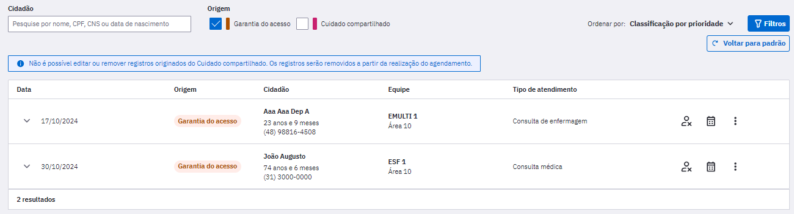
Fonte: SAPS/MS.

Ao expandir a linha com as informações de um cidadão é possível visualizar quantas vezes ele foi inserido na listagem e o último motivo da procura, conforme figura 4. 

Figura 4 - Histórico do cidadão na garantia do acesso

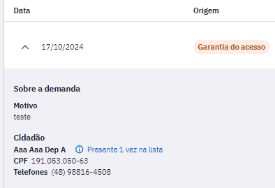
Fonte: SAPS/MS 

A origem de inserção de um cidadão na garantia do acesso pode ser através do próprio módulo ou do compartilhamento do cuidado. É possível filtrar a visualização dos cidadãos por meio da origem, como exibido na figura 5. 

Figura 5 - Origem do registro na garantia do acesso
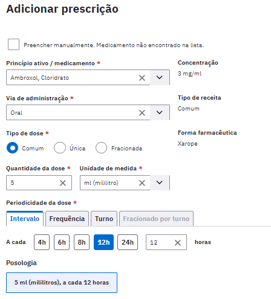
Fonte: SAPS/MS
Além do filtro de origem, é possível filtrar também pelo período do registro, equipe, profissional e tipo de atendimento. 

Figura 6 - Filtros de busca na garantia do acesso
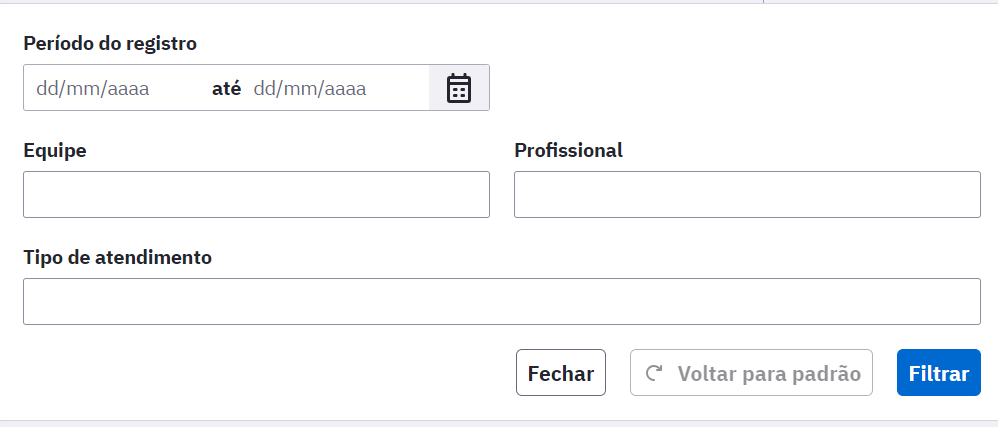
Fonte: SAPS/MS 

#### Remover registro da lista 
Para retirar o cidadão da lista deve-se clicar no ícone 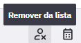 e em seguida aparecerá na tela a Figura 12.4.

Figura 12.4 Remoção do registro da lista

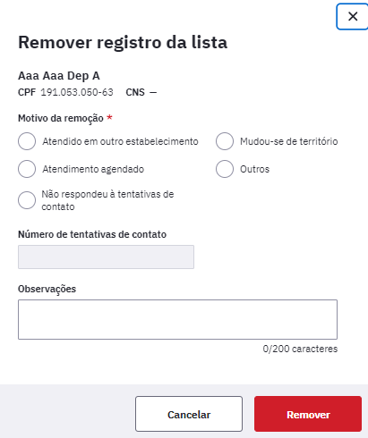

Fonte: SAPS/MS.

A remoção do registro na lista abre as seguintes opções:

**Atendido em outro estabelecimento:** usado quando o cidadão conseguiu o atendimento que pretendia na unidade em outro serviço, seja na atenção especializada, em serviços particulares, ou até mesmo em outra unidade básica, do mesmo município ou de outro. É recomendado colocar qual o outro lugar no campo Observações para que seja possível um diagnóstico situacional no futuro.

**Atendimento agendado:** usado quando o cidadão for agendado na unidade que buscou atendimento.

**Não respondeu à tentativas de contato:** usado para indicar quantas vezes foi feito contato com o cidadão. Esta opção abre o campo obrigatório "Número de tentativas de contato" feitas com o cidadão e é possível descrever quais foram os meios de comunicação utilizados. 

**Mudou-se do território:** quando o cidadão se muda do território adstrito daquela unidade e não se tem mais contato.

**Outros**: quando o motivo para a remoção da lista não foi contemplado em nenhuma das opções anteriores. Ao selecionar esta opção o campo "Observações" torna-se obrigatório.

Será possível incluir o número de tentativas de contato e também inserir observações.

#### Agendar consulta 
Ainda é possível fazer o agendamento do cidadão no próprio módulo de gestão de filas, garantia do acesso no ícone 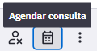, que abrirá a opção de agendamento de consulta para um dos profissionais de saúde, como mostra a Figura 12.5

Figura 12.5 Agendamento no módulo de gestão da garantia do acesso

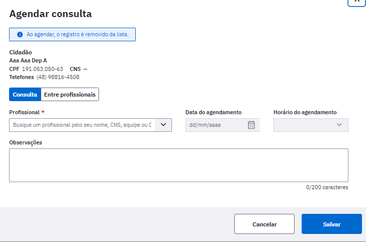
Fonte: SAPS/MS.

## 12.2 Cuidados Compartilhados

Este módulo permite que os profissionais consultem os casos em que foi necessário compartilhar o cuidado do cidadão com uma outros profissionais. 

O Compartilhamento do Cuidado é iniciado durante um atendimento individual, na etapa em que um profissional de nível superior está realizando o registro do Plano no SOAP. A descrição do uso desta ferramenta no Atendimento Individual está disponível no item [6.4.3.4.7 Ferramentas do Plano - Compartilhamento do Cuidado](https://saps-ms.github.io/Manual-eSUS_APS/docs/PEC/PEC_06_atendimentos/#64347-ferramentas-do-plano---compartilhamento-do-cuidado).

### Visualização dos cuidados compartilhados

Os profissionais poderão verificar a listagem de todos cidadãos em que houve um compartilhamento do cuidado. Para visualizar, basta acessar o  menu lateral esquerdo do PEC, em Gestão de filas > Cuidados Compartilhados, conforme a figura 1. 

Figura 1 - Gestão de filas 

Ao clicar em Cuidados compartilhados, é exibida a listagem dos cidadãos, que é dividido em duas abas, de acordo com a imagem 2:  

Figura 2 - Tela de Cuidados compartilhados 

Fonte: SAPS/MS.

**Solicitados por mim:** esta listagem permite a visualização dos casos que o próprio profissional compartilhou, além dos que foram solicitados por outros profissionais da sua equipe. Caso deseje visualizar apenas as suas solicitações, há a possibilidade de filtrar por "Ver somente as minhas solicitações".  
 
**Compartilhados comigo:** possibilita a visualização de todos os casos que outros profissionais compartilharam com quem está consultando a listagem, ou até mesmo com a sua equipe. Da mesma forma que a primeira aba, é possível visualizar apenas os seus casos, ocultando os dos demais membros da equipe, através do filtro "Ver somente cuidados compartilhados comigo". 

Ambas as listagens apresentam as seguintes colunas: 
- Data de início: Data que o caso foi compartilhado em um atendimento individual e iniciou o processo. 

- Cidadão: dados de nome e idade do cidadão atendido.

- Prioridade: Classificação do caso compartilhado feita pelo profissional no momento do atendimento individual que iniciou o processo.

- Solicitante: Profissional que iniciou o processo de compartilhamento do cuidado no atendimento individual.

- Executante: Profissional que foi selecionado para dar apoio na condução do caso compartilhado.

Há ainda dois ícones ao lado direito de cada uma das linhas da lista:

: Possibilita que todos os profissionais da equipe possam visualizar a discussão de caso entre os profissionais executante e solicitante. 

: ícone para iniciar a discussão do caso, pode ser acessado pelo solicitante ou pelo executante. 

{: .nota }
O solicitante e o executante poderão fazer modificações na discussão do caso de forma alternada, isto é, ao responder uma discussão de caso, só será possível incluir novas informações quando for respondido pelo outro profissional.

Na aba "Solicitados por mim" o usuário só poderá clicar em "Discutir caso" caso tenha solicitado aquele compartilhamento e caso o status seja "Respondido".

Na aba "Compartilhados comigo" o usuário só poderá clicar em "Discutir caso" caso aquele compartilhamento tenha sido compartilhado com ele e caso o status seja "Aguardando".

Há dois status possíveis nesta lista:
- **Aguardando**: exibida para o profissional quando a última interação foi dele e o caso ainda aguarda interação por parte do outro profissional envolvido no compartilhamento. Abaixo desse status, para o solicitante, é exibido o total de horas que o caso está aguardando a interação do outro profissional. Este status fica na cor vermelha.

Figura 3 - Status de "aguardando" do cuidado compartilhado

- **Respondido**: exibido para o profissional logo depois que ele interagiu no caso. Este status fica na cor verde.

Figura 4 - Status de "respondido" do cuidado compartilhado

Sempre que o status for "Aguardando" o sistema exibirá um contador de horas que exibirá há quantas horas aquela discussão está aguardando resposta.

O botão "Visualizar discussão" poderá ser acessado por todos os profissionais de nível superior da equipe do profissional solicitante ou do profissional executante.

## 12.2.1 Discussão de caso

A discussão de caso é iniciado ao clicar no ícone . Assim que o profissional executante entrar ele verá a tela mostrada na Figura 14.2.  

Figura 5 - Tela de Discussão de Caso do Executante

Fonte: SAPS/MS.

### Dados do caso

O cabeçalho exibe o resumo do caso compartilhado, este é exibido de forma igual na tela de discussão do Solicitante e do Executante nele há:

- Problemas/condições: é a hipótese diagnóstica do profissional que iniciou o compartilhamento do cuidado, isto é, o solicitante.

- Discussão do caso clínico: um breve resumo do caso clínico do cidadão.

- Prioridade: O profissional classificará a prioridade em baixa, média, alta e muito alta conforme a necessidade. 

- Data de início: data que o solicitante iniciou o compartilhamento do cuidado.

- Horário de início: hora que o solicitante iniciou o compartilhamento do cuidado.

- Tempo de espera: tempo de espera entre o momento que o cuidado foi compartilhado e a última interação com o profissional executante.

- Solicitante: sinaliza o profissional que iniciou o compartilhamento do cuidado.

### Histórico da discussão

Abaixo do cabeçalho é exibido um histórico da discussão realizada entre os profissionais solicitante e executante. A exibição ocorre em formato de fórum para que possa ser observado as interações entre eles e a discussão completa do caso até o momento da consulta.

Figura 6 - Tela do histórico de discussão

Junto do histórico da discussão, é exibida também a classificação de prioridade elencada pela solicitante, conforme exibido na imagem 7. Neste momento, caso o executante julgue que o caso clínico apresenta uma prioridade diferente daquela selecionada pela solicitante, poderá realizar a alteração. 

Figura 7 - Classificação de prioridade 

Caso o executante clique em "reclassificar", poderá optar entre baixa, média, alta ou muito alta, de acordo com a figura 8. 

Figura 8 - Reclassificar prioridade  
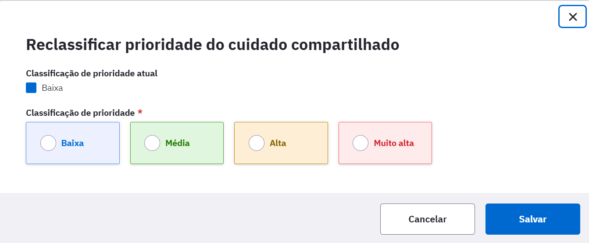

### Condutas
As condutas serão diferentes entre solicitante e executante:

Figura 9: Condutas Executante

Fonte: SAPS/MS.

#### Devolutiva de discussão do caso clínico

- Pedido de esclarecimento: Use esta opção se surgirem dúvidas ou faltarem informações, solicitando esclarecimentos adicionais sobre o caso.

- Teleconsulta: esta opção poderá ser utilizada para compartilhar perspectivas iniciais e conhecimento de caso.

- Recondução do Cuidado: selecionar quando houver o entendimento do profissional executante que aquele caso não é um caso para compartilhamento do cuidado. 

Em qualquer conduta selecionada maiores informações devem ser dadas no campo Observações.

Além das discussões, o profissional executante também poderá ter outras condutas como: Trocar profissional de referência, Agendar Consulta e Sugerir agendamento para grupos.

#### Trocar profissional de referência
Se o profissional entender que o compartilhamento do cuidado teria maior indicação para outra categoria/profissional, poderá selecionar "Trocar profissional de referência" justificando o motivo, profissional e CBO.

Figura 10 - Trocar profissional de referência

#### Agendar consulta
Caso o profissional executante entenda que aquele caso deve ser conduzido através de uma consulta, poderá optar pela conduta de "Agendar Consulta", onde ele reserva em sua agenda um horário para um atendimento que poderá ser realizado de forma presencial ou mediada por tecnologia com a videochamada do PEC. A consulta agendada poderá ser com o cidadão ou entre profissionais. As Figuras 11 e 12 mostram esta conduta de agendamento no cuidado compartilhado.

Figura 11: Agendamento de consulta no compartilhamento do cuidado

Agendar consulta com o cidadão:

Agendar consulta entre profissionais:

Fonte: SAPS/MS.

**Enviar para a garantia do acesso**    
Caso não haja disponibilidade de datas e horários no momento do agendamento, é possível utilizar a opção de "Enviar para a Garantia do Acesso" através do compartilhamento do cuidado. Dessa forma, o cidadão permanece na fila para um atendimento com a categoria profissional que necessita.  

#### Sugerir agendamento para grupos     
Caso  profissional entenda que há indicação de agendamento para grupos poderá selecionar esta opção, incluindo observações se houver necessidade.

Ao selecionar  a conduta selecionada pelo solicitante ou o executante será registrada e o status deste compartilhamento do cuidado será modificado na lista geral de casos, passando de "Aguardando" para "Respondido".

## Exemplos de Compartilhamento do Cuidado

#### Exemplo 1:

 - A profissional cirurgiã dentista da APS, atendeu uma gestante no 7º mês de gestação com uma infecção odontológica grave, ela é alérgica a penicilina, considerando o quadro clínico, o profissional decidiu compartilhar o cuidado com a médica ginecologista da equipe e-multi. Desta forma, ela explicou à paciente sobre a importância desse compartilhamento do cuidado. 

- Com o consentimento da paciente, a cirurgiã dentista descreveu o caso e compartilhou com a médica ginecologista. A médica ao acessar a aba do compartilhamento do cuidado, verificou que havia um caso para sua análise. Ao ler o caso e verificar as outras informações constantes no prontuário, respondeu a melhor conduta clínica para a paciente. A cirurgiã dentista atendeu novamente a gestante e prescreveu, explicando sobre o uso da medicação adequada. 

#### Exemplo 2:

- O médico está atendendo uma criança de 4 anos que está com dificuldade na fala e precisa compartilhar o cuidado com a fonoaudióloga, ele explicou o caso à mãe que concordou com o compartilhamento do cuidado. O médico explicou o caso e compartilhou com a fonoaudióloga. 
- A fonoaudióloga ao acessar o compartilhamento do cuidado e realizar a leitura do caso, pode recomendar orientações para a família e solicitar um agendamento para avaliação com a profissional. 

