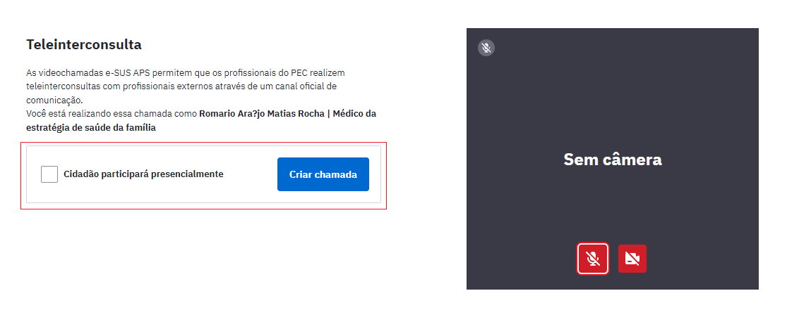
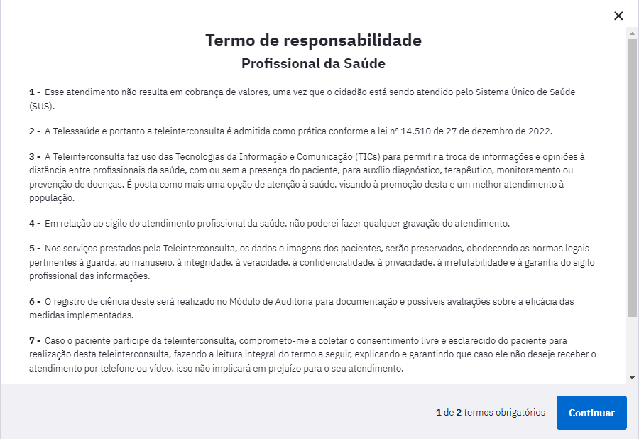
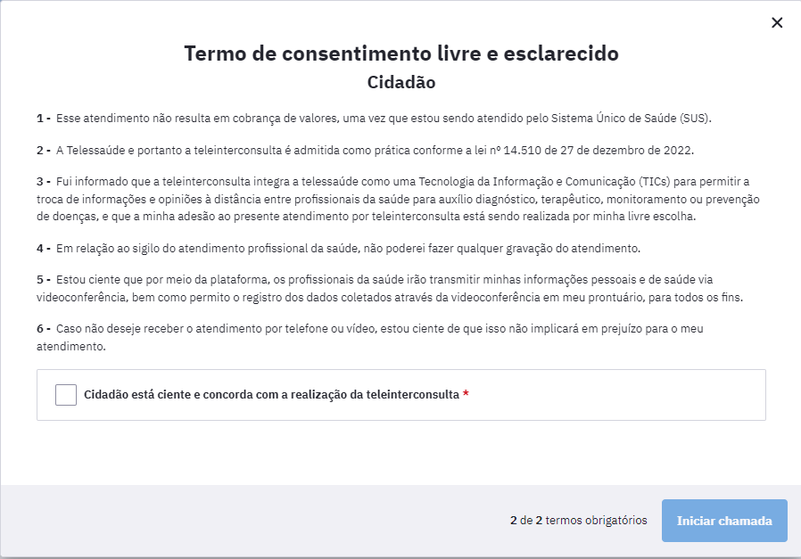
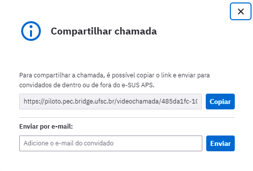
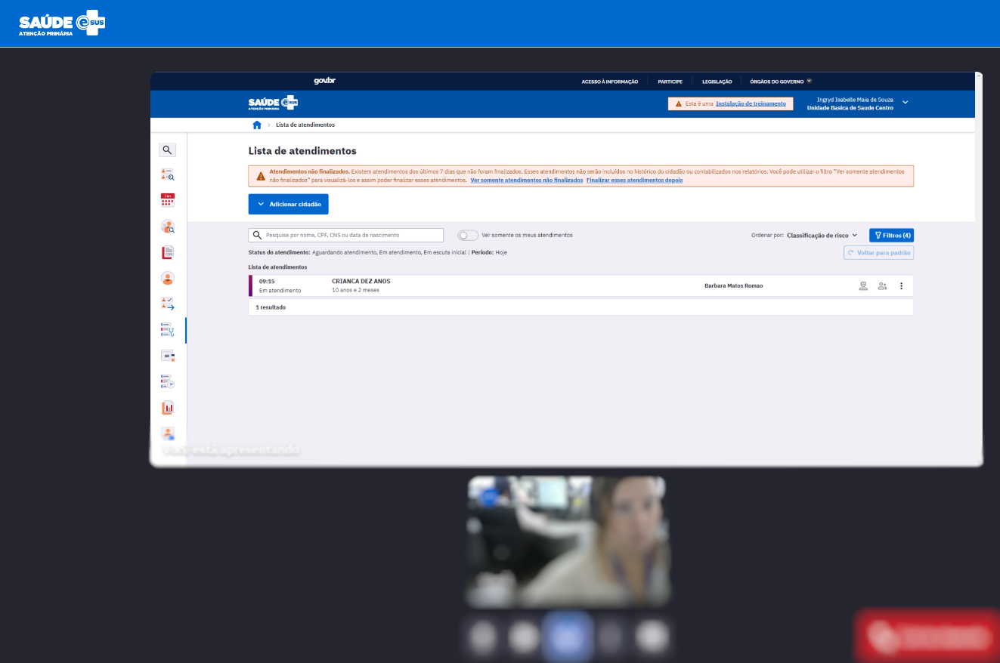
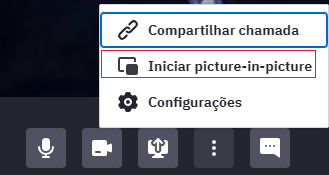
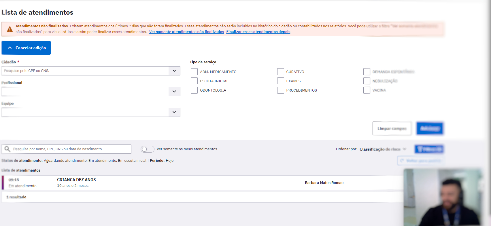
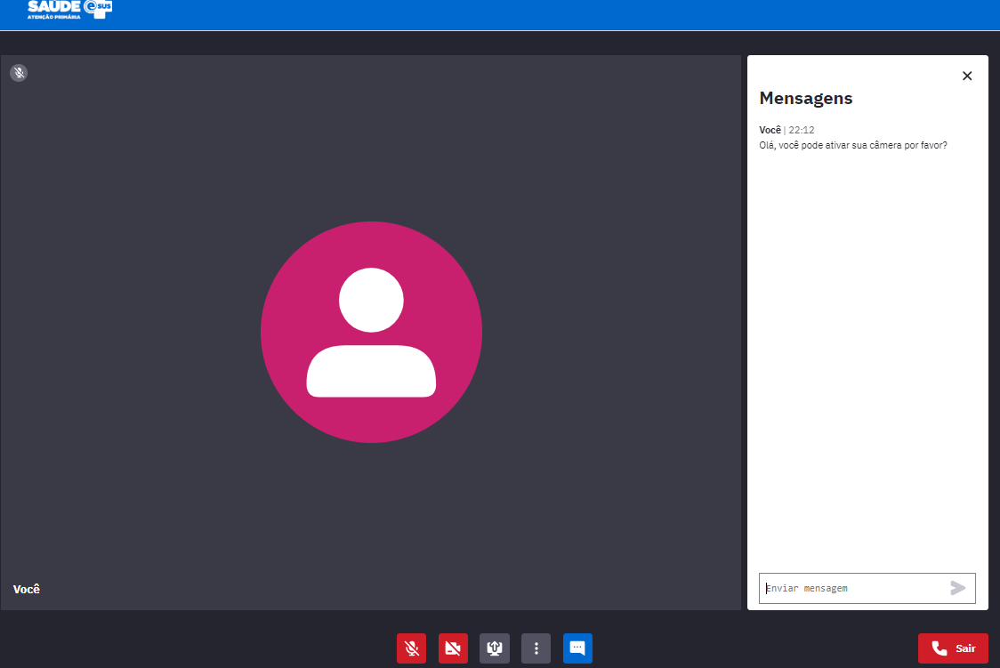

# CAPÍTULO 13 - Videochamadas
{: .no_toc }

Este módulo permite que os profissionais do PEC realizem videochamadas com profissionais internos ou externos à UBS ou outro estabelecimento de saúde que tenha o PEC instalado. Neste caso, o cidadão poderá ou não estar presente na chamada e a mesma será conduzida através de um canal oficial de comunicação garantindo a segurança desta ação.

{: .nota }
Uma das possíveis modalidades de uso desse módulo é a realização de Teleinterconsultas. 

#  13.1 Módulo Videochamada e-SUS APS

Após realizar habilitação para videochamadas no pec e-SUS APS, será criada uma nova chamada no módulo Videochamadas

Para iniciar a telechamada, inicialmente o profissional que estiver realizando o atendimento deve sinalizar se o cidadão participará presencialmente da videochamada. 

Fonte: SAPS/MS.

Confirmada ou não a participação presencial do cidadão, o profissional deverá habilitar microfone e câmera e clicar em (Criar chamada).

# 13.2 Termo de Responsabiliade - Profissional de Saúde

Após clicar em "Criar chamada", será gerado um Termo de Responsabilidade para o profissional estar ciente das informações descritas no termo.

O Termo de Responsabilidade do Profissional da Saúde, é o documento que informa tópicos necessários que o profissional precisa estar ciente antes de iniciar o atendimento, além de trazer informações relevantes a respeito dessa aplicação.

Ao relaizar a leitura do termo, clicar em "Continuar" para gerar o Termo de Consentimento Livre e Esclarecido do Cidadão.

# 13.3 Termo de Consentimento Livre e Esclarecido - Cidadão

O Termo de Consentimento Livre e Esclarecido do Cidadão estará disponível para o cidadão que participará de forma presencial da videochamada na companhia do profissional.

É dever do profissional que está presente com o cidadão, realizar a leitura do Termo de Consentimento para o mesmo e pergunta-lo se há consentimento. 

Após leitura e concordancia do cidadão, clicar em " Cidadão está ciente e concorda com a realização da videochamada" e a chamada será iniciada. 

{: .nota }
Atualmente este módulo não gera produção para agregar nos relatórios de atendimentos das equipes. Portanto faz-se necessário o registro do atendimento individual por meio da Ficha de Atendimento Individual (FAI).

# 13.4 Compartilhamento da chamada

Após o aceite dos termos, a videochamada será iniciada. Sendo assim, um link de acesso estará disponível para envio. Esse link pode ser acessado por usuários que não estejam logados em uma instalação do PEC. 

Para compartilhar o link com o outro participante, basta acionar o ícone  clicar em "Compartilhar chamada" e escolher se deseja copiar o link e enviar em local oportuno ou até mesmo enviar via e-mail.

Figura 13.4.1- Compartilhando a chamada

O profissional que receber o link consegue então acessar a videochamada após preencher seus dados.

# 13.5 Recursos da ferramenta 

O módulo de videchamadas dispõe de recursos que facilitam a comunicação durante seu uso.

## 13.5.1 Compartilhamento de tela

Ao clicar no ícone  irá aparecer as seguintes opções de compartilhamento de tela: 

Após escolher a opção desejada, sua tela será compartilhada com o outro participante da chamada e ambos poderão visualizar a tela. Esse recurso auxilia por exemplo em casos onde o profissional gostaria de compartilhar o prontuário do cidadão com o outro profissional de saúde participante.

Figura 13.5.1.1 - Tela sendo compartilhada em videochamada

## 13.5.2 Picture-in-picture

Esse recurso permite a visualização da videochama em uma "pequena janela" simultaneamente à navegação do usuário em qualquer local de seu computador, seja no navegador, na área de trabalho, ou até mesmo durante o uso do PEC. 

Para ativar o picture-in-picture basta clicar neste ícone  e clicar na opção "Iniciar picture-in-picture" : 

Figura 13.5.2.1 - Picture-in-picture ativado

## 13.5.3 Chat para envio de mensagens 

Para utilizar o chat basta clicar em  e um box de mensagens abrirá na lateral direita da videochamada. Dessa forma, os participantes da chamada também poderão se comunicar por meio da escrita.

Figura 13.5.3.1 - Chat 

