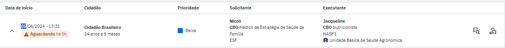
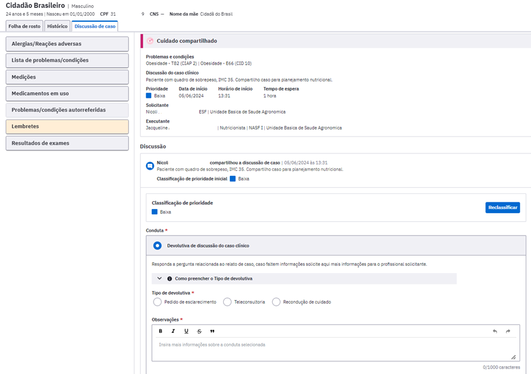
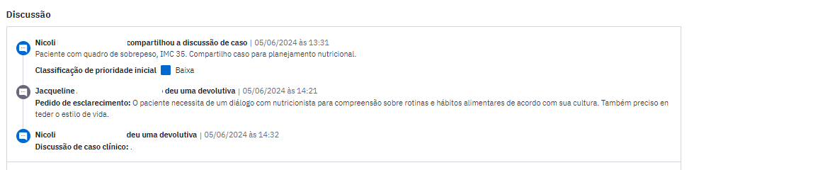
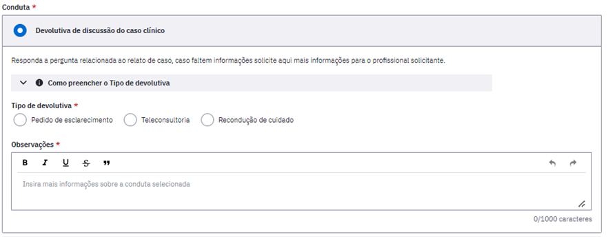
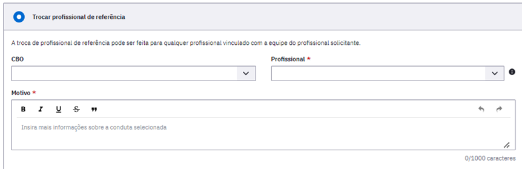
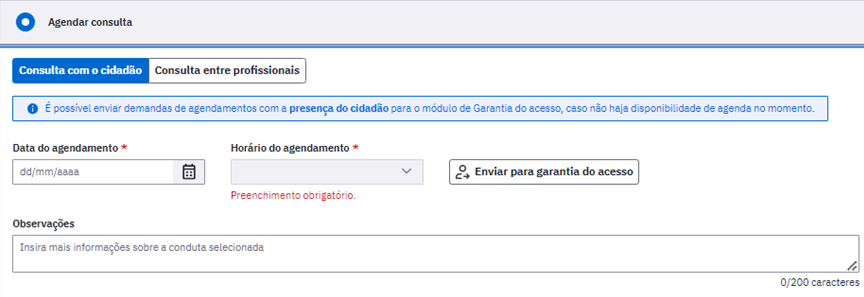
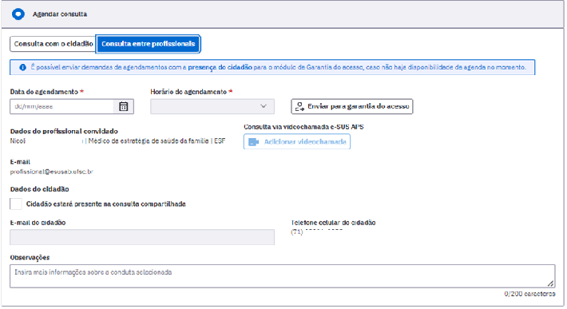
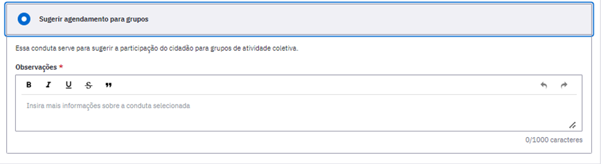

# CAPÍTULO 14 - Compartilhamento do cuidado
{: .no_toc }

## Sumário
{: .no_toc .text-delta }

- TOC
{:toc}

Este módulo permite que os profissionais acessem os casos em que foi necessário compartilhar o cuidado do cidadão com uma outra equipe. 

## 14.1 Começando o Compartilhamento do cuidado

O Compartilhamento do Cuidado é iniciado na parte de Plano do SOAP no momento de um atendimento individual realizado por um profissional de nível superior. A descrição desta ferramenta no Atendimento Individual está disponível no item 6.4.3.4.7 Ferramentas do Plano - Compartilhamento do Cuidado.

## 14.2 Módulo Compartilhamento do Cuidado

Após o profissional Compartilhar o Cuidado no momento do Atendimento Individual, o caso passará a fazer parte de uma lista de casos em um módulo específico do Compartilhamento do Cuidado. Para acessar esta lista de casos deve-se acessar no menu lateral esquerdo do PEC, em Gestão de filas, a parte do Cuidados Compartilhados. 

Ao clicar neste módulo aparecerá a listagem de todos os cidadãos que estão com casos compartilhados entre equipes.

Figura 14.1 - Tela de Cuidados compartilhados 

Fonte: SAPS/MS.

Este relatório é dividido em duas listas:

**Solicitados por mim:** São todos os casos que são solicitados pelo profissional que está visualizando a listagem, ou seja, todos os casos que aquele profissional o qual está visualizando sentiu necessidade de compartilhar com profissional da equipe multiprofissional.

**Compartilhados comigo:** São todos os casos que um profissional de outra equipe solicitou ajuda do profissional que está visualizando.

As listas têm informação de:
- Data de início: Data que o caso foi compartilhado em um atendimento individual e iniciou o processo. 

- Cidadão: Refere-se ao paciente que foi atendido.

- Prioridade: Classificação do caso compartilhado feita pelo profissional no momento do atendimento individual que iniciou o processo.

- Solicitante: Profissional que iniciou o processo de compartilhamento do cuidado no atendimento individual.

- Executante: Profissional que foi selecionado para ajudar na condução do caso clínico compartilhado.

Há ainda dois ícones ao lado direito de cada uma das linhas da lista:

: Possibilita que todos os profissionais da equipe possam visualizar a discussão de caso entre os profissionais executante e solicitante. 

: ícone para começar a discussão do caso, pode ser acessado pelo solicitante ou pelo executante. 

{: .nota }
O solicitante e o executante poderão fazer modificações na discussão do caso de forma alternada, isto é, ao responder uma discussão de caso, só será possível incluir novas informações quando for respondido pelo outro profissional.

Na aba "Solicitados por mim" o usuário só poderá clicar em "Discutir caso" caso tenha solicitado aquele compartilhamento e caso o status seja "Respondido".

Na aba "Compartilhados comigo" o usuário só poderá clicar em "Discutir caso" caso aquele compartilhamento tenha sido compartilhado com ele e caso o status seja "Aguardando".

Há dois status possíveis nesta lista:
- **Aguardando**: exibida para o profissional quando a última interação foi dele e o caso ainda aguarda interação por parte do outro profissional envolvido no compartilhamento. Abaixo desse status, para o solicitante, é exibido o total de horas que o caso está aguardando a interação do outro profissional. Este status fica na cor vermelha.

- **Respondido**: exibido para o profissional logo depois que ele interagiu no caso. Este status fica na cor verde.

Sempre que o status for "Aguardando" o sistema exibirá um contador de horas que exibirá há quantas horas aquela discussão está aguardando resposta.

O botão "Visualizar discussão" poderá ser acessado por todos os profissionais de nível superior da equipe do profissional solicitante ou do profissional executante.

## 14.3 Discussão de caso

A Discussão de caso pode ser iniciada a partir do momento que o profissional clica em atender . Assim que o profissional executante entrar ele verá a tela mostrada na Figura 14.2.  

Figura 14.2: Tela de Discussão de Caso do Executante

Fonte: SAPS/MS.

O cabeçalho mostra o resumo do caso compartilhado, este é exibido de forma igual na tela de discussão do Solicitante e do Executante nele há:

- Problemas/condições: é a hipótese diagnóstica do profissional que iniciou o compartilhamento do cuidado, isto é, o solicitante.

- Discussão do caso clínico: um breve resumo do caso clínico do cidadão.

- Prioridade: O profissional classificará a prioridade em baixa, média, alta e muito alta conforme a necessidade. 

- Data de início: data que o solicitante iniciou o compartilhamento do cuidado.

- Horário de início: hora que o solicitante iniciou o compartilhamento do cuidado.

- Tempo de espera: tempo de espera entre o momento que o cuidado foi compartilhado e a última interação com o profissional executante.

- Solicitante: sinaliza o profissional que iniciou o compartilhamento do cuidado.

Logo abaixo aparece a Discussão feita entre os profissionais solicitante e executante. É exibido em formato de fórum, com pergunta e resposta para que possa ser observado as interações entre eles e a discussão completa do caso até o momento da consulta.

As condutas serão diferentes entre solicitante e executante:

Figura 14.3: Condutas Executante

Fonte: SAPS/MS.

O profissional executante deve optar por uma das seguintes condutas na discussão do caso:

- Pedido de esclarecimento: Use esta opção se surgirem dúvidas ou faltarem informações, solicitando esclarecimentos adicionais sobre o caso.

- Teleconsulta: esta opção poderá ser utilizada para compartilhar perspectivas iniciais e conhecimento de caso.

- Recondução do Cuidado: selecionar quando houver o entendimento do profissional executante que aquele caso não é um caso para compartilhamento do cuidado. 

Em qualquer conduta selecionada maiores informações devem ser dadas no campo Observações.

Além das discussões, o profissional executante também poderá ter outras condutas como: Trocar profissional de referência, Agendar Consulta e Sugerir agendamento para grupos.

Se o profissional entender que o compartilhamento do cuidado teria maior indicação para outra categoria/profissional, poderá selecionar "Trocar profissional de referência" justificando o motivo, profissional e CBO.

Caso o profissional executante entenda que deve agendar uma consulta há a possibilidade de fazê-lo na conduta "Agendar Consulta", onde ele reserva em sua agenda uma consulta para ser feita de forma presencial ou mediada por tecnologia com a videochamada do PEC. A consulta agendada poderá ser com o cidadão ou entre profissionais. A Figura 14.4 mostra esta conduta de agendamento no cuidado compartilhado.

Figura 14.4: Agendamento de consulta no compartilhamento do cuidado

Agendar consulta com o cidadão:

Agendar consulta entre profissionais:

Fonte: SAPS/MS.

Caso  profissional entenda que há indicação de agendamento para grupos poderá selecionar esta opção, incluindo observações se houver necessidade.

Ao selecionar  a conduta selecionada pelo solicitante ou o executante será registrada e o status deste compartilhamento do cuidado será modificado na lista geral de casos, passando de "Aguardando" para "Respondido".

## 14.4 Exemplos Compartilhamento do Cuidado

#### Exemplo 1:

 - A profissional cirurgiã dentista da APS, atendeu uma gestante no 7º mês de gestação com uma infecção odontológica grave, ela é alérgica a penicilina, considerando o quadro clínico, o profissional decidiu compartilhar o cuidado com a médica ginecologista da equipe e-multi. Desta forma, ela explicou à paciente sobre a importância desse compartilhamento do cuidado. 

- Com o consentimento da paciente, a cirurgiã dentista descreveu o caso e compartilhou com a médica ginecologista. A médica ao acessar a aba do compartilhamento do cuidado, verificou que havia um caso para sua análise. Ao ler o caso e verificar as outras informações constantes no prontuário, respondeu a melhor conduta clínica para a paciente. A cirurgiã dentista atendeu novamente a gestante e prescreveu, explicando sobre o uso da medicação adequada. 

#### Exemplo 2:

- O médico está atendendo uma criança de 4 anos que está com dificuldade na fala e precisa compartilhar o cuidado com a fonoaudióloga, ele explicou o caso à mãe que concordou com o compartilhamento do cuidado. O médico explicou o caso e compartilhou com a fonoaudióloga. 
- A fonoaudióloga ao acessar o compartilhamento do cuidado e realizar a leitura do caso, pode recomendar orientações para a família e solicitar um agendamento para avaliação com a profissional. 