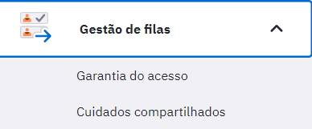
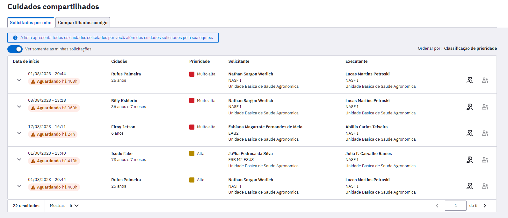
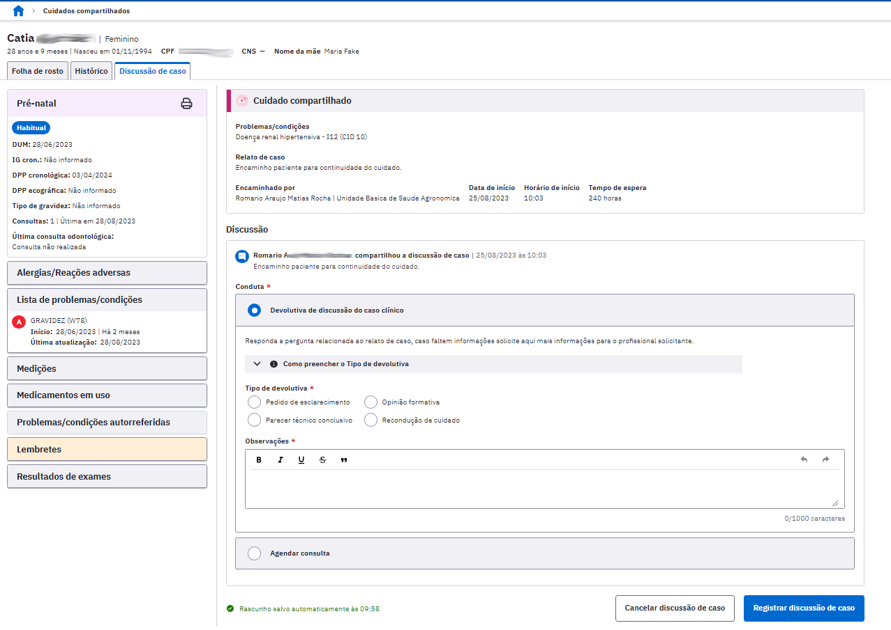
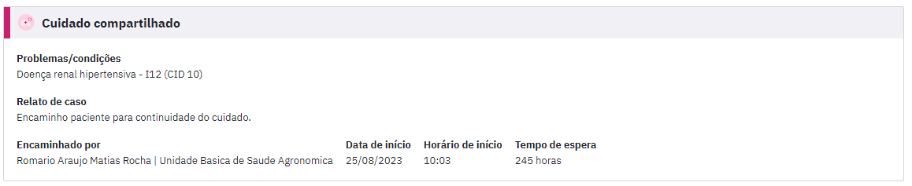
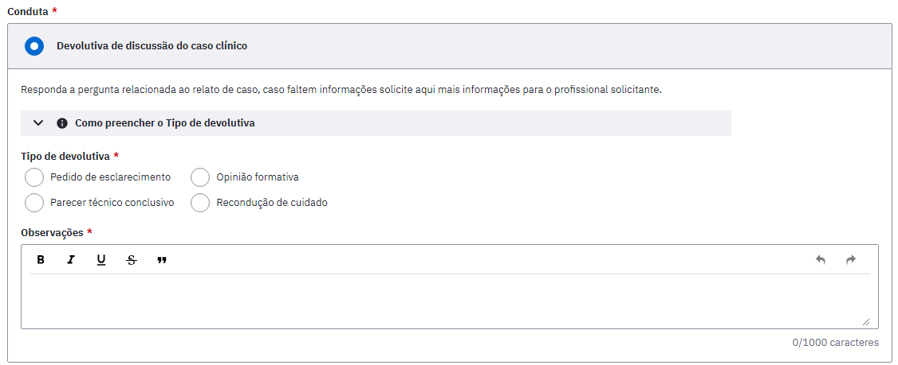
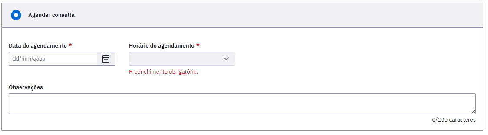

# CAPÍTULO 14 - Compartilhamento do cuidado
{: .no_toc }

Este módulo permite que os profissionais acessem os casos em que foi necessário compartilhar o cuidado do cidadão com uma outra equipe. 

## 14.1 Começando o Compartilhamento do cuidado

O Compartilhamento do Cuidado é iniciado na parte de Plano do SOAP no momento do um atendimento individual realizado por um profissional de nível superior. A descrição desta ferramenta no Atendimento Individual está disponível no item 6.4.3.4.7 Ferramentas do Plano - Compartilhamento do Cuidado.

## 14.2 Módulo Compartilhamento do Cuidado

Após o profissional Compartilhar o Cuidado no momento do Atendimento Individual, o caso passará a fazer parte de uma lista de casos num módulo específico do Compartilhamento do Cuidado. Para acessar esta lista de casos deve-se acessar no menu lateral esquerdo do PEC, em Gestão de filas, a parte do Cuidados Compartilhados. 

Ao clicar neste módulo vai aparecer a listagem de todos os cidadãos que estão com casos compartilhados entre equipes.

Figura 14.1 - Tela de Cuidados compartilhados 

Fonte: SAPS/MS.

Este relatório é dividido em duas listas:

**Solicitados por mim:** São todos os casos que são solicitados pelo profissional que está visualizando a listagem. Ou seja, todos os casos que aquele profissional que está visualizando sentiu necessidade de compartilhar com profissional da equipe multiprofissional.

**Compartilhados comigo:** São todos os casos que um profissional de outra equipe solicitou ajuda do profissional que está visualizando.

As listas têm informação de:
- Data de início: Data que o caso foi compartilhado em um atendimento individual e iniciou o processo. 

- Prioridade: Classificação do caso compartilhado feita pelo profissional no momento do atendimento individual que iniciou o processo.

- Solicitante: Profissional que iniciou o processo de compartilhamento do cuidado no atendimento individual.

- Executante: Profissional que foi selecionado para ajudar na condução do caso clínico compartilhado.

Há ainda dois ícones ao lado direito de cada uma das linhas da lista:

: Possibilita que todos os profissionais da equipe possam visualizara discussão de caso entre os profissionais executante e solicitante. 

: ícone para começar a discussão do caso, pode ser acessado pelo solicitante ou pelo executante. 

{: .nota }
O solicitante e o executante poderão fazer modificações na discussão do caso de forma alternada, isto é, ao responder uma discussão de caso, só será possível incluir novas informações quando for respondido pelo outro profissional.

Há dois status possíveis nesta lista:
- **Aguardando**: exibida para o profissional quando a última interação foi dele e o caso ainda aguarda interação por parte do outro profissional envolvido no compartilhamento. Abaixo desse status, para o solicitante, é exibido o total de horas que o caso está aguardando a interação do outro profissional.Este status fica na cor vermelha.

- **Respondido**: exibido para o profissional logo depois que ele interagiu no caso. Este status fica na cor verde.

## 14.3 Discussão de caso

A Discussão de caso pode ser iniciada a partir do momento que o profissional clica em atender . Assim que o profissional executante entrar ele vai ver a tela mostrada na Figura 14.2.  

Figura 14.2: Tela de Discussão de Caso do Executante

Fonte: SAPS/MS.

O cabeçalho mostra o resumo do caso compartilhado, este é exibido de forma igual na tela de discussão do Solicitante e do Executante nele há:

- Problemas/condições: é a hipótese diagnóstica do profissional que iniciou o compartilhamento do cuidado, isto é, o solicitante.

- Relato de caso: o breve resumo do caso clínico do cidadão.

- Encaminhado por: profissional que iniciou o compartilhamento do cuidado; o solicitante. 

- Data de início: data que o solicitante iniciou o compartilhamento do cuidado.

- Horário de início: hora que o solicitante iniciou o compartilhamento do cuidado.

- Tempo de espera: tempo de espera entre o momento que o cuidado foi compartilhado e a última interação com o profissional executante.

Logo abaixo aparece a Discussão feita entre os profissionais solicitante e executante. É exibido em formato de fórum, com pergunta e resposta para que possa ser observado as interações entre eles e a discussão completa do caso até o momento da consulta.

As condutas serão diferentes entre solicitante e executante:

Figura 14.3: Condutas Executante

Fonte: SAPS/MS.

O profissional executante deve optar por uma das seguintes condutas na discussão do caso:

- Pedido de esclarecimento: selecionar quando não ficou claro o motivo que levou o solicitante a compartilhar o caso, bem como quando ele precisa de alguma informação adicional que não foi dada anteriormente.

- Opinião Formativa: selecionada com o fim de esclarecer dúvidas do solicitante sobre procedimentos clínicos e ações de saúde para o cidadão. 

- Parecer Técnico Conclusivo: selecionar quando houver uma informação para embasar um parecer técnico formal.

- Recondução do Cuidado: selecionar quando houver o entendimento do profissional executante que aquele caso não é um caso para compartilhamento do cuidado.

Em qualquer conduta selecionada maiores informações devem ser dadas no campo Observações.

Caso o profissional executante entenda que deve agendar uma consulta há a possibilidade de fazê-lo na conduta "Agendar Consulta", onde ele reserva em sua agenda uma consulta para ser feita de forma presencial ou mediada por tecnologia com a videochamada do PEC. A Figura 14.4 mostra esta conduta de agendamento no cuidado compartilhado.

Figura 14.4: Agendamento de consulta no compartilhamento do cuidado

Fonte: SAPS/MS.

Ao selecionar  a conduta selecionada pelo solicitante ou o executante será registrada e o status deste compartilhamento do cuidado será modificado na lista geral de casos, passando de "Aguardando" para "Respondido".