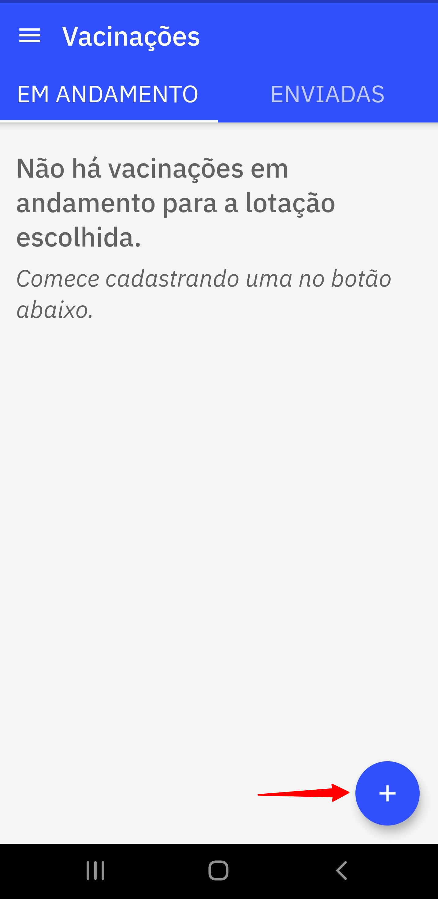
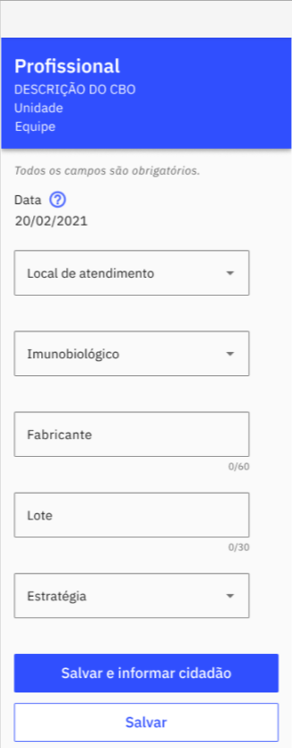
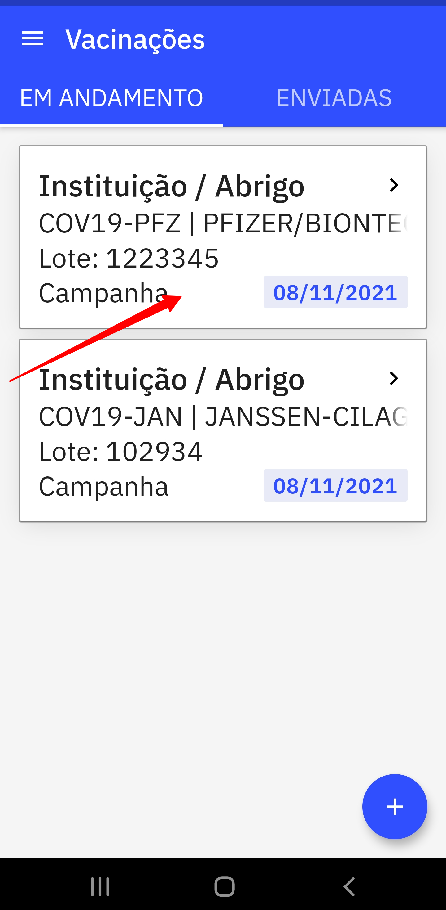
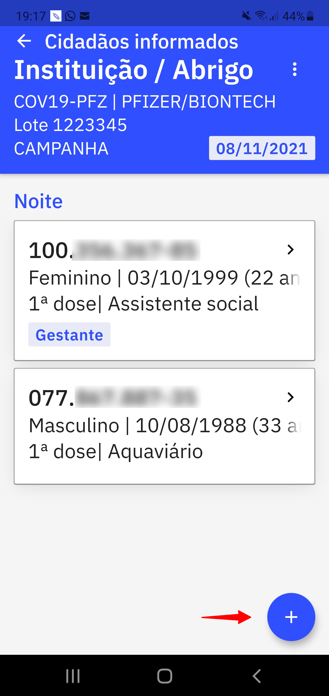
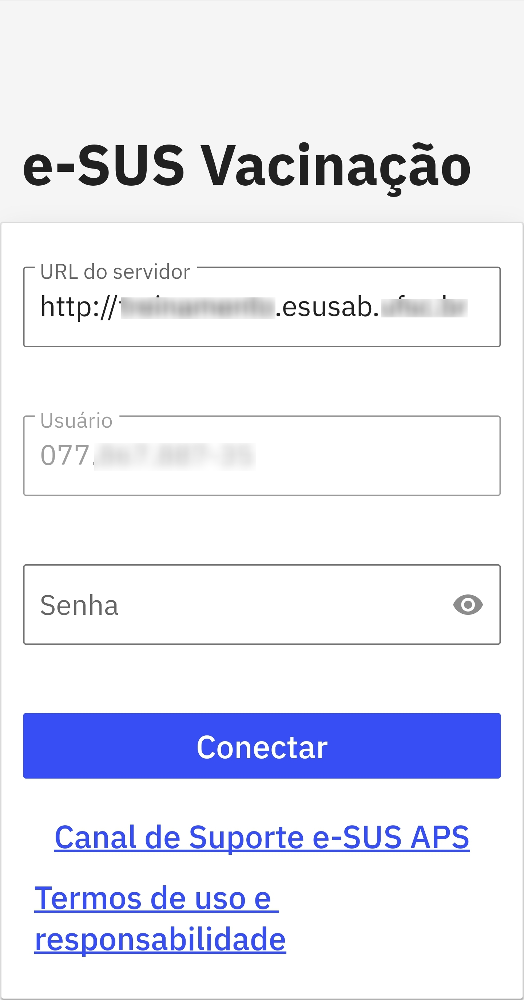
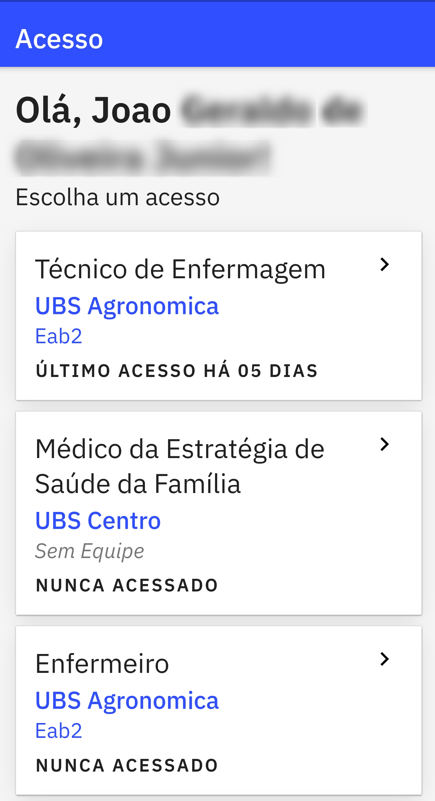

# Capítulo 3 - Como Utilizar o Aplicativo
{: .no_toc }

Neste capítulo abordaremos sobre o passo a passo para tirar maior proveito do aplicativo **e-SUS Vacinação** para agilizar as campanhas ou demais estratégias de vacinação no território ou na própria unidade de saúde. 

## Sumário
{: .no_toc .text-delta }

- TOC
{:toc}

## 3.1 Cadastrar imunobiológico

Após a autenticação no aplicativo e a escolha da lotação do vacinador, agora é o momento de cadastrar as vacinas que serão utilizadas na campanha. Nesta etapa basta clicar sobre o ícone com o sinal de "+" conforme a figura (3.0)

Figura 3.0 - Tela Vacinações

Fonte: SAPS/MS

Após clicar no ícone aparecerão os seguintes campos para o preenchimento **obrigatório** (Fig. 3.1):

1. **Local de Atendimento**: Informar o local onde está sendo realizado a vacinação;
2. **Imunobiológico**: Informar a vacina que está sendo administrada;
3. **Fabricante**: Informar o fabricante da vacina que está sendo administrada;
4. **Lote**: Informar o número do Lote do fabricante da vacina e
5. **Estratégia**: Informar a estratégia de vacinação conforme orientação do PNI.

Ao finalizar clique em "Salvar".

Figura 3.1 - Tela iniciar nova vacinação

Fonte: SAPS/MS

{: .dica } 
Antes de começar a campanha ou qualquer estratégia de vacinação faça o cadastro prévio de todas as vacinas que serão administradas no dia, assim o usuário do aplicativo agiliza o processo de registro das doses aplicadas. 

{: .nota } 
Após o cadastro do imunobiológico, o mesmo aparecerá na aba "EM ANDAMENTO". Todas as vacinas cadastradas aparecerão nesta aba (Vide figura 3.2). 

## 3.2 Informar cidadão vacinado

Após cadastradas as vacinas é o momento de registrar os cidadãos que foram imunizados. Para inserir o cidadão clique sobre o "card" com o nome do imunobiológico que foi aplicado (Figura 3.2).

Figura 3.2 - Tela Vacinações

Fonte: SAPS/MS

Em seguida aparecerá uma tela para informar dados do cidadão e os respectivos dados de vacinação do mesmo, nesta tela clique sobre o ícone com o sinal de "+" (Figura 3.3).

Figura 3.3 - Tela Cidadãos Informados

Fonte: SAPS/MS

Após clicar no ícone abrirá outra tela para informar os seguintes campos:

1. **Dose**: Informar qual a dose da vacina foi administrada de acordo com as regras do PNI;
2. **CPF/CNS**: Registrar o documento de identificação do cidadão;
3. **Data de nascimento**: Informar a data de nascimento;
4. **Sexo**: Registrar o sexo "Feminino" ou "Masculino";
5. **Grupo de Atendimento**: Informar o grupo de atendimento no caso das campanhas de vacinação contra Covid-19, de acordo com as regras do PNI e
6. **Condições**: Informar se o vacinado se encontra na condição de Gestante, Puérpera ou Viajante, caso necessário. Além de Comunicante de Hanseníase, no caso da BCG 

Para finalizar clique em **"Salvar"**, caso for registrar outro cidadão para o mesmo imunobiológico clique em **"Salvar e informar próximo"**.

{: .dica }
As boas práticas dos registros de informação em saúde requer que a cada atendimento ou procedimento realizado por um profissional de saúde seja feita logo em seguida o registro. Agindo dessa forma, o profissional de saúde, reduz o risco de erro de digitação. 

{: .nota } 
Após registrado os dados do cidadão vacinado é gerado um "card" na tela 'Cidadãos informados' da respectiva vacinação aplicada (Figura 3.3).

A instalação do Aplicativo **e-SUS Vacinação** se dá pelo fluxo padrão de instalação de aplicativos para dispositivos Android. 

* Acesse a instalação do aplicativo na [Google Play](https://play.google.com/store/apps/details?id=br.gov.saude.esusaps.vacinacao).

## 2.2 Requisitos Mínimos

Para um bom funcionamento do aplicativo, fique atento aos requisitos mínimos do dispositivo:

-   Sistema Operacional Android versão 4.4 ou superior

-   Processador, mínimo de 1,3 GHz Quad core e 2 Mb L2 cache;

-   Memória RAM, mínimo de 1 GB (um gigabyte)

-   A tela recomendada é de 9 ou 10 polegadas.

-   Armazenamento, mínimo de 16 GB

{: .nota } 
Consulte as especificações para tablet no [site do e-SUS APS](http://189.28.128.100/dab/docs/portaldab/documentos/especificacoes_tablet_esus.pdf).

## 2.3 Autenticação do Usuário

Por meio da tela de autenticação do aplicativo o usuário do aplicativo deve se conectar a um servidor do sistema e-SUS APS com Prontuário Eletrônico do Cidadão (PEC) na qual serão obtidos os dados apresentados durante o uso da aplicação.

Figura 2.3.1 - Tela de Autenticação do aplicativo e-SUS Vacinação

Fonte: SAPS/MS

A tela de autenticação apresenta três campos de preenchimento obrigatório. Nesta tela o usuário do aplicativo deverá informar:

- **URL do servidor**: endereço do servidor onde está instalado o sistema e-SUS APS com PEC na qual se quer ver os dados e na qual o usuário está cadastrado;

- **Usuário**: número de CPF do usuário do aplicativo; 

- **Senha**: senha do usuário (a mesma senha cadastrada no servidor da instalação do sistema e-SUS APS com PEC informada na URL do servidor).

Após preencher os campos acima, basta clicar em "Conectar". Em seguida aparecerá a tela de escolha de acesso, caso o usuário do aplicativo possua mais de uma lotação, aparecerão os cards com as lotações em que o usuário está vinculado na instalação informada na tela de autenticação. 

Figura 2.3.2 - Tela de escolha de acesso

Fonte: SAPS/MS

{: .nota }
Na tela de login encontra-se também o [canal de suporte e-SUS APS](http://esusaps.bridge.ufsc.br/support/login).

{: .atencao }
Para acessar o "canal de suporte e-SUS APS" o dispositivo deverá ter acesso a internet. 

## 2.4 Termo de Uso e Política de Privacidade

O Termo de Uso e Política de Privacidade visa registrar a manifestação livre, informada e inequívoca, pela qual o usuário deste aplicativo concorda com os termos de uso desta ferramenta, bem como a política de privacidade no tratamento de seus dados pessoais para a finalidade específica, em conformidade com a **Lei 13.709 de 2018 - Lei Geral de Proteção de Dados** e demais ordenamentos jurídicos relacionados.

Ao utilizar o aplicativo o usuário concorda com o presente termo e o titular declara ciência e concorda que: 

a) a União ocupa o papel de Controlador dos dados e, por força da desconcentração administrativa, o Ministério da Saúde, CNPJ  00.530.493/0001-71, desempenha as funções típicas de Controlador de dados, tomando decisões referentes ao tratamento dos seus dados pessoais; 
b) O Laboratório Bridge, da Universidade Federal de Santa Catarina (UFSC), aqui representado como Operador realize o tratamento de dados pessoais em nome do Controlador.

Para os fins deste Termo de Uso e Política de Privacidade, considera-se:

* Autoridade Nacional de Proteção de Dados (ANPD): órgão da administração pública responsável por zelar, implementar e fiscalizar o cumprimento desta Lei em todo o território nacional;

* Controlador: pessoa natural ou jurídica, de direito público ou privado, a quem competem as decisões referentes ao tratamento de dados pessoais;

* Dado pessoal: informação relacionada a pessoa natural identificada ou identificável;

* Dado pessoal sensível: dado pessoal sobre origem racial ou étnica, convicção religiosa, opinião política, filiação a sindicato ou a organização de caráter religioso, filosófico ou político, dado referente à saúde ou à vida sexual, dado genético ou biométrico, quando vinculado a uma pessoa natural;

* Eliminação: exclusão de dados ou de conjunto de dados armazenados em banco de dados, independentemente do procedimento empregado;

* Operador: pessoa natural ou jurídica, de direito público ou privado, que realiza o tratamento de dados pessoais em nome do controlador;

* Sítios e aplicativos: sítios e aplicativos por meio dos quais o usuário acessa os serviços e conteúdos disponibilizados;

* Titular: pessoa natural a quem se referem os dados pessoais que são objeto de tratamento;

* Tratamento: toda operação realizada com dados pessoais, como as que se referem a coleta, produção, recepção, classificação, utilização, acesso, reprodução, transmissão, distribuição, processamento, arquivamento, armazenamento, eliminação, avaliação ou controle da informação, modificação, comunicação, transferência, difusão ou extração;

* Usuário: todas as pessoas naturais que utilizarem o serviço de registro e envio de Fichas de Vacinação;

* Uso compartilhado de dados: comunicação, difusão, transferência internacional, interconexão de dados pessoais ou tratamento compartilhado de bancos de dados pessoais por órgãos e entidades públicos no cumprimento de suas competências legais, ou entre esses e entes privados, reciprocamente, com autorização específica, para uma ou mais modalidades de tratamento permitidas por esses entes públicos, ou entre entes privados.

### 2.4.1 Arcabouço Legal

A informatização da saúde é prevista pela Política Nacional de Informação e Informática em Saúde (PNIIS), sendo que a estratégia e-SUS APS é um elemento integrante dessa Política e está  prevista nas seguintes legislações:

* Portaria nº 2.073, de 31 de agosto de 2011 - Regulamenta o uso de padrões de interoperabilidade e informação em saúde para sistemas de informação em saúde no âmbito do Sistema Único de Saúde, nos níveis Municipal, Distrital, Estadual e Federal, e para os sistemas privados e do setor de saúde suplementar.

* Portaria nº 1.412, de 10 de julho de 2013 - Institui o Sistema de Informação em Saúde para a Atenção Básica (SISAB).

* Portaria nº 1.976, de 12 setembro de 2014 - Altera e acrescenta dispositivos à Portaria nº 1.412/GM/MS, de 10 de julho de 2013.

* Portaria nº 1.113, de 31 julho de 2015 - Altera o § 3º do art. 3º da Portaria nº 1.412/GM/MS, de 10 de julho de 2013, que institui o Sistema de Informação em Saúde para a Atenção Básica (SISAB).

* Portaria Nº 1.653, de 2 de outubro de 2015 - Acrescenta o art. 2º-A à Portaria nº 1.412/GM/MS, de 10 de julho de 2013, que Institui o Sistema de Informação em Saúde para a Atenção Básica (SISAB), com o objetivo de garantir a transição entre o Sistema de Registro das Ações Ambulatoriais de Saúde (RAAS) e o SISAB.

### 2.4.2 Sobre o e-SUS Vacinação

O  e-SUS Vacinação é um aplicativo destinado ao registro e envio de Fichas de Vacinação do modelo CDS - Coleta de Dados Simplificada, da estratégia e-SUS APS do Ministério da Saúde. O registro de informações é livre e manual, respeitadas as regras de preenchimento desta ficha. Somente profissionais com acesso a um servidor e-SUS APS PEC na **versão 4.1 ou superior** e com **lotação ativa** com **permissão para CADASTRO de Fichas de Vacinação** poderão utilizar este aplicativo. 

O envio das fichas é feito somente do aplicativo para o servidor e-SUS APS PEC informado, mediante validação dos dados de acesso do profissional/usuário e conexão estável com a internet. As Fichas de Vacinação são geradas com as informações dos profissionais, dos pacientes e do imunobiológico. Para cada cidadão que tenha uma aplicação de imunobiológico corretamente registrada no aplicativo, será gerada 1(uma) Ficha de Vacinação CDS. As fichas de vacinação CDS geradas pelo aplicativo só serão contabilizadas como produção do profissional, da equipe, da Unidade de Saúde e do Município, após enviadas para o servidor e-SUS APS PEC, validadas pelo mesmo, processadas e enviadas ao Centralizador Nacional e-SUS APS.

### 2.4.3 Da finalidade da coleta dos dados

A Estratégia e-SUS APS faz referência ao processo de informatização qualificada do Sistema Único de Saúde (SUS) em busca de um SUS eletrônico (e-SUS) e tem como objetivo concretizar um novo modelo de gestão de informação que apoie os municípios e os serviços de saúde na gestão efetiva da APS e na qualificação do cuidado dos usuários.

Nesse contexto, insere-se a coleta de informações de vacinação através das Fichas de Vacinação CDS geradas no uso do aplicativo.

#### 2.4.3.1 Por quanto tempo os dados ficam armazenado

Os dados ficarão armazenados nas bases de dados do Ministério da Saúde pelo tempo que for necessário para continuarmos fazendo políticas públicas em saúde. Os dados pessoais serão, sempre que possível, anonimizados.

#### 2.4.3.2 Compartilhamento dos dados

As Fichas de Vacinação CDS produzidas pelo aplicativo serão compartilhadas apenas com o servidor e-SUS APS PEC informado pelo usuário, mediante envio manual das mesmas. Este servidor e-SUS APS PEC, por sua vez, compartilha tais fichas com o Centralizador Nacional e-SUS APS do Ministério da Saúde, para fins de elaboração de políticas públicas de saúde. 
Dados e estatísticas de uso individualizados do aplicativo serão coletados e tratados, sempre respeitando o anonimato do usuário, através da plataforma Google Analytics, para melhoria e suporte da aplicação.

### 2.4.4 Direitos do Titular

O Titular tem direito a obter da Controladora, em relação aos dados por ele tratados, a qualquer momento e mediante requisição: 

I - confirmação da existência de tratamento;
II - acesso aos dados;  
III - correção de dados incompletos, inexatos ou desatualizados;
IV - anonimização, bloqueio ou eliminação de dados desnecessários, excessivos ou tratados em desconformidade com o disposto na Lei nº 13.709;
V - portabilidade dos dados a outro fornecedor de serviço ou produto, mediante requisição expressa e observados os segredos comercial e industrial, de acordo com a regulamentação do órgão controlador;
VI - eliminação dos dados pessoais tratados com o consentimento do titular, exceto nas hipóteses previstas no art. 16 da Lei nº 13.709;
VII - informação das entidades públicas e privadas com as quais o controlador realizou uso compartilhado de dados;  
VIII - informação sobre a possibilidade de não fornecer consentimento e sobre as consequências da negativa;  
IX - revogação do consentimento, nos termos do § 5º do art. 8º da Lei nº 13.709.

### 2.4.5 Da Responsabilidade do Usuário do Aplicativo

O Usuário se responsabiliza pela precisão e veracidade dos dados informados no cadastro e reconhece que a inconsistência destes poderá implicar a impossibilidade de utilizar serviços públicos do Governo Federal.

O login e senha só poderão ser utilizados pelo usuário cadastrado. Este deve manter o sigilo da senha, que é pessoal e intransferível, não sendo possível, em qualquer hipótese, a alegação de uso indevido, após o ato de compartilhamento.

O usuário da Plataforma é responsável pela atualização das suas informações pessoais e consequências na omissão ou erros nas informações pessoais cadastradas.

O Usuário é responsável pela reparação de todos e quaisquer danos, diretos ou indiretos (inclusive decorrentes de violação de quaisquer direitos de outros usuários, de terceiros, inclusive direitos de propriedade intelectual, de sigilo e de personalidade), que sejam causados à Administração Pública Federal (APF), a qualquer outro Usuário, ou, ainda, a qualquer terceiro, inclusive em virtude do descumprimento do disposto nestes Termos de Uso e Política de Privacidade ou de qualquer ato praticado a partir de seu acesso à Internet, ao sítio e/ou Aplicativo.

O Órgão não poderá ser responsabilizado pelos seguintes fatos:

a. Equipamento infectado ou invadido por atacantes;
b. Equipamento avariado no momento do consumo de serviços;
c. Proteção do computador;
d. Proteção das informações baseadas nos computadores dos usuários;
e. Abuso de uso dos computadores dos usuários;
f. Monitoração clandestina do computador dos usuários;
g. Vulnerabilidades ou instabilidades existentes nos sistemas dos usuários;
h. Perímetro inseguro;

### 2.4.6 Da Responsabilidade da Administração Pública

A Administração Pública, no papel de custodiante das informações pessoais dos Usuários, deve cumprir todas as legislações inerentes ao uso correto dos dados pessoais do cidadão de forma a preservar a privacidade dos dados utilizados na plataforma.

Publicar e informar ao Usuário as futuras alterações a estes Termos de Uso e Política de Privacidade, conforme o princípio da publicidade estabelecido no artigo 37, caput, da Constituição Federal.

Em nenhuma hipótese, a Administração Pública Federal será responsável pela instalação no equipamento do Usuário ou de terceiros, de códigos maliciosos (vírus, trojans, malware, worm, bot, backdoor, spyware, rootkit, ou de quaisquer outros que venham a ser criados), em decorrência da navegação na Internet pelo Usuário.

### 2.4.7 Segurança dos Dados

A Controladora responsabiliza-se pela manutenção de medidas de segurança, técnicas e administrativas aptas a proteger os dados pessoais de acessos não autorizados e de situações acidentais ou ilícitas de destruição, perda, alteração, comunicação ou qualquer forma de tratamento inadequado ou ilícito.

Em conformidade ao art. 48 da Lei nº 13.709, o Controlador comunicará ao Titular e à Autoridade Nacional de Proteção de Dados (ANPD) a ocorrência de incidente de segurança que possa acarretar risco ou dano relevante ao Titular.

### 2.4.8 Alterações e atualizações na política de privacidade

Esta política tem validade indeterminada, podendo ser alterada em seus termos, a qualquer tempo, e a versão deste termo de uso será vinculada no ato da aceitação do usuário.

Se você ficou com alguma dúvida, entre em contato com o nosso [suporte](https://e.susaps.freshdesk.com/).

### 2.4.9 Foro

Quaisquer disputas ou controvérsias oriundas de quaisquer atos praticados no âmbito da utilização dos sítios e/ou aplicativos pelos usuários, inclusive com relação ao descumprimento dos Termos de Uso e Política de Privacidade ou pela violação dos direitos da Administração Pública Federal, de outros Usuários e/ou de terceiros, inclusive direitos de propriedade intelectual, de sigilo e de personalidade, serão processadas na Comarca de Brasília/DF.

{: .nota }
Na tela do perfil, se precisar de suporte para uso do aplicativo, o usuário pode acessar o card "Obter ajuda" e será direcionado para o canal de suporte oficial do e-SUS APS. 

{: .atencao }
Para acessar a funcionalidade "Obter ajuda" o dispositivo deverá ter acesso a internet. 

Na tela do perfil ainda é possível acessar a ferramenta "**Sobre**"  para acessar às informações da versão do aplicativo

Figura 2.4.2 - Tela Sobre a versão do aplicativo

Fonte: SAPS/MS

{: .nota }
Apenas os profissionais de saúde habilitados para registrarem vacinação e que possuam lotação ativa na URL do servidor informado na autenticação conseguirão utilizar o aplicativo *e-SUS Vacinação*.

{: .atencao }
O aplicativo é de uso pessoal e intransferível!!! Caso um usuário retorne a tela de autenticação após logado no aplicativo, ao tentar alterar a informação de "Usuário" não é possível alterar o CPF. Os dados gerados no aplicativo estão vinculados ao CPF do usuário que logou o aplicativo. 

{: .atencao }
