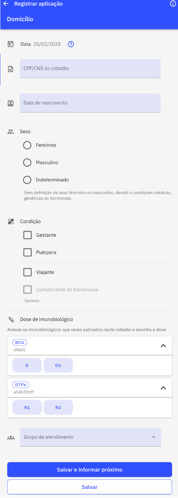
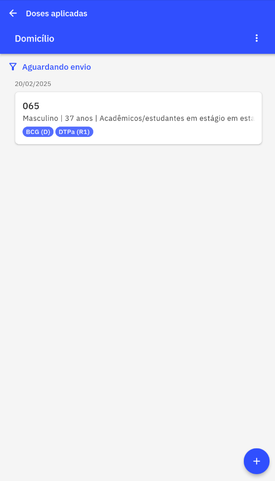
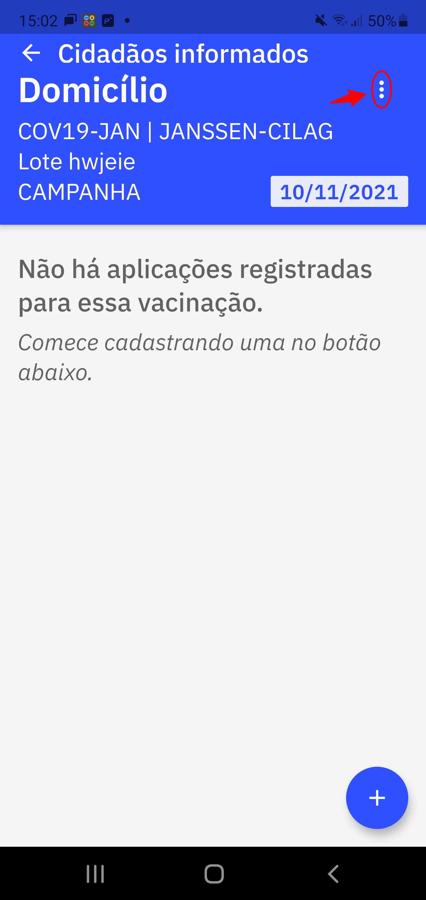
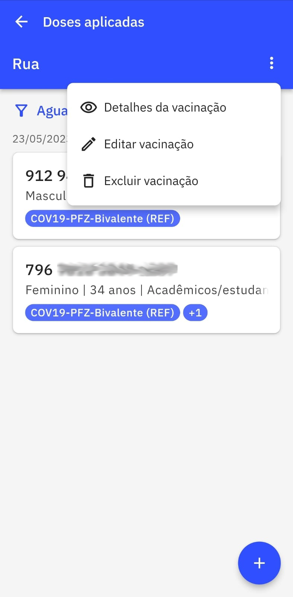
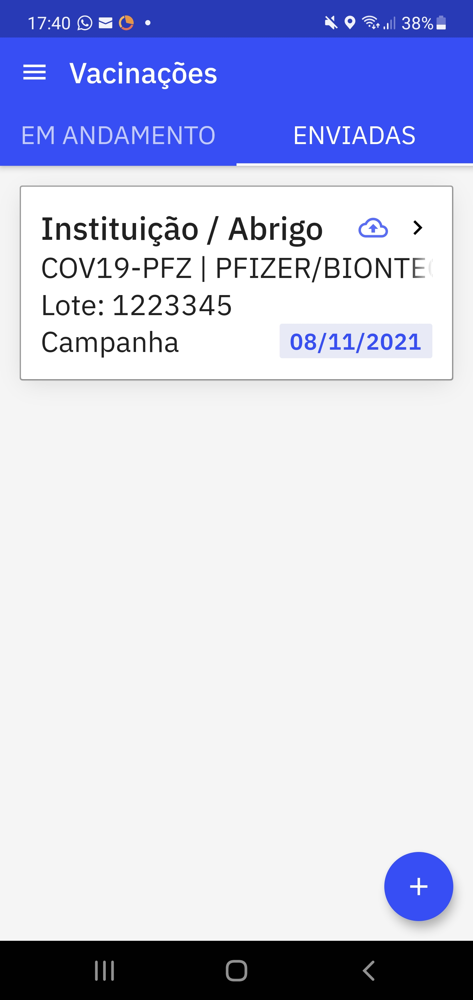
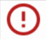
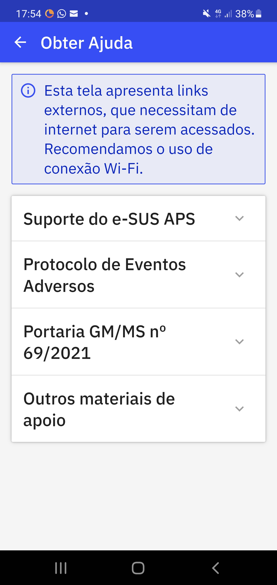
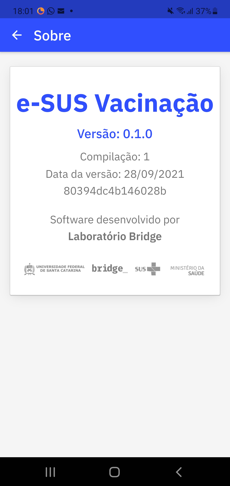

# Capítulo 3 - Como Utilizar o Aplicativo
{: .no_toc }

Neste capítulo abordaremos sobre o passo a passo para tirar maior proveito do aplicativo **e-SUS Vacinação** para agilizar as campanhas ou demais estratégias de vacinação no território ou na própria unidade de saúde. 

## Sumário
{: .no_toc .text-delta }

- TOC
{:toc}

## 3.1 Cadastrar imunobiológico

Após a autenticação no aplicativo e a escolha da lotação do vacinador, agora é o momento de cadastrar as vacinas que serão utilizadas na campanha. Nesta etapa basta clicar sobre o ícone com o sinal de "+" conforme a figura 3.0.

Figura 3.0 - Tela Vacinações

Fonte: SAPS/MS

Após clicar no ícone aparecerão os seguintes campos para o preenchimento **obrigatório** (Fig. 3.1):

1. **Local de Atendimento**: Informar o local onde está sendo realizado a vacinação;
2. **Imunobiológico**: Informar a vacina que está sendo administrada;
3. **Fabricante**: Informar o fabricante da vacina que está sendo administrada;
4. **Lote**: Informar o número do Lote do fabricante da vacina e
5. **Estratégia**: Informar a estratégia de vacinação conforme orientação do PNI.

Ao finalizar clique em "Salvar".

Figura 3.1 - Tela iniciar nova vacinação

Fonte: SAPS/MS

{: .dica } 
Antes de começar a campanha ou qualquer estratégia de vacinação faça o cadastro prévio de todas as vacinas que serão administradas no dia, assim o usuário do aplicativo agiliza o processo de registro das doses aplicadas. 

{: .nota } 
Após o cadastro do imunobiológico, o mesmo aparecerá na aba "EM ANDAMENTO". Todas as vacinas cadastradas aparecerão nesta aba (Vide figura 3.2). 

## 3.2 Informar cidadão vacinado

Após cadastradas as vacinas é o momento de registrar os cidadãos que foram imunizados. Para inserir o cidadão clique sobre o "card" com o nome do imunobiológico que foi aplicado (Figura 3.2).

Figura 3.2 - Tela Vacinações

Fonte: SAPS/MS

Em seguida aparecerá uma tela para informar dados do cidadão e os respectivos dados de vacinação do mesmo, nesta tela clique sobre o ícone com o sinal de "+" (Figura 3.3).

Figura 3.3 - Tela Cidadãos Informados

Fonte: SAPS/MS

Após clicar no ícone abrirá outra tela para informar os seguintes campos (Fig. 3.4):

1. **Dose**: Informar qual a dose da vacina foi administrada de acordo com as regras do PNI;
2. **CPF/CNS**: Registrar o documento de identificação do cidadão;
3. **Data de nascimento**: Informar a data de nascimento;
4. **Sexo**: Registrar o sexo "Feminino" ou "Masculino";
5. **Grupo de Atendimento**: Informar o grupo de atendimento no caso das campanhas de vacinação contra Covid-19, de acordo com as regras do PNI e
6. **Condições**: Informar se o vacinado se encontra na condição de Gestante, Puérpera ou Viajante, caso necessário. Além de Comunicante de Hanseníase, no caso da BCG 

Para finalizar clique em **"Salvar"**, caso for registrar outro cidadão para o mesmo imunobiológico clique em **"Salvar e informar próximo"**.

Figura 3.4 Tela Informar dados do Cidadão

Fonte: SAPS/MS

{: .dica }
As boas práticas dos registros de informação em saúde requer que a cada atendimento ou procedimento realizado por um profissional de saúde seja feita logo em seguida o registro. Agindo dessa forma, o profissional de saúde, reduz o risco de erro de digitação. 

{: .nota } 
Após registrado os dados do cidadão vacinado é gerado um "card" na tela 'Cidadãos informados' da respectiva vacinação aplicada (Figura 3.3).

## 3.3 Outros recursos do Aplicativo

### 3.3.1 Edição e Exclusão de registros

Os dados registrados no aplicativo e-SUS Vacinação poderão ser excluídos ou editados enquanto não forem enviados para o sistema e-SUS APS.  Para editar ou excluir esses dados acesse o ícone  nas telas 'Cidadão Informado' e 'Dados do cidadão' (Figuras 3.4 e 3.5). 

Figura 3.4 - Tela Cidadão Informado

Fonte: SAPS/MS

Figura 3.5 - Tela Dados do cidadão

Fonte: SAPS/MS

{: .nota }
Para excluir a vacina cadastrada não deve haver nenhum cidadão cadastrado no mesmo. 

### 3.3.2 Menu

Na tela inicial do aplicativo é possível acessar um menu. Ao clicar sobre o ícone  aparecerão os seguintes recursos (Figura 3.6):

Figura 3.6 - Tela do Menu

Fonte: SAPS/MS

#### 3.3.2.1 Enviar fichas 

Esta seção é fundamental para o envio dos registros realizados no aplicativo, ao clicar sobre a palavra 'enviar fichas', os dados são enviados para o servidor PEC registrado na URL inserida na autenticação do aplicativo. Ao final do envio, os dados registrados da vacinação aparecerão na aba 'Enviadas'. (Figura 3.7)

Figura 3.7 - lista de 'Enviadas'

Fonte: SAPS/MS

{: .nota }
Os registros que apresentarem inconsistências nas informações não serão enviados ao sistema e-SUS APS com PEC e permanecerão na lista 'EM ANDAMENTO' com o card apresentando o símbolo . Essas inconsistências significam que os dados foram rejeitados e os erros indicados [apresentados em uma lista] deverão ser corrigidos para que os dados sejam enviados novamente. Se o problema persistir, realize o registro por meio do sistema e-SUS APS com Coleta de Dados em Saúde (CDS). 

#### 3.3.2.2 Trocar acesso 

Se o profissional possuir mais de uma lotação, esta seção permitirá a escolha de qual lotação acessar para inserir os dados. 

#### 3.3.2.3 Obter ajuda

Nesta seção é possível obter ajuda por meio de alguns materiais de apoio e do suporte do e-SUS APS. Para acessar os materiais e o suporte é necessário o acesso a internet (Figura 3.8)

Figura 3.8 - Tela 'Obter Ajuda'

Fonte: SAPS/MS

#### 3.3.2.4 Sobre

Esta seção apresenta principalmente a versão do aplicativo. Os usuários do sistema e-SUS APS devem sempre estar atento as atualizações das versões para utilizarem a versão mais atual.

Figura 3.9 - Tela 'Sobre"

Fonte: SAPS/MS

#### 3.3.2.5 Sair 

Esta seção permite ao usuário deslogar do aplicativo e sair com segurança da aplicação.  