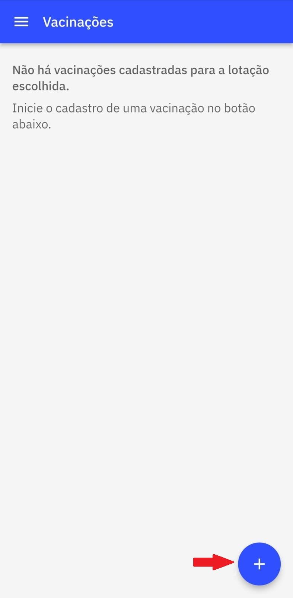
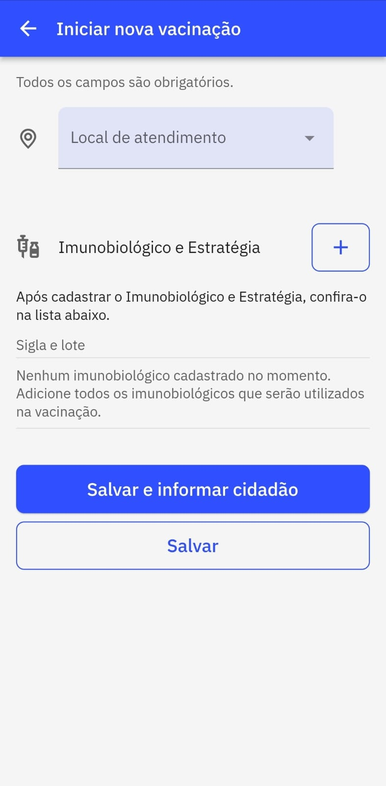
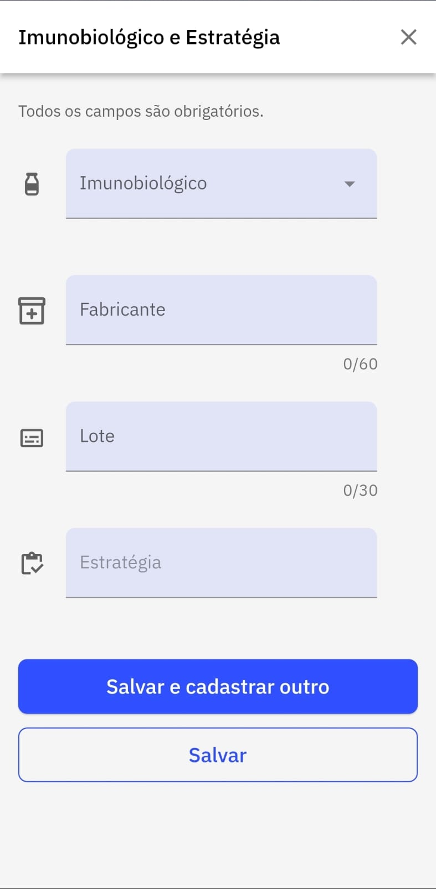
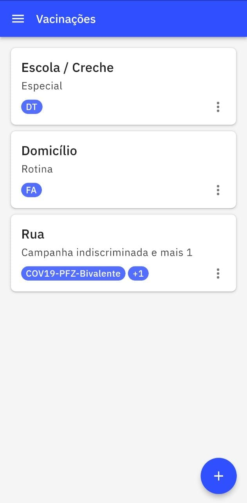

# Capítulo 3 - Como Utilizar o Aplicativo
{: .no_toc }

Neste capítulo abordaremos sobre o passo a passo para tirar maior proveito do aplicativo **e-SUS Vacinação** para agilizar as campanhas ou demais estratégias de vacinação no território ou na própria unidade de saúde. 

## Sumário
{: .no_toc .text-delta }

- TOC
{:toc}

## 3.1 Cadastrar Vacinação

Após a autenticação no aplicativo e a escolha da lotação do vacinador, agora é o momento de cadastrar uma nova vacinação ao clicar sobre o ícone com o sinal de "+", conforme a figura 3.1.

Figura 3.1 - Tela Vacinações

Fonte: SAPS/MS

Ao clicar no ícone será aberto outra tela em que todos os campos são **obrigatórios**. 

Inicialmente deve-se cadastrar o Local de atendimento, ou seja, o local que a vacinação irá ocorrer. As opções a serem selecionadas são: 
- Domicílio
- Escola/creche
- Instituição/abrigo
- Outros 
- Polo (Academia da Saúde)
- Rua
- UBS
- Unidade Móvel
- Unidade prisional ou congêneres
- Unidade socioeducativa

Em seguida deve-se cadastrar os imunobiológicos e respectivas estratégias das vacinas que serão aplicadas no local selecionado anteriormente, conforme mostra Figura 3.2. Os dados para cadastro são obrigatórios e contam com os campos:
1. **Imunobiológico:** Informar a vacina que será administrada. Este campo possui as opções de imunobiológicos do Programa Nacional de Imunização (PNI);
2.**Fabricante:** Informar o fabricante da vacina que está sendo administrada;
3. **Lote**: Informar o número do Lote do fabricante da vacina;
4. **Estratégia**: Informar a estratégia de vacinação conforme orientação do PNI. Este campo exibe as opções conforme o imunobiológico selecionado.

Figura 3.2 - Tela de cadastro de Imunobiológico e Estratégia

Fonte: SAPS/MS

Ao finalizar, clique em "Salvar e cadastrar outro" quando mais de um imunobiológico será aplicado naquele instante, no local indicado. Ou clique em "salvar" quando todos os imunobiológicos que serão aplicados já estão cadastrados.

Após este cadastro, todos os locais com os respectivos imunobológicos e estratégias cadastrados, ficam listados para inserção posterior dos dados do cidadão vacinado. Como mostra a Figura 3.3.

Figura 3.3 - Lista com locais e respectivos imunobiológicos e estratégias cadastrados

Fonte: SAPS/MS

{: .dica } 
Antes de começar a campanha ou qualquer estratégia de vacinação faça o cadastro prévio de todas as vacinas que serão administradas no dia, assim o usuário do aplicativo agiliza o processo de registro das doses aplicadas. 

{: .nota } 
Após o cadastro do imunobiológico e estratégia, todos os locais de vacinação cadastrados serão listados para posterior cadastro dos cidadão que receberão a vacina(Vide figura 3.2). 

## 3.2 Cadastrar Cidadão

Ao selecionar o local de vacinação, clique no ícone com o sinal de "+" para registrar os dados do cidadão e a dose do imunobiológico que será administrado.
O registro de doses aplicadas pode ser de todos os imunobiológicos cadastrados na primeira etapa ou só em parte dele. A Figura 3.4 mostra tela de cadastro do cidadão e as doses aplicadas.

Figura 3.4 - Tela de cadastro do Cidadão

Fonte: SAPS/MS

O registro do cidadão conta com os seguintes campos obrigatórios: Data (este dado é inserido automaticamente e não é possível a edição, por este motivo é importante conferir se o dispositivo está configurado com "data automática" nas configurações de Data e Hora); CPF/CNS do cidadão; Data de Nascimento e Sexo. O campo Condições é opcional. E o campo Dose de imunobiológicos é obrigatório que pelo menos uma das doses seja selecionada.

Após registro das informações do cidadão e as doses que foram aplicadas deve-se clicar em "Salvar e informar próximo" quando há mais cidadãos e doses a registrar e em "Salvar" quando os registros foram finalizados. 

Em seguida vão ser exibidos todos os cidadãos que foram registrados no local registrado e os imunobiológicos e as doses registradas, como mostra a Figura 3.5.

Figura 3.5 - Cidadãos com doses registradas 

Fonte: SAPS/MS

Essa tela também permite visualizar e filtrar os status de envio das fichas para o PEC. Os status são: Aguardando envio, Enviadas, Rejeitadas e Todas, conforme mostrado na Figura 3.6.

Figura 3.5 - Cidadãos com doses registradas 

Fonte: SAPS/MS

{: .nota } 
O cadastro do cidadão também pode ser feito ao cadastrar o local de atendimento e o imunológico/estratégica. É possível clicar na mesma tela em "Salvar e informar o cidadão". Será aberto a tela de inserção de dados do cidadão, como mostra a Figura 3.4.

{: .dica }
As boas práticas dos registros de informação em saúde requer que a cada atendimento ou procedimento realizado por um profissional de saúde seja feita logo em seguida o registro. Agindo dessa forma, o profissional de saúde, reduz o risco de erro de digitação. 

---

