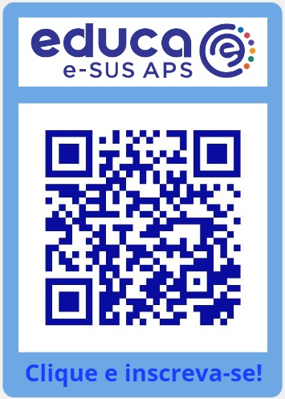

e-SUS Atenção Primária à Saúde
{: .fs-10 }
{: .fw-700 }
{: .text-center }
 
 
e-SUS VACINAÇÃO
{: .fs-8 }
{: .text-center }
MANUAL DE USO
{: .fs-8 }
{: .text-center }
 
 
(versão 3.0)
{: .fs-6 }
{: .text-center }
 
 
 
 
 
 
 
 
 
 
 
 
 
 

{: .nota }
Você conhece o ["Educa e-SUS APS"](https://educaesusaps.medicina.ufmg.br/) Uma parceria do Ministério da Saúde e UFMG na oferta nacional de cursos gratuitos de educação permanente para a APS, contextualizada no sistema e-SUS APS. Aproveite e confira agora mesmo!

