<head>
    
</head>

## Sumário
{: .no_toc .text-delta }
- TOC
{:toc}

# Capítulo 1 - Introdução

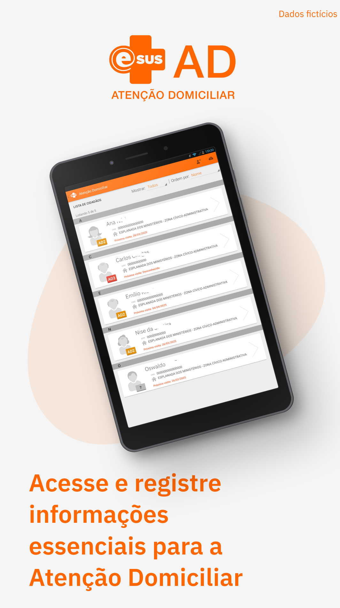

O e-SUS AD tem como objetivo otimizar o registro dos atendimentos e o acompanhamento da saúde de pacientes em Atenção Domiciliar. A ferramenta permite o cadastro de cidadãos, avaliações de elegibilidade e registro de atendimentos domiciliares. Seu propósito é registrar informações clínicas que serão integradas ao Prontuário Eletrônico do Cidadão (PEC), além de coletar dados de produção das Equipes Multiprofissionais de Atenção Domiciliar (EMAD) e das Equipes Multiprofissionais de Apoio (EMAP).

Com isso, busca-se qualificar o trabalho das equipes ao oferecer uma ferramenta móvel e eletrônica, permitindo o registro das informações diretamente no local do atendimento, de forma ágil e com menor risco de perda de dados. Seu uso é exclusivo nos Serviços de Atenção Domiciliar (Melhor em Casa) do Sistema Único de Saúde (SUS).

Neste capítulo, vamos expor de forma prática os conceitos e as diretrizes para o uso do Aplicativo e-SUS Atenção Domiciliar.

Este manual foi elaborado usando como referência o Aplicativo e-SUS Atenção Domiciliar em sua versão atual. O acesso às informações sobre a versão do aplicativo, bem como as alterações realizadas nesta e nas versões anteriores, podem ser visualizadas na opção Sobre, acessada no menu principal do aplicativo.

O aplicativo e-SUS Atenção Domiciliar foi elaborado para utilização em dispositivos do tipo tablet, levando em conta aspectos relacionados ao conforto, à segurança e à usabilidade da ferramenta dentro do processo de trabalho dos profissionais de saúde. 

Sua experiência de uso poderá contribuir para que o aplicativo e-SUS Atenção Domiciliar APS dialoguem cada vez mais com a sua prática profissional. Caso tenha dúvidas, ou necessite de orientações, poderá utilizar o [Canal de suporte](https://esusaps.freshdesk.com/).

# Capítulo 2 - Instalação

Neste capítulo serão abordados os passos para a instalação do aplicativo. 

## 2.1 Instalação 

Para utilizar o aplicativo no tablet, é necessário ter concluído instalação do PEC no computador, pois ele funcionará por meio de sincronização. Para qualquer profissional logar no sistema do aplicativo, é necessário ter usuário e senha criados no PEC, além de ter sido lotado em uma Emad (veja nas configurações do PEC). 

A instalação do Aplicativo e-SUS Território se dá pelo fluxo padrão de instalação de aplicativos para Android na *Google Play Store*. Para instalá-lo no dispositivo móvel basta seguir o passos:

1.  Acesse a página do aplicativo e-SUS AD na *Google Play Store*;

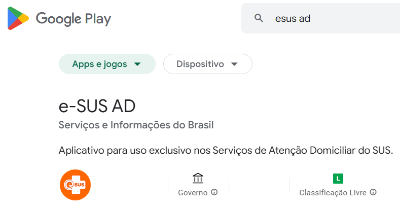

2.  Ou busque pelo aplicativo "e-SUS AD" por meio do aplicativo Google Play Store no seu dispositivo Android.    

3.  Clique em instalar e aguarde a conclusão do processo de instalação.

4.  Após finalizado, o dispositivo irá notificar a conclusão da instalação.

## 2.2 Requisitos Mínimos

Requisitos mínimos para a funcionalidade, uso e instalação do aplicativo:  

- Tela touch screen – sensíveis ao toque.  

- Sistema Android 4.0.3 – Ice Cream Sandwich ou superior.  

- Tablet de 10 polegadas.  

- Resolução: 1.280 x 800 pixels.  

- Acesso à rede Wi-Fi ou acesso à internet (3G) para sincronização*.  

- O aplicativo foi desenvolvido para uso em tablets. O uso em telas menores poderá causar distorções na interface, gerando erros ou não apresentação de todas as informações. 

*Também é possível a sincronização via cabo USB, entretanto é desejável a sincronização por rede sem fio (Wi-Fi) ou internet (3G). 

## 2.3 Configurações Mínimas para a sincronização

É importante, antes de sincronizar os dados, realizar as verificações abaixo no computador:  

- Firewall: deixar desativado.  

- Proxy: verificar se as regras contidas no proxy permitem a sincronização do aplicativo.  

- Confirmar se o endereço (URL*) de sincronização está acessível ao tablet. Para testar a conexão do tablet com o link, basta digitar o endereço (URL) no navegador (p. ex. Google Chrome, Firefox) do tablet e verificar se abrirá a tela do PEC. 

{: .nota }
A URL, no caso de rede interna, é composta da seguinte forma: http:// + IP da máquina em que está a instalação do PEC + :8080/esus 

Para identificar o IP da máquina: 

1) Digitar CMD na barra de pesquisa do menu “Iniciar” e clicar no “Enter”. 
2) Dentro do Prompt (janela preta), digitar “ipconfig” e clicar no “Enter”. 
3) Verificar o número/endereço da linha IPV 4. Este é o IP que deverá ser digitado para compor a URL. A URL, no caso de rede externa, corresponde ao link (endereço no navegador) da instalação do PEC com a qual será feita a sincronização. 

## 2.4 Atualização das versões

Previamente a uma atualização, deve-se: 

- Fazer a sincronização, de modo a enviar todos os dados do tablet para o PEC.
- Verificar se o seu dispositivo está configurado com a hora e a data corretas e, se for preciso, corrigir. 
- Verificar se a carga da bateria do seu dispositivo é suficiente. Se estiver com pouca carga, carregar a bateria antes de iniciar a atualização.
- Verificar o espaço disponível no tablet. Se necessário, remover alguns aplicativos ou outros itens grandes. 

# Capítulo 3 - Como utilizar o Aplicativo

Neste capítulo serão abordados os passos para a utilização do aplicativo com a qualificação dos dados inseridos.

## 3.1 Realizando o login pela primeira vez

Primeiramente faça o login com o seu CPF e senha, a mesma que é utilizada para acessar o PEC.

A tela inicial aparecerá logo após a instalação do aplicativo. A partir dela, é feita a sincronização dos dados do tablet com o computador no qual ficarão guardados os registros de prontuário. 

Todas as vezes que for realizado o login, aparecerá a mensagem de quantos dias fazem desde a última sincronização e se deseja sincronizar.

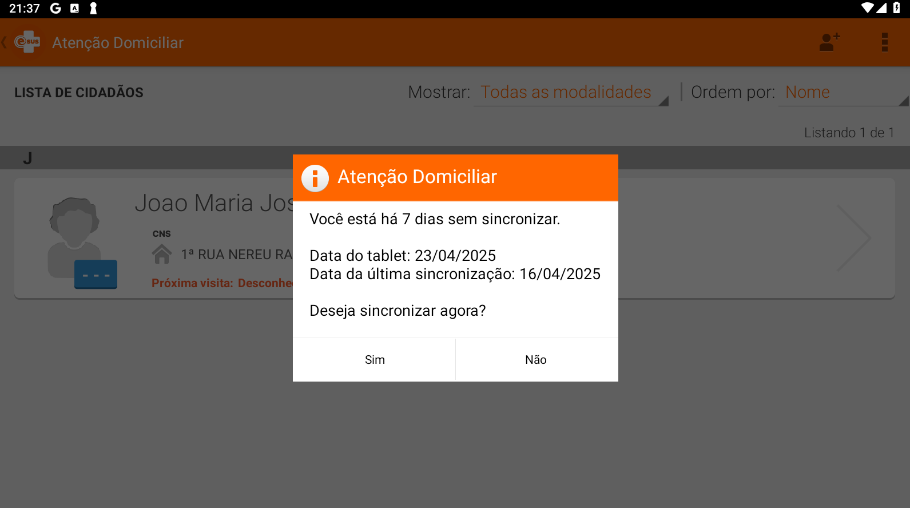

Para dar seguimento à sincronização, proceda da seguinte forma:

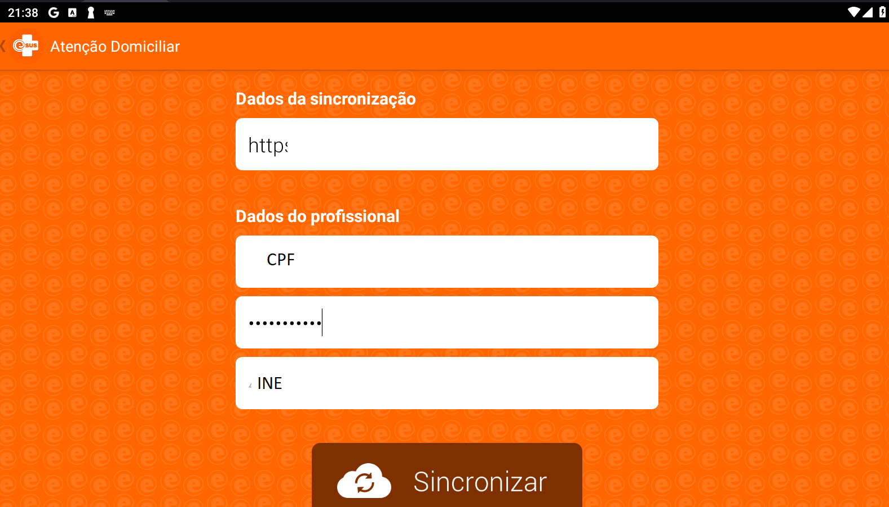

- **Campo de dados de sincronização:** digita-se o caminho (a URL da instalação PEC) com o qual ele irá realizar a conexão para a sincronização de dados com o Prontuário Eletrônico do Cidadão, em que ficarão consolidadas as informações sobre o atendimento do cidadão.   

- **Campo de dados do usuário (profissional):** no campo “Usuário”, colocar o número do CPF do profissional, a senha (a mesma definida no PEC) e o número do INE da equipe.
 Qualquer profissional lotado em uma Emad ou Emap, desde que seguidos os passos descritos aqui, poderá utilizar o aplicativo no tablet, fazendo login com seu usuário e senha. O mesmo tablet poderá ser utilizado por mais de um profissional, com o uso de senha e login individuais.  

- **Botão de sincronizar:** toque em “sincronizar” para iniciar a transferência das informações entre o tablet e o computador. Serão transferidas as informações referentes a todos os profissionais da equipe, bem como todos os cidadãos que estão cadastrados nela. Aparecerá uma barra de progresso de transferência dos dados. Abaixo da opção “Sincronizar”, aparecerá a data da última sincronização realizada. Aperte novamente no botão de sincronizar caso a sincronização não seja completa ou apareça mensagem de erro ao final da sincronização.  

Aparecerá o aviso de que está recebendo profissionais conforme imagem abaixo:

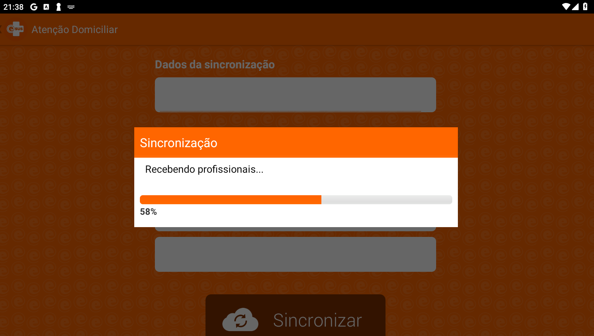

Ao concluir será sinalizado pelo aplicativo:

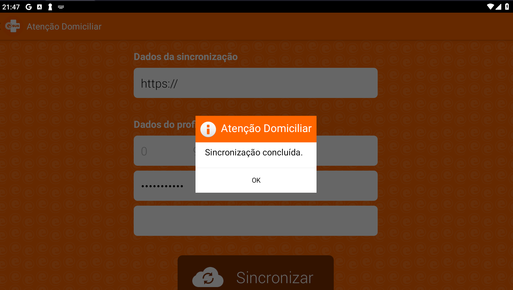

Depois de realizado o primeiro login (no qual será informada a URL do servidor com o qual ele irá realizar a conexão para a sincronização de dados com o Prontuário Eletrônico do Cidadão), esta será a tela para realização de login a cada nova entrada no sistema. Digitar login e senha para entrar. 

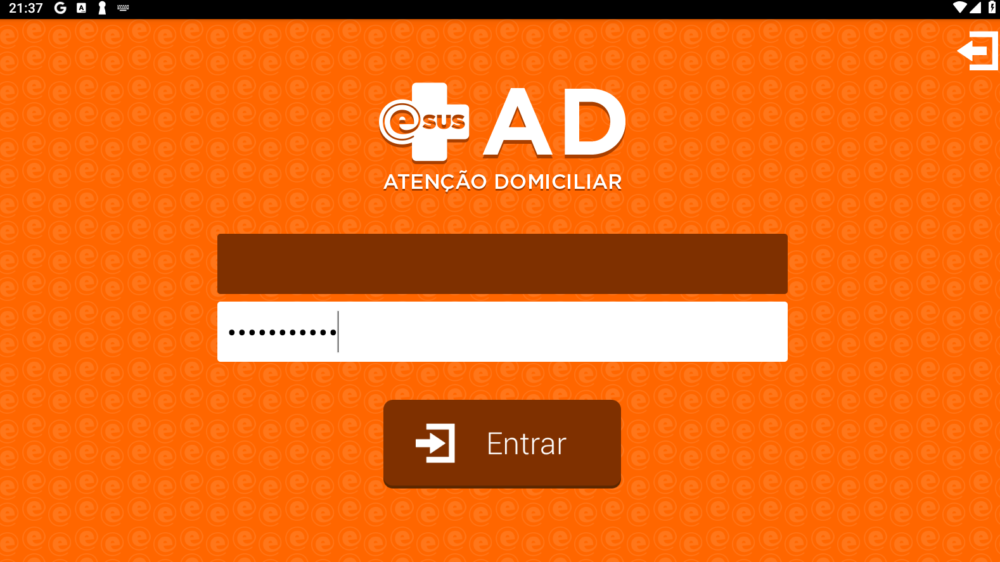

{: .nota }
A sincronização deve ser realizada sempre que houver oportunidade a fim de se evitar risco de perda de informações.  

O tablet não poderá ser utilizado ao mesmo tempo por mais de uma equipe. Caso seja necessário modificar o INE da equipe, é imprescindível fazer a sincronização dos dados antes, pois o aplicativo mantém registros vinculados a um INE apenas. 

## 3.2 Tela de lista de cidadãos

 Contém os cidadãos já cadastrados na unidade de saúde, com os respectivos prontuários, oriundos do banco de dados do PEC durante a sincronização. Ao clicar no cidadão, é possível entrar na aba de dados (cadastro), histórico e atendimento. 

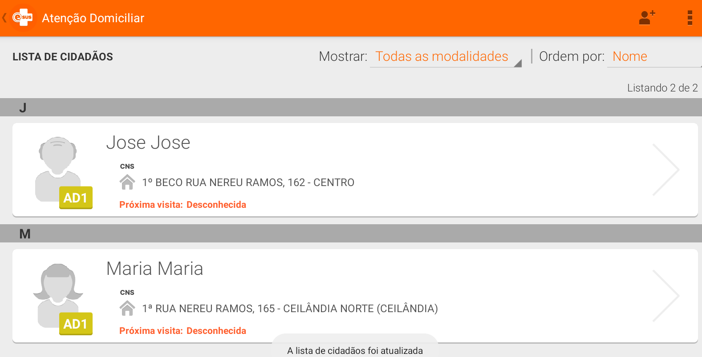

Nesta aba é possível selecionar filtros ou organizadores da visualização dos cidadãos cadastrados.  

**Mostrar:** mostre todos os cidadãos ou apenas os de determinada modalidade. 

**Ordem por:** ordene os cidadãos por nome ou data da próxima visita.  

**Ícones do canto superior direito da tela:**

 No ícone  é possível cadastrar/adicionar novo cidadão.

 No ícone  é possível selecionar, sincronizar ou sobre. 

Tela ícone *Sobre*

 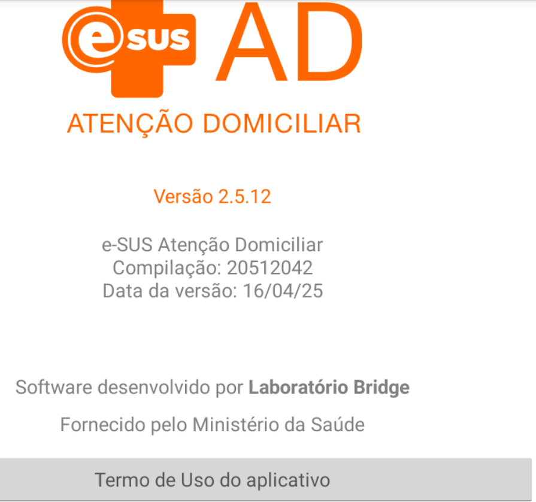
 Fonte: SAPS/MS.

**Adicionar novo cidadão**

Para adicionar novo cidadão na lista, deverá selecionar o ícone supracitado.

Esta tela é destinada para o cadastro de novos usuários que serão atendidos pelas equipes de **Atenção Domiciliar**. O cadastro é equivalente ao realizado no PEC, ou seja, os cidadãos em atendimento devem ser cadastrados no PEC ou no aplicativo, não necessitando cadastro nos dois sistemas. Observe que os campos obrigatórios estão sinalizados com um círculo laranja.

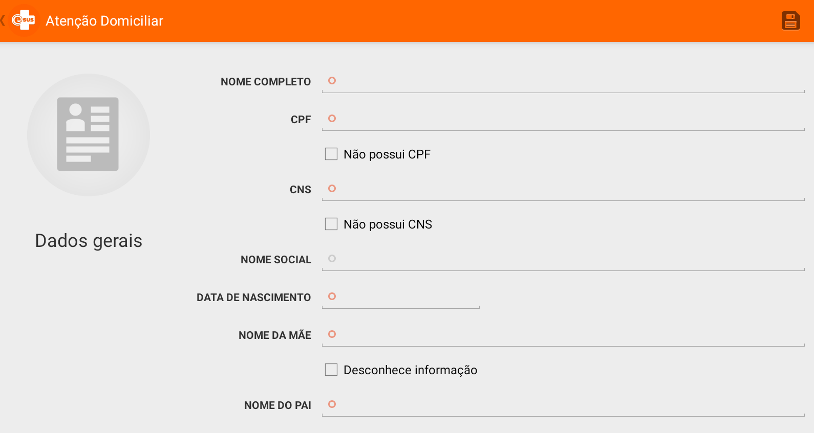
Fonte: SAPS/MS.

Os campos obrigatórios para cadastro são: “Nome completo”, “Data de nascimento”, “Nome da mãe”, “Sexo”, “Município de nascimento”, “Estado de município”, “Raça/cor”. Os campos "Nome da mãe", "Município de nascimento" e "Estado de nascimento" são obrigatórios, no entanto, se o usuário selecionar a opção "Desconhece a informação" a respeito do nome da mãe, ele deixará de ser obrigatório; ou, se o cidadão for declarado como estrangeiro, os campos de município e estado também deixarão de ser obrigatórios. Caso o campo “Raça/cor” seja preenchido com valor "Indígena", o sistema habilitará um campo de lista "Etnia". 

Para concluir o cadastro, clicar no botão *“Salvar”* (imagem ícone salvar). No canto superior direito, o sistema salvará os dados e voltará para a tela anterior. Caso houver alguma inconsistência, será mostrada mensagem na tela indicando os campos que deverão ser preenchidos e/ou corrigidos. 

**ATENÇÃO!** Esta versão acrescenta três importantes aspectos no cadastro do cidadão: 

I) o nome social – se o cidadão possuir um nome social cadastrado, na lista de cidadãos e no prontuário, ele será exibido em vez do nome de nascença; 

II) a possibilidade de registrar uma foto para o cidadão utilizando a câmera do tablet ou enviando uma foto salva para a galeria do dispositivo – o sistema deve apresentar mensagem explicando que a foto só poderá ser obtida uma vez que o cidadão tiver consentimento e aceitá-lo; 

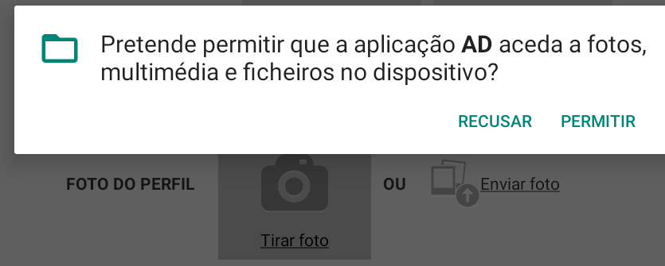

III) a relação do cuidador com o cidadão que está em AD, sendo possível escolher entre os seguintes valores: “não possui”, “cônjuge/companheiro”, “filho(a)/enteado(a)”, “pai/mãe”, “avô/avó”, “neto(a)”, “irmão(ã)”, “outro”. 

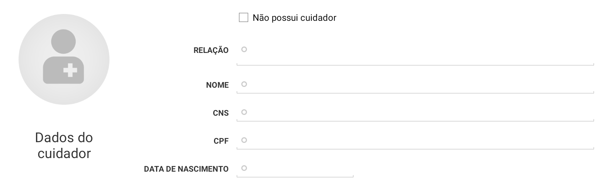
Fonte: SAPS/MS.

{: .nota }
**Atenção:** apenas as Emad podem cadastrar cidadãos em AD. 

## 3.3 Avaliação de Elegibilidade

A avaliação de elegibilidade tem como objetivo definir se o usuário preenche os requisitos mínimos para admissão no Serviço de Atenção Domiciliar, de acordo com as modalidades de Atenção Domiciliar (AD1, AD2 e AD3), as quais se caracterizam pela frequência e intensidade necessária ao cuidado no domicílio.  

Ao acessar a tela de atendimento de um cidadão que não possui atendimento de Atenção Domiciliar registrada, será oferecida a opção de realizar a avaliação de elegibilidade. O texto apresentado será o seguinte: "Deseja realizar avaliação de elegibilidade?", sendo oferecidas as opções "Sim" ou "Não". 

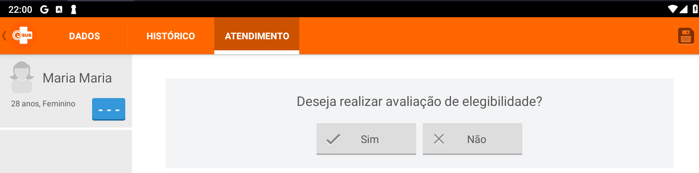
Fonte: SAPS/MS.

Ao clicar em *"Sim"*, serão apresentados os seguintes campos: 

I) “Origem”, que aponta de qual instituição o cidadão veio antes de ser admitido na Emad: “UBS”; “Hospital”; “Unidade de ProntoAtendimento”; “Cacon/Unacon”; “Hospital SOS – Urgência/Emergência”; “Hospital SOS – demais setores”; “Outros”; 

II) “Classificação Internacional de Doenças (CID)”: CID10 principal – campo obrigatório; CID10 secundário 1; CID10 secundário 2. O CID apontado tanto pode ser um já classificado anteriormente quanto um identificado no momento da avaliação e que possivelmente motivará a admissão no SAD; 

III) a tela ainda exibirá o questionário de "Condição(ões) Avaliada(s)", que também vai aparecer no atendimento. 

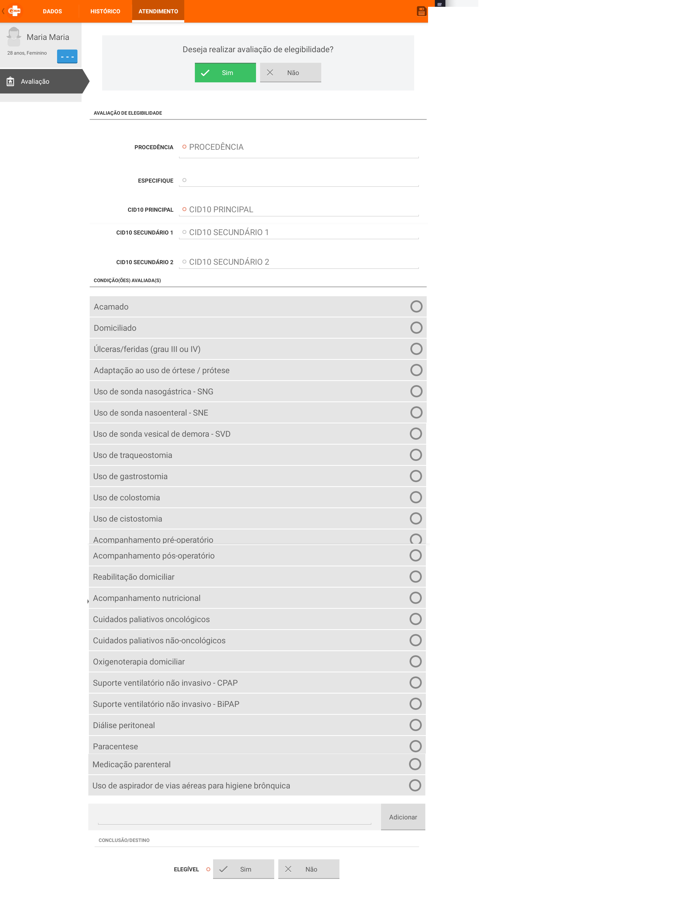
Fonte: SAPS/MS.

**Atenção:** o CID secundário não é obrigatório e deve ser diferente do CID principal. 

O campo "Elegível para Atenção Domiciliar" deve apresentar as opções de "Sim" ou "Não". Quando o usuário escolher a opção "Sim", o sistema verificará se o cidadão possui endereço cadastrado; se não, será apresentada mensagem para que ele possa informá-lo, pois essa é uma informação condicionante para admissão na Emad. Quando o usuário definir que o cidadão é elegível, serão exibidas as seguintes opções (com possibilidade de marcar apenas uma opção): “Admissão na própria Emad,”; “Encaminhado para outra Emad”, “Encaminhado para Atenção Básica (AD1)”; “Outro encaminhamento”. 

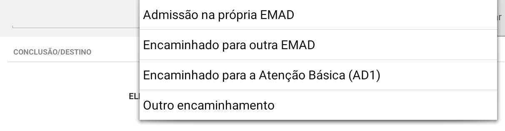
Fonte: SAPS/MS.

**Atenção:** após sincronização com o PEC, apenas os usuários admitidos na própria Emad permanecerão no aplicativo. 

Caso a opção selecionada seja "Admissão na própria Emad", serão apresentadas as opções AD1, AD2 e AD3, de acordo com a complexidade do cuidado domiciliar. 

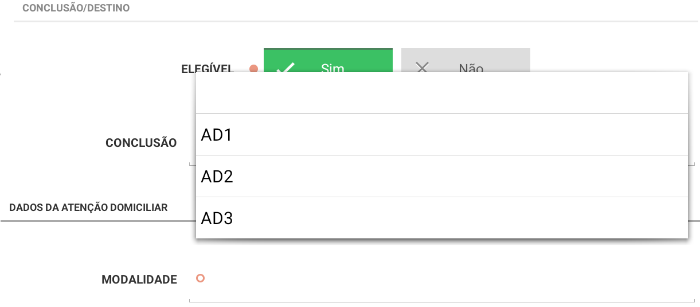
Fonte: SAPS/MS.

Se o campo "Elegível para Atenção Domiciliar" for marcado como "Não", será apresentado o campo “Conclusão” e exibidos os seguintes itens, com possibilidade de marcar múltiplas opções: “Instabilidade clínica com necessidade de monitorização contínua”; “Necessidade de propedêutica complementar, com demanda potencial para realização de vários procedimentos diagnósticos, com urgência”; “Outro motivo clínico”; “Ausência de cuidador (em casos com necessidades)”; “Outras condições sociais e/ou famil. impeditivas do cuidado domiciliar”. 

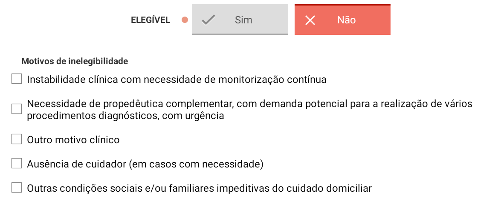
Fonte: SAPS/MS.

Depois que o aplicativo for sincronizado, a avaliação de elegibilidade será apresentada no histórico de atendimentos do cidadão. 

## 3.4 Histórico do Cidadão

Esta tela é composta pelo histórico dos atendimentos em Atenção Domiciliar, durante um mesmo período de admissão na equipe, contendo os dados do profissional que atendeu, registros escritos e procedimentos. Caso o usuário tenha alta e seja admitido novamente, o histórico completo deverá ser acessado por meio do PEC. 

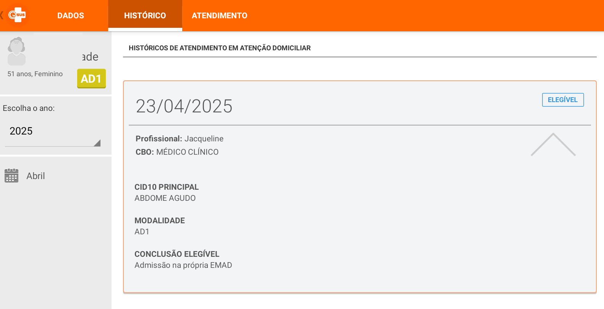
Fonte: SAPS/MS.

## 3.5 Atendimento

Na aba Atendimento, é possível visualizar os dados do cidadão bem como os dados do atendimento, as condições avaliadas e dados do SOAP, os quais serão descritos abaixo.

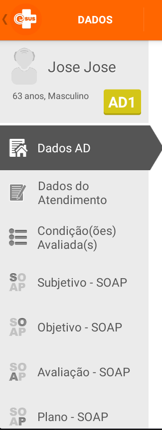

Fonte: SAPS/MS.

Tela para o registro dos atendimentos ao cidadão. Observe que os campos **obrigatórios** estão sinalizados com círculo laranja. Campo "Data de admissão", "Modalidade", "Proveniência",“CID10 principal” são de preenchimento obrigatório. 

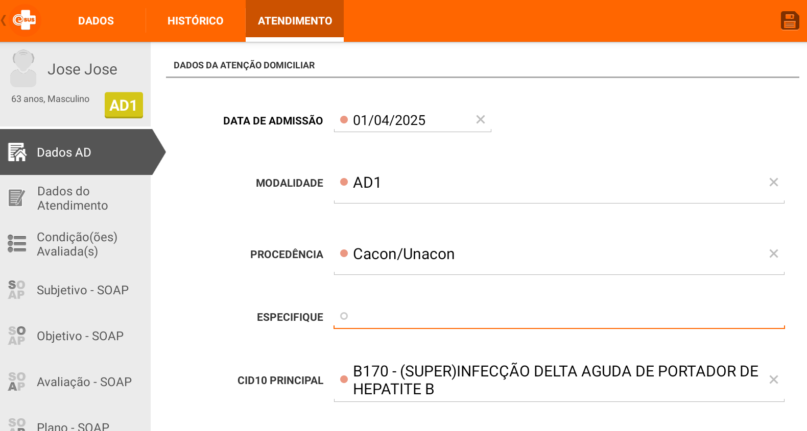

Fonte: SAPS/MS.

**Dados AD** 

São os dados de admissão do cidadão no SAD. 

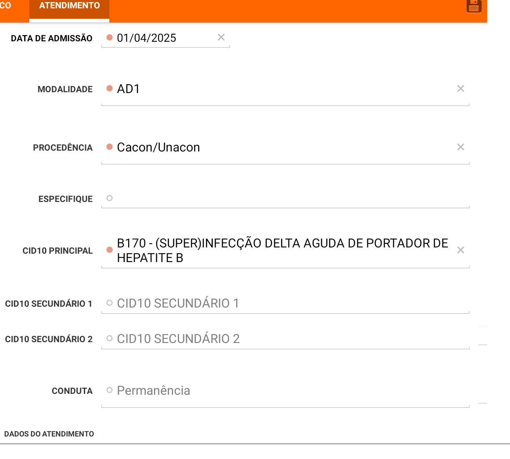

Data de admissão: preencher com a data em que o cidadão foi admitido no SAD.  

Modalidade: preencher com a modalidade do cidadão em acompanhamento pelo SAD. 

Procedência: escolher o serviço que encaminhou o cidadão.

Especifique: registrar o nome do estabelecimento que encaminhou o cidadão.  

CID principal: selecionar a patologia/lesão/situação de saúde que motivou a admissão do cidadão em AD, utilizando a Classificação Internacional de Doenças, versão 10, CID 10.  

CID secundário 1 e 2: selecionar outra(s) patologia(s)/lesão(ões)/situação(ões) de saúde apresentadas pelo cidadão em acompanhamento.  

Conduta: este campo estará marcado inicialmente como permanência, porém, ao clicar nele, outras opções surgirão, como mostra a figura abaixo. 

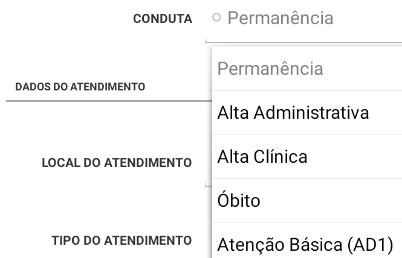

Esta versão (2.0) acrescenta o “acompanhamento pós-óbito” aos já existentes na versão anterior, que são: "Alta clínica", "Alta administrativa", "Encaminhamento para Atenção Básica (AD1)", "Internação hospitalar", "Urgência/emergência", "Saída por óbito”. Após sincronização, o nome do cidadão será removido do aplicativo exceto quando a conduta for “Permanência” ou “Acompanhamento pós-óbito”. No caso de saída do SAD sem que exista previsão de acompanhamento pós-óbito, este campo não deverá ser selecionado, sendo marcado apenas o desfecho de “Saída por óbito”.  

Caso o profissional logado seja o médico, ao selecionar o campo “Acompanhamento pós-óbito”, o aplicativo automaticamente irá marcar o CID10 com o valor Z63.4 "Desaparecimento ou falecimento de um membro da família"; se for outro profissional, o campo “CIAP2” da avaliação deverá ser preenchido com o valor Z23 "Perda/falecimento de familiar". O procedimento 03.01.05.010-4 – VISITA DOMICILIAR PÓS-ÓBITO será registrado no mesmo atendimento  

Atenção: o campo “Conduta” deverá ser utilizado mesmo nas situações em que o cidadão tiver retorno provável ao SAD, por exemplo, após internação hospitalar. No momento de retorno do cidadão ao SAD, ele deve ser readmitido, sendo que seus dados de cadastro já estarão disponíveis no PEC, bastando preencher novamente os dados de admissão. 

**Dados do Atendimento**

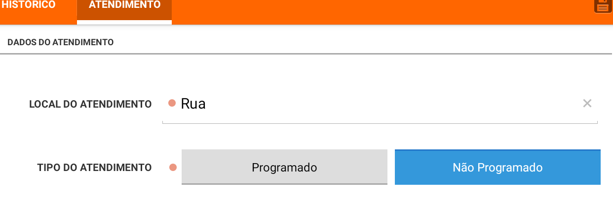

Preencher com o local e o tipo do atendimento realizado, conforme descrição abaixo:  

Programado: escolher este campo caso o atendimento tenha sido programado previamente.  

Não programado: escolher este campo caso o atendimento tenha sido realizado em função de demanda do usuário/cuidadores, outro serviço ou outros, não tendo sido programado previamente pela equipe. 

**Condições avaliadas** 

Selecionar as condições e/ou procedimentos presentes neste caso. As situações deverão ser marcadas quando ocorrerem e deverão ser desmarcadas quando deixarem de ocorrer. Não devem ser marcadas e desmarcadas situações que tenham ocorrido no passado, mesmo que a equipe tenha ciência desta situação. 

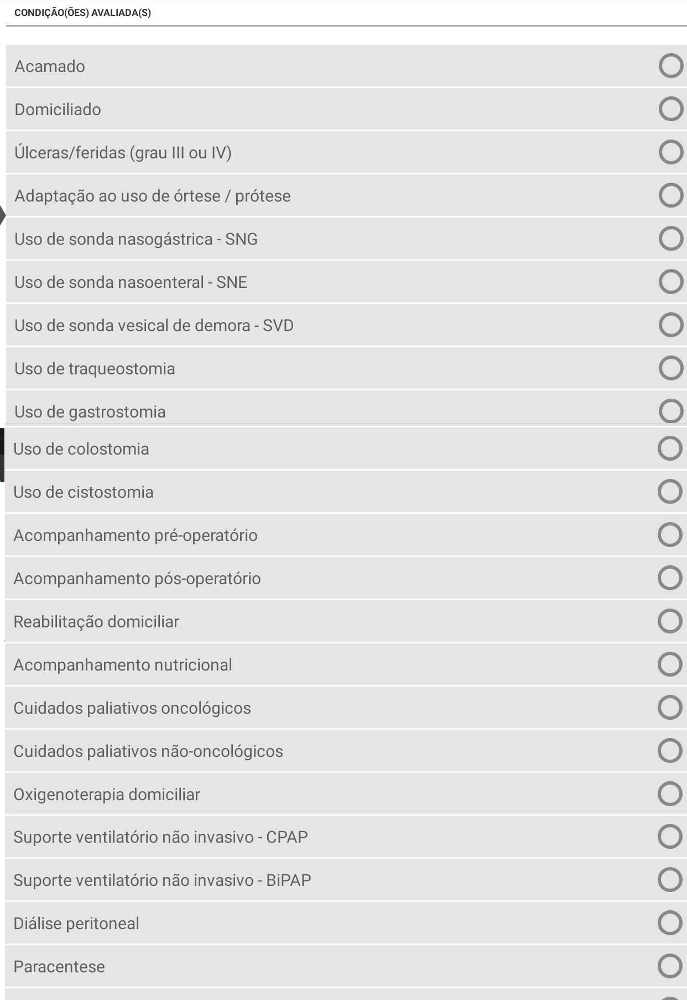

{: .nota }
**Atenção:** o registro serve para facilitar a identificação e as situações frequentes na AD, auxiliando na organização do trabalho da equipe e na análise do público-alvo. Não deve, portanto, substituir o registro de informações na evolução. 

## 3.6 SOAP

As funcionalidades presentes no SOAP dentro do aplicativo, deverão seguir o mesmo padrão de usabilidade que é utilizado dentro do PEC, disponível no capítulo [Atendimento](https://saps-ms.github.io/Manual-eSUS_APS/docs/PEC/PEC_06_atendimentos/#643-soap).

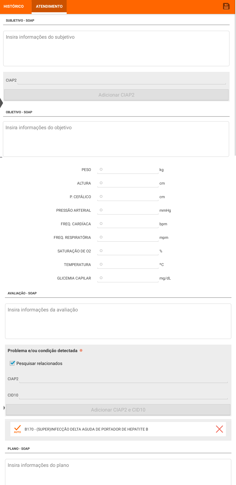

**Ações**

Registrar ações/procedimentos realizados.

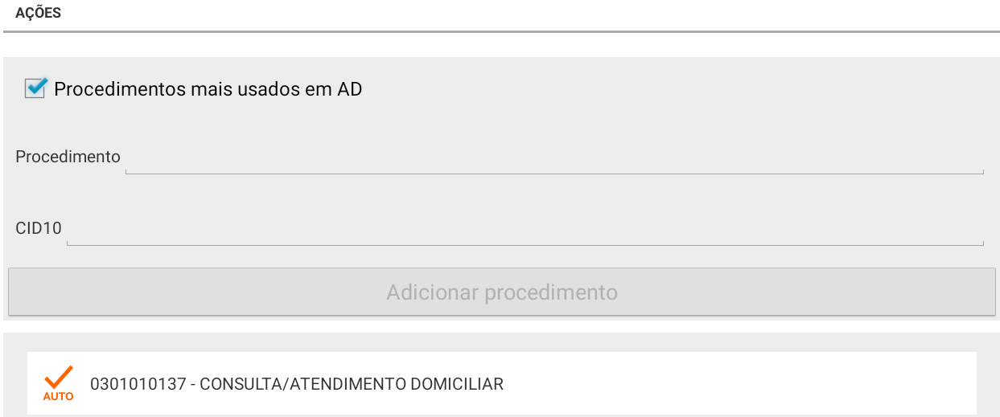

 O campo está preparado para busca pelo nome do procedimento a partir das primeiras letras digitadas. É possível deixar todos os procedimentos do Sistema de Gerenciamento da Tabela de Procedimentos, Medicamentos e OPM do SUS (Sigtap) – filtrados apenas pelo CBO – ou apenas os mais frequentes em Atenção Domiciliar, por meio de marcação da opção “Mostrar apenas procedimentos mais frequentes”.  

Observar que é necessário clicar em “Adicionar procedimento” para salvar o procedimento selecionado. 

## 3.7 Concluindo o atendimento

Para concluir o atendimento, clicar no botão **“Salvar”** . No canto superior direito, o sistema salvará os dados e voltará para a tela anterior.

 Caso haja alguma inconsistência, será mostrada mensagem na tela indicando os campos que deverão ser preenchidos e/ou corrigidos. Após a realização do atendimento e sincronização, é possível imprimir o resumo do atendimento (veja orientações no Capítulo 3, item 4, deste guia), que pode ser utilizado para compor o prontuário domiciliar. 

