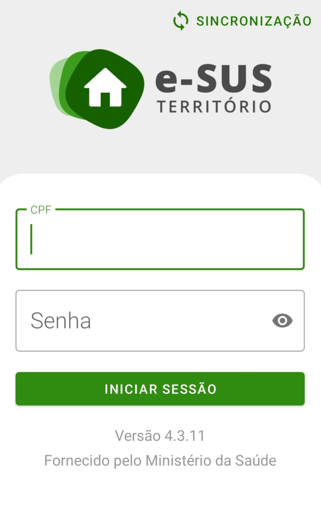
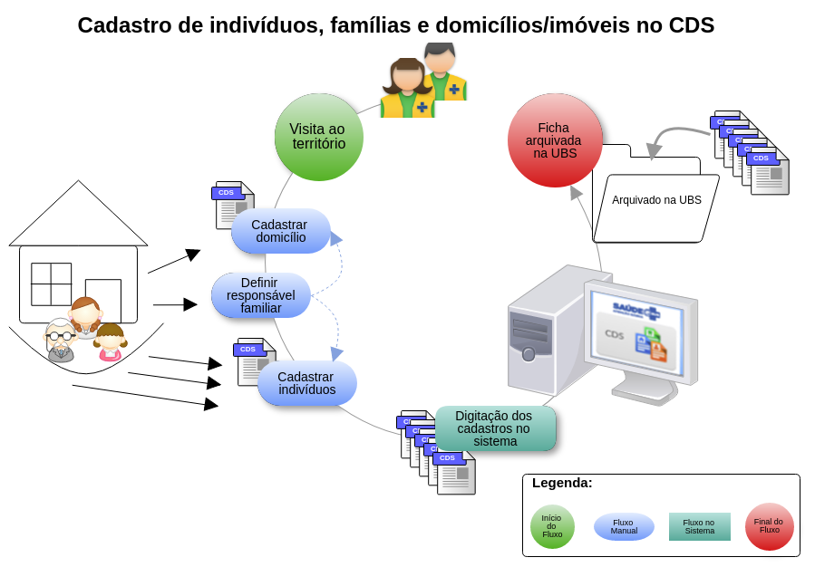
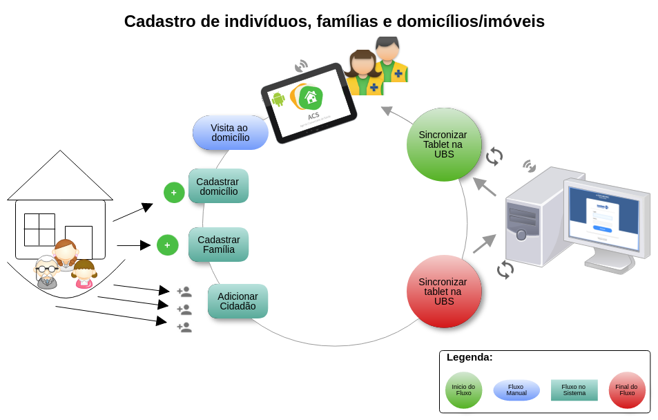

# Capítulo 1 - Introdução
{: .no_toc }

## Sumário
{: .no_toc .text-delta }

- TOC
{:toc}

Neste capítulo você encontra uma breve contextualização sobre a Estratégia e-SUS APS, o processo de trabalho dos técnicos e agentes no contexto desta aplicação e as orientações iniciais para utilização do Aplicativo e-SUS Território.

{:.atencao}
A Portaria SAPS/MS Nº 31, de 14 de maio de 2024 altera a Portaria de Consolidação SAPS/MS Nº 1, de 02 de junho de 2021, para incluir o CBO 3222-55 - Técnico em Agente Comunitário de Saúde. 

A estratégia e-SUS Atenção Primária à Saúde (e-SUS APS) é uma estratégia para reestruturar as informações da Atenção Primária em nível nacional. Nessa perspectiva, foram incluídos na estratégia e-SUS APS aplicativos móveis para registro das ações realizadas pelos profissionais de saúde em locais de difícil manejo de computadores ou notebooks. O desenvolvimento deste aplicativo é integrado ao Sistema e-SUS APS com Prontuário Eletrônico do Cidadão (PEC) ampliando a capacidade de troca de informações entre a equipe. Nesse contexto, não por acaso, o primeiro aplicativo desenvolvido para APS priorizou os Agentes Comunitários de Saúde (ACS), Agentes de Combate às Endemias (ACE) e os Agentes de Ação Social (AAS) dada a capilaridade das ações desses agentes no território.

O aplicativo e-SUS Território foi desenvolvido para utilização em dispositivos do tipo tablet ou smartphone, levando em consideração aspectos relacionados ao conforto, à segurança e à usabilidade da ferramenta no processo de trabalho dos agentes. 

Sua experiência de uso poderá contribuir para a evolução do aplicativo e-SUS Território e o Sistema e-SUS APS com a finalidade de que estes sistemas dialoguem cada vez mais com a sua prática profissional. O canal para registro de sugestões é o [Pesquisa de Opinião do e-SUS AB - Seção e-SUS Território](http://sisaps.saude.gov.br/pesquisa/). Para relatar problemas no aplicativo, abra um chamado no [Suporte e-SUS APS](http://esusaps.bridge.ufsc.br/pt-BR/support/login).

## 1.1 Versão do Aplicativo Usado neste Manual

Este manual foi elaborado usando como referência o Aplicativo e-SUS Território em sua **versão 4.3.9**. O acesso às informações sobre a versão do aplicativo, bem como as alterações realizadas nesta e nas versões anteriores, podem ser visualizadas na opção **Sobre**, acessada no menu principal do aplicativo

Figura 1.1 -- Versão do Aplicativo e-SUS Território

*Fonte: SAPS/MS.*

## 1.2 A Estratégia e-SUS Atenção Primária à Saúde (e-SUS APS)

A Secretaria de Atenção Primária à Saúde (SAPS) assumiu o compromisso de reestruturar o Sistema de Informação da Atenção Básica (SIAB), substituído pelo Sistema de Informação em Saúde para a Atenção Básica (SISAB) com o objetivo de melhorar a qualidade da informação em saúde e de otimizar o uso das informações pelos gestores, profissionais de saúde e cidadãos. Essa reestruturação denominada Estratégia e-SUS APS preconiza:

1.  o registro individualizado das informações em saúde, para o acompanhamento dos atendimentos aos cidadãos;

2.  a integração dos diversos sistemas de informação oficiais existentes na APS, reduzindo a necessidade de registrar informações similares em mais de um instrumento (fichas/sistemas) ao mesmo tempo;

3.  o desenvolvimento de soluções tecnológicas que contemplem os processos de trabalho da APS, com recomendações de boas práticas e o estímulo à informatização dos serviços de saúde;

4.  a introdução de novas tecnologias para otimizar o trabalho dos profissionais;

5.  a qualificação do uso da informação na gestão e no cuidado em saúde.

## 1.3 SISAB e e-SUS APS

O Sistema de Informação em Saúde para a Atenção Básica (SISAB) é alimentado pelo Sistema e-SUS APS, por meio dos softwares: Sistema com Coleta de Dados Simplificada (CDS), Sistema com Prontuário Eletrônico do Cidadão (PEC), aplicativos móveis para a captação dos dados, ou ainda por sistemas terceiros/próprios que apenas utilizam o Sistema e-SUS APS para transmitir os dados para o SISAB.

Nessa perspectiva, o desenvolvimento do Sistema e-SUS APS passa a priorizar o atendimento realizado pelos profissionais de saúde, e não mais o preenchimento de informações gerenciais e administrativas, as quais devem ser geradas de forma secundária pelo sistema.

## 1.4 Visita Domiciliar

A visita domiciliar, no contexto das ações realizadas pelos profissionais (TACS, ACS, ACE e AAS), foco deste aplicativo, tem como principal objetivo registrar as ações de acompanhamento do usuário que se encontra adscrito no território da equipe da APS. Nesse sentido, quando a visita demandar ações às pessoas específicas de um núcleo familiar, tais como `cadastramento/atualização`, `busca ativa`, `acompanhamento`, `egresso de internação`, `convites para atividades coletivas/campanhas de saúde`, `orientação/prevenção` ou `outros`, deve ser registrada a visita ao cidadão.

{: .nota }
Vale contextualizar que o **conceito de visita domiciliar**, no Sistema e-SUS APS, foi redefinido, considerando apenas as ações em domicílio realizadas pelos agentes de saúde. Para os outros profissionais de saúde, nível médio/técnico e nível superior, as ações realizadas no domicílio são agora definidas como **atendimento no domicílio**.

Desde a utilização do Sistema com CDS, com o registro das informações de forma individualizada, tem sido possível dar visibilidade ao alcance das ações destes agentes no acompanhamento dos cidadãos, sendo possível vincular estes indivíduos a seus núcleos familiares, possibilitando o acompanhamento da família.

## 1.5 Fluxo de Cadastro e Atualização pelo Aplicativo

O fluxo de cadastro e atualização do território, como ilustrado na Figura 1.2, é um processo contínuo que se inicia do primeiro contato da equipe de APS com uma família no território e é atualizado dentro de uma rotina pré-estabelecida pela organização da equipe, sempre buscando manter uma regularidade.

O processo das ações dos agentes de saúde utilizando as **fichas do CDS**, ocorre como segue:

1.  Agente de saúde programa uma visita no domicílio ou território em conjunto com a equipe:

    a.  se é um domicílio/família/terreno já cadastrado, o agente irá buscar as fichas arquivadas na UBS para serem atualizadas;

    b.  caso seja um novo domicílio/família/terreno, novas fichas de registro serão iniciadas.

2.  Ao visitar o domicílio as seguintes etapas são executadas:

    a.  Identificação do Responsável familiar no domicílio;

    b.  Registrar novo cadastro ou atualização do Domicílio, por meio do Cadastro Domiciliar e Territorial;

    c.  Registrar novo cadastro ou atualização dos cidadãos, por meio do Cadastro Individual.

3.  Após finalizada a visita, o agente retorna à UBS para digitação das fichas de cadastro

Figura 1.2 - Fluxo de Cadastro/Atualização usando CDS

*Fonte: SAPS/MS*.

Na mesma perspectiva, porém utilizando o **aplicativo e-SUS Território**, conforme ilustração da Figura 1.3, o processo ocorre como segue:

1.  Agente de saúde sincroniza o aplicativo instalado no tablet ou smartphone com servidor do PEC

2.  Ao visitar o domicílio as seguintes etapas são executadas:

    a.  Registrar novo ou atualizar cadastro do imóvel, por meio do aplicativo;

    b.  Registrar nova ou atualizar família;

    c.  Registrar novo ou atualizar cadastro dos cidadãos, por meio do Cadastro Individual

3.  Após finalizada a visita, o agente retorna à UBS e realiza nova sincronização com o servidor.

Figura 1.3 - Fluxo de Atualização usando aplicativo e-SUS Território

*Fonte: SAPS/MS.*

Observando o fluxo de cadastro e atualização das famílias e do território, conforme ilustrado na Figura 1.2, em comparação ao novo fluxo adequado ao uso do aplicativo e-SUS Território, ilustrado na Figura 1.3, percebemos uma melhor otimização e simplificação do processo ao qual podemos citar algumas vantagens:

1.  Eliminação das fichas de papel (Cadastro de imóvel e Cadastro Individual);

2.  Eliminação do processo auxiliar de digitação do cadastro e do retrabalho, considerando o uso do CDS;

3.  Redução do risco de erro de digitação; 

4.  Redução no armazenamento de fichas de papel dentro da UBS;

5.  Diminuição do tempo de compartilhamento de informação com o restante da equipe;

6.  Redução no tempo de cadastramento e atualização dos cadastros da população no território.
