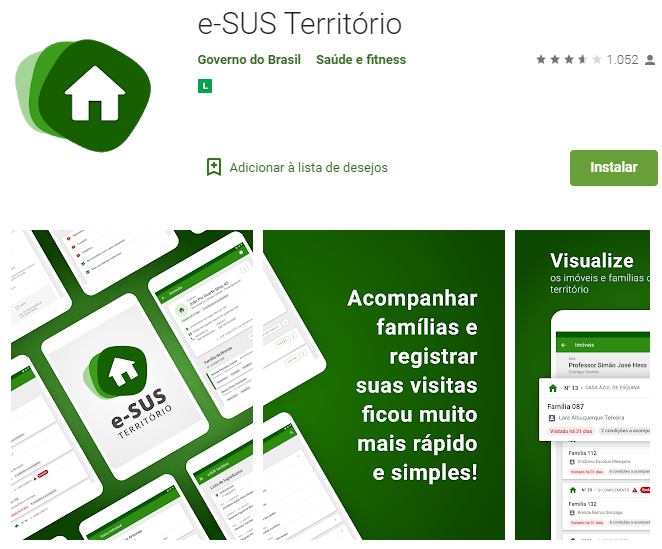
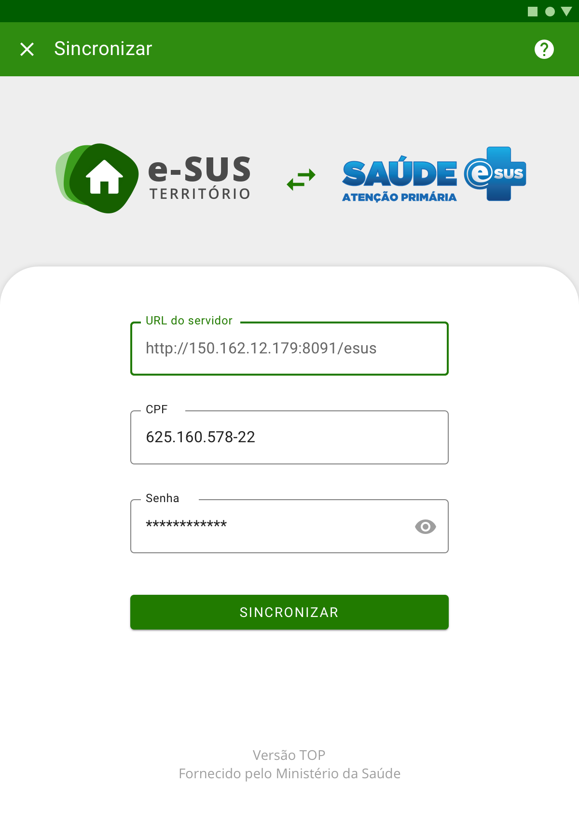
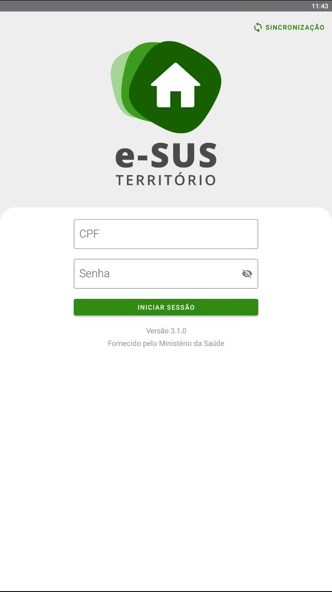

# Capítulo 2 - Instalação e Sincronização
{: .no_toc }

## Sumário
{: .no_toc .text-delta }

- TOC
{:toc}

Neste capítulo abordaremos algumas questões sobre instalação e as etapas necessárias para o primeiro acesso ao aplicativo.

## 2.1 Instalação

A instalação do Aplicativo e-SUS Território se dá pelo fluxo padrão de instalação de aplicativos para Android na *Google Play Store*. Para instalá-lo no dispositivo móvel basta seguir o passos:

1.  Acesse a página do aplicativo [e-SUS Território](https://play.google.com/store/apps/details?id=br.gov.saude.acs) na *Google Play Store*;

2.  Ou busque pelo aplicativo "e-SUS Território" por meio do aplicativo Google Play Store no seu dispositivo Android.    

Figura 2.1 - App no no Google Play Store

*Fonte: Google Play Store*

3.  Clique em  e aguarde a conclusão do processo de instalação.

4.  Após finalizado o dispositivo irá notificar a conclusão da instalação.

## 2.2 Requisitos Mínimos

Para um bom funcionamento do aplicativo, fique atento aos requisitos mínimos do dispositivo:

- **Sistema Operacional**
 - Android versão 5 ou superior
- **Memória RAM**
 - Mínimo de 1GB (um gigabyte)
- **Tela**
  - Multitoque
  - Tablets
   - Tamanho mínimo de 07 (sete) polegadas
 - Smartphones
    - Tamanho mínimo de 05 (cinco) polegadas
- **Armazenamento**
 - Capacidade mínima de 16 GB (dezesseis gigabytes) de armazenamento interno.
- **Conectividade**
 - Wi-Fi padrão IEEE 802.11 b/g/n, integrado (interno) ao equipamento;
 - Sistema de GPS integrado (interno).
- **Funcionalidades**
 - Permitir a mudança da orientação da tela e o bloqueio da posição.

## 2.3 Primeiro Acesso ao Aplicativo

Durante o primeiro acesso, o profissional de saúde deve realizar a sincronização do aplicativo com a instalação do Sistema e-SUS APS PEC da sua UBS. Para tanto, algumas questões devem ser observadas:

1)  Deve haver uma instalação do Sistema e-SUS APS com PEC compatível com a versão do aplicativo e-SUS Território;

2)  O profissional que fará uso do aplicativo deve estar cadastrado no sistema e-SUS APS com PEC;

3)  Deve haver uma rede local, sem fio (wireless), com acesso à instalação do e-SUS APS PEC para que seja possível fazer a sincronização do sistema com o aplicativo;

## 2.4 Sincronização

A sincronização permite que os dados da equipe que utilizará o aplicativo, bem como os dados de cadastro do território previamente processados no PEC, quando houverem, sejam transmitidos para o aplicativo, de modo a permitir que o agente de saúde desenvolva ações, tanto de novos cadastros, como de atualizações ou visitas domiciliares de famílias já cadastradas.

A tela de sincronização, conforme podemos ver na Figura 2.1, apresenta três campos de preenchimento obrigatório:

-   **Endereço do servidor**: deverá ser informado o endereço eletrônico do servidor onde o Sistema e-SUS APS com PEC está instalado na qual o aplicativo realizará a sincronização (ex.: `http://www.municipio.esusab.gov.br:8080/esus` ou `http://IP_Computador:8080/esus`.

-   **Login**: CPF do agente de saúde (uma vez feita a sincronização com o CPF do agente de saúde esse dado não poderá ser alterado, a menos que todos os dados do aplicativo sejam apagados nas configurações dos aplicativos instalados no dispositivo).

-   **Senha**: a mesma senha cadastrada no PEC que fará a sincronização com o aplicativo.

Figura 2.2 - Tela de sincronização app e-SUS APS Território.

*Fonte: SAS/MS*

É importante lembrar que o processo de sincronização depende de conectividade entre o tablet/smartphone e a instalação PEC do e-SUS APS, seja por rede local Wi-Fi, seja via internet. Verifique com a gestão do seu município as orientações para esta configuração.  

Após a confirmação de sucesso na primeira sincronização, caso haja cadastros na base, estes são carregados no tablet/smartphone. É importante sempre manter as bases sincronizadas para garantir a integridade das bases de dados entre o tablet/smartphone e o PEC. Recomenda-se que a sincronização seja feita ao menos uma vez por dia.

{: .atencao }
Durante a sincronização o PEC envia apenas cadastros do território consistentes em relação aos vínculos entre responsável familiar, domicílio e logradouro. Caso alguns cadastros não sejam sincronizados em nenhuma das direções é necessário resolver estas inconsistências, seja no PEC ou no Aplicativo, para que haja 100% de sucesso neste processo.

## 2.5 Alterar o Servidor de Sincronização

O aplicativo grava o endereço do servidor configurado inicialmente no processo de sincronização, podendo ser modificado futuramente caso seja necessário. No entanto é impossível sincronizar com uma instalação diferente após a sincronização inicial. Para que isso seja possível os dados do aplicativo devem ser apagados manualmente. Para tal, vá até as opções de configuração do seu dispositivo Android e utilize a opção "Limpar dados", presente na sessão "aplicativos", para o aplicativo e-SUS Território. Isso irá remover todos os dados do aplicativo, permitindo então que ele seja sincronizado com outra instalação.

{: .atencao }
Para garantir que nenhum dado seja perdido, faça a sincronização com a aplicação que você estava usando anteriormente.

## 2.6 Autenticação

Nos próximos acessos, o aplicativo mostrará os campos "CPF" e "SENHA", como mostra a Figura 2.3.

Figura 2.3 - Tela de autenticação, app e-SUS Território

Fonte: SAS/MS.

A tela de autenticação apresenta dois campos de preenchimento obrigatório:

-   **CPF**: insira o número de CPF do agente de saúde

-   **Senha**: insira a senha do usuário, a mesma senha cadastrada no PEC o qual foi sincronizado o aplicativo

{: .nota }
A **senha de acesso** para o Aplicativo é a mesma utilizada pelo agente de saúde no PEC.
